# awesome-hajimi
collections of hajimi (哈基米 in Chinese) on the Internet.

## 视频列表 (Video List)

| 视频标题 (Title) | 封面 | 播放量 (Views) | 发布日期 (Date) |
|---|---|---|---|
| [哈基米](https://www.bilibili.com/video/BV16Gsfz1EVA) | 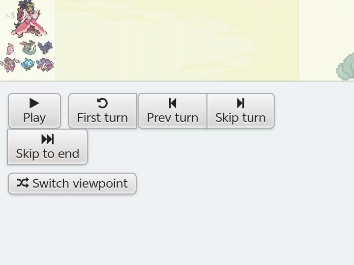 | 0 | 2025-11-03 |
| [原创曲《电音曼波》（哈基米音乐）](https://www.bilibili.com/video/BV1Kw1wBfEzb) |  | 2831 | 2025-11-02 |
| [【哈基朗】《基（=米）》尾杀一小时循环](https://www.bilibili.com/video/BV17vyfBzENN) |  | 501 | 2025-11-02 |
| [这是船新版本的哈基米吗？](https://www.bilibili.com/video/BV17ayfBrE2X) | 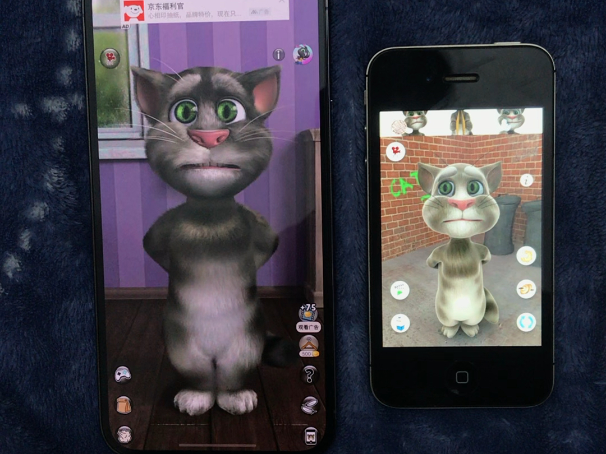 | 113 | 2025-11-02 |
| [哈基米](https://www.bilibili.com/video/BV1yEyfBnEh4) |  | 3709 | 2025-11-02 |
| [白菜看《B站热门哈基米串烧》哈基米哈基 哈牛魔](https://www.bilibili.com/video/BV14RyfBdEaH) |  | 2467 | 2025-11-02 |
| [疯狂的哈基米](https://www.bilibili.com/video/BV1PF1FBpEUM) |  | 9985 | 2025-11-02 |
| [11月20日哈基宗直播](https://www.bilibili.com/video/BV1KZyfB9E5L) | 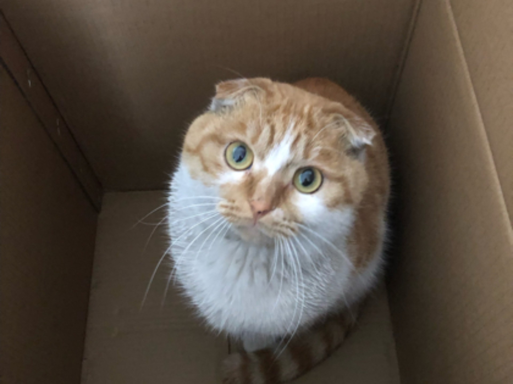 | 100 | 2025-11-02 |
| [日本萝莉看B站热门哈基米串烧，这才是真正的音乐](https://www.bilibili.com/video/BV1NF1FBpEcN) |  | 2628 | 2025-11-02 |
| [广东水库放生哈基米始作俑者发的视频](https://www.bilibili.com/video/BV1LByfBqEq8) | 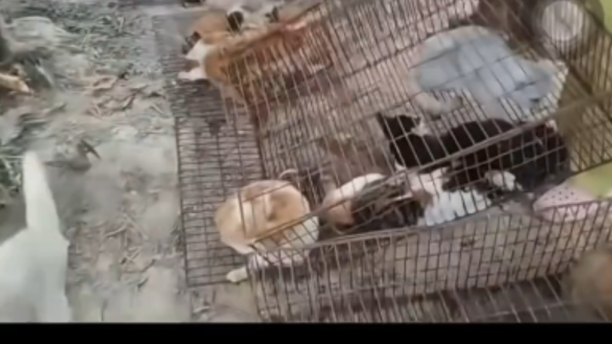 | 1641 | 2025-11-02 |
| [哈基米好像有点不爽](https://www.bilibili.com/video/BV1pP1FBSEXi) |  | 1375 | 2025-11-02 |
| [哈基米南北绿豆TnT](https://www.bilibili.com/video/BV1FV1FBCEAC) | 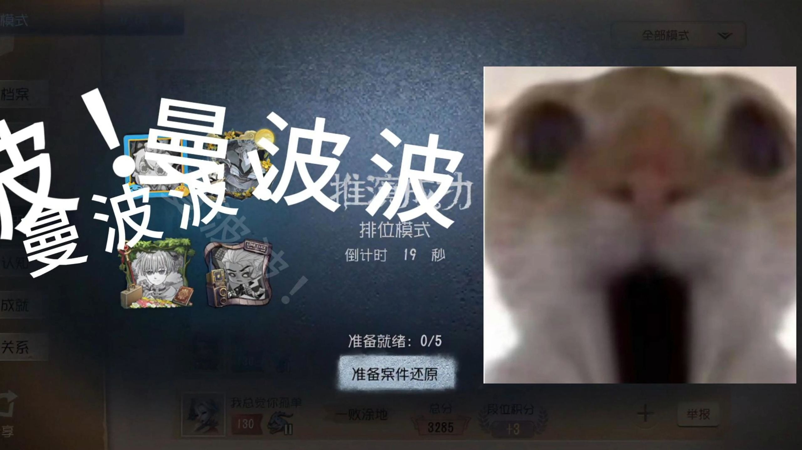 | 1058 | 2025-11-02 |
| [【最适合哈基米的歌找到了】🐱初音未来の消失🐱](https://www.bilibili.com/video/BV1ga1FBhEYr) |  | 179 | 2025-11-02 |
| [奥斯曼不在，我曼波就是无敌的](https://www.bilibili.com/video/BV1mB1FBxEp9) |  | 1155 | 2025-11-02 |
| [玛雅！你蓝做到了！蓝色塑料袋给绿色哈基米秒了？](https://www.bilibili.com/video/BV1SY1FBfEe8) |  | 5713 | 2025-11-02 |
| [找到一只通人性的哈基米的概率不亚于单抽出金](https://www.bilibili.com/video/BV1UY1FBfE3R) | 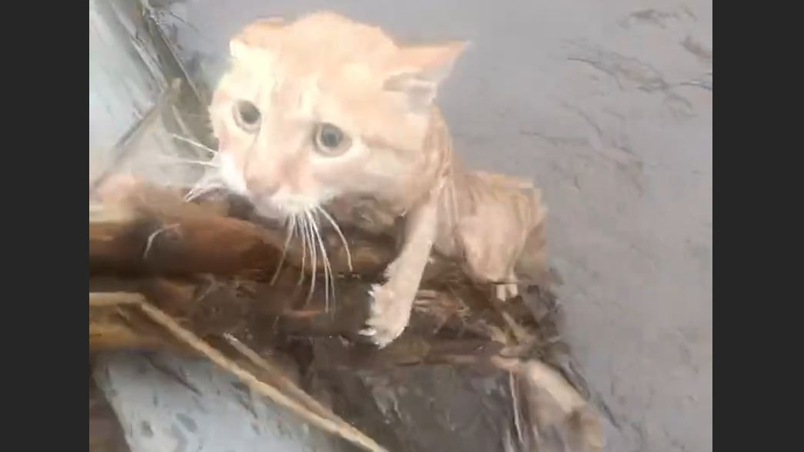 | 7.9万 | 2025-11-02 |
| [【哈基米音乐】基卫](https://www.bilibili.com/video/BV1sdyoB7EiV) |  | 682 | 2025-11-02 |
| [《印度哈基米》｜单曲循环](https://www.bilibili.com/video/BV1XHyZBbEvo) |  | 70 | 2025-11-02 |
| [《哈基米山歌》｜单曲循环](https://www.bilibili.com/video/BV1XHyZBbEBD) | 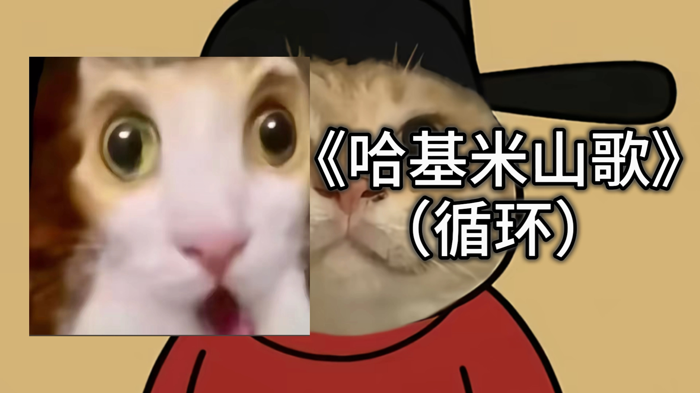 | 162 | 2025-11-02 |
| [《打火机》｜哈基米循环](https://www.bilibili.com/video/BV1XHyZBbExN) |  | 61 | 2025-11-02 |
| [基米这个鬼迷日眼](https://www.bilibili.com/video/BV15nyZBcELB) |  | 3180 | 2025-11-02 |
| [【哈基米】基蛛侠：哈气宇宙《sunflower》](https://www.bilibili.com/video/BV1pAyZBkEg9) |  | 985 | 2025-11-02 |
| [偷个手机全世界都安静了](https://www.bilibili.com/video/BV1BhyoBeE6n) |  | 21.5万 | 2025-11-02 |
| [20块钱的哈基米](https://www.bilibili.com/video/BV17uyZBBEfK) | 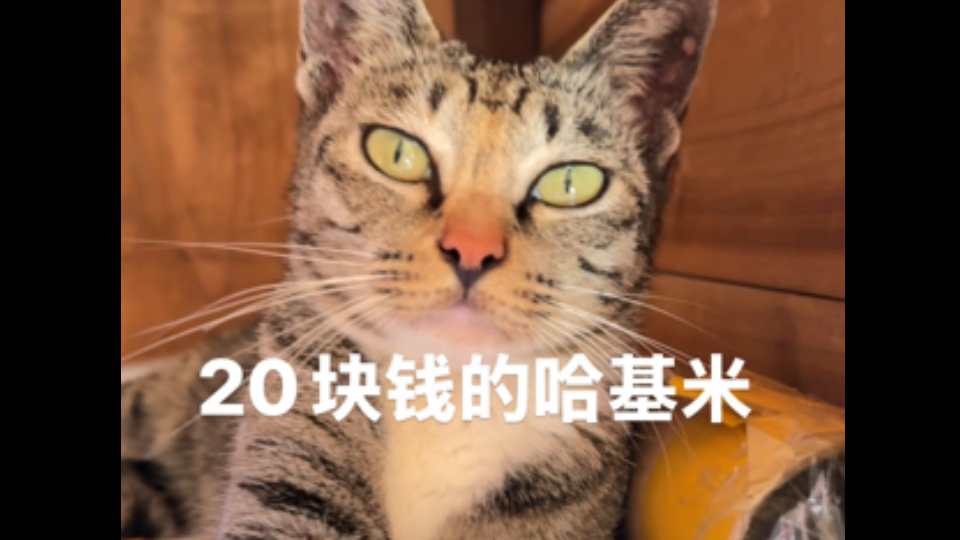 | 9548 | 2025-11-02 |
| [爱猫人士水库放生上千条哈基米，基圈大逃杀2.0来力！](https://www.bilibili.com/video/BV1cKyZB6EjT) |  | 2.7万 | 2025-11-02 |
| [久违的“哈基米”翻唱之《齐 天 大 耄》！](https://www.bilibili.com/video/BV1FMyZBuEKC) |  | 1.2万 | 2025-11-02 |
| [【纯净哈基米】哈基米民歌：哈基米画眉](https://www.bilibili.com/video/BV13nydBpEzo) |  | 658 | 2025-11-02 |
| [自制独立游戏？大狗嚼vs哈基米？](https://www.bilibili.com/video/BV1JPydBPEaK) |  | 2672 | 2025-11-02 |
| [哈基米](https://www.bilibili.com/video/BV1SWydBJEj5) |  | 21 | 2025-11-02 |
| [【哈基米音乐】きらり（闪耀）](https://www.bilibili.com/video/BV128ydBLEMo) |  | 811 | 2025-11-02 |
| [[哈基米×屑猫：宿敌CP向]](https://www.bilibili.com/video/BV1aFyoBREh4) |  | 1.5万 | 2025-11-02 |
| [[pop rock/女的来了] 我爱上了我的兄弟，如同叮咚鸡爱上了哈基米](https://www.bilibili.com/video/BV1BSydBaEn4) |  | 45 | 2025-11-02 |
| [基（=米）](https://www.bilibili.com/video/BV1Ydy9BSE8t) |  | 14.3万 | 2025-11-02 |
| [哈宾](https://www.bilibili.com/video/BV1VA1gBcEEy) |  | 8699 | 2025-11-02 |
| [哈基米](https://www.bilibili.com/video/BV143yoB7EvH) | 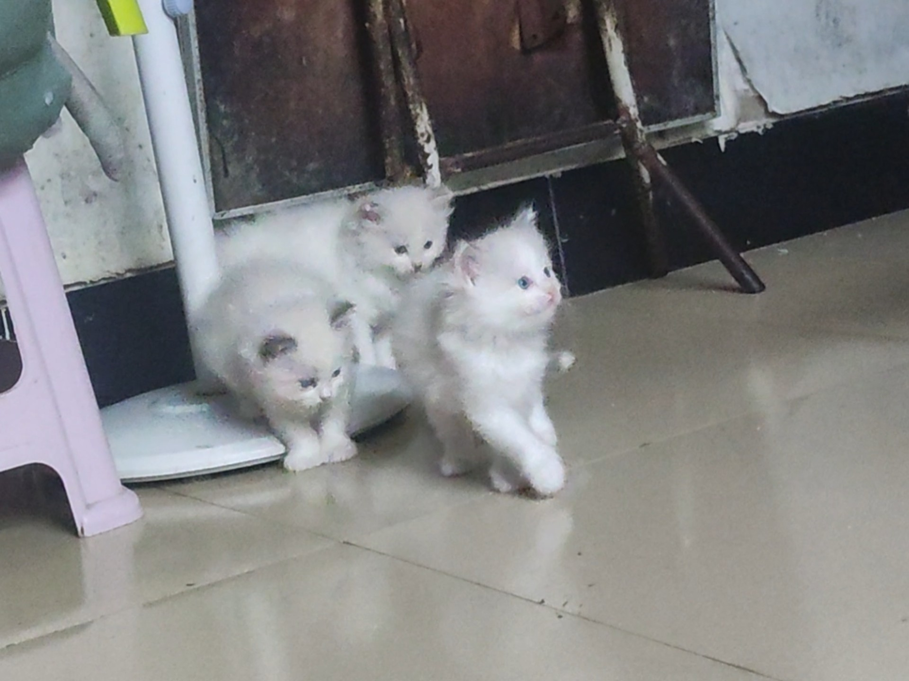 | 207 | 2025-11-02 |
| [不选择逃跑，反而主动接近我吗，哈基米！](https://www.bilibili.com/video/BV143yoB7E3c) | 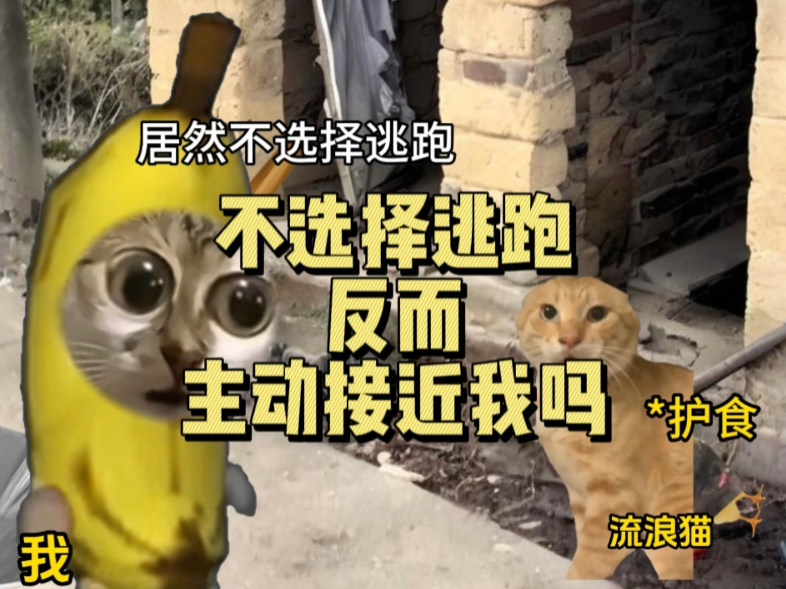 | 5.0万 | 2025-11-02 |
| [做人不要太攀比 我有三只哈基米](https://www.bilibili.com/video/BV1ScyRBjEJB) | 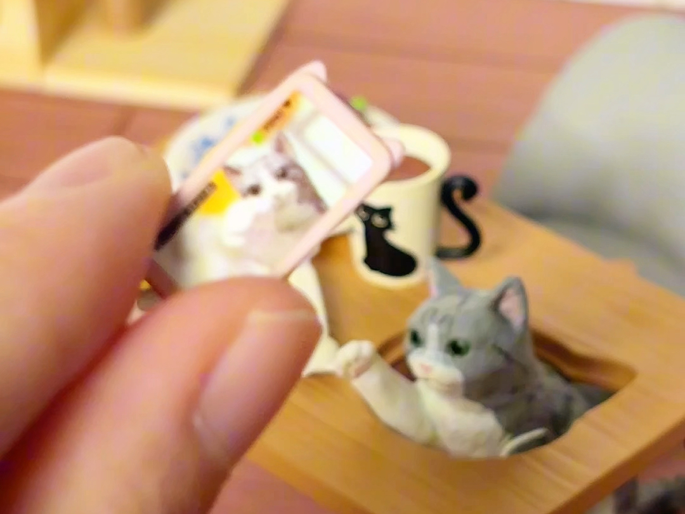 | 157 | 2025-11-02 |
| [【哈基米】[补档二十一次]老蛤[老街]](https://www.bilibili.com/video/BV1R3y9BSETQ) |  | 936 | 2025-11-01 |
| [哈基米](https://www.bilibili.com/video/BV1D7y9B1Epg) | 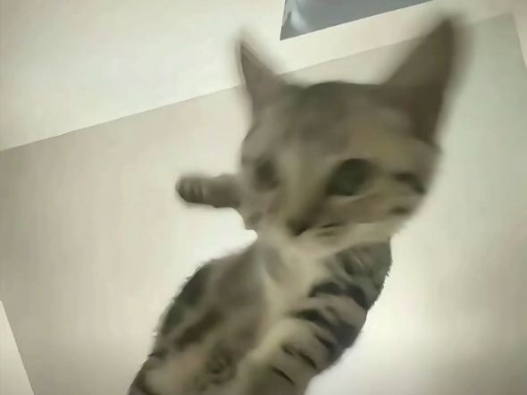 | 231 | 2025-11-01 |
| [【哈基米】哈气世界的基米[崩坏世界的歌姬]](https://www.bilibili.com/video/BV1Fcy9BtEYk) |  | 792 | 2025-11-01 |
| [纯净哈基米之神曼波⚡PASSO BEM SOLTOB♿](https://www.bilibili.com/video/BV1WPyDBZEaZ) |  | 4339 | 2025-11-01 |
| [哈基米之《蓝连哈》](https://www.bilibili.com/video/BV19TyQByEKR) | 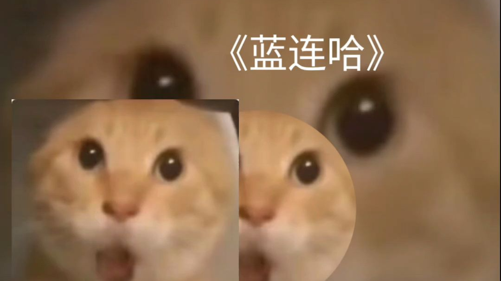 | 173 | 2025-11-01 |
| [鲸鱼彻底被哈基米驯化哎呀，太好听了，简直是天籁之音啊！](https://www.bilibili.com/video/BV1hVyQBrEL8) |  | 3.9万 | 2025-11-01 |
| [落汤基米救救救](https://www.bilibili.com/video/BV1TJyQBqEvi) | 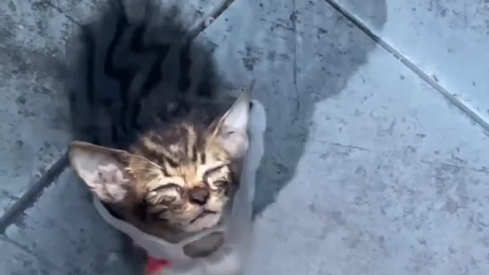 | 1.5万 | 2025-11-01 |
| [哈基米如果全力战斗，哈基虎根本不是对手](https://www.bilibili.com/video/BV1TsyQBPEMz) | 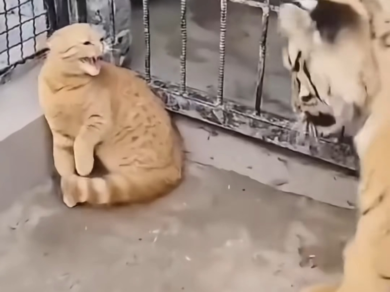 | 2325 | 2025-11-01 |
| [哈基米南北路多](https://www.bilibili.com/video/BV1xm1LBvErM) | 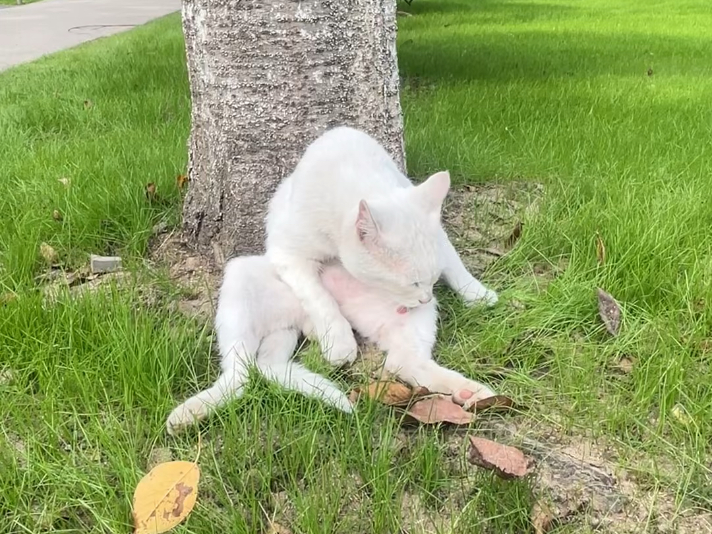 | 202 | 2025-11-01 |
| [哈基米：基米功夫（完整版）](https://www.bilibili.com/video/BV1uB1LBkEUB) | 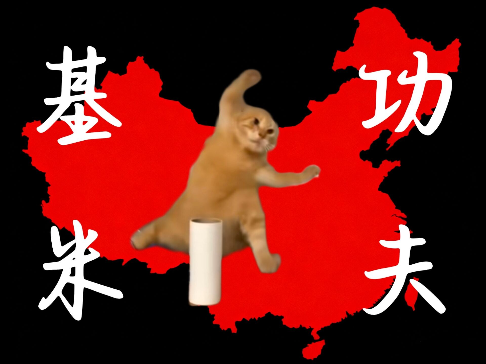 | 2.9万 | 2025-11-01 |
| [花基米【哈基米AI音乐】](https://www.bilibili.com/video/BV1t21LBTEkT) |  | 2255 | 2025-11-01 |
| [哈基米想0721给你看](https://www.bilibili.com/video/BV1tY1uBDEXM) | 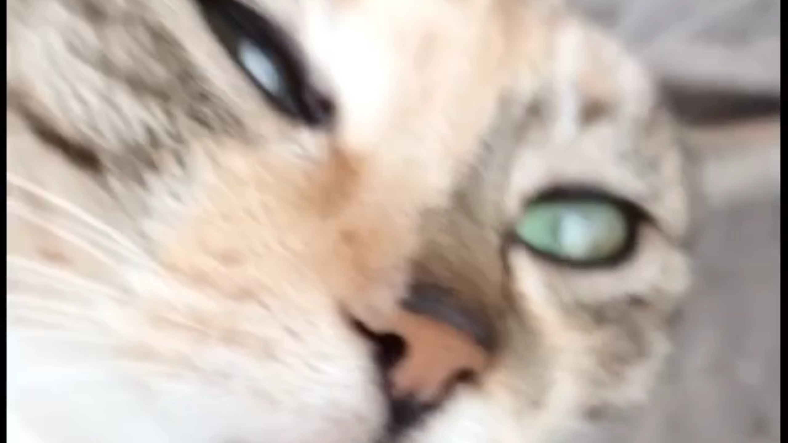 | 3502 | 2025-11-01 |
| [23分钟哈基米音乐纯享](https://www.bilibili.com/video/BV1gH1jBGEbo) |  | 246 | 2025-11-01 |
| [当梵蒂娅来到惊魂夜！矿工:好不容易摆脱礼温，哪来的哈基米啊！](https://www.bilibili.com/video/BV1hH1jBGEpV) |  | 12.5万 | 2025-11-01 |
| [流浪基米没路躲](https://www.bilibili.com/video/BV1tp1jBrEaw) | 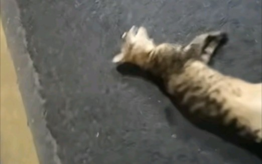 | 3350 | 2025-11-01 |
| [One Last基米](https://www.bilibili.com/video/BV1nF1jB4E8E) |  | 17.7万 | 2025-11-01 |
| [【纯不净哈基米】悬疑の小曲：SCARSONG【恐怖哈基米】](https://www.bilibili.com/video/BV1jT1jBQEbA) |  | 493 | 2025-11-01 |
| [基米小学：“武松”打虎](https://www.bilibili.com/video/BV1F61jBFEoQ) | 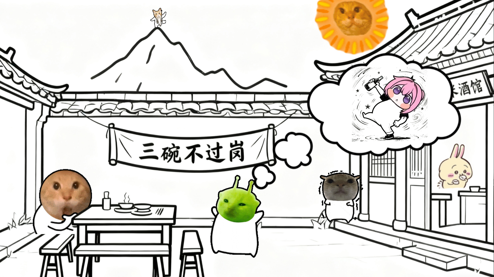 | 3666 | 2025-11-01 |
| [都是好哈基米啊，给哈基米说谢谢了吗🤩](https://www.bilibili.com/video/BV1Tt1jBMEfZ) | 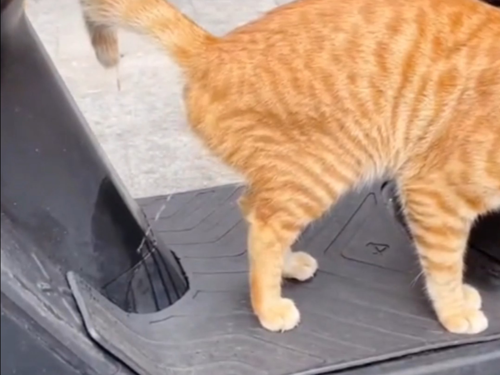 | 1.3万 | 2025-11-01 |
| [【黎明杀机】哈基护出击！鬼影步14分钟混剪集锦](https://www.bilibili.com/video/BV1ts1jBgEHg) | 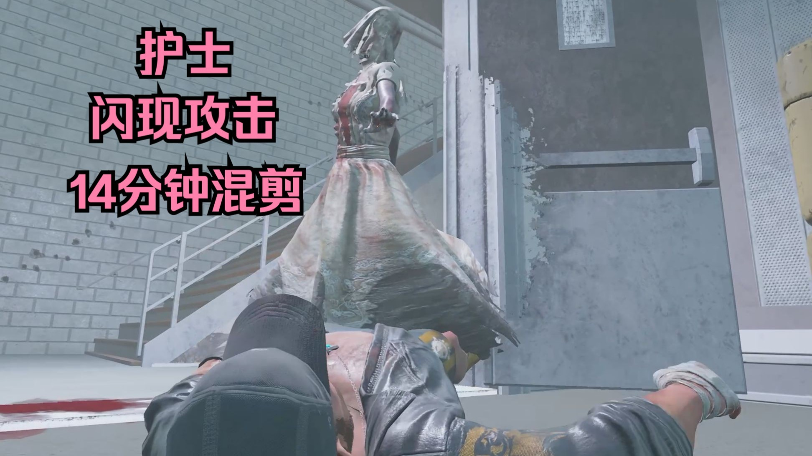 | 547 | 2025-11-01 |
| [哈基米的哈基基起飞咯](https://www.bilibili.com/video/BV12x1jBzEUS) | 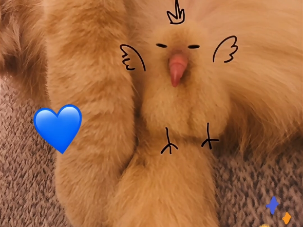 | 60 | 2025-11-01 |
| [哈基米南北绿豆汤🥣一口鲜醇入喉🫙](https://www.bilibili.com/video/BV1LB1MBbEAB) |  | 399 | 2025-11-01 |
| [在猫咪面前放哈基米音乐会怎么样？](https://www.bilibili.com/video/BV14T17BrEBx) | 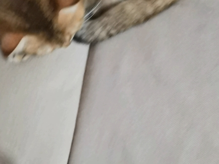 | 151 | 2025-11-01 |
| [外八哈基米过马路](https://www.bilibili.com/video/BV1ce15BxEF6) |  | 544 | 2025-11-01 |
| [【哈基米教学】杰米哥的打投择启蒙（适用于新手宝宝杰米的讲解）](https://www.bilibili.com/video/BV1Mw1LBTExA) |  | 834 | 2025-11-01 |
| [往日种种，叮咚哈基，苦命基米](https://www.bilibili.com/video/BV1Uf15BMEd1) |  | 4996 | 2025-11-01 |
| [《基米说》#哈基米之歌](https://www.bilibili.com/video/BV1dm15B1Ekn) |  | 137 | 2025-11-01 |
| [哈基米偷吃鸽子被抓，还在那里哈气](https://www.bilibili.com/video/BV1X915BrEaC) |  | 3586 | 2025-11-01 |
| [基米说（校园社死现场版）☝️🤓](https://www.bilibili.com/video/BV1P31LBcEZM) |  | 1449 | 2025-11-01 |
| [哈基米的世界](https://www.bilibili.com/video/BV17z1GB5Evk) |  | 221 | 2025-11-01 |
| [哈基米音乐史上最伟大的十大神作，哪一首是你心中的MVP！](https://www.bilibili.com/video/BV1c81GBnE2n) |  | 47.5万 | 2025-11-01 |
| [彻底完了 这下日本人都知道哈气米了 “耄耋”正在反向输出给日本人....](https://www.bilibili.com/video/BV1gT1gBtESW) | 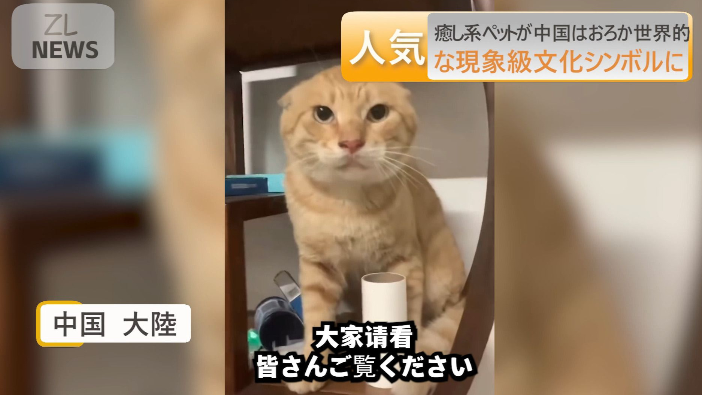 | 7.9万 | 2025-10-31 |
| [哈基米…往日种种…你可还记得…[哈基米史记本纪下预告]](https://www.bilibili.com/video/BV1yo1MBLEjG) |  | 3337 | 2025-10-31 |
| [魔丸坏了怎么办？换掉！](https://www.bilibili.com/video/BV1vm1NBREmH) |  | 63.9万 | 2025-10-31 |
| [【30min纯享】哈基米深度睡眠呼噜声｜软萌猫主子的 “睡眠咒语”，这也太治愈了吧](https://www.bilibili.com/video/BV1A91KB6EUe) | 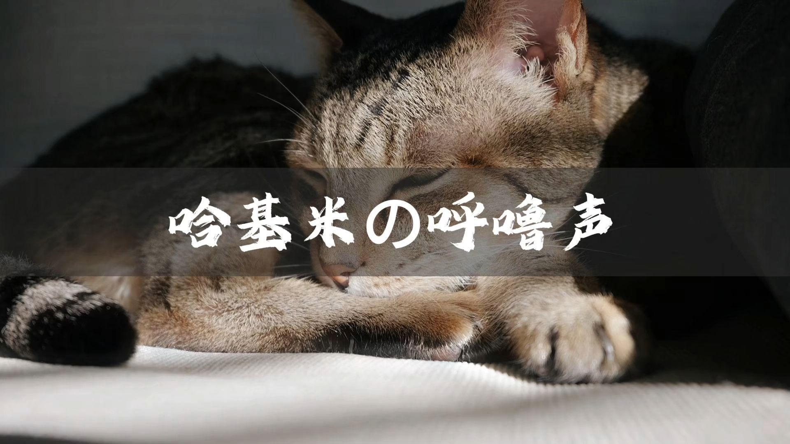 | 99 | 2025-10-31 |
| [《 反 恐 精 咪 》](https://www.bilibili.com/video/BV1zf1PBtEXa) |  | 2.8万 | 2025-10-31 |
| [要论喂药这方面，您还是太权威了。#哈基米 #猫咪 #离谱](https://www.bilibili.com/video/BV1s31PBhEgR) |  | 4.8万 | 2025-10-31 |
| [若不是那ylg，哈基米和叮咚鸡也不失为一对苦命鸳鸯](https://www.bilibili.com/video/BV1sByvBJER4) |  | 4875 | 2025-10-31 |
| [小猫：谁给我键位改了？](https://www.bilibili.com/video/BV1Q1yiBYE8i) |  | 19.6万 | 2025-10-31 |
| [善良圆头](https://www.bilibili.com/video/BV1AEyeB5EXJ) | 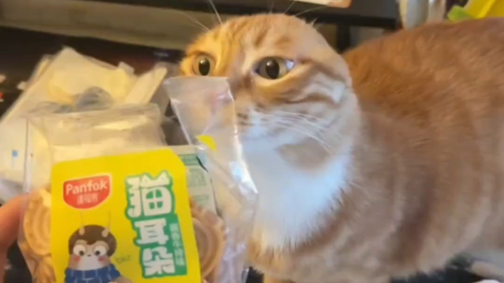 | 2692 | 2025-10-30 |
| [【哈基TV】三基战布鲁斯](https://www.bilibili.com/video/BV1N2y8BzEET) |  | 3806 | 2025-10-30 |
| [春晚惊现哈基米南北绿豆](https://www.bilibili.com/video/BV1gey8BmERq) |  | 307 | 2025-10-30 |
| [🐱欧马吉利 Lose Control🐱](https://www.bilibili.com/video/BV1fGyxBLEaD) |  | 37.7万 | 2025-10-30 |
| [毫无违和感！银狼cv撸猫时还会唱哈基米](https://www.bilibili.com/video/BV1a3ybBCENT) |  | 1.6万 | 2025-10-30 |
| [赛马娘声优演唱哈基米！](https://www.bilibili.com/video/BV1Pgy8BPEb9) |  | 50.3万 | 2025-10-30 |
| [☝😡疼~！⚡⚡⚡](https://www.bilibili.com/video/BV1BYymB3EAy) |  | 25.2万 | 2025-10-29 |
| [没人能拒绝，哈基米Nobody！！！](https://www.bilibili.com/video/BV1bgsyzDEoq) |  | 655 | 2025-10-28 |
| [爵士好猫合集，哈基米会撒娇，这谁受得了？](https://www.bilibili.com/video/BV1oHsSzmE52) |  | 2.6万 | 2025-10-27 |
| [3秒钟教你发出哈基米的声音【一个正儿八经的教程】](https://www.bilibili.com/video/BV1x4sDzPENk) |  | 1203 | 2025-10-27 |
| [神曼波引起的争吵](https://www.bilibili.com/video/BV15GsDzyE6E) |  | 6418 | 2025-10-27 |
| [sora2生成的哈基米激情朗读](https://www.bilibili.com/video/BV1LdxPzQEgN) | 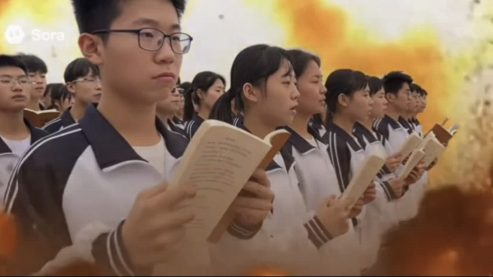 | 1.6万 | 2025-10-26 |
| [⚡ 咪 渡 山 歌 ⚡](https://www.bilibili.com/video/BV1SUsHzxEbf) | 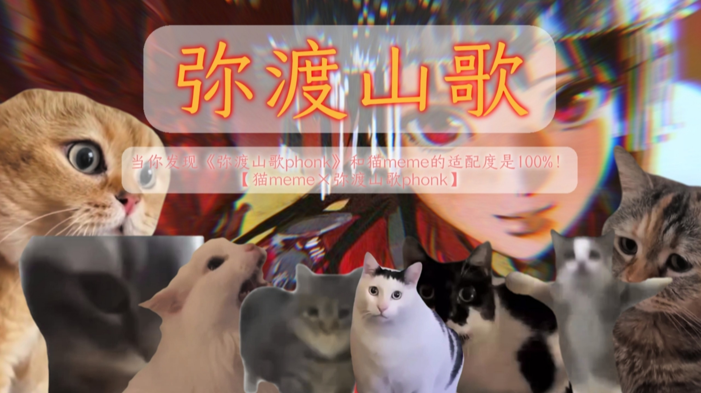 | 6.6万 | 2025-10-25 |
| [【南登加奈瑠】南登猫猫头看《神曼波》这可太厉害了](https://www.bilibili.com/video/BV1vas7zQEq8) |  | 3.2万 | 2025-10-24 |
| [哈基米：你瞅啥？](https://www.bilibili.com/video/BV1TosGzFE6H) | 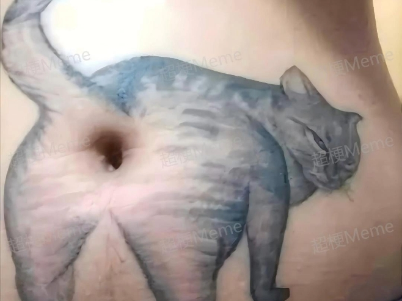 | 115 | 2025-10-23 |
| [叽里咕噜说什么呢](https://www.bilibili.com/video/BV1E7sBzQEQm) |  | 134.9万 | 2025-10-23 |
| [sora2生成的绝世豪猫，阴成什么样了！](https://www.bilibili.com/video/BV1bWWdzmEMG) |  | 1.8万 | 2025-10-21 |
| [“哈 基 米 南 美 里 多 阿 西 噶 阿 西”](https://www.bilibili.com/video/BV1Q6prz1EfZ) |  | 9.8万 | 2025-09-15 |
| [跳楼机哈基米版？](https://www.bilibili.com/video/BV1KbYVz2EFd) |  | 12.6万 | 2025-09-07 |
| [哈基米：我这纸醉金迷的一生](https://www.bilibili.com/video/BV1vGaazjEZX) | 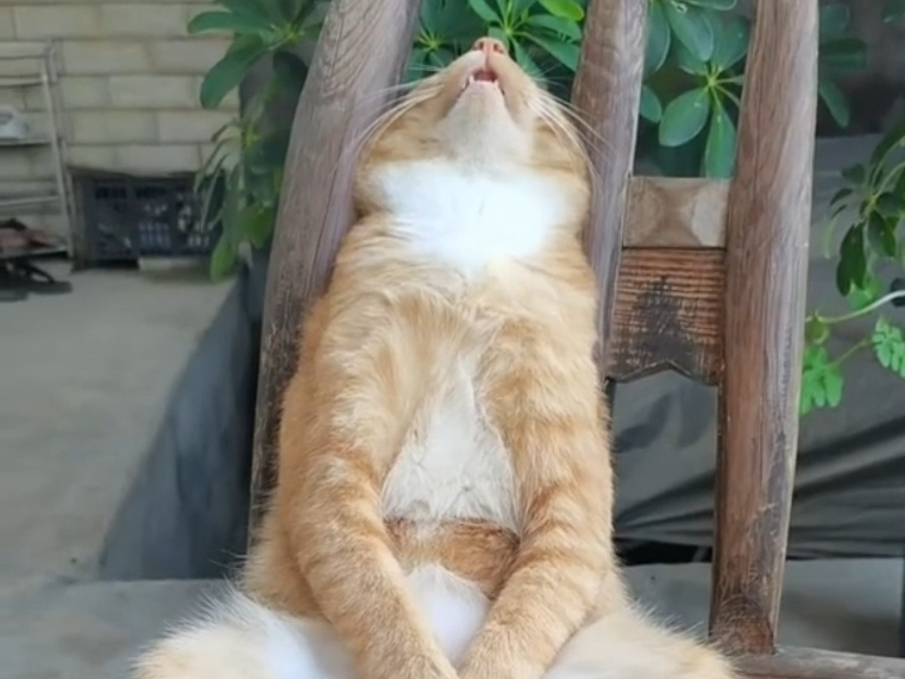 | 94.8万 | 2025-09-05 |
| [【哈基ミク】いますぐ哈气/即刻哈气（完整版）](https://www.bilibili.com/video/BV1T3t6zLEqr) |  | 16.7万 | 2025-08-07 |
| [那一天的基米哈了起来！](https://www.bilibili.com/video/BV1JDTozcEHz) | 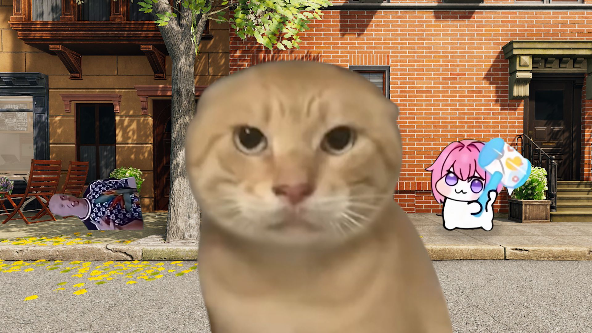 | 55.8万 | 2025-06-12 |
| [哈基癫](https://www.bilibili.com/video/BV1zjzaYfEAu) | 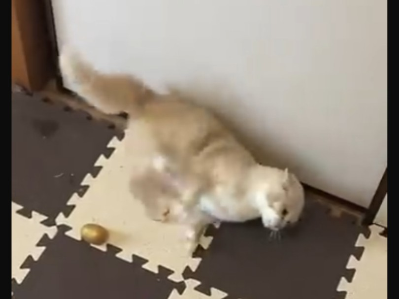 | 53.1万 | 2024-11-28 |
| [哈基米](https://www.bilibili.com/video/BV1yV411V7Hm) | 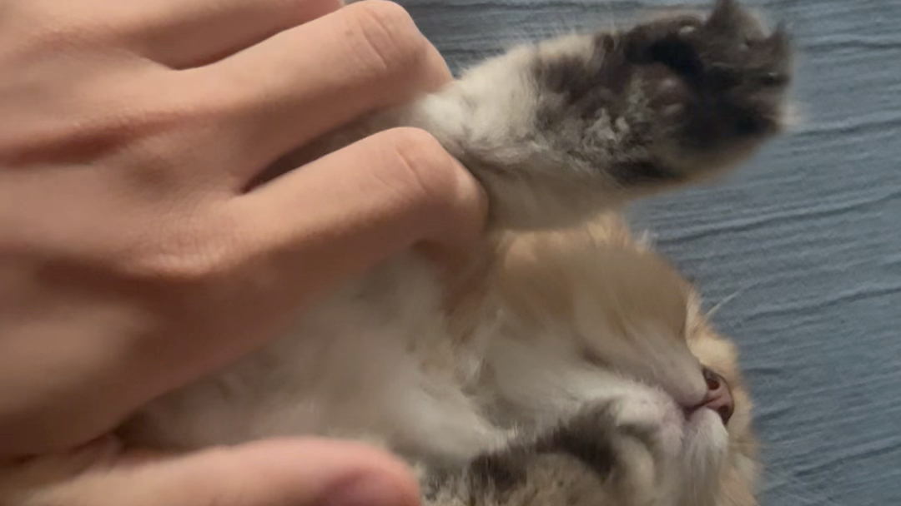 | 258 | 2023-07-29 |

---
*最后更新: 2025-11-03 02:43:06 (自动生成)*
*数据来源: [Bilibili](https://www.bilibili.com)*

## 使用说明

运行以下命令更新视频列表:
```bash
python3 fetch_hajimi_videos.py
```
