# awesome-hajimi
collections of hajimi (哈基米 in Chinese) on the Internet.

## 视频列表 (Video List)

| 视频标题 (Title) | 封面 | 播放量 (Views) | 发布日期 (Date) |
|---|---|---|---|
| [三哈基米大战螃蟹](https://www.bilibili.com/video/BV1he6xB4E3g) | 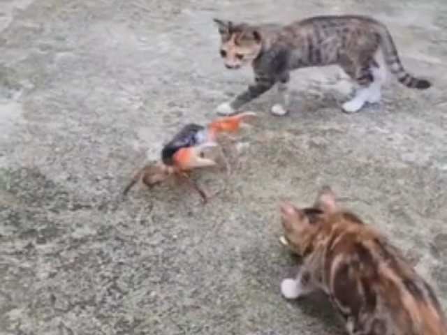 | 1306 | 2026-02-01 |
| [【整活】哈基米关灯神器1.0](https://www.bilibili.com/video/BV1LE6WBfEZV) | 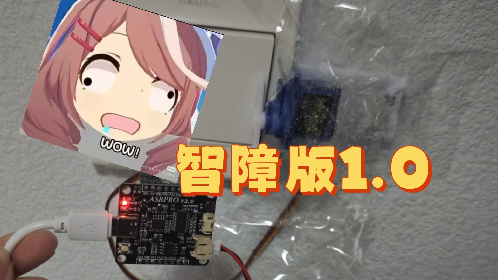 | 90 | 2026-02-01 |
| [我要让全B站知道哈基米的真正含义？](https://www.bilibili.com/video/BV1tz6WBLE7h) |  | 4 | 2026-02-01 |
| [哈基米录像之眼神](https://www.bilibili.com/video/BV1T66WByEEm) | 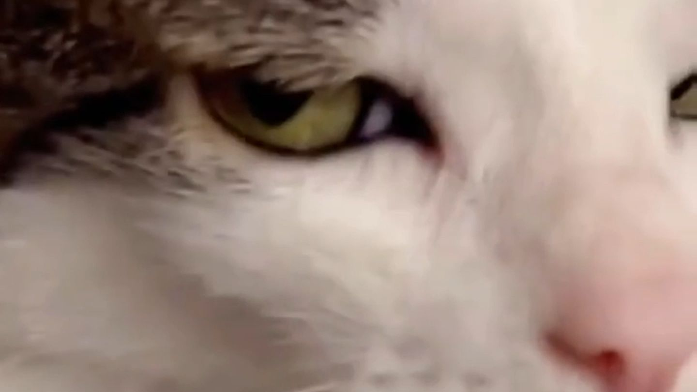 | 554 | 2026-02-01 |
| [恭喜基米（恭喜发财哈基米版）](https://www.bilibili.com/video/BV1gb6HB5ECx) |  | 106 | 2026-01-31 |
| [【圆头耄耋】老基米（老男孩）](https://www.bilibili.com/video/BV1F16HBYEdD) |  | 437 | 2026-01-31 |
| [“哈！”   邪恶哈基米合集](https://www.bilibili.com/video/BV1Sg6pBLEgU) | 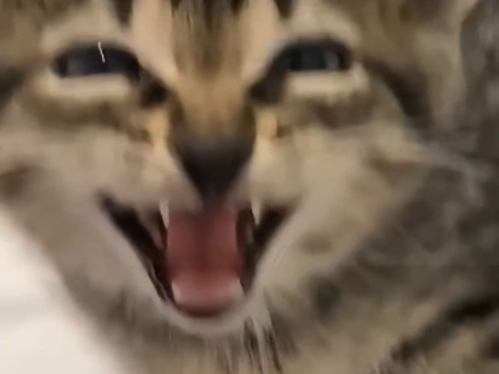 | 5114 | 2026-01-31 |
| [地狱猫车长最欣慰的一集-意大利猫猫无伤12杀速通](https://www.bilibili.com/video/BV1S36pByERv) |  | 305 | 2026-01-31 |
| [【基米大冲击——上海哈基米ONLY2026】全场大合唱《哈雪大冒险》](https://www.bilibili.com/video/BV13J6JBkE9J) |  | 3846 | 2026-01-31 |
| [哈基米你在做什么！？](https://www.bilibili.com/video/BV1dQ6JBSENX) |  | 694 | 2026-01-31 |
| [基米小学：想知道小猫的心情？那看看帽子吧](https://www.bilibili.com/video/BV1CJ6nBhE6v) | 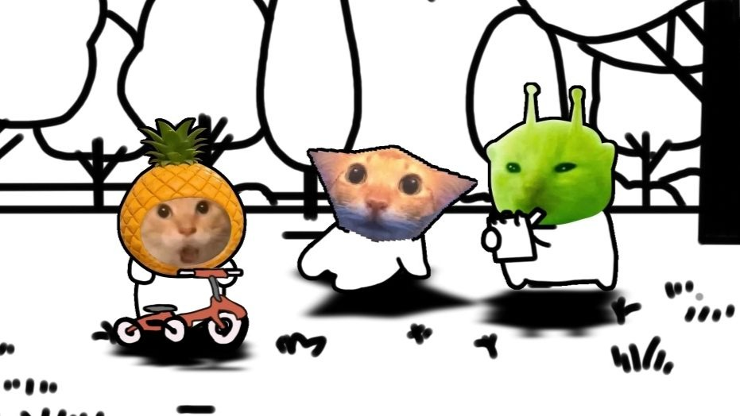 | 2.0万 | 2026-01-31 |
| [基米大冲击～](https://www.bilibili.com/video/BV1rx6nB4EHC) |  | 1299 | 2026-01-31 |
| [基米小学：耄耄的烦恼](https://www.bilibili.com/video/BV12G6nBTE2D) |  | 643 | 2026-01-31 |
| [小丸丸来了](https://www.bilibili.com/video/BV1mU6nBrEfD) |  | 341 | 2026-01-31 |
| [片头：在耄耋面前低调点！](https://www.bilibili.com/video/BV1a16nBCEMb) | 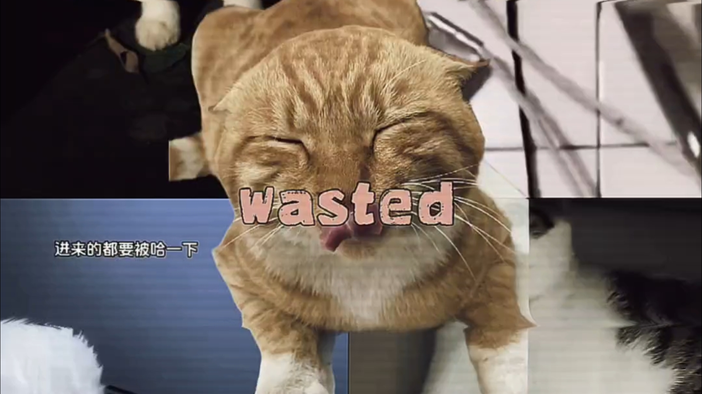 | 808 | 2026-01-31 |
| [【哈基米TV】之逆流河上万仙退！爱情不敌坚持泪](https://www.bilibili.com/video/BV1mQ6nBzE7Q) |  | 1315 | 2026-01-31 |
| [这一刻哈基米已经成为哈基仙](https://www.bilibili.com/video/BV1ov6nBnEr2) | 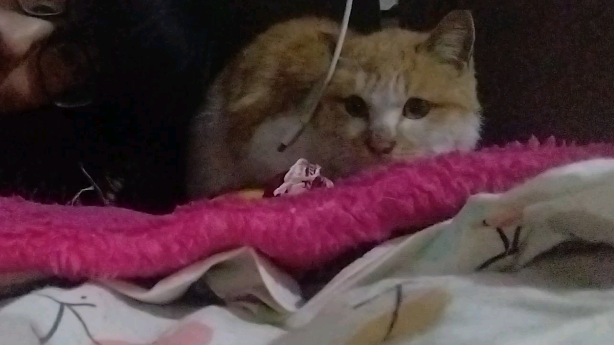 | 448 | 2026-01-31 |
| [《基 米 到》](https://www.bilibili.com/video/BV15A61BJECU) |  | 2264 | 2026-01-31 |
| [失去灵魂的基米嘎](https://www.bilibili.com/video/BV1YP61BUEWU) |  | 14 | 2026-01-31 |
| [S9赛季初哈基米88%胜率圣皇痛苦冲锋](https://www.bilibili.com/video/BV1hu61BLET4) | 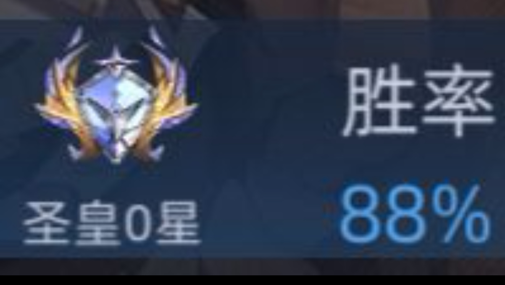 | 1618 | 2026-01-31 |
| [群友说这把一刀都不用剪就是哈基米集锦](https://www.bilibili.com/video/BV1Zv61B4ELy) | 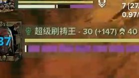 | 1139 | 2026-01-31 |
| [中场有只超级哈基米，你可要小心啦](https://www.bilibili.com/video/BV1Jv61BtEEr) |  | 1449 | 2026-01-31 |
| [哈基米不吃猫条是想吃其他的什么吗](https://www.bilibili.com/video/BV1KJ61BBEtz) | 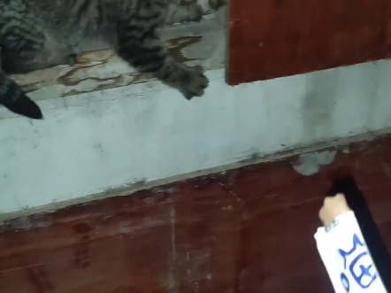 | 1153 | 2026-01-31 |
| [哈基米这个哈猫卡顿](https://www.bilibili.com/video/BV1Ap61BiEZt) | 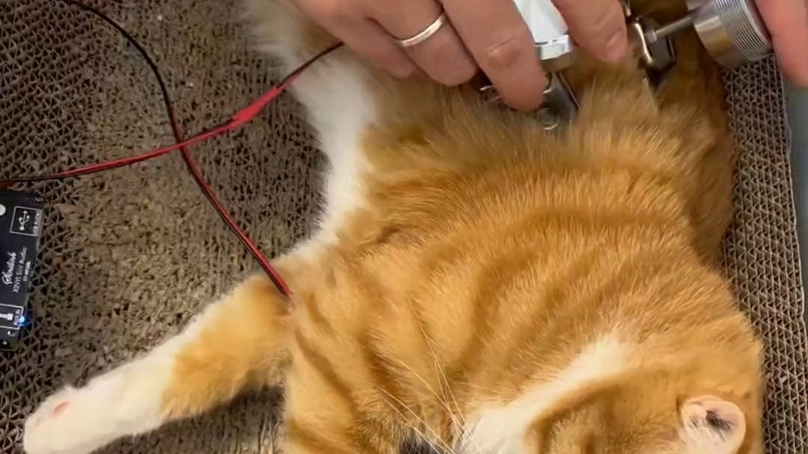 | 593 | 2026-01-31 |
| [哈基米这个甜蜜💕【泰曼波】](https://www.bilibili.com/video/BV1U961B5Eqq) |  | 355 | 2026-01-31 |
| [歌颂伟大的先驱者哈基米](https://www.bilibili.com/video/BV1xA62BuErG) |  | 1142 | 2026-01-31 |
| [哈基米春节联欢晚会预告版](https://www.bilibili.com/video/BV1MZ61BkEJw) |  | 3.8万 | 2026-01-31 |
| [哈基米起床战争第三集](https://www.bilibili.com/video/BV1Ry61BnEEK) |  | 552 | 2026-01-31 |
| [《哈基米音乐❌诗歌剧翻唱》”升12key诗歌剧差点唱似【火力全开-恭喜发财版】](https://www.bilibili.com/video/BV1Xm61BEEhV) |  | 368 | 2026-01-31 |
| [善良鼠鼠只是感化了哈基米和幽灵和人和蜘蛛和乌鸦和小偷](https://www.bilibili.com/video/BV1Bj62BbE94) | 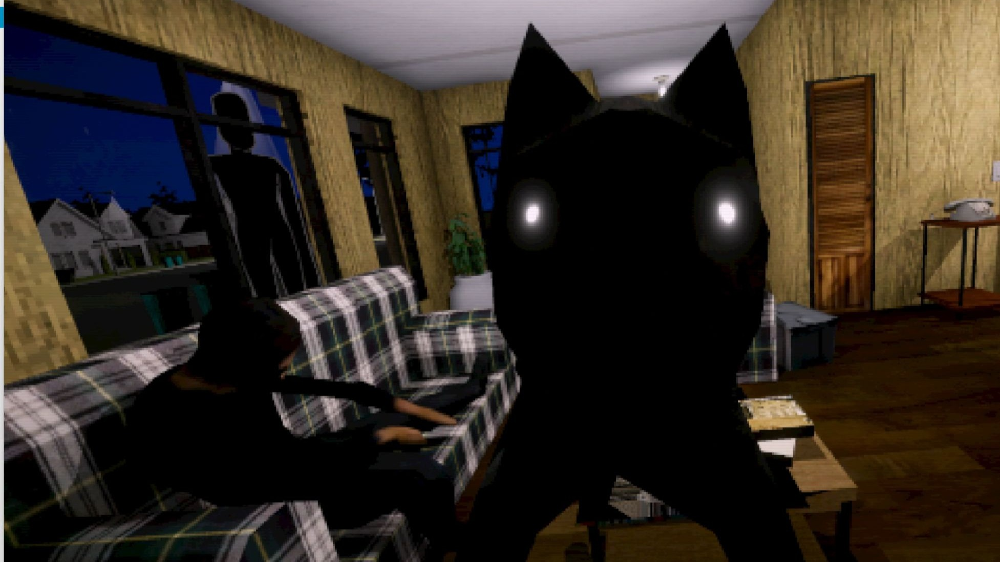 | 4.1万 | 2026-01-31 |
| [哈！基！米！](https://www.bilibili.com/video/BV19x62BpEHT) |  | 427 | 2026-01-31 |
| [干嘛猫的吃播（ 美味甜品！豪吃到咪起飞！）【AI-vlog】](https://www.bilibili.com/video/BV1Au6qB5EAX) |  | 5.6万 | 2026-01-31 |
| [哈基宗日常](https://www.bilibili.com/video/BV1ip62BsEjr) | 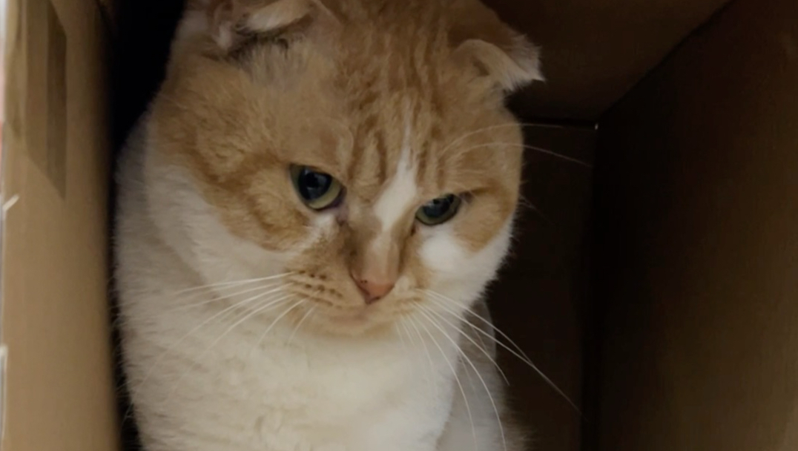 | 7810 | 2026-01-31 |
| [哈基米小剧场(爱猫TV大合集)](https://www.bilibili.com/video/BV1rT62BvEtm) |  | 2360 | 2026-01-31 |
| [Vlog🐱｜新家好物拆箱·含猫量极高的一集～](https://www.bilibili.com/video/BV18G6iBHEy1) |  | 2742 | 2026-01-31 |
| [【游戏王MD】电子龙哈基米？？也是遇到神人了](https://www.bilibili.com/video/BV1rG62BwEaj) | 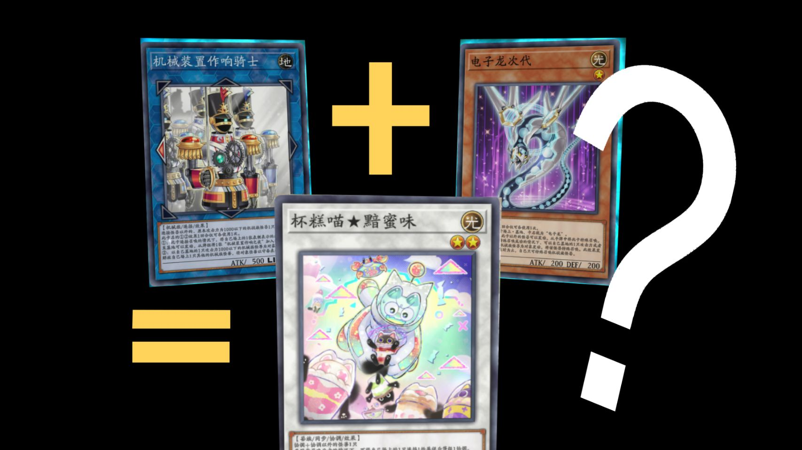 | 1291 | 2026-01-31 |
| [家有一只好基米，天天哈气发神金](https://www.bilibili.com/video/BV1Eb6CB9EUi) | 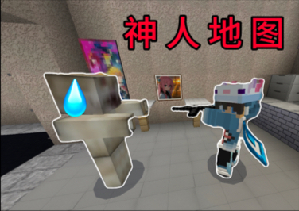 | 1346 | 2026-01-31 |
| [这种鼠最精了 视频里装傻 游戏里颗的比谁都快](https://www.bilibili.com/video/BV1ov6CBUEjs) |  | 4.0万 | 2026-01-31 |
| [#2哈基米：基米说](https://www.bilibili.com/video/BV1Ap6CBZEgU) |  | 257 | 2026-01-31 |
| [我家的哈基米](https://www.bilibili.com/video/BV1Qr6CByEyT) | 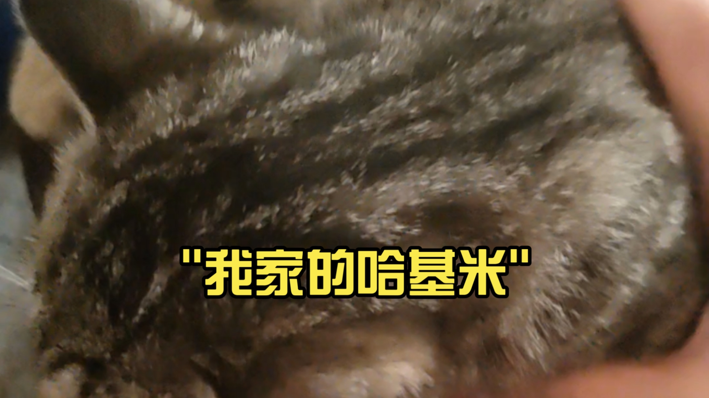 | 797 | 2026-01-31 |
| [哈基米](https://www.bilibili.com/video/BV11r6yBeE5C) |  | 1048 | 2026-01-31 |
| [哈基米神兵天基进化中](https://www.bilibili.com/video/BV1p26yBcE5x) | 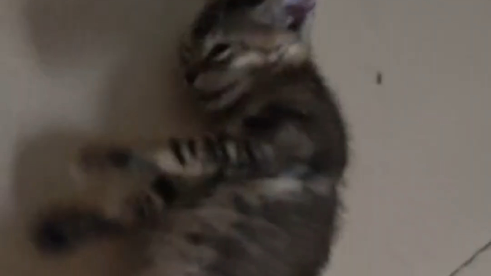 | 3267 | 2026-01-31 |
| [来挑选一只你想要收养的哈基米吧](https://www.bilibili.com/video/BV1Sh6yB3EFn) |  | 65 | 2026-01-31 |
| [让豆包带猫咪去感受雪的浪漫](https://www.bilibili.com/video/BV1fp6zB3ENs) |  | 2540 | 2026-01-31 |
| [王  不  见  王](https://www.bilibili.com/video/BV1eD6BBPEaU) |  | 56.7万 | 2026-01-31 |
| [哈基米吃了十几个鸽子哈基人直呼不知道怎么办](https://www.bilibili.com/video/BV1K96rBfEc3) | 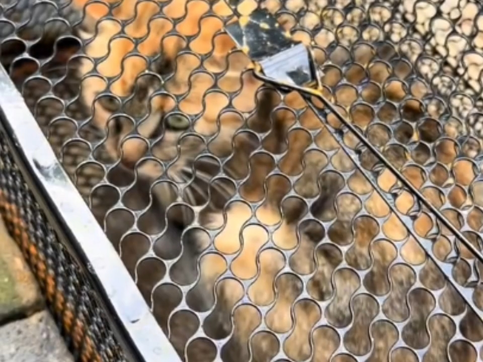 | 1475 | 2026-01-31 |
| [哈基米学会忍耐最终偷袭成功](https://www.bilibili.com/video/BV15q6rB6EnR) | 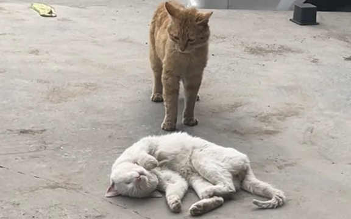 | 2162 | 2026-01-31 |
| [基米这个挑战者](https://www.bilibili.com/video/BV19i6rBgEvp) |  | 221 | 2026-01-31 |
| [哈基米那没路躲](https://www.bilibili.com/video/BV1S16rBPED6) | 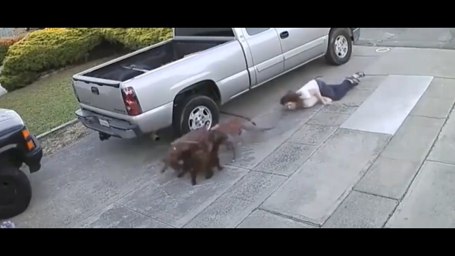 | 1420 | 2026-01-31 |
| [【哈基米音乐】Dear God『告诉我把爱找回来的方法』](https://www.bilibili.com/video/BV1iG6kB1ETG) |  | 504 | 2026-01-31 |
| [哈基米被爱](https://www.bilibili.com/video/BV1mC6zBoEzo) |  | 606 | 2026-01-30 |
| [巨神兵一拳拍死哈基米](https://www.bilibili.com/video/BV1L16iBfEzw) |  | 4027 | 2026-01-30 |
| [公路上遇到这只哈基米，谁来翻译下它在说什么](https://www.bilibili.com/video/BV19t6qBFEkJ) | 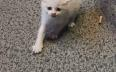 | 2509 | 2026-01-30 |
| [icon首次暴走！红色哈基米21杀大秀，折叠飞丝滑操作，上天入地如若无人之境，我为红色哈基米代言](https://www.bilibili.com/video/BV1NP6qB2EY8) |  | 3352 | 2026-01-30 |
| [用一个模型，重新理解所有梗【梗外之音07】](https://www.bilibili.com/video/BV1pV6qB6EV7) |  | 31.2万 | 2026-01-30 |
| [树质量真好，承受四辆猫咪重卡](https://www.bilibili.com/video/BV1r96qBVE1A) |  | 29.4万 | 2026-01-30 |
| [🐱哈气ing🐱](https://www.bilibili.com/video/BV1YK6eBmEEG) | 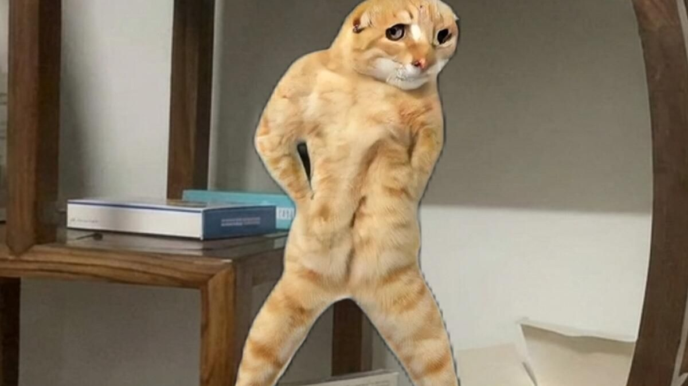 | 3.1万 | 2026-01-30 |
| [自投罗网](https://www.bilibili.com/video/BV1eF6eBQE1R) | 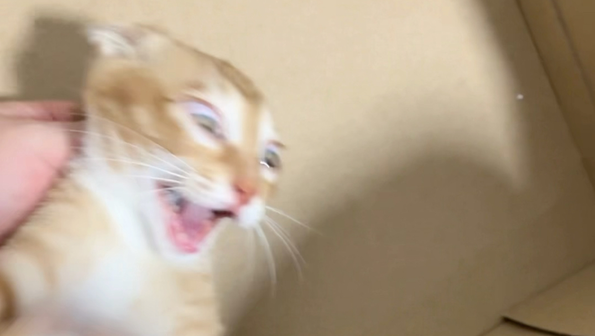 | 9580 | 2026-01-30 |
| [挤压4](https://www.bilibili.com/video/BV1Yb65BcEXD) | 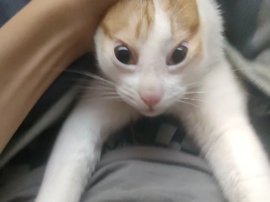 | 8576 | 2026-01-30 |
| [真担心把孩子宠坏了](https://www.bilibili.com/video/BV1eK6PBKE6u) | 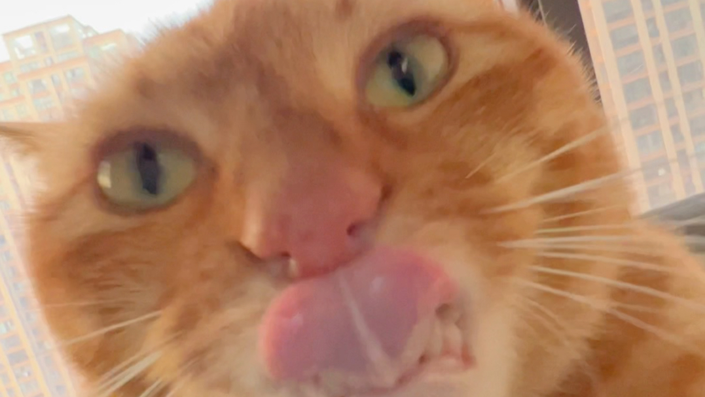 | 5.3万 | 2026-01-30 |
| [油腻哈基米](https://www.bilibili.com/video/BV1vw6eBnEsr) | 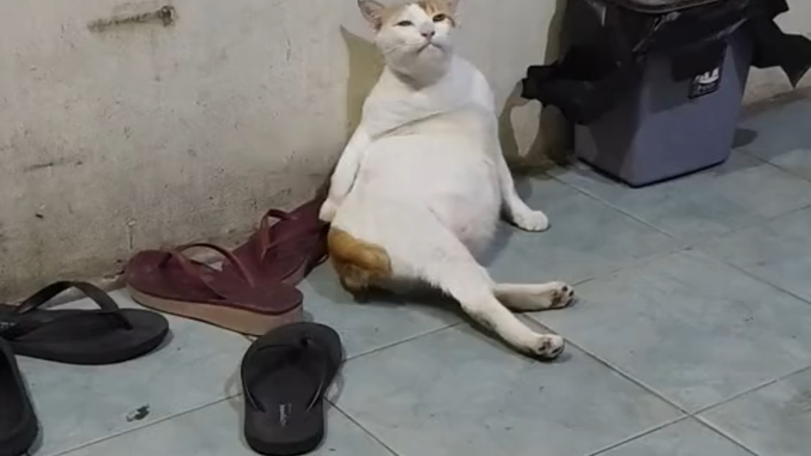 | 2.8万 | 2026-01-30 |
| [哈基米这个好圾米](https://www.bilibili.com/video/BV18u6eB1EvM) | 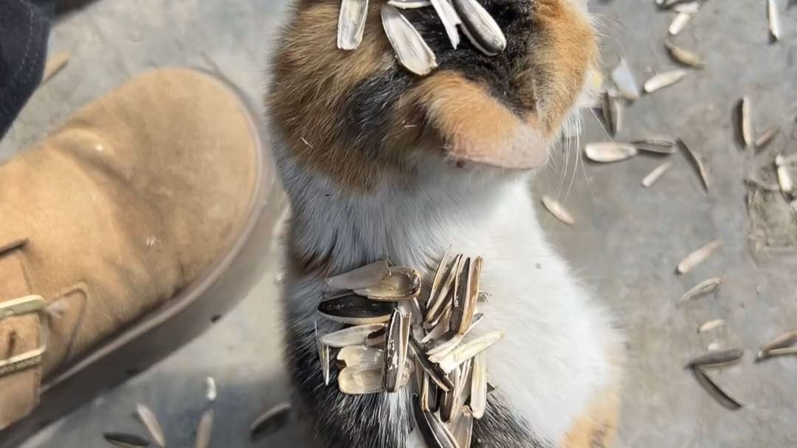 | 2.5万 | 2026-01-30 |
| [傻福R星搞的新消防员工作救“哈基米”任务给我气笑了](https://www.bilibili.com/video/BV1Er6PBGEhr) | 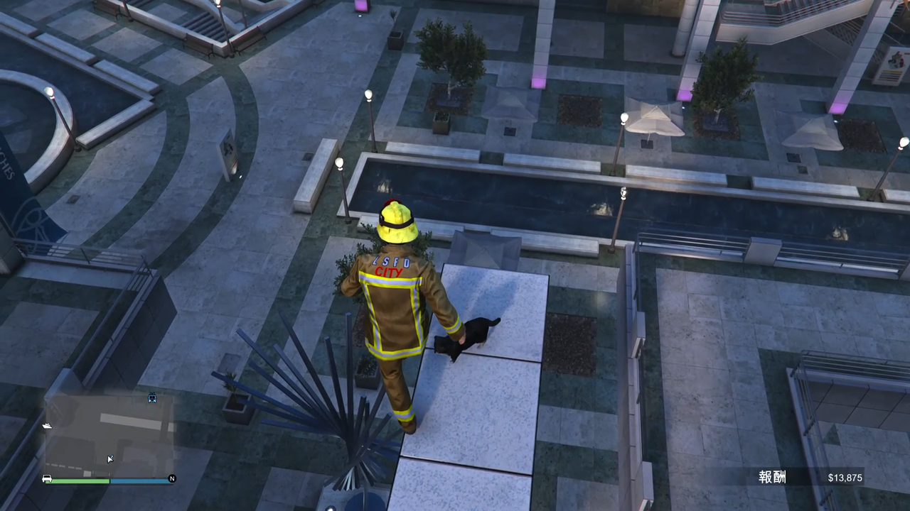 | 5.7万 | 2026-01-29 |
| [大橘64-洗澡史-化身哈基仙人](https://www.bilibili.com/video/BV1qP6KBLEvH) | 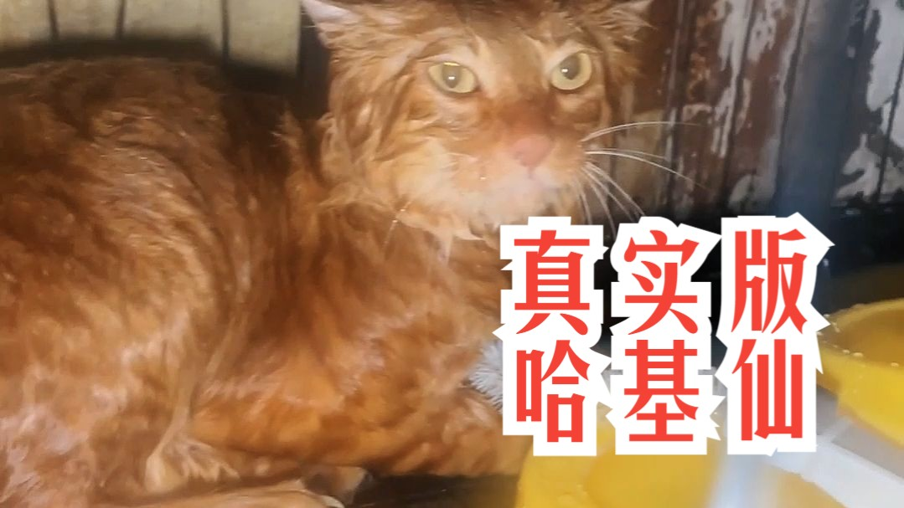 | 5.8万 | 2026-01-29 |
| [冬将军冻基米](https://www.bilibili.com/video/BV1Qt6cBWEDZ) | 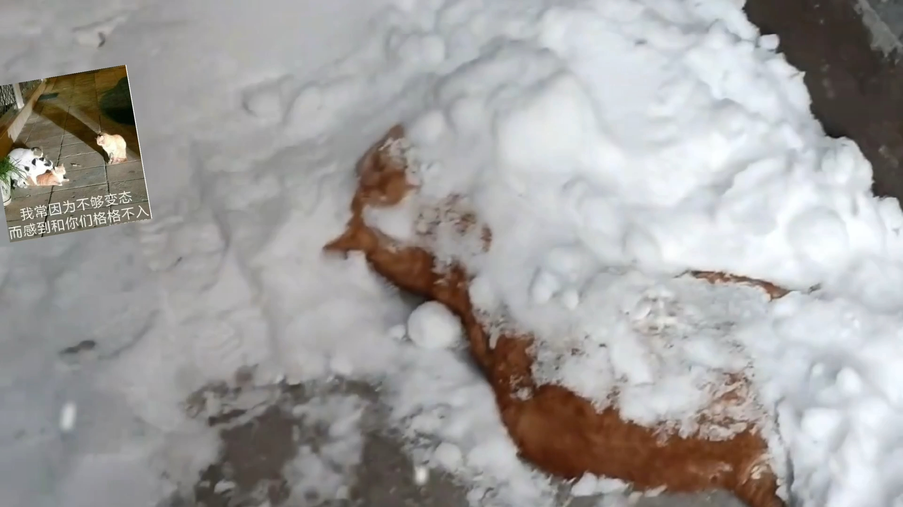 | 4895 | 2026-01-29 |
| [互联网神人百科](https://www.bilibili.com/video/BV19s6cBxETi) |  | 159.4万 | 2026-01-29 |
| [猫找到了，都嘎了](https://www.bilibili.com/video/BV1n86FBPETX) | 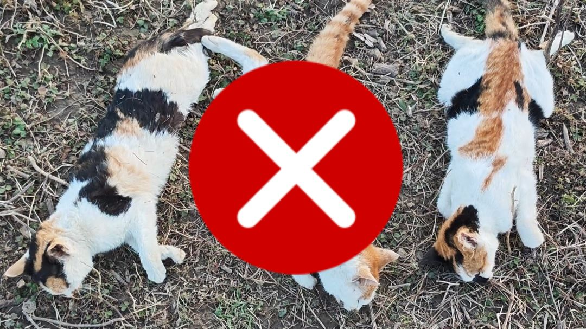 | 1.1万 | 2026-01-29 |
| [哈气基米决斗！](https://www.bilibili.com/video/BV1AhzXBnEhz) |  | 150 | 2026-01-28 |
| [给猫姥姥摸爽了 高兴的尾巴要上天了](https://www.bilibili.com/video/BV1gmzxB9EF8) | 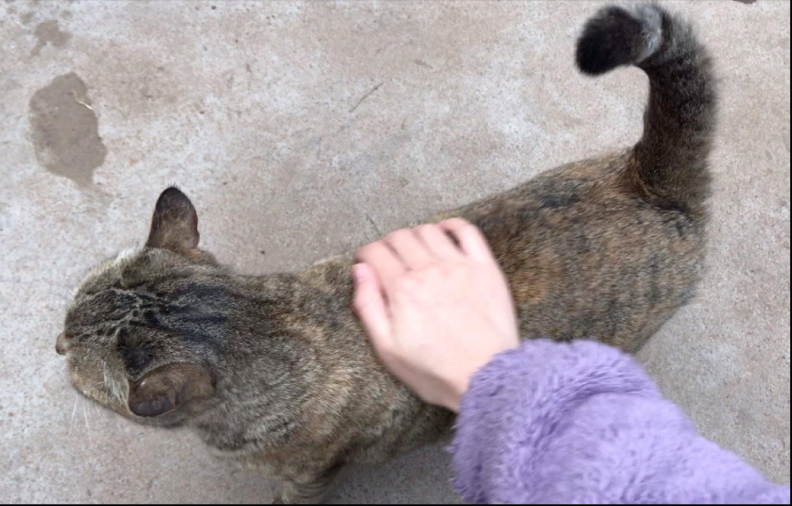 | 6.1万 | 2026-01-28 |
| [【阿梓】由米口被惩罚唱日语歌：哈基米南北绿豆哈压库奶龙~莉爱听完人晕了：这是日语吗，我怎么听不懂！梓神一下没绷住笑嘻了。](https://www.bilibili.com/video/BV1ji63BfEEg) |  | 2.4万 | 2026-01-27 |
| [哈基米～](https://www.bilibili.com/video/BV1as6gBEEkr) |  | 1.0万 | 2026-01-27 |
| [【哈基米音乐】基中的日月](https://www.bilibili.com/video/BV1EK6MBXEon) | 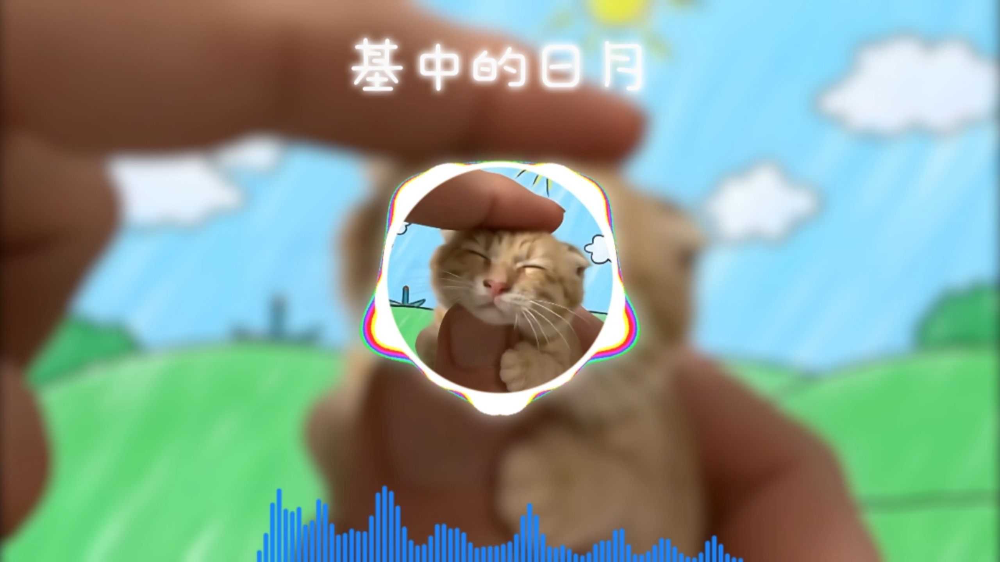 | 540 | 2026-01-27 |
| [歌曲推荐](https://www.bilibili.com/video/BV16A6MB9Eau) |  | 143 | 2026-01-27 |
| [【哈基米音乐】die with hajime “死了都要哈”](https://www.bilibili.com/video/BV1cw6MBxEAJ) |  | 467 | 2026-01-27 |
| [这样跟猫玩可不太好～](https://www.bilibili.com/video/BV1KVzqB2Eow) | 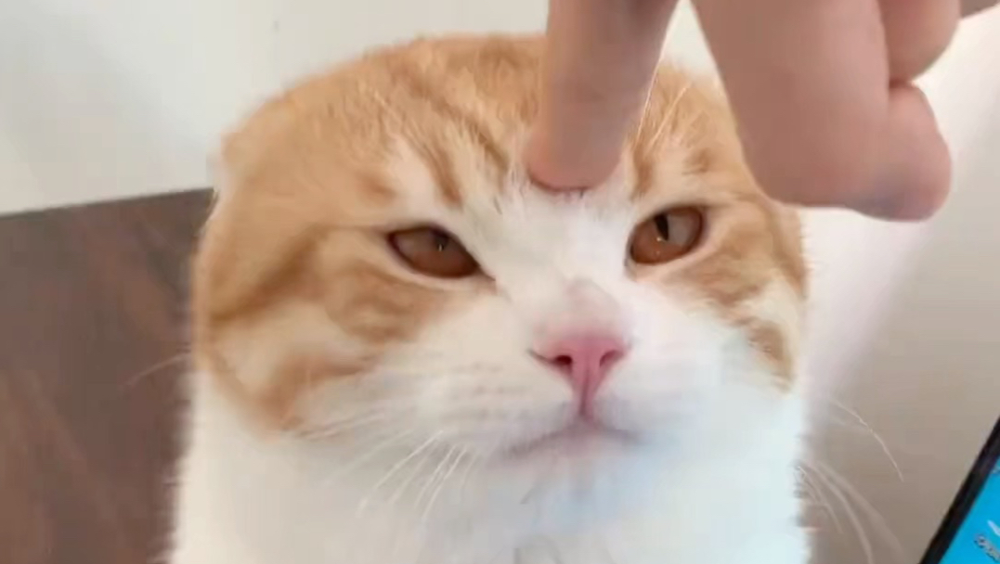 | 9.8万 | 2026-01-26 |
| [哈基米，但是倒放版](https://www.bilibili.com/video/BV1V5zFBHECY) |  | 745 | 2026-01-25 |
| [猫儿这个贪吃](https://www.bilibili.com/video/BV1hrzcBQEdG) | 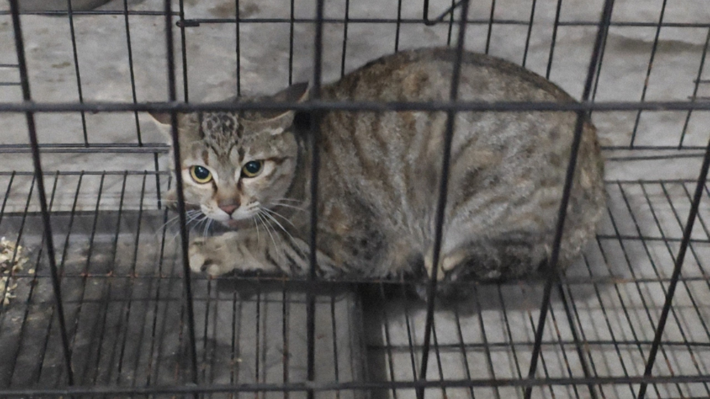 | 3132 | 2026-01-22 |
| [桑多涅桑多涅桑多涅桑多涅？——哥伦比娅](https://www.bilibili.com/video/BV1LprnBWE7H) |  | 581.5万 | 2026-01-14 |
| [【哈基米】神入合唱](https://www.bilibili.com/video/BV1bhi7BQEth) |  | 50 | 2026-01-04 |
| [外网上的中国猫和印度猫的区别](https://www.bilibili.com/video/BV13axgzaEvW) |  | 17.0万 | 2025-10-05 |
| [我就知道哈基米是对的！](https://www.bilibili.com/video/BV152xpz6EYh) |  | 52 | 2025-10-04 |
| [⚡大地兽是我的挚爱⚡](https://www.bilibili.com/video/BV16xpXzRE93) |  | 179.7万 | 2025-09-20 |
| [世界就是围着哈基米转](https://www.bilibili.com/video/BV11UHkzKEAS) |  | 51.0万 | 2025-09-12 |
| [平生不修善果，见人就哈不躲，忽地顿开棘背，街舞展示自我，国道路上大运来，哈基米那没路躲](https://www.bilibili.com/video/BV1cdhCzXEbr) | 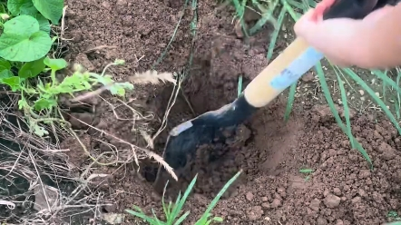 | 29.4万 | 2025-08-31 |
| [赛马娘第二季蜂蜜特饮 ハチミツ（哈基米）合集](https://www.bilibili.com/video/BV1bgYDzsEcT) |  | 2.9万 | 2025-08-21 |
| [给哈基米看圆头耄耋](https://www.bilibili.com/video/BV1XPbxz2EPp) |  | 46.2万 | 2025-08-15 |
| [当可爱的哈基米不小心落水了，八大追捕能为她做些什么](https://www.bilibili.com/video/BV1vitbzbERp) |  | 65.8万 | 2025-08-09 |
| [【蜜雪基米】哈基蜜城](https://www.bilibili.com/video/BV151tczUEx8) | 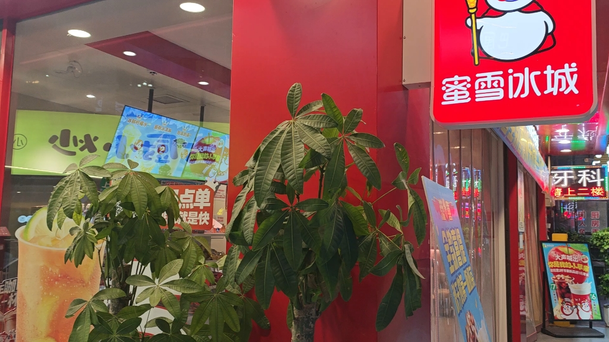 | 53.1万 | 2025-08-06 |
| [猫：这是我自己抓的食物](https://www.bilibili.com/video/BV1fbT2zeEZB) | 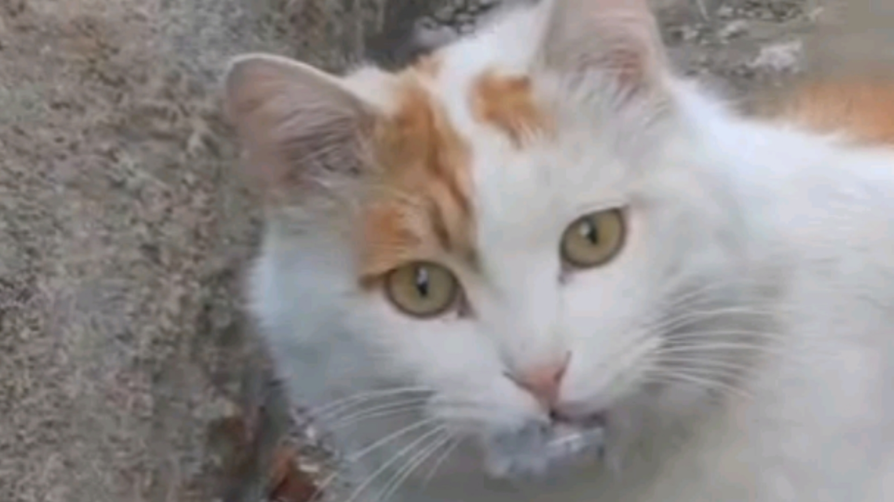 | 9.1万 | 2025-06-07 |
| [【哈基米FM】默剧小曲at the picture](https://www.bilibili.com/video/BV1ACJvzzEKM) |  | 16.8万 | 2025-05-21 |
| [哈基米原来会这么对你哈气啊，在我这里可是完全不一样哦（补档）](https://www.bilibili.com/video/BV19QVHzPEsp) | 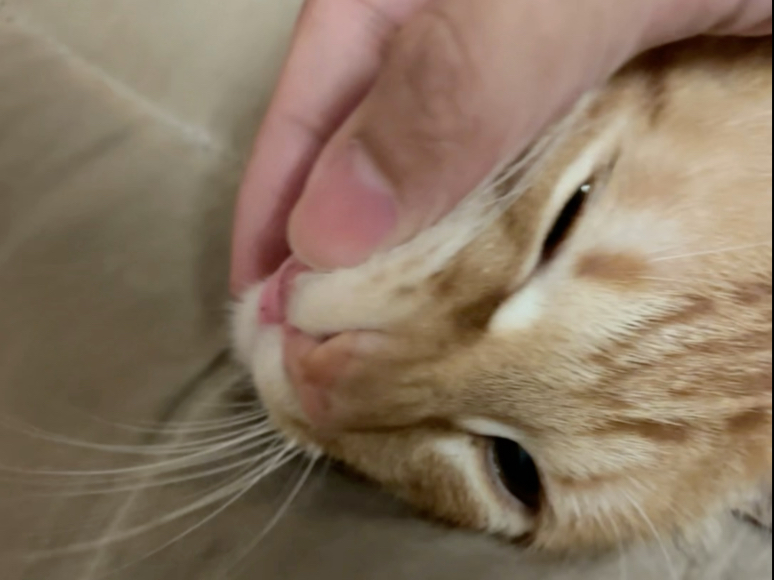 | 75.5万 | 2025-05-06 |
| [给家里的猫观赏圆头耄耋原视频](https://www.bilibili.com/video/BV1EkVGzJEWT) |  | 327.5万 | 2025-05-02 |
| [【哈基米】神人宝贝 孩子们我抓到皮卡爹了](https://www.bilibili.com/video/BV1aQo7YnEL7) |  | 35.6万 | 2025-04-15 |
| [【蜂蜜水FM】（补档）升空的哈基米，是哈气米，还是哈惧米？打上基米！](https://www.bilibili.com/video/BV1KuXrYYEPS) |  | 28.0万 | 2025-03-21 |
| [哈基米第一定律：手贱之前，必先歪头！](https://www.bilibili.com/video/BV1tycweyEpY) | 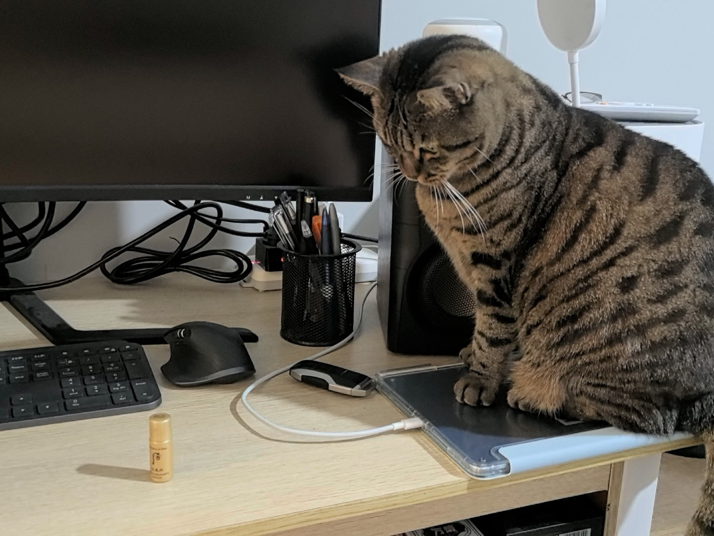 | 147.3万 | 2025-01-11 |
| [【CFの小曲】曼波の穿越火线《Metrohead》](https://www.bilibili.com/video/BV1d7y7Y8Ezt) |  | 8.4万 | 2024-10-21 |
| [哆啦A梦：蓝胖子原型毕露 变成哈基米到处抢食 只为省钱去夏威夷度假](https://www.bilibili.com/video/BV14E421N7sD) | 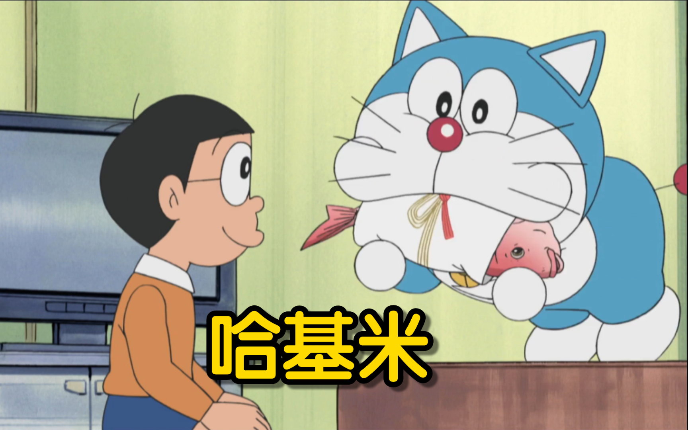 | 44.2万 | 2024-06-16 |
| [一只猫咪被两条狗咬死了，狗主人竟然若无其事的走了，猫咪太冤了](https://www.bilibili.com/video/BV1Zz4y1x7Qf) | 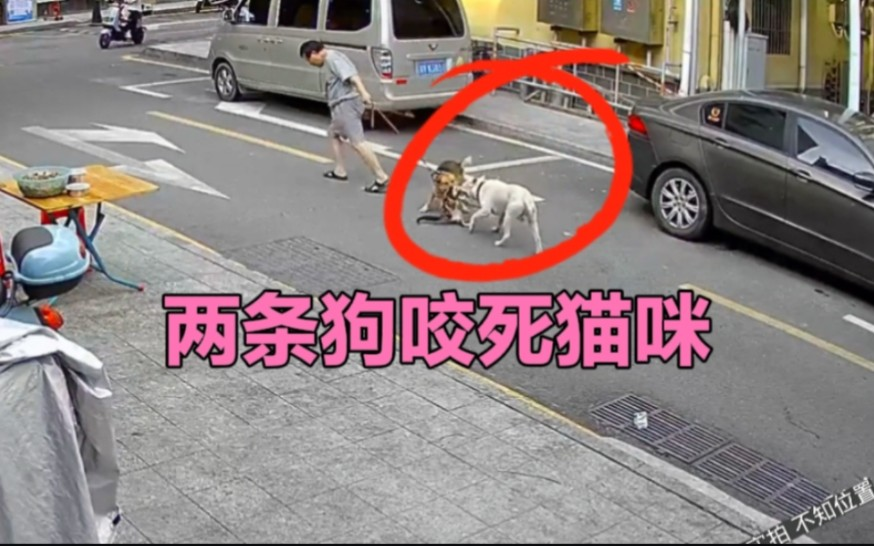 | 2.1万 | 2023-07-30 |
| [xQc看哈基米妻子离婚想分财产发现阿什拉夫早已把全部财产给了他母亲](https://www.bilibili.com/video/BV1gT411p7KU) |  | 27.3万 | 2023-04-15 |

---
*最后更新: 2026-02-01 03:14:47 (自动生成)*
*数据来源: [Bilibili](https://www.bilibili.com)*

## 使用说明

运行以下命令更新视频列表:
```bash
python3 fetch_hajimi_videos.py
```
