# awesome-hajimi
collections of hajimi (哈基米 in Chinese) on the Internet.

## 视频列表 (Video List)

| 视频标题 (Title) | 封面 | 播放量 (Views) | 发布日期 (Date) |
|---|---|---|---|
| [训基米](https://www.bilibili.com/video/BV1rFJ9zDEiX) | 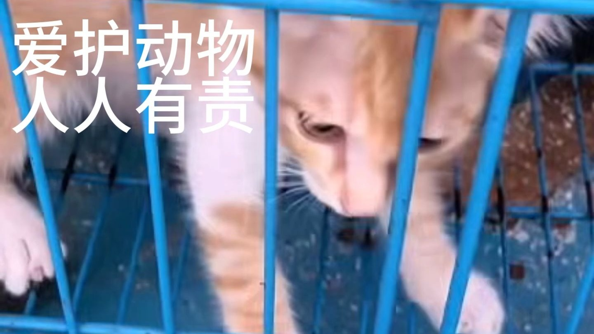 | 3301 | 2025-09-24 |
| [【哈基米】⚡基米戏⚡](https://www.bilibili.com/video/BV1gwJXzhECZ) |  | 3069 | 2025-09-24 |
| [洗刷一天的疲惫，哈基米音乐评分大赛——流行篇](https://www.bilibili.com/video/BV1eVJQzPEeb) |  | 1019 | 2025-09-24 |
| [《壁上观》纯净哈基米音乐#哈基米 #哈基米音乐 #敦煌 #宠物 #私人音乐](https://www.bilibili.com/video/BV1dTJQzMENs) | 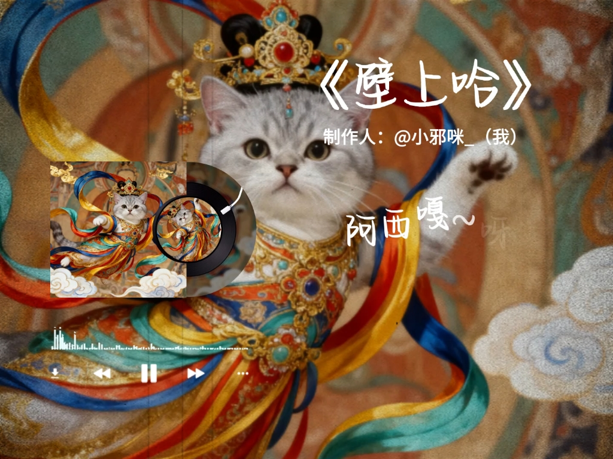 | 517 | 2025-09-24 |
| [哈基米《打火基》原曲：打火机](https://www.bilibili.com/video/BV14tJQzREga) | 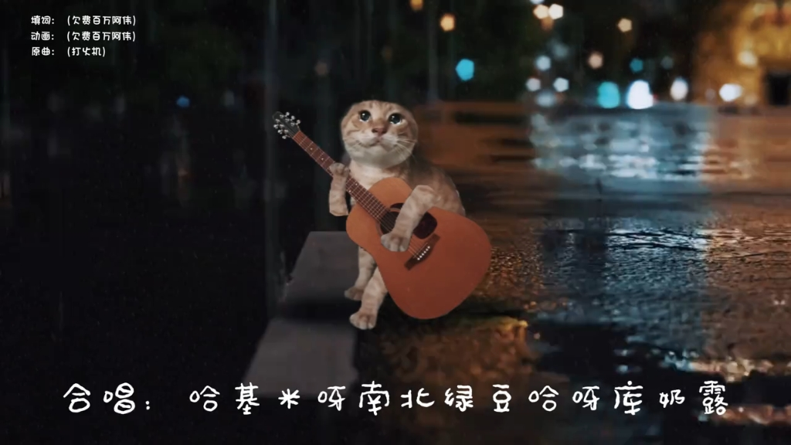 | 374 | 2025-09-24 |
| [哈基米这辈子值了](https://www.bilibili.com/video/BV1LYJXzgEzc) |  | 1.3万 | 2025-09-24 |
| [为什么在大型猫科中只有猎豹被称为野生哈基米](https://www.bilibili.com/video/BV1GQJSz8Ejf) | 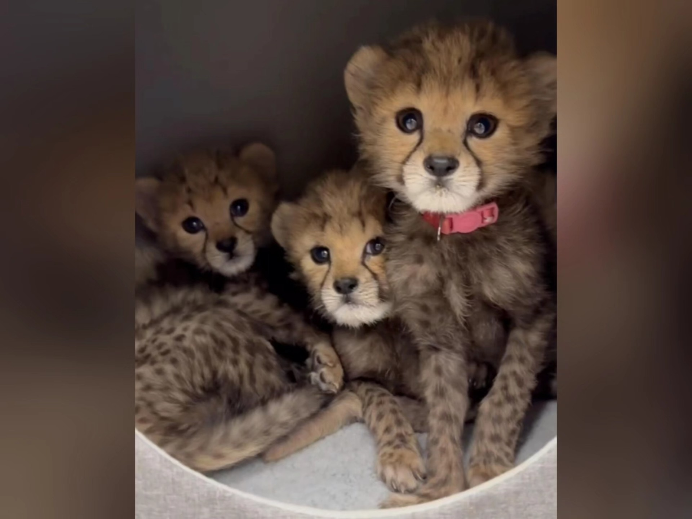 | 14.6万 | 2025-09-24 |
| [哈基米音乐制作超详细教程，无需到处翻找资源，自己就能全部做出来](https://www.bilibili.com/video/BV1CQJDzEEPf) | 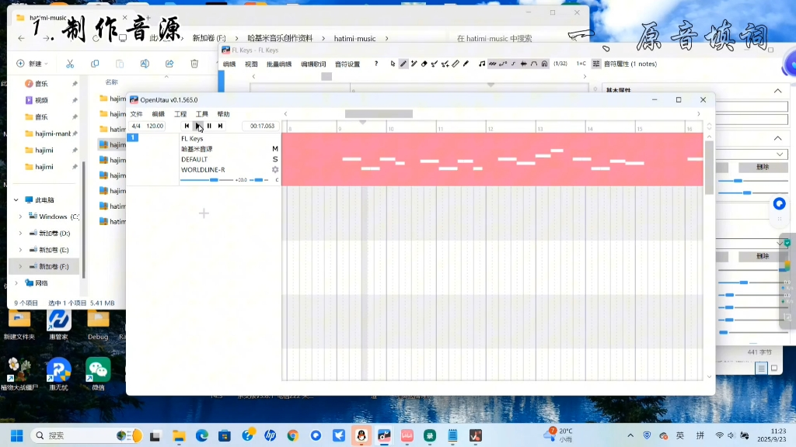 | 962 | 2025-09-24 |
| [【哈基米音乐】Y.M.C.A](https://www.bilibili.com/video/BV1DiJDzbEpw) |  | 1.7万 | 2025-09-24 |
| [鸡笼盲盒开出小耄](https://www.bilibili.com/video/BV18VJmzmETp) | 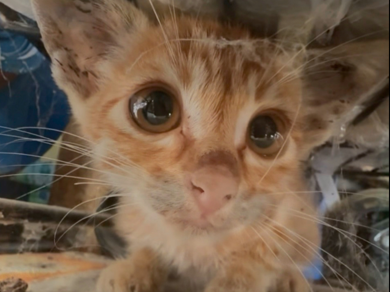 | 5.2万 | 2025-09-23 |
| [大学生反诈指南2（鼠鼠受难记）在成都，你只能算是个骗子，接下来我会送你去蹲局子。](https://www.bilibili.com/video/BV1sHJmzGEiF) |  | 1732 | 2025-09-23 |
| [哈基米这是咋了](https://www.bilibili.com/video/BV1YAJ1z2Emz) | 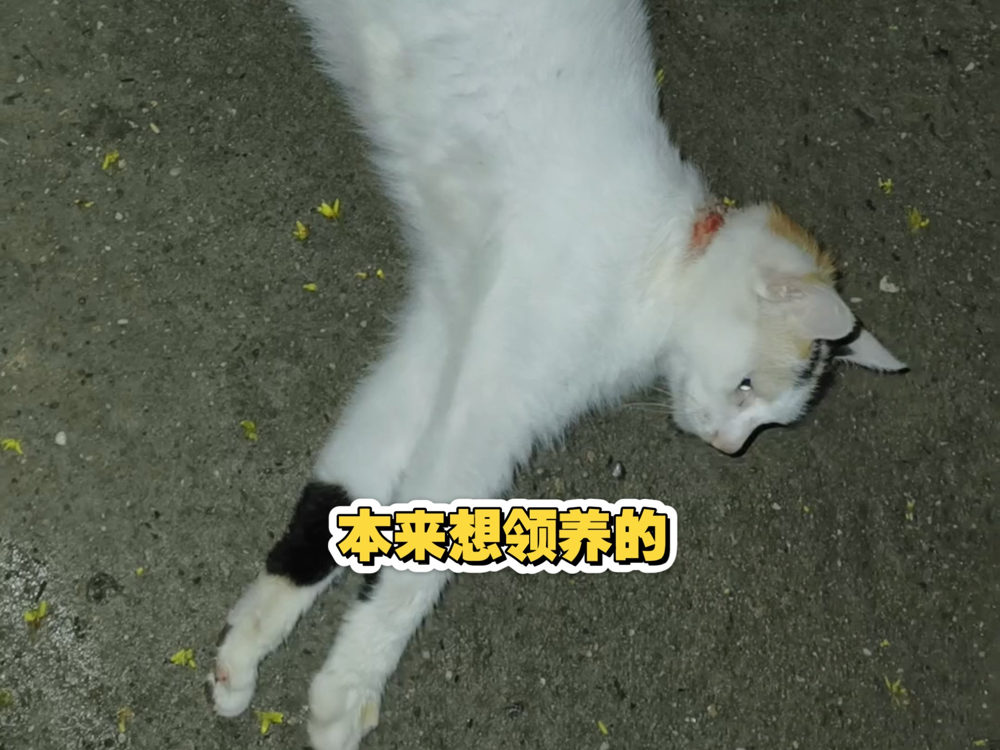 | 1.6万 | 2025-09-23 |
| [哈基米吃菌子了](https://www.bilibili.com/video/BV1MSJ1zLEZf) |  | 4131 | 2025-09-23 |
| [哈气的基米我问你](https://www.bilibili.com/video/BV1awJCzzEPW) | 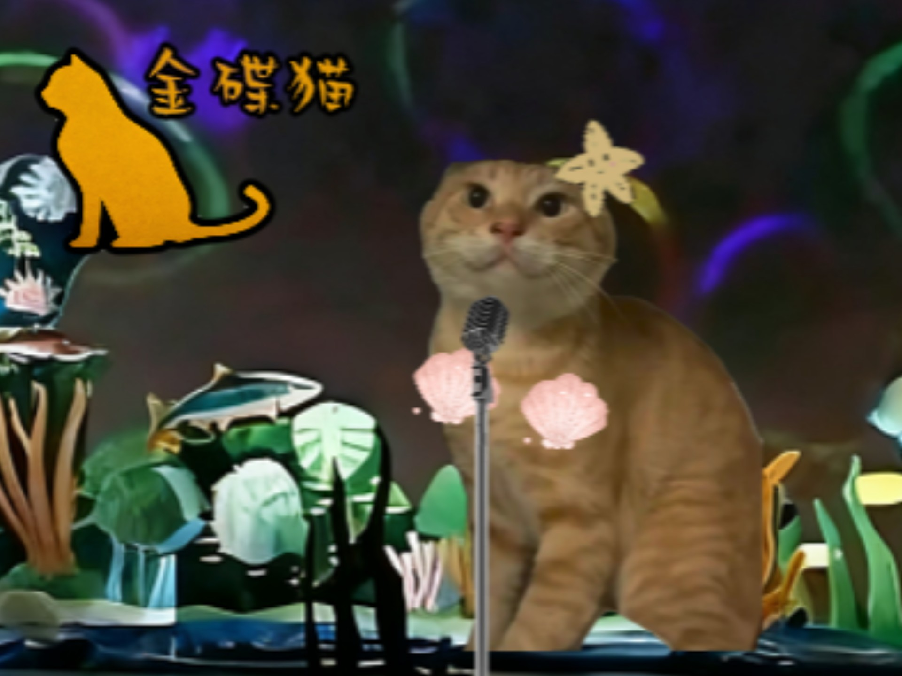 | 4.9万 | 2025-09-23 |
| [龟龟也是略猫区](https://www.bilibili.com/video/BV18TJCzKEpS) | 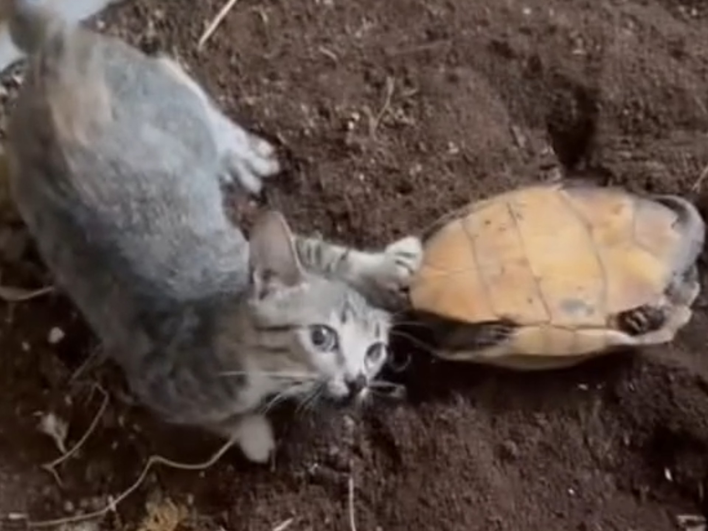 | 19.6万 | 2025-09-23 |
| [【哈基米】神秘基米之歌（song from a secret hachimi）](https://www.bilibili.com/video/BV1i4JrzyEVd) | 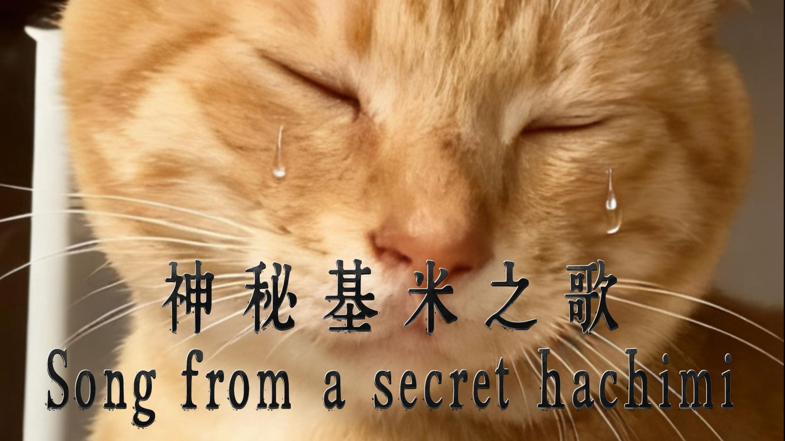 | 1112 | 2025-09-23 |
| [我家猫离人还有点距离 但离猫已经很远了](https://www.bilibili.com/video/BV1LeJCzmEC7) | 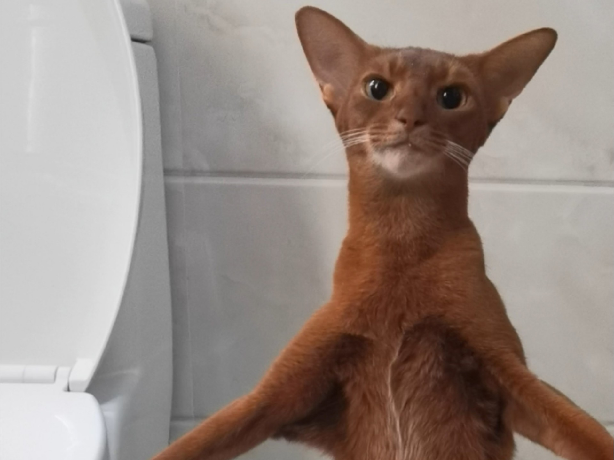 | 14.9万 | 2025-09-23 |
| [猫儿这个战斗爽](https://www.bilibili.com/video/BV1E8JCznEnT) | 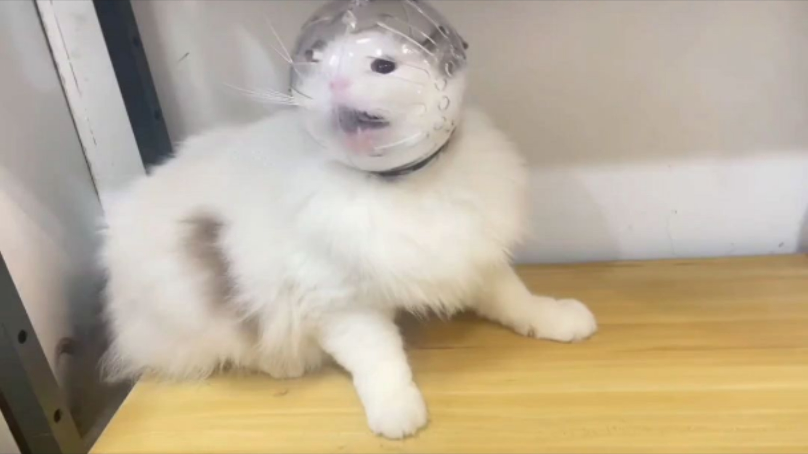 | 1.1万 | 2025-09-23 |
| [传奇耐烤王](https://www.bilibili.com/video/BV1tQJCzKEz8) | 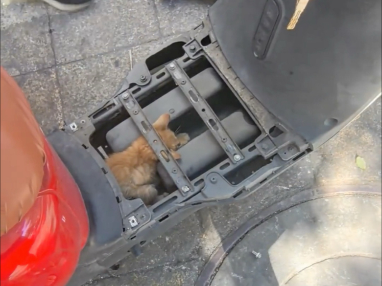 | 1.6万 | 2025-09-23 |
| [哈基米玩蛇被咬，最疯狂嚼口香糖](https://www.bilibili.com/video/BV1QWJyzVE6C) | 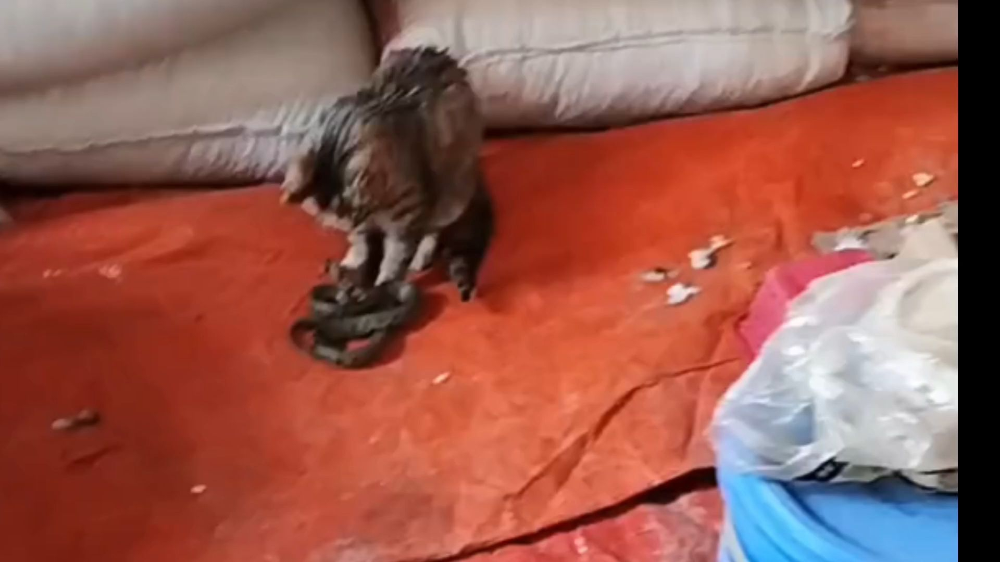 | 1.1万 | 2025-09-23 |
| [【纯净哈基米】新年快乐の小曲](https://www.bilibili.com/video/BV1JpJrz7Eyh) |  | 955 | 2025-09-23 |
| [当年的基米各有各的南北绿豆，我不哈你](https://www.bilibili.com/video/BV18nJkzBEXh) |  | 2.3万 | 2025-09-23 |
| [哈基米掉入化粪池 那没路躲](https://www.bilibili.com/video/BV1fynAzrEtA) | 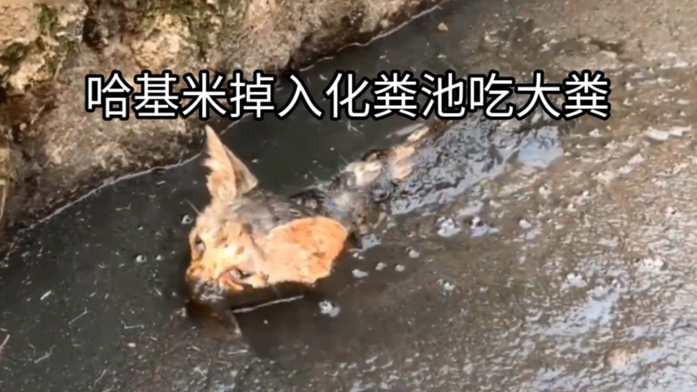 | 18.3万 | 2025-09-22 |
| [十年哈气 功夫耄耋cos翻跳 功夫人耋](https://www.bilibili.com/video/BV1SSJRzKEjj) | 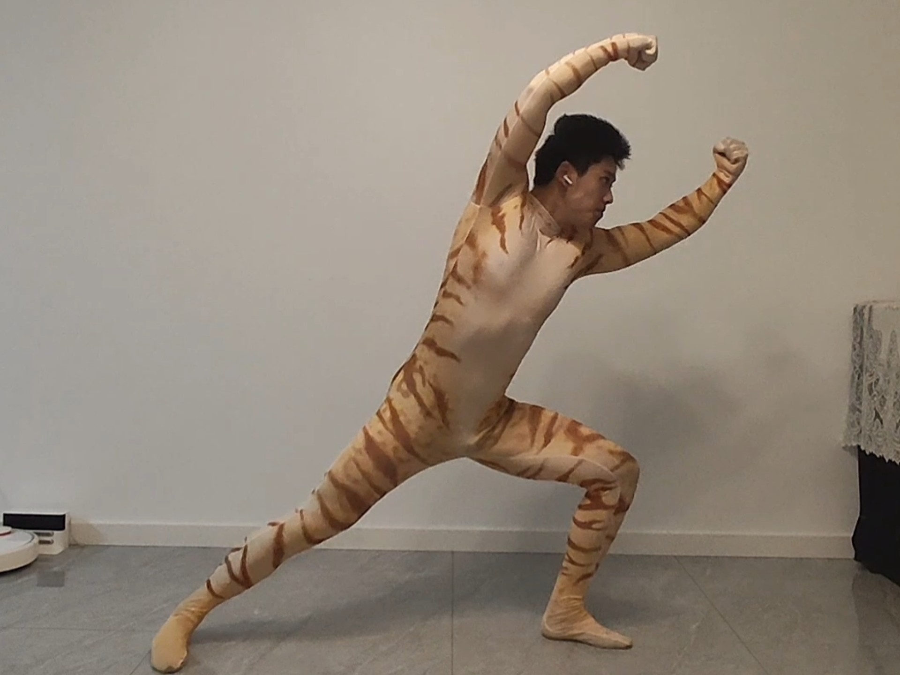 | 10.3万 | 2025-09-21 |
| [【纯净哈基米】溯（reverse）](https://www.bilibili.com/video/BV1BDJdzsEiU) |  | 3.1万 | 2025-09-21 |
| [哈基米：🐱爱情陷阱](https://www.bilibili.com/video/BV1N9WwztE55) |  | 8720 | 2025-09-21 |
| [哈基米享用美味刺身](https://www.bilibili.com/video/BV14uWwztEV6) | 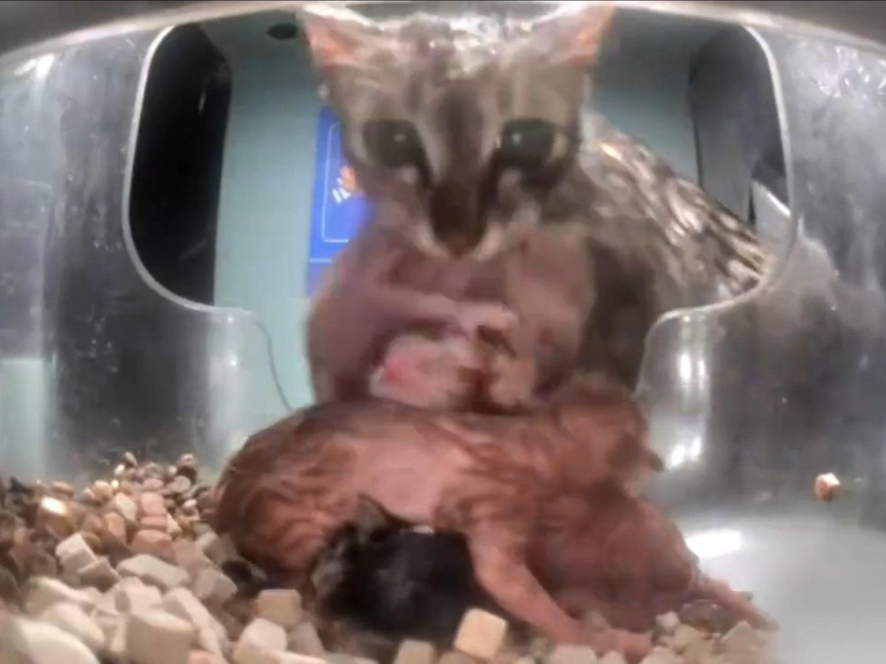 | 4.1万 | 2025-09-21 |
| [666耄耋火到外网了](https://www.bilibili.com/video/BV18zWFzFEdN) | 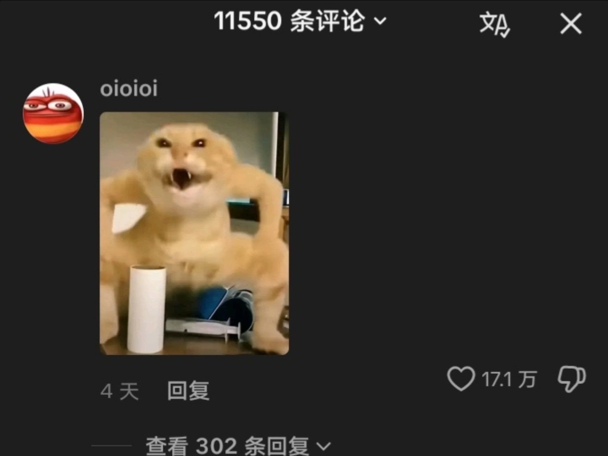 | 12.3万 | 2025-09-21 |
| [哈基米cos水坝](https://www.bilibili.com/video/BV1dAWgzeE9f) |  | 11.6万 | 2025-09-19 |
| [猫儿这个秒开棘背龙](https://www.bilibili.com/video/BV1M2ptzNEXm) |  | 35.4万 | 2025-09-17 |
| [最后一哈完整版](https://www.bilibili.com/video/BV1ejHozsE4v) |  | 7.9万 | 2025-09-14 |
| [当MC服里加入哈基米山歌(玩家：哈基米哦南北绿豆♪🐱](https://www.bilibili.com/video/BV1X6YNzKEBi) |  | 89.7万 | 2025-09-13 |
| [《梦回哈》如果我们能哈着出去的话，万千基米，你愿意陪我一起哈吗？](https://www.bilibili.com/video/BV1mrpGzpEY9) |  | 2.6万 | 2025-09-12 |
| [哈基米起床战争第一集](https://www.bilibili.com/video/BV1FzHrzWExq) | 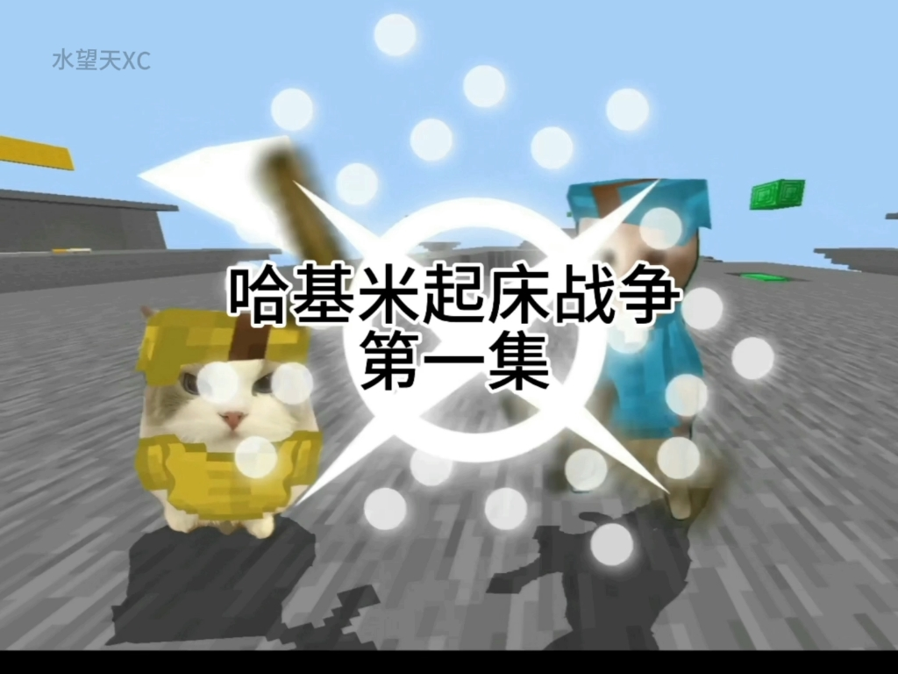 | 7.6万 | 2025-09-12 |
| [万粉福利之柔情耄娘](https://www.bilibili.com/video/BV1MuHvzSEFR) | 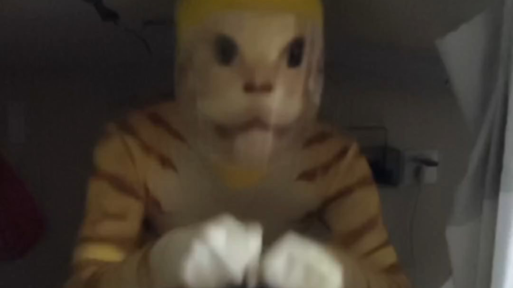 | 51.5万 | 2025-09-11 |
| [「你的耄字。」](https://www.bilibili.com/video/BV1E2YPzVEUc) |  | 179.4万 | 2025-09-11 |
| [哈基米Phonk：曼波宁静（Sea of Tranquility）](https://www.bilibili.com/video/BV1zNHezYEGS) |  | 7.8万 | 2025-09-11 |
| [哈基山的基米美不美？](https://www.bilibili.com/video/BV1JYaZzZEyb) |  | 193.2万 | 2025-09-09 |
| [猫儿是自由的2.0](https://www.bilibili.com/video/BV1T6aPzpEG5) | 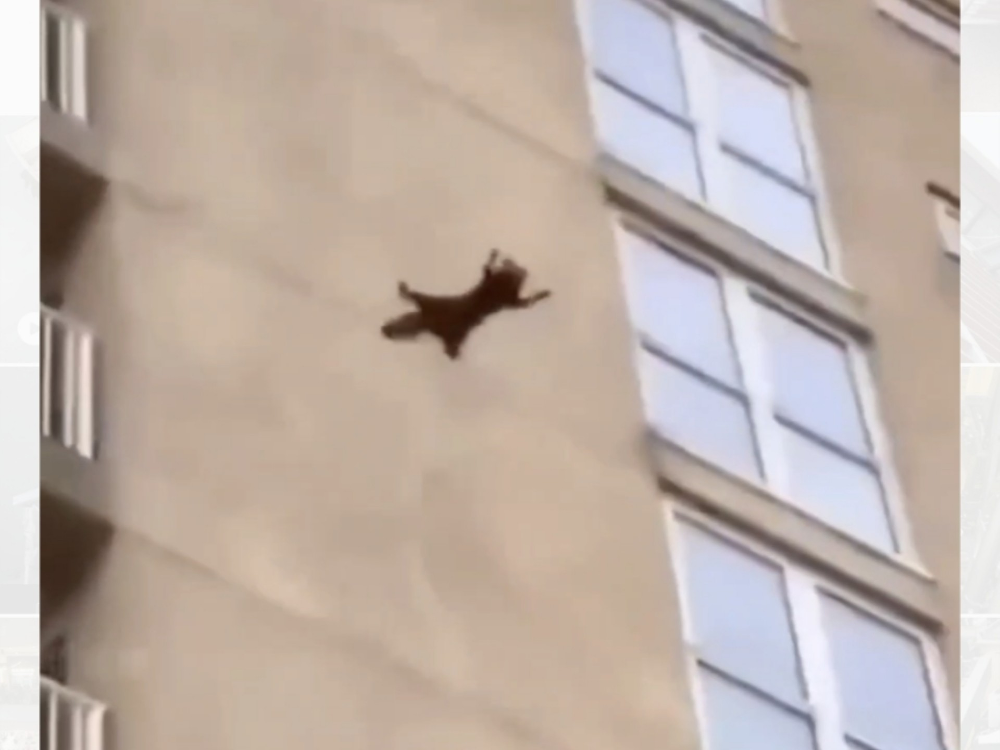 | 10.5万 | 2025-09-02 |
| [哈基米的生化大逃杀](https://www.bilibili.com/video/BV1GMaAz4EHM) |  | 4.4万 | 2025-09-02 |
| [自己吓到自己应激+互相吓到应激+被人吓到应激](https://www.bilibili.com/video/BV1ENhqzYE1R) |  | 14.0万 | 2025-08-30 |
| [“2025年暑假全网爆火的歌曲”](https://www.bilibili.com/video/BV1k9hRzXE68) |  | 250.5万 | 2025-08-29 |
| [【哈基米FM】哈你等于哈自己](https://www.bilibili.com/video/BV1qWeXzjESw) |  | 16.6万 | 2025-08-28 |
| [“耋、你没死啊，你还活着…”—《大耄风华》](https://www.bilibili.com/video/BV1nEh1zdEBU) | 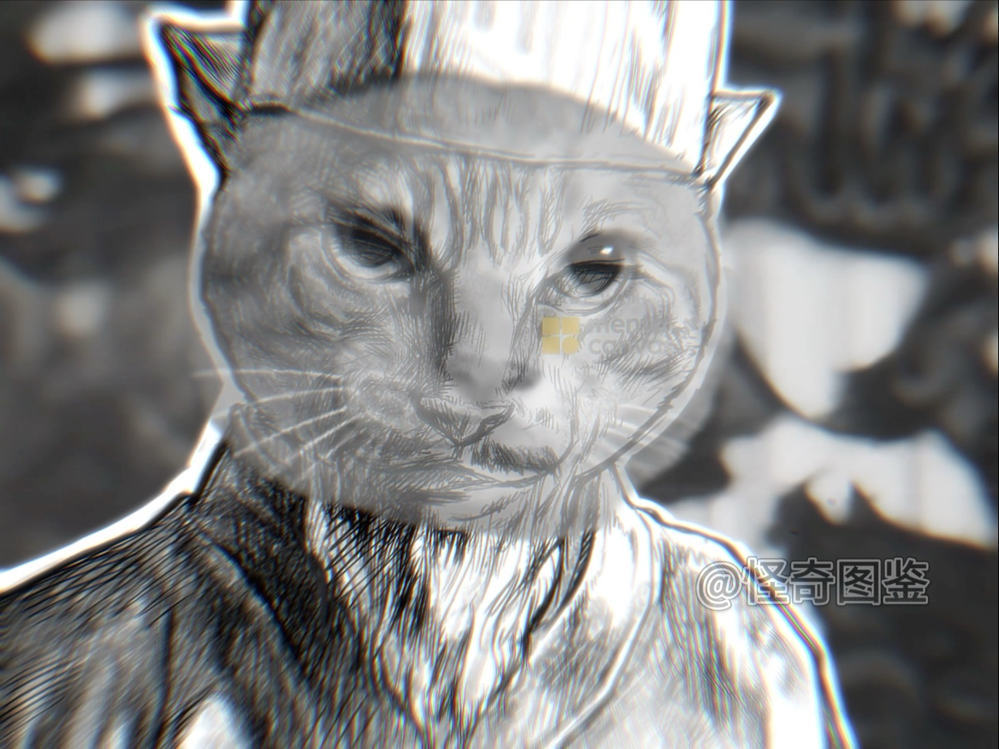 | 97.8万 | 2025-08-28 |
| [哈基米咬蛇中毒，最后疯狂嚼口香糖](https://www.bilibili.com/video/BV1sUeDzHELT) | 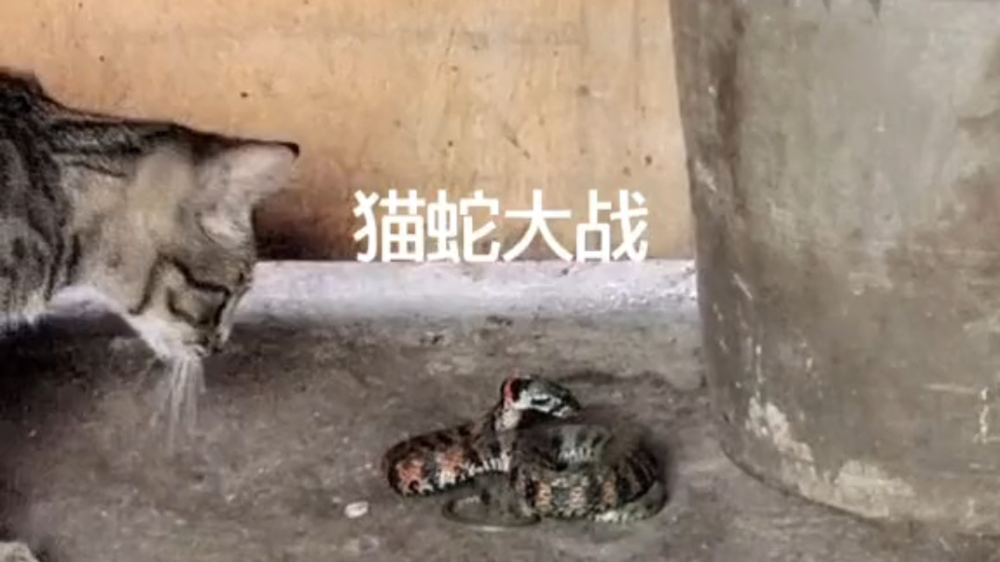 | 9.8万 | 2025-08-28 |
| [【中英】哈基米是如何运作的](https://www.bilibili.com/video/BV1xXenzTEnd) | 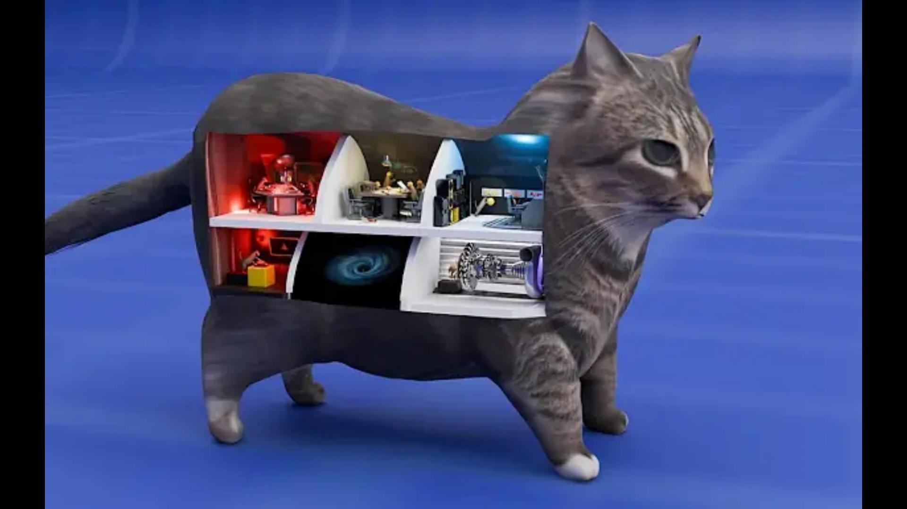 | 46.3万 | 2025-08-24 |
| [哈基米被螃蟹耻辱单杀](https://www.bilibili.com/video/BV1uyYZz5E3w) | 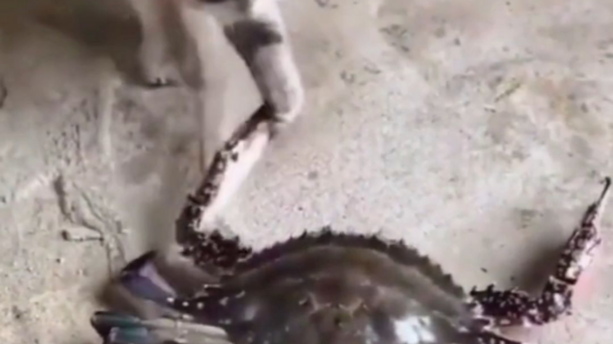 | 34.6万 | 2025-08-23 |
| [【中字】Machico本人谈哈基米](https://www.bilibili.com/video/BV14qYbz4ET6) | 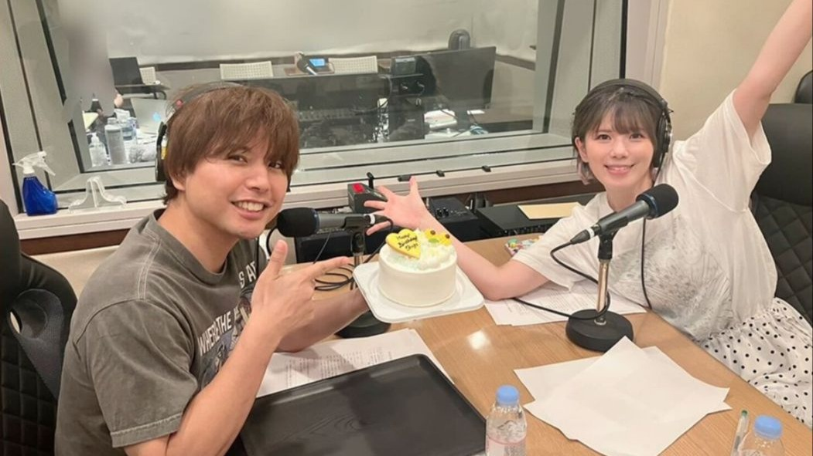 | 8.7万 | 2025-08-18 |
| [🐱缘分一口嚼🐱](https://www.bilibili.com/video/BV1yeY4zSEAz) |  | 47.1万 | 2025-08-18 |
| [老年特效土味哈基米大合集(无止境基米电台day5)](https://www.bilibili.com/video/BV1p4YCz8EV6) |  | 42.8万 | 2025-08-17 |
| [全网最还原的哈基米](https://www.bilibili.com/video/BV1u5t9zDEGH) |  | 15.1万 | 2025-08-17 |
| [[我的世界×猫meme]：自制我的世界猫meme动画：哈基米世界-第6集-哈基米快餐店](https://www.bilibili.com/video/BV1a5Yez2ENK) | 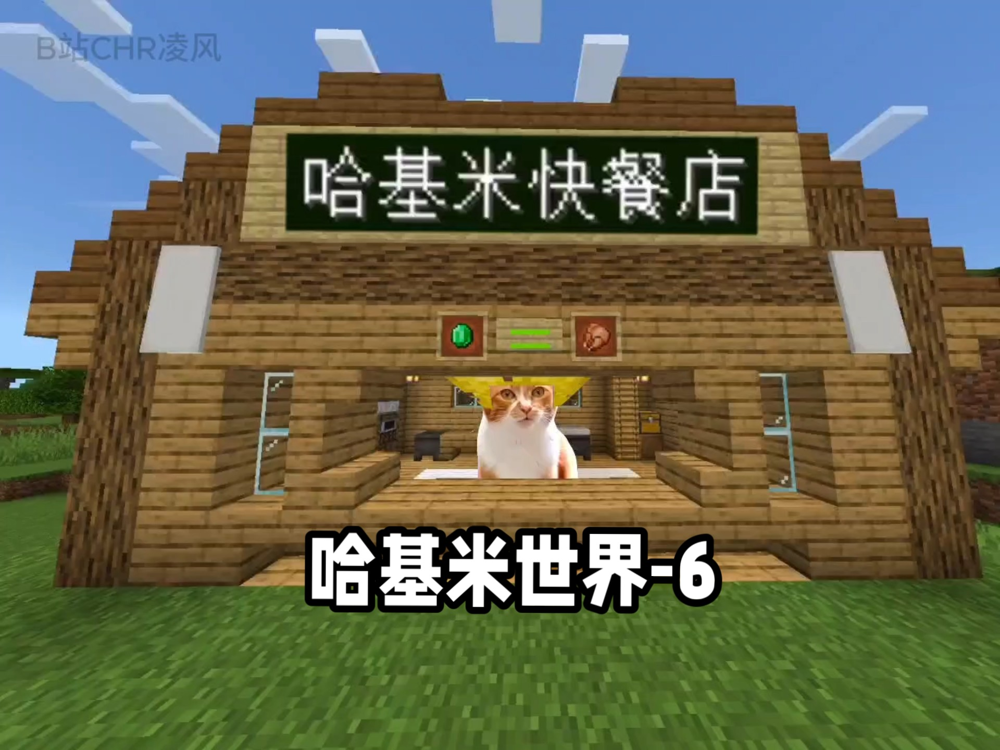 | 88.6万 | 2025-08-16 |
| [🐱喵师傅，快来救我](https://www.bilibili.com/video/BV1mrb6zmEkU) | 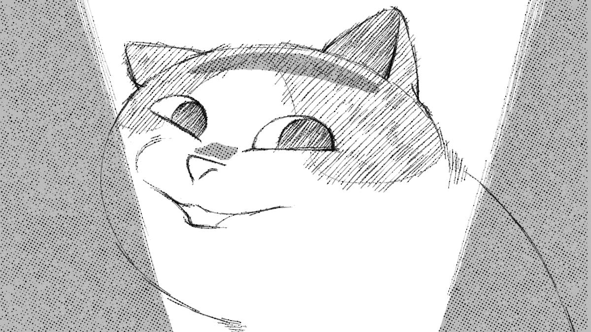 | 87.8万 | 2025-08-15 |
| [哈基米：荷塘月色（完整版）](https://www.bilibili.com/video/BV1Z7b6zPEax) |  | 7.5万 | 2025-08-14 |
| [猫儿这个害怕黄瓜](https://www.bilibili.com/video/BV11pt9z5Ecr) | 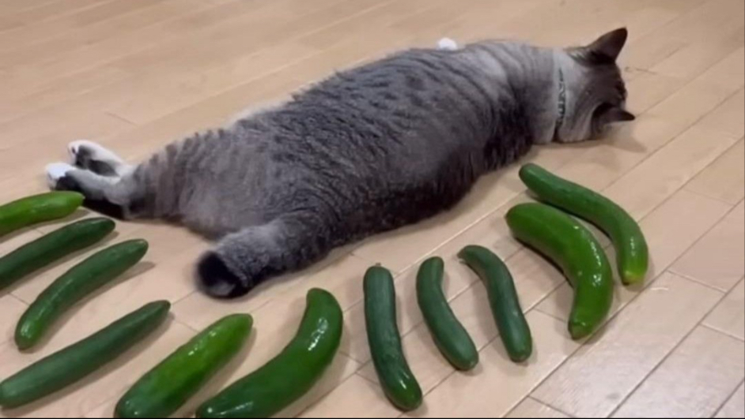 | 45.7万 | 2025-08-12 |
| [哈基米惨遭大狗嚼兄弟调教](https://www.bilibili.com/video/BV1yctRzEEEE) | 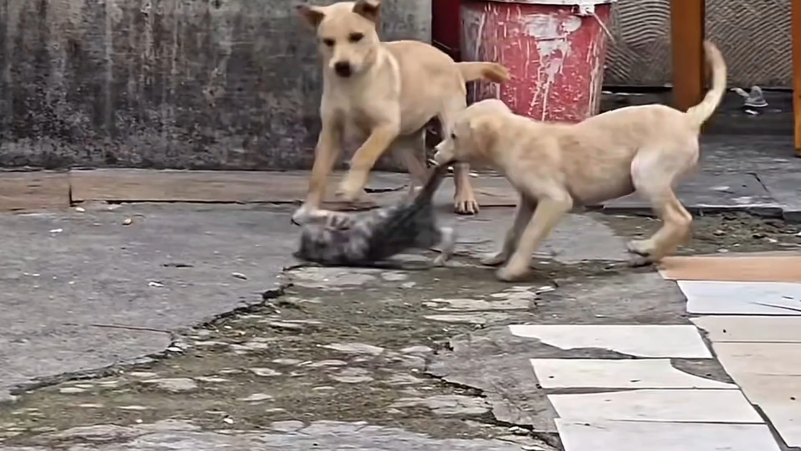 | 12.4万 | 2025-08-12 |
| [循环歌单｜【睡觉の小曲】｜《哈基米:花田》](https://www.bilibili.com/video/BV1VB4RzFErB) | 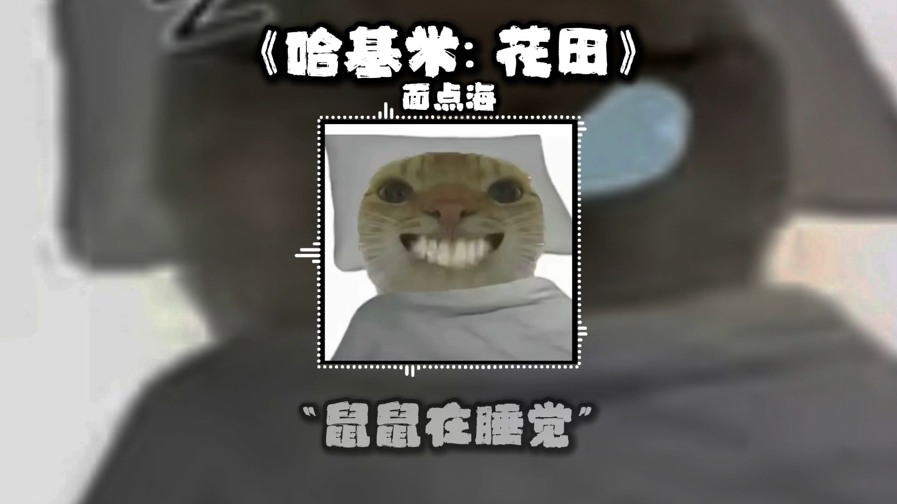 | 18.1万 | 2025-08-05 |
| [【哈基米】猛毒注意（完整版）](https://www.bilibili.com/video/BV1F4h4zBEhF) |  | 220.4万 | 2025-08-02 |
| [哈基米名曲大合集&amp;不哈气挑战](https://www.bilibili.com/video/BV1kShnztEyr) |  | 11.9万 | 2025-08-01 |
| [愿戴哈基米坠入曼波(愿戴荣光坠入天渊)](https://www.bilibili.com/video/BV1CJ8az9ETy) |  | 29.0万 | 2025-07-27 |
| [日本萝莉看哈基米和曼波大战Dio 当场绷不住](https://www.bilibili.com/video/BV1BC8KzGEnj) |  | 26.4万 | 2025-07-24 |
| [术力口哈基米：延误基米](https://www.bilibili.com/video/BV1XNgWzYEXp) |  | 22.4万 | 2025-07-23 |
| [哈基米FM：慢波SLOW DOWN](https://www.bilibili.com/video/BV1aau8zLEAQ) |  | 27.7万 | 2025-07-16 |
| [赌耋](https://www.bilibili.com/video/BV13nuHzQEfi) | 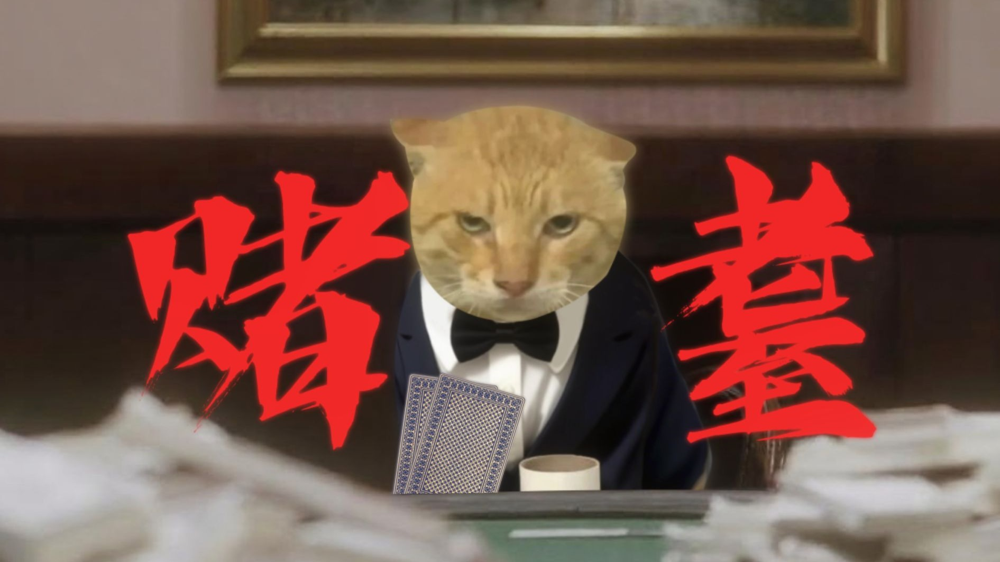 | 55.9万 | 2025-07-15 |
| [【纯净哈基米】🧡I Love You So💛完整版](https://www.bilibili.com/video/BV17LuqzgELQ) | 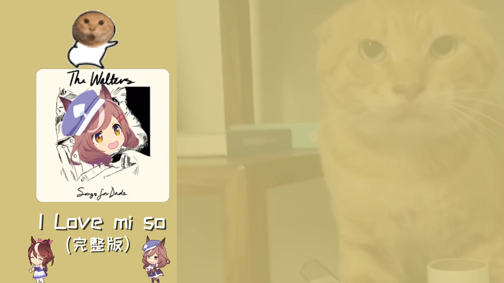 | 21.6万 | 2025-07-14 |
| [R&amp;B哈基米：特别的基](https://www.bilibili.com/video/BV1MeujzqEeN) |  | 10.4万 | 2025-07-12 |
| [哈基米一定要会哈气！](https://www.bilibili.com/video/BV11tugzjEyL) | 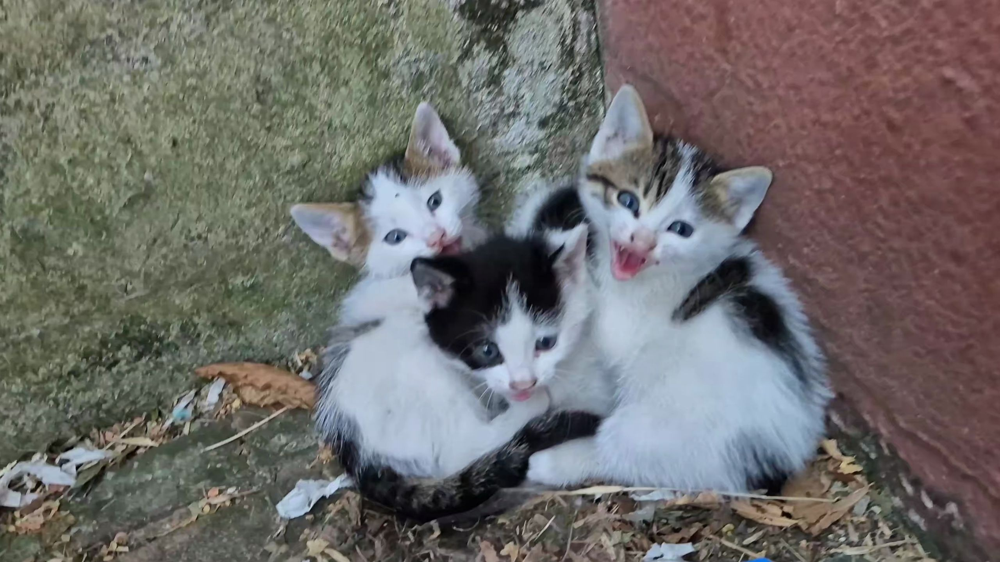 | 10.3万 | 2025-07-11 |
| [【哈基米】你若三冬（将军的小曲）哈基米听完想吃广东菜了](https://www.bilibili.com/video/BV1zP3iz1Eg2) |  | 21.3万 | 2025-07-06 |
| [🐱shape of hachimi🐱](https://www.bilibili.com/video/BV1jf3SzjE69) |  | 152.6万 | 2025-07-05 |
| [哈基米：WAKE UP!](https://www.bilibili.com/video/BV1KdNXzWEPk) |  | 117.7万 | 2025-06-22 |
| [哈基米：🐱达拉崩吧🐱](https://www.bilibili.com/video/BV1qpNjzgEq5) |  | 73.6万 | 2025-06-18 |
| [⚡约 德 尔 曼 波⚡](https://www.bilibili.com/video/BV1KUMAzdEaZ) |  | 174.1万 | 2025-06-13 |
| [🎵Deadmanbo🎵似曼波](https://www.bilibili.com/video/BV1psTAzEEDx) |  | 10.3万 | 2025-06-06 |
| [ASMR｜哈基米耄耋领衔，全网最抽象热梗助眠解压！](https://www.bilibili.com/video/BV1Gu7UzpE1k) | 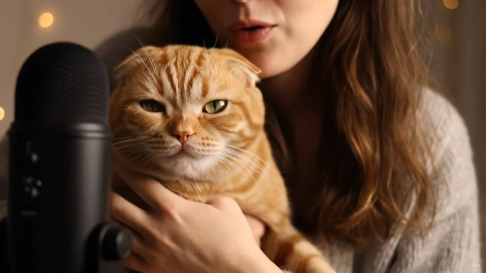 | 47.8万 | 2025-06-02 |
| [真正想哈的基米脸上是没有笑容的【哈基米：关山酒】](https://www.bilibili.com/video/BV15UjbzcEMk) |  | 74.6万 | 2025-05-24 |
| [《为了哈气下去，即使没有明天》](https://www.bilibili.com/video/BV1vjJWztE61) |  | 117.7万 | 2025-05-23 |
| [哈基米：我无怨无悔](https://www.bilibili.com/video/BV1HuJWzPEKa) |  | 577.2万 | 2025-05-23 |
| [圆头耄耋成名之战](https://www.bilibili.com/video/BV13UJez7EkX) | 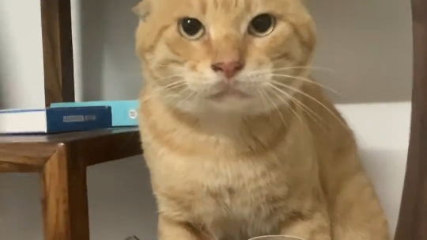 | 180.6万 | 2025-05-21 |
| [🎵哈基博士🎵](https://www.bilibili.com/video/BV1tuEAzUEgx) | 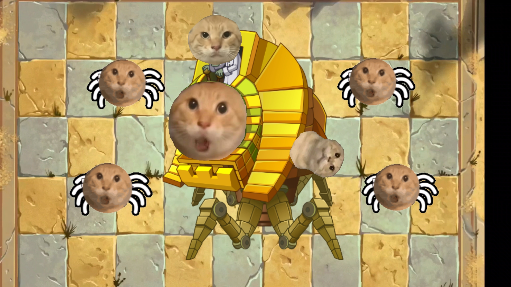 | 85.7万 | 2025-05-13 |
| [哈基米大战各种动物合集，一次性看个爽](https://www.bilibili.com/video/BV1z95LzaEHh) | 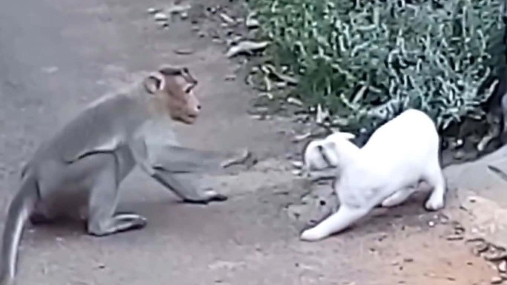 | 19.7万 | 2025-05-09 |
| [四月精选，量大管饱](https://www.bilibili.com/video/BV1uSV6zEEWs) |  | 94.0万 | 2025-05-06 |
| [圆头耄帝独断万古（纯享版）](https://www.bilibili.com/video/BV1gELPzDEp2) |  | 153.7万 | 2025-04-21 |
| [哈基米：哈梅戏 谁料基米中状元](https://www.bilibili.com/video/BV1h8RiYhEpv) |  | 98.5万 | 2025-04-06 |
| [乖猫FM之哈基米灵感菇](https://www.bilibili.com/video/BV1BJAUeNEYB) |  | 13.7万 | 2025-02-23 |
| [哈基米dehors （完整版）](https://www.bilibili.com/video/BV1obAzeTErx) |  | 51.8万 | 2025-02-19 |
| [哈基米：Counting Stars](https://www.bilibili.com/video/BV1ZMFyeLEUs) |  | 143.0万 | 2025-02-02 |
| [【哈基米】“所念皆哈基，哈基中是咪”——所念皆星河](https://www.bilibili.com/video/BV1hNfqY3EMg) |  | 45.3万 | 2025-01-23 |
| [【哈基米乐】基卫(精卫)](https://www.bilibili.com/video/BV1kPwPeCEeU) |  | 26.9万 | 2025-01-18 |
| [补档齿轮镖 猫部分经典](https://www.bilibili.com/video/BV1yF6VYQEQT) | 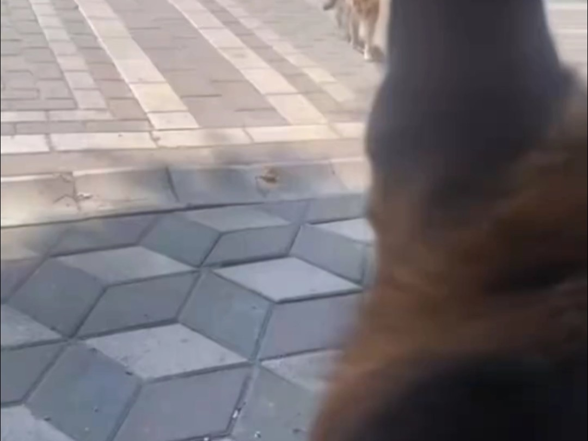 | 40.9万 | 2024-12-31 |
| [曼波、曼波、有时哈基米](https://www.bilibili.com/video/BV1g4moYBE4M) |  | 275.0万 | 2024-11-15 |
| [大石碎基米（7分钟完整版）](https://www.bilibili.com/video/BV1v2S6YqENF) |  | 105.2万 | 2024-11-03 |
| [🎵曼波 𝑵𝒐 𝑴𝒐𝒓𝒆🎵不再曼波](https://www.bilibili.com/video/BV1fJSEY1E7h) |  | 593.3万 | 2024-10-31 |
| [哈雪大帽险](https://www.bilibili.com/video/BV1gQetekE5P) |  | 1252.2万 | 2024-08-15 |
| [稻香米【基米合战Day9】](https://www.bilibili.com/video/BV1YWYaepEFS) |  | 52.3万 | 2024-08-10 |
| [哈基米：江南](https://www.bilibili.com/video/BV1Di421h76K) |  | 149.5万 | 2024-07-20 |
| [4K超高清多机位大型猫片！ 未成年哈基米不让进！](https://www.bilibili.com/video/BV1zH4y1F7DR) | 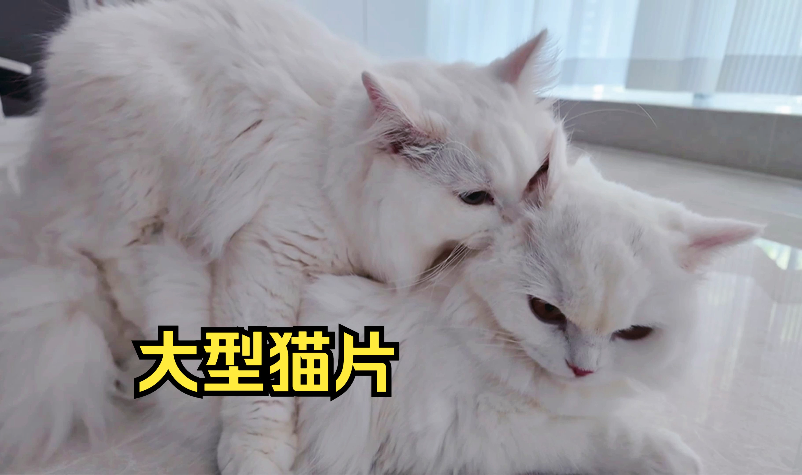 | 26.9万 | 2024-07-14 |
| [【熊出没】哈基米](https://www.bilibili.com/video/BV1Ji421h7wc) |  | 65.4万 | 2024-07-10 |
| [云宫迅音之哈基米基](https://www.bilibili.com/video/BV1zZ421g7Ae) |  | 55.6万 | 2024-06-28 |
| [人群当中钻出来一个哈基米](https://www.bilibili.com/video/BV1t1421R77U) |  | 45.8万 | 2024-04-23 |
| [【帝王】⚡你能忍受哈基米的洗脑么⚡牡蛎⚡](https://www.bilibili.com/video/BV1Wm4y1u7YQ) |  | 137.7万 | 2023-08-31 |

---
*最后更新: 2025-09-25 02:36:42 (自动生成)*
*数据来源: [Bilibili](https://www.bilibili.com)*

## 使用说明

运行以下命令更新视频列表:
```bash
python3 fetch_hajimi_videos.py
```
