# awesome-hajimi
collections of hajimi (哈基米 in Chinese) on the Internet.

## 视频列表 (Video List)

| 视频标题 (Title) | 封面 | 播放量 (Views) | 发布日期 (Date) |
|---|---|---|---|
| [越狱高手：哈基米（Stray）](https://www.bilibili.com/video/BV1c62pB7Ems) |  | 13 | 2025-12-06 |
| [堵桥的哈基米们！我从地狱回来侧入你们了！！！](https://www.bilibili.com/video/BV1fY2EBvE26) |  | 318 | 2025-12-06 |
| [哈基米录像之缘分来了](https://www.bilibili.com/video/BV17c2nBKEf7) | 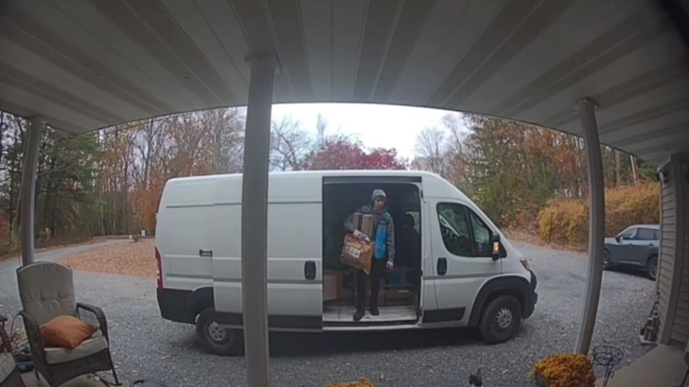 | 13 | 2025-12-06 |
| [哈基米：恒星不忘 Forever Forever](https://www.bilibili.com/video/BV1JZ2JBMEdr) |  | 99 | 2025-12-06 |
| [洛克王国12月6日星辰塔第八层威压：我方宠物使用技能额外消耗1pp，同时不能使用物理技能胜利。毒王碧水打法，神草哈基米打法。](https://www.bilibili.com/video/BV1XX2nB8E5d) |  | 722 | 2025-12-05 |
| [哈基米爽捞德棍核爆瓜岛  ｜  M18黑猫 【战争雷霆】](https://www.bilibili.com/video/BV11N2HBHEeJ) |  | 120 | 2025-12-05 |
| [哈基米13杀核爆诺曼底  ｜  M18黑猫 【战争雷霆】](https://www.bilibili.com/video/BV1Nn2EByEoP) |  | 166 | 2025-12-05 |
| [Dvl-10 破坏者 狙击步枪：静谧且迅猛的狂野哈基米  双端手感一流](https://www.bilibili.com/video/BV1gg2EBHE4V) |  | 435 | 2025-12-05 |
| [哈基米《基米说》永劫无间](https://www.bilibili.com/video/BV1in2JBYEa7) |  | 207 | 2025-12-05 |
| [『天天炫斗』接下来登场的是 炫斗牢九门之 神秘挠人哈基米大王](https://www.bilibili.com/video/BV1hm2jBEELa) |  | 664 | 2025-12-05 |
| [哈基米一家被蟒蛇赶出来，外面还在下雨](https://www.bilibili.com/video/BV1wu27BPEjM) | 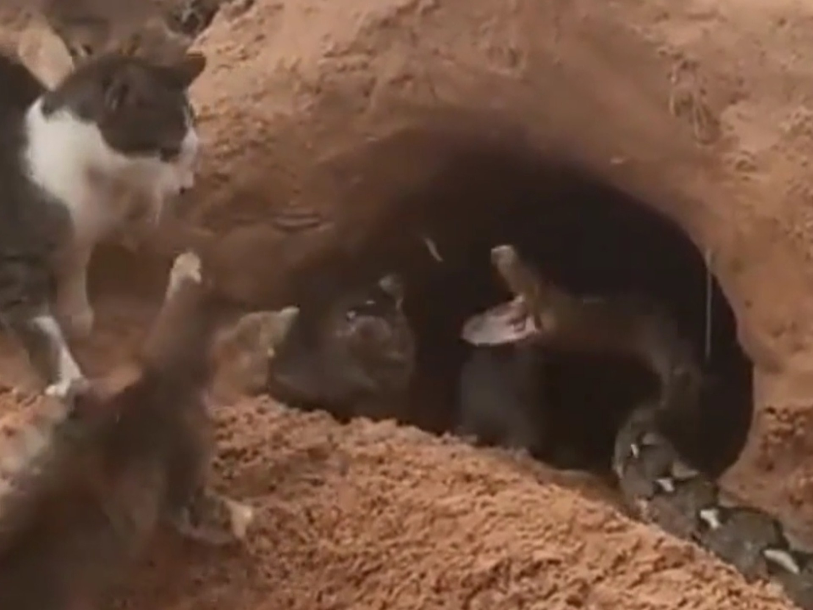 | 377 | 2025-12-05 |
| [瓶子：当初解释哈基米是蜂蜜的时候，想到过今天用着耄耋表情包唱哈基米音乐吗？！](https://www.bilibili.com/video/BV1fG27BcETi) |  | 2757 | 2025-12-05 |
| [瓶子直播放哈基米神人音乐，放完直接唱起来了，弹幕全是问号，问瓶子是不是喝大了【瓶子君152】](https://www.bilibili.com/video/BV1TR2jBCEne) |  | 3.0万 | 2025-12-05 |
| [其实我也只是一只没强度没建模的哈基米么?-火影忍者手游 -火影忍者 -火影决斗场忍者小曲 你们那些决斗场ban哈基米让我上不去分的的 再ban我就要哈气了凸(｀](https://www.bilibili.com/video/BV1h427BDEtQ) |  | 424 | 2025-12-05 |
| [当哈基米音乐，变成TVB卡通主题曲！《神曼波》真.粤语版！](https://www.bilibili.com/video/BV12i2BBNEhE) |  | 8900 | 2025-12-05 |
| [当你同时采样哈基米南北绿豆和瓦瓦做成两年前很火的漂移phonk](https://www.bilibili.com/video/BV1yk27B6EmK) | 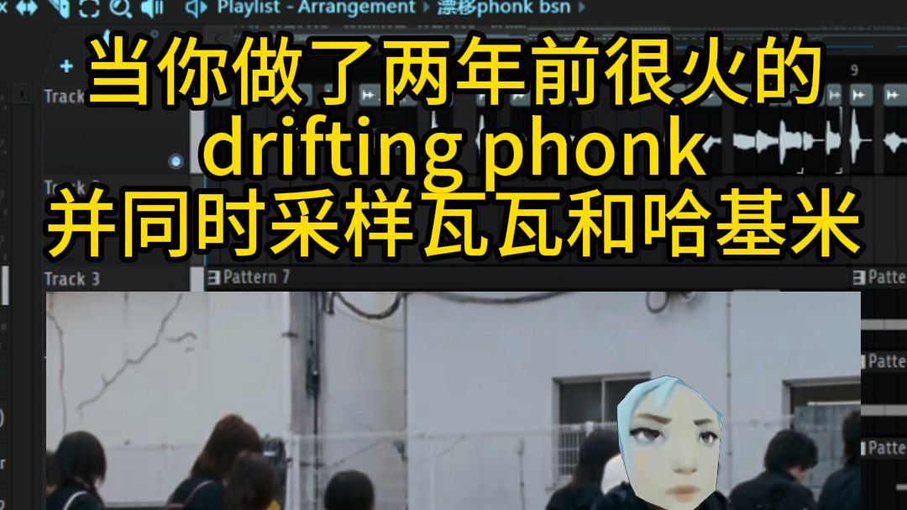 | 686 | 2025-12-05 |
| [【哈基米音乐】哈与基消失之米](https://www.bilibili.com/video/BV1Sg2tBGE9V) |  | 584 | 2025-12-05 |
| [反骨基米撸猫教程(养生流)#哈基米#撸猫](https://www.bilibili.com/video/BV1FK2LBtEPi) |  | 166 | 2025-12-05 |
| [⚡哈基米音效包⚡](https://www.bilibili.com/video/BV1wP2LBfEsv) |  | 532 | 2025-12-05 |
| [物理学的哈基米 现代科学掘墓人](https://www.bilibili.com/video/BV1zu2LBsEta) |  | 3.0万 | 2025-12-05 |
| [【基米砂锅冷】“当耄耋基因占领野猫纯良智商，是挠人代码更悠闲”（寂寞沙洲冷）](https://www.bilibili.com/video/BV1i92LBsEUc) |  | 318 | 2025-12-05 |
| [哈基米助眠丨你必须在这个视频里入睡](https://www.bilibili.com/video/BV1Hy2LBhE5t) |  | 2265 | 2025-12-05 |
| [哈基米南北绿豆好不好喝？打个几分？简单开箱“试毒”一下😃](https://www.bilibili.com/video/BV1Jg2LBRE3R) | 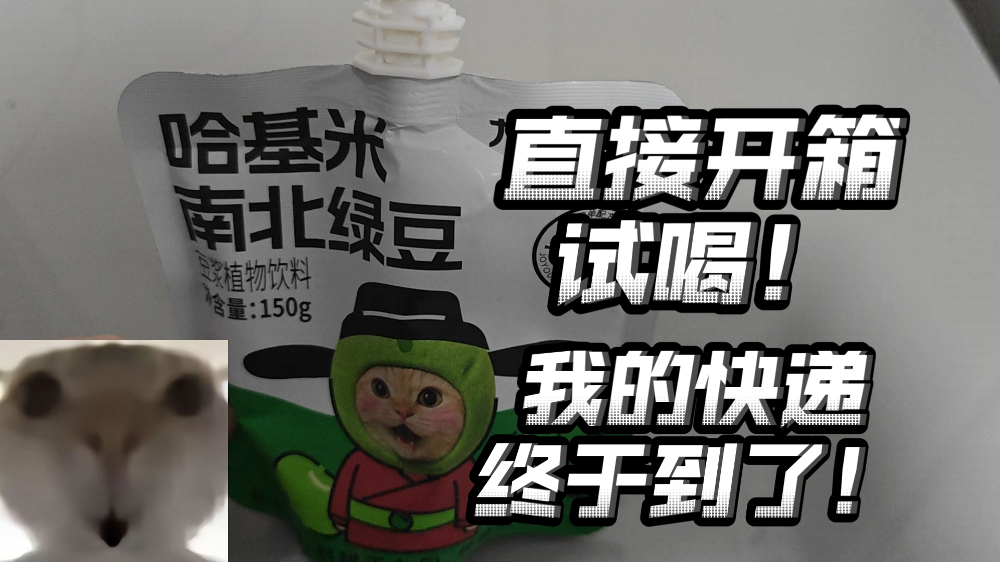 | 2047 | 2025-12-05 |
| [废物哈基米玩都能把自己玩死](https://www.bilibili.com/video/BV1zg2LB9E5g) |  | 2038 | 2025-12-05 |
| [出包基米：哈气project🐱](https://www.bilibili.com/video/BV1KX25BTEyM) |  | 581 | 2025-12-05 |
| [哈基米～曼波～](https://www.bilibili.com/video/BV1Aw2LBcEGS) |  | 2621 | 2025-12-05 |
| [【哈基米不贪吃】新作上线，快来看看！](https://www.bilibili.com/video/BV1Pf25BAERe) | 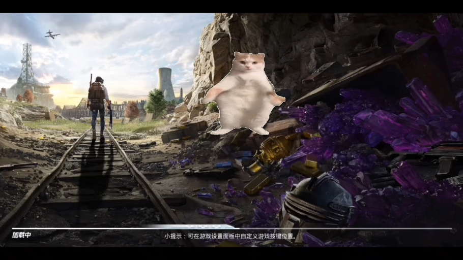 | 11 | 2025-12-05 |
| [【哈基米音乐】哈色柳丁（黑色柳丁-陶喆）](https://www.bilibili.com/video/BV1Cf25BwEEy) |  | 626 | 2025-12-05 |
| [【哈基米音乐】可爱曼波（这一声哈基米，开启了一个时代）](https://www.bilibili.com/video/BV1xV2qBwE5t) |  | 3829 | 2025-12-05 |
| [哈冀咪在寻觅，绿豆在哪里？！](https://www.bilibili.com/video/BV1zW2vB2EK2) |  | 7814 | 2025-12-05 |
| [哈基米依旧狠狠哈住](https://www.bilibili.com/video/BV18x2LBCEMA) |  | 156 | 2025-12-05 |
| [【哈基米音乐】传说中的耄耋BGM 二阶段_無限の哈気を持ちて](https://www.bilibili.com/video/BV15G2VB1EUx) | 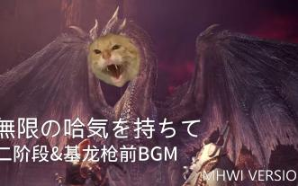 | 2445 | 2025-12-05 |
| [勤俭持家任务失败，哈气的哈基米济阳。](https://www.bilibili.com/video/BV1Ft2jBwEod) | 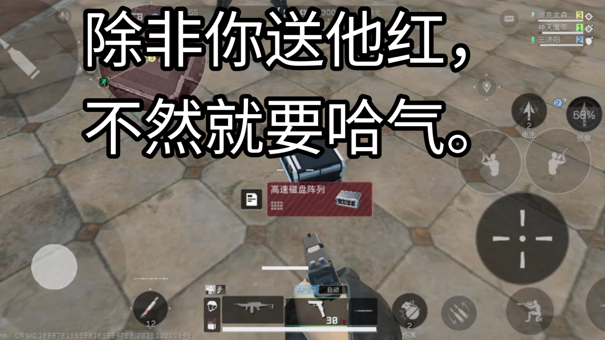 | 405 | 2025-12-05 |
| [哈基米南北绿豆](https://www.bilibili.com/video/BV1wp2jBvEmq) |  | 140 | 2025-12-05 |
| [没有比这更逆天的视频了](https://www.bilibili.com/video/BV1ws2jBPEvE) |  | 12.1万 | 2025-12-05 |
| [拯救哈基米](https://www.bilibili.com/video/BV1bt2VBeEpV) | 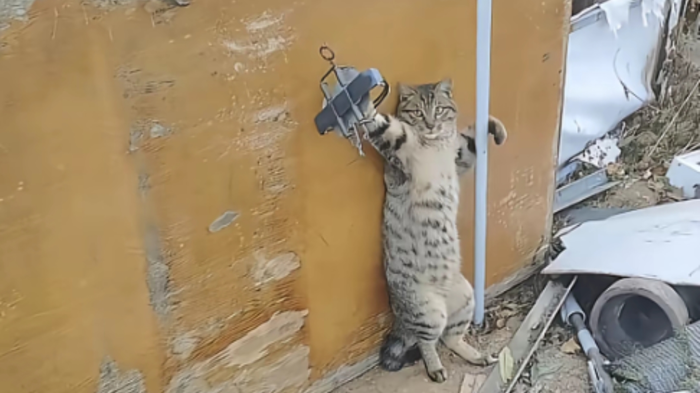 | 1128 | 2025-12-05 |
| [哈基米电音：Candyland🐱](https://www.bilibili.com/video/BV1t42VBNEWC) |  | 751 | 2025-12-05 |
| [数学课偷吃辣条被抓不得已攻击家里的厨房](https://www.bilibili.com/video/BV1Qr25BCEo7) |  | 59.9万 | 2025-12-05 |
| [【熟肉】火影忍者……？哈基米又是什么啊？](https://www.bilibili.com/video/BV1ixSKBYELi) | 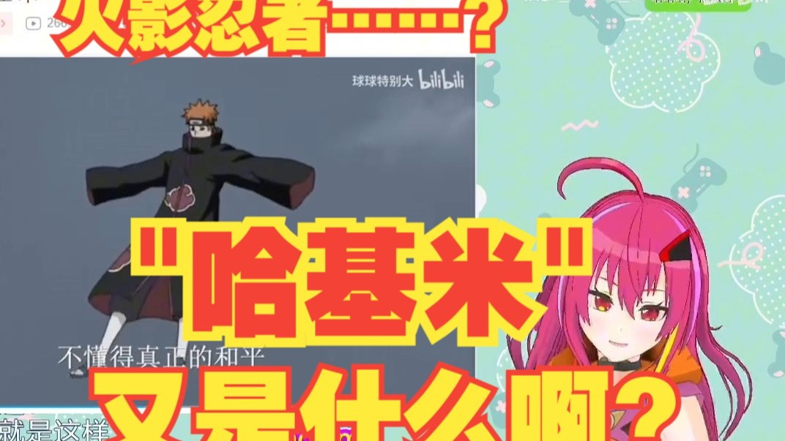 | 2472 | 2025-12-05 |
| [哈基米 every body](https://www.bilibili.com/video/BV1zT24BxExJ) |  | 7933 | 2025-12-05 |
| [🙏别划走！现在是哈基米治愈时间！鼠愿🙏](https://www.bilibili.com/video/BV18P2vB8Ezk) |  | 918 | 2025-12-05 |
| [【温】⚡️哈基米南北绿豆⚡️她流一滴泪！我屠一座蜜雪冰城！](https://www.bilibili.com/video/BV1X625BLEpx) |  | 8.4万 | 2025-12-05 |
| [世纪难题：屏幕上究竟有几只哈基米？](https://www.bilibili.com/video/BV1fP2iBEESA) |  | 1.2万 | 2025-12-05 |
| [《哈基米の小曲》｜“前方含喵量超标”](https://www.bilibili.com/video/BV17C23B1EaG) |  | 1370 | 2025-12-05 |
| [（补裆）基米在冰层下面溺亡结果突然复活了](https://www.bilibili.com/video/BV1gc2GBPEqm) | 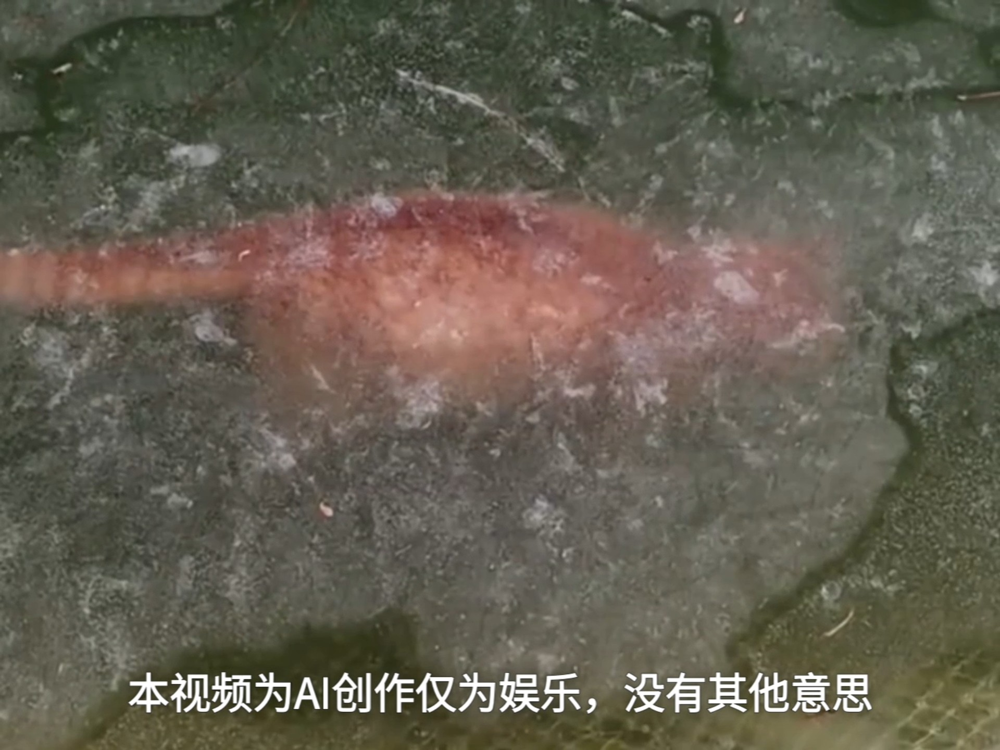 | 1.9万 | 2025-12-05 |
| [小基米你果然有几分他的影子，真令我欢喜](https://www.bilibili.com/video/BV13r2vBNEi3) | 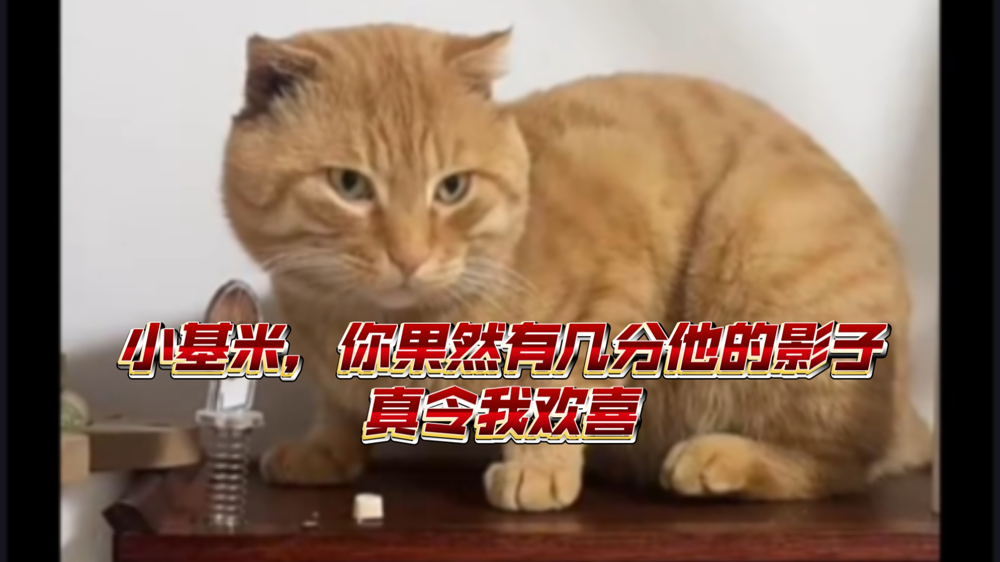 | 533 | 2025-12-04 |
| [“惹得天怒地也恼 人间再无大狗叫&quot;《大天蓬》【哈基米FM】](https://www.bilibili.com/video/BV1Wd2vBREwN) |  | 6003 | 2025-12-04 |
| [“   流 浪 的 哈 基 人  ”](https://www.bilibili.com/video/BV1wc2iBHEmo) |  | 6.0万 | 2025-12-04 |
| [哈基米剪辑第三天 今天剪的有点小活](https://www.bilibili.com/video/BV1vR2iB5E7b) | 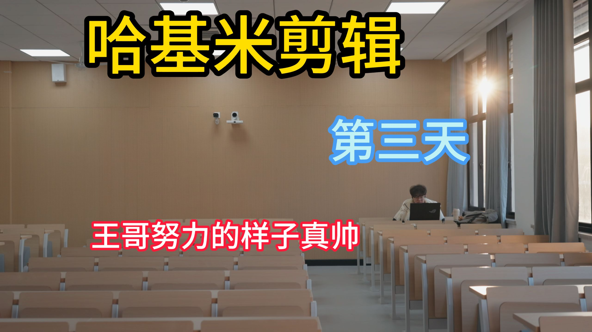 | 5811 | 2025-12-04 |
| [【哈基米AI音乐】月底没钱君《神曼波》解读](https://www.bilibili.com/video/BV1ed2iBCEM2) |  | 3779 | 2025-12-04 |
| [【补档】⚡️我们不说哈基米⚡️](https://www.bilibili.com/video/BV1ac2qBgEjk) |  | 4.4万 | 2025-12-04 |
| [人造耄耋复活了，百分百复刻经典战役](https://www.bilibili.com/video/BV1Qw2qBzEJU) |  | 3.5万 | 2025-12-04 |
| [捡到两只哈基米......](https://www.bilibili.com/video/BV1fA2eB3Esi) |  | 5.3万 | 2025-12-04 |
| [盘点包被眼中的挑衅行为](https://www.bilibili.com/video/BV1wo2YBjEZq) | 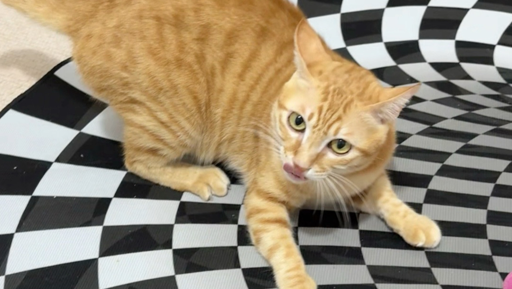 | 17.7万 | 2025-12-04 |
| [【少前2】哈卜茜可爱哈基米，酸队前期好帮手！哈卜茜玩法/锥体/固键/武器/配队教学](https://www.bilibili.com/video/BV1242eBREQX) |  | 2949 | 2025-12-04 |
| [给室友做了个哈基米小狗](https://www.bilibili.com/video/BV16B2eB7Emn) | 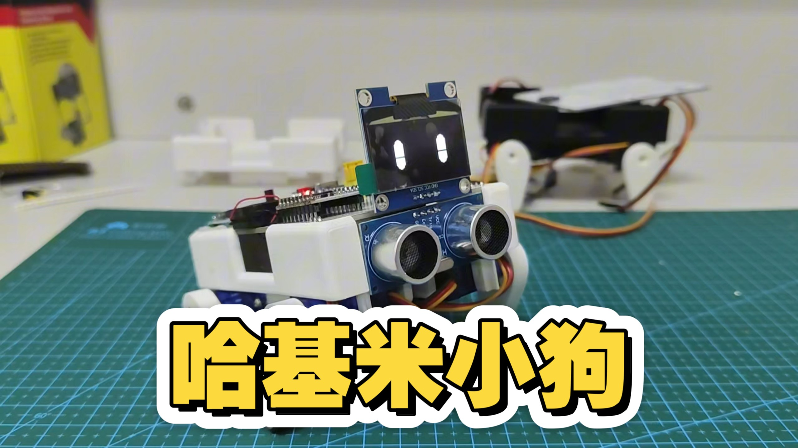 | 168 | 2025-12-04 |
| [丰川祥子喝哈基米南北绿豆变身哈基米](https://www.bilibili.com/video/BV1rB2eB7Ehw) |  | 3.2万 | 2025-12-04 |
| [这种哈基米能撸吗](https://www.bilibili.com/video/BV1Up2eBtE34) | 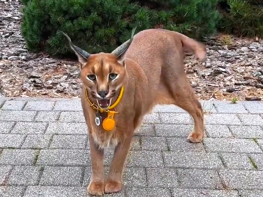 | 17.1万 | 2025-12-04 |
| [🐱若敢哈气，必叫你大败而归！🐱](https://www.bilibili.com/video/BV16RS4BNEXT) |  | 2.0万 | 2025-12-04 |
| [🐱统治吧，哈基米！🐱（哈基米音乐：Rule, Britannia）](https://www.bilibili.com/video/BV1Sc2vBaEy4) |  | 474 | 2025-12-04 |
| [坚韧拔哈基米胡子](https://www.bilibili.com/video/BV1Ah2aBLET4) | 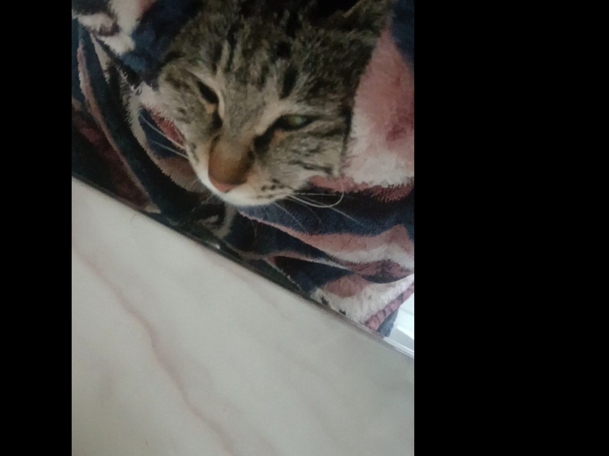 | 1044 | 2025-12-04 |
| [⚡哈基米Running up that hill⚡](https://www.bilibili.com/video/BV1U32tBrEJr) |  | 7124 | 2025-12-04 |
| [没有比这个更逆天的视频了](https://www.bilibili.com/video/BV1Ex2vBLEKk) |  | 48.8万 | 2025-12-04 |
| [【打火机（哈基米）】哈基米呀南北绿豆](https://www.bilibili.com/video/BV1is2YBMEmR) |  | 349 | 2025-12-04 |
| [半夜宿舍楼下哈基米惨遭大狗嚼](https://www.bilibili.com/video/BV1EJ2YBrE1k) | 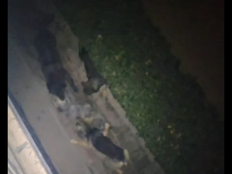 | 380 | 2025-12-04 |
| [熟女妈妈版本的曼波&amp;哈基米，紧急戴上耳机！](https://www.bilibili.com/video/BV1ys28B6E1J) |  | 6049 | 2025-12-04 |
| [凡人修仙传哈基米版！](https://www.bilibili.com/video/BV13A2xBgEMK) |  | 8987 | 2025-12-03 |
| [哈基米合唱团](https://www.bilibili.com/video/BV1ny2sBpEEw) |  | 1211 | 2025-12-03 |
| [Aigc AI 美女+自家哈基米 古风短舞 不谓侠 DJ_4K_36S](https://www.bilibili.com/video/BV1wz2sBdEjk) |  | 2188 | 2025-12-03 |
| [5分钟救上来的猫，有人却救了一辈子](https://www.bilibili.com/video/BV1FxSYBEE9r) | 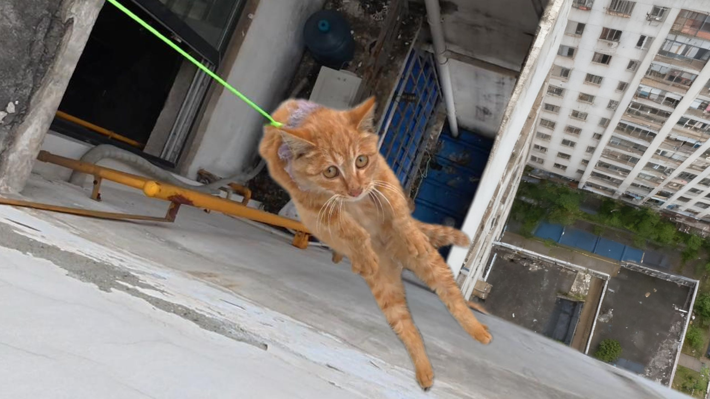 | 38.1万 | 2025-12-03 |
| [以防你没听过花玲唱《哈基米》](https://www.bilibili.com/video/BV1ejSeBVEBD) |  | 6531 | 2025-12-03 |
| [要干吗....](https://www.bilibili.com/video/BV1xR2xBeEK9) |  | 35.8万 | 2025-12-03 |
| [做！最能哈气的豪猫！](https://www.bilibili.com/video/BV1bKSYBwEJX) |  | 1.3万 | 2025-12-03 |
| [哈基米这个处变不惊](https://www.bilibili.com/video/BV1A5SYBdEZM) |  | 8.0万 | 2025-12-03 |
| [哈基米德临哈值实验合集](https://www.bilibili.com/video/BV1poShBJEa6) | 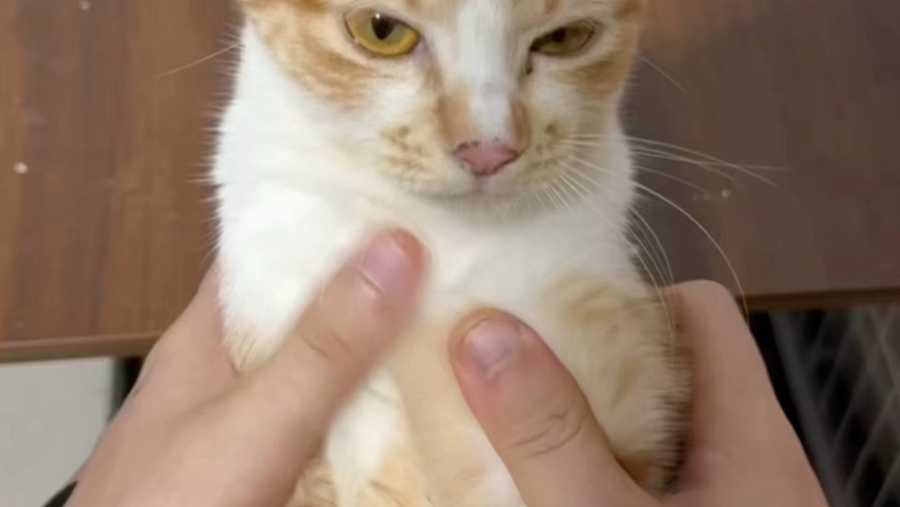 | 16.8万 | 2025-12-03 |
| [哈基米被大火烧伤，导致只有三条腿了](https://www.bilibili.com/video/BV1rNSeBDEP5) | 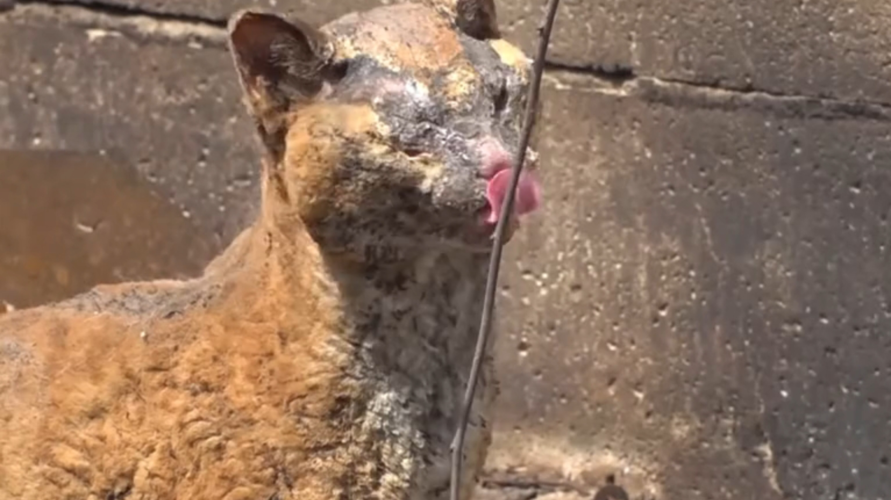 | 9.3万 | 2025-12-03 |
| [今天不博弈](https://www.bilibili.com/video/BV1kZShBmEbV) | 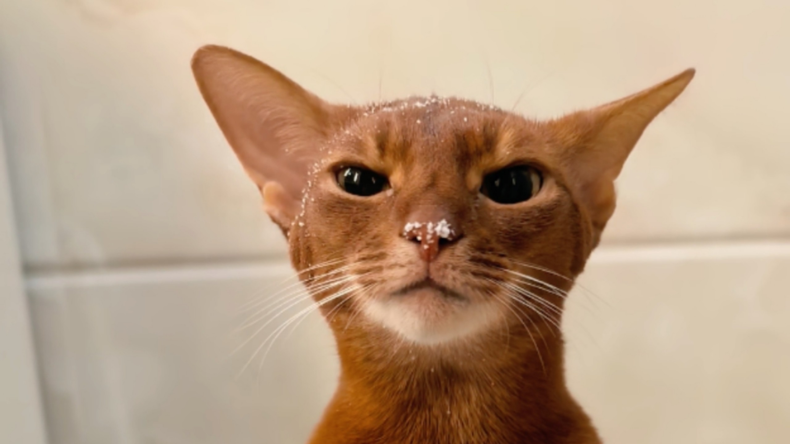 | 14.4万 | 2025-12-03 |
| [我把皇室战争的一些卡牌音效改成了哈基米！](https://www.bilibili.com/video/BV15HS4BoEzQ) |  | 42.5万 | 2025-12-03 |
| [猫：“你闹够了没有~”](https://www.bilibili.com/video/BV1NCS4BkED5) |  | 9.5万 | 2025-12-03 |
| [假装压下动物](https://www.bilibili.com/video/BV1g2SHBNEAg) |  | 58.4万 | 2025-12-02 |
| [高校弃养的流浪猫应依法捕杀。然后炸出一堆人说杀你都不杀猫。那么一个人要杀动物一个人要杀人，哪个更可怕？流浪猫狗捕杀是有法可依的事，竟然因此对人这么大恶意。](https://www.bilibili.com/video/BV1wmSsBwETP) | 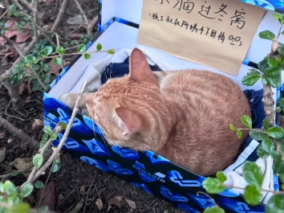 | 5723 | 2025-12-02 |
| [哈基米死了，也没人埋他](https://www.bilibili.com/video/BV1J4SWBdEAh) |  | 3518 | 2025-12-02 |
| [哪些网络知名的梗是你自己创造的？](https://www.bilibili.com/video/BV1JGSmBWEqt) |  | 13.9万 | 2025-12-01 |
| [【哈基米音乐】《带我去找哈基米》](https://www.bilibili.com/video/BV1S3S2BNEbB) |  | 947 | 2025-12-01 |
| [邪恶小鼻嘎闪亮登场！](https://www.bilibili.com/video/BV1RVSCBTE5T) |  | 12.2万 | 2025-12-01 |
| [圆头耄耋洗热水澡](https://www.bilibili.com/video/BV1cVSKBkEKm) | 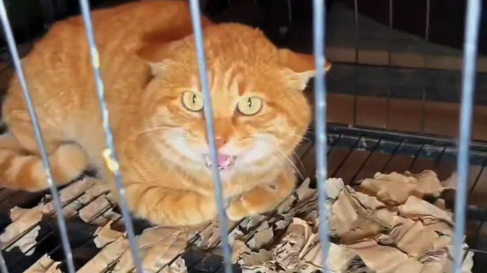 | 9411 | 2025-11-30 |
| [&quot;赶在哈气之前...&quot;](https://www.bilibili.com/video/BV1RwSNBcEkX) |  | 7012 | 2025-11-30 |
| [Montagem Miau｜阿格莱雅&amp;赛飞儿](https://www.bilibili.com/video/BV18tSwB1Ehk) |  | 45.6万 | 2025-11-30 |
| [【Hiiro】才发现中国人叫“哈基米”是“猫”，原来我是哈基米吗？](https://www.bilibili.com/video/BV13dUdBAE2B) |  | 5.6万 | 2025-11-29 |
| [舌尖上的哈基米](https://www.bilibili.com/video/BV1qPUZB1EJq) |  | 267 | 2025-11-29 |
| [循环歌单｜《阿米嘎蒂朵の小曲》《复古小猫の小曲》Montagem Miau](https://www.bilibili.com/video/BV1RhUoBMEjE) | 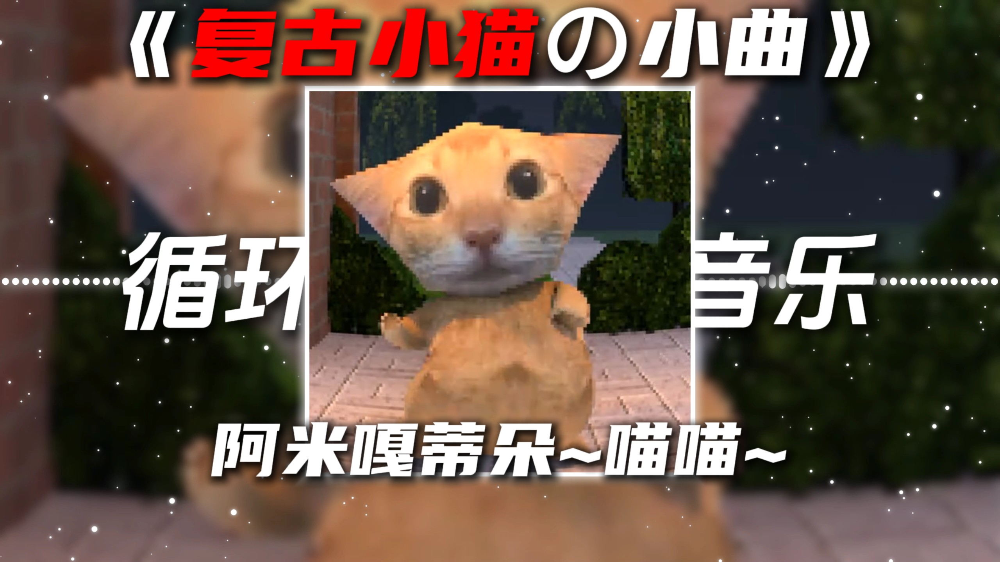 | 274.5万 | 2025-11-29 |
| [猫猫:哈基米代码是这么写的](https://www.bilibili.com/video/BV1BXUXBqEXq) | 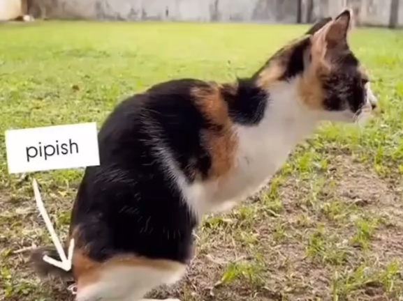 | 14.8万 | 2025-11-25 |
| [诗歌剧想睡觉](https://www.bilibili.com/video/BV1tkU1BwE5k) |  | 39.6万 | 2025-11-25 |
| [罗小黑战记/meme/前方含猫量超标/♫montagem miau](https://www.bilibili.com/video/BV1mdyPBiEhj) |  | 67.6万 | 2025-11-21 |
| [“内娱唯一哈基米85生”](https://www.bilibili.com/video/BV1x6yjBKEkp) |  | 3.2万 | 2025-11-19 |
| [猫儿这个哈基米](https://www.bilibili.com/video/BV1kcW5zHECs) |  | 2.6万 | 2025-09-19 |
| [万恶之源—哈基米！](https://www.bilibili.com/video/BV1nW8XzkET7) |  | 103 | 2025-07-29 |
| [哈基米原视频：万恶之源](https://www.bilibili.com/video/BV1Cx8wzMEFz) |  | 4580 | 2025-07-23 |
| [⚡哈基米⚡原版](https://www.bilibili.com/video/BV1NPGAzhEuZ) |  | 577 | 2025-07-09 |
| [原来哈基米的出处是在这里？！](https://www.bilibili.com/video/BV1vEMJznEte) |  | 526 | 2025-06-11 |

---
*最后更新: 2025-12-06 02:40:31 (自动生成)*
*数据来源: [Bilibili](https://www.bilibili.com)*

## 使用说明

运行以下命令更新视频列表:
```bash
python3 fetch_hajimi_videos.py
```
