# awesome-hajimi
collections of hajimi (哈基米 in Chinese) on the Internet.

## 视频列表 (Video List)

| 视频标题 (Title) | 封面 | 播放量 (Views) | 发布日期 (Date) |
|---|---|---|---|
| [【环世界】哈基米背景音乐系列之 Ceta](https://www.bilibili.com/video/BV1SkkbBvETY) | 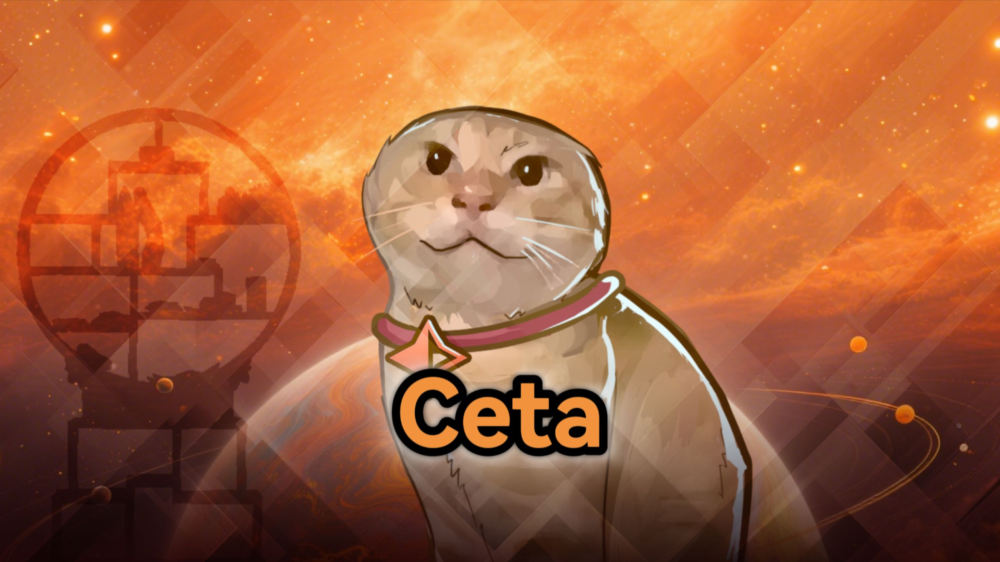 | 360 | 2026-01-19 |
| [新品上市🎁｜今年过节不收礼，收礼就收哈基米～你们要的礼盒真的来啦🐎✨](https://www.bilibili.com/video/BV1hak4BeEf9) |  | 247 | 2026-01-19 |
| [小时候爸爸给猫猫做绝育](https://www.bilibili.com/video/BV1qEk4BVE9H) |  | 1258 | 2026-01-19 |
| [⚡️这歌有力气⚡️](https://www.bilibili.com/video/BV1VVk8B5Ex9) |  | 205 | 2026-01-18 |
| [tiktok哈基米抽象视频合集](https://www.bilibili.com/video/BV1C3kbBdE3d) |  | 527 | 2026-01-18 |
| [哈基米四重奏上线](https://www.bilibili.com/video/BV1vpk4B6EhC) |  | 316 | 2026-01-18 |
| [【哈基米音乐】🐱叮叮咚基🐱扣扣脑子](https://www.bilibili.com/video/BV1xPk4B9Es4) | 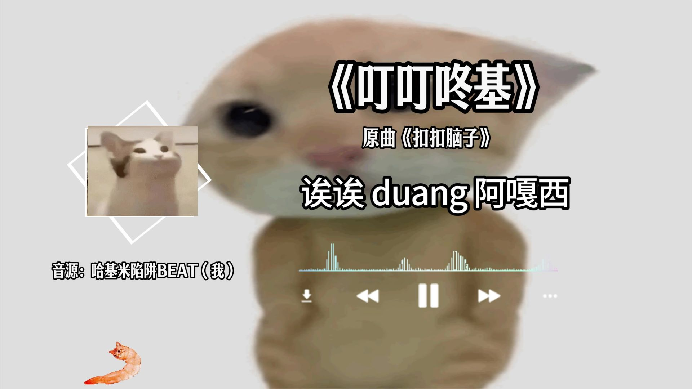 | 142 | 2026-01-18 |
| [哈基米回家开酒店金卡房会出些什么呢回马枪篇](https://www.bilibili.com/video/BV1Nck4BdEam) | 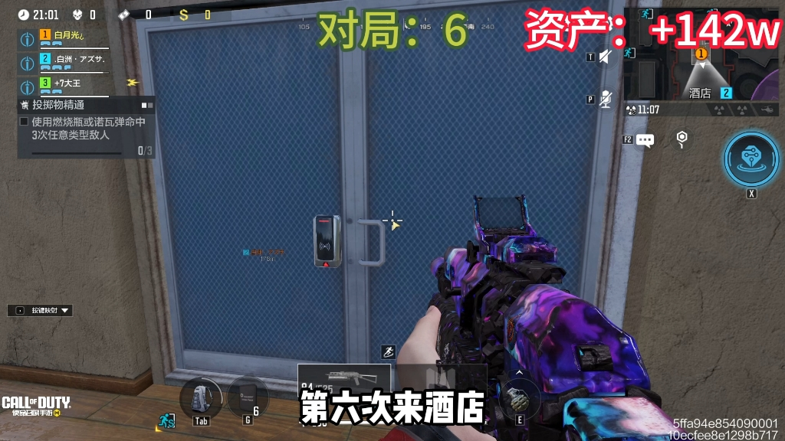 | 744 | 2026-01-18 |
| [枫哥眼哥双猫秀，哈基米挠人了](https://www.bilibili.com/video/BV12ck4BRERV) |  | 7440 | 2026-01-18 |
| [一汪星辰坠入了哈基米的眼眸～](https://www.bilibili.com/video/BV18qk4BcEcK) | 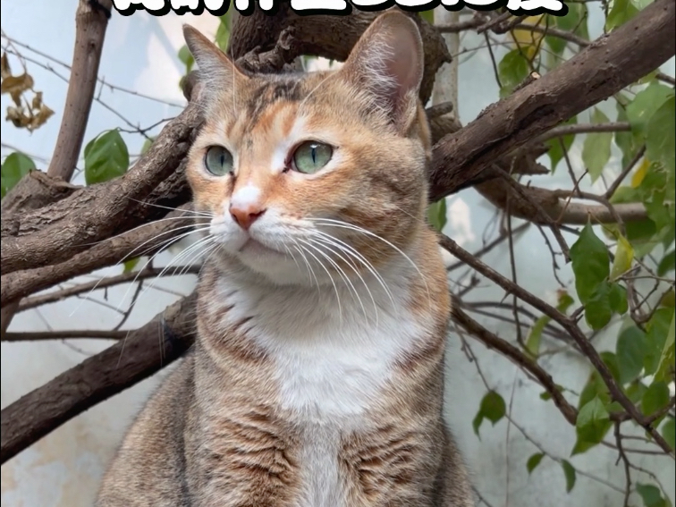 | 13 | 2026-01-18 |
| [阿米噶蒂朵哈！哈！cover](https://www.bilibili.com/video/BV11kk4BoE8i) |  | 1305 | 2026-01-18 |
| [哈基米](https://www.bilibili.com/video/BV1syk4BxEEK) | 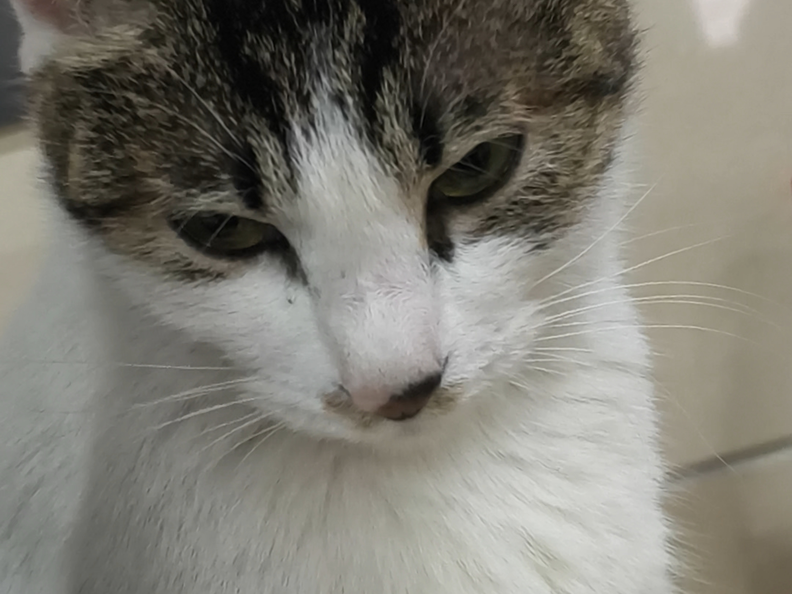 | 5 | 2026-01-18 |
| [哈基米南北绿豆！](https://www.bilibili.com/video/BV1Ytk4BTELK) | 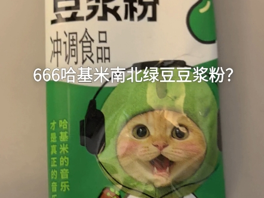 | 0 | 2026-01-18 |
| [我把哈基米宇宙带到了MC，耄的世界5.0](https://www.bilibili.com/video/BV1Eok4B7E3m) |  | 553 | 2026-01-18 |
| [哈基米的吃播](https://www.bilibili.com/video/BV1FiktBDEm2) |  | 0 | 2026-01-18 |
| [哈基米专享](https://www.bilibili.com/video/BV1FiktBDEqi) | 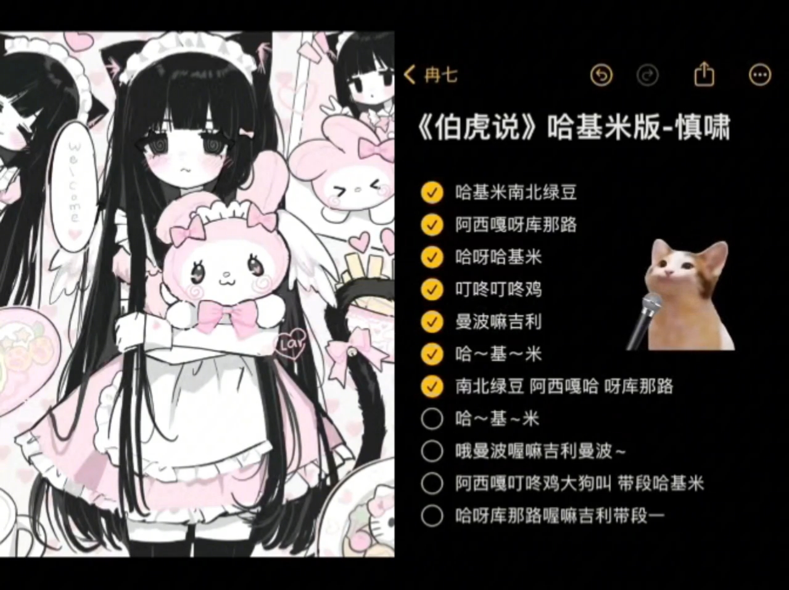 | 110 | 2026-01-18 |
| [求证：哈基米南北绿豆！](https://www.bilibili.com/video/BV1d6kxBuE53) | 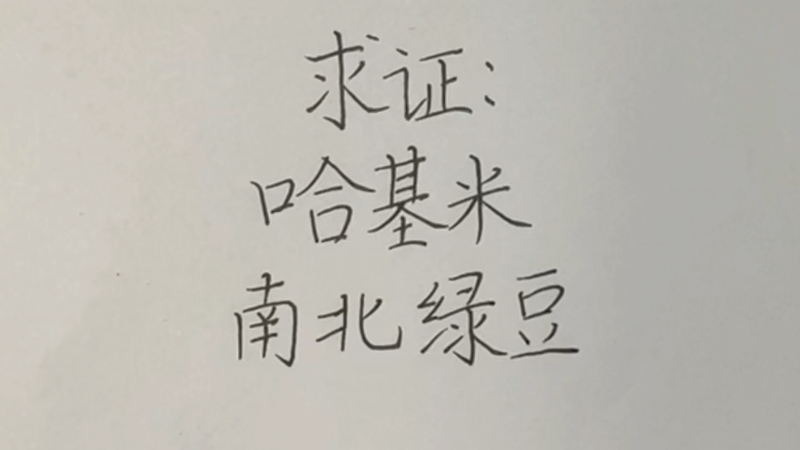 | 3045 | 2026-01-18 |
| [可怜的小哈基米 晚安](https://www.bilibili.com/video/BV1TpktB8E79) | 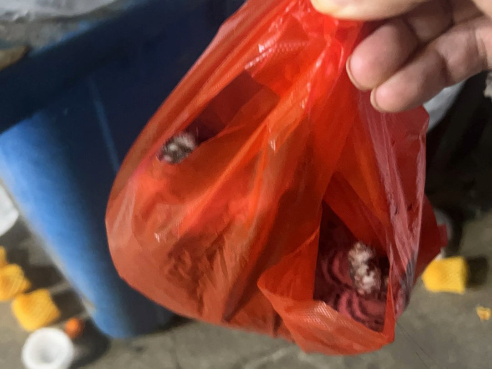 | 20 | 2026-01-18 |
| [小小哈基米我直接后攻拿下](https://www.bilibili.com/video/BV1MqksBWEFR) |  | 1105 | 2026-01-18 |
| [做了一个会飞的猫窝，哈基米的飞屋环游记](https://www.bilibili.com/video/BV17fksBMEF3) |  | 1.3万 | 2026-01-18 |
| [跳的不哈，你基米吧](https://www.bilibili.com/video/BV1yCksBEEp1) |  | 1337 | 2026-01-18 |
| [哈集美 · ハッ基米——斬殺線](https://www.bilibili.com/video/BV1a4ksBFEj4) | 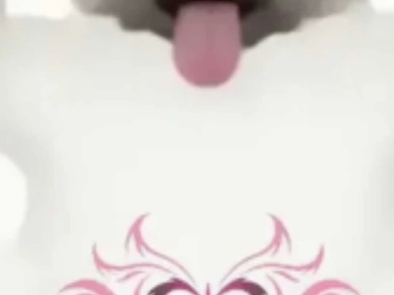 | 21 | 2026-01-18 |
| [基米TV之神人喂耋22分钟剧场版，一次看个够！](https://www.bilibili.com/video/BV1YWksBwEzw) | 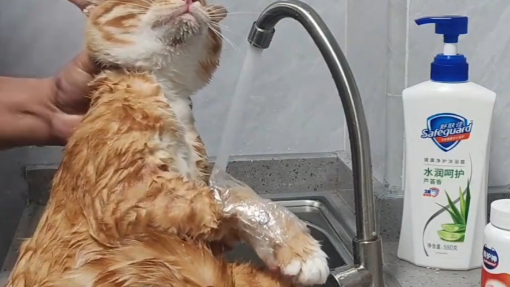 | 7830 | 2026-01-18 |
| [金色传说哈基米](https://www.bilibili.com/video/BV1JDksBCE1H) | 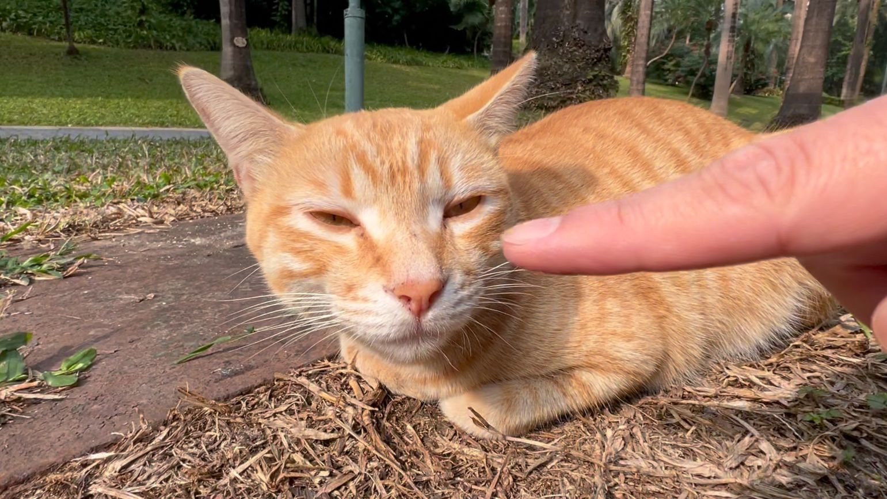 | 1650 | 2026-01-18 |
| [耄耋大战基米——主菜单音乐](https://www.bilibili.com/video/BV17dksBgECr) |  | 3391 | 2026-01-18 |
| [谢谢你，咪咪侠！](https://www.bilibili.com/video/BV1B9ksBrEXr) |  | 5009 | 2026-01-18 |
| [【皮陌涩拉】更新了一条视频，快来围观！](https://www.bilibili.com/video/BV1AtkxBEEyj) | 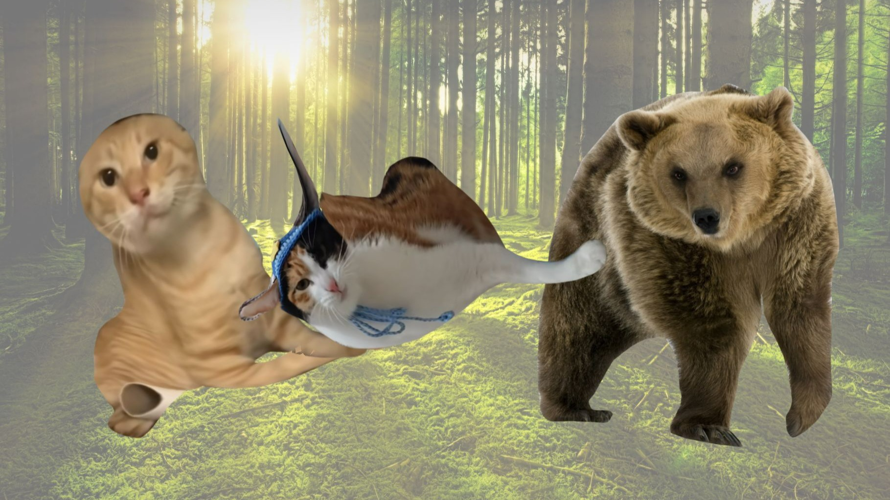 | 1248 | 2026-01-18 |
| [【游戏王md】纯黯蜜杂谈，2026年1月大师一哈基米构筑及对局思路分享](https://www.bilibili.com/video/BV1PskxBnEig) | 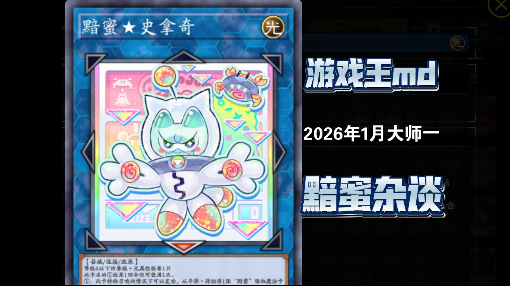 | 714 | 2026-01-18 |
| [【夜永awa】睡觉的小曲（哈基米版）](https://www.bilibili.com/video/BV1fekxBVEKy) |  | 151 | 2026-01-18 |
| [哈基米代码混乱](https://www.bilibili.com/video/BV1pbkxBmEtt) | 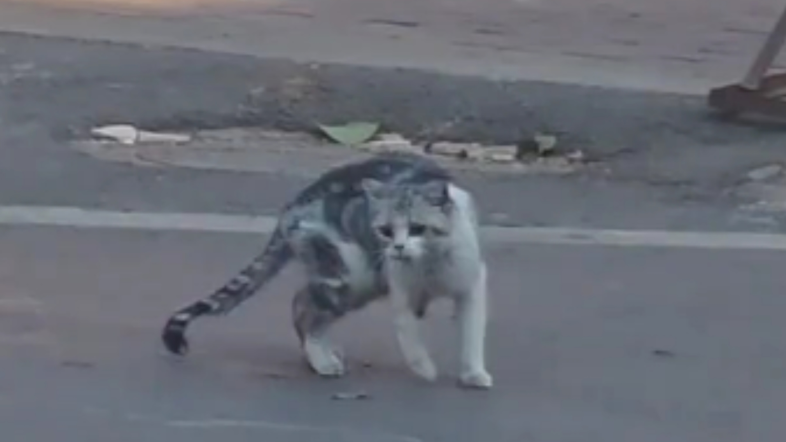 | 1727 | 2026-01-18 |
| [明天开盘启航，哈基米船长来喽](https://www.bilibili.com/video/BV1MjkxBdEm9) |  | 1787 | 2026-01-18 |
| [哈基兔最近有点凶猛，不过他永远咬不到我，我拥有极致的反应！](https://www.bilibili.com/video/BV1QDkxBaEo8) | 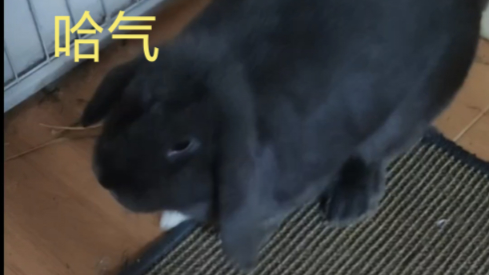 | 1436 | 2026-01-18 |
| [基米天塌了！！！](https://www.bilibili.com/video/BV1UZkxBoE4j) | 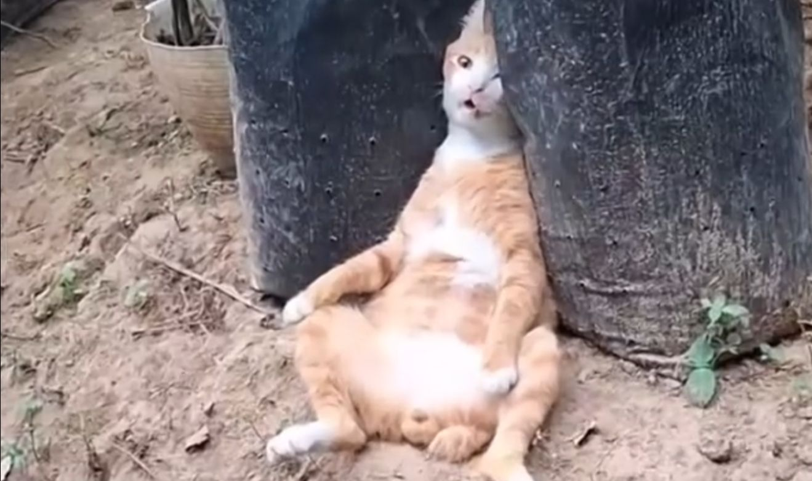 | 15.7万 | 2026-01-18 |
| [哈，基米，吴迪。！](https://www.bilibili.com/video/BV1LdkpBaEcg) | 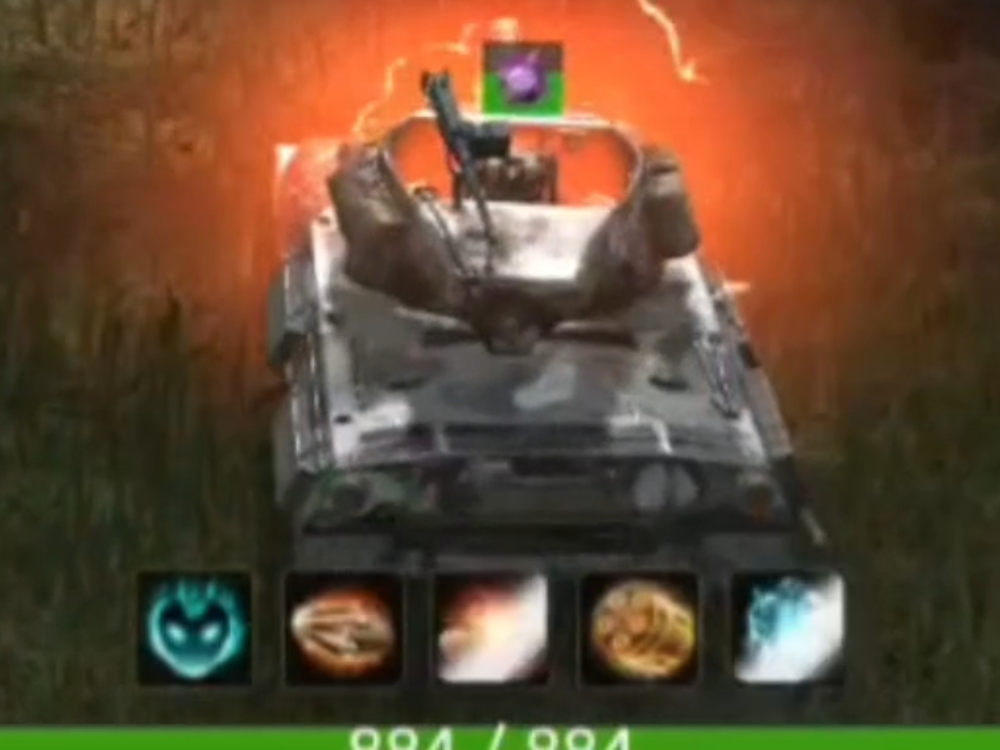 | 176 | 2026-01-18 |
| [哈基米音乐：哈氣軌跡](https://www.bilibili.com/video/BV1LZkpBcEx1) |  | 1211 | 2026-01-18 |
| [【哈基米音乐】我记得『治愈の小曲』](https://www.bilibili.com/video/BV1gKkWBREKW) |  | 1076 | 2026-01-18 |
| [哈基米南北绿豆byt和哈基米的实操视频](https://www.bilibili.com/video/BV1hKkWBREBV) | 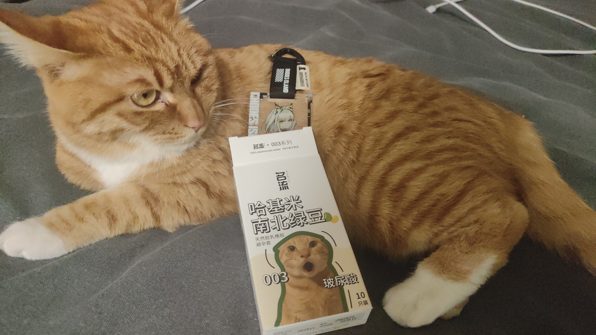 | 8437 | 2026-01-18 |
| [《Tobu- Higher》哈基米版本](https://www.bilibili.com/video/BV1VwkWBtEJQ) |  | 244 | 2026-01-18 |
| [【哈基米】ぱぴぷぴぷぴぱ](https://www.bilibili.com/video/BV1NnkWBLEs3) |  | 634 | 2026-01-18 |
| [SCP-CN-3408 哈基米是哈基米](https://www.bilibili.com/video/BV1NnkWBLEHw) | 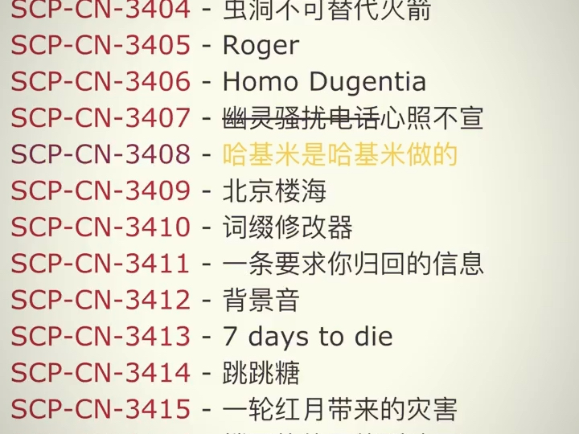 | 2762 | 2026-01-18 |
| [猫meme节奏大挑战！](https://www.bilibili.com/video/BV1pHkWByE7Q) |  | 2.1万 | 2026-01-18 |
| [复刻项目-哈基米曼波_＿原作者:@Sngels_wyh已出最新版本](https://www.bilibili.com/video/BV1w4kWB3ExG) | 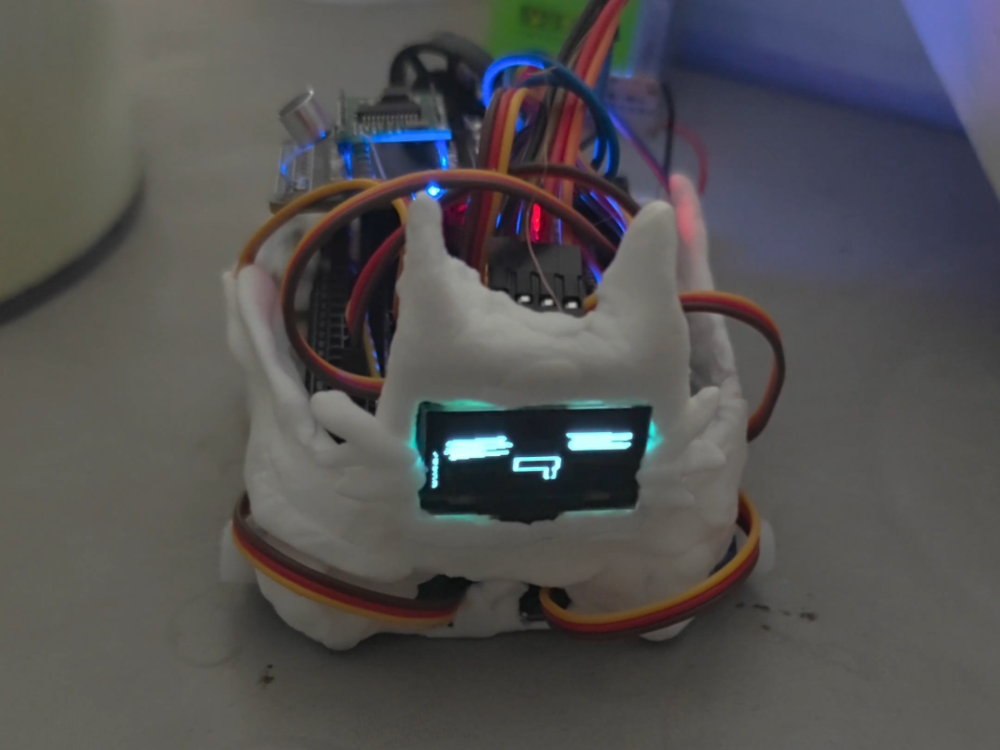 | 127 | 2026-01-18 |
| [【修罗帝尊】戮世摩罗与他的哈基米](https://www.bilibili.com/video/BV1KEkWB2EK4) | 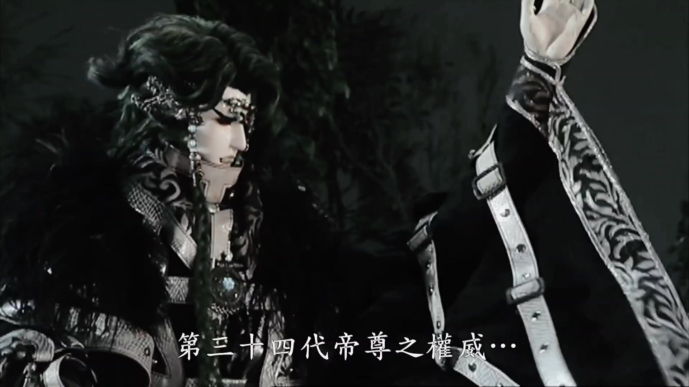 | 222 | 2026-01-18 |
| [【苺氷えな】我宣布我一个横冲直撞冲进你哈基米奥数里然后睡觉了，这意味着睡觉了，这是好的 [ASMR あなた専用の耳かき屋さん]](https://www.bilibili.com/video/BV1jqkWBeEpU) |  | 1560 | 2026-01-18 |
| [半年前救助的流浪猫，现在已经可以正常走啦～功德+999～(￣▽￣～)~](https://www.bilibili.com/video/BV1XkkWBFExB) | 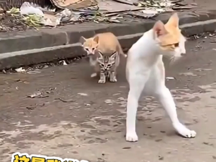 | 24.0万 | 2026-01-18 |
| [集美给哈基米设下鸿门宴😭](https://www.bilibili.com/video/BV1LzkWBAEvx) | 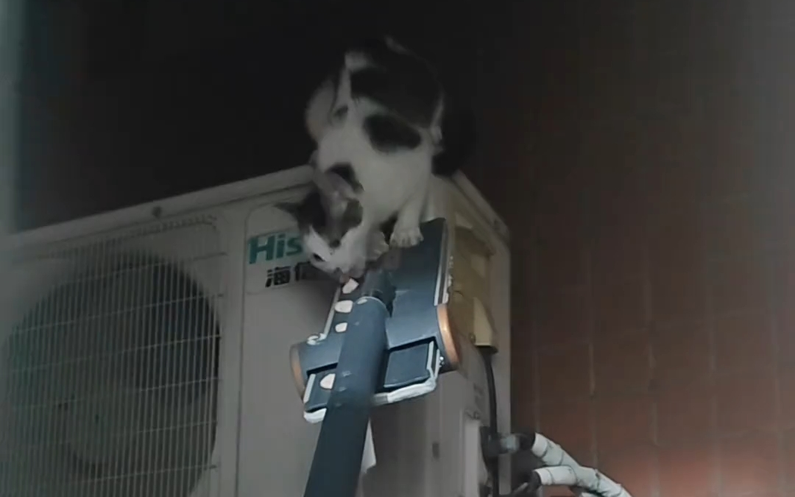 | 14.0万 | 2026-01-18 |
| [哈基米这个笨](https://www.bilibili.com/video/BV1V6kWBaEkY) | 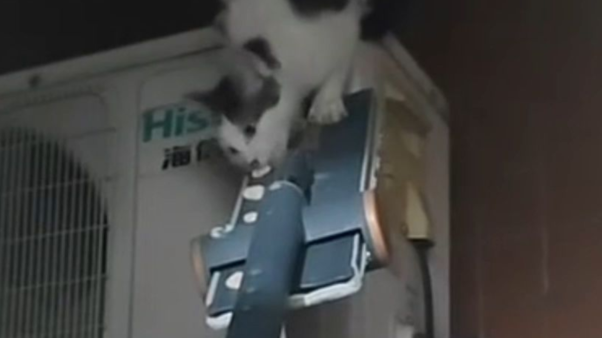 | 2177 | 2026-01-18 |
| [哈基米惹祸正确应对方式（非虐待）](https://www.bilibili.com/video/BV196kWBhEgJ) | 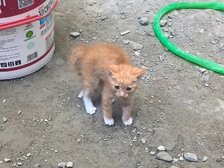 | 5532 | 2026-01-18 |
| [『补档』银渐层不小心把小基米给差点爱死了](https://www.bilibili.com/video/BV1CwksBjELu) | 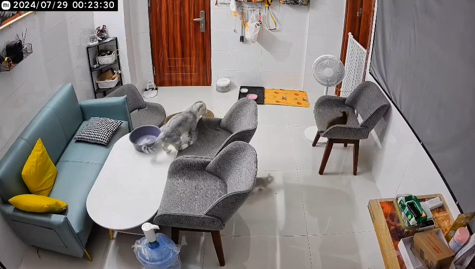 | 2.9万 | 2026-01-18 |
| [全世界都趁我不在欺负我的小耄](https://www.bilibili.com/video/BV16MksBGERa) |  | 6300 | 2026-01-18 |
| [布鲁斯大战哈基米！！！！完整版一分钟！！！](https://www.bilibili.com/video/BV1yAksB1EEM) | 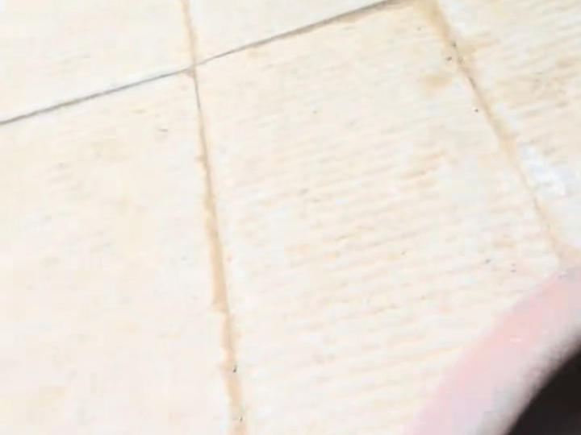 | 1748 | 2026-01-18 |
| [天梯偶遇FG，蓝色哈基米完美节奏拿下！](https://www.bilibili.com/video/BV1CfkHB6EgD) |  | 1.1万 | 2026-01-18 |
| [猫儿捕猎这个凶狠](https://www.bilibili.com/video/BV1PjkHBgEpm) |  | 5851 | 2026-01-18 |
| [今天出演小花旦的哈基米](https://www.bilibili.com/video/BV1BMkpBeELJ) |  | 686 | 2026-01-17 |
| [🐱](https://www.bilibili.com/video/BV1gGr9BuE9Y) |  | 5710 | 2026-01-17 |
| [曼灵魂【卢广仲哈基米】](https://www.bilibili.com/video/BV19mr9B5ELz) |  | 2784 | 2026-01-17 |
| [小猫太可爱了，吃饱了就哈气，好可爱](https://www.bilibili.com/video/BV1KjrQBZEzX) | 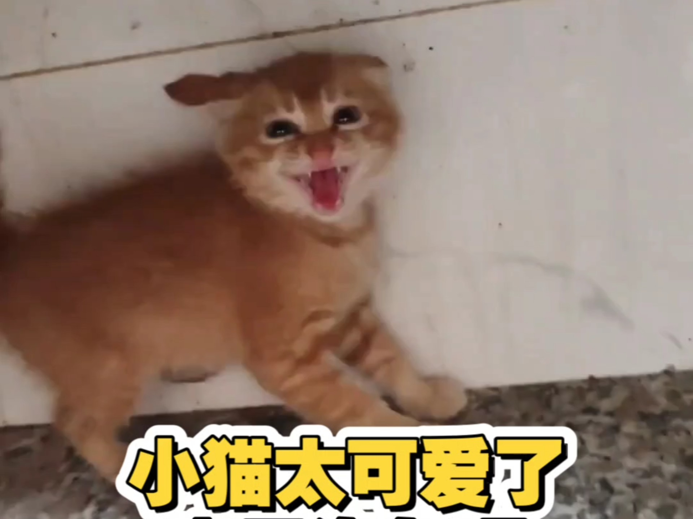 | 6830 | 2026-01-17 |
| [基米TV之足球球](https://www.bilibili.com/video/BV1R6rQB3ED5) | 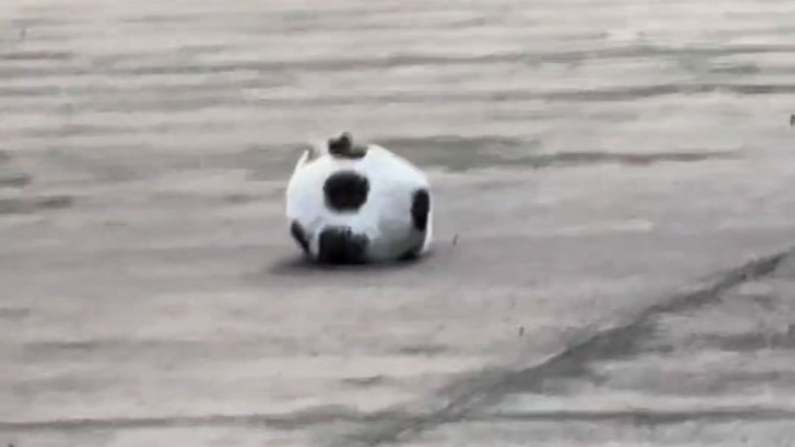 | 6066 | 2026-01-17 |
| [【哈基米の小曲】｜“我爱你-哈基米版...”作者：瞬鸽鸽](https://www.bilibili.com/video/BV1PArXB4EiZ) |  | 2212 | 2026-01-17 |
| [level！不想被哈气就赶紧跑！](https://www.bilibili.com/video/BV1NLrSBDE9S) |  | 4798 | 2026-01-17 |
| [今日哐哐](https://www.bilibili.com/video/BV1N7rSBJEoQ) |  | 2286 | 2026-01-17 |
| [这诗猫啊？](https://www.bilibili.com/video/BV1XkrSBwEr3) | 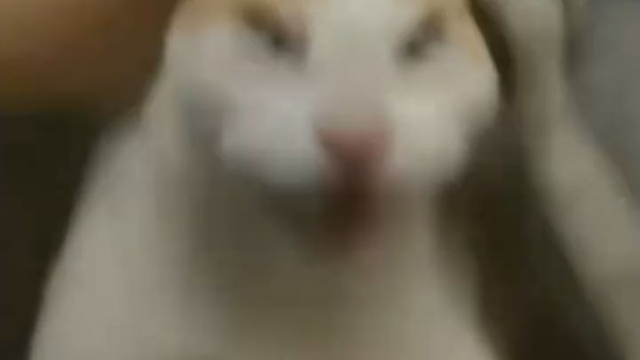 | 4721 | 2026-01-17 |
| [【智人TV】爱猫人士灵机一动这一块 &amp; 样相还得洋人出](https://www.bilibili.com/video/BV1a7rZBHEiz) | 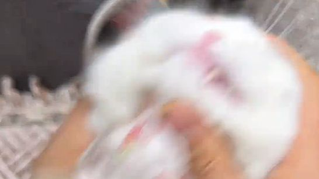 | 12.7万 | 2026-01-17 |
| [哈基米之歌【拇指琴kalimba】](https://www.bilibili.com/video/BV1c4rSBVELg) | 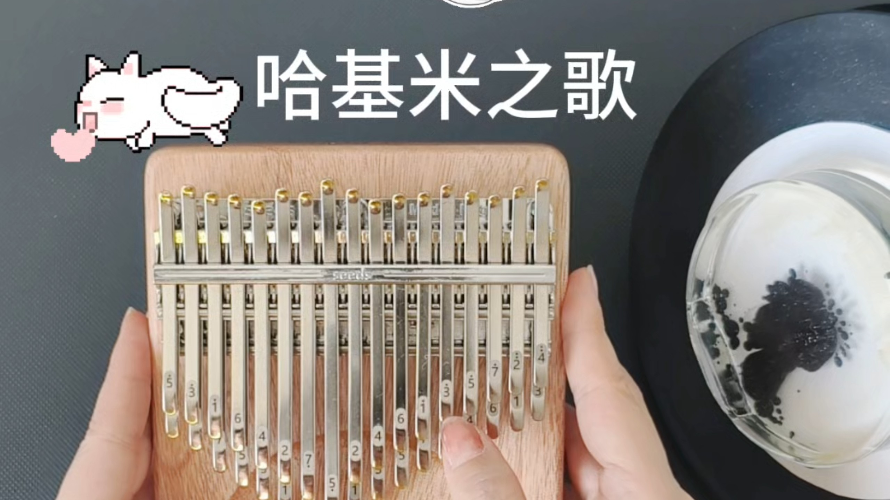 | 738 | 2026-01-17 |
| [『基米TV』哈基米应激和打架被吓出小零食](https://www.bilibili.com/video/BV1rNrDBjEse) | 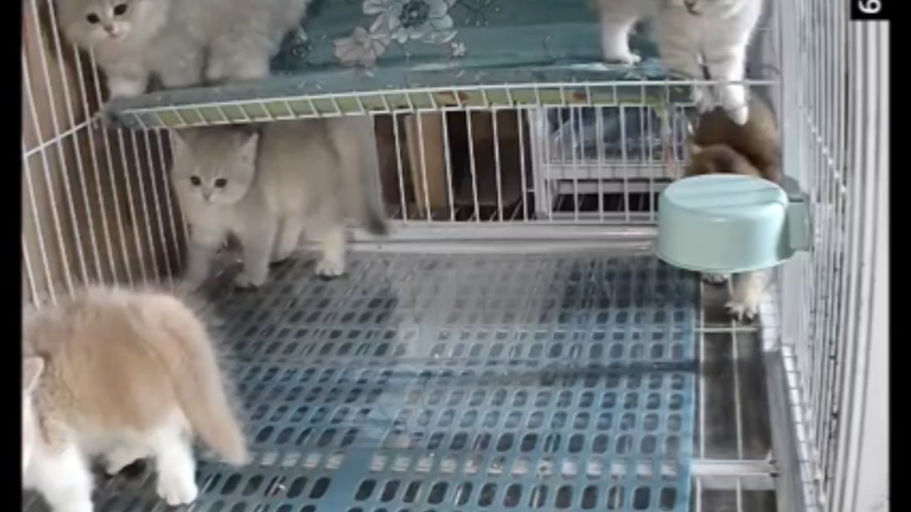 | 2.4万 | 2026-01-17 |
| [千！万！别！惹蓝猫](https://www.bilibili.com/video/BV1rNrDBjEh8) | 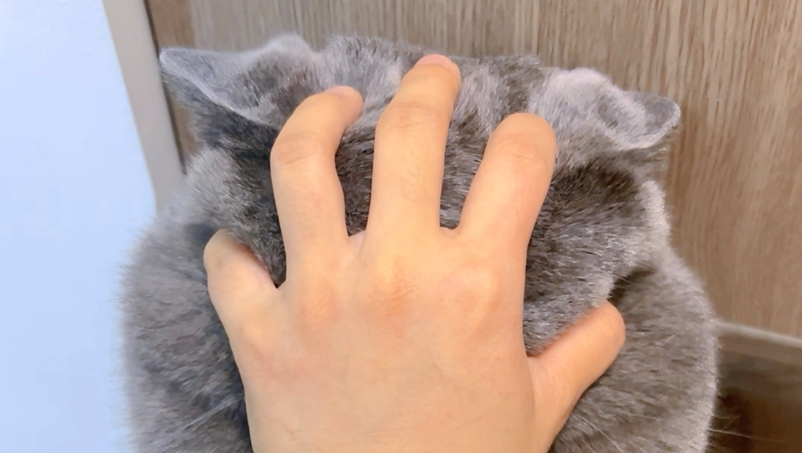 | 1.7万 | 2026-01-17 |
| [鼠鼠 : 再见了世界](https://www.bilibili.com/video/BV1CwrDBEEtm) | 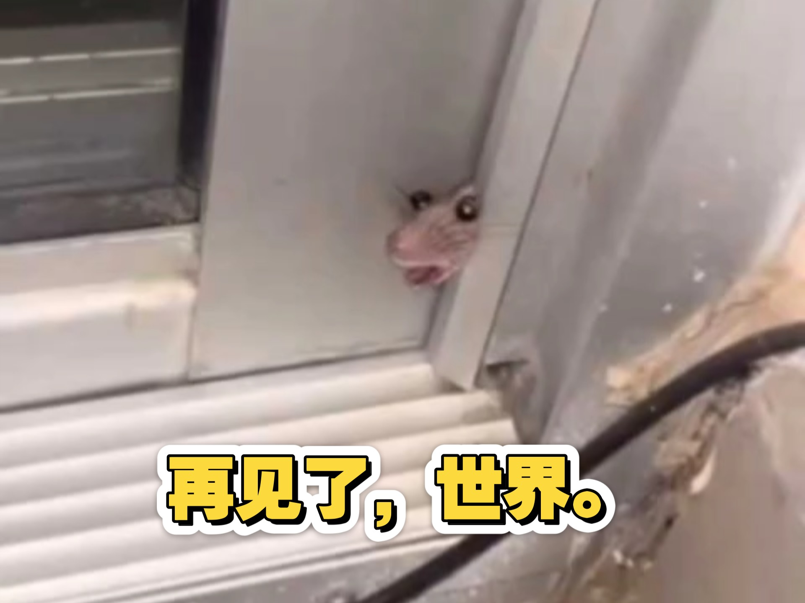 | 2.9万 | 2026-01-17 |
| [[哈基米/叮咚鸡] Aruarian Dance](https://www.bilibili.com/video/BV1BGrDBrEbj) | 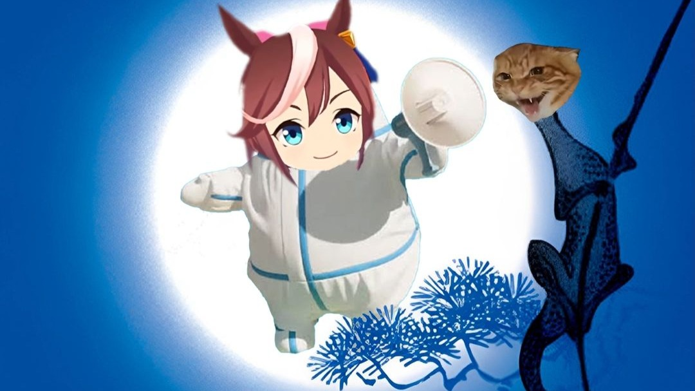 | 1284 | 2026-01-17 |
| [哈基米爬高集合](https://www.bilibili.com/video/BV1DtrDBhELB) |  | 2471 | 2026-01-17 |
| [玩蛇眼的有福了！贫穷版蛇眼哈基米，黯蜜轴仅需5ur可玩！](https://www.bilibili.com/video/BV11qrDBsEXP) | 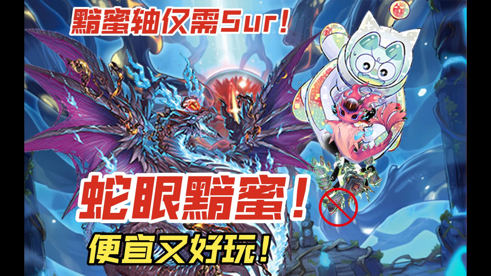 | 1657 | 2026-01-17 |
| [你敢对视其一秒钟吗](https://www.bilibili.com/video/BV1marDBZEZZ) |  | 3105 | 2026-01-17 |
| [咪：这是我的！](https://www.bilibili.com/video/BV1FprmBMEbS) | 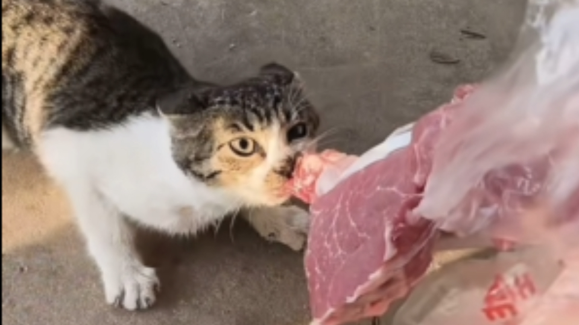 | 4.3万 | 2026-01-17 |
| [谁家基米被关门外了把基米急得](https://www.bilibili.com/video/BV1CfrmBkEwk) | 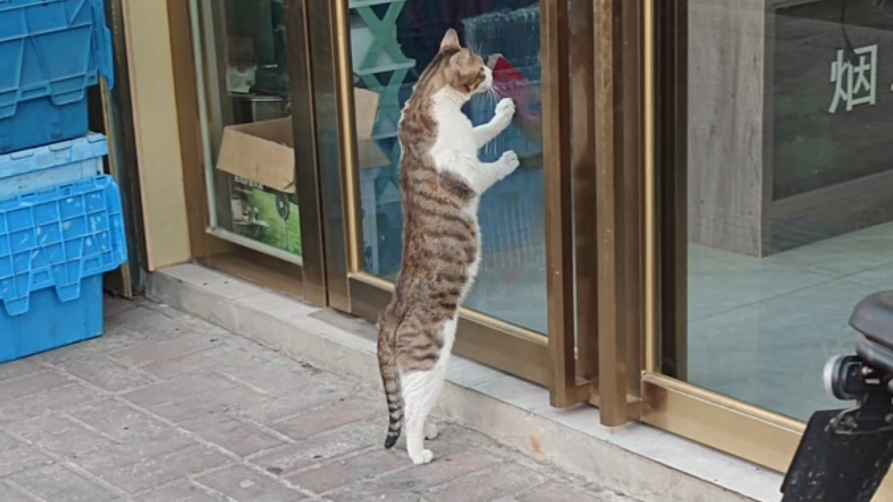 | 310 | 2026-01-17 |
| [哈基米的最后一舞都变成致敬猫女了](https://www.bilibili.com/video/BV14YrUBJEPq) | 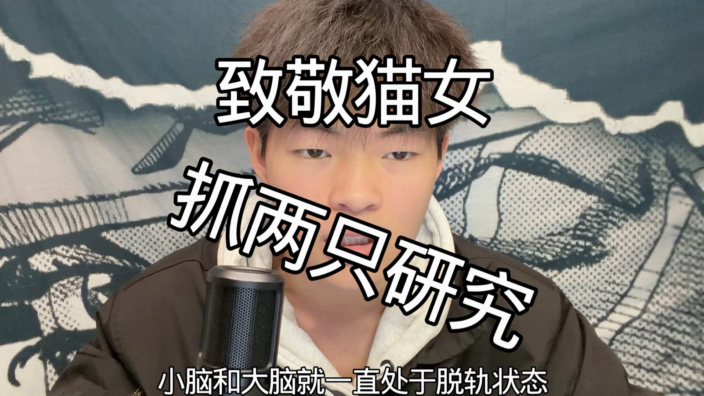 | 29.0万 | 2026-01-17 |
| [1月17日牢A斯奎奇大王⚠️首播彻底炸了⚠️看看往期视频吧⚠️大清未亡篇⚠️大清正统在美国？⚠️反攻大陆篇⚠️亚裔细分⚠️在美国华裔的四大核心群体都有什么？](https://www.bilibili.com/video/BV1sqrUB2ENZ) |  | 70.7万 | 2026-01-17 |
| [基米这个3D变2D](https://www.bilibili.com/video/BV161rUB3E2y) | 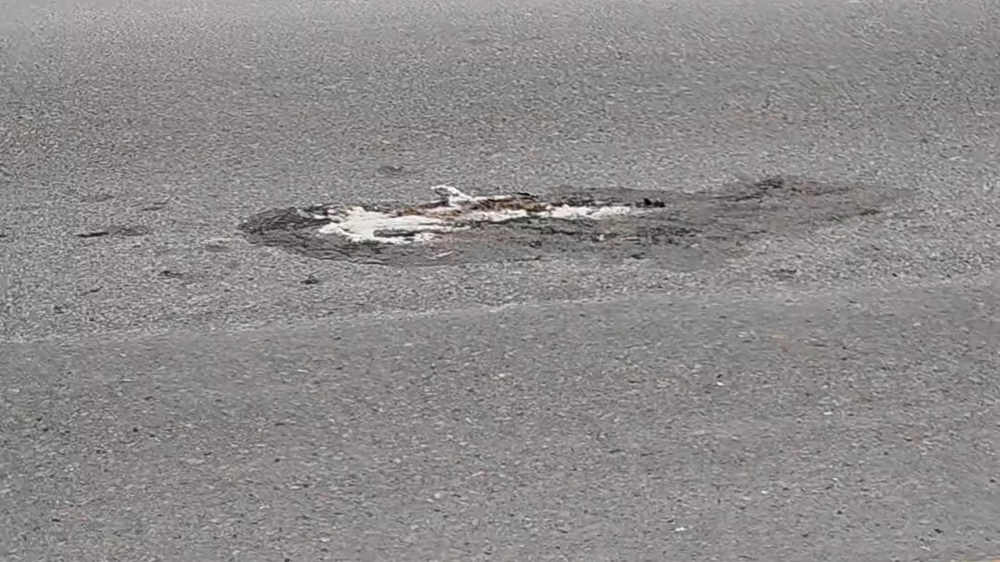 | 6.7万 | 2026-01-17 |
| [我被小耄包围啦！](https://www.bilibili.com/video/BV1AQr1B6Edr) | 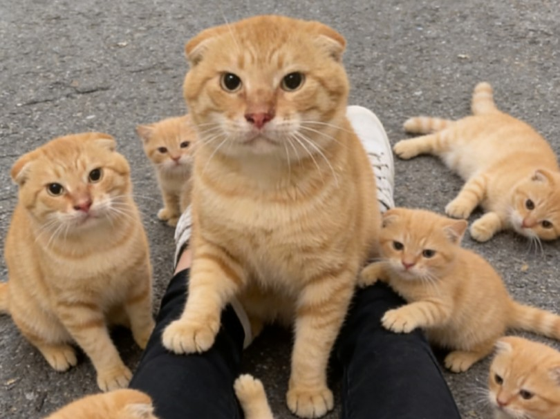 | 5784 | 2026-01-17 |
| [『基米TV』蠢基米对着镜子里的自己骂了一个小时](https://www.bilibili.com/video/BV1S5rkBME8b) | 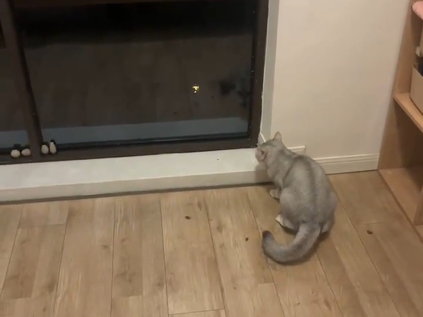 | 2627 | 2026-01-16 |
| [哈基米给叮咚鸡拜年了](https://www.bilibili.com/video/BV1bLrkBqEK6) | 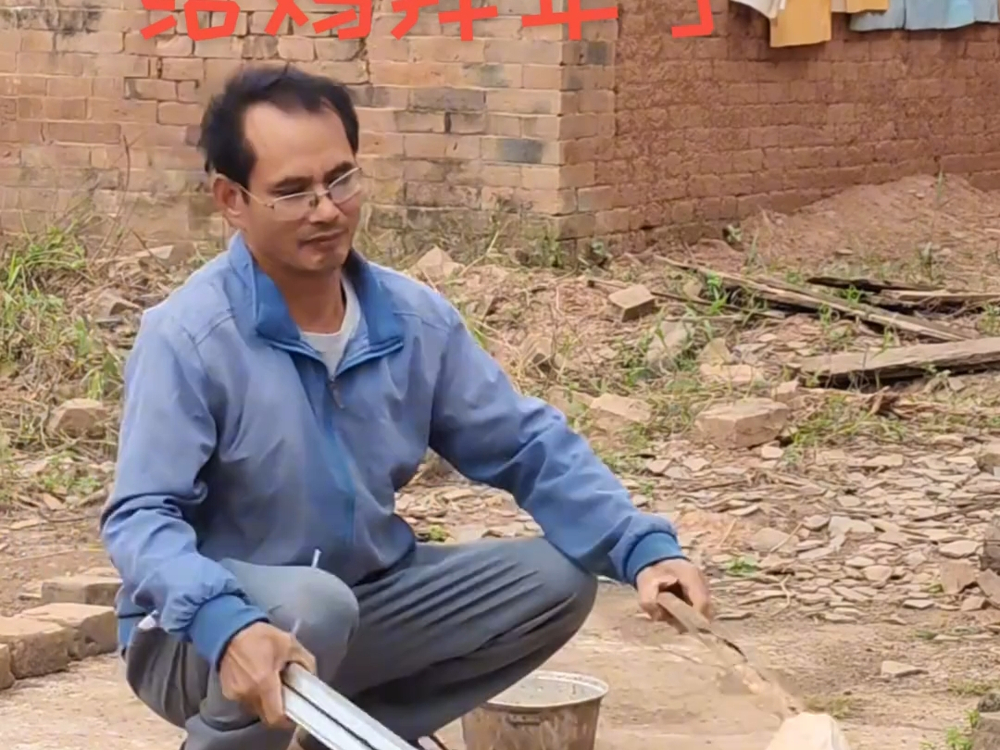 | 9035 | 2026-01-16 |
| [活了多年，第一次见这样撸猫的！这也太离谱了吧](https://www.bilibili.com/video/BV11LkcBJEPM) | 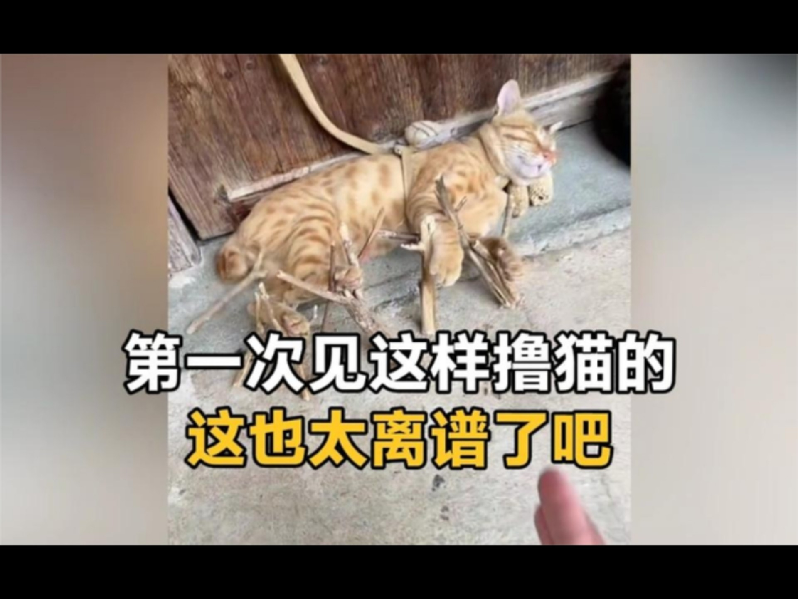 | 12.5万 | 2026-01-15 |
| [“我为你唱一曲、如游丝的气息”《青衣》（加长版）](https://www.bilibili.com/video/BV1fprVBuE34) |  | 58.9万 | 2026-01-15 |
| [猫：今天也是社死的一天！](https://www.bilibili.com/video/BV1b1roBVEJi) | 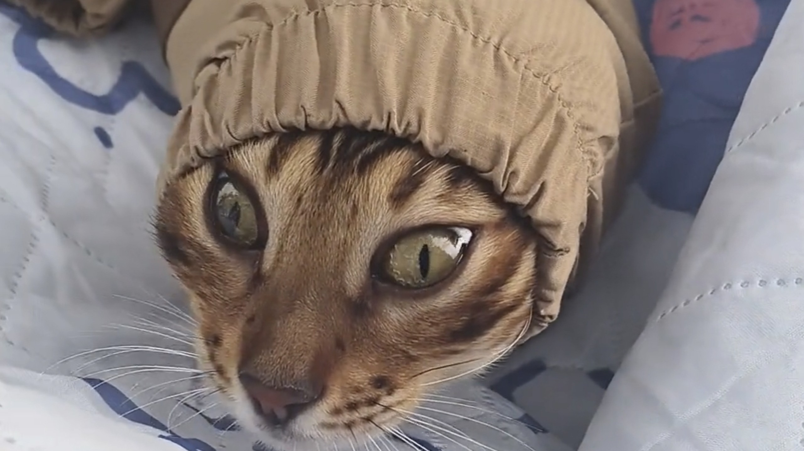 | 3.8万 | 2026-01-15 |
| [全球各地都在更换自己的新款列车](https://www.bilibili.com/video/BV1azroB7ENu) | 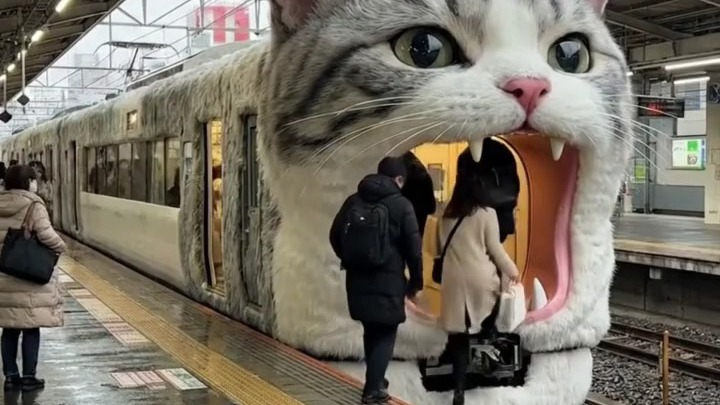 | 7.2万 | 2026-01-15 |
| [今天刚救下的一只流浪猫 很凶啊](https://www.bilibili.com/video/BV1tkrpBEEdB) | 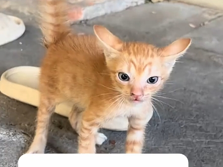 | 4897 | 2026-01-14 |
| [九阳哈基米南北绿豆浆评测](https://www.bilibili.com/video/BV1ujrHBjEUD) |  | 117 | 2026-01-14 |
| [盗我视频的太多了，这是b站唯一的账号](https://www.bilibili.com/video/BV1mXrLB4E3M) | 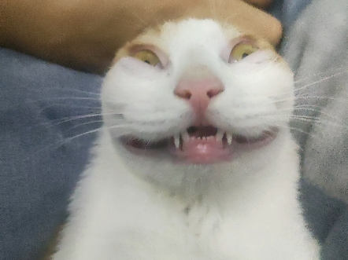 | 3.0万 | 2026-01-13 |
| [塔利班发言人哈基米被捕](https://www.bilibili.com/video/BV19JrzBTEqk) | 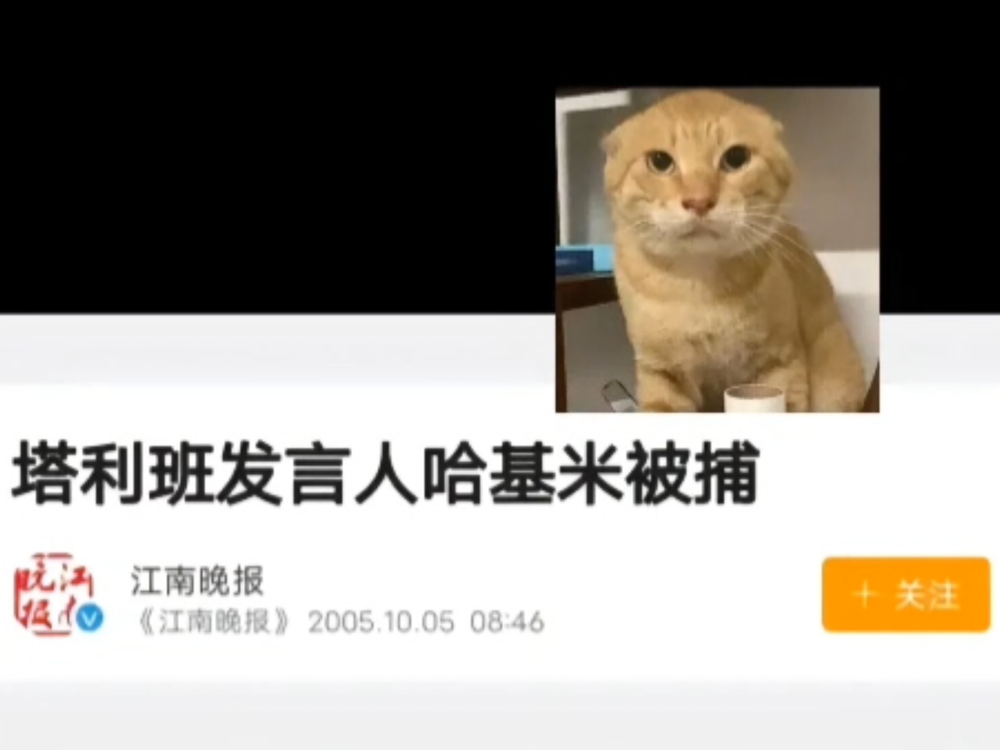 | 5.5万 | 2026-01-13 |
| [AI视频：新墨西哥州发现一种新物种“猫头鹰”](https://www.bilibili.com/video/BV1o9rqBKEDn) | 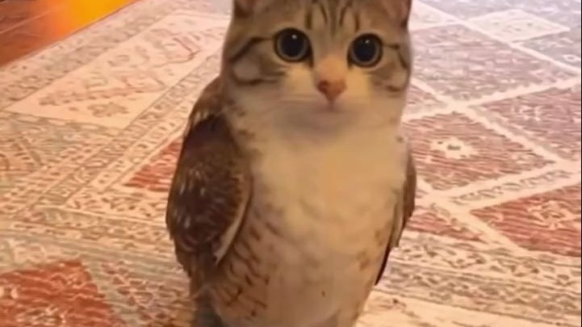 | 8.7万 | 2026-01-13 |
| [欲语泪先流 最后一页 #哈基米音乐 #曼波 #哈基米 #BGM创作](https://www.bilibili.com/video/BV1pYrGBCEYs) |  | 265 | 2026-01-10 |
| [丹尼尔低炮音原视频](https://www.bilibili.com/video/BV1nXBCBnEGs) |  | 45.6万 | 2025-12-27 |
| [圆头蝴蝶哈气怎么治？](https://www.bilibili.com/video/BV1R5EwzxEp4) |  | 284.5万 | 2025-05-13 |
| [【神人杯Day8】哈基三郎](https://www.bilibili.com/video/BV16GVazrE4U) | 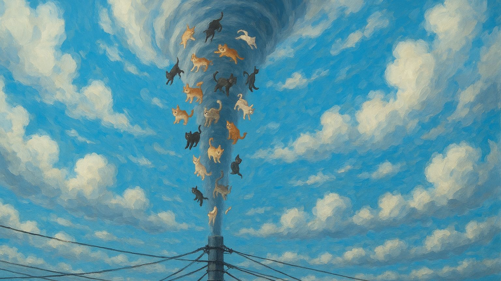 | 27.5万 | 2025-05-08 |

---
*最后更新: 2026-01-19 02:55:43 (自动生成)*
*数据来源: [Bilibili](https://www.bilibili.com)*

## 使用说明

运行以下命令更新视频列表:
```bash
python3 fetch_hajimi_videos.py
```
