# awesome-hajimi
collections of hajimi (哈基米 in Chinese) on the Internet.

## 视频列表 (Video List)

| 视频标题 (Title) | 封面 | 播放量 (Views) | 发布日期 (Date) |
|---|---|---|---|
| [哈基米](https://www.bilibili.com/video/BV1ssrgB3Ehs) |  | 327 | 2026-01-10 |
| [哈基米 哈基米 ｜SimonsCat ｜ 西蒙的猫2025全集](https://www.bilibili.com/video/BV15DrgBWEKp) | 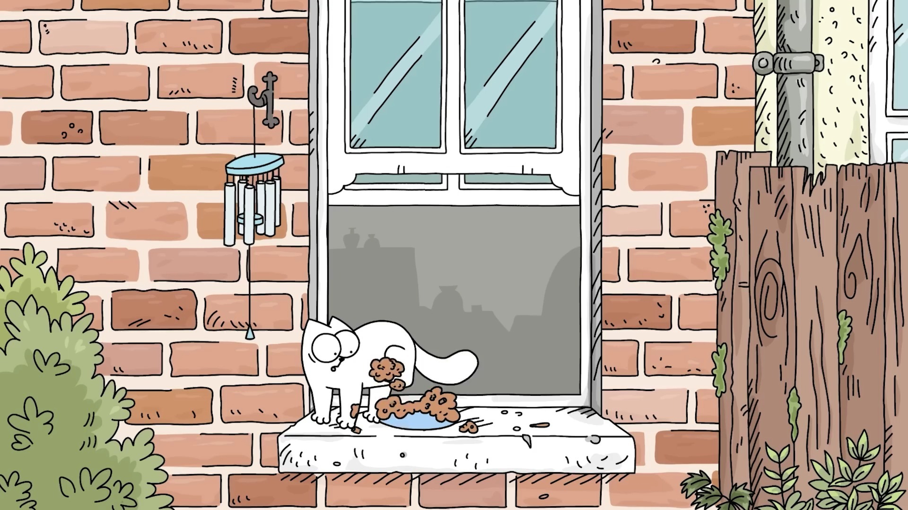 | 11 | 2026-01-10 |
| [哈基米又找茬](https://www.bilibili.com/video/BV1horgBJE3p) |  | 57 | 2026-01-10 |
| [【mon3tr】胖宝宝，哈基米好胖好可爱~](https://www.bilibili.com/video/BV1hMrMB5EYa) |  | 1113 | 2026-01-09 |
| [【THA2025】金基米奖提名 回顾你与哈基米的2025](https://www.bilibili.com/video/BV1w3ruBwERp) |  | 1.5万 | 2026-01-09 |
| [氿氿看B站晚会哈基米神曲！](https://www.bilibili.com/video/BV1BXrTBsEvd) |  | 2626 | 2026-01-09 |
| [哈基米一脚蹬飞小孩快来人收养回家](https://www.bilibili.com/video/BV1ShrTBzEXC) |  | 805 | 2026-01-09 |
| [搞笑哈基米合集](https://www.bilibili.com/video/BV1hGrMBrEVp) | 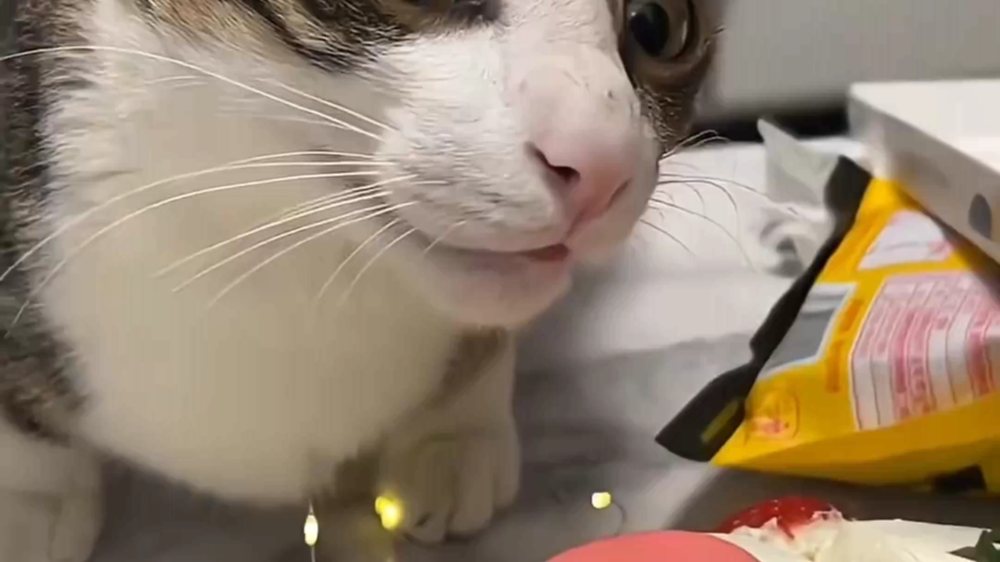 | 286 | 2026-01-09 |
| [vovious哈基米实战](https://www.bilibili.com/video/BV1WsrMBYE98) | 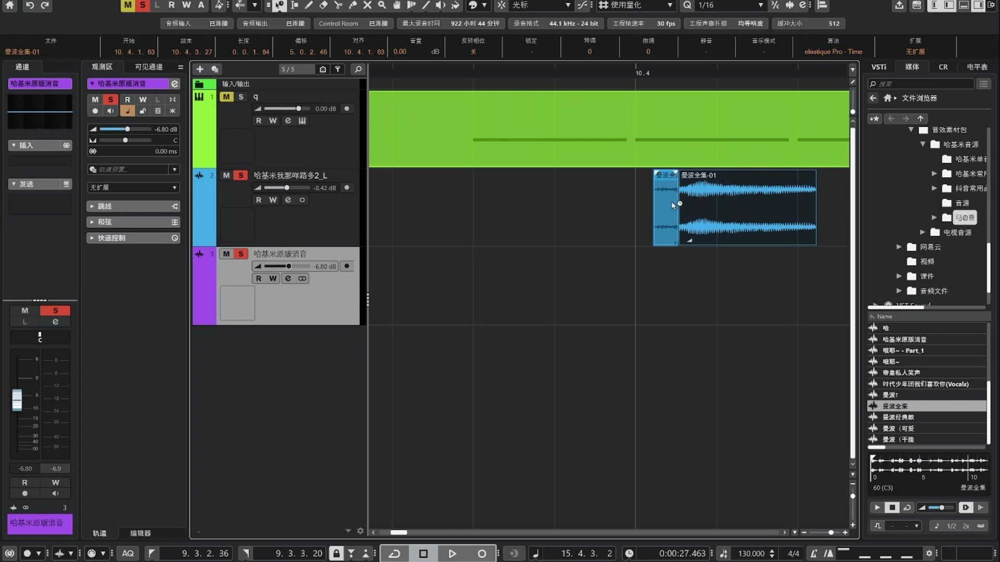 | 136 | 2026-01-09 |
| [【哈基米】曾有你的博古架](https://www.bilibili.com/video/BV1psrMBYE9W) |  | 601 | 2026-01-09 |
| [哈基米](https://www.bilibili.com/video/BV1zSrNBUEnM) |  | 4 | 2026-01-09 |
| [手搓哈基米关灯神器](https://www.bilibili.com/video/BV1GeiyBvEHX) |  | 2536 | 2026-01-09 |
| [哈吉米哈吉米哈～基～米～](https://www.bilibili.com/video/BV1TarNBwEbB) |  | 49 | 2026-01-09 |
| [杀 耄 诛 心](https://www.bilibili.com/video/BV12YrNB8EWe) | 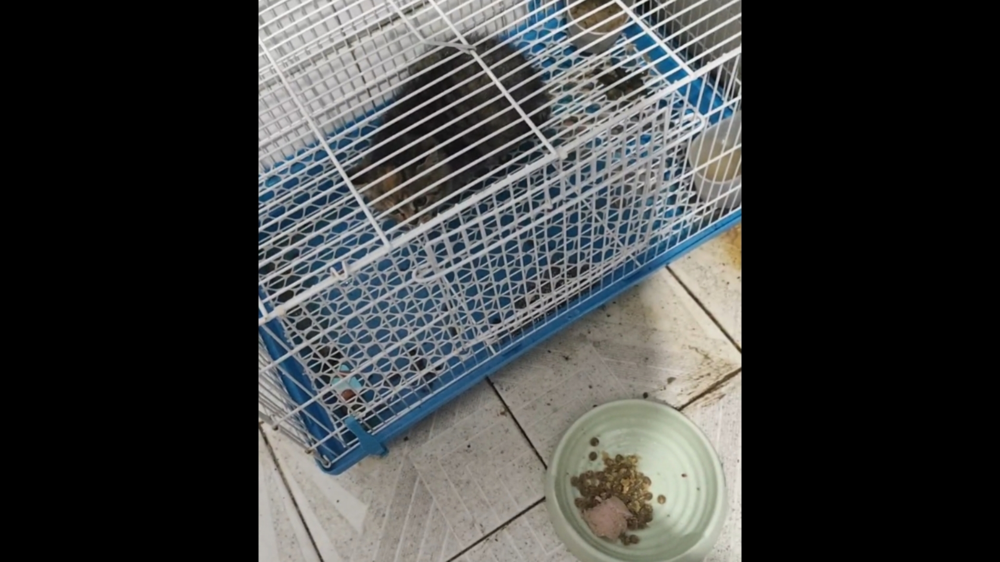 | 2126 | 2026-01-09 |
| [你早上在凹马，中午在凹马，下午在凹马，晚上在凹马，到了凌晨你说你需要很多爱，你去医院看过没有](https://www.bilibili.com/video/BV1SbrNBAEn9) |  | 855 | 2026-01-09 |
| [【游戏王MD】黯蜜哈基米卡组，我太帅了展开](https://www.bilibili.com/video/BV1CqrNBoEXJ) |  | 607 | 2026-01-09 |
| [基米TV精选10分钟剧场版](https://www.bilibili.com/video/BV1UgrKBNER3) |  | 732 | 2026-01-09 |
| [哈基米这个搭便车](https://www.bilibili.com/video/BV1hNrKBBEiG) |  | 1295 | 2026-01-09 |
| [【哈基米音乐】舞夜弃咪](https://www.bilibili.com/video/BV1t5rKBaEhG) |  | 194 | 2026-01-09 |
| [【maya建模】如何快速搭建一只哈基米建模，新手必看（附安装包及教程分享，无常分享）](https://www.bilibili.com/video/BV1t5rKBaEMD) |  | 8 | 2026-01-09 |
| [一月天杯龙构筑 针对卡肘击哈基米！](https://www.bilibili.com/video/BV14jrKBcEe8) |  | 4884 | 2026-01-09 |
| [哈基米低语…](https://www.bilibili.com/video/BV14jrKBcE65) | 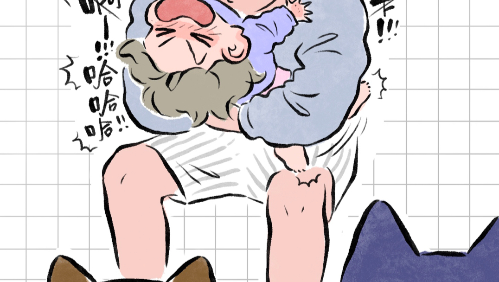 | 11.6万 | 2026-01-09 |
| [【诺瓦基米】你们都不剪那我剪了](https://www.bilibili.com/video/BV1WwrTB8ETn) |  | 1139 | 2026-01-09 |
| [哈基米老窝又被蟒蛇发现，大猫只能丢&#x27;包&#x27;撤了](https://www.bilibili.com/video/BV1VwrKBrEDG) | 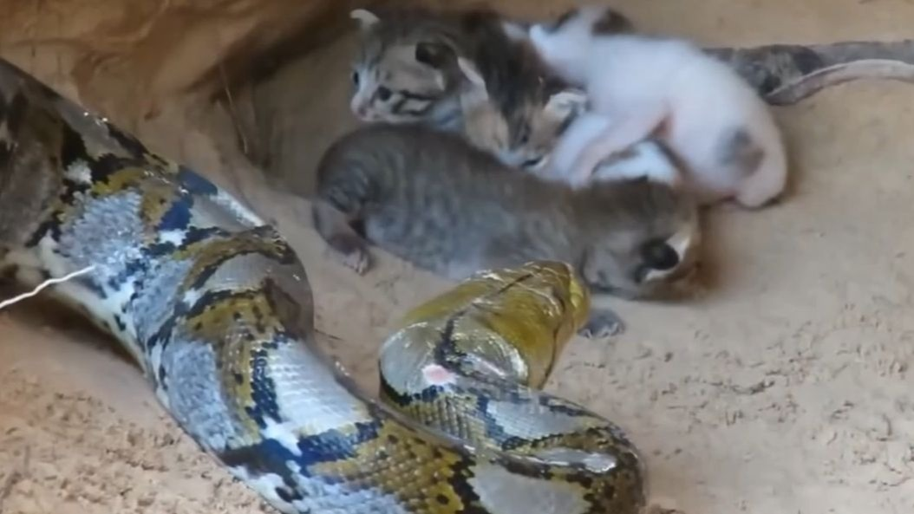 | 3390 | 2026-01-09 |
| [高速上解救哈基米.到处乱窜全部应激](https://www.bilibili.com/video/BV1YfrNBkEDZ) | 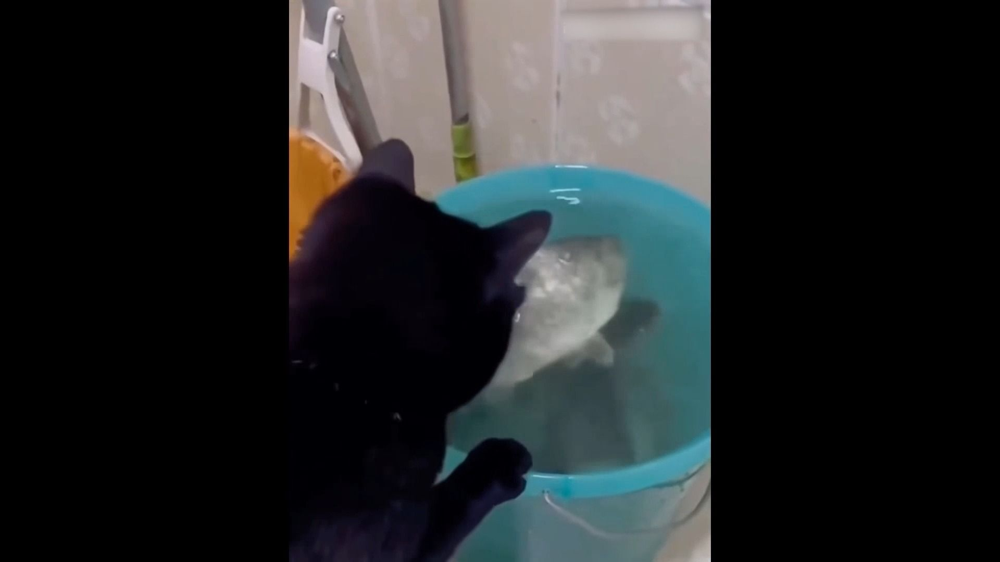 | 4287 | 2026-01-09 |
| [哈基米助眠丨2025年我最喜欢的道具（第一弹）](https://www.bilibili.com/video/BV1bPrPBhEZf) |  | 1420 | 2026-01-09 |
| [【大师决斗】哈基米皮尔莉震撼来袭](https://www.bilibili.com/video/BV127rKB8Ehk) |  | 2674 | 2026-01-09 |
| [也许是b站第一个弹唱哈基米jpop的人类](https://www.bilibili.com/video/BV1JtrKBXEdi) |  | 1946 | 2026-01-09 |
| [[der鱼] 一只哈基米](https://www.bilibili.com/video/BV1UBiYBAEng) |  | 328 | 2026-01-09 |
| [再高冷的哈基米直肠也是温暖的](https://www.bilibili.com/video/BV1nsrKBRE9H) |  | 1.3万 | 2026-01-09 |
| [【哈基米歌单】｜｜ “曼波波波~呼叫曼波~”](https://www.bilibili.com/video/BV1swrTB8EET) |  | 185 | 2026-01-09 |
| [鸣潮假内鬼把哈基米全钓上来了，2000元解锁爱弥斯机甲?不是你真信啊！](https://www.bilibili.com/video/BV1NcrTBcE6m) |  | 3090 | 2026-01-09 |
| [哈基米音乐工业革命！一秒钟学会使用全新修音软件vovious提高鬼畜音乐的人声质感](https://www.bilibili.com/video/BV1gQrKBTETE) |  | 2302 | 2026-01-09 |
| [耄耄失踪是要成精?■WY小型恐怖逃脱地图■恐怖哈基米](https://www.bilibili.com/video/BV1MQrKBTE1M) |  | 318 | 2026-01-09 |
| [蛇眼哈基米（黯蜜）展开（仅供参考）](https://www.bilibili.com/video/BV1iQrABzEAH) |  | 531 | 2026-01-09 |
| [【Gmod】哈基米瓜味小孩](https://www.bilibili.com/video/BV1YFrPBPEWC) |  | 1172 | 2026-01-09 |
| [好样的，哈基米](https://www.bilibili.com/video/BV1iYrPBrEVb) |  | 21 | 2026-01-09 |
| [进入蘸豆模式的鼠鼠 连自己都害怕](https://www.bilibili.com/video/BV1yjrPBpEvQ) |  | 5.6万 | 2026-01-09 |
| [［游戏王MD］冷知识：哈基米自己就是最大的略猫区](https://www.bilibili.com/video/BV1JWrPBmExF) |  | 1976 | 2026-01-09 |
| [23分钟沉浸式听歌｜珍藏版音乐合集｜哈基米合集｜治愈系神曲#哈基米#音乐推荐#音乐合集](https://www.bilibili.com/video/BV1KRrPB4Eqb) |  | 161 | 2026-01-09 |
| [神人哈基米构筑思路讲解与实况对局【YUTANG】](https://www.bilibili.com/video/BV14QrPBbEWi) |  | 2.6万 | 2026-01-09 |
| [哈基米被冻在铁栏杆上了幸好有好心人营救](https://www.bilibili.com/video/BV1PfrPB9E3R) |  | 7226 | 2026-01-09 |
| [哈基米重灾区，千万不要点进来！！！](https://www.bilibili.com/video/BV1GkrPBvEAD) |  | 4201 | 2026-01-09 |
| [哈基米这个被冰封](https://www.bilibili.com/video/BV1gkrPBvEBG) |  | 738 | 2026-01-09 |
| [唐猫伪人进阶：米雪儿篇](https://www.bilibili.com/video/BV1uDrPBFEAH) |  | 2590 | 2026-01-09 |
| [还能动？骇死我了](https://www.bilibili.com/video/BV1E3rNB1EPb) |  | 5740 | 2026-01-09 |
| [热搜榜第一！现在可以跟朋友说我在玩《你妈》了](https://www.bilibili.com/video/BV1BHidBGEwC) |  | 7.9万 | 2026-01-09 |
| [最哈之基米](https://www.bilibili.com/video/BV1NDrwBHEcn) |  | 895 | 2026-01-09 |
| [6个月大的哈基米无师自通](https://www.bilibili.com/video/BV1RVrABvEkn) |  | 4 | 2026-01-09 |
| [哈基米与人类玩耍](https://www.bilibili.com/video/BV1cArABVELM) |  | 1404 | 2026-01-09 |
| [后手星辰突破哈基米，终于给我逮到了](https://www.bilibili.com/video/BV1whiRB7EnX) |  | 952 | 2026-01-08 |
| [你知道的，很少一段视频能融合这么多风格的哈基米](https://www.bilibili.com/video/BV1YhidBKEVj) |  | 277 | 2026-01-08 |
| [2400的哈基米套装，就1张哈基米UR，哎。。。。。。](https://www.bilibili.com/video/BV1kGidBEEnk) |  | 517 | 2026-01-08 |
| [【原石利希德 VS 黯蜜】趁大伙儿还没掌握哈基米的力量快用 man 上分～](https://www.bilibili.com/video/BV16EidB5EPQ) |  | 1603 | 2026-01-08 |
| [哈基米要不把你地址发一下，我给你送俩过去，顺便给一张你的黑白照片，到时候顺便一起寄过去给你。收到的时候可千万别哈气啊](https://www.bilibili.com/video/BV1WQidBQEu9) |  | 1131 | 2026-01-08 |
| [超绝哈基米乱挠！](https://www.bilibili.com/video/BV1sUidB9EoN) |  | 462 | 2026-01-08 |
| [枫哥红色哈基米被打爆抱怨酱油不帮中，鲷哥：枫哥中单菜归菜，但是打酱油真的帮中](https://www.bilibili.com/video/BV1HRidBSEob) |  | 1.8万 | 2026-01-08 |
| [哈基米喔～南北绿豆～](https://www.bilibili.com/video/BV1Kwi9BEEA6) |  | 752 | 2026-01-08 |
| [［游戏王MD］听说哈基米难打星宿？我来试试](https://www.bilibili.com/video/BV1UXiXBWEBH) |  | 3320 | 2026-01-08 |
| [小猫掉下去被哈基人善意复活了](https://www.bilibili.com/video/BV1x6i9BHESs) | 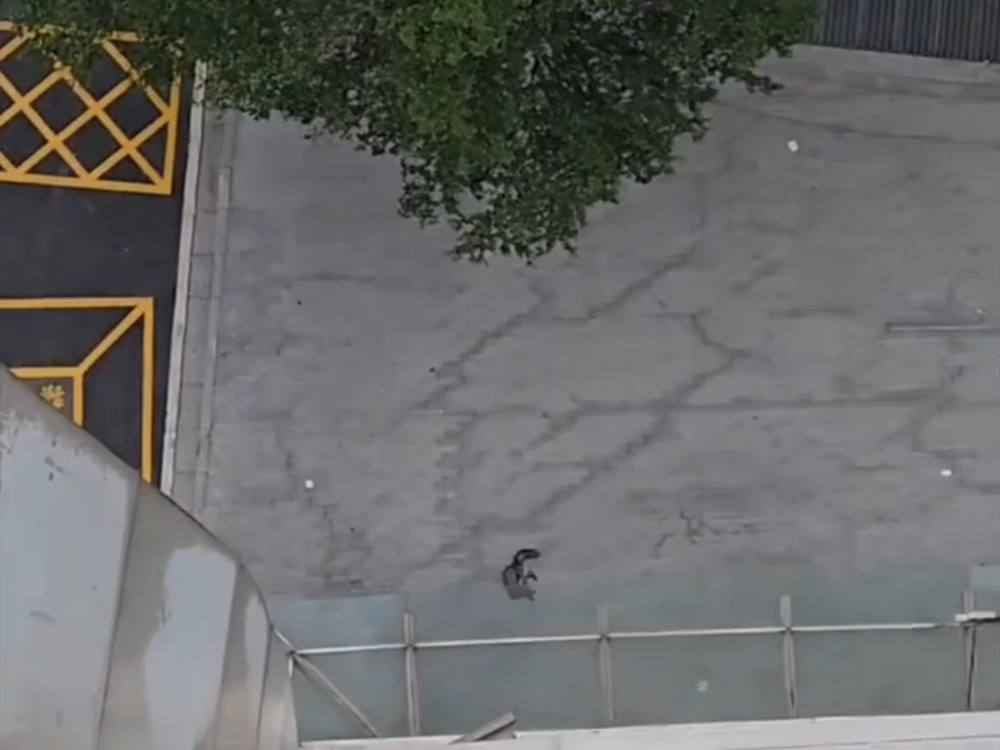 | 5316 | 2026-01-08 |
| [明明上一秒还是萌萌的](https://www.bilibili.com/video/BV1VKiRBeEti) |  | 4176 | 2026-01-08 |
| [爱猫人士与奶牛猫的摩擦：喂食之缘，一掌飞猫](https://www.bilibili.com/video/BV11qiQB1EeA) | 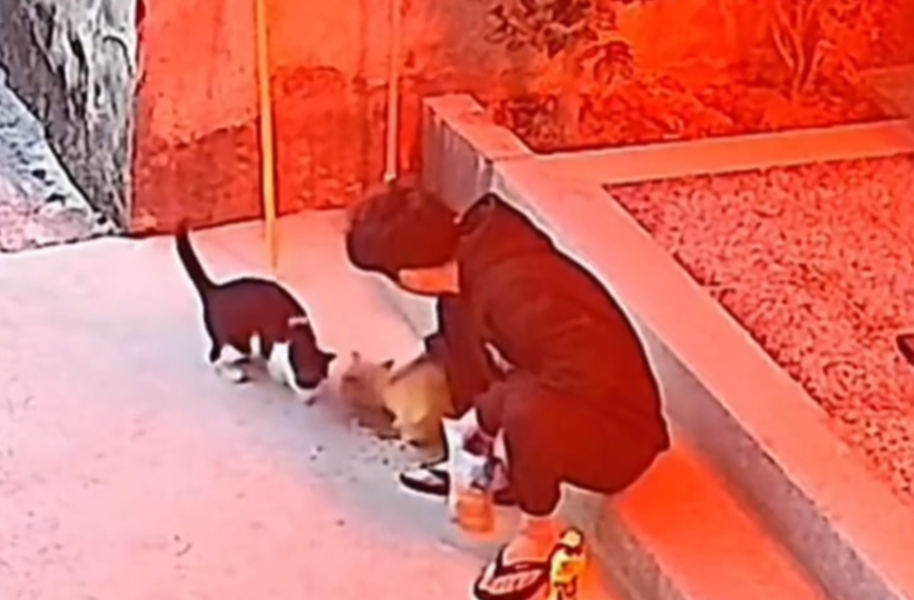 | 100.6万 | 2026-01-08 |
| [【客单展示】雪绒暖炉哈基米](https://www.bilibili.com/video/BV1MMiDB2E4E) |  | 764 | 2026-01-08 |
| [万一他只是想跟我玩呢](https://www.bilibili.com/video/BV1uNiDBUERs) | 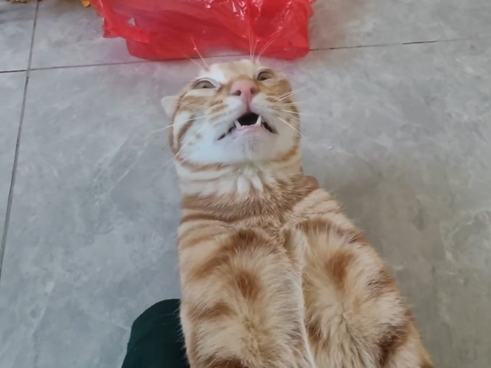 | 23.8万 | 2026-01-08 |
| [哈基米哦 南北绿豆](https://www.bilibili.com/video/BV1U6iyB8Et6) |  | 1826 | 2026-01-07 |
| [冰雪节耄耋真身](https://www.bilibili.com/video/BV1sti1BtEvh) | 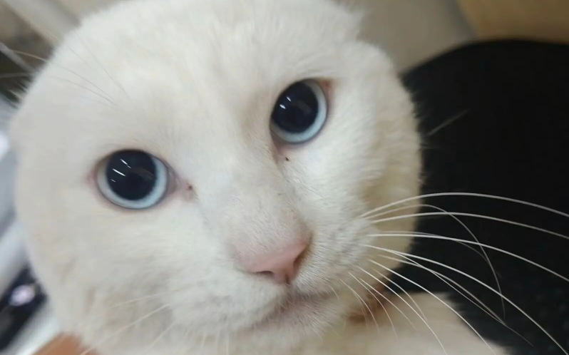 | 3072 | 2026-01-07 |
| [【币圈拼好单NO.1】大乐子！币圈也有自己的拼好饭了！币圈KOL颜驰为何能吃上1.92R的狗狗币，比特币军长何时才能登场？量价分析解读，哈基米](https://www.bilibili.com/video/BV1t7iCB4EHv) |  | 1515 | 2026-01-07 |
| [哈基米被树给卡住了整整一天了](https://www.bilibili.com/video/BV1ygqTBJEjo) | 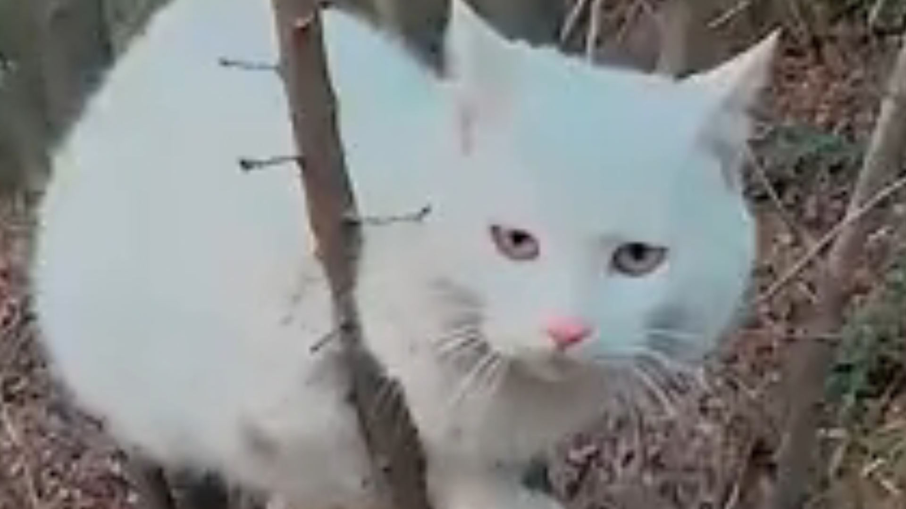 | 6435 | 2026-01-07 |
| [【苺氷えな】个人推荐，爱猫TV之苺氷罕见的早期实写奥数，长期素食这一块，早期哈基米就有一手 [2022年11月FANBOX限定配信]揉麦｜鹅毛棒｜腿夹｜揉耳](https://www.bilibili.com/video/BV1x6qABVE67) |  | 3305 | 2026-01-06 |
| [这猫还有救吗？](https://www.bilibili.com/video/BV1kxqPBrE5J) |  | 2.2万 | 2026-01-06 |
| [研究表明哈基米比较克制雷姬](https://www.bilibili.com/video/BV1ieqwBtEBp) |  | 4096 | 2026-01-06 |
| [猫儿这个喜欢淋雨](https://www.bilibili.com/video/BV1WdixBqEcW) |  | 9036 | 2026-01-05 |
| [盘点外网Tiktok播放量前十的哈基米视频](https://www.bilibili.com/video/BV1AbipBbE8W) |  | 717 | 2026-01-05 |
| [我得到了惩罚~](https://www.bilibili.com/video/BV1mAiWBNExE) | 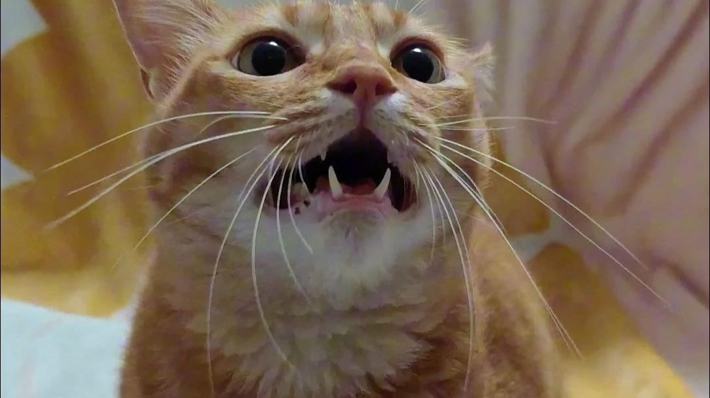 | 84.4万 | 2026-01-05 |
| [典中典之像猫的老鼠](https://www.bilibili.com/video/BV1i4iWBUEDk) | 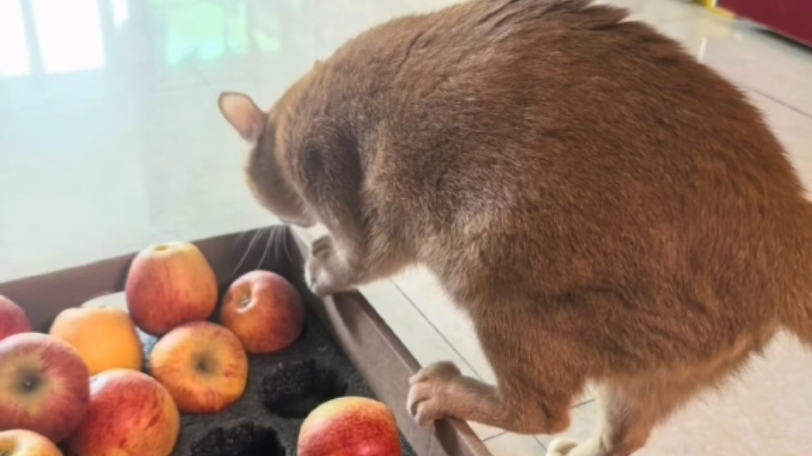 | 80.4万 | 2026-01-05 |
| [跨出TV 之木桶饭在机厅注射不明药物 吓坏出勤舞萌痴](https://www.bilibili.com/video/BV1daijBwEyv) |  | 18.1万 | 2026-01-04 |
| [哈基米就是世界上最可爱的东西！！！](https://www.bilibili.com/video/BV1twivBvEeL) | 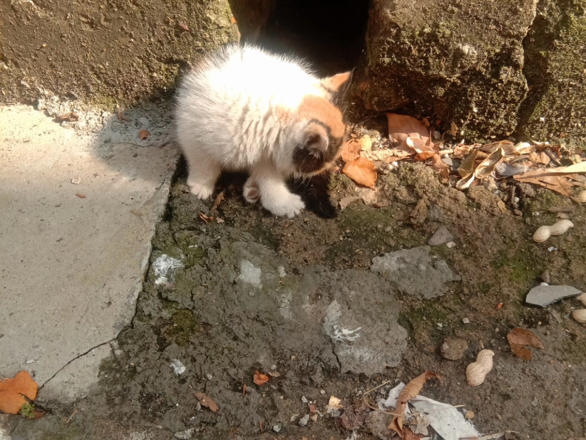 | 40 | 2026-01-03 |
| [西部哈基米!≧-≦](https://www.bilibili.com/video/BV18Qi8BdEt5) |  | 119 | 2026-01-02 |
| [哈基米是什么梗？](https://www.bilibili.com/video/BV1oHigByEH4) |  | 225 | 2025-12-31 |
| [极端free控侄子柳吉吉爱看蓝锁，对着老冯的枕头疯狂释放大坝水冲波，在电影院化身蓝火加特林无差别扫射，最逆天的一集](https://www.bilibili.com/video/BV1sfBkBtEXV) |  | 4.8万 | 2025-12-27 |
| [小肉包最近听的哈基米音乐](https://www.bilibili.com/video/BV1wuBRBJEnz) |  | 9728 | 2025-12-25 |
| [少管别猫的事](https://www.bilibili.com/video/BV1Upq6BJEgC) |  | 48.4万 | 2025-12-20 |
| [流浪猫30天偷100多块鸡胸肉，被人打破头，却一口都舍不得吃？](https://www.bilibili.com/video/BV1XXmBB7Eo8) | 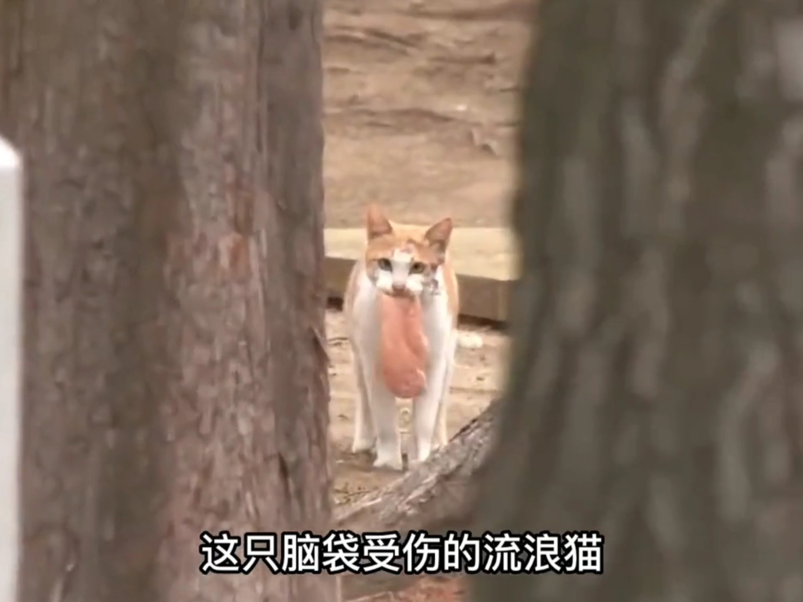 | 3.1万 | 2025-12-14 |
| [【哈基米哈基米咪米】最新视频上线，求关注！](https://www.bilibili.com/video/BV126m5BMEBU) |  | 2 | 2025-12-12 |
| [【哈基米哈基米咪米】最新视频来袭，快来看看吧！](https://www.bilibili.com/video/BV1AHmpBWEzq) |  | 0 | 2025-12-09 |
| [典中典顶冻基](https://www.bilibili.com/video/BV1YBeozpEhY) |  | 92.0万 | 2025-08-25 |
| [哈基米音乐成功传入外网，可喜可贺](https://www.bilibili.com/video/BV1B6b8zBEo3) |  | 61.0万 | 2025-08-13 |
| [🎵哈基神的随波逐流🎵（原曲不用）](https://www.bilibili.com/video/BV1EU8bzMEJK) |  | 44.8万 | 2025-07-26 |
| [【S10强基争哈】戏咪师+哈气流行+迪斯科](https://www.bilibili.com/video/BV1Lp3QzUE7F) |  | 26.1万 | 2025-07-05 |
| [哈气米多次无故攻击人，没挨过打挨过饿，看着身上的血痕目前饿了三天，准备冻手，我已经应激了](https://www.bilibili.com/video/BV1ZRToz4E7h) |  | 71.7万 | 2025-06-12 |
| [纸醉基米](https://www.bilibili.com/video/BV1sFjUzvERh) | 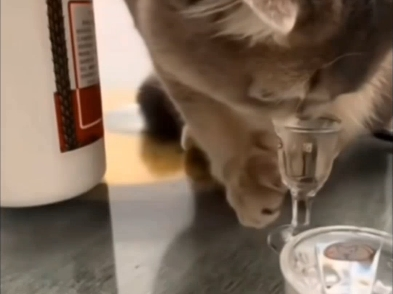 | 28.9万 | 2025-05-26 |

---
*最后更新: 2026-01-10 02:44:39 (自动生成)*
*数据来源: [Bilibili](https://www.bilibili.com)*

## 使用说明

运行以下命令更新视频列表:
```bash
python3 fetch_hajimi_videos.py
```
