# awesome-hajimi
collections of hajimi (哈基米 in Chinese) on the Internet.

## 视频列表 (Video List)

| 视频标题 (Title) | 封面 | 播放量 (Views) | 发布日期 (Date) |
|---|---|---|---|
| [【真栗】栗栗妹教你如何唱哈基米音乐！！](https://www.bilibili.com/video/BV1CkHfz5ELd) |  | 194 | 2025-09-15 |
| [【哈基米】游 基：我闻这冰香](https://www.bilibili.com/video/BV1L2pwzuEeH) |  | 22 | 2025-09-15 |
| [哈基米音乐六大金典完整版，这辈子不全听一半真白活了。](https://www.bilibili.com/video/BV1hJpKzVEq6) | 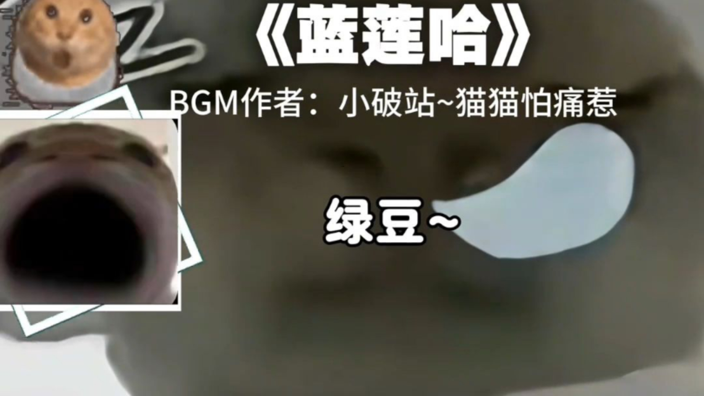 | 7 | 2025-09-15 |
| [回音唱哈基米山歌一分钟](https://www.bilibili.com/video/BV1J2pKzREAs) |  | 10 | 2025-09-14 |
| [《威龙の小曲》——Bohemian-哈基米](https://www.bilibili.com/video/BV1HvpPzsEAv) |  | 218 | 2025-09-14 |
| [[哈基米音乐]《千里耄耋行》](https://www.bilibili.com/video/BV1xTpAzREg6) |  | 74 | 2025-09-14 |
| [当我制作完哈基米音乐后](https://www.bilibili.com/video/BV1XbpAzzEd6) |  | 25 | 2025-09-14 |
| [【环世界】哈基米背景音乐系列之 Alpaca](https://www.bilibili.com/video/BV1sHpFzmEZB) |  | 1942 | 2025-09-14 |
| [【哈基米音乐】Discipline-King Hajimi](https://www.bilibili.com/video/BV1ZEpczBEgC) | 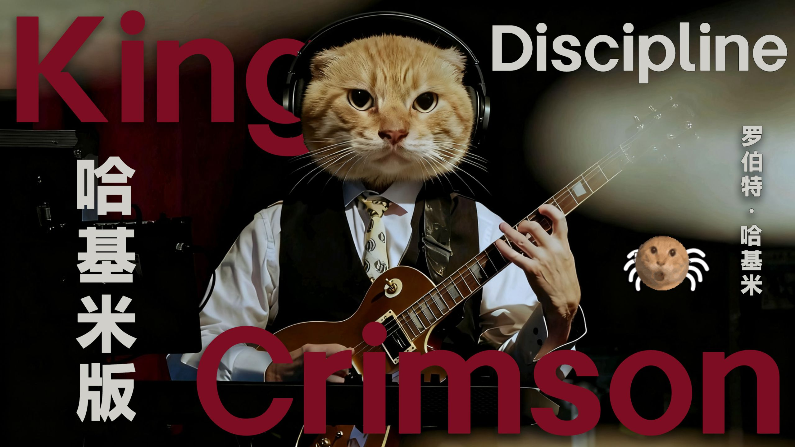 | 270 | 2025-09-14 |
| [【哈基米音乐】基米6-罗马中世基](https://www.bilibili.com/video/BV1SapczfEWJ) |  | 493 | 2025-09-14 |
| [【草莓猫Taffy】在看了数个哈基米音乐后突发恶疾，感染了哈基米病毒而倒下](https://www.bilibili.com/video/BV1TQHZzJEhy) |  | 891 | 2025-09-14 |
| [【哈基米音乐】《哈基谣》完整版](https://www.bilibili.com/video/BV1XsHfzdELW) |  | 555 | 2025-09-14 |
| [今日歌曲｜【2:23AM（哈基米版）】“哈基米米米米米→米诺娜↑美撸多”](https://www.bilibili.com/video/BV1f5HfzYEco) | 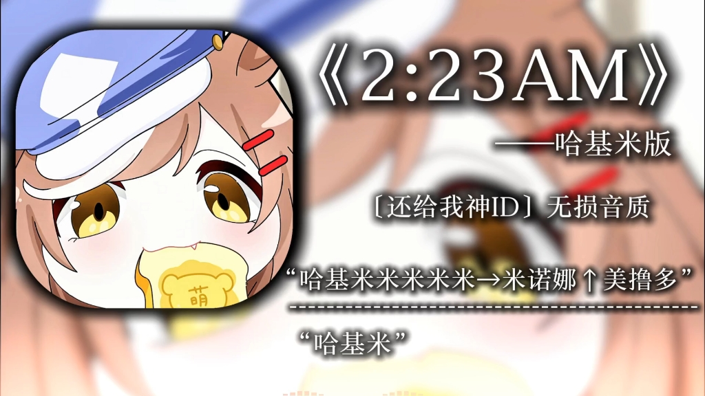 | 227 | 2025-09-14 |
| [［哈基米音乐］𝒯𝒽ℯ 𝒢𝓇𝒶𝓃𝒹 𝒥𝒾𝓂𝒾](https://www.bilibili.com/video/BV1FQHfzuEhw) |  | 92 | 2025-09-14 |
| [【哈基米音乐】KING（纯净版）](https://www.bilibili.com/video/BV1LVHoz4Eun) |  | 1614 | 2025-09-14 |
| [锐评哈基米音乐第一期！从夯到拉！](https://www.bilibili.com/video/BV1aWHozSEpc) |  | 82 | 2025-09-14 |
| [【哈基米音乐】基米 来吧！又一印度神曲](https://www.bilibili.com/video/BV1ckHozqEt9) |  | 456 | 2025-09-14 |
| [哈基米音乐是我苦逼高三生活唯一的光](https://www.bilibili.com/video/BV16xpEzoErg) | 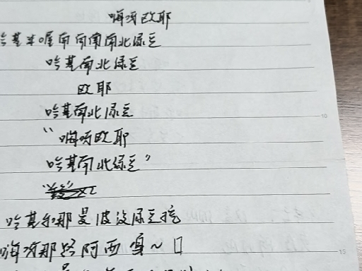 | 50 | 2025-09-13 |
| [【全网首发】人声翻唱哈基米幻想即兴曲](https://www.bilibili.com/video/BV1vLpJzWEPy) |  | 27 | 2025-09-13 |
| [《哈基米弹球》森林章节音乐演示](https://www.bilibili.com/video/BV1xQpjzwEsM) |  | 14 | 2025-09-13 |
| [[哈基米音乐]犽戎 Roar of the Jungle Dragon 丛林龙之吼](https://www.bilibili.com/video/BV125pEzKEM8) |  | 3519 | 2025-09-13 |
| [《天上掉下个哈基米》](https://www.bilibili.com/video/BV1vppGzvEhZ) |  | 10.7万 | 2025-09-13 |
| [【哈基米音乐】《降基》 超多长难句](https://www.bilibili.com/video/BV1nqpLzXEcJ) |  | 1019 | 2025-09-13 |
| [哈基米音乐《哈沫》](https://www.bilibili.com/video/BV163pgzNE3J) |  | 16 | 2025-09-12 |
| [【哈基米音乐】History- EXO🐱](https://www.bilibili.com/video/BV1Mjp3zDEPt) |  | 208 | 2025-09-12 |
| [天上掉下来个哈基米](https://www.bilibili.com/video/BV1F6HrzXE3g) |  | 2.1万 | 2025-09-12 |
| [日推歌单｜【哈基米小曲】｜“会功夫的哈基米”｜《十年哈气》-欠费百万阿伟](https://www.bilibili.com/video/BV12cH6z8EK1) |  | 1207 | 2025-09-12 |
| [【哈基米音乐】O Come O Come Hachimi](https://www.bilibili.com/video/BV1a8H6z6EE4) |  | 430 | 2025-09-12 |
| [《哈基米山歌》【夢ノ結唱 HALO】](https://www.bilibili.com/video/BV1xgHYz3ETz) |  | 36 | 2025-09-12 |
| [一梦江湖：马步谣哈基米🐱](https://www.bilibili.com/video/BV1AEHvzCEWf) |  | 291 | 2025-09-11 |
| [以防你不知道鸣潮自带哈基米音乐](https://www.bilibili.com/video/BV1ugHUz4Ed8) |  | 4.0万 | 2025-09-10 |
| [超低质，每日哈基米音乐推荐0.1](https://www.bilibili.com/video/BV1k2aozFECS) |  | 667 | 2025-09-08 |
| [【哈基米音乐】It&#x27;s 冰 a long long time](https://www.bilibili.com/video/BV18HYLzFEto) |  | 136 | 2025-09-07 |
| [【枪声音乐】我用和平精英揍出了一首哈基米!](https://www.bilibili.com/video/BV1MuYTzKEEu) |  | 1374 | 2025-09-06 |
| [哈基米 这个豪横](https://www.bilibili.com/video/BV1AnYTzZEwR) | 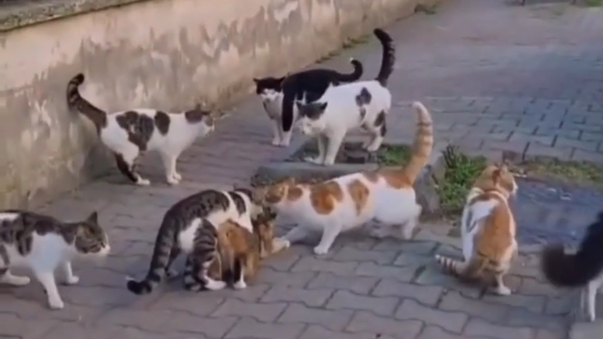 | 1803 | 2025-09-06 |
| [【哈基米FM老库存】《基上关》，当时技术还不太娴熟，有点粗制滥造，ch着听吧各位](https://www.bilibili.com/video/BV1Vda8zuE4v) |  | 1194 | 2025-09-05 |
| [哈基米burn（zekk版）](https://www.bilibili.com/video/BV11tatzSEFC) | 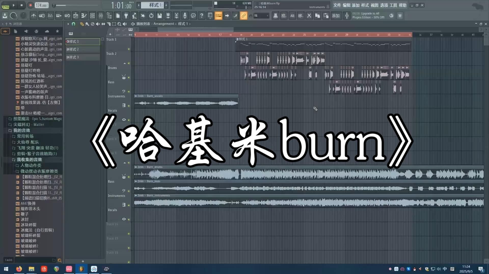 | 181 | 2025-09-05 |
| [哈基米音乐：👏tell 米 tell 米👏](https://www.bilibili.com/video/BV1eya2zDE3j) |  | 15.8万 | 2025-09-04 |
| [究竟是多绝望的基米，才能哈出这样的动静](https://www.bilibili.com/video/BV16WagzbE4r) |  | 4563 | 2025-09-03 |
| [舌尖上的哈基米——铁锅炖基米）](https://www.bilibili.com/video/BV1iYagzpEAx) |  | 11.3万 | 2025-09-03 |
| [【纯净哈基米FM】：🔥jimi of the dark🔥](https://www.bilibili.com/video/BV1s9aMzcEnH) |  | 4546 | 2025-09-03 |
| [【哈基米音乐】基米出来好胖胖（太阳出来喜洋洋）](https://www.bilibili.com/video/BV14dacz2EBV) |  | 1242 | 2025-09-02 |
| [金色大厅史诗管弦乐演奏⚡哈基米山歌⚡](https://www.bilibili.com/video/BV1KZaczLE92) |  | 2803 | 2025-09-02 |
| [还是会哈你，哈进你心里#哈基米音乐](https://www.bilibili.com/video/BV1QWaFzUEBa) |  | 3510 | 2025-09-02 |
| [⚡ 『 哈 基 米 制 造 』 ⚡时间要开始加速了！](https://www.bilibili.com/video/BV1qSh2zWEGa) |  | 4.0万 | 2025-08-29 |
| [喜欢听古典的和喜欢哈基米音乐的都沉默了...](https://www.bilibili.com/video/BV1BHh1z9Eow) | 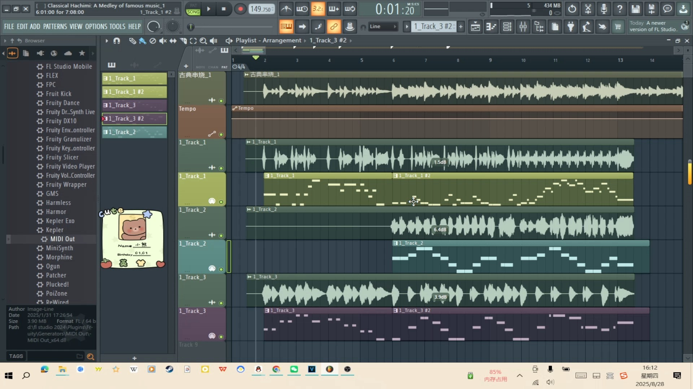 | 985 | 2025-08-28 |
| [哈基米能不能追上小球？](https://www.bilibili.com/video/BV12he9zhELx) |  | 66.6万 | 2025-08-28 |
| [【哈基米音乐】私光（浮光）（The History）](https://www.bilibili.com/video/BV1sqeyzvEjn) |  | 1004 | 2025-08-27 |
| [新人up，第一次做哈基米音乐](https://www.bilibili.com/video/BV1Ywe1zEEGY) | 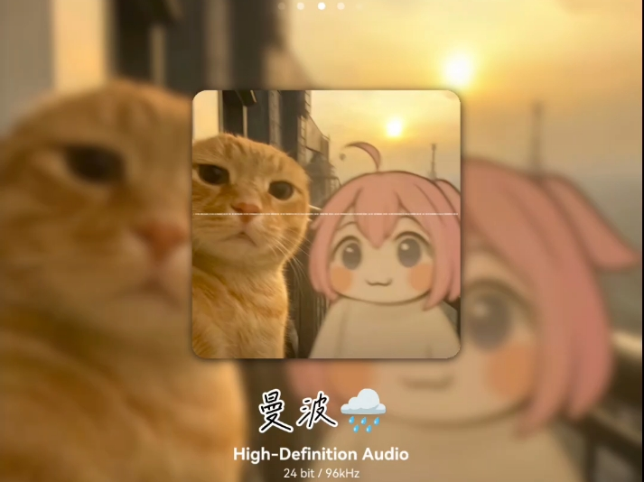 | 1394 | 2025-08-27 |
| [🐱耄耋没有哈气：&quot;你说你不想哈基米!&quot;🐱](https://www.bilibili.com/video/BV1omeHzbERf) |  | 7.7万 | 2025-08-25 |
| [Sask看盘点20首哈基米音乐!这个榜纯up个人审美啊!](https://www.bilibili.com/video/BV11kezzdEh4) |  | 1.1万 | 2025-08-23 |
| [哈基米音乐《稻哈》](https://www.bilibili.com/video/BV1wRe8zoELj) |  | 346 | 2025-08-22 |
| [[私壬唱片]哈基米音乐：Mystic Light Hachimi(劲爆Hardcore改编版)](https://www.bilibili.com/video/BV1kEeazFEWY) |  | 36.1万 | 2025-08-22 |
| [【哈基米】D大调卡农（原曲不使用）](https://www.bilibili.com/video/BV1VneAzKERE) |  | 32.9万 | 2025-08-19 |
| [永不落幕的哈基米嘉年华【基米电台 Day2】](https://www.bilibili.com/video/BV15qYtzqEvp) |  | 2.3万 | 2025-08-19 |
| [哈基米 这个侏罗纪](https://www.bilibili.com/video/BV1iHYyzQEx1) |  | 1.9万 | 2025-08-17 |
| [古典哈基米音乐《耄耋狂哈节》【基米电台 Day1 冠军作】](https://www.bilibili.com/video/BV1gubxz5EUa) |  | 8.0万 | 2025-08-17 |
| [哈基米音乐史上的那些经典作品](https://www.bilibili.com/video/BV1ZnYYzXE8u) |  | 215 | 2025-08-16 |
| [【哈基米音乐】八连臭哈之歌](https://www.bilibili.com/video/BV1mwbJz9EBG) |  | 3.0万 | 2025-08-15 |
| [【纯净哈基米】&quot;再靠近一点点 就对你哈气&quot;](https://www.bilibili.com/video/BV1WSbhzHETU) |  | 1.2万 | 2025-08-13 |
| [哈基米:我知道😿](https://www.bilibili.com/video/BV1fWbGzxEhq) |  | 8.2万 | 2025-08-11 |
| [🐱哈基米：高洁的哈皇（哈京院处刑曲）🐱](https://www.bilibili.com/video/BV1EHtszpEim) |  | 3.8万 | 2025-08-09 |
| [【FM83.0 无止境基米电台】Day2 电音哈基米](https://www.bilibili.com/video/BV1hPhLz9Er3) |  | 16.6万 | 2025-08-04 |
| [【哈基米】沙鲁快乐曲](https://www.bilibili.com/video/BV1kqhGzeE75) |  | 1.4万 | 2025-08-03 |
| [日本VTuber看哈基米音乐《四基 · 冬》时的反应，途中都忍不住去指挥了](https://www.bilibili.com/video/BV1c2hNzLE7g) |  | 6.7万 | 2025-08-03 |
| [【哈基米】群青](https://www.bilibili.com/video/BV1PJh4zVEGh) |  | 16.4万 | 2025-08-02 |
| [恩将仇报的哈基米](https://www.bilibili.com/video/BV1eS8BztEsF) |  | 1.9万 | 2025-07-30 |
| [【哈基米】⚡ARE YOU HAJI?⚡](https://www.bilibili.com/video/BV1ajbCzaEkU) |  | 4824 | 2025-07-25 |
| [进来听惊！洗涤心灵！《哈气哈基米多心经》](https://www.bilibili.com/video/BV1bpuHzJEcr) |  | 9.7万 | 2025-07-15 |
| [舌尖上的哈基米🐱强的没边了](https://www.bilibili.com/video/BV1FuMQzmE1D) |  | 2.8万 | 2025-07-12 |
| [【哈基米音乐】大哈基节](https://www.bilibili.com/video/BV1dRuGziE8t) |  | 11.1万 | 2025-07-11 |
| [【哈基米】⚡MINECRAFT⚡（原曲不使用）](https://www.bilibili.com/video/BV1hTG3zhEFw) |  | 6.0万 | 2025-07-11 |
| [哈气大哈基米！](https://www.bilibili.com/video/BV1U43oznENu) |  | 4708 | 2025-07-05 |
| [【哈基米音乐】自由飞翔](https://www.bilibili.com/video/BV1Lj3mzTEER) |  | 5.2万 | 2025-07-04 |
| [古典哈基米：西班牙斗耄士进行曲](https://www.bilibili.com/video/BV1Tk3Jz1ETa) |  | 273.6万 | 2025-07-04 |
| [陛下我叫：哈基米莫南北绿豆阿西哈呀库](https://www.bilibili.com/video/BV1x3gQzAEAB) |  | 235.1万 | 2025-07-02 |
| [哈基米音乐:消逝的光芒 Horizon](https://www.bilibili.com/video/BV12kgozjEth) |  | 16.2万 | 2025-06-29 |
| [尸人哈基米阴乐：🙀死魂曲 奉神御詠歌🙀](https://www.bilibili.com/video/BV1Z8KizFETc) | 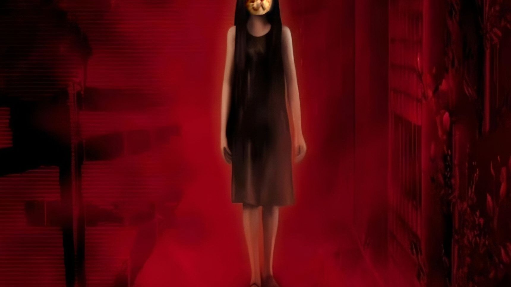 | 2.4万 | 2025-06-27 |
| [“那些火遍全网的神人哈基米音乐”](https://www.bilibili.com/video/BV1hiKuzGEMS) |  | 56.3万 | 2025-06-24 |
| [【哈基米音乐】基静岭](https://www.bilibili.com/video/BV1yqNQz2EAB) |  | 2.8万 | 2025-06-22 |
| [哈基米：基基侠 新主题曲《小英雄大肚腩》](https://www.bilibili.com/video/BV1duT8zVE2j) |  | 4.5万 | 2025-06-06 |
| [如何用DeepSeek制作哈基米音乐月入百万](https://www.bilibili.com/video/BV1cgTszuEoH) |  | 7.9万 | 2025-06-05 |
| [⚡哈基米药水（Clean）完整版⚡](https://www.bilibili.com/video/BV1BnT7z7ETo) |  | 60.8万 | 2025-06-04 |
| [【补档】出山哈基米](https://www.bilibili.com/video/BV1oujdzrEjS) | 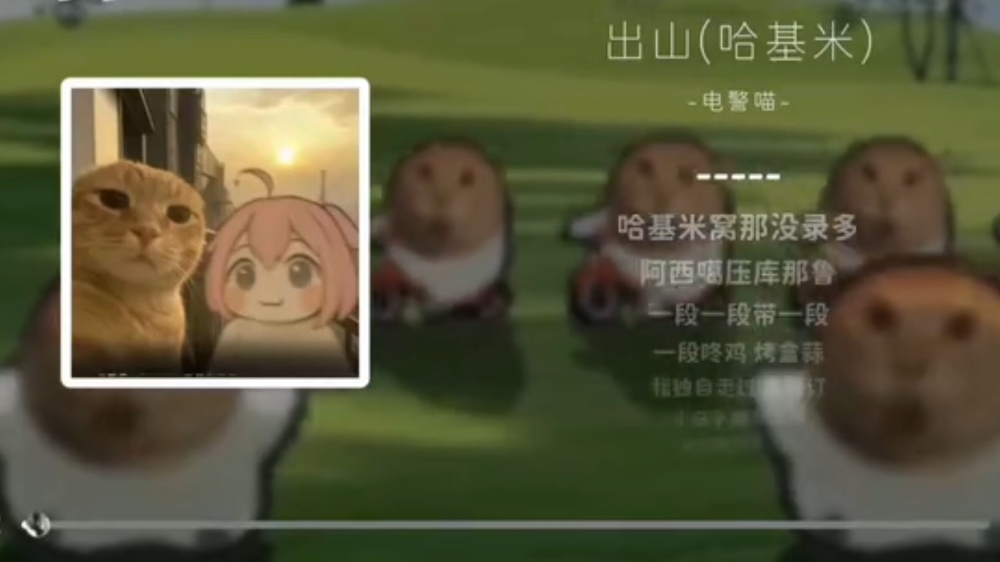 | 1.6万 | 2025-05-27 |
| [【哈基米音乐】基迷世界](https://www.bilibili.com/video/BV1H5jRzJEWH) |  | 29.0万 | 2025-05-27 |
| [【鸳鸯戏】哈基米太想进步了😀](https://www.bilibili.com/video/BV1NmjRzoEDj) |  | 2.6万 | 2025-05-27 |
| [【哈基米音乐】Life Goes On](https://www.bilibili.com/video/BV1vyj7zPEW8) |  | 21.6万 | 2025-05-26 |
| [哈基米音乐🐱GBC日常的小曲🐱（おしんこ）](https://www.bilibili.com/video/BV1zHEdznE63) |  | 30.2万 | 2025-05-20 |
| [⚡️难 得 哈 基 米⚡️](https://www.bilibili.com/video/BV1HDE9zXEt2) |  | 22.1万 | 2025-05-19 |
| [【哈基米FM】All my 哈基米](https://www.bilibili.com/video/BV1sh5RzDEdc) |  | 10.6万 | 2025-04-22 |
| [【哈基米FM】基米の镇魂歌](https://www.bilibili.com/video/BV1FCdBYWEij) | 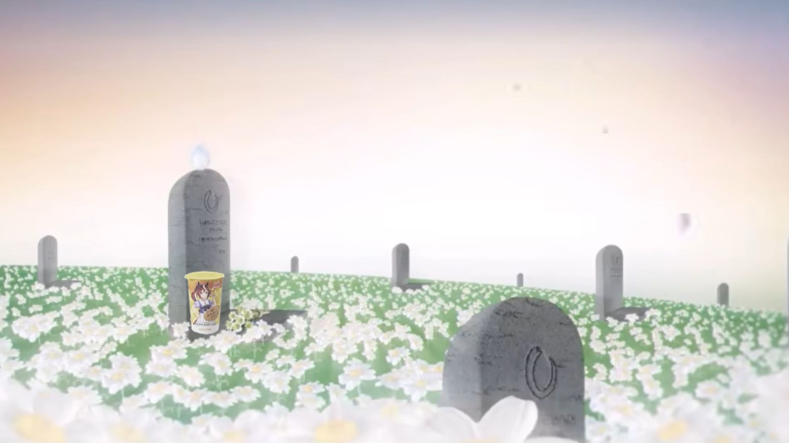 | 15.1万 | 2025-04-13 |
| [【崩溃哈基米】崩溃的基米（collapsing world)](https://www.bilibili.com/video/BV1MSdNY3EEN) | 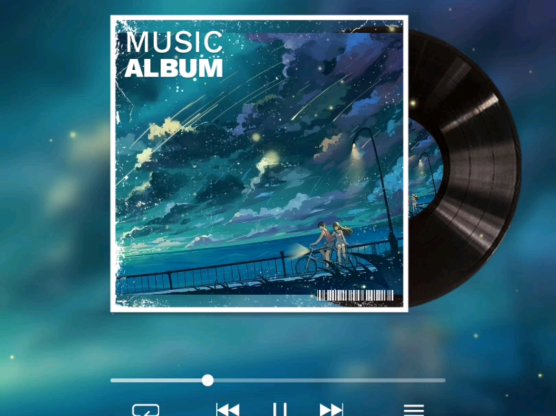 | 1.4万 | 2025-04-09 |
| [哈基米音乐盒之哈错(犯错)](https://www.bilibili.com/video/BV1nYdsYXEdc) |  | 693 | 2025-04-08 |
| [【哈基米音乐】素颜](https://www.bilibili.com/video/BV1zJZSYxEM4) |  | 2419 | 2025-04-03 |
| [基米音乐tv之duvet](https://www.bilibili.com/video/BV1RYRHYwE8M) |  | 16.5万 | 2025-03-08 |
| [【ニコカラ】1991年的活全家哈基米音乐【On / Off Vocal】](https://www.bilibili.com/video/BV19mAwe8EEf) |  | 3.4万 | 2025-02-15 |
| [【THA】金基米奖提名 投票选出你的年度最佳哈基米](https://www.bilibili.com/video/BV1DXruYXEnE) |  | 196.2万 | 2025-01-05 |
| [【哈基米FM】一 键 没](https://www.bilibili.com/video/BV13MC9YnEK6) |  | 23.2万 | 2024-10-19 |
| [【杀死那只哈基米】](https://www.bilibili.com/video/BV1zS411A7PT) |  | 51.8万 | 2024-06-21 |
| [恐龙抗狼哈基米十分钟纯享版，听完直接活全家了](https://www.bilibili.com/video/BV1AH4y1V7nE) |  | 5.1万 | 2024-05-02 |

---
*最后更新: 2025-09-15 02:38:58 (自动生成)*
*数据来源: [Bilibili](https://www.bilibili.com)*

## 使用说明

运行以下命令更新视频列表:
```bash
python3 fetch_hajimi_videos.py
```
