# awesome-hajimi
collections of hajimi (哈基米 in Chinese) on the Internet.

## 视频列表 (Video List)

| 视频标题 (Title) | 封面 | 播放量 (Views) | 发布日期 (Date) |
|---|---|---|---|
| [哈基米录像之面对挑衅](https://www.bilibili.com/video/BV1hByuBWEex) |  | 0 | 2025-11-21 |
| [各种氛围哈基米](https://www.bilibili.com/video/BV1z3yNBxEpS) | 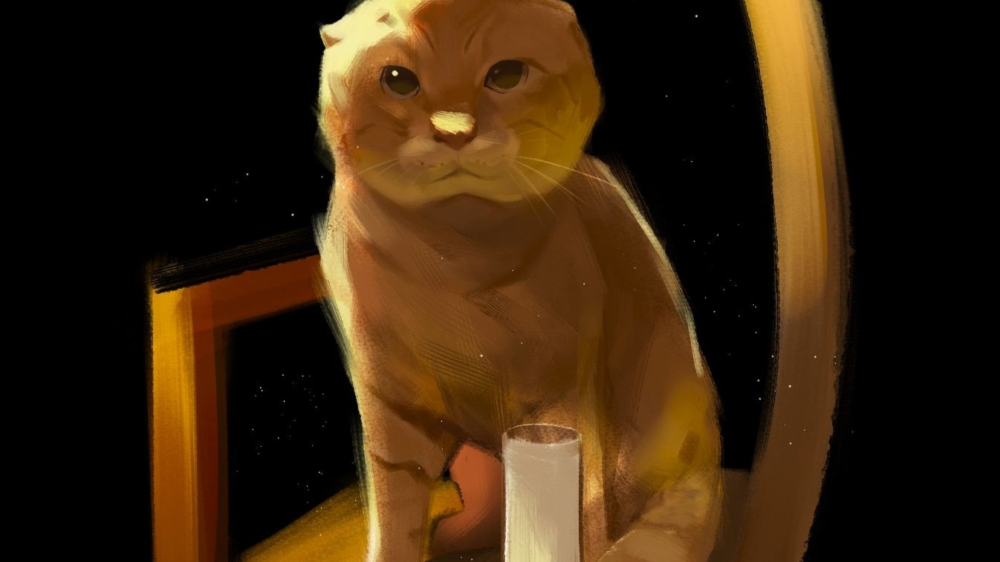 | 781 | 2025-11-21 |
| [【哈基米音乐】33号哈基队《阿莉西亚》妹妹的小曲🎶](https://www.bilibili.com/video/BV1atyNByEtd) |  | 630 | 2025-11-21 |
| [哈 基 灵 那 没 路 躲](https://www.bilibili.com/video/BV1rLyTBhETU) | 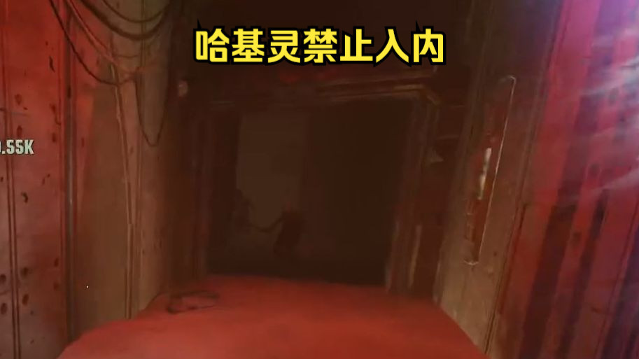 | 829 | 2025-11-20 |
| [【AI音乐】真人东海帝王深情演唱《神-哈基米》日文版](https://www.bilibili.com/video/BV1T7yKB3EfB) |  | 250 | 2025-11-20 |
| [曼波牌-哈基米大米二次元系列](https://www.bilibili.com/video/BV1YMyKB7EpT) |  | 67 | 2025-11-20 |
| [哈基米伤痛文学。](https://www.bilibili.com/video/BV1ijyAB5Ej1) |  | 948 | 2025-11-20 |
| [我是开挖掘机的，这就是挖机吧](https://www.bilibili.com/video/BV1LdyABmEyZ) |  | 159 | 2025-11-20 |
| [经典人猫交流！哈基米不顾劝阻强行排泄](https://www.bilibili.com/video/BV16SyABQEmZ) | 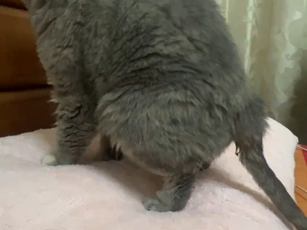 | 6469 | 2025-11-20 |
| [再也不外放哈基米了](https://www.bilibili.com/video/BV1cUyABWEbz) |  | 470 | 2025-11-20 |
| [今晚，哈基米和我都要猎个痛快](https://www.bilibili.com/video/BV1nUyABpEBt) |  | 2650 | 2025-11-20 |
| [翻翻乐也能有新玩法！【双喵成行】哈基米的记忆力有多强大？](https://www.bilibili.com/video/BV1p1yABsEAz) |  | 384 | 2025-11-20 |
| [九阳之后，易学圈也吃上哈基米的红利了？](https://www.bilibili.com/video/BV1XNyPBrEZU) |  | 751 | 2025-11-20 |
| [⚡哈基米和鸽鸽对唱⚡](https://www.bilibili.com/video/BV1DgyPBMEgp) |  | 646 | 2025-11-20 |
| [哈基米兰](https://www.bilibili.com/video/BV1v9ycB3E4Y) |  | 1559 | 2025-11-20 |
| [拥有这样一只哈基米一定很惬意吧](https://www.bilibili.com/video/BV1YFywBTEMz) |  | 758 | 2025-11-20 |
| [古典哈基米：哈米哦与基利耶 幻想序曲](https://www.bilibili.com/video/BV1VoycBuE8B) |  | 481 | 2025-11-20 |
| [曼波，叮咚鸡，大狗叫，哈基米音乐里的这些私人音源都是怎么来的？](https://www.bilibili.com/video/BV1nrycBJE6Y) |  | 1.6万 | 2025-11-20 |
| [大肥基](https://www.bilibili.com/video/BV1NjywBxEkh) | 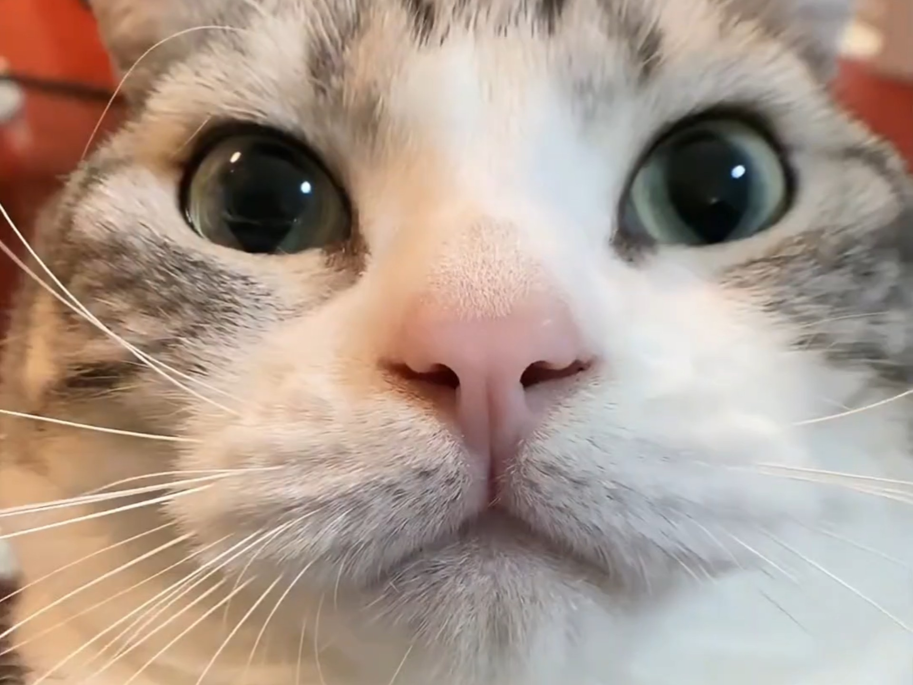 | 2.7万 | 2025-11-20 |
| [哈基米有史以来最高的山之一，招财巅峰之作回顾╮( •́ω•̀ )╭](https://www.bilibili.com/video/BV1K5ywBoEAF) |  | 3573 | 2025-11-20 |
| [这些是最抽象的食物！居然还有哈基米南北绿豆豆浆！](https://www.bilibili.com/video/BV1pnywBXE6e) |  | 2.6万 | 2025-11-20 |
| [【哈基米音乐】不得不哈](https://www.bilibili.com/video/BV1AJywBWEFx) |  | 6.7万 | 2025-11-20 |
| [【哈基米】超威蓝猫](https://www.bilibili.com/video/BV1DPywBeENj) | 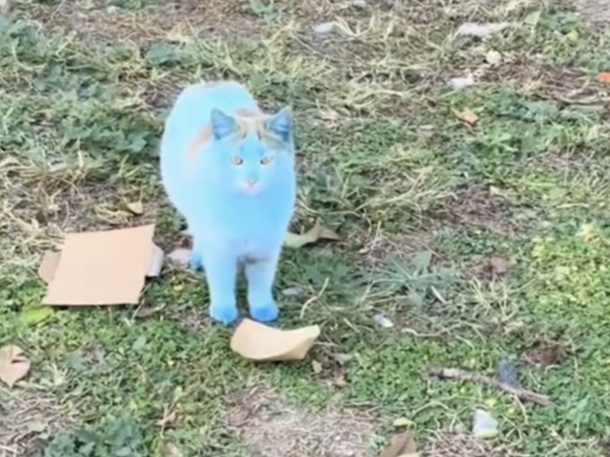 | 1125 | 2025-11-20 |
| [真是一对苦命鸳鸯......](https://www.bilibili.com/video/BV1usycBwEmz) |  | 3.2万 | 2025-11-20 |
| [逆天！这真是一对苦命鸳鸯啊！](https://www.bilibili.com/video/BV1iMCfBPEzT) |  | 6.7万 | 2025-11-20 |
| [【智人TV】因为儿子天天躺着玩手机，所以把他抓来盐焗了](https://www.bilibili.com/video/BV1MyyFBbEdp) |  | 16.1万 | 2025-11-20 |
| [坚持晨练哈基米](https://www.bilibili.com/video/BV1BgyABEE8A) |  | 241 | 2025-11-20 |
| [『风哈雨』⚡如果你懂哈基米又懂风催雨⚡｜【白羽Dove】翻唱](https://www.bilibili.com/video/BV1YrywBuEM7) |  | 160 | 2025-11-20 |
| [猫儿这个全哈福](https://www.bilibili.com/video/BV1uUywBeEuN) | 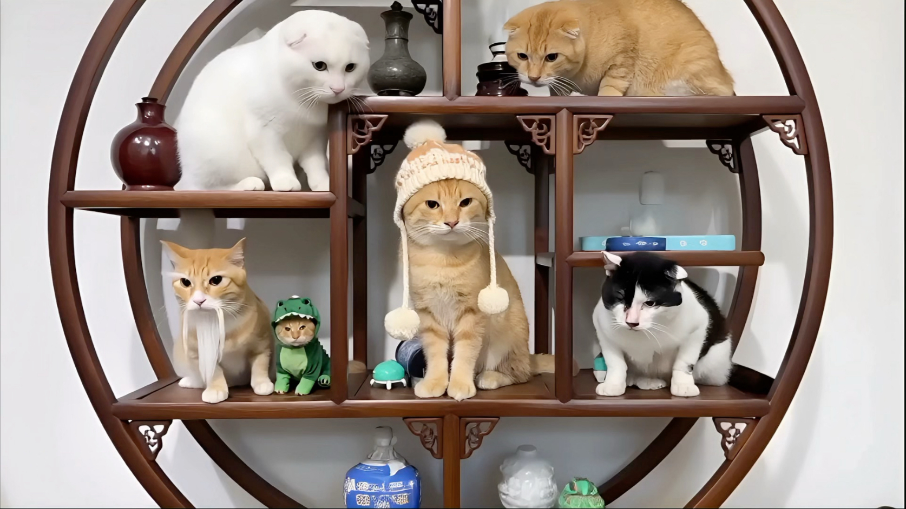 | 5945 | 2025-11-20 |
| [哈基米怕痛一进去就忍不住拔出来，疼得满地跑](https://www.bilibili.com/video/BV1ZbywBjEdj) | 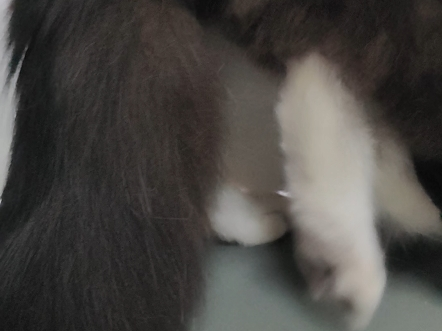 | 2.3万 | 2025-11-20 |
| [【哈基米曼波】【循环】｜ 《哈基米花田》“思念变成海，在窗外进不来”](https://www.bilibili.com/video/BV1yoyFBJEp5) |  | 123 | 2025-11-20 |
| [一些猎奇离谱的AI视频（5）](https://www.bilibili.com/video/BV129ywBFEwt) | 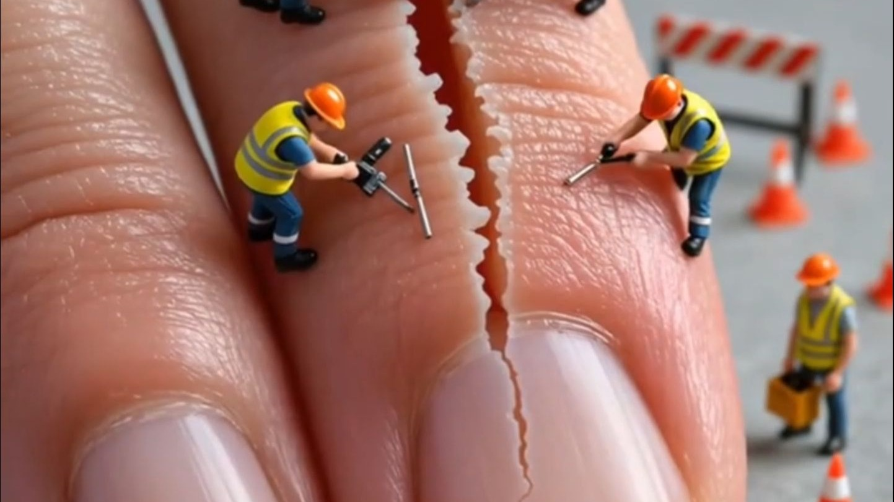 | 12.0万 | 2025-11-20 |
| [坚持晨练哈基米](https://www.bilibili.com/video/BV1BgyABEEzd) |  | 271 | 2025-11-20 |
| [挑战全网最可爱哈基米曼波()](https://www.bilibili.com/video/BV1pcyABxEyC) | 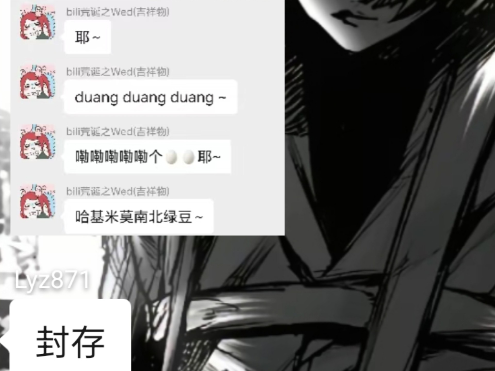 | 378 | 2025-11-20 |
| [疯狂声讨九阳哈基米？1％的人发出99％的噪音！](https://www.bilibili.com/video/BV1FJyFB1ESo) |  | 1577 | 2025-11-20 |
| [冬天快到了哈基米的结局也要来了](https://www.bilibili.com/video/BV1wEyFBjE6X) | 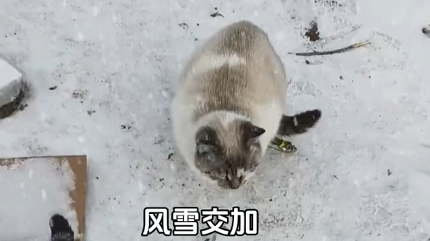 | 2120 | 2025-11-20 |
| [神人持猫法之中断哈气](https://www.bilibili.com/video/BV1iVycBBEKF) | 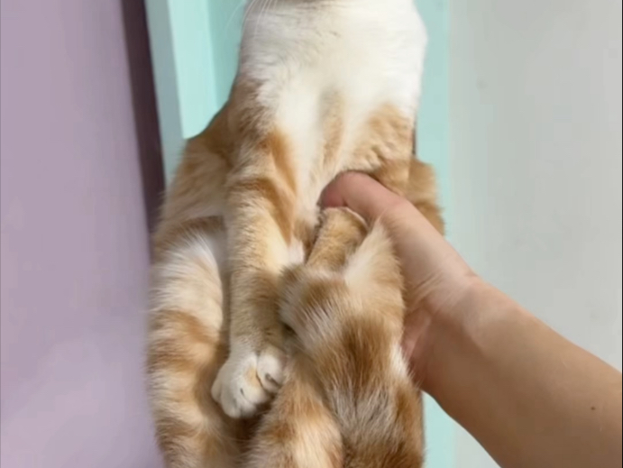 | 11.4万 | 2025-11-20 |
| [哈基米南北绿豆 绝航9杀疾风AS Val+SV98](https://www.bilibili.com/video/BV1uPyFBdE9P) |  | 277 | 2025-11-20 |
| [哈基米南北绿豆](https://www.bilibili.com/video/BV1uyyFBbEpz) |  | 601 | 2025-11-20 |
| [结合哈基米3.0，SillyTavern，GPT-SoVITS制作的简陋galgame](https://www.bilibili.com/video/BV1SyyFBtEjf) | 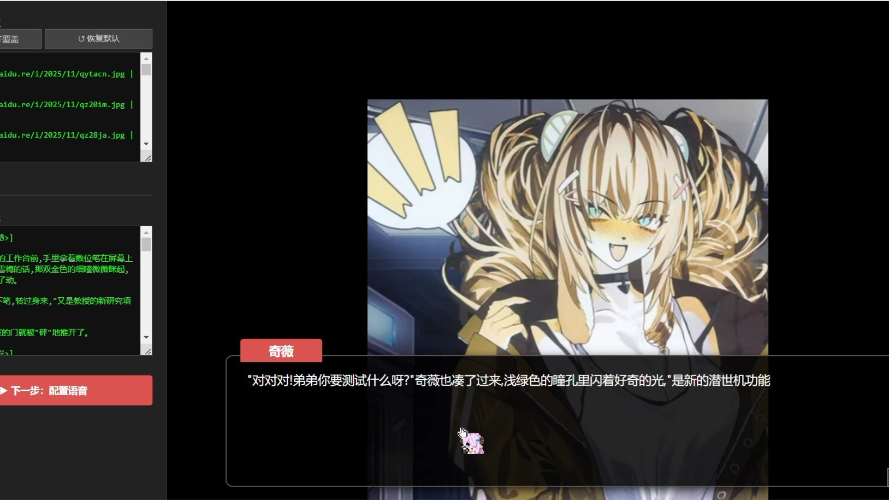 | 70 | 2025-11-20 |
| [哈基米俱乐部VS大狗嚼俱乐部](https://www.bilibili.com/video/BV1fPycByERM) |  | 1942 | 2025-11-20 |
| [【哈基米曼波】【循环】｜ 《Color-X》](https://www.bilibili.com/video/BV1PoyFBnEwk) |  | 454 | 2025-11-20 |
| [六年前的B站全是这种视频！](https://www.bilibili.com/video/BV1JnCZBTEkA) |  | 5.7万 | 2025-11-20 |
| [【超自然大熊性转COS】大熊不发威，你当我是哈基米！](https://www.bilibili.com/video/BV1wqyHBCEia) |  | 1522 | 2025-11-20 |
| [🐱哈基米非常可爱🐱【纯净哈基米】](https://www.bilibili.com/video/BV1TaycB4E1D) |  | 7723 | 2025-11-20 |
| [一人一首成名曲《Time to Go (Explicit)》《军工小曲 (哈基米)》《BARRETE!》《深渊 (phonk硬曲)》《Kamin (1.1x)》](https://www.bilibili.com/video/BV1hHycBAEuP) |  | 921 | 2025-11-20 |
| [😼猫meme食品广告😼](https://www.bilibili.com/video/BV1hpycBaEby) | 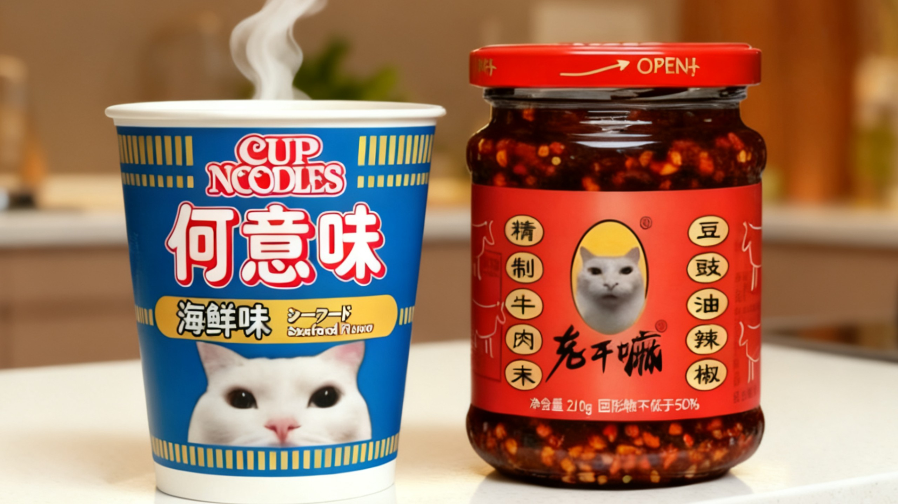 | 4882 | 2025-11-20 |
| [有工地小哥中午没吃饭，让我下午4点去卖，那必须4点准时到 还让一个工人师傅能不乱丢垃圾了，功德+1 投喂饿的喵喵叫的哈基米，功德+1](https://www.bilibili.com/video/BV1axCgBtEfY) |  | 976 | 2025-11-20 |
| [营救哈基米学长](https://www.bilibili.com/video/BV1qMCfBPEcR) | 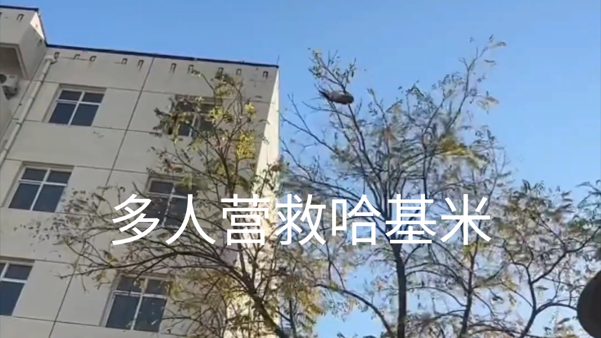 | 21.4万 | 2025-11-20 |
| [哈基米南北绿豆，一颗提神做回自己](https://www.bilibili.com/video/BV1CDCZB1E9d) |  | 102 | 2025-11-20 |
| [猞猁妈妈哈一下，小猞猁也哈一下](https://www.bilibili.com/video/BV1bHCfBsEMd) |  | 4291 | 2025-11-20 |
| [虎子护食哈气、小猫竟不怕？](https://www.bilibili.com/video/BV1vXyHBaEWU) | 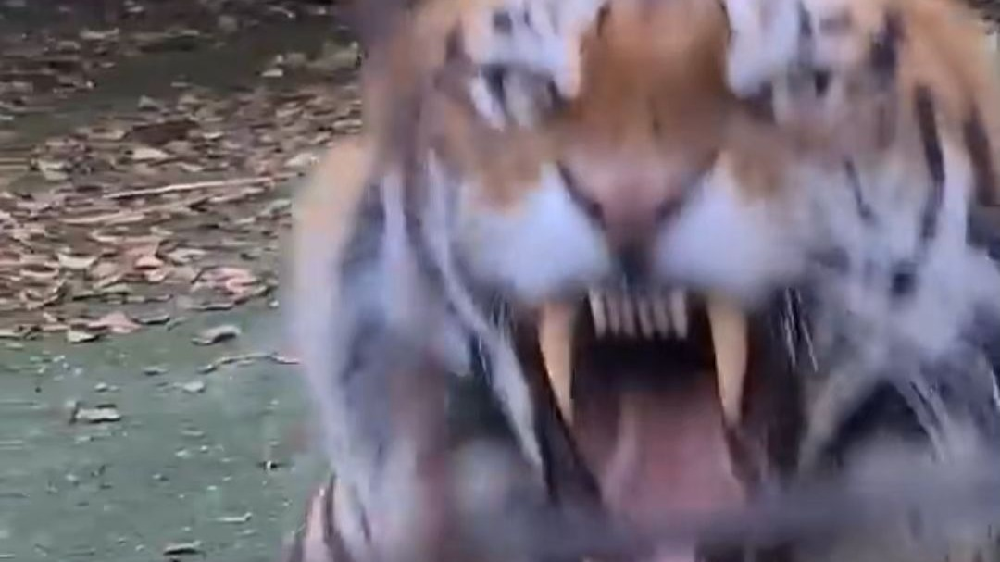 | 2.0万 | 2025-11-19 |
| [鸽鸽最惨的一集](https://www.bilibili.com/video/BV18wypBxEYv) | 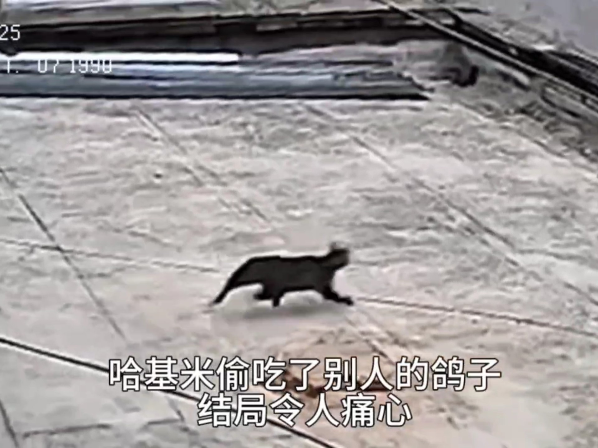 | 2428 | 2025-11-19 |
| [哈基米掉入旱厕 臭气熏天](https://www.bilibili.com/video/BV1qUyHBNE6a) |  | 6098 | 2025-11-19 |
| [高市早苗在线哈气](https://www.bilibili.com/video/BV1czyJBeET4) |  | 6.6万 | 2025-11-19 |
| [哈基米哈基米 doro也是哈基米](https://www.bilibili.com/video/BV1v2yJBZEp9) |  | 1682 | 2025-11-19 |
| [神秘魔法少女揭晓！就是哈基米！米雪儿！大伙有没有猜对呢！【杂谈卡丘】](https://www.bilibili.com/video/BV18zynBpE8B) |  | 4.4万 | 2025-11-19 |
| [哈基米：对面是魔鬼 # 萌到爆炸了](https://www.bilibili.com/video/BV1ehynBZEDc) | 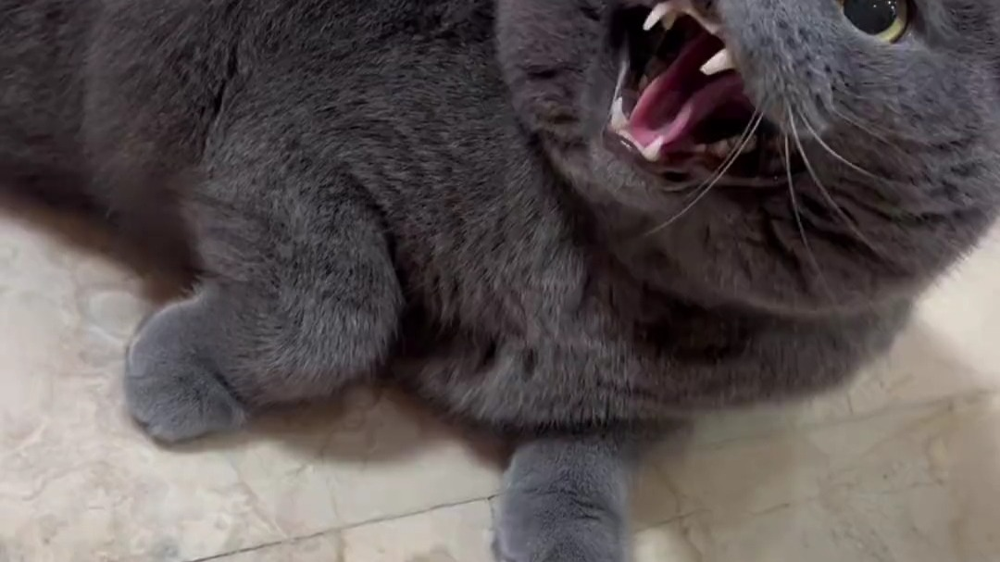 | 503 | 2025-11-19 |
| [“哈基米米米米米～”](https://www.bilibili.com/video/BV15hynBZER2) |  | 1207 | 2025-11-19 |
| [透视真是太简单了......](https://www.bilibili.com/video/BV1ENyHBvEAU) |  | 8155 | 2025-11-19 |
| [【高雅基米进大东北】看太多memes，梦到哪里演哪里的乐团。。](https://www.bilibili.com/video/BV1puyEBNEBv) |  | 9398 | 2025-11-19 |
| [圆头耄耋被捆住，他还是像以前那样见人就哈](https://www.bilibili.com/video/BV1bZy7BkE7Y) | 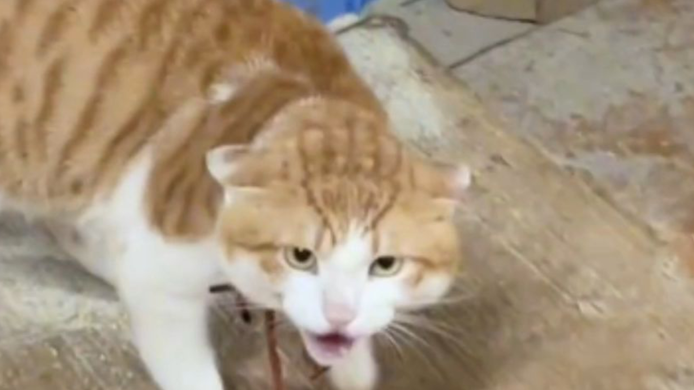 | 3896 | 2025-11-19 |
| [多次元基米融合論【原曲不使用】](https://www.bilibili.com/video/BV1EcyJB8Ekc) |  | 7930 | 2025-11-19 |
| [世界上最神秘的哈基米视频 1](https://www.bilibili.com/video/BV1fZyEBhE3o) |  | 1193 | 2025-11-19 |
| [【哈基米音乐】viva la vida（原曲不使用）](https://www.bilibili.com/video/BV1Kiy5BcEqT) |  | 3179 | 2025-11-19 |
| [谁懂啊某阳豆浆玩哈基米梗](https://www.bilibili.com/video/BV1chy7BwEZR) |  | 4091 | 2025-11-19 |
| [哈基米练习体操](https://www.bilibili.com/video/BV1v1y7BDE3Q) | 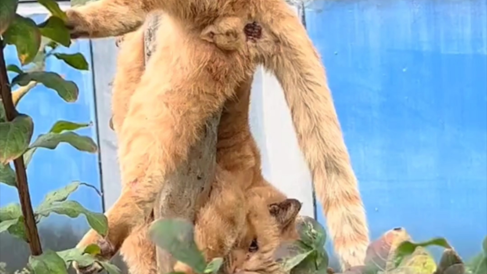 | 1.3万 | 2025-11-19 |
| [当你压力很大时，不妨看看这个.jpg](https://www.bilibili.com/video/BV1a1yVBNEVw) |  | 6.5万 | 2025-11-18 |
| [【婉约派】“♪请不要哈基米♪”](https://www.bilibili.com/video/BV1b1y3B4EMK) |  | 534 | 2025-11-18 |
| [【哈基米】校花模仿猫耋跳舞，😓看得我哈气了](https://www.bilibili.com/video/BV1Bxy3BgEuv) |  | 1.4万 | 2025-11-18 |
| [这是一只威震世界的猛虎](https://www.bilibili.com/video/BV1gWyGBhEpN) |  | 5.3万 | 2025-11-18 |
| [发和猫玩耍视频被下架，说是浪费粮食、不尊重食物、炫耀品种耄耋。b站这操作太搞笑了。原帖主懂了b站的意思立刻把猫作为晚上的主菜，贯彻不浪费食物的理念](https://www.bilibili.com/video/BV1ddyGBBEhA) |  | 2.3万 | 2025-11-18 |
| [建议设成闹钟⏰](https://www.bilibili.com/video/BV1cCyGBmEXw) |  | 3.1万 | 2025-11-18 |
| [20分钟哈基米音乐合集 哈基米～#哈基米 #音乐推荐分享 #音乐合集](https://www.bilibili.com/video/BV1vGygBcEpo) |  | 210 | 2025-11-18 |
| [基米小镇：外奇的报告](https://www.bilibili.com/video/BV1m1CvBDEM9) |  | 4714 | 2025-11-17 |
| [【尘白禁区】哈基晴：舌尖上的基米（哈基米金曲）~](https://www.bilibili.com/video/BV1i8CqBzE3t) |  | 2107 | 2025-11-17 |
| [卡丘哈基米南北绿豆浆——哈气来袭！](https://www.bilibili.com/video/BV1DXCaBEERc) |  | 9857 | 2025-11-17 |
| [《哈曼波 X 我赚钱了》](https://www.bilibili.com/video/BV1ZeC8BXEMw) |  | 54.0万 | 2025-11-17 |
| [高市早苗：懂王，你为啥不支持我？](https://www.bilibili.com/video/BV1THCeBEEU4) |  | 167.0万 | 2025-11-17 |
| [哈基米你在干嘛呢，怎么这么忧伤](https://www.bilibili.com/video/BV1gMC8BrE6w) | 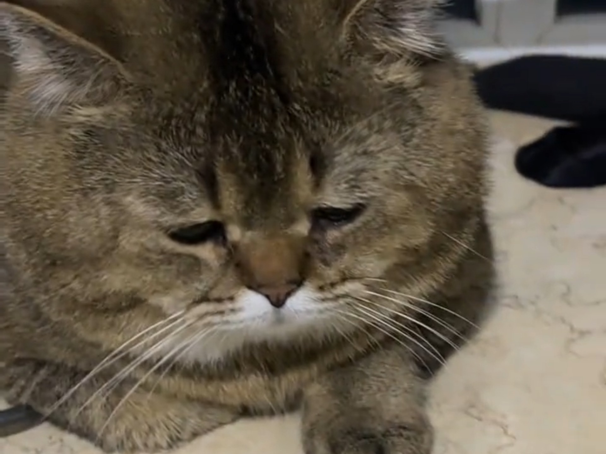 | 2.0万 | 2025-11-16 |
| [【手抄区】陶基基演唱《找基米》](https://www.bilibili.com/video/BV1LiCXBDEHq) |  | 5720 | 2025-11-16 |
| [某音符唐诗《泰曼波》原版视频](https://www.bilibili.com/video/BV1vgCmBPEB3) |  | 1634 | 2025-11-15 |
| [高超的歌词只需要极简的配乐](https://www.bilibili.com/video/BV1wvC1BuEnD) |  | 37.9万 | 2025-11-15 |
| [我赚钱了原版完整版](https://www.bilibili.com/video/BV1caCCBYEzX) |  | 51.1万 | 2025-11-15 |
| [竟然下死手](https://www.bilibili.com/video/BV1DXC3BZEfF) |  | 1.6万 | 2025-11-14 |
| [蔡徐坤新歌What a Day官方MV抢鲜登陆！](https://www.bilibili.com/video/BV1obCtBEE7X) |  | 320.9万 | 2025-11-14 |
| [叫它哈基米居然真的答应了！](https://www.bilibili.com/video/BV1ByCsBrExd) | 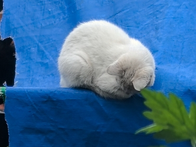 | 108 | 2025-11-13 |
| [库里库里库里库里](https://www.bilibili.com/video/BV1V4kSBTEtN) |  | 227.6万 | 2025-11-09 |
| [真的有这么卡点吗](https://www.bilibili.com/video/BV1pukSBUEqv) |  | 142.5万 | 2025-11-09 |
| [《开摇！近期全网爆火的DJ歌曲合集！》](https://www.bilibili.com/video/BV1AZ2cBxEsP) |  | 98.1万 | 2025-11-07 |
| [意想不到（补档）](https://www.bilibili.com/video/BV1Vv14BVExT) |  | 538.9万 | 2025-11-05 |
| [【最悲伤的一集】基米：我终究不是机器猫，没有那铁做的心呀喂！魂淡](https://www.bilibili.com/video/BV1hE1jB5EXu) |  | 1.9万 | 2025-11-01 |
| [循环歌单｜【boyboyboyboybee】｜“来点猛男该听的【萌妹の小曲】【抖音手势舞の小曲】”](https://www.bilibili.com/video/BV16KyvB3Ep2) |  | 390.0万 | 2025-10-31 |
| [“盘点近期很多人听过但不知名の小曲”](https://www.bilibili.com/video/BV1aByeBhEDb) |  | 11.4万 | 2025-10-31 |
| [东北最强音](https://www.bilibili.com/video/BV1e2ybBSEiU) |  | 59.3万 | 2025-10-30 |
| [《大家一起变橙汁》完整版，从绝望到希望的一集，大家一起喜洋洋](https://www.bilibili.com/video/BV1CMyrBPEC6) |  | 237.9万 | 2025-10-28 |
| [⚡哈基米莫南北绿多⚡](https://www.bilibili.com/video/BV18QaUz9ERN) |  | 9.6万 | 2025-09-04 |
| [猫界特辑：中华田园猫五虎上将闪亮登场，个个是狠角儿](https://www.bilibili.com/video/BV1XyYDzcEup) |  | 653.8万 | 2025-08-21 |
| [爱猫这方面您还是太权威了#哈基米 #猫咪 #离谱](https://www.bilibili.com/video/BV1pPuqzmEpU) |  | 36.6万 | 2025-07-14 |
| [哈基很单纯 饭键的是韧](https://www.bilibili.com/video/BV1ZYx7eeEp4) | 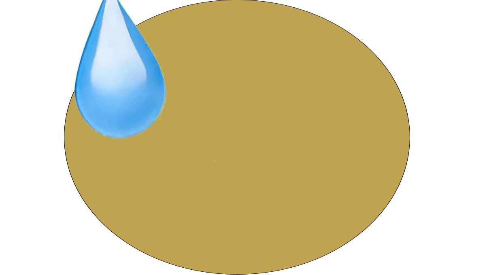 | 102.1万 | 2024-10-01 |

---
*最后更新: 2025-11-21 02:40:53 (自动生成)*
*数据来源: [Bilibili](https://www.bilibili.com)*

## 使用说明

运行以下命令更新视频列表:
```bash
python3 fetch_hajimi_videos.py
```
