# awesome-hajimi
collections of hajimi (哈基米 in Chinese) on the Internet.

## 视频列表 (Video List)

| 视频标题 (Title) | 封面 | 播放量 (Views) | 发布日期 (Date) |
|---|---|---|---|
| [【哈基米音游】🐱Chronomia🐱](https://www.bilibili.com/video/BV1GffZBNETY) |  | 1114 | 2026-02-05 |
| [馆长2.5深夜直播（下半部分）：自宅展示中，介绍家中众多哈基米](https://www.bilibili.com/video/BV1GMFAzyECt) |  | 7310 | 2026-02-04 |
| [耄耋有股媚劲～（人耋）](https://www.bilibili.com/video/BV1csffB7E9y) | 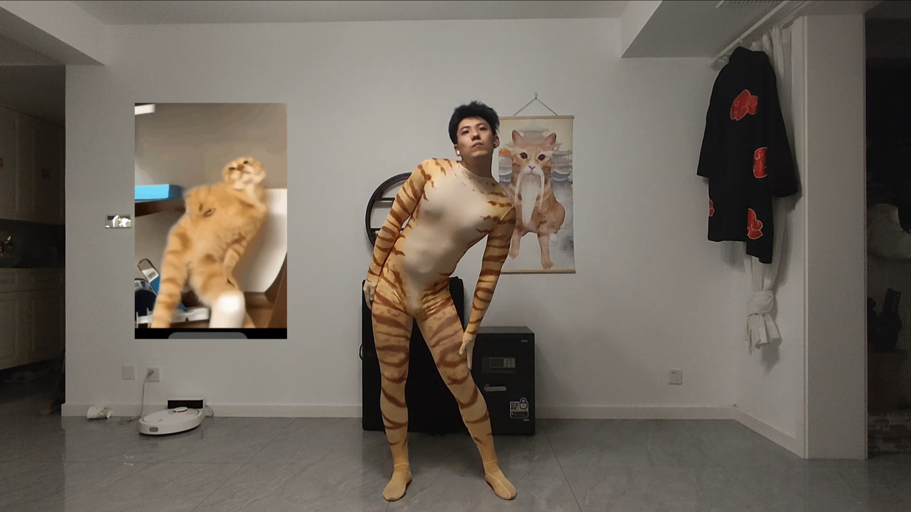 | 558 | 2026-02-04 |
| [愤 怒 的 基 米](https://www.bilibili.com/video/BV1uuffBtEFG) |  | 2134 | 2026-02-04 |
| [为哈基米奏上一曲](https://www.bilibili.com/video/BV1zTFFzmEaS) | 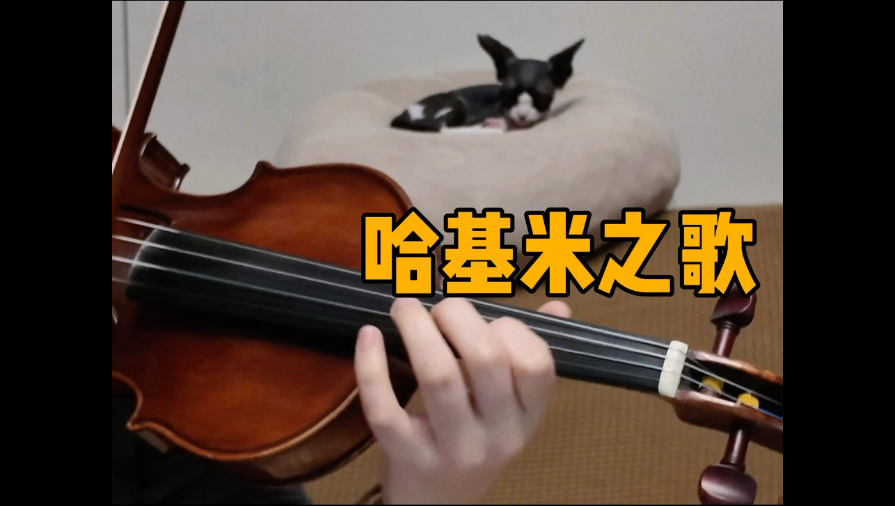 | 542 | 2026-02-04 |
| [《蓝莲哈》哈基米握南北绿豆](https://www.bilibili.com/video/BV1FuFFz7Etb) |  | 112 | 2026-02-04 |
| [欺负小八的哈基米](https://www.bilibili.com/video/BV1rPFFzSEdi) | 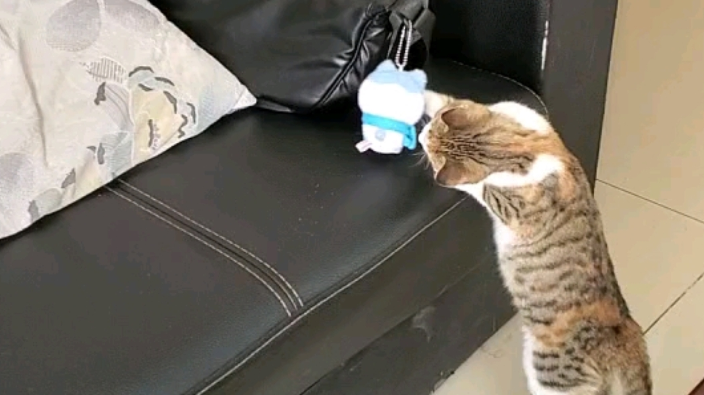 | 118 | 2026-02-04 |
| [byd猫爹最正义的一集：发动对柬埔寨特别军事行动](https://www.bilibili.com/video/BV1rAFFznECK) |  | 1.7万 | 2026-02-04 |
| [“   哈 基 咪 ？ 烧 基 米 ！  ”](https://www.bilibili.com/video/BV1XBfoBfEpo) | 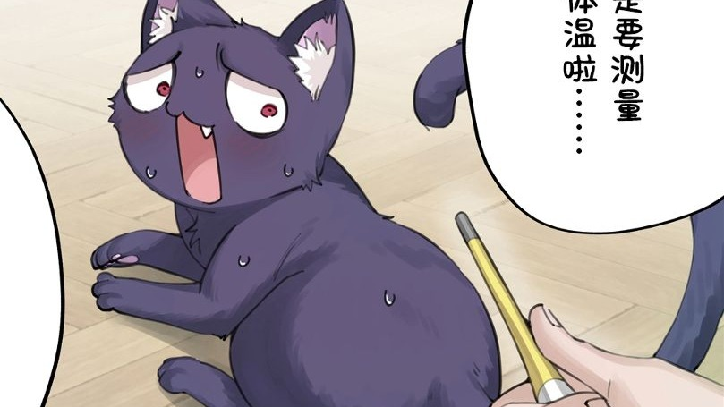 | 4.0万 | 2026-02-04 |
| [【哈基米】恭喜发财](https://www.bilibili.com/video/BV17tfoBqEat) |  | 1090 | 2026-02-04 |
| [新年就唱哈基米！](https://www.bilibili.com/video/BV1rffoBLESv) |  | 1.3万 | 2026-02-04 |
| [❤❤](https://www.bilibili.com/video/BV14hfZBWEoz) |  | 1580 | 2026-02-04 |
| [【哈基米】“lookoutside/尤金的小曲”](https://www.bilibili.com/video/BV14tfZBxEdn) |  | 1488 | 2026-02-04 |
| [【基米TV】依旧打猎高手23分钟剧场版](https://www.bilibili.com/video/BV1pqfZBJEyf) |  | 5163 | 2026-02-04 |
| [今天不骑车了 起飞吧](https://www.bilibili.com/video/BV1xafZBXEMm) | 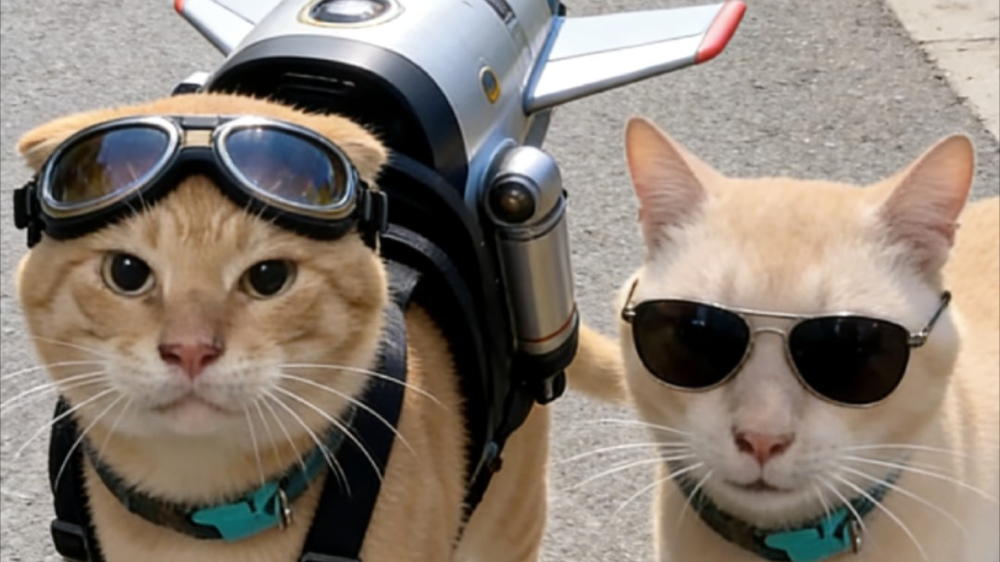 | 973 | 2026-02-04 |
| [哈基米典狱长の小曲](https://www.bilibili.com/video/BV1DqfRBQEQK) |  | 1645 | 2026-02-04 |
| [哈基米：爱猫同志](https://www.bilibili.com/video/BV1VdfdBbE5Z) |  | 3668 | 2026-02-04 |
| [“主播可以唱一首哈基米音乐吗？”【果冻狗の模型切片】](https://www.bilibili.com/video/BV1ZnfXBREPY) |  | 2035 | 2026-02-04 |
| [【哈基米电音】🐱Infinite🐱](https://www.bilibili.com/video/BV1zffXBfEcC) |  | 1445 | 2026-02-04 |
| [哈基米分类队！](https://www.bilibili.com/video/BV1TXfSBTE2N) |  | 3.0万 | 2026-02-03 |
| [《两个笨蛋》](https://www.bilibili.com/video/BV1eAfQBEEj3) |  | 1.2万 | 2026-02-03 |
| [【基米TV】小猫能有什么坏心思呢](https://www.bilibili.com/video/BV15xFLzDEpe) | 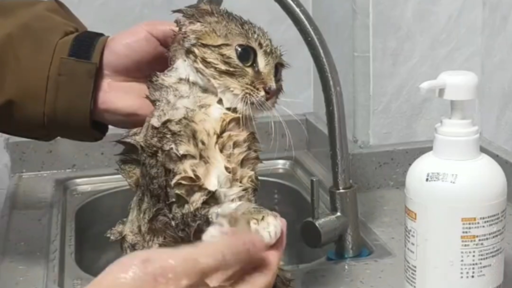 | 1.2万 | 2026-02-03 |
| [【哈基米音乐】不死基ごっこ](https://www.bilibili.com/video/BV1QGFjzEE9Y) |  | 9.3万 | 2026-02-03 |
| [🐱](https://www.bilibili.com/video/BV15TFjzXETD) |  | 16.4万 | 2026-02-03 |
| [哈基米百态大合集](https://www.bilibili.com/video/BV1qFFjzxEp6) | 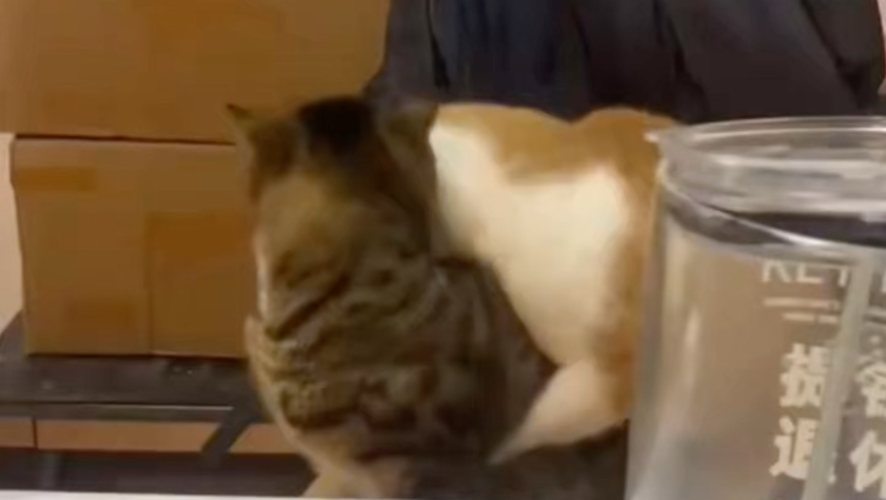 | 5040 | 2026-02-03 |
| [哈基米与你倾情出演为《孤雏》取暖！cover李佳薇，唱一曲孤雏拥抱孤单的你~](https://www.bilibili.com/video/BV1coFLzhEbK) | 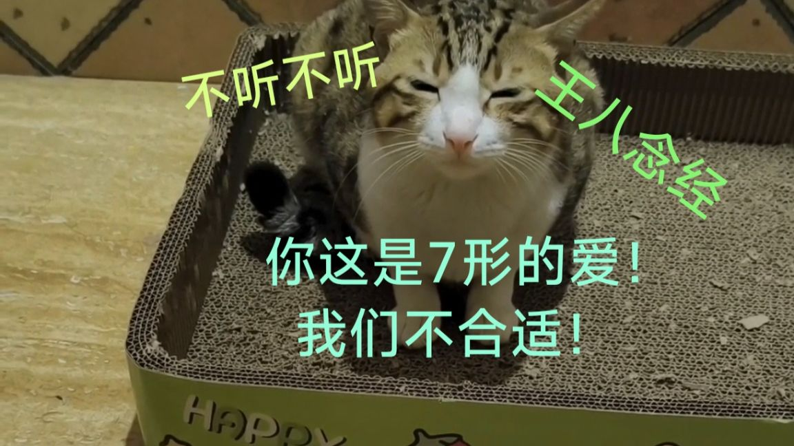 | 7911 | 2026-02-03 |
| [我家的哈基米](https://www.bilibili.com/video/BV1ybFjzBEiq) |  | 74 | 2026-02-03 |
| [谢谢大家夸我的肤色好看！](https://www.bilibili.com/video/BV12xFjzzEbr) |  | 205.6万 | 2026-02-03 |
| [谁家好人飞日本来就为吃半价便当啊](https://www.bilibili.com/video/BV1DLFjzjEGu) |  | 6.3万 | 2026-02-03 |
| [哈基米 阴暗曼DarkSide一次听够](https://www.bilibili.com/video/BV18HFjzVEFb) | 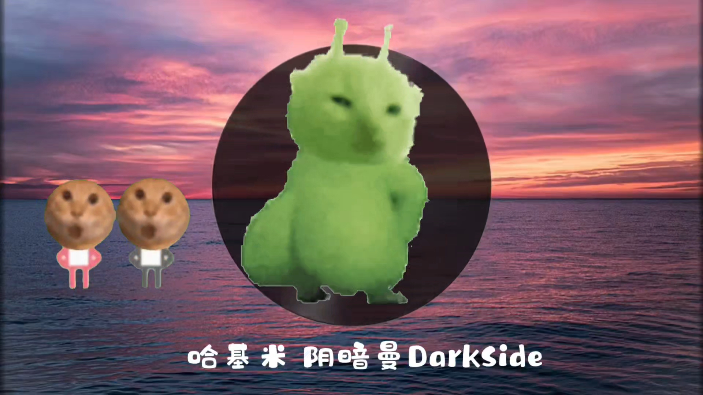 | 5465 | 2026-02-03 |
| [居家祝福仅需30，快至半小时出货！#哈基米 #神马教 #带派](https://www.bilibili.com/video/BV1THFjzVEDw) |  | 3264 | 2026-02-03 |
| [历史最强 vs 现代最强](https://www.bilibili.com/video/BV1MLF5zzE2h) |  | 37.1万 | 2026-02-03 |
| [嘴上说着讨厌学校，实际在学校的我：](https://www.bilibili.com/video/BV1PWFGzxEaY) |  | 169.3万 | 2026-02-03 |
| [【哈基米音乐】💥基米💣爆破2🧨(高楼爆破主界面bgm)](https://www.bilibili.com/video/BV1HAFuzGEV6) |  | 1941 | 2026-02-03 |
| [哈基米！](https://www.bilibili.com/video/BV1ynFGz4Egn) |  | 1269 | 2026-02-03 |
| [哈基米在说什么呢](https://www.bilibili.com/video/BV1k4FGzpEew) | 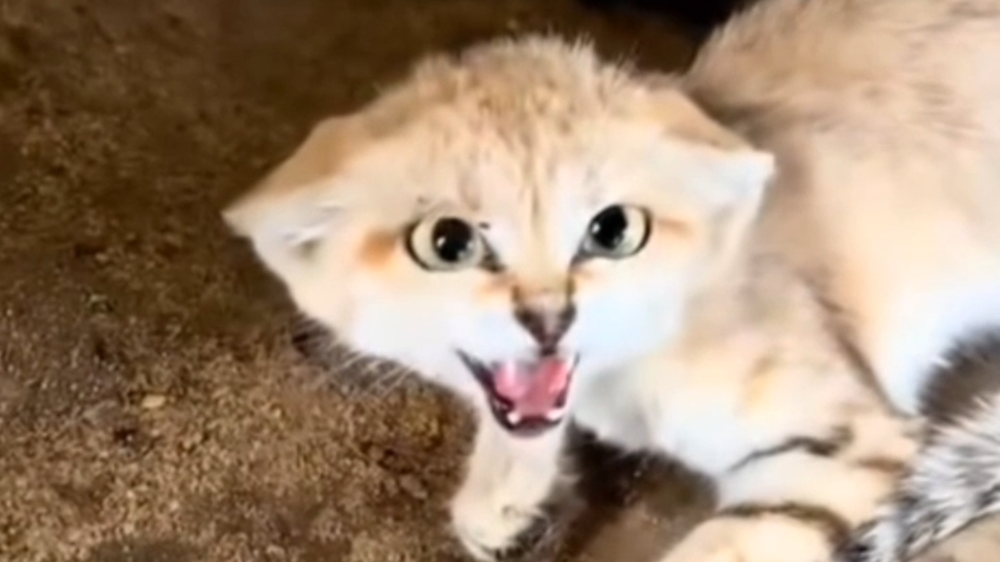 | 3410 | 2026-02-03 |
| [【应激对比视频#1】哈基米 VS 哈基汪](https://www.bilibili.com/video/BV18QFGzKEKu) | 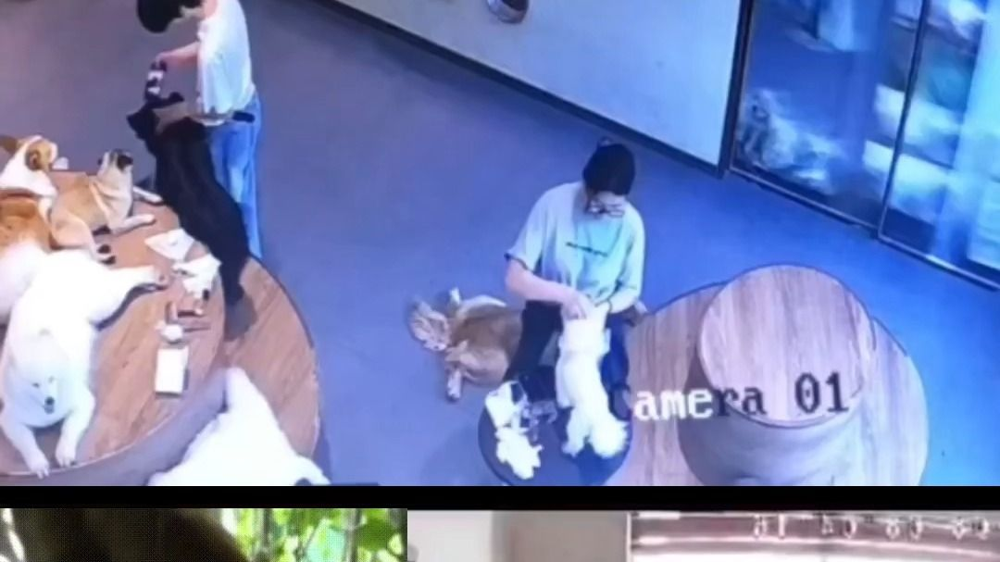 | 4.1万 | 2026-02-03 |
| [哈基米的猎杀时刻结束了，接下来到我了](https://www.bilibili.com/video/BV1nFFTziEiV) | 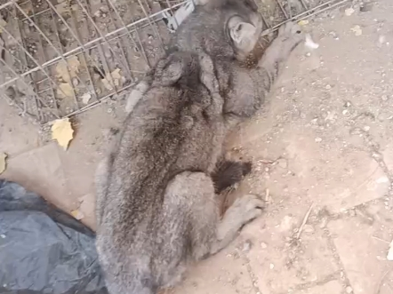 | 7116 | 2026-02-02 |
| [TikTok上老外看国内博主放哈基米之歌喵咪的反应有36万点赞](https://www.bilibili.com/video/BV1AvFTzkETc) | 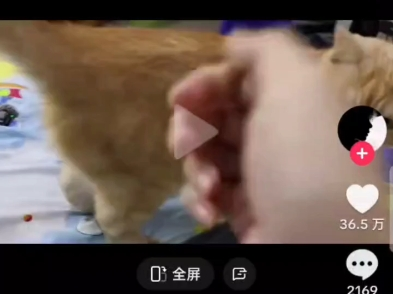 | 4945 | 2026-02-02 |
| [小猫不知道，为什么人总是天黑才回家，看到人开始睡觉，自己也舔舔毛钻到人的被窝里睡睡，要不然天一亮，人又跑了](https://www.bilibili.com/video/BV1v9FTz8EiS) |  | 8.5万 | 2026-02-02 |
| [基米那个忍耐啊](https://www.bilibili.com/video/BV1JrFTzBE3C) | 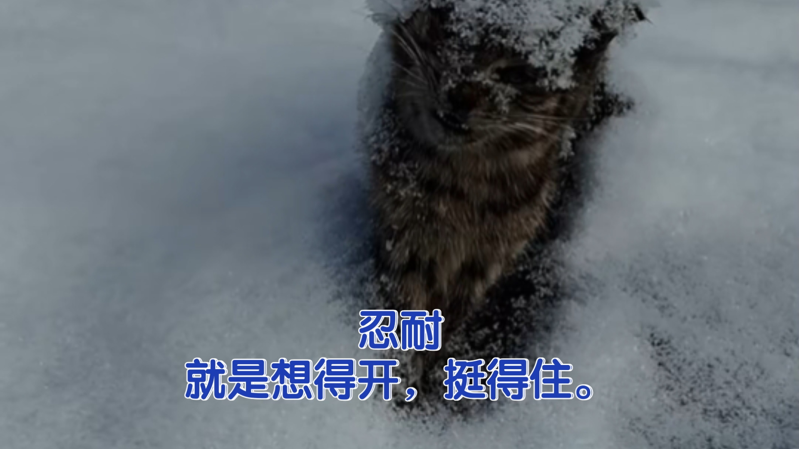 | 6268 | 2026-02-02 |
| [猫言鸟语速成班🐱➡️🐦从“哈基米”到“蒜鸟”，我鸟都不鸟！🌀【展麟Finn&amp;季琊Jyar&amp;九条命Meyou&amp;朔希Sasi&amp;刹那Felix】](https://www.bilibili.com/video/BV1heFPz1Ey2) |  | 2518 | 2026-02-02 |
| [“上岛爱好者”马斯克和“吃孩子”照片是咋回事？](https://www.bilibili.com/video/BV1UdFAzrE1Z) |  | 263.0万 | 2026-02-02 |
| [哈基米~](https://www.bilibili.com/video/BV1d6FAzQEq4) | 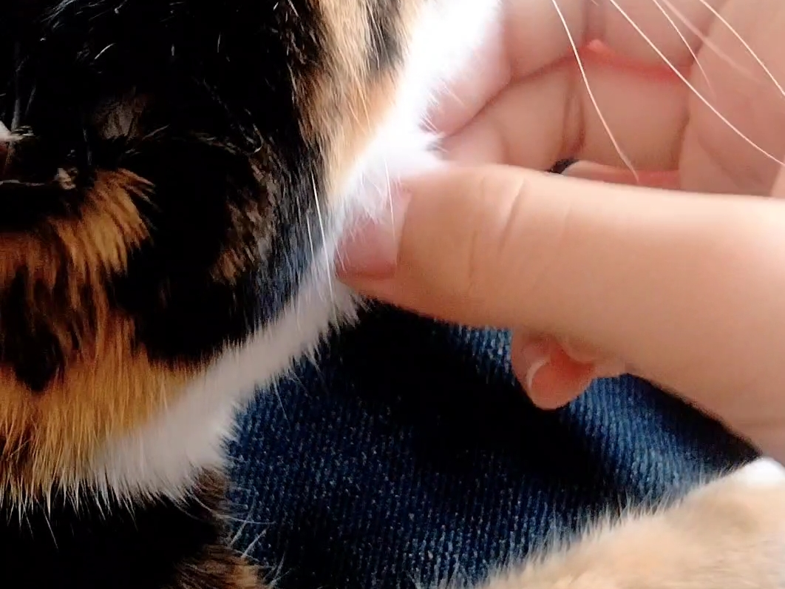 | 102 | 2026-02-02 |
| [2.1 牢A：爱泼斯坦案小高达肠子里的粪便，被掏出来吃掉，还有小高达做成的红皮鞋！](https://www.bilibili.com/video/BV1z26hBXEFx) |  | 24.9万 | 2026-02-02 |
| [《对不起 是我太大声了》](https://www.bilibili.com/video/BV1cw6hB9E2t) |  | 250.8万 | 2026-02-02 |
| [伯虎说-哈基米版](https://www.bilibili.com/video/BV1cZ6tBUEuv) |  | 141 | 2026-02-01 |
| [悬疑哈基米（炸房专用）](https://www.bilibili.com/video/BV1g96sBREpT) |  | 133 | 2026-02-01 |
| [喝了马上学会哈气O(∩_∩)O](https://www.bilibili.com/video/BV14F6xBSEMo) |  | 1711 | 2026-02-01 |
| [哈吉米音乐合集](https://www.bilibili.com/video/BV1oC6sBhEnM) | 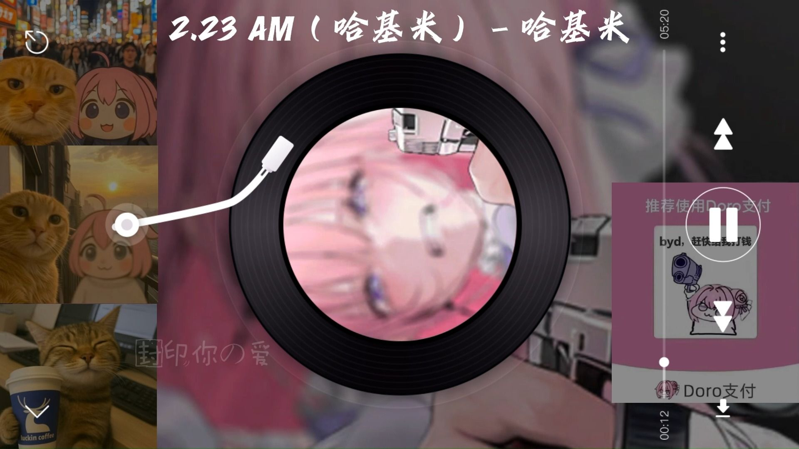 | 869 | 2026-02-01 |
| [真的回不去了吗](https://www.bilibili.com/video/BV1Tr6xBQEJP) |  | 48.0万 | 2026-02-01 |
| [🐦 疯 狂 的 女 仆🐦](https://www.bilibili.com/video/BV16vzXB2E2L) | 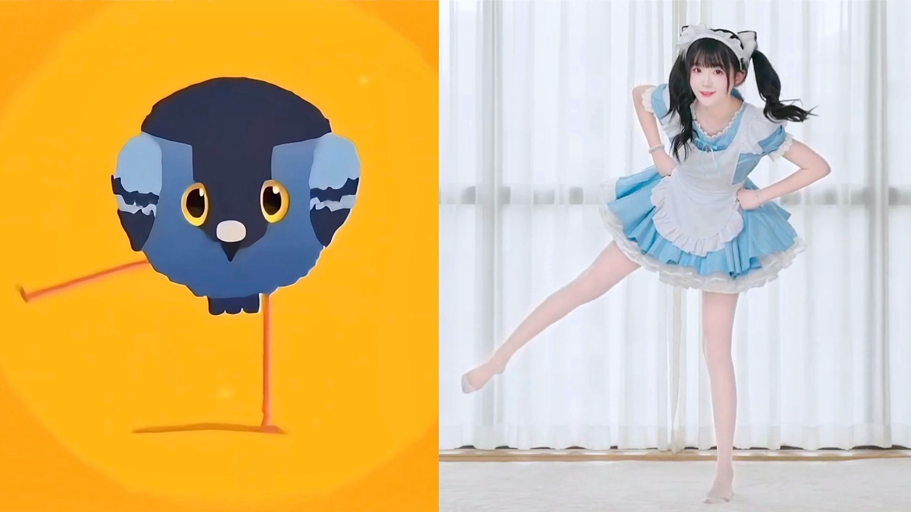 | 322.3万 | 2026-02-01 |
| [《邪恶老奶》](https://www.bilibili.com/video/BV1HT6WBTEEk) |  | 886.1万 | 2026-02-01 |
| [哈基米炸毛](https://www.bilibili.com/video/BV1vk6pBWEBy) | 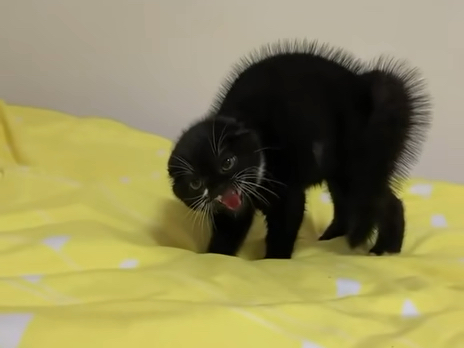 | 2313 | 2026-02-01 |
| [循环歌单｜【精卫】｜“【无缝衔接の小曲】”](https://www.bilibili.com/video/BV14F62B3ECt) |  | 551.1万 | 2026-02-01 |
| [乘着阳光盛大逃亡](https://www.bilibili.com/video/BV1kC6yBAEZL) |  | 312.9万 | 2026-01-31 |
| [基米基米基米基米](https://www.bilibili.com/video/BV16g62BYEwE) |  | 170 | 2026-01-31 |
| [用真棒的语气说纸巾](https://www.bilibili.com/video/BV1CC6yBAEVC) | 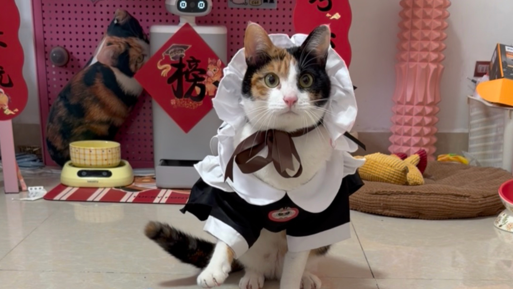 | 353.2万 | 2026-01-31 |
| [原来哈基米的这个bgm是耀西岛的](https://www.bilibili.com/video/BV1py6yBaEo2) |  | 6227 | 2026-01-31 |
| [哈基米喔南北绿豆](https://www.bilibili.com/video/BV1ts66BfEGB) | 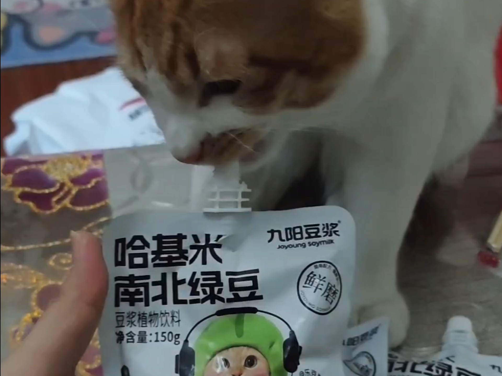 | 852 | 2026-01-30 |
| [拼了一个小曼波](https://www.bilibili.com/video/BV15U6iBoEct) |  | 80.6万 | 2026-01-30 |
| [《晴天》](https://www.bilibili.com/video/BV1xy6qBJESW) |  | 311.8万 | 2026-01-30 |
| [猫咪小镇的威尼斯水城建好啦](https://www.bilibili.com/video/BV1FMzfB8E1F) |  | 817.1万 | 2026-01-30 |
| [舍友早起，但是不关闹钟](https://www.bilibili.com/video/BV1RczDBwELk) | 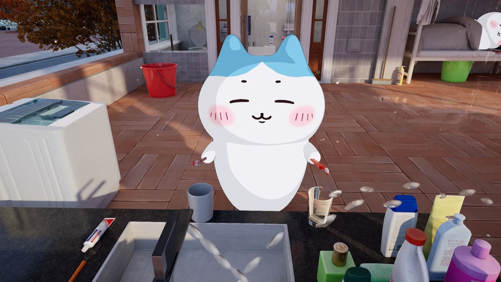 | 76.3万 | 2026-01-30 |
| [伞蜥经常会跳出来吓人一跳，但它其实就是个虚张声势的小趴菜](https://www.bilibili.com/video/BV1Yp6vB9EzD) | 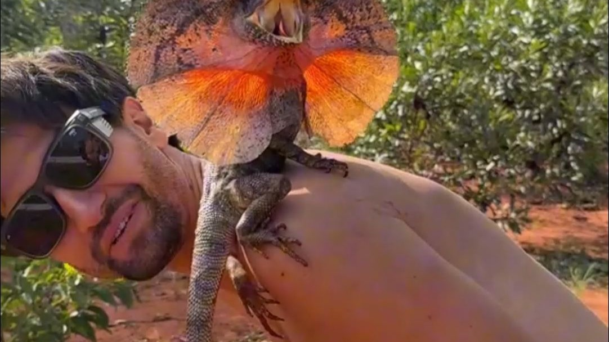 | 798.0万 | 2026-01-30 |
| [“给我擦皮鞋”“我要验牌”法国赌神-皮亚.卡松](https://www.bilibili.com/video/BV1Nu6jBXEPm) |  | 66.6万 | 2026-01-28 |
| [✨《精卫DJ》&quot;万物终归向海，何必衔木石来&quot;✨/AI東 雪蓮](https://www.bilibili.com/video/BV1S66jBhEik) |  | 208.6万 | 2026-01-28 |
| [哈基米的日常](https://www.bilibili.com/video/BV1BN67B5EfY) | 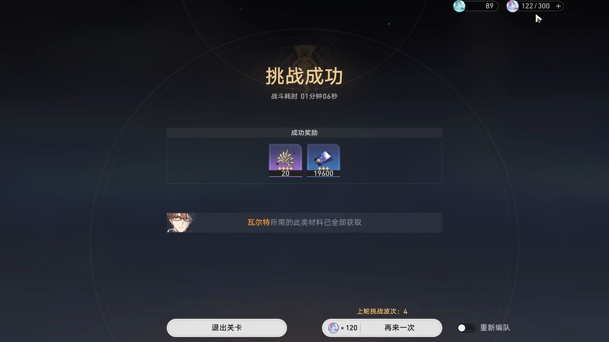 | 7 | 2026-01-28 |
| [《原神》兹白角色PV——「亦如陌上尘」](https://www.bilibili.com/video/BV1Cy6gBeEFA) |  | 301.1万 | 2026-01-28 |
| [布鲁斯锁喉哈基米](https://www.bilibili.com/video/BV11o6uBiEU7) | 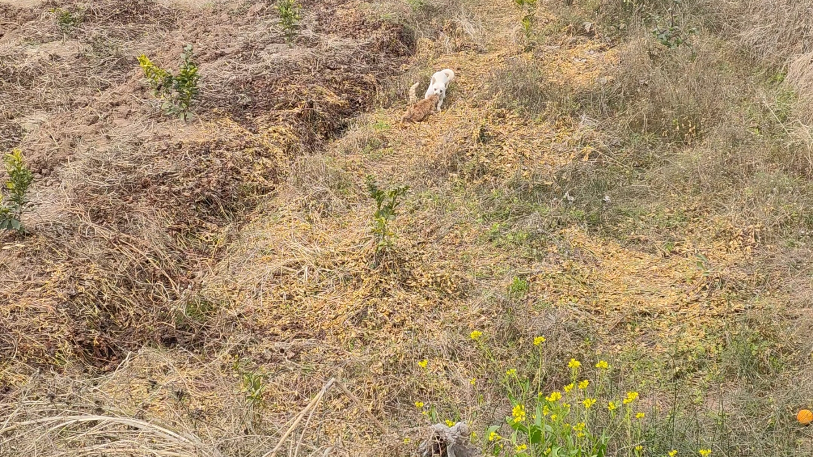 | 410 | 2026-01-27 |
| [🍬21世纪最伟大的片头🍬](https://www.bilibili.com/video/BV1jo6gBxEM3) |  | 58.9万 | 2026-01-27 |
| [《找茬都说不出这种话》](https://www.bilibili.com/video/BV1WrzBBjE7n) |  | 790.0万 | 2026-01-27 |
| [人民的艺术家.5.0](https://www.bilibili.com/video/BV14izBBSEzm) |  | 95.1万 | 2026-01-26 |
| [“妈妈...我不堵桥了...求你回来吧”—乌鲁鲁《死一样的堵过》](https://www.bilibili.com/video/BV1rezaBoEfj) |  | 141.5万 | 2026-01-26 |
| [奥特曼丹尼尔低音炮合集 爽听！](https://www.bilibili.com/video/BV1REz4BaEae) |  | 30.6万 | 2026-01-25 |
| [傻了吧唧觅食中加长版](https://www.bilibili.com/video/BV1KazmB5EZM) |  | 41.0万 | 2026-01-25 |
| [《 神 人 视 频 》](https://www.bilibili.com/video/BV1HYzTBHEJr) |  | 108.1万 | 2026-01-23 |
| [ピノキオピー - 不死身ごっこ feat. 初音ミク](https://www.bilibili.com/video/BV17NrWBaE87) |  | 244.3万 | 2026-01-23 |
| [诗歌剧节奏大挑战](https://www.bilibili.com/video/BV17QzPBrEYK) |  | 44.9万 | 2026-01-23 |
| [请给我208,770元 [明日方舟终末地 meme Can You Send Me 30K?]](https://www.bilibili.com/video/BV1k6zsBzE8q) |  | 177.0万 | 2026-01-22 |
| [旅行者，你怎么不理我啊？](https://www.bilibili.com/video/BV1jRrUBNErv) |  | 209.2万 | 2026-01-17 |
| [⚡我 自 己 剪 的 时 候 也 没 绷 住！⚡](https://www.bilibili.com/video/BV13DrkBCEtQ) |  | 197.6万 | 2026-01-17 |
| [川普不可以](https://www.bilibili.com/video/BV1XtrrBzETX) |  | 200.6万 | 2026-01-16 |
| [急急那如律令 妈妈妈妈妈妈](https://www.bilibili.com/video/BV12pkNBcEYu) |  | 196.8万 | 2026-01-16 |
| [笑 容 消 失 术](https://www.bilibili.com/video/BV1xtrWB2EAi) |  | 535.2万 | 2026-01-14 |
| [【二战/历史向手书/CH】 轴心vs同盟 （My songs know what you did in the dark）](https://www.bilibili.com/video/BV1TdrKBeExE) |  | 313.5万 | 2026-01-09 |
| [⚡️⚡️混 蛋 擎 天 柱⚡️⚡️](https://www.bilibili.com/video/BV1LzrKBLErv) |  | 927.0万 | 2026-01-09 |
| [蕾塞：因为怕痛所以全点闪避了](https://www.bilibili.com/video/BV1tuiUBMENq) |  | 399.3万 | 2026-01-08 |
| [西部快哈手](https://www.bilibili.com/video/BV1APiQBuECC) | 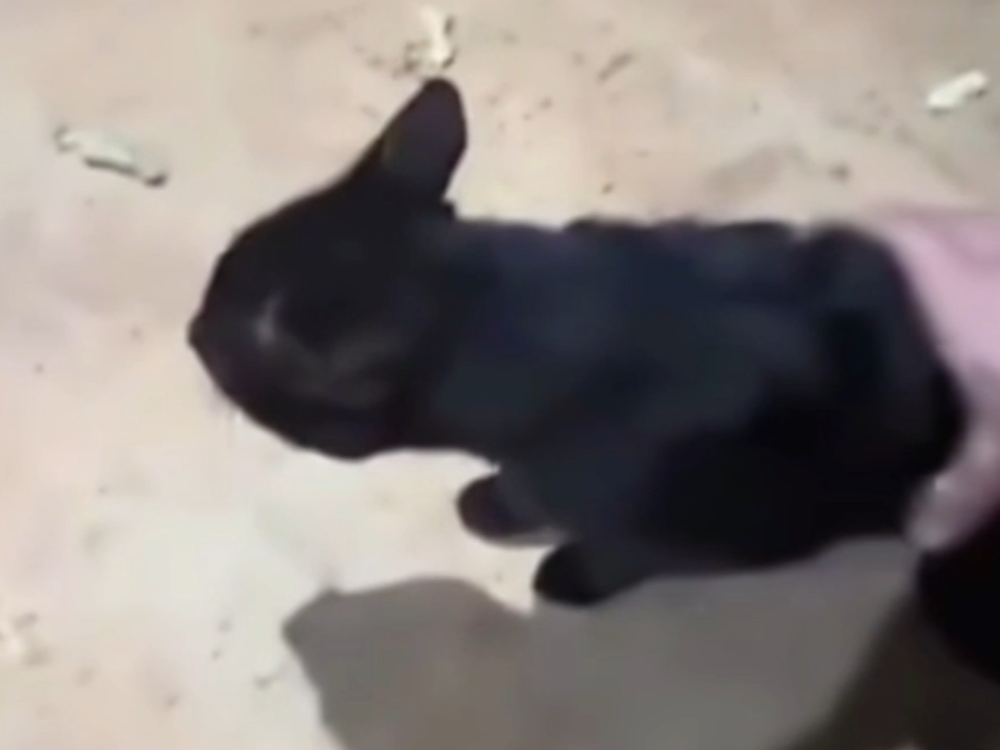 | 7.1万 | 2026-01-08 |
| [哈基米是要哈气的](https://www.bilibili.com/video/BV1GMaAz4EnW) |  | 111.0万 | 2025-09-02 |
| [晚安哈基米](https://www.bilibili.com/video/BV1HmgCziEkg) |  | 97.2万 | 2025-06-30 |
| [[神人翻唱]🐱世上最小的哈基米🐱](https://www.bilibili.com/video/BV1BpEdzSE2Q) |  | 18.9万 | 2025-05-20 |
| [圆头耄耋 哈基米向日葵](https://www.bilibili.com/video/BV1XCEtzaE75) | 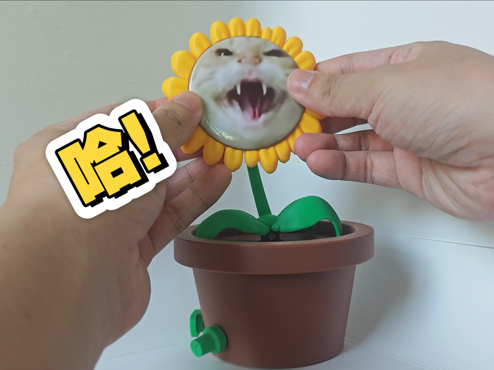 | 39.1万 | 2025-05-16 |
| [耋中谍7：致命哈气](https://www.bilibili.com/video/BV1sW5tzrECH) |  | 29.6万 | 2025-04-19 |
| [小猫突然抽搐](https://www.bilibili.com/video/BV1bSqAYoErc) | 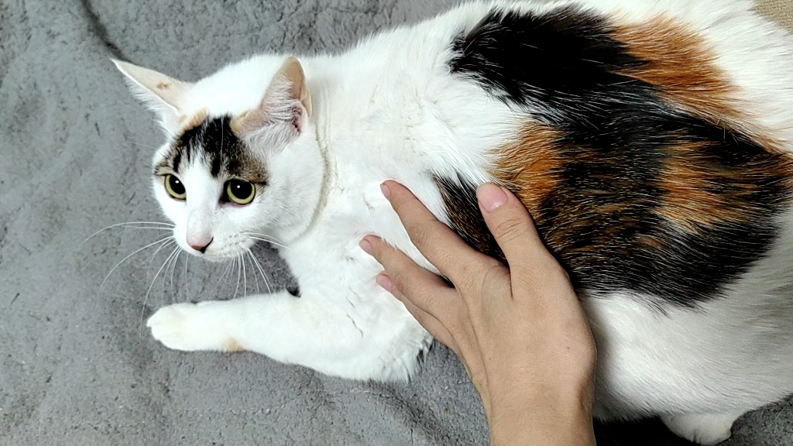 | 108.7万 | 2024-12-09 |
| [好哈基米合集](https://www.bilibili.com/video/BV1j6DYYpEYw) | 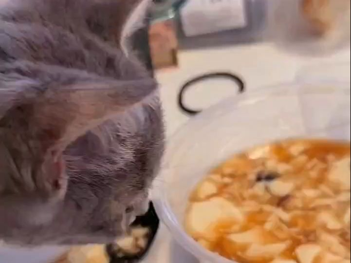 | 47.5万 | 2024-11-08 |
| [经典街舞哈基米](https://www.bilibili.com/video/BV1hTDHYjEZF) | 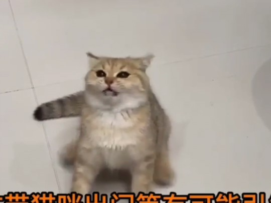 | 50.3万 | 2024-11-04 |
| [楼上的下来搞核酸~](https://www.bilibili.com/video/BV1BDa2eTEzS) |  | 59.7万 | 2024-08-07 |
| [哈基米～](https://www.bilibili.com/video/BV1B24y1a7an) |  | 18.9万 | 2023-01-12 |

---
*最后更新: 2026-02-05 03:10:07 (自动生成)*
*数据来源: [Bilibili](https://www.bilibili.com)*

## 使用说明

运行以下命令更新视频列表:
```bash
python3 fetch_hajimi_videos.py
```
