# awesome-hajimi
collections of hajimi (哈基米 in Chinese) on the Internet.

## 视频列表 (Video List)

| 视频标题 (Title) | 封面 | 播放量 (Views) | 发布日期 (Date) |
|---|---|---|---|
| [哈基米起床](https://www.bilibili.com/video/BV1m4nUzDEZk) |  | 1.5万 | 2025-10-01 |
| [【哈基米音乐】🐱辞基米回忆🐱（DJ）](https://www.bilibili.com/video/BV15snnzJEmQ) |  | 154 | 2025-10-01 |
| [【哈基米】心墙](https://www.bilibili.com/video/BV1omnqzqEat) |  | 494 | 2025-10-01 |
| [無職轉生第二季op：sprial哈基米版](https://www.bilibili.com/video/BV1aUnkzGEhJ) | 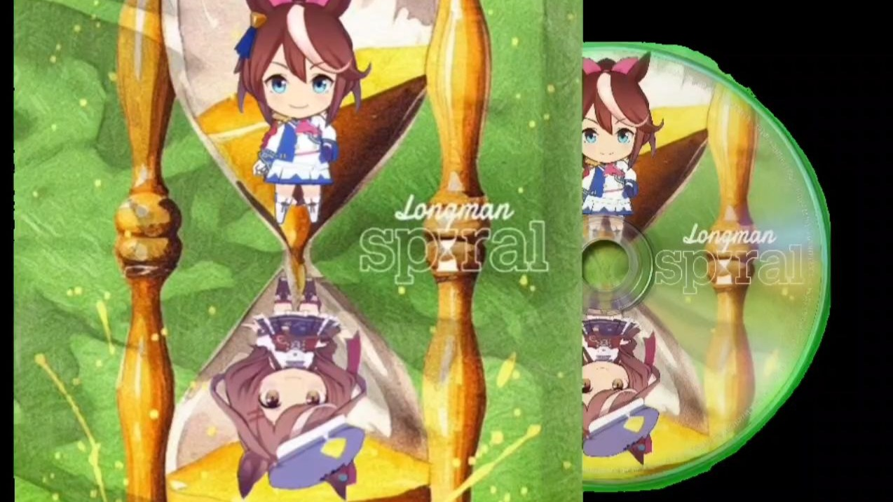 | 383 | 2025-10-01 |
| [【哈基米音乐】姑娘我爱你](https://www.bilibili.com/video/BV1urnmzpEB5) | 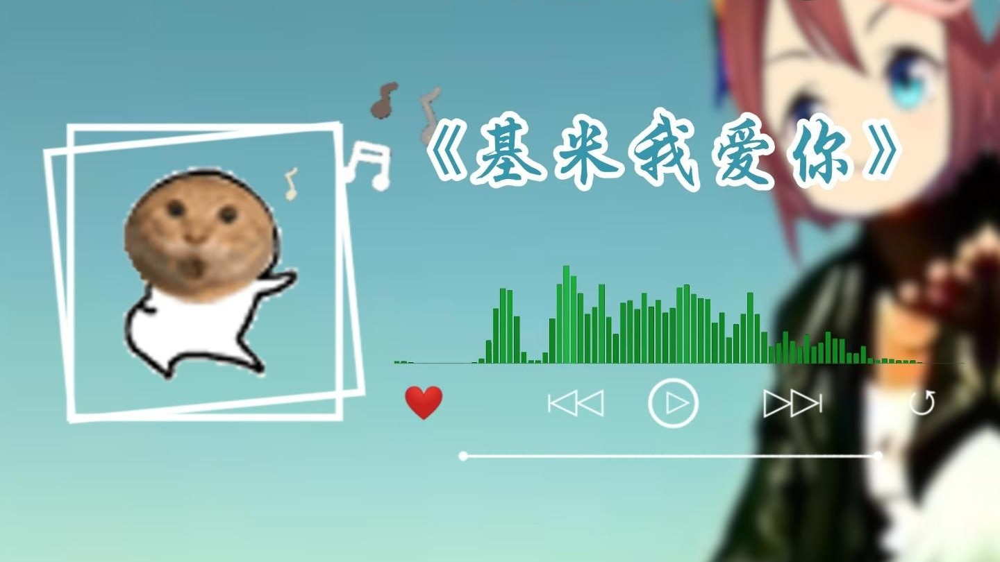 | 4507 | 2025-09-30 |
| [为什么哈基米音乐不去掉叮咚鸡？](https://www.bilibili.com/video/BV14fHjzYEHu) |  | 2500 | 2025-09-30 |
| [Golden Hour（哈基米版）](https://www.bilibili.com/video/BV14KnmzjEdq) |  | 16.5万 | 2025-09-30 |
| [🎵答应不哈你🎵——哈中基](https://www.bilibili.com/video/BV13BnmzsEsa) |  | 325 | 2025-09-30 |
| [🐱【哈基米FM】：宿命的小曲🐱](https://www.bilibili.com/video/BV1arnBzhESh) | 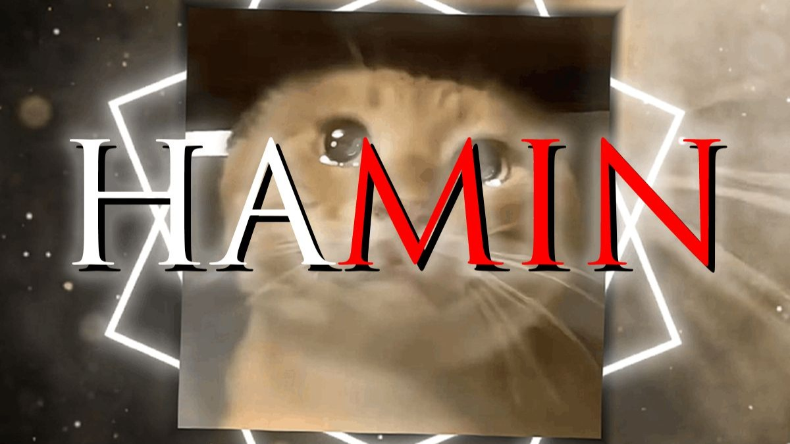 | 10.1万 | 2025-09-30 |
| [《曼波曼波有时哈基米》和平精英枪声音乐](https://www.bilibili.com/video/BV19qnBzPEwv) |  | 324 | 2025-09-30 |
| [🐱爱情好像流哈🐱](https://www.bilibili.com/video/BV1oFnyzXEeD) |  | 4.9万 | 2025-09-30 |
| [拖拉基](https://www.bilibili.com/video/BV1gEn2zJEV6) | 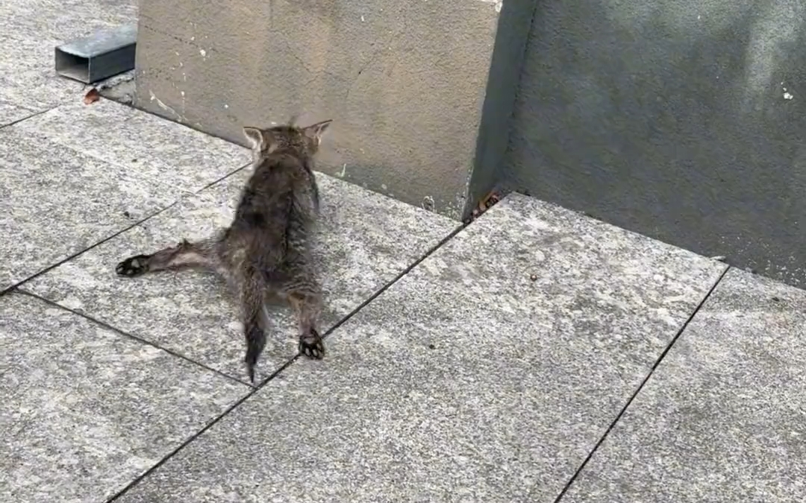 | 3284 | 2025-09-30 |
| [【哈基米音乐】冬基哈](https://www.bilibili.com/video/BV1N6nCzqEyp) |  | 900 | 2025-09-30 |
| [基米之物](https://www.bilibili.com/video/BV15NnyznE3a) |  | 5577 | 2025-09-30 |
| [⚡️绝望的基米⚡️](https://www.bilibili.com/video/BV1NBnzzpE7J) |  | 7730 | 2025-09-30 |
| [哈基Wake](https://www.bilibili.com/video/BV1jGnzzgE22) |  | 25.5万 | 2025-09-30 |
| [【哈基米】⚡叹云基⚡](https://www.bilibili.com/video/BV1Wvnqz2EEU) |  | 3.0万 | 2025-09-29 |
| [斗猫TV之哈基米哈气集锦，一次看个够](https://www.bilibili.com/video/BV1Sgn6z8EVQ) | 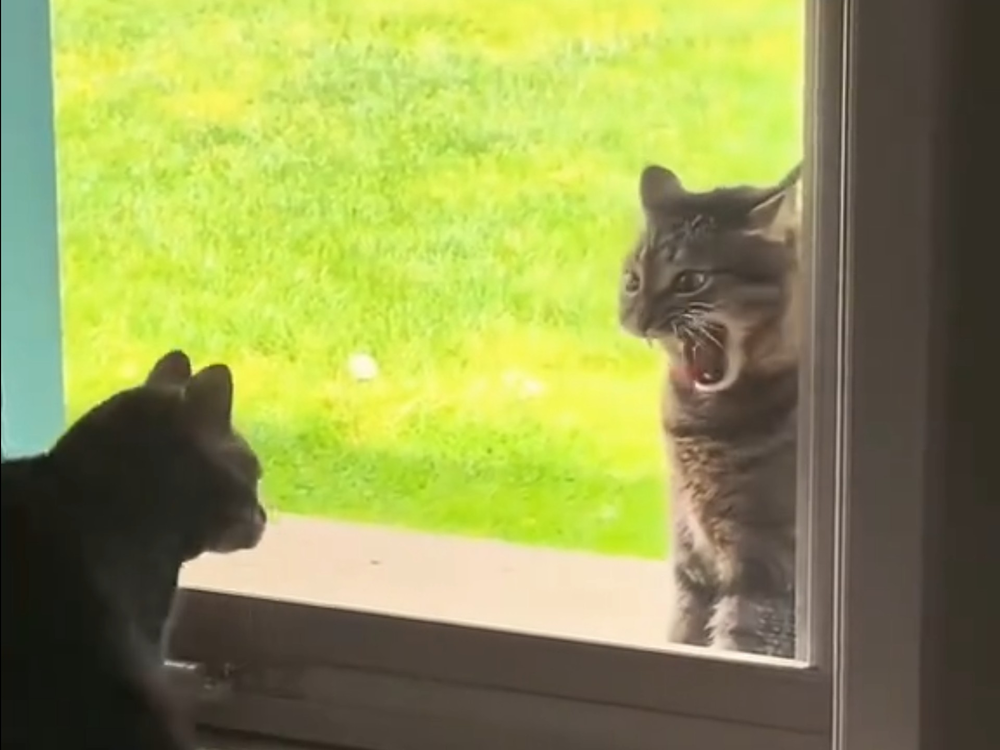 | 383 | 2025-09-29 |
| [哈基米：Perfect Girl（哈基米精神病耄）](https://www.bilibili.com/video/BV1iMnqzNE7n) |  | 1.0万 | 2025-09-29 |
| [双红狼清图就是快，下次还点](https://www.bilibili.com/video/BV19dnqzwEv5) |  | 6151 | 2025-09-29 |
| [你的打火基～](https://www.bilibili.com/video/BV1PhnvzrE5U) |  | 14.2万 | 2025-09-29 |
| [猫儿这个不领情](https://www.bilibili.com/video/BV14NnizEE6m) |  | 2.7万 | 2025-09-29 |
| [你无视规则了人类](https://www.bilibili.com/video/BV1bCnizHEPw) |  | 37.1万 | 2025-09-29 |
| [神人银行卡，办这个的家里请哈基高和哈基仙都没用了](https://www.bilibili.com/video/BV19zHczcEiB) |  | 25.6万 | 2025-09-29 |
| [霸王基米](https://www.bilibili.com/video/BV18tHwztEe4) | 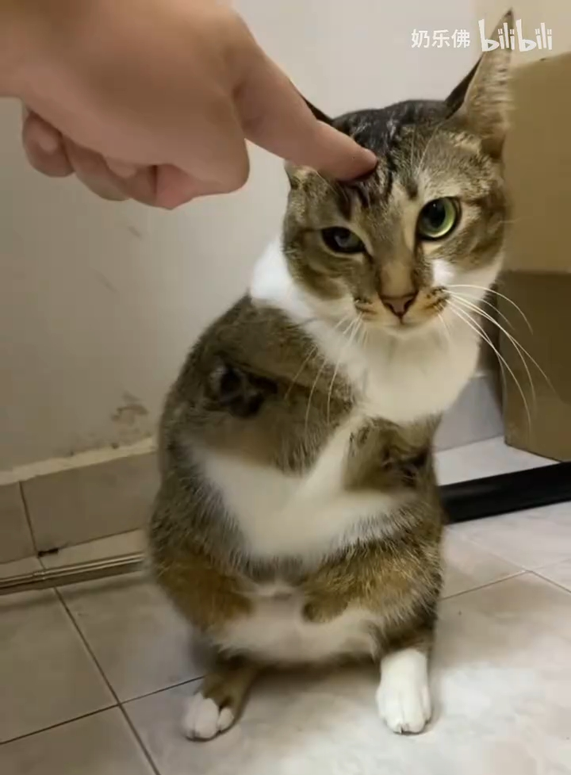 | 5317 | 2025-09-29 |
| [驯服圆头耄耋](https://www.bilibili.com/video/BV1c7nfzBEvT) | 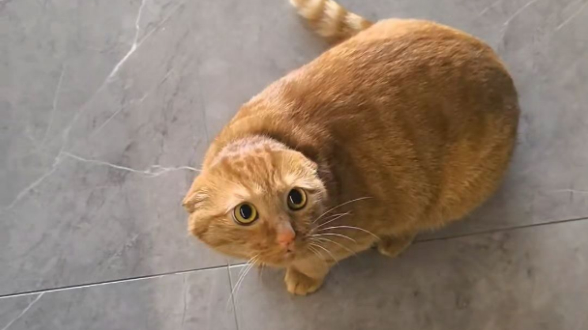 | 13.1万 | 2025-09-28 |
| [“哈哈哈哈哈哈哈基米”](https://www.bilibili.com/video/BV13BnozjEum) | 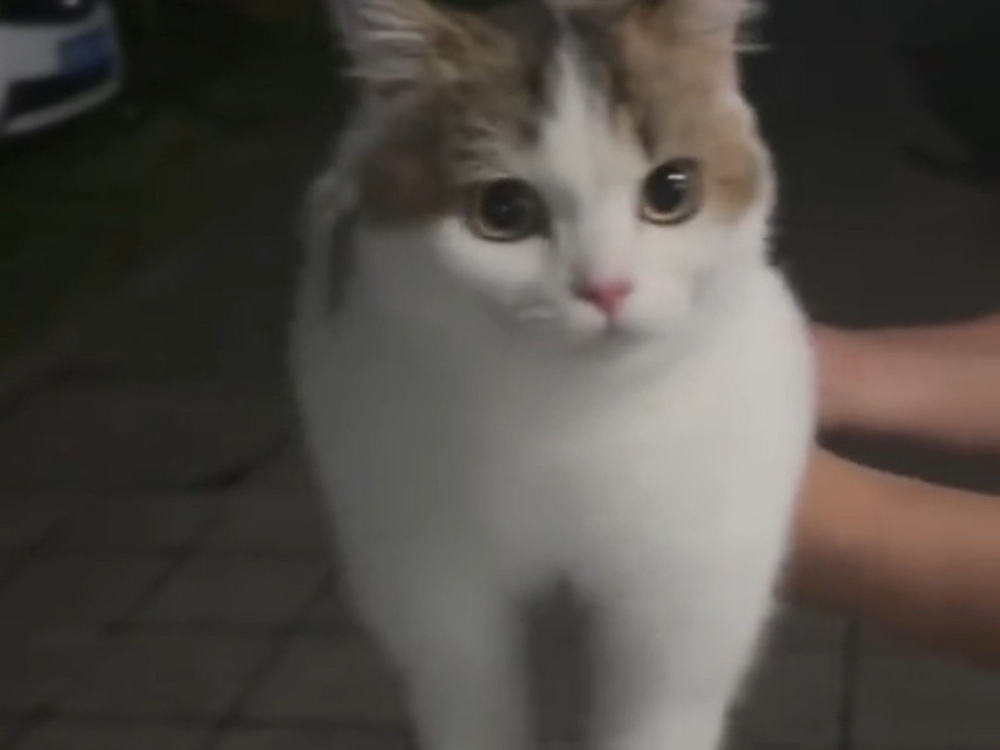 | 13.3万 | 2025-09-28 |
| [《外星小猫の小曲》《哈基米睡觉の小曲》おはなばたけ(花田)](https://www.bilibili.com/video/BV16RnRzdEyH) |  | 3.1万 | 2025-09-28 |
| [麦当劳耄耋这儿傲娇](https://www.bilibili.com/video/BV1P2nRzAEPZ) |  | 4.6万 | 2025-09-28 |
| [活全家音乐享受者😎](https://www.bilibili.com/video/BV1FWnSzCEaX) |  | 4528 | 2025-09-28 |
| [MC最硬核的烤肉模组？从肢解动物到完整烘焙，哈基米面包？阿根廷乐事全流程体验！ 香草纪元 EP27](https://www.bilibili.com/video/BV1X4nXzTEcL) |  | 1.5万 | 2025-09-28 |
| [猫儿这个可怜](https://www.bilibili.com/video/BV18GnJzBETQ) | 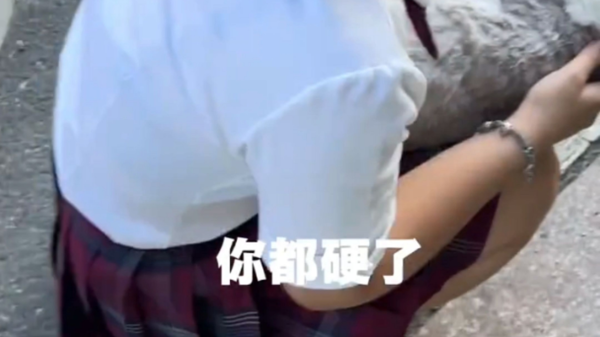 | 1.1万 | 2025-09-27 |
| [耄耋这个吃小猫](https://www.bilibili.com/video/BV1MjnhzvEAf) | 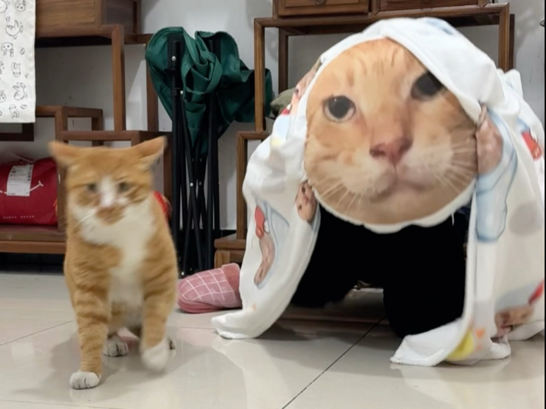 | 34.2万 | 2025-09-25 |
| [曼波外网播放量排行](https://www.bilibili.com/video/BV1uRnhzzEjH) |  | 22.5万 | 2025-09-25 |
| [爱音塔菲唐笑1000小时纯享版](https://www.bilibili.com/video/BV19zWLz5E6U) |  | 8.1万 | 2025-09-25 |
| [哈基米的约定](https://www.bilibili.com/video/BV1oxJDzKEgs) |  | 41.7万 | 2025-09-24 |
| [鸣潮也有自己的oiiαioii旋转哈基米了](https://www.bilibili.com/video/BV1xgJrzxEpE) | 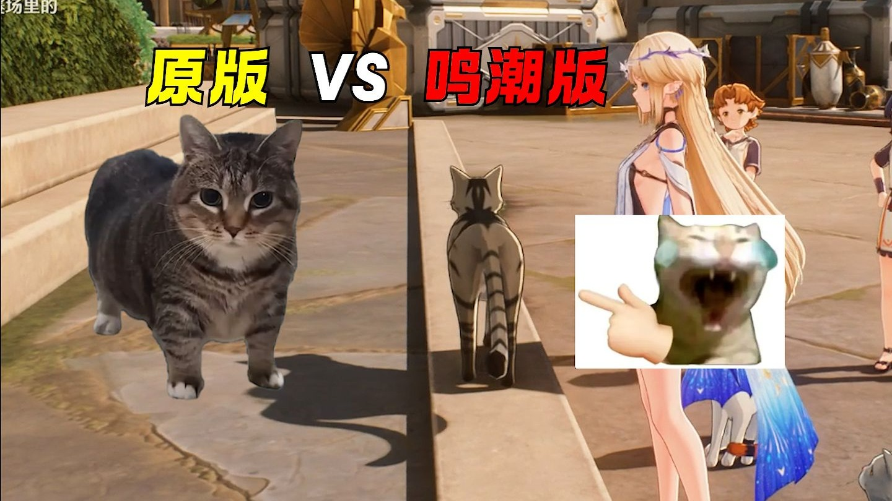 | 2.3万 | 2025-09-23 |
| [【哈基米】耋(Die) For You](https://www.bilibili.com/video/BV1bqnFzSEda) |  | 6.8万 | 2025-09-22 |
| [哈基米偷偷点的护航](https://www.bilibili.com/video/BV1henFzQEsp) |  | 17.6万 | 2025-09-22 |
| [基米这个将死之际](https://www.bilibili.com/video/BV1ccWAzXEik) | 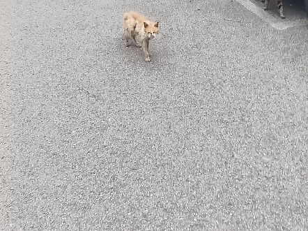 | 4.8万 | 2025-09-21 |
| [猫儿这个小](https://www.bilibili.com/video/BV1urWFzZEFk) | 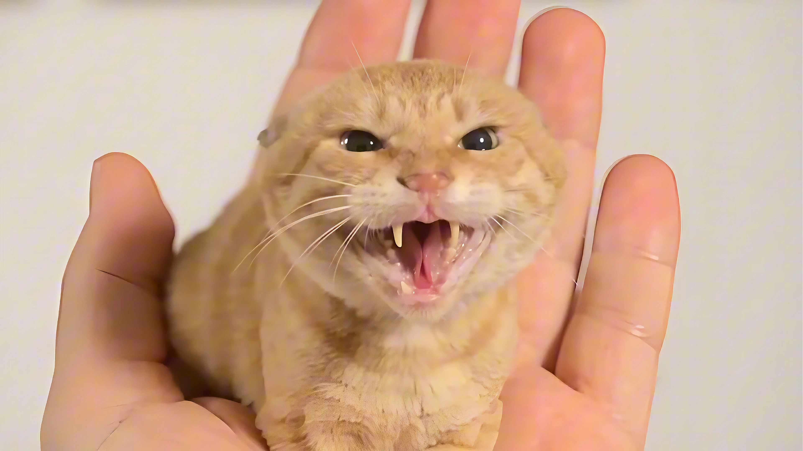 | 315.3万 | 2025-09-21 |
| [🐱【纯净哈基米】B站1.4亿播放量的ba神曲 水梓の小曲 Luminous memory🐱](https://www.bilibili.com/video/BV1V1pRzDEyN) |  | 2.3万 | 2025-09-21 |
| [【爵士哈基米】Fabulous](https://www.bilibili.com/video/BV1RBpXz2EbX) | 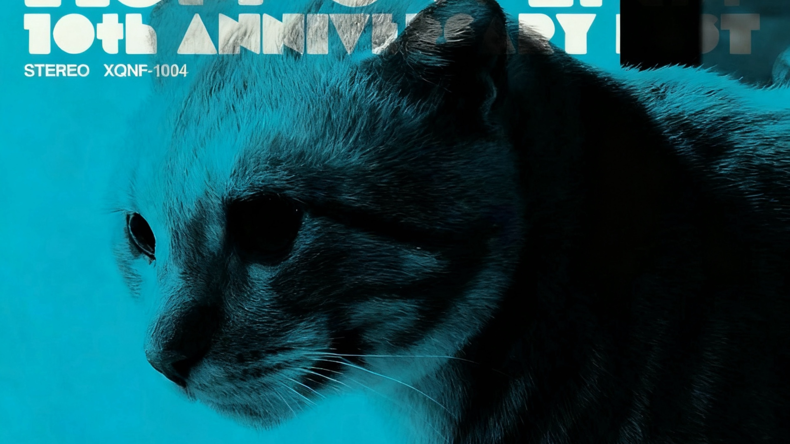 | 8.6万 | 2025-09-20 |
| [曼波的更衣室斗歌大战（已更新后半段）](https://www.bilibili.com/video/BV1Jgp9zRENM) |  | 21.3万 | 2025-09-20 |
| [听猫~](https://www.bilibili.com/video/BV1XrWVzKER2) |  | 90.9万 | 2025-09-19 |
| [又一只猫要活不过明天了](https://www.bilibili.com/video/BV1yRWVzxE6L) | 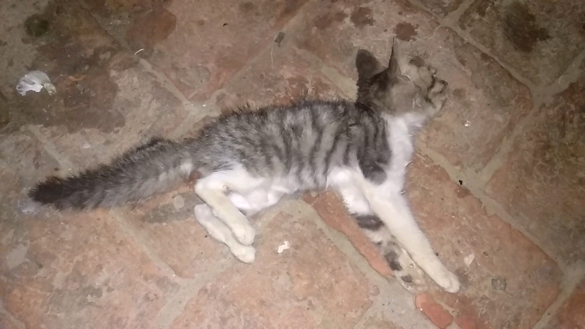 | 1.5万 | 2025-09-19 |
| [善良耄耋cos哈基蚊](https://www.bilibili.com/video/BV1wFWGzLET9) | 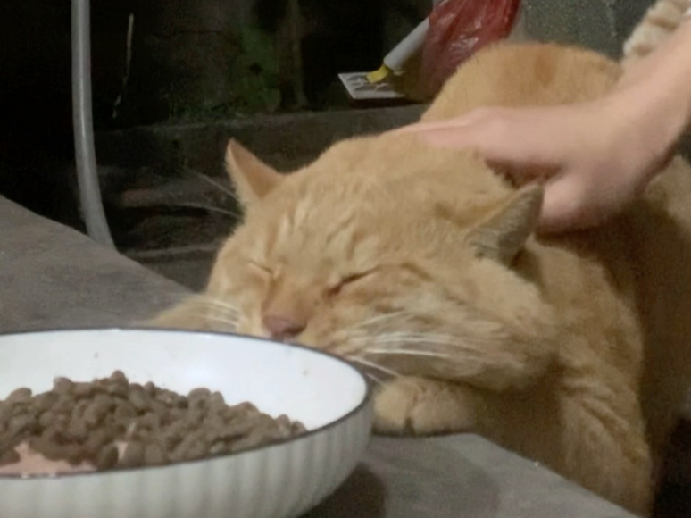 | 43.6万 | 2025-09-19 |
| [啥时候再刷新善良耄耋](https://www.bilibili.com/video/BV1o5WNzDEDN) | 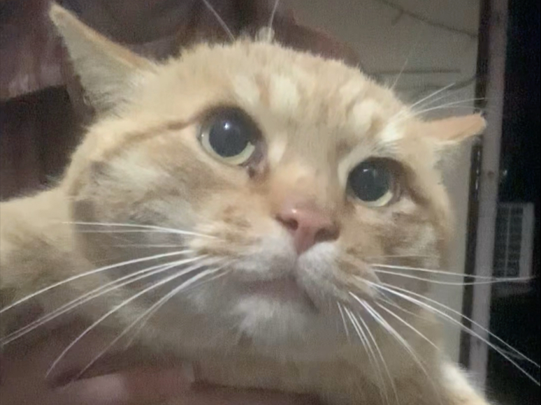 | 64.3万 | 2025-09-18 |
| [私人之歌：基米舞者part1（cogwork dancers）](https://www.bilibili.com/video/BV1fyp4z2Ev4) |  | 20.8万 | 2025-09-17 |
| [循环歌单｜【库里之歌】｜&quot;【投篮の小曲】【打瓦の小曲】【百战鼬の小曲】&quot;](https://www.bilibili.com/video/BV18NpTzkEnk) |  | 142.4万 | 2025-09-16 |
| [又哈了一天](https://www.bilibili.com/video/BV1LUpBzCEHS) | 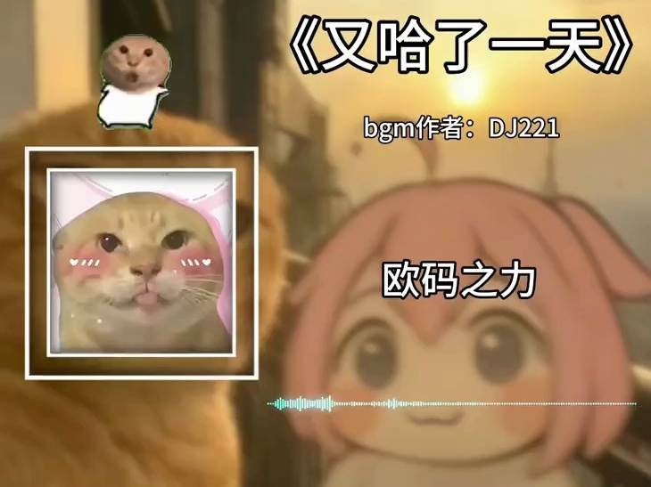 | 394 | 2025-09-15 |
| [哈基米变“猫饼”](https://www.bilibili.com/video/BV1xppwzREZ5) | 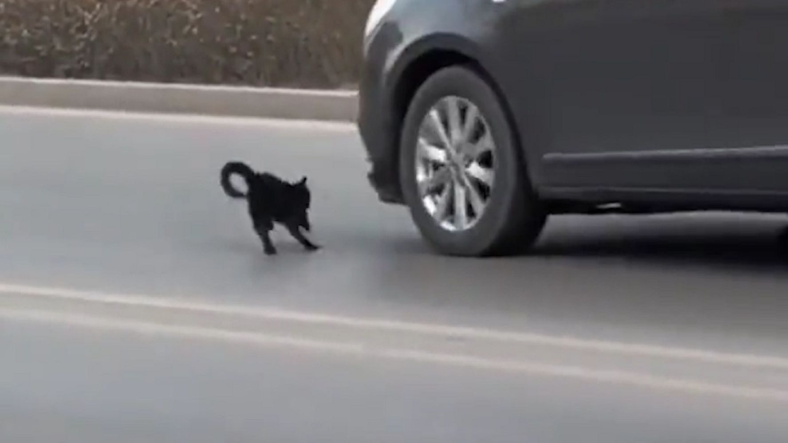 | 6.3万 | 2025-09-14 |
| [[西蒙TV]哈基米哦南北绿豆（本人）](https://www.bilibili.com/video/BV1RcpFzwEii) |  | 23.6万 | 2025-09-14 |
| [【哈基米战歌】Once Upon a Time｜耄之登神长阶](https://www.bilibili.com/video/BV1pQpGz1EPq) |  | 11.1万 | 2025-09-13 |
| [循环歌单｜【おはなばたけ (花田)】｜“自动填词已开启！”](https://www.bilibili.com/video/BV1HUpGzmEyd) |  | 88.2万 | 2025-09-13 |
| [《他们都不看好你 偏偏你最争气》](https://www.bilibili.com/video/BV1DfHrzzED4) |  | 405.3万 | 2025-09-12 |
| [循环歌单｜【猛攻の小曲】｜&quot;威风的龙，善战的狼，哪打的我&quot;｜【曼波你身[Phonk]】](https://www.bilibili.com/video/BV1sJHqzDE3h) | 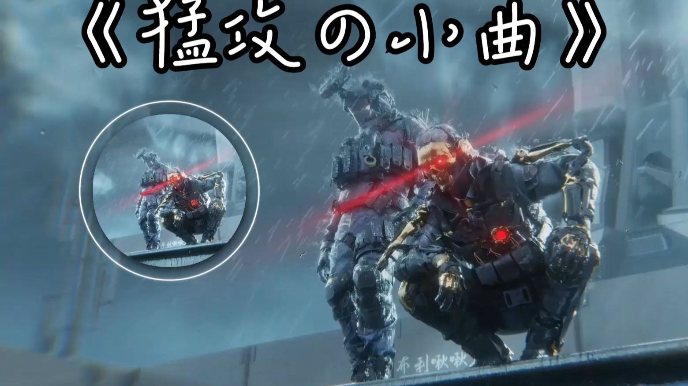 | 95.2万 | 2025-09-12 |
| [往事只能哈基原创文献@枯萎穿心哈基](https://www.bilibili.com/video/BV1qMHezhECQ) |  | 42.3万 | 2025-09-11 |
| [循环歌单｜“哈基米喔南北路多~阿西哈压库纳鲁~”｜【蓝莲哈】-猫猫怕痛惹](https://www.bilibili.com/video/BV1QCYNzPEq9) |  | 6.0万 | 2025-09-10 |
| [🐱哈基山的曼波打不打瓦🐱](https://www.bilibili.com/video/BV1YvHyzXEtv) |  | 71.4万 | 2025-09-09 |
| [⚡昔涟基米说⚡](https://www.bilibili.com/video/BV1vhHyzxEBb) |  | 16.8万 | 2025-09-09 |
| [十年哈气](https://www.bilibili.com/video/BV1nBYVz6Emp) |  | 94.5万 | 2025-09-08 |
| [【爱猫Tv】跳楼基](https://www.bilibili.com/video/BV1TTY5zDE8H) |  | 23.3万 | 2025-09-07 |
| [【全网最速】誓见哈基米（完整版）](https://www.bilibili.com/video/BV1TEY3z1ExR) |  | 8.6万 | 2025-09-07 |
| [大明山歌：诛九族就要胆子大](https://www.bilibili.com/video/BV1KgaYzqE2j) |  | 117.3万 | 2025-09-05 |
| [我要走的路就在脚下，我要哈的气就在口中！](https://www.bilibili.com/video/BV1BhayzQEqR) |  | 55.7万 | 2025-09-03 |
| [很难想象用这么几个词儿创作了几百首歌](https://www.bilibili.com/video/BV13EarzPEKe) |  | 13.3万 | 2025-09-03 |
| [功夫耄耋](https://www.bilibili.com/video/BV1NbaTzbEoA) |  | 22.0万 | 2025-09-02 |
| [【填词系基米】杀死那个哈基人（原曲不使用）](https://www.bilibili.com/video/BV1KthYzwEFj) |  | 3.8万 | 2025-08-30 |
| [有时哈基米](https://www.bilibili.com/video/BV1qKhZzpEx2) | 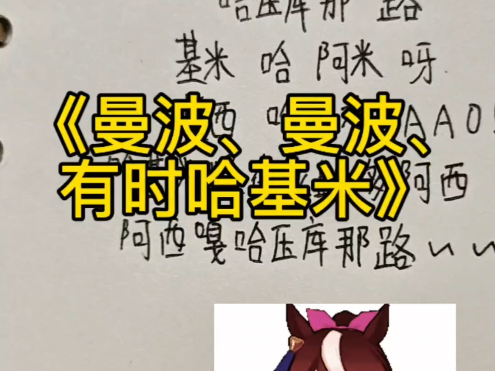 | 19.5万 | 2025-08-29 |
| [哈基米在极限求生](https://www.bilibili.com/video/BV1snhQzUEkL) |  | 24.7万 | 2025-08-29 |
| [猫儿是自由的](https://www.bilibili.com/video/BV1HnhmzAEfE) | 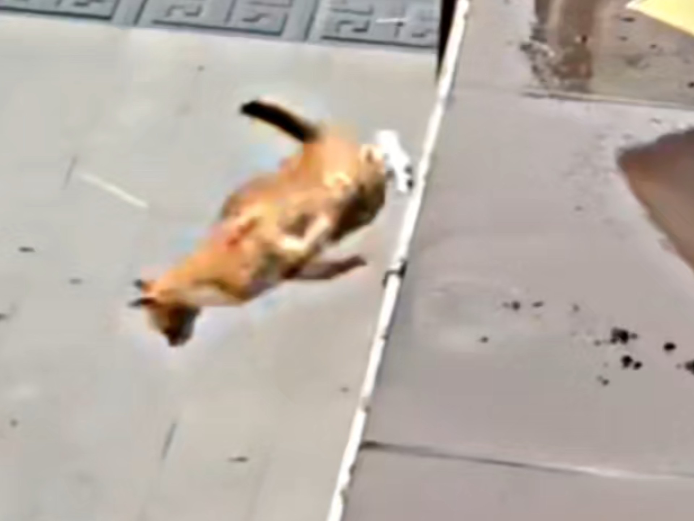 | 11.2万 | 2025-08-28 |
| [怎么一块蓝耋一块红耋啊？](https://www.bilibili.com/video/BV1gxe2zQETk) | 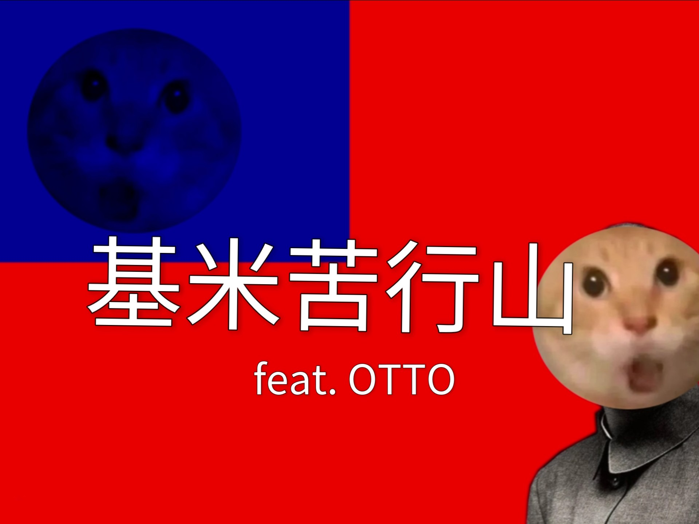 | 29.8万 | 2025-08-27 |
| [大家看看我这号是不是没救了](https://www.bilibili.com/video/BV1jmeyzZEQh) | 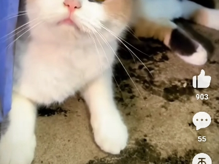 | 1413 | 2025-08-27 |
| [【基卫DJ版】龙相尽显，耄耋来了](https://www.bilibili.com/video/BV1UsvNzPE9w) | 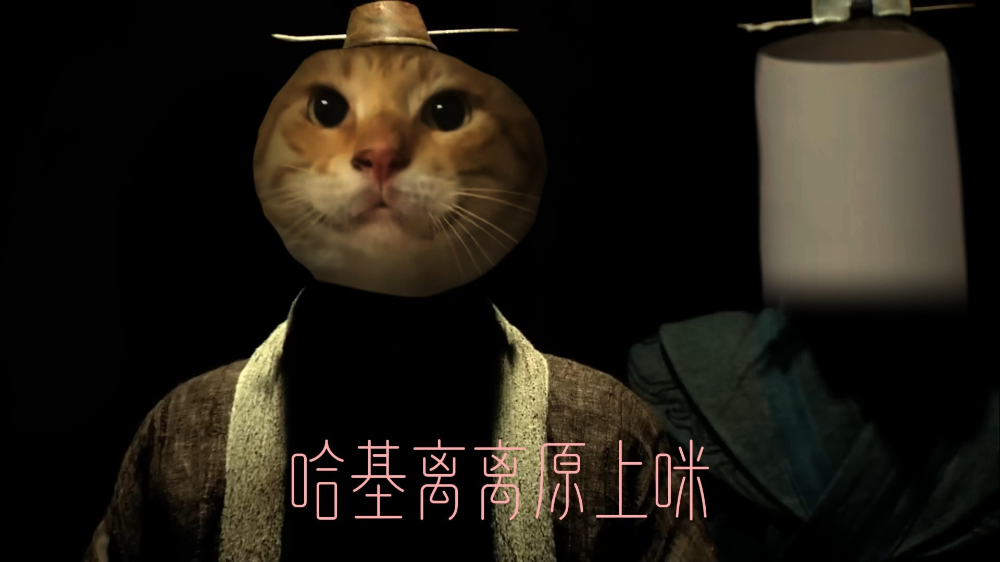 | 16.8万 | 2025-08-26 |
| [出门溜猫被哈基米逃走了](https://www.bilibili.com/video/BV1xZeozzEPy) |  | 46.0万 | 2025-08-26 |
| [🐱请不要带哈基走🐱](https://www.bilibili.com/video/BV1CjeRzfE2B) |  | 25.3万 | 2025-08-25 |
| [可怜的小猫去喵星了，只有帮你保个全尸了#哈基米](https://www.bilibili.com/video/BV1ZBeLz3EVo) | 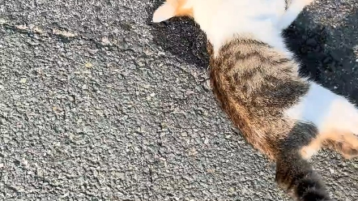 | 1.2万 | 2025-08-24 |
| [哈基咪面对臭猴子哈气也没用，还有个大狗嚼嚼嚼呢](https://www.bilibili.com/video/BV1HVYdzoEyG) | 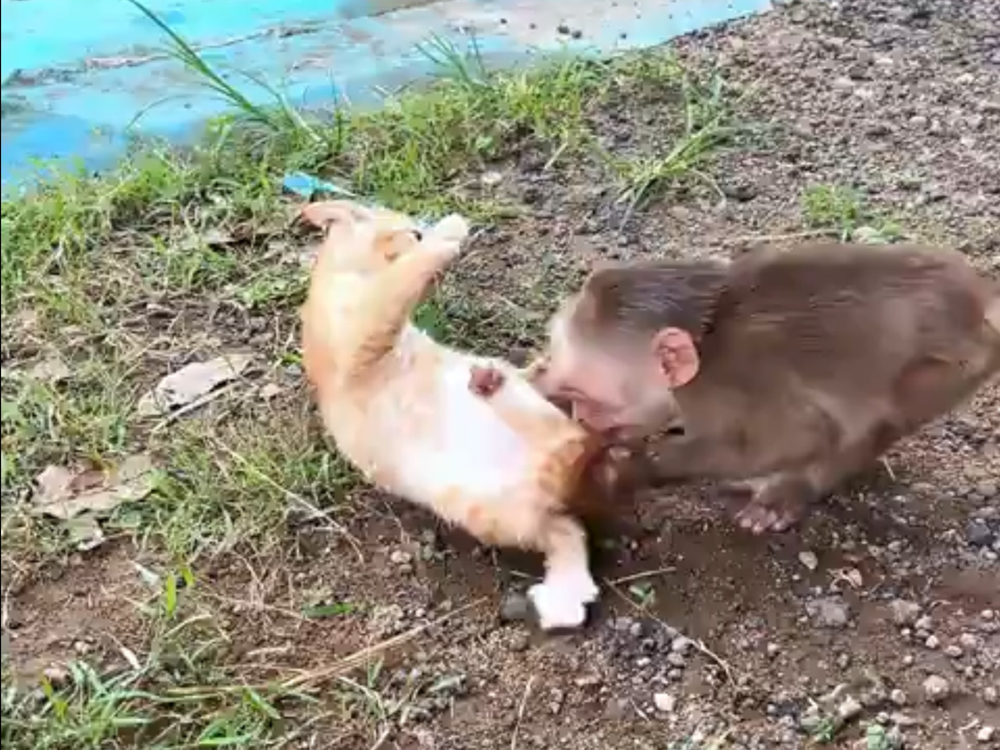 | 3.9万 | 2025-08-21 |
| [猫儿这个家庭暴力](https://www.bilibili.com/video/BV1npbvzxE7j) | 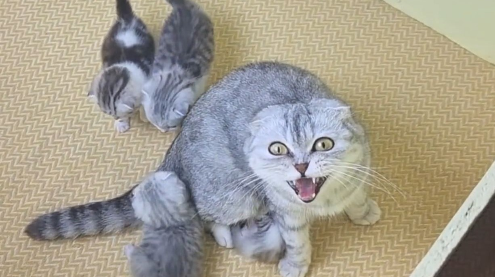 | 9.1万 | 2025-08-14 |
| [【哈基米】《基琶行》](https://www.bilibili.com/video/BV1ZUtqzpEGj) |  | 70.8万 | 2025-08-07 |
| [撒旦一看手机，排名上都没有自己了。#哈基米 #猫咪 #离谱](https://www.bilibili.com/video/BV1aD8ez3EiT) |  | 33.5万 | 2025-07-27 |
| [校园趣逝系列（1-10集）](https://www.bilibili.com/video/BV1brgBzNE2i) |  | 799.1万 | 2025-07-21 |
| [哈基米死在了收养的前一秒](https://www.bilibili.com/video/BV1h6uFztEVS) | 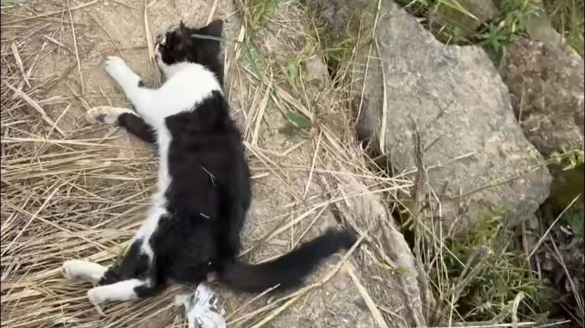 | 20.9万 | 2025-07-13 |
| [哈基米！你哈牛魔啊！](https://www.bilibili.com/video/BV1tf3DzNEhx) |  | 6.3万 | 2025-07-05 |
| [如果你是最强哈基米就跳舞](https://www.bilibili.com/video/BV1iN3FzuEJu) |  | 7.5万 | 2025-06-29 |
| [恐怖慎入，你敢盯着哈基米一分钟吗？](https://www.bilibili.com/video/BV1egK2z9EZ5) | 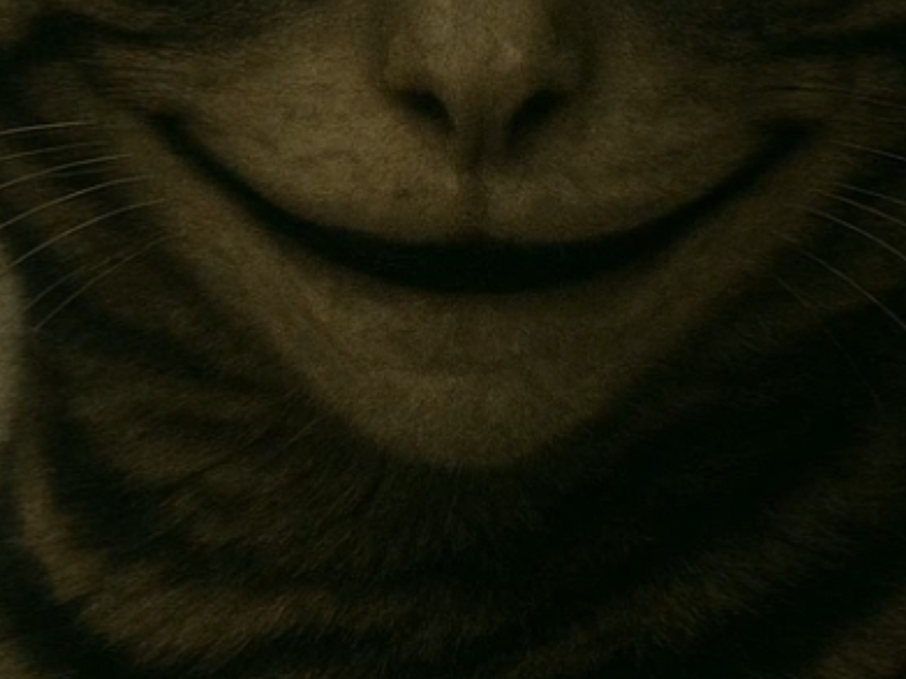 | 14.2万 | 2025-06-28 |
| [【五补】♿耄耋A梦♿](https://www.bilibili.com/video/BV1GWKDzhELg) |  | 67.3万 | 2025-06-25 |
| [大狗基米交交交   柔情猫娘打打打](https://www.bilibili.com/video/BV13mKbzvEoJ) |  | 11.8万 | 2025-06-23 |
| [【哈基米档案】活全家双子](https://www.bilibili.com/video/BV1ZHM2zAE3n) |  | 41.6万 | 2025-06-14 |
| [谁是开创哈基米宇宙的万古罪人？【耄耋史诗01】](https://www.bilibili.com/video/BV15fM7zLEvi) |  | 128.6万 | 2025-06-11 |
| [古风哈基米：《哈庭雪》无人扶我哈气志，我自叮咚至山巅](https://www.bilibili.com/video/BV161TezNEqC) |  | 18.0万 | 2025-06-09 |
| [🐱哈基米哈尽了🐱](https://www.bilibili.com/video/BV1sREczgEcK) |  | 33.5万 | 2025-05-13 |
| [哈基米](https://www.bilibili.com/video/BV1S1GCz9Eoh) | 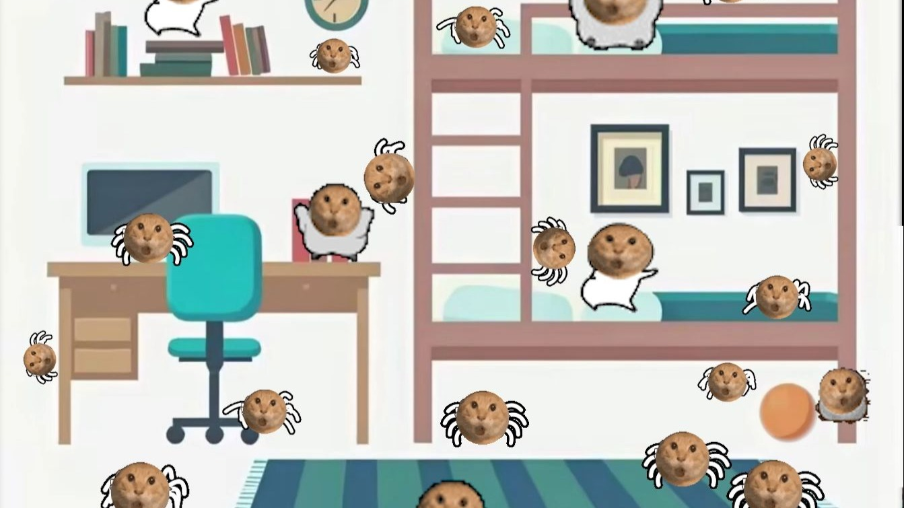 | 244 | 2025-04-29 |
| [【哈基米】致两千年后的哈基米 Counter Attack-Mankind](https://www.bilibili.com/video/BV1tKdUYbEHf) |  | 24.2万 | 2025-04-11 |
| [《天真的基米》- 坚韧啊能不能放过我这一次](https://www.bilibili.com/video/BV1QpXYYDExu) | 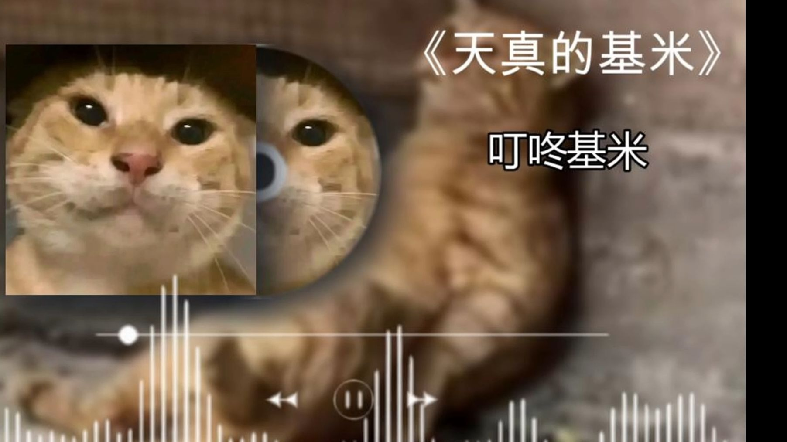 | 37.4万 | 2025-03-23 |
| [【基米洲行动】🎵🐱航天基地耋耄兰の小曲《Industrial Chimi》🐱🎵](https://www.bilibili.com/video/BV1cgXvYBE5d) |  | 97.3万 | 2025-03-20 |
| [哈基米：My Soul](https://www.bilibili.com/video/BV1Ch9YYuET9) |  | 117.8万 | 2025-03-02 |
| [哈基米](https://www.bilibili.com/video/BV1Bp4y1c7mf) |  | 306 | 2023-10-01 |
| [哈基米](https://www.bilibili.com/video/BV11F411f7Qr) |  | 1.2万 | 2023-08-06 |

---
*最后更新: 2025-10-01 02:39:54 (自动生成)*
*数据来源: [Bilibili](https://www.bilibili.com)*

## 使用说明

运行以下命令更新视频列表:
```bash
python3 fetch_hajimi_videos.py
```
