# awesome-hajimi
collections of hajimi (哈基米 in Chinese) on the Internet.

## 视频列表 (Video List)

| 视频标题 (Title) | 封面 | 播放量 (Views) | 发布日期 (Date) |
|---|---|---|---|
| [【哈基米南扁绿豆】第一支视频求三连！](https://www.bilibili.com/video/BV16DrEBxEu5) |  | 0 | 2026-01-14 |
| [山东人说喝即墨还真是哈基米](https://www.bilibili.com/video/BV1nDrEBxEv6) |  | 1 | 2026-01-14 |
| [「哈基米音乐」基米说](https://www.bilibili.com/video/BV1kmrEBtEgH) |  | 4 | 2026-01-14 |
| [世界上最小的哈基米](https://www.bilibili.com/video/BV1yyrEB8EqZ) |  | 69 | 2026-01-14 |
| [有一只耄耋在你的草坪上](https://www.bilibili.com/video/BV1uGrJB3Epi) | 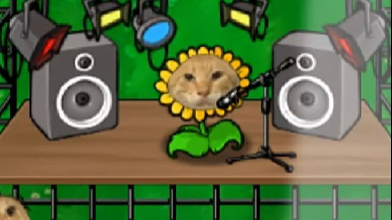 | 377 | 2026-01-14 |
| [《停停停，再进化就要上班了》](https://www.bilibili.com/video/BV1xYr5BHEZX) |  | 2.2万 | 2026-01-14 |
| [【劉俊朗】基米仙人最新力作！左手哈基！](https://www.bilibili.com/video/BV1CcrEBfEvm) |  | 427 | 2026-01-14 |
| [双 面 哈 基 米](https://www.bilibili.com/video/BV1URrJBrEJv) | 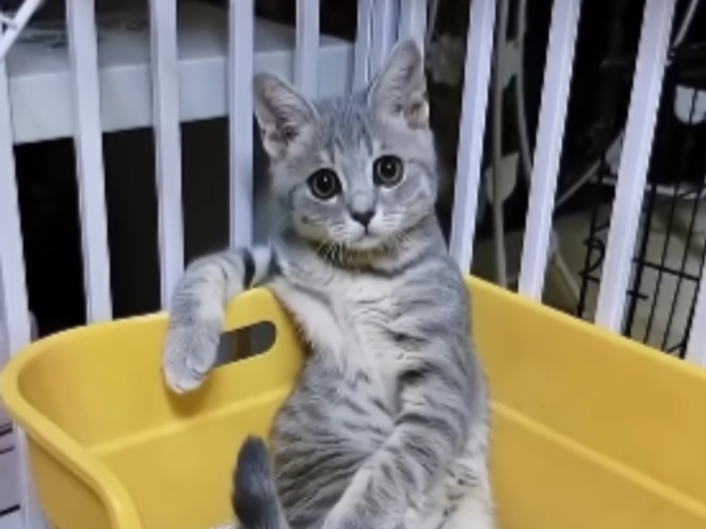 | 18 | 2026-01-13 |
| [哈基米回家开工厂钥匙房会出些什么呢](https://www.bilibili.com/video/BV1rKrEBxEt5) | 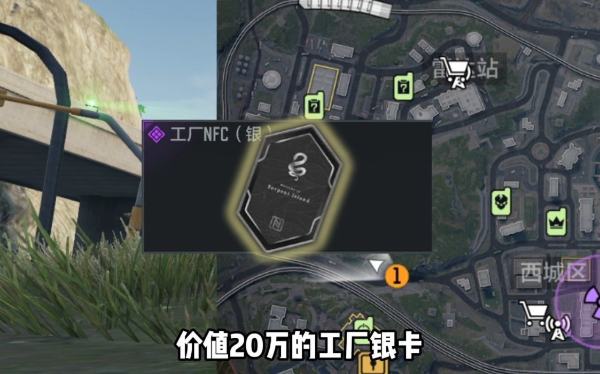 | 657 | 2026-01-13 |
| [哈基米](https://www.bilibili.com/video/BV16urEBWEcx) | 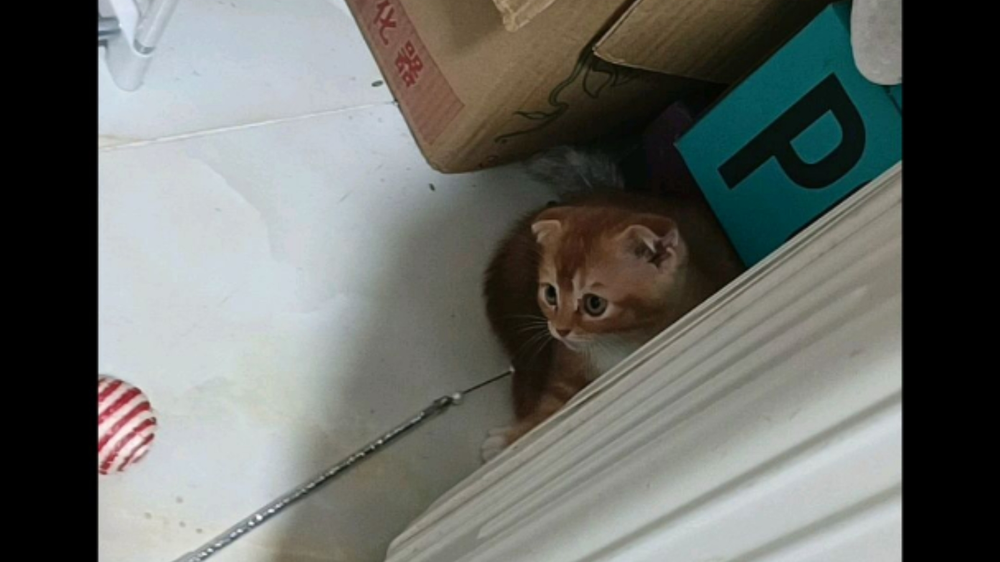 | 121 | 2026-01-13 |
| [哈基米震慑大狗](https://www.bilibili.com/video/BV1zgrEBXErQ) | 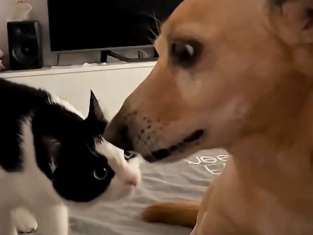 | 103 | 2026-01-13 |
| [Lore accurate Matikanetannhauser 曼波 哈基米](https://www.bilibili.com/video/BV1XzrLBKEya) |  | 371 | 2026-01-13 |
| [哈基米哟这个出货](https://www.bilibili.com/video/BV1VzrLBTE9A) |  | 335 | 2026-01-13 |
| [哈基米睡觉](https://www.bilibili.com/video/BV1C7rLBHEGC) |  | 37 | 2026-01-13 |
| [五阶哈基米首战](https://www.bilibili.com/video/BV1P7rLBHEiY) |  | 16 | 2026-01-13 |
| [M18哈基米西奈半岛玩弄对面三人出核](https://www.bilibili.com/video/BV1csrLB2Ekh) |  | 450 | 2026-01-13 |
| [哈基米♪哈基米♪哈基米♪哈基米♪](https://www.bilibili.com/video/BV1PorLBREbt) |  | 395 | 2026-01-13 |
| [I can&#x27;t 哈基米](https://www.bilibili.com/video/BV1MDrLBfE3o) |  | 221 | 2026-01-13 |
| [这种哈基米能撸吗？](https://www.bilibili.com/video/BV1zMrjBjEFB) |  | 5187 | 2026-01-13 |
| [自己拼的哈基米](https://www.bilibili.com/video/BV1rwr5BkELR) |  | 17 | 2026-01-13 |
| [哈基米这个落网](https://www.bilibili.com/video/BV1rfrVByExs) | 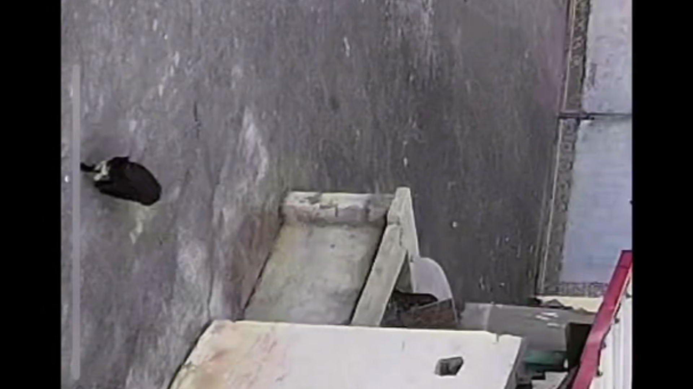 | 2168 | 2026-01-13 |
| [哈基佐](https://www.bilibili.com/video/BV1DkrVBxENZ) |  | 6101 | 2026-01-13 |
| [哈基米们在公园的悠闲午后](https://www.bilibili.com/video/BV1tsr5BoECX) |  | 791 | 2026-01-13 |
| [如果小天狼星没有死（哈基米立大功）](https://www.bilibili.com/video/BV17Mr5BzECV) |  | 3341 | 2026-01-13 |
| [猫：可恶啊！这家伙！毫无破绽](https://www.bilibili.com/video/BV1igr5BTEjQ) | 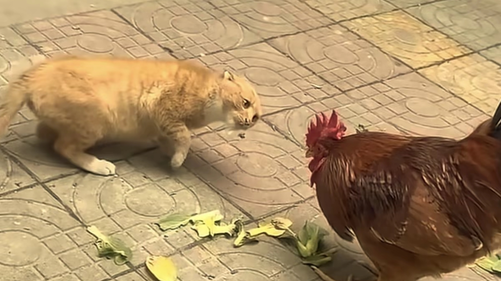 | 1.1万 | 2026-01-13 |
| [死库水哈基米的摇一摇](https://www.bilibili.com/video/BV1nkr5BLEDB) |  | 40 | 2026-01-13 |
| [基米小学：肃严是一只严肃的小猫](https://www.bilibili.com/video/BV17Sr5B6ELG) |  | 4.8万 | 2026-01-13 |
| [【搞笑】带派的伊朗哈列维王朝](https://www.bilibili.com/video/BV1XprzBNEX9) |  | 995 | 2026-01-13 |
| [第一个跳哈基米版本的mmj出现啦！](https://www.bilibili.com/video/BV1mtr5BREFj) |  | 979 | 2026-01-13 |
| [0.6岁高能量哈基米小鼻嘎的日常vlog](https://www.bilibili.com/video/BV1TerzBZEUo) |  | 835 | 2026-01-13 |
| [♿冰！我超♿【Kraftwerk】【哈基米音乐】Bing Вo Tschau](https://www.bilibili.com/video/BV1TurLBoERw) |  | 402 | 2026-01-13 |
| [哈基米难败屡斗！伊朗反杀欧美！【钢铁雄心】](https://www.bilibili.com/video/BV1KGrLBREe5) |  | 3.2万 | 2026-01-13 |
| [《哈基耄耋修仙记》第三集：哈基米，那没路躲！](https://www.bilibili.com/video/BV1VZr5BNEzB) |  | 351 | 2026-01-13 |
| [【ARC Raiders】当你用哈基米音乐硬控老外](https://www.bilibili.com/video/BV1VZr5BNEoT) | 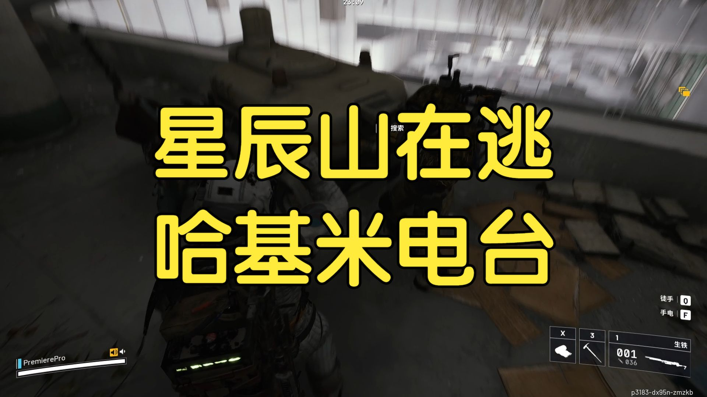 | 153 | 2026-01-13 |
| [【哈基米22】我的最新作品，快来一睹为快！](https://www.bilibili.com/video/BV1LXr5BBEbs) |  | 0 | 2026-01-13 |
| [【奥说】哈基米貘生气~7坏身体谁来替~—从赛文到艾斯的手中-《艾斯奥特曼》](https://www.bilibili.com/video/BV1G1r6BuEa4) |  | 7129 | 2026-01-13 |
| [“你有种就起正义把鼠鼠我颗了”](https://www.bilibili.com/video/BV1Yfr5BeEtn) | 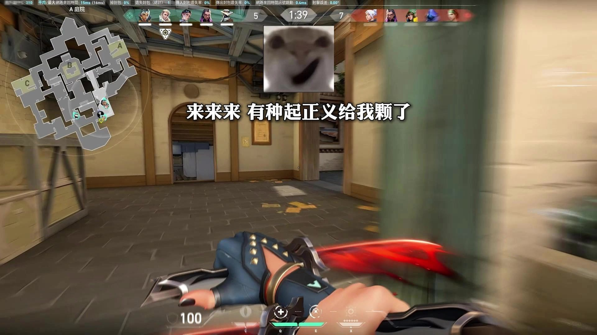 | 6.9万 | 2026-01-13 |
| [哈基米南北曼波](https://www.bilibili.com/video/BV1mYrzBtEXg) |  | 263 | 2026-01-13 |
| [【哈基米四十分钟纯享】盘点凉遍全网の我制作的哈基米音乐](https://www.bilibili.com/video/BV1UhrzBfE3n) |  | 3724 | 2026-01-13 |
| [那些成了精的哈基米](https://www.bilibili.com/video/BV1R7rzBBEgY) |  | 60 | 2026-01-13 |
| [农夫与哈基米](https://www.bilibili.com/video/BV12irzB4Ehz) | 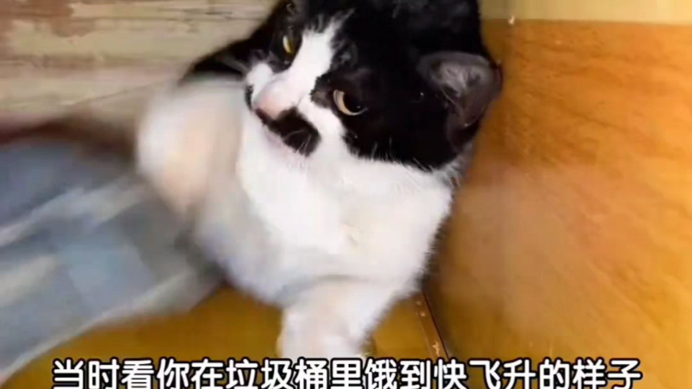 | 2149 | 2026-01-13 |
| [哈基米抢人类的食物，以为是自己抓的](https://www.bilibili.com/video/BV1kCrzBDEAs) | 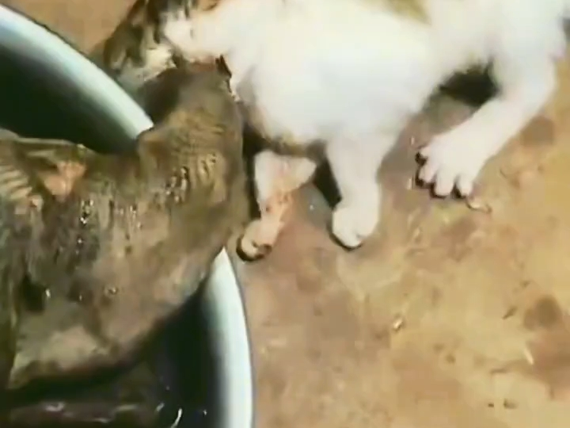 | 7.6万 | 2026-01-13 |
| [【哈基米音乐】—背对背哈气](https://www.bilibili.com/video/BV1PCrzBQEgG) |  | 654 | 2026-01-13 |
| [记录一下邪恶哈基米](https://www.bilibili.com/video/BV147r6BtEEz) |  | 35 | 2026-01-13 |
| [哈基米牌电梯广告](https://www.bilibili.com/video/BV1bVr6BcE73) |  | 1122 | 2026-01-13 |
| [小猫实在太饿了](https://www.bilibili.com/video/BV1aPr6BTEyG) | 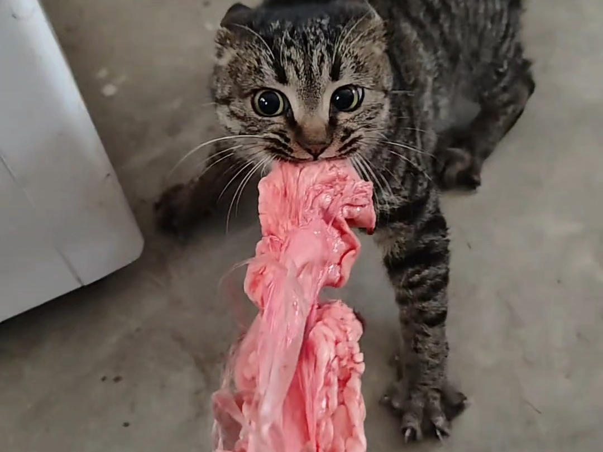 | 2357 | 2026-01-13 |
| [这耄有力气！](https://www.bilibili.com/video/BV1hTr6BNEA3) | 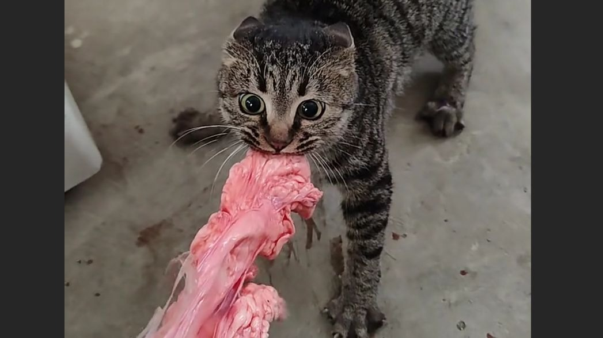 | 11.8万 | 2026-01-13 |
| [哈基米说想吃羽毛孩子](https://www.bilibili.com/video/BV1gUr6BTE2t) |  | 2756 | 2026-01-13 |
| [我把皇室战争的一些卡牌音效改成了哈基米！（第五期）](https://www.bilibili.com/video/BV1vyrYBdERc) |  | 1.5万 | 2026-01-13 |
| [【熟肉】我从中国买了一堆奇葩哈基米产品！真的无奇不有！怎么想出来的？](https://www.bilibili.com/video/BV1jer6B2Eft) |  | 7643 | 2026-01-13 |
| [循环歌单｜【基米之歌の小曲】｜“【一起大喊欧玛吉利】【库里之歌哈基米版】”](https://www.bilibili.com/video/BV1C7BKBUEPX) |  | 1.5万 | 2026-01-13 |
| [【哈基米音乐】The Best Of 咪](https://www.bilibili.com/video/BV1GvreBQERH) |  | 13.0万 | 2026-01-13 |
| [圆头玛丽](https://www.bilibili.com/video/BV1SWrqBdE4d) |  | 1720 | 2026-01-13 |
| [碧蓝哈基米///1127012 柴郡 SHAKE IT](https://www.bilibili.com/video/BV1xYrqBDEZB) |  | 1381 | 2026-01-13 |
| [能跑就不要动它](https://www.bilibili.com/video/BV1rrrqB5E35) | 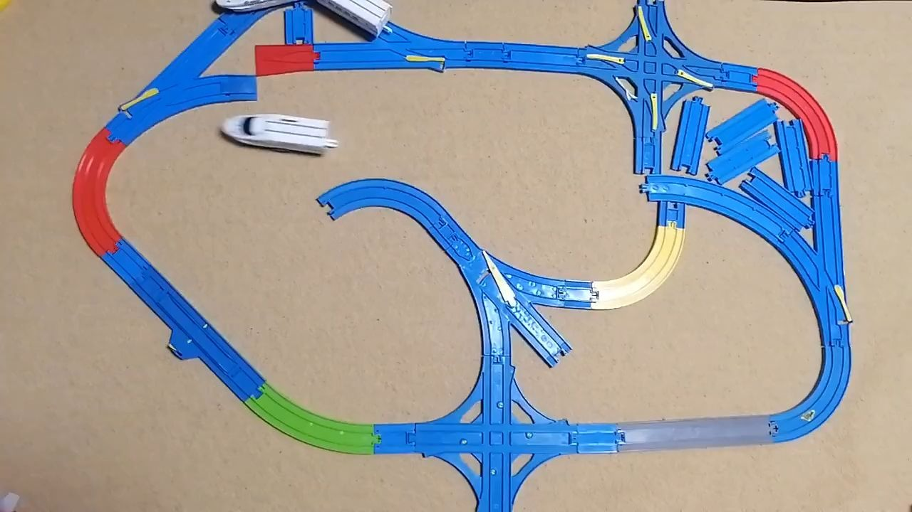 | 51.3万 | 2026-01-13 |
| [哈基米闯24层魔法の塔](https://www.bilibili.com/video/BV1YcrBBhE1z) |  | 1370 | 2026-01-13 |
| [（看见模型的）哈基米我难被撸动~~](https://www.bilibili.com/video/BV1g1rBBhE5x) | 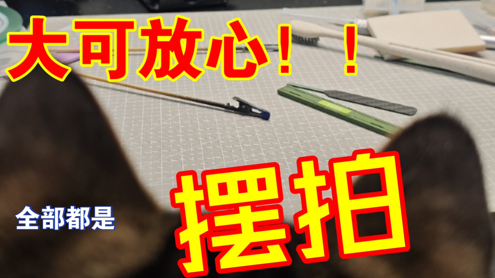 | 511 | 2026-01-13 |
| [哈基米依旧](https://www.bilibili.com/video/BV13mrBBFEgJ) |  | 1.6万 | 2026-01-12 |
| [【猛男版】基米说⚡️ 哈基米音乐⚡️](https://www.bilibili.com/video/BV1gUrBBbEn2) |  | 50 | 2026-01-12 |
| [【游戏王MD】哈基米带什么？](https://www.bilibili.com/video/BV1npriBBEzX) |  | 1014 | 2026-01-12 |
| [当老外看到哈基米神曲](https://www.bilibili.com/video/BV1JsriBTEGD) |  | 1838 | 2026-01-12 |
| [【哈基米音乐】不可逆哈气](https://www.bilibili.com/video/BV1AXreBgEXR) |  | 311 | 2026-01-12 |
| [哈基米对哈时刻](https://www.bilibili.com/video/BV1UsrvB7EZ8) |  | 346 | 2026-01-12 |
| [橘哈基米试图挑战人类，无奈实在缩小…](https://www.bilibili.com/video/BV1nZiWBtEtF) | 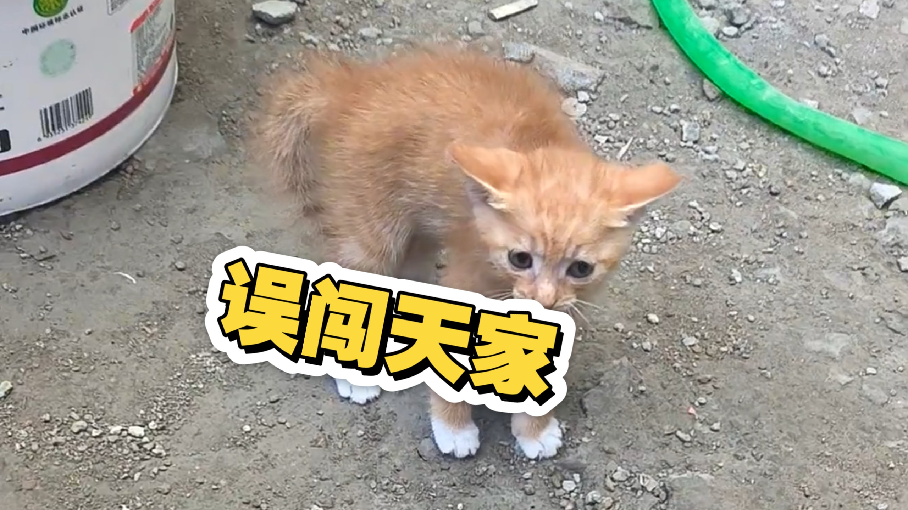 | 2.1万 | 2026-01-12 |
| [猫: 我们代码是这样写的《晚上不熬人，白天人熬猫》](https://www.bilibili.com/video/BV1QjrvBXEg1) | 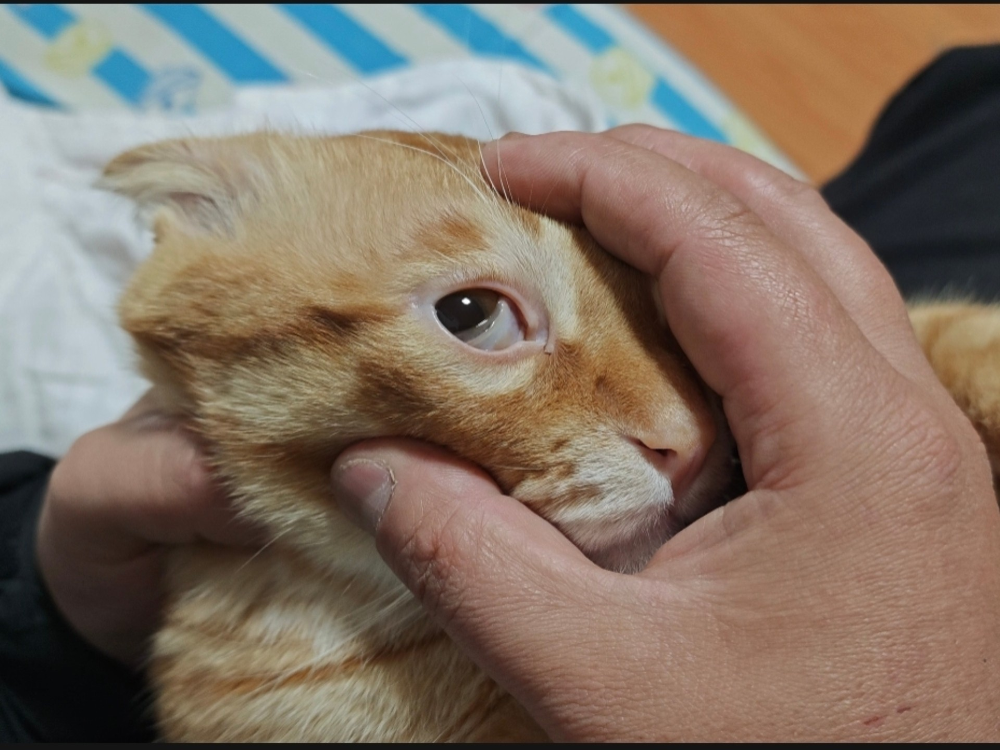 | 8.6万 | 2026-01-12 |
| [哈列维波斯哈基米旗](https://www.bilibili.com/video/BV1FrrvBqEkr) |  | 4682 | 2026-01-12 |
| [你这哈基米的终场有点不对吧](https://www.bilibili.com/video/BV1fFrYBdE8p) |  | 7276 | 2026-01-12 |
| [哈基米想吃大爷的小鸟结果被打跑了](https://www.bilibili.com/video/BV1KCraBBE3i) |  | 1391 | 2026-01-12 |
| [哈基术？语音：上等之蜜，当配南北绿豆，岂可草草食之？](https://www.bilibili.com/video/BV1pSraBeEBQ) |  | 3.8万 | 2026-01-12 |
| [超可爱I Can&#x27;t Wait翻唱（哈基米版）](https://www.bilibili.com/video/BV1N1raBTEjP) | 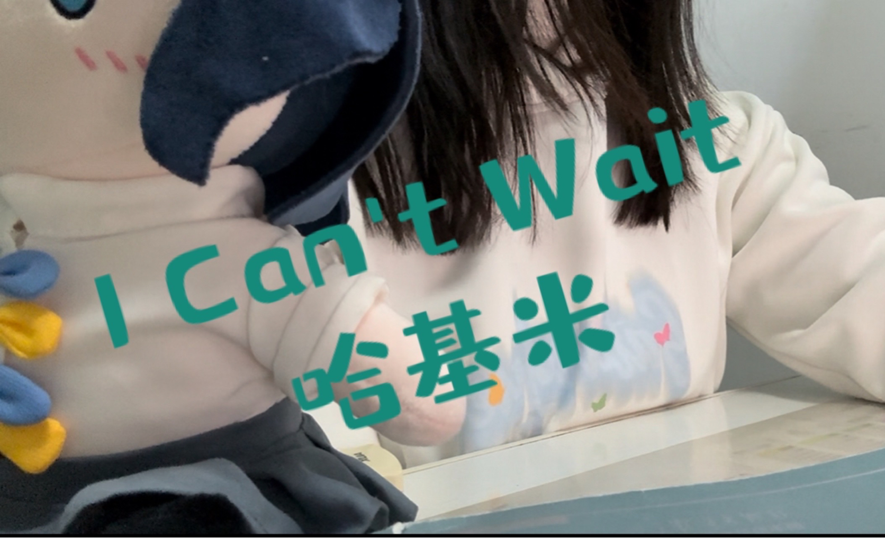 | 2346 | 2026-01-12 |
| [基米小学：放风筝](https://www.bilibili.com/video/BV1mErYBCEZH) |  | 836 | 2026-01-12 |
| [【游戏王】MD巳剑哈基米9种展开方法](https://www.bilibili.com/video/BV1DLrYB1Eed) |  | 680 | 2026-01-12 |
| [基米TV船新合集27分钟剧场版，一次看个够](https://www.bilibili.com/video/BV1ytrYBqEFo) |  | 1032 | 2026-01-12 |
| [想救哈基米又不给靠近](https://www.bilibili.com/video/BV1xKreBrEjJ) |  | 1692 | 2026-01-12 |
| [最重力的猫](https://www.bilibili.com/video/BV1Y9rYBSEsp) |  | 16.5万 | 2026-01-12 |
| [近日，网友发现当地方言说“蟹鸡面”，发音非常像网络流行语“哈基米”，大家纷纷拍视频分享](https://www.bilibili.com/video/BV191rbBzEFC) |  | 86.1万 | 2026-01-12 |
| [哈基米喜欢恶作剧](https://www.bilibili.com/video/BV1bfrYBjE7K) |  | 3339 | 2026-01-12 |
| [🐱月光它哈屋檐，哈在基米的山川~](https://www.bilibili.com/video/BV1X1rbBzETN) | 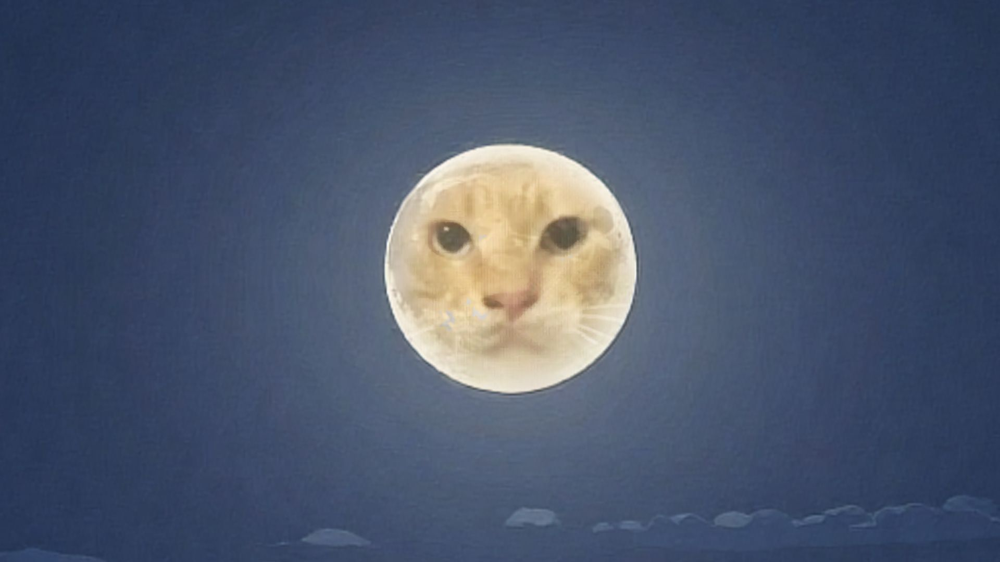 | 8283 | 2026-01-12 |
| [贪吃的哈基米](https://www.bilibili.com/video/BV1ePrhBjEv8) |  | 976 | 2026-01-12 |
| [解救了一只哈基米 谁收养](https://www.bilibili.com/video/BV1LPrhBjETZ) | 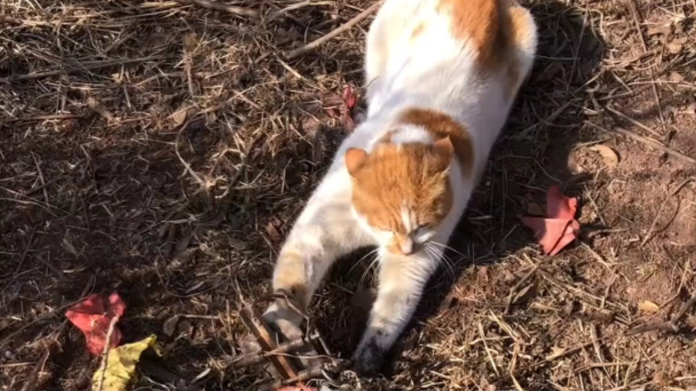 | 4.1万 | 2026-01-12 |
| [仙人掌耄耋](https://www.bilibili.com/video/BV19TrhBVE7Z) |  | 3121 | 2026-01-12 |
| [裸基米](https://www.bilibili.com/video/BV1FYrhB4Etf) | 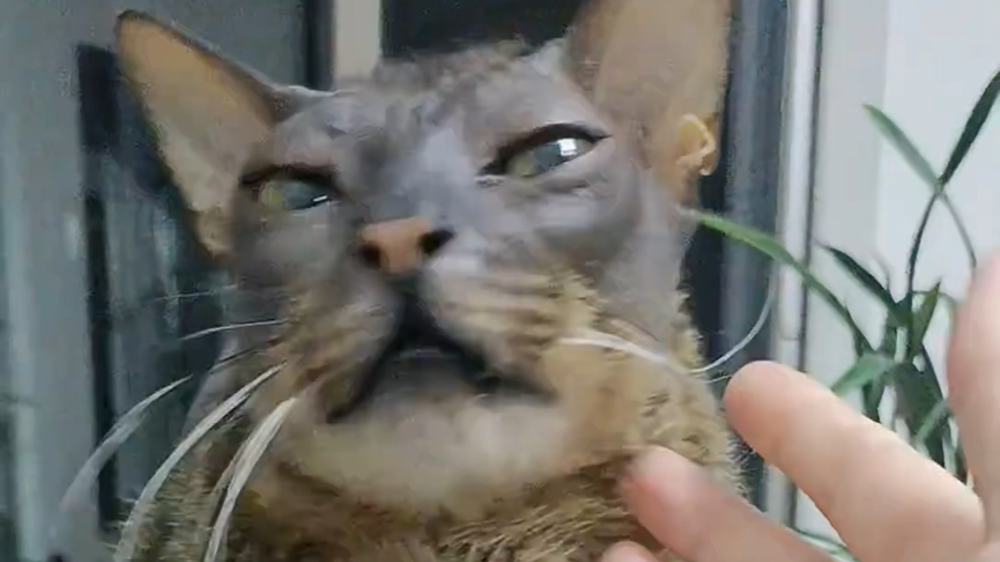 | 5.8万 | 2026-01-12 |
| [吉他弹唱《蓝莲哈》—一声哈基米带来的救赎感得多强！](https://www.bilibili.com/video/BV1cYrhB4EfD) |  | 138 | 2026-01-12 |
| [忙三天没回家，哈基兔把房顶都掀翻了，把整个房子爆破了，气死我了](https://www.bilibili.com/video/BV1HGraBfEYv) | 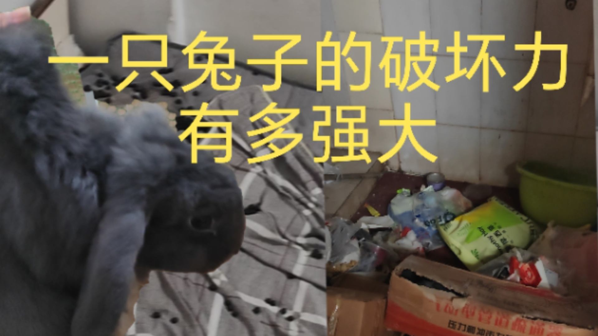 | 5085 | 2026-01-12 |
| [【超燃哈基米音乐】猛 攻 の 曼 波](https://www.bilibili.com/video/BV1j76dBSEak) |  | 7061 | 2026-01-12 |
| [《动物迷惑行为大赏291》](https://www.bilibili.com/video/BV1vC6oBDECy) | 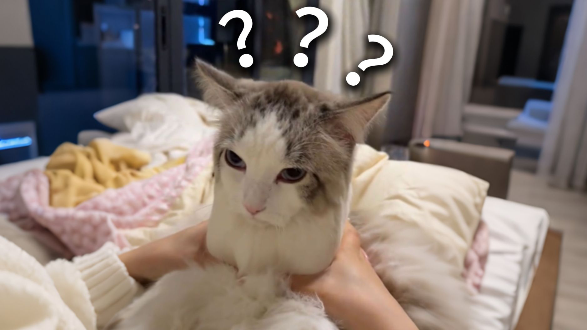 | 12.5万 | 2026-01-12 |
| [这又是触发什么代码了，明明他俩之前处的好好的](https://www.bilibili.com/video/BV18d6fBnE8Z) | 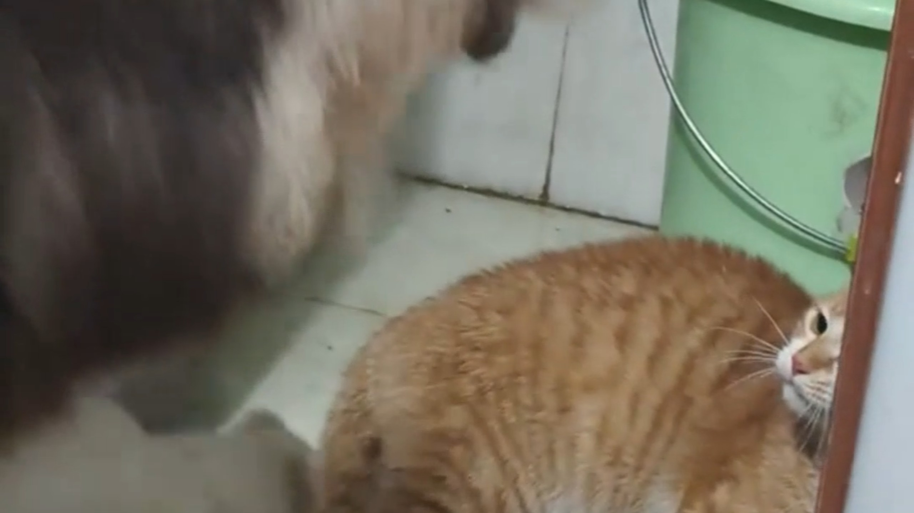 | 6318 | 2026-01-11 |
| [小猫咪](https://www.bilibili.com/video/BV1hX6oByETo) |  | 41.0万 | 2026-01-11 |
| [给队友唱哈基米《ring ring ring》](https://www.bilibili.com/video/BV1gh6ZBUEQG) |  | 8017 | 2026-01-11 |
| [哈基咪南北绿多 阿西噶阿西](https://www.bilibili.com/video/BV1xo6RBPEyx) |  | 184 | 2026-01-11 |
| [众说周知大狗的尾巴是螺旋桨](https://www.bilibili.com/video/BV1816RBrEZu) | 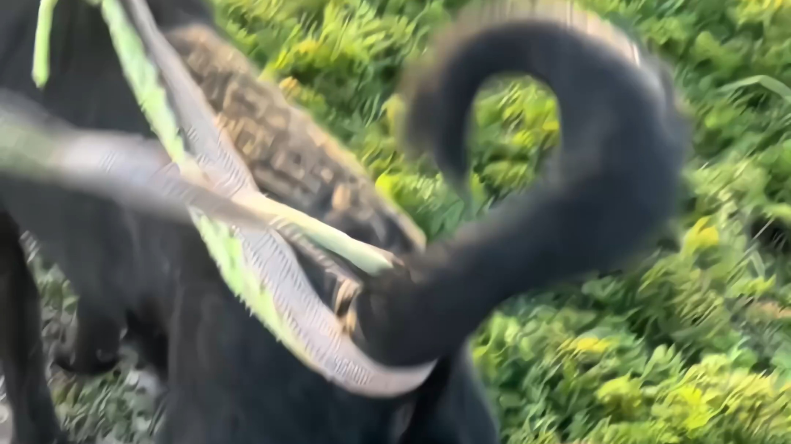 | 16.4万 | 2026-01-11 |
| [猫咪看上大爷的鸟了，直接无视大爷准备开干](https://www.bilibili.com/video/BV1zK6QBrEw7) | 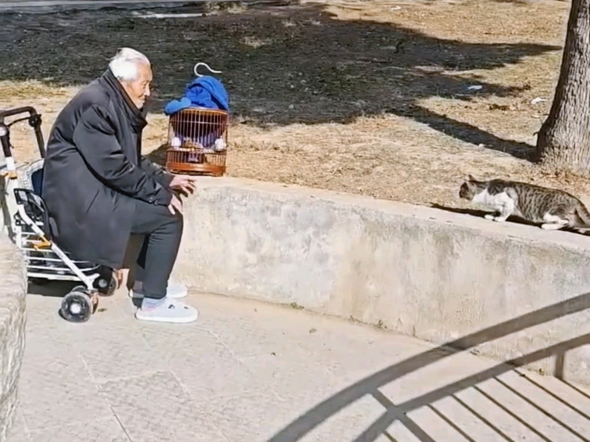 | 15.1万 | 2026-01-10 |
| [15分钟长视频](https://www.bilibili.com/video/BV1Mw6UBmEpb) |  | 57.9万 | 2026-01-10 |
| [啊～是狗中王来了](https://www.bilibili.com/video/BV1yzrNBxE13) |  | 263 | 2026-01-09 |
| [谁是最可爱的狗？](https://www.bilibili.com/video/BV1tEiRBxEYh) |  | 13.6万 | 2026-01-08 |
| [钱是万恶之源](https://www.bilibili.com/video/BV1pei1BWEdH) |  | 277.7万 | 2026-01-07 |
| [第一次听到皮筋叫](https://www.bilibili.com/video/BV1MgijB7Ei5) | 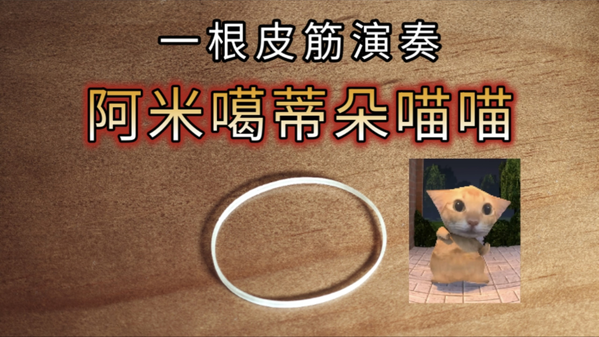 | 51.7万 | 2026-01-04 |
| [成本只要八十的曼波小狗](https://www.bilibili.com/video/BV1VeiABWEEU) | 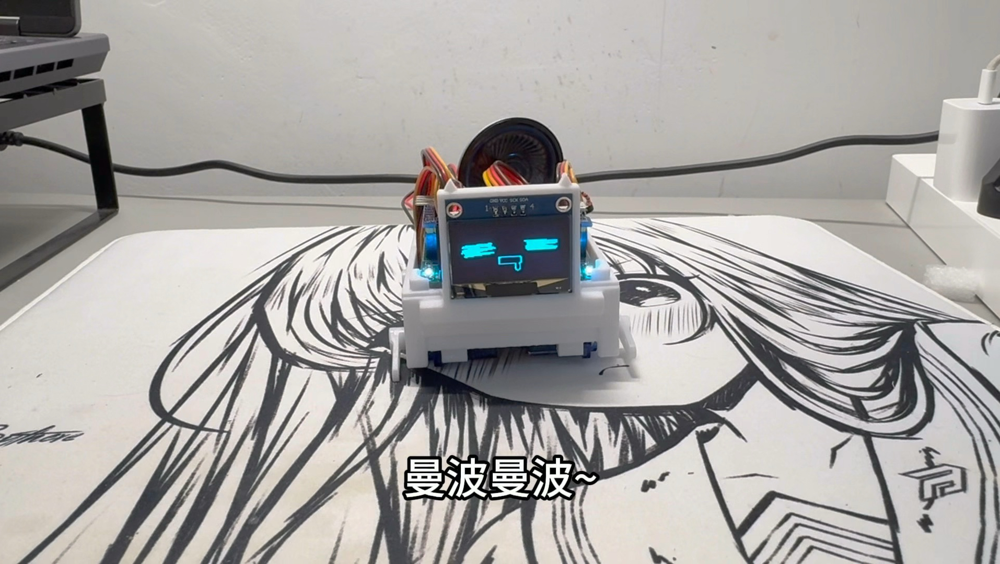 | 60.5万 | 2025-12-30 |
| [鉴赏一下佩佩新皮里的两只可爱哈基米](https://www.bilibili.com/video/BV1HCbVzaEjw) |  | 18.0万 | 2025-08-11 |
| [一分钟学会《哈基米》](https://www.bilibili.com/video/BV1A34y1u7M3) |  | 5.2万 | 2023-10-20 |

---
*最后更新: 2026-01-14 02:55:37 (自动生成)*
*数据来源: [Bilibili](https://www.bilibili.com)*

## 使用说明

运行以下命令更新视频列表:
```bash
python3 fetch_hajimi_videos.py
```
