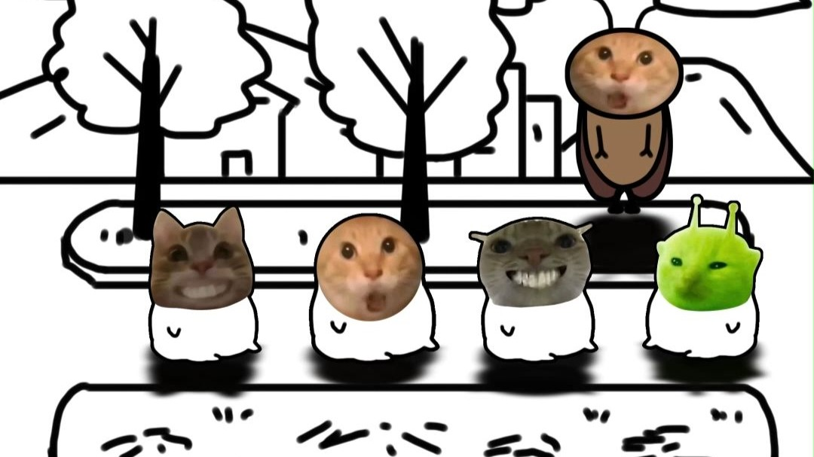
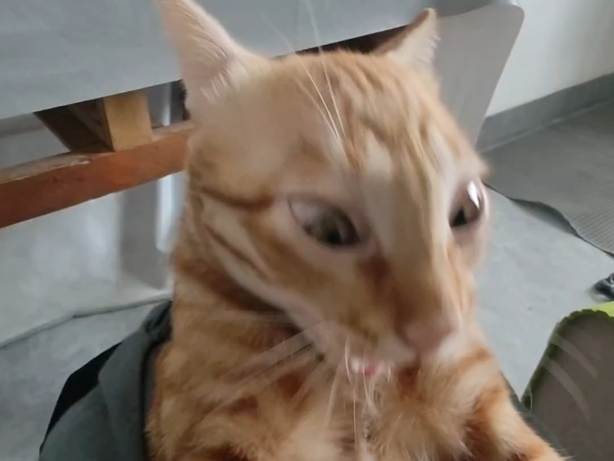
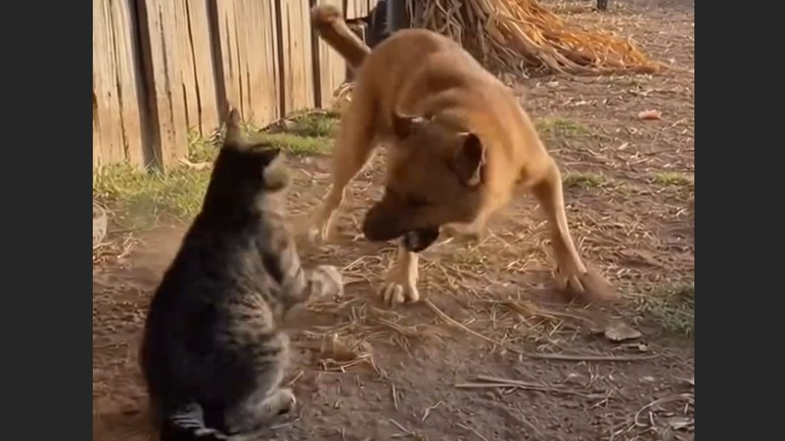
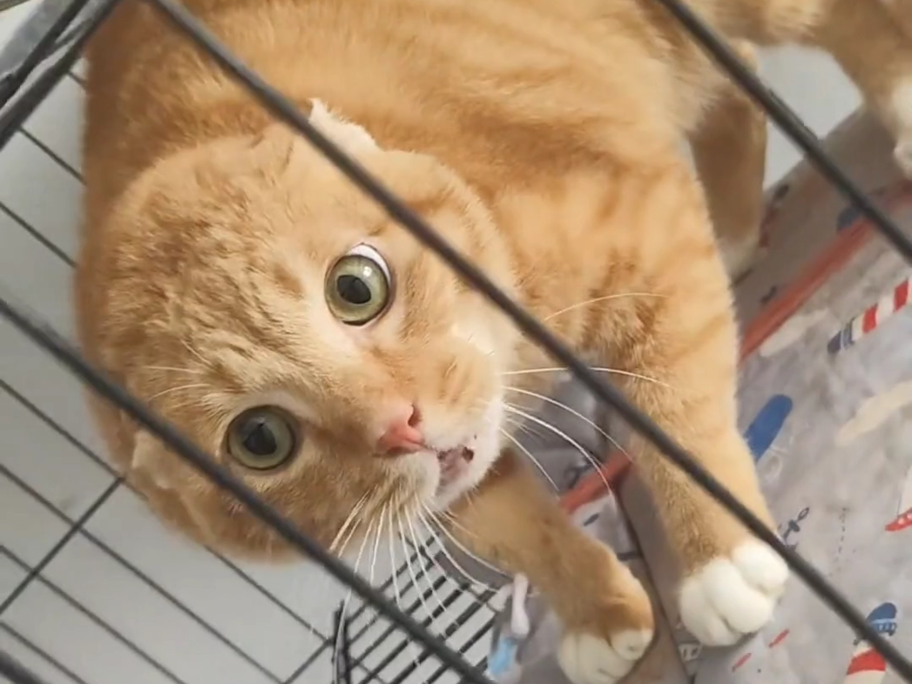
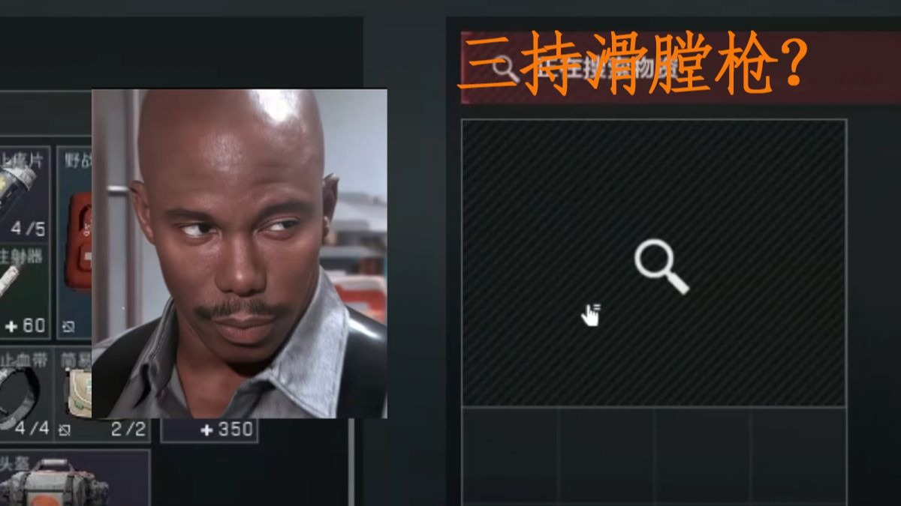
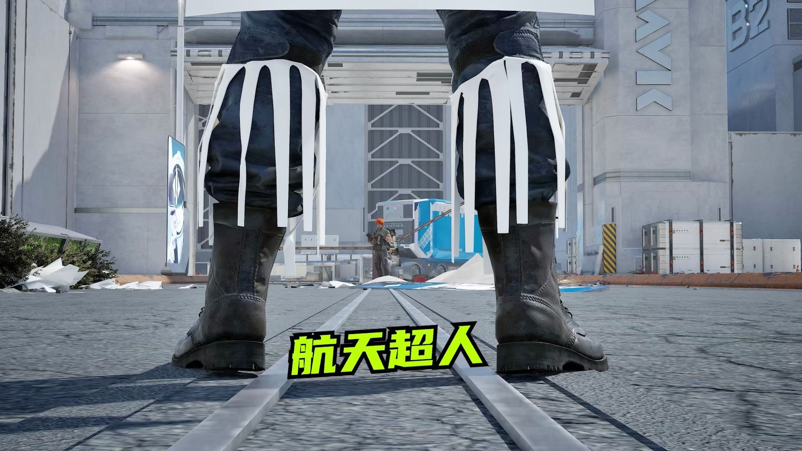
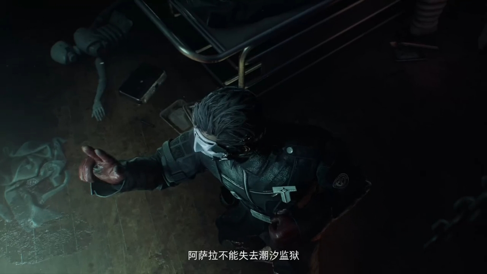
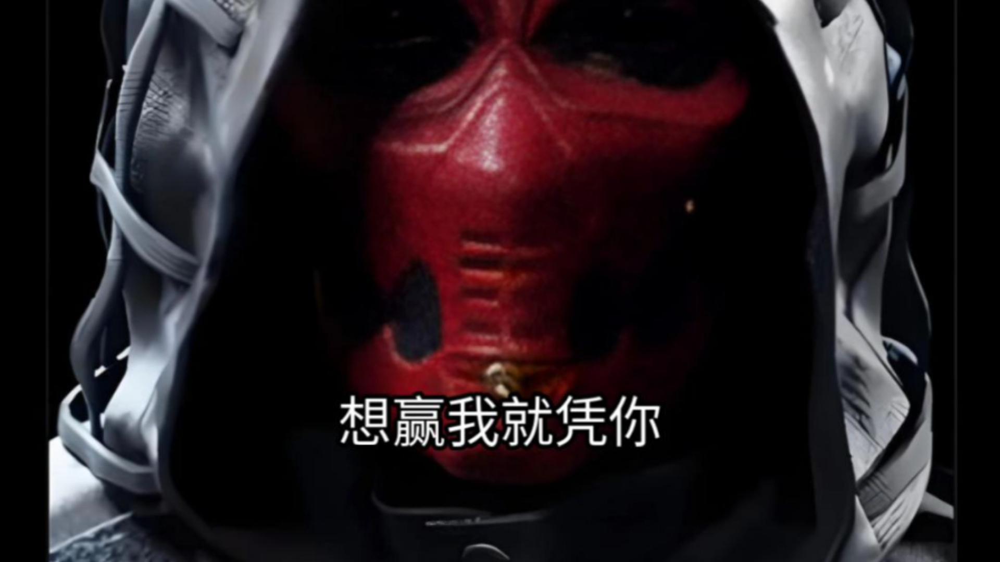
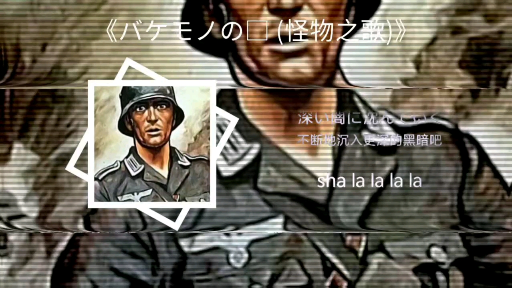

# awesome-hajimi
collections of hajimi (哈基米 in Chinese) on the Internet.

## 视频列表 (Video List)

| 视频标题 (Title) | 封面 | 播放量 (Views) | 发布日期 (Date) |
|---|---|---|---|
| [女团哈基米：🐱Ditto🐱  ——NewJeans](https://www.bilibili.com/video/BV1GSs5zkEgs) |  | 469 | 2025-10-24 |
| [边笑边录的，可算是给我录爽了：哈基米曼波~曼波~哈基米曼波~哈基米呀南北绿豆~](https://www.bilibili.com/video/BV1GSs5zkEM1) |  | 1740 | 2025-10-23 |
| [基米小学:耄耄种的是什么呢？](https://www.bilibili.com/video/BV1irsGzgE4z) |  | 4.3万 | 2025-10-23 |
| [高中像监狱？像就对了！](https://www.bilibili.com/video/BV1zBsqzEECN) |  | 19.8万 | 2025-10-23 |
| [【哈基米音乐】怎叹（DJ版）](https://www.bilibili.com/video/BV1fUsazKEEz) |  | 1535 | 2025-10-23 |
| [哈基米哈基米](https://www.bilibili.com/video/BV16YsqzQEhU) |  | 700 | 2025-10-23 |
| [白金♂之星](https://www.bilibili.com/video/BV1drsxz2EEa) |  | 20.2万 | 2025-10-23 |
| [雅珂达还没意识到自己有多抢手](https://www.bilibili.com/video/BV1XDsqzgEhz) |  | 16.6万 | 2025-10-23 |
| [哈基米科技致富经！伪喵游戏开创人？不敌大狗嚼炼化者一根！](https://www.bilibili.com/video/BV1h9sqzMEBj) |  | 5828 | 2025-10-23 |
| [正片来了，练胆成果！](https://www.bilibili.com/video/BV1SZsqzvEpZ) |  | 150.7万 | 2025-10-23 |
| [【原神】绒绒狸猫无伤雷电将军](https://www.bilibili.com/video/BV1tysBzPEzW) |  | 16.0万 | 2025-10-23 |
| [国产区经典无码视频，抑郁症看完都笑了](https://www.bilibili.com/video/BV1EYsYzTEsY) |  | 6.4万 | 2025-10-23 |
| [给哈基米剪指甲](https://www.bilibili.com/video/BV1hhsizNE9A) |  | 11.0万 | 2025-10-23 |
| [疑似弱智吧段子集体流出](https://www.bilibili.com/video/BV1mgshzVEVU) |  | 20.1万 | 2025-10-23 |
| [【毕导】看完这个视频，你会释怀这停滞不前的人生](https://www.bilibili.com/video/BV1qJsizkEp1) |  | 99.6万 | 2025-10-23 |
| [雷总引领全民“吹牛逼”时代：小字营销逼疯14亿人？蛋炒饭、二手车、房地产全在学粗粮的“文字游戏”！](https://www.bilibili.com/video/BV1yVshz3EM7) |  | 16.5万 | 2025-10-23 |
| [出生之家是我的家乡](https://www.bilibili.com/video/BV1G4sezFEUn) |  | 16.8万 | 2025-10-23 |
| [[创意工坊/三国] 原来丞相空城计弹的是大东北](https://www.bilibili.com/video/BV1Gisbz2Ee6) |  | 7.9万 | 2025-10-23 |
| [AI动画转场和镜头运动升级了，viduQ2模型来了](https://www.bilibili.com/video/BV1UNshz2EHt) |  | 58.7万 | 2025-10-22 |
| [AI视频里的狗能有多硬核](https://www.bilibili.com/video/BV19Zs8zHEw9) |  | 4.9万 | 2025-10-22 |
| [“正在汲取基米能量的牛马哈基人 ”](https://www.bilibili.com/video/BV1DPshz7ECN) |  | 3.2万 | 2025-10-22 |
| [《我玩王者荣耀》“只剩我还在原地 等着兵线汇聚”](https://www.bilibili.com/video/BV1zbshzcEMN) |  | 2.1万 | 2025-10-22 |
| [克苟玩原神UGC恐怖游戏 山雾未散：第一次觉得沉玉谷的建筑有点吓人](https://www.bilibili.com/video/BV1b1shzJEHv) |  | 12.4万 | 2025-10-22 |
| [60秒避难所：哈基米结局太简单呱呱菌游戏](https://www.bilibili.com/video/BV1xQshzLESU) |  | 1.7万 | 2025-10-22 |
| [【三角洲行动】2025年的干员们都在做什么？](https://www.bilibili.com/video/BV1BMsazeESb) |  | 18.6万 | 2025-10-22 |
| [只有过完支线的玩家才会懂主线中这段的震撼](https://www.bilibili.com/video/BV1EMsazeEfb) |  | 29.5万 | 2025-10-22 |
| [【新手哈基人向】手把手教你做曼波bass](https://www.bilibili.com/video/BV1V7saztE9P) |  | 3590 | 2025-10-22 |
| [【神曼波】哈基米什么时候进化成这种高攀不起的难度了！？](https://www.bilibili.com/video/BV1ZUs8ztEw1) |  | 7331 | 2025-10-22 |
| [青衣（哈基米版）](https://www.bilibili.com/video/BV1HosbzPE6s) |  | 228 | 2025-10-22 |
| [泪目！木偶与旅行者聊到水仙十字院和奇械公的事了！木偶大人的下午茶真不错！【原神6.1月之二版本主线剧情高光收录】](https://www.bilibili.com/video/BV1gzsbz2EjB) |  | 25.7万 | 2025-10-22 |
| [哈基人购买一群哈基米在乡下放归大自然](https://www.bilibili.com/video/BV18rsbz5EME) |  | 8999 | 2025-10-22 |
| [永失吾爱,举目破败！猎月人与未婚妻最后的故事过场动画！又一个纯爱战神【原神6.1月之二版本主线剧情高光收录】](https://www.bilibili.com/video/BV1G5s8zQEdm) |  | 26.6万 | 2025-10-22 |
| [剥蒜的情谊72.0](https://www.bilibili.com/video/BV1GEWZzfEHU) |  | 71.4万 | 2025-10-22 |
| [开往哈基米某条地铁的南北绿豆报站](https://www.bilibili.com/video/BV1dDstzEELj) |  | 5349 | 2025-10-22 |
| [麦当劳耄耋很不高兴为你服务](https://www.bilibili.com/video/BV1jFsxz1EeK) |  | 4.1万 | 2025-10-22 |
| [丁亮:明天来上班](https://www.bilibili.com/video/BV1iCsxzjEuX) |  | 12.6万 | 2025-10-22 |
| [摇滚哈基米](https://www.bilibili.com/video/BV1BPWdzhEtQ) |  | 4.2万 | 2025-10-21 |
| [【明日方舟】艾雅法拉· 联动新皮肤有多可爱？慢镜对比才知道！（小羊与必爱诺，可爱，可爱，还是可爱！）](https://www.bilibili.com/video/BV1gPWoznEAR) |  | 20.4万 | 2025-10-21 |
| [【小缘】听《神曼波》：“什么玩意？再听一遍”“对于懂日语的人是一种折磨”](https://www.bilibili.com/video/BV1tNWozSEVt) |  | 9.6万 | 2025-10-21 |
| [天气之肘](https://www.bilibili.com/video/BV1EvWQz9E9A) |  | 139.8万 | 2025-10-21 |
| [sora2让八国联军向大清割地](https://www.bilibili.com/video/BV1xHWQzYEnu) |  | 65.7万 | 2025-10-21 |
| [基米不是无机物，化作基衣更……](https://www.bilibili.com/video/BV1s2WXzNEzA) |  | 12.1万 | 2025-10-21 |
| [哈基米似乎遇到了一些麻烦](https://www.bilibili.com/video/BV1MNWmzZEys) |  | 6122 | 2025-10-21 |
| [大狗大狗交交交](https://www.bilibili.com/video/BV1rkW2zCEwX) |  | 10.2万 | 2025-10-20 |
| [⚡赵鹏真踢人了⚡](https://www.bilibili.com/video/BV1T3Wmz9E5w) |  | 9.5万 | 2025-10-20 |
| [干杯音乐节｜vlog](https://www.bilibili.com/video/BV1CnWmzmEqD) |  | 37.6万 | 2025-10-20 |
| [代码冲突的哈基米](https://www.bilibili.com/video/BV1qmWyzaEV4) |  | 16.1万 | 2025-10-20 |
| [当你告诉ai自己是ai:](https://www.bilibili.com/video/BV13zW1zoEy5) |  | 33.7万 | 2025-10-20 |
| [那天，哈基米界来了一位哈基米德！](https://www.bilibili.com/video/BV1FAW2z3EFn) |  | 2.9万 | 2025-10-20 |
| [【Sora2】科比单挑荒野](https://www.bilibili.com/video/BV1FUs3z2EsM) |  | 33.8万 | 2025-10-20 |
| [【三角洲行动/动画】敌人已经偷走了曼德尔砖！](https://www.bilibili.com/video/BV11csPzvEmu) |  | 75.4万 | 2025-10-19 |
| [风神巴巴托斯已经形成（能推给玩原的吗）原神温迪](https://www.bilibili.com/video/BV1FRsPzbEiN) |  | 15.7万 | 2025-10-19 |
| [（基米TV）圆头古神之姿](https://www.bilibili.com/video/BV1nDswzWECz) |  | 1.2万 | 2025-10-19 |
| [【嚼式好猫鉴赏家】：鉴定为哈基米大狗交交交](https://www.bilibili.com/video/BV1XKsAzGEyP) |  | 4336 | 2025-10-19 |
| [哈基米南北绿豆](https://www.bilibili.com/video/BV1z4WfzGEgP) |  | 14.8万 | 2025-10-19 |
| [原神新角色（sora2生成）](https://www.bilibili.com/video/BV1ubWtz6EZm) |  | 38.0万 | 2025-10-18 |
| [村庄超人](https://www.bilibili.com/video/BV1AmWtztEV9) |  | 13.7万 | 2025-10-18 |
| [我的号成了！！！4.0](https://www.bilibili.com/video/BV1PEW4zbEes) |  | 35.1万 | 2025-10-18 |
| [喜欢我美利坚的大飞机吗？【KARDS】](https://www.bilibili.com/video/BV1hPWBzqEz9) |  | 12.8万 | 2025-10-18 |
| [成都超人错误化了？优质概念图！](https://www.bilibili.com/video/BV1enWxzMEEY) |  | 6.4万 | 2025-10-18 |
| [猫猫虫：爱吃苹果很可爱无侵略性](https://www.bilibili.com/video/BV1qbWpzNEHC) |  | 11.8万 | 2025-10-18 |
| [⚡难道他真的是赋能哥 ⚡](https://www.bilibili.com/video/BV1WmWEziEMC) |  | 22.5万 | 2025-10-17 |
| [哈夫克你看看你养的超人](https://www.bilibili.com/video/BV1VTWJzXEkS) |  | 77.7万 | 2025-10-17 |
| [【哈基米FM】紅蓮哈——鬼灭之哈](https://www.bilibili.com/video/BV1myWCzyEkM) |  | 1.4万 | 2025-10-17 |
| [【哈基米音乐】✋基米不可以✋](https://www.bilibili.com/video/BV1Y6WizNEo7) |  | 8.6万 | 2025-10-16 |
| [[重制版] 苏联歌曲“苏维埃，我的家乡”《Северо-Восток — моя родина》](https://www.bilibili.com/video/BV1AV48zgEVc) |  | 26.6万 | 2025-10-16 |
| [《没出息》超燃完整版Ⅱ](https://www.bilibili.com/video/BV1aiWazHEMU) |  | 22.4万 | 2025-10-15 |
| [《洛圣都我的家乡》](https://www.bilibili.com/video/BV1di4izmEiL) |  | 222.9万 | 2025-10-15 |
| [雨宙超人《大东北M78，是我的家乡》M78、それが私の故郷です](https://www.bilibili.com/video/BV1oi4izUES7) |  | 108.6万 | 2025-10-15 |
| [【速凌】听话！自己去丢包等我！](https://www.bilibili.com/video/BV1Q24ezAEL7) |  | 230.7万 | 2025-10-15 |
| [诸葛亮版《没出息》——本来应该直捣长安饮马南山](https://www.bilibili.com/video/BV1ED4vzJEqH) |  | 10.9万 | 2025-10-15 |
| [岛内网友发力了！《没出息》目前完成度最高的一个版本，戳中人心](https://www.bilibili.com/video/BV1Ro4yzKE5G) |  | 81.5万 | 2025-10-13 |
| [全网催更的《没出息》原作加长版终于来了！](https://www.bilibili.com/video/BV1cW4wzfEm2) |  | 459.6万 | 2025-10-11 |
| [综艺儿歌误闯天家](https://www.bilibili.com/video/BV1cM4AzfEVZ) |  | 311.2万 | 2025-10-11 |
| [埃及雨姐-《尼罗河我的家乡》](https://www.bilibili.com/video/BV14z4AzqEcg) |  | 178.1万 | 2025-10-11 |
| [一战德军军歌-《大德意志我的家乡》-Deutschland ist meine Heimat](https://www.bilibili.com/video/BV1T14EzUEVT) |  | 215.4万 | 2025-10-10 |
| [哈基祥大战耄耋](https://www.bilibili.com/video/BV1fq4Lz4ETC) |  | 2.1万 | 2025-10-10 |
| [长夜月摇，但一个小时版](https://www.bilibili.com/video/BV18uxrzUEhi) |  | 16.3万 | 2025-10-09 |
| [丁亮看了一眼库房发现还真有这集](https://www.bilibili.com/video/BV1vqxzzDESk) |  | 72.7万 | 2025-10-08 |
| [疑似大清策略游戏广告流出](https://www.bilibili.com/video/BV1RLxfzqEET) |  | 203.8万 | 2025-10-08 |
| [早上起床第一件事，大喊一声：颗秒！](https://www.bilibili.com/video/BV1FRxgz2E4J) |  | 55.1万 | 2025-10-05 |
| [【哈基米音乐】海绵宝宝开溜的小曲⚡Twelfth Street Rag⚡](https://www.bilibili.com/video/BV1ctxTzBEaS) |  | 2.1万 | 2025-10-05 |
| [这才是《游京》的原版MV！](https://www.bilibili.com/video/BV1RGxszrENT) |  | 475.9万 | 2025-10-04 |
| [河 南 超 人](https://www.bilibili.com/video/BV1E1HnzfEqX) |  | 808.2万 | 2025-10-01 |
| [小作坊，出大料！142](https://www.bilibili.com/video/BV1fWnfzYEWK) |  | 26.8万 | 2025-09-28 |
| [格赫罗斯pv完整版（官方已下架）且看且珍惜！三角洲下架cg原视频！](https://www.bilibili.com/video/BV152pwzuEEy) |  | 98.4万 | 2025-09-14 |
| [无伴奏排练《飞鼠进行曲》-当童声合唱团艺术总监也玩原神](https://www.bilibili.com/video/BV1qxHyzfEdC) |  | 55.5万 | 2025-09-09 |
| [哈基说](https://www.bilibili.com/video/BV1PjYNzXEad) |  | 24.9万 | 2025-09-09 |
| [《原神》挪德卡莱音乐现场](https://www.bilibili.com/video/BV16EhRzmEgr) |  | 439.4万 | 2025-08-30 |
| [《被赛伊德骂纯享版》](https://www.bilibili.com/video/BV1S3tJz9EPf) |  | 21.9万 | 2025-08-05 |
| [柯冉把厚米打成哈基米](https://www.bilibili.com/video/BV1DiGNzjEVF) |  | 14.0万 | 2025-07-09 |
| [《崩坏：星穹铁道》白厄角色PV——「日冕」](https://www.bilibili.com/video/BV1HfKiz3Ezf) |  | 1673.0万 | 2025-06-29 |
| [哈基米哈基米哈基米](https://www.bilibili.com/video/BV1toMFzXEqY) |  | 1654 | 2025-06-12 |
| [单曲循环《千年帝国梦の小曲》《梦该醒了の小曲》- 丨バケモノの唄(怪物之歌)丨](https://www.bilibili.com/video/BV1Er9gYPEce) |  | 491.3万 | 2025-02-28 |
| [《丁 咔》](https://www.bilibili.com/video/BV1VRABehEzm) |  | 2325.5万 | 2025-02-19 |
| [哈基米音乐排行榜#1（10月）](https://www.bilibili.com/video/BV1dXzAYrEXY) |  | 49.3万 | 2024-11-25 |
| [最后一页——“丞相，纵使千年过后，我们还是希望你赢！”](https://www.bilibili.com/video/BV1iF4m1T7v8) |  | 311.1万 | 2024-02-07 |
| [《崩坏：星穹铁道》千星纪游PV：「永火一夜：第33场」](https://www.bilibili.com/video/BV1UK411e7tY) |  | 638.4万 | 2024-01-19 |

---
*最后更新: 2025-10-24 02:36:43 (自动生成)*
*数据来源: [Bilibili](https://www.bilibili.com)*

## 使用说明

运行以下命令更新视频列表:
```bash
python3 fetch_hajimi_videos.py
```
