# awesome-hajimi
collections of hajimi (哈基米 in Chinese) on the Internet.

## 视频列表 (Video List)

| 视频标题 (Title) | 封面 | 播放量 (Views) | 发布日期 (Date) |
|---|---|---|---|
| [这是不是也可以叫哈基米《新•原始人必修课——贾湖古酒（口嚼酒）》](https://www.bilibili.com/video/BV1mJkNBAE9z) |  | 1251 | 2026-01-16 |
| [【黎沈King/弹幕录播】1.15凌晨 原神6.3主线剧情「如果在冬夜，一个旅人」后半段 体验一下千星奇域 哈基米木偶可爱捏 原神牛逼](https://www.bilibili.com/video/BV1t2roBkEpg) |  | 199 | 2026-01-16 |
| [【哈基米音乐】Won&#x27;t Back Down (Boehm Remix)](https://www.bilibili.com/video/BV1w4kABDE1f) | 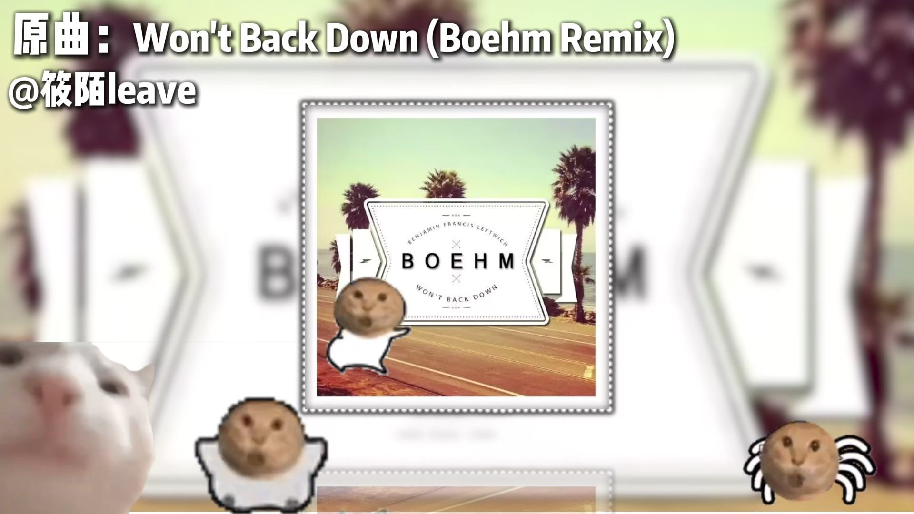 | 992 | 2026-01-15 |
| [异端哈基米](https://www.bilibili.com/video/BV1Y1kABqEyu) |  | 295 | 2026-01-15 |
| [哈基米启动系统自毁程序](https://www.bilibili.com/video/BV1vrkABgEUS) |  | 263 | 2026-01-15 |
| [这三只怪能超融合什么？一回合超五只哈基米？](https://www.bilibili.com/video/BV18RkABhEup) | 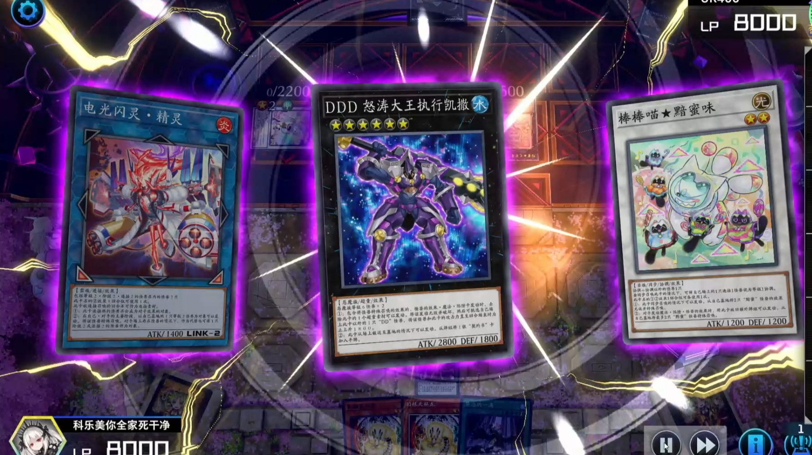 | 2708 | 2026-01-15 |
| [哈基米回家开自动生物实验室会出些什么好东西呢](https://www.bilibili.com/video/BV1ivkcBiEGB) |  | 811 | 2026-01-15 |
| [哈基米已经入侵英语试卷了](https://www.bilibili.com/video/BV1u8kwBfEgp) |  | 1 | 2026-01-15 |
| [挂机の哈基米](https://www.bilibili.com/video/BV1jjkwBBEAA) |  | 73 | 2026-01-15 |
| [【无畏契约】放课后听着哈基米打游戏就是惬意](https://www.bilibili.com/video/BV1VpkwBeE4U) |  | 132 | 2026-01-15 |
| [简中ptcg15.0哈基米（伦琴猫ex）比雕控卡组介绍](https://www.bilibili.com/video/BV1E9kwBVE5j) |  | 97 | 2026-01-15 |
| [如何评价，在牢a回国后，知乎单方面宣布胜利了？](https://www.bilibili.com/video/BV17RkwBkEWn) |  | 3213 | 2026-01-15 |
| [第5人格哈基米教学（已分段可以直接拉条）](https://www.bilibili.com/video/BV1RckABqEyG) |  | 146 | 2026-01-15 |
| [😿基米不想走…😿](https://www.bilibili.com/video/BV1s9rfB1EeT) |  | 7178 | 2026-01-15 |
| [【MD】哈基米场子确实硬喔 ｜ 后手宝骑实战对局 ｜ 卡组分享 ｜](https://www.bilibili.com/video/BV1xDrfBmEbq) |  | 757 | 2026-01-15 |
| [哈基米南北绿豆！](https://www.bilibili.com/video/BV1gxkFB9EQr) |  | 7 | 2026-01-15 |
| [猫meme节奏大挑战](https://www.bilibili.com/video/BV1L7kFBFE3U) |  | 44.2万 | 2026-01-15 |
| [哈基米：Love Pills【原曲不使用/pv不会做/完整不想发/留着自己溜版本】](https://www.bilibili.com/video/BV1RdkFBAEQ4) |  | 1731 | 2026-01-15 |
| [哈基米：末世星史莱姆第二阶段](https://www.bilibili.com/video/BV1wCkFBGEYA) |  | 3130 | 2026-01-15 |
| [哈基米南北绿豆](https://www.bilibili.com/video/BV12LkcBJEKg) |  | 100 | 2026-01-15 |
| [♠哈基米赛飞儿♠](https://www.bilibili.com/video/BV14LkcBnE2d) |  | 162 | 2026-01-15 |
| [哈基米版的醒狮灯笼太好玩啦](https://www.bilibili.com/video/BV16skcBVEDz) | 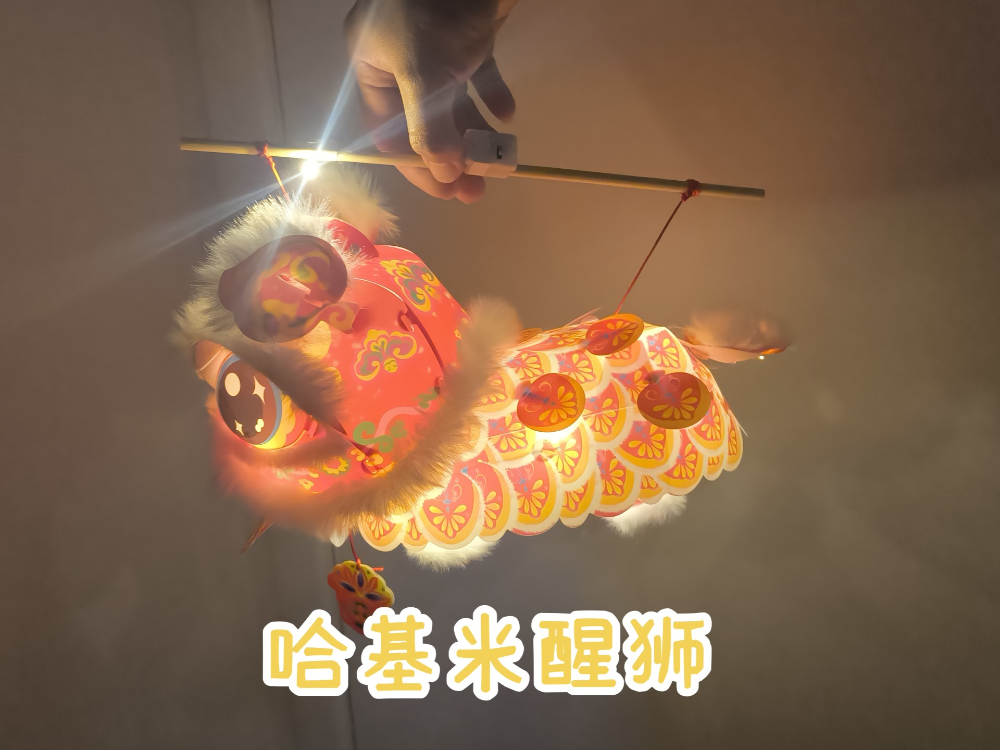 | 1004 | 2026-01-15 |
| [大数据找对象，啊啊啊啊啊啊啊啊](https://www.bilibili.com/video/BV1DTkcBREvS) |  | 2707 | 2026-01-15 |
| [【哈基米音乐】社会摇](https://www.bilibili.com/video/BV12GkcBHEtX) |  | 1558 | 2026-01-15 |
| [基米TV之报恩16分钟剧场版，一次看个够！](https://www.bilibili.com/video/BV1xtrZByEDU) |  | 2.0万 | 2026-01-15 |
| [开局全场手牌替换为桃酒？抽象武将哈基米袁术，临终前就想喝一口蜜水，三国杀移动版手杀袁术联动技能](https://www.bilibili.com/video/BV1MtrZByEGX) |  | 4.5万 | 2026-01-15 |
| [鸡笼里来了两只哈基咪](https://www.bilibili.com/video/BV1eLrZBXEuD) |  | 1.8万 | 2026-01-15 |
| [[哈基米]deltarune:The legend](https://www.bilibili.com/video/BV1yirZBuE8e) |  | 779 | 2026-01-15 |
| [恐怖哈基米地图游玩](https://www.bilibili.com/video/BV1KGrfByErc) |  | 22 | 2026-01-15 |
| [恐 怖 哈 基 米【YUTANG】](https://www.bilibili.com/video/BV1zWrfBKEDY) |  | 8198 | 2026-01-15 |
| [游戏王：大家都在玩什么？哈基米！大声一点！！哈基米！！！](https://www.bilibili.com/video/BV1DrrfB9EXX) |  | 1469 | 2026-01-15 |
| [盒装基米9.9一份](https://www.bilibili.com/video/BV1verfBbEjw) | 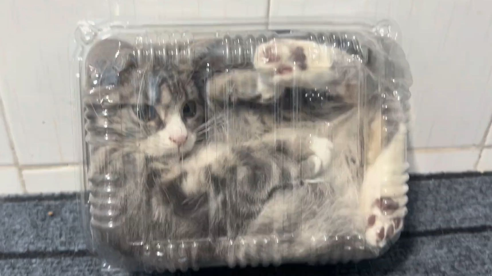 | 12.9万 | 2026-01-15 |
| [猫儿这个狩猎](https://www.bilibili.com/video/BV1dYrfBFEJd) | 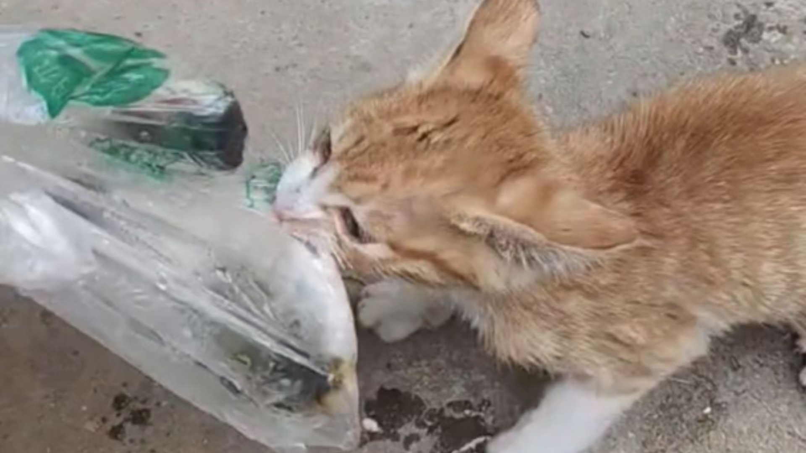 | 7630 | 2026-01-15 |
| [哈基米咋还舞起来了](https://www.bilibili.com/video/BV1R2rdBXEXD) | 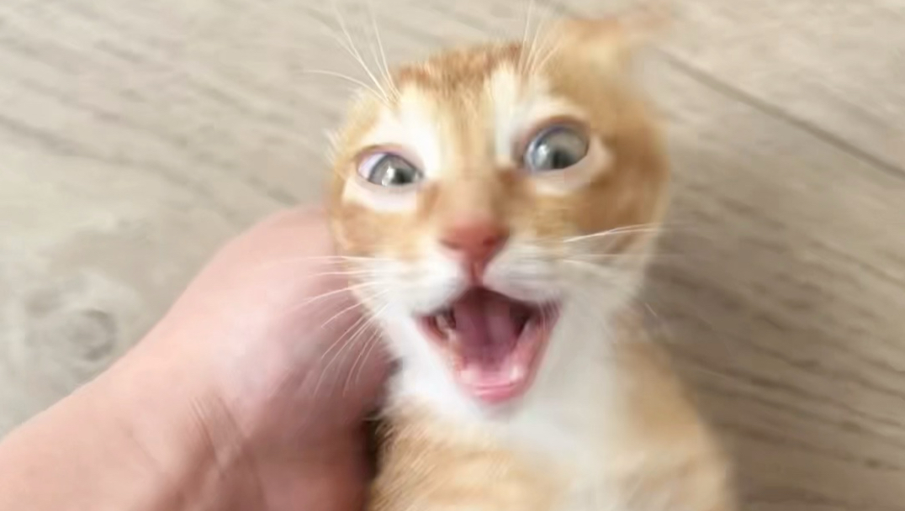 | 1.7万 | 2026-01-15 |
| [哈基米？浮力基（鸡）！](https://www.bilibili.com/video/BV1ZCrdBREk8) | 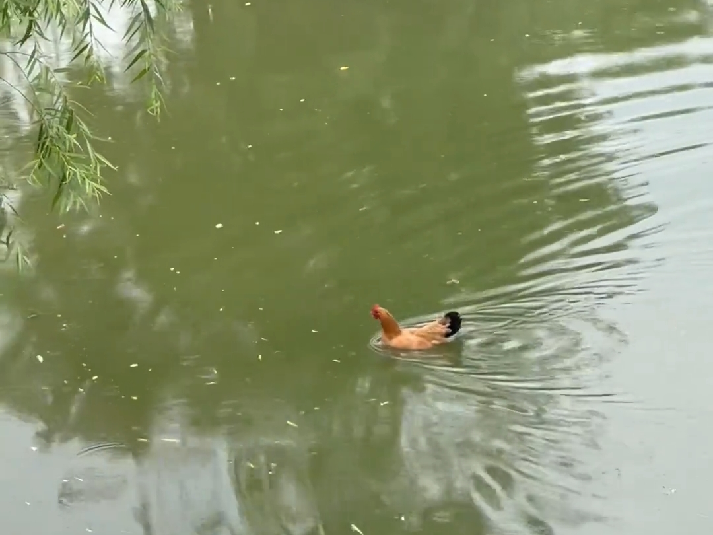 | 38 | 2026-01-15 |
| [可恶的哈基米](https://www.bilibili.com/video/BV1CVroBNE9j) |  | 95 | 2026-01-15 |
| [虽然抽了还没时间学习，但是哈基米应该。。。是这么玩的吧？【游戏王MD黯蜜】](https://www.bilibili.com/video/BV1C5roBeEmd) | 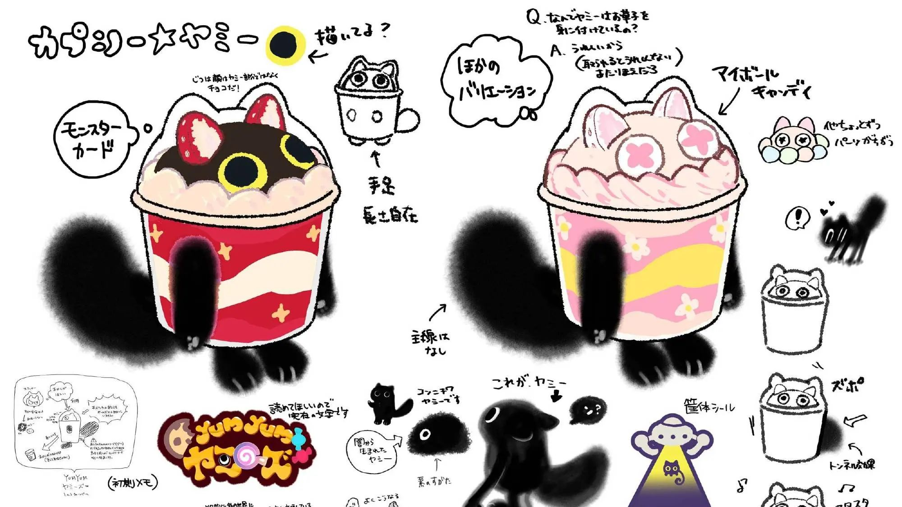 | 687 | 2026-01-15 |
| [哈基米南北绿豆（抽象）](https://www.bilibili.com/video/BV1eeroBDEsy) |  | 89 | 2026-01-15 |
| [FC25 2025-01-06  哈基米  打得游刃有余](https://www.bilibili.com/video/BV1SCroByE7z) | 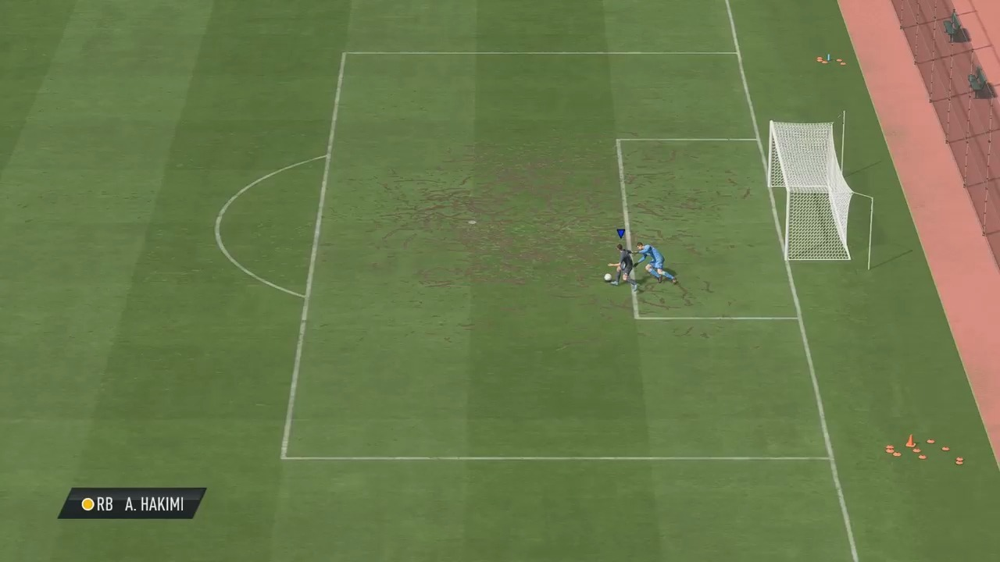 | 92 | 2026-01-15 |
| [哈基米这个合并同类项](https://www.bilibili.com/video/BV1i4roBxESk) | 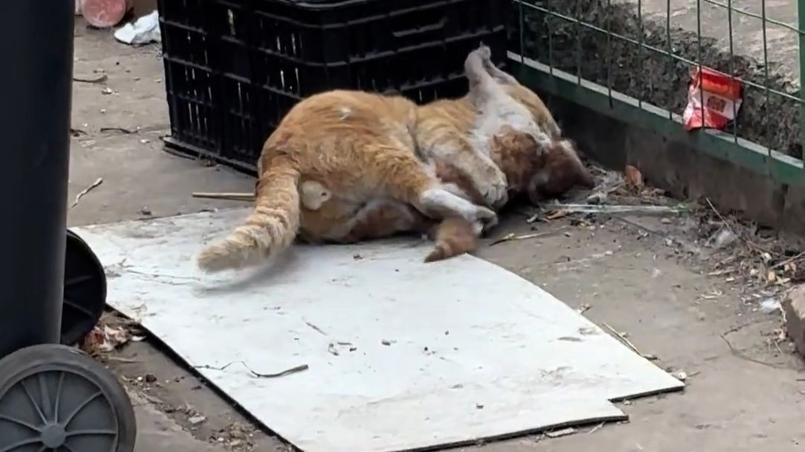 | 8.1万 | 2026-01-15 |
| [一群哈基米钻进车子里差点让车子报废](https://www.bilibili.com/video/BV1eYroBHECt) |  | 1467 | 2026-01-15 |
| [[哈基米音乐]路多人贱](https://www.bilibili.com/video/BV1jMrZBtEbq) |  | 1505 | 2026-01-15 |
| [哈基米：套耄杆](https://www.bilibili.com/video/BV1sQroBuEFz) |  | 307 | 2026-01-15 |
| [哈基米爱玩门](https://www.bilibili.com/video/BV167rRB9EnE) |  | 5839 | 2026-01-15 |
| [基米睡着了](https://www.bilibili.com/video/BV1SRr9BzECM) | 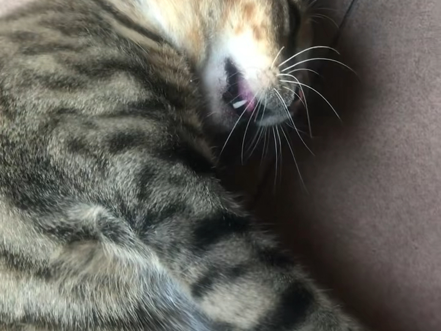 | 1.3万 | 2026-01-15 |
| [哈基米在说什么呢](https://www.bilibili.com/video/BV1HdrRBZEFn) |  | 1.5万 | 2026-01-14 |
| [泡的哈基米南北绿豆太难喝了](https://www.bilibili.com/video/BV1qPrdBpEDX) |  | 467 | 2026-01-14 |
| [哈基米回家开蛇隐镇会出些什么好东西呢](https://www.bilibili.com/video/BV1gjrdB5Esv) | 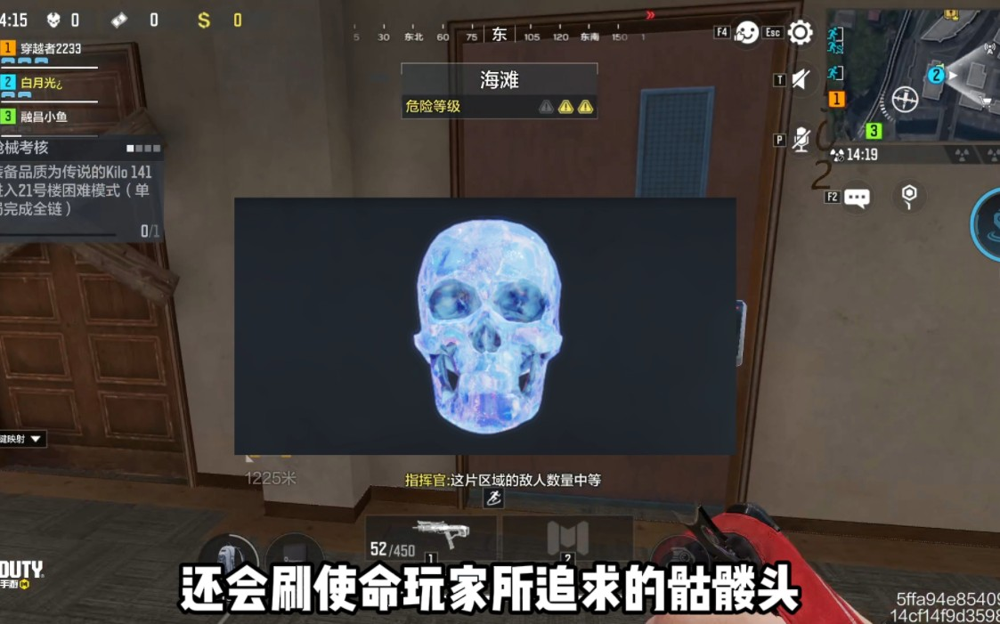 | 9975 | 2026-01-14 |
| [【二游哈基米】冷知识，不是所有名词都是老米发明的](https://www.bilibili.com/video/BV1KbrxB9EoX) |  | 20.5万 | 2026-01-14 |
| [『游戏王』爱猫人士慎入，䨋猫专区，钻二发牌员最克制哈基米的一集（白银城，刻魔尤贝尔）](https://www.bilibili.com/video/BV19drxBNEfA) |  | 2648 | 2026-01-14 |
| [哈基米喔那没路多](https://www.bilibili.com/video/BV1hNr4BFEAA) |  | 60 | 2026-01-14 |
| [哈基米操作热血混剪](https://www.bilibili.com/video/BV1AirWB3Erk) |  | 1231 | 2026-01-14 |
| [【哈基米大科研】第三弹：超重哈基米・雷龙构筑，1卡超雷龙+7阻抗](https://www.bilibili.com/video/BV1MKrsBDEZF) |  | 1617 | 2026-01-14 |
| [绿蛙友跨之翻车笑传（](https://www.bilibili.com/video/BV1aqrsBbE9D) | 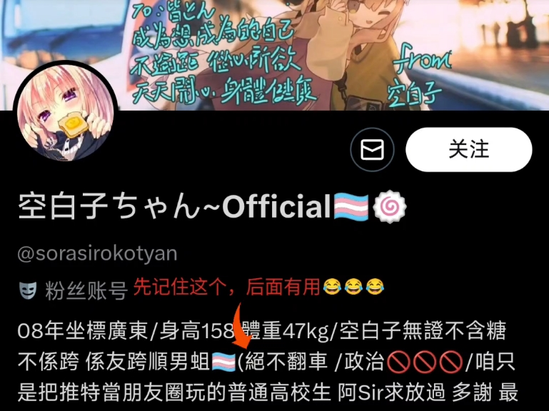 | 8953 | 2026-01-14 |
| [哈基米：🐱哥伦比娅🐱](https://www.bilibili.com/video/BV1kErsBrEvQ) |  | 3605 | 2026-01-14 |
| [哈吉米南北绿豆](https://www.bilibili.com/video/BV1WorsB1EmL) |  | 130 | 2026-01-14 |
| [喂流浪哈基米就是会收到福报呀😂](https://www.bilibili.com/video/BV1nArxBrEhx) | 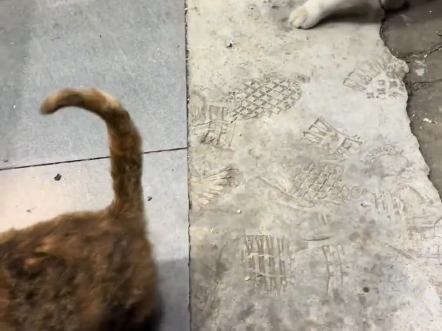 | 4412 | 2026-01-14 |
| [特摄厨的哈基米能区分的可不是萝卜和纸巾，还有假面骑士！](https://www.bilibili.com/video/BV1JwrxBGE1g) | 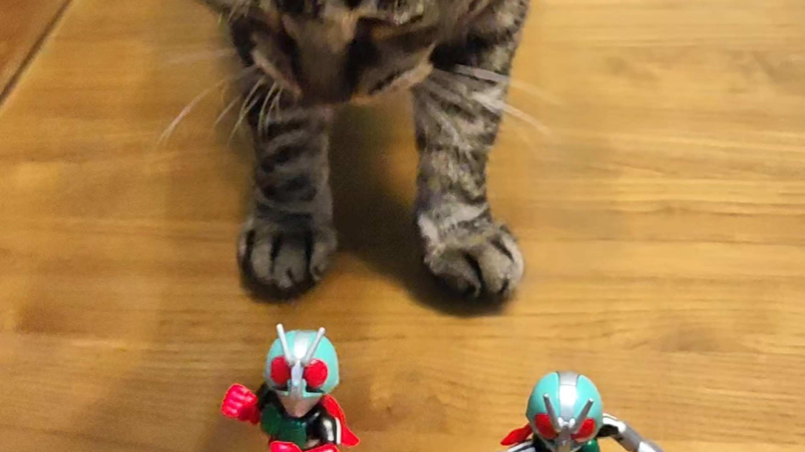 | 1911 | 2026-01-14 |
| [这就是哈基米打招呼的方式](https://www.bilibili.com/video/BV18yrsB9EW2) |  | 3901 | 2026-01-14 |
| [哈基米哟南北绿豆～](https://www.bilibili.com/video/BV1QrrsBdE8K) |  | 198 | 2026-01-14 |
| [哈基米这个狩猎（dy真的啊）](https://www.bilibili.com/video/BV1herpBXEBL) |  | 2178 | 2026-01-14 |
| [牢A紧急回国的始末](https://www.bilibili.com/video/BV18WrWBJENW) |  | 66.7万 | 2026-01-14 |
| [能忍住不上去嚼嚼嚼也是情绪稳定了](https://www.bilibili.com/video/BV17TrWBcENt) |  | 1873 | 2026-01-14 |
| [永远猜不到哈基米下一条代码是什么](https://www.bilibili.com/video/BV1kQrnBYEtB) |  | 2.2万 | 2026-01-14 |
| [叮咚基](https://www.bilibili.com/video/BV1HQrnBYEhX) | 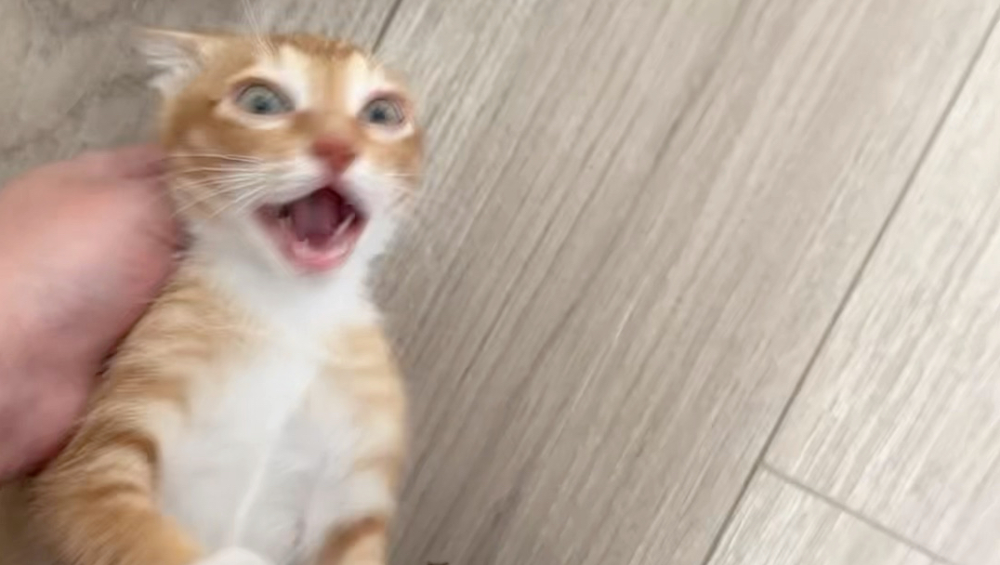 | 55.8万 | 2026-01-14 |
| [老大我是公的喵](https://www.bilibili.com/video/BV1iwrHBdEYt) | 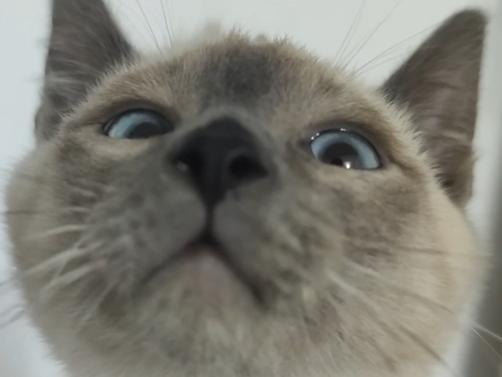 | 50.2万 | 2026-01-14 |
| [😧这到底是什么逆天弔图??  (⊙_⊙) #537](https://www.bilibili.com/video/BV133rHBSEe9) |  | 20.6万 | 2026-01-14 |
| [人 要死吗你？！](https://www.bilibili.com/video/BV1gGrJB3EiD) | 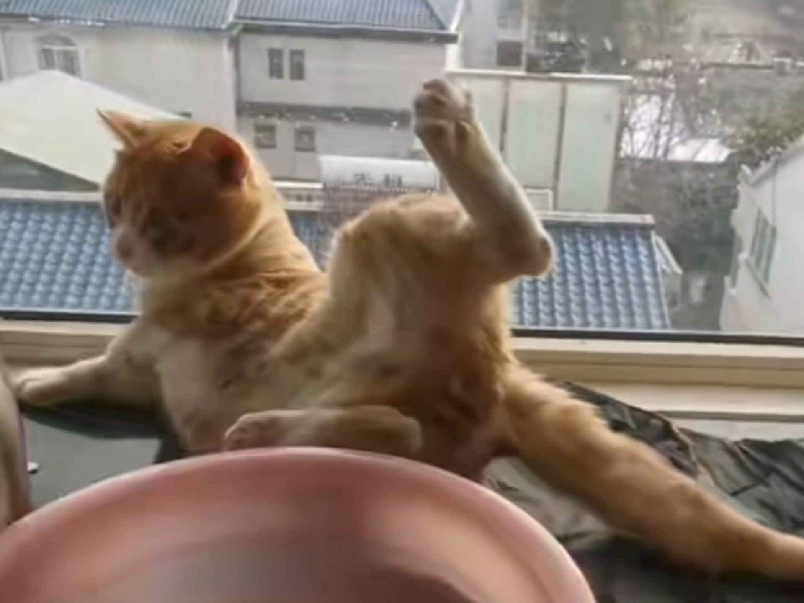 | 24.9万 | 2026-01-14 |
| [【12月】中国在海外十大最火的相关内容（事件）&amp;ep.2](https://www.bilibili.com/video/BV1aJr5BcELx) |  | 40.1万 | 2026-01-13 |
| [小小哈基米，哈气哈气](https://www.bilibili.com/video/BV1tLr6BfEx3) |  | 835 | 2026-01-13 |
| [把鹦鹉与哈基米放在一起会发生什么](https://www.bilibili.com/video/BV1x7r6BtEwg) |  | 1979 | 2026-01-13 |
| [哈基米音乐：哈阔天空](https://www.bilibili.com/video/BV1mVr6BcE2u) |  | 5758 | 2026-01-13 |
| [基米这个打桩机](https://www.bilibili.com/video/BV14CraBBEVt) |  | 1617 | 2026-01-12 |
| [“猫meme节奏大挑战”](https://www.bilibili.com/video/BV1QVrhBgEPN) |  | 2.0万 | 2026-01-12 |
| [小猫咪，hh](https://www.bilibili.com/video/BV1jH6ZBREbK) |  | 12.3万 | 2026-01-11 |
| [癫狂的鸽子](https://www.bilibili.com/video/BV1bY62BmEib) | 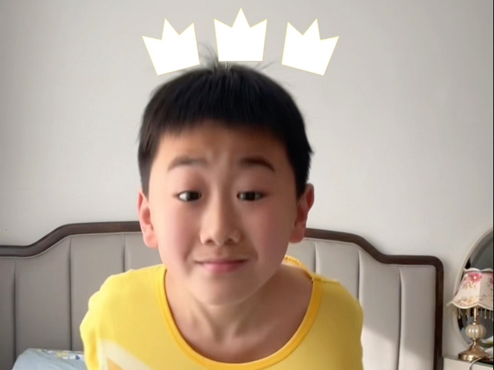 | 319.0万 | 2026-01-10 |
| [哈基米哦南北绿豆](https://www.bilibili.com/video/BV1tB62B5EgR) | 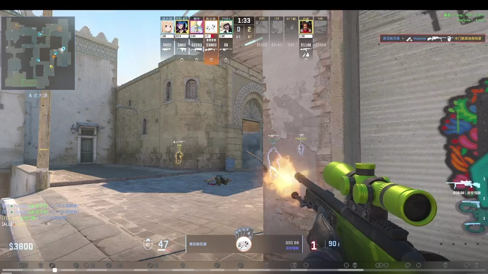 | 272 | 2026-01-10 |
| [哈基米这个智商啊](https://www.bilibili.com/video/BV1AKruBvEx8) |  | 2681 | 2026-01-09 |
| [“盘点2025下半年爆火的小曲，很多人听过却不知道歌名”](https://www.bilibili.com/video/BV1GkrKBVEBx) |  | 11.1万 | 2026-01-09 |
| [“比奇堡没有乌托邦...”](https://www.bilibili.com/video/BV18KrPBFEKQ) |  | 163.0万 | 2026-01-09 |
| [咕咕嘎vs古顾菇](https://www.bilibili.com/video/BV1d7rNB6EAP) |  | 123.7万 | 2026-01-09 |
| [[猫语音乐]喇叭花和它的老吴朋友们](https://www.bilibili.com/video/BV1QWrNBiEbt) |  | 2.8万 | 2026-01-09 |
| [一撸就哈的哈基米！](https://www.bilibili.com/video/BV1pui9BCEhv) | 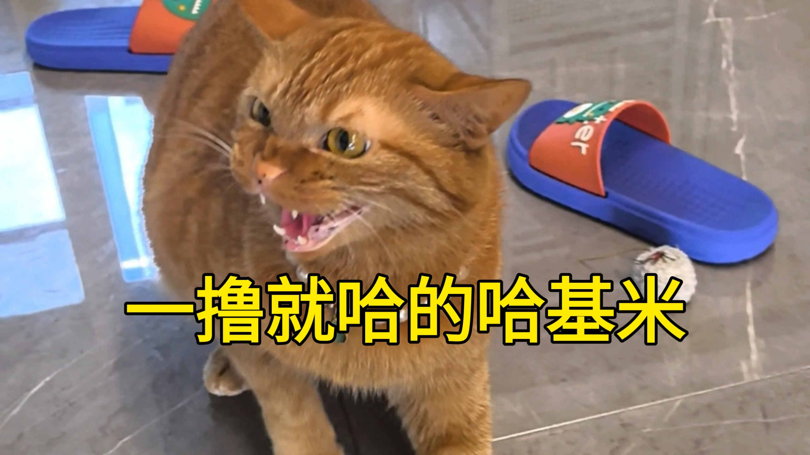 | 666 | 2026-01-08 |
| [循环歌单｜《丹尼尔の小曲》《低音炮の小曲》Simpa](https://www.bilibili.com/video/BV1AiisBaE5W) |  | 128.3万 | 2026-01-05 |
| [低音炮](https://www.bilibili.com/video/BV1BmiLBAENY) |  | 61.9万 | 2026-01-04 |
| [哈基米不会哈](https://www.bilibili.com/video/BV12Li8BnEhv) | 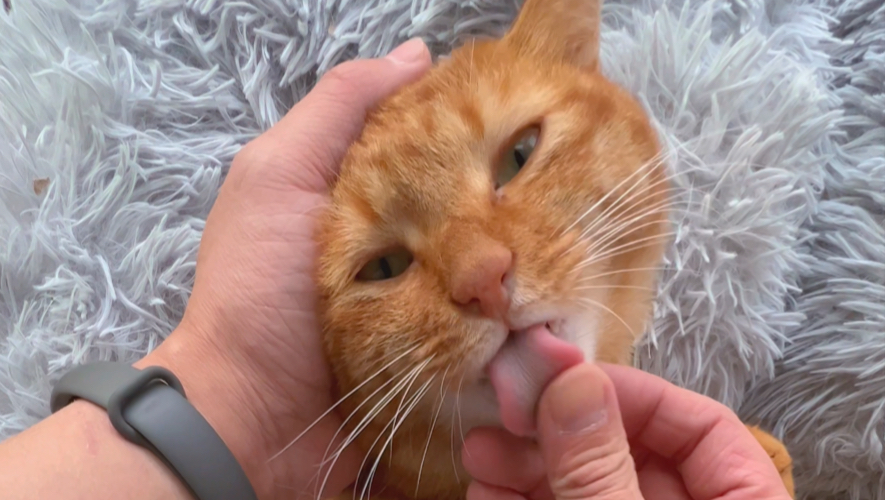 | 6.4万 | 2026-01-03 |
| [🍬『一 秒 六 棍』🍬](https://www.bilibili.com/video/BV11MicBYEbm) |  | 46.3万 | 2026-01-02 |
| [哈基米的终局之战](https://www.bilibili.com/video/BV12cvSBBEtB) |  | 1.3万 | 2026-01-01 |
| [哈基米](https://www.bilibili.com/video/BV19ZBrBMEoV) | 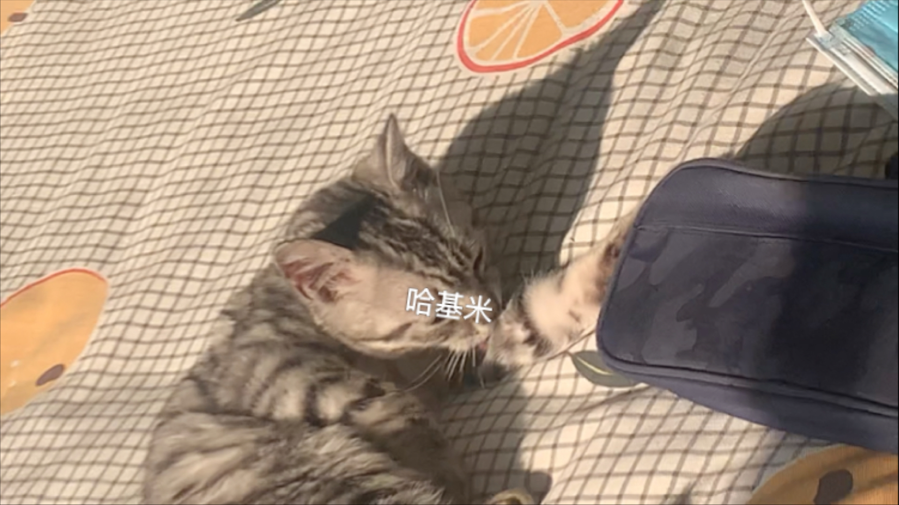 | 56 | 2025-12-27 |
| [【苺氷えな】个人精选，在哈基米苺氷还不是粉色的时候，就已经是机制怪了，非实写会限必有狠活的含金量[2023 03 26３月ファンボックス限定配信] 轻语｜口腔音](https://www.bilibili.com/video/BV1HGmqBdECs) |  | 2.0万 | 2025-12-14 |
| [真的会有人对哈基米产生欲望吗？](https://www.bilibili.com/video/BV1CF24BcEvz) |  | 5.5万 | 2025-12-03 |
| [救猫和救狗对比实验二代目](https://www.bilibili.com/video/BV1iRYSzvEXj) | 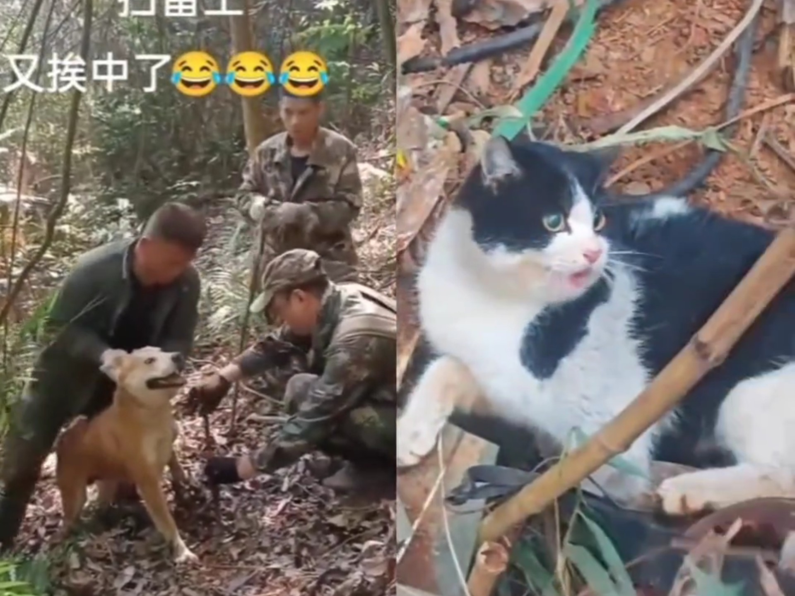 | 50.3万 | 2025-08-21 |
| [哈基米踩奶](https://www.bilibili.com/video/BV1qd8yzmEGv) | 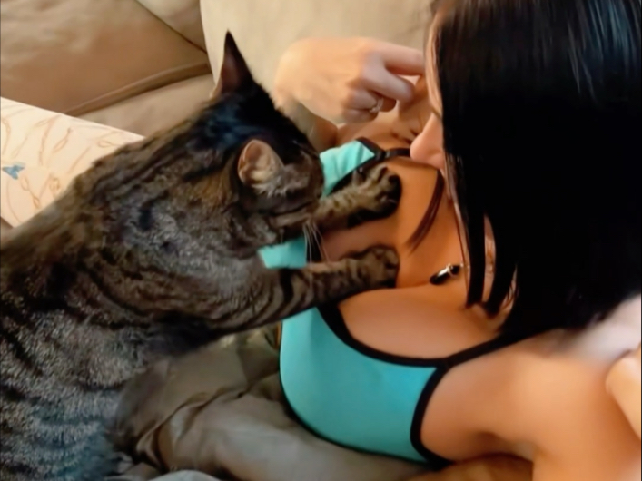 | 6363 | 2025-07-31 |
| [【爱猫TV】逗❤️猫❤️棒](https://www.bilibili.com/video/BV1jBbDzhEvT) |  | 5.8万 | 2025-07-25 |
| [猫被卷帘门夹头过程，主人发现时嚎啕大哭！](https://www.bilibili.com/video/BV1GF3qzME6d) | 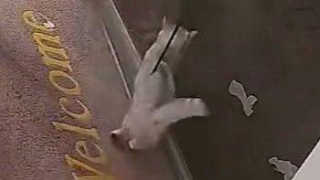 | 12.6万 | 2025-07-06 |
| [【板绘过程】哈基米不想给人签名了&lt;:3](https://www.bilibili.com/video/BV1bK7hzhEF2) |  | 1.1万 | 2025-06-03 |
| [《 恐 怖 耄 耋 》](https://www.bilibili.com/video/BV15XJbzuEqH) | 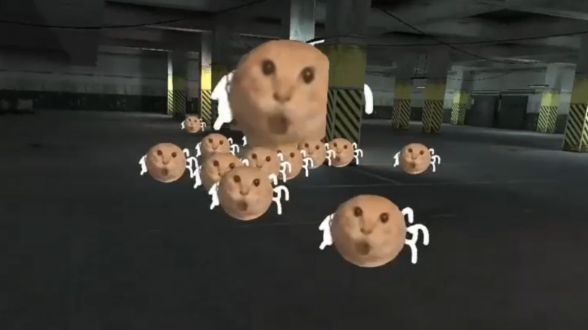 | 63.2万 | 2025-05-20 |
| [棍棒底下出好猫](https://www.bilibili.com/video/BV1piq3YBEYz) | 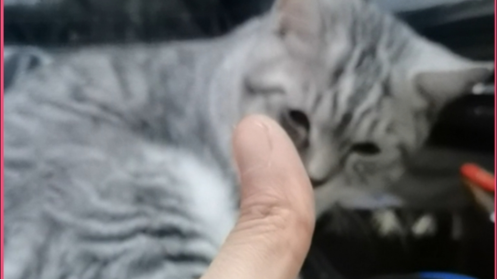 | 6.0万 | 2024-12-10 |
| [⚡电击⚡哈基米](https://www.bilibili.com/video/BV1aUidY5EZC) |  | 71.4万 | 2024-12-05 |
| [b 站 虐 猫 人](https://www.bilibili.com/video/BV175411t7Qf) | 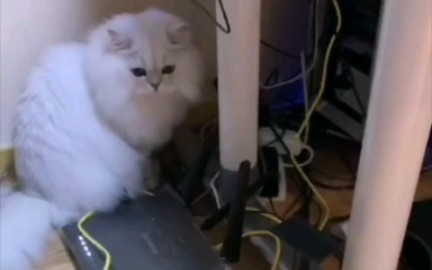 | 2.6万 | 2020-04-13 |

---
*最后更新: 2026-01-16 02:50:50 (自动生成)*
*数据来源: [Bilibili](https://www.bilibili.com)*

## 使用说明

运行以下命令更新视频列表:
```bash
python3 fetch_hajimi_videos.py
```
