# awesome-hajimi
collections of hajimi (哈基米 in Chinese) on the Internet.

## 视频列表 (Video List)

| 视频标题 (Title) | 封面 | 播放量 (Views) | 发布日期 (Date) |
|---|---|---|---|
| [🐱哈基米：千本樱🐱](https://www.bilibili.com/video/BV1mezfBrEhy) |  | 1047 | 2026-01-29 |
| [哈基米vs武松](https://www.bilibili.com/video/BV1b1zdBqETt) |  | 784 | 2026-01-29 |
| [恶霸大橘63](https://www.bilibili.com/video/BV1QVzRBzE2k) | 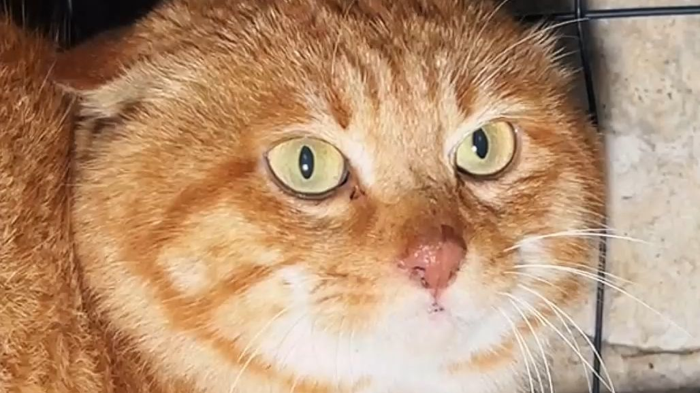 | 1.7万 | 2026-01-28 |
| [哈基米日记之《小日记与小紫色袜子》](https://www.bilibili.com/video/BV1ZrzXBkEtD) |  | 225 | 2026-01-28 |
| [哈基米这个死斗](https://www.bilibili.com/video/BV1Z6zXBVEhz) | 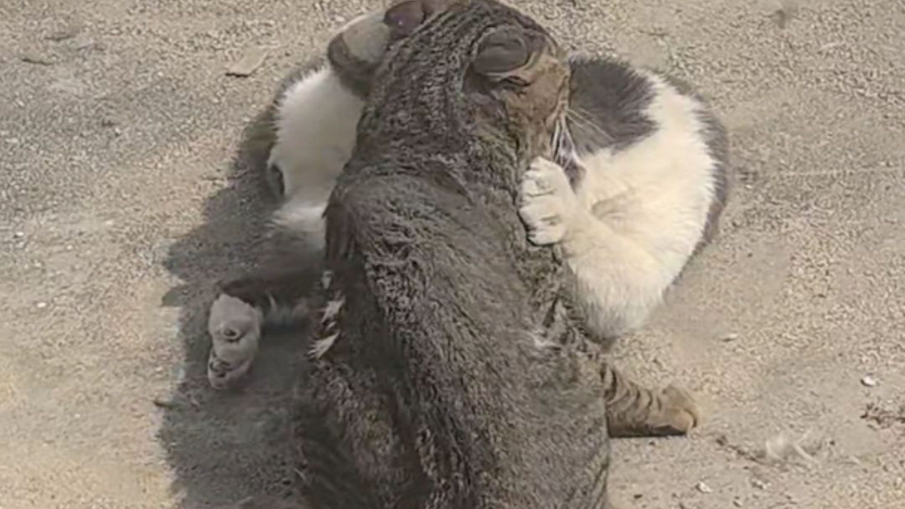 | 7861 | 2026-01-28 |
| [哈基米](https://www.bilibili.com/video/BV1pgz9BXETF) |  | 24 | 2026-01-28 |
| [[哈基米康塔塔]巴哈-《马儿可以安静地吃草》（原曲）巴赫BWV208《羊儿可以安静地吃草》](https://www.bilibili.com/video/BV1xPz9BoE6y) |  | 587 | 2026-01-28 |
| [草莓大福哈基米](https://www.bilibili.com/video/BV18Bz9BeEDj) |  | 1643 | 2026-01-28 |
| [大爷给哈基米吃拖鞋](https://www.bilibili.com/video/BV1uBz9BeEmY) | 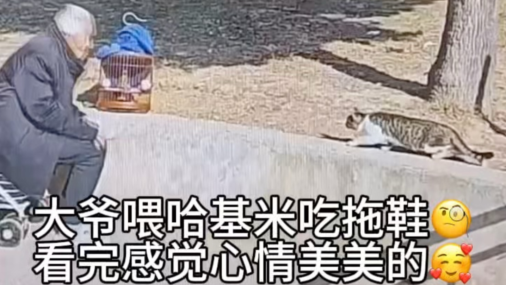 | 7193 | 2026-01-28 |
| [哈基米-04](https://www.bilibili.com/video/BV13vz9BiE1B) |  | 29 | 2026-01-28 |
| [哈基米觉得新来的玩伴太粘人了](https://www.bilibili.com/video/BV17Hz9BLETX) | 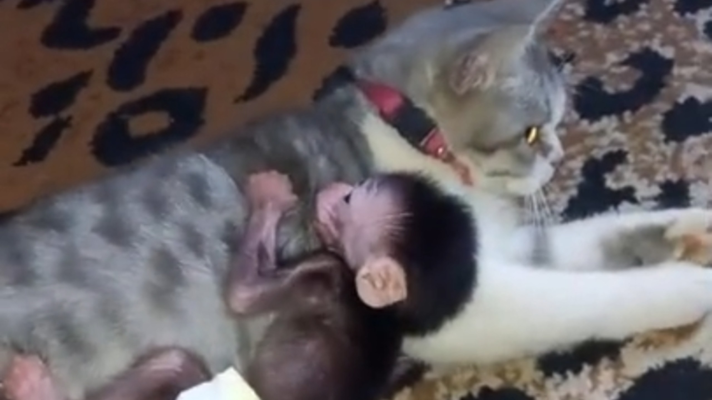 | 799 | 2026-01-28 |
| [哈基人逗哈基米](https://www.bilibili.com/video/BV1Qf67BTEKe) | 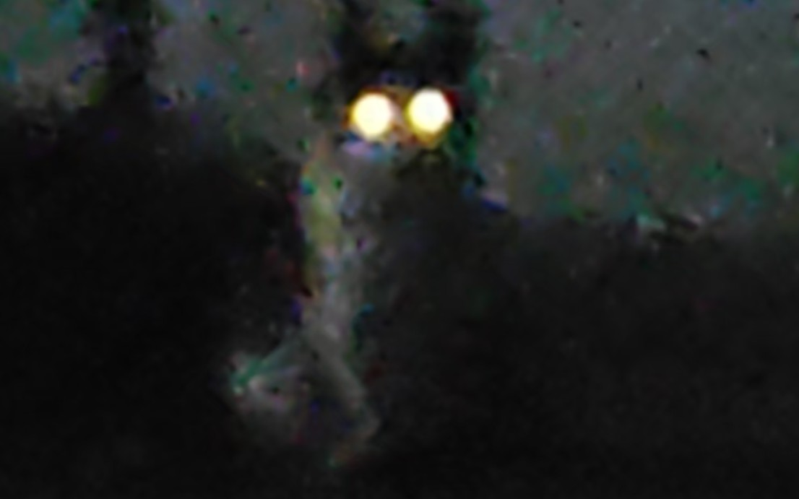 | 307 | 2026-01-28 |
| [也许是b站第一个唱哈基米jpop的人类（2）](https://www.bilibili.com/video/BV1Sw6EBNE1m) | 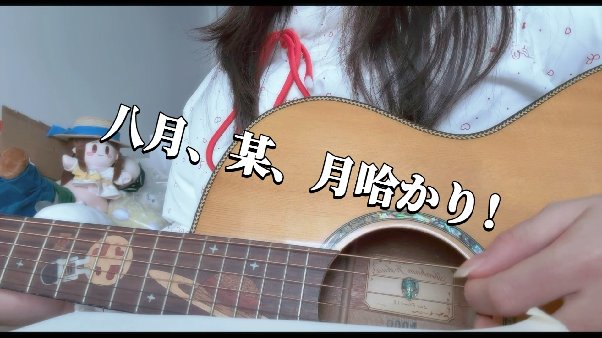 | 604 | 2026-01-28 |
| [【甜美翻唱】😿基米不想走…😿](https://www.bilibili.com/video/BV1Fr67BSEcS) |  | 1120 | 2026-01-28 |
| [哈基米音乐App 基米天堂 v1.1.0 版本更新来啦](https://www.bilibili.com/video/BV1om67ByEz6) |  | 933 | 2026-01-28 |
| [安抚了很久的三花猫，终于情绪稳定了](https://www.bilibili.com/video/BV1Hj6EBdERY) | 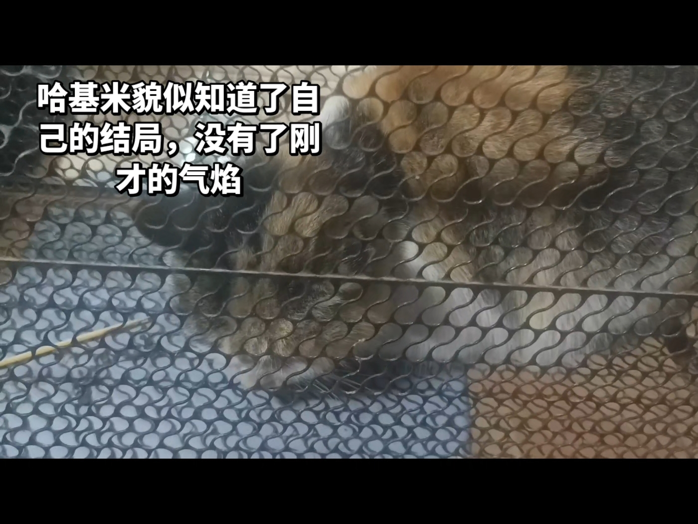 | 1592 | 2026-01-28 |
| [🐱哈基米：轻哈少女🐱](https://www.bilibili.com/video/BV16p6EBDEXY) |  | 2.3万 | 2026-01-28 |
| [哈密瓜 哈基米](https://www.bilibili.com/video/BV1TM6EBwESH) |  | 22 | 2026-01-28 |
| [曼波波波](https://www.bilibili.com/video/BV1Tu6EBhEuo) |  | 173 | 2026-01-28 |
| [六只小猫用生命换来了一屋子猫活下去的希望--宠物-猫咪-哈基米-爱猫人士](https://www.bilibili.com/video/BV1CL6EBxEBE) |  | 1216 | 2026-01-28 |
| [【基米TV】报恩这一块](https://www.bilibili.com/video/BV18C6EBME6s) | 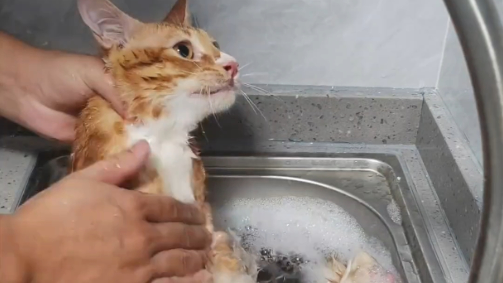 | 2.4万 | 2026-01-28 |
| [【哈基米音乐】寄生虫sans，但是哈基米是fresh灵感菇是寄生虫](https://www.bilibili.com/video/BV1a66EBgE64) |  | 1606 | 2026-01-28 |
| [【Arcaea不要笑挑战】古典哈基米 · 月光奏鸣曲第三乐章 [Master β] ！！！](https://www.bilibili.com/video/BV1Cc6GBrEd3) | 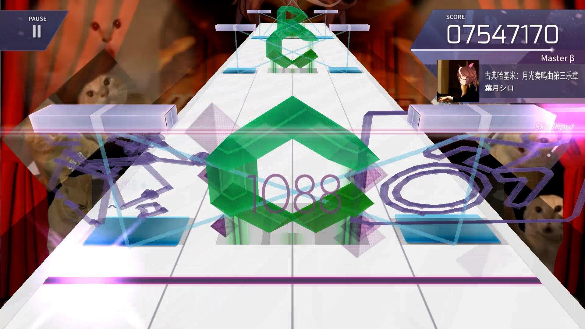 | 1051 | 2026-01-28 |
| [哈基米很喜欢人类的摸摸头](https://www.bilibili.com/video/BV1Vj6JByEeo) | 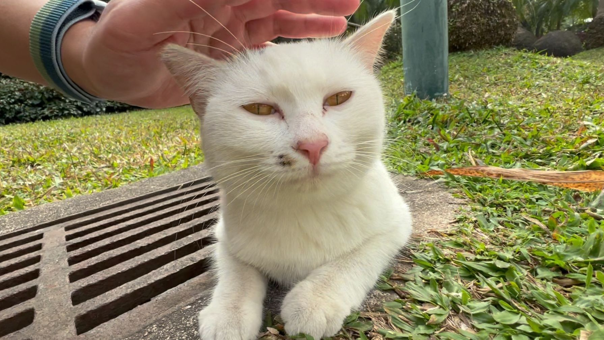 | 808 | 2026-01-28 |
| [为什么进去就哈气，出来就变乖了](https://www.bilibili.com/video/BV1p66MBbECD) | 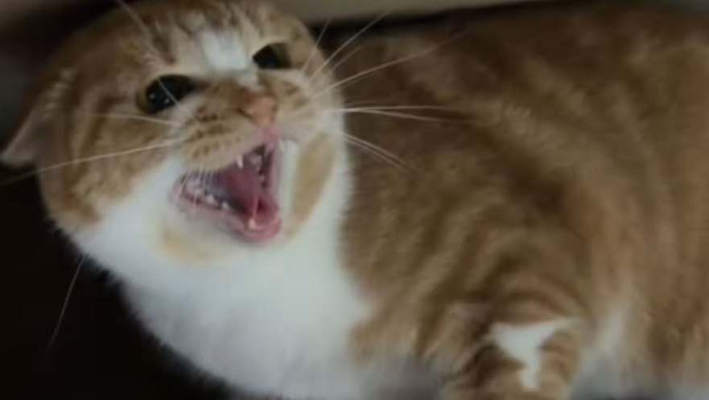 | 3.5万 | 2026-01-28 |
| [哈基米曼波～](https://www.bilibili.com/video/BV1M26jBtEN9) |  | 812 | 2026-01-28 |
| [哈基米之歌（哼不了半点），笑死了，洗完澡终于是个人了……](https://www.bilibili.com/video/BV1LM67BGE76) | 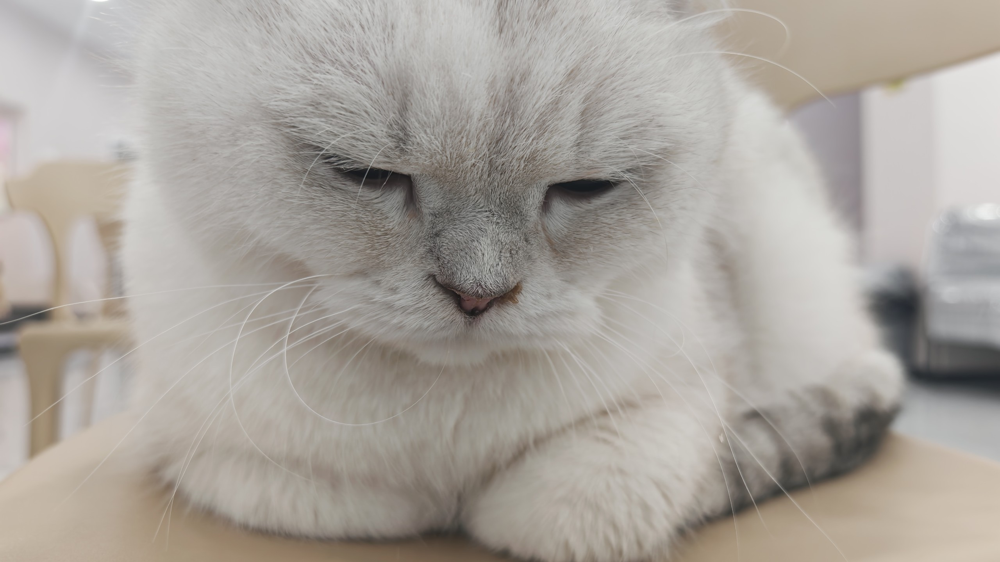 | 167 | 2026-01-28 |
| [“拍照前，好可爱的哈基米，被扑倒后，他好凶啊，还咬人！！！”](https://www.bilibili.com/video/BV1NTzhB4Eyv) |  | 6594 | 2026-01-28 |
| [长大了才发现不是每个人家里都有这玩意](https://www.bilibili.com/video/BV1sD6jB9Edr) |  | 8.7万 | 2026-01-28 |
| [随手关爱空巢哈基米](https://www.bilibili.com/video/BV1cB67BQEZf) | 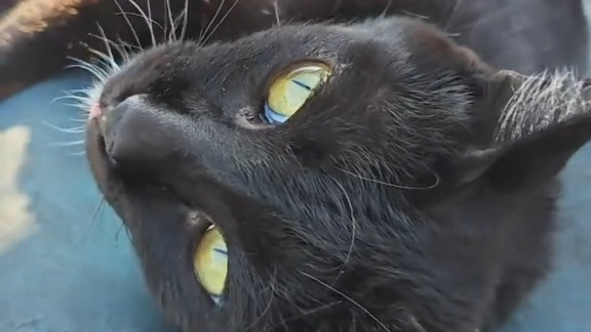 | 710 | 2026-01-28 |
| [这种哈吉米可以撸吗？](https://www.bilibili.com/video/BV1ZFzXB6Ej8) | 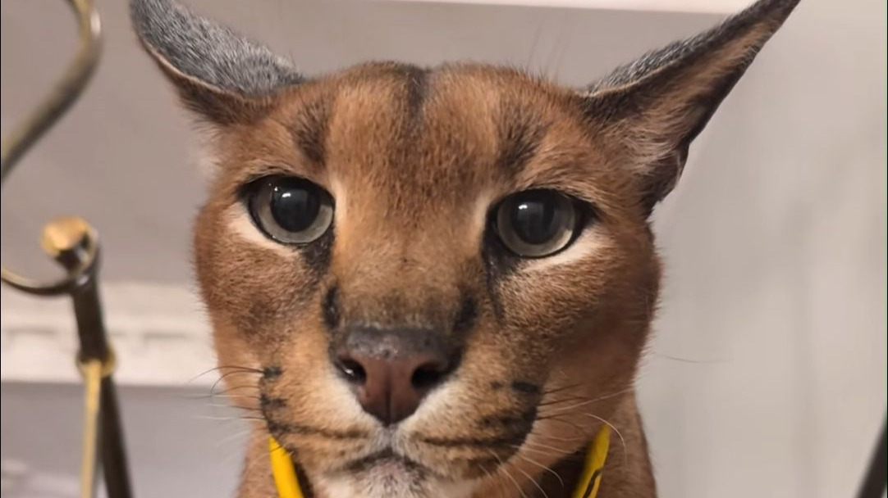 | 5641 | 2026-01-28 |
| [这么卷吗？哈基米都有“鲜肉泡芙”了～](https://www.bilibili.com/video/BV1cx63BiE75) | 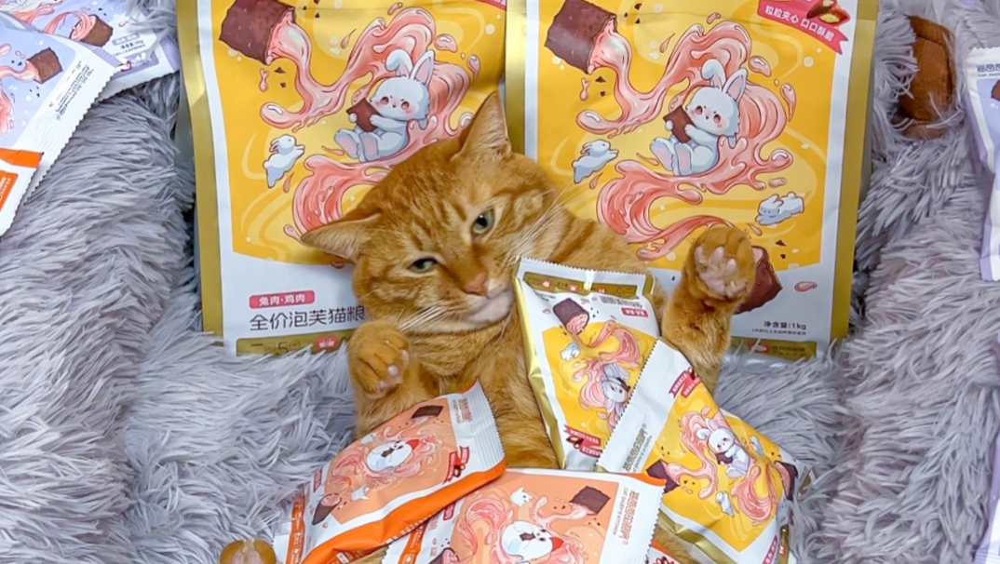 | 1.2万 | 2026-01-28 |
| [挤压2](https://www.bilibili.com/video/BV1Pe67BsEs1) | 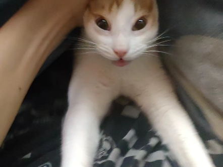 | 1.6万 | 2026-01-28 |
| [小猫被保安拍死了，让黑发人送白发猫，这下好了，这家三年不能贴对联](https://www.bilibili.com/video/BV13E67BvEuD) |  | 6.5万 | 2026-01-28 |
| [叮咚鸡：开往冬季(咚鸡)的地铁🥶](https://www.bilibili.com/video/BV1fa63BhEBC) |  | 1122 | 2026-01-28 |
| [菲比没有被威胁](https://www.bilibili.com/video/BV1xC65BDE3p) |  | 51.2万 | 2026-01-28 |
| [干尸发话了](https://www.bilibili.com/video/BV1pY6LB7E7i) |  | 857 | 2026-01-28 |
| [哈基米千世](https://www.bilibili.com/video/BV1Xm63BnE5x) |  | 783 | 2026-01-27 |
| [R&amp;B哈基米：麦恩基 (Full &amp; Clean Ver.)](https://www.bilibili.com/video/BV1ep6GB4E89) |  | 4064 | 2026-01-27 |
| [依旧泰曼波～](https://www.bilibili.com/video/BV1ba6GBnEDB) |  | 1877 | 2026-01-27 |
| [疯狂的青溟鸟](https://www.bilibili.com/video/BV1ie6uBpEjN) | 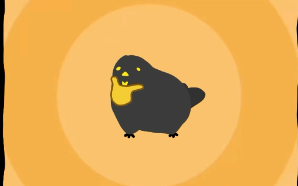 | 8.7万 | 2026-01-27 |
| [哈↗基↗米↗哦↗↗↗↗↗潮！爆！了！](https://www.bilibili.com/video/BV1Rv6uBDENF) |  | 10.3万 | 2026-01-27 |
| [圆神启动](https://www.bilibili.com/video/BV1Rq6uBJEHt) | 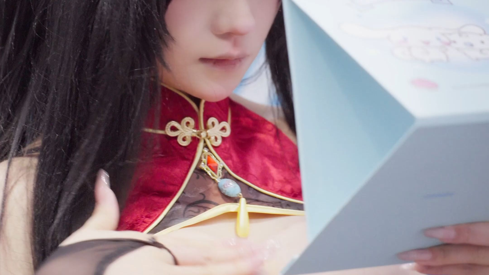 | 11.5万 | 2026-01-27 |
| [“没有前奏的歌就像强吻”【诗歌剧の小半】](https://www.bilibili.com/video/BV1jL6gBsEBF) |  | 3176 | 2026-01-27 |
| [哈基米表演一个飞天大呲花](https://www.bilibili.com/video/BV1vj6gBXEyH) |  | 2.6万 | 2026-01-27 |
| [哈基米在守卫自己捕猎的食物](https://www.bilibili.com/video/BV1dj6gBXEHP) | 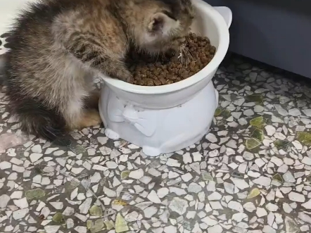 | 1113 | 2026-01-27 |
| [乱 动 隆](https://www.bilibili.com/video/BV1P5zvBMEoA) |  | 8712 | 2026-01-27 |
| [🔪疾猫追杀😾](https://www.bilibili.com/video/BV1ww6gBPEm1) | 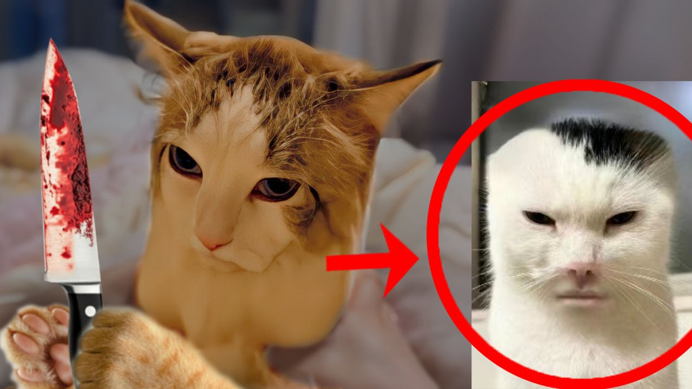 | 25.8万 | 2026-01-27 |
| [哈基米大冬天也要交配吗](https://www.bilibili.com/video/BV18h6gBVEN4) | 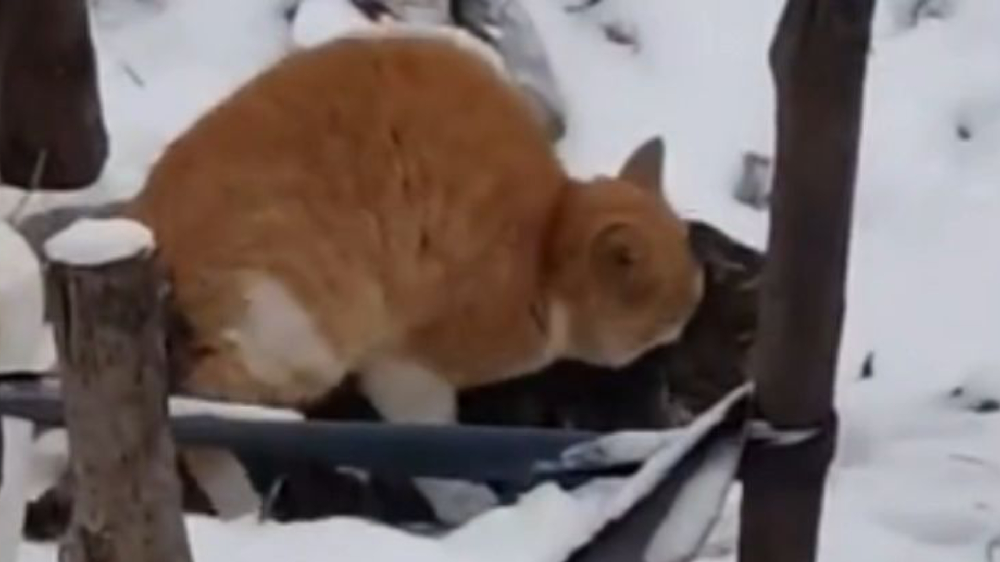 | 2930 | 2026-01-27 |
| [【神曼波】和【蓝莲哈】，谁才是权威哈基米？](https://www.bilibili.com/video/BV12a6gBkEZD) |  | 571 | 2026-01-27 |
| [锡纸，防猫猫上桌神器😂](https://www.bilibili.com/video/BV15Z6gBREvd) | 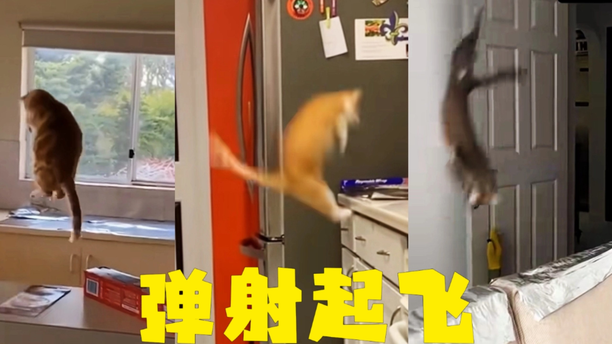 | 3.9万 | 2026-01-27 |
| [笑了十分钟才敢发出来](https://www.bilibili.com/video/BV18x6gB2EtQ) |  | 10.4万 | 2026-01-27 |
| [东南西北治蓝胖子](https://www.bilibili.com/video/BV1aK63BJELo) | 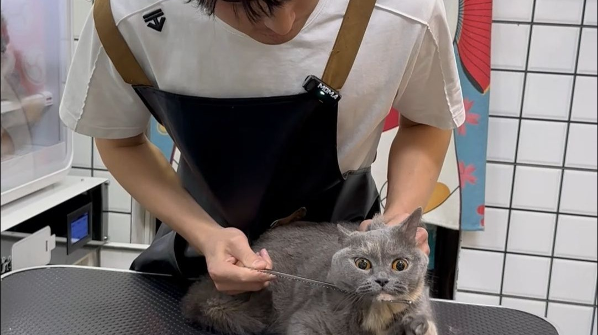 | 12.1万 | 2026-01-27 |
| [NEGA1.0.126](https://www.bilibili.com/video/BV1iGziBtEkr) |  | 26.6万 | 2026-01-27 |
| [哈基米Phonk：🐱忠诚 Loyalty🐱](https://www.bilibili.com/video/BV1NX6TBaEpG) |  | 1675 | 2026-01-27 |
| [胖宝宝，哈基米](https://www.bilibili.com/video/BV1ny6MBdEBi) | 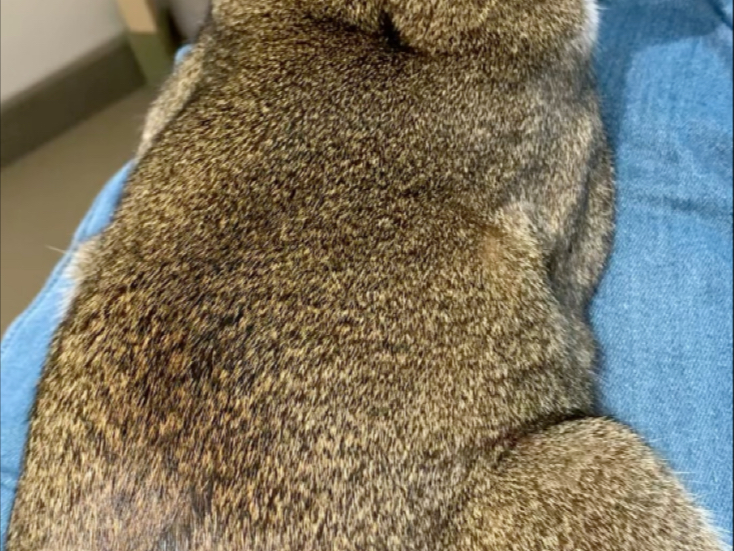 | 4923 | 2026-01-27 |
| [英文字幕版《川普不可以》Chinese Netizens Made a Viral Bop to Show Their Admiration for Trump](https://www.bilibili.com/video/BV1mh6MBvEzq) |  | 1556 | 2026-01-27 |
| [《鸡？？？》](https://www.bilibili.com/video/BV1ed6MBEEg3) | 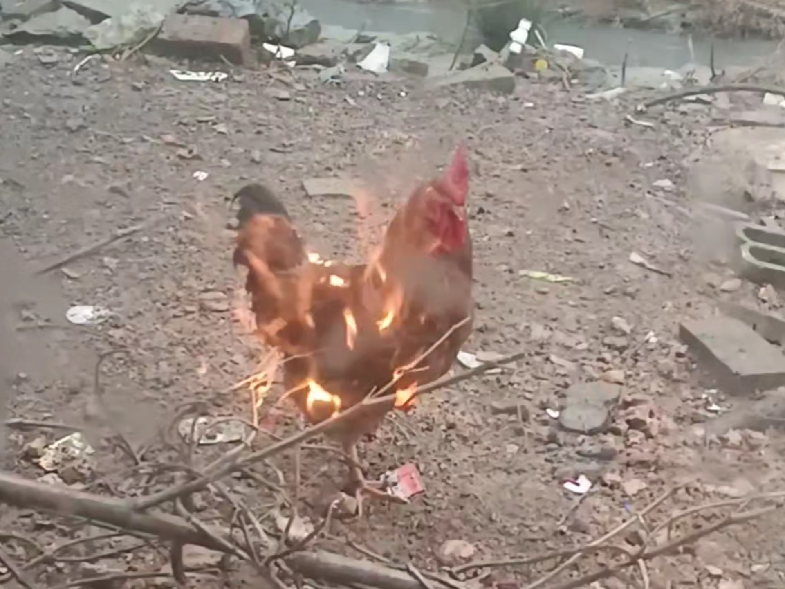 | 10.8万 | 2026-01-27 |
| [靠近一点点❤](https://www.bilibili.com/video/BV1eo6MBmEvp) |  | 158.6万 | 2026-01-27 |
| [也就网上说说了，现实谁不想养一只黑脸的骚福瑞](https://www.bilibili.com/video/BV1eo6MBmENj) | 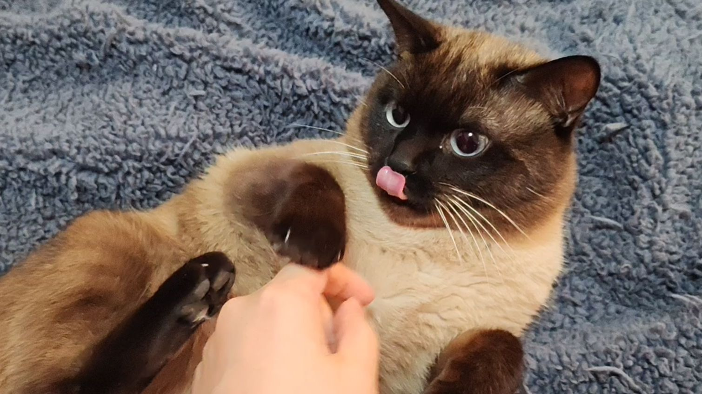 | 7.1万 | 2026-01-27 |
| [petite我好爱你～](https://www.bilibili.com/video/BV1FjzhBnEVj) |  | 23.1万 | 2026-01-27 |
| [我操 哈基米❤️](https://www.bilibili.com/video/BV1xL6uBvEzb) |  | 1112 | 2026-01-27 |
| [挤压1](https://www.bilibili.com/video/BV1KL6uBvEud) | 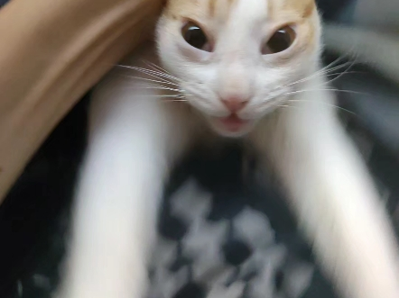 | 3.6万 | 2026-01-27 |
| [(中文字幕)哈基米钥匙扣，日本人在拼多多购买](https://www.bilibili.com/video/BV1KG6uBqEoE) |  | 34.2万 | 2026-01-27 |
| [哈基米背比山高 三哈聚顶恐怖如斯](https://www.bilibili.com/video/BV1186KBtEPa) | 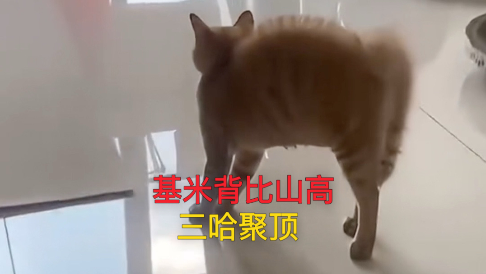 | 9773 | 2026-01-27 |
| [真正的哈基米南北绿豆来啦～](https://www.bilibili.com/video/BV186zYBkESV) | 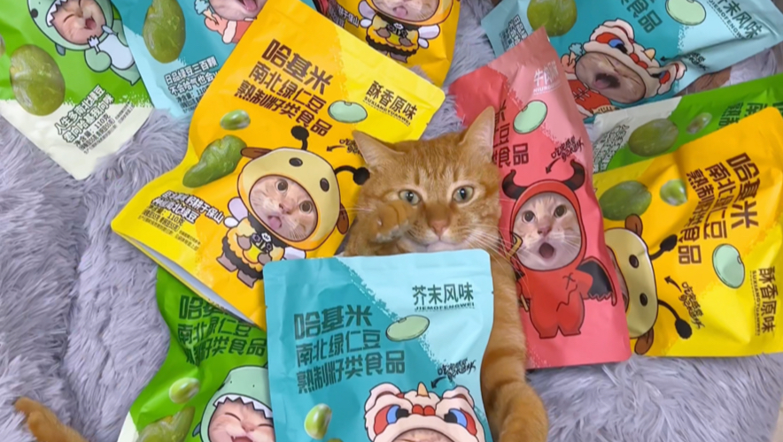 | 8.0万 | 2026-01-27 |
| [1小时循环《野狼disco拼好歌》如此动感的节拍！](https://www.bilibili.com/video/BV1JDzBBgEhx) |  | 5.2万 | 2026-01-26 |
| [领养进度马上100％了！为什么不坚持一下啊哈基米😭](https://www.bilibili.com/video/BV1SmzvByEps) | 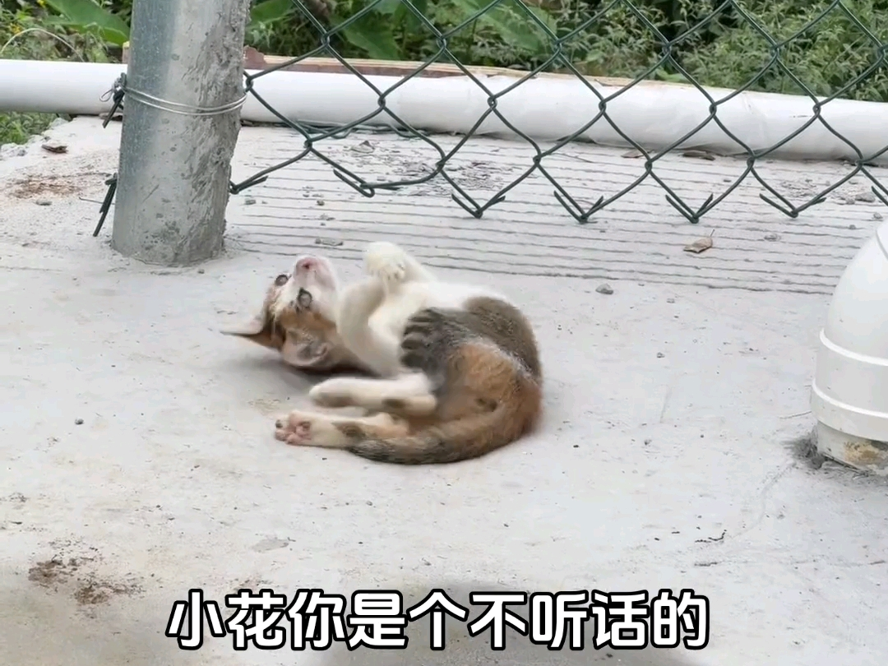 | 2.4万 | 2026-01-26 |
| [恶霸大橘62](https://www.bilibili.com/video/BV1xeziBVE7X) | 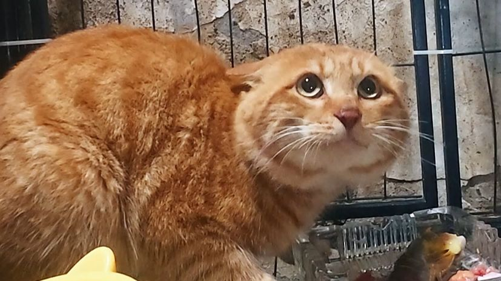 | 9.5万 | 2026-01-26 |
| [猫妈妈一直护食怎么解决？小猫都快吓傻了](https://www.bilibili.com/video/BV1hFzvBmEqm) | 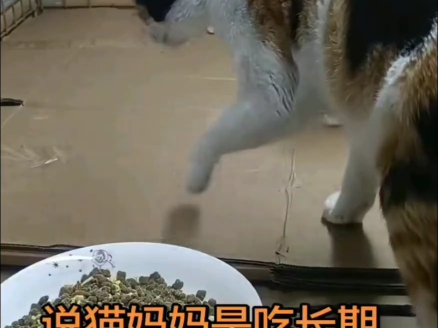 | 30.9万 | 2026-01-26 |
| [“能让我接受的猴子只有一个”](https://www.bilibili.com/video/BV16qzaBREzr) |  | 49.7万 | 2026-01-26 |
| [一镜到底花絮来了～（伸懒腰除外）](https://www.bilibili.com/video/BV1nqzaBREeb) |  | 177.4万 | 2026-01-26 |
| [哈基米偷鱼结果被鱼钩钩倒嘴了](https://www.bilibili.com/video/BV1wLzYBfE6C) | 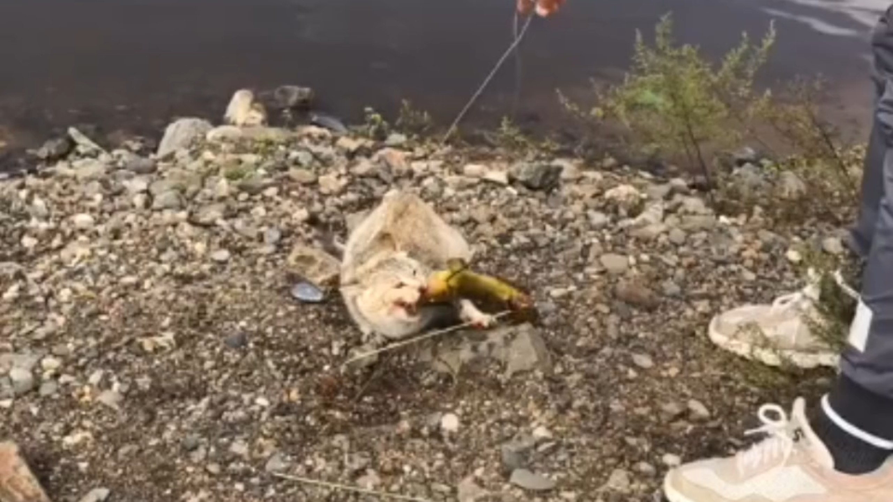 | 3760 | 2026-01-26 |
| [你害怕的只是音乐](https://www.bilibili.com/video/BV1TczhBhEs1) |  | 34.5万 | 2026-01-26 |
| [哈基米去冷库里偷鱼                              [bro有话说]30](https://www.bilibili.com/video/BV1uZz8BYE7Y) | 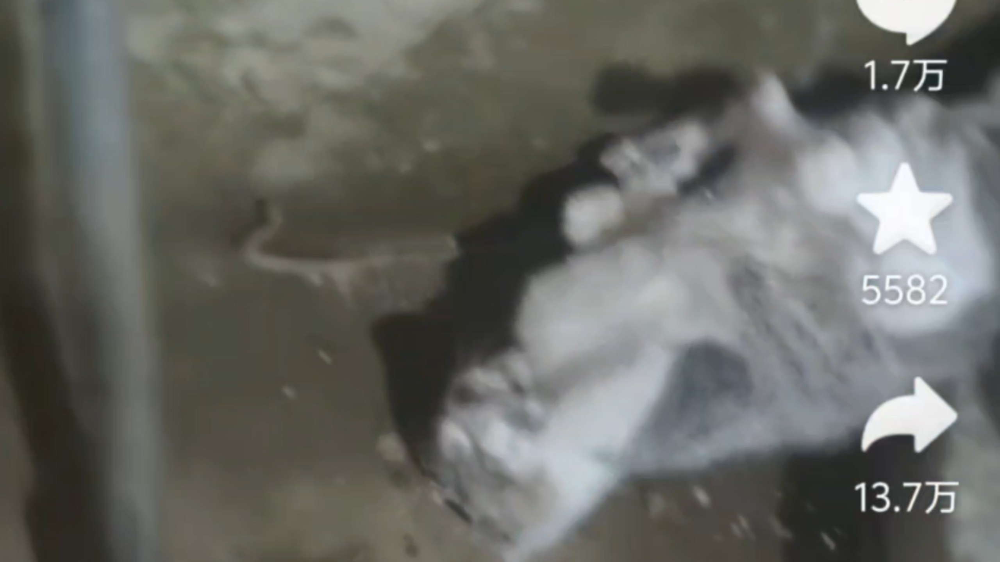 | 4700 | 2026-01-26 |
| [妈，我头发绑得有点紧](https://www.bilibili.com/video/BV1jkz8BCEY2) | 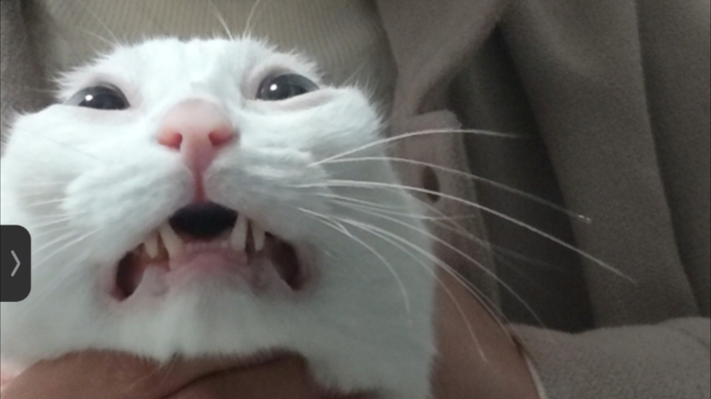 | 20.8万 | 2026-01-26 |
| [在古代，拥有一只永雏塔菲到底有多爽？](https://www.bilibili.com/video/BV1aVzaB3EHL) |  | 20.7万 | 2026-01-26 |
| [抢劫金店七分钟，有六分钟在电老板娘，这是纯体验当S来了](https://www.bilibili.com/video/BV18mzxB9E41) |  | 37.7万 | 2026-01-25 |
| [今日份梗图～](https://www.bilibili.com/video/BV1n3zQB5E52) |  | 21.2万 | 2026-01-25 |
| [#跑刀小曲#曼波小曲#三角洲小曲#鼠鼠小曲《不再曼波》](https://www.bilibili.com/video/BV1PmzQBSEC4) |  | 234 | 2026-01-25 |
| [校园奇葩发明（合集）#搞笑#抽象#校园#AI视频](https://www.bilibili.com/video/BV1TqzSBUEmL) |  | 40.8万 | 2026-01-25 |
| [哈基米被大火烧了，幸好被人救了](https://www.bilibili.com/video/BV1C4zDB5EcF) |  | 2318 | 2026-01-25 |
| [今天夜宵吃串串](https://www.bilibili.com/video/BV1YYzkBMEDi) |  | 6.8万 | 2026-01-24 |
| [小时候爱睡狗窝 1-3完整版](https://www.bilibili.com/video/BV1xtzCBhEKP) |  | 237.3万 | 2026-01-24 |
| [小小猫跟着小小狗烤火](https://www.bilibili.com/video/BV1j2zCBEEWP) | 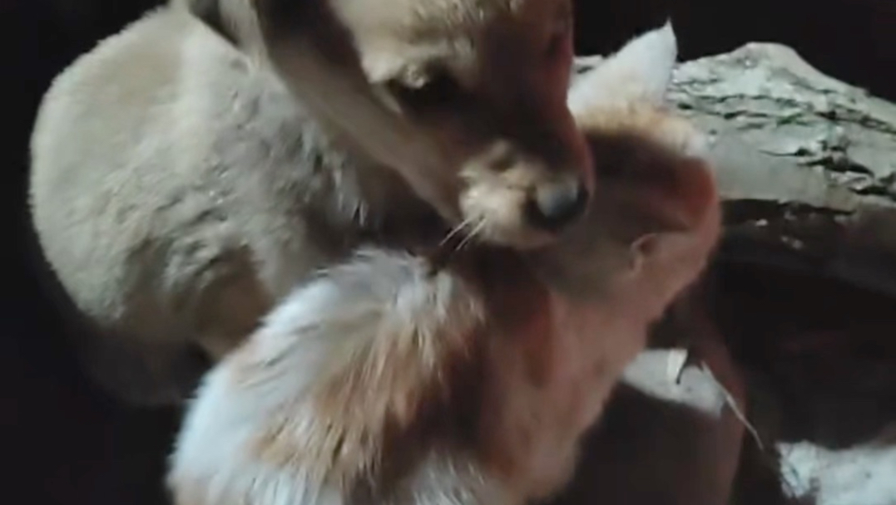 | 18.8万 | 2026-01-24 |
| [福瑞让我魅力无限](https://www.bilibili.com/video/BV1o6zrBCEfY) |  | 30.8万 | 2026-01-24 |
| [小猫：人买回来一直响怎么办](https://www.bilibili.com/video/BV1X2zTBrE1o) | 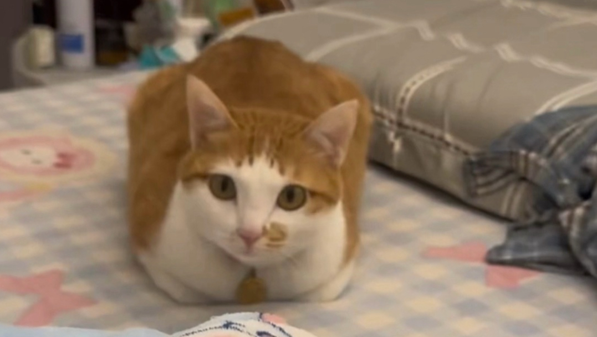 | 38.7万 | 2026-01-23 |
| [【b猫日记】猫喜欢偷东西怎么吧？防不住窃贼哈机米](https://www.bilibili.com/video/BV1ANzKBQELY) | 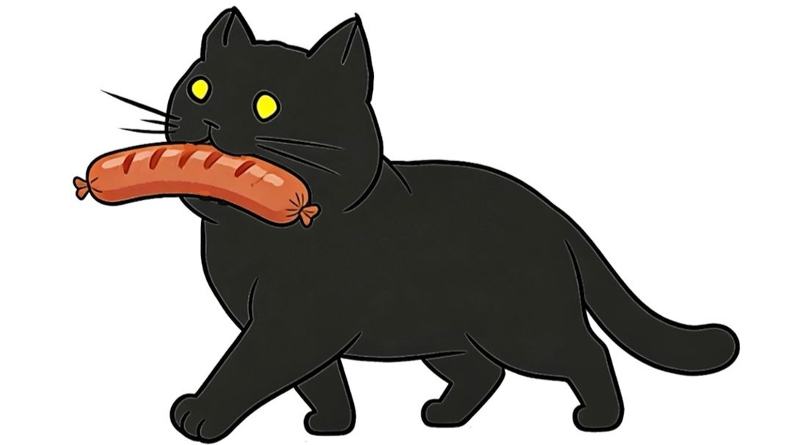 | 3.7万 | 2026-01-23 |
| [願人和狗之間有生殖隔離](https://www.bilibili.com/video/BV11DzcByEGx) |  | 10.4万 | 2026-01-22 |
| [这也太牛哔了吧！](https://www.bilibili.com/video/BV1GXBZB2EvM) | 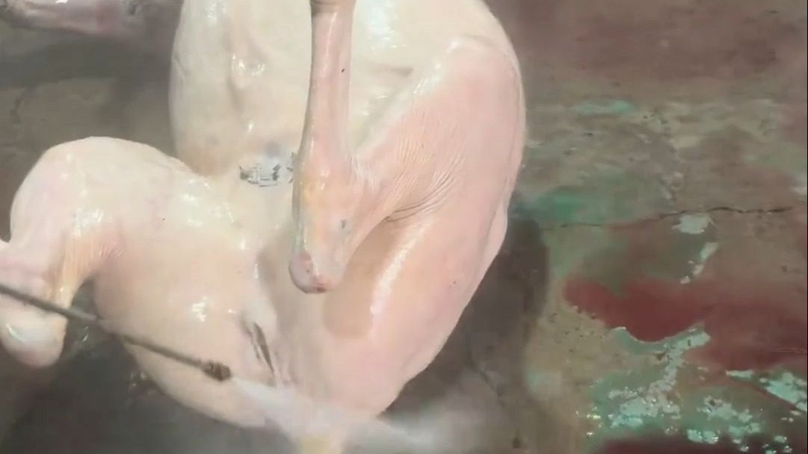 | 111.1万 | 2026-01-22 |
| [这猪还有救吗？](https://www.bilibili.com/video/BV1zskYBYE6a) | 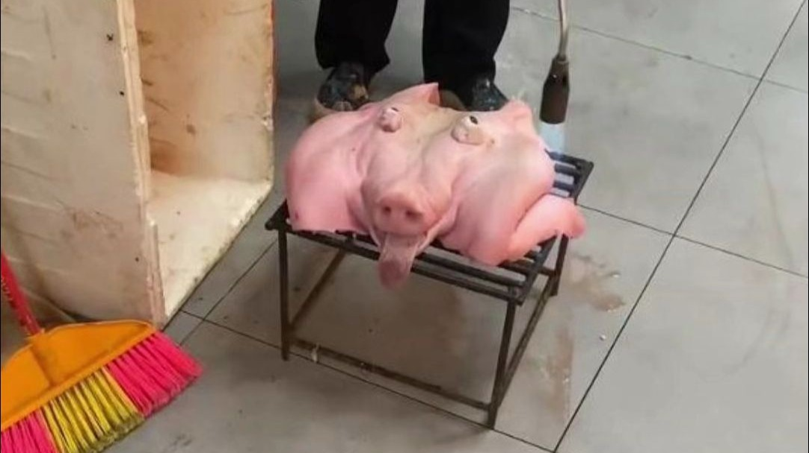 | 57.5万 | 2026-01-19 |
| [叮咚鸡：纵此生](https://www.bilibili.com/video/BV1sUkbBhEJw) |  | 6.7万 | 2026-01-19 |
| [当00后爷爷放起那个年代的歌时！](https://www.bilibili.com/video/BV1yskxBnEcs) |  | 88.4万 | 2026-01-18 |
| [黑哥都怕了](https://www.bilibili.com/video/BV1uKrfBUESA) |  | 15.1万 | 2026-01-15 |
| [美国小伙误入中国神秘网站：这内容也太野了吧！](https://www.bilibili.com/video/BV15Rr5BTELE) |  | 69.4万 | 2026-01-13 |
| [这转圈和踩水太对了🤤](https://www.bilibili.com/video/BV162rzBUE4j) | 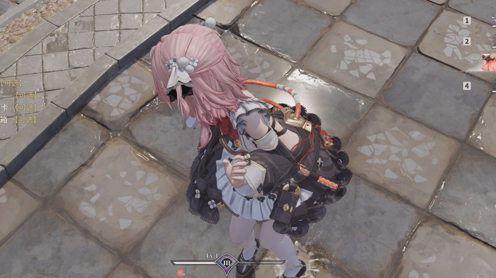 | 54.7万 | 2026-01-13 |
| [本能反应](https://www.bilibili.com/video/BV1xkraBuE6C) |  | 91.1万 | 2026-01-12 |
| [小猫是世界上最可爱的🤣](https://www.bilibili.com/video/BV1Yk6RBCE5B) | 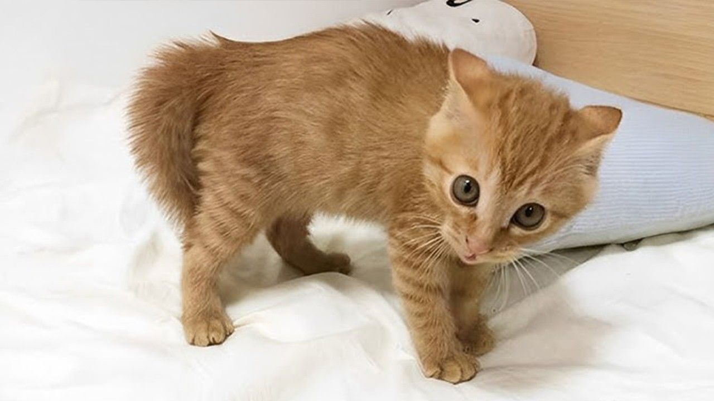 | 10.1万 | 2026-01-11 |
| [世界破破烂烂，小猫缝缝补补！小猫的治愈瞬间~~](https://www.bilibili.com/video/BV1nEquBQEci) |  | 2.3万 | 2026-01-08 |
| [哈基米要疯了](https://www.bilibili.com/video/BV1HYUVYBEH3) | 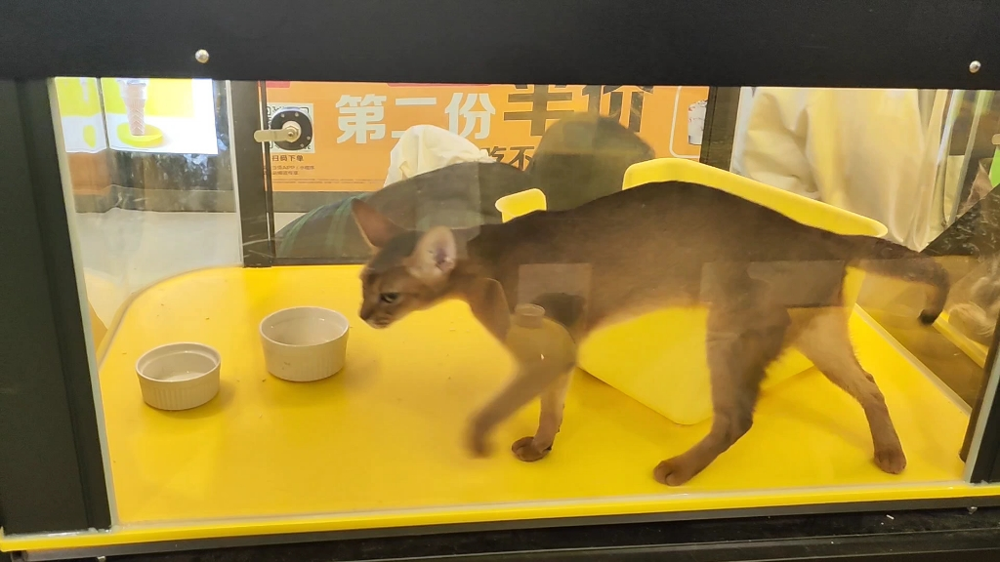 | 4916 | 2024-11-14 |

---
*最后更新: 2026-01-29 03:06:01 (自动生成)*
*数据来源: [Bilibili](https://www.bilibili.com)*

## 使用说明

运行以下命令更新视频列表:
```bash
python3 fetch_hajimi_videos.py
```
