# awesome-hajimi
collections of hajimi (哈基米 in Chinese) on the Internet.

## 视频列表 (Video List)

| 视频标题 (Title) | 封面 | 播放量 (Views) | 发布日期 (Date) |
|---|---|---|---|
| [哈基米小曲锦标赛2.0 冲锋！](https://www.bilibili.com/video/BV1WnFHzEES7) |  | 1655 | 2026-02-07 |
| [哈基米助眠丨决战巴别塔](https://www.bilibili.com/video/BV1zsFkzKE12) | 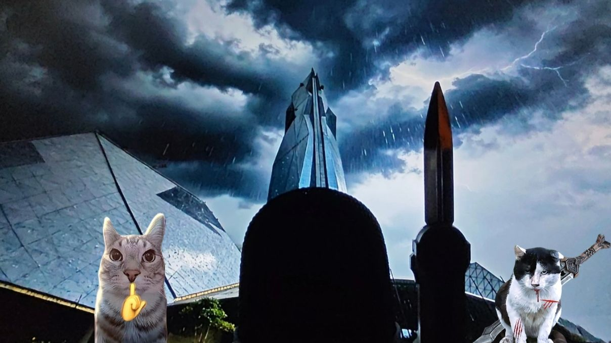 | 5455 | 2026-02-06 |
| [【2026冰火盛典预告】哈基米音乐VS春晚机器人？抽象逆天整活！2月8日晚七点bilibili虚拟春晚正式直播！](https://www.bilibili.com/video/BV16HFkzMEHW) |  | 2.7万 | 2026-02-06 |
| [哈基米制裁过年烦人亲戚](https://www.bilibili.com/video/BV1vjFCzhEni) |  | 1.4万 | 2026-02-06 |
| [十秒速通水淹哈基米（御猫大王逃课）](https://www.bilibili.com/video/BV15jFCzhEdQ) | 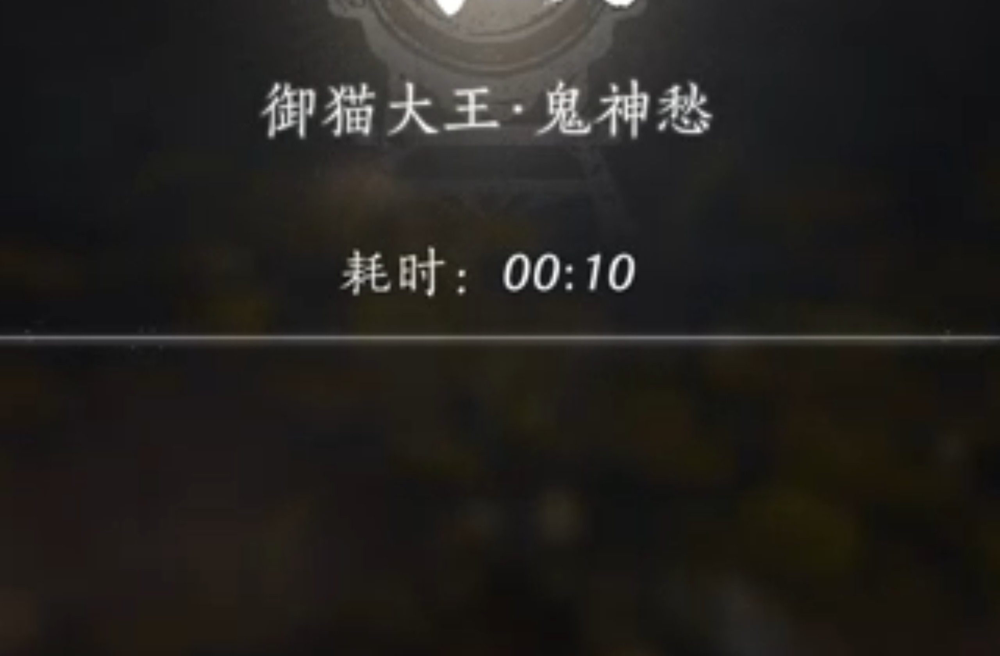 | 2342 | 2026-02-06 |
| [科比整治神人乘客大合集](https://www.bilibili.com/video/BV19nFCzZE8Y) |  | 5260 | 2026-02-06 |
| [有种生物叫小猫每天都对你撒娇^･w･^](https://www.bilibili.com/video/BV1UNF6z3EvY) |  | 14.0万 | 2026-02-06 |
| [主动上门看病的受伤大橘，爱你老几哈基米版](https://www.bilibili.com/video/BV1xXF6zuENp) | 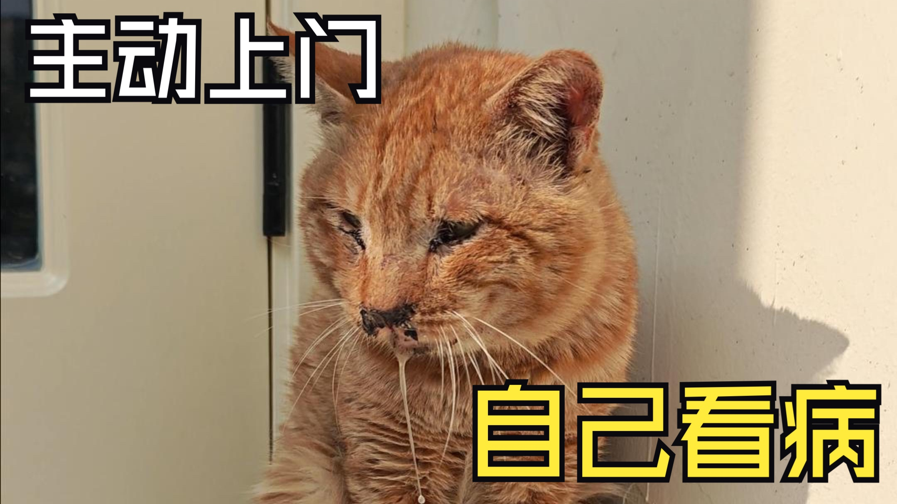 | 2.4万 | 2026-02-06 |
| [【哈基米音乐】尘世闲游](https://www.bilibili.com/video/BV1MbFCzpEcd) |  | 3536 | 2026-02-06 |
| [基米TV之报恩好猫20分钟剧场版，一次看个够！](https://www.bilibili.com/video/BV1xYFCzSEZU) | 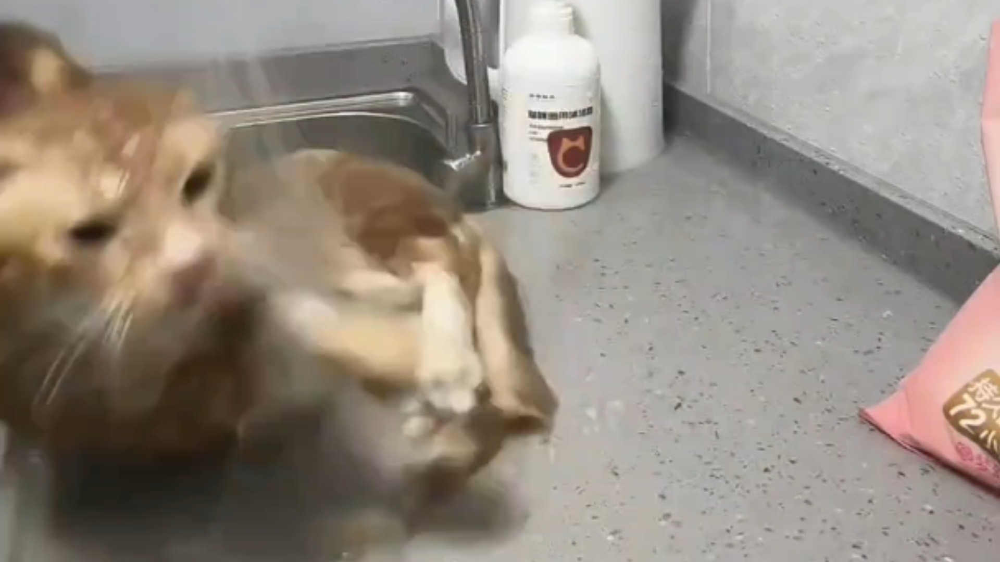 | 5412 | 2026-02-06 |
| [🐱哈基米音乐，如此美妙🐱](https://www.bilibili.com/video/BV1H6FrzTErr) | 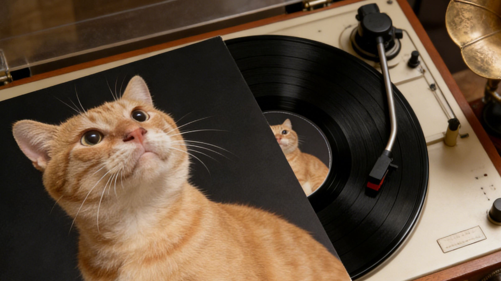 | 3.9万 | 2026-02-06 |
| [【哈基米音乐】还是你的↑哈基米↓最可爱（🎵哈基米曼波🎵）](https://www.bilibili.com/video/BV1KbFrzyEv6) |  | 2200 | 2026-02-06 |
| [26年三大抽象哈基米](https://www.bilibili.com/video/BV1bCF6zLEV1) | 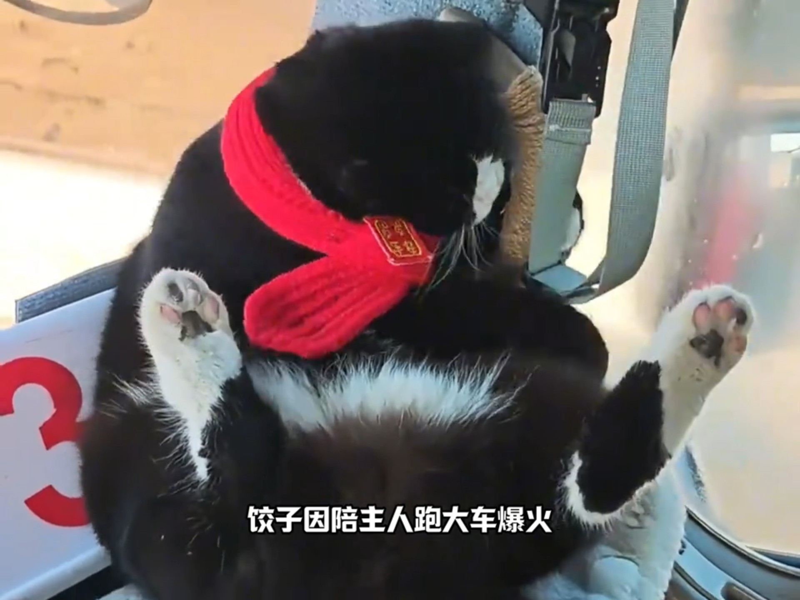 | 2291 | 2026-02-06 |
| [全网三大抽象哈基米，2026 开年最魔性的精神状态](https://www.bilibili.com/video/BV1tHFzzrEaY) |  | 8.1万 | 2026-02-06 |
| [它好像知道你们在耍它](https://www.bilibili.com/video/BV1JwFrzAEwW) | 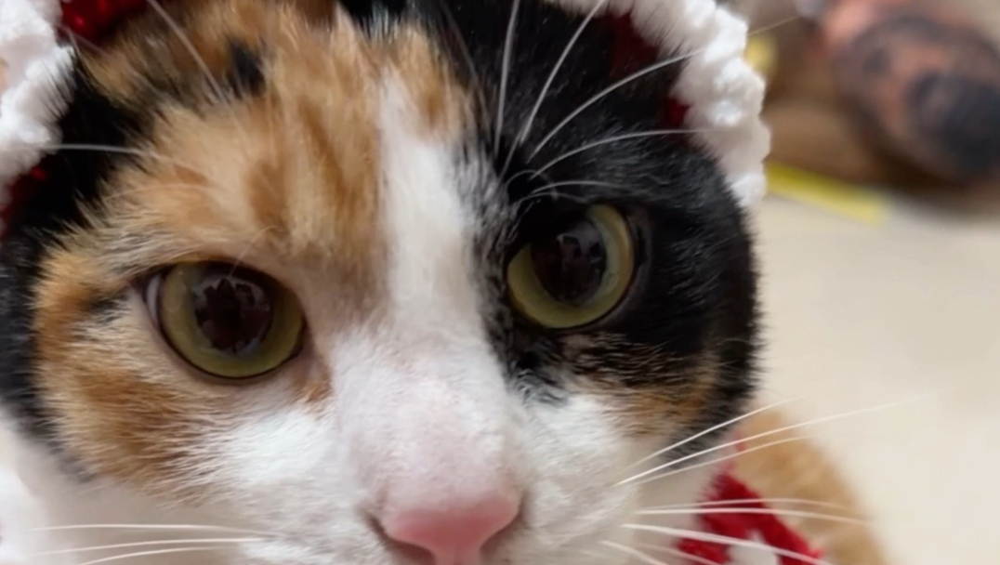 | 58.0万 | 2026-02-06 |
| [基米去不了乌托邦](https://www.bilibili.com/video/BV1HfF6zNEgq) |  | 545 | 2026-02-06 |
| [哈基米：snooze](https://www.bilibili.com/video/BV1ThFrzVEL4) |  | 1857 | 2026-02-06 |
| [基米绮想曲  ~ Hachimi Battle!（原曲不使用）](https://www.bilibili.com/video/BV1WhFzzvEn2) |  | 931 | 2026-02-06 |
| [这是一条澄清视频，家人们帮帮忙好吗](https://www.bilibili.com/video/BV1YxFezYEEN) |  | 1.6万 | 2026-02-06 |
| [离开基的依赖，但是DJ版](https://www.bilibili.com/video/BV1cxFYzyEUV) |  | 5306 | 2026-02-06 |
| [🐱圆哈镇没有活着的传奇🐱I Really Want to Stay at Your House](https://www.bilibili.com/video/BV1z9Fez5EKF) | 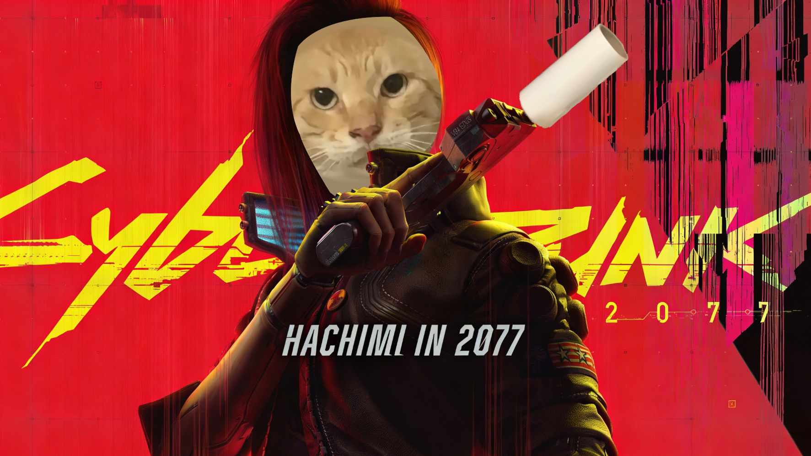 | 5.1万 | 2026-02-06 |
| [在马路中间睡觉的哈基米](https://www.bilibili.com/video/BV1SEFzzCEUM) | 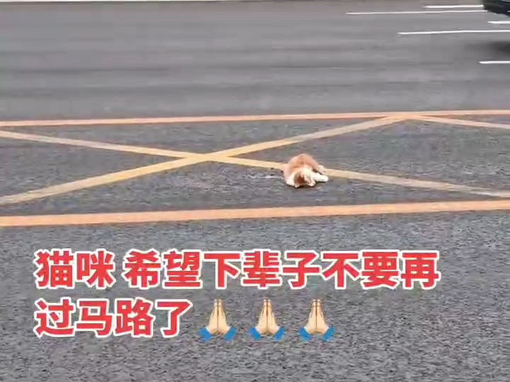 | 1651 | 2026-02-06 |
| [【哈基米音乐】说谎的哈基米（说谎的马卡龙）](https://www.bilibili.com/video/BV1skFiz8Eo1) |  | 5.0万 | 2026-02-06 |
| [🎵迷乱之村哈基米🎵](https://www.bilibili.com/video/BV1tBFizAEds) |  | 2837 | 2026-02-05 |
| [什么！哈基米！知名ow博主观看最新ow发布会高能反应](https://www.bilibili.com/video/BV1htFezwEcD) |  | 1.3万 | 2026-02-05 |
| [这是一条澄清视频，希望大家能够支持下](https://www.bilibili.com/video/BV19sFezPEsQ) |  | 10.9万 | 2026-02-05 |
| [🐱](https://www.bilibili.com/video/BV1ApFvzsEWT) |  | 39.8万 | 2026-02-05 |
| [哈基米南北绿豆～](https://www.bilibili.com/video/BV1GffZBNEUf) |  | 202 | 2026-02-05 |
| [【哈基米音乐】最后的色彩](https://www.bilibili.com/video/BV1m2foBWEBa) |  | 4.7万 | 2026-02-05 |
| [网友说我虐待动物，要学西方一样爱狗，把我家狗子整难绷了？？？](https://www.bilibili.com/video/BV1KjFYzDE3o) |  | 25.0万 | 2026-02-05 |
| [【王牌竞速】抽象“哈基米涂装”！新模式“抓马秀/斗地主”玩法预览！称号奖励预览！](https://www.bilibili.com/video/BV19BFYzvEoE) |  | 3191 | 2026-02-05 |
| [哈基蜂有个猛攻梦..zzZZ](https://www.bilibili.com/video/BV1USFhzJETi) |  | 37.9万 | 2026-02-05 |
| [哈基米底层代码这一块，棘背龙形态这一块，秒开仙人模式这一块](https://www.bilibili.com/video/BV1DyFhzXETK) |  | 4729 | 2026-02-05 |
| [抽奖抽奖](https://www.bilibili.com/video/BV1RYFhzcEvc) | 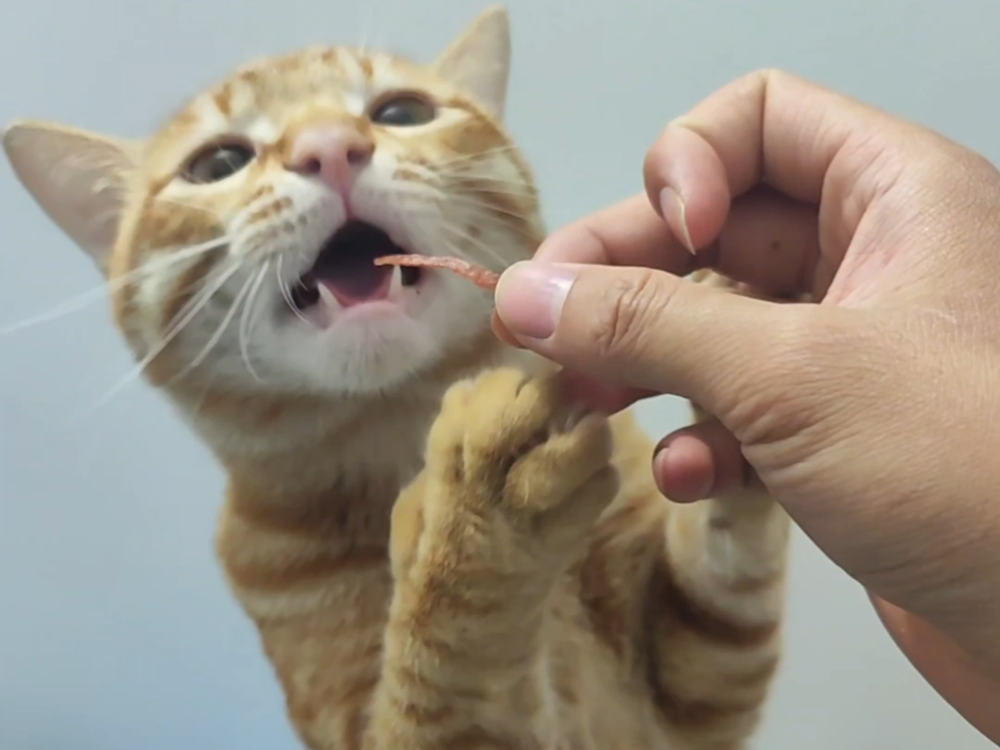 | 13.7万 | 2026-02-05 |
| [【哈基米音乐】monody](https://www.bilibili.com/video/BV1ckFuz1E7u) |  | 1.5万 | 2026-02-05 |
| [守望先锋哈基米三分篮球](https://www.bilibili.com/video/BV13gFAzVEQX) |  | 5.0万 | 2026-02-04 |
| [哈哈哈哈，哈哈哈哈，哈基米哦南北绿豆啊嘎呀嗦](https://www.bilibili.com/video/BV1EvFczEEg3) |  | 110 | 2026-02-04 |
| [哈基米南北绿豆](https://www.bilibili.com/video/BV1USffBFEj7) |  | 106 | 2026-02-04 |
| [网左的寒假一天](https://www.bilibili.com/video/BV1P9foBSEEM) |  | 13.9万 | 2026-02-04 |
| [帅就一个字 鼠只说一次](https://www.bilibili.com/video/BV1GHfZBhEVi) |  | 25.9万 | 2026-02-04 |
| [经典回顾叮咚鸡合集](https://www.bilibili.com/video/BV1a7fdBsEA1) | 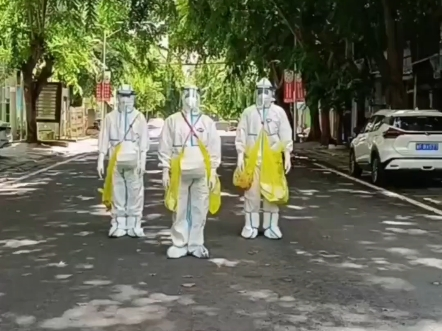 | 1.3万 | 2026-02-04 |
| [库里库里(哈基米南北绿豆)](https://www.bilibili.com/video/BV1LUfdBPEGA) |  | 305 | 2026-02-04 |
| [波基米亚狂想曲🎵](https://www.bilibili.com/video/BV1G8FVzgExe) |  | 3.7万 | 2026-02-04 |
| [《基米不想走》翻唱 原创是：若翰_ 老师！这简直是神作！！！](https://www.bilibili.com/video/BV1ojfDBSEcA) |  | 1282 | 2026-02-03 |
| [你去打工还债吧](https://www.bilibili.com/video/BV1xAFLzqEtj) | 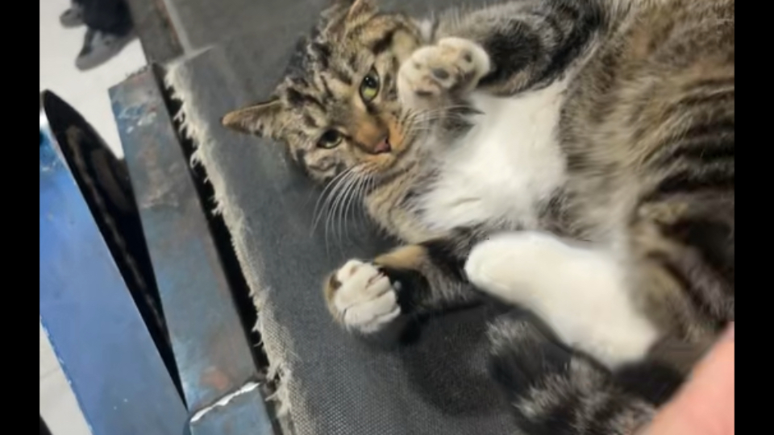 | 416.4万 | 2026-02-03 |
| [【4次补档】评《牢A锐评马克思》](https://www.bilibili.com/video/BV12pFjzrEAP) |  | 25.4万 | 2026-02-03 |
| [当你被网络热梗洗脑](https://www.bilibili.com/video/BV1dTFjzQEgJ) | 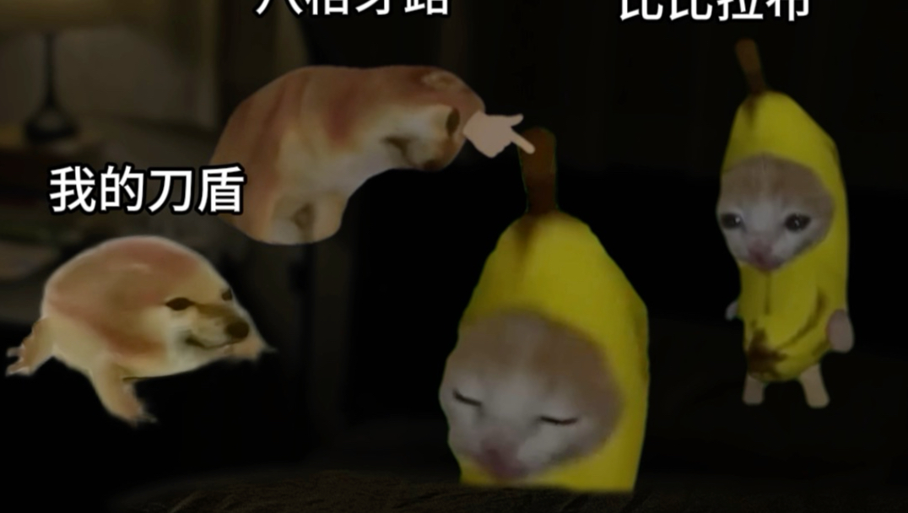 | 54.9万 | 2026-02-03 |
| [猫(´；ω；｀)](https://www.bilibili.com/video/BV1PtF5zhEio) |  | 126.7万 | 2026-02-03 |
| [疯狂的鸽子，电工版！？](https://www.bilibili.com/video/BV1tsFTzJEwz) | 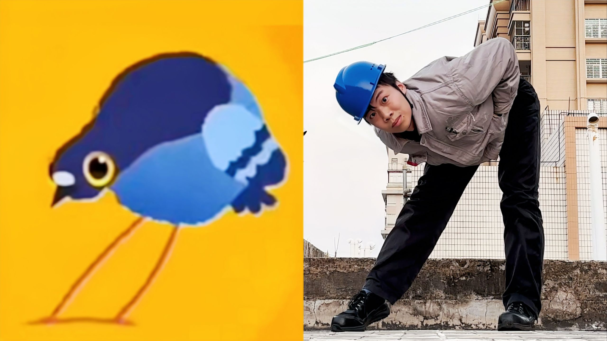 | 148.4万 | 2026-02-02 |
| [【EVA来吧，甜蜜的盒蒜】 Komm, süsser Todx叮咚鸡ai翻唱](https://www.bilibili.com/video/BV16HFMzgEF2) |  | 3.8万 | 2026-02-02 |
| [小 猪 佩 急](https://www.bilibili.com/video/BV1AYFNzKEef) |  | 122.9万 | 2026-02-02 |
| [嗵 嗵 ，但 是 只 因 版](https://www.bilibili.com/video/BV1aC6pBXEz8) |  | 62.8万 | 2026-02-02 |
| [【基米不想走】｜“曼波遗憾一大堆 曼波还不想睡”](https://www.bilibili.com/video/BV18d6sBpEk2) |  | 13.0万 | 2026-02-01 |
| [低 音 未 来](https://www.bilibili.com/video/BV1SA6tBxEFy) |  | 117.5万 | 2026-02-01 |
| [国外网友如何恶搞爱泼斯坦](https://www.bilibili.com/video/BV1o264BTEaa) |  | 55.6万 | 2026-02-01 |
| [循环歌单｜【基米不想走】｜“曼波遗憾一大堆 曼波还不想睡”](https://www.bilibili.com/video/BV1So6sBQEDG) |  | 119.9万 | 2026-02-01 |
| [当你突然发现这俩的契合度是100％……](https://www.bilibili.com/video/BV1zY6sBMEqY) |  | 107.0万 | 2026-02-01 |
| [是时候给你们这些新生代补充一下知识了](https://www.bilibili.com/video/BV1CM6xB5ExT) |  | 110.3万 | 2026-02-01 |
| [电棍：春庭雪](https://www.bilibili.com/video/BV1mV6nBvEVr) |  | 12.6万 | 2026-02-01 |
| [Pigeon♂Pop](https://www.bilibili.com/video/BV18g61ByEcR) |  | 49.6万 | 2026-01-31 |
| [0基础猫头色彩教学，一学就会！](https://www.bilibili.com/video/BV1Nc62B6Ebv) |  | 153.0万 | 2026-01-31 |
| [给我闹2.0! 油门踩到底](https://www.bilibili.com/video/BV1FF6BBuENE) | 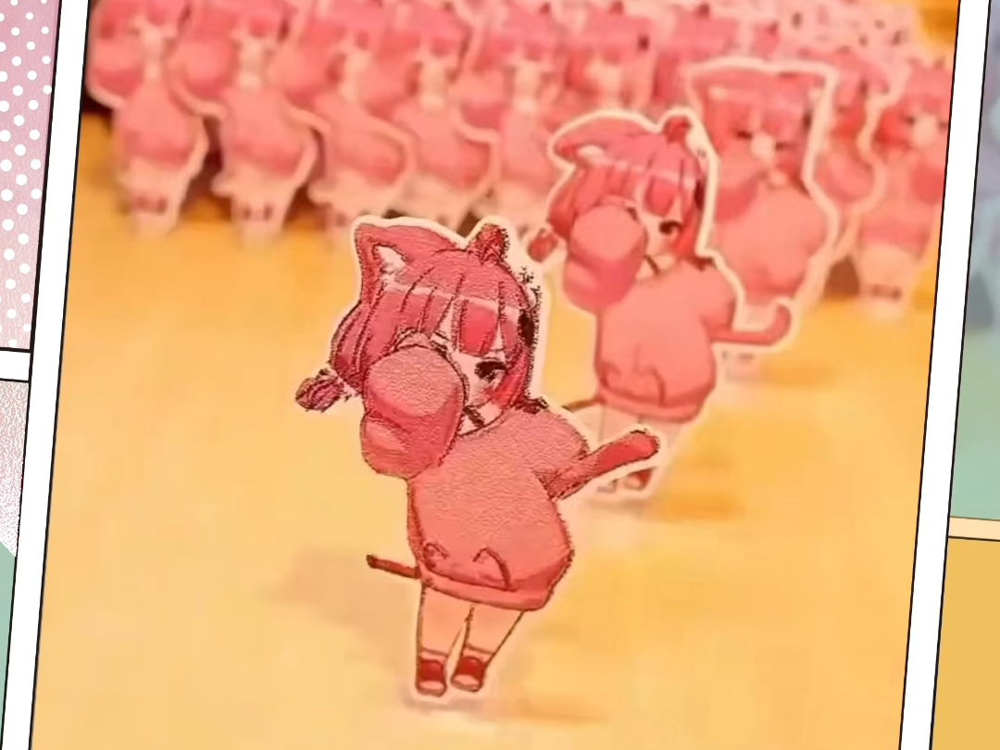 | 22.5万 | 2026-01-30 |
| [世界上最伤感的歌曲](https://www.bilibili.com/video/BV1GT6iBdESC) |  | 57.7万 | 2026-01-30 |
| [有些天赋是与生俱来的～](https://www.bilibili.com/video/BV1FX6vBKESC) |  | 300.4万 | 2026-01-30 |
| [☔️“听雨的声音，一滴滴清晰”《嬴政の小曲》✨雨爱DJ + Lightning moment + Live It Up/AI東 雪蓮](https://www.bilibili.com/video/BV1Sh6YBrEjN) |  | 35.8万 | 2026-01-30 |
| [【猫和老鼠】恭喜发财🎉](https://www.bilibili.com/video/BV1YP6wBfEsZ) |  | 93.1万 | 2026-01-30 |
| [I Can&#x27;t Wait Peter](https://www.bilibili.com/video/BV1kU6ABmEYo) |  | 63.5万 | 2026-01-30 |
| [🧨恭 喜 咕 嘎🧨](https://www.bilibili.com/video/BV1py6gBeEe1) |  | 69.5万 | 2026-01-29 |
| [我 是 逆 蝶 ！！！🦋⚠](https://www.bilibili.com/video/BV1S8zfB5Ei5) |  | 203.4万 | 2026-01-29 |
| [小时候被我家狗咬了](https://www.bilibili.com/video/BV1tazBBpE2T) |  | 4.9万 | 2026-01-27 |
| [笑了十分钟才敢发出来](https://www.bilibili.com/video/BV1jizxBwEnL) | 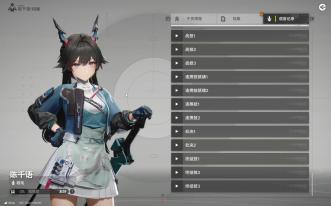 | 138.5万 | 2026-01-25 |
| [谁是主角，一眼便知](https://www.bilibili.com/video/BV1vCzDBYEEa) |  | 613.4万 | 2026-01-25 |
| [我感觉我又行了](https://www.bilibili.com/video/BV13hzQBhEJ1) |  | 2.9万 | 2026-01-25 |
| [【小曲一响，主角登场】2025年最火の小曲合集，很多人听过却不知道歌名！](https://www.bilibili.com/video/BV1aMzzBZEQy) |  | 480.3万 | 2026-01-24 |
| [🍬我不要你了🍬](https://www.bilibili.com/video/BV1YMzrBiE3j) |  | 56.6万 | 2026-01-24 |
| [孩子们别怕，食猴鹰大人来了](https://www.bilibili.com/video/BV1ZrzCBDEhc) |  | 145.4万 | 2026-01-24 |
| [循环歌单｜【雷霆拼好歌】“谁能听到追后！”](https://www.bilibili.com/video/BV1jfzKB1Edx) |  | 376.7万 | 2026-01-24 |
| [《急急如律令》MV，你已急哭你没急吧！](https://www.bilibili.com/video/BV16dzMBsEto) |  | 63.0万 | 2026-01-23 |
| [素材提供（16岁）](https://www.bilibili.com/video/BV1QhzMBrEd1) |  | 98.8万 | 2026-01-23 |
| [循环歌单｜【NO BATIDÃO 】｜“【魔王护の小曲】”](https://www.bilibili.com/video/BV1urzHBGEoZ) |  | 661.1万 | 2026-01-23 |
| [初中历史课本各单元的小曲](https://www.bilibili.com/video/BV1ARzHBYEXt) |  | 59.3万 | 2026-01-22 |
| [俩同学狂唱I Can&#x27;t Wait驱赶厕所里的蛇](https://www.bilibili.com/video/BV1NvzVB5EKh) |  | 126.5万 | 2026-01-21 |
| [循环歌单｜《精卫MIX》“小西天封不了真大圣 假水浒出了个真武松”](https://www.bilibili.com/video/BV1UMz5BDEKi) |  | 16.6万 | 2026-01-21 |
| [嘉豪Can&#x27;t Wait【Remix】by Moris](https://www.bilibili.com/video/BV1JBkEBtEv1) |  | 85.6万 | 2026-01-20 |
| [Lost One的急哭](https://www.bilibili.com/video/BV17mkEBpEFF) | 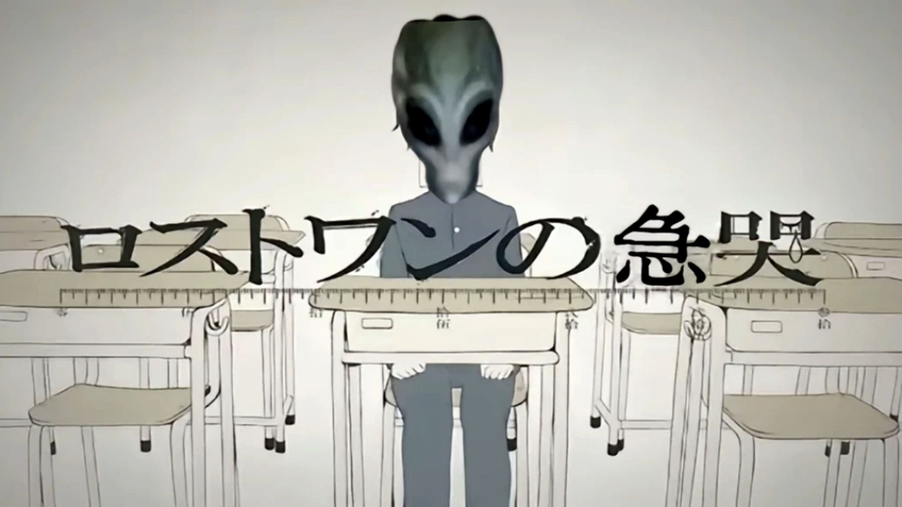 | 55.6万 | 2026-01-20 |
| [《水手说了什么》原视频，2025年度总结报告！](https://www.bilibili.com/video/BV1fpkJB4Epb) |  | 294.1万 | 2026-01-20 |
| [“孤单的孩子造了个心软的妈”](https://www.bilibili.com/video/BV1ZnkLBGEN3) |  | 91.1万 | 2026-01-20 |
| [叮咚鸡：《再见》](https://www.bilibili.com/video/BV1QxkVBcE7v) |  | 4.2万 | 2026-01-20 |
| [【原神整活】诶！我也要吗？](https://www.bilibili.com/video/BV1EUkpBTEqD) |  | 218.8万 | 2026-01-18 |
| [Bro can&#x27;t wait](https://www.bilibili.com/video/BV1RCkxBTEPn) | 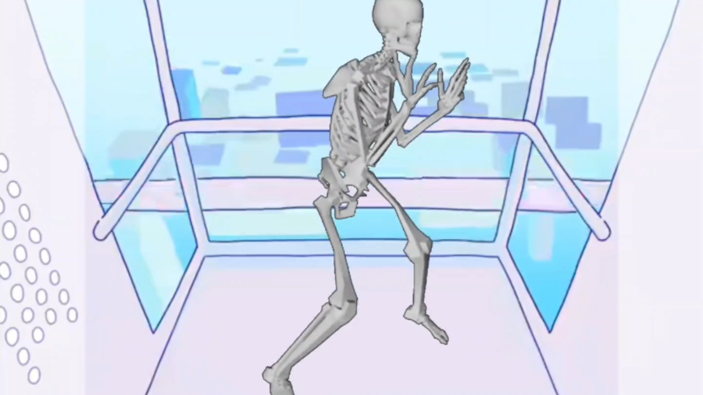 | 79.6万 | 2026-01-18 |
| [父子の号哭](https://www.bilibili.com/video/BV1vsrXB3EWS) |  | 46.0万 | 2026-01-18 |
| [&quot;万物终归向海 何必衔木石来&quot;](https://www.bilibili.com/video/BV13NrSBtErb) |  | 71.5万 | 2026-01-17 |
| [禁漫之拳！！！！（配音）](https://www.bilibili.com/video/BV13HrZBUEcV) |  | 462.4万 | 2026-01-15 |
| [我是天才😎](https://www.bilibili.com/video/BV1zb6RBpEcq) | 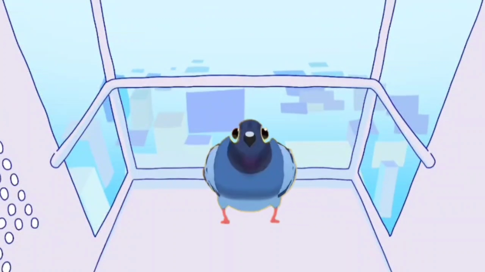 | 55.8万 | 2026-01-11 |
| [祝每一位三角洲玩家，天天出大红，2026开出非洲之心。感谢参与此次合唱的每一位可爱认真的up主，大家辛苦啦！](https://www.bilibili.com/video/BV1A6i4BqEn2) |  | 667.2万 | 2026-01-05 |
| [单曲循环｜“节奏感小曲”“卡点小曲”｜巴西funk｜NO BATIDÃO (Slowed)](https://www.bilibili.com/video/BV1gQqfBVEZj) |  | 310.5万 | 2025-12-19 |
| [库里之歌x1.5倍速](https://www.bilibili.com/video/BV17UW2zzEVQ) |  | 37.1万 | 2025-10-20 |
| [【神人杯Day14】🎵哈基米：朗朗晴天（完整版）🎵](https://www.bilibili.com/video/BV1VGEwzZEkx) |  | 18.4万 | 2025-05-14 |
| [【戏腔古风】《精卫DJ》（完整版）一颗狼星“你与我闲谈养心殿，后拜瀑淋身”《历史的小曲》《帝王的小曲》](https://www.bilibili.com/video/BV14iQBYWEnk) |  | 398.7万 | 2025-03-17 |
| [江语晨《最后一页》百万豪装录音棚大声听【Hi-res】](https://www.bilibili.com/video/BV1YJ4m1P7ge) |  | 610.1万 | 2024-05-25 |

---
*最后更新: 2026-02-07 03:05:31 (自动生成)*
*数据来源: [Bilibili](https://www.bilibili.com)*

## 使用说明

运行以下命令更新视频列表:
```bash
python3 fetch_hajimi_videos.py
```
