# awesome-hajimi
collections of hajimi (哈基米 in Chinese) on the Internet.

## 视频列表 (Video List)

| 视频标题 (Title) | 封面 | 播放量 (Views) | 发布日期 (Date) |
|---|---|---|---|
| [🌟蜘蛛侠：跃入哈基米多元宇宙🌟 🤟](https://www.bilibili.com/video/BV1UCFbz1EFa) |  | 0 | 2026-02-16 |
| [我家的哈基米](https://www.bilibili.com/video/BV1urZABNEAQ) | 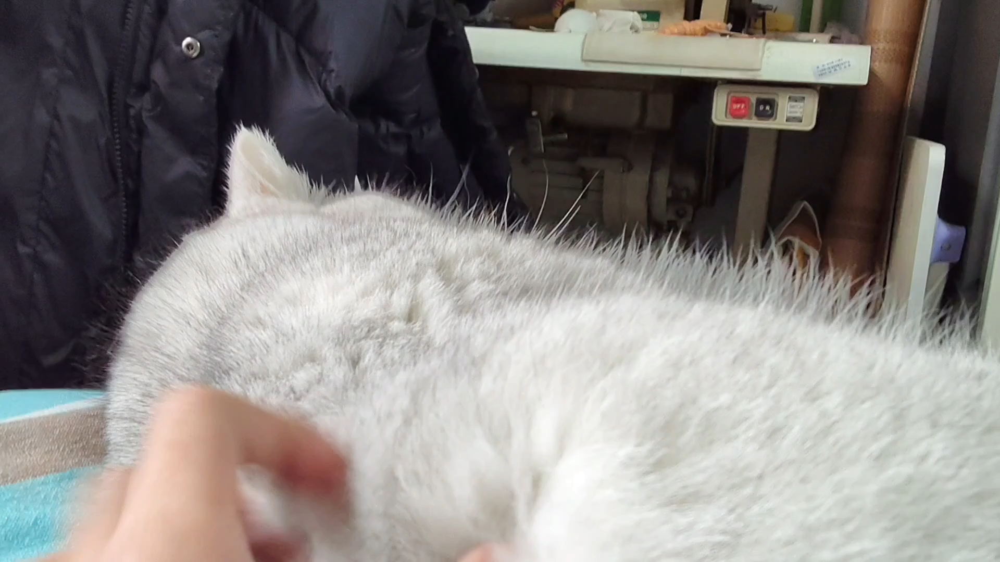 | 1 | 2026-02-16 |
| [【哈基米音乐】好一朵迎春哈-广东过年经典小曲](https://www.bilibili.com/video/BV1jyZLBDERU) |  | 7 | 2026-02-16 |
| [神秘哈基米。](https://www.bilibili.com/video/BV14kZABeE91) | 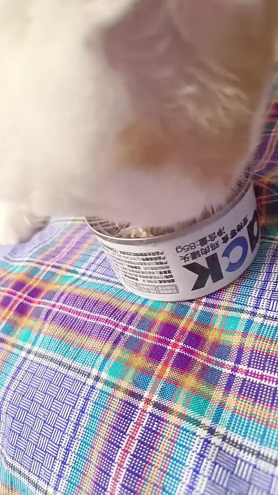 | 0 | 2026-02-16 |
| [seedance 大战哈基米~](https://www.bilibili.com/video/BV1KyZABAEFP) |  | 1 | 2026-02-16 |
| [颤抖的哈基米](https://www.bilibili.com/video/BV1ixZABLE3A) | 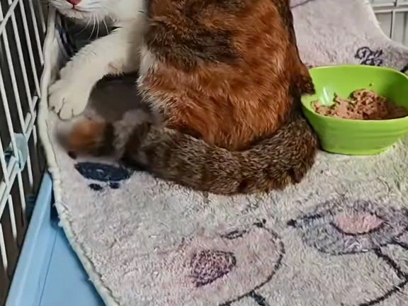 | 0 | 2026-02-16 |
| [【首首高能】B站AI音乐春晚曲目大赏《哈基米神曲》《刀马旦》《孤独幻觉》](https://www.bilibili.com/video/BV1LgZPBLEwH) |  | 97 | 2026-02-16 |
| [23岁的老年哈基米](https://www.bilibili.com/video/BV1dMZPB1ETJ) | 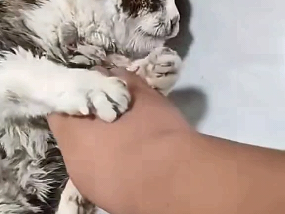 | 28 | 2026-02-16 |
| [【哈基米】娃娃机](https://www.bilibili.com/video/BV19VZPBGEgo) | 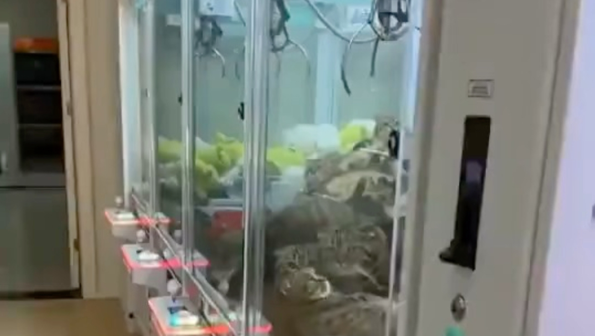 | 83 | 2026-02-15 |
| [路亚哈基米，鉴定为罗非猫](https://www.bilibili.com/video/BV1UnZPBqEX1) | 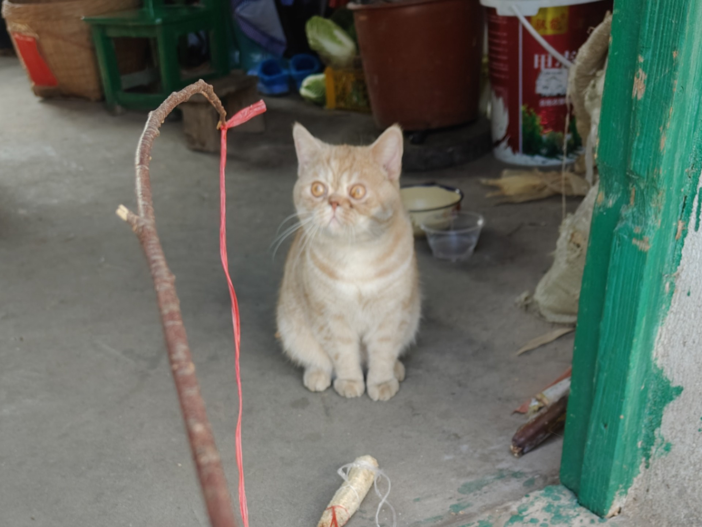 | 27 | 2026-02-15 |
| [【新春特辑】基米TV新年7小时大合集，这波贪了也够看！](https://www.bilibili.com/video/BV1zkZPBpEpo) | 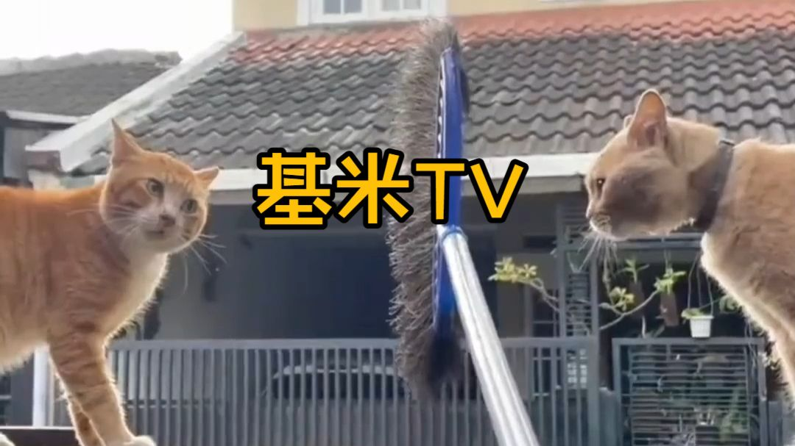 | 4120 | 2026-02-15 |
| [飙马野…哈基米！](https://www.bilibili.com/video/BV1F9ZcBEE3T) |  | 87 | 2026-02-15 |
| [西部哈基米](https://www.bilibili.com/video/BV1wVZABsERD) | 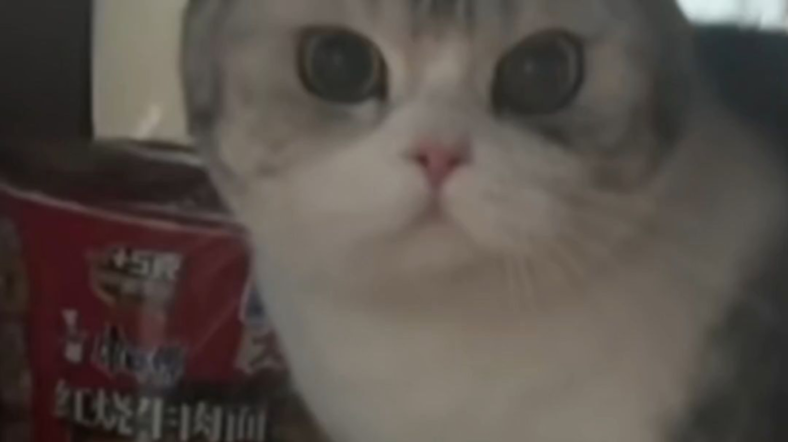 | 32 | 2026-02-15 |
| [天选哈基米~~](https://www.bilibili.com/video/BV1J7ZABDE7S) |  | 247 | 2026-02-15 |
| [哈基米成精](https://www.bilibili.com/video/BV1McZABYEQA) |  | 4 | 2026-02-15 |
| [【哈基米音乐】颠倒基米 -原曲：Invented World](https://www.bilibili.com/video/BV1GvZtBjEXk) |  | 187 | 2026-02-15 |
| [（完整版）不哈](https://www.bilibili.com/video/BV1xQZtBeEGK) | 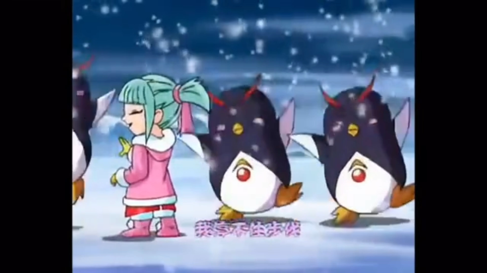 | 315 | 2026-02-15 |
| [哈基米南北](https://www.bilibili.com/video/BV1ZkZ4BDEZx) | 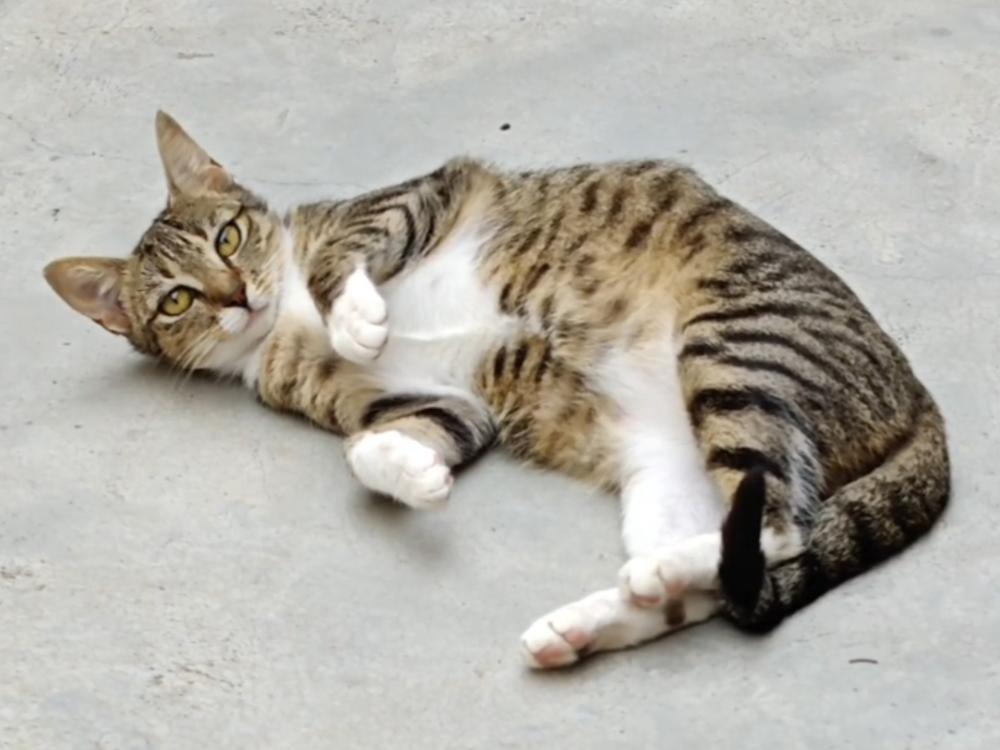 | 170 | 2026-02-15 |
| [2026哈基米拜年基预热--闹耄之城](https://www.bilibili.com/video/BV1B4ZtBDEEr) |  | 1406 | 2026-02-15 |
| [🐱世界哈基米大团结🐱](https://www.bilibili.com/video/BV1bLcazxEt9) |  | 2.2万 | 2026-02-15 |
| [哈基米](https://www.bilibili.com/video/BV1KuZtBPE7y) |  | 27 | 2026-02-15 |
| [哈基米](https://www.bilibili.com/video/BV1yVZtB8EkJ) | 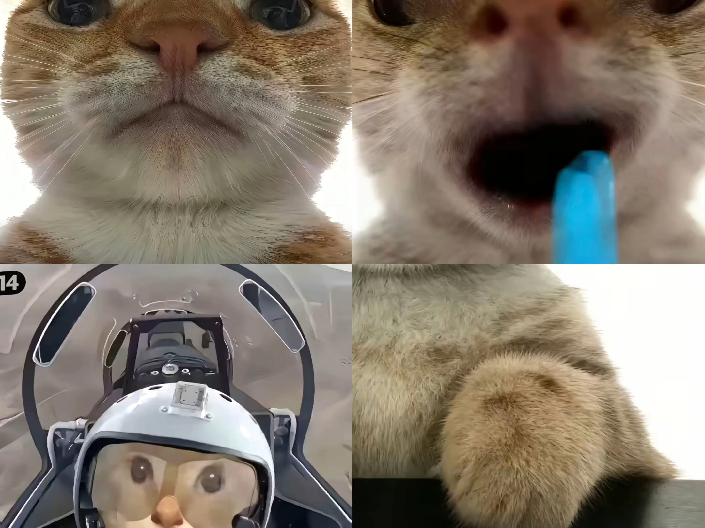 | 54 | 2026-02-15 |
| [用猫的语言驯服野生哈基米](https://www.bilibili.com/video/BV1tUZtBiEwf) | 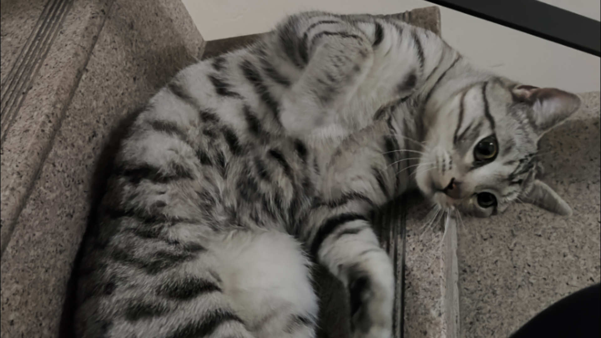 | 188 | 2026-02-15 |
| [这猫怎么狗里狗气的？](https://www.bilibili.com/video/BV1mUZtBiEaG) | 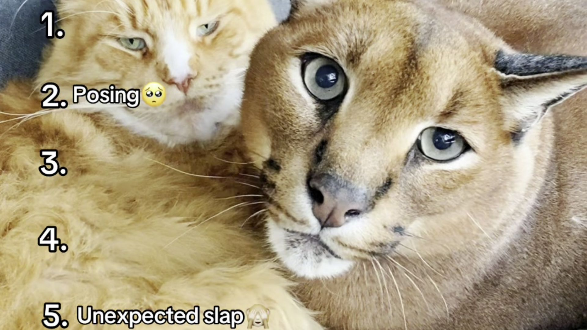 | 3233 | 2026-02-15 |
| [哈一米](https://www.bilibili.com/video/BV1WRZtBaEe4) | 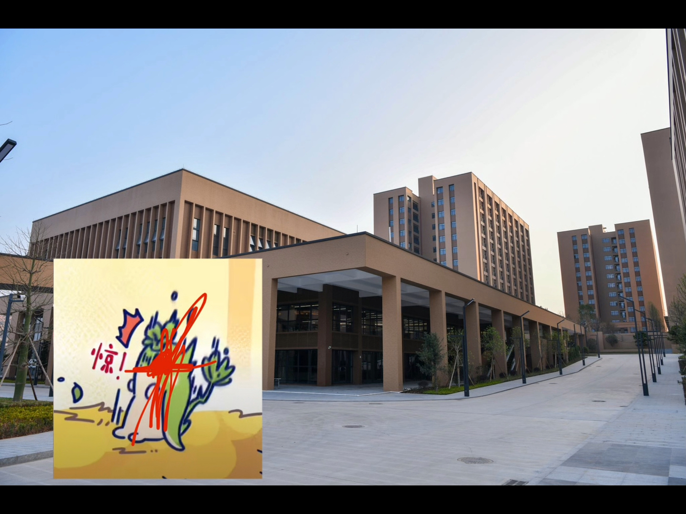 | 11 | 2026-02-15 |
| [哈基米助眠丨我在你头顶助眠](https://www.bilibili.com/video/BV133c3zBEez) |  | 5198 | 2026-02-15 |
| [哈基米洗脸1分钟54秒](https://www.bilibili.com/video/BV1XXZsBKEzf) | 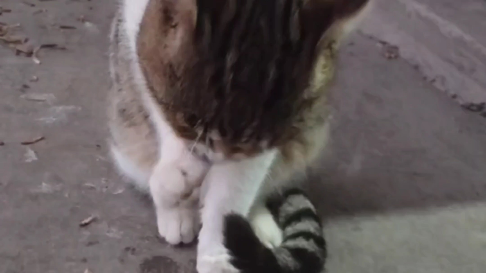 | 243 | 2026-02-15 |
| [哈基米](https://www.bilibili.com/video/BV11AZxBbEoF) | 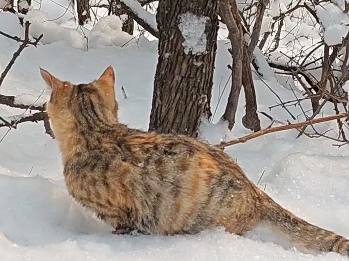 | 39 | 2026-02-15 |
| [哈基安卡给大家拜年啦《春节序曲》【哈基米金曲】~](https://www.bilibili.com/video/BV1Z6ZsB5EmS) |  | 826 | 2026-02-15 |
| [可爱哈基米](https://www.bilibili.com/video/BV19SZsBMEV1) | 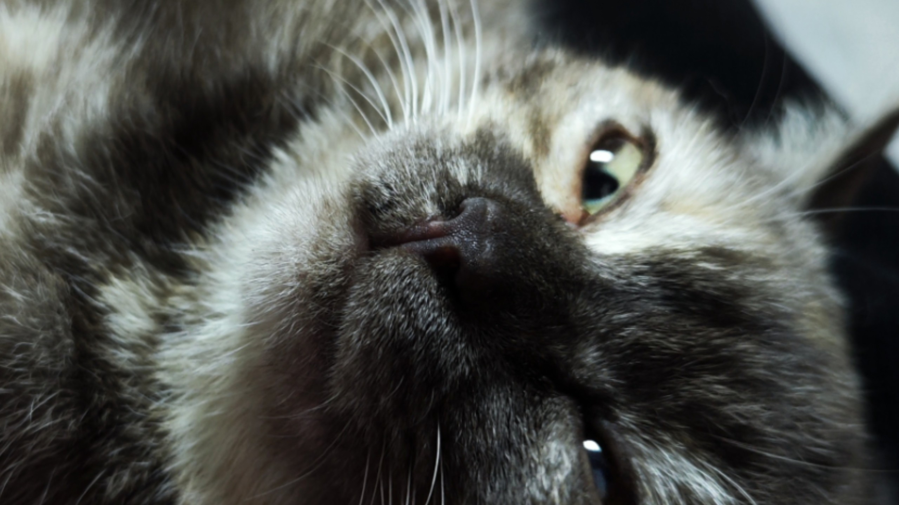 | 19 | 2026-02-15 |
| [最抒情の基米序曲🎵](https://www.bilibili.com/video/BV1zHZxBjEgk) |  | 2893 | 2026-02-15 |
| [【哈基米10号】我的最新作品，快来一睹为快！](https://www.bilibili.com/video/BV1EEZxBJEyh) | 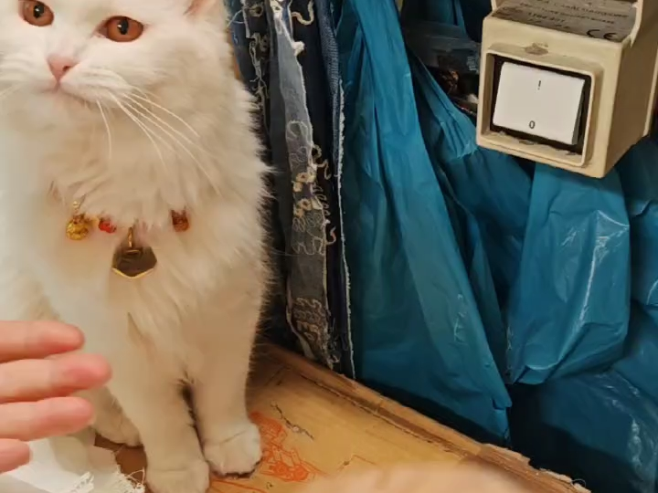 | 23 | 2026-02-15 |
| [《恐怖哈基米》](https://www.bilibili.com/video/BV1KUZxBfENZ) | 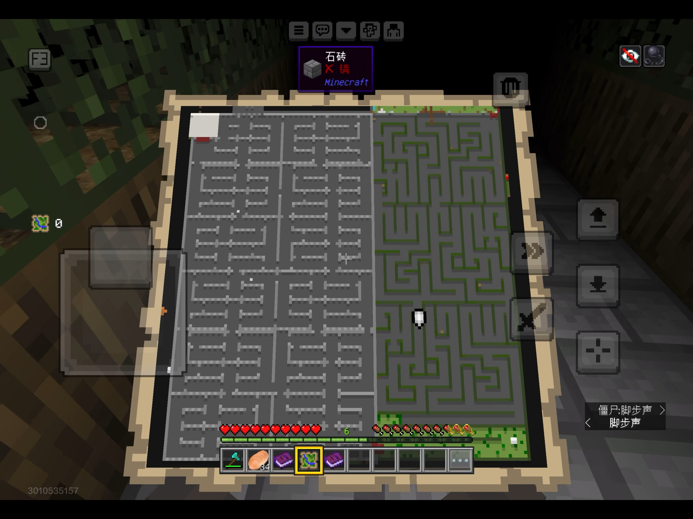 | 142 | 2026-02-15 |
| [新年第一坨哈基米](https://www.bilibili.com/video/BV14rZxBYE23) | 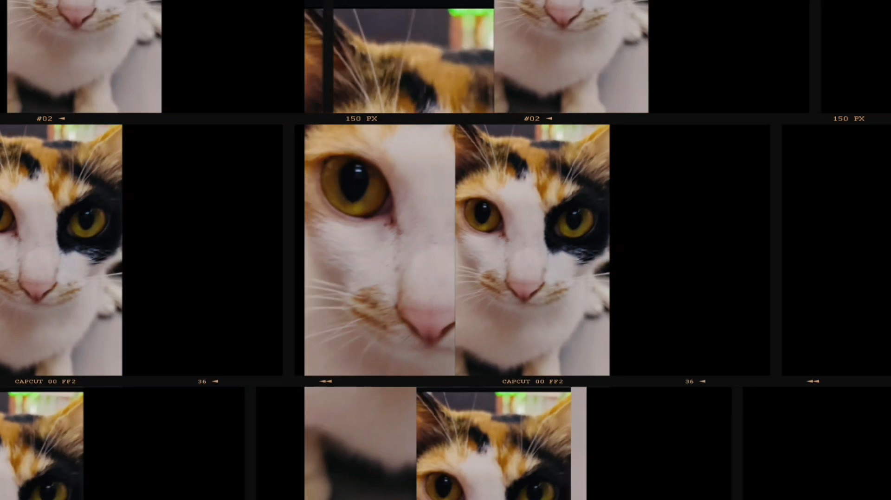 | 7 | 2026-02-15 |
| [【哈基米音乐】折哈渡yeah~](https://www.bilibili.com/video/BV1XaZxBzE4F) |  | 1.0万 | 2026-02-15 |
| [偶遇一只哈基米](https://www.bilibili.com/video/BV1b6ZxBPEh3) | 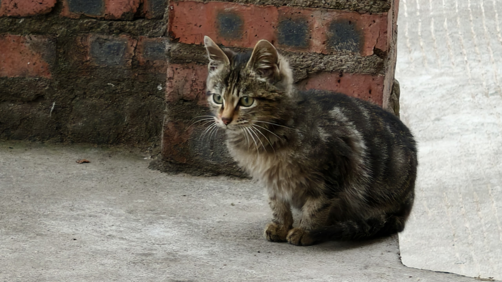 | 23 | 2026-02-15 |
| [猫Meme自制春晚【2026新春特别篇！】](https://www.bilibili.com/video/BV1LccEzbEKG) |  | 39.6万 | 2026-02-15 |
| [【哈基米音乐】哈哈气气过大年 十分钟循环纯享](https://www.bilibili.com/video/BV1rZZxBQEs8) |  | 634 | 2026-02-15 |
| [绝望的哈基米，像极了被浅唱毁完号的人](https://www.bilibili.com/video/BV1oEZWB6EP3) | 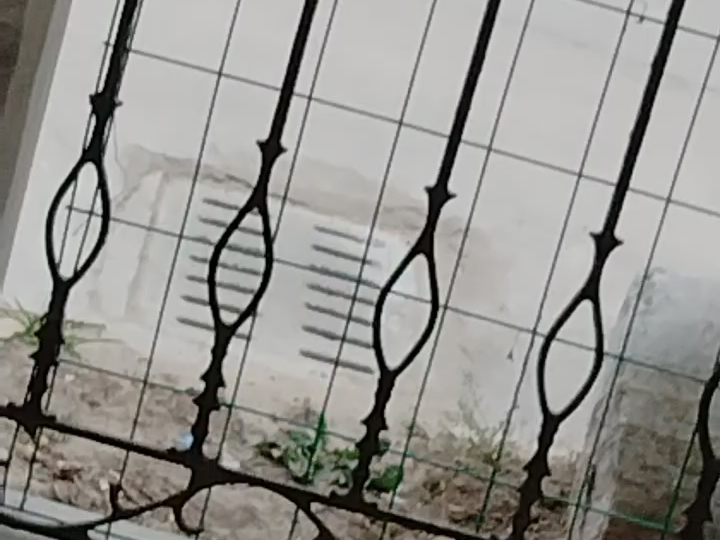 | 49 | 2026-02-15 |
| [哈基米被门给卡住了](https://www.bilibili.com/video/BV1iWZWBTEhv) | 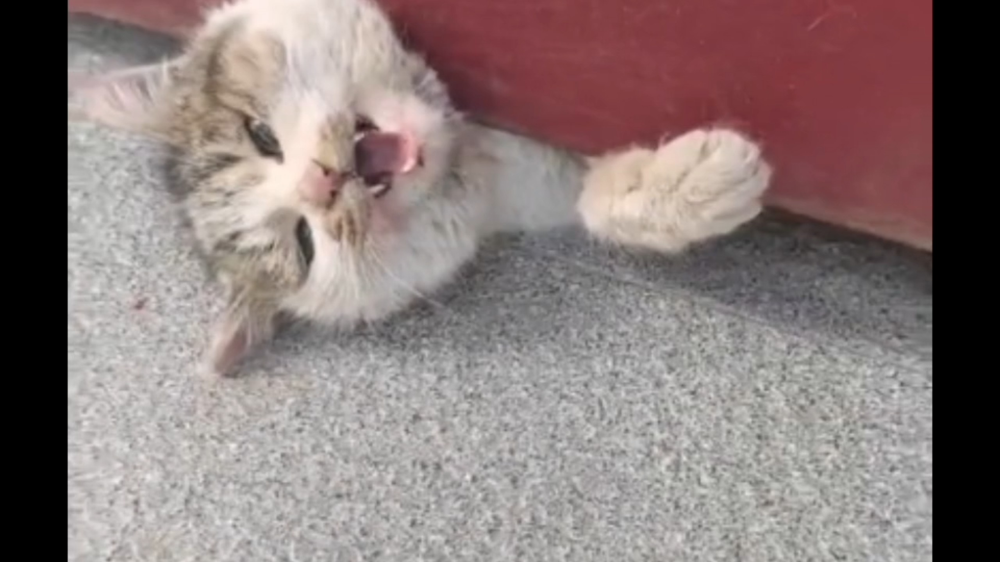 | 7642 | 2026-02-15 |
| [猫猫日常之哈基米牌蟹鸡面~~](https://www.bilibili.com/video/BV1yCZWBWEDC) |  | 315 | 2026-02-15 |
| [AI曼波，哈基米音乐摇滚版……](https://www.bilibili.com/video/BV1R4ZWBNEJu) |  | 138 | 2026-02-15 |
| [【哈基米音乐】致命交易killer，但是哈基米](https://www.bilibili.com/video/BV19tZWBeEkf) |  | 2627 | 2026-02-15 |
| [啊！哈吉米，你是一个哈基米，基米，基米，哈基米。](https://www.bilibili.com/video/BV1GMZsBTEmp) | 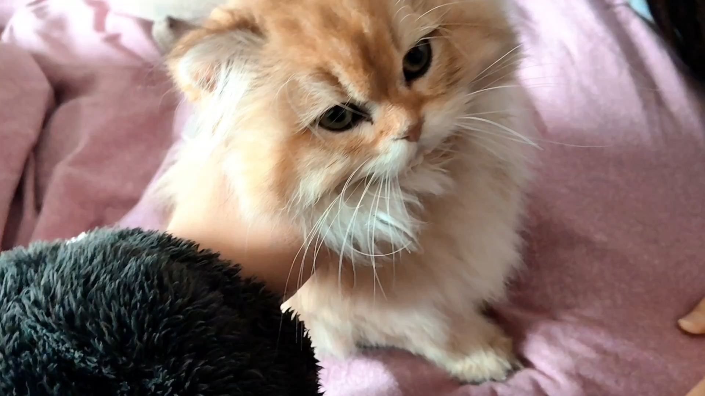 | 130 | 2026-02-15 |
| [绝世哈基米](https://www.bilibili.com/video/BV1jFZsBkEZZ) | 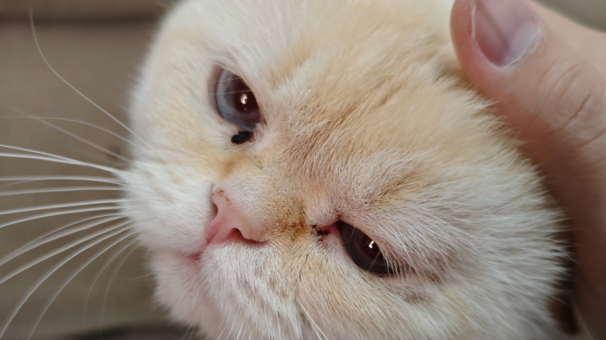 | 164 | 2026-02-15 |
| [拉猫条串烧纯享版](https://www.bilibili.com/video/BV1N7ZnByETa) | 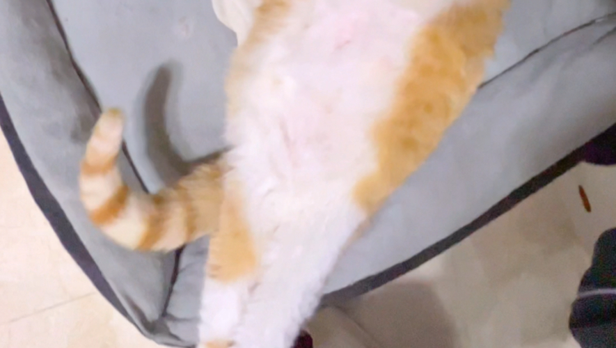 | 7831 | 2026-02-15 |
| [哈基米](https://www.bilibili.com/video/BV11sZsBxEek) | 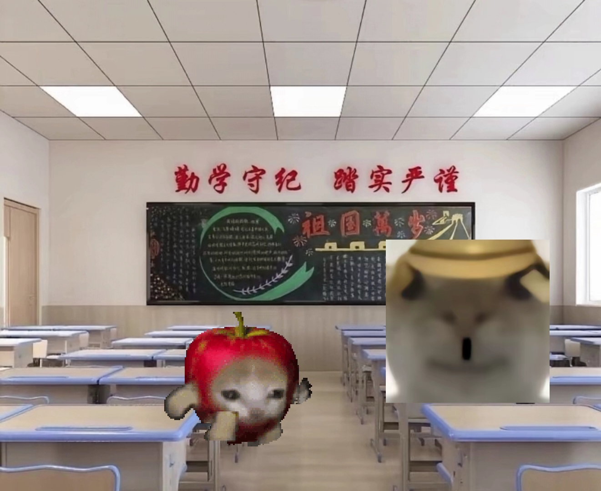 | 15 | 2026-02-15 |
| [哈基米](https://www.bilibili.com/video/BV14iZHBnEBV) | 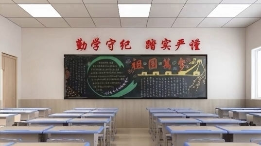 | 0 | 2026-02-15 |
| [☝🤓 武陵春节限定⚡⚡⚡](https://www.bilibili.com/video/BV14jcEzEEut) |  | 5.9万 | 2026-02-15 |
| [哈基米暴揍高市早苗](https://www.bilibili.com/video/BV1DSZnBQExf) |  | 1351 | 2026-02-15 |
| [伯虎说(哈基米版)](https://www.bilibili.com/video/BV1tYZHBpEd7) | 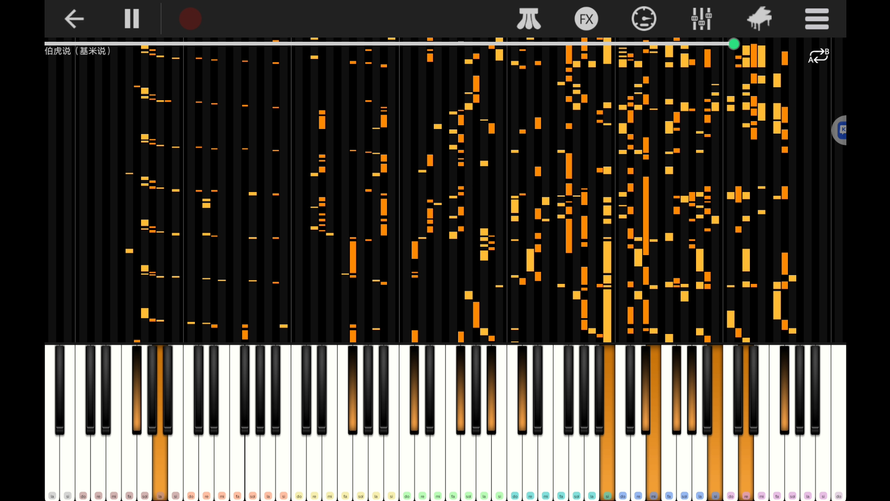 | 328 | 2026-02-15 |
| [五只哈基米偷吃鸽子被抓住了被抓后还在哈气](https://www.bilibili.com/video/BV18hZHB9ELs) | 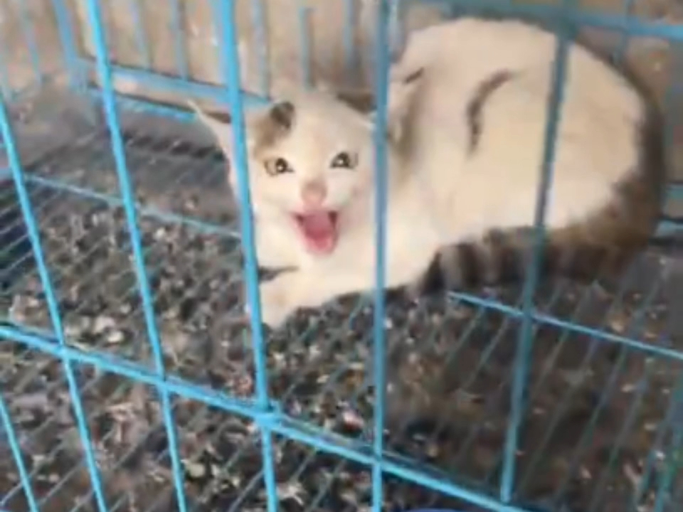 | 2048 | 2026-02-15 |
| [【哈基米南北綠豆2】最新视频上线，求关注！](https://www.bilibili.com/video/BV13MZpBbEHX) |  | 0 | 2026-02-15 |
| [哈基米大战曼波2](https://www.bilibili.com/video/BV1VcZnBxEqN) |  | 15 | 2026-02-14 |
| [哈基米](https://www.bilibili.com/video/BV11RZEB6EYP) |  | 0 | 2026-02-14 |
| [【不同寻常的哈基米】最新视频来袭，快来看看吧！](https://www.bilibili.com/video/BV1LaZEB4EJM) | 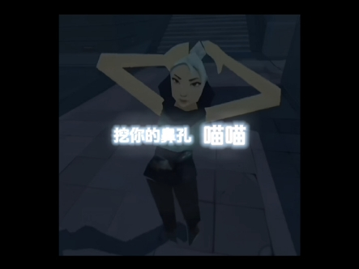 | 2 | 2026-02-14 |
| [【贾斯汀·基伯】What Do You 米？](https://www.bilibili.com/video/BV1hkZEBSEMp) | 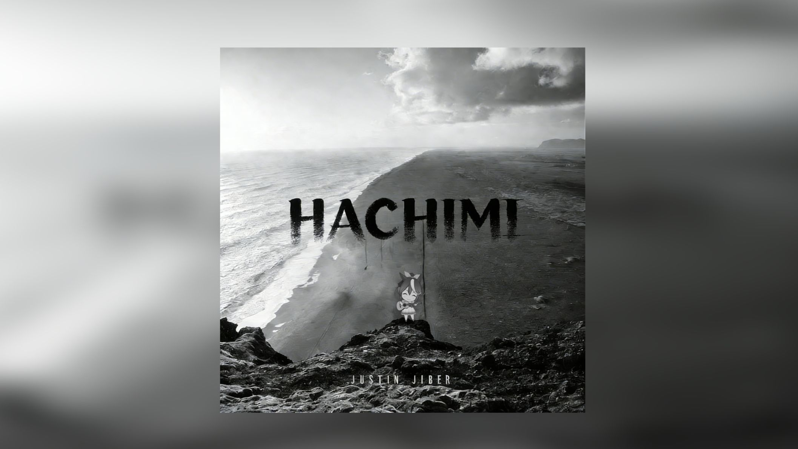 | 2898 | 2026-02-14 |
| [【哈基米的小老鼠】第一支视频求三连！](https://www.bilibili.com/video/BV19BZEBHELM) |  | 1 | 2026-02-14 |
| [【赛尔号】既然逃出限3，那么就要开始哈气了，米修莉与古王双主力阵容对新环境的探索](https://www.bilibili.com/video/BV1rKZJBAEcL) |  | 8678 | 2026-02-14 |
| [黑黑的曼巴低垂 地下的牢大枯萎.](https://www.bilibili.com/video/BV11DZjBvEvi) |  | 161.3万 | 2026-02-14 |
| [【哈基米音乐】向活全家奔去](https://www.bilibili.com/video/BV16oZ5BXEX7) | 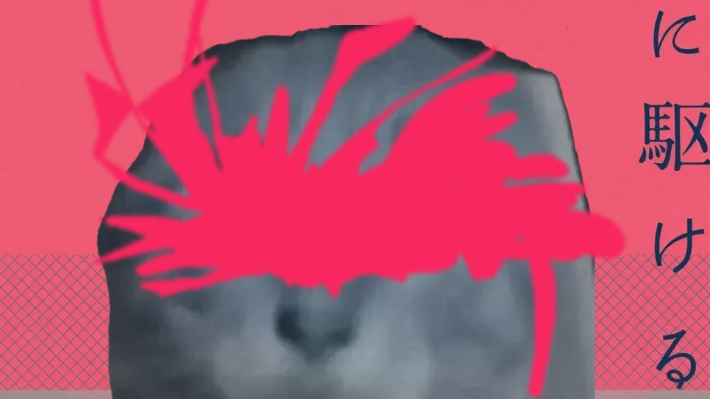 | 783 | 2026-02-14 |
| [🧧基米到🧧马年听小马唱会发财](https://www.bilibili.com/video/BV1XMcnzhEUb) |  | 2422 | 2026-02-14 |
| [你们觉得小基米想回家吗？](https://www.bilibili.com/video/BV1WDZ5BZE7C) | 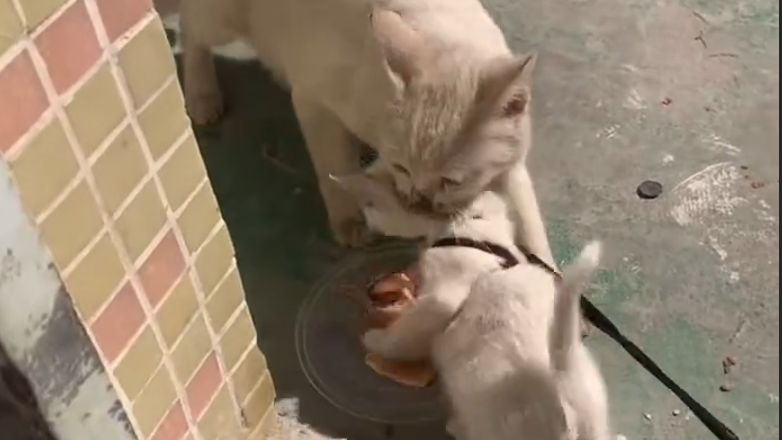 | 3.0万 | 2026-02-14 |
| [哈基米这个开脊背](https://www.bilibili.com/video/BV1wXZ5B4Epo) | 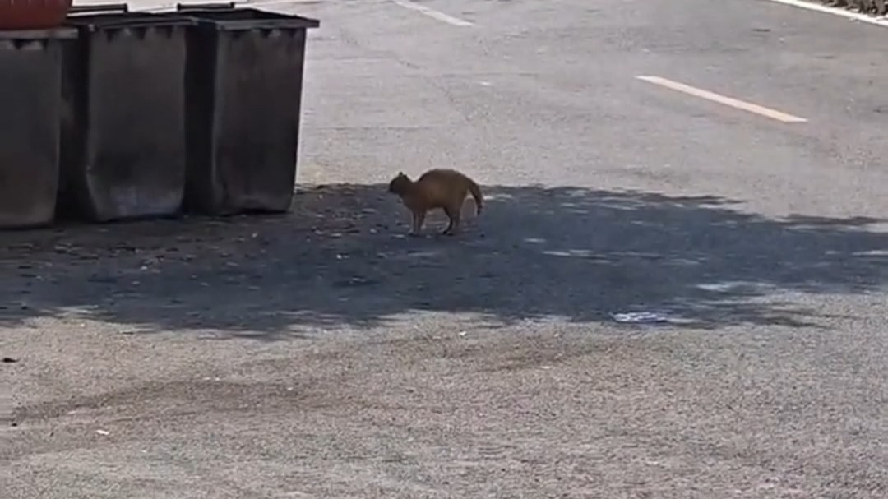 | 1293 | 2026-02-14 |
| [竟然是哈基米递花嘛！女监管者送花动作合集！](https://www.bilibili.com/video/BV1QoZLBkEj6) |  | 3.7万 | 2026-02-14 |
| [哈基米这个荡秋天](https://www.bilibili.com/video/BV18AZjBBEK6) | 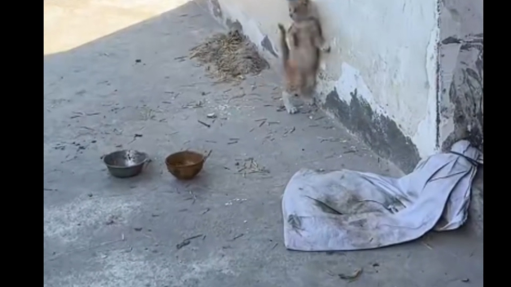 | 1.2万 | 2026-02-14 |
| [一群可爱哈基米 爱起来毫无负担](https://www.bilibili.com/video/BV14NcWzcEkw) |  | 4779 | 2026-02-14 |
| [前方高能！马年和豆基米一起策马冲锋，并肩作战！ 《豆基米新年大作战》热血上映！](https://www.bilibili.com/video/BV1ktcnzmERk) |  | 3056 | 2026-02-14 |
| [【吉星派对】讨厌哈基米的有难了！](https://www.bilibili.com/video/BV1GvcWz6EFn) |  | 2.2万 | 2026-02-14 |
| [哈基米捡到野生猫粮，手忙脚乱美美得吃](https://www.bilibili.com/video/BV1Pzc7zCEZQ) | 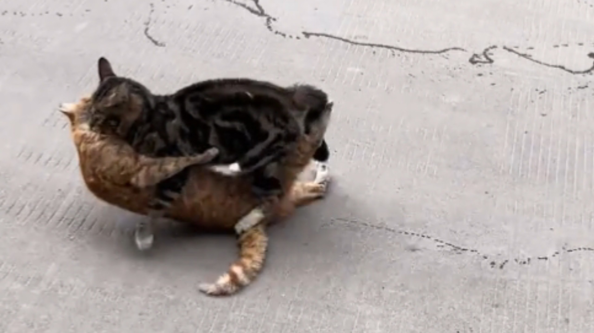 | 2608 | 2026-02-13 |
| [热门的哈基米小曲](https://www.bilibili.com/video/BV1Wzc7zCEZy) |  | 257 | 2026-02-13 |
| [【梗百科】我的刀盾和哔哔拉布是啥梗？](https://www.bilibili.com/video/BV1LRcLzREG9) |  | 272.7万 | 2026-02-13 |
| [【哈基米音乐】好汉歌](https://www.bilibili.com/video/BV1Ecc3zLExa) |  | 6.4万 | 2026-02-13 |
| [seedance2.0做的自家猫大战贝利亚之——《致以辉煌的哈基米》](https://www.bilibili.com/video/BV1YJcLzUEqu) | 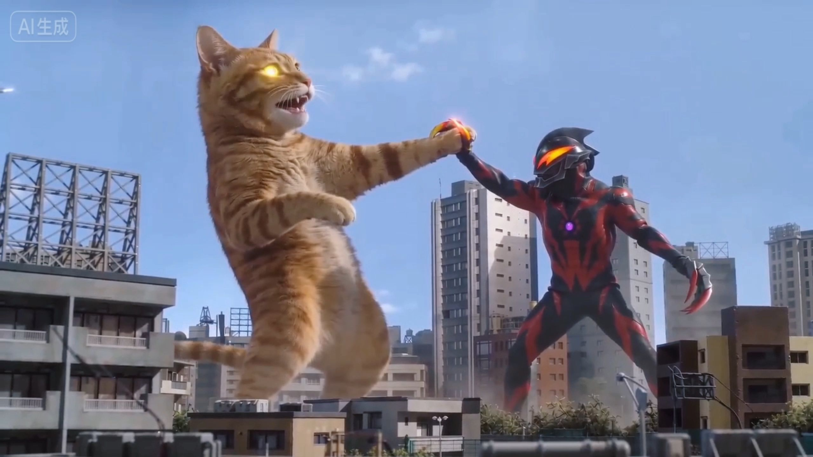 | 1021 | 2026-02-13 |
| [【沐霂】看到万恶之源“哈基米南北绿豆”片段绷不住跟唱了起来🤣](https://www.bilibili.com/video/BV1MHcVzzEZn) |  | 9930 | 2026-02-13 |
| [护食哈基米](https://www.bilibili.com/video/BV1AjcqzcEe8) | 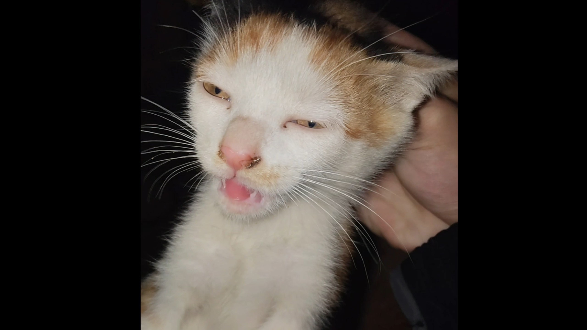 | 1891 | 2026-02-12 |
| [哈吉米五大神曲](https://www.bilibili.com/video/BV1kccBzFE3q) | 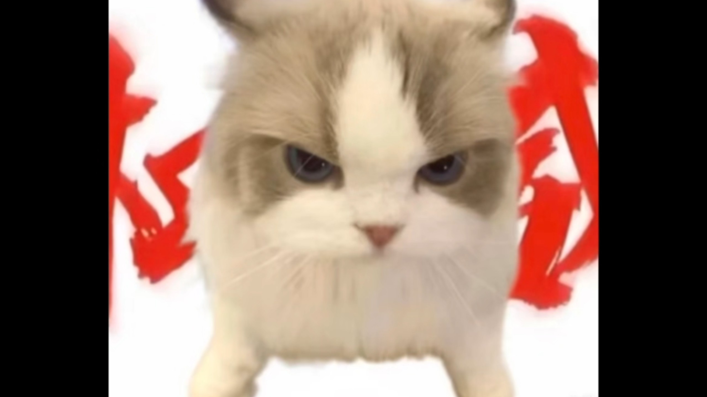 | 312 | 2026-02-12 |
| [哈基米大战哥斯拉完整版](https://www.bilibili.com/video/BV1MUcqzuEK5) |  | 2220 | 2026-02-12 |
| [哈基兔大战哈基鸡【哈基动物园199.2期】seedance2.0](https://www.bilibili.com/video/BV1zdchzuEZK) |  | 1.4万 | 2026-02-12 |
| [虐猫实录，胆小者误入#血腥#暴力#分尸#](https://www.bilibili.com/video/BV1iYcxzSE7X) | 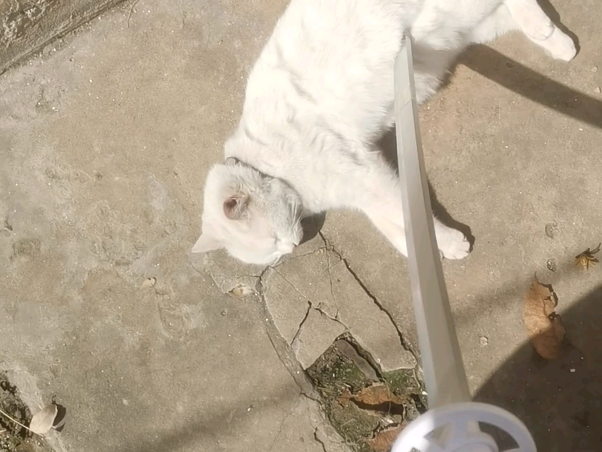 | 1518 | 2026-02-11 |
| [seedance2.0 布偶猫大战奥特曼](https://www.bilibili.com/video/BV1hqFSz3E2Q) |  | 49.1万 | 2026-02-10 |
| [终极觉醒张飞化身哈基米疯狂哈气，这集是真的吓哭了](https://www.bilibili.com/video/BV1scF1zJEq9) |  | 4077 | 2026-02-09 |
| [基米小学：操场树下的老鼠冒斯](https://www.bilibili.com/video/BV11NcgzXEnN) | 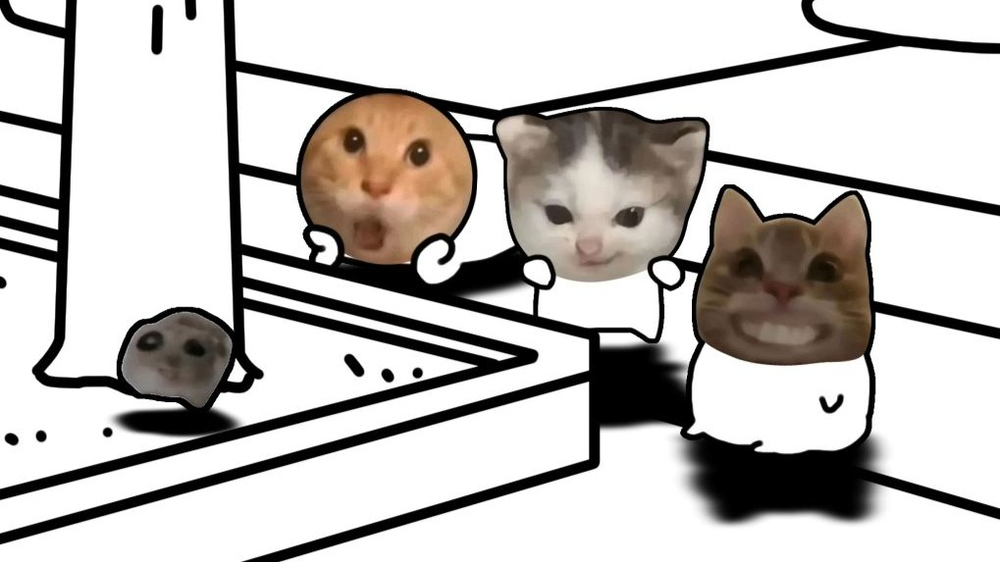 | 9.0万 | 2026-02-09 |
| [香蕉猫找妈妈](https://www.bilibili.com/video/BV11HFZzWEGp) |  | 697.4万 | 2026-02-08 |
| [🐧精喂！是嘎中王来了🍬](https://www.bilibili.com/video/BV1fSFnzzE4X) |  | 46.5万 | 2026-02-08 |
| [就这个弹舌爽！辛巴巴八六比拉~](https://www.bilibili.com/video/BV1QuFWzeEpM) |  | 29.3万 | 2026-02-07 |
| [《弥渡山歌》哈吉米版。](https://www.bilibili.com/video/BV1AFFpzQEdN) | 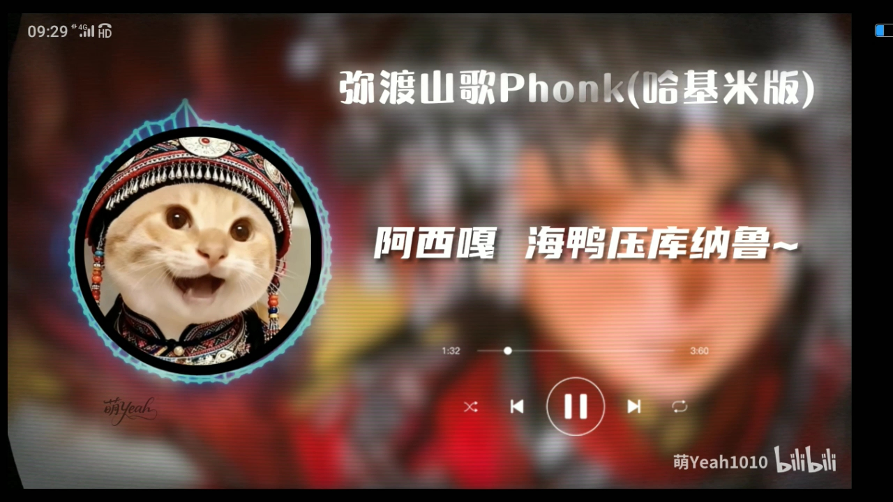 | 353 | 2026-02-07 |
| [咏哈-哈基米版咏春](https://www.bilibili.com/video/BV1WBFrzBEMU) |  | 2759 | 2026-02-06 |
| [哈基拜月？莺莺拜基？](https://www.bilibili.com/video/BV1MxFuz4Efo) |  | 1.4万 | 2026-02-03 |
| [🐧Lの小曲 咕咕嘎嘎纯享🐧](https://www.bilibili.com/video/BV1XB6zBcEMu) | 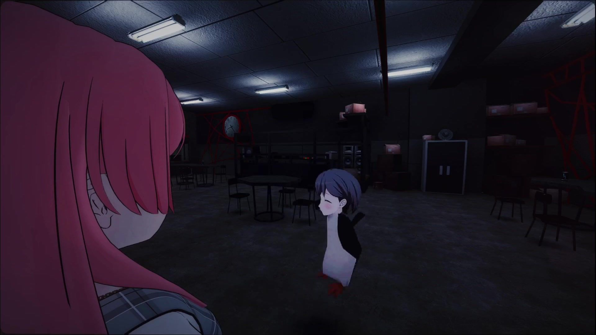 | 164.9万 | 2026-01-30 |
| [发一只哈基米](https://www.bilibili.com/video/BV1jaq1BUEsY) |  | 79 | 2025-12-21 |
| [【印度神曲】-《Aankhen Khuli 》!你学会了吗？](https://www.bilibili.com/video/BV1R9kXBLEzk) |  | 143.2万 | 2025-11-09 |
| [【哈基米音乐】好，是让歹人传下来了（√）（莺莺拜月）](https://www.bilibili.com/video/BV1HYs5zWELX) | 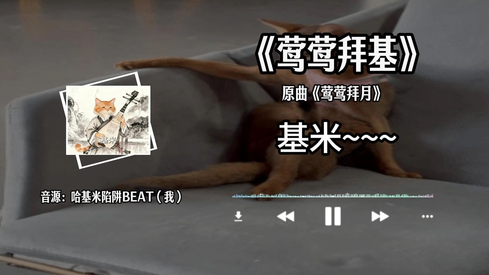 | 1.9万 | 2025-10-23 |
| [哈吉米窝南北绿豆阿西哈亚库](https://www.bilibili.com/video/BV174JXz5EKK) | 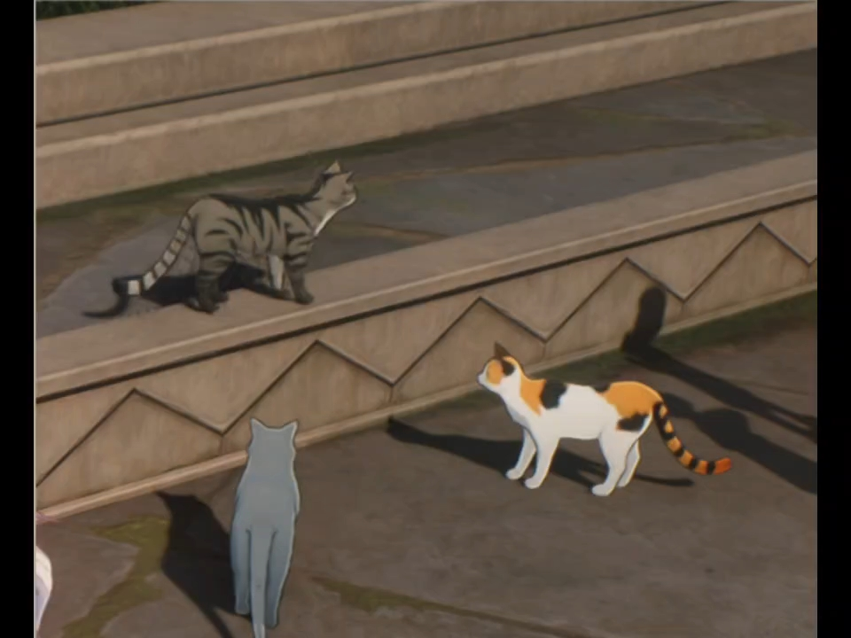 | 1420 | 2025-09-24 |
| [米基炫尸：火烈猫🐱（原曲米津玄师Flamingo）【哈基米音乐】](https://www.bilibili.com/video/BV12VeozzEmT) |  | 558 | 2025-08-25 |
| [哈基米：Flamingo🐱](https://www.bilibili.com/video/BV1WxeBzUEiA) |  | 1095 | 2025-08-23 |
| [【Arcaea/哈基米大跑酷】ENERGY SYNERGY MATRIX [Beyond] PM (Max-13)](https://www.bilibili.com/video/BV1GYGtzmEET) |  | 447 | 2025-04-30 |
| [哈基米键帽处刑曲：Bangarang](https://www.bilibili.com/video/BV1ShaUeZEWL) |  | 43.3万 | 2024-08-07 |
| [无敌哈基米，梦泪都看哭了](https://www.bilibili.com/video/BV1tM4m127f2) |  | 5671 | 2024-07-12 |
| [【ainitama迷你解】什么是哈基米？](https://www.bilibili.com/video/BV1wG411f7Dk) |  | 1248 | 2023-08-16 |

---
*最后更新: 2026-02-16 03:13:23 (自动生成)*
*数据来源: [Bilibili](https://www.bilibili.com)*

## 使用说明

运行以下命令更新视频列表:
```bash
python3 fetch_hajimi_videos.py
```
