# awesome-hajimi
collections of hajimi (哈基米 in Chinese) on the Internet.

## 视频列表 (Video List)

| 视频标题 (Title) | 封面 | 播放量 (Views) | 发布日期 (Date) |
|---|---|---|---|
| [【限流补档】哈顺米：快乐的基米](https://www.bilibili.com/video/BV1EGUrBKEuo) |  | 103 | 2025-11-25 |
| [现在的哈基米和以前的哈基米](https://www.bilibili.com/video/BV1RMU2BVEya) | 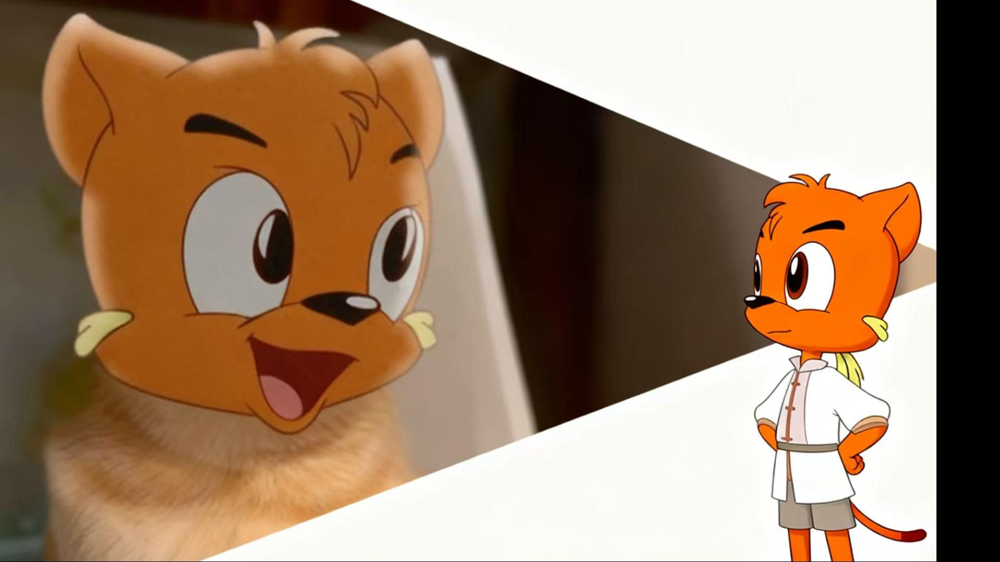 | 134 | 2025-11-24 |
| [哈无歇](https://www.bilibili.com/video/BV1feU6BwEWr) |  | 14.7万 | 2025-11-24 |
| [哈基米就是一束光！](https://www.bilibili.com/video/BV1uYUTB9ENN) | 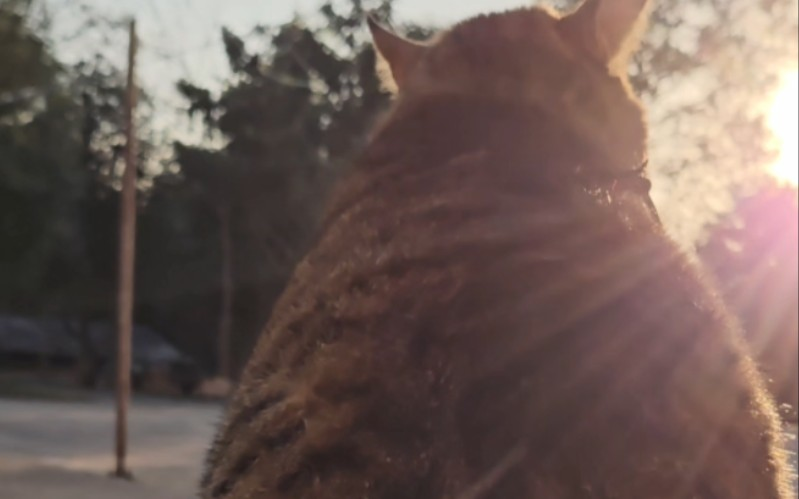 | 2455 | 2025-11-23 |
| [“偷看**”——哈基米13](https://www.bilibili.com/video/BV1uxUNBDEAo) |  | 146 | 2025-11-23 |
| [【哈基米南北绿灯】我的最新作品，快来一睹为快！](https://www.bilibili.com/video/BV1E3UNBcEAF) |  | 784 | 2025-11-23 |
| [哈基米～](https://www.bilibili.com/video/BV1e4UFByEw3) |  | 6066 | 2025-11-23 |
| [猫：今天是一期擦屁屁教程，哈基米们好好学](https://www.bilibili.com/video/BV1wzUABPEew) | 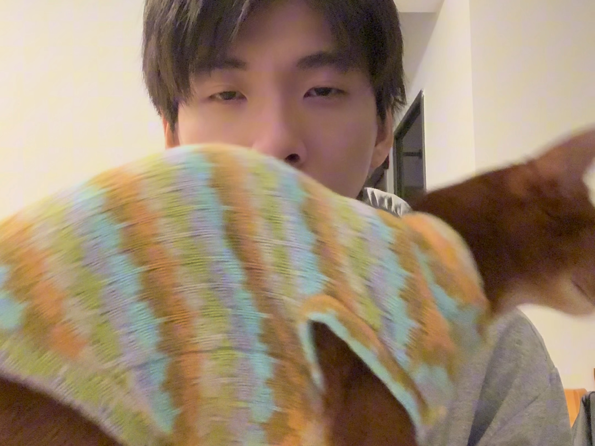 | 1055 | 2025-11-23 |
| [【哈基米南北绿灯】最新视频上线，求关注！](https://www.bilibili.com/video/BV1rxUKBzEGk) | 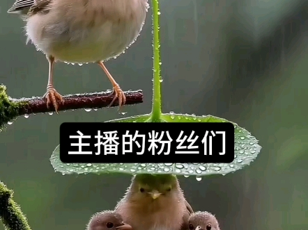 | 15 | 2025-11-23 |
| [哈基米我的哈基米。](https://www.bilibili.com/video/BV1czUABPEJL) |  | 173 | 2025-11-23 |
| [小狗汪汪૮ •͈ᴗ•͈ ა](https://www.bilibili.com/video/BV1WfUPBuEep) |  | 4.3万 | 2025-11-23 |
| [【肖肖哈基米的店】视频加载中，速速查收惊喜！](https://www.bilibili.com/video/BV1BHUwBdEGN) |  | 0 | 2025-11-23 |
| [【完整版】【哈基米这个可爱】🎵 彼女は旅に出る🎵（她踏上了旅程）带你回到2020年的夏天](https://www.bilibili.com/video/BV1x5U4BBE8e) |  | 3.2万 | 2025-11-22 |
| [大狗嚼俱乐部撞车哈基米俱乐部](https://www.bilibili.com/video/BV1MAUsBMEHX) |  | 3114 | 2025-11-22 |
| [【哈基米曼波】【循环歌单】｜ 【Normal No More】｜ 《小清新の小曲》](https://www.bilibili.com/video/BV14TUsBvE1x) |  | 474 | 2025-11-22 |
| [叮咚鸡音乐：打火鸡](https://www.bilibili.com/video/BV1JeUHBJEic) | 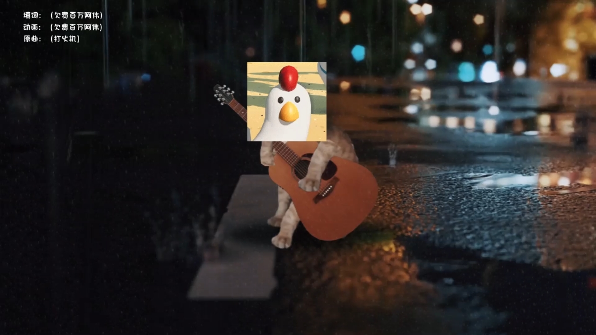 | 334 | 2025-11-22 |
| [路边的小猫被骑电瓶车的小猫压了。](https://www.bilibili.com/video/BV1M6UpBNEx9) | 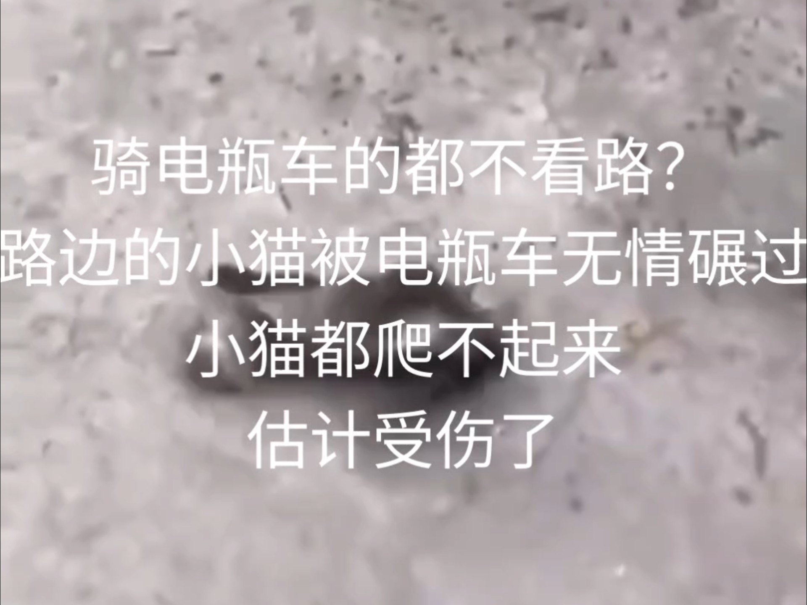 | 9483 | 2025-11-22 |
| [哈基米居然跑了](https://www.bilibili.com/video/BV19hUpBgEPs) | 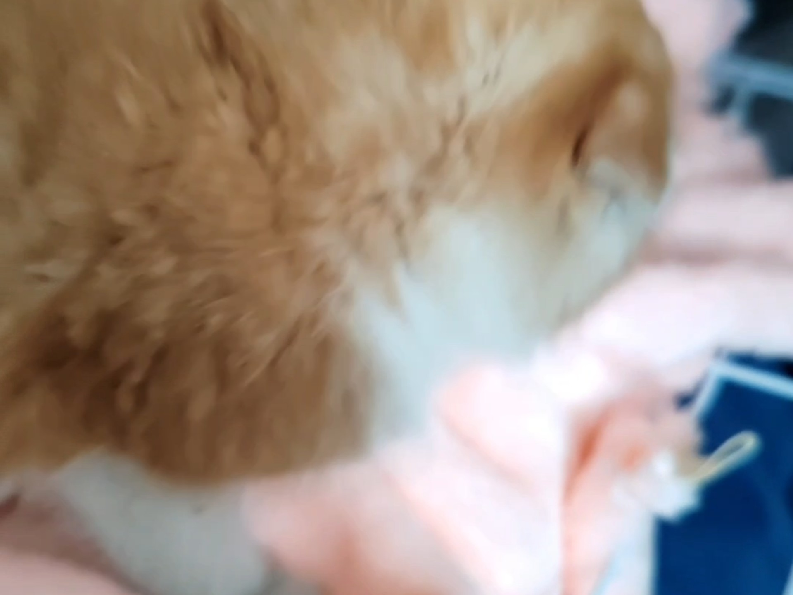 | 158 | 2025-11-22 |
| [当哈基米学会了直立行走！他就进化为地企鹅！](https://www.bilibili.com/video/BV1zFUWBnEHm) | 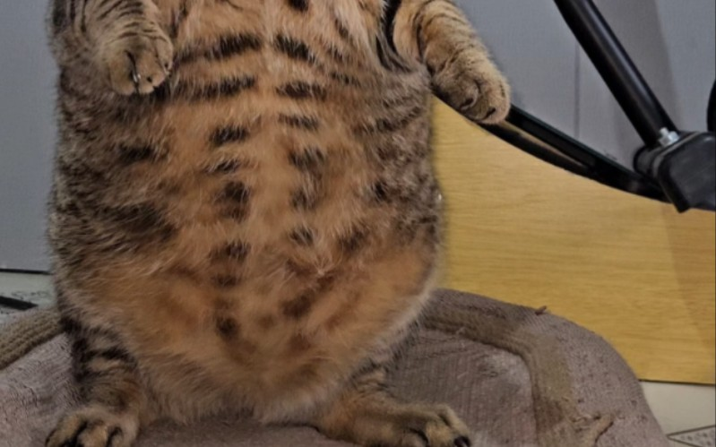 | 5806 | 2025-11-22 |
| [猫儿这个善变](https://www.bilibili.com/video/BV17KUWB7EWT) |  | 6.1万 | 2025-11-22 |
| [真的太甜了！【永濑莉子】✖泰曼波（哈基米） 走秀混剪](https://www.bilibili.com/video/BV1CQUpBdENK) |  | 83 | 2025-11-22 |
| [🐱那个快乐的哈基米去哪了🐱](https://www.bilibili.com/video/BV1mCCZBnELo) | 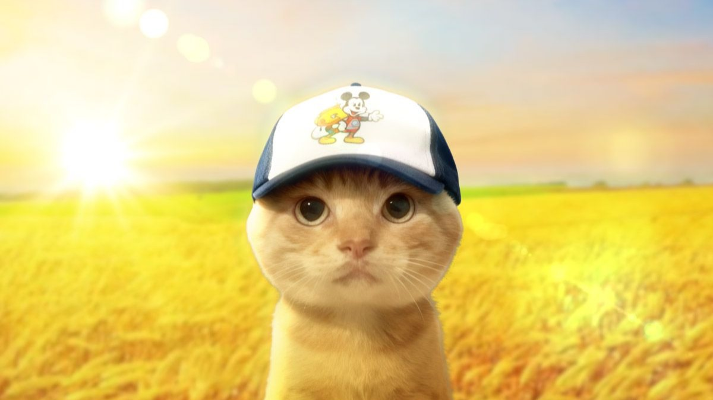 | 8.3万 | 2025-11-22 |
| [花田哈基米（起床）（おはなばたけ）简谱完整版](https://www.bilibili.com/video/BV1KfU7B2EGb) | 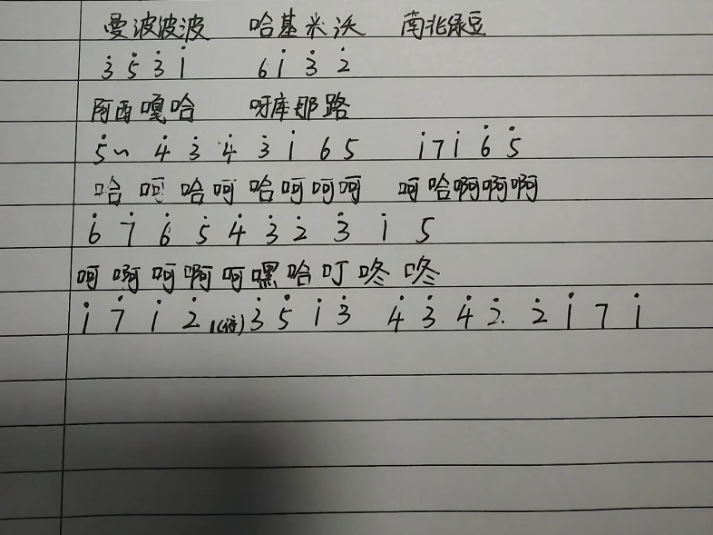 | 186 | 2025-11-21 |
| [手喂哈基肺，水中小狗这一块](https://www.bilibili.com/video/BV1QJUjBWE9k) | 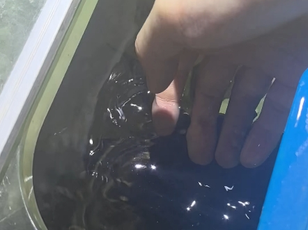 | 178 | 2025-11-21 |
| [猫](https://www.bilibili.com/video/BV11xyMBrECH) | 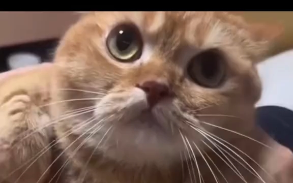 | 978 | 2025-11-21 |
| [传说中的喵星](https://www.bilibili.com/video/BV14YyABYEEE) | 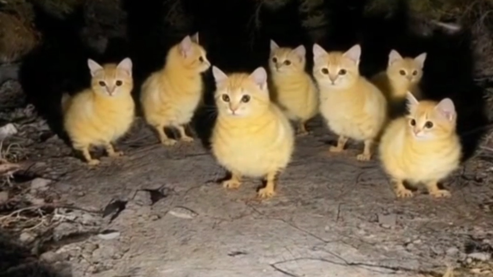 | 2.5万 | 2025-11-20 |
| [基米说（P2伯虎说原版，加量不加价）](https://www.bilibili.com/video/BV1LRycB6EGU) |  | 715 | 2025-11-20 |
| [谁会拒绝可爱的哈基米呢？](https://www.bilibili.com/video/BV1nrycBJESu) | 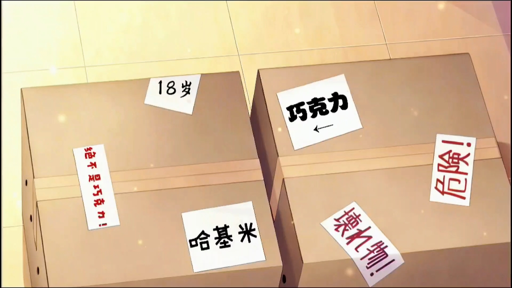 | 123 | 2025-11-20 |
| [【补】【已打码】基米的作案工具欠没收了](https://www.bilibili.com/video/BV1RzywBzE5v) |  | 2.4万 | 2025-11-20 |
| [秀才哈基米](https://www.bilibili.com/video/BV198CZBFEX8) | 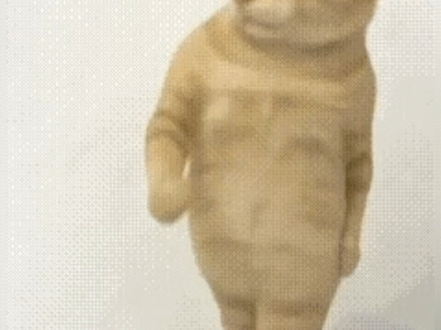 | 500 | 2025-11-20 |
| [卧槽！太逆天了！tiktok外网评论外国美女唱哈基米歌曲](https://www.bilibili.com/video/BV1vUyJB4Efi) |  | 2516 | 2025-11-19 |
| [“库里之歌”是个啥？短短几天25亿播放，网友：太魔性了！](https://www.bilibili.com/video/BV1EPyHBKEFk) |  | 21.7万 | 2025-11-19 |
| [哈基米大战哈基蛇](https://www.bilibili.com/video/BV1CVynBgEwM) | 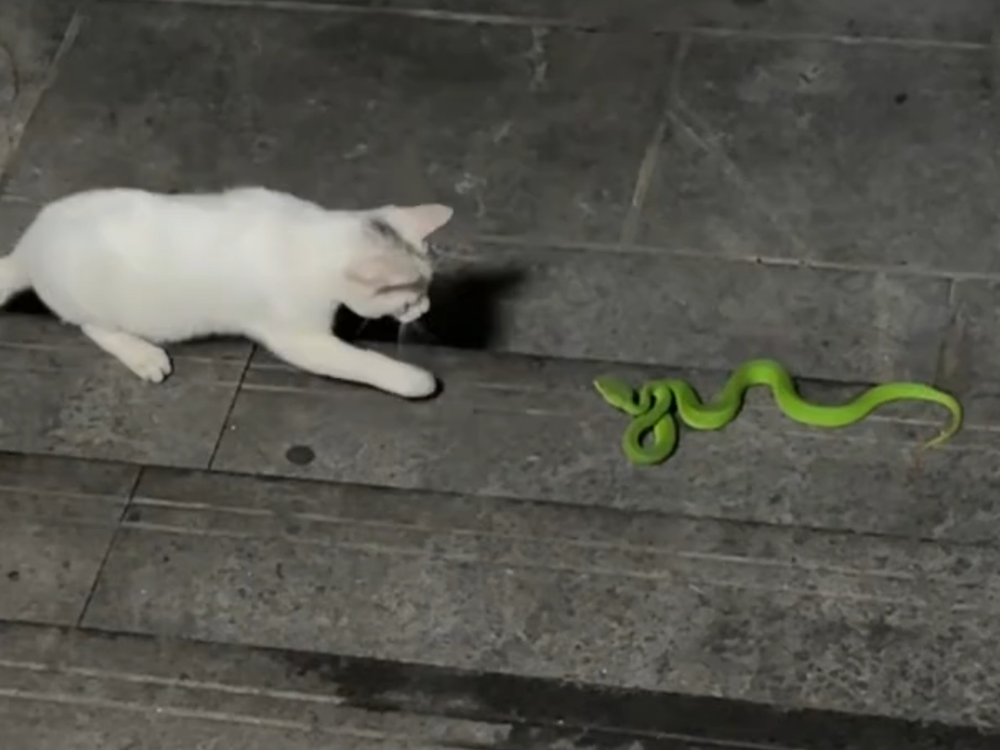 | 2599 | 2025-11-19 |
| [抽象之王哈基米](https://www.bilibili.com/video/BV1u6ynBQEEZ) |  | 4789 | 2025-11-19 |
| [哈基米牌打火基](https://www.bilibili.com/video/BV1v7y5BVECB) | 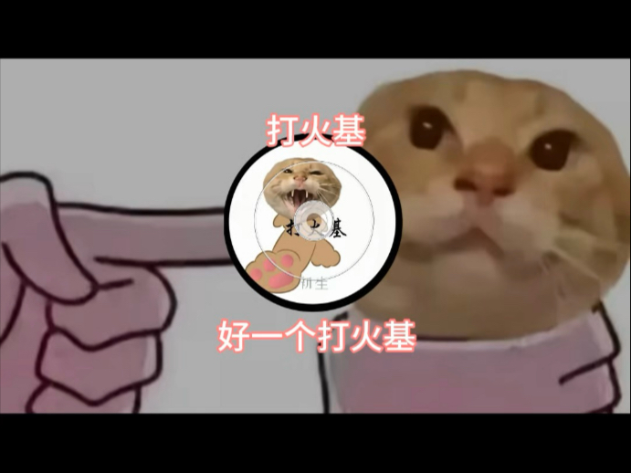 | 120 | 2025-11-18 |
| [《十四首哈基米卡农》，HaWV1087](https://www.bilibili.com/video/BV1q8y3BqERx) |  | 269 | 2025-11-18 |
| [下面有请DJ哈基米！](https://www.bilibili.com/video/BV1JgCkBZEzE) | 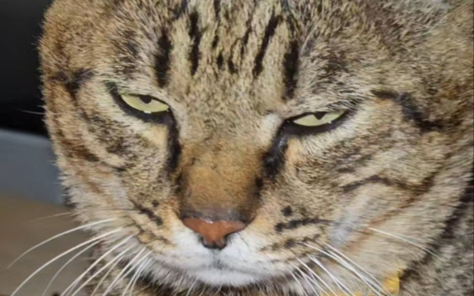 | 3416 | 2025-11-18 |
| [南北绿豆是什么梗？大品牌九月豆浆带头吃猫血馒头？【网梗指南】](https://www.bilibili.com/video/BV1FBCeBqEuC) |  | 10.5万 | 2025-11-17 |
| [天上掉下个哈基米鸭💚💚](https://www.bilibili.com/video/BV1waCeBrEGu) |  | 311 | 2025-11-17 |
| [【哈基米】你的哈气在何方——where is your haji](https://www.bilibili.com/video/BV17eC8B9E7S) |  | 1363 | 2025-11-17 |
| [【哈基米音乐】如果当时](https://www.bilibili.com/video/BV1KFC9BNEwZ) |  | 459 | 2025-11-16 |
| [《找基米》](https://www.bilibili.com/video/BV16QC9BbEQk) |  | 11.3万 | 2025-11-16 |
| [哈基米之少林功夫猫猫拳](https://www.bilibili.com/video/BV1PZCDBZEB7) | 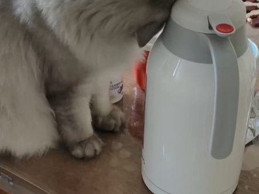 | 297 | 2025-11-16 |
| [曼波对战进行曲（超燃）[哈基米音乐]](https://www.bilibili.com/video/BV1Z4CtBSE23) |  | 393 | 2025-11-13 |
| [哈牛魔](https://www.bilibili.com/video/BV1ZTC4ByEJ7) | 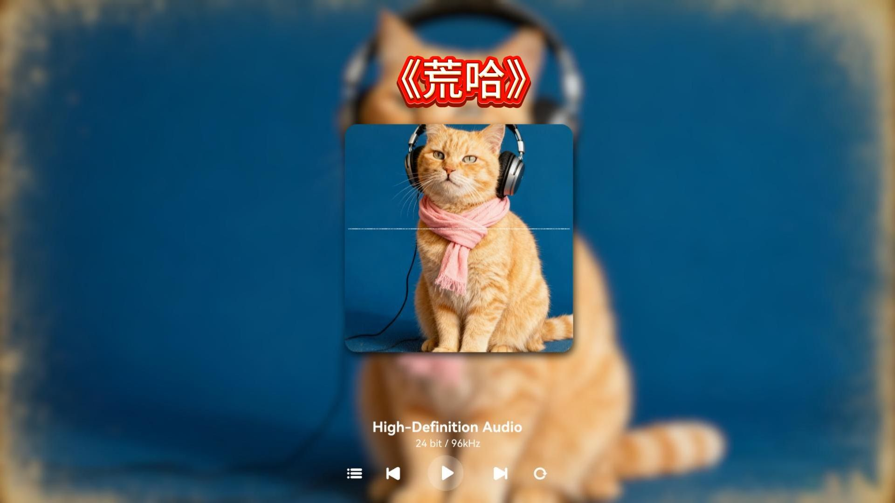 | 165 | 2025-11-13 |
| [《打火机》哈基米哟南北绿豆](https://www.bilibili.com/video/BV1xsCFBEEtA) |  | 694 | 2025-11-10 |
| [“  三 基 米 的 抗 议 ”](https://www.bilibili.com/video/BV1Aq1DBFEzQ) | 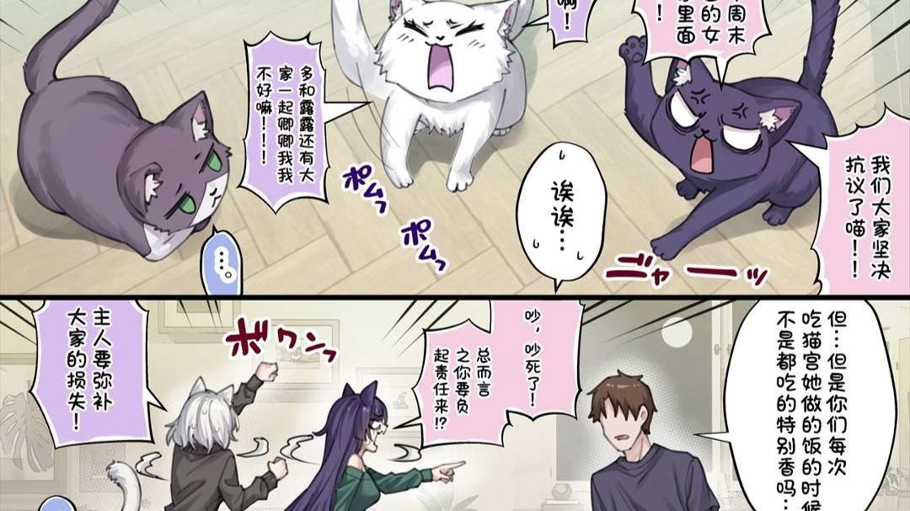 | 15.1万 | 2025-11-08 |
| [疯狂哈气的哈基米](https://www.bilibili.com/video/BV1VC2NBHEV8) | 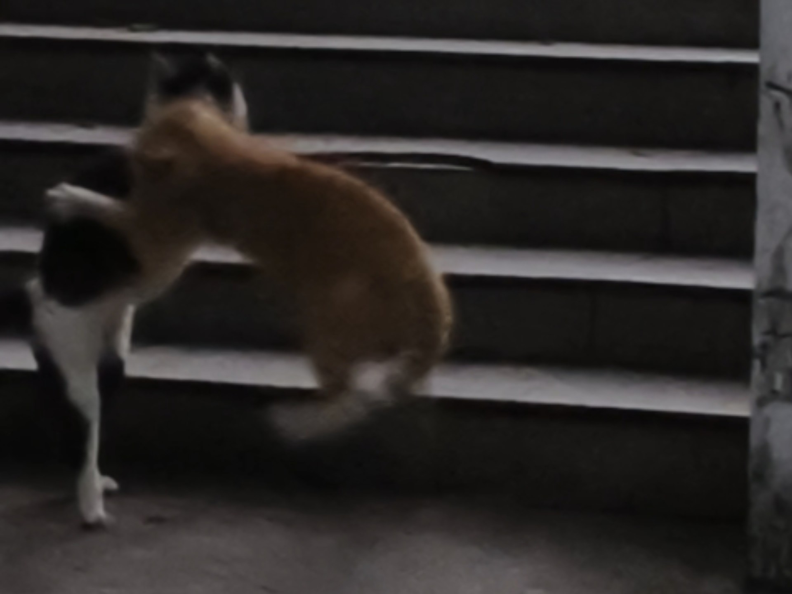 | 301 | 2025-11-06 |
| [【哈基米音乐】A.P.T?哈基米! 哈基米! （A.P.T哈基米）](https://www.bilibili.com/video/BV19j2wBGE14) | 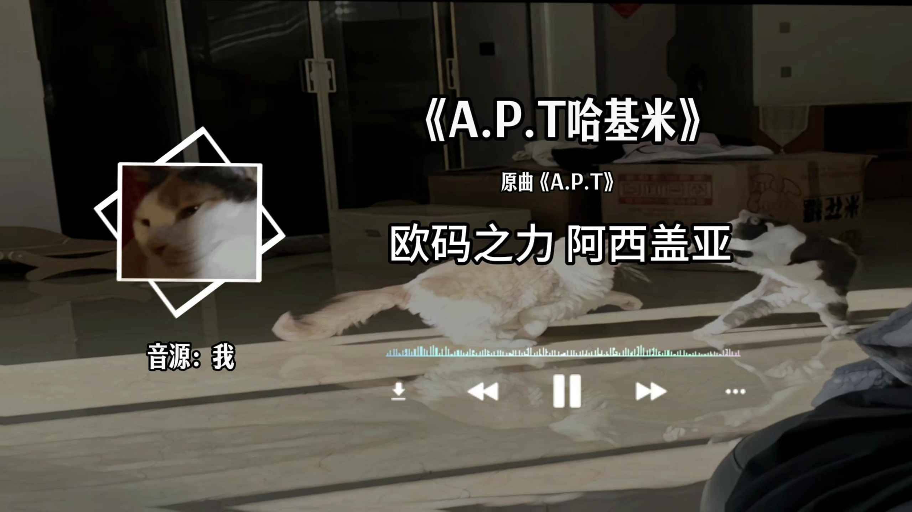 | 1025 | 2025-11-06 |
| [“悬溺一响，哈基米紫登场”](https://www.bilibili.com/video/BV1fv1WB1Ese) |  | 3.5万 | 2025-11-05 |
| [舌尖上的哈基米（完整版）](https://www.bilibili.com/video/BV1AG1BBZEXT) |  | 256 | 2025-11-03 |
| [【智人TV】在水库旁放生哈基米，导致猫被迫在水里游泳](https://www.bilibili.com/video/BV1cfyRBqEbA) | 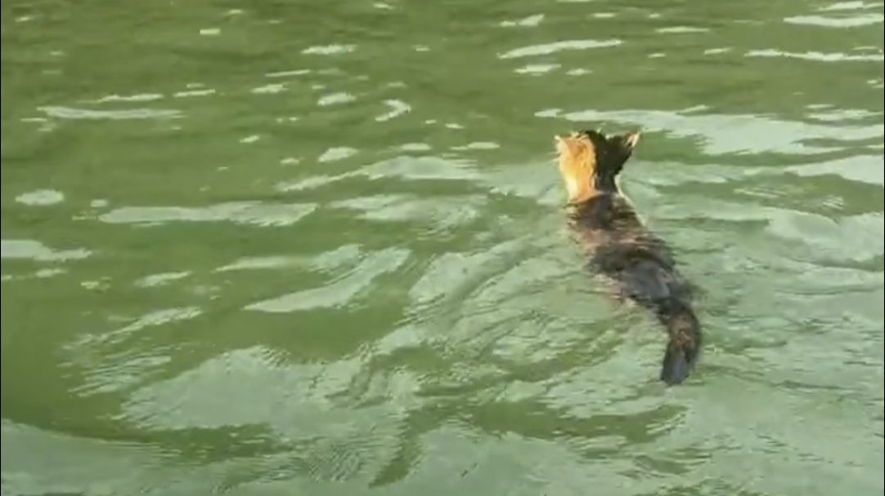 | 20.9万 | 2025-11-02 |
| [全网首翻《欧马吉利 Lose Control》～叮叮咚鸡叮曼波，哈基米南北绿豆～](https://www.bilibili.com/video/BV1Ht1GBQEdW) |  | 1704 | 2025-11-01 |
| [要抱抱猫meme](https://www.bilibili.com/video/BV1T7sWzxERj) |  | 6.0万 | 2025-10-24 |
| [就让哈基米来哄你入睡吧💤](https://www.bilibili.com/video/BV14bW2zpEWY) |  | 2.7万 | 2025-10-20 |
| [舞娘服 哈基米摇（补档）](https://www.bilibili.com/video/BV1LqsgzNENc) |  | 3.6万 | 2025-10-20 |
| [九九成～稀罕物～](https://www.bilibili.com/video/BV1JWWsz7E4f) | 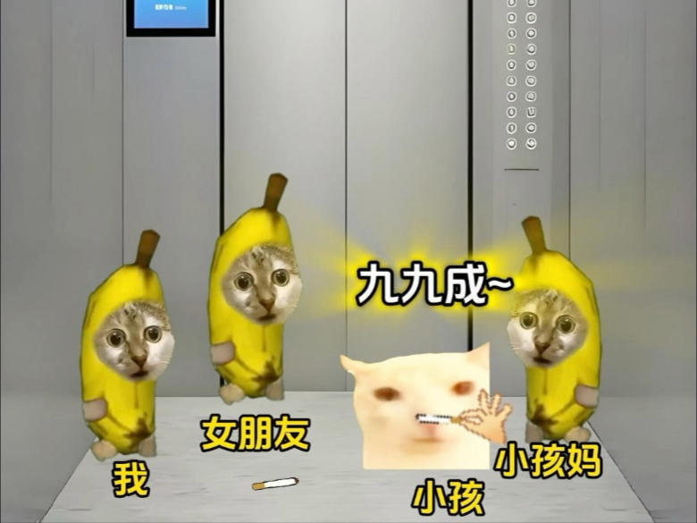 | 3.8万 | 2025-10-18 |
| [音乐小球版《打火基》来了！](https://www.bilibili.com/video/BV1Cc4vzXEdT) | 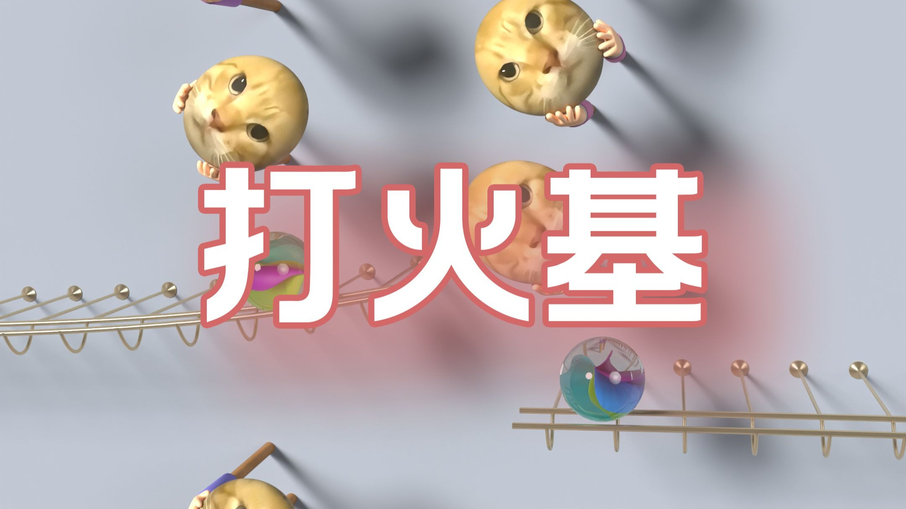 | 7.1万 | 2025-10-15 |
| [[哈基米音乐]🎵爱的魔法🎵](https://www.bilibili.com/video/BV15c4PzpEE1) |  | 472 | 2025-10-11 |
| [《打火机》小八](https://www.bilibili.com/video/BV1ZP4JzvEWT) |  | 10.2万 | 2025-10-10 |
| [哈基米：意外（Short.ver）](https://www.bilibili.com/video/BV1eAxnzwEmY) |  | 3579 | 2025-10-04 |
| [循环歌单｜《远古云南人の小曲》哈尼宝贝](https://www.bilibili.com/video/BV1nFWcz1E1g) |  | 38.2万 | 2025-09-21 |
| [哈基米世界](https://www.bilibili.com/video/BV1YKpFzZEzt) |  | 14.7万 | 2025-09-14 |
| [【鱼肉肉】哈基米大王驾到](https://www.bilibili.com/video/BV1AFHiz1Eac) |  | 45.3万 | 2025-09-11 |
| [哈基米起床∠( ᐛ 」∠)＿](https://www.bilibili.com/video/BV1wYatz7EGJ) |  | 5.7万 | 2025-09-05 |
| [基米与斑马](https://www.bilibili.com/video/BV1oUaEz5Esj) |  | 4.7万 | 2025-09-01 |
| [将军：哈基米哦南北绿豆](https://www.bilibili.com/video/BV1XSeQzzEkM) |  | 9.1万 | 2025-08-27 |
| [即将被送上餐桌的哈基米，为什么人类对它们的恶意这么大……](https://www.bilibili.com/video/BV1hTeLzYEHP) |  | 8449 | 2025-08-24 |
| [黄金裔哈基米~猛毒注意！](https://www.bilibili.com/video/BV1TXeezyEUJ) |  | 14.3万 | 2025-08-23 |
| [哈基米星野](https://www.bilibili.com/video/BV123YDzXErd) |  | 11.7万 | 2025-08-22 |
| [哈基米山歌（参考虎纹章鱼老师）](https://www.bilibili.com/video/BV1CnYXzsE2x) |  | 8.6万 | 2025-08-21 |
| [河北哈基米(11分钟）](https://www.bilibili.com/video/BV1xKYWzGEum) | 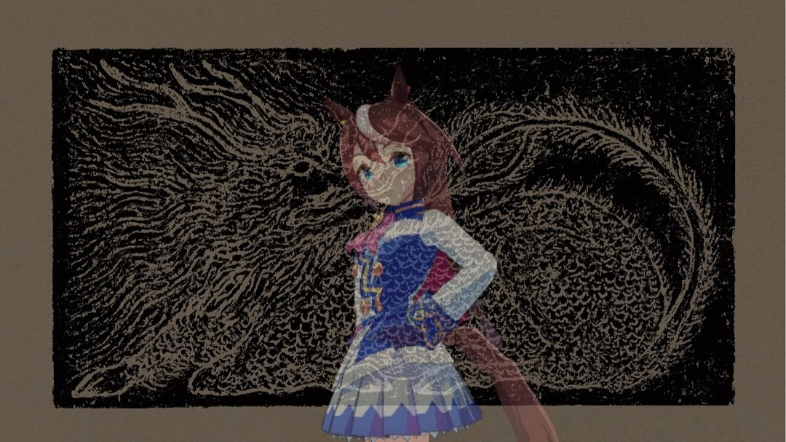 | 4.7万 | 2025-08-18 |
| [lulu听了哈基米的《蓝莲哈》后大脑哈基化 决定要在冰火唱【雫るる】](https://www.bilibili.com/video/BV19Pt9z4ErG) |  | 11.8万 | 2025-08-12 |
| [【哈基米FM】基米蹦跳传说（俺の爱基が！）](https://www.bilibili.com/video/BV1pKbKzyEEL) |  | 16.6万 | 2025-08-10 |
| [哈基米：Aria Math（创造の小曲）](https://www.bilibili.com/video/BV1UvtCzxEQW) |  | 8.7万 | 2025-08-08 |
| [【ASMR】极品罕见帝王引擎40分钟纯享，安神又放松可爱哈基米谁能不爱！小熊茉莉奥术魔刃20250807](https://www.bilibili.com/video/BV1eHtCzNE5d) |  | 15.6万 | 2025-08-07 |
| [🐱银河哈基米🐱《⚡ハチミギンガ⚡》ハチミギンガの歌](https://www.bilibili.com/video/BV1QwuezHEkK) |  | 40.0万 | 2025-07-14 |
| [蛋仔小黄x小黑Ai翻唱《跳楼机》（哈基米版）](https://www.bilibili.com/video/BV18VGPzVEbX) |  | 8.7万 | 2025-07-09 |
| [焦作——咪基米旷世奇哈](https://www.bilibili.com/video/BV12A3gznEpj) |  | 74.7万 | 2025-07-03 |
| [《寻梦哈基米》pt1：梦寻南方基米游记](https://www.bilibili.com/video/BV1f1K2zfEp3) | 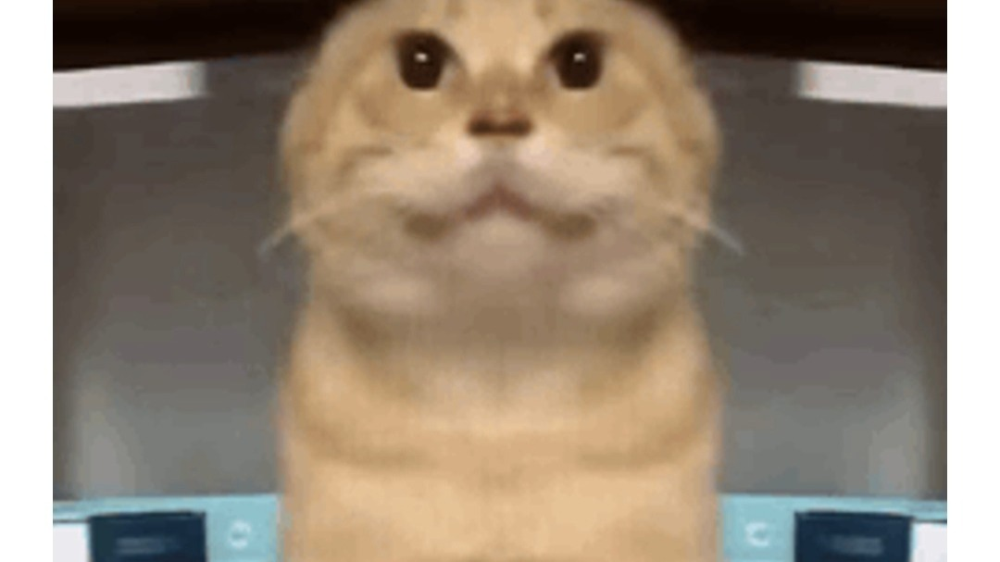 | 154.4万 | 2025-06-29 |
| [【AI东海帝皇-哈基米曼波】我用必剪的《大东北是我的家乡》](https://www.bilibili.com/video/BV1CygRzTEc1) |  | 20.4万 | 2025-06-29 |
| [哈基米～｜世上最小的哈基米翻唱](https://www.bilibili.com/video/BV1jyKyzXEx8) |  | 14.4万 | 2025-06-28 |
| [【娘化】大清第一哈基米](https://www.bilibili.com/video/BV1bDTczXEv9) |  | 14.1万 | 2025-06-27 |
| [一小时单曲循环～《鼠鼠哈基米》-猛攻小区 の【纯享版】](https://www.bilibili.com/video/BV1DmKPztEAM) |  | 9.8万 | 2025-06-20 |
| [哈基米之歌：《跳楼基》](https://www.bilibili.com/video/BV1T47EzbE1r) |  | 2.8万 | 2025-05-30 |
| [单曲循环丨《耄耋猫の小曲》《圆头猫の小曲》-丨出山(哈基米版)丨](https://www.bilibili.com/video/BV1RjjZzyEVY) | 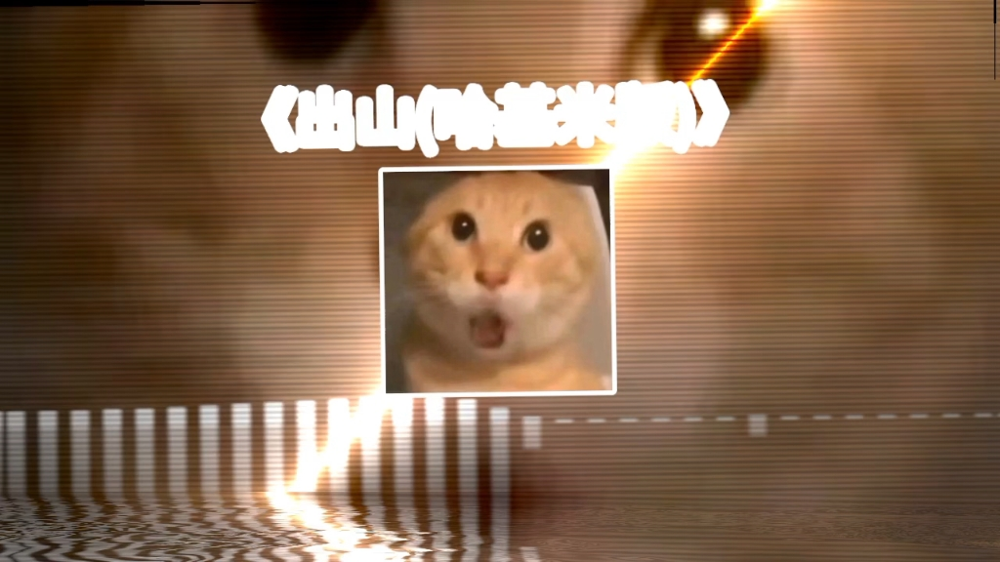 | 9.6万 | 2025-05-27 |
| [夜来哈](https://www.bilibili.com/video/BV1SGjSzLEG7) |  | 122.0万 | 2025-05-27 |
| [植物大战僵尸：开局全是哈基米，该如何对敌？](https://www.bilibili.com/video/BV11GVwzFEVD) | 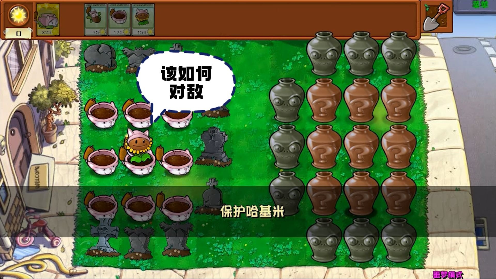 | 82.9万 | 2025-05-04 |
| [哈基米也要埃及摇](https://www.bilibili.com/video/BV17qLnzkEGF) | 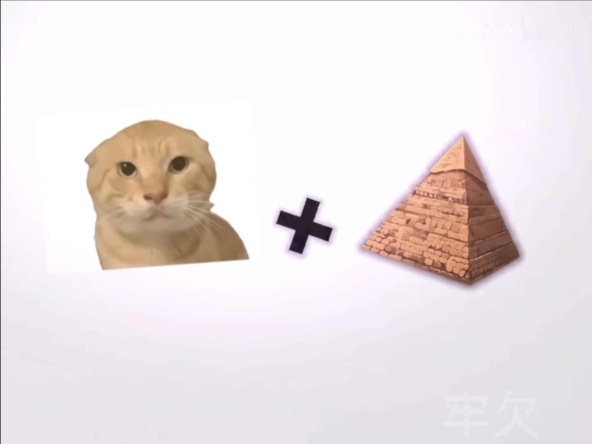 | 14.3万 | 2025-04-25 |
| [哈基米：弹舌](https://www.bilibili.com/video/BV1HV57zBE9Y) |  | 5.0万 | 2025-04-18 |
| [疲惫不堪也不肯闭上双眼吗？哈基米你这家伙](https://www.bilibili.com/video/BV1ckdSY9E5E) |  | 39.4万 | 2025-04-11 |
| [哈基米晚报，圆头耄耋确认已死亡](https://www.bilibili.com/video/BV1AJRWYSEHY) |  | 32.8万 | 2025-03-08 |
| [哈基米就像一颗巨石按在胸口](https://www.bilibili.com/video/BV1sqNaeiEwk) |  | 39.6万 | 2025-02-11 |
| [炫彩超级哈基米·2](https://www.bilibili.com/video/BV1eoqeYpENm) |  | 19.9万 | 2024-12-12 |
| [🎵Xin Đừng Nhấc Máy🎵哈基米音乐](https://www.bilibili.com/video/BV1r4UrYjEop) | 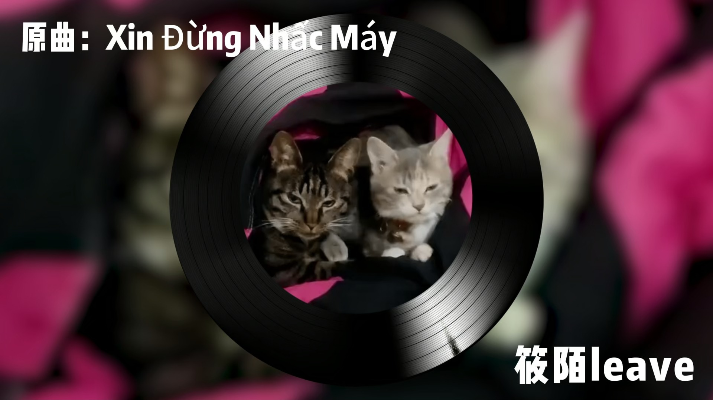 | 31.7万 | 2024-11-17 |
| [“赐哈基米”](https://www.bilibili.com/video/BV1PDWYeHEsW) |  | 36.0万 | 2024-08-21 |
| [九次补档 主人，快放牢基米出去喵](https://www.bilibili.com/video/BV1bu4m1A7gp) |  | 51.1万 | 2024-02-22 |
| [哈基米吃鱼鱼啦！玛丽苏炫彩硅胶鱼尾真的爱了](https://www.bilibili.com/video/BV14u4y1y7P4) | 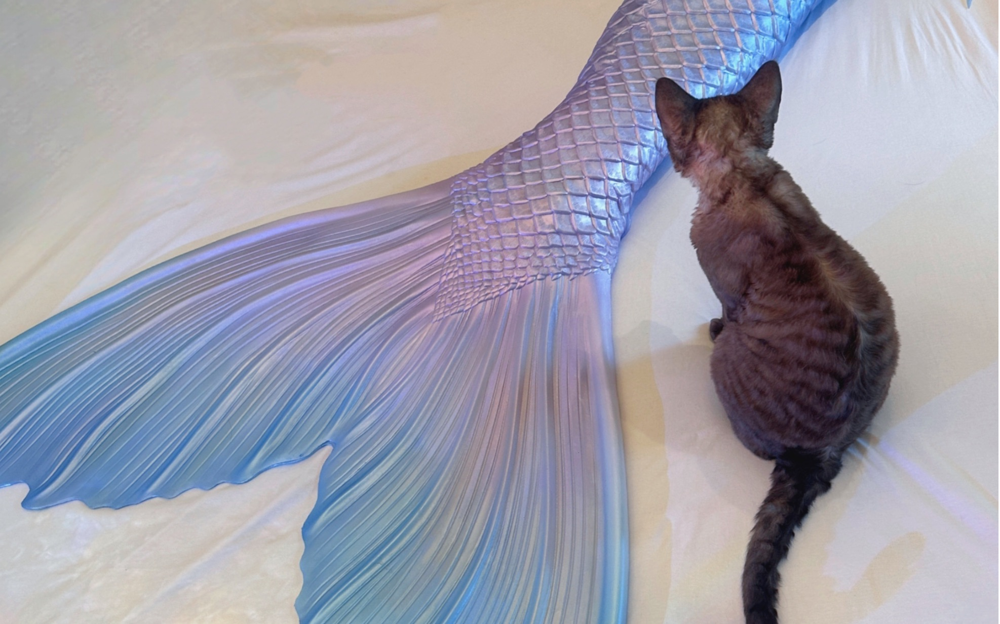 | 51.3万 | 2023-09-03 |
| [哈基米哈基米哈基米](https://www.bilibili.com/video/BV1SD4y1s7nG) | 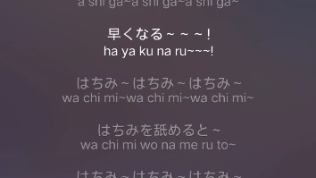 | 4486 | 2022-11-19 |

---
*最后更新: 2025-11-25 02:42:12 (自动生成)*
*数据来源: [Bilibili](https://www.bilibili.com)*

## 使用说明

运行以下命令更新视频列表:
```bash
python3 fetch_hajimi_videos.py
```
