# awesome-hajimi
collections of hajimi (哈基米 in Chinese) on the Internet.

## 视频列表 (Video List)

| 视频标题 (Title) | 封面 | 播放量 (Views) | 发布日期 (Date) |
|---|---|---|---|
| [呃 哈基米](https://www.bilibili.com/video/BV1kw2mBJEps) |  | 179 | 2025-12-09 |
| [〖莫哈维之猫 Cat Named Mojave〗求助大橘哈基米的代价｜完整通关｜恐怖](https://www.bilibili.com/video/BV1PJ2UBoELR) |  | 20 | 2025-12-09 |
| [身骑白耄【纯净哈基米音乐】](https://www.bilibili.com/video/BV1Vo2mBkEDD) |  | 166 | 2025-12-08 |
| [哈基米钻进洗衣机 洗完才发现](https://www.bilibili.com/video/BV1gM2UBNEr4) | 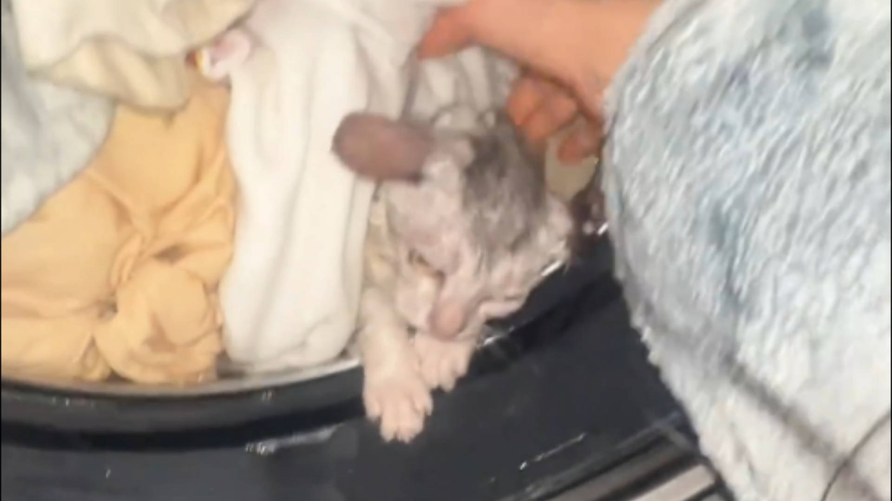 | 6905 | 2025-12-08 |
| [哈基米南北绿豆~](https://www.bilibili.com/video/BV1tN22BbE1B) |  | 302 | 2025-12-08 |
| [这个世界怎么了，踩个哈基米就不配当老师了](https://www.bilibili.com/video/BV1RY22BuEnU) |  | 177 | 2025-12-08 |
| [“用哈基米看仙剑奇侠传”](https://www.bilibili.com/video/BV1LY22BgE6P) |  | 204 | 2025-12-08 |
| [Montagem🐱Man!](https://www.bilibili.com/video/BV1Ek2CBiE3p) |  | 1335 | 2025-12-08 |
| [基米小学：失眠？耄耄的梦境历险记！](https://www.bilibili.com/video/BV1Lm2CBAEoH) | 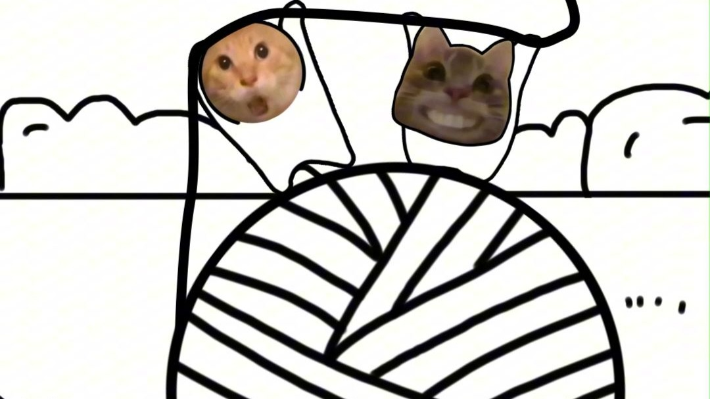 | 2.2万 | 2025-12-08 |
| [哈基米派对乱剪](https://www.bilibili.com/video/BV1PQ2yBJEHJ) |  | 108 | 2025-12-08 |
| [【七补】叮咚鸡：封居住的街道](https://www.bilibili.com/video/BV1v321BvEs3) |  | 2.0万 | 2025-12-08 |
| [哈基米！曼波！](https://www.bilibili.com/video/BV1EP21B3E4J) | 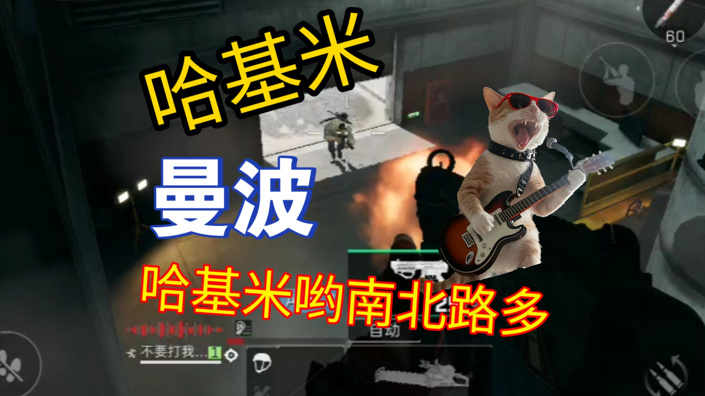 | 340 | 2025-12-08 |
| [【11月】中国在海外十大最火的相关内容（事件）&amp;ep.2](https://www.bilibili.com/video/BV1NP2kBCEEG) |  | 13.5万 | 2025-12-08 |
| [基米小镇：薛定谔的耄耋](https://www.bilibili.com/video/BV1NK2kBGExv) | 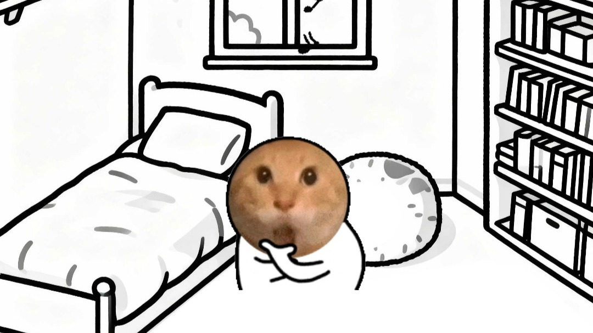 | 1420 | 2025-12-08 |
| [耄 耋 之 旅](https://www.bilibili.com/video/BV1AG2kBMEKF) | 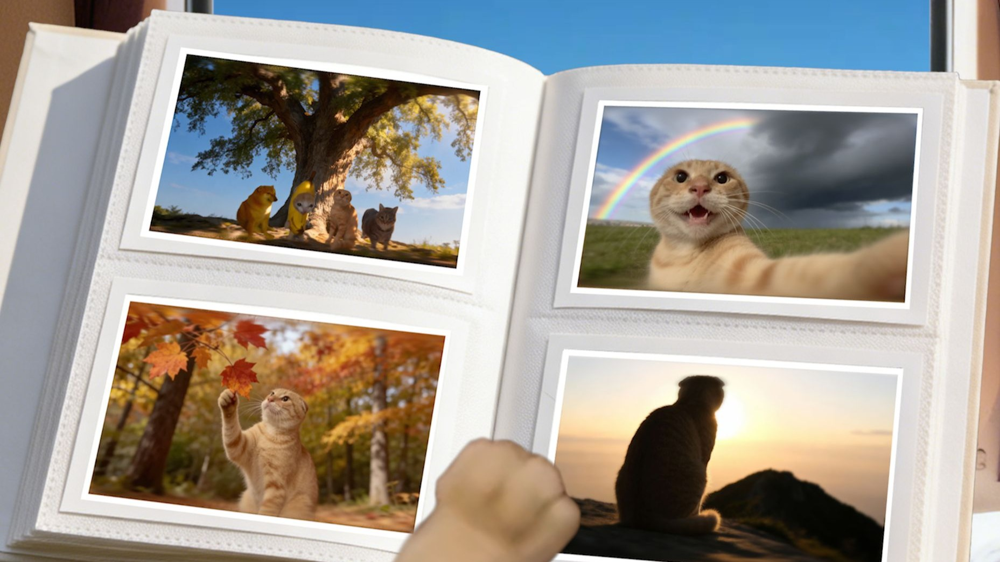 | 3.6万 | 2025-12-08 |
| [【哈基米音乐】“让我们哈基米的灵魂翻滚！”](https://www.bilibili.com/video/BV1wu2kBgEmu) | 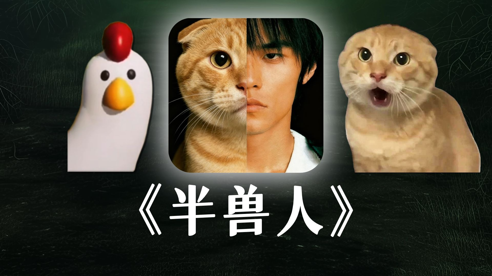 | 3554 | 2025-12-08 |
| [哈基米的窝被黄鼠狼掏了直接饱餐一顿](https://www.bilibili.com/video/BV1hv2kBpEQJ) | 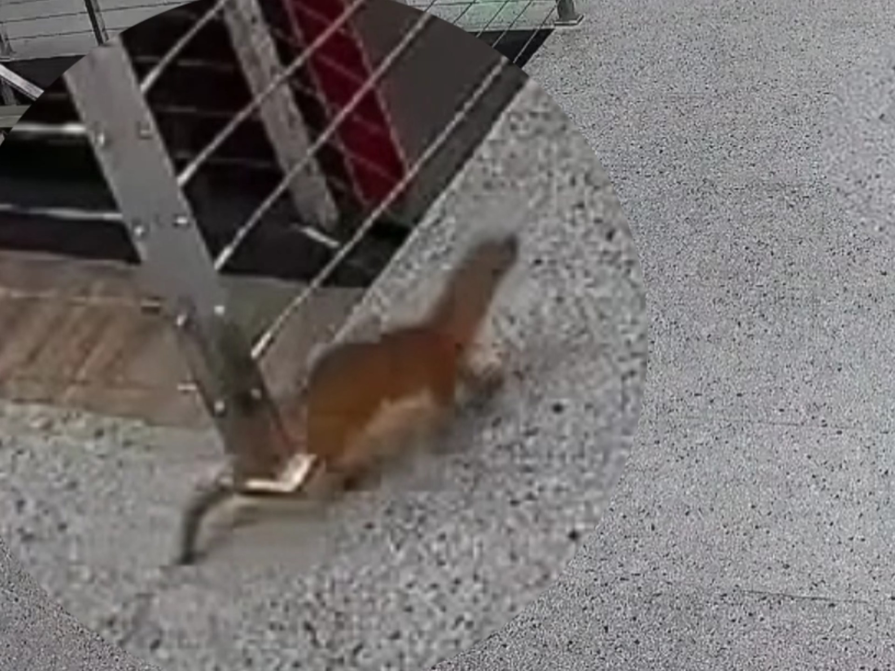 | 7744 | 2025-12-08 |
| [哈基米原生家庭这一块](https://www.bilibili.com/video/BV1dK2CBcE5R) |  | 1092 | 2025-12-08 |
| [翻唱: 熙熙攘攘 我们的哈基米](https://www.bilibili.com/video/BV1Se26B5EHf) |  | 1.5万 | 2025-12-08 |
| [哈基米南北绿豆。纯纯小甜水，还不错](https://www.bilibili.com/video/BV1GV2CB4Edr) |  | 197 | 2025-12-08 |
| [🎵哈基米×叮咚鸡：弱水三千🎵](https://www.bilibili.com/video/BV1A92kBgEAq) |  | 1205 | 2025-12-08 |
| [哈基米呐没路躲](https://www.bilibili.com/video/BV1rR2kBBEaY) |  | 480 | 2025-12-08 |
| [“怀疑猫猫”~听到最后爽了~哈哈哈哈哈哈~哈基米](https://www.bilibili.com/video/BV1c92kBgEnc) | 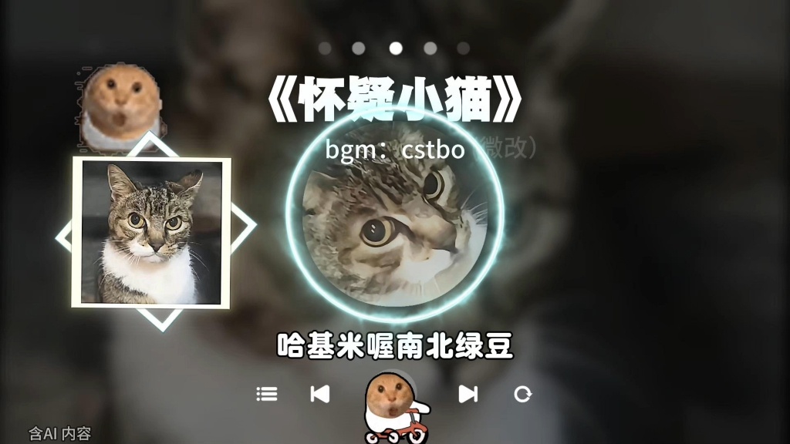 | 208 | 2025-12-08 |
| [朱门胖宝宝，路有哈饥米（BGM：弱水三哈）](https://www.bilibili.com/video/BV18j2CBWEgU) | 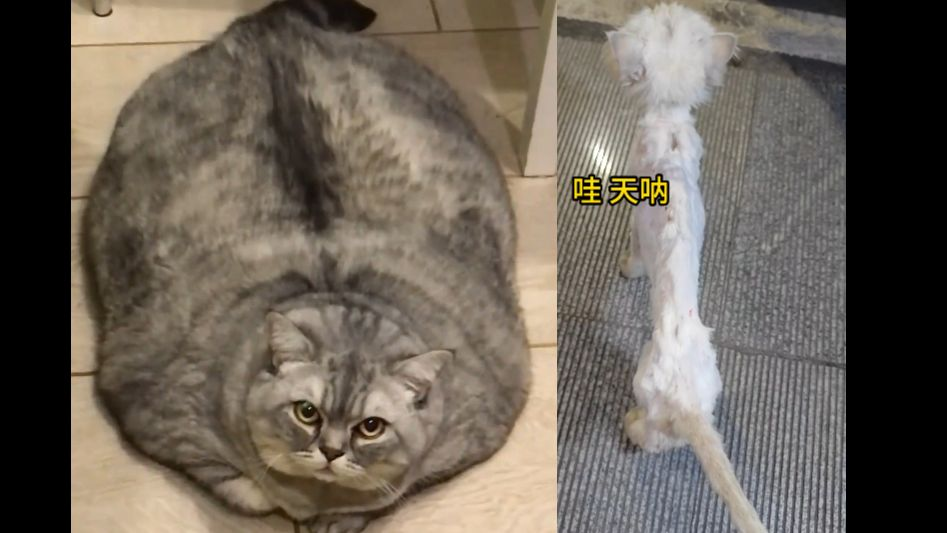 | 4.1万 | 2025-12-08 |
| [36分钟哈基米合集【沉浸式听歌】](https://www.bilibili.com/video/BV1ne2rBPExw) | 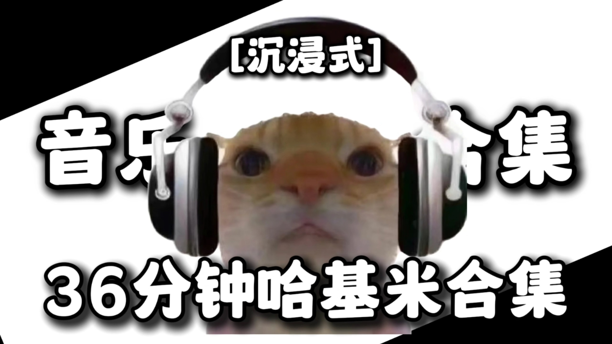 | 738 | 2025-12-08 |
| [哈基米：🐱C哩C哩🐱Panama](https://www.bilibili.com/video/BV1na2rBvEsM) |  | 1855 | 2025-12-08 |
| [哈基朗喵喵一小时循环](https://www.bilibili.com/video/BV14H2rBGEuN) |  | 6100 | 2025-12-08 |
| [咪的！是辆哈式坦克！](https://www.bilibili.com/video/BV14qmABrESQ) |  | 24.4万 | 2025-12-08 |
| [这是一只DJ哈基米](https://www.bilibili.com/video/BV1Ly2rB4EMx) |  | 869 | 2025-12-08 |
| [哈基米每日黑手挑战](https://www.bilibili.com/video/BV1am2zB2EEn) |  | 265 | 2025-12-08 |
| [再说一遍，流浪猫不会主动攻击人](https://www.bilibili.com/video/BV1HGmNBiEYC) |  | 2928 | 2025-12-07 |
| [没有比这更逆天的视频了](https://www.bilibili.com/video/BV1cQmABwETX) |  | 6.4万 | 2025-12-07 |
| [【民科TV】最新消息！孙笑川教授荣获2025年诺贝尔物理学奖](https://www.bilibili.com/video/BV1LnmcByENH) |  | 11.2万 | 2025-12-07 |
| [哈基米想洗澡了](https://www.bilibili.com/video/BV1kWmFBXEj4) | 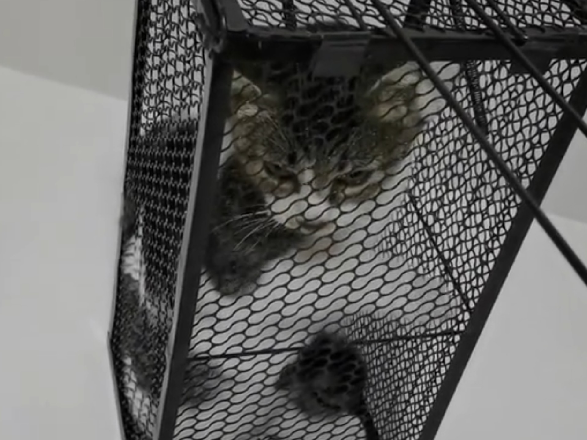 | 8750 | 2025-12-07 |
| [【叮咚鸡】大天蓬 (DJ)](https://www.bilibili.com/video/BV1YrmFB3EjG) |  | 4574 | 2025-12-07 |
| [街舞哈基米，评委请打分](https://www.bilibili.com/video/BV1ermFB3Ewx) |  | 2100 | 2025-12-07 |
| [“爱你永不哈基米！”【AI沐霂】哈基草（樱花草）](https://www.bilibili.com/video/BV1ci2RBgEMu) |  | 2673 | 2025-12-07 |
| [楼草的哈基米](https://www.bilibili.com/video/BV1so2ZBpEke) | 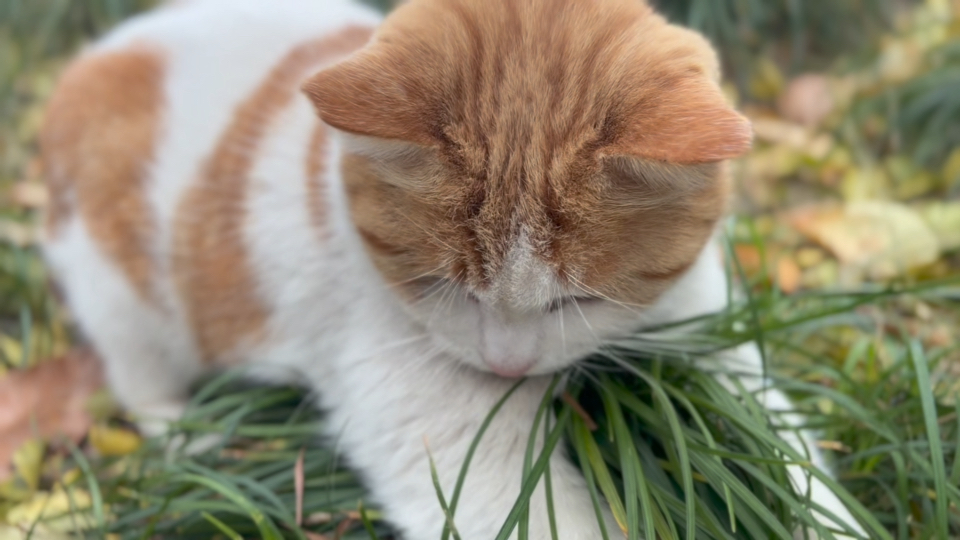 | 2285 | 2025-12-07 |
| [哈基米真以为是自己捕猎的食物](https://www.bilibili.com/video/BV15t29BoEDM) | 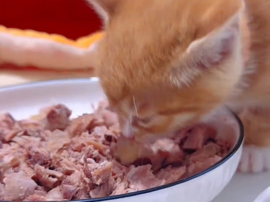 | 43.2万 | 2025-12-06 |
| [哈基米饥荒-蘸豆曲](https://www.bilibili.com/video/BV1a829BsERv) |  | 776 | 2025-12-06 |
| [V圈哈基米女王刘俊朗奶臭味笑声纯享版合集](https://www.bilibili.com/video/BV1Uw2dBHE39) |  | 4287 | 2025-12-06 |
| [哈基米少年只是在逛街被逆天福瑞吃掉罢力](https://www.bilibili.com/video/BV1Jk2RBKE7W) |  | 3633 | 2025-12-06 |
| [怀疑哈基米](https://www.bilibili.com/video/BV1bZ2XB7ERo) |  | 1489 | 2025-12-06 |
| [这哈基米我兄弟能撸嘛？](https://www.bilibili.com/video/BV1vJ27BxEhq) | 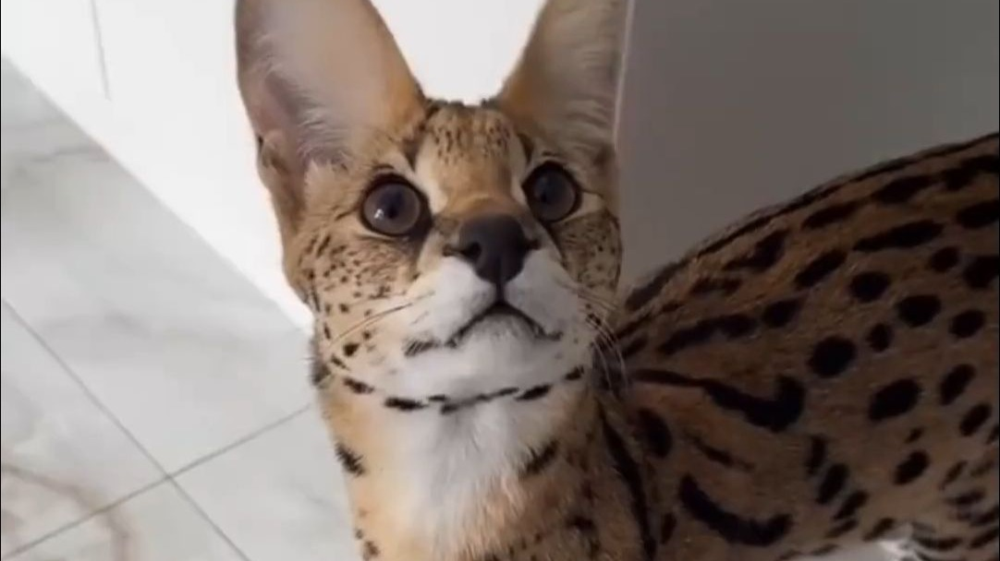 | 17.0万 | 2025-12-05 |
| [哈基米秒开棘背龙模式](https://www.bilibili.com/video/BV1fu2LBsE8G) | 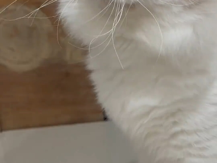 | 5873 | 2025-12-05 |
| [咦？这只猫怎么在海底](https://www.bilibili.com/video/BV1YF25BkEE4) |  | 110.7万 | 2025-12-05 |
| [暂停一下，小猫有话要说](https://www.bilibili.com/video/BV1eH2LBjEpP) | 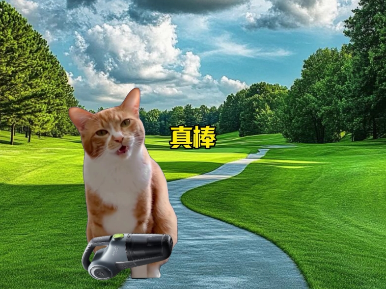 | 60.2万 | 2025-12-05 |
| [曼波，蓝莲哈](https://www.bilibili.com/video/BV1hp2LB1E2m) | 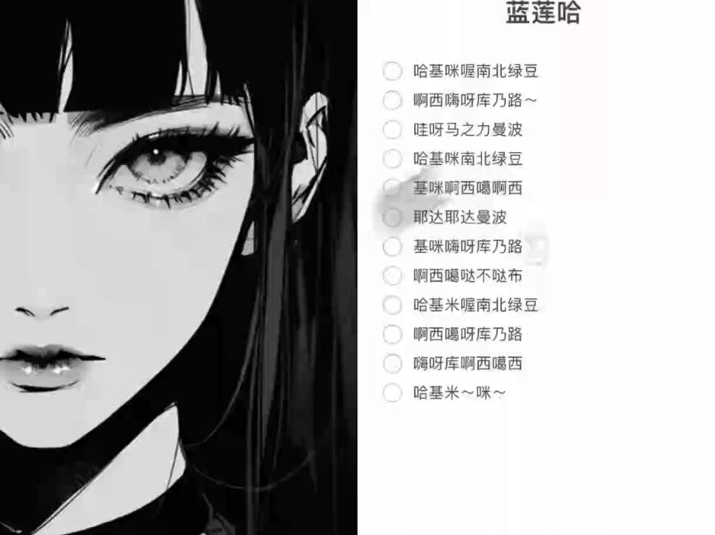 | 123 | 2025-12-05 |
| [永驻的哈基米](https://www.bilibili.com/video/BV17p2YBzEGq) |  | 1.9万 | 2025-12-04 |
| [两只小哈基米为了罐头大大出手](https://www.bilibili.com/video/BV1Zz28BcEJn) | 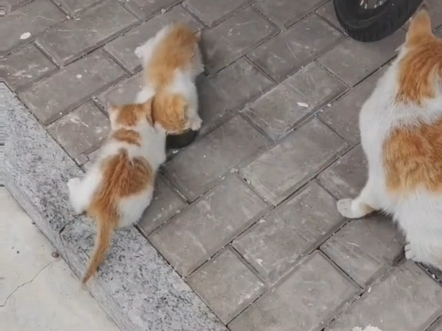 | 5348 | 2025-12-04 |
| [飞基杯](https://www.bilibili.com/video/BV1fX2bBaEY5) | 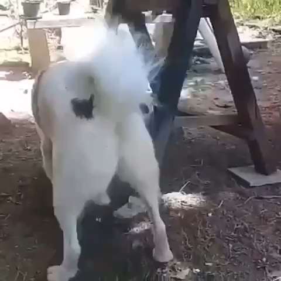 | 51.3万 | 2025-12-03 |
| [欧玛几荔叮咚桔，千耄万耋柔情耄娘。](https://www.bilibili.com/video/BV1h3StBpExe) |  | 3.6万 | 2025-12-02 |
| [⚡️⚡️津 门 动 物 城⚡️⚡️](https://www.bilibili.com/video/BV1SVSxBVEV2) |  | 561.9万 | 2025-12-02 |
| [“鬼 畜 区 众 神 归 位！”](https://www.bilibili.com/video/BV1HySsBwEm3) |  | 33.7万 | 2025-12-02 |
| [爱你的鼻孔猫猫 极速版 小猫劲舞](https://www.bilibili.com/video/BV1ogSpBmEUU) |  | 9.9万 | 2025-12-02 |
| [【阿米嘎蒂朵喵素材】阿米嘎蒂朵~喵喵~ 你夺鼻孔~喵喵  一起阿米嘎蒂朵喵喵 （建议戴耳机食用环绕音喵~）# 咪咪discooo # 咪咪](https://www.bilibili.com/video/BV1JWSkBrEt6) |  | 1.7万 | 2025-12-01 |
| [【11 月热梗小曲盘点，最阴的一集！】](https://www.bilibili.com/video/BV1SSSvBzEyd) |  | 20.2万 | 2025-12-01 |
| [阿米嘎蒂哚喵喵](https://www.bilibili.com/video/BV1qHSKBKE4X) | 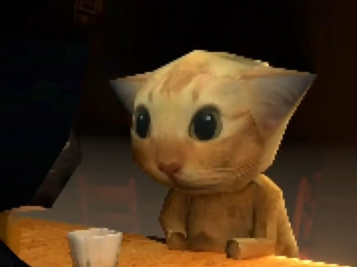 | 5.2万 | 2025-11-30 |
| [我 赚 钱 了 吗 ？](https://www.bilibili.com/video/BV16cSFBxESh) |  | 92.9万 | 2025-11-29 |
| [库 里 之 歌](https://www.bilibili.com/video/BV1DWSFB6EG1) |  | 48.1万 | 2025-11-29 |
| [【酸核】EMO鸡](https://www.bilibili.com/video/BV18HUZBPEq4) | 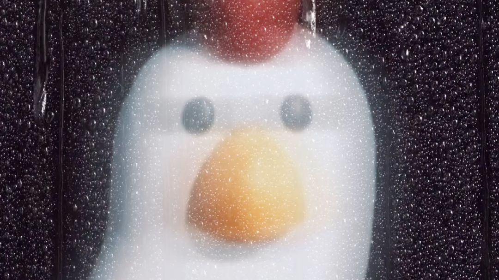 | 2.5万 | 2025-11-29 |
| [疑似《疯狂动物城3》预告片流出](https://www.bilibili.com/video/BV14tUZBFEHH) |  | 107.2万 | 2025-11-29 |
| [【完整版】One Last 哈（纯净哈基米，光敏警告！）](https://www.bilibili.com/video/BV1wMURBjEqo) |  | 1351 | 2025-11-28 |
| [循环歌单｜《另一个世界的我の小曲》最初的记忆DJ](https://www.bilibili.com/video/BV1R2SjBfEL8) | 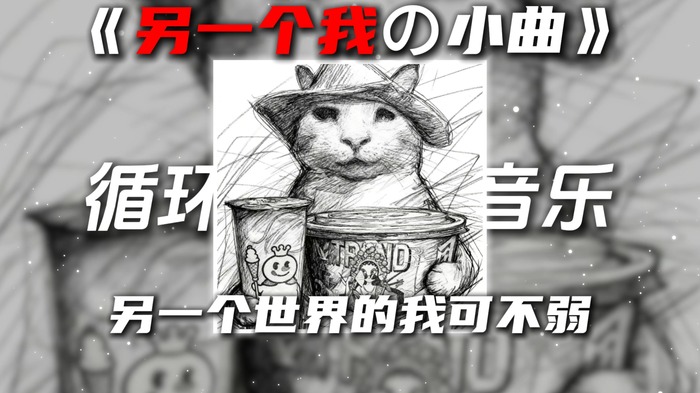 | 146.3万 | 2025-11-28 |
| [猫爱人小合集](https://www.bilibili.com/video/BV1ksS5BKEuL) | 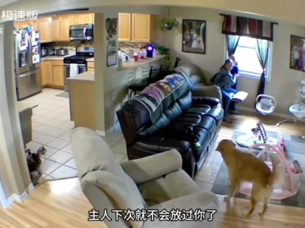 | 14.4万 | 2025-11-28 |
| [小朋友，怎么就你不跳呢](https://www.bilibili.com/video/BV1JaU6BeEHo) |  | 21.4万 | 2025-11-24 |
| [天上掉下来个哈基米](https://www.bilibili.com/video/BV1UgUKBSEPp) |  | 171 | 2025-11-23 |
| [【你最近还好吗】｜“【干嘛猫の小曲】【旮旯给木の小曲】”](https://www.bilibili.com/video/BV1N8CiBDEXY) |  | 46.1万 | 2025-11-18 |
| [【Live2D模型展示】哈！耄耋小天使登场！](https://www.bilibili.com/video/BV1asEbzeEm2) |  | 44.2万 | 2025-05-16 |

---
*最后更新: 2025-12-09 02:43:03 (自动生成)*
*数据来源: [Bilibili](https://www.bilibili.com)*

## 使用说明

运行以下命令更新视频列表:
```bash
python3 fetch_hajimi_videos.py
```
