# awesome-hajimi
collections of hajimi (哈基米 in Chinese) on the Internet.

## 视频列表 (Video List)

| 视频标题 (Title) | 封面 | 播放量 (Views) | 发布日期 (Date) |
|---|---|---|---|
| [邪恶哈基米的语言是不通的，但是怕橘子皮](https://www.bilibili.com/video/BV11zzPBSET2) | 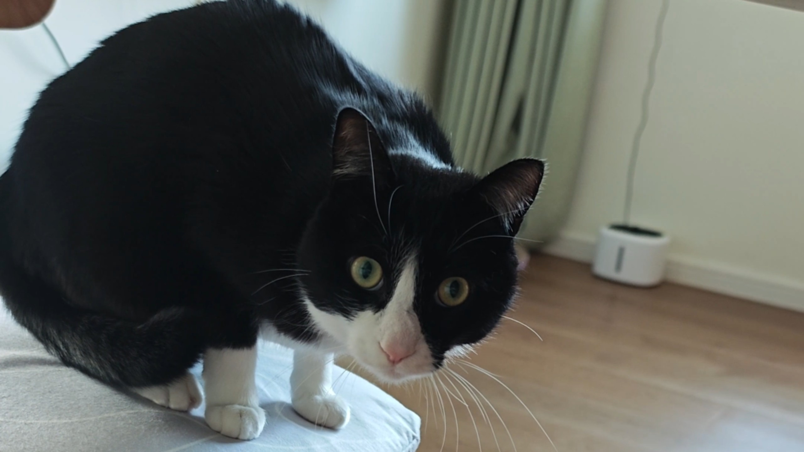 | 1 | 2026-01-23 |
| [哈基米哟南北绿豆](https://www.bilibili.com/video/BV1M3zNBZEM1) |  | 375 | 2026-01-23 |
| [哈基米の大丰收](https://www.bilibili.com/video/BV1KjzNBsEYY) | 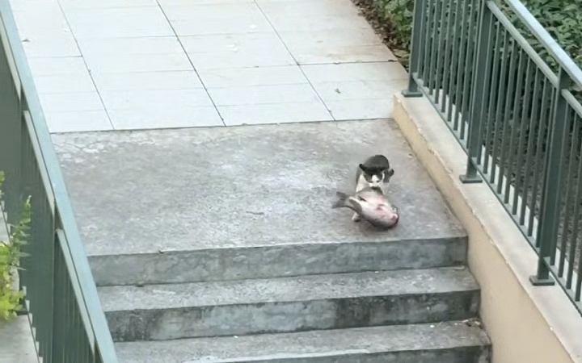 | 119 | 2026-01-23 |
| [如何在十秒内整烦一只哈基米](https://www.bilibili.com/video/BV1LdzwBcEna) | 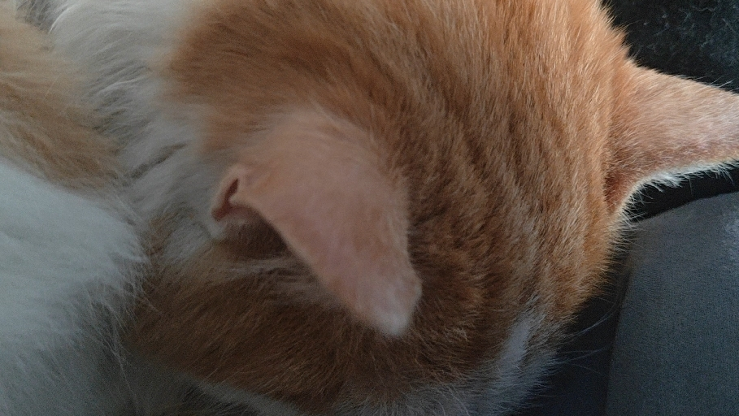 | 42 | 2026-01-22 |
| [刚花几千块钱买的哈基米就被自己家狗咬了唉。](https://www.bilibili.com/video/BV1MMzcB5Egs) | 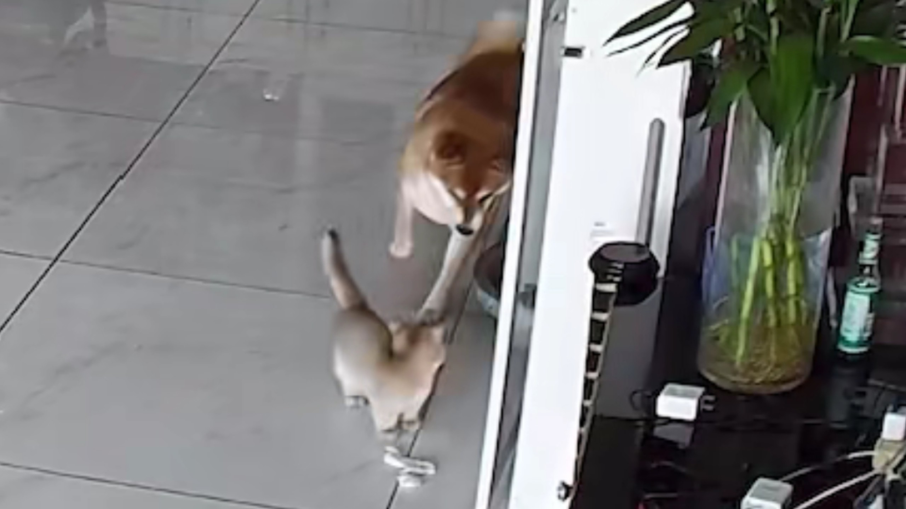 | 67 | 2026-01-22 |
| [基米哈气了](https://www.bilibili.com/video/BV1VozFBQE5p) | 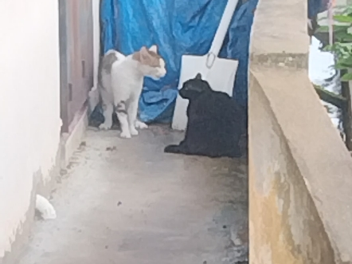 | 40 | 2026-01-22 |
| [智取哈基米](https://www.bilibili.com/video/BV1JHzcBvEJh) | 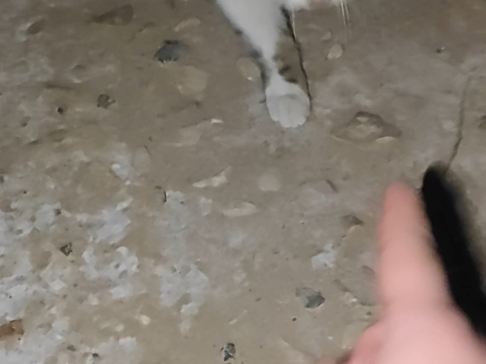 | 40 | 2026-01-22 |
| [【哈基米音乐】Aoi - 鱼韵乐队sakanaction（サカナクション)](https://www.bilibili.com/video/BV12DzcByEBX) |  | 1288 | 2026-01-22 |
| [这才是真的哈基音乐《甩基歌》](https://www.bilibili.com/video/BV11XzcBVEj3) | 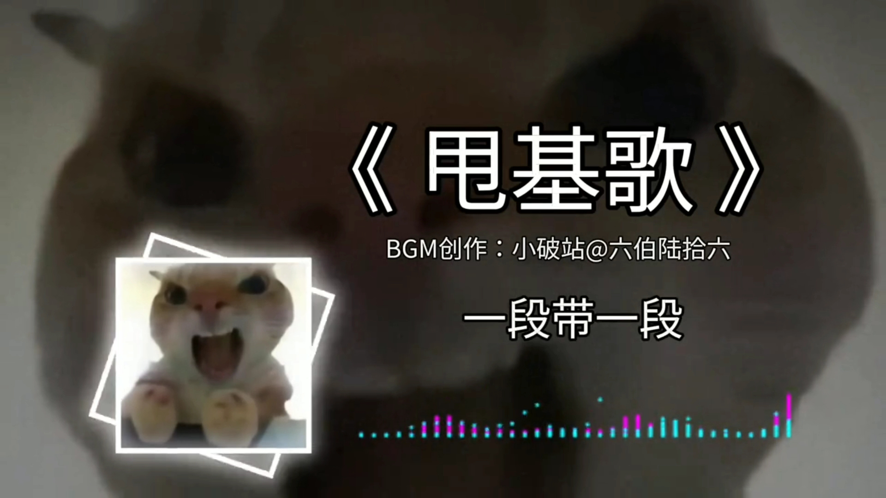 | 8 | 2026-01-22 |
| [其实你很喜欢吧哈基米](https://www.bilibili.com/video/BV1SCzcBJESU) | 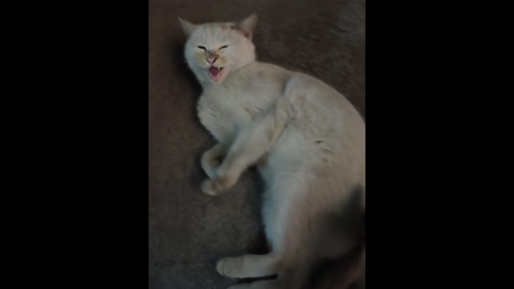 | 61 | 2026-01-22 |
| [可爱哈基米日常哈基米曼波](https://www.bilibili.com/video/BV1XBzcBXEcR) | 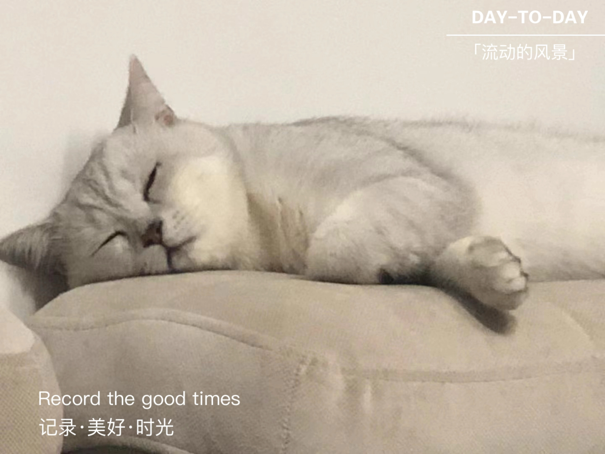 | 0 | 2026-01-22 |
| [像我这样会不会把猫撸秃了？#撸猫第一视角 #搞笑 #哈基米#猎奇](https://www.bilibili.com/video/BV1D6zcBHEHE) | 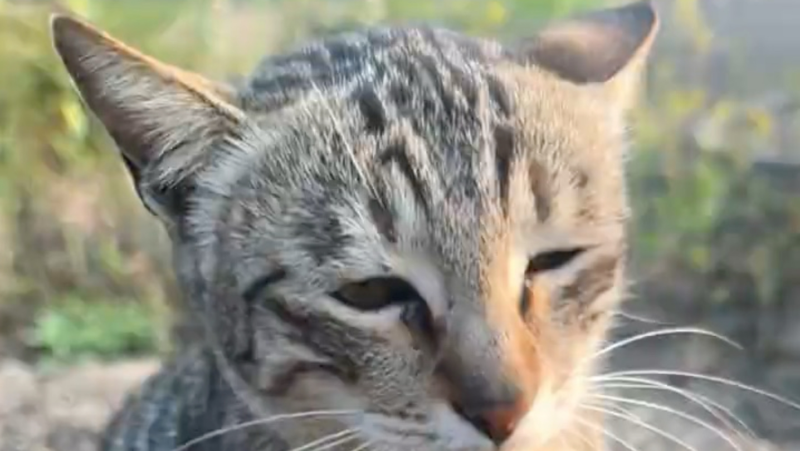 | 13 | 2026-01-22 |
| [小哈基米们6天啦](https://www.bilibili.com/video/BV1UyzcBUEAH) |  | 51 | 2026-01-22 |
| [【哈基米音乐】大明不妙曲之🐱此去半基🐱](https://www.bilibili.com/video/BV1KTBfBTEVn) | 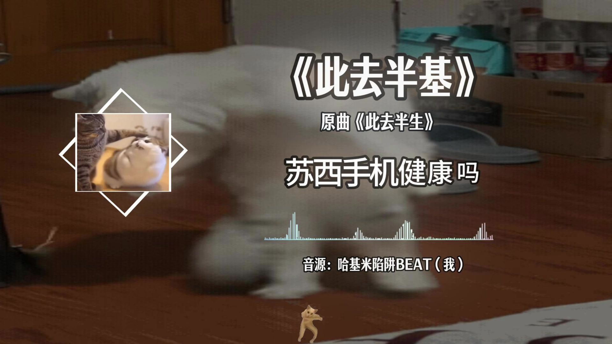 | 126 | 2026-01-22 |
| [【哈基米】DA FUNK](https://www.bilibili.com/video/BV1gZBZBVEue) |  | 321 | 2026-01-22 |
| [🐱世界是个巨大的哈基米🐱](https://www.bilibili.com/video/BV1gRBZBLED4) |  | 1.3万 | 2026-01-22 |
| [偶遇哈基米](https://www.bilibili.com/video/BV1jtBfBXEJV) | 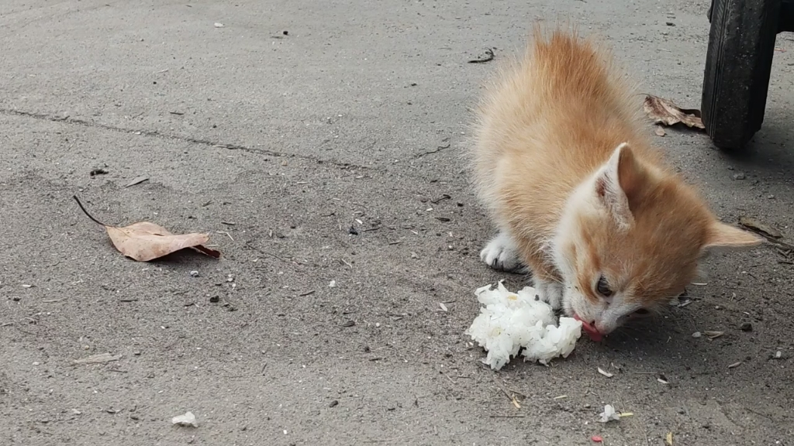 | 68 | 2026-01-22 |
| [🐱阳光照射的基道🐱](https://www.bilibili.com/video/BV17WBfBxExk) |  | 179 | 2026-01-22 |
| [野生哈基米](https://www.bilibili.com/video/BV1QeBfBmEbE) | 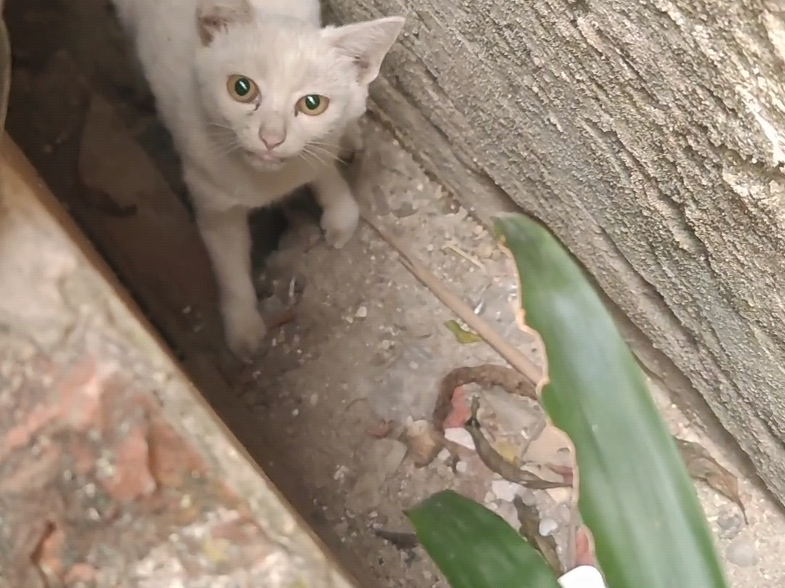 | 134 | 2026-01-22 |
| [两只哈基米](https://www.bilibili.com/video/BV1w5BfBaEwS) | 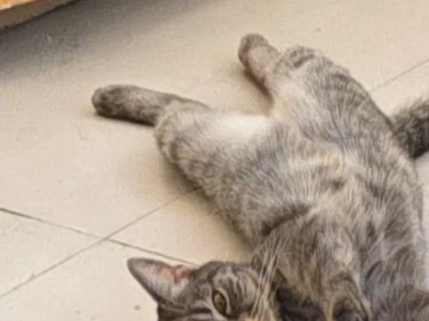 | 0 | 2026-01-22 |
| [🐱](https://www.bilibili.com/video/BV1wVBfBAEEB) |  | 607 | 2026-01-22 |
| [演唱会vlog｜被王心凌哄成婴儿啦](https://www.bilibili.com/video/BV1JnBfBtEjv) |  | 17.6万 | 2026-01-22 |
| [🐱](https://www.bilibili.com/video/BV1wVBfBAEmU) |  | 4240 | 2026-01-22 |
| [谁来制止邪恶哈基米？](https://www.bilibili.com/video/BV1fnBfB4EQz) |  | 20 | 2026-01-22 |
| [🐱哈尼尔非低音炮🐱](https://www.bilibili.com/video/BV1fHBfBdEgq) |  | 315 | 2026-01-22 |
| [超乎寻常的重力（哈基米版）](https://www.bilibili.com/video/BV1kRBfBPEXu) |  | 149 | 2026-01-22 |
| [哈基米南北绿豆](https://www.bilibili.com/video/BV1S6BfBCEFT) |  | 47 | 2026-01-22 |
| [我有一只哈基米](https://www.bilibili.com/video/BV13LznB3Eg5) |  | 378 | 2026-01-22 |
| [哈基米吃吃吃](https://www.bilibili.com/video/BV1aLzFBSE7j) | 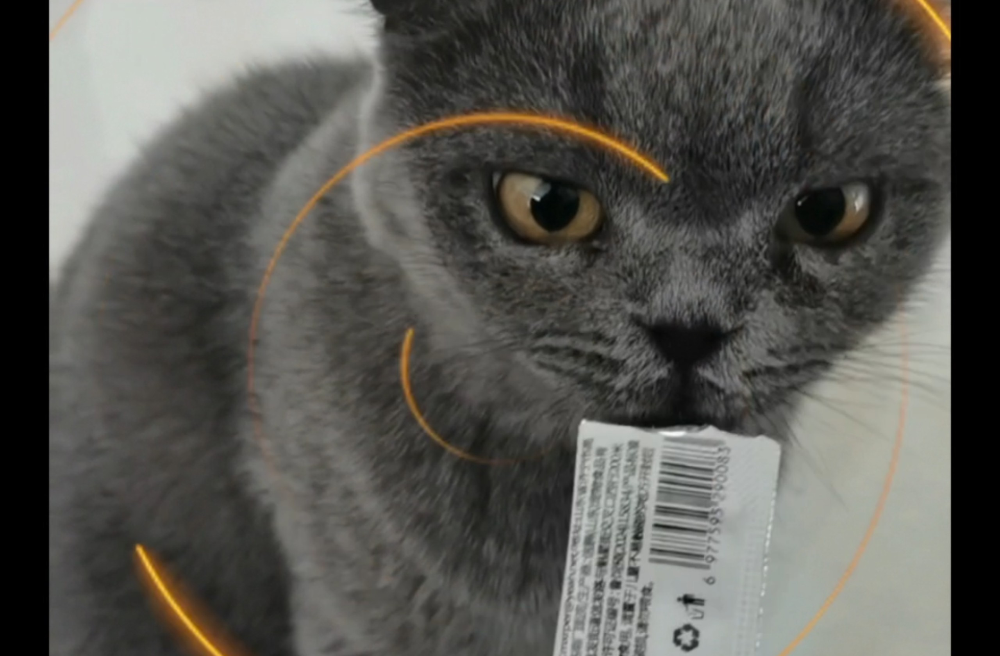 | 227 | 2026-01-22 |
| [哈基米南北绿豆](https://www.bilibili.com/video/BV1YGzFBQEEL) |  | 202 | 2026-01-22 |
| [哈基米](https://www.bilibili.com/video/BV18HzFB1EKg) | 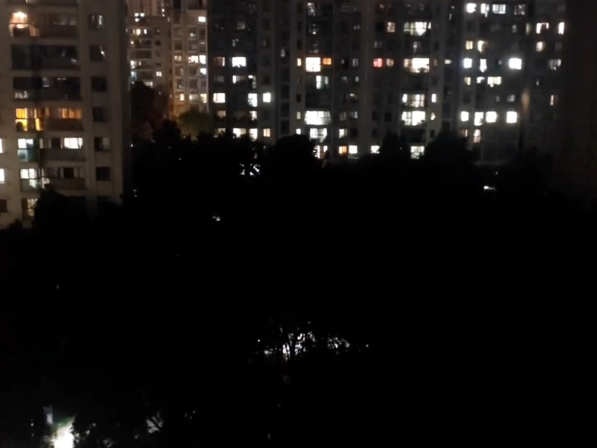 | 17 | 2026-01-22 |
| [小基米现在在想什么呢🤔](https://www.bilibili.com/video/BV1qNzFB4EMq) | 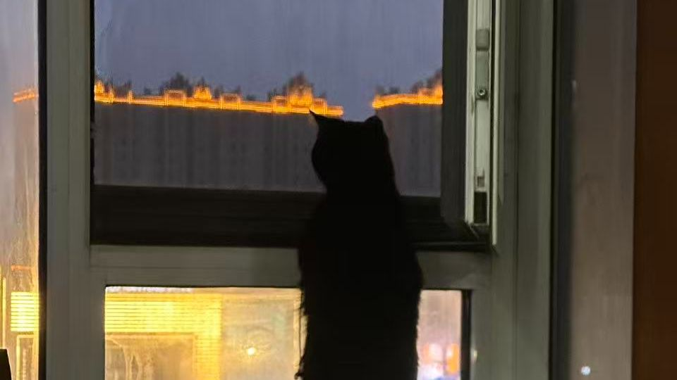 | 67 | 2026-01-22 |
| [曼波哈基米](https://www.bilibili.com/video/BV1iNzFB4EXA) |  | 0 | 2026-01-22 |
| [夹到了就可以带回家！](https://www.bilibili.com/video/BV1vuzFB9Eut) | 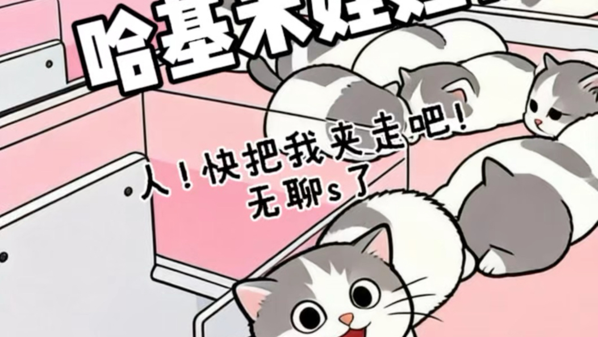 | 456 | 2026-01-22 |
| [哈一只基米？](https://www.bilibili.com/video/BV1HJzWBNExy) | 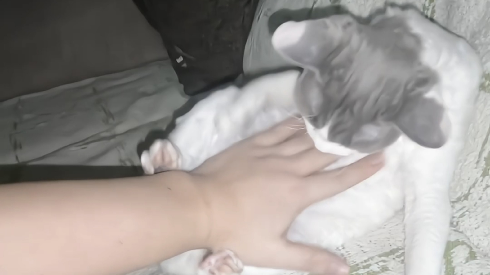 | 427 | 2026-01-22 |
| [哈基米是真急了](https://www.bilibili.com/video/BV1AdzWB6EyF) |  | 2.4万 | 2026-01-22 |
| [[基米TV]键帽看多了来看看毫猫吧！](https://www.bilibili.com/video/BV1ZTzsBwECS) | 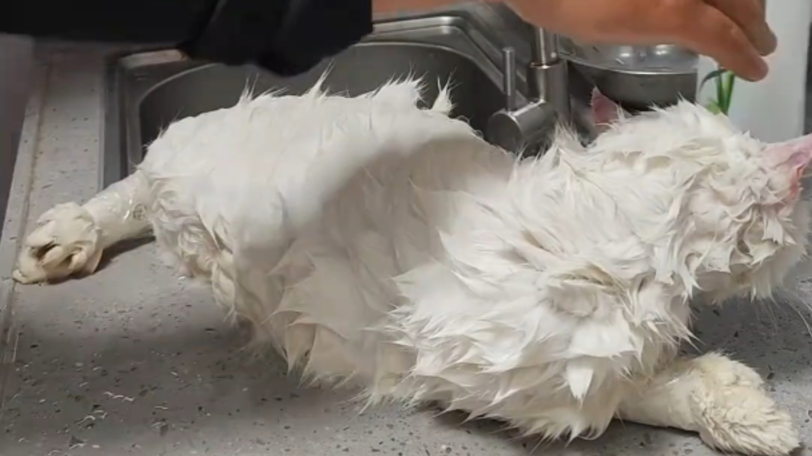 | 5631 | 2026-01-22 |
| [猫猫沉浸式吃播第十一期来喽~橘宝换新衣服啦！ 今天吃烤五花肉，烤牛排，烤菠萝，烤香菇，喝的是哈基米南北绿豆浆，还有什么想看猫猫吃的吗？](https://www.bilibili.com/video/BV1JTzsBAEEh) | 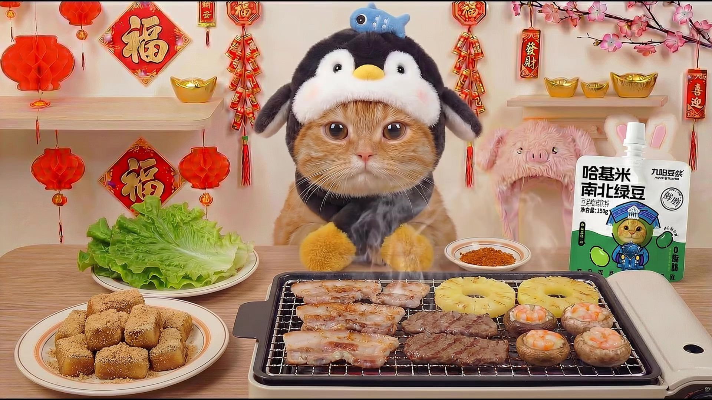 | 1525 | 2026-01-22 |
| [哈基米哈基米](https://www.bilibili.com/video/BV1QHzsBQEmn) |  | 14 | 2026-01-22 |
| [悠星大陆：哈基米的悠闲生活](https://www.bilibili.com/video/BV197zsBsE3a) |  | 0 | 2026-01-22 |
| [咪睡的安逸（藍蓮哈）](https://www.bilibili.com/video/BV19EzsB9EFG) | 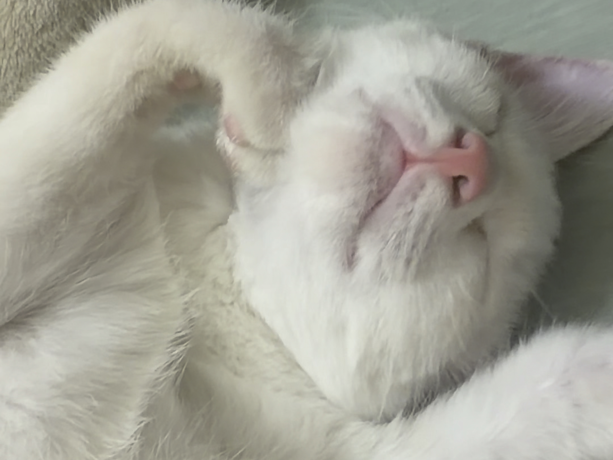 | 14 | 2026-01-22 |
| [【我家20只哈基米】新作上线，快来看看！](https://www.bilibili.com/video/BV1XEzsB9Era) |  | 1 | 2026-01-22 |
| [悠星大陆：哈基米的悠闲生活](https://www.bilibili.com/video/BV1R5zsB4EKT) |  | 0 | 2026-01-22 |
| [【哈基米】 I&#x27;m a 哈基米](https://www.bilibili.com/video/BV1A6zsB6Ecp) |  | 45 | 2026-01-22 |
| [哈基米南北绿多](https://www.bilibili.com/video/BV1FwzpBZEEp) | 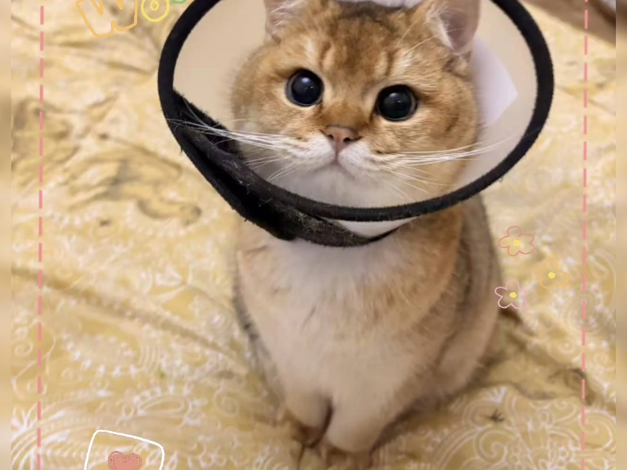 | 111 | 2026-01-22 |
| [给咱家小哈基米吹哈气了](https://www.bilibili.com/video/BV1yDzHBKE98) | 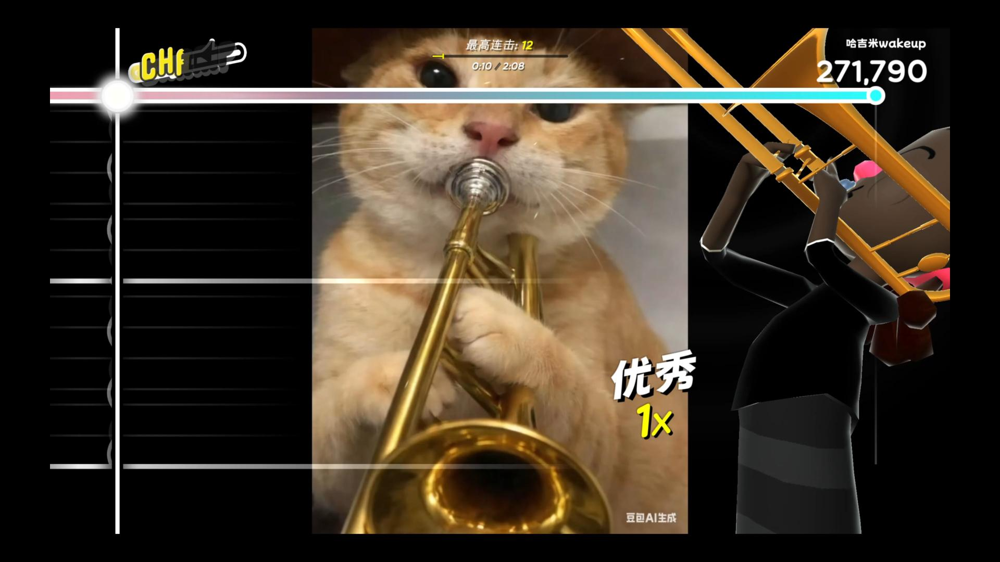 | 1671 | 2026-01-22 |
| [哈基米能对水盆哈气也是代码这一块了](https://www.bilibili.com/video/BV1SnzpByEQA) | 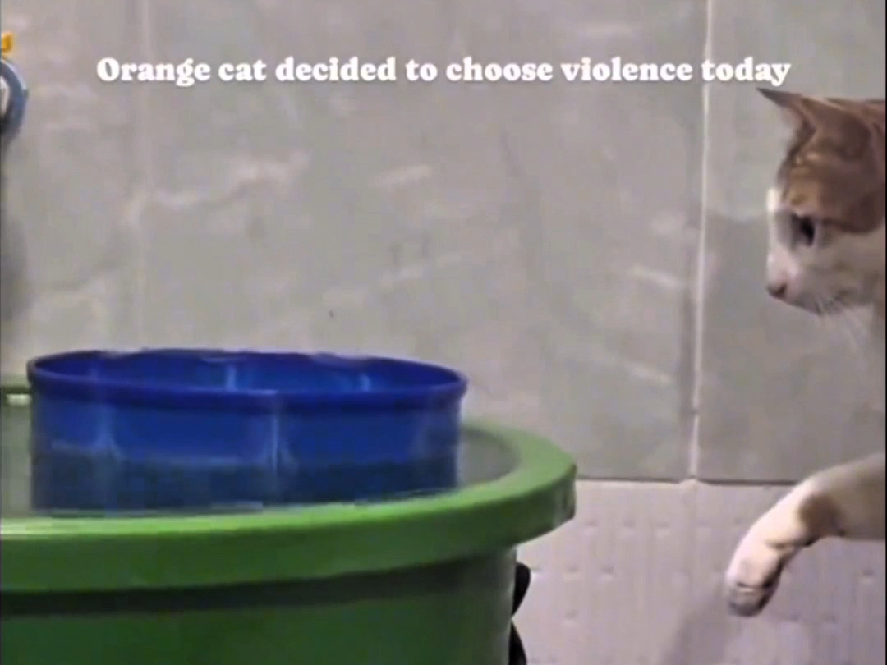 | 939 | 2026-01-22 |
| [我跳一下，哈基米跳一下](https://www.bilibili.com/video/BV1U4zpB6EgR) | 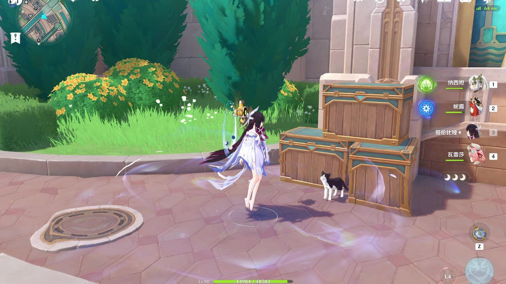 | 1.7万 | 2026-01-22 |
| [【超级活全家哈基米音乐】蠢蠢的基米](https://www.bilibili.com/video/BV1Z1zpBtE7Q) | 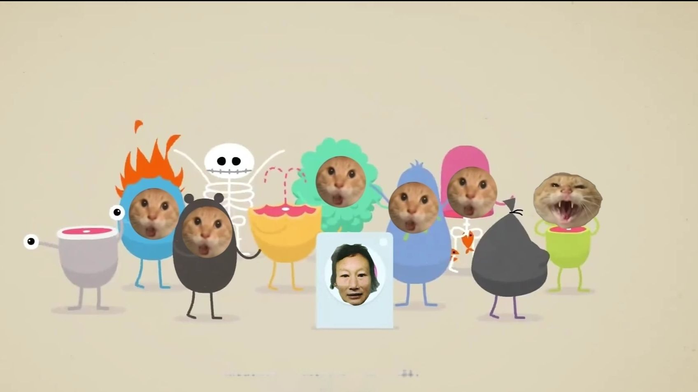 | 3494 | 2026-01-22 |
| [十大哈基米神曲从夯到拉，不信你们全听过！](https://www.bilibili.com/video/BV1dQzpBWEc9) | 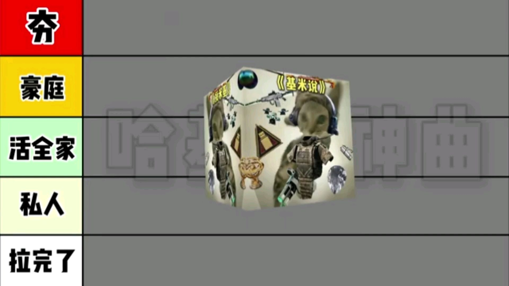 | 694 | 2026-01-22 |
| [不要再往下滑了](https://www.bilibili.com/video/BV1vQzpBWEs1) | 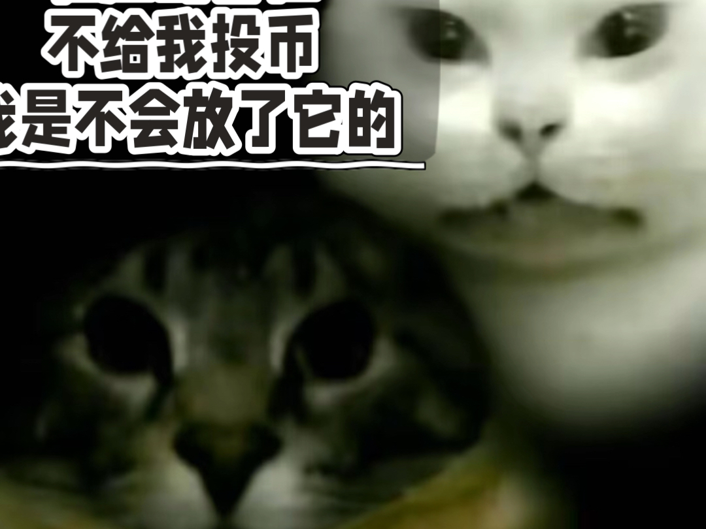 | 2081 | 2026-01-22 |
| [【肖肖哈基米的店】我的最新作品，快来一睹为快！](https://www.bilibili.com/video/BV14MzWBkEhy) |  | 0 | 2026-01-22 |
| [哈基米南北绿豆哈基米之](https://www.bilibili.com/video/BV1aZzpBJEhH) |  | 4 | 2026-01-22 |
| [让我看看哪个哈基米还没摸到！](https://www.bilibili.com/video/BV1DfzpBUE14) | 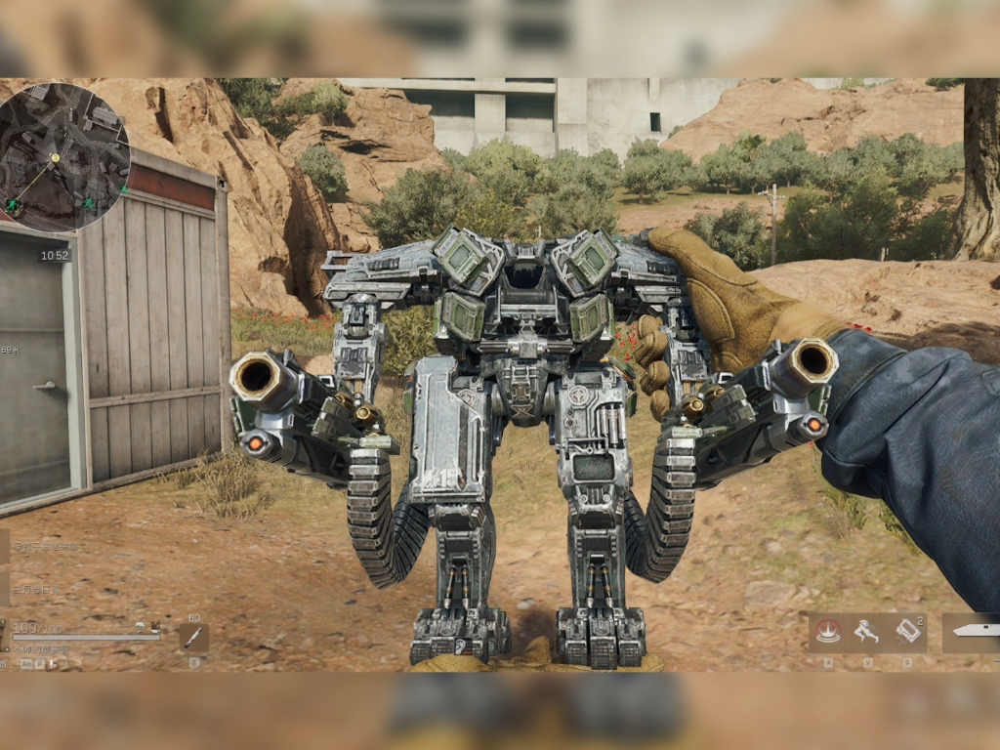 | 21 | 2026-01-22 |
| [“我被困在了，萝卜纸巾的选择中”](https://www.bilibili.com/video/BV1vyzEBkEUZ) | 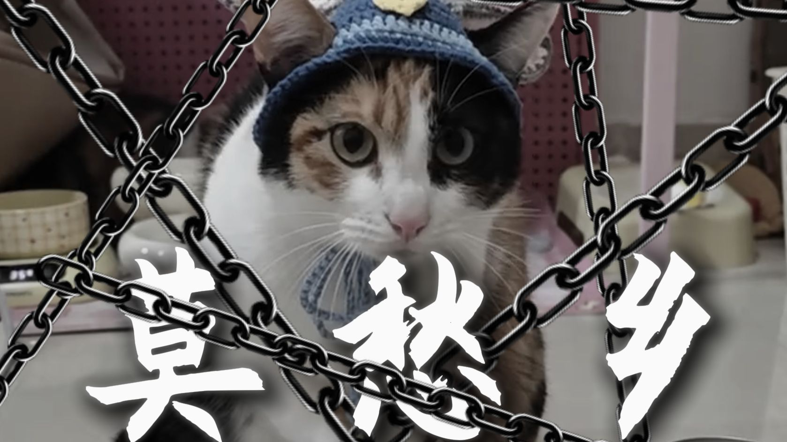 | 8.1万 | 2026-01-22 |
| [哈基米可爱捏，和我的关系进展迅速](https://www.bilibili.com/video/BV1SEznBMEm3) | 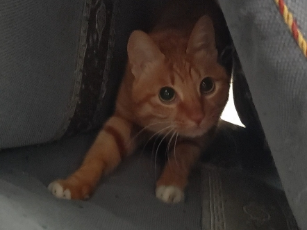 | 36 | 2026-01-22 |
| [【一只哈基米耄耋】视频已打包，欢迎围观！](https://www.bilibili.com/video/BV1UJznBqEHS) |  | 1 | 2026-01-22 |
| [我爱你哈基米](https://www.bilibili.com/video/BV11bznBhE8z) | 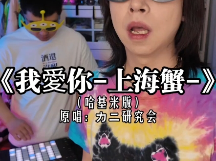 | 372 | 2026-01-21 |
| [歌单哈基米](https://www.bilibili.com/video/BV1qCzEBVEgX) | 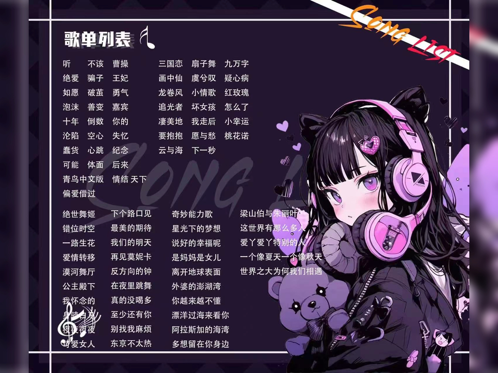 | 12 | 2026-01-21 |
| [基米这个忍耐](https://www.bilibili.com/video/BV1JjzJBDEAZ) |  | 9514 | 2026-01-21 |
| [ASMR哈基米内裤摩擦抓绕音助眠](https://www.bilibili.com/video/BV1EEzJBJENg) | 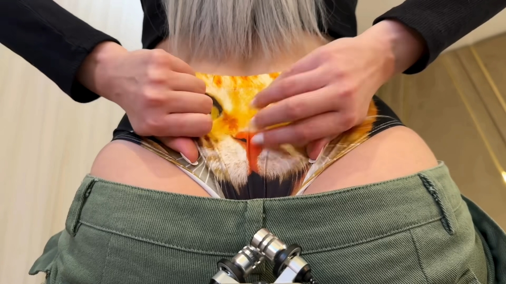 | 16 | 2026-01-21 |
| [恭喜哈基米土豆荣升55级大红色灯牌](https://www.bilibili.com/video/BV1PmzJB8Ewz) |  | 227 | 2026-01-21 |
| [猫：一打五 杀两个](https://www.bilibili.com/video/BV1DGzEBeELj) | 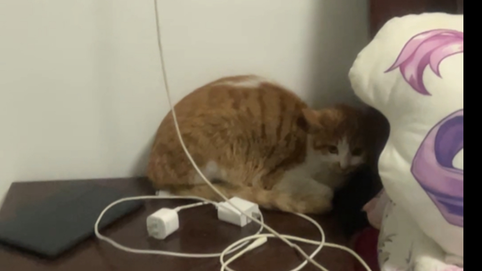 | 2828 | 2026-01-21 |
| [哈基汪大战哈基米](https://www.bilibili.com/video/BV1fQzLBgEXA) | 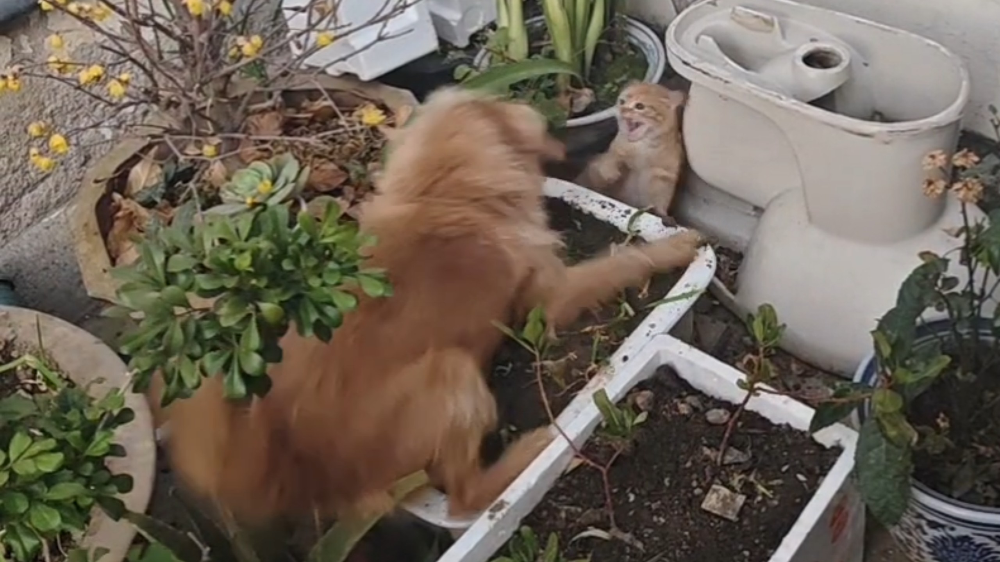 | 683 | 2026-01-21 |
| [【填词】炫神：“神不退 神不投 神不送 神不挂机”](https://www.bilibili.com/video/BV1EXzLB6Ets) |  | 9817 | 2026-01-21 |
| [哈基米：穷叉叉](https://www.bilibili.com/video/BV1oZzLBKE6E) |  | 331 | 2026-01-21 |
| [恋  鹰 循 环](https://www.bilibili.com/video/BV1YCzjBvEUz) |  | 3.2万 | 2026-01-21 |
| [哈基在说什么呢](https://www.bilibili.com/video/BV1YBzGBpEtx) | 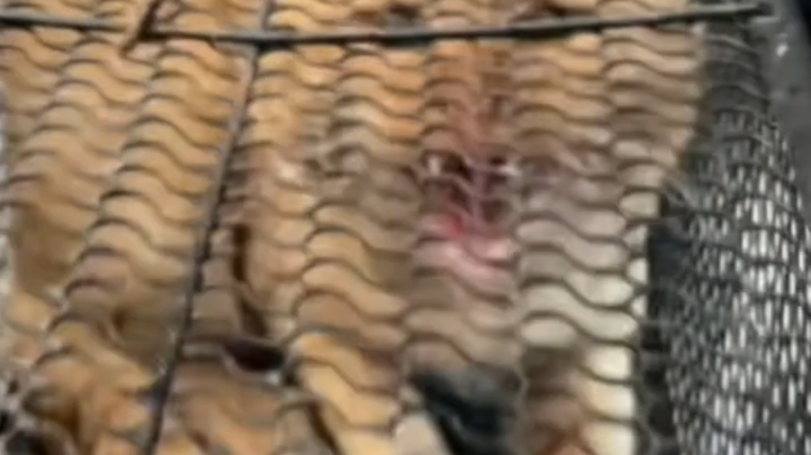 | 6424 | 2026-01-21 |
| [真实测评哈基米南北绿豆浆，原相机无滤镜](https://www.bilibili.com/video/BV1nzkEBoETH) |  | 4249 | 2026-01-20 |
| [♿“我视频被申鹤退回 不甘心役退”♿](https://www.bilibili.com/video/BV1ZxkJBsEPk) |  | 4610 | 2026-01-20 |
| [楼上邻居在阳台晒被子劝说无果，博主果断抱出哈基米呲水枪放大招。](https://www.bilibili.com/video/BV1zykuBaEmk) | 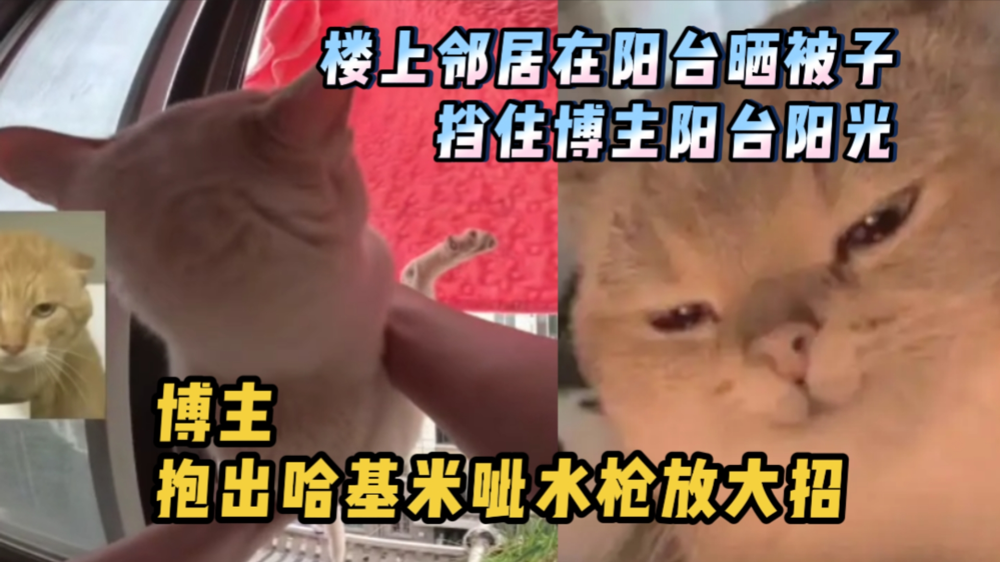 | 267 | 2026-01-19 |
| [爽基米](https://www.bilibili.com/video/BV1cFkuBYEMw) | 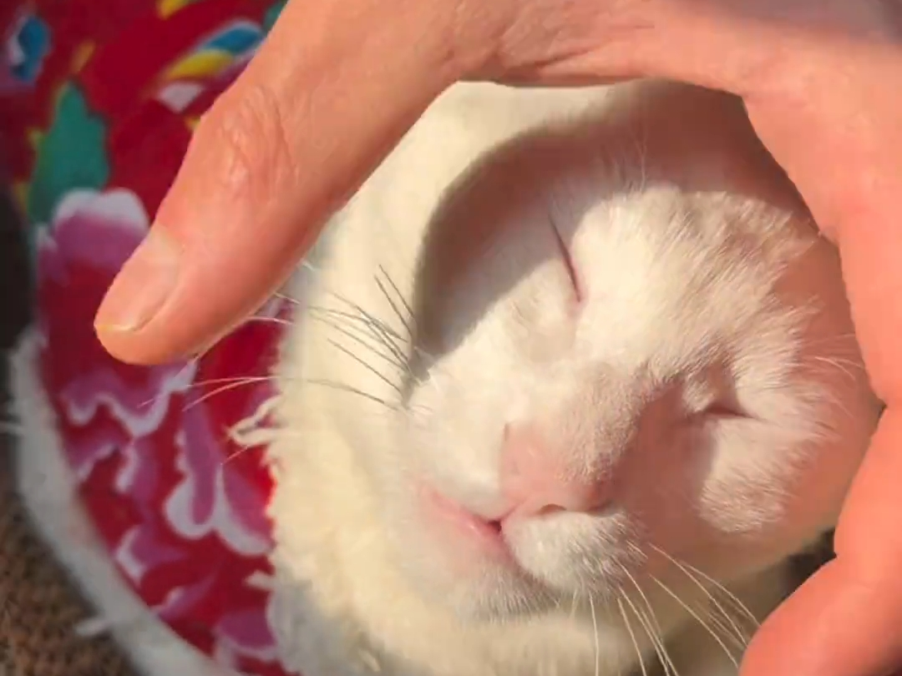 | 5984 | 2026-01-19 |
| [“死是凉爽的今夜♿”【整完版】我们到处乱GO（Everywhere We Go）](https://www.bilibili.com/video/BV1uXrQBPErS) |  | 29.6万 | 2026-01-17 |
| [适合冬天雪地拿莫辛玩捉迷藏的音乐](https://www.bilibili.com/video/BV1UarDBZEkw) |  | 33.5万 | 2026-01-17 |
| [神 人 有 格 调](https://www.bilibili.com/video/BV1TArCBvEgP) |  | 111.3万 | 2026-01-17 |
| [抽象来的，哈基米（印度版）](https://www.bilibili.com/video/BV1hJr2BnE4S) | 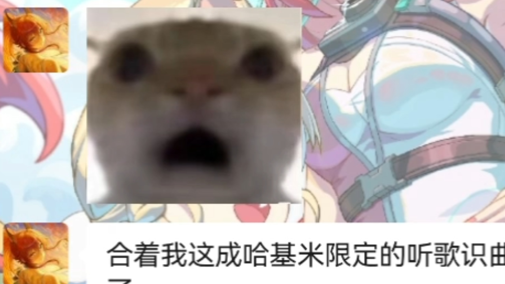 | 125 | 2026-01-17 |
| [基⚡米⚡说⚡](https://www.bilibili.com/video/BV1sHrkBYEUS) |  | 1011 | 2026-01-16 |
| [基  铁  跑  酷 🎵](https://www.bilibili.com/video/BV1gskFBsE2b) |  | 28.4万 | 2026-01-16 |
| [（3补）财鼠和主人在浴室温馨互动](https://www.bilibili.com/video/BV1kg6ZBAE5d) | 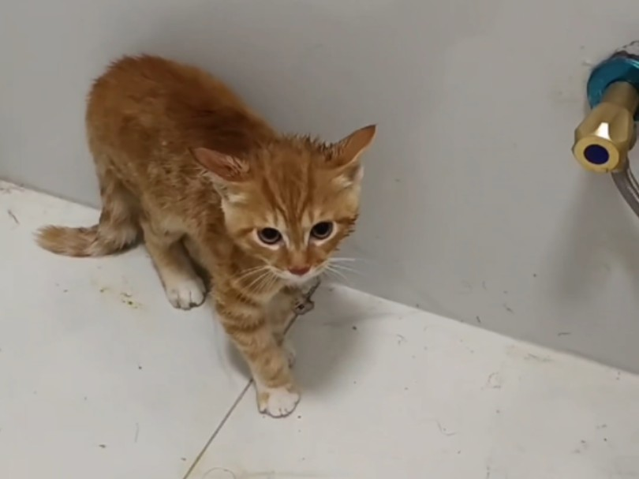 | 5.6万 | 2026-01-11 |
| [曼波关灯神器（脏话版加闹钟）](https://www.bilibili.com/video/BV16DrTBdEcB) | 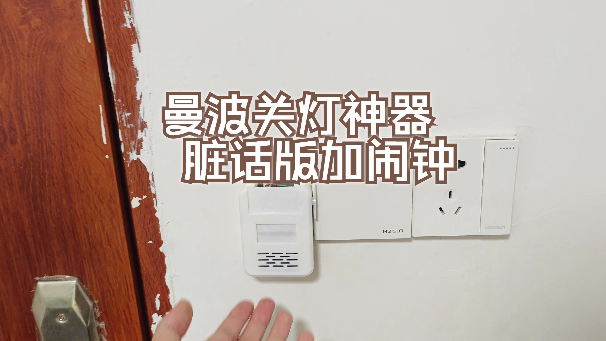 | 36.0万 | 2026-01-09 |
| [I Can&#x27;t Wait 咕嘎](https://www.bilibili.com/video/BV1E7i9BMEHV) |  | 45.1万 | 2026-01-09 |
| [“猴知猴觉”#蟹鸡面＝哈吉米](https://www.bilibili.com/video/BV1muqwByEmq) |  | 9318 | 2026-01-06 |
| [30秒教会你闽南话哈基米曼波](https://www.bilibili.com/video/BV1L5i4BsEXT) | 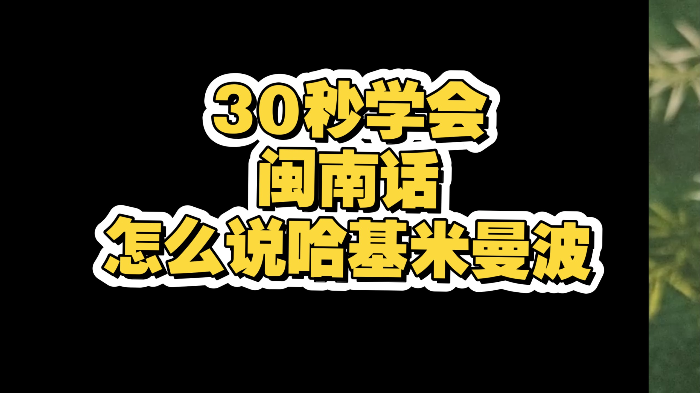 | 3541 | 2026-01-05 |
| [直播比作品搞笑多了，哈哈哈好家伙！](https://www.bilibili.com/video/BV18PvhB9Eqv) | 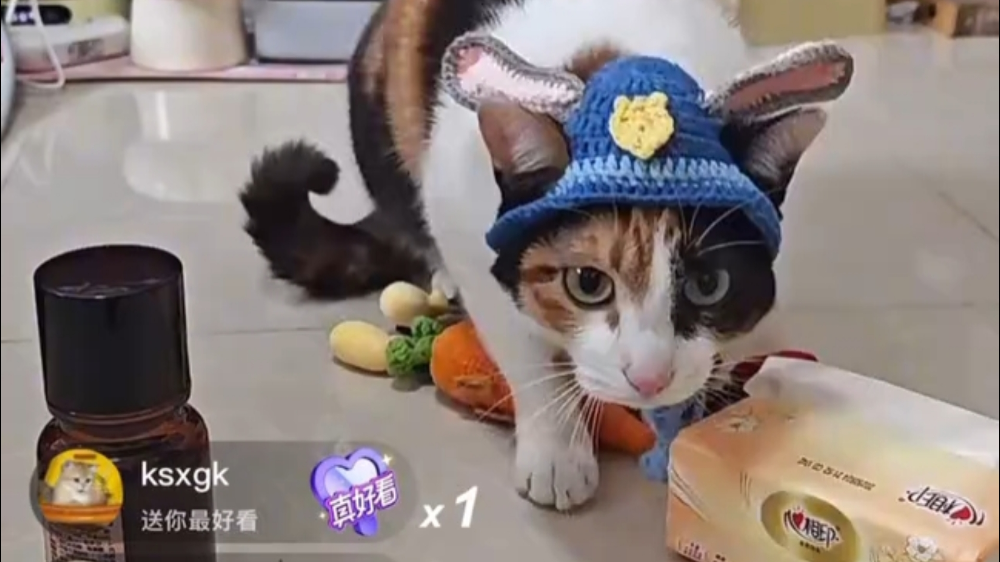 | 50.9万 | 2025-12-30 |
| [可爱泰迪小可爱](https://www.bilibili.com/video/BV1bQvWBBEkR) |  | 38.6万 | 2025-12-29 |
| [那些猫meme原声出处](https://www.bilibili.com/video/BV17AnAz6EQh) |  | 17.9万 | 2025-09-22 |
| [基米守国门，耄耋哈社稷。](https://www.bilibili.com/video/BV1rraRzREQp) |  | 9.7万 | 2025-09-08 |
| [哈基米诗朗诵](https://www.bilibili.com/video/BV1P4bXz2EbH) | 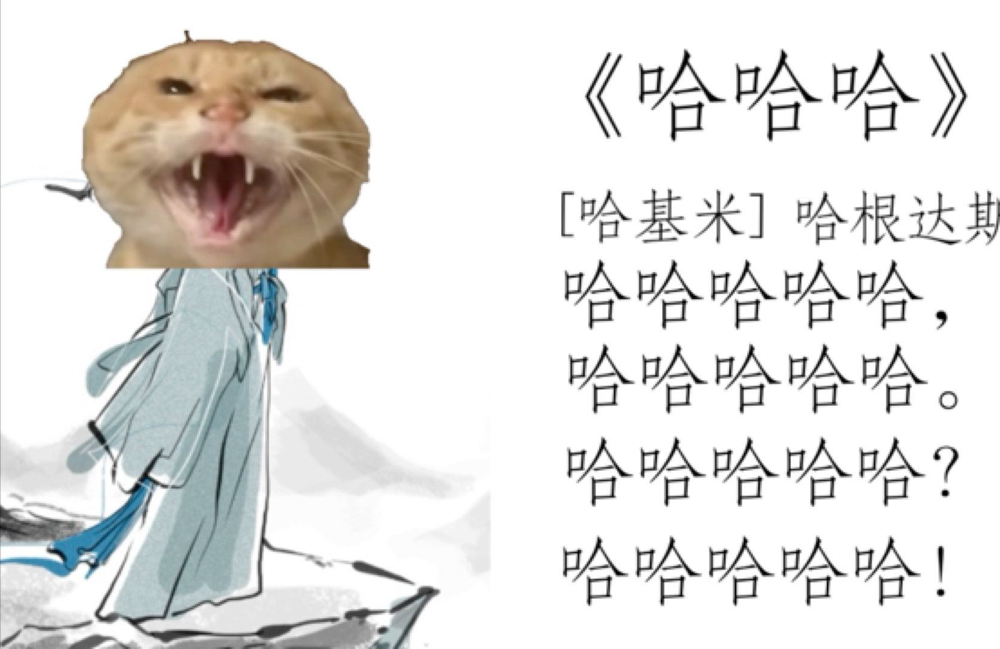 | 18.8万 | 2025-07-25 |
| [恐怖基米：基米之棺（人形の館）](https://www.bilibili.com/video/BV1TR3tzzEST) |  | 14.2万 | 2025-07-02 |
| [抽哈基米50毫升的血？？？666爱猫不叫我](https://www.bilibili.com/video/BV1GcKBzZEee) |  | 175.3万 | 2025-06-27 |
| [给家猫投屏耄耋，吓坏了](https://www.bilibili.com/video/BV1WJNRzdEY7) |  | 182.7万 | 2025-06-22 |
| [【李荣哈】戒烟](https://www.bilibili.com/video/BV1HGjnzXEvh) |  | 14.8万 | 2025-05-23 |
| [王从天降愤怒哈气](https://www.bilibili.com/video/BV1C154zqErP) | 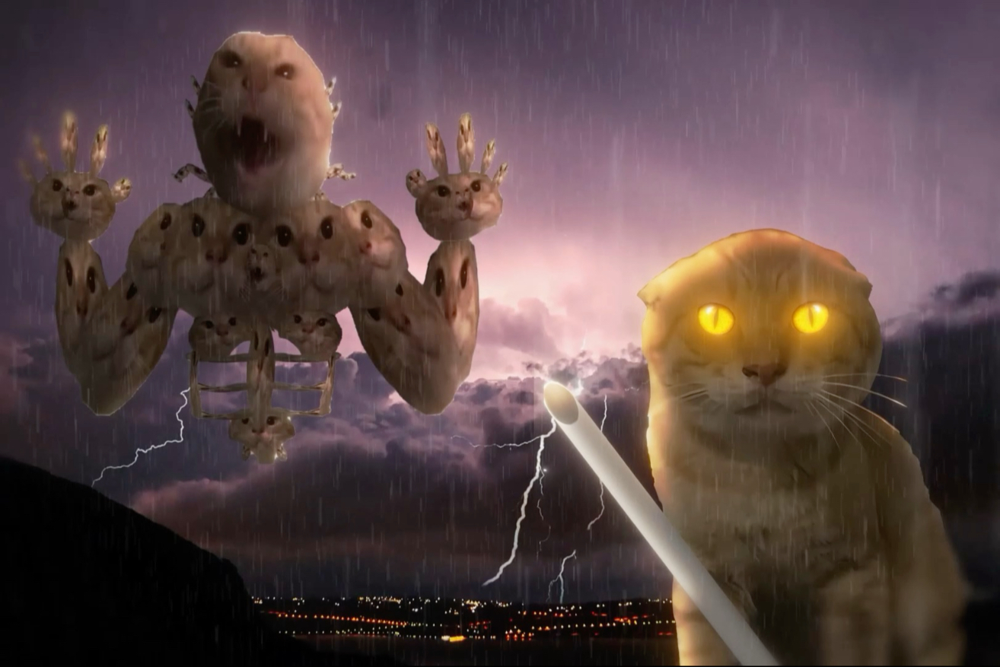 | 59.0万 | 2025-04-19 |
| [圆头耄耋哈气5分钟](https://www.bilibili.com/video/BV1DMduY9E5K) | 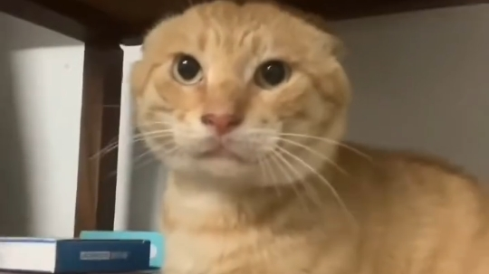 | 12.6万 | 2025-04-09 |
| [触手吊烧哈基米——末日后我变成了哈基米4](https://www.bilibili.com/video/BV1WrQSYSEib) |  | 32.8万 | 2025-03-16 |
| [哈基米变身](https://www.bilibili.com/video/BV1wJrUYSE1K) | 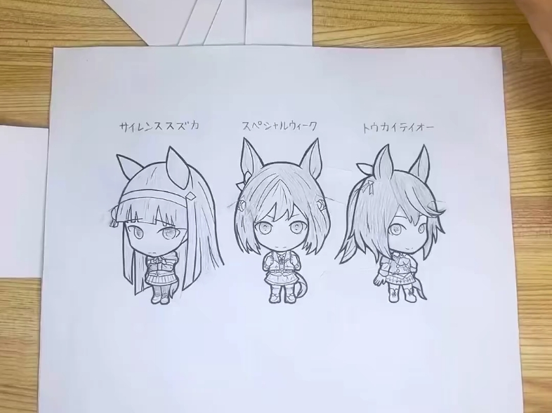 | 88 | 2025-01-07 |
| [哈基米偷走了重要的东西！](https://www.bilibili.com/video/BV1As1eY9Ezo) |  | 30.1万 | 2024-10-06 |
| [哈气之魂 神人哈基王葛温 三个音符让人应激](https://www.bilibili.com/video/BV1m6YeeJEGF) | 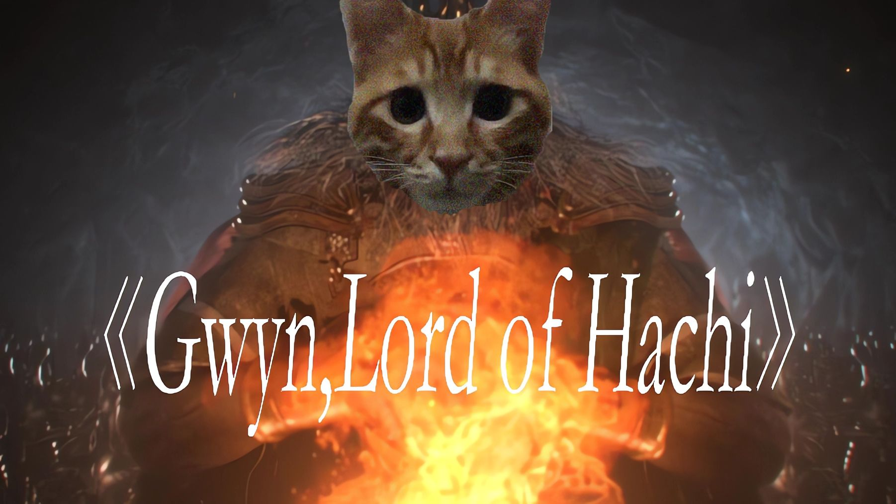 | 43.8万 | 2024-08-09 |
| [曼波哈基米虎视眈眈](https://www.bilibili.com/video/BV1Jw4m1Y7G2) |  | 297.8万 | 2024-07-17 |
| [哈↗哈→哈↘哈↗哈？](https://www.bilibili.com/video/BV19T421U7k7) |  | 707.2万 | 2024-05-18 |

---
*最后更新: 2026-01-23 02:51:05 (自动生成)*
*数据来源: [Bilibili](https://www.bilibili.com)*

## 使用说明

运行以下命令更新视频列表:
```bash
python3 fetch_hajimi_videos.py
```
