# awesome-hajimi
collections of hajimi (哈基米 in Chinese) on the Internet.

## 视频列表 (Video List)

| 视频标题 (Title) | 封面 | 播放量 (Views) | 发布日期 (Date) |
|---|---|---|---|
| [【哈基米音乐】Baby🐱曼波的回忆也请一并带走吧~](https://www.bilibili.com/video/BV1XxWNzVE8J) |  | 3424 | 2025-09-18 |
| [纯净（迫真）哈基米音乐 《有点哈》活全家填词完整版](https://www.bilibili.com/video/BV1i6pezYEVH) |  | 325 | 2025-09-18 |
| [盘点爆火的8首哈基米音乐！全听过的可以把手机扔了](https://www.bilibili.com/video/BV1gdpizcE4k) |  | 28.3万 | 2025-09-18 |
| [古风哈基米《霜雪哈年》纯净版](https://www.bilibili.com/video/BV1zYpezMEs5) |  | 2076 | 2025-09-18 |
| [【哈基米音乐】and I&#x27;m 基米](https://www.bilibili.com/video/BV1HWpaziEkT) |  | 432 | 2025-09-18 |
| [【dnd跑团】省流：圣武士唱哈基米音乐](https://www.bilibili.com/video/BV1RGpbzjEww) |  | 1.1万 | 2025-09-17 |
| [【劉俊朗】基米说完整版，这才是真正的音乐](https://www.bilibili.com/video/BV1m9pCzyEsr) |  | 4355 | 2025-09-16 |
| [小胡看《哈基山的基米打不打瓦》，这才是真正的音乐【胡桃usa】](https://www.bilibili.com/video/BV1e2HDzzEfc) |  | 3.0万 | 2025-09-10 |
| [R&amp;B哈基米：找自基](https://www.bilibili.com/video/BV1i4aQzBEcX) |  | 9.7万 | 2025-09-05 |
| [《明日哈舟》羽生曼曼波 EP - Little Wish（完整版）【粥基米音乐/似壬唱片】](https://www.bilibili.com/video/BV1b2aJzvEpE) |  | 1.2万 | 2025-09-01 |
| [【哈基米】魔法耄耋的猫德审判 OP1-【LaVI-Bavellabion】](https://www.bilibili.com/video/BV1KBaVz2Eym) |  | 2.0万 | 2025-08-31 |
| [【哈基米音乐】（原曲不使用）First Song (Zachz Winner &amp; Gaiyu Remix)](https://www.bilibili.com/video/BV1kZeCzwEWY) |  | 5.8万 | 2025-08-27 |
| [【Zc/趣事】和龙哥隔空对唱哈基米音乐？Zc盗播龙哥虚空对话太变态了！](https://www.bilibili.com/video/BV1gXYXzeEpp) |  | 16.4万 | 2025-08-21 |
| [夏老师等人哈基米纯享版](https://www.bilibili.com/video/BV1rUYhzdEmT) |  | 72.3万 | 2025-08-19 |
| [【哈基米音乐】ETERNAL 哈基米](https://www.bilibili.com/video/BV1LKY1zQExv) |  | 1.1万 | 2025-08-18 |
| [⚡JOJO哈基之风处刑曲⚡【基米电台 Day3 冠军作】](https://www.bilibili.com/video/BV1BnYyzpE5m) |  | 16.8万 | 2025-08-17 |
| [哈基米神殿(GBL神殿)](https://www.bilibili.com/video/BV16TYkzWESa) |  | 1.5万 | 2025-08-17 |
| [【普鲁士诗歌剧】哈基米的荣耀【基米电台Day1】](https://www.bilibili.com/video/BV1t8bpzAEGy) |  | 2.3万 | 2025-08-17 |
| [🎵可爱曼波刨手手！！🎵~【哈基米音乐】](https://www.bilibili.com/video/BV1FHbWztEdL) |  | 14.1万 | 2025-08-15 |
| [【耄耋】 哈基米游京 “我走在长街中，听戏子哈京城”](https://www.bilibili.com/video/BV1QTtdzAE9D) | 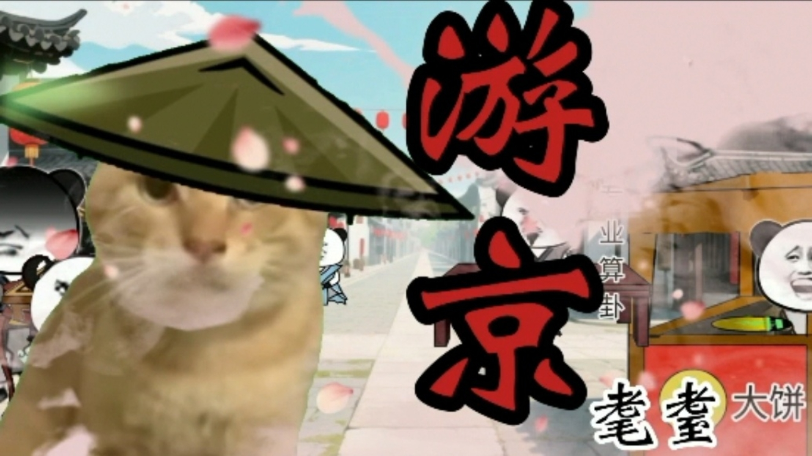 | 9064 | 2025-08-12 |
| [【哈基米音乐】了解你的哈气者](https://www.bilibili.com/video/BV1DzbgzqEZV) |  | 7.1万 | 2025-08-11 |
| [哈基米睡觉小曲](https://www.bilibili.com/video/BV1LkbNzcEya) | 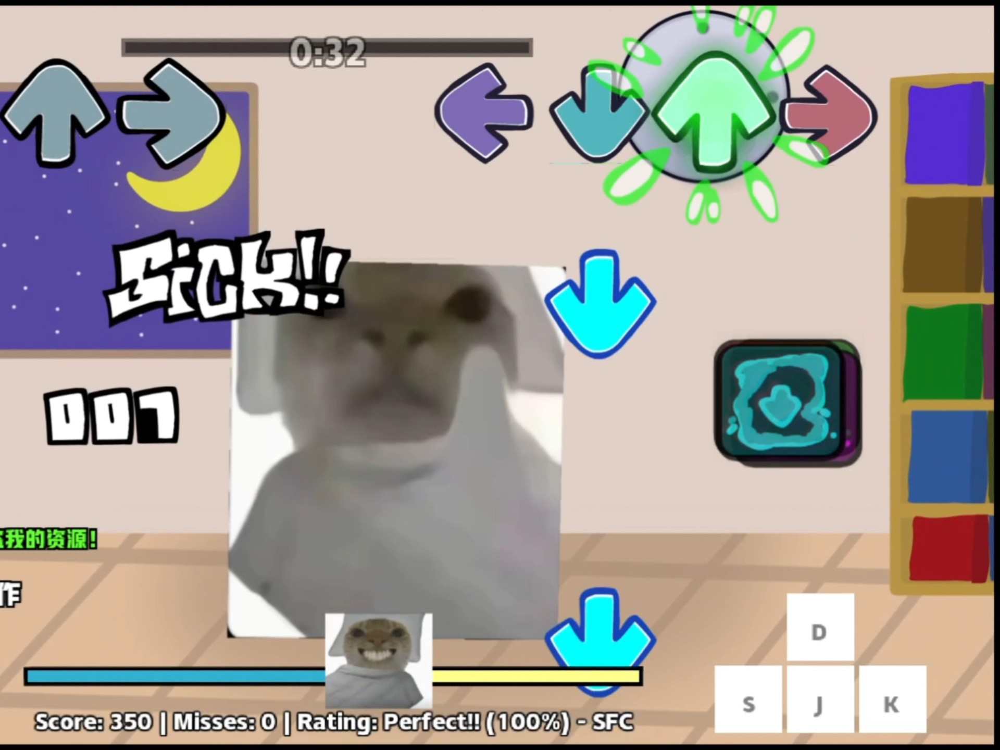 | 2665 | 2025-08-10 |
| [【蜜雪基米】蓝莲哈](https://www.bilibili.com/video/BV1tktmzTEgf) |  | 132.2万 | 2025-08-08 |
| [哈基米：正义之哈🔨🐱](https://www.bilibili.com/video/BV1XHtjznEca) |  | 2.1万 | 2025-08-05 |
| [“哈基米の九大名曲”](https://www.bilibili.com/video/BV1YdhGzHEoy) |  | 83.3万 | 2025-08-04 |
| [【哈基米音乐】这里的一切都同时在哈气和曼波](https://www.bilibili.com/video/BV1bphWzCEMs) | 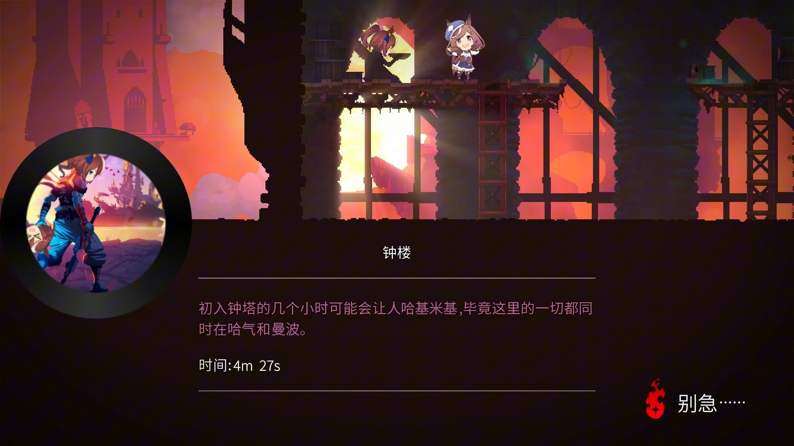 | 1.3万 | 2025-08-01 |
| [【哈基米】《可爱女人》 一声“wow~”开启了曼波的时代](https://www.bilibili.com/video/BV1eN8mzJExR) |  | 2.6万 | 2025-08-01 |
| [【哈基米音乐】俄罗斯哈基米](https://www.bilibili.com/video/BV1NL8RzdEig) |  | 4.1万 | 2025-07-29 |
| [⚡️哈 基 米 进 行 曲⚡️](https://www.bilibili.com/video/BV16n8tzqETh) | 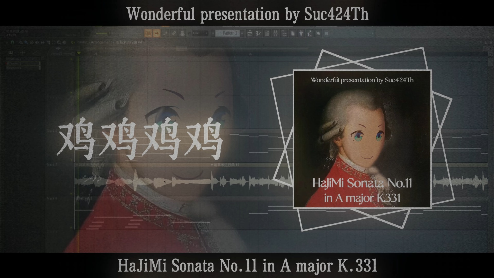 | 5.3万 | 2025-07-26 |
| [以防你错过了leedo首播的神人音乐【基米音乐 x 一勺料汁】](https://www.bilibili.com/video/BV1ixb9zKEgr) |  | 24.0万 | 2025-07-25 |
| [相隔一江想哈又哈不到的遥远基米](https://www.bilibili.com/video/BV1jobSzbE97) | 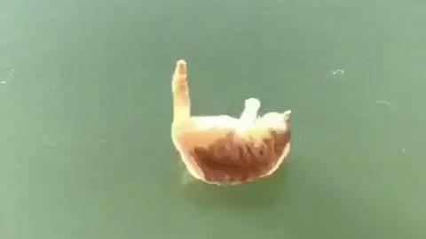 | 9.9万 | 2025-07-25 |
| [我怎么可能成为你的哈基米，哈基哈基！](https://www.bilibili.com/video/BV18nbCzfEhG) |  | 8014 | 2025-07-24 |
| [【基米洲行动】🎵🐱哈基米 潮汐监狱黑潮行动の小曲《Ready To Mambo》🐱🎵](https://www.bilibili.com/video/BV1B68wzZEMr) |  | 10.9万 | 2025-07-23 |
| [【哈基米音乐】杀人放火耄耋立，万人敬仰哈基米 -《不哈》](https://www.bilibili.com/video/BV1WZgKzPEmy) |  | 2.8万 | 2025-07-17 |
| [【哈基米音乐】三 畜 审 判 ♿](https://www.bilibili.com/video/BV157gTznEwL) |  | 17.8万 | 2025-07-17 |
| [哈基米 啵啵颂](https://www.bilibili.com/video/BV1aXu6zrERf) |  | 16.6万 | 2025-07-14 |
| [【东方哈基米】哈气之山 ~ Hachimi Mountain](https://www.bilibili.com/video/BV1ghuqzFEGe) |  | 2.4万 | 2025-07-14 |
| [【哈基米音乐】Goat Chill（模拟山羊的小曲）](https://www.bilibili.com/video/BV1UguPzeEsb) |  | 9368 | 2025-07-13 |
| [【哈基米音乐】哈基联军（Seven Nation Army)战地一](https://www.bilibili.com/video/BV1gpuczfEGr) |  | 3.3万 | 2025-07-13 |
| [闪  光  的  哈  基  米](https://www.bilibili.com/video/BV1j6u7zHEDp) |  | 16.1万 | 2025-07-12 |
| [【蜂蜜水音乐】哈基米的黄昏（原曲：周传雄-黄昏）](https://www.bilibili.com/video/BV1BQuGzBEiV) |  | 1589 | 2025-07-11 |
| [🐱哈基米音乐：逐渐加快🐱](https://www.bilibili.com/video/BV13XGVzBEN4) |  | 4.2万 | 2025-07-11 |
| [【哈基米音乐】星尘的基米](https://www.bilibili.com/video/BV1f9GWz2EDU) |  | 6.1万 | 2025-07-11 |
| [【哈基米音乐】掷弹基米进行曲（大清不妙曲）](https://www.bilibili.com/video/BV14JGPzuEtq) |  | 1.6万 | 2025-07-09 |
| [神人金属之哈基米风暴](https://www.bilibili.com/video/BV1ApGnzGENH) |  | 4.4万 | 2025-07-08 |
| [哈基米音乐：Horizon](https://www.bilibili.com/video/BV1Tx3Rz5E79) |  | 1.7万 | 2025-07-05 |
| [哈基米音乐：🎵夜空里的哈基米🎵（超绝填词版）](https://www.bilibili.com/video/BV1tA39zgEKW) |  | 1.4万 | 2025-07-05 |
| [【哈基米音乐】哈基档案 曼波托斯主题曲 Constant Hajimi](https://www.bilibili.com/video/BV1q934znEhQ) |  | 21.5万 | 2025-07-02 |
| [粥基米音乐之浸春基](https://www.bilibili.com/video/BV1xKgfzSEtX) |  | 16.3万 | 2025-06-29 |
| [【非法广播】【哈基米FM】哈基潜兵降落音乐](https://www.bilibili.com/video/BV1ekK7zuE6q) |  | 12.9万 | 2025-06-25 |
| [【哈基米】齐 天 大 基 版](https://www.bilibili.com/video/BV1cvKGzzESQ) | 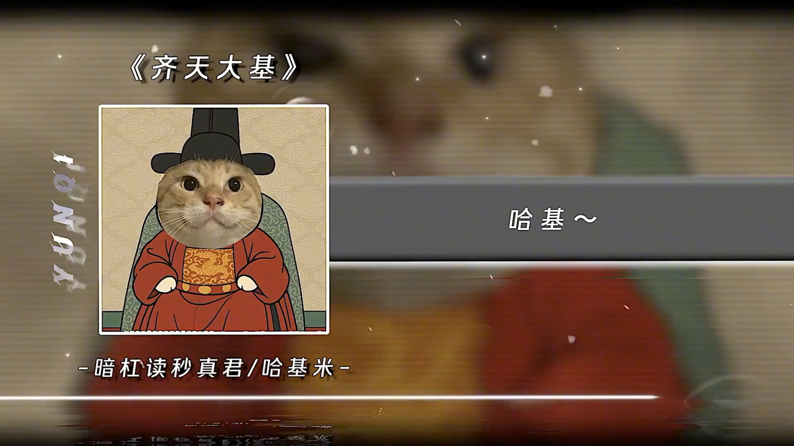 | 5.8万 | 2025-06-24 |
| [哈基米音乐之奇迹于你的小曲SPOOKY](https://www.bilibili.com/video/BV1k5K3zPEZ2) |  | 8.0万 | 2025-06-24 |
| [哈基米：21世纪精神分裂哈基米（登神长阶修复版）](https://www.bilibili.com/video/BV11DK3zzEJT) |  | 3.6万 | 2025-06-24 |
| [哈基米音乐：黑之裁判](https://www.bilibili.com/video/BV1CiKWzqEzC) |  | 13.8万 | 2025-06-22 |
| [【超长折磨】挑战听一堆哈基米音乐通关游戏。](https://www.bilibili.com/video/BV1KXNXzxEgX) | 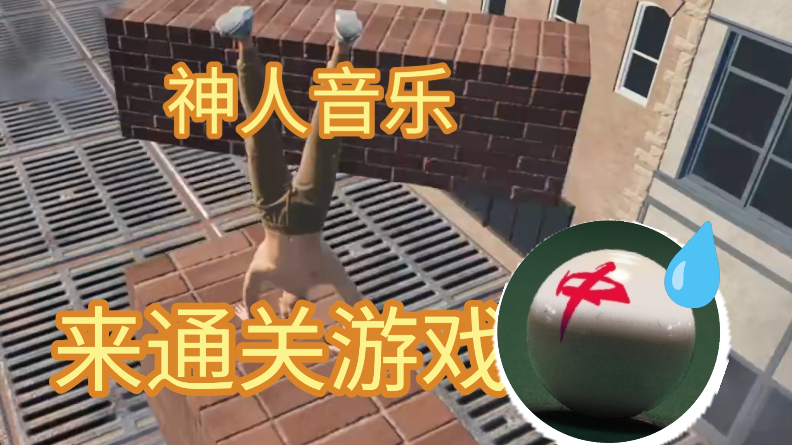 | 1.9万 | 2025-06-22 |
| [【哈基米FM】十年阴间](https://www.bilibili.com/video/BV1b1NrzhEqg) |  | 4.2万 | 2025-06-21 |
| [哈基米音乐：哈马野郎](https://www.bilibili.com/video/BV1w5NtzLETt) |  | 10.9万 | 2025-06-19 |
| [哈基米 For the Damaged Coda](https://www.bilibili.com/video/BV1y5NrzQESL) |  | 2.7万 | 2025-06-17 |
| [〖哈基米音乐〗马赛曲（封面：哈气引导人民）](https://www.bilibili.com/video/BV1dvNazjE41) |  | 2.8万 | 2025-06-16 |
| [哈基米FM之饥荒哈气版耄耋主题曲](https://www.bilibili.com/video/BV1y9NtzmEpy) |  | 2.1万 | 2025-06-16 |
| [【哈基米音乐】星 之 哈 比](https://www.bilibili.com/video/BV1pvMmzVET5) |  | 2.1万 | 2025-06-14 |
| [【哈基米音乐】幸运哈插曲——哈基米的主题](https://www.bilibili.com/video/BV19nM7z3EB1) |  | 5.2万 | 2025-06-11 |
| [纯净哈基米之甜甜の小曲](https://www.bilibili.com/video/BV1FXMgzTEQM) |  | 3.9万 | 2025-06-10 |
| [【讨论】在古典乐中，叮咚鸡比哈基米更加权威](https://www.bilibili.com/video/BV1E6TTz9E9V) | 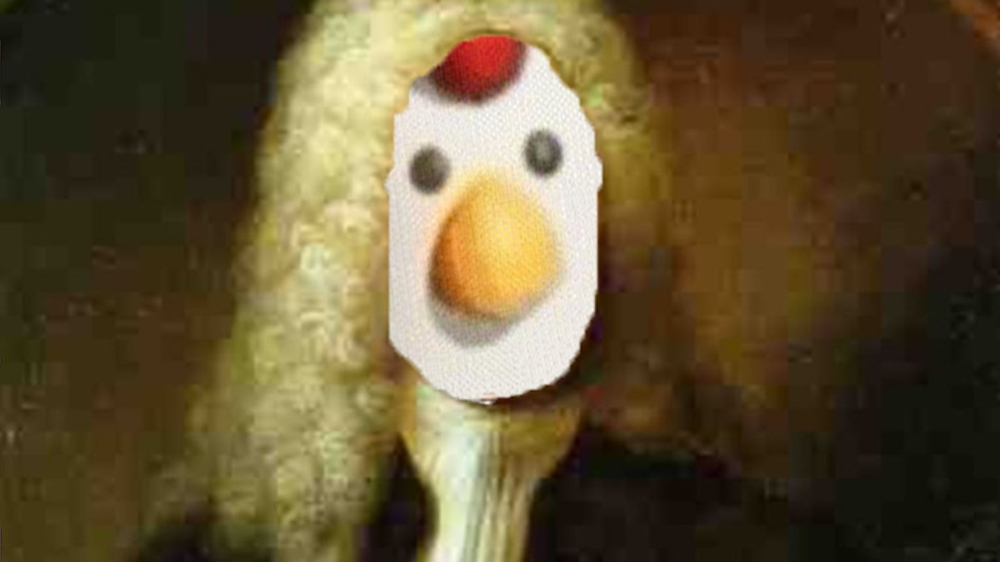 | 10.2万 | 2025-06-06 |
| [哈基米：旧日支配者的颂歌](https://www.bilibili.com/video/BV1GaTbzzEQg) |  | 20.1万 | 2025-06-05 |
| [哈基米音乐：🎵登峰造「基」境 - Rise🎵](https://www.bilibili.com/video/BV1dBTWzFEFb) |  | 18.0万 | 2025-06-05 |
| [移除蜂蜜水，哈基米强大！哈基米活全家塞族音乐之remove kebab](https://www.bilibili.com/video/BV1KL7hzxEbf) |  | 10.0万 | 2025-06-03 |
| [【哈基米古典音乐】李斯特的钟](https://www.bilibili.com/video/BV1fW7QzzEt9) |  | 51.1万 | 2025-06-02 |
| [【哈基米电音】(完整版)地平线4🎶Shooting 曼波](https://www.bilibili.com/video/BV1HG7PzkESD) |  | 11.7万 | 2025-06-01 |
| [哈基米  求生之路 特感出场音乐Bgm](https://www.bilibili.com/video/BV1REjqzXEEJ) |  | 29.3万 | 2025-05-28 |
| [金曲《你永远是哈基米》](https://www.bilibili.com/video/BV1qRjZzUEKz) |  | 3.7万 | 2025-05-27 |
| [法兰西诗歌剧：哈黎SM院 大基米时代](https://www.bilibili.com/video/BV1epjjz8EoG) |  | 2.0万 | 2025-05-26 |
| [🎵Say Manbo~🎵【哈基米音乐】](https://www.bilibili.com/video/BV1CrJWz3ESy) |  | 1.6万 | 2025-05-22 |
| [🐱哈基米音乐🎵只想爱饲你🐱](https://www.bilibili.com/video/BV1XGJ6zNE3x) |  | 8.4万 | 2025-05-21 |
| [环哈基米](https://www.bilibili.com/video/BV1brJ8zvEDT) |  | 5.8万 | 2025-05-20 |
| [【哈基米音乐】🌺Over Gone (Phonk)蝴蝶步🌺神人杯Day 20应援作品](https://www.bilibili.com/video/BV181EZzkENr) |  | 2.7万 | 2025-05-20 |
| [【哈基米FM】关 山 基（成分过于复杂）](https://www.bilibili.com/video/BV14wEyzvExc) |  | 9.6万 | 2025-05-15 |
| [难！得！有！几！只！哈！基！米！](https://www.bilibili.com/video/BV1gpELzbEfb) |  | 9.6万 | 2025-05-12 |
| [【神人杯Day12】哈基米：夜曲](https://www.bilibili.com/video/BV1WTEgzPEYS) |  | 1.6万 | 2025-05-12 |
| [【神人杯Day5】🎵哈基米：三国恋](https://www.bilibili.com/video/BV1AfVPziEDx) |  | 3.7万 | 2025-05-05 |
| [【4月】哈基米音乐排行榜#7](https://www.bilibili.com/video/BV1HzV5zFEoV) |  | 136.4万 | 2025-05-02 |
| [哈基米FM：基米苦行山](https://www.bilibili.com/video/BV12W5EzSEhd) |  | 9.3万 | 2025-04-18 |
| [🐱哈基米：哈气的咪被火葬🐱【完整版】](https://www.bilibili.com/video/BV1NZfNY1E4w) | 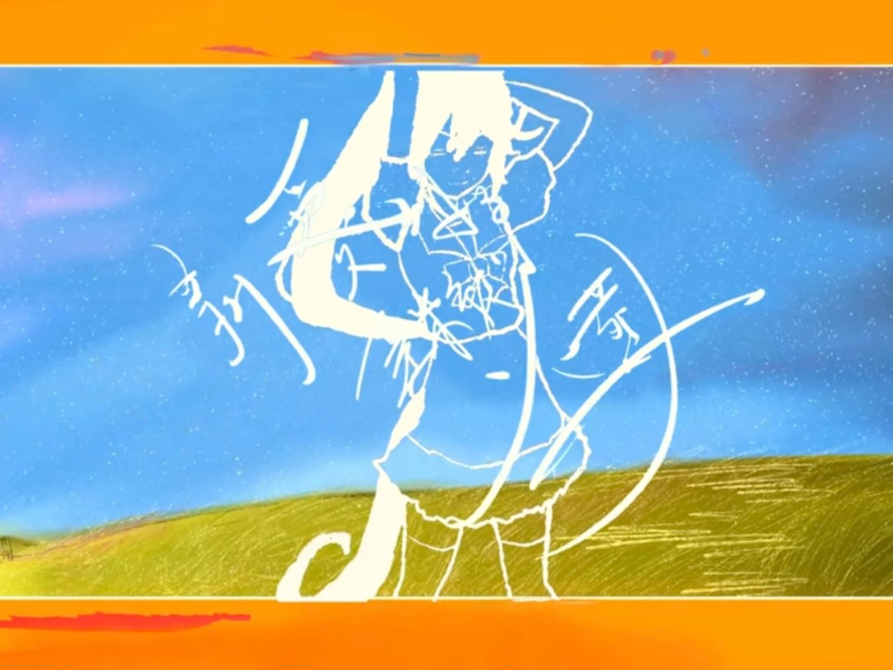 | 4.2万 | 2025-04-02 |
| [哈基米：怪物之歌（重置）](https://www.bilibili.com/video/BV1iNZqY7ExC) |  | 1.8万 | 2025-03-30 |
| [哈基米：我们意念合一](https://www.bilibili.com/video/BV1xDo1YRE8T) |  | 19.0万 | 2025-03-24 |
| [哈基米没有活着的传奇](https://www.bilibili.com/video/BV11vRVYZEv5) |  | 52.1万 | 2025-03-10 |
| [哈基米：🎵Sacred Play Secret Place🎵](https://www.bilibili.com/video/BV1mA9oY1EP5) |  | 16.2万 | 2025-03-05 |
| [私人FM之哈基米艾丽卡](https://www.bilibili.com/video/BV1Rg9AY3Eb6) |  | 8.2万 | 2025-02-27 |
| [[古典音乐] 查拉图斯特拉如是说，但是哈基米](https://www.bilibili.com/video/BV1TmwdeKEvL) |  | 11.0万 | 2025-02-17 |
| [哈基米国风音乐china-x](https://www.bilibili.com/video/BV1NSFXenEYL) |  | 4.0万 | 2025-01-31 |
| [哈基米：Auv Mujica 【2025哈基米拜年基单品】](https://www.bilibili.com/video/BV1QYFDepEXq) |  | 3.6万 | 2025-01-31 |
| [【哈基米拜年基单品】哈基米nobody](https://www.bilibili.com/video/BV1i7FWeUEpG) | 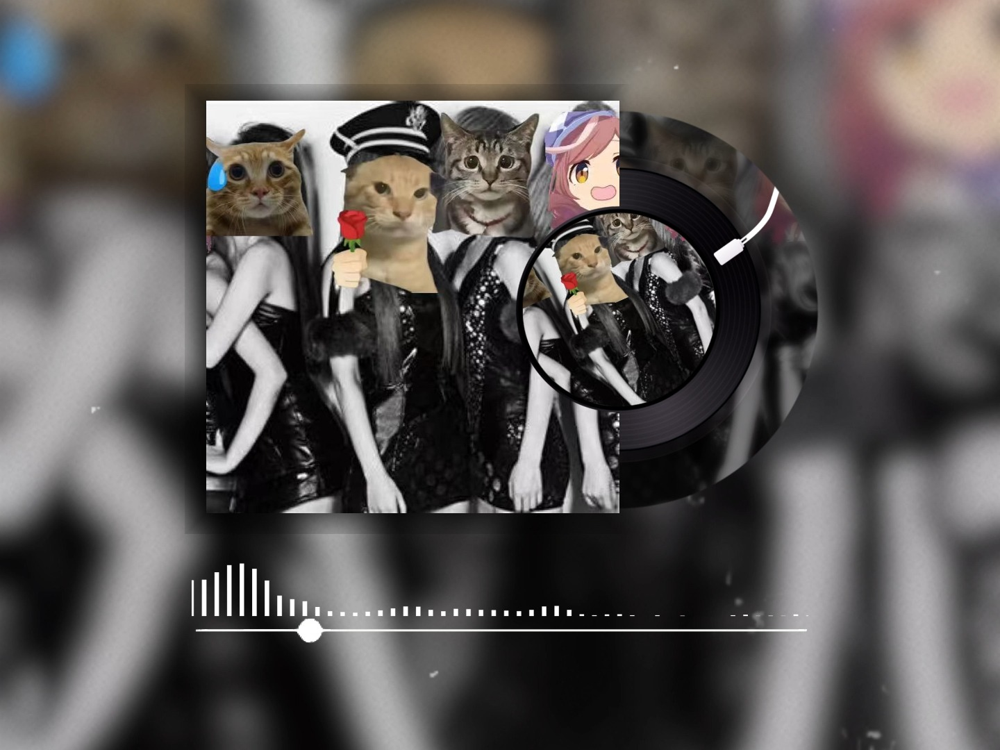 | 8.3万 | 2025-01-29 |
| [「二次补档」哈基米之王Discipline](https://www.bilibili.com/video/BV1N2FTeRE83) | 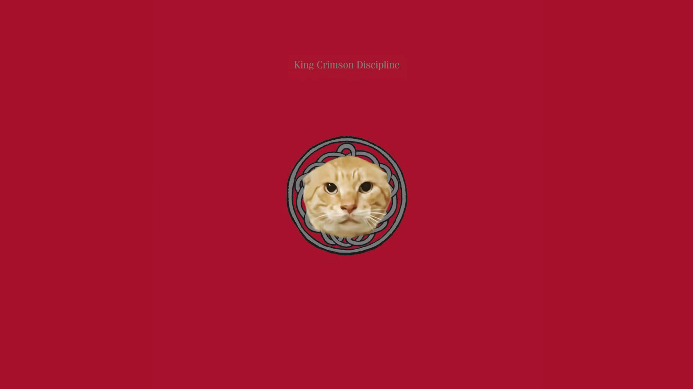 | 4.8万 | 2025-01-29 |
| [【哈基米】究极神兵](https://www.bilibili.com/video/BV1xpwzeEErQ) |  | 3.2万 | 2025-01-19 |
| [[哈基米音乐]HALO（哈楼）](https://www.bilibili.com/video/BV1vmcGepEto) |  | 5.7万 | 2025-01-13 |
| [【哈基米FM】桜 流 基](https://www.bilibili.com/video/BV1fP6EYWEJ9) |  | 10.2万 | 2024-12-31 |
| [【哈基米FM】刚好遇基米](https://www.bilibili.com/video/BV1h6qHY1Ei6) | 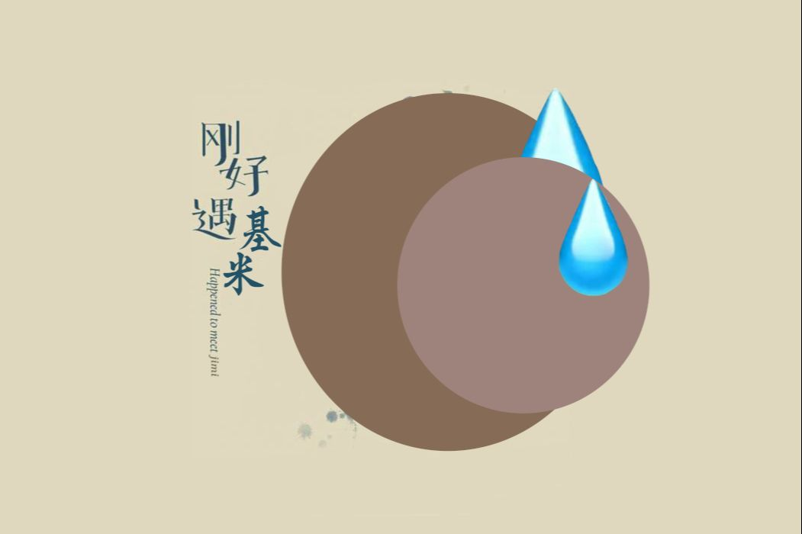 | 25.5万 | 2024-12-08 |
| [【哈基米FM】青藏高原上咪](https://www.bilibili.com/video/BV1znDsYPEwQ) |  | 16.7万 | 2024-11-04 |
| [弹奏着奇怪音乐的哈基米](https://www.bilibili.com/video/BV1gfpte2EbV) |  | 37.2万 | 2024-09-07 |
| [哈基米音乐制作过程 4:10音量注意](https://www.bilibili.com/video/BV16uvyeuENH) | 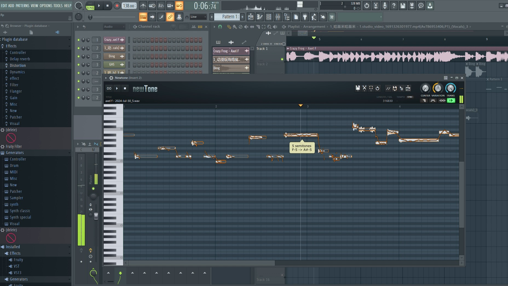 | 1.4万 | 2024-07-30 |

---
*最后更新: 2025-09-19 02:36:55 (自动生成)*
*数据来源: [Bilibili](https://www.bilibili.com)*

## 使用说明

运行以下命令更新视频列表:
```bash
python3 fetch_hajimi_videos.py
```
