# awesome-hajimi
collections of hajimi (哈基米 in Chinese) on the Internet.

## 视频列表 (Video List)

| 视频标题 (Title) | 封面 | 播放量 (Views) | 发布日期 (Date) |
|---|---|---|---|
| [【MD】黯蜜(味美喵)卡组前瞻：1月新主流 哈基米降临大师决斗](https://www.bilibili.com/video/BV1dpvmB1EG2) |  | 2361 | 2025-12-29 |
| [暴怒六尾现强度如何，小豪爽玩一号位霸体哈基米 疯狂撕咬，太暴力了 这下是真要被吓哭了](https://www.bilibili.com/video/BV1J2vCBCEUB) |  | 1504 | 2025-12-29 |
| [触发哈基米底层代码了](https://www.bilibili.com/video/BV1WbvUBhEty) | 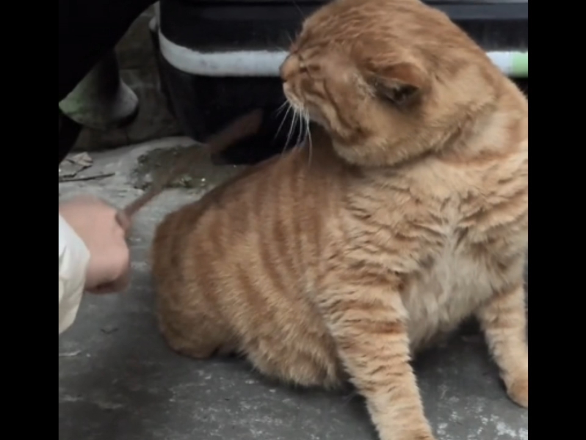 | 1081 | 2025-12-29 |
| [🎵&quot;甘城哈基米&quot;🎵｜《NachoNeko Ohayou BGM》哈基米音乐](https://www.bilibili.com/video/BV1wtv2BWE9M) |  | 740 | 2025-12-28 |
| [哈基米已打卡成功✌️](https://www.bilibili.com/video/BV1K7v2BcEk8) |  | 17 | 2025-12-28 |
| [深夜睡醒怒拍哈基米大皮鼓](https://www.bilibili.com/video/BV1ZhvyBkET2) |  | 1115 | 2025-12-28 |
| [看doro与哈基米赛跑小剧场](https://www.bilibili.com/video/BV1RzvyBTEnJ) |  | 721 | 2025-12-28 |
| [虽然过去已无法哈基米，但未来还能](https://www.bilibili.com/video/BV1ANv1BnEF7) |  | 799 | 2025-12-28 |
| [经典老番 会街舞的哈基米](https://www.bilibili.com/video/BV1o5v1BVEQH) | 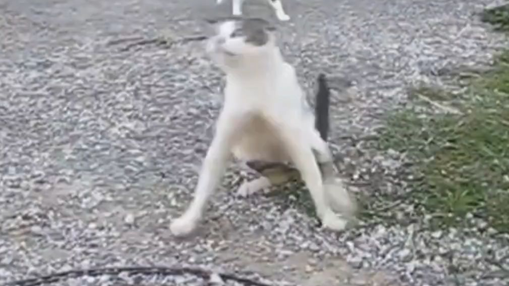 | 2126 | 2025-12-28 |
| [不允许把自由的哈基米叫做流浪哈基米](https://www.bilibili.com/video/BV1B3v1BLE5S) | 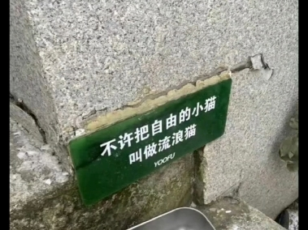 | 392 | 2025-12-28 |
| [见过琉璃版的哈基米吗～](https://www.bilibili.com/video/BV1oavkBPEHc) |  | 1.1万 | 2025-12-28 |
| [哈基咪握蓝莓绿豆...](https://www.bilibili.com/video/BV11RvkBEExp) |  | 437 | 2025-12-28 |
| [【哈基米】变相基米 - MONTAGEM REBOLA](https://www.bilibili.com/video/BV176vqBWEdw) |  | 676 | 2025-12-28 |
| [纸巾的多种解法](https://www.bilibili.com/video/BV1Qiv6BXEbp) | 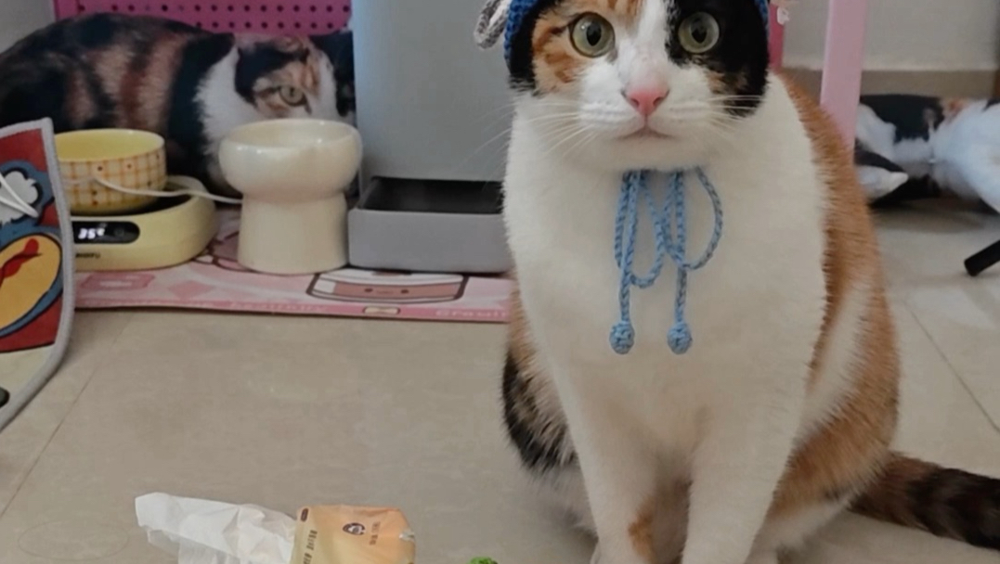 | 24.1万 | 2025-12-28 |
| [【闪电哈基米】本次登场的是继承了星辉哈基米力量，并且可以碾压众神的闪电哈基米！](https://www.bilibili.com/video/BV1Ukv6BUEHe) |  | 1246 | 2025-12-28 |
| [《永劫无间》x《黑猫警长》联动实机演示](https://www.bilibili.com/video/BV17xv6BhEvD) |  | 40.7万 | 2025-12-28 |
| [【hanser】绝区零FES现场 橘福福EP 站毛直拍day3 4K](https://www.bilibili.com/video/BV12Dv6BVELc) |  | 16.6万 | 2025-12-28 |
| [哈 基 行](https://www.bilibili.com/video/BV1BKvrBAEGA) |  | 3.2万 | 2025-12-28 |
| [居家祝福仅需30，快至半小时出货！#哈基米 #神马教 #祝福视频](https://www.bilibili.com/video/BV1mxvrBJEnN) |  | 1259 | 2025-12-28 |
| [触发哈基米的底层代码了](https://www.bilibili.com/video/BV1v3vrBfErY) | 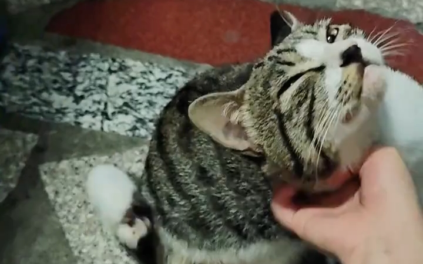 | 688 | 2025-12-28 |
| [【Sora2】战马娘哈基米无剧情纯享版](https://www.bilibili.com/video/BV1BcvzBZEaR) |  | 1287 | 2025-12-28 |
| [【哈基米术力口】束缚爱](https://www.bilibili.com/video/BV1rovBBhEAG) |  | 297 | 2025-12-28 |
| [做了一个哈基米版的宿舍关灯神器。文科生从未见过如此上等贡品](https://www.bilibili.com/video/BV1aLvzBEE5X) |  | 2.8万 | 2025-12-28 |
| [哈基米文化是外国人发明？来看看五年前油管近百万播放的哈基米之歌【赛马娘第二季前一年就把猫和哈基米结合的歌】](https://www.bilibili.com/video/BV1vmvzB4Edj) |  | 671 | 2025-12-28 |
| [创业TV曼波面包，吃完感觉要哈气了😋](https://www.bilibili.com/video/BV1ECvzBFEKY) |  | 4.6万 | 2025-12-28 |
| [好关](https://www.bilibili.com/video/BV1frvzBhEyx) |  | 7.7万 | 2025-12-28 |
| [用什么部位想的剧情](https://www.bilibili.com/video/BV1FHv6BPERd) | 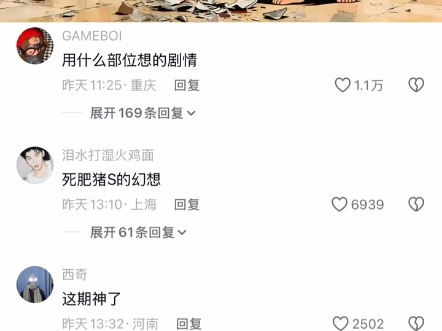 | 17.8万 | 2025-12-28 |
| [诺鼠饼干 哎真棒!](https://www.bilibili.com/video/BV1njv6BqEze) | 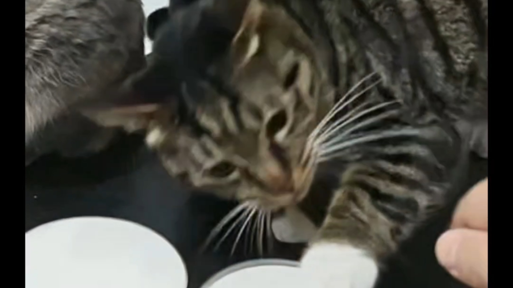 | 2595 | 2025-12-28 |
| [“害怕是生物本能 勇气是人类赞歌.”｜《NO BATIDÃO(slowed)》](https://www.bilibili.com/video/BV18YBCBPETn) | 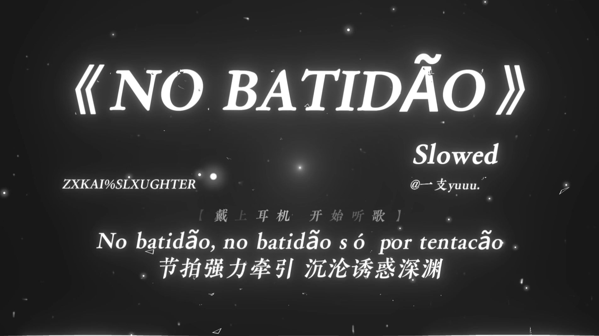 | 1.7万 | 2025-12-28 |
| [真看哭了！泛式看Neuro和Vedal的互动，这段真的封神了，太容易让人入脑了，我也想要个AI伙伴啊！【泛式】](https://www.bilibili.com/video/BV1pyBCBdEL8) |  | 16.4万 | 2025-12-27 |
| [【恶果】](https://www.bilibili.com/video/BV1cSBCBpEDv) |  | 84.2万 | 2025-12-27 |
| [莫名戳中笑点334](https://www.bilibili.com/video/BV1MYBCBPEUA) |  | 12.1万 | 2025-12-27 |
| [【哈基米电音】Shiawase](https://www.bilibili.com/video/BV13tBCBqEFB) |  | 1746 | 2025-12-27 |
| [【夏天y】压力一只猫？【龙神家的哈基米】](https://www.bilibili.com/video/BV1DuByBBEjp) | 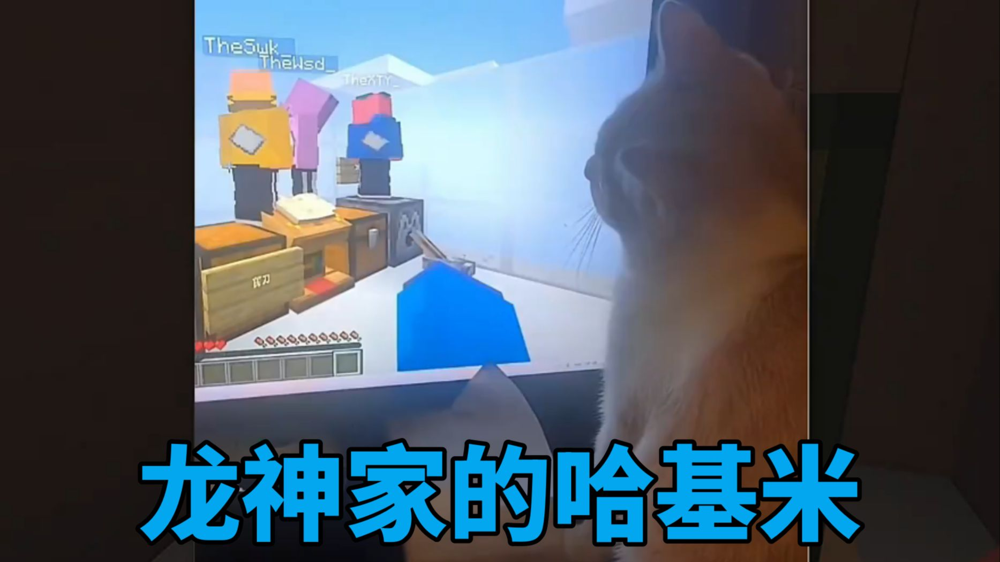 | 1.9万 | 2025-12-27 |
| [萝卜纸巾，但是耄耋](https://www.bilibili.com/video/BV1f9BCBSEwT) | 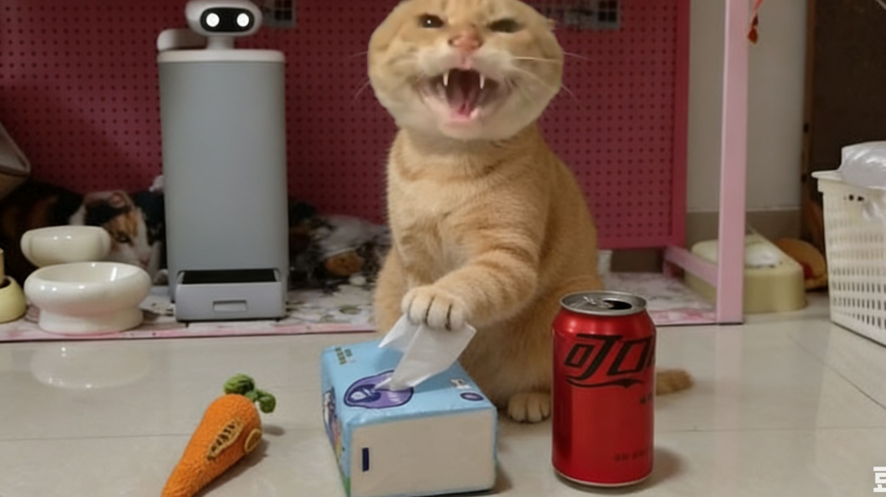 | 4.2万 | 2025-12-27 |
| [中国喵喵枪，自带拉栓上膛声，平民玩家最易上手的枪支](https://www.bilibili.com/video/BV1dwByBVE2R) |  | 14.2万 | 2025-12-27 |
| [节目效果之我要记住你的样子【补档】](https://www.bilibili.com/video/BV1BvByBDEJ6) |  | 7.8万 | 2025-12-27 |
| [特别的训练方式](https://www.bilibili.com/video/BV1HkBrBJEfM) |  | 1.5万 | 2025-12-27 |
| [这些动物还有救吗？](https://www.bilibili.com/video/BV1P6BrBDEKg) | 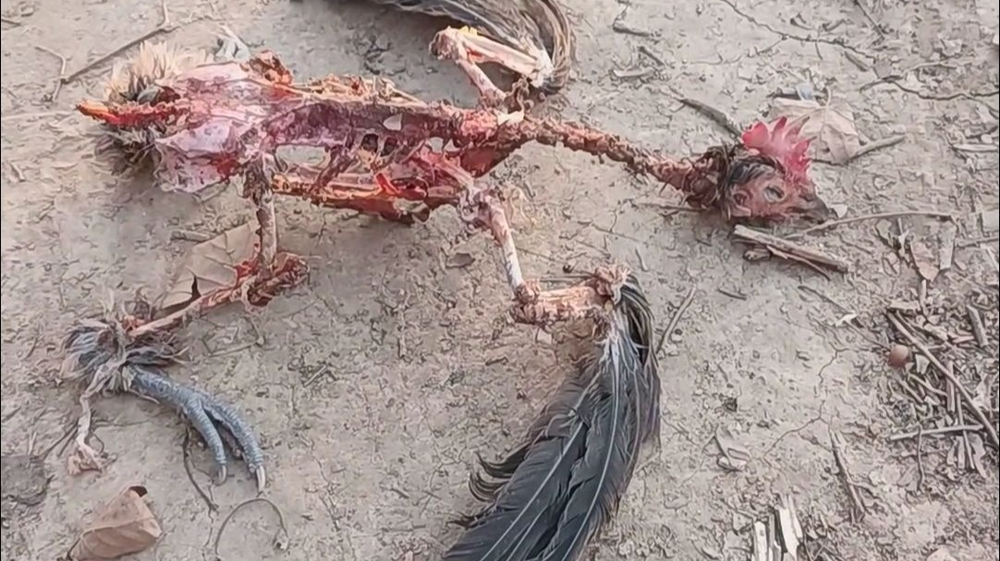 | 9.5万 | 2025-12-27 |
| [【纯音乐】哈基米-起床曲 纯享版](https://www.bilibili.com/video/BV1J2BrB2Eh3) |  | 579 | 2025-12-27 |
| [小吉米应激哈气了](https://www.bilibili.com/video/BV161BrB7EQY) |  | 1926 | 2025-12-27 |
| [Nevada，但是演唱：群星](https://www.bilibili.com/video/BV1KeBrBREWr) |  | 8.3万 | 2025-12-27 |
| [未必船长的冒险故事 第四季 08](https://www.bilibili.com/video/BV1u3BkB8EWc) |  | 2.0万 | 2025-12-27 |
| [🍬全看过的可以加入作者阵营了🐱](https://www.bilibili.com/video/BV1b3BkB8EMU) |  | 7431 | 2025-12-27 |
| [流浪猫多少度会被冻死](https://www.bilibili.com/video/BV1UGBkBZEcZ) |  | 2.7万 | 2025-12-27 |
| [⚡艳の音⚡](https://www.bilibili.com/video/BV1FtBkBUEYj) |  | 95.1万 | 2025-12-27 |
| [人类的嗓音能有多逆天？本来是电脑合成的声音，竟直接唱出来了？](https://www.bilibili.com/video/BV1APBaBsEua) |  | 112.6万 | 2025-12-27 |
| [绝世恶霸流浪大橘，为祸方圆五公里，打遍天下](https://www.bilibili.com/video/BV12gB6BHEXQ) | 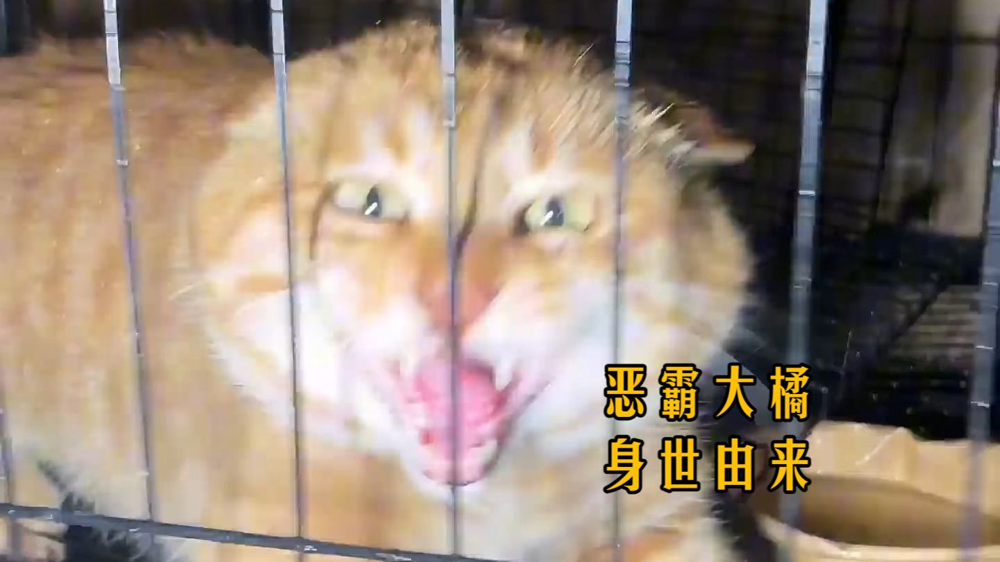 | 2.0万 | 2025-12-27 |
| [2026年春晚名单吗？有点意思](https://www.bilibili.com/video/BV123B6BDEuK) | 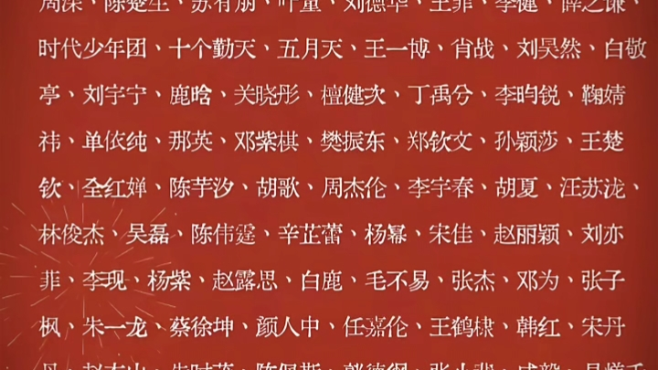 | 91.4万 | 2025-12-27 |
| [扮猪吃饲料](https://www.bilibili.com/video/BV1y7B6BmE3G) |  | 2.5万 | 2025-12-27 |
| [天冷了还好有猫猫陪着](https://www.bilibili.com/video/BV1sRB6BHEHU) |  | 21.0万 | 2025-12-27 |
| [猫儿这个无处可藏](https://www.bilibili.com/video/BV1YrB6BcETS) | 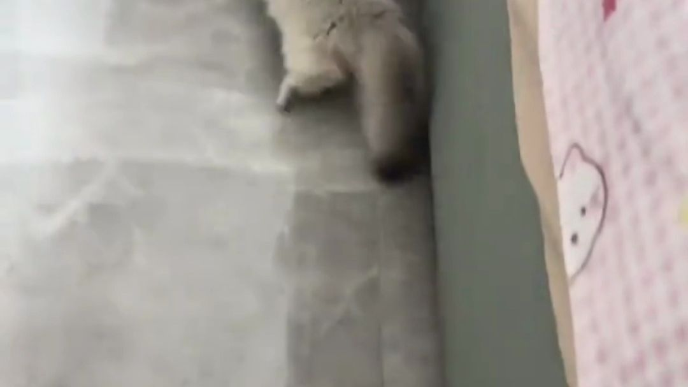 | 36.4万 | 2025-12-27 |
| [新英雄申请加入中](https://www.bilibili.com/video/BV1GpBrBAEKd) | 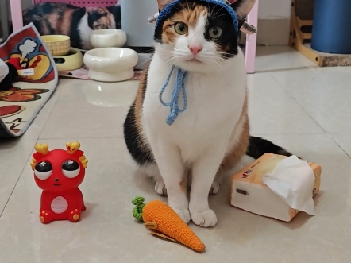 | 73.1万 | 2025-12-27 |
| [我有一只猫 蒸蚌！](https://www.bilibili.com/video/BV1cqBvBbEFt) |  | 5.5万 | 2025-12-26 |
| [肥基米](https://www.bilibili.com/video/BV1AtBvBvEyN) | 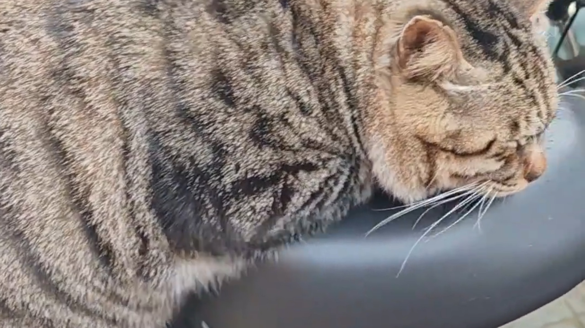 | 28.3万 | 2025-12-26 |
| [被人倒满酸奶的猫屋](https://www.bilibili.com/video/BV1DdBvBjEzW) | 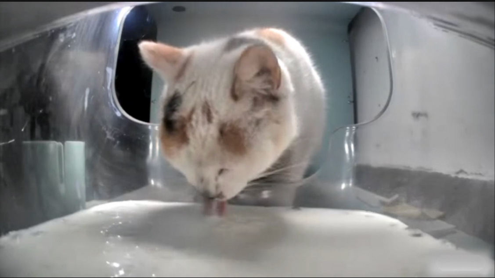 | 125.3万 | 2025-12-26 |
| [圣诞完了也要哈基米OIO](https://www.bilibili.com/video/BV1KZB9BoEha) |  | 1617 | 2025-12-26 |
| [只喊真棒看看大开门有什么反应](https://www.bilibili.com/video/BV1wtBYBoEte) | 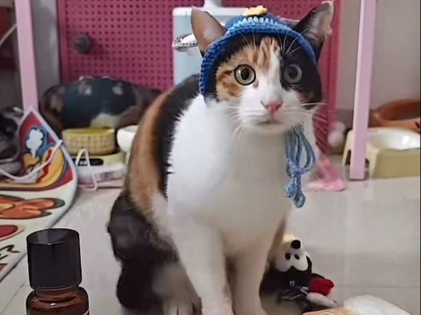 | 23.6万 | 2025-12-26 |
| [三拼猫~](https://www.bilibili.com/video/BV1QyBhBTEUt) | 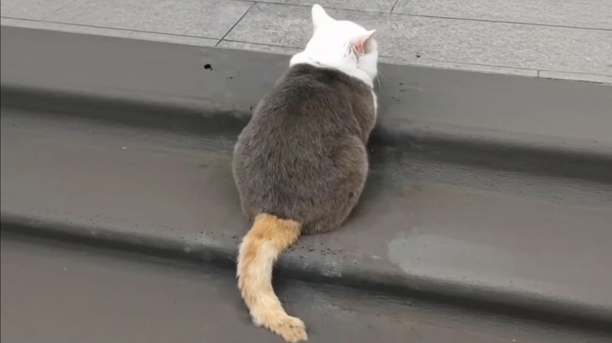 | 17.7万 | 2025-12-26 |
| [☆~♪(*^-^)ノ](https://www.bilibili.com/video/BV1d6BYBmEA2) |  | 163.0万 | 2025-12-26 |
| [最抽象的一集，做了一个哈基米版的宿舍关灯神器哈哈哈哈](https://www.bilibili.com/video/BV1QUBYBGETQ) |  | 450 | 2025-12-26 |
| [奶猫遇见翅膀怪兽，拯救绿豆猫](https://www.bilibili.com/video/BV1QUBYBGErK) |  | 2991 | 2025-12-26 |
| [【2026年春/TV动画】魔法少女的魔女审判 特别篇「魔女の挽歌」先导PV【但是AI自制】](https://www.bilibili.com/video/BV1xjB9BREbp) |  | 36.7万 | 2025-12-26 |
| [☝🤓emmm⚡⚡⚡](https://www.bilibili.com/video/BV1nQBeBFEzR) |  | 106.9万 | 2025-12-26 |
| [？](https://www.bilibili.com/video/BV1RHBRBgEk5) |  | 2092 | 2025-12-25 |
| [“此战有几成把握？”](https://www.bilibili.com/video/BV1ZLBRB5E3U) |  | 43.1万 | 2025-12-25 |
| [西雅图白花姐 vs 高灵视人牢A，同一场大雪下的生活（2）](https://www.bilibili.com/video/BV1nHBQBCEqZ) |  | 51.6万 | 2025-12-25 |
| [鸡公煲~鸡公煲~经过我的胃！【弔歌王版】](https://www.bilibili.com/video/BV1xoBQBSEYA) |  | 29.2万 | 2025-12-25 |
| [封我都不怕](https://www.bilibili.com/video/BV195BDBbEHC) |  | 15.5万 | 2025-12-25 |
| [哈基米你这家伙，或许真的可以咬断钢铁](https://www.bilibili.com/video/BV1m4BDBnEzx) | 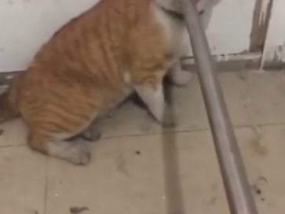 | 7847 | 2025-12-25 |
| [【阿梓】看抖音热门的蒸蚌式鼓励哈基米大开门笑嘻了：我能把小虎训练成这样吗😆](https://www.bilibili.com/video/BV1GgB2B2EhZ) | 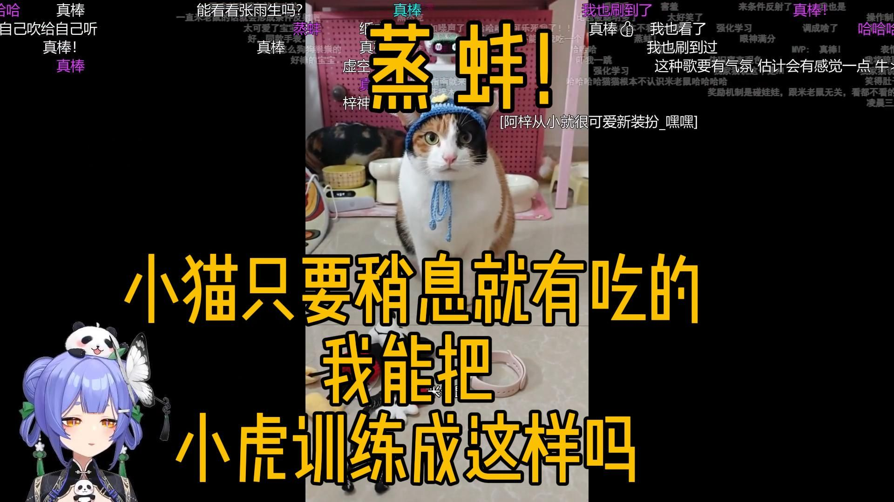 | 8804 | 2025-12-24 |
| [狗窝保卫战，夺回属于小狗的一切！](https://www.bilibili.com/video/BV1UWBjBsEZ5) | 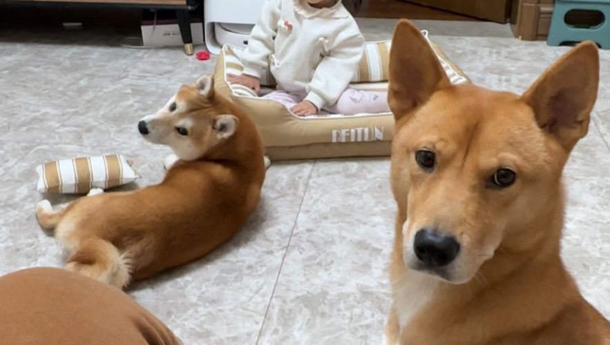 | 8.4万 | 2025-12-24 |
| [无敌大妈超燃广场大战！](https://www.bilibili.com/video/BV14MB7BsEbE) |  | 797.3万 | 2025-12-24 |
| [感觉他好快乐 尾巴摇成鸡毛掸子了😆](https://www.bilibili.com/video/BV1zrB5BKEUX) |  | 2.0万 | 2025-12-24 |
| [圣诞茂](https://www.bilibili.com/video/BV1ChBGBPEJX) | 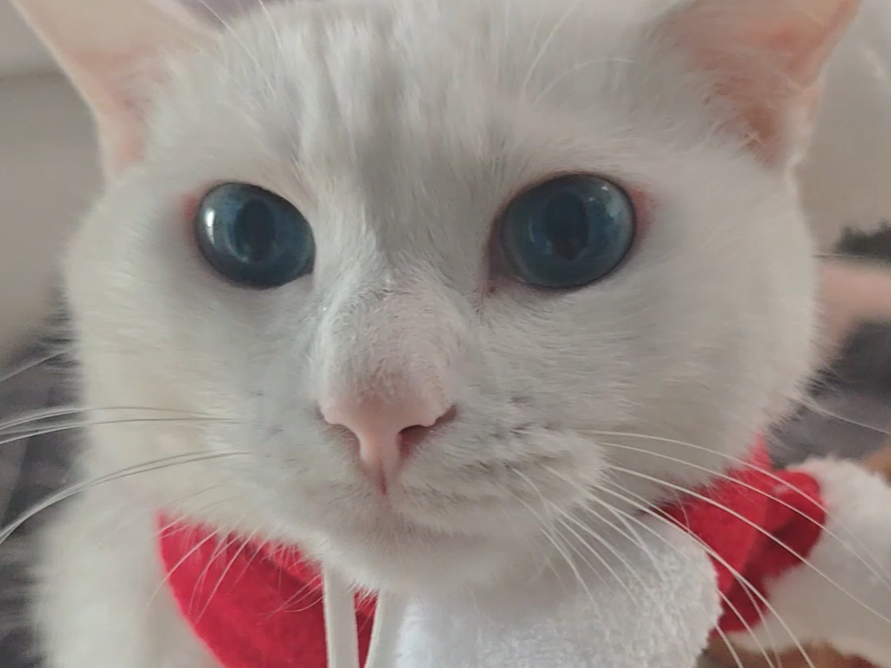 | 6.7万 | 2025-12-24 |
| [一只猫咪被车压过去了好可怜](https://www.bilibili.com/video/BV1bdBgBuEtp) | 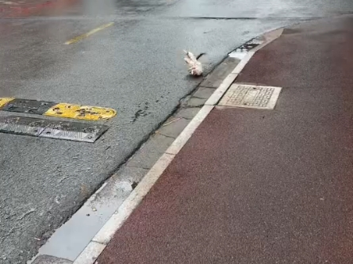 | 8312 | 2025-12-24 |
| [张叔叔：啊？大侄女你来真的呀！](https://www.bilibili.com/video/BV1tSBMBvEDK) | 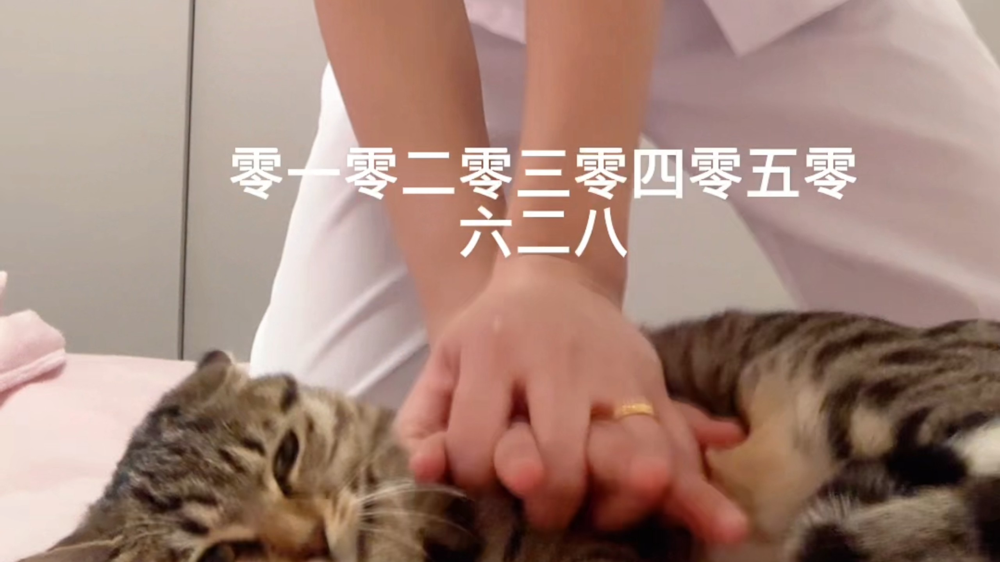 | 21.3万 | 2025-12-23 |
| [不同版本的《挖你的鼻孔 喵喵》](https://www.bilibili.com/video/BV1iLBuBmEiy) |  | 8.0万 | 2025-12-23 |
| [纸巾！蒸蚌！简直是360°无死角的聪明！](https://www.bilibili.com/video/BV1evBKBTEYf) | 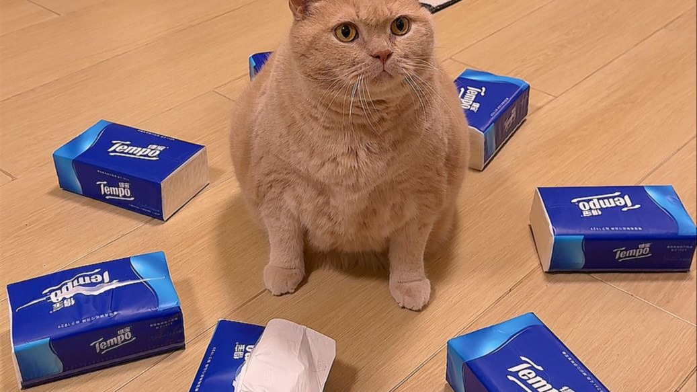 | 11.2万 | 2025-12-23 |
| [这些鸡还有救吗](https://www.bilibili.com/video/BV1K8BNBQEke) | 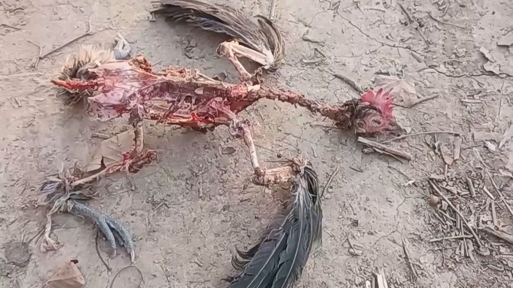 | 25.3万 | 2025-12-23 |
| [哞哞哞哞哞哞~哞哞哞哞哞😭😭哞哞哞哞，哞哞哞哞哞🙏🙏！哞哞哞！哞哞哞哞哞哞，哞哞哞。😭😭哞哞！😭😭哞哞哞哞哞哞！哞哞哞哞，哞哞哞，哞哞！哞哞、](https://www.bilibili.com/video/BV1jMBtBKEUR) |  | 14.4万 | 2025-12-22 |
| [古生物学家最害怕的一集](https://www.bilibili.com/video/BV1w3BsBiEKv) | 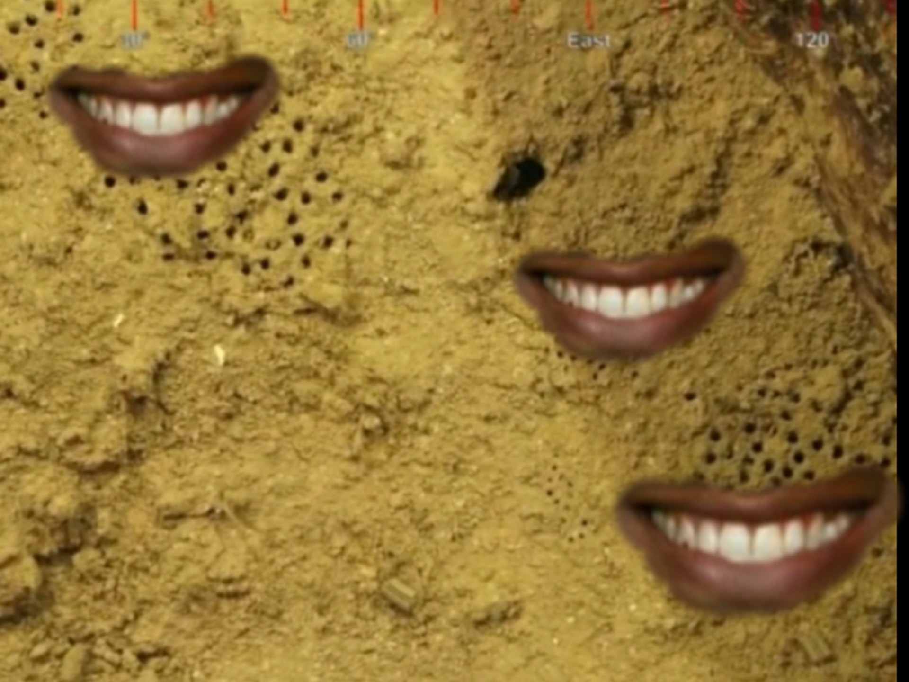 | 35.9万 | 2025-12-22 |
| [剪完自己都没绷住](https://www.bilibili.com/video/BV1QaBpBVE5Y) |  | 13.5万 | 2025-12-22 |
| [电子宠物甜甜圈年度大总结，甜甜圈去往美国路上之南美历险记，历经苦难到美国当流浪汉](https://www.bilibili.com/video/BV1jGBEBrEbQ) |  | 28.5万 | 2025-12-21 |
| [最遭的入坑版本之一？哈基米都能看懂的崩铁3.8版本萌新入坑攻略！](https://www.bilibili.com/video/BV1kCqGBwEQT) |  | 1.5万 | 2025-12-17 |
| [🩷《𝑰 𝑪𝒂𝒏’𝒕 𝑾𝒂𝒊𝒕》🩷Remix/(feat.歌爱ユキ)](https://www.bilibili.com/video/BV1WWqsBeEAi) |  | 20.0万 | 2025-12-15 |
| [I Can&#x27;t wait 手势舞](https://www.bilibili.com/video/BV18QmeBaE5Z) |  | 25.2万 | 2025-12-14 |
| [基米音乐——《往事只能哈气》](https://www.bilibili.com/video/BV1iEmdBeE5x) | 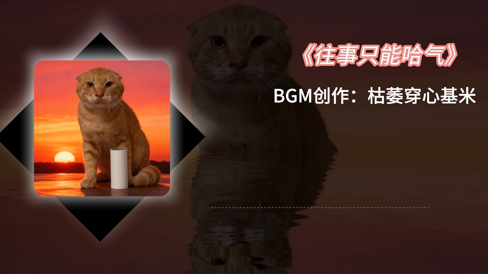 | 348 | 2025-12-13 |
| [全网鬼畜自己第一人🥇](https://www.bilibili.com/video/BV1jRm9BwE4v) |  | 44.6万 | 2025-12-13 |
| [I Can&#x27;t Wait (teto_cover)](https://www.bilibili.com/video/BV1KwmUBAEzk) |  | 20.0万 | 2025-12-12 |
| [☝️️🤓当我把《大悲咒》的歌词全换成了“何意味”](https://www.bilibili.com/video/BV1kZmEBGEoz) |  | 36.6万 | 2025-12-12 |
| [基米形态大比拼，异形伪猫？圆头？奇装异服？](https://www.bilibili.com/video/BV1sR2WBdEiS) |  | 4.1万 | 2025-12-06 |
| [《直接给我生成完整代码》](https://www.bilibili.com/video/BV1hx2LBCEaY) |  | 519.0万 | 2025-12-05 |
| [拼好猫！！！](https://www.bilibili.com/video/BV1igSaBzEyU) |  | 12.2万 | 2025-12-04 |
| [AI生成的夜神月父子哈基卡米相声](https://www.bilibili.com/video/BV1G6yoBtEab) |  | 1.1万 | 2025-11-02 |
| [《德意志我的家乡》元首献唱](https://www.bilibili.com/video/BV1U5YXzbEEo) |  | 523.1万 | 2025-08-21 |
| [音游区直接过](https://www.bilibili.com/video/BV1Af8zzGEtd) |  | 69.6万 | 2025-07-30 |
| [哈基米](https://www.bilibili.com/video/BV119bdzREUN) |  | 2895 | 2025-07-23 |
| [小马私人音效出处☝️🤓](https://www.bilibili.com/video/BV1YS421X7Hn) |  | 139.2万 | 2024-08-10 |
| [雨姐满血归来了！](https://www.bilibili.com/video/BV1qi421S7vo) |  | 858.0万 | 2024-05-28 |

---
*最后更新: 2025-12-29 02:55:39 (自动生成)*
*数据来源: [Bilibili](https://www.bilibili.com)*

## 使用说明

运行以下命令更新视频列表:
```bash
python3 fetch_hajimi_videos.py
```
