# awesome-hajimi
collections of hajimi (哈基米 in Chinese) on the Internet.

## 视频列表 (Video List)

| 视频标题 (Title) | 封面 | 播放量 (Views) | 发布日期 (Date) |
|---|---|---|---|
| [⚡基 米 说⚡](https://www.bilibili.com/video/BV1s8nZz6EtV) |  | 37 | 2025-09-29 |
| [《动物迷惑行为大赏276》](https://www.bilibili.com/video/BV1bJndzzE54) | 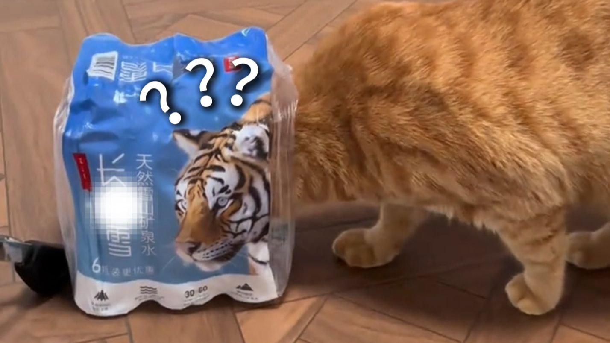 | 2.5万 | 2025-09-29 |
| [【歌单】哈基米仙乐合集2](https://www.bilibili.com/video/BV1LUnZztE9D) | 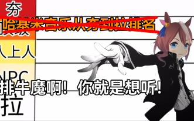 | 343 | 2025-09-28 |
| [哈基米版植物：猫猫土豆雷](https://www.bilibili.com/video/BV1JznZzeEYu) | 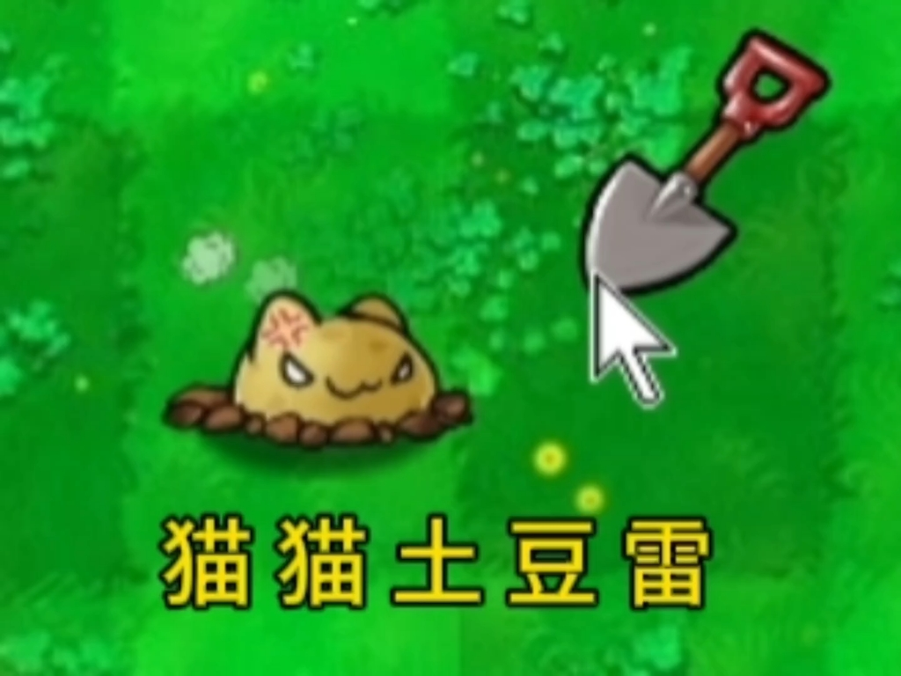 | 2.4万 | 2025-09-28 |
| [【哈基米音乐】情歌王-古巨基](https://www.bilibili.com/video/BV1EknZzaE2x) |  | 724 | 2025-09-28 |
| [ASMR 哈基米摩擦抓绕音助眠](https://www.bilibili.com/video/BV1eDndzEEt6) | 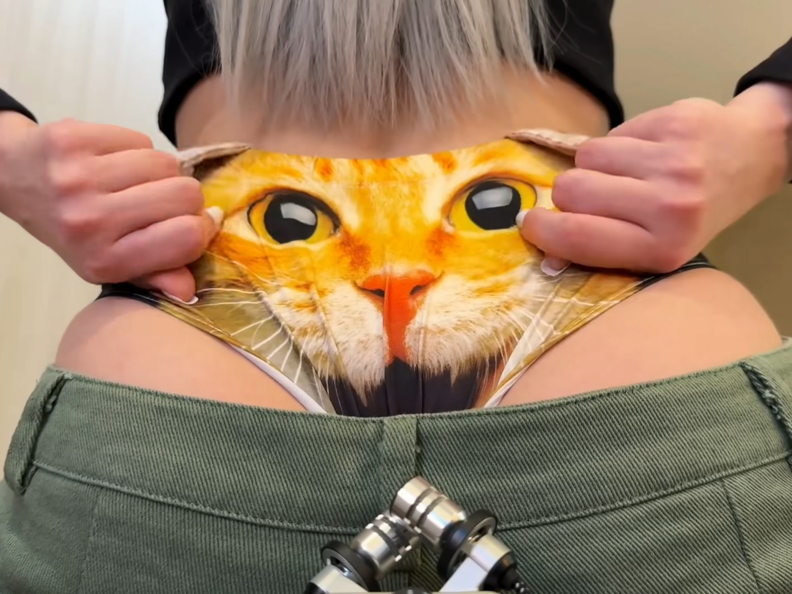 | 1.5万 | 2025-09-28 |
| [麦当当耄耋很不高兴为你服务](https://www.bilibili.com/video/BV1nendzFEJa) |  | 3.0万 | 2025-09-28 |
| [哈基米永远的离开了](https://www.bilibili.com/video/BV1BBndz4EYz) | 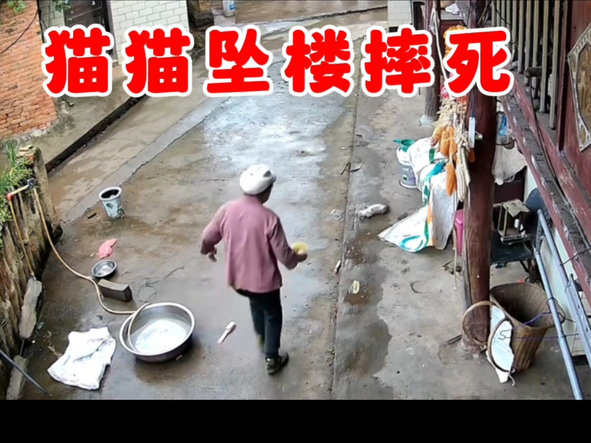 | 9534 | 2025-09-28 |
| [【哈基米音乐】beyond喜欢哈（原曲不使用）](https://www.bilibili.com/video/BV1KAnozgEK7) |  | 434 | 2025-09-28 |
| [挑战抱健身房老板唱哈基米](https://www.bilibili.com/video/BV14AnozgESR) |  | 2.4万 | 2025-09-28 |
| [《蓝莲哈》美声版！最高雅的哈基米！](https://www.bilibili.com/video/BV1zZnRz9ENM) |  | 1.6万 | 2025-09-28 |
| [【哈基米】Sea Of Hachimi([Phonk]Sea Of Problems)](https://www.bilibili.com/video/BV1ZpnozxETc) |  | 2498 | 2025-09-28 |
| [🐱柠檬树上哈基果🐱](https://www.bilibili.com/video/BV1XhnRzGEcg) | 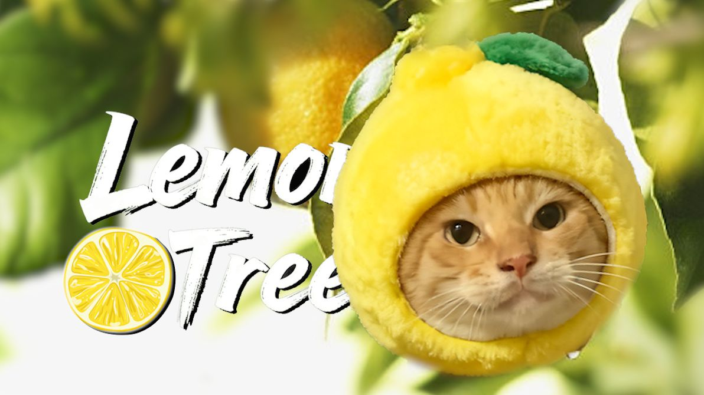 | 10.8万 | 2025-09-28 |
| [要论喂食这一块，您还是太权威了。#哈基米 #猫咪 #离谱](https://www.bilibili.com/video/BV1Mon9ziExd) | 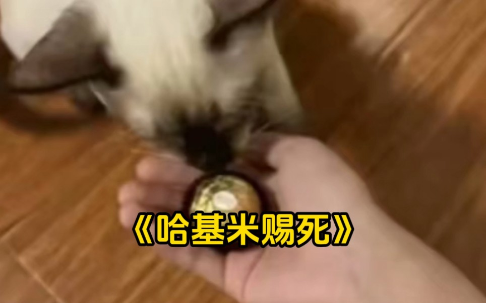 | 4.1万 | 2025-09-28 |
| [【哈基米音乐】甜甜的](https://www.bilibili.com/video/BV1FunXzSECm) |  | 1122 | 2025-09-28 |
| [【哈基米音乐】我的悲伤是水做的-完整版](https://www.bilibili.com/video/BV18QnQzwEE8) | 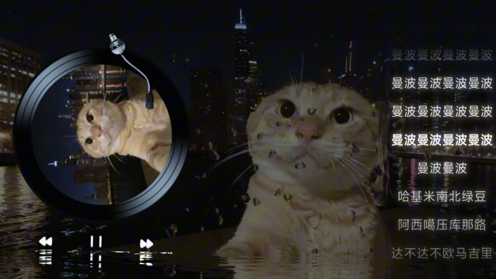 | 1837 | 2025-09-28 |
| [舌尖上的哈基米](https://www.bilibili.com/video/BV1CFnXzdERg) | 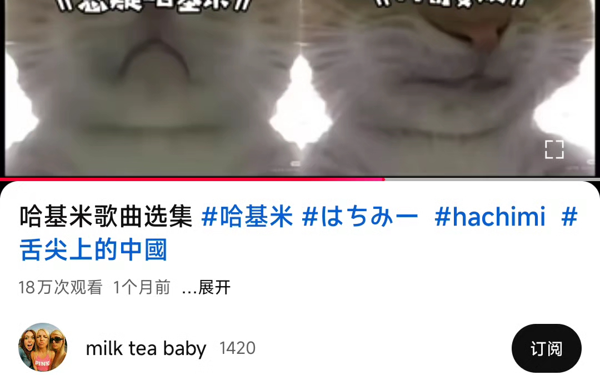 | 223 | 2025-09-28 |
| [家有基米](https://www.bilibili.com/video/BV1nTnDzVEN7) |  | 539 | 2025-09-28 |
| [哈基米跳楼直接砸中路人脑袋，那没路躲](https://www.bilibili.com/video/BV17LnXz1Exw) |  | 2417 | 2025-09-28 |
| [歌曲《春娇与哈基米》因为粉丝说没歌词，所以我就重新发一遍词是是我一个一码出来的，耗费我3个小时，](https://www.bilibili.com/video/BV1nNnDzyEqq) | 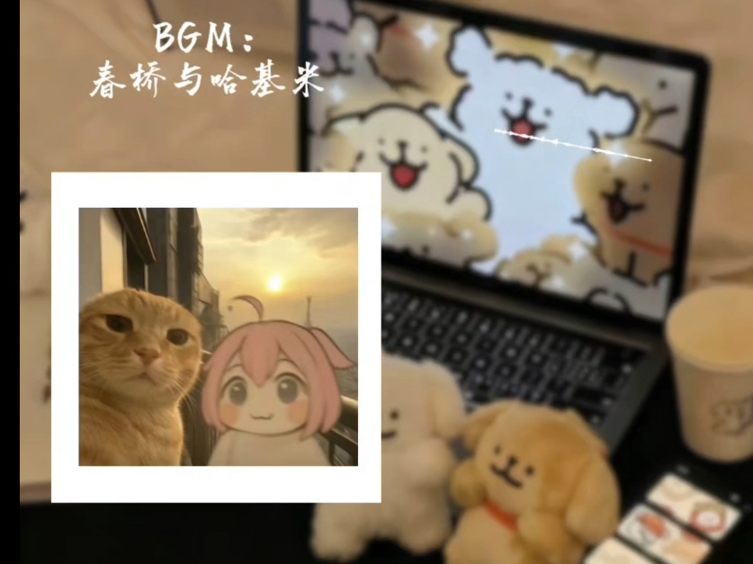 | 1771 | 2025-09-27 |
| [《打火机（哈基米）》:&quot;每日哈基米音乐，循环播放″](https://www.bilibili.com/video/BV1uUnSzxEwE) |  | 481 | 2025-09-27 |
| [循环歌单｜“哈基米南北绿豆&quot;｜《基米说》](https://www.bilibili.com/video/BV1WKnnzaEBU) |  | 284 | 2025-09-27 |
| [日推歌单｜“哈基米南北绿豆&quot;｜《基米说》](https://www.bilibili.com/video/BV1exnnzUE3E) | 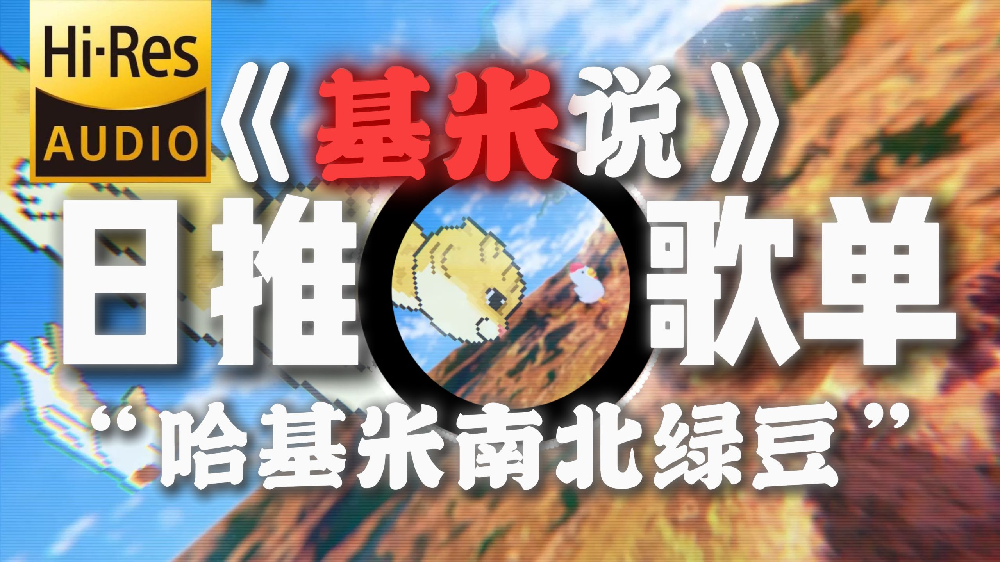 | 365 | 2025-09-27 |
| [哈基米底层代码发力了](https://www.bilibili.com/video/BV1BRnnzZEJK) | 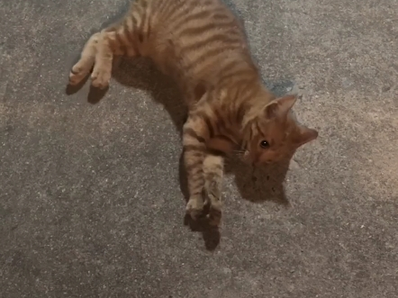 | 7100 | 2025-09-27 |
| [基米TV之五行缺轧](https://www.bilibili.com/video/BV1ULnHz5Enr) |  | 1.8万 | 2025-09-27 |
| [【哈基米】天涯](https://www.bilibili.com/video/BV1agnHzmEBi) |  | 180 | 2025-09-27 |
| [在浴室唱《真夜中のドア/Stay With Me》时突然感染了哈基米病毒……](https://www.bilibili.com/video/BV1eKnHznExF) |  | 37.9万 | 2025-09-27 |
| [一万个哈不得](https://www.bilibili.com/video/BV1LBnJzDExE) |  | 6024 | 2025-09-27 |
| [[哈基米FM] 你 哈 我 哈 （你瞒我瞒）](https://www.bilibili.com/video/BV1cMnEzpE8M) |  | 1283 | 2025-09-27 |
| [电基小子干的](https://www.bilibili.com/video/BV1zSnEzWEun) | 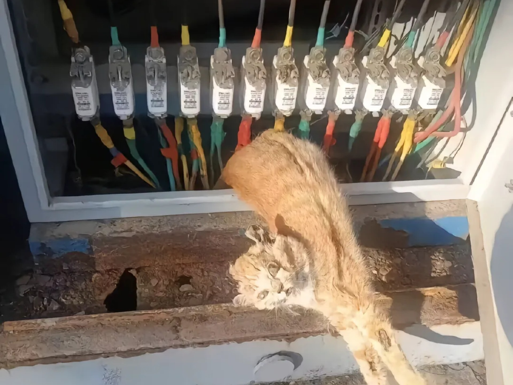 | 13.5万 | 2025-09-27 |
| [仙基奇米传：此生不哈](https://www.bilibili.com/video/BV1kynEzoEbA) |  | 1725 | 2025-09-27 |
| [没关系的，哈基米能运行就已经很棒了](https://www.bilibili.com/video/BV11inEzAEzD) | 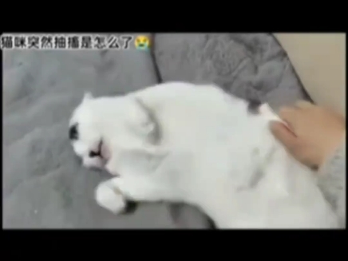 | 6.6万 | 2025-09-27 |
| [蟒蛇瞬间绞杀流浪猫，哈基米当场小便失禁](https://www.bilibili.com/video/BV1b3nJzuE8o) | 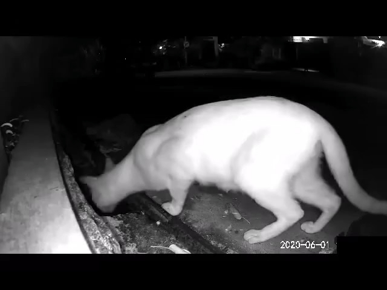 | 3.9万 | 2025-09-27 |
| [户子“安卓猫”名场面出处！笑的肚子疼。。。。](https://www.bilibili.com/video/BV1bgn7zwELy) |  | 13.9万 | 2025-09-27 |
| [保底30只哈基米的苹果小区（上）](https://www.bilibili.com/video/BV1wonVz5EUT) | 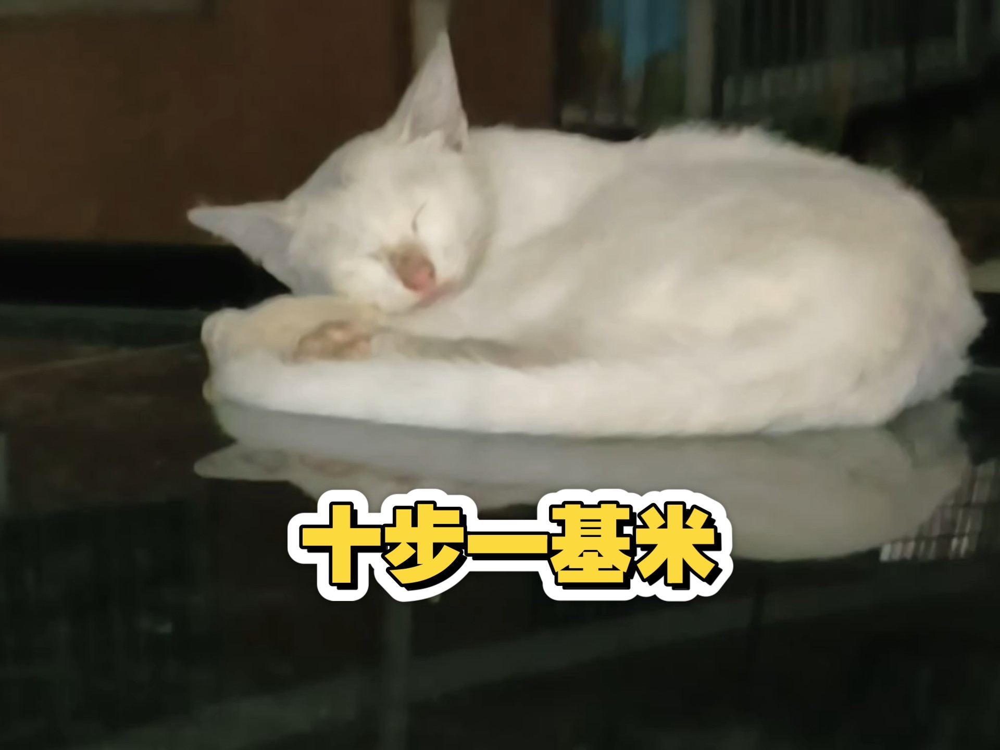 | 2988 | 2025-09-27 |
| [哈基米超绝哈气](https://www.bilibili.com/video/BV1Ehn7zmEjY) | 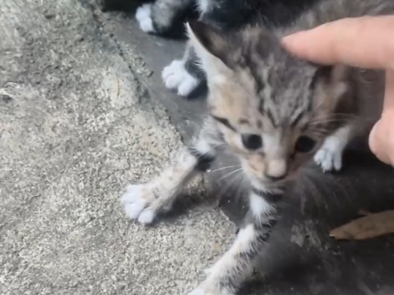 | 3585 | 2025-09-27 |
| [哈基米只是在给主人做脸部按摩罢了](https://www.bilibili.com/video/BV1Efn3zNEJ9) |  | 1394 | 2025-09-27 |
| [【哈基米】🐱不为人知的鹅妈妈teio🐱](https://www.bilibili.com/video/BV1wDn3z6EMU) |  | 1029 | 2025-09-27 |
| [【哈基米音乐】曼波偷西瓜](https://www.bilibili.com/video/BV17Tn5zqE81) |  | 1347 | 2025-09-26 |
| [诺克基米断头台](https://www.bilibili.com/video/BV1uBn3zUEL4) | 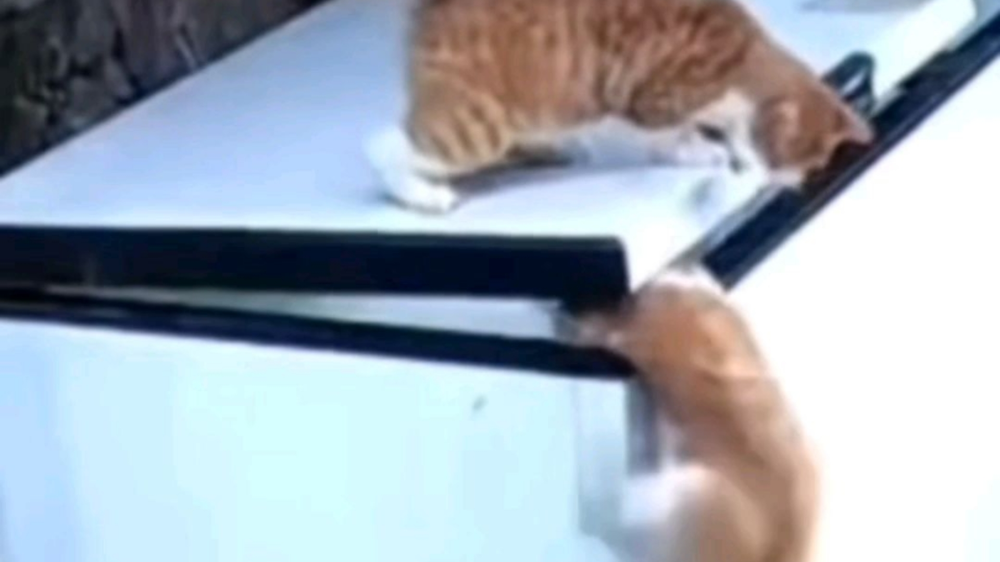 | 2.1万 | 2025-09-26 |
| [大黑皮 哈基米](https://www.bilibili.com/video/BV1UAnVznEQr) |  | 9.5万 | 2025-09-26 |
| [最阴间的一集](https://www.bilibili.com/video/BV1G2ngzsEZ6) | 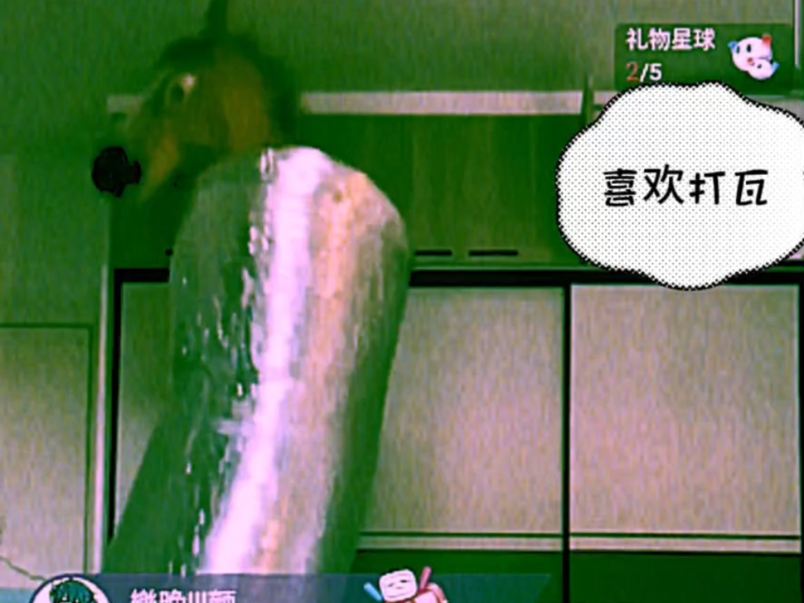 | 7008 | 2025-09-26 |
| [【哈基米音乐】哈基米，不惧死亡！](https://www.bilibili.com/video/BV1DFnVzpEP1) |  | 6235 | 2025-09-26 |
| [哈基米大战](https://www.bilibili.com/video/BV168nMz4EBn) | 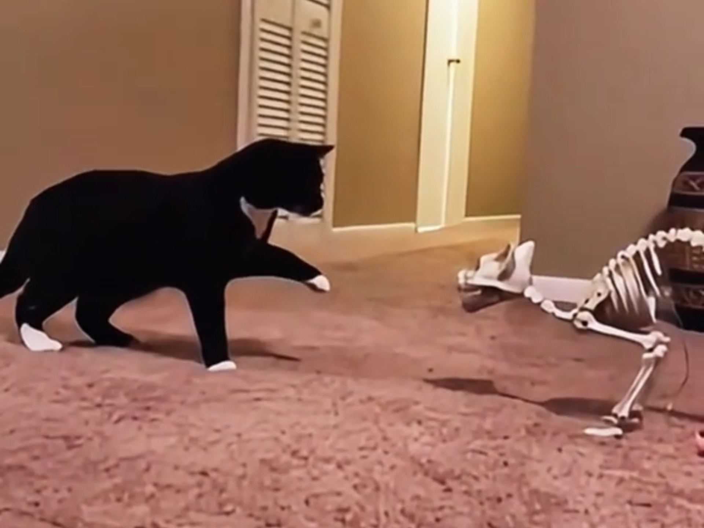 | 5754 | 2025-09-26 |
| [【哈基米音乐】𝑺𝒖𝒏𝒇𝒍𝒐𝒘𝒆𝒓](https://www.bilibili.com/video/BV1hhnuz1Eoh) |  | 337 | 2025-09-26 |
| [“吉隆坡的天气是翻云又覆雨”哈基米版](https://www.bilibili.com/video/BV1PHnhzwEh3) |  | 4.0万 | 2025-09-26 |
| [哈基米之春娇与志明＃哈基米原曲春娇与志明改编余春娇教会了张志明长大，可最后陪伴在他身边的，却不是她](https://www.bilibili.com/video/BV1EvnhzpECq) |  | 2660 | 2025-09-25 |
| [自用加長版PHONK《scopin》純淨哈基米](https://www.bilibili.com/video/BV1PAnazPE9L) |  | 68 | 2025-09-25 |
| [哈基米被从高楼扔下差点砸到小孩，这下寄了](https://www.bilibili.com/video/BV1ovnbzCEEZ) |  | 3.7万 | 2025-09-25 |
| [强迫一只昏睡的哈基米？！](https://www.bilibili.com/video/BV1aHntzeEsU) | 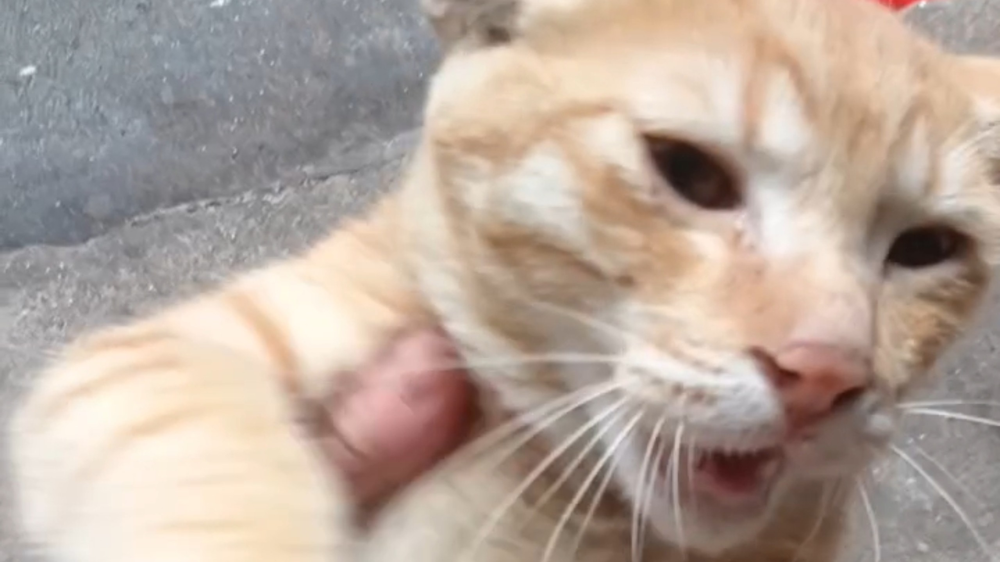 | 2.3万 | 2025-09-25 |
| [哈基米也是玩上蛋宰派对了](https://www.bilibili.com/video/BV1ffJDzCEoZ) | 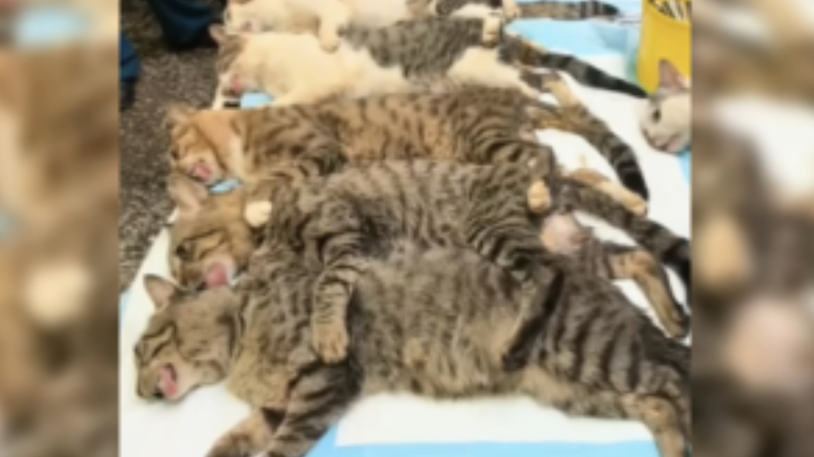 | 2407 | 2025-09-24 |
| [坏人绞尽脑汁，不如蠢人灵机一动](https://www.bilibili.com/video/BV1f6JQz1E92) | 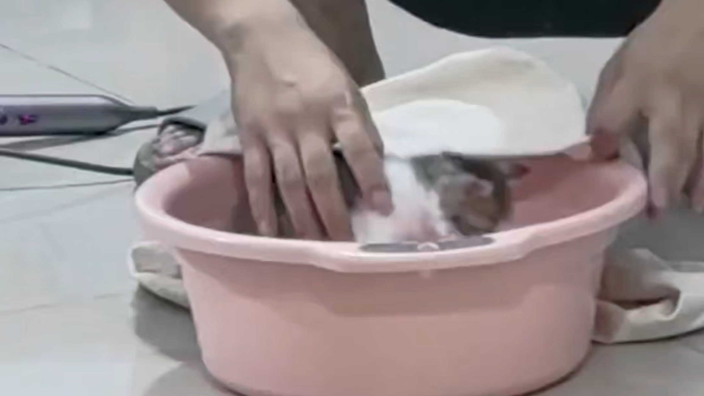 | 15.1万 | 2025-09-24 |
| [快燃尽的哈基米与食客基米](https://www.bilibili.com/video/BV1jhJXzrEnt) | 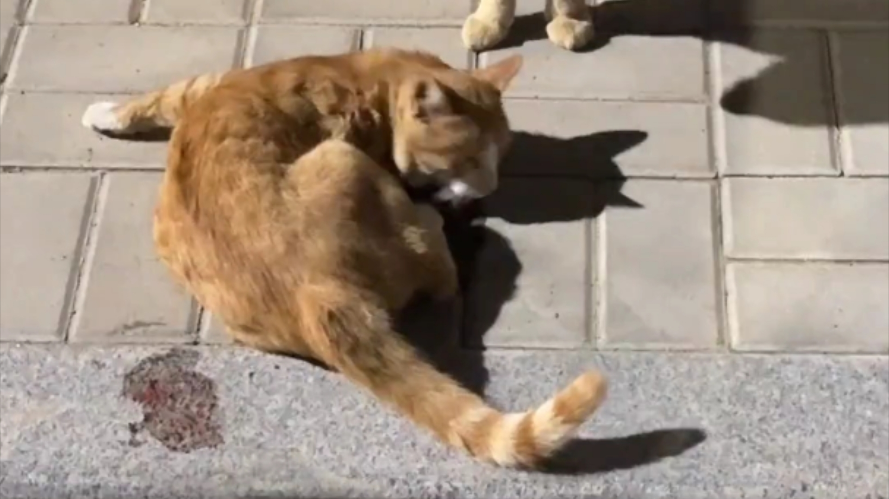 | 4.6万 | 2025-09-24 |
| [【丝茉茉】丝茉茉看哈基米音乐，哈基米编年史](https://www.bilibili.com/video/BV1L6JmzFEin) | 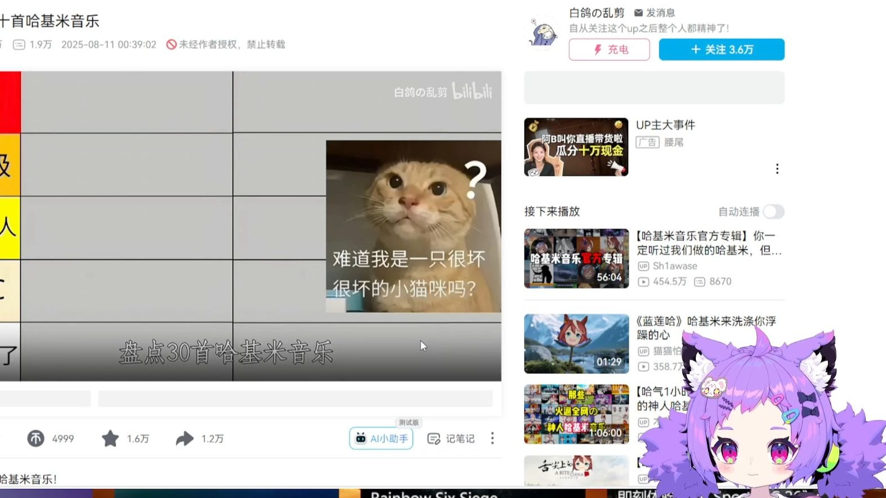 | 6504 | 2025-09-23 |
| [《哈基米の起床小曲》BGM:《おはなばたけ (哈基米版)》面点海](https://www.bilibili.com/video/BV1pYnczGExZ) |  | 1749 | 2025-09-23 |
| [【9月】中国在海外十大最火的相关内容（事件）&amp;ep.1](https://www.bilibili.com/video/BV1CeWczHEYm) |  | 37.5万 | 2025-09-21 |
| [🐱 基 米 说 🐱](https://www.bilibili.com/video/BV1HCpQzsE8c) |  | 22.7万 | 2025-09-20 |
| [循环歌单｜【不再曼波】｜“【哈基米の小曲】【跑刀の小曲】”](https://www.bilibili.com/video/BV1iMHazXEe5) |  | 37.6万 | 2025-09-20 |
| [街猫TV哈基米大战黄鼠狼](https://www.bilibili.com/video/BV1Wvp6zcEBH) |  | 2.1万 | 2025-09-16 |
| [【补档】哈基米这个舒服](https://www.bilibili.com/video/BV1hEpBzPEA7) | 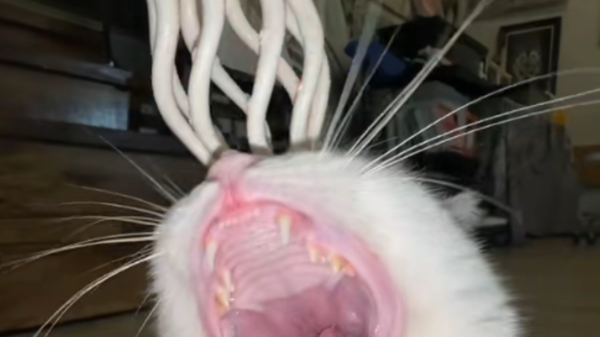 | 19.7万 | 2025-09-15 |
| [画一只可爱的猫](https://www.bilibili.com/video/BV17DpJz8Env) | 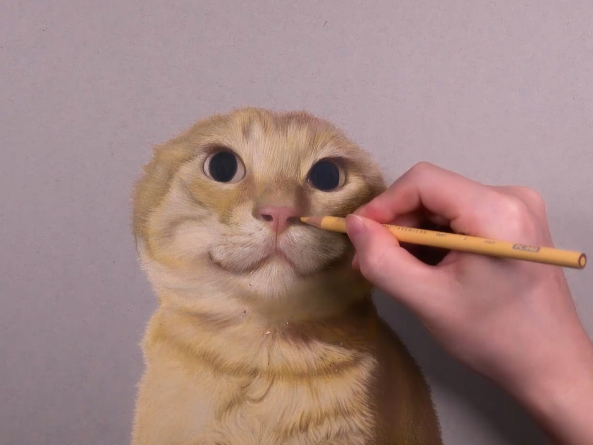 | 349.8万 | 2025-09-13 |
| [天上掉下个哈基米](https://www.bilibili.com/video/BV1S1pjzKEN1) | 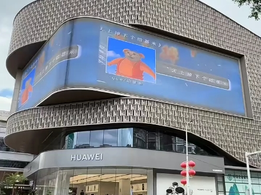 | 32.5万 | 2025-09-13 |
| [科目三：壮志凌云](https://www.bilibili.com/video/BV135Hrz6ETM) |  | 1649.2万 | 2025-09-12 |
| [愤怒的哈基米～](https://www.bilibili.com/video/BV1WmHBznEAY) | 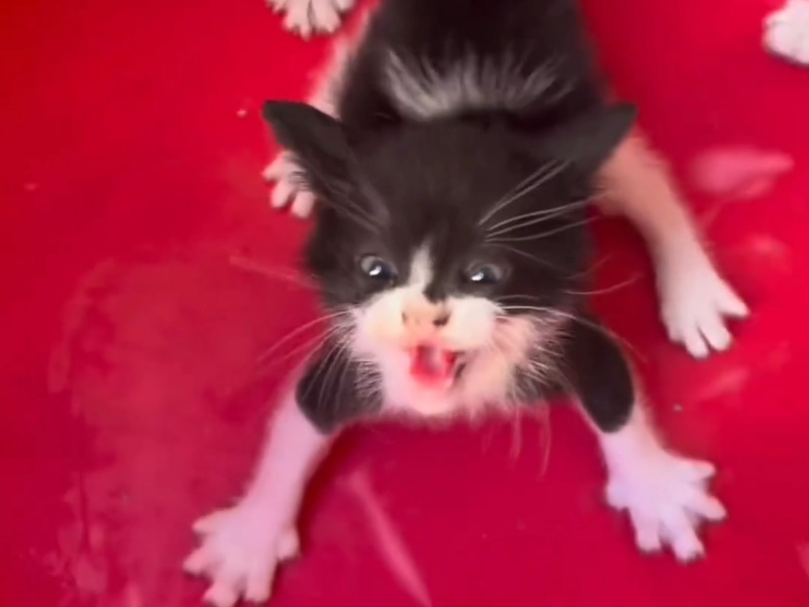 | 13.0万 | 2025-09-12 |
| [包被：她居然会唱我们哈基米一族的歌](https://www.bilibili.com/video/BV1u2HYz2EWZ) | 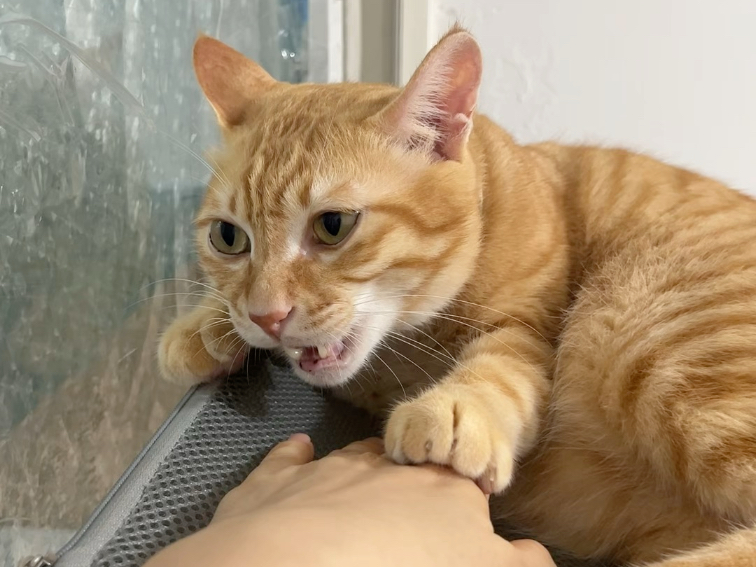 | 80.9万 | 2025-09-11 |
| [论绝育这方面，大娘您还是太权威了。#哈基米 #猫咪 #离谱](https://www.bilibili.com/video/BV1CDHbz4EbV) |  | 26.3万 | 2025-09-11 |
| [🟩哈基米哟南北绿豆🟩](https://www.bilibili.com/video/BV1iraZzpEKT) |  | 1.7万 | 2025-09-08 |
| [西⚡域⚡战⚡神](https://www.bilibili.com/video/BV1iGYLzKEE4) |  | 414.1万 | 2025-09-07 |
| [超  越  天  堂](https://www.bilibili.com/video/BV14da2zVEYn) |  | 263.6万 | 2025-09-04 |
| [⚡️⚡️原神全部男角色唱哈基米山歌⚡️⚡️](https://www.bilibili.com/video/BV13eeXz6Ekf) | 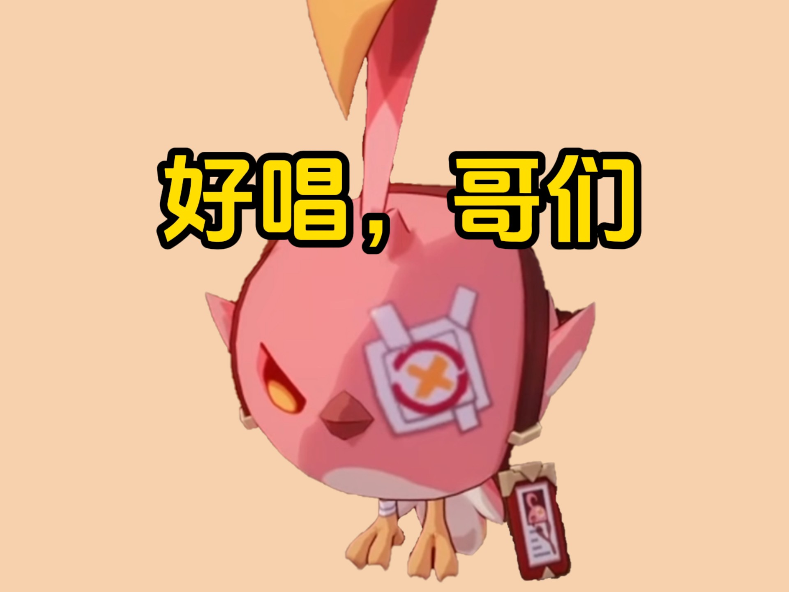 | 4.3万 | 2025-08-28 |
| [哈基米山歌](https://www.bilibili.com/video/BV1urenz1Eaw) |  | 144.7万 | 2025-08-25 |
| [蓝莲哈](https://www.bilibili.com/video/BV15iYxz8ETU) |  | 90.9万 | 2025-08-21 |
| [【哈基杯应援】公虾咪（福建耄耋）](https://www.bilibili.com/video/BV1qkeMzxEsj) |  | 25.3万 | 2025-08-20 |
| [踊り基【完整版】【踊り子（舞女）】哈基米](https://www.bilibili.com/video/BV1gGePzhEqb) |  | 52.8万 | 2025-08-19 |
| [【哈基米】💖就是哈你💖（完整版）](https://www.bilibili.com/video/BV1fBY1zfEsx) |  | 21.1万 | 2025-08-17 |
| [基米绒房间【哈基杯应援曲】](https://www.bilibili.com/video/BV188YkzBENp) |  | 5.4万 | 2025-08-17 |
| [哈基米哦南北绿豆大合集](https://www.bilibili.com/video/BV1ddbVzWEy5) |  | 75.7万 | 2025-08-11 |
| [牢哈基米摸南北绿豆](https://www.bilibili.com/video/BV1E8b5zcEFm) |  | 23.5万 | 2025-08-11 |
| [不同版本的哈基米山歌](https://www.bilibili.com/video/BV1hqtVzkEzk) |  | 41.3万 | 2025-08-04 |
| [哈基米FUNK：MENTE MÁ](https://www.bilibili.com/video/BV1aUhJzgEac) |  | 14.1万 | 2025-08-01 |
| [摸不着头脑的基米](https://www.bilibili.com/video/BV12L8az4Eyo) |  | 95.7万 | 2025-07-27 |
| [哈基米无法承受之痛](https://www.bilibili.com/video/BV1sPbQzCEsh) | 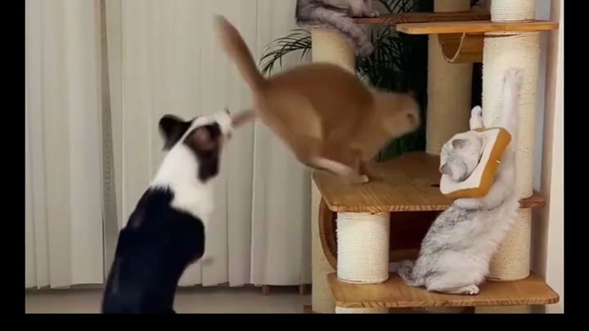 | 90.6万 | 2025-07-25 |
| [哈基米好像有1.4了🐱](https://www.bilibili.com/video/BV1xVuozVEax) |  | 42.5万 | 2025-07-19 |
| [骇人的野生哈基米](https://www.bilibili.com/video/BV1qauizzEWa) |  | 26.5万 | 2025-07-14 |
| [照理说你这个级别的哈基米没资格哈我](https://www.bilibili.com/video/BV1ipGjzRE9j) | 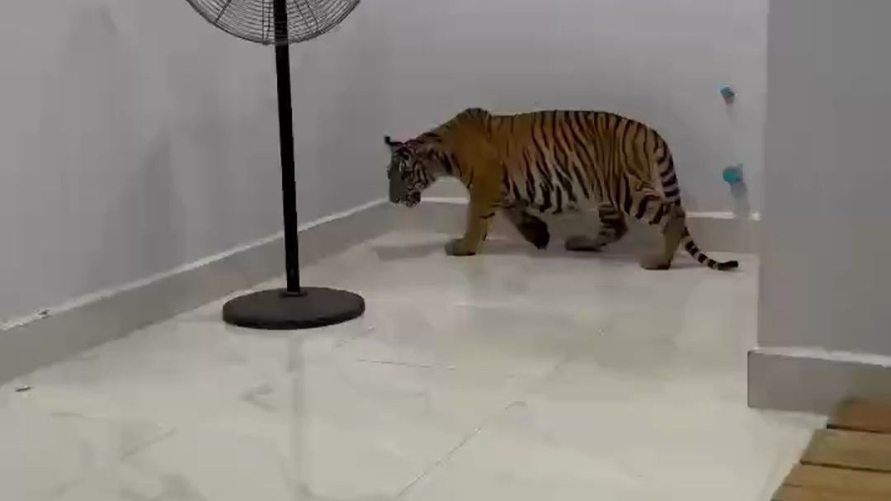 | 96.4万 | 2025-07-08 |
| [基静岭：promise（reprise）基米阴乐来袭！听完被曼波缠身](https://www.bilibili.com/video/BV12wNqz5Etw) |  | 45.0万 | 2025-06-17 |
| [龙基米:龙族主题曲《IVORY TOWER》](https://www.bilibili.com/video/BV1fCMizMEtZ) |  | 15.1万 | 2025-06-16 |
| [偷吃の小曲——曼波、那咩、有时哈基米](https://www.bilibili.com/video/BV1TLT2z5EX2) | 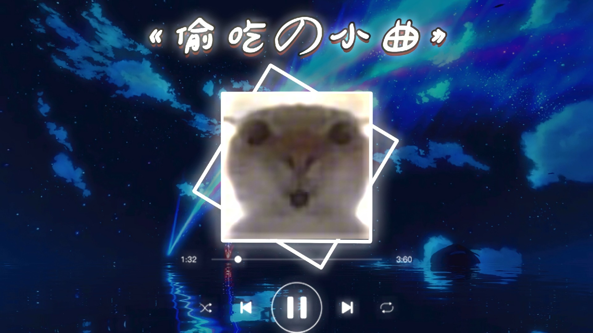 | 16.4万 | 2025-06-08 |
| [哈基米诱捕装置](https://www.bilibili.com/video/BV1QLjdzqEr2) | 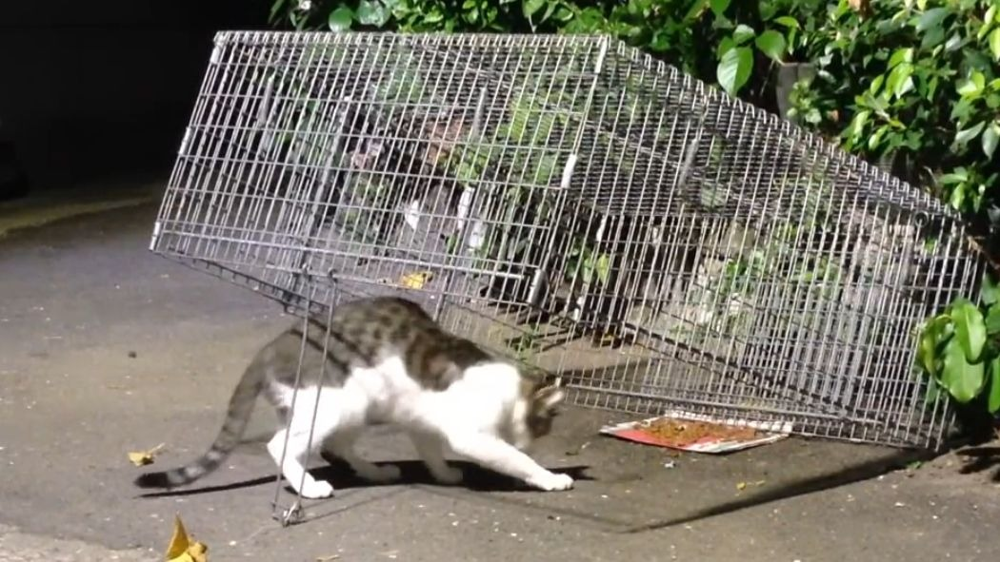 | 13.8万 | 2025-05-27 |
| [【神人杯day14】超哈基米（超主人公）](https://www.bilibili.com/video/BV16iEFzYEJ7) |  | 33.8万 | 2025-05-14 |
| [循环歌单｜《跳楼基》 ｜“基米的小曲”](https://www.bilibili.com/video/BV1WVVwzbExW) |  | 63.4万 | 2025-05-05 |
| [【基米洲行动】🎵🐱破壁の小曲《In The Manbo》🐱🎵](https://www.bilibili.com/video/BV1EFX4YVEad) |  | 219.1万 | 2025-03-22 |
| [【完整版】乖基米小曲之♬ Sunshine 曼波 ♬ 阳光曼波](https://www.bilibili.com/video/BV17DAMeQE1K) |  | 52.4万 | 2025-02-15 |
| [做最优质的基米！](https://www.bilibili.com/video/BV1kTcaeHEgf) |  | 22.5万 | 2025-01-14 |
| [🎵哈基米FM之放松小曲🎵](https://www.bilibili.com/video/BV1a9CAY1Eoq) | 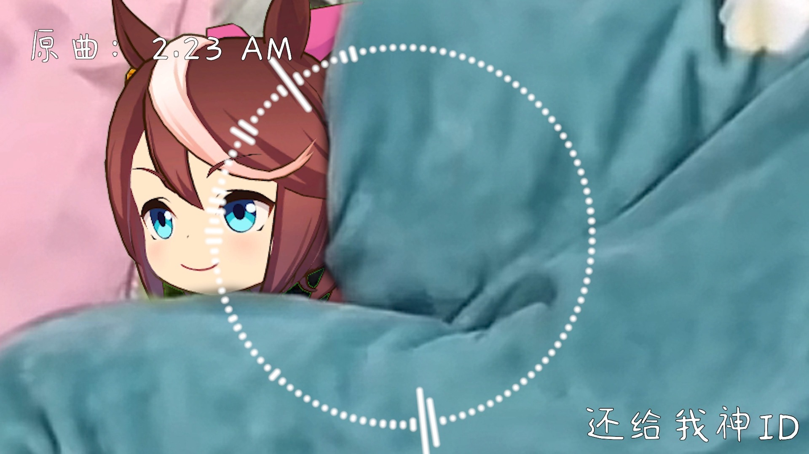 | 123.8万 | 2024-12-25 |
| [《曼波の小曲》《登山の小曲》La La La（孤高曼波）](https://www.bilibili.com/video/BV1FMefeGEKU) |  | 1720.8万 | 2024-07-28 |
| [⚡Stay with 哈基meeeeeeeeeeeee⚡](https://www.bilibili.com/video/BV1mE4m1R7z9) |  | 54.0万 | 2024-07-23 |
| [爱猫FM之《冲基米（StatTrak™）》](https://www.bilibili.com/video/BV1Rz421z7na) |  | 80.4万 | 2024-07-11 |
| [报告哈基米 我叫曼波](https://www.bilibili.com/video/BV1gM4m1D7e8) |  | 193.4万 | 2024-04-17 |
| [哈基米是什么梗](https://www.bilibili.com/video/BV1mP411U75R) |  | 121.1万 | 2023-04-13 |

---
*最后更新: 2025-09-29 02:38:35 (自动生成)*
*数据来源: [Bilibili](https://www.bilibili.com)*

## 使用说明

运行以下命令更新视频列表:
```bash
python3 fetch_hajimi_videos.py
```
