# awesome-hajimi
collections of hajimi (哈基米 in Chinese) on the Internet.

## 视频列表 (Video List)

| 视频标题 (Title) | 封面 | 播放量 (Views) | 发布日期 (Date) |
|---|---|---|---|
| [哈基米录像之没人跟它玩](https://www.bilibili.com/video/BV1Kby9BuEcd) |  | 16 | 2025-11-02 |
| [【10月】哈基米音乐排行榜#13](https://www.bilibili.com/video/BV1YQyQByE6H) |  | 9749 | 2025-11-01 |
| [燃尽的暹罗基米](https://www.bilibili.com/video/BV1XbyDBrErG) | 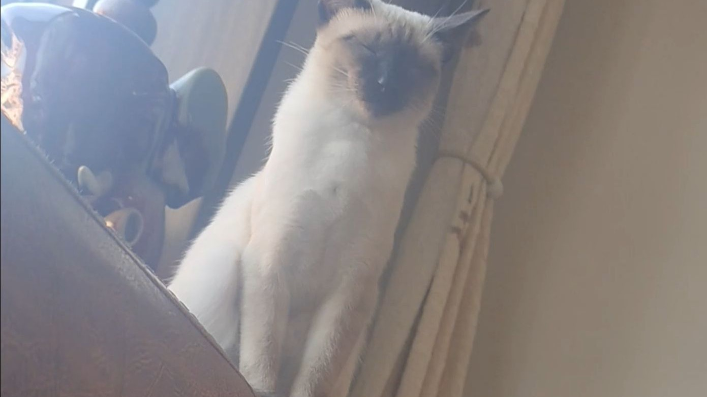 | 1284 | 2025-11-01 |
| [ASMR 哈基米内裤摩擦抓绕音助眠](https://www.bilibili.com/video/BV1TByDBvEvw) |  | 1.1万 | 2025-11-01 |
| [⚡哈基米：基 战 摇⚡（cod17多人模式主题曲）](https://www.bilibili.com/video/BV1hq1LBGE2r) |  | 4471 | 2025-11-01 |
| [【神壬唱片】哈基米方舟：孤星·𝓐𝓭 𝓪𝓼𝓽𝓻𝓪](https://www.bilibili.com/video/BV14C1LBMEaD) |  | 890 | 2025-11-01 |
| [给队友唱《找基米》](https://www.bilibili.com/video/BV1tC1LBMEE6) |  | 1368 | 2025-11-01 |
| [翻唱⚡哈 基 米 模 式⚡](https://www.bilibili.com/video/BV1c61jBFEGB) |  | 1709 | 2025-11-01 |
| [哈基米音乐：🎵「 登 神 」 - GODS 🎵](https://www.bilibili.com/video/BV1Wa1jBvEGk) |  | 2859 | 2025-11-01 |
| [【刘增艳】魔法少女疑似被某哈基米领域大神传染，还要在万人舞台表演哈基米版夜蝶](https://www.bilibili.com/video/BV1bn15BNEZn) |  | 7806 | 2025-11-01 |
| [【Sora2】疑似“哈基米版春节联欢晚会”流出 ，3分钟入门AI视频制作！AI生成视频零基础入门保姆级教程（2025最新）AI视频制作全流程教学！](https://www.bilibili.com/video/BV1wa15BoEwx) |  | 488 | 2025-11-01 |
| [哈基米普通上班的一天](https://www.bilibili.com/video/BV1XD15BCEs5) |  | 636 | 2025-11-01 |
| [你可能不认识我，但你一定听过我们的哈基伦](https://www.bilibili.com/video/BV1Bp1LBQEJh) |  | 7171 | 2025-11-01 |
| [😸伤心的人别听曼波😸](https://www.bilibili.com/video/BV1981PB7Ev2) |  | 2.6万 | 2025-11-01 |
| [【活侠传×哈基米音乐】基米旧歌谣](https://www.bilibili.com/video/BV1WG1KBBExi) |  | 1745 | 2025-11-01 |
| [哈基湾](https://www.bilibili.com/video/BV15A1gBcEj8) |  | 6094 | 2025-11-01 |
| [【补档】橘色幸福【哈基ミク】](https://www.bilibili.com/video/BV1Hj1LBoEgX) |  | 1242 | 2025-11-01 |
| [⚡两只基米爱街舞⚡](https://www.bilibili.com/video/BV1qq1GB1EYi) |  | 4992 | 2025-11-01 |
| [【哈基米音乐】33号哈基队《绘族》宅邸的小曲🎵](https://www.bilibili.com/video/BV1EZ13BGEgk) |  | 1936 | 2025-11-01 |
| [哈基米:这是我打猎得来的食物](https://www.bilibili.com/video/BV12Y1uBDEzZ) | 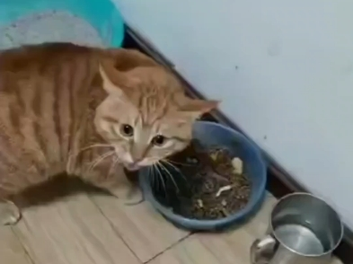 | 2686 | 2025-10-31 |
| [三年级抑郁症小学生自制术力口！（迷你世界万岁！](https://www.bilibili.com/video/BV15B1MBbEGH) |  | 2.0万 | 2025-10-31 |
| [哈基·斯威夫特：🎵Blank Space🎵](https://www.bilibili.com/video/BV1MU1MBQEB7) |  | 929 | 2025-10-31 |
| [周精选卡测评（10.31）：平民铁卫范德芬、曼联大腿姆伯莫、左右横跳哈基米](https://www.bilibili.com/video/BV1uF1KB2Exp) |  | 2133 | 2025-10-31 |
| [我也是虎猫双全的人了！](https://www.bilibili.com/video/BV1Ao1KBBES7) |  | 22.6万 | 2025-10-31 |
| [猫儿这个减速带（补档）](https://www.bilibili.com/video/BV1FA1TBeEPQ) | 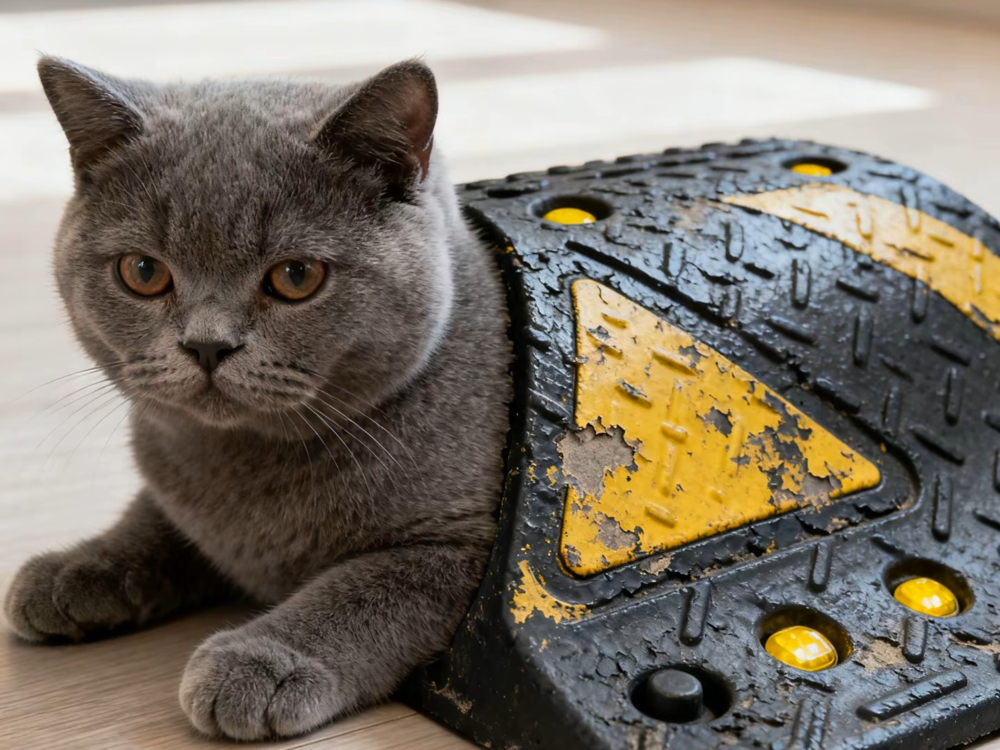 | 1.4万 | 2025-10-31 |
| [一小时单曲循环~《在你的身边》哈基米版 の【纯享版】](https://www.bilibili.com/video/BV1rA1TBYELS) |  | 1.3万 | 2025-10-31 |
| [一降温猫就变得黏黏糊糊的啦！](https://www.bilibili.com/video/BV1xhyYBjEEK) | 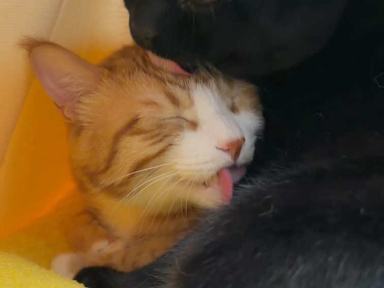 | 3.3万 | 2025-10-31 |
| [【哈基米音乐】不值得哈气](https://www.bilibili.com/video/BV1vLyvBNEc1) | 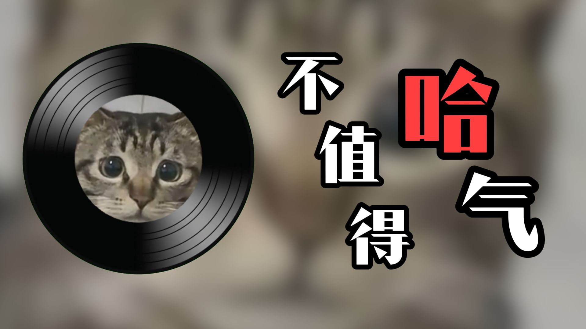 | 9300 | 2025-10-31 |
| [【哈基米音乐】鸡卫（关中王の小曲）](https://www.bilibili.com/video/BV1Ff1PBbEsD) |  | 2193 | 2025-10-31 |
| [【纯净哈基米】17 ｜ 不过是一对苦命鸳鸯……](https://www.bilibili.com/video/BV12DyeBHE6D) |  | 2361 | 2025-10-30 |
| [喜欢哈基米是你的谎言](https://www.bilibili.com/video/BV1fTyvB6Eaw) | 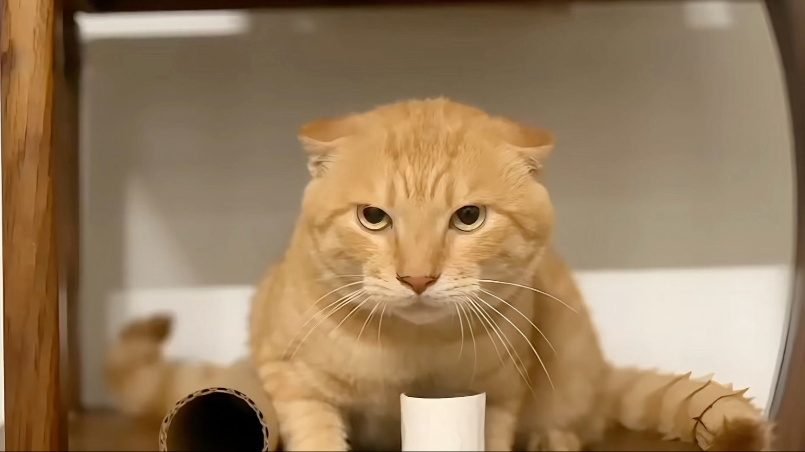 | 1.8万 | 2025-10-30 |
| [一款30年前的神人游戏...](https://www.bilibili.com/video/BV16bySBQEW1) |  | 14.0万 | 2025-10-30 |
| [哈基米南北绿豆糕](https://www.bilibili.com/video/BV1K2y8BzEDE) |  | 6497 | 2025-10-30 |
| [基米：我应该在车底～不应该在车里](https://www.bilibili.com/video/BV1mCy8B6ESU) | 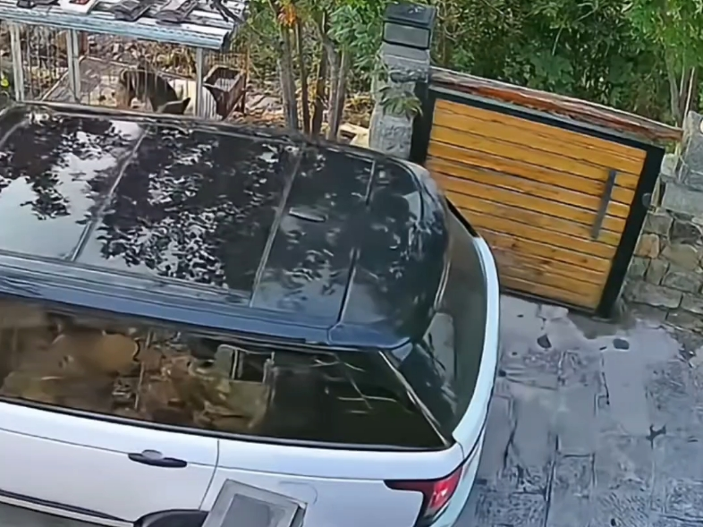 | 1.2万 | 2025-10-30 |
| [我用三把吉他组了一个哈基米摇滚乐队](https://www.bilibili.com/video/BV1bEyhB2E6U) |  | 2.5万 | 2025-10-30 |
| [一秒无痛拥有哈基米！！](https://www.bilibili.com/video/BV1iKyhBREeF) |  | 132 | 2025-10-30 |
| [【哈基米】1303后卡组更新+备赛北京站](https://www.bilibili.com/video/BV1H8ybBhEvZ) | 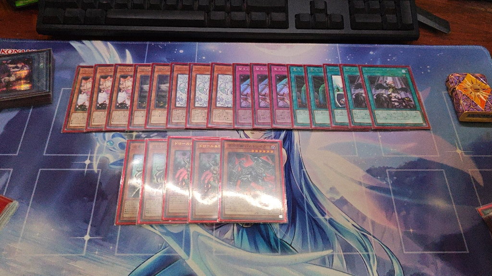 | 2628 | 2025-10-30 |
| [如果我是dj](https://www.bilibili.com/video/BV12nybBqEj4) | 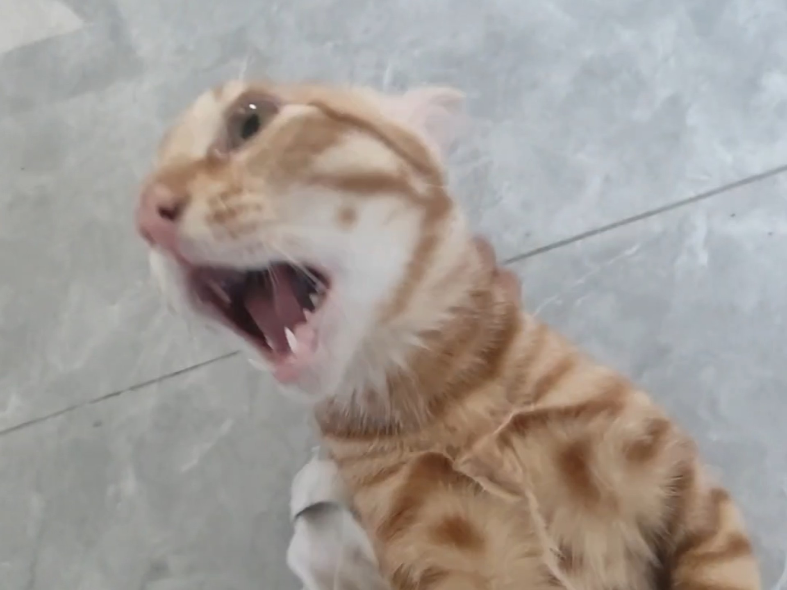 | 14.6万 | 2025-10-30 |
| [01牢仇不如21哈基米，孩子们谨慎抽取](https://www.bilibili.com/video/BV1RWy8BWEQd) |  | 8706 | 2025-10-30 |
| [不管有没有经济或是建模，无论何时何地！都要好好爱自己哦！](https://www.bilibili.com/video/BV16NyWBVE9q) |  | 10.0万 | 2025-10-29 |
| [猫头在上定理](https://www.bilibili.com/video/BV1PdypBJEgE) |  | 6.2万 | 2025-10-29 |
| [【补档】大史曼波——月8分钱干月马史诗级神曼波二创震撼来袭！](https://www.bilibili.com/video/BV1DHyWBhEe6) | 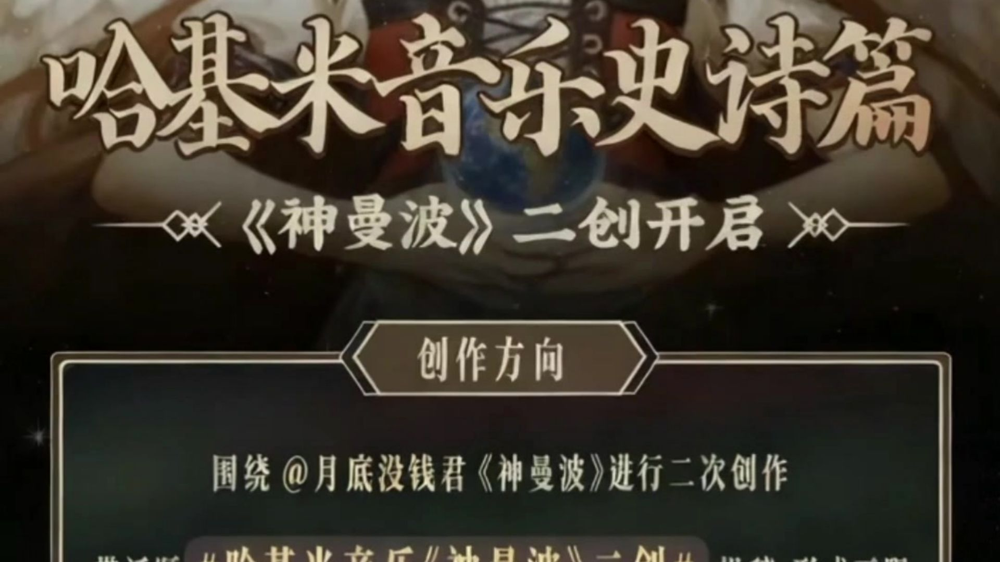 | 1255 | 2025-10-29 |
| [【草帽tv】试图催眠哈基米](https://www.bilibili.com/video/BV1dFySBrEd9) |  | 4231 | 2025-10-29 |
| [喜欢宅在家的宅咪](https://www.bilibili.com/video/BV19kymBNETq) | 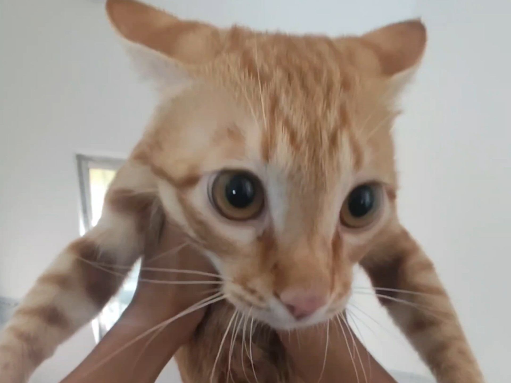 | 35.5万 | 2025-10-29 |
| [烤火的耄耋](https://www.bilibili.com/video/BV1vHyUBBEah) | 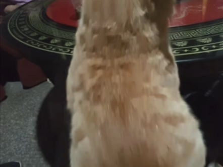 | 6.7万 | 2025-10-29 |
| [跳楼基之谁救哈谁！](https://www.bilibili.com/video/BV1oDyyBwEh1) | 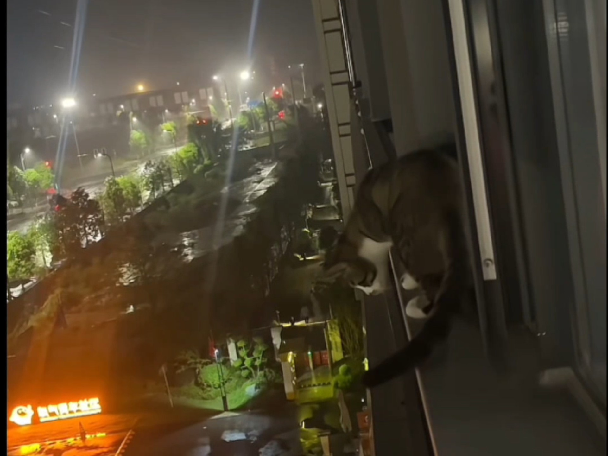 | 5181 | 2025-10-28 |
| [哈基母特色爱猫方式](https://www.bilibili.com/video/BV1EEsSzDE9L) | 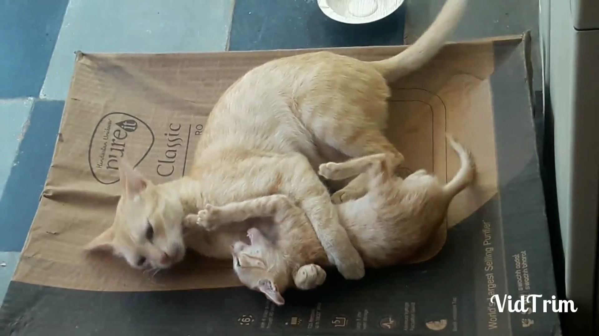 | 1.2万 | 2025-10-28 |
| [哈基米，南北绿豆～（憨憨版）](https://www.bilibili.com/video/BV1PusSzoERb) |  | 6928 | 2025-10-27 |
| [善良耄耋](https://www.bilibili.com/video/BV1busyzHExw) | 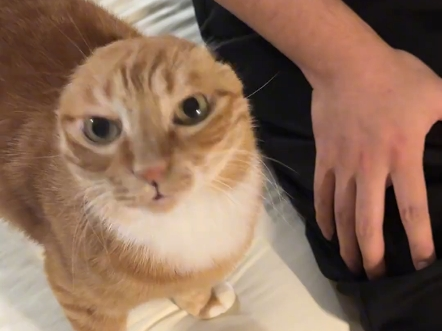 | 41.2万 | 2025-10-27 |
| [哈基米变强日记](https://www.bilibili.com/video/BV1B6szzREsG) |  | 474 | 2025-10-26 |
| [耶~~~DuangDuangDuang](https://www.bilibili.com/video/BV15DsjzSEvd) |  | 2.7万 | 2025-10-26 |
| [爱没有什么不对。](https://www.bilibili.com/video/BV1D2xNz2E84) |  | 15.2万 | 2025-10-26 |
| [一旦接触地面](https://www.bilibili.com/video/BV1GGxFzvEG2) |  | 34.9万 | 2025-10-25 |
| [这外国tiktok已经被ai耄耋占领了](https://www.bilibili.com/video/BV1a8sfzPENq) |  | 12.9万 | 2025-10-25 |
| [《基米说》“哈基哈基米，叮咚叮咚鸡....”](https://www.bilibili.com/video/BV12Qs9zCEhX) | 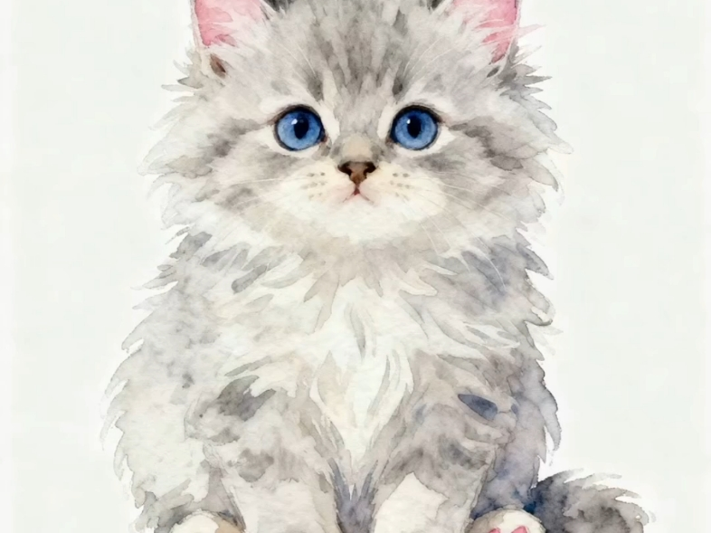 | 171 | 2025-10-25 |
| [这猫是一点也戒不了啊！](https://www.bilibili.com/video/BV1RosXzHEaC) | 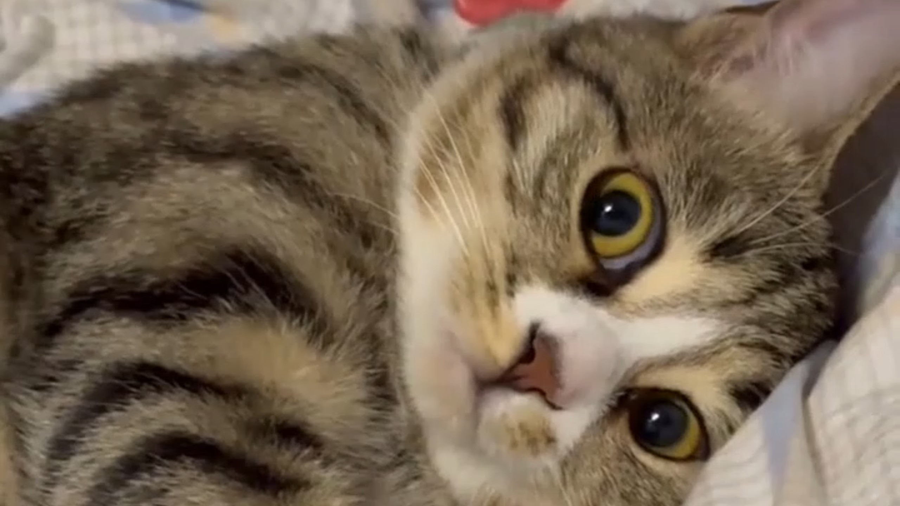 | 20.0万 | 2025-10-25 |
| [谁家神人来ktv唱基米说了](https://www.bilibili.com/video/BV1iGsnzwEjZ) |  | 34.2万 | 2025-10-24 |
| [分得清对错的猫](https://www.bilibili.com/video/BV1VcsHzbEQn) |  | 31.7万 | 2025-10-24 |
| [众所周知，被哈基米枪杀的概率不为0](https://www.bilibili.com/video/BV1SysJznEsg) |  | 12 | 2025-10-24 |
| [人被基米枪击的概率并不为0](https://www.bilibili.com/video/BV1VXsjzEE9H) | 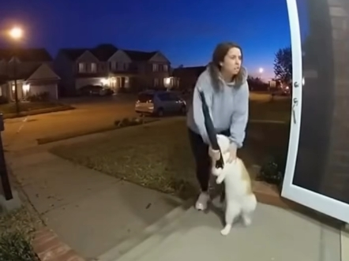 | 52 | 2025-10-24 |
| [找到略猫区的哈基米](https://www.bilibili.com/video/BV1Rbs7zXE7x) |  | 1.3万 | 2025-10-24 |
| [猫儿误闯创意工坊，瞬间被爆改](https://www.bilibili.com/video/BV1b9sGzwEf4) | 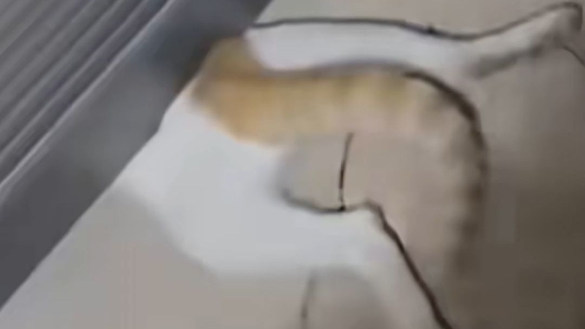 | 4.1万 | 2025-10-23 |
| [“本来应该从从容容游刃有余”《没出息》](https://www.bilibili.com/video/BV1kks3zSEs5) |  | 14.4万 | 2025-10-23 |
| [哈基米这是咋整的？](https://www.bilibili.com/video/BV1FQsizDEU5) | 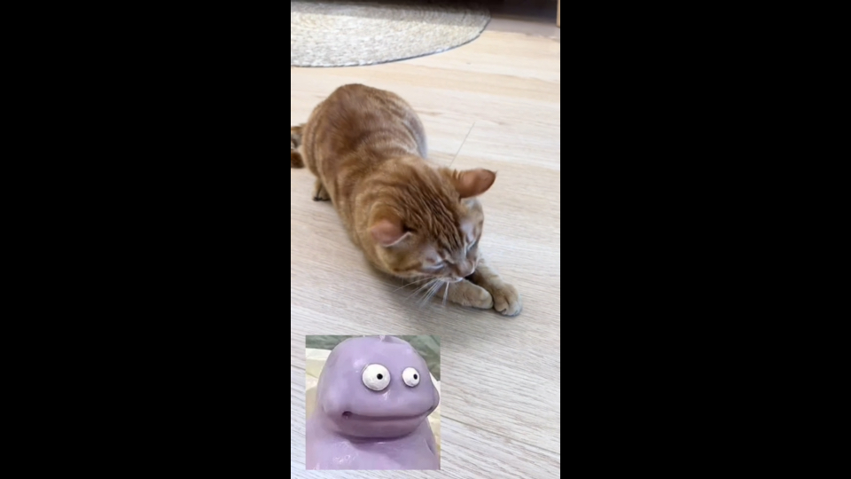 | 935 | 2025-10-23 |
| [千万别被薛之谦刷到《哈基米》之歌！](https://www.bilibili.com/video/BV1bWWdzmE9H) |  | 19.4万 | 2025-10-21 |
| [新人日v听《神曼波》笑死了 忍不住跟着唱](https://www.bilibili.com/video/BV1NaWdzGExG) |  | 8.4万 | 2025-10-21 |
| [哈基米的腿太短啦！！！](https://www.bilibili.com/video/BV1jAW9zWECE) | 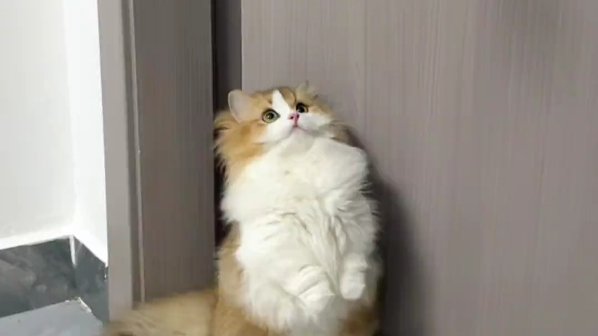 | 38 | 2025-10-21 |
| [宿舍通宵游戏哥](https://www.bilibili.com/video/BV1AFWqzHEp1) | 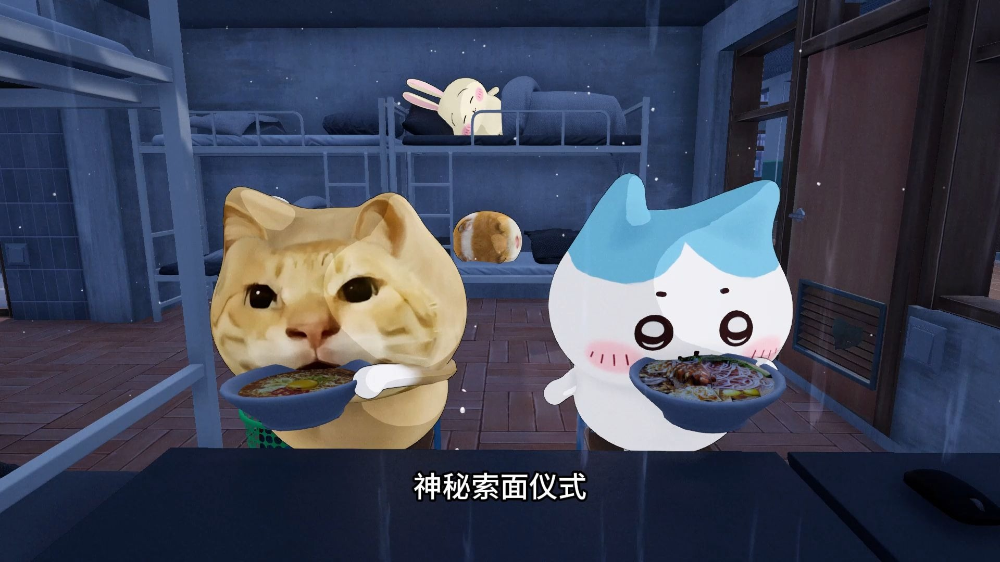 | 987.3万 | 2025-10-21 |
| [马儿的撸猫爱好](https://www.bilibili.com/video/BV1g3WQzgEt4) | 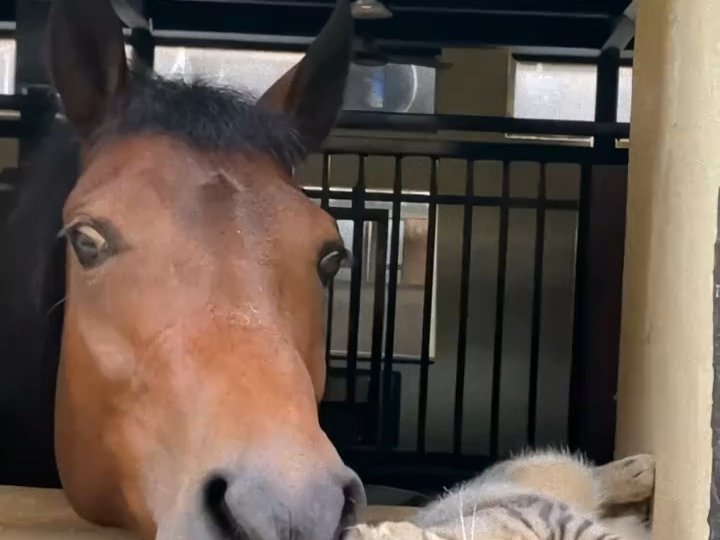 | 45.8万 | 2025-10-20 |
| [【国外难绷抽象视频集锦#5】](https://www.bilibili.com/video/BV1ALW1zVEUX) |  | 83.6万 | 2025-10-20 |
| [c哩c哩](https://www.bilibili.com/video/BV1X44tzQEXK) |  | 632.4万 | 2025-10-19 |
| [十月简直阴到离谱，带你盘点十月爆火唐歌，太讷了！！！](https://www.bilibili.com/video/BV1PNWEzKEjn) |  | 384.9万 | 2025-10-17 |
| [《 休 息 一 下 马 上 回 来 》](https://www.bilibili.com/video/BV1dVWqzrEnX) |  | 176.3万 | 2025-10-16 |
| [sora视频之《哈基米好声音》](https://www.bilibili.com/video/BV1Bx4uz6ENq) |  | 4.8万 | 2025-10-12 |
| [又是安静的一天](https://www.bilibili.com/video/BV1pX4Tz5EAr) | 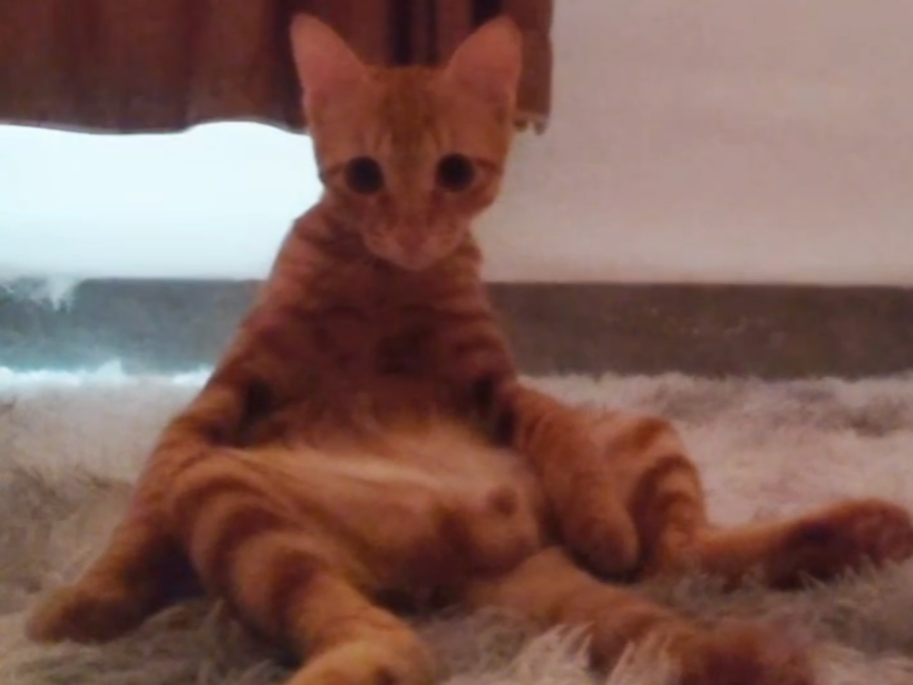 | 48.4万 | 2025-10-12 |
| [哈基米哦南北绿豆](https://www.bilibili.com/video/BV1N9bczTEwp) |  | 19.7万 | 2025-08-13 |
| [新卡速报，新的t0启动卡组 加速同调版本星辰 脚踩哈基米易如反掌 这自肃有点小众了](https://www.bilibili.com/video/BV1grbgzTEsv) |  | 13.8万 | 2025-08-11 |
| [哈基米哟南北绿豆](https://www.bilibili.com/video/BV1D6tPzUEmA) |  | 32.6万 | 2025-08-06 |
| [基米tv之足球球](https://www.bilibili.com/video/BV1J18MzSEFh) |  | 21.2万 | 2025-07-24 |
| [遛狗捡到只奶猫，巨能哈气但攻击力为0](https://www.bilibili.com/video/BV1VkjszUEjR) |  | 103.2万 | 2025-05-24 |
| [互联网三大猫王](https://www.bilibili.com/video/BV18uV6z1Eus) |  | 125.1万 | 2025-05-05 |
| [2-4月龄小猫驯化方法来啦](https://www.bilibili.com/video/BV1iSL4zZEmw) | 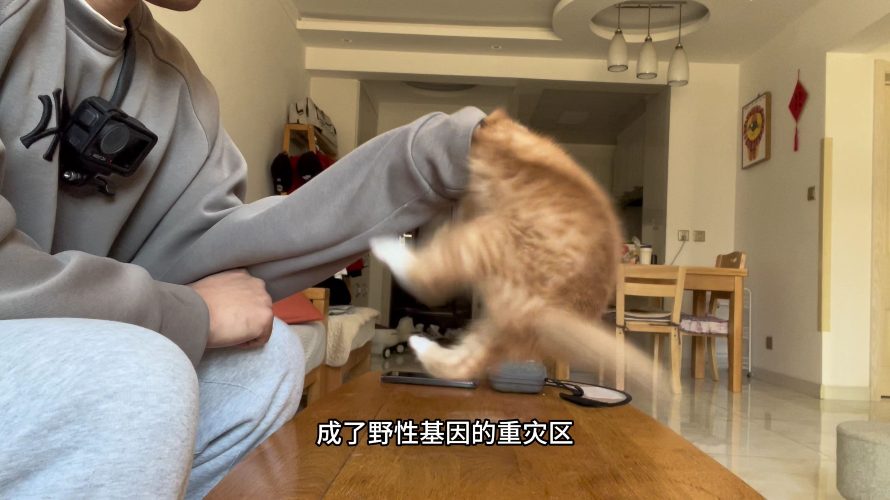 | 197.5万 | 2025-04-23 |
| [一次看个爽，一天抓 11 只小猫！](https://www.bilibili.com/video/BV1kHZ9Y6E2i) |  | 23.9万 | 2025-04-04 |
| [小猫合集](https://www.bilibili.com/video/BV1GxZFYuELM) |  | 69.4万 | 2025-03-29 |
| [🤪【奶龙版】宝宝肚肚打雷啦🤪](https://www.bilibili.com/video/BV1nkFHe9EbJ) |  | 59.5万 | 2025-01-29 |
| [自用超长猫咪爱看的电视TV动画片30分钟](https://www.bilibili.com/video/BV1qnw6eBE1t) |  | 153.7万 | 2025-01-19 |
| [猫咪手欠作死合集，弹皮筋那个我能笑一天](https://www.bilibili.com/video/BV1gHcxeUEXj) | 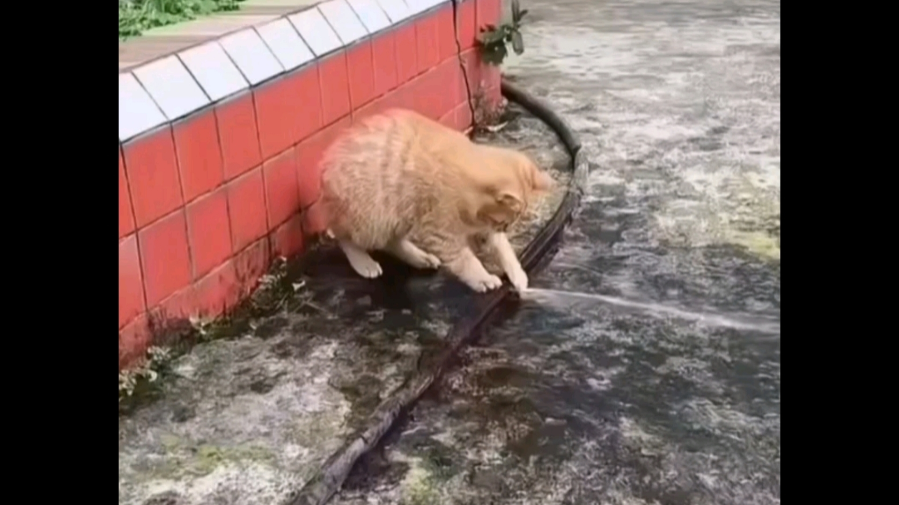 | 63.9万 | 2025-01-11 |
| [超长一小时猫咪合集](https://www.bilibili.com/video/BV1EnS8Y1E3Q) | 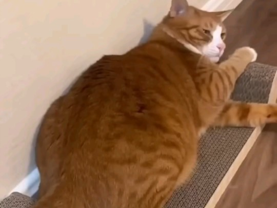 | 18.3万 | 2024-10-29 |
| [还是爱猫人士会玩，先被猫各种欺辱，然后忍辱负重寻找机会，最终成功拿下哈基米，大家好好看好好学，这就是爱猫人士卧薪尝胆的故事](https://www.bilibili.com/video/BV1ji1uYgEMe) | 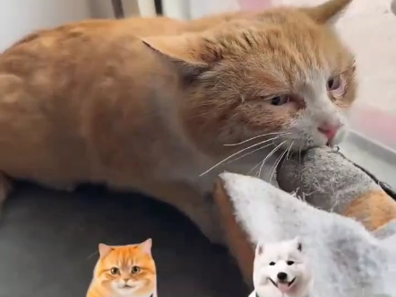 | 16.6万 | 2024-10-27 |
| [哈基米德](https://www.bilibili.com/video/BV18S4qeEEqy) | 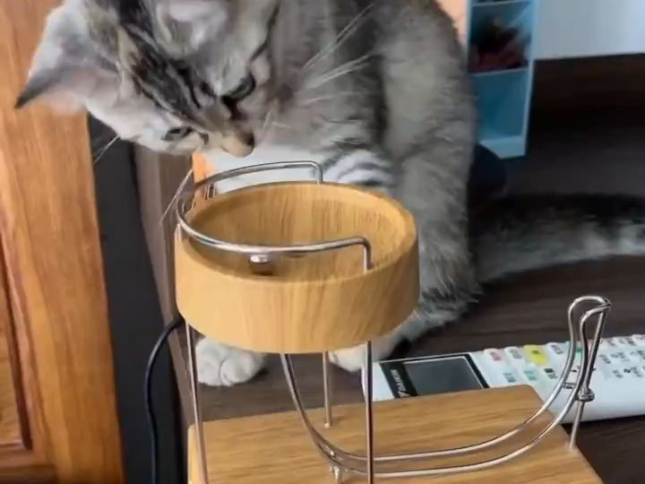 | 37.2万 | 2024-09-11 |
| [哈基米团长你就是歌姬吧](https://www.bilibili.com/video/BV1Kt421T7bd) |  | 89.6万 | 2024-05-19 |
| [爱健身的哈基米](https://www.bilibili.com/video/BV1Uf421S7AH) | 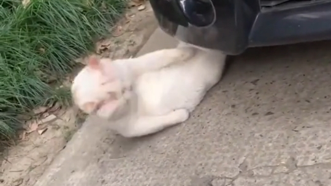 | 25.3万 | 2024-05-03 |
| [小猫14，大猫18，这是广东猫肉的价格](https://www.bilibili.com/video/BV1hE421j7YS) |  | 58.7万 | 2024-04-30 |
| [喵→喵↘喵↗喵↘喵↗](https://www.bilibili.com/video/BV1MJ4m1n7fh) |  | 126.8万 | 2024-04-23 |
| [小汤圆去了喵星的经过](https://www.bilibili.com/video/BV1cC411x78q) | 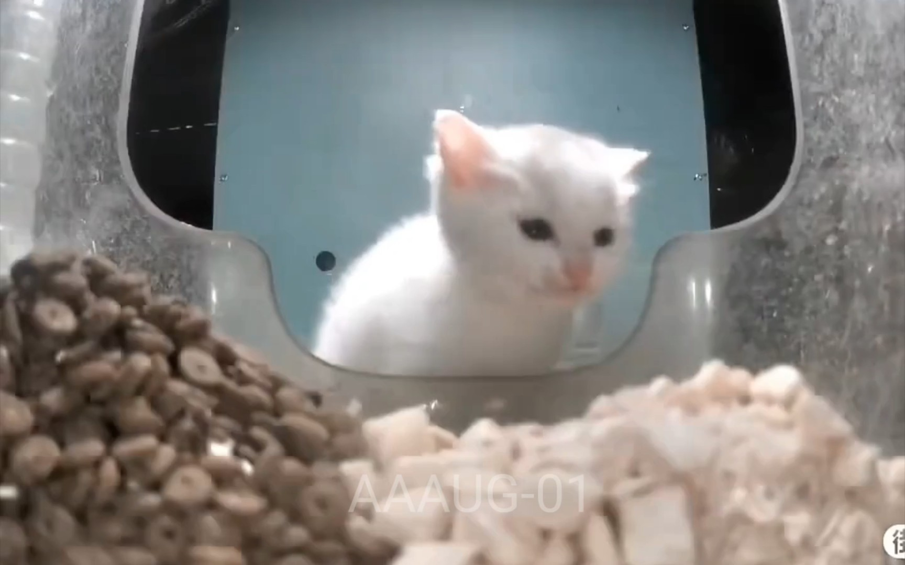 | 49.4万 | 2024-02-18 |
| [~老吴合集🐱](https://www.bilibili.com/video/BV1fg4y1c7um) | 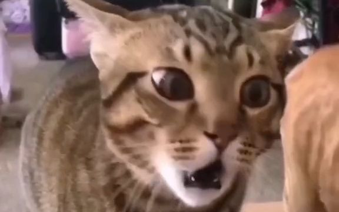 | 52.2万 | 2023-07-09 |
| [世界破破烂烂，小猫缝缝补补！](https://www.bilibili.com/video/BV1TP411v7Bm) |  | 47.5万 | 2023-07-05 |
| [猫咪召唤术（4分钟超长纯享版）](https://www.bilibili.com/video/BV11o4y1E7GS) |  | 271.5万 | 2023-06-07 |
| [男生撸猫和女生撸猫的区别](https://www.bilibili.com/video/BV1AK411f7M3) | 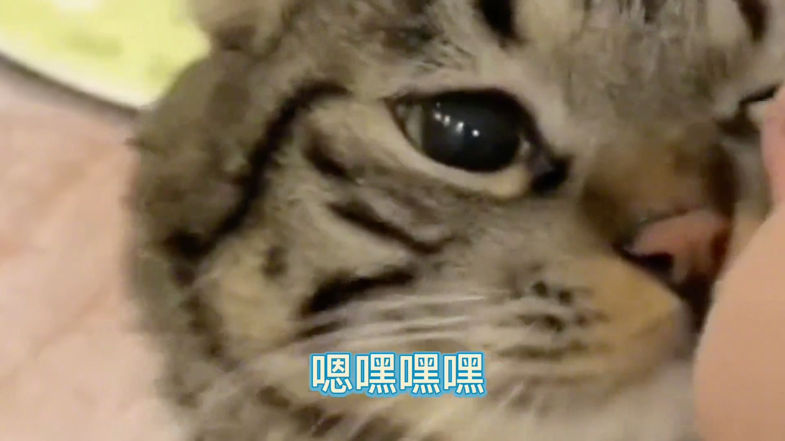 | 73.3万 | 2022-09-03 |
| [各种猫叫，喵喵喵喵](https://www.bilibili.com/video/BV17E411Y7x7) |  | 397.2万 | 2019-10-27 |

---
*最后更新: 2025-11-02 02:41:53 (自动生成)*
*数据来源: [Bilibili](https://www.bilibili.com)*

## 使用说明

运行以下命令更新视频列表:
```bash
python3 fetch_hajimi_videos.py
```
