# awesome-hajimi
collections of hajimi (哈基米 in Chinese) on the Internet.

## 视频列表 (Video List)

| 视频标题 (Title) | 封面 | 播放量 (Views) | 发布日期 (Date) |
|---|---|---|---|
| [《奥星热浪》⚡哈基高测试PV⚡实机演示☝欢迎高雅人士品鉴🐧](https://www.bilibili.com/video/BV1bh6gBVEJW) |  | 1.8万 | 2026-01-28 |
| [哈基米偷吃农村的母鸡](https://www.bilibili.com/video/BV1zd65BkE2R) |  | 856 | 2026-01-28 |
| [《猫狗回村图鉴》](https://www.bilibili.com/video/BV15B6uBSEo2) |  | 2.3万 | 2026-01-28 |
| [《恐怖哈基米》第一期  寻找失踪的耄耋猫](https://www.bilibili.com/video/BV1Qm63BnEca) | 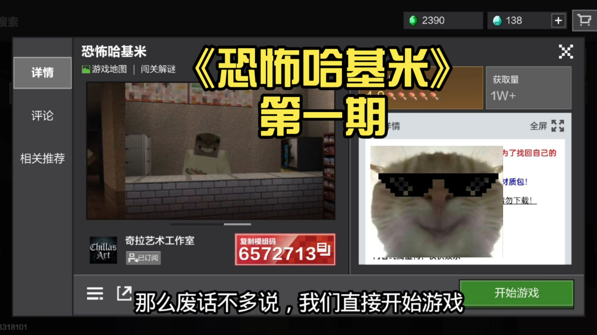 | 419 | 2026-01-28 |
| [哈基米受难日](https://www.bilibili.com/video/BV1f765BBEUM) |  | 723 | 2026-01-27 |
| [基米TV之打猎能手17分钟剧场版，一次看个爽](https://www.bilibili.com/video/BV16K6gB8EGc) |  | 8107 | 2026-01-27 |
| [哈基米边嚼口香糖边开启老吴模式](https://www.bilibili.com/video/BV1fG6gBxE5D) |  | 1877 | 2026-01-27 |
| [哈基米南北路多~](https://www.bilibili.com/video/BV1196uBBEf3) |  | 457 | 2026-01-27 |
| [[哈基米古典乐]巴赫 BWV1030 《III.PRESTO》完整版](https://www.bilibili.com/video/BV1sB6gBBEnE) |  | 701 | 2026-01-27 |
| [20天后的你加be like！你是属于哪个区的？](https://www.bilibili.com/video/BV1FHzYBRErJ) |  | 1554 | 2026-01-27 |
| [小耄被定住了 大家快来摸呀](https://www.bilibili.com/video/BV1ZK6MBQE6c) | 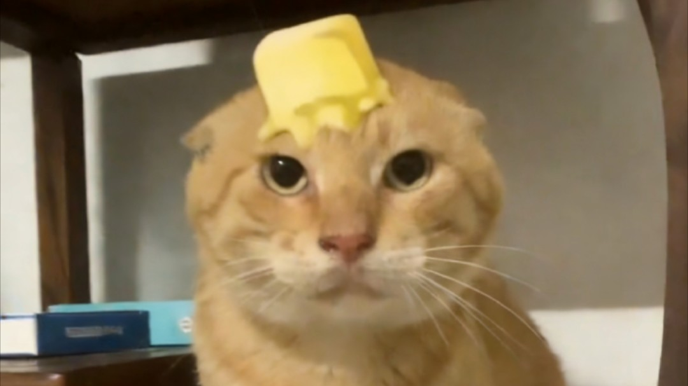 | 4098 | 2026-01-27 |
| [基裂变反应（dy真的啊）](https://www.bilibili.com/video/BV1Ss6MBzEV8) | 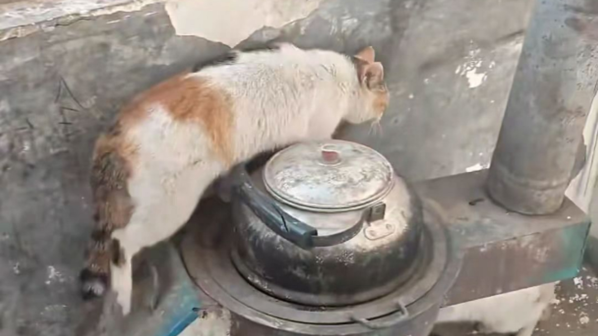 | 4012 | 2026-01-27 |
| [鼠大王开始新的一天的残局生活ing](https://www.bilibili.com/video/BV1wH6uBhE63) | 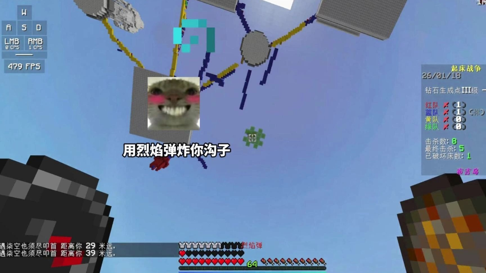 | 1863 | 2026-01-27 |
| [钓鱼捡到的猫妈妈，真的太辛苦了](https://www.bilibili.com/video/BV1K56uBKEus) | 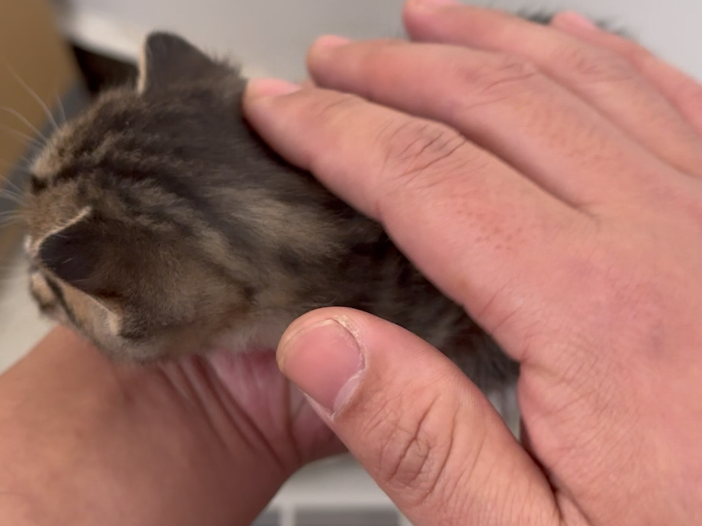 | 38.2万 | 2026-01-27 |
| [沉睡哈基米](https://www.bilibili.com/video/BV1x56uBKEXj) | 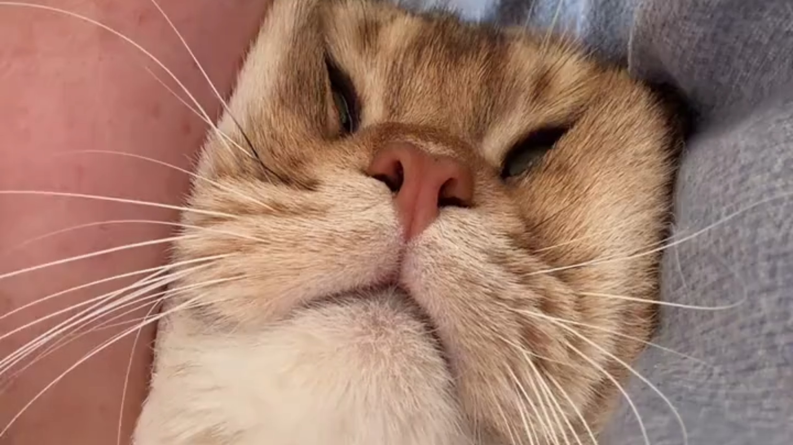 | 6.4万 | 2026-01-27 |
| [老大我头铁](https://www.bilibili.com/video/BV1WY6KBxEG8) | 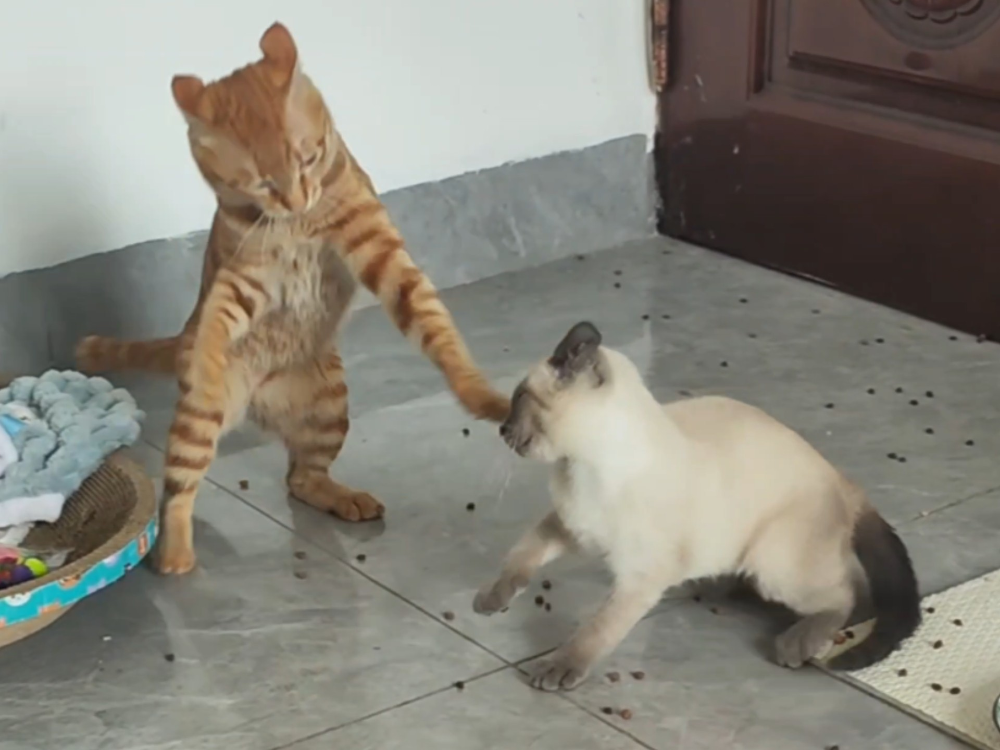 | 6.8万 | 2026-01-27 |
| [【活全家哈基米】不死基游戏（不死身ごっこ）](https://www.bilibili.com/video/BV1QkzqBdEvB) |  | 1.4万 | 2026-01-27 |
| [【劉俊朗】时隔两个月 基米说再度返场！](https://www.bilibili.com/video/BV1PEzqBVETm) |  | 8057 | 2026-01-27 |
| [这种猫还有救吗？](https://www.bilibili.com/video/BV1J66KBDE8w) | 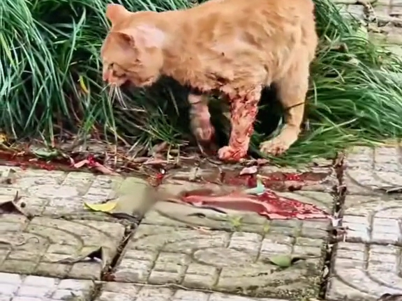 | 1.4万 | 2026-01-27 |
| [哈基米 [贝利撒留(Belisarius)] [Farya Faraji]](https://www.bilibili.com/video/BV1SC6TBqEyr) |  | 3429 | 2026-01-27 |
| [看得出来喵画师极其认真！](https://www.bilibili.com/video/BV1AHzqB3ECu) | 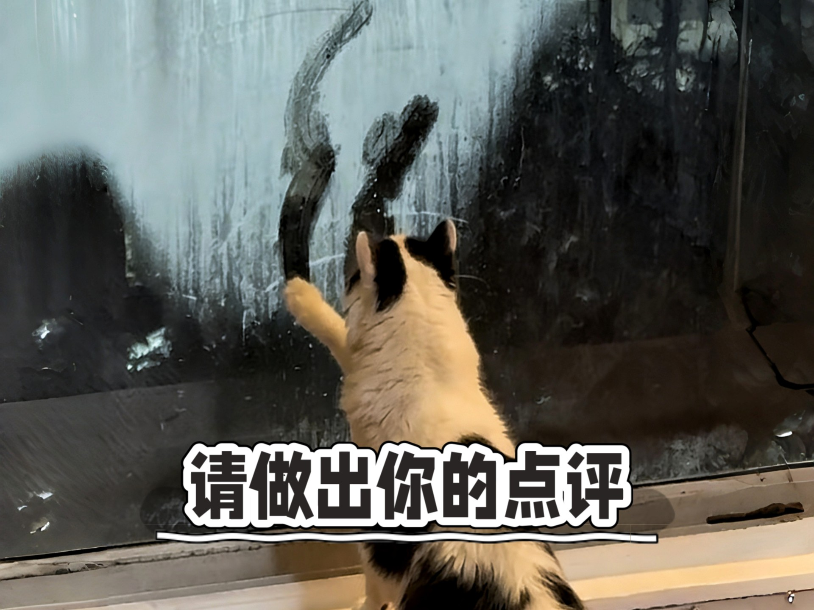 | 6974 | 2026-01-26 |
| [润美反贼被ice物理斩杀了](https://www.bilibili.com/video/BV13AzqBWESU) |  | 3.6万 | 2026-01-26 |
| [因为小猫过于可爱而被迫成为变态](https://www.bilibili.com/video/BV1jMzeBWE6o) | 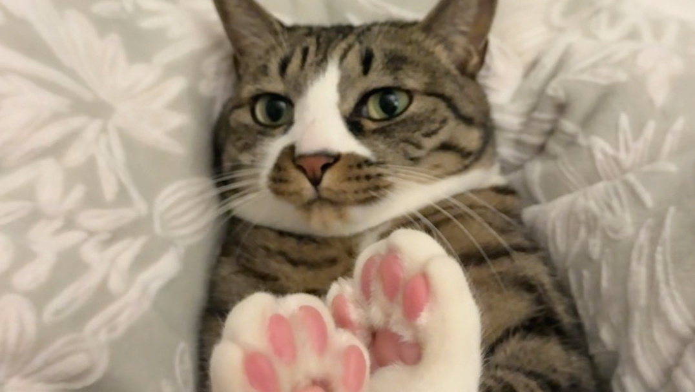 | 5.0万 | 2026-01-26 |
| [【一口KUKI】哈基米山歌](https://www.bilibili.com/video/BV13EzeB2ED5) |  | 276 | 2026-01-26 |
| [被冬将军抚摸成叮咚基了](https://www.bilibili.com/video/BV1UMzvBGEG7) | 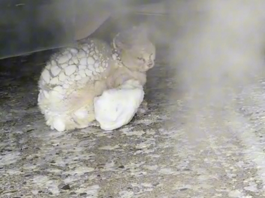 | 1.8万 | 2026-01-26 |
| [基米小剧场](https://www.bilibili.com/video/BV1fxzvBfEMz) | 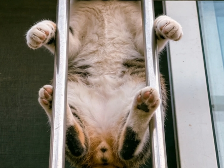 | 9201 | 2026-01-26 |
| [「不得不哈」](https://www.bilibili.com/video/BV1c5zhBQEi9) |  | 77 | 2026-01-26 |
| [散养的哈基米被大狗叫咬了](https://www.bilibili.com/video/BV1rjzhBnExt) | 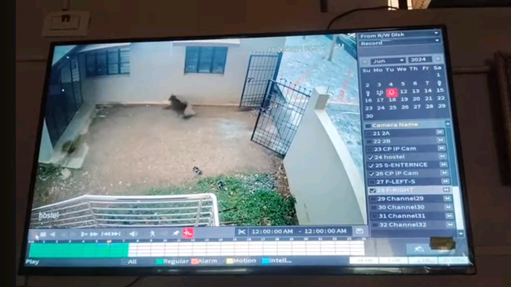 | 1003 | 2026-01-26 |
| [【Hi-Res无损】《基米说》哈基米之歌“哈基米南北绿豆.”](https://www.bilibili.com/video/BV1LTzaBjEt8) |  | 1308 | 2026-01-26 |
| [猫这玩意就是一堆屎山代码跑起来的🐈](https://www.bilibili.com/video/BV1K9zxBSE2e) | 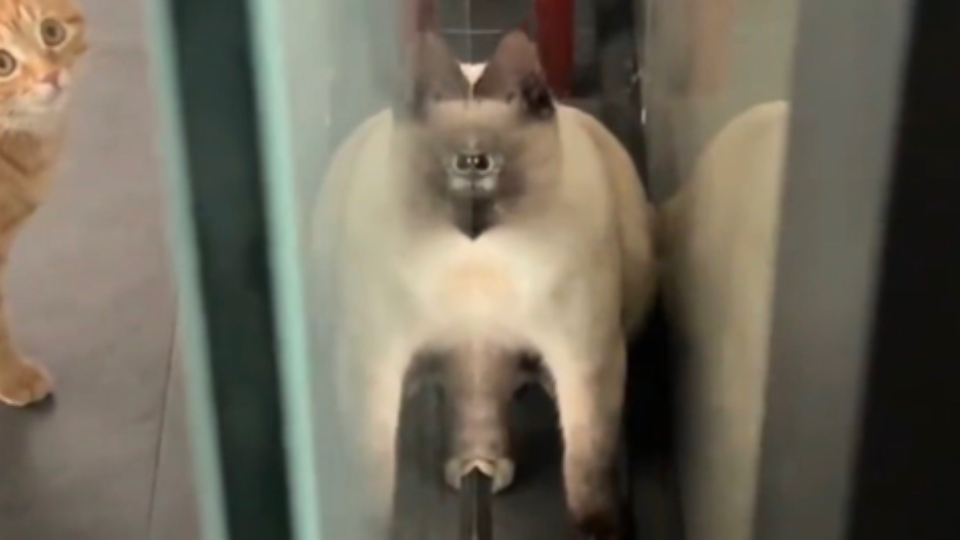 | 5.7万 | 2026-01-25 |
| [🐱](https://www.bilibili.com/video/BV1y6z4B7Ep3) | 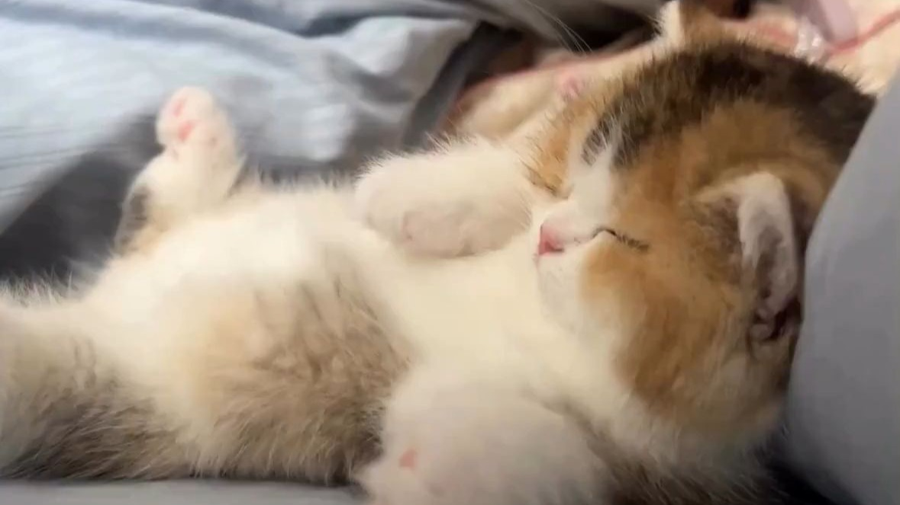 | 2.4万 | 2026-01-25 |
| [🐱](https://www.bilibili.com/video/BV1y6z4B7EYk) |  | 5.7万 | 2026-01-25 |
| [圆头基米](https://www.bilibili.com/video/BV18DztB8EET) | 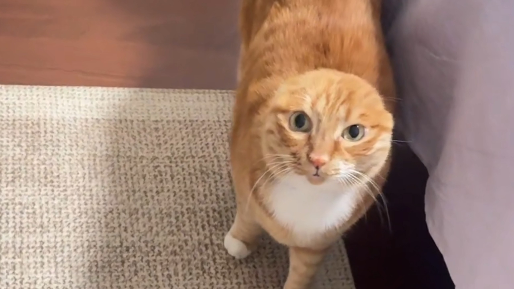 | 9522 | 2026-01-25 |
| [🐧你们也就网上说说了🐧](https://www.bilibili.com/video/BV1dEz4BaEwT) |  | 80.7万 | 2026-01-25 |
| [自己偷跑出去，回来睡了半天](https://www.bilibili.com/video/BV1e1zDBwE47) |  | 10.1万 | 2026-01-25 |
| [撸亲人的流浪猫正确流程，全程要注意随时收回手](https://www.bilibili.com/video/BV1nhzDBkEKy) | 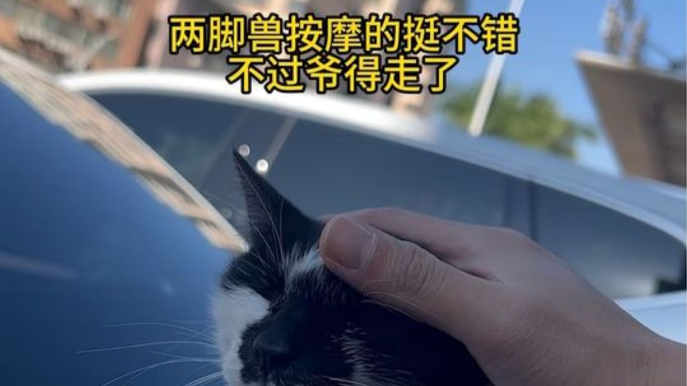 | 13.3万 | 2026-01-25 |
| [【真栗】和林芷伊互关了，能和她合作是我的荣幸！她才是哈基米天才！](https://www.bilibili.com/video/BV16KzmBwEA9) |  | 2.0万 | 2026-01-25 |
| [【meme】b站老梗-超威蓝猫](https://www.bilibili.com/video/BV17WBfBxEwP) |  | 47.6万 | 2026-01-25 |
| [嘬睡前的传统](https://www.bilibili.com/video/BV1m5zDBpEDz) | 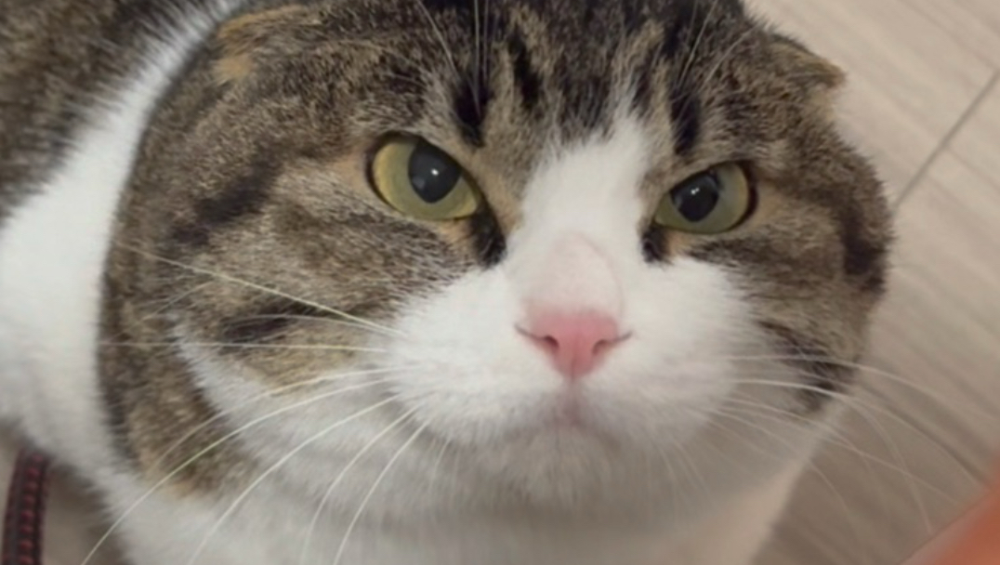 | 15.9万 | 2026-01-25 |
| [猫咪的小白手套坏了](https://www.bilibili.com/video/BV1pozyB8E6j) | 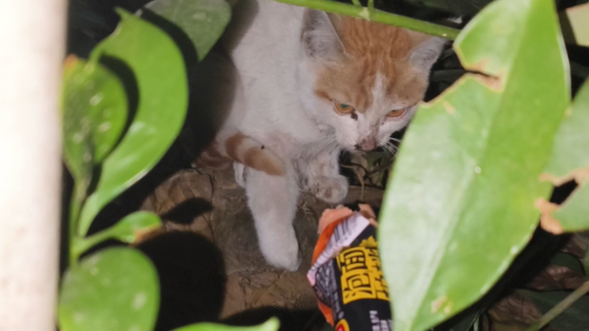 | 996 | 2026-01-24 |
| [今天发个长点的视频，天天炫猫会看腻](https://www.bilibili.com/video/BV1s8zCBFEp2) | 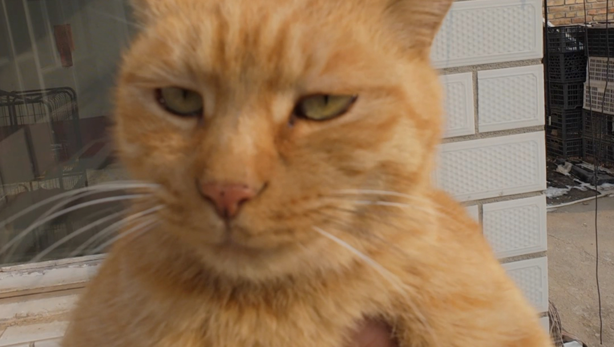 | 3.8万 | 2026-01-24 |
| [一袋米要扛几楼～](https://www.bilibili.com/video/BV1c7zkBJEnG) | 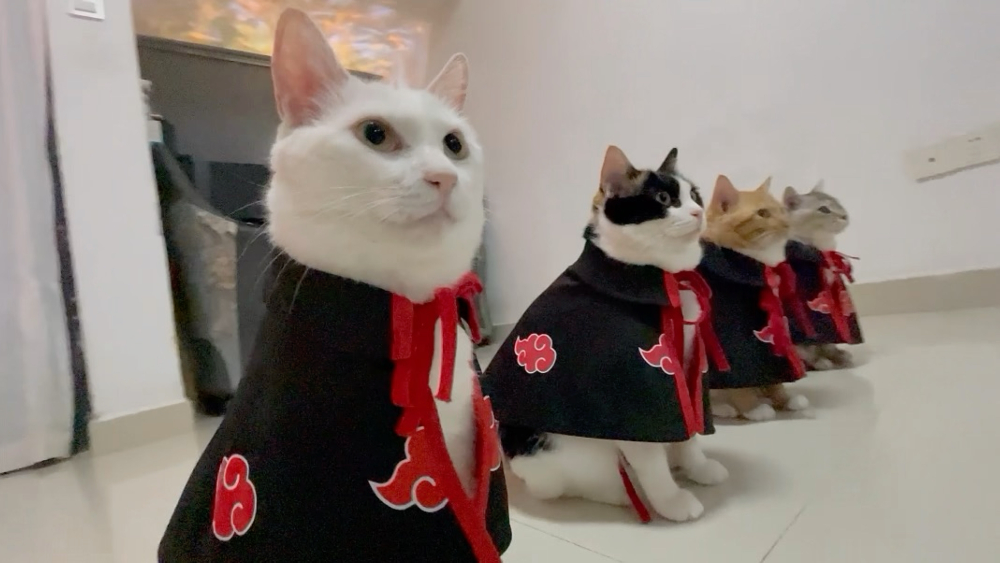 | 43.6万 | 2026-01-24 |
| [打破我与嘬不合传闻！](https://www.bilibili.com/video/BV1VPzzBhEE9) | 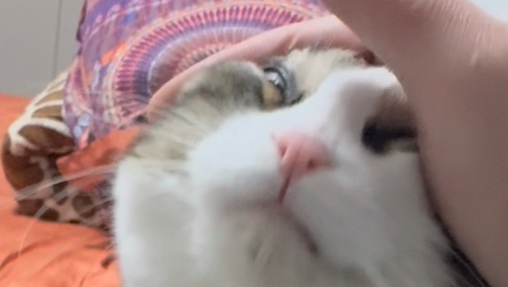 | 8.4万 | 2026-01-24 |
| [⚡️🦅你  已  急  飞🦅⚡️](https://www.bilibili.com/video/BV1eTzTBuErq) |  | 36.6万 | 2026-01-23 |
| [《谁家之过年回老家 who home—‌across‌ year go back old home》](https://www.bilibili.com/video/BV1XhzMBrEkN) |  | 379.4万 | 2026-01-23 |
| [小猫为什么在淘米呢？](https://www.bilibili.com/video/BV1QmzNBAERn) |  | 47.3万 | 2026-01-23 |
| [傻福作者😡](https://www.bilibili.com/video/BV1v3zwBcERg) |  | 81.1万 | 2026-01-23 |
| [“霸王烧鸡，葡式蛋挞，辣干锅牛蛙~”](https://www.bilibili.com/video/BV1PgBfBNEjN) |  | 155.9万 | 2026-01-22 |
| [BBOX不捂嘴能有多抽象？](https://www.bilibili.com/video/BV1FFzpBFE54) |  | 479.4万 | 2026-01-22 |
| [《我一而再再而三强调······》](https://www.bilibili.com/video/BV16Zk7BREhM) |  | 563.7万 | 2026-01-21 |
| [糟糕！就一眼，差点被萌死](https://www.bilibili.com/video/BV1ZxkJBsEYk) |  | 125.2万 | 2026-01-20 |
| [哈基花最后一舞 这环境真拉完了](https://www.bilibili.com/video/BV1e2k5BiEWt) |  | 426 | 2026-01-20 |
| [我能听得懂喵语 小猫说天气太热了想去潜水](https://www.bilibili.com/video/BV1GSkxBPE16) | 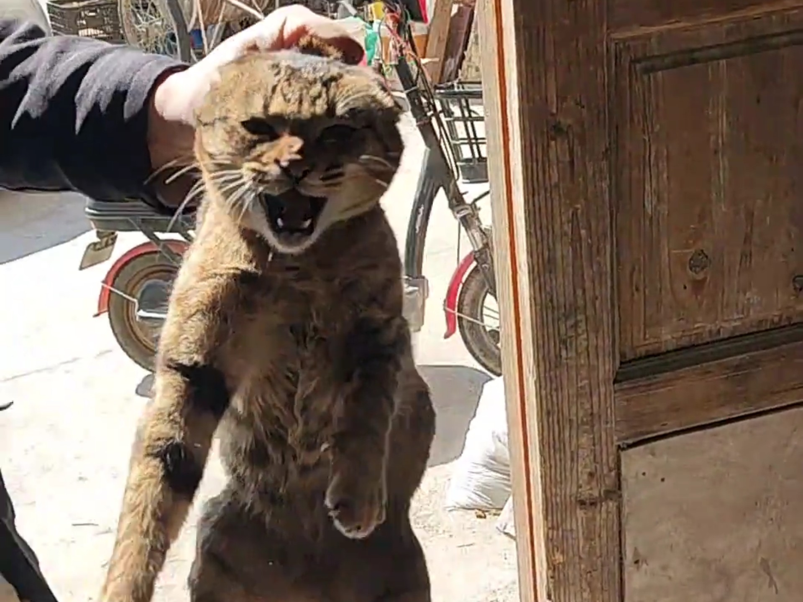 | 48.4万 | 2026-01-18 |
| [45分钟哈基Set🤣 ｜ DnB ｜ EDM House ｜ Trance ｜ No Phonk](https://www.bilibili.com/video/BV1VmrQBqEKU) | 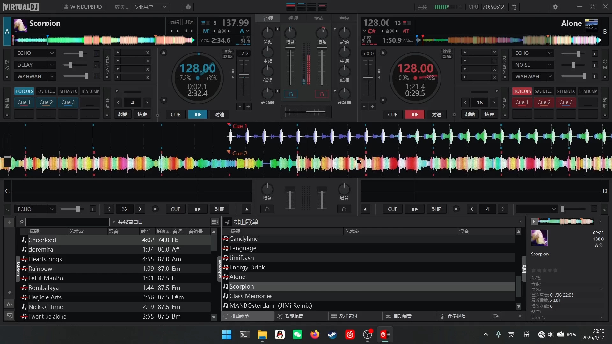 | 663 | 2026-01-17 |
| [大胆！看见本王为何不跪](https://www.bilibili.com/video/BV1kfrmBkELE) |  | 443.9万 | 2026-01-17 |
| [“🤖“我的兄弟像老师,呕心沥血的教培....”🍑](https://www.bilibili.com/video/BV1EGkwB3E3s) |  | 200.0万 | 2026-01-16 |
| [我已经语无伦次了！](https://www.bilibili.com/video/BV1Hzr5B7EoW) |  | 107.4万 | 2026-01-13 |
| [哈基米哈基米，你怎么不动了？是不是有1.4了？石怎么都出来了？](https://www.bilibili.com/video/BV1Nei4BrEV4) | 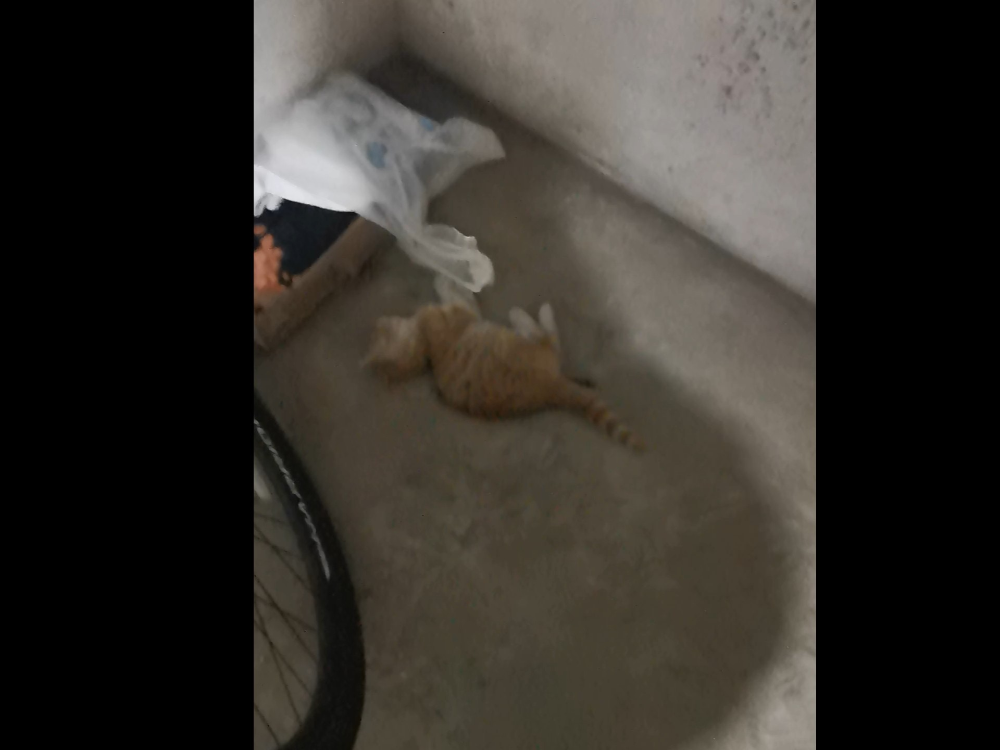 | 895 | 2026-01-05 |
| [疯子大学生元旦跑步130km回家(1)](https://www.bilibili.com/video/BV1zmiKB3ESQ) | 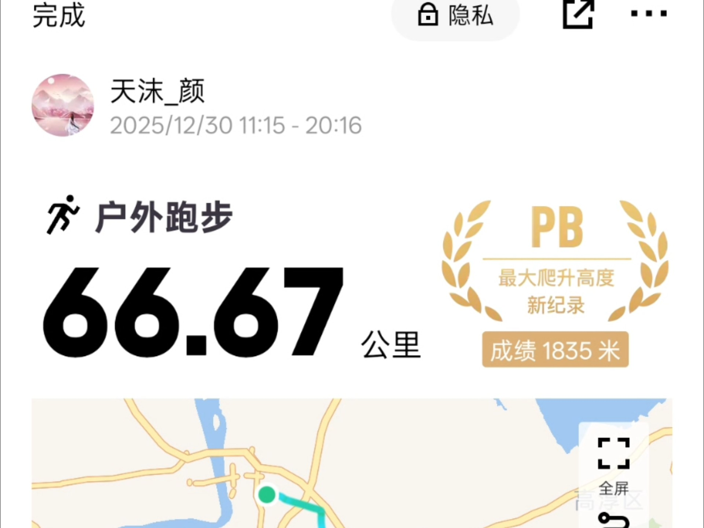 | 53.4万 | 2025-12-31 |
| [2025年度真好猫21分钟合集](https://www.bilibili.com/video/BV17xBLBNEwV) | 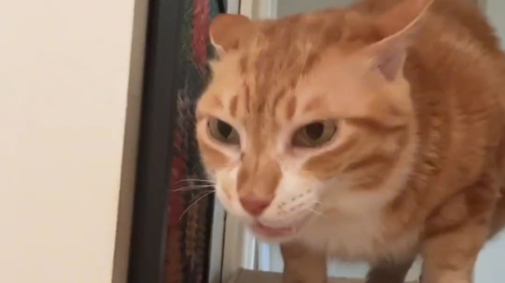 | 2.2万 | 2025-12-24 |
| [全新基米形象来袭～曼波😎](https://www.bilibili.com/video/BV19rqoB3ETh) |  | 10.7万 | 2025-12-19 |
| [肥基米](https://www.bilibili.com/video/BV1Y3YezUENs) |  | 18.3万 | 2025-08-16 |
| [machico讲哈基米之歌创作灵感](https://www.bilibili.com/video/BV1mK4YewEvQ) |  | 7.8万 | 2024-09-11 |
| [哈基米在潜泳](https://www.bilibili.com/video/BV1Vc411m7LK) | 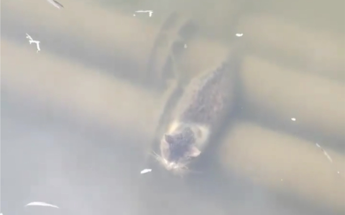 | 62.4万 | 2023-12-16 |
| [哈基米也能放](https://www.bilibili.com/video/BV12e411k7NM) | 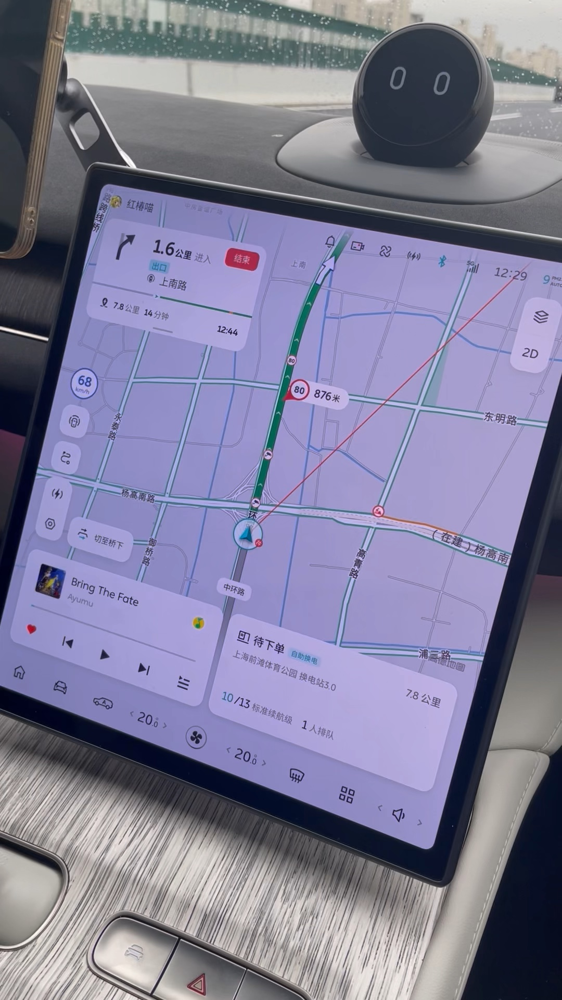 | 2124 | 2023-12-15 |
| [哈基米](https://www.bilibili.com/video/BV1bw411z7JG) |  | 132 | 2023-10-27 |
| [哈基米，哈基米，](https://www.bilibili.com/video/BV1rN411b79B) |  | 50.9万 | 2023-10-13 |
| [哈基米](https://www.bilibili.com/video/BV1P841117MS) |  | 1.2万 | 2023-09-27 |
| [哈基米哈基米哈基米](https://www.bilibili.com/video/BV1VG411R76U) |  | 10.5万 | 2023-09-08 |
| [哈基米～哈基米～](https://www.bilibili.com/video/BV1FN411i7Nn) |  | 1399 | 2023-09-05 |
| [哈基米哈基米哈基米～](https://www.bilibili.com/video/BV1mj411z76n) |  | 2.7万 | 2023-08-09 |
| [哈基米](https://www.bilibili.com/video/BV1k94y1q76H) | 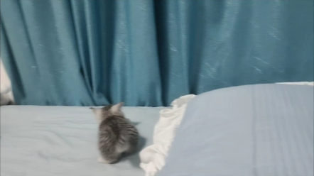 | 168 | 2023-07-07 |
| [哈基米](https://www.bilibili.com/video/BV1sV411M74Y) | 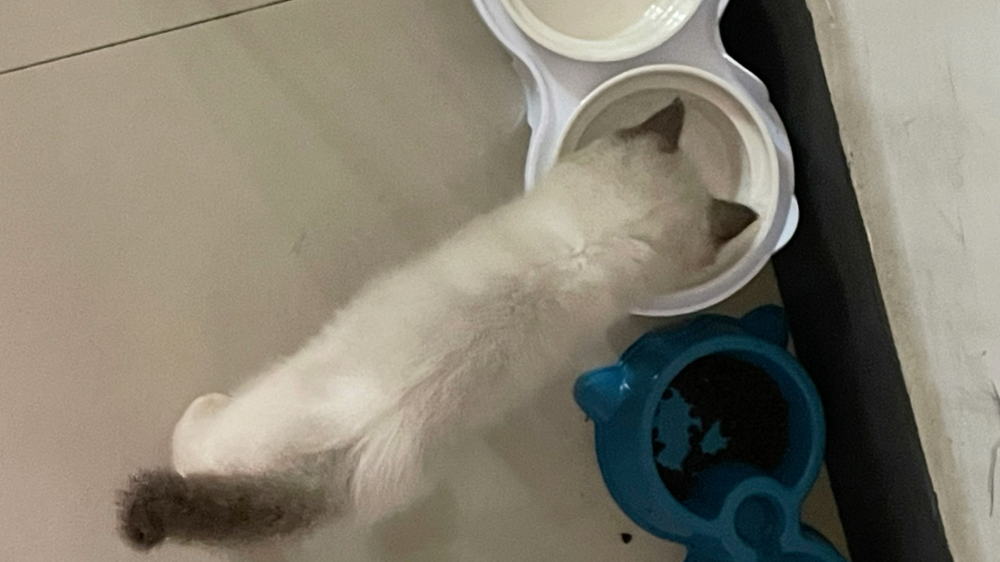 | 125 | 2023-07-02 |
| [哈基米](https://www.bilibili.com/video/BV1Zh411P7rN) |  | 1.1万 | 2023-06-29 |
| [哈基米](https://www.bilibili.com/video/BV1fj411U7yS) | 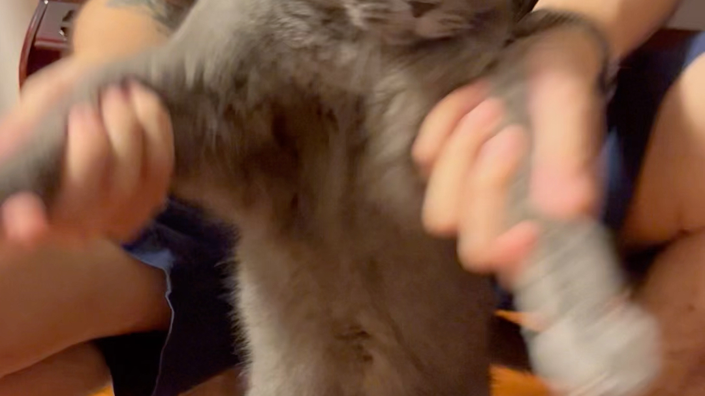 | 230 | 2023-06-26 |
| [哈基米](https://www.bilibili.com/video/BV1o8411o7wF) | 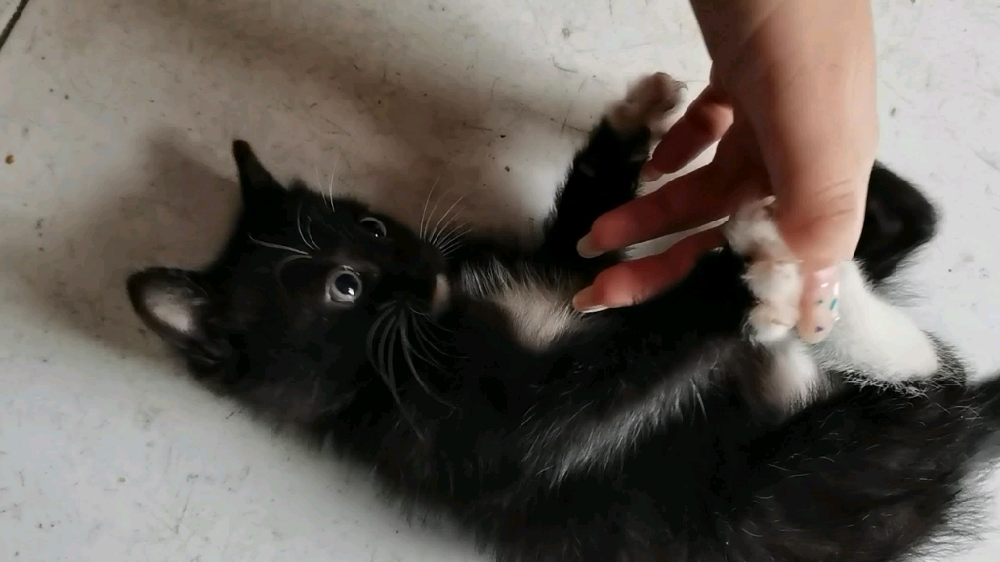 | 1018 | 2023-06-05 |
| [⚡哈吉米⚡哈吉米⚡哈吉米⚡](https://www.bilibili.com/video/BV1dc411g7h2) | 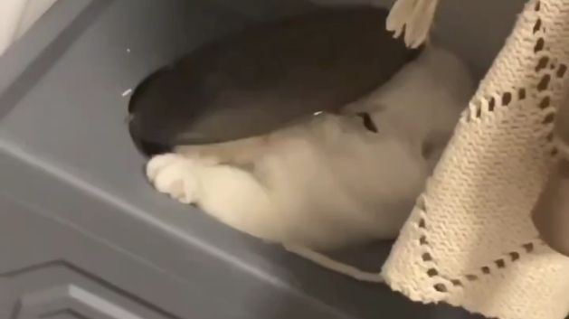 | 4360 | 2023-06-02 |
| [哈基米](https://www.bilibili.com/video/BV1Zo4y1c7ZW) | 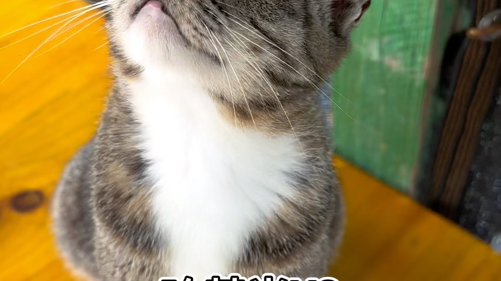 | 50.6万 | 2023-05-09 |
| [你们最喜欢的哈基米](https://www.bilibili.com/video/BV1No4y1873y) |  | 6.2万 | 2023-04-27 |
| [哈基米，哈基米，哈基米～](https://www.bilibili.com/video/BV19j411F7vb) | 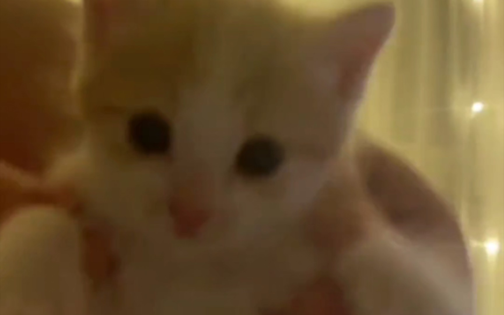 | 3.7万 | 2023-04-08 |
| [5秒后帮刻晴脱鞋](https://www.bilibili.com/video/BV14T411r7Bp) |  | 7.6万 | 2023-03-13 |
| [哈基米](https://www.bilibili.com/video/BV1LY411z7uw) |  | 8881 | 2023-03-10 |
| [是你们喜欢的阿离吗？](https://www.bilibili.com/video/BV1YT411X7zE) |  | 1317 | 2023-02-04 |
| [新年快乐，各位劫宝们，送你们几个捏脸数据](https://www.bilibili.com/video/BV1ZK411C7kx) |  | 52 | 2023-01-14 |
| [瞄准头部，开放伤口…](https://www.bilibili.com/video/BV1FT411m7qJ) |  | 10.2万 | 2023-01-13 |
| [《夭寿呀,他一个技能就把我们灭了 40》随手打了个NPC,NPC就变成了BOSS?](https://www.bilibili.com/video/BV18K41197VN) |  | 9468 | 2022-12-09 |
| [风里雨里，马格南等你](https://www.bilibili.com/video/BV1eT411T7YD) |  | 1253 | 2022-09-21 |
| [风里雨里，火焰等你](https://www.bilibili.com/video/BV1FT411F7Je) |  | 1135 | 2022-09-10 |
| [哈基米！](https://www.bilibili.com/video/BV1mG411x7j9) |  | 6.7万 | 2022-08-18 |
| [《真理只在射程之外》](https://www.bilibili.com/video/BV155411Q7Sn) |  | 548 | 2022-06-03 |
| [第二十三集：拿下假装NPC的怪物，获得变身技能，变身后还能选择职业？](https://www.bilibili.com/video/BV135411X7K2) |  | 6.3万 | 2022-05-21 |
| [野性难训，猫要被浸鱼塘了！上回吃了活鸡头，这回直接啃活鸡爪了···](https://www.bilibili.com/video/BV1DZ4y187fA) |  | 34.4万 | 2022-05-20 |
| [第十四集：拿完BOSS首杀，樱花国就要派人来刺杀我？](https://www.bilibili.com/video/BV165411U7PF) |  | 8.0万 | 2022-04-11 |
| [第三集：升级送了隐藏技能，还掉落了2件装备，可以卖一亿？](https://www.bilibili.com/video/BV1E5411S7he) |  | 13.7万 | 2022-03-29 |
| [猖狂猫咪多次偷鸡被打死，四肢僵硬视频曝光，养殖户迅速遭到网暴](https://www.bilibili.com/video/BV1gu411R7z2) | 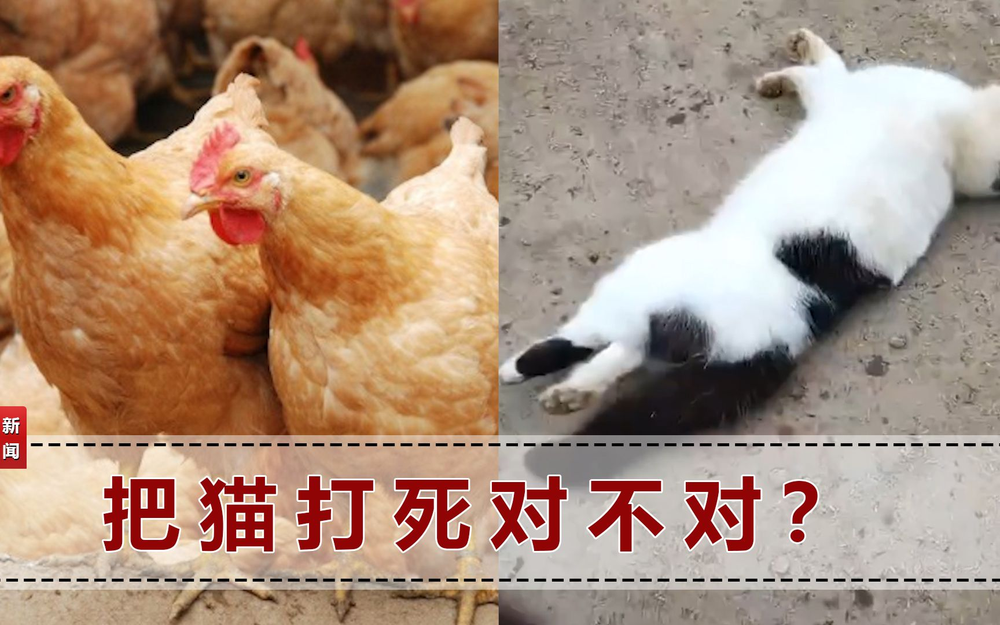 | 243.4万 | 2022-02-17 |
| [他就这么呆住了](https://www.bilibili.com/video/BV1uL411j77k) |  | 835 | 2021-12-11 |
| [艾 斯 你 这 个 衰 仔](https://www.bilibili.com/video/BV1PL411b7DR) |  | 1179 | 2021-08-21 |
| [这是何等的尤物啊](https://www.bilibili.com/video/BV1K5411h7rX) |  | 139 | 2020-08-18 |
| [这TM才是幻化之战  能苟才能赢](https://www.bilibili.com/video/BV195411p7mq) |  | 47 | 2020-06-03 |
| [植物大战僵尸主题曲  Zombies on your Lawn](https://www.bilibili.com/video/BV1Z5411t7Qx) |  | 2252 | 2020-04-21 |

---
*最后更新: 2026-01-28 02:54:20 (自动生成)*
*数据来源: [Bilibili](https://www.bilibili.com)*

## 使用说明

运行以下命令更新视频列表:
```bash
python3 fetch_hajimi_videos.py
```
