# awesome-hajimi
collections of hajimi (哈基米 in Chinese) on the Internet.

## 视频列表 (Video List)

| 视频标题 (Title) | 封面 | 播放量 (Views) | 发布日期 (Date) |
|---|---|---|---|
| [哈基人一晚上不睡觉成功抓到偷吃兔子的哈基米](https://www.bilibili.com/video/BV1iM1NBHEka) | 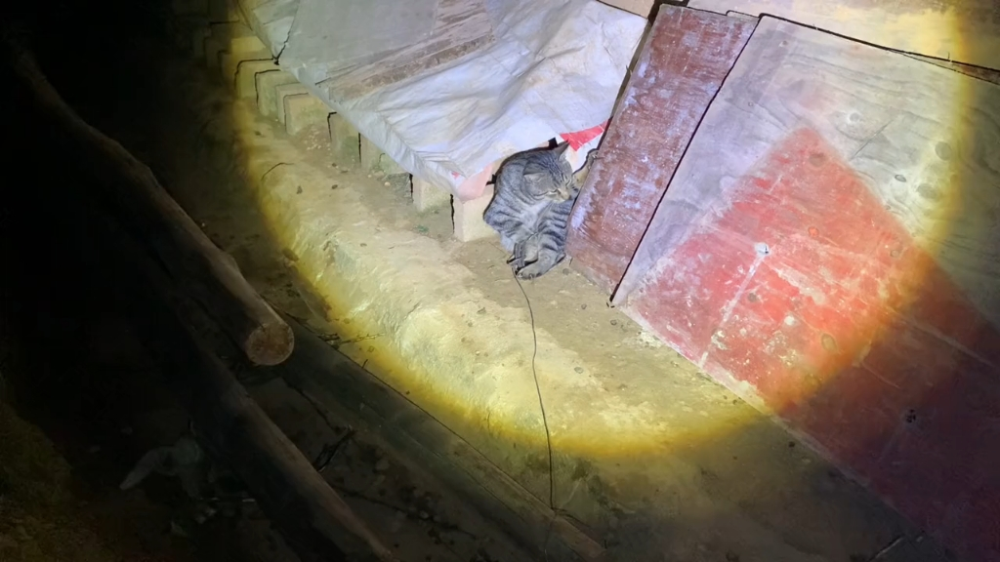 | 403 | 2025-10-31 |
| [【活全家哈基米】幽灵咚鸡（超级活全家）](https://www.bilibili.com/video/BV1BKyvB3Eyy) |  | 503 | 2025-10-31 |
| [基米小学：风筝大赛！但场面有点混乱](https://www.bilibili.com/video/BV1CFyvBLEKD) | 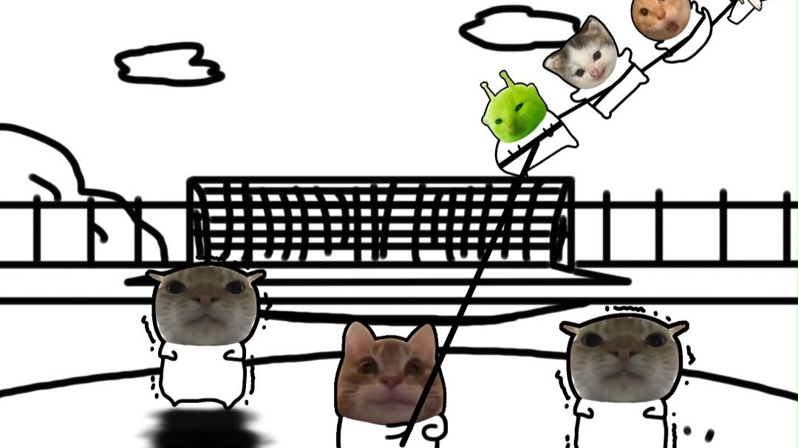 | 2.1万 | 2025-10-30 |
| [大理塘是哈的基米](https://www.bilibili.com/video/BV12RyeBUEPg) |  | 220 | 2025-10-30 |
| [The Chimi Troll（基米巨魔）（完整版）【哈基米音乐】](https://www.bilibili.com/video/BV14KyaByE7d) |  | 992 | 2025-10-30 |
| [25分钟哈基米音乐合集](https://www.bilibili.com/video/BV1C9yaBrEoL) | 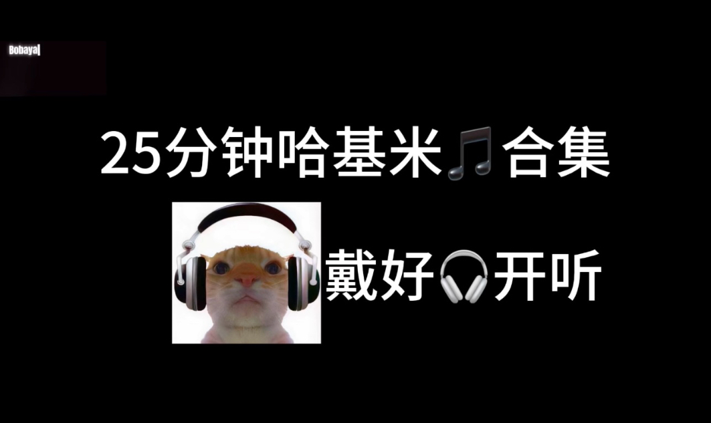 | 1176 | 2025-10-30 |
| [可是哈基米南北绿豆真的很性感](https://www.bilibili.com/video/BV1DHyYBpEdm) |  | 588 | 2025-10-30 |
| [对象说这个视频应该配哈基米音乐](https://www.bilibili.com/video/BV1XEyYBsEgs) |  | 16 | 2025-10-30 |
| [【崩铁动画】长夜月摇大战哈基米！](https://www.bilibili.com/video/BV13tyxBKEwN) |  | 3.4万 | 2025-10-30 |
| [【哈基米音乐】🐱月哈（月光）🐱](https://www.bilibili.com/video/BV1R5yWBKEdC) |  | 1401 | 2025-10-30 |
| [☝🤓 滑 ！！！⚡⚡⚡](https://www.bilibili.com/video/BV1QtyxBNE7H) |  | 2856 | 2025-10-30 |
| [哈基米音乐制作方法](https://www.bilibili.com/video/BV1JcyhBFEK2) |  | 10.4万 | 2025-10-30 |
| [【纯净流哈基米】会茶星](https://www.bilibili.com/video/BV1phyhBBELU) | 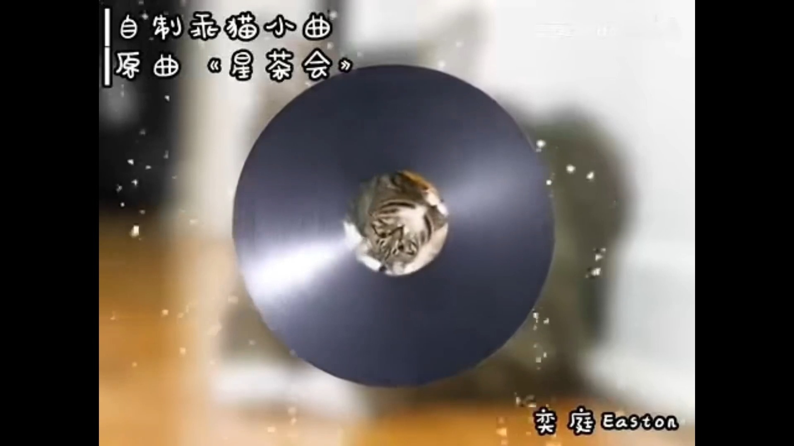 | 387 | 2025-10-30 |
| [（sora）来自哈基米的中式恐怖，包含跑操，早读，炫耀---笑不出来了](https://www.bilibili.com/video/BV1ytyhB6EBs) |  | 205 | 2025-10-30 |
| [大狗想吃公家饭了。](https://www.bilibili.com/video/BV14syhBkE56) | 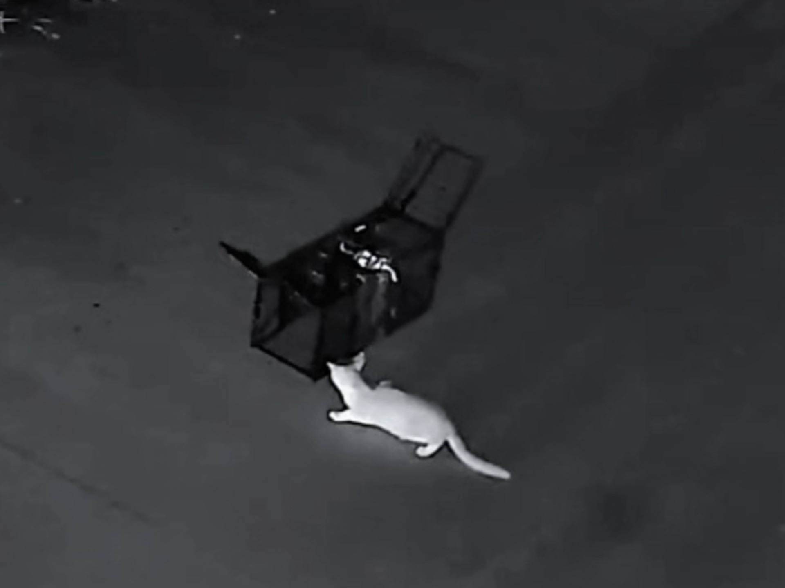 | 8059 | 2025-10-30 |
| [哈基米笑传之抢抢食](https://www.bilibili.com/video/BV1AUytB8EUn) |  | 1638 | 2025-10-30 |
| [[哈基米]Nick Of Time](https://www.bilibili.com/video/BV1D3ybBCEEv) |  | 1020 | 2025-10-30 |
| [小基米想当足球啦](https://www.bilibili.com/video/BV14nybBqE2g) | 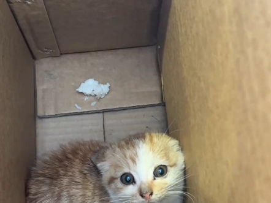 | 2310 | 2025-10-30 |
| [【哈基米】土耳基进行曲](https://www.bilibili.com/video/BV1B9yxB7Ew1) |  | 205 | 2025-10-29 |
| [哈基米/红楼梦-枉凝眉](https://www.bilibili.com/video/BV13HyWBaEQc) |  | 6515 | 2025-10-29 |
| [基米小学:重阳节耄耄来看望布拉布拉仙人](https://www.bilibili.com/video/BV1wryWBUEZU) | 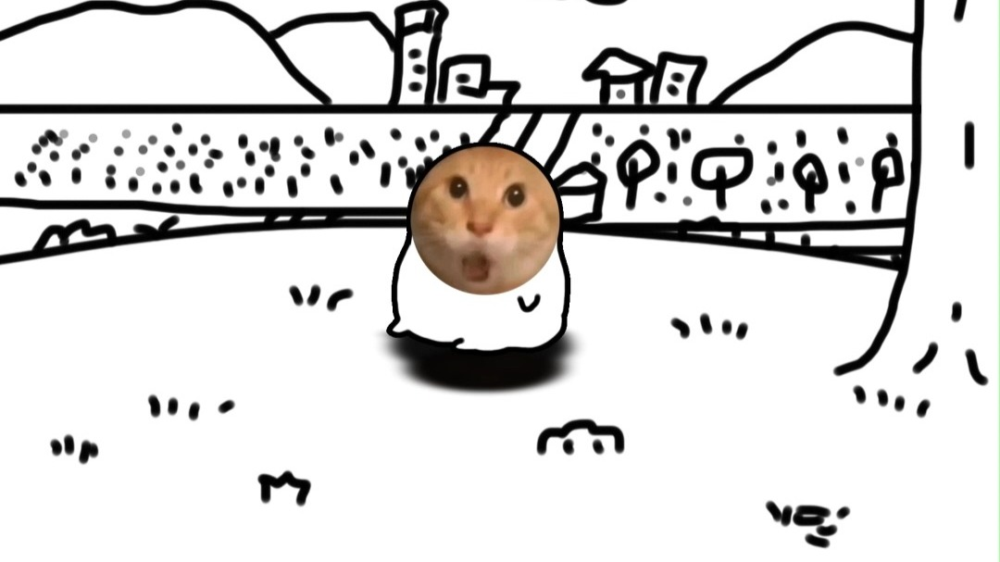 | 7.5万 | 2025-10-29 |
| [【哈基米音乐】Beautiful World](https://www.bilibili.com/video/BV1npysBSEzi) |  | 1111 | 2025-10-29 |
| [这种哈基米迟早被踩死，不过无所谓，我已经给它施加潮汕魔法，它再也长不大了](https://www.bilibili.com/video/BV1fUy2B3ES4) | 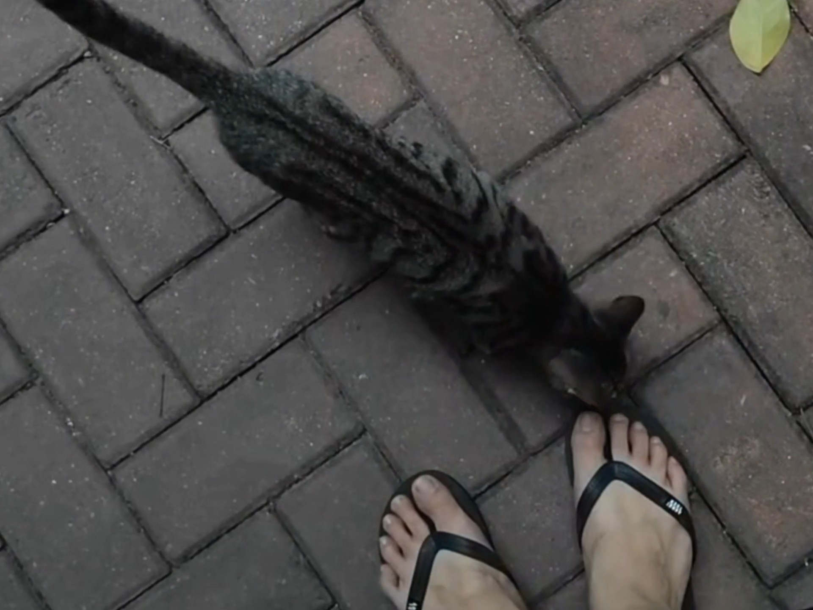 | 2.2万 | 2025-10-29 |
| [【纯净流哈基米】蛋笨个两](https://www.bilibili.com/video/BV1cmyUBDEmT) |  | 1028 | 2025-10-29 |
| [哈基米常有，但不常在！](https://www.bilibili.com/video/BV1f9yUB1ESf) |  | 5010 | 2025-10-29 |
| [连续听3小时哈基米](https://www.bilibili.com/video/BV1kEyCBNEEf) | 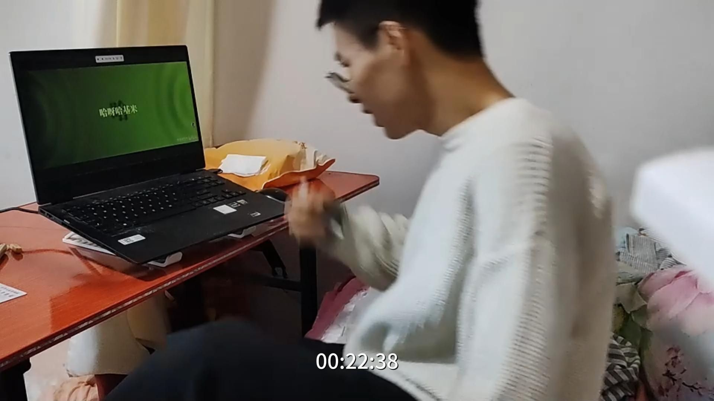 | 22 | 2025-10-29 |
| [基米小镇番外：耄耋的许愿](https://www.bilibili.com/video/BV1UdyBBeEQs) |  | 6583 | 2025-10-29 |
| [nameruto为何空耳是“南北绿豆”？【哈基米语音学】](https://www.bilibili.com/video/BV11HySB4Ebs) |  | 5.3万 | 2025-10-29 |
| [【赛马娘】以防你不知道帝宝会在新剧本live里兴奋的喊两声哈基米🐝🍹](https://www.bilibili.com/video/BV1AWymBEEG5) |  | 5961 | 2025-10-29 |
| [要论杀虫这方面，您还是太权威了。#哈基米 #猫咪 #离谱](https://www.bilibili.com/video/BV1a2ymBaE1v) | 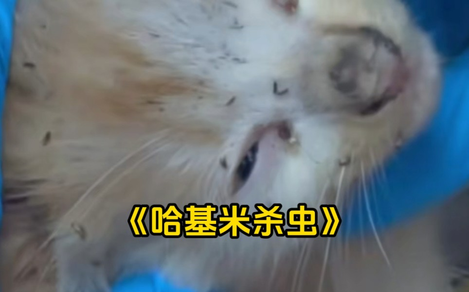 | 3.9万 | 2025-10-29 |
| [【打火机】｜“哈基米呀南北绿豆哈呀库那路”【哈基米】](https://www.bilibili.com/video/BV1zJyCBeE9d) |  | 89 | 2025-10-29 |
| [浮力基](https://www.bilibili.com/video/BV1a8yzB3EyD) |  | 3.2万 | 2025-10-28 |
| [其实马儿也是调皮搞怪的动物，脑子比哈基米机灵多了](https://www.bilibili.com/video/BV1dtsSzCEc1) |  | 8882 | 2025-10-27 |
| [《母基卡3》经典回顾之哈气旋转术](https://www.bilibili.com/video/BV1rkxPzhEpF) | 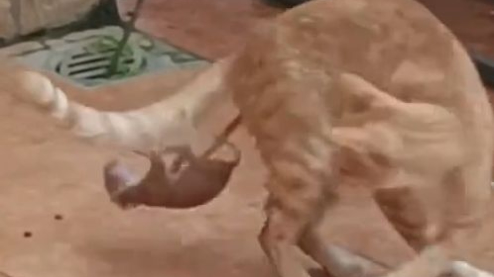 | 6468 | 2025-10-26 |
| [🐱本 草 哈 目🐱](https://www.bilibili.com/video/BV1CnsHz1EQK) |  | 2.4万 | 2025-10-24 |
| [澳洲灭猫大战：空投毒香肠，自动杀猫机，计划灭猫200万只](https://www.bilibili.com/video/BV1234y1i7z4) | 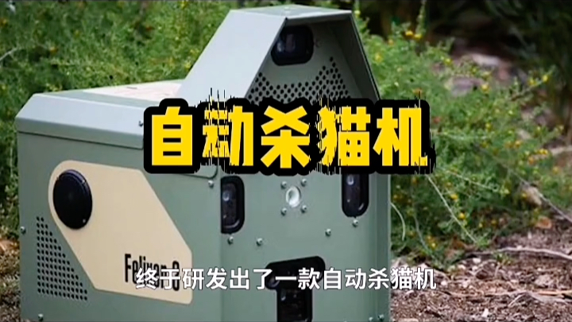 | 24.6万 | 2022-01-18 |

---
*最后更新: 2025-10-31 02:39:35 (自动生成)*
*数据来源: [Bilibili](https://www.bilibili.com)*

## 使用说明

运行以下命令更新视频列表:
```bash
python3 fetch_hajimi_videos.py
```
