# awesome-hajimi
collections of hajimi (哈基米 in Chinese) on the Internet.

## 视频列表 (Video List)

| 视频标题 (Title) | 封面 | 播放量 (Views) | 发布日期 (Date) |
|---|---|---|---|
| [【自制动画】寒假工送外卖 逆天版！这寒假工有力气！](https://www.bilibili.com/video/BV1wK6cBzEem) |  | 3039 | 2026-01-30 |
| [哈基米这个偷吃被抓，哈基米偷吃失败败方MVP结算画面](https://www.bilibili.com/video/BV1gt6cBsErC) | 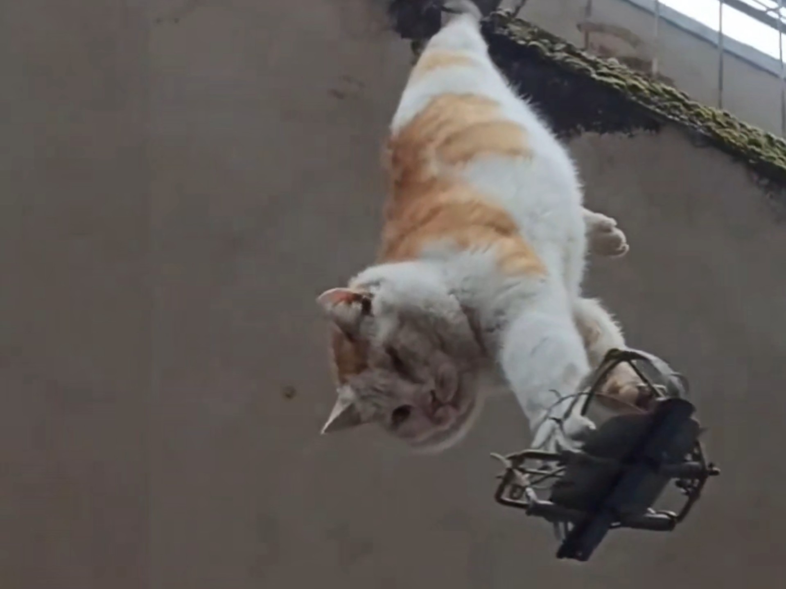 | 1318 | 2026-01-29 |
| [哈基米半截入土了,风光大葬还立了哈基碑](https://www.bilibili.com/video/BV1Sz6NBaE9G) | 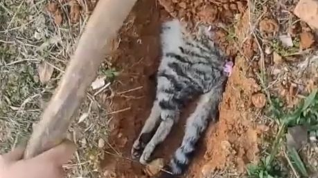 | 830 | 2026-01-29 |
| [【嘉明 翻跳】功夫人耋之十年哈气！](https://www.bilibili.com/video/BV1Ur6NBcEjb) |  | 1394 | 2026-01-29 |
| [哈基米回家开储物室银卡房会出些什么呢](https://www.bilibili.com/video/BV1PA6ABJEzS) | 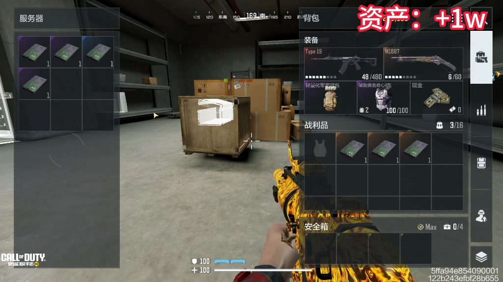 | 659 | 2026-01-29 |
| [哈基米被对面车撞飞到我车上，屎都被撞出来了](https://www.bilibili.com/video/BV1rm6cB6Ezx) | 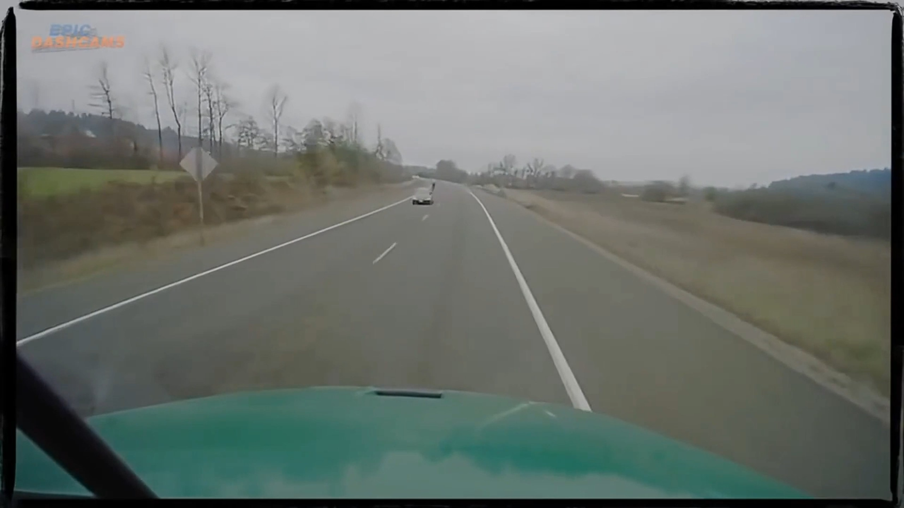 | 1.5万 | 2026-01-29 |
| [哈基米哈基米，依舊封面對不上視頻，使命召喚，增加新人員](https://www.bilibili.com/video/BV1Qt6cBWEcu) |  | 8 | 2026-01-29 |
| [【哈基米音乐】SOS](https://www.bilibili.com/video/BV1dF6wBaEnN) |  | 627 | 2026-01-29 |
| [哈基米界的三大魔丸，每一只都让你耄耋胆寒！](https://www.bilibili.com/video/BV1eK6wBtEPj) | 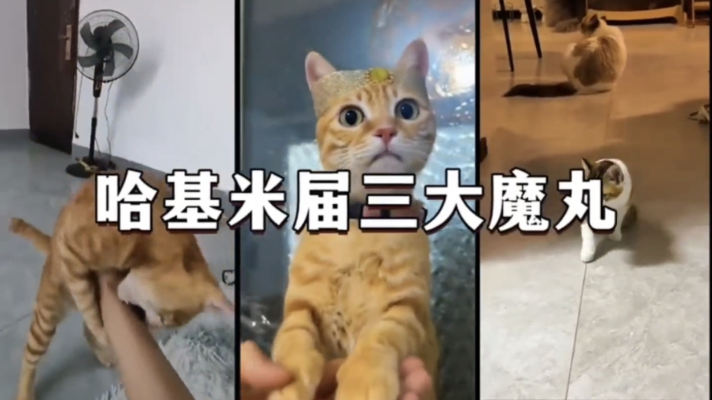 | 1039 | 2026-01-29 |
| [“笨蛋哈基米”](https://www.bilibili.com/video/BV11C6cBVELY) | 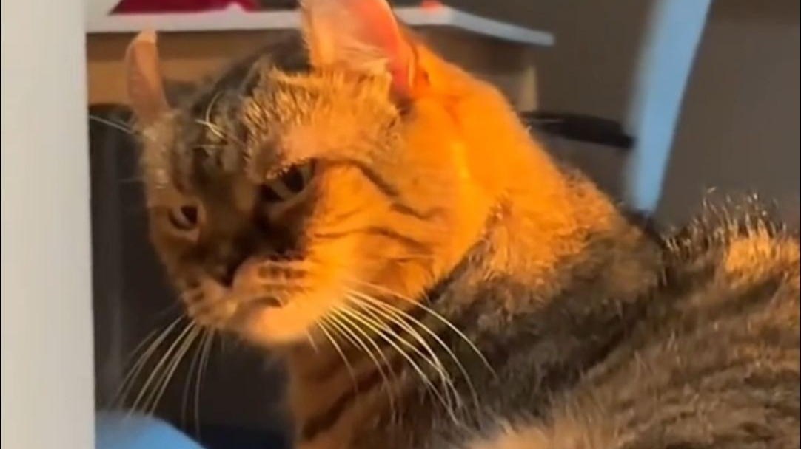 | 1444 | 2026-01-29 |
| [【基米TV】聪明的猎手往往以猎物的姿态出现](https://www.bilibili.com/video/BV1Ry6wBaEGM) | 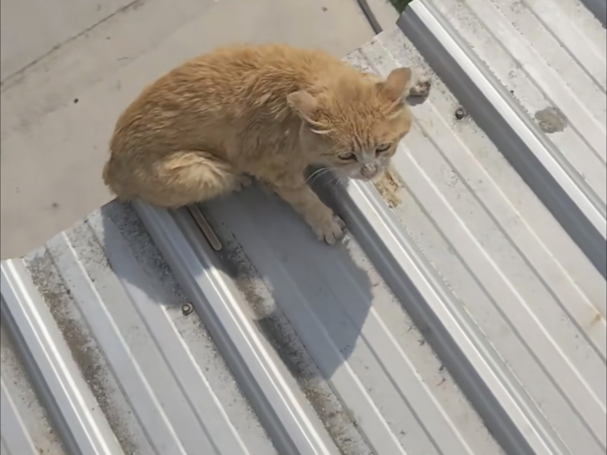 | 2483 | 2026-01-29 |
| [飞咬基米](https://www.bilibili.com/video/BV1u96wBxE77) | 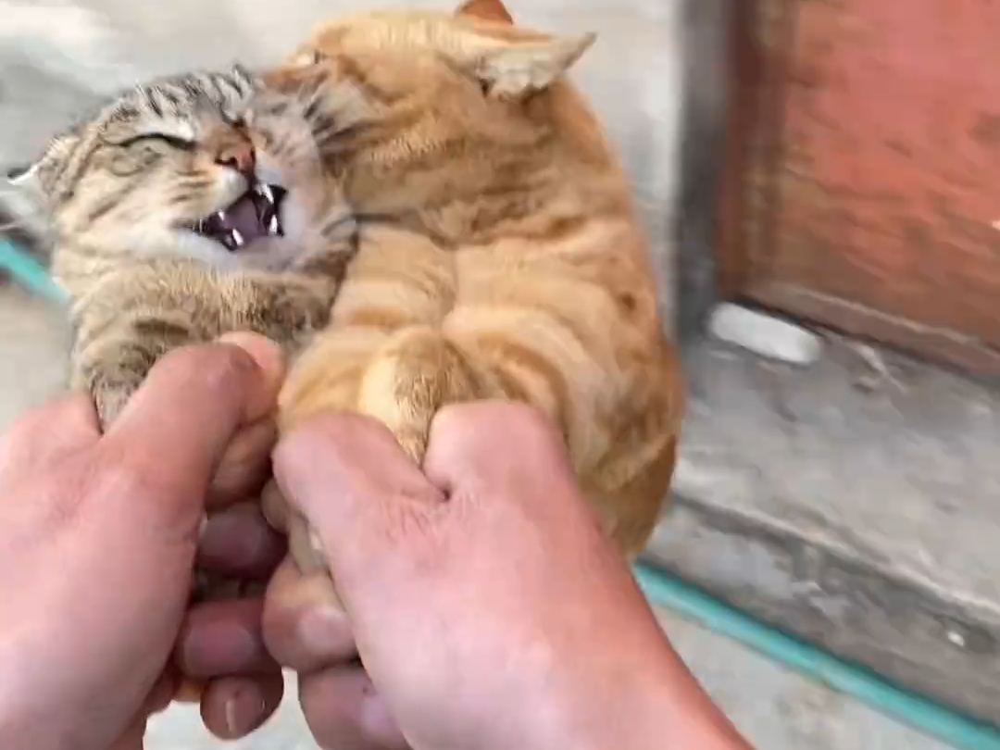 | 8445 | 2026-01-29 |
| [泰迪与哈基米的恩怨情仇](https://www.bilibili.com/video/BV1Zq6wBTEKZ) |  | 1874 | 2026-01-29 |
| [美洲杀人最多的哈基米](https://www.bilibili.com/video/BV1ELzQBrEw3) |  | 3348 | 2026-01-29 |
| [当哈基米豆浆做了个噩梦···](https://www.bilibili.com/video/BV1P5zYB8E5F) | 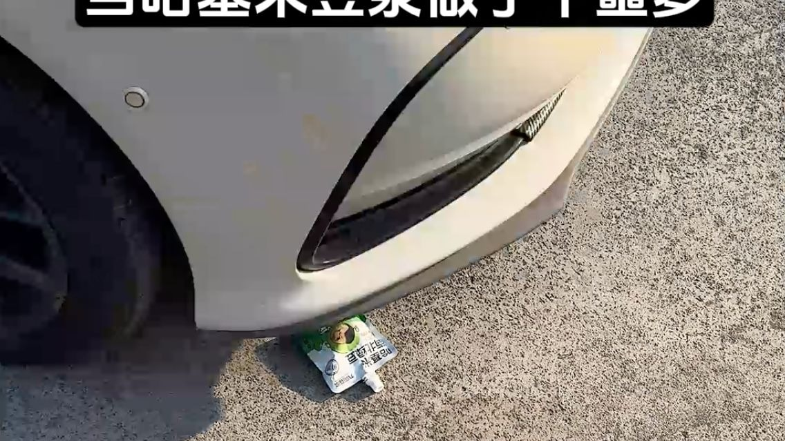 | 1779 | 2026-01-29 |
| [谁懂猫语？](https://www.bilibili.com/video/BV16UzfBwE3X) | 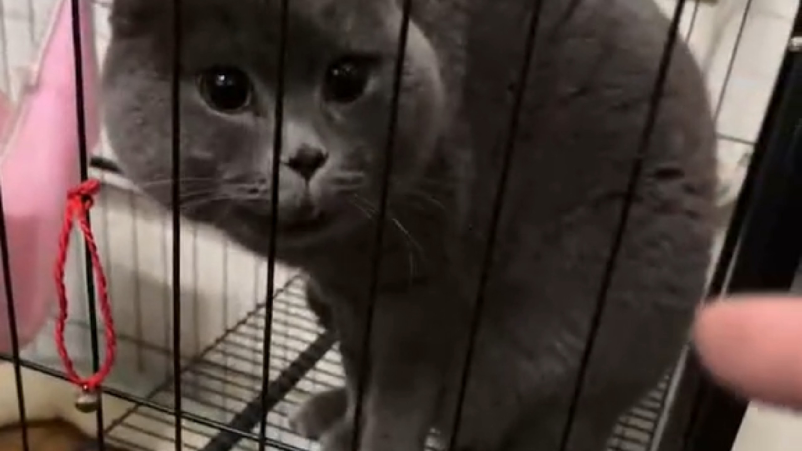 | 1677 | 2026-01-29 |
| [🐱哈基米音乐，如此美妙🐱](https://www.bilibili.com/video/BV17i6FBFEBq) | 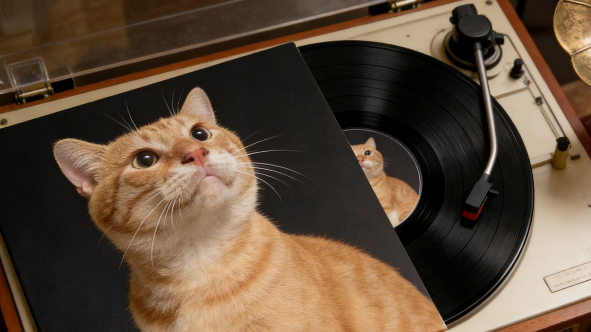 | 2.9万 | 2026-01-29 |
| [有没有懂猫语的看一下](https://www.bilibili.com/video/BV1ps6FBqEPr) |  | 3911 | 2026-01-29 |
| [咪無語《死一樣的哈過》](https://www.bilibili.com/video/BV1G26FBpEyU) | 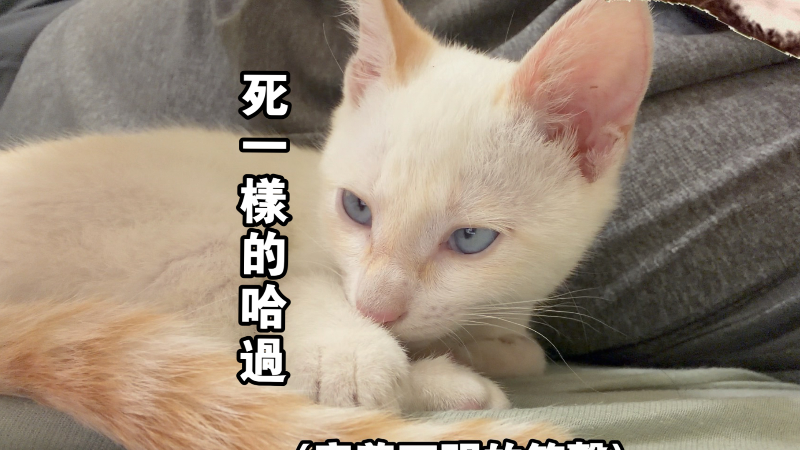 | 21 | 2026-01-29 |
| [【爱画卡片的哈基米】我的最新作品，快来一睹为快！](https://www.bilibili.com/video/BV1wK6cBzEYq) |  | 0 | 2026-01-29 |
| [我最喜欢看到吃了物资短缺的哈基米连队和剑兵团喽～](https://www.bilibili.com/video/BV1pJzZBAEds) |  | 1922 | 2026-01-29 |
| [哈基米一败涂地！](https://www.bilibili.com/video/BV1hwzZByExG) |  | 2394 | 2026-01-29 |
| [哈基米应该是打过电话的](https://www.bilibili.com/video/BV14gzZBuE3g) | 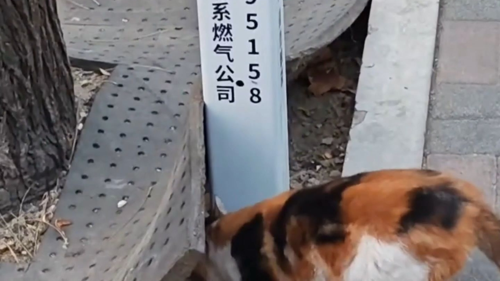 | 3607 | 2026-01-29 |
| [63分钟沉浸式听歌｜精选版音乐合集｜哈基米神曲｜全网爆火#哈基米#神人音乐#热门音乐#音乐盘点#治愈系音乐](https://www.bilibili.com/video/BV1hkzZB7Ex8) |  | 93 | 2026-01-29 |
| [哈基米燃尽了 王中王救一下](https://www.bilibili.com/video/BV1MSzZBkEeQ) | 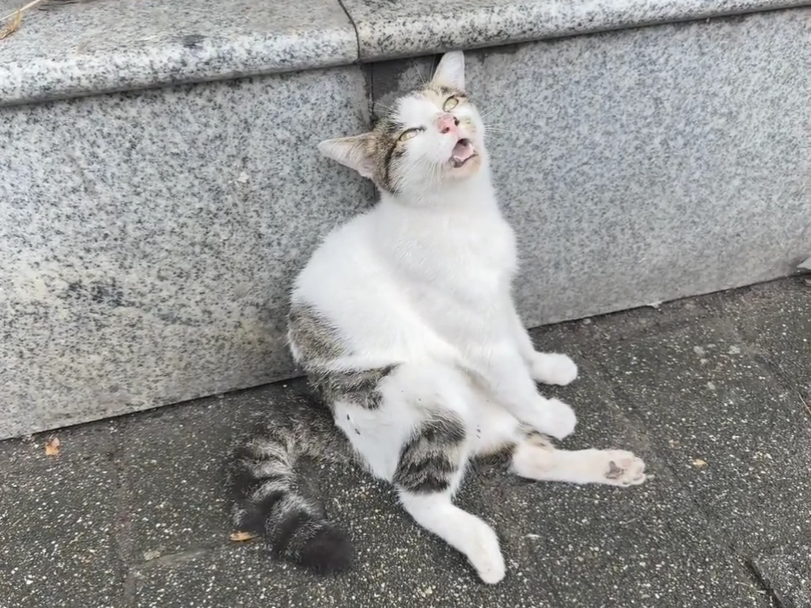 | 1.0万 | 2026-01-29 |
| [猫猫沉浸式做饭来喽~今天是橘小厨!今天做恰巴塔，喝的是哈基米南北红豆浆，还有什么想看猫猫做的吃的吗?](https://www.bilibili.com/video/BV1iezZBXEMG) | 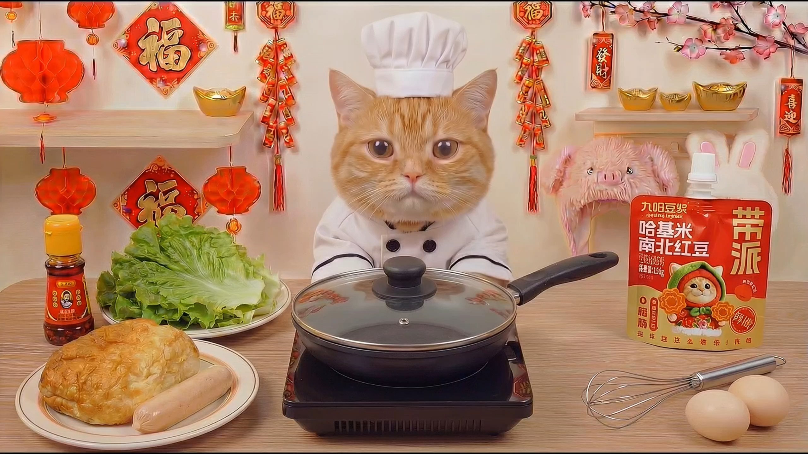 | 1321 | 2026-01-29 |
| [老大是混的喵](https://www.bilibili.com/video/BV1oGzfBdEMw) | 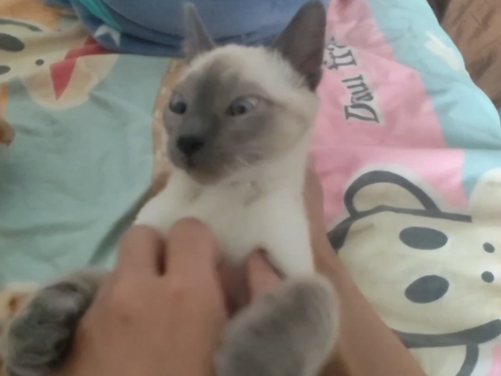 | 4.8万 | 2026-01-29 |
| [愤 怒 的 基 米 🎵](https://www.bilibili.com/video/BV1UK6EBaEAB) |  | 4.9万 | 2026-01-29 |
| [哈基米鸽鸽摇](https://www.bilibili.com/video/BV1UjzXBfEqz) | 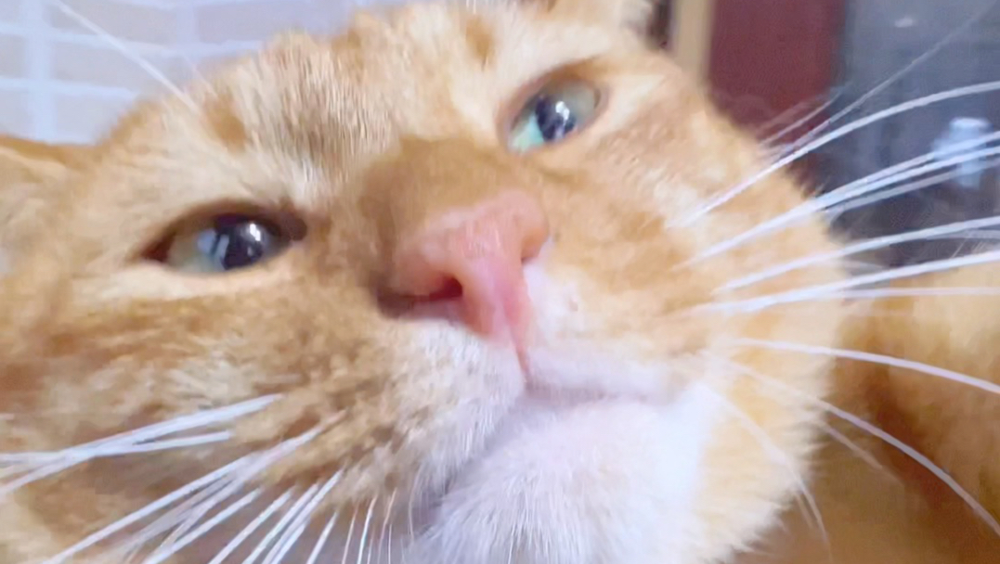 | 4490 | 2026-01-29 |
| [跳楼基](https://www.bilibili.com/video/BV1mhzfBCEwH) | 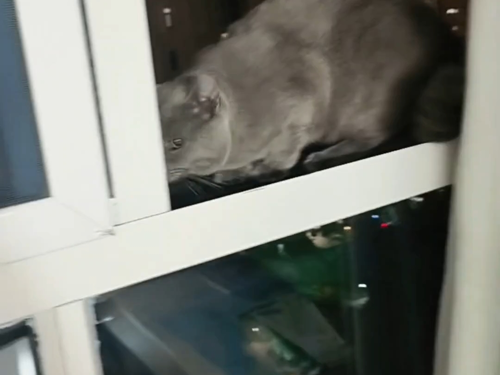 | 4.1万 | 2026-01-29 |
| [农村大妈古法阉割哈基米](https://www.bilibili.com/video/BV12ezfBrEGw) |  | 19.7万 | 2026-01-29 |
| [哈基米偷鸭子吃被抓住了还在那里哈气](https://www.bilibili.com/video/BV1XHzfBSEsV) | 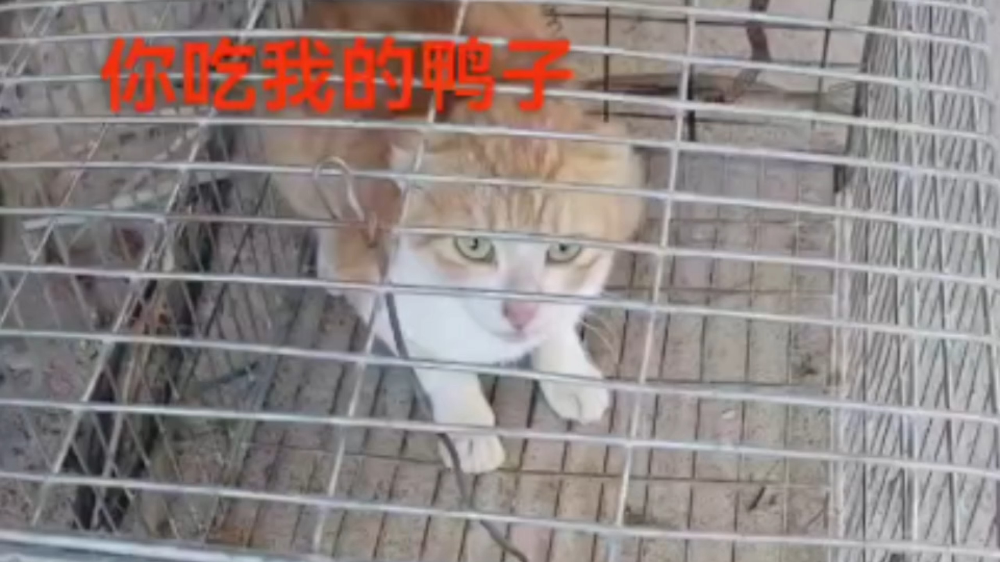 | 1412 | 2026-01-29 |
| [哈基米成为了猫一杯了](https://www.bilibili.com/video/BV1VHzfBDELp) | 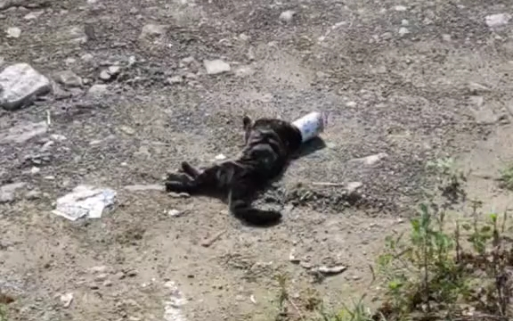 | 7495 | 2026-01-29 |
| [哈基咪饿了 上街美美打猎成功](https://www.bilibili.com/video/BV1LYzdB1EKz) | 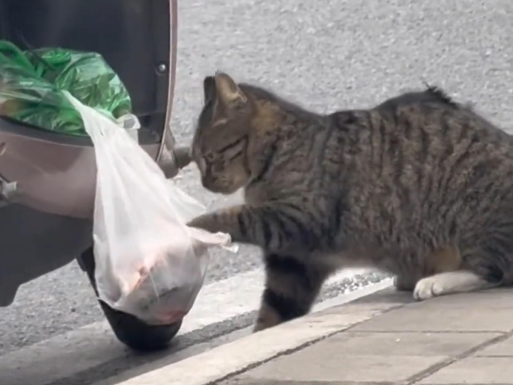 | 485 | 2026-01-29 |
| [【红色哈基米】面对哈基米黑鸟直接选择关住折磨](https://www.bilibili.com/video/BV1MPzdBiEZc) |  | 1175 | 2026-01-28 |
| [狼狼的哈基米～（想要交朋友！）](https://www.bilibili.com/video/BV1kazXBUEDt) |  | 1476 | 2026-01-28 |
| [哈基米在好人的帮助下，成功植入了魔丸，并从坛中解救了出来。](https://www.bilibili.com/video/BV1rezXB7ETU) |  | 2.0万 | 2026-01-28 |
| [专辑《依如哈气》😸 哈 哈 基 基 米 米 😸 原曲：6 6 C C F F](https://www.bilibili.com/video/BV1Mrz9BaE4S) |  | 997 | 2026-01-28 |
| [小猫碰瓷还拖家带口的](https://www.bilibili.com/video/BV17sz9BVEYW) | 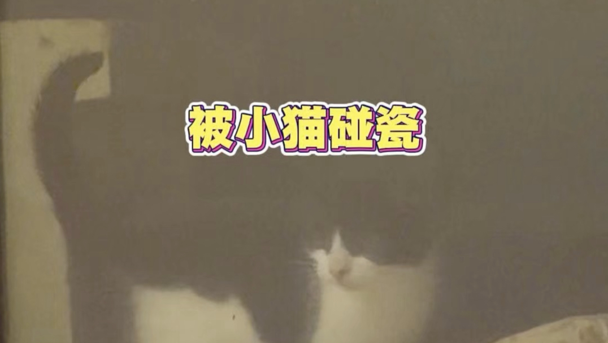 | 104.7万 | 2026-01-28 |
| [哈基米小小年纪就掌握了连续哈气的诀窍](https://www.bilibili.com/video/BV1Vo67BzETb) | 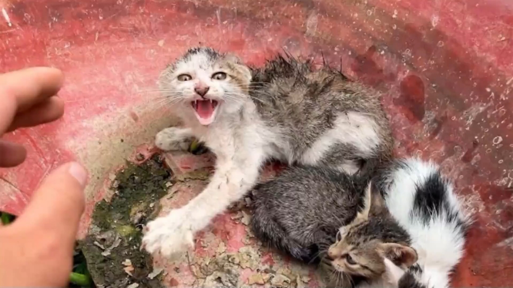 | 9224 | 2026-01-28 |
| [【滚动的天空】1条命完美通关46个共创（哈基米主题版本）](https://www.bilibili.com/video/BV1HB67BQEpd) |  | 1290 | 2026-01-28 |
| [开源！AI曼波小狗_小智AI宠物机器狗の哈基米新年首秀！马年必养的智能赛博桌面机器人stm32 esp32-s3](https://www.bilibili.com/video/BV1a66EBuE8f) |  | 1664 | 2026-01-28 |
| [物资短缺和哈基米联队真是一对苦命鸳鸯啊！！](https://www.bilibili.com/video/BV1JD6gB8EK7) | 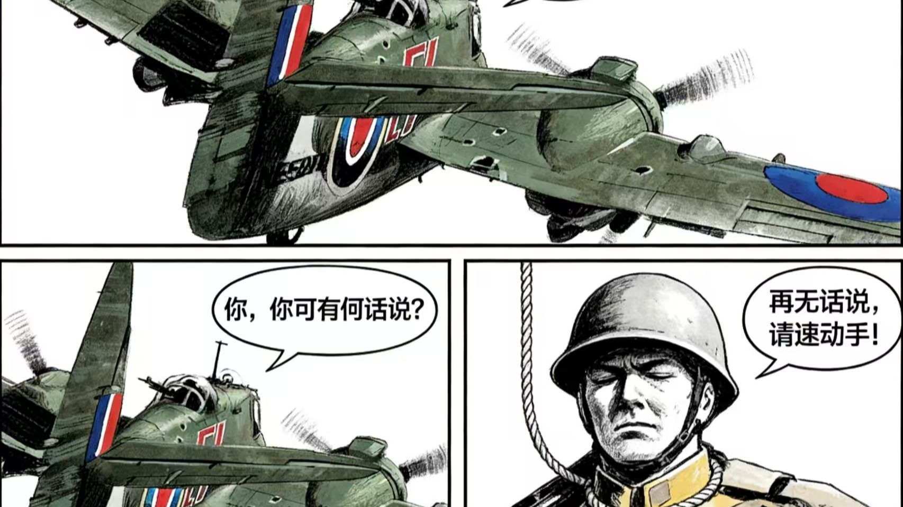 | 1.5万 | 2026-01-28 |
| [【Furry/Meme】哈基米awa](https://www.bilibili.com/video/BV1WX6jBpEvE) |  | 2202 | 2026-01-28 |
| [捆绑基](https://www.bilibili.com/video/BV1kq67BpELv) | 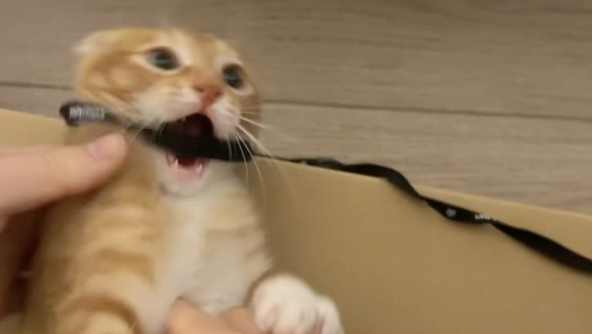 | 1.5万 | 2026-01-28 |
| [你这家伙在说什么](https://www.bilibili.com/video/BV1cB67BQEWT) | 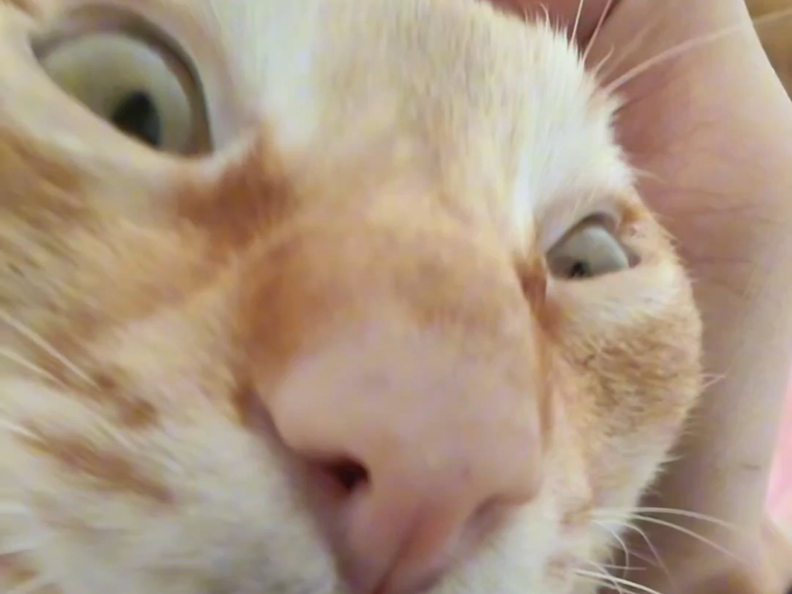 | 9.4万 | 2026-01-28 |
| [AXX中单黑鸟，7分钟单杀红色哈基米3次！赛后枫哥：被der妖精单杀很丢人吗？【5v5对黑】](https://www.bilibili.com/video/BV1mZ6VBHEjM) |  | 2.7万 | 2026-01-27 |
| [千语樱🌸🐉](https://www.bilibili.com/video/BV1a86GBQEc8) |  | 149.2万 | 2026-01-27 |
| [去龟教家逗哈基米](https://www.bilibili.com/video/BV1Dy6uByE7Z) | 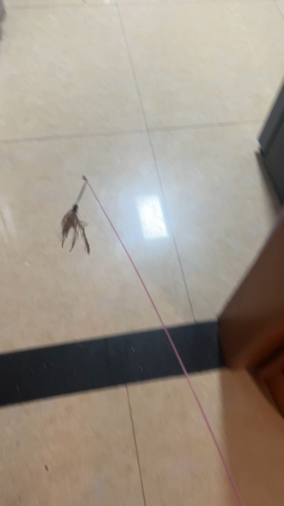 | 12.8万 | 2026-01-27 |
| [火爆曲！典狱长进行曲(压迫感版+哈基米版）“三角洲行动”4K+Hi-Res](https://www.bilibili.com/video/BV1vj6gBXECX) |  | 1174 | 2026-01-27 |
| [真的没有人觉得耄耋很可爱吗？](https://www.bilibili.com/video/BV1Co6uBiEfe) | 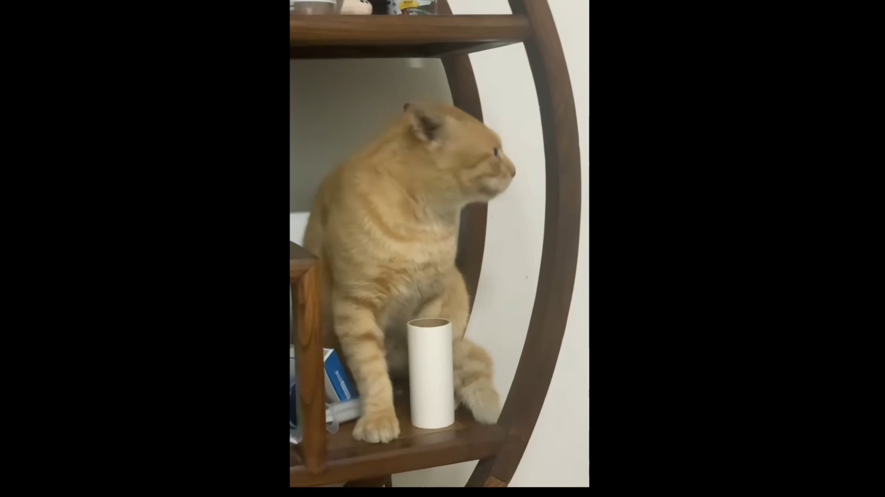 | 5279 | 2026-01-27 |
| [哈基米车祸警示录](https://www.bilibili.com/video/BV1th6gBVE5K) | 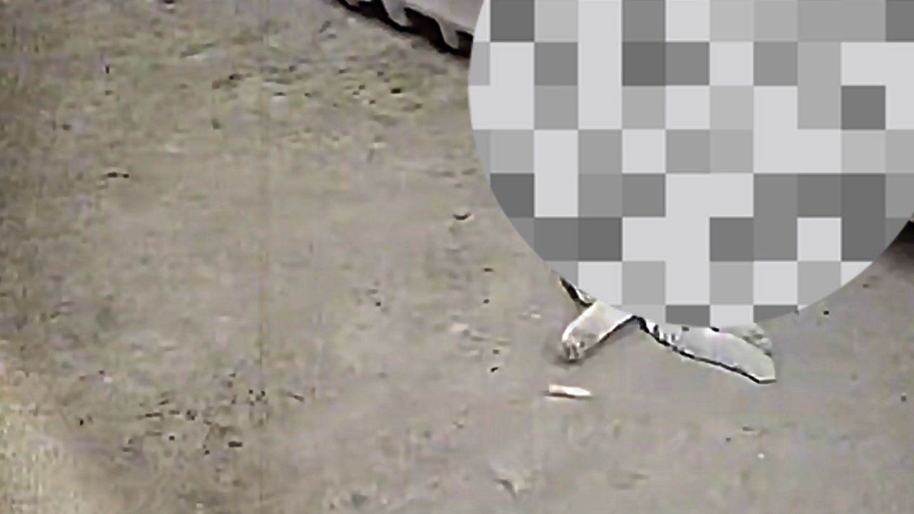 | 1.4万 | 2026-01-27 |
| [绝望的哈基米与大狗大狗叫叫叫](https://www.bilibili.com/video/BV1Gc63BXERo) | 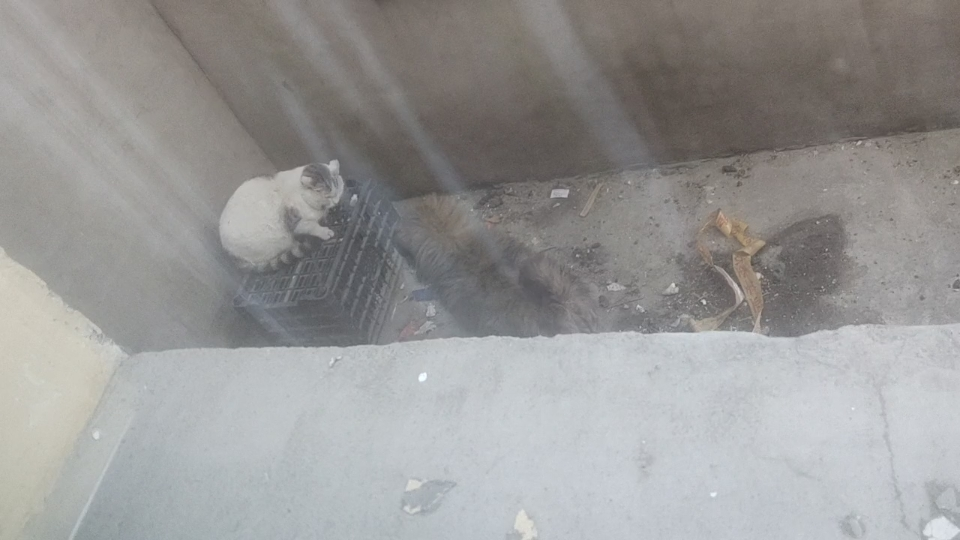 | 1585 | 2026-01-27 |
| [哈基米在好心人的帮助下，去掉了魔丸😭](https://www.bilibili.com/video/BV1kz6MBFEgu) |  | 2625 | 2026-01-27 |
| [哈基米偶遇宝箱怪，大狗坏趁机交交交](https://www.bilibili.com/video/BV1p66MBbEyy) | 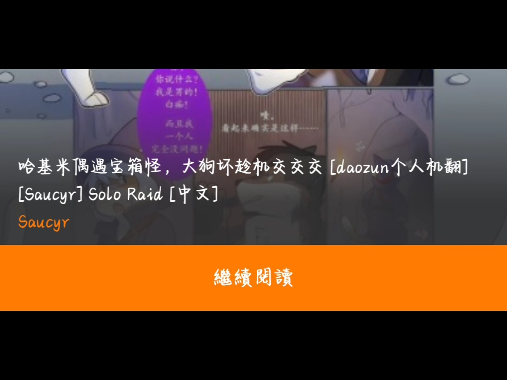 | 8869 | 2026-01-27 |
| [这组合有力气](https://www.bilibili.com/video/BV1s86KBtEPg) |  | 126.7万 | 2026-01-27 |
| [邪恶立粑拉](https://www.bilibili.com/video/BV1YV6KBuE9R) | 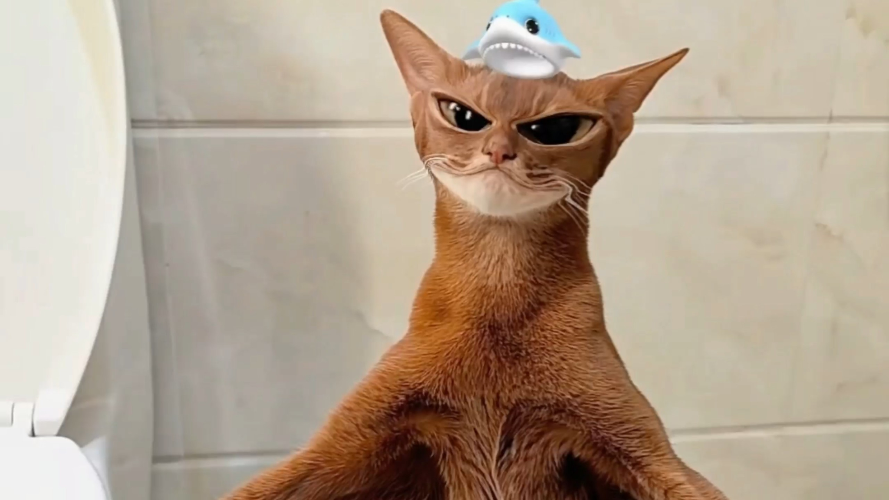 | 3.6万 | 2026-01-27 |
| [叮咚鸡：see you again](https://www.bilibili.com/video/BV17bzvBZELC) |  | 2695 | 2026-01-26 |
| [红色加黑色会变成……？](https://www.bilibili.com/video/BV16zzaBWE46) |  | 309.6万 | 2026-01-26 |
| [你不可以随便掀我的被被](https://www.bilibili.com/video/BV1EkzaBHEtM) | 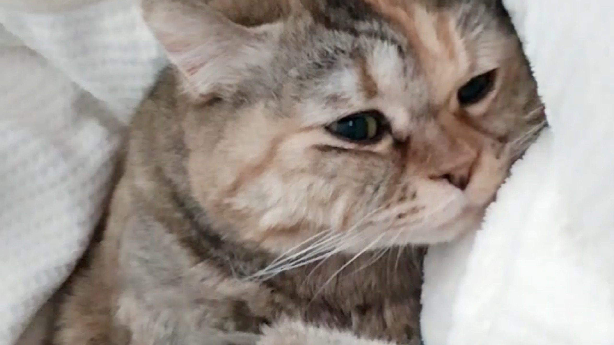 | 20.4万 | 2026-01-26 |
| [哈基米偷吃鸡被抓，后对的布鲁斯哈气](https://www.bilibili.com/video/BV1BczaBJESy) | 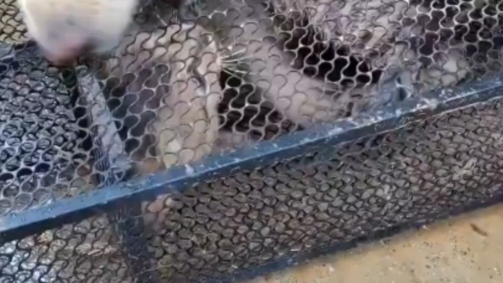 | 3742 | 2026-01-26 |
| [哈基米开F1 哈aaaaa！](https://www.bilibili.com/video/BV1sEzxBCE9K) | 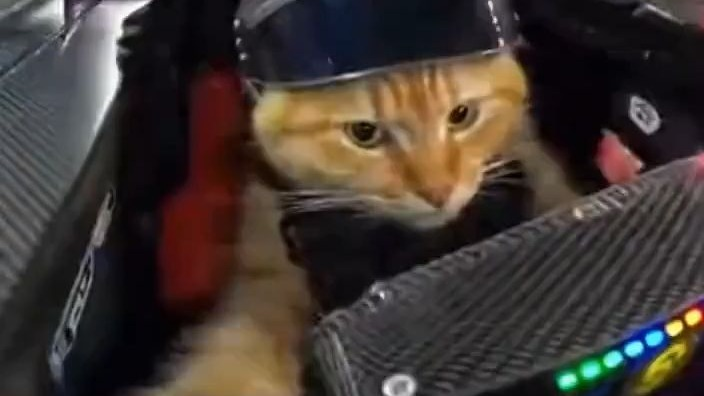 | 5132 | 2026-01-25 |
| [我家猫因为社恐上过央视……几年后历史又重演了](https://www.bilibili.com/video/BV15zzxBFEmB) | 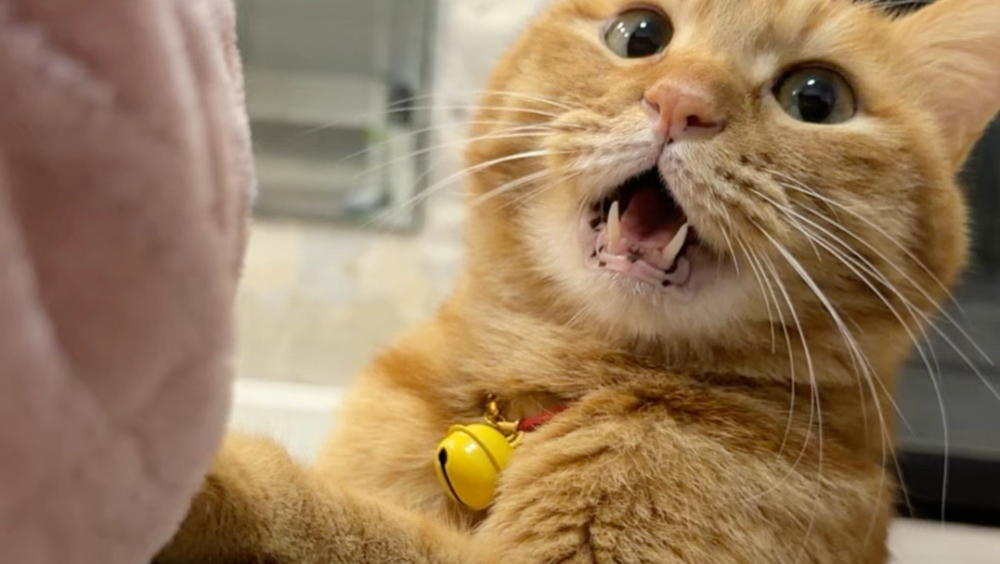 | 31.4万 | 2026-01-25 |
| [网友称买个电子捕鼠器，没想到没电到老鼠，却把家里养的哈基米电死了，这该找厂家吗？](https://www.bilibili.com/video/BV1aYzkBMEcz) | 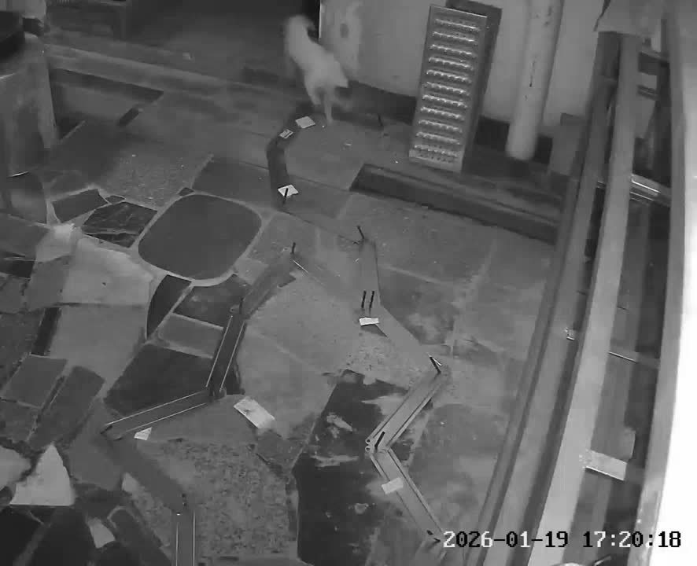 | 23.2万 | 2026-01-24 |
| [猫：“没有老鼠的时候我就是老鼠”](https://www.bilibili.com/video/BV1wezCB4EGt) |  | 10.5万 | 2026-01-24 |
| [《开摇！近期全网爆火的DJ歌曲合集2.0！》](https://www.bilibili.com/video/BV1sszTBoEEL) |  | 158.3万 | 2026-01-24 |
| [哈基米对着插孔尿尿电到迪奥了](https://www.bilibili.com/video/BV1PpzzBEEPW) | 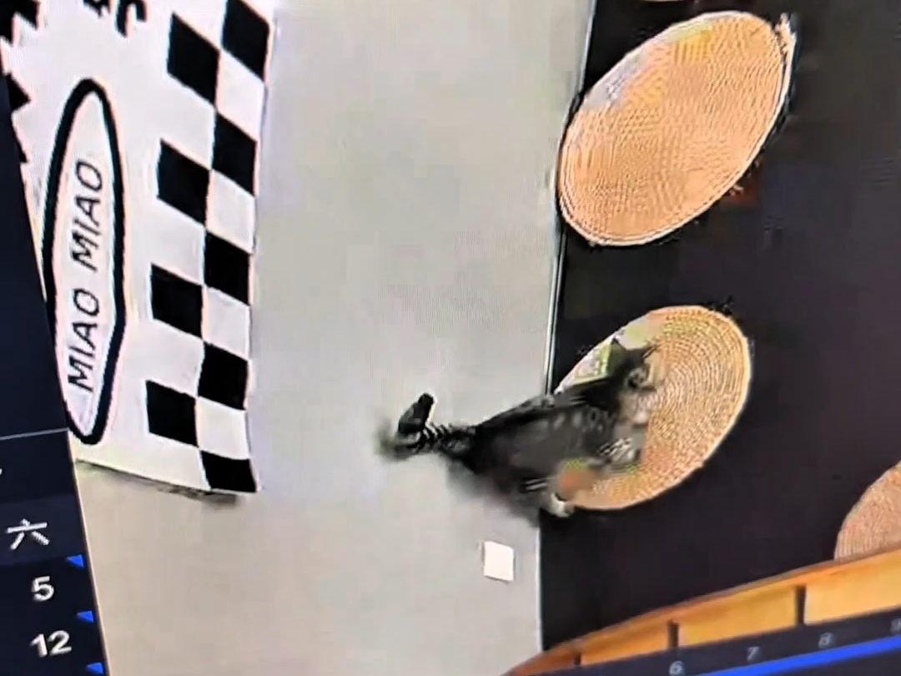 | 13.2万 | 2026-01-24 |
| [哈基哈基米，你被救了](https://www.bilibili.com/video/BV1hezMBzEK5) |  | 3.0万 | 2026-01-23 |
| [开门：捡个人](https://www.bilibili.com/video/BV1NJzNBpE17) | 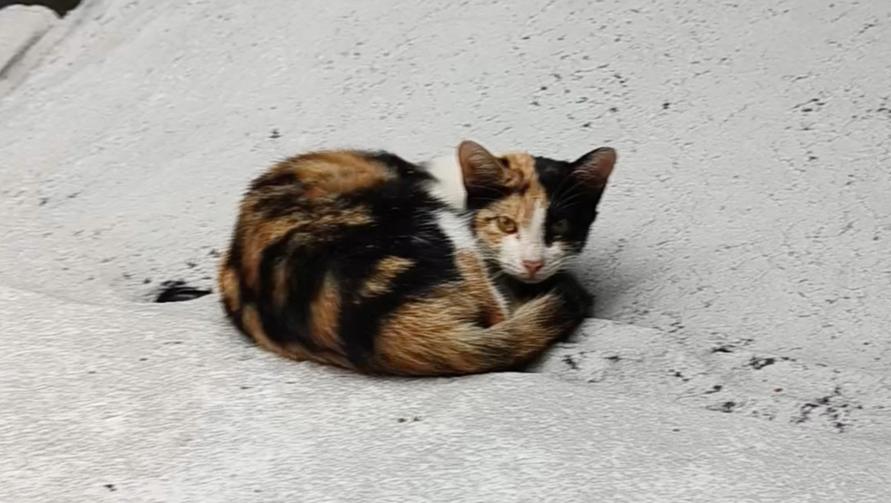 | 89.0万 | 2026-01-23 |
| [当网热度褪去后的全网网红小猫们!](https://www.bilibili.com/video/BV1bazKBAE1Z) | 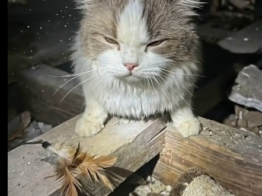 | 8.1万 | 2026-01-23 |
| [疯狂的“鸽”伦比娅](https://www.bilibili.com/video/BV1RBzABhEPB) |  | 86.9万 | 2026-01-23 |
| [如何速通地球online？](https://www.bilibili.com/video/BV1gfBZBkEtZ) | 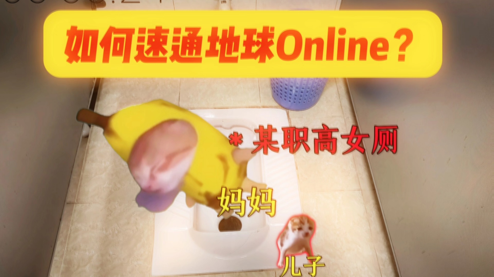 | 216.2万 | 2026-01-22 |
| [二次元孩子们力竭了](https://www.bilibili.com/video/BV1YUzjBwEAG) |  | 43.1万 | 2026-01-21 |
| [一小时热歌音乐合集（精选版）](https://www.bilibili.com/video/BV1DAkgBJEBt) | 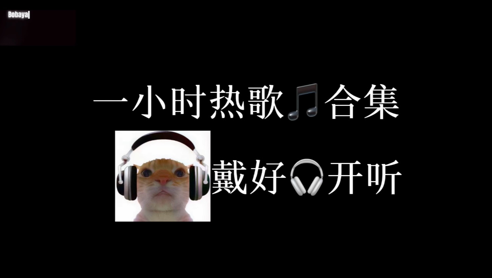 | 20.1万 | 2026-01-21 |
| [我们的故事，是从这一天开始](https://www.bilibili.com/video/BV1LVkuB9EE9) |  | 125.6万 | 2026-01-19 |
| [终于知道猫为什么讨厌狗了](https://www.bilibili.com/video/BV15GkaBXE5H) | 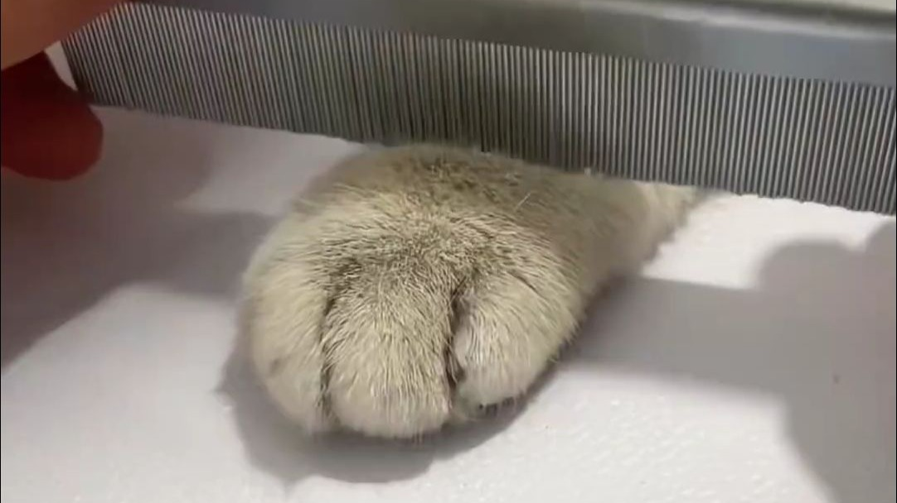 | 28.9万 | 2026-01-19 |
| [逮住一条没见过飞机的狗](https://www.bilibili.com/video/BV1kZkhBAEJM) |  | 84.9万 | 2026-01-19 |
| [包被遭遇了史上最大的背刺](https://www.bilibili.com/video/BV1EZk4B2Ey2) | 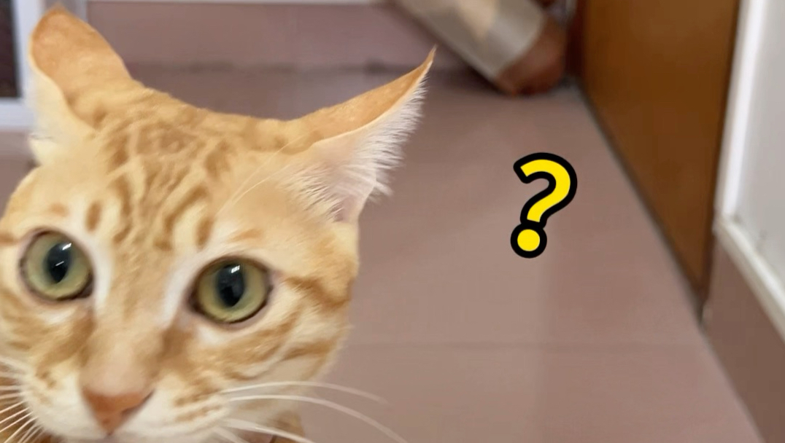 | 164.2万 | 2026-01-18 |
| [天啦噜，这猫还有救吗](https://www.bilibili.com/video/BV1wtkxBEEou) | 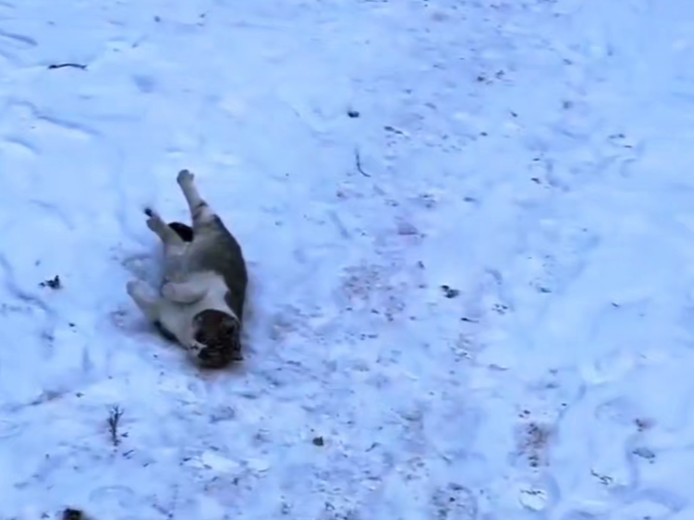 | 13.1万 | 2026-01-18 |
| [【4K120帧】请求查询干员精神状态 - Pigeon Pop](https://www.bilibili.com/video/BV1MMkHB1EzY) |  | 254.2万 | 2026-01-18 |
| [哈基米那没蛋喽](https://www.bilibili.com/video/BV1BQrUBTEcT) | 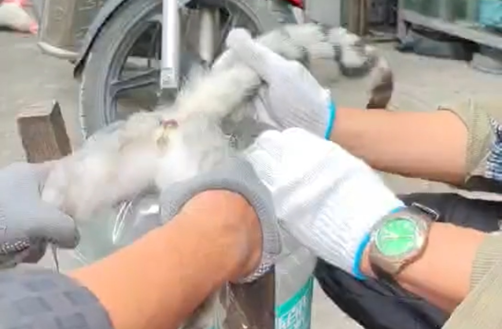 | 1.4万 | 2026-01-17 |
| [哈基咪这个贪玩 好玩的来咯](https://www.bilibili.com/video/BV1kmrrBdE1S) | 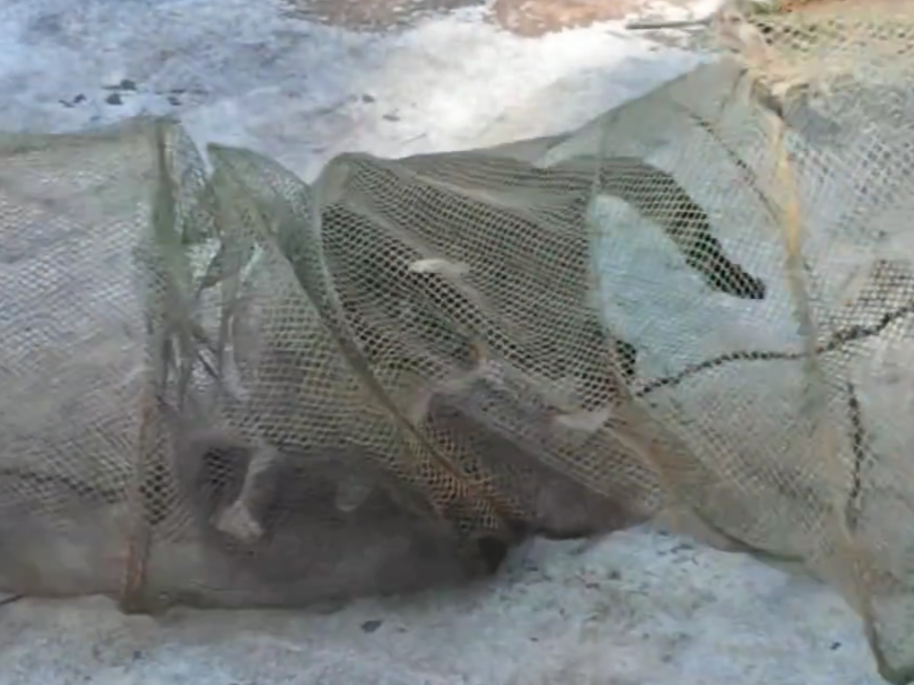 | 3507 | 2026-01-16 |
| [显卡TV旧传之小猫偷吃被教训](https://www.bilibili.com/video/BV1xHrkBYELt) |  | 1.1万 | 2026-01-16 |
| [无实物表演](https://www.bilibili.com/video/BV1ASkKBaEsJ) | 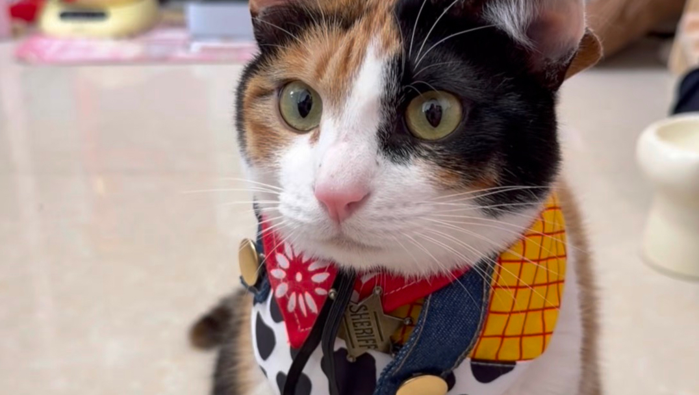 | 408.7万 | 2026-01-16 |
| [哈基米还是不要上太空为好……#太空哈基米 #猫咪上太空 #猫咪太空 #哈基米 #小鼻嘎](https://www.bilibili.com/video/BV1BhqwB8EK9) | 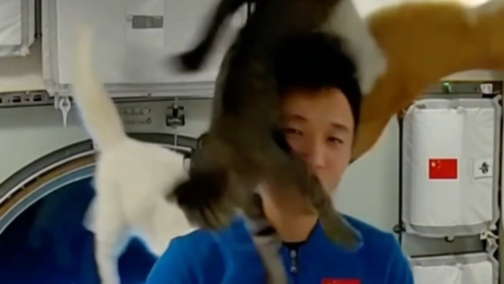 | 11.9万 | 2026-01-06 |
| [“40秒六个民族变装，好丝滑！”](https://www.bilibili.com/video/BV1F2i4BYEJZ) |  | 158.3万 | 2026-01-05 |
| [照EP ｜ Tiny Giant 舞蹈直拍](https://www.bilibili.com/video/BV1ATikBLE2B) |  | 150.6万 | 2026-01-04 |
| [救米反被基米哈](https://www.bilibili.com/video/BV1Lp39z4Eyy) | 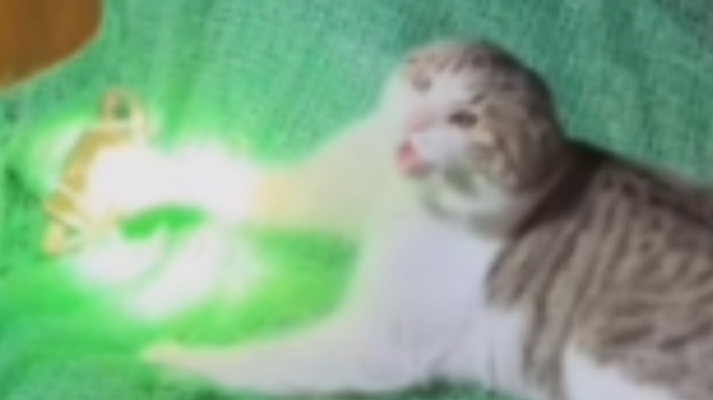 | 1.2万 | 2025-07-05 |
| [哈基米PHONK3.0《MURDER IN MY MIND》](https://www.bilibili.com/video/BV1NGvXeuEoR) |  | 78.0万 | 2024-08-03 |

---
*最后更新: 2026-01-30 03:36:21 (自动生成)*
*数据来源: [Bilibili](https://www.bilibili.com)*

## 使用说明

运行以下命令更新视频列表:
```bash
python3 fetch_hajimi_videos.py
```
