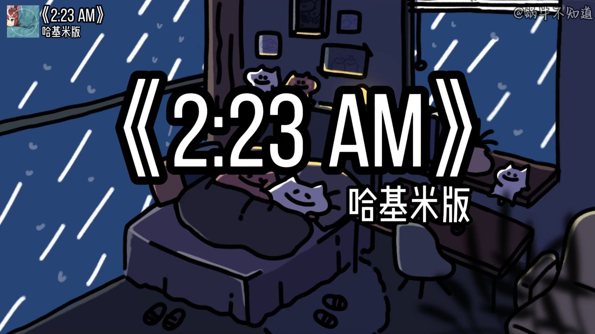
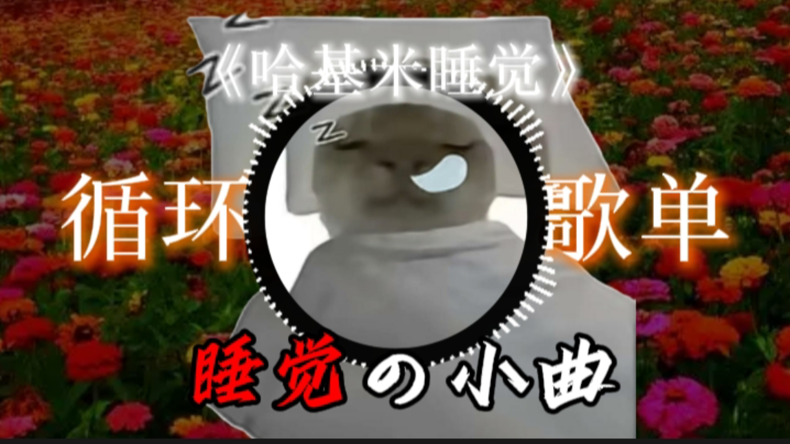
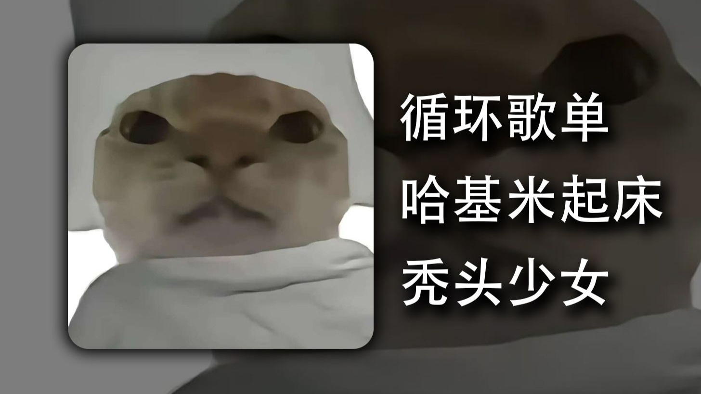
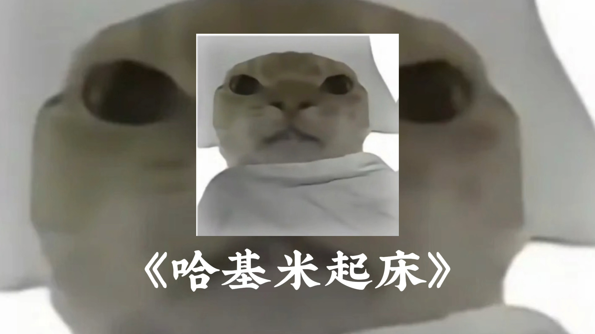
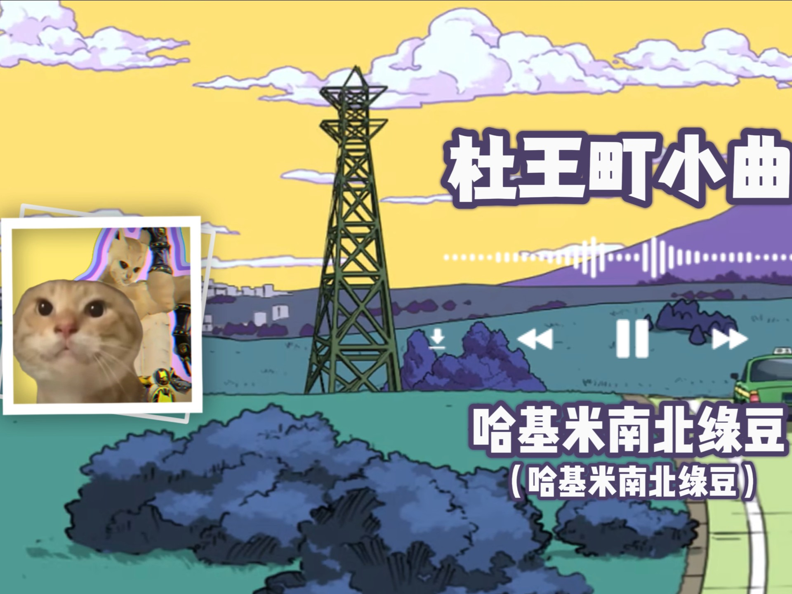
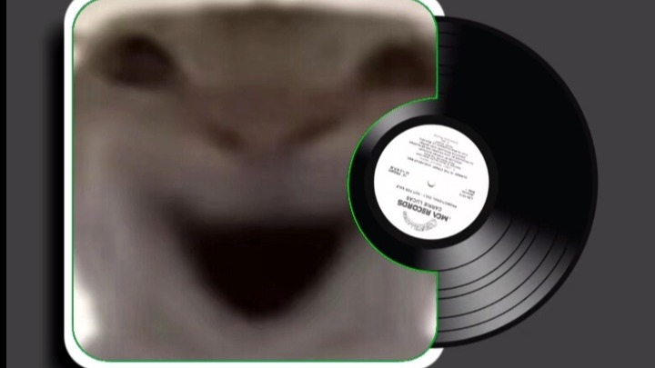
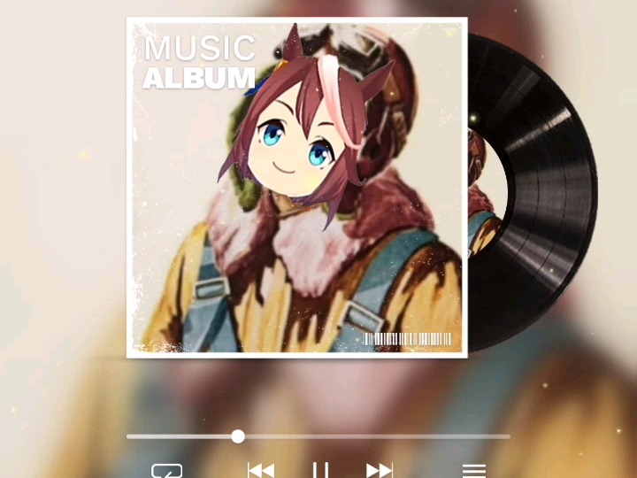

# awesome-hajimi
collections of hajimi (哈基米 in Chinese) on the Internet.

## 视频列表 (Video List)

| 视频标题 (Title) | 封面 | 播放量 (Views) | 发布日期 (Date) |
|---|---|---|---|
| [【哈基米音乐】 我的邻居哈基米](https://www.bilibili.com/video/BV1NRHdzzEwk) |  | 93 | 2025-09-10 |
| [哈基米：群基](https://www.bilibili.com/video/BV1wdH9zcEnQ) |  | 3786 | 2025-09-10 |
| [盘点点击率最高的哈基米音乐，没人能听完](https://www.bilibili.com/video/BV18QHUztENY) |  | 247 | 2025-09-10 |
| [锐评哈基米六大金曲，全听过的不用去学校了！](https://www.bilibili.com/video/BV1fyYPzyEYq) |  | 67.8万 | 2025-09-09 |
| [【哈基米音乐】青基](https://www.bilibili.com/video/BV1gFHyzmEh7) |  | 5.5万 | 2025-09-09 |
| [【哈基米】哈心超人（开心往前飞）](https://www.bilibili.com/video/BV13oHCzSEr3) |  | 754 | 2025-09-09 |
| [【哈基米】寄弥山歌（弥渡山歌）](https://www.bilibili.com/video/BV1qjafzbEQf) |  | 2.5万 | 2025-09-08 |
| [【哈基米音乐】可爱の小曲(你一定没听过也没刷到过的音乐）](https://www.bilibili.com/video/BV125adzAERj) |  | 1.3万 | 2025-09-08 |
| [哈基米 这个找朋友](https://www.bilibili.com/video/BV1Z1YLzkEHW) |  | 3.8万 | 2025-09-07 |
| [【哈基米音乐】⚡️难得哈基米⚡️（纯净版）](https://www.bilibili.com/video/BV1MAY5zWEPS) |  | 19.7万 | 2025-09-07 |
| [哈基米怀旧小卖部](https://www.bilibili.com/video/BV12TY5zSEeg) |  | 59.1万 | 2025-09-07 |
| [哈基米这个甜蜜【纯净哈基米】](https://www.bilibili.com/video/BV1cHaYzFEya) |  | 10.5万 | 2025-09-06 |
| [【哈基phonk】阿西噶的曼波哈基米（阿里山的姑娘）](https://www.bilibili.com/video/BV1Vqahz3Ec4) |  | 22.8万 | 2025-09-05 |
| [哈基米：save hachimi](https://www.bilibili.com/video/BV1JKaazHEpZ) |  | 1932 | 2025-09-05 |
| [【循环歌曲】《2:23 AM》“哈基米的夜晚”（无损音质）](https://www.bilibili.com/video/BV1ktaUzgEhQ) |  | 20.0万 | 2025-09-05 |
| [【精选推荐】《2:23 AM》“哈基米的夜晚”（无损音质）](https://www.bilibili.com/video/BV16aaUzqEJE) |  | 3200 | 2025-09-05 |
| [婉约哈基米  猪猪侠片头曲基基爆](https://www.bilibili.com/video/BV1N6a1zvE2c) |  | 2.1万 | 2025-09-04 |
| [【哈基米音乐官方专辑 第三弹】你一定听过我们做的哈基米，但你可能还没有点关注](https://www.bilibili.com/video/BV1Yaa6zvE22) |  | 7447 | 2025-09-04 |
| [盘点爆火的6首哈基米音乐！虽然只有几句词，全民制作人却没有瓶颈期！](https://www.bilibili.com/video/BV1GNaAzbE95) |  | 62.3万 | 2025-09-02 |
| [【8月】哈基米音乐排行榜#11](https://www.bilibili.com/video/BV1gDaWzEEtL) |  | 27.8万 | 2025-09-01 |
| [【哈基米音乐】基米说（伯虎说停顿卡点&amp;完整版）](https://www.bilibili.com/video/BV1sdaHzTEe7) |  | 139.1万 | 2025-09-01 |
| [【循环歌单】丨《哈基米睡觉》丨“《睡觉の小曲》《哈基米睡觉の小曲》”](https://www.bilibili.com/video/BV1c9hRz9Eqc) |  | 1511 | 2025-08-29 |
| [【哈基米】老人与海](https://www.bilibili.com/video/BV1mzhXzsEvx) |  | 9.6万 | 2025-08-29 |
| [【Hi-Res无损】DJ音乐《哈基米音乐(合集)》“我家猫天天吵着让我放歌给它听”](https://www.bilibili.com/video/BV1QovAzeE7Y) |  | 6.4万 | 2025-08-26 |
| [循环歌单|《哈基米起床》 |“启动的小曲”](https://www.bilibili.com/video/BV1rHeRzxEsq) |  | 11.4万 | 2025-08-26 |
| [《睡觉の小曲》BGM:《おはなばたけ (哈基米版)》面点海](https://www.bilibili.com/video/BV1fUevzKEXZ) |  | 10.3万 | 2025-08-23 |
| [哈基米音乐《蓝莲哈》](https://www.bilibili.com/video/BV142e8zAEXm) |  | 6489 | 2025-08-22 |
| [哈基米音乐《Nobody》](https://www.bilibili.com/video/BV1wRe8zoEVa) |  | 4293 | 2025-08-22 |
| [【文化】凭什么哈基米就能那么火？哈基米音乐为何疯狂的传播？哈基米传播背后的语言真相是什么？一条视频带你了解属于哈基米的狂欢。](https://www.bilibili.com/video/BV1TretzZEro) |  | 6.1万 | 2025-08-22 |
| [哈基米音乐︱一次性听个爽](https://www.bilibili.com/video/BV1t1YZzCE5S) |  | 5.9万 | 2025-08-22 |
| [一小时单曲循环～《蓝莲哈》/ 哈基米哦南北绿豆 の【纯享版】](https://www.bilibili.com/video/BV1f7Y9zjEG9) |  | 7.3万 | 2025-08-21 |
| [【哈基米】哈得太逼真](https://www.bilibili.com/video/BV1ZRYQzGEzQ) |  | 86.1万 | 2025-08-21 |
| [【哈基米音乐官方专辑 第二弹】你一定听过我们做的哈基米，但你可能还没有点关注](https://www.bilibili.com/video/BV1B3eGzAEzh) |  | 22.7万 | 2025-08-21 |
| [【哈基米音乐】基米说（伯虎说）](https://www.bilibili.com/video/BV1c2YbznE5B) |  | 101.0万 | 2025-08-18 |
| [【哈基米歌曲】《2:23AM（哈基米）》](https://www.bilibili.com/video/BV1SsY4zdEJH) |  | 830 | 2025-08-18 |
| [《哈基米起床小曲》](https://www.bilibili.com/video/BV1qWYyznE5f) |  | 2873 | 2025-08-17 |
| [循环歌单|《哈基米山歌》“哈基米哦南北绿豆”](https://www.bilibili.com/video/BV1WNYkzdENi) |  | 15.7万 | 2025-08-17 |
| [哈基米 这个母爱](https://www.bilibili.com/video/BV119YzzsEEa) |  | 50.5万 | 2025-08-17 |
| [【哈基米funk】Montagem Nada Tropica（原曲不使用）](https://www.bilibili.com/video/BV1WhYizCEdR) |  | 56.7万 | 2025-08-17 |
| [古典哈基米：月光奏鸣曲第三乐章（完整版）](https://www.bilibili.com/video/BV1c5YvziEae) |  | 36.6万 | 2025-08-16 |
| [【哈基米Funk】Montagem Bandido（原曲不使用）](https://www.bilibili.com/video/BV1MgbxzCEFY) |  | 34.8万 | 2025-08-15 |
| [【哈基米Funk】MONTAGEM XONADA](https://www.bilibili.com/video/BV1eKbrzhEGL) |  | 21.1万 | 2025-08-14 |
| [【哈气半小时】‵‵那些火爆全网の神人哈基米音乐′′](https://www.bilibili.com/video/BV1aCbqzSECP) |  | 7079 | 2025-08-14 |
| [循环歌单｜《最后一哈》｜“哈基米，哈基米”](https://www.bilibili.com/video/BV1NCbbzmEPw) |  | 13.0万 | 2025-08-13 |
| [【哈基米音乐官方专辑】你一定听过我们做的哈基米，但你可能还没有点关注](https://www.bilibili.com/video/BV1sNbKzLEWR) |  | 441.3万 | 2025-08-11 |
| [哈基米:我知道😿](https://www.bilibili.com/video/BV1fWbGzxEhq) |  | 8.0万 | 2025-08-11 |
| [【哈基米1小时|第二弹】盘点火遍全网の神人哈基米音乐](https://www.bilibili.com/video/BV11YbVzuEvg) |  | 22.4万 | 2025-08-11 |
| [盘点三十首哈基米音乐](https://www.bilibili.com/video/BV1kUbMzXEoA) |  | 89.5万 | 2025-08-10 |
| [【哈基米】杜王町radio小曲](https://www.bilibili.com/video/BV1FMbPzvEZt) |  | 66.1万 | 2025-08-10 |
| [“盘点20首哈基米音乐”](https://www.bilibili.com/video/BV1hctbzpEZ7) |  | 86.3万 | 2025-08-09 |
| [哈基米得吃の小曲《不再曼波》](https://www.bilibili.com/video/BV1Kut4zgEDV) |  | 4302 | 2025-08-09 |
| [哈基米：七里香](https://www.bilibili.com/video/BV1Y7tNzWEGs) |  | 4.8万 | 2025-08-07 |
| [【奇奇怪怪的歌】 《旋转猫》《鼠鼠日常》《老鼠舞》《Huh Cat》《哈基米召唤曲》《灵感菇》《跑刀神曲》《埃及摇》《曼波》](https://www.bilibili.com/video/BV1Wd4RzmEoD) |  | 21.9万 | 2025-08-06 |
| [《哈基米起床曲》🐱](https://www.bilibili.com/video/BV1LVtjzdEMa) |  | 10.0万 | 2025-08-05 |
| [近期杀疯的哈基米之歌](https://www.bilibili.com/video/BV1UuhPzDE7F) |  | 8.2万 | 2025-08-02 |
| [哈基米：Despa manbo 慢，听我再哈一声](https://www.bilibili.com/video/BV18HhAz9EE8) |  | 120.3万 | 2025-07-31 |
| [《蓝莲哈》哈基米来洗涤你浮躁的心](https://www.bilibili.com/video/BV18M83zrECY) |  | 275.0万 | 2025-07-27 |
| [哈基米山歌，完整版](https://www.bilibili.com/video/BV1i38bzYED1) |  | 55.3万 | 2025-07-26 |
| [哈基米山歌，完整版](https://www.bilibili.com/video/BV1i38bzYED1) |  | 55.3万 | 2025-07-26 |
| [准备好你的床缝，3.75小时、101首哈基米音乐精选串烧来袭！](https://www.bilibili.com/video/BV1jKbXzwExg) |  | 7.1万 | 2025-07-25 |
| [【哈基米4小时编年史】盘点火遍全网の神人哈基米音乐，时长14284秒却承载了我们太多的哈基米南北绿豆](https://www.bilibili.com/video/BV1fvbDzYEMd) |  | 19.4万 | 2025-07-25 |
| [哈基米音乐之《欢乐斗基米》](https://www.bilibili.com/video/BV1kpgHzVEZ5) |  | 3693 | 2025-07-22 |
| [哈基米十大名曲&amp;不要哈气挑战](https://www.bilibili.com/video/BV1QNgHzRE1m) |  | 27.4万 | 2025-07-22 |
| [【哈气1小时】“那些火遍全网的神人哈基米音乐”](https://www.bilibili.com/video/BV1peg5zXEvL) |  | 108.6万 | 2025-07-21 |
| [Emo小曲，但是哈基米](https://www.bilibili.com/video/BV1xxu9zqECt) |  | 1.2万 | 2025-07-19 |
| [哈基米：magnolia - keshi](https://www.bilibili.com/video/BV1AJMXzfERB) |  | 9.0万 | 2025-07-13 |
| [盘点那些火爆全网的【哈基米】神人音乐，节奏一响，治愈感拉满！](https://www.bilibili.com/video/BV1mPGEz1E8d) |  | 1.5万 | 2025-07-08 |
| [哈基米：i walk this earth all by myself](https://www.bilibili.com/video/BV1Lc3EzREKA) |  | 62.5万 | 2025-07-05 |
| [古典哈基米音乐《四基 · 冬 第一乐章 》完整版](https://www.bilibili.com/video/BV1b738zkELi) |  | 102.3万 | 2025-07-03 |
| [陛下我叫：哈基米莫南北绿豆阿西哈呀库](https://www.bilibili.com/video/BV1x3gQzAEAB) |  | 234.2万 | 2025-07-02 |
| [【哈基米音乐】🧡I Love You So💛](https://www.bilibili.com/video/BV1kag2zVEHy) |  | 6.0万 | 2025-07-01 |
| [哈基米音乐：🎵哈气之路🎵（完整版）](https://www.bilibili.com/video/BV1Go3FzeENg) |  | 29.2万 | 2025-06-29 |
| [【哈基米1小时纯享】盘点火遍全网の神人哈基米音乐](https://www.bilibili.com/video/BV1WjKfzMEwE) |  | 261.8万 | 2025-06-27 |
| [【哈基米】Conundrum  它哈气了，昨天哈的，但奇怪的是，它前天就死了](https://www.bilibili.com/video/BV1MdKMzzEFH) |  | 111.7万 | 2025-06-24 |
| [哈基米：Two Different Worlds「完整版」](https://www.bilibili.com/video/BV1VSN4zaEv2) |  | 8.9万 | 2025-06-20 |
| [&quot;盘点火遍全网の神人哈基米音乐&quot;](https://www.bilibili.com/video/BV1VaNjzPExR) |  | 20.2万 | 2025-06-19 |
| [一小时单曲循环～《出山》/ 哈基米版 の【纯享版】](https://www.bilibili.com/video/BV19GMizbE6B) |  | 101.7万 | 2025-06-16 |
| [【哈基米音乐】大东北是我的家乡（无ai哈基米填词）](https://www.bilibili.com/video/BV126MyzGEq6) |  | 17.7万 | 2025-06-14 |
| [《哈基米山歌》哈基米诺南北绿多阿西噶！](https://www.bilibili.com/video/BV1qXTez8EhB) |  | 60.6万 | 2025-06-09 |
| [哈基米：基基侠 新主题曲《小英雄大肚腩》](https://www.bilibili.com/video/BV1duT8zVE2j) |  | 4.4万 | 2025-06-06 |
| [古典哈基米：野哈飞舞](https://www.bilibili.com/video/BV1LJ7ezJE59) |  | 515.3万 | 2025-06-03 |
| [“写出这种歌的家里请高人也没用了”‖《出山（哈基米）》一小时纯享版](https://www.bilibili.com/video/BV1sw7pzwERN) |  | 14.7万 | 2025-05-30 |
| [⚡MAGENTA POTION 哈基米药水⚡ 完整版](https://www.bilibili.com/video/BV1e5jGzJEKC) |  | 128.3万 | 2025-05-25 |
| [【哈基米FM】大哈咒](https://www.bilibili.com/video/BV1o8JazDEE2) |  | 320.7万 | 2025-05-20 |
| [【哈基米FM】大哈咒](https://www.bilibili.com/video/BV1o8JazDEE2) |  | 320.7万 | 2025-05-20 |
| [“那些火遍全网的神人哈基米音乐”](https://www.bilibili.com/video/BV1bqE9zaEZ3) |  | 170.5万 | 2025-05-19 |
| [哈基米音乐鉴赏：跳楼基米](https://www.bilibili.com/video/BV1SDJ3z2E3V) |  | 8.7万 | 2025-05-18 |
| [【循环音乐】《出山（耄耋）》-哈基米“我是孙笑耄这里没有敌人”](https://www.bilibili.com/video/BV1ZfJAzMEq9) |  | 10.0万 | 2025-05-17 |
| [【哈基米音乐】soul seeker](https://www.bilibili.com/video/BV1rgojY8EHR) |  | 80.4万 | 2025-04-14 |
| [【補檔】【2025哈基米拜年基】哈哈氣氣過大年](https://www.bilibili.com/video/BV1iyRTYtEHR) |  | 5958 | 2025-03-06 |
| [伤感活全家哈基米音乐之哈基米 dehors](https://www.bilibili.com/video/BV1rvK3egEWd) |  | 21.1万 | 2025-02-14 |
| [基米music：《进步的小曲》鸳鸯戏](https://www.bilibili.com/video/BV1azKAevETT) |  | 16.4万 | 2025-02-14 |
| [⚡⚡哈基米：弱水三千DJ版⚡⚡](https://www.bilibili.com/video/BV1xwcCesEmr) |  | 30.2万 | 2025-01-13 |
| [【哈基米FM】牵私人戏](https://www.bilibili.com/video/BV1mvcEeRE5s) |  | 238.0万 | 2025-01-10 |
| [🎵太空曼波 𝑺𝒑𝒂𝒄𝒆 𝑾𝒂𝒍𝒌🎵哈基米纯音乐](https://www.bilibili.com/video/BV1rdBZYNEu3) |  | 464.2万 | 2024-11-28 |
| [🎵太空曼波 𝑺𝒑𝒂𝒄𝒆 𝑾𝒂𝒍𝒌🎵哈基米纯音乐](https://www.bilibili.com/video/BV1rdBZYNEu3) |  | 464.2万 | 2024-11-28 |
| [曼波&amp;哈基米 如果爱忘了 双人对唱超高质量还原](https://www.bilibili.com/video/BV12DyWYwE9Q) |  | 11.9万 | 2024-10-22 |
| [哈基米Phonk音乐之This Feeling完整版](https://www.bilibili.com/video/BV1vPigeqEtG) |  | 205.6万 | 2024-08-02 |
| [35秒哈基米独享 想听直说](https://www.bilibili.com/video/BV1sFaqenEiU) |  | 12.2万 | 2024-07-09 |
| [恐龙抗狼哈基米十分钟纯享版，听完直接活全家了](https://www.bilibili.com/video/BV1AH4y1V7nE) |  | 5.1万 | 2024-05-02 |

---
*最后更新: 2025-09-11 02:35:24 (自动生成)*
*数据来源: [Bilibili](https://www.bilibili.com)*

## 使用说明

运行以下命令更新视频列表:
```bash
python3 fetch_hajimi_videos.py
```
