# awesome-hajimi
collections of hajimi (哈基米 in Chinese) on the Internet.

## 视频列表 (Video List)

| 视频标题 (Title) | 封面 | 播放量 (Views) | 发布日期 (Date) |
|---|---|---|---|
| [哈基米你这家伙，居然还专门做月球地图吗？](https://www.bilibili.com/video/BV14br2B5EhQ) |  | 86 | 2026-01-17 |
| [一口气听完三十首哈基米合集，全听过的网瘾不小呀](https://www.bilibili.com/video/BV19nrNBBEr7) | 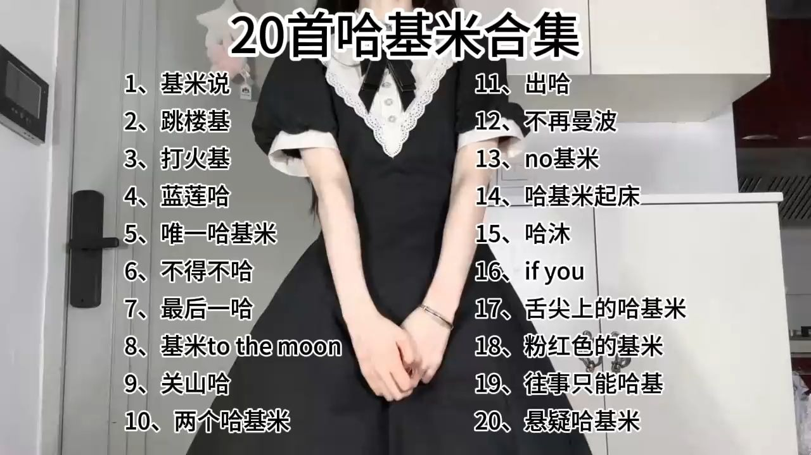 | 73 | 2026-01-16 |
| [拉弓优诺 199体限量 哈基米工作室雕像开定](https://www.bilibili.com/video/BV1cEr1BAEV3) |  | 3 | 2026-01-16 |
| [ASMR哈基米摩擦抓绕音助眠](https://www.bilibili.com/video/BV1Rar1BpEhK) |  | 0 | 2026-01-16 |
| [1月17日牢A⚠️首播彻底炸了⚠️银趴哥训狗篇⚠️看看往期视频吧⚠️留学生大赏⚠️盘点那些抽象留学生！](https://www.bilibili.com/video/BV1gzr1BUECK) |  | 4.8万 | 2026-01-16 |
| [🐱哈基米和声🐱（翻调）](https://www.bilibili.com/video/BV1HhrkB4Ewh) |  | 221 | 2026-01-16 |
| [流萤_你也是哈基米么？](https://www.bilibili.com/video/BV1ZHrCBHEMi) |  | 126 | 2026-01-16 |
| [基米大战僵尸 屋顶 【原曲不使用】](https://www.bilibili.com/video/BV1fvrkB9EDz) |  | 3794 | 2026-01-16 |
| [哈基米南北路多](https://www.bilibili.com/video/BV1purCBhEYr) |  | 132 | 2026-01-16 |
| [哈基米武力劝阻地雷妹不要改花刀了](https://www.bilibili.com/video/BV1TArCBvEnK) | 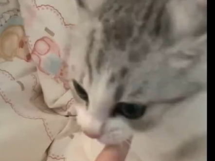 | 136 | 2026-01-16 |
| [哈基米是最可爱最美好的生物](https://www.bilibili.com/video/BV1ufrkBMEbx) |  | 60 | 2026-01-16 |
| [哈基米太馋嘴啦😂](https://www.bilibili.com/video/BV1MfrkBMEed) |  | 51 | 2026-01-16 |
| [我们哈基米玩家是最有操作的(ꐦ°᷄д°᷅)](https://www.bilibili.com/video/BV1SBrCB6ELt) |  | 134 | 2026-01-16 |
| [哈基米撒尿是想用气味保护你呀](https://www.bilibili.com/video/BV1uBrCBrEtH) |  | 51 | 2026-01-16 |
| [养了很久的流浪猫，被另一只流浪猫咬死了，好心痛](https://www.bilibili.com/video/BV17JrCB9Eiv) |  | 2260 | 2026-01-16 |
| [小基米磕嗨了？](https://www.bilibili.com/video/BV1ZJrCBXEvh) |  | 54 | 2026-01-16 |
| [哈基米终于吃上自助餐了](https://www.bilibili.com/video/BV1ZHrCBHEBK) |  | 62 | 2026-01-16 |
| [哈基米的日常](https://www.bilibili.com/video/BV1RxrCBUE7u) |  | 235 | 2026-01-16 |
| [哈基米](https://www.bilibili.com/video/BV1JorCBbE6x) |  | 21 | 2026-01-16 |
| [【哈基米音乐】拉克丝都干了哪些坏事？](https://www.bilibili.com/video/BV1BFryBxEW7) |  | 256 | 2026-01-16 |
| [曼波曼波，哈基米南北绿豆～](https://www.bilibili.com/video/BV1TrrCBzEiM) |  | 393 | 2026-01-16 |
| [惊的基米的卡点 ！！嘣！！！！](https://www.bilibili.com/video/BV11CrCBTEUC) |  | 72 | 2026-01-16 |
| [进来参观主播的桌面猫窝和哈基米桌搭](https://www.bilibili.com/video/BV1Tdr6BaEEY) |  | 446 | 2026-01-16 |
| [超大号的“哈基米”，爱粘人的猞猁](https://www.bilibili.com/video/BV1MqrrBeESz) | 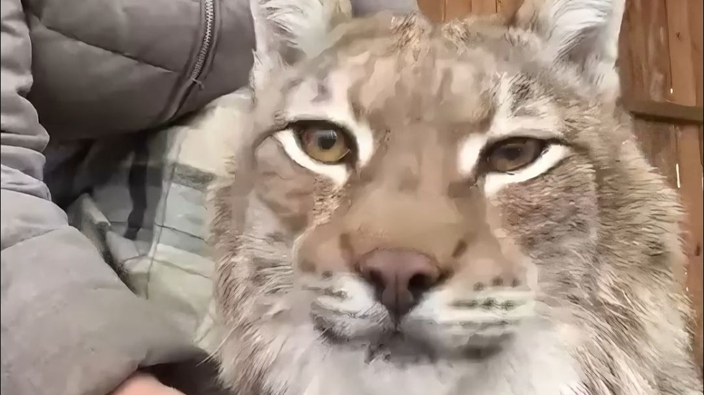 | 1.4万 | 2026-01-16 |
| [哈基米助眠丨你又来到了哈基米理发店](https://www.bilibili.com/video/BV1nQkPBpECA) |  | 2644 | 2026-01-16 |
| [【鼠鼠评车】哈基米难被撸掉——指小野猫是法顶不可或缺的一块拼图](https://www.bilibili.com/video/BV1k2rrB4EGk) |  | 4105 | 2026-01-16 |
| [哈基米新款造型大剧透🎁～1月19日，敬请期待！](https://www.bilibili.com/video/BV1RtkKB2EBk) |  | 1257 | 2026-01-16 |
| [【纯净哈基米】兄弟难当](https://www.bilibili.com/video/BV1ntr6BDEzt) |  | 744 | 2026-01-16 |
| [哈基米回家开黑花号银卡房会出些什么呢](https://www.bilibili.com/video/BV1KzrrBAEkH) | 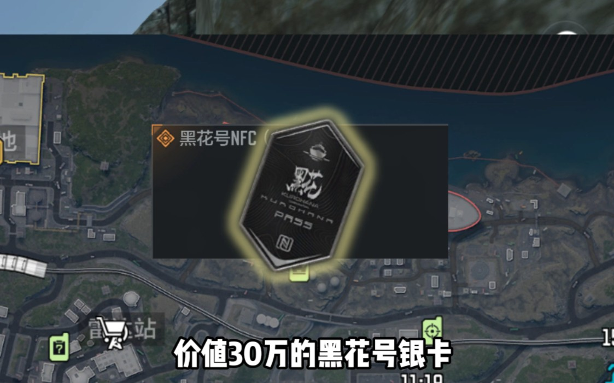 | 2061 | 2026-01-16 |
| [我好像自带了“猫薄荷”Buff！ 别人镇猫靠气场 我镇猫反被猫躺平露肚皮](https://www.bilibili.com/video/BV19MrkBGEKa) | 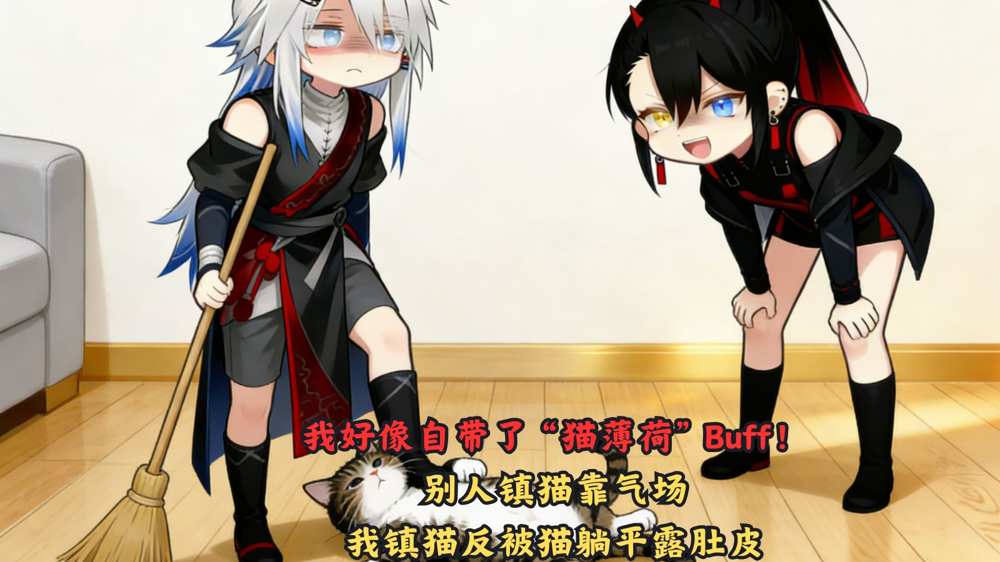 | 1.6万 | 2026-01-16 |
| [🐱土木堡战神：我在瓦剌望北京🐱](https://www.bilibili.com/video/BV1DEkTBrEGu) | 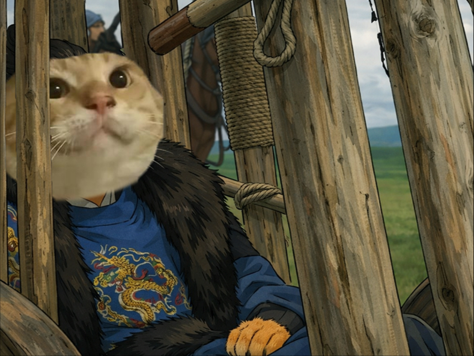 | 3.6万 | 2026-01-16 |
| [☝😩给我看力竭了⚡⚡⚡](https://www.bilibili.com/video/BV183rkBgESS) |  | 15.2万 | 2026-01-16 |
| [【哈基米音乐】最后的色彩/庄严的ink，但是哈基米](https://www.bilibili.com/video/BV13ikKB3EUR) |  | 2084 | 2026-01-16 |
| [最 强 哈 基 米 变 身](https://www.bilibili.com/video/BV1bCroByE1R) |  | 5113 | 2026-01-16 |
| [25期末1组-宠物哈基米](https://www.bilibili.com/video/BV17HkKBDEzJ) |  | 43 | 2026-01-16 |
| [猫猫](https://www.bilibili.com/video/BV1vtkKB2EPp) | 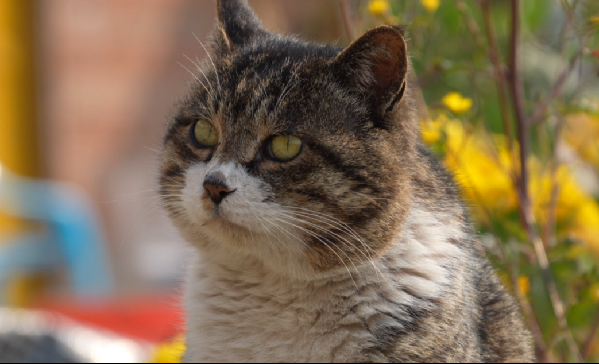 | 12.3万 | 2026-01-16 |
| [【哈基米】“僵尸榨汁机”](https://www.bilibili.com/video/BV15tkKB2EgC) |  | 522 | 2026-01-16 |
| [【龟龟叁叁】看勾手指月，勾神好像哈基米啊](https://www.bilibili.com/video/BV1YhkKByEMu) |  | 1707 | 2026-01-16 |
| [居家祝福仅需30，快至半小时出货！#哈基米 #神马教 #生日祝福](https://www.bilibili.com/video/BV15tkKB2EGt) |  | 358 | 2026-01-16 |
| [哈基米的欢迎仪式](https://www.bilibili.com/video/BV1cokKBoE21) |  | 243 | 2026-01-16 |
| [&quot;亡命基米，无路可退。耄从天降，愤怒哈气！&quot;](https://www.bilibili.com/video/BV18nkTB3EQq) |  | 28.1万 | 2026-01-16 |
| [哈基米启动自毁程序化为哈基√和哈基∫](https://www.bilibili.com/video/BV1eXkTBEEo8) | 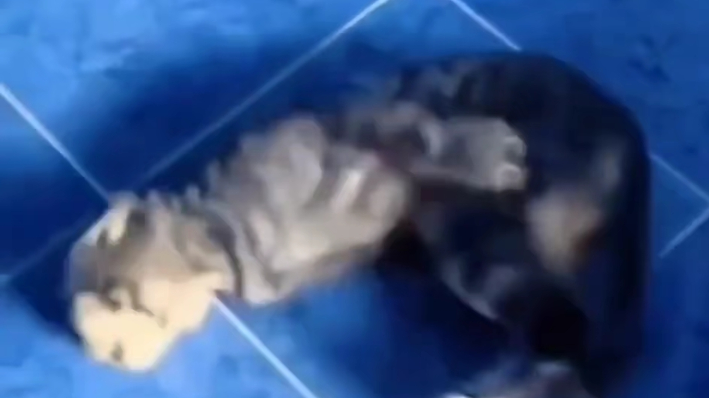 | 7853 | 2026-01-16 |
| [哈基米果然有九条命被电了之后还能活过来](https://www.bilibili.com/video/BV1kikTBFEXW) |  | 1468 | 2026-01-16 |
| [我家的哈基米太好rua啦！](https://www.bilibili.com/video/BV1BrkTBdEae) | 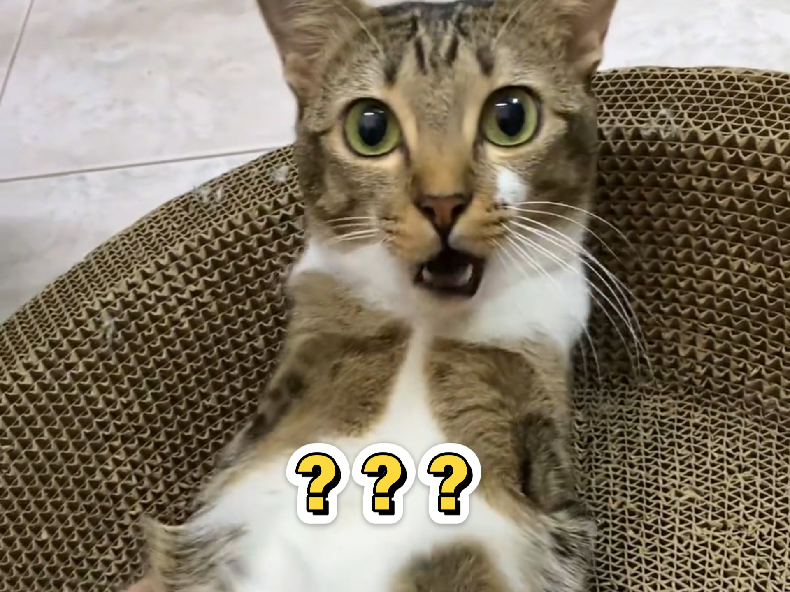 | 1353 | 2026-01-16 |
| [【随基过程】基于马尔可夫链的哈基米音乐生成——以柴小协为例](https://www.bilibili.com/video/BV1zCkTBsE7T) |  | 651 | 2026-01-16 |
| [猫猫鱼？哈基米小时候竟然是鱼](https://www.bilibili.com/video/BV1ofkPB2Ej9) | 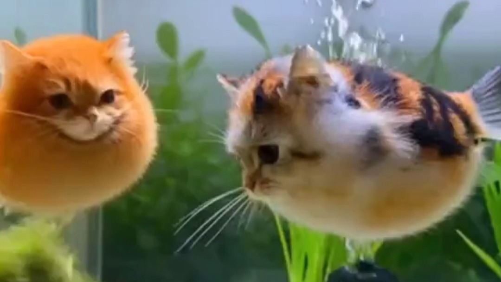 | 3122 | 2026-01-16 |
| [泥嚎！！！我是哈基米~](https://www.bilibili.com/video/BV1JZkPBEE3K) |  | 379 | 2026-01-16 |
| [哈基米哈基米 曼波！～](https://www.bilibili.com/video/BV17VkwB6E4s) |  | 9385 | 2026-01-16 |
| [【MMD动作展示】基米说](https://www.bilibili.com/video/BV1LPkNB5EVh) |  | 423 | 2026-01-16 |
| [哈基米袭击主人](https://www.bilibili.com/video/BV19ckABqEsA) | 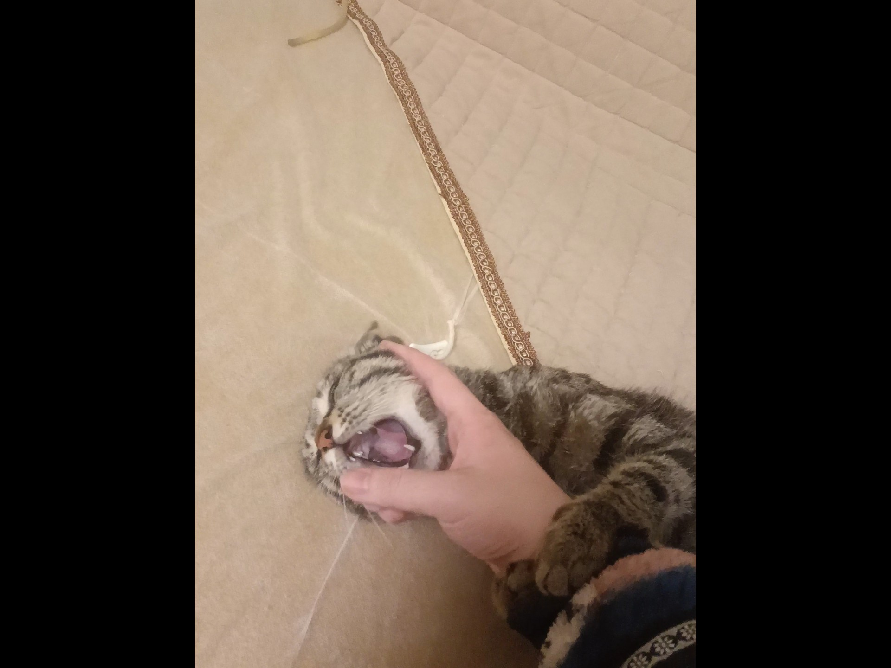 | 1180 | 2026-01-16 |
| [探故基](https://www.bilibili.com/video/BV1TrkPBFEkx) |  | 16.9万 | 2026-01-16 |
| [【哈基米音乐】🐱take 米 to infinity🐱【完整版】](https://www.bilibili.com/video/BV16ikNBHESX) |  | 1613 | 2026-01-16 |
| [猫饼制作现场](https://www.bilibili.com/video/BV1DjkNBNEPj) | 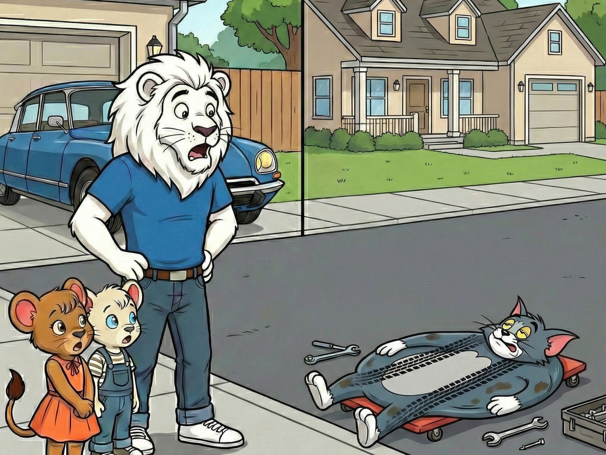 | 411 | 2026-01-16 |
| [大冬天哈基米掉进水池里出不来了](https://www.bilibili.com/video/BV16ikNBHEmu) | 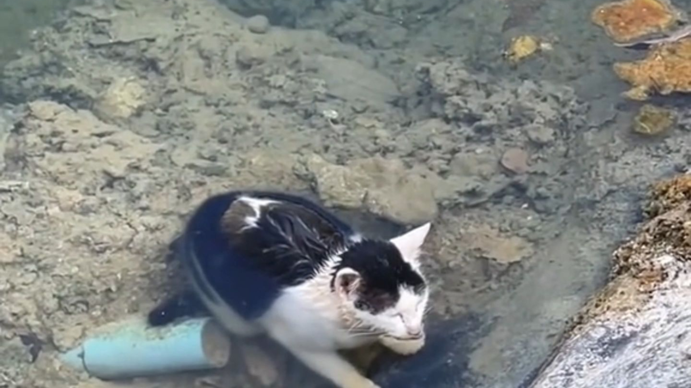 | 4.0万 | 2026-01-16 |
| [【哈基米音乐】⚡️疯狂的基米⚡️《哈基米版 UwU Funk》⚡️](https://www.bilibili.com/video/BV1n5kKBxErf) | 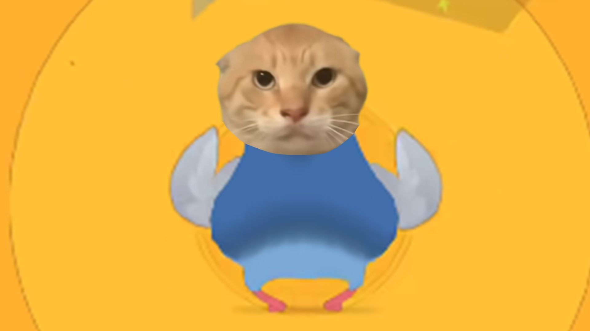 | 1529 | 2026-01-16 |
| [哈基米：人 我已出餐](https://www.bilibili.com/video/BV1bZkNBTEhf) |  | 86 | 2026-01-16 |
| [哈基米又又又又又又憋不住了](https://www.bilibili.com/video/BV1rbkABEENX) |  | 197 | 2026-01-15 |
| [一股很强的咪正在袭来——歌曲《The Hills（哈基咪版）》二创慎啸／顶级畅享版](https://www.bilibili.com/video/BV1iLkwBuED1) |  | 317 | 2026-01-15 |
| [基米惨遭交交交](https://www.bilibili.com/video/BV17GkwB3EsJ) |  | 6.5万 | 2026-01-15 |
| [⚡耄  儿  庄  园⚡](https://www.bilibili.com/video/BV1VHkwBNE9A) |  | 7237 | 2026-01-15 |
| [哈基米这一块](https://www.bilibili.com/video/BV13xkwBaE6B) | 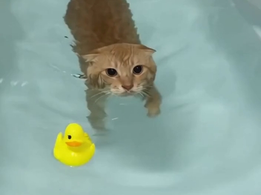 | 3.2万 | 2026-01-15 |
| [嗦手指的哈基米｜嗦得不知天地为何物｜把自己哄睡着了#偷拍睡觉的猫 #猫睡觉 #动物迷惑行为 #猫咪睡觉姿势](https://www.bilibili.com/video/BV1GtkwBcEKW) |  | 346 | 2026-01-15 |
| [全网首发，互联网最抽象的成人用品——哈基米南北绿豆避孕套开箱](https://www.bilibili.com/video/BV1gxkFB9Ewi) | 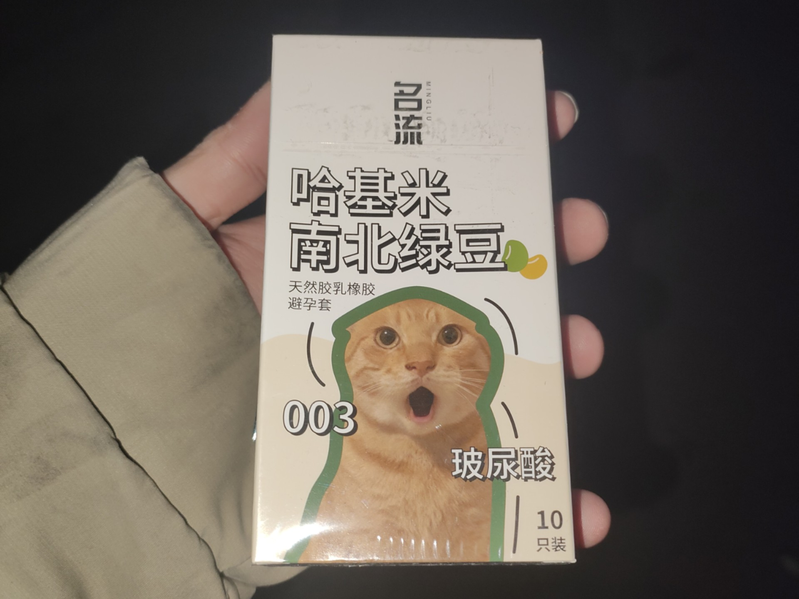 | 19.7万 | 2026-01-15 |
| [野生哈基米把我经常喂的灰喜鹊咬死了而且还对我哈气](https://www.bilibili.com/video/BV1sqkFBjE9K) | 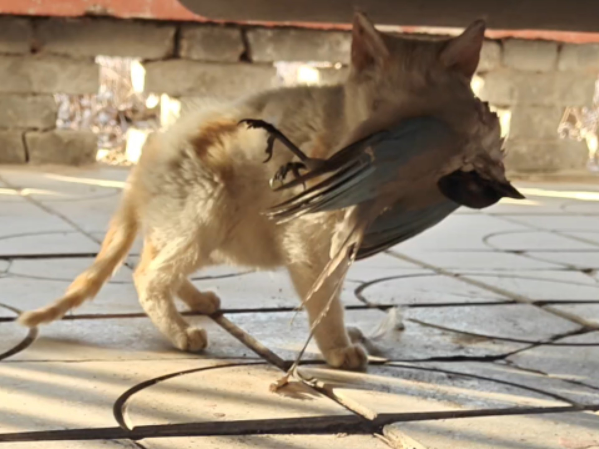 | 345 | 2026-01-15 |
| [对哈基米看不同哈基米视频的反应](https://www.bilibili.com/video/BV1L5kFBwE24) | 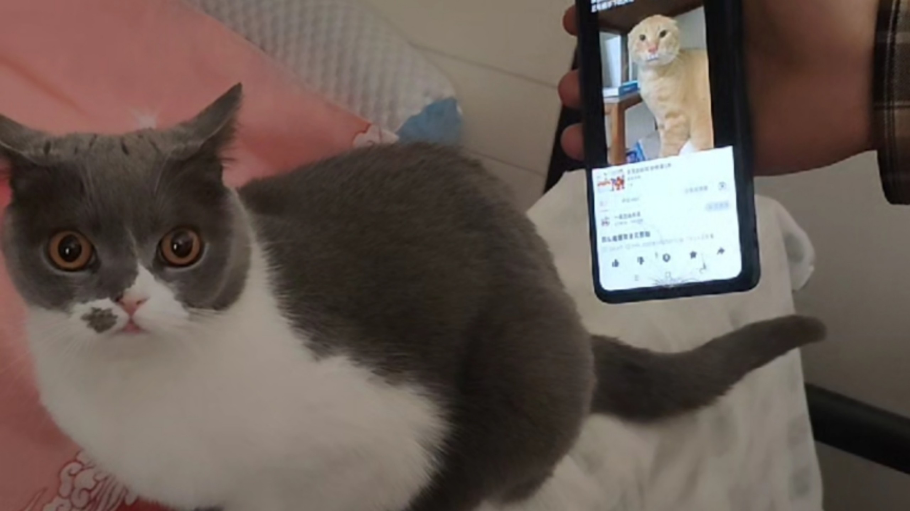 | 550 | 2026-01-15 |
| [母鸡逐渐接受了小猫更适合带娃的事实](https://www.bilibili.com/video/BV1YJkFBZEWe) | 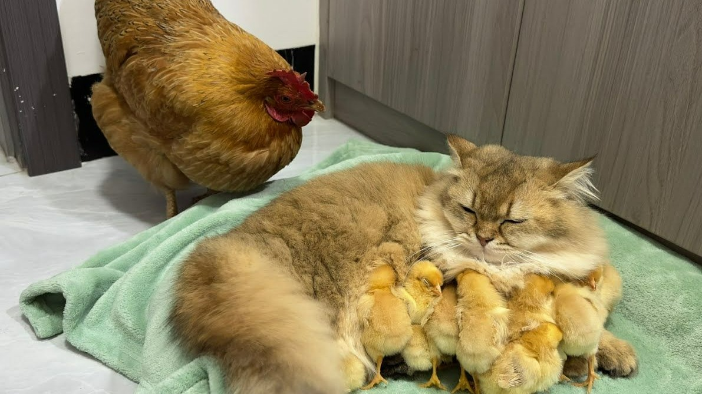 | 19.6万 | 2026-01-15 |
| [哈基米们还有什么招数尽管提出来吧，看来半月谈还是太保守](https://www.bilibili.com/video/BV15okFBYEtB) |  | 1630 | 2026-01-15 |
| [哈基米不让我弹琴，哈基米坏。。。](https://www.bilibili.com/video/BV1wrkFBCEpm) |  | 849 | 2026-01-15 |
| [跳到一半大脑突然宕机](https://www.bilibili.com/video/BV1wCkFBGEJv) |  | 6.5万 | 2026-01-15 |
| [猫帮人纠正动作，猫好！](https://www.bilibili.com/video/BV1PjkcBSEDB) |  | 3346 | 2026-01-15 |
| [猫儿那个体态。](https://www.bilibili.com/video/BV1mwrpByEuo) | 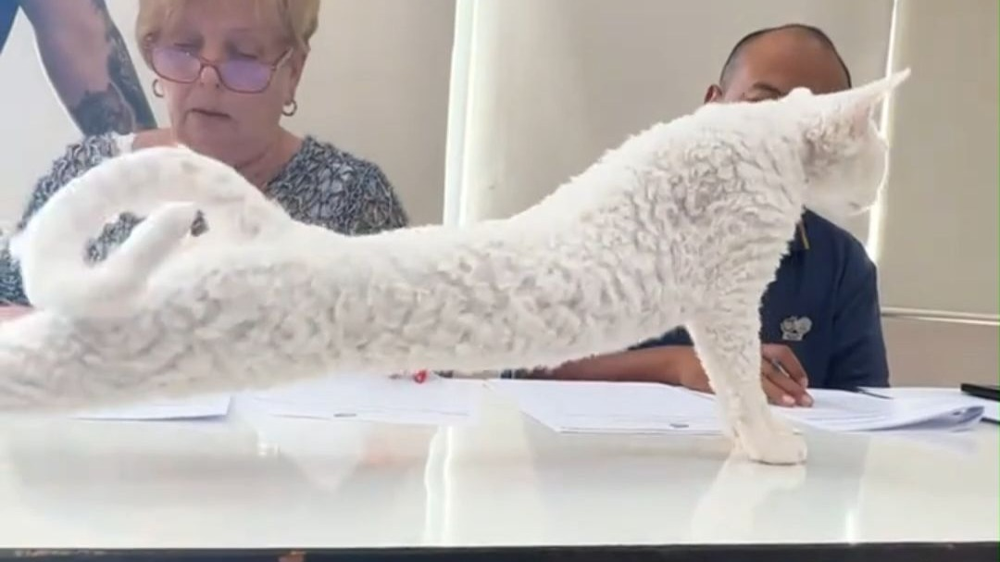 | 6.9万 | 2026-01-15 |
| [锐克和耄耋（3）邪恶泰迪与噩梦缠绕 上集](https://www.bilibili.com/video/BV1KhrZBkETL) |  | 12.7万 | 2026-01-15 |
| [以防你们没看过我捡的猫！](https://www.bilibili.com/video/BV1qtrfBYE6C) | 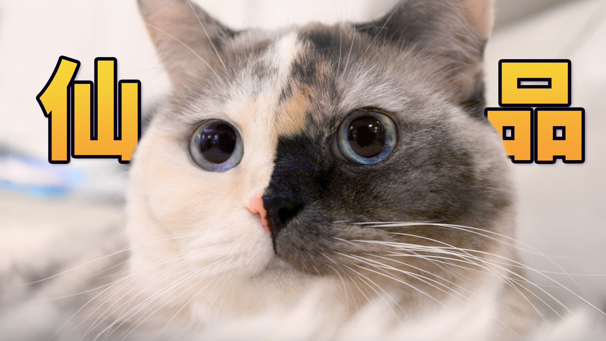 | 75.5万 | 2026-01-15 |
| [据极不可靠的信源说，小白猫是这么回国的](https://www.bilibili.com/video/BV1b2rfBnERe) |  | 30.1万 | 2026-01-15 |
| [干嘛…………](https://www.bilibili.com/video/BV1QRrdB7ERh) | 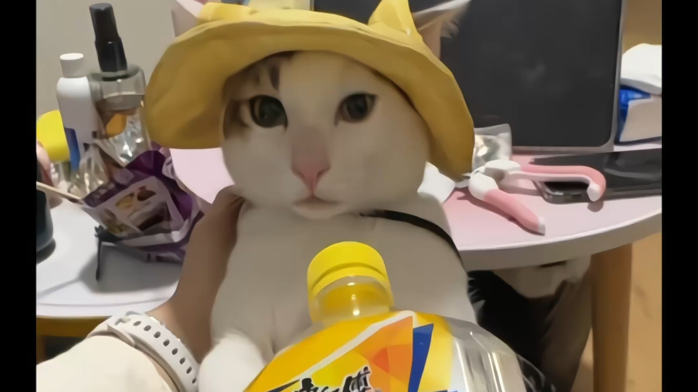 | 4.3万 | 2026-01-15 |
| [虐猫区出来寿司](https://www.bilibili.com/video/BV1kVroBNE6v) |  | 4725 | 2026-01-15 |
| [如果家里突然出现了两只小猫🥰你会？](https://www.bilibili.com/video/BV16nroB8Ezv) |  | 10.8万 | 2026-01-15 |
| [【逃离西雅图】【斯奎奇大王/牢A的奇幻冒险小剧场】【B站AI创作大赛-开放赛道】](https://www.bilibili.com/video/BV1jKrZBfEec) |  | 45.6万 | 2026-01-15 |
| [牢a还真是被大使馆撤回来的](https://www.bilibili.com/video/BV1N8rWBLEvn) |  | 12.6万 | 2026-01-14 |
| [猫儿这个∧](https://www.bilibili.com/video/BV1cWrsBuETb) | 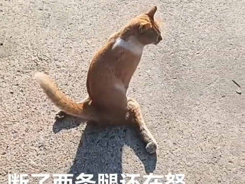 | 1.2万 | 2026-01-14 |
| [老板：请假可没人管小猫猫了哦](https://www.bilibili.com/video/BV1VGrWBoEtP) | 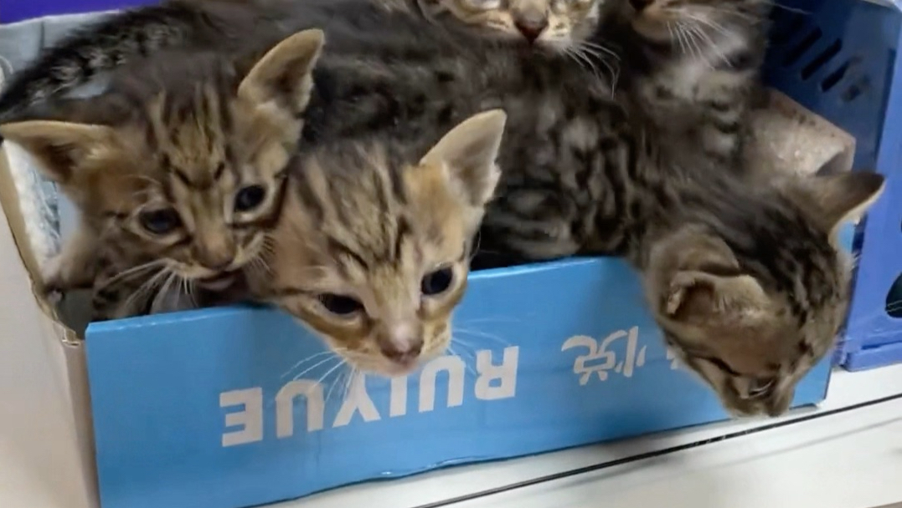 | 23.8万 | 2026-01-14 |
| [如果没监控，我永远不会知道小猫有多煎熬](https://www.bilibili.com/video/BV169rnBwED1) | 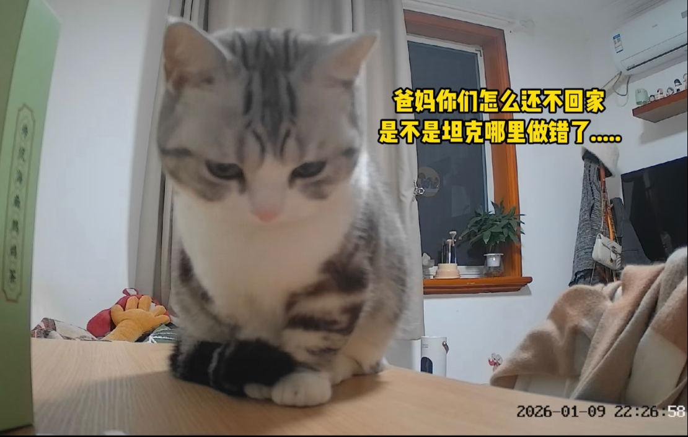 | 13.0万 | 2026-01-14 |
| [给日本妹妹唱哈基米小曲,妹妹直呼太奇怪了【阿梓/艾尔莎/莉爱/师徒杯】](https://www.bilibili.com/video/BV1i1rHB4Ek6) |  | 1.1万 | 2026-01-14 |
| [「哈基米音乐」库里之歌](https://www.bilibili.com/video/BV1HmrEBtE5x) | 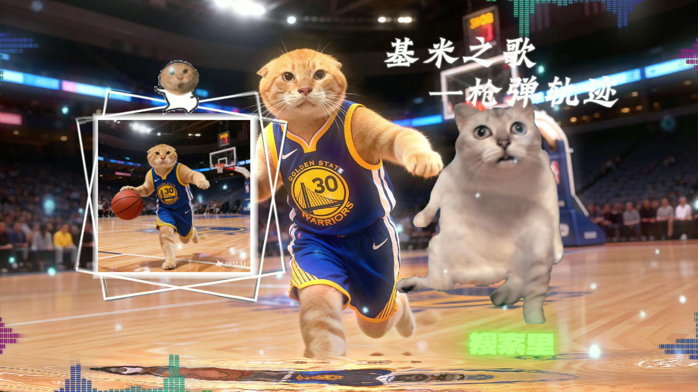 | 190 | 2026-01-14 |
| [哈基米依旧](https://www.bilibili.com/video/BV16KrjBmEa3) |  | 680 | 2026-01-13 |
| [哈基米这个浪费生命](https://www.bilibili.com/video/BV1X7r5BaEcp) |  | 1.2万 | 2026-01-13 |
| [猫儿这个耄耋](https://www.bilibili.com/video/BV14Lr6BfE38) | 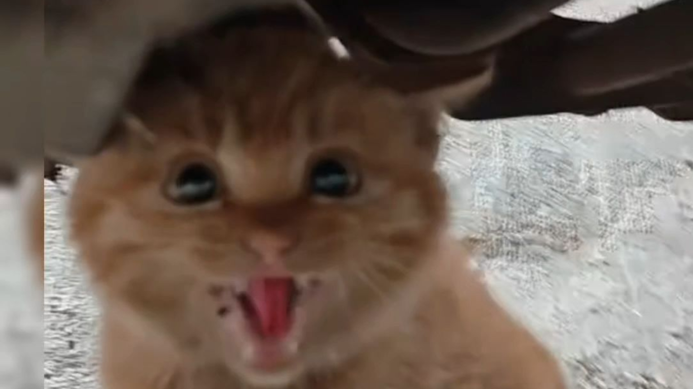 | 3001 | 2026-01-13 |
| [请用一张图片击败他](https://www.bilibili.com/video/BV1Mj6oBgEDt) |  | 17.4万 | 2026-01-11 |
| [循环歌单｜《疯狂的鸽子の小曲》《pigeonpopの小曲》UwU Funk](https://www.bilibili.com/video/BV1horgBJEqW) | 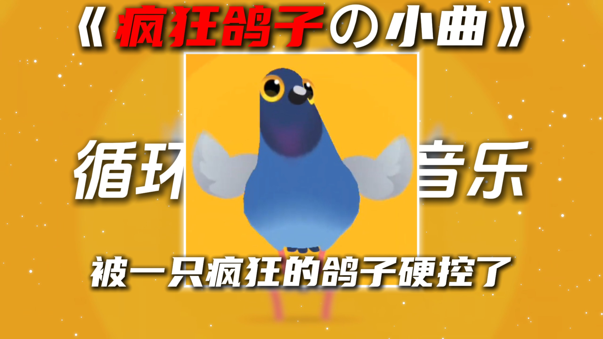 | 69.9万 | 2026-01-10 |
| [哈基米来了](https://www.bilibili.com/video/BV1ourABMES9) |  | 4.0万 | 2026-01-09 |
| [☝😡刘德华看完举报了⚡⚡⚡](https://www.bilibili.com/video/BV1c7quBWEy7) | 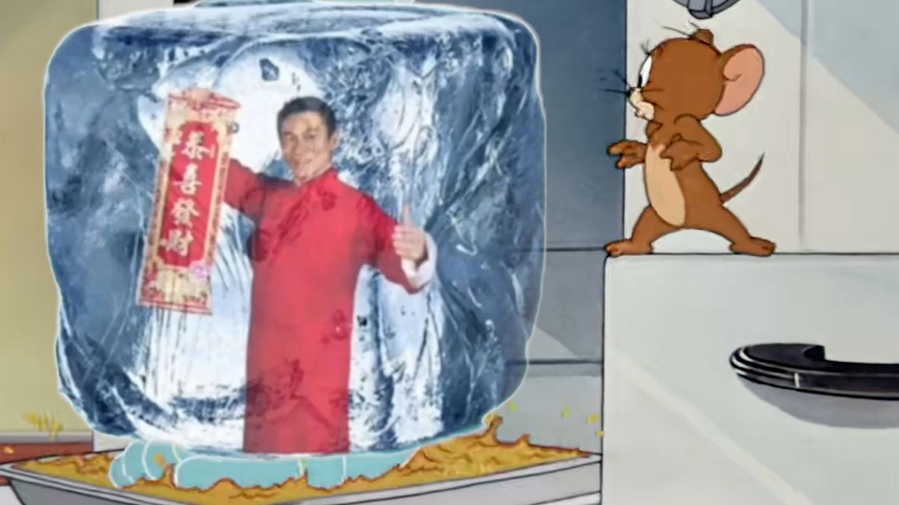 | 194.0万 | 2026-01-07 |
| [【绝地潜兵2】哈机人全新变种新军歌泄露!!!（补档）](https://www.bilibili.com/video/BV1MEinBtENc) |  | 6.8万 | 2026-01-04 |
| [高帧率妖精](https://www.bilibili.com/video/BV1onBFBpEJS) |  | 217.0万 | 2025-12-20 |
| [真好玩！哈基哈基米！](https://www.bilibili.com/video/BV1F3qjB6EQN) |  | 15.3万 | 2025-12-17 |
| [循环歌单｜【寂寞的人伤心的歌】｜“【得吃の小曲】【鼠鼠の小曲】”](https://www.bilibili.com/video/BV1DZ1xBBEQj) | 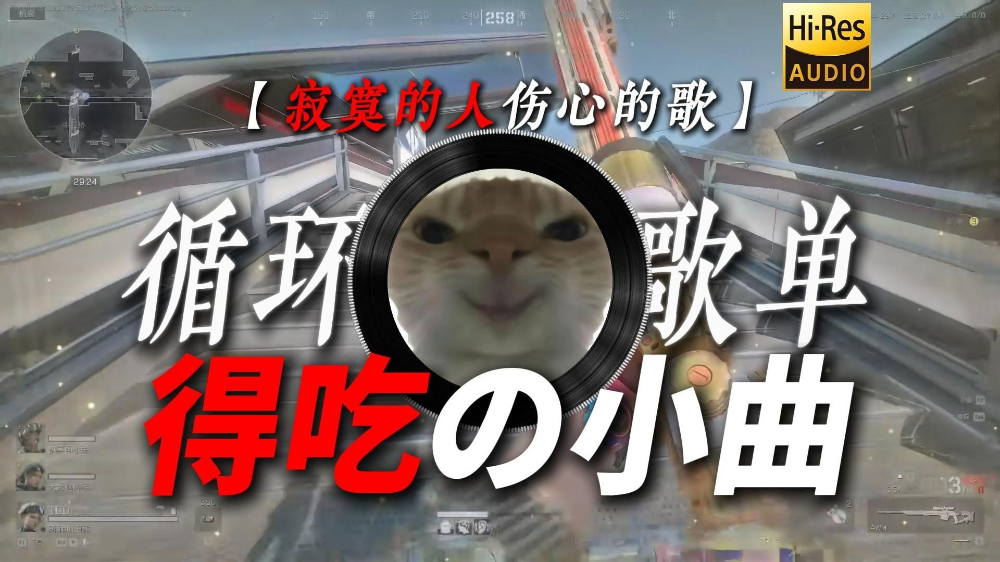 | 111.0万 | 2025-11-06 |
| [猫儿这个绝望](https://www.bilibili.com/video/BV1o4bHzLEE3) | 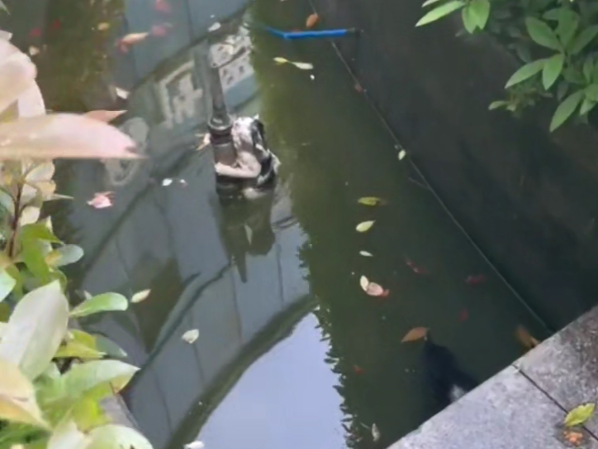 | 40.9万 | 2025-08-15 |
| [对比一下耄耋跟其他猫，这俩都不像一个物种](https://www.bilibili.com/video/BV1mv8yzwETN) | 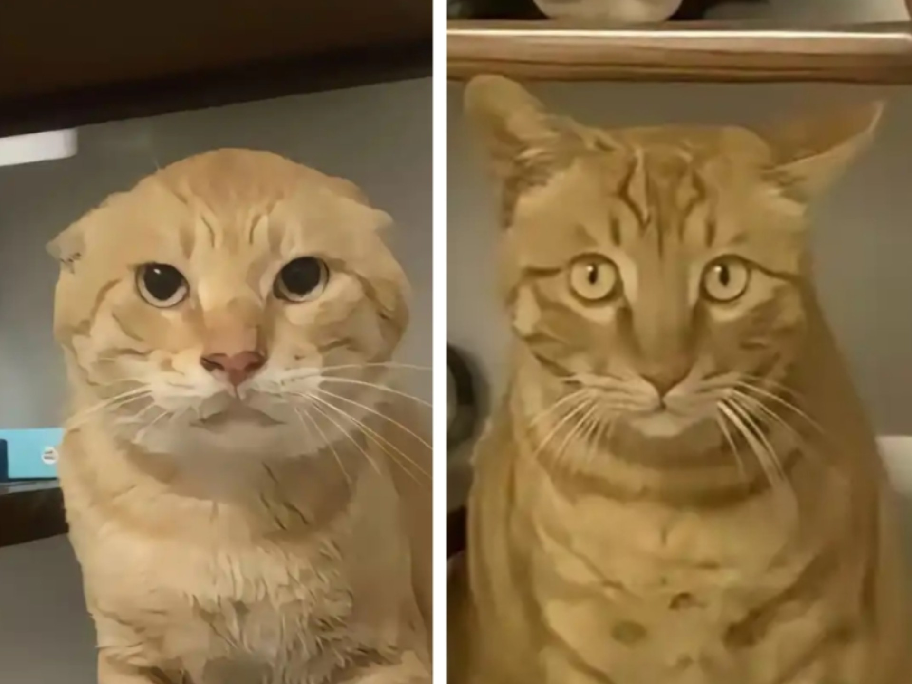 | 16.3万 | 2025-07-31 |
| [哈基米那没路多😫](https://www.bilibili.com/video/BV1QarYYsEbm) |  | 70.7万 | 2025-01-08 |
| [哈基米被撞是不会死的，不舒服他会自己跑开的](https://www.bilibili.com/video/BV1rx4y1m7aC) | 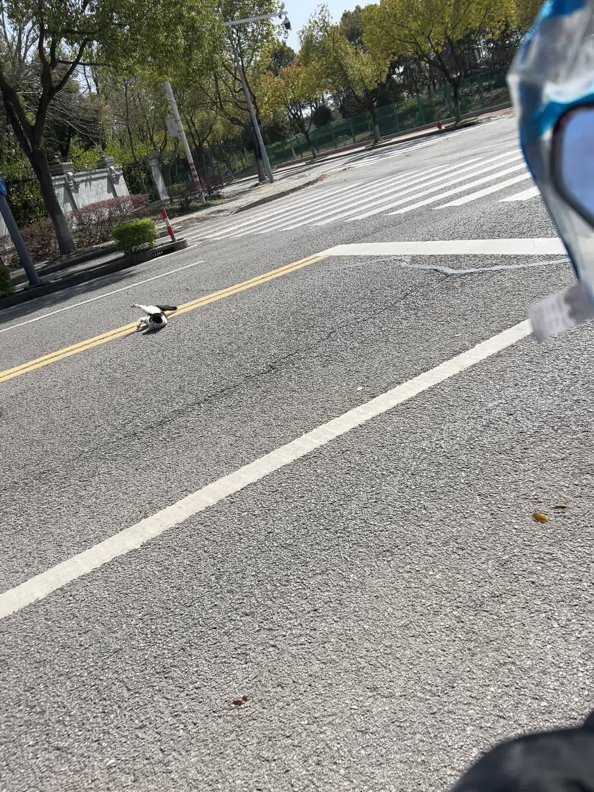 | 44.8万 | 2024-03-29 |
| [流浪猫被猴子控制，反复折磨奄奄一息，太残忍了！](https://www.bilibili.com/video/BV1pu41167nM) | 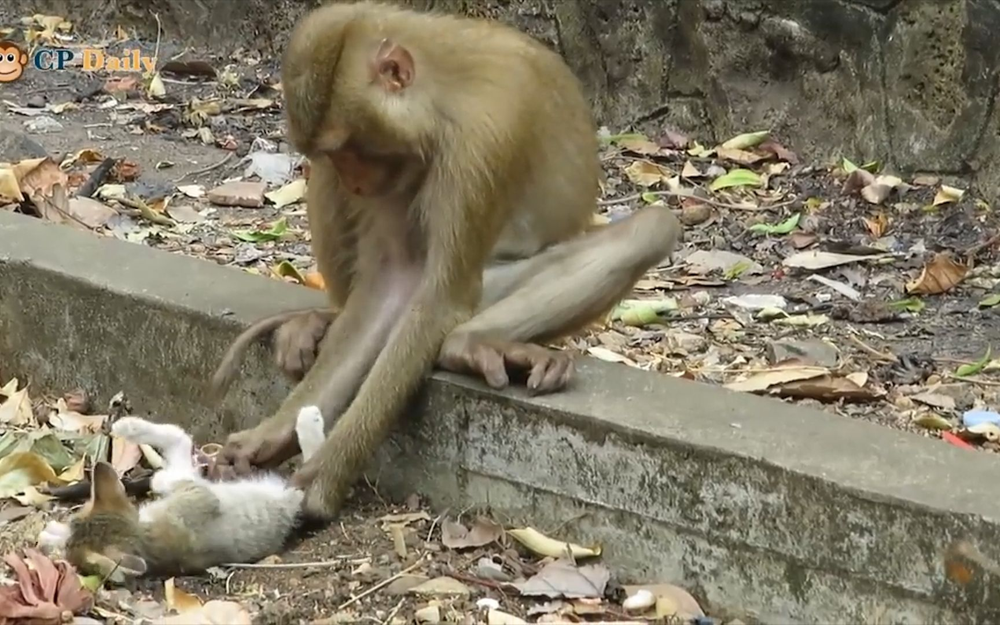 | 51.0万 | 2022-05-14 |

---
*最后更新: 2026-01-17 02:43:44 (自动生成)*
*数据来源: [Bilibili](https://www.bilibili.com)*

## 使用说明

运行以下命令更新视频列表:
```bash
python3 fetch_hajimi_videos.py
```
