# awesome-hajimi
collections of hajimi (哈基米 in Chinese) on the Internet.

## 视频列表 (Video List)

| 视频标题 (Title) | 封面 | 播放量 (Views) | 发布日期 (Date) |
|---|---|---|---|
| [《守卫王小桃》哈基米全点输出后惨遭哈基鸟秒杀！](https://www.bilibili.com/video/BV1FfC5BHEhS) |  | 87 | 2025-11-15 |
| [哈基人摸哈基米反被抓了一下](https://www.bilibili.com/video/BV1DnCLBKECo) | 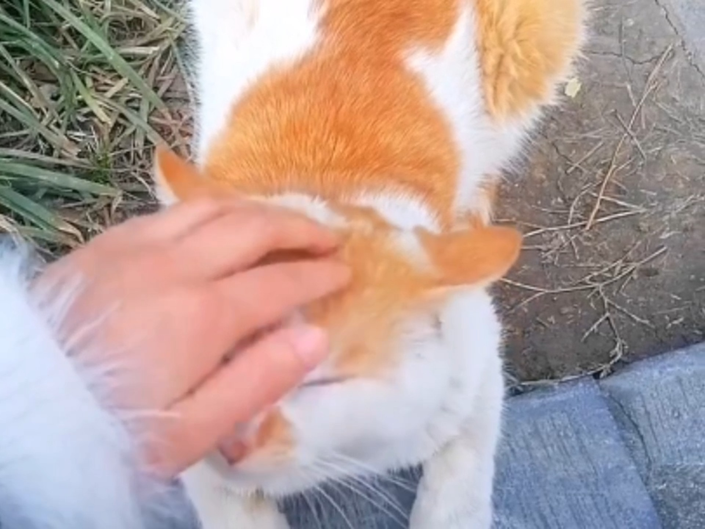 | 154 | 2025-11-15 |
| [【哈基米音乐】曼波开出哈](https://www.bilibili.com/video/BV1UZC3BsEK4) |  | 231 | 2025-11-15 |
| [当你让九大追捕给你唱歌的时候，他们会是什么反应？而蒂亚竟然会唱哈基米..](https://www.bilibili.com/video/BV1PkCgB2Emf) |  | 1662 | 2025-11-14 |
| [【意识形态学】“哈基米南北绿豆”——底层小白领和青年学生的微弱至极的生活诉求和阶级意识初表达](https://www.bilibili.com/video/BV1TWCVB4Efi) |  | 1.6万 | 2025-11-14 |
| [S8版本答案——卫岳+哈基米体系](https://www.bilibili.com/video/BV1DVC3BsEa9) |  | 164 | 2025-11-14 |
| [【阿梓】去拿饮品途中与哈基米大战, 尽管离麦克风很远, 但还是能听到部分。小虎o(╥﹏╥)o](https://www.bilibili.com/video/BV1izC3BqEQv) |  | 5167 | 2025-11-14 |
| [关于九阳哈基米的原型，官方早预判了](https://www.bilibili.com/video/BV11xC3BjExU) |  | 2925 | 2025-11-14 |
| [无畏契约新特工哈基米登场](https://www.bilibili.com/video/BV1caC3BVEpF) | 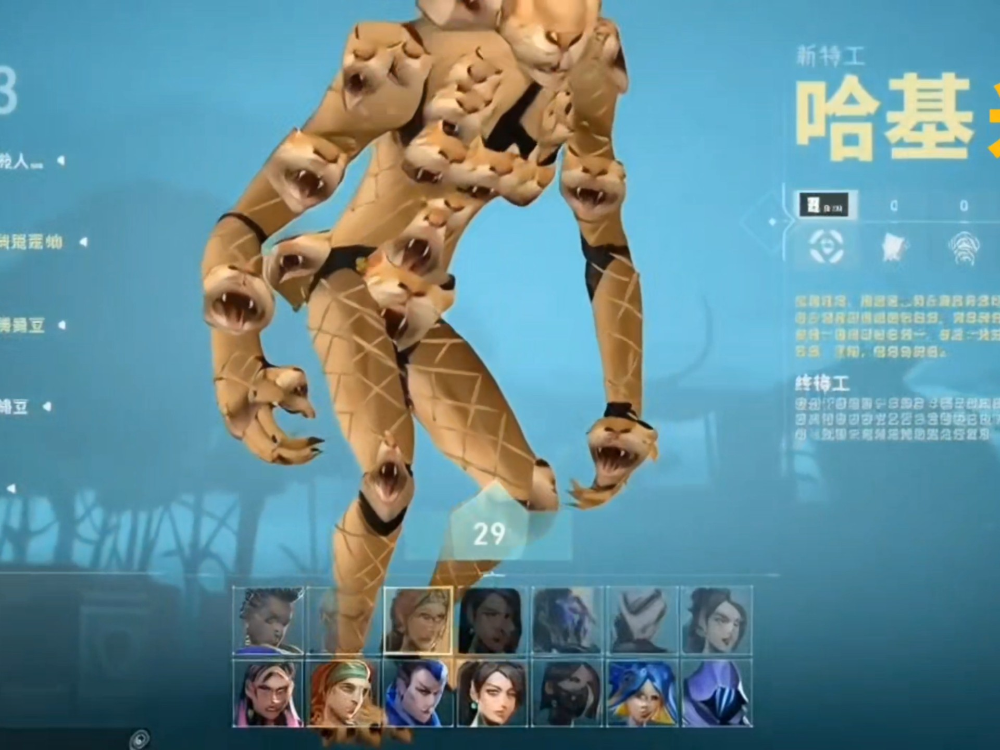 | 723 | 2025-11-14 |
| [【苏芙芙ASMR】自用♡曼波曼波mua~哈基米♡直播切片](https://www.bilibili.com/video/BV1tcCGBpEGJ) |  | 998 | 2025-11-14 |
| [哈基米勇闯循环，检测智商的一集](https://www.bilibili.com/video/BV1WMCGBmE9S) |  | 31 | 2025-11-14 |
| [卧槽!还有高手!九阳哈基米南北绿豆浆卖爆了，股价直线上涨!品客薯片哭晕在厕所!](https://www.bilibili.com/video/BV11PCGBnEj8) |  | 523 | 2025-11-14 |
| [哈基米-星爵快乐曲](https://www.bilibili.com/video/BV1WNCGBSE6t) |  | 531 | 2025-11-14 |
| [基米小学：耄耄的环球旅行计划！](https://www.bilibili.com/video/BV1YDC3BFE2n) |  | 3.2万 | 2025-11-14 |
| [哈基米：⚡Natural🐱 - Imaodie Dragons](https://www.bilibili.com/video/BV1e1C3BYEDz) |  | 495 | 2025-11-14 |
| [顶级哈基米训练家](https://www.bilibili.com/video/BV1XKCuBHEvU) | 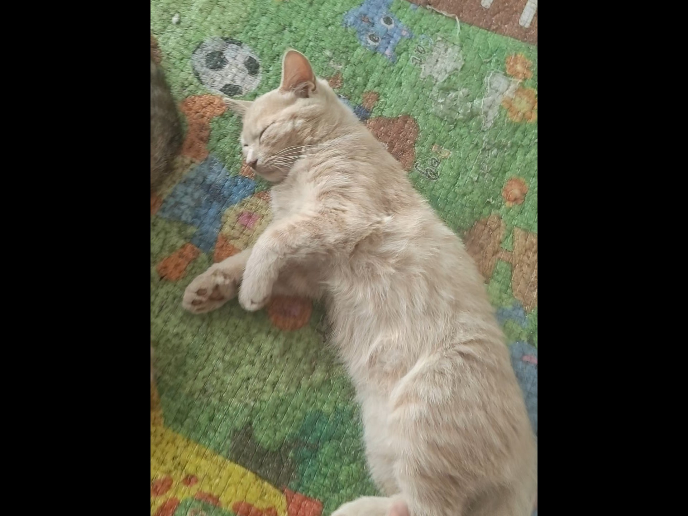 | 110 | 2025-11-14 |
| [哈基米玩sap（bushi](https://www.bilibili.com/video/BV1UGCuB7Eew) |  | 47 | 2025-11-14 |
| [西 部 快 哈 手](https://www.bilibili.com/video/BV1ktCuBTEcK) |  | 2.8万 | 2025-11-14 |
| [《她哈上了旅程》哈基米版鬼畜作者入驻B站啦！](https://www.bilibili.com/video/BV1scCgByEG5) |  | 688 | 2025-11-14 |
| [（补档）本视频所有收益将用于购买哈基米豆浆](https://www.bilibili.com/video/BV1hUCuBXEse) |  | 1327 | 2025-11-14 |
| [昨天谁点的哈基米南北绿豆](https://www.bilibili.com/video/BV1DUCuBXEdk) |  | 4707 | 2025-11-14 |
| [纯净流哈基米：阿米诺斯之歌（神作）](https://www.bilibili.com/video/BV1vJCgBaECK) |  | 469 | 2025-11-14 |
| [哈基米南北绿豆～](https://www.bilibili.com/video/BV1FLCgBKE5s) |  | 2624 | 2025-11-14 |
| [啧，别让广东老鼠演这些](https://www.bilibili.com/video/BV1ctCTB8Ec4) |  | 91.6万 | 2025-11-14 |
| [【纯净哈基米】来去曼波](https://www.bilibili.com/video/BV1TeCMB5ES3) |  | 1511 | 2025-11-14 |
| [这下真的成求也要排队买的哈基米南北绿豆浆了（没想到有一天你也会让我高攀不起）](https://www.bilibili.com/video/BV1ivCTB9EfM) |  | 1965 | 2025-11-14 |
| [【滚动的天空/共创】萌萌喵喵哈基米 RS也有自己的中国园林 120fps原画全收集无伤完美 宽屏双声道 CL45 ¦ Meow Meow ¦ CNDY](https://www.bilibili.com/video/BV1N6CMBgEUd) |  | 8899 | 2025-11-14 |
| [【硬核实测】久坐的哈基米终于有救了~2025年人体工学椅大横评，西昊、傲风、保友金豪、黑白调实测推荐](https://www.bilibili.com/video/BV1TXCTBVERH) |  | 9.0万 | 2025-11-14 |
| [我就说略猫区的前三才可能进入爱猫区](https://www.bilibili.com/video/BV1XrCTBSEfr) | 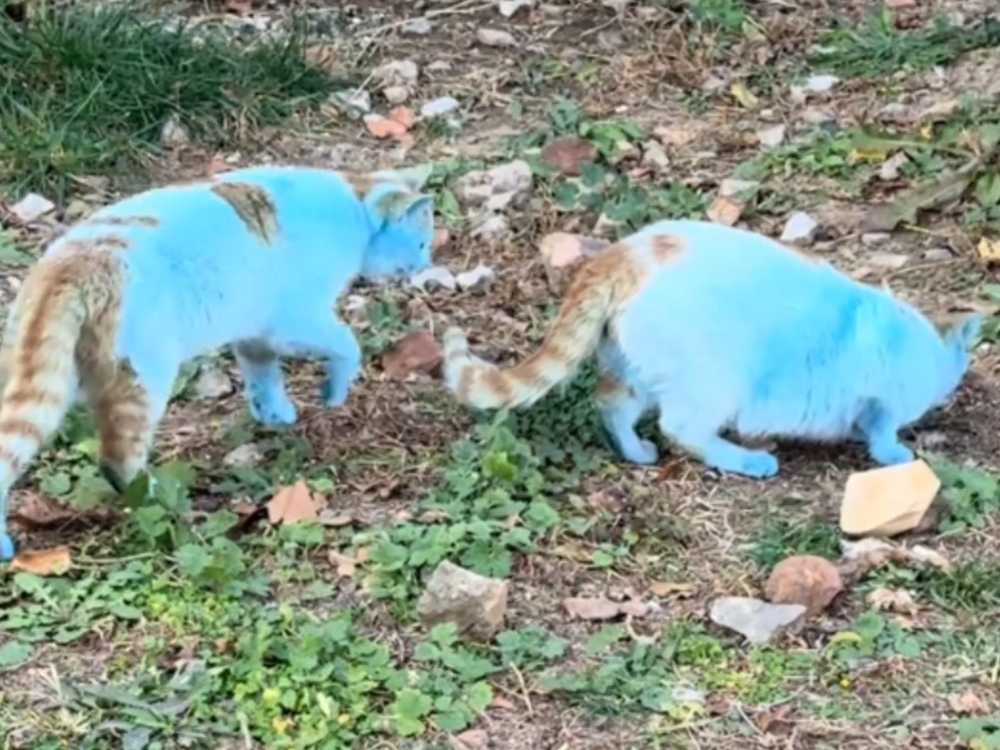 | 6985 | 2025-11-14 |
| [【贵物时报】哈基米南北绿豆浆如何让九阳母公司股票涨停？](https://www.bilibili.com/video/BV1g2CTB7ESo) |  | 7.1万 | 2025-11-14 |
| [B站热门哈基米串烧 2.0](https://www.bilibili.com/video/BV1C7CNBtEKk) |  | 13.1万 | 2025-11-14 |
| [猫儿这个耐摔](https://www.bilibili.com/video/BV1MaCMB1ES3) |  | 1.0万 | 2025-11-14 |
| [175 88kg微胖肥仔日常生活vlog（哈基米➕健身）](https://www.bilibili.com/video/BV1s6CMBgE4A) | 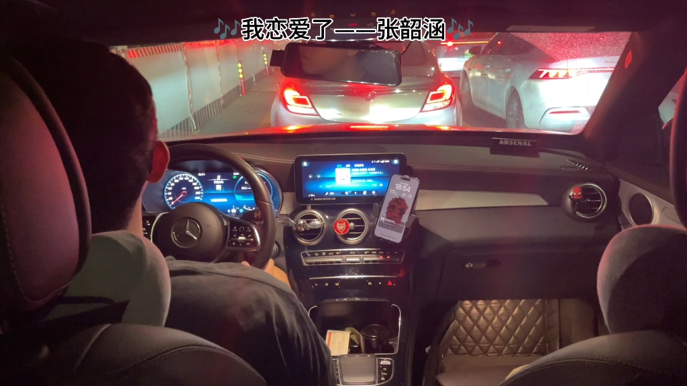 | 1699 | 2025-11-14 |
| [《哈DEAD曼》（哈曼波 X DEADMAN）这次哈基米了！](https://www.bilibili.com/video/BV1N5CtBfEMe) |  | 3.5万 | 2025-11-14 |
| [使命召唤：哈基米行动7](https://www.bilibili.com/video/BV1acCtBBEQQ) |  | 1688 | 2025-11-14 |
| [三国杀中到底有多少哈基米](https://www.bilibili.com/video/BV1fNCKBxEaa) |  | 1.6万 | 2025-11-14 |
| [朱元璋的逆袭（3）：功高震主与救命贤妻！](https://www.bilibili.com/video/BV1HJCjBdERN) |  | 31.9万 | 2025-11-14 |
| [创业TV哈基米南北绿豆，最成功的一集](https://www.bilibili.com/video/BV1u4CKB3E1P) |  | 1812 | 2025-11-14 |
| [🐱狂妄之耄⚡](https://www.bilibili.com/video/BV1GcCtBBEgU) |  | 1.1万 | 2025-11-14 |
| [甘雨喝哈基米南北绿豆浆](https://www.bilibili.com/video/BV19oCKBSEG6) |  | 2205 | 2025-11-14 |
| [九阳豆浆来了个高人，与联动哈基米导致九阳股份涨停](https://www.bilibili.com/video/BV1kVCABpEBT) |  | 52.6万 | 2025-11-14 |
| [炸裂!九阳哈基米南北绿豆浆卖爆了，连九阳科技股份都连带涨停，品客直接哭晕在厕所](https://www.bilibili.com/video/BV1N5CtBfE3u) |  | 23.4万 | 2025-11-13 |
| [刚好遇见咪😭😭😭——哈基米](https://www.bilibili.com/video/BV1vRC4BkEb3) |  | 1077 | 2025-11-13 |
| [【哈基米音乐】曼波游哈（游京）完整版](https://www.bilibili.com/video/BV13cCtBBEni) |  | 241 | 2025-11-13 |
| [【哈基米/転生林檎】転生緑豆/转生绿豆 （転生林檎-ピノキオピー）](https://www.bilibili.com/video/BV1Z4CtBSEP3) |  | 2498 | 2025-11-13 |
| [【哈基米】蠢朋克-Harder,Better,Faster,Stronger](https://www.bilibili.com/video/BV1kfCtBZE2A) |  | 25.8万 | 2025-11-13 |
| [是谁家哈基米啊，是我家呀！！！](https://www.bilibili.com/video/BV14QCtBeEU3) | 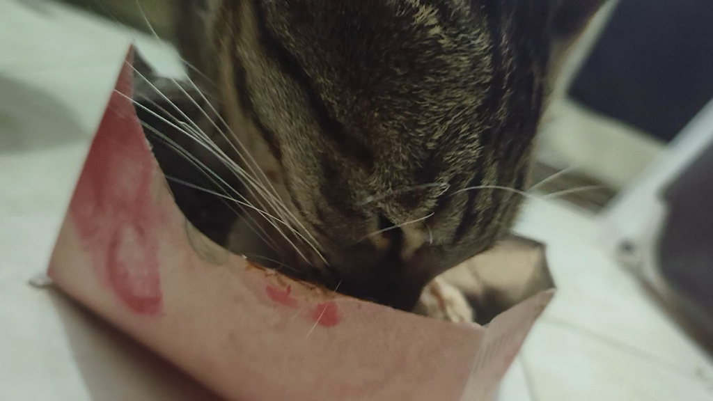 | 577 | 2025-11-13 |
| [【哈基米音乐】哈基米说的道理：去酒吧看看](https://www.bilibili.com/video/BV119CtBwEXt) |  | 32.5万 | 2025-11-13 |
| [【哈基米音乐】匆匆哈年](https://www.bilibili.com/video/BV1T9CtBAEBN) |  | 40.9万 | 2025-11-13 |
| [【哈基米音乐】地面の小曲（超级马里奥世界）](https://www.bilibili.com/video/BV19JCbB5Et9) |  | 3149 | 2025-11-13 |
| [哈基米与南北绿豆浆](https://www.bilibili.com/video/BV1BgCbBnEme) | 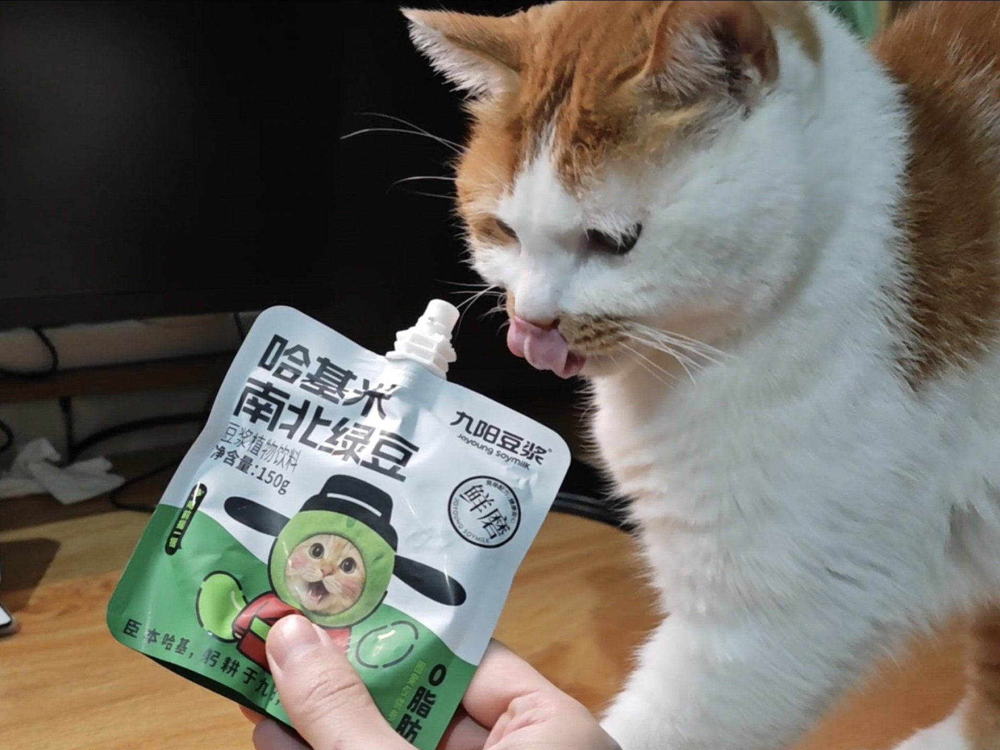 | 7.6万 | 2025-11-13 |
| [开箱九阳豆浆的哈基米南北绿豆浆](https://www.bilibili.com/video/BV1BMCbBQEpE) |  | 3.5万 | 2025-11-13 |
| [【哈基米音乐】一千年以后的哈⚡️](https://www.bilibili.com/video/BV1j5CbBUEu7) |  | 766 | 2025-11-13 |
| [坏了！喝到真的哈基米南北绿豆浆了！](https://www.bilibili.com/video/BV12UCxBoEx8) | 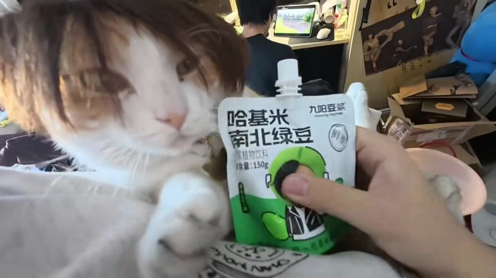 | 14.6万 | 2025-11-13 |
| [追哈基米豆浆的人已经从上海排到法国了！太抽象了吧！后面部分看羞涩了光速退出](https://www.bilibili.com/video/BV1ajC4BBESL) |  | 7979 | 2025-11-13 |
| [🐱“我哈基米哈基米，我都不知道怎么去哈”🐱](https://www.bilibili.com/video/BV1hECsBbE31) |  | 13.9万 | 2025-11-13 |
| [⚡耋出没⚡早安哈基米](https://www.bilibili.com/video/BV1ejC4BBEJJ) |  | 2207 | 2025-11-13 |
| [九阳豆浆领导倾情演唱哈基米，并称：不懂哈基米什么意思](https://www.bilibili.com/video/BV1ttC4BcEyq) |  | 14.9万 | 2025-11-13 |
| [九阳哈基米南北绿豆微博现状](https://www.bilibili.com/video/BV1uBCWBoEs3) |  | 1454 | 2025-11-13 |
| [哈基米难北路躲](https://www.bilibili.com/video/BV1G5CsBAEdP) |  | 9791 | 2025-11-13 |
| [让买到真的哈基米南北绿豆浆了～现在是买也要排队](https://www.bilibili.com/video/BV14pCsBdE9Z) |  | 11.0万 | 2025-11-13 |
| [🐱换位思考🐔](https://www.bilibili.com/video/BV131CEB2EcM) |  | 8.0万 | 2025-11-13 |
| [不要抢耄耋的南北绿豆！](https://www.bilibili.com/video/BV1MwCxBFEzp) | 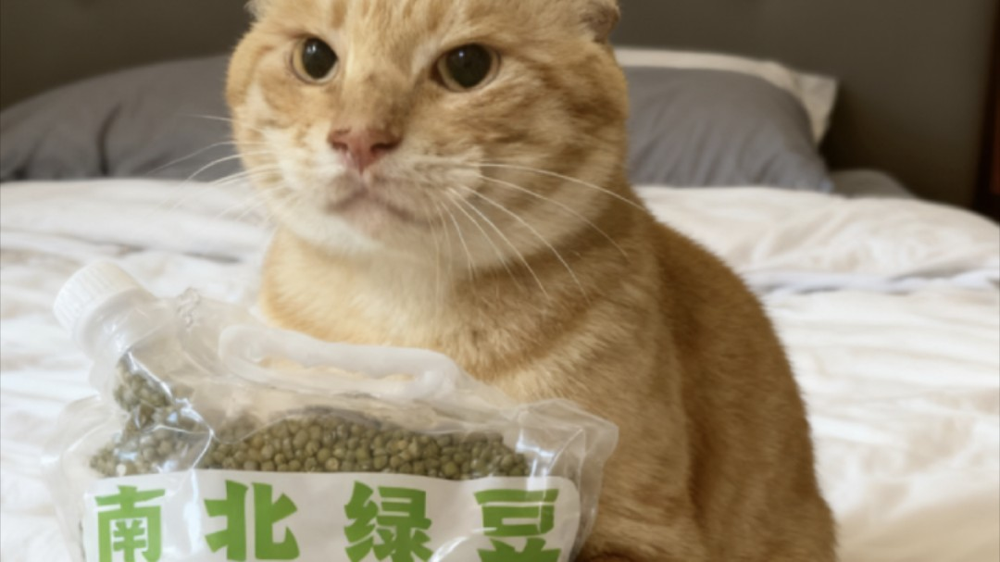 | 4.8万 | 2025-11-13 |
| [哈基人散养猫被偷猫贼给抓走了时长不超过两分钟](https://www.bilibili.com/video/BV1E6CpBiEMc) | 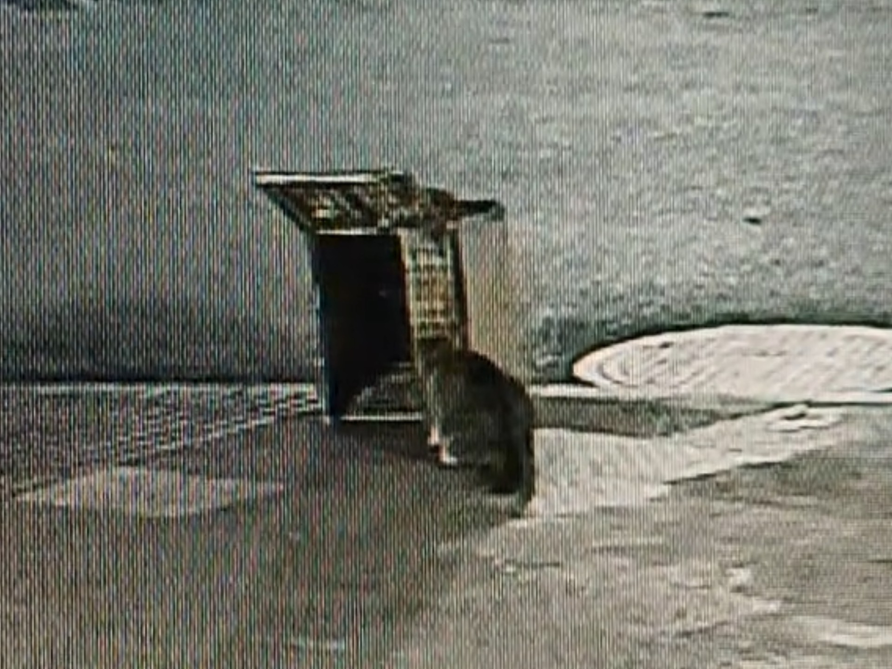 | 6346 | 2025-11-13 |
| [《鬼点子生成中》](https://www.bilibili.com/video/BV1y6C7BcEcF) |  | 15.7万 | 2025-11-13 |
| [【三角洲行动】S7赛季通行证武器皮肤实机演示！还有沙漠流沙金哈基米的事？真的巨美好吧！](https://www.bilibili.com/video/BV1JaCnBPEvc) | 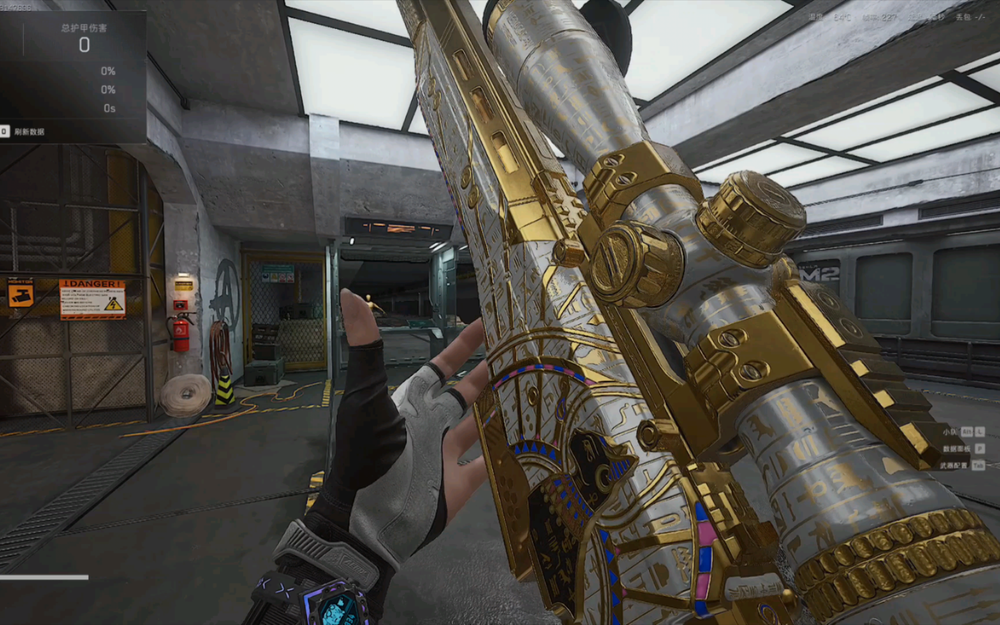 | 12.5万 | 2025-11-12 |
| [今天学会给哈基米音乐做和声！哈基米：All Falls Down](https://www.bilibili.com/video/BV1QxCJBEEKW) |  | 1943 | 2025-11-12 |
| [【爱猫教徒】新作上线，快来看看！](https://www.bilibili.com/video/BV1kyCJBKEkJ) | 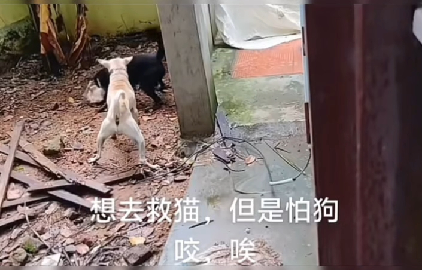 | 2990 | 2025-11-12 |
| [九阳豆浆直播间神人演唱《跳楼基》《蓝莲哈》](https://www.bilibili.com/video/BV1UvCJBGEH4) |  | 38.1万 | 2025-11-12 |
| [新角色：哈基龙](https://www.bilibili.com/video/BV1vcCnBsECo) |  | 11.2万 | 2025-11-12 |
| [🐱“基米在寻觅，绿豆在哪里”🐱丨翻唱](https://www.bilibili.com/video/BV1hckyBUEzg) |  | 245 | 2025-11-12 |
| [地狱客栈第二季歌曲【Love In  A Bottle】](https://www.bilibili.com/video/BV1eRC7BDEZT) |  | 9.6万 | 2025-11-12 |
| [崩铁牢九门：牢昔](https://www.bilibili.com/video/BV136CjBGEfG) |  | 34.4万 | 2025-11-12 |
| [第57次取消哈气](https://www.bilibili.com/video/BV1EtkyBcEiL) |  | 1.5万 | 2025-11-12 |
| [猫：？？？](https://www.bilibili.com/video/BV126kmBUEF6) |  | 14.4万 | 2025-11-12 |
| [喵扎特，一位乱弹琴的哈吉咪音乐家！](https://www.bilibili.com/video/BV1Q5krBGEhc) |  | 4.6万 | 2025-11-12 |
| [臭猫懂你的眼神](https://www.bilibili.com/video/BV1iYkyBoEcx) | 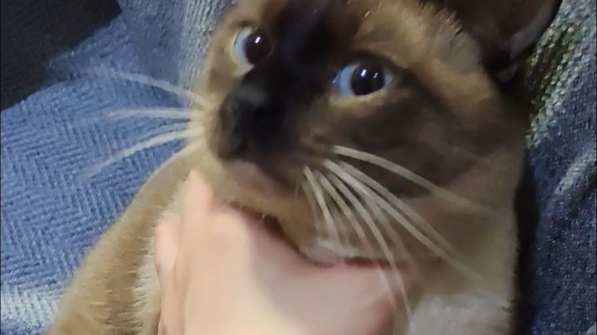 | 5.0万 | 2025-11-11 |
| [哈基蜂新皮肤：哈基蜂](https://www.bilibili.com/video/BV1LakkBSEUj) |  | 8.0万 | 2025-11-11 |
| [【基本功与技巧】绝密6KD哈基米の常用对枪身法](https://www.bilibili.com/video/BV1PokkBYEkp) | 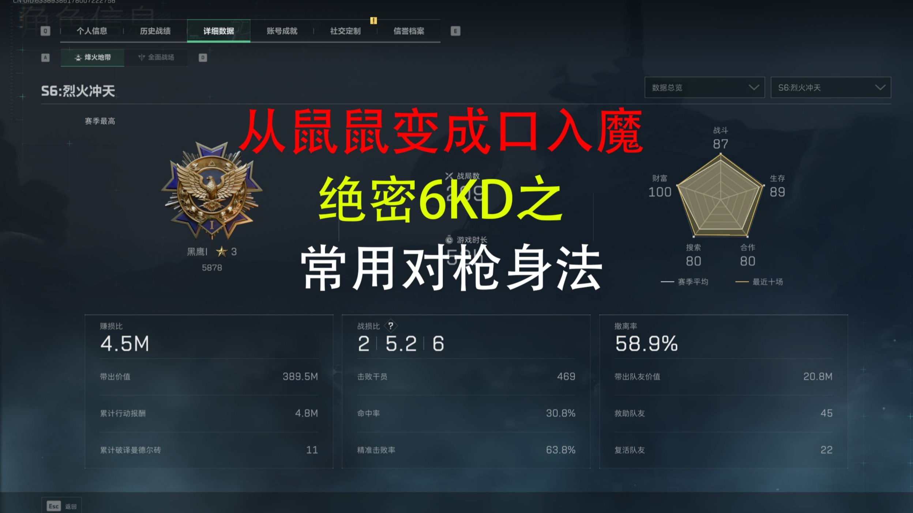 | 1.2万 | 2025-11-11 |
| [不是吃就是拉，小猫咪能有什么烦恼呢？（最近好累，请假一天）](https://www.bilibili.com/video/BV1Szk6BTEYd) | 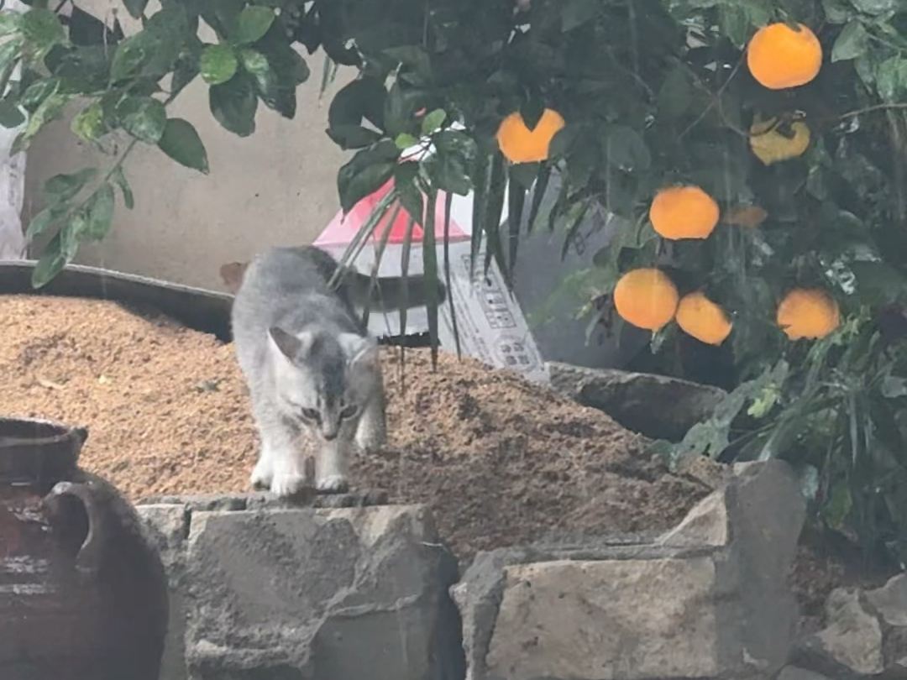 | 8.9万 | 2025-11-11 |
| [货币战争彩色策略金币大使叽米，一个节点给200金币！](https://www.bilibili.com/video/BV1X5krBGEPr) |  | 26.9万 | 2025-11-11 |
| [【超清黎明杀机】多绝望的屠夫 才能跳出这样的舞步](https://www.bilibili.com/video/BV1eTCwBBE2R) |  | 7.5万 | 2025-11-11 |
| [【老鼠人行动】口人航天（绝密）???w→1238w](https://www.bilibili.com/video/BV18iCcBfE4q) | 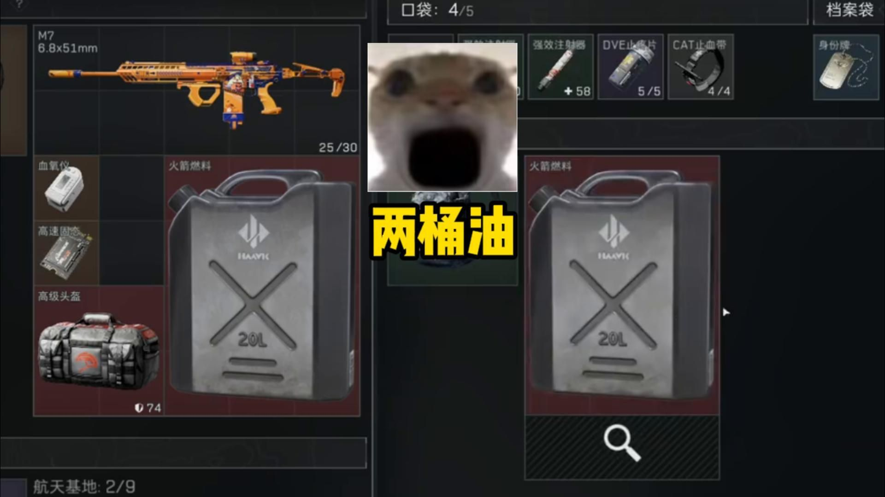 | 95.4万 | 2025-11-10 |
| [我不想回大坝了，我们一起成为航天少年王吧](https://www.bilibili.com/video/BV1vACFBYE9b) |  | 76.9万 | 2025-11-10 |
| [邪基米](https://www.bilibili.com/video/BV1ERkoBcEes) |  | 1.8万 | 2025-11-10 |
| [请猴哥吃芥末~](https://www.bilibili.com/video/BV1pukSBUEcg) | 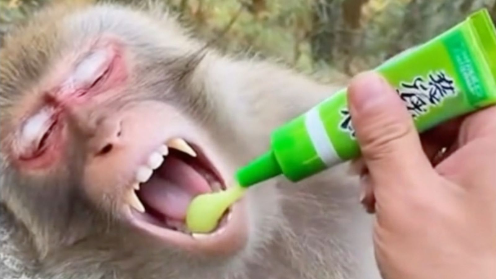 | 18.6万 | 2025-11-10 |
| [《钱 思 戏》](https://www.bilibili.com/video/BV1vDkXB7Ekb) |  | 24.2万 | 2025-11-09 |
| [谁说鼠鼠没长耳朵！](https://www.bilibili.com/video/BV1GdkDBKEqX) |  | 17.4万 | 2025-11-09 |
| [太气人了男子带狗咬猫把猫摔死了，还要狠狠往死猫身上使劲踩。](https://www.bilibili.com/video/BV1zLkSByECW) |  | 3367 | 2025-11-09 |
| [高雅人士舞蹈全集](https://www.bilibili.com/video/BV1WN1oBLEDa) |  | 30.6万 | 2025-11-09 |
| [活力大湾鸡～太颠了！～走地鸡，没瘟，莫怕！](https://www.bilibili.com/video/BV12p1ZBQEux) |  | 35.3万 | 2025-11-08 |
| [🍬五星通缉来了🍬《Mygoidnight City》](https://www.bilibili.com/video/BV1Ng1QBqEDR) |  | 10.0万 | 2025-11-08 |
| [哦啊啊耶耶duangduangduang捏个捏个](https://www.bilibili.com/video/BV19n1XBUExr) |  | 1850 | 2025-11-08 |
| [“一股强劲的音乐向你袭来！”｜《植物大战僵尸硬曲bgm》](https://www.bilibili.com/video/BV1vD2FB3E29) | 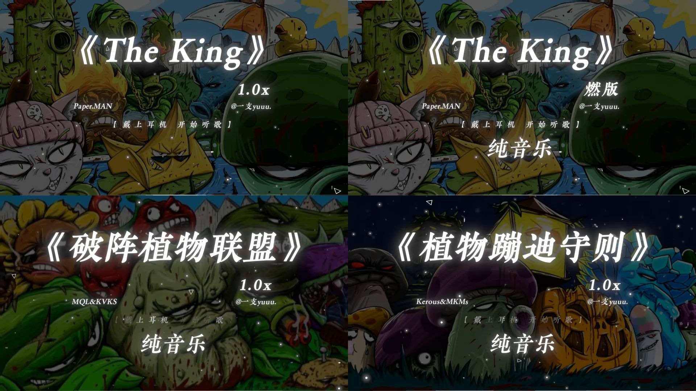 | 2.7万 | 2025-11-08 |
| [《肥猫赋》](https://www.bilibili.com/video/BV1c72gByELe) | 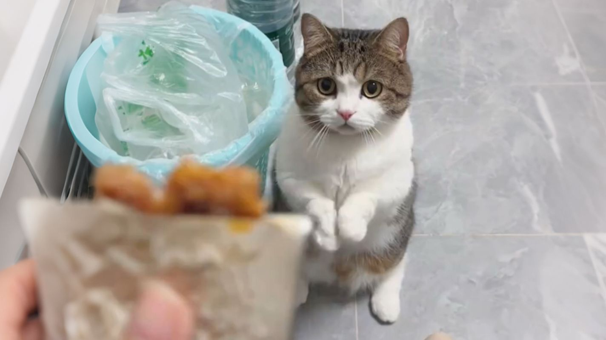 | 17.2万 | 2025-11-08 |
| [【哈基迷迷】要多绝望才能剪出这样的视频](https://www.bilibili.com/video/BV1Mp23BcEsq) |  | 17.0万 | 2025-11-07 |
| [bro试图在实战中打出 luv (sic) 哈基米](https://www.bilibili.com/video/BV1jvWmzMEBn) |  | 2.2万 | 2025-10-20 |
| [哈基米喔南北绿豆1.0](https://www.bilibili.com/video/BV1GbxyzaEDr) |  | 1275 | 2025-10-09 |
| [哈基米的幻想时刻](https://www.bilibili.com/video/BV1JRMYzPEUP) | 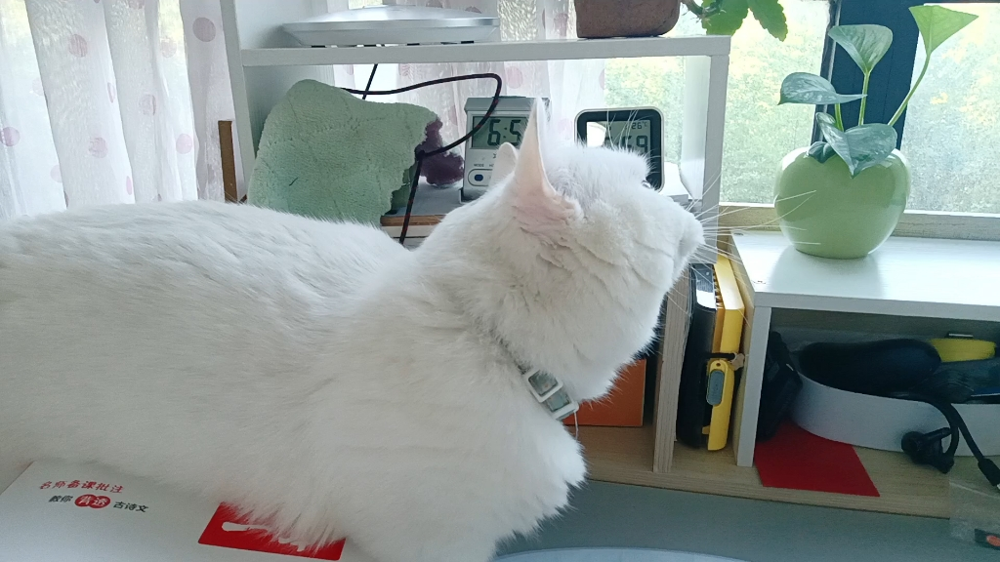 | 211 | 2025-06-15 |
| [哈基米哈基米…哈基米哈基米哈基米哈基米哈基米…哈基米哈基米哈基米哈基米哈基米…哈基米((≡^⚲͜^≡))](https://www.bilibili.com/video/BV1T14y1B7c8) | 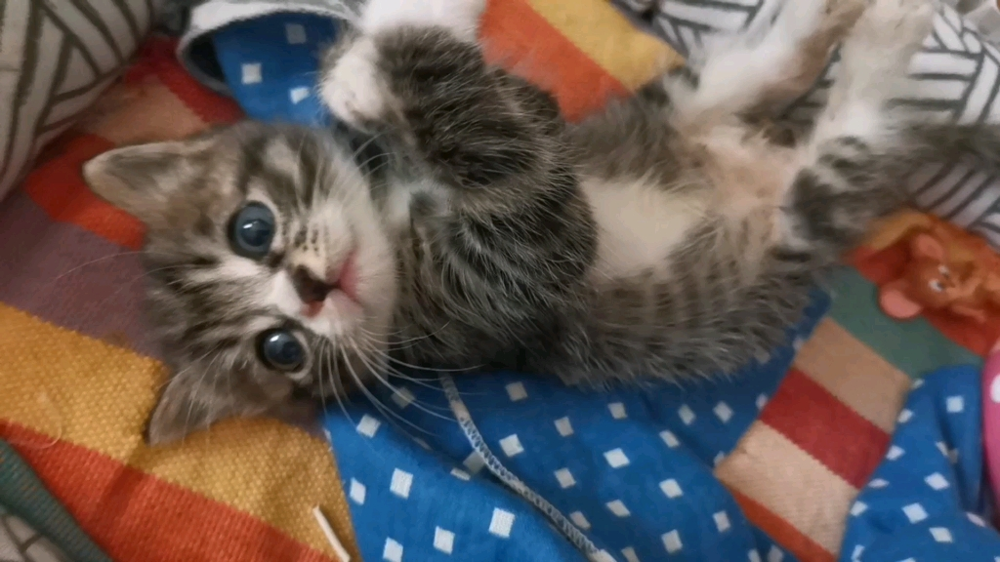 | 288 | 2023-08-01 |

---
*最后更新: 2025-11-15 02:39:27 (自动生成)*
*数据来源: [Bilibili](https://www.bilibili.com)*

## 使用说明

运行以下命令更新视频列表:
```bash
python3 fetch_hajimi_videos.py
```
