# awesome-hajimi
collections of hajimi (哈基米 in Chinese) on the Internet.

## 视频列表 (Video List)

| 视频标题 (Title) | 封面 | 播放量 (Views) | 发布日期 (Date) |
|---|---|---|---|
| [【哈基米音乐】第一次哈的人](https://www.bilibili.com/video/BV1yqJyzeEHE) |  | 2860 | 2025-09-23 |
| [【哈基米音乐】青哈（青丝）](https://www.bilibili.com/video/BV1xoJ1z6EtC) |  | 2.8万 | 2025-09-23 |
| [试试唱《古典哈基米：月光奏鸣曲第三乐章》](https://www.bilibili.com/video/BV1kPJZzeEYQ) |  | 5.1万 | 2025-09-23 |
| [哈基米之2025全球百大DJ——like i do曼波～](https://www.bilibili.com/video/BV1ECnAzVE3K) |  | 5757 | 2025-09-23 |
| [流浪哈基米被保安打死](https://www.bilibili.com/video/BV1UWJkzvEhZ) |  | 1.9万 | 2025-09-23 |
| [《你的名字》但哈基米（你的耄字）](https://www.bilibili.com/video/BV1wpnKzsE9V) |  | 18.0万 | 2025-09-23 |
| [「自翻中文字幕」Richer than you 哈基米山歌但是Stronger than you](https://www.bilibili.com/video/BV1KxnAzREC7) | 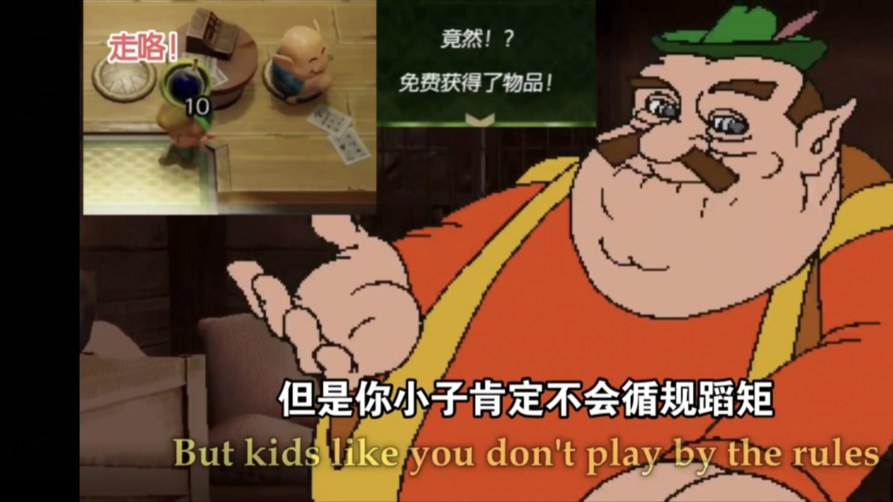 | 8332 | 2025-09-22 |
| [哈基米一激灵](https://www.bilibili.com/video/BV1PenAzJEbA) | 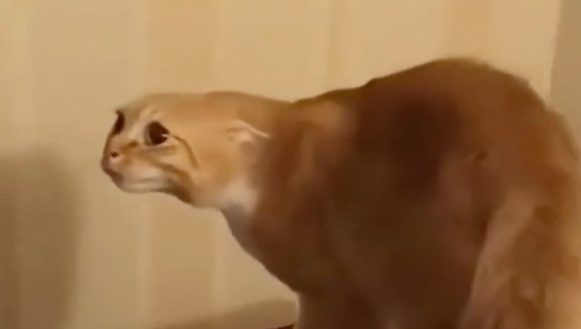 | 3.7万 | 2025-09-22 |
| [哈基米的老窝被蟒蛇袭击，这下那没路躲](https://www.bilibili.com/video/BV1yRnPz9E1y) | 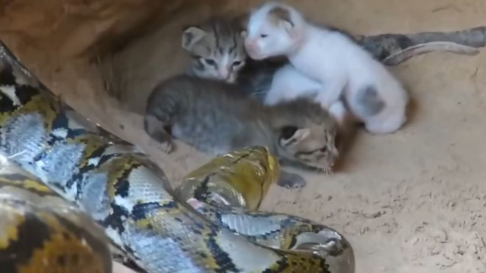 | 21.2万 | 2025-09-22 |
| [哈基山的基米美如水啊](https://www.bilibili.com/video/BV18ynPzhEuz) |  | 44.6万 | 2025-09-22 |
| [这是猫啊？](https://www.bilibili.com/video/BV1XqW3zFETT) |  | 17.8万 | 2025-09-22 |
| [【哈基米】kmietiji je lepol （哈基的农场）](https://www.bilibili.com/video/BV1XDnczfE5m) | 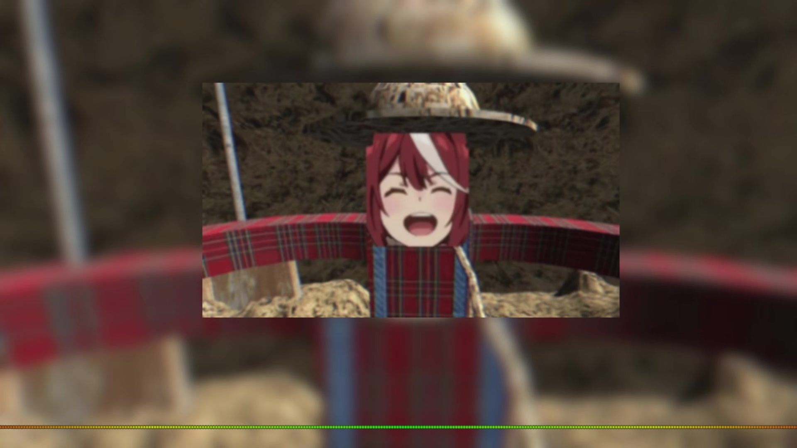 | 1029 | 2025-09-22 |
| [猫：刚才我跟你开玩笑的](https://www.bilibili.com/video/BV1yDnwzUEfq) | 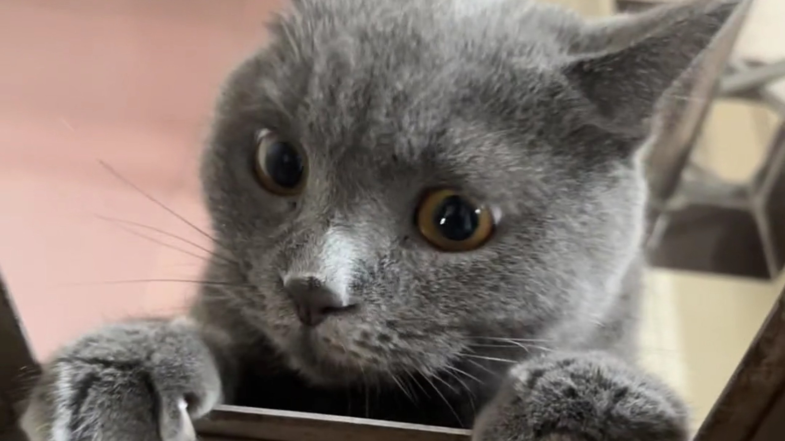 | 27.1万 | 2025-09-22 |
| [哈基米卡路里了](https://www.bilibili.com/video/BV1pXnwz7EiP) | 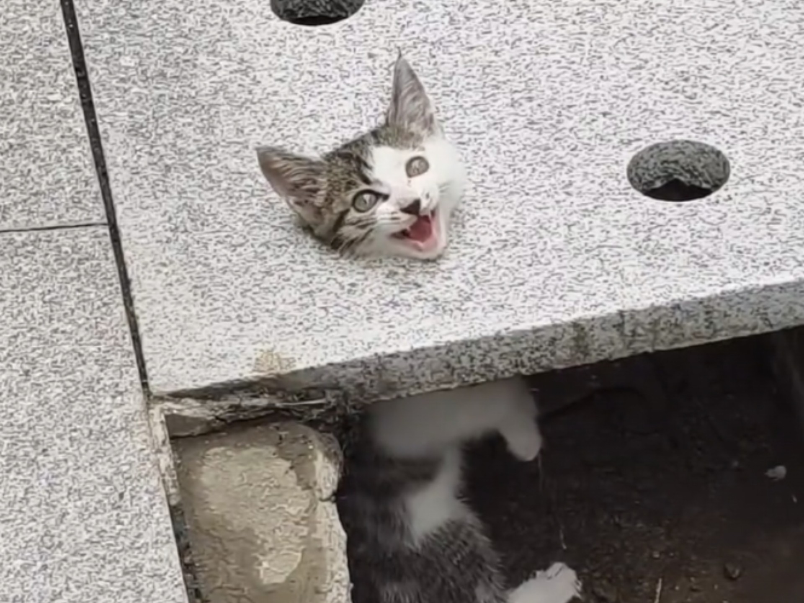 | 1.0万 | 2025-09-22 |
| [哈基宝贝](https://www.bilibili.com/video/BV1u3JfzUEpx) |  | 1839 | 2025-09-22 |
| [🐱把基米拼好给你🐱](https://www.bilibili.com/video/BV14LWPzwE8s) | 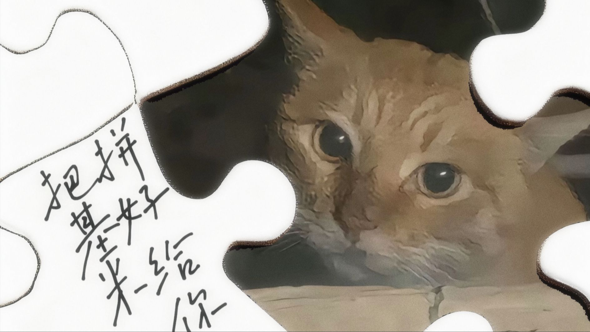 | 10.5万 | 2025-09-21 |
| [自在悠闲的基米](https://www.bilibili.com/video/BV15GWczqELK) |  | 4183 | 2025-09-21 |
| [哈基糜制作中](https://www.bilibili.com/video/BV1SnWczcECN) | 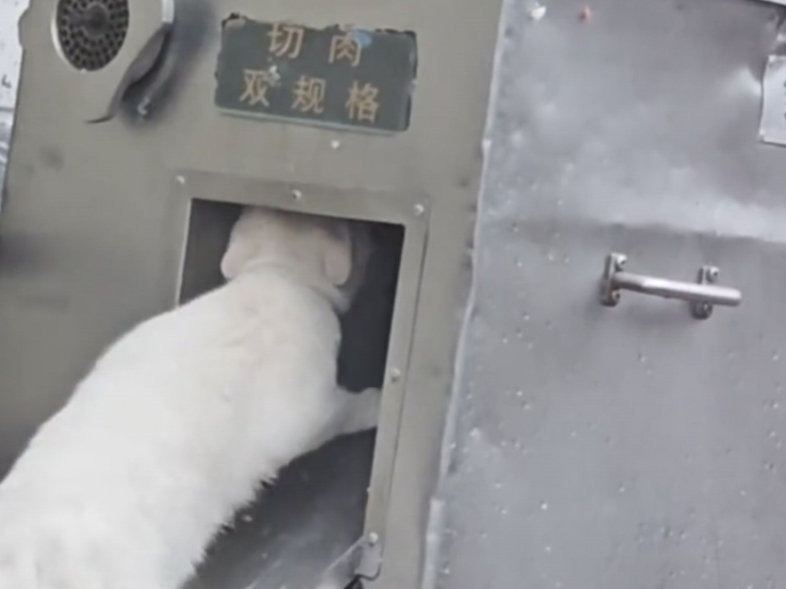 | 10.3万 | 2025-09-21 |
| [喂！谁教你这么捡猫的！](https://www.bilibili.com/video/BV1kYpfz5E3c) |  | 74.6万 | 2025-09-21 |
| [基米一直走🐱](https://www.bilibili.com/video/BV1aQpfzwEZx) |  | 6851 | 2025-09-21 |
| [🎵讨厌哈基米🎵（修复版）](https://www.bilibili.com/video/BV1NrpdzGE7p) | 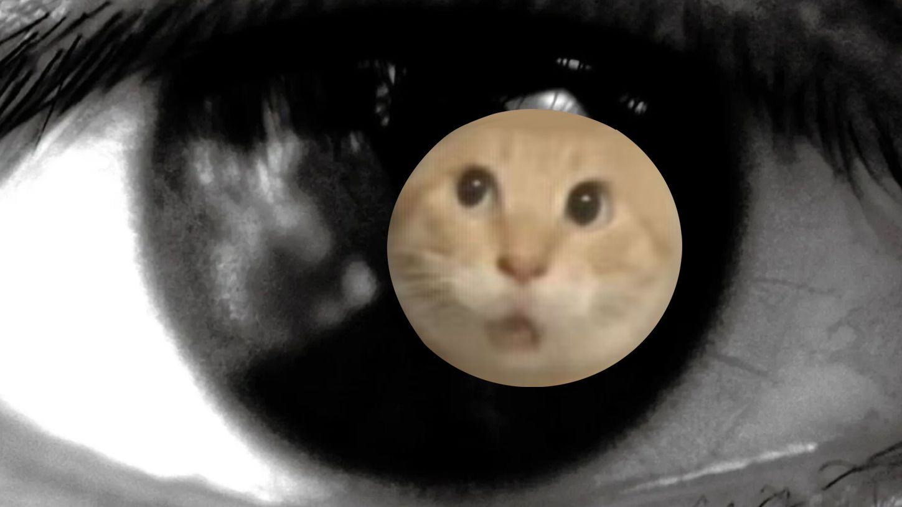 | 2638 | 2025-09-21 |
| [哈气爽咪最难救了](https://www.bilibili.com/video/BV1X3pfzbEpV) | 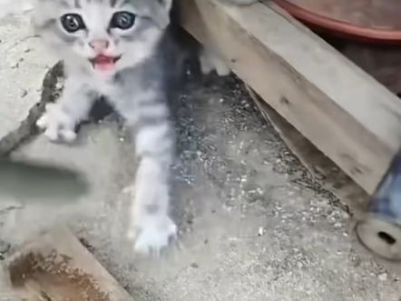 | 5.2万 | 2025-09-20 |
| [微评画_光钻能表演哈基米山歌吗？【粉丝评画の85】](https://www.bilibili.com/video/BV1iVW5zVEUw) |  | 42.3万 | 2025-09-20 |
| [⚡昭和哈基米⚡stay with 哈基米完整版](https://www.bilibili.com/video/BV1KGpXzvEb4) |  | 3.3万 | 2025-09-20 |
| [🐱Edge Of 哈基&#x27;s Life🐱](https://www.bilibili.com/video/BV1XwpXz3EYy) |  | 8.5万 | 2025-09-20 |
| [哈基米爱吃塔斯汀](https://www.bilibili.com/video/BV1dqpXz7EMc) | 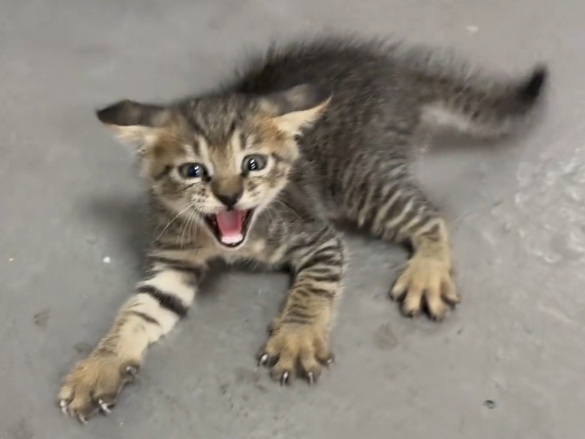 | 1.4万 | 2025-09-20 |
| [基米基米gogogo](https://www.bilibili.com/video/BV1ddpQzLEAm) | 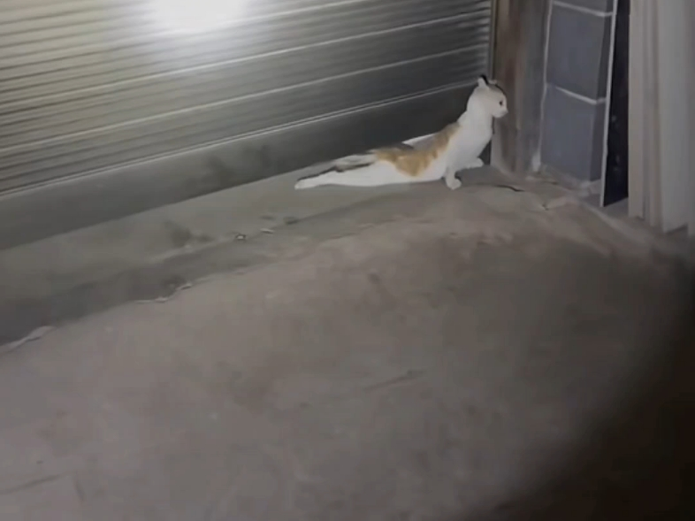 | 3.0万 | 2025-09-20 |
| [哈基米喔南北绿豆 阿西嗨呀库奶噜~](https://www.bilibili.com/video/BV1Z3W5zyE3Y) | 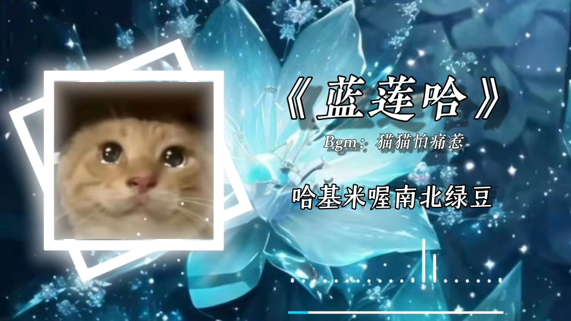 | 2152 | 2025-09-19 |
| [哈基米的构成！](https://www.bilibili.com/video/BV1TPW3zXEJe) | 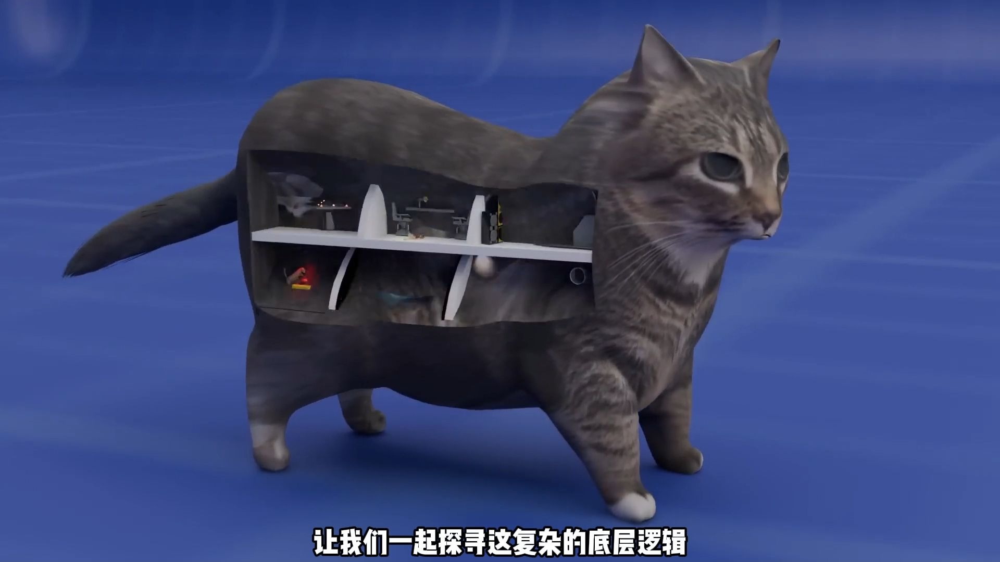 | 10.2万 | 2025-09-19 |
| [给日本人唱《哈基米之歌》会有什么反应？](https://www.bilibili.com/video/BV1hzW3zfE2C) |  | 88.5万 | 2025-09-19 |
| [捡到猫的第七十六天 广东领猫习俗与哈基米报恩](https://www.bilibili.com/video/BV1cFpbz4E9Q) |  | 30.4万 | 2025-09-19 |
| [猫儿这个无限制格斗](https://www.bilibili.com/video/BV1jYWPzSExo) | 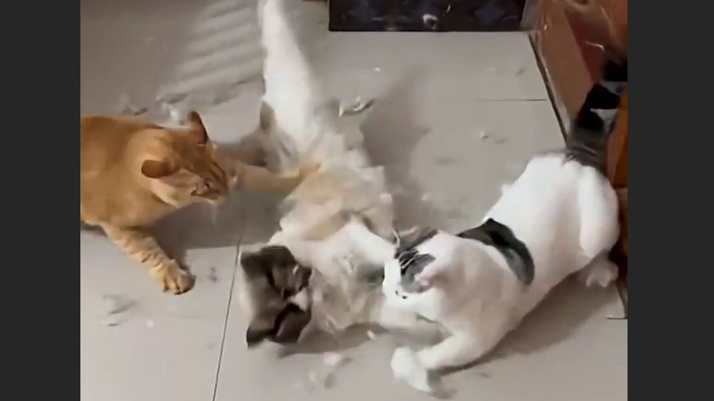 | 8481 | 2025-09-19 |
| [可是大狗嚼真的好开心啊](https://www.bilibili.com/video/BV1yapbzYEky) | 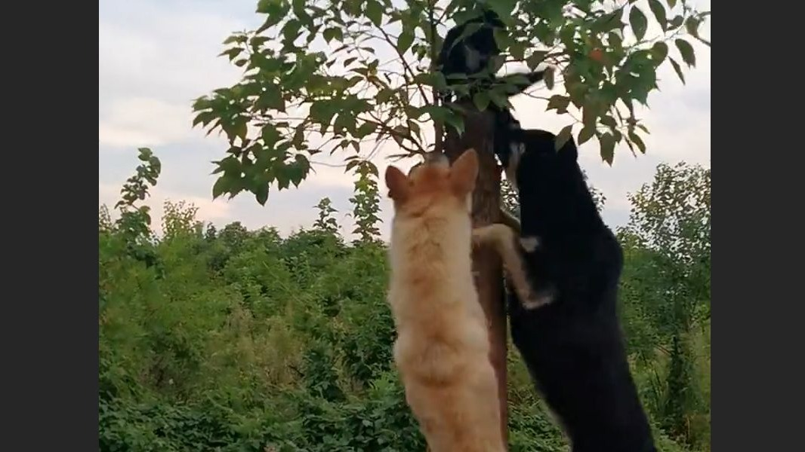 | 2.4万 | 2025-09-18 |
| [ASMR【哈基米触发音纯享】让哈基米修复你的双耳~神人了~](https://www.bilibili.com/video/BV1yhp4zxErV) |  | 4.3万 | 2025-09-17 |
| [🎵哈基米3:03PM🎵纯净治愈哈基米小曲](https://www.bilibili.com/video/BV1tSptzAEJC) |  | 34.3万 | 2025-09-17 |
| [大狗基米交交交，柔情猫娘叫叫叫](https://www.bilibili.com/video/BV1c9pxzQESs) | 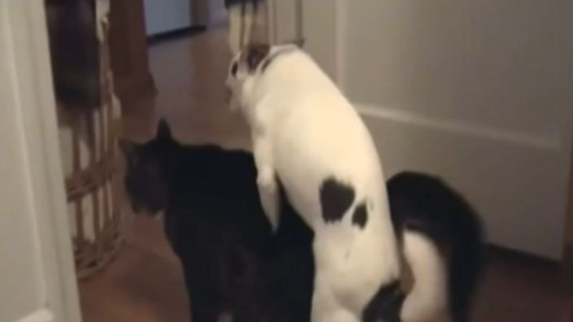 | 1.1万 | 2025-09-17 |
| [哈基宝贝](https://www.bilibili.com/video/BV1Snp4zPELx) |  | 40.1万 | 2025-09-17 |
| [【哈基米FM】起床哈](https://www.bilibili.com/video/BV1Tnpmz9EjB) | 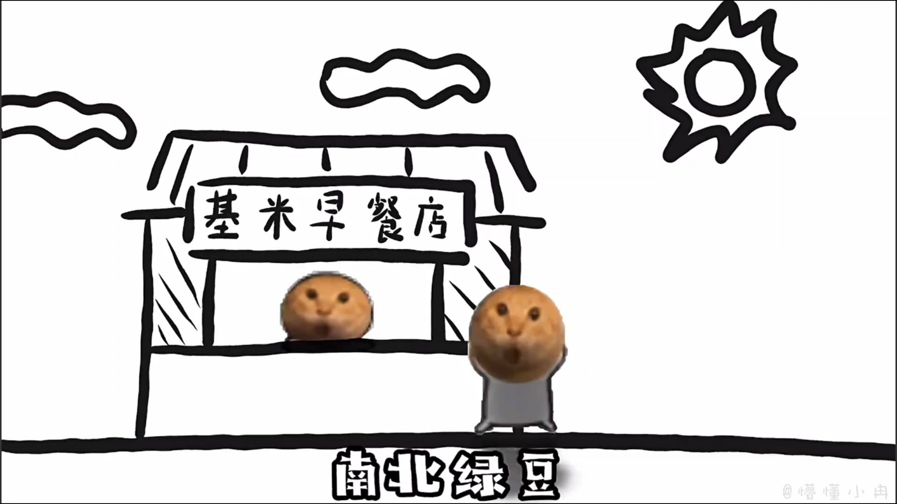 | 297 | 2025-09-16 |
| [小卖部的哈基米](https://www.bilibili.com/video/BV1espyzWE2h) |  | 48.2万 | 2025-09-16 |
| [【纯净哈基米】打上花火（完整版）](https://www.bilibili.com/video/BV1rSpcz7E8t) |  | 5.1万 | 2025-09-14 |
| [闷闷不乐的大胃袋哈基米](https://www.bilibili.com/video/BV19jHozWEGz) | 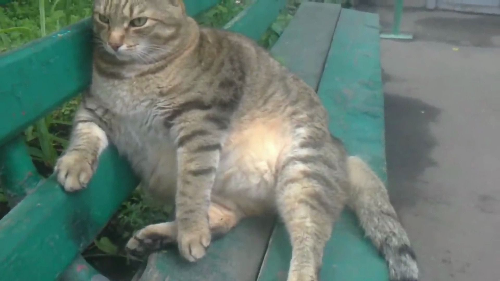 | 2.4万 | 2025-09-14 |
| [小哈基米从高处摔下，母亲立即救援，展现无私的爱](https://www.bilibili.com/video/BV1xtpLzfETs) | 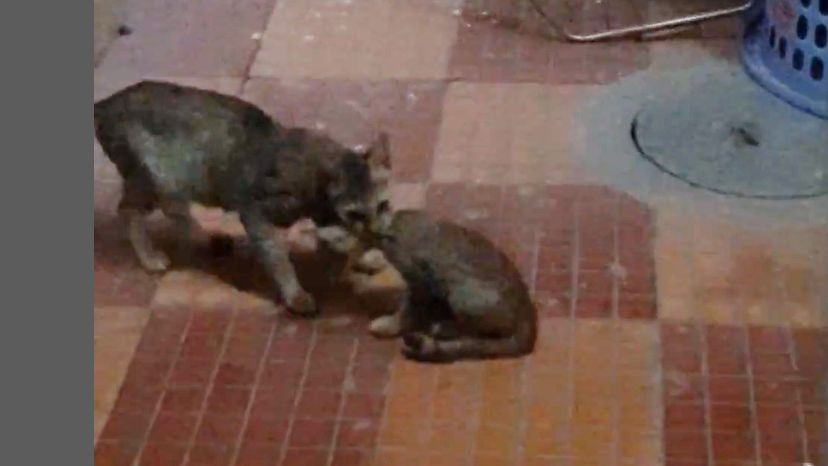 | 3.1万 | 2025-09-13 |
| [《哈基米编年史》第四集：一只猫，一杯水，一个时代。](https://www.bilibili.com/video/BV1QRpVzaEpF) |  | 81.1万 | 2025-09-13 |
| [基 米 说](https://www.bilibili.com/video/BV1KHp3zEEqh) |  | 46.0万 | 2025-09-12 |
| [⚡哈 气 的 巨 人⚡](https://www.bilibili.com/video/BV1XrHvzoEoL) |  | 2.1万 | 2025-09-12 |
| [《哈基山的基米美如水》合唱版](https://www.bilibili.com/video/BV1JBHXz9EkW) | 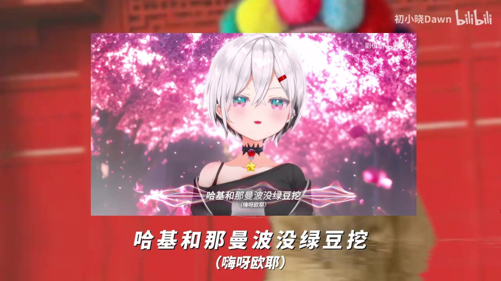 | 23.6万 | 2025-09-10 |
| [猫儿这个惊讶！](https://www.bilibili.com/video/BV1KtHXzhECT) | 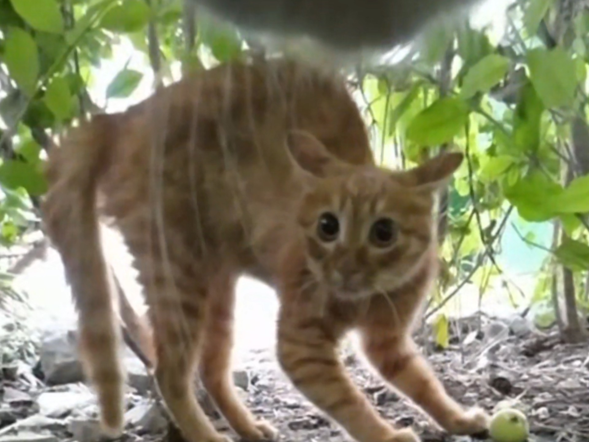 | 103.3万 | 2025-09-10 |
| [《梦回哈》如果我们能活着出去的话，南北路多，你愿意陪我一起哈吗？](https://www.bilibili.com/video/BV156adzLE76) |  | 12.5万 | 2025-09-08 |
| [🐱哈基山的基米美如水啊🐱](https://www.bilibili.com/video/BV1vgYVzfEuF) |  | 496.6万 | 2025-09-07 |
| [哈基米不舒服会自己走开的](https://www.bilibili.com/video/BV1tHa8zaED8) | 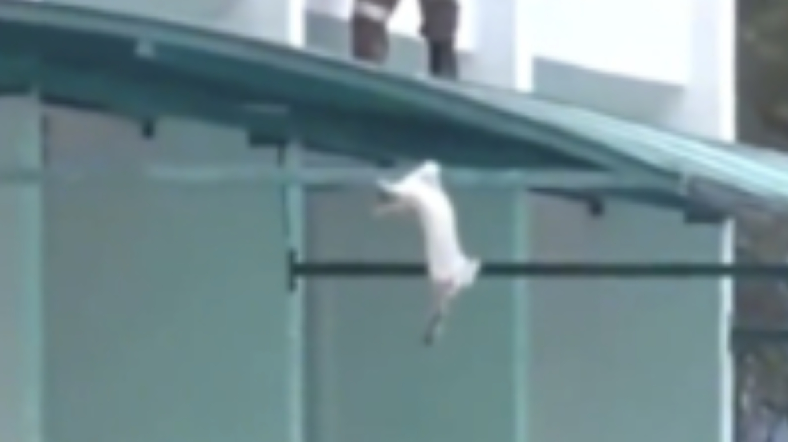 | 11.2万 | 2025-09-05 |
| [基米说完整版](https://www.bilibili.com/video/BV1Dua2zyE4G) |  | 524.9万 | 2025-09-04 |
| [【二编音频重置】《耄愁乡》我啸狂风于耄爬架上，哈气凝成寒霜飞扬](https://www.bilibili.com/video/BV14XagzzE1t) |  | 69.6万 | 2025-09-03 |
| [哈基米南北绿豆](https://www.bilibili.com/video/BV1yHaGzBEgE) |  | 21.0万 | 2025-08-31 |
| [【哈基米】曼波倦怠([Phonk]TIRED OF PROBLEMS)](https://www.bilibili.com/video/BV12ChazwEcW) |  | 45.5万 | 2025-08-30 |
| [哈基米世界——武器合成攻略](https://www.bilibili.com/video/BV1fkhvzbEbQ) |  | 2.0万 | 2025-08-30 |
| [林芷伊糖笑合集](https://www.bilibili.com/video/BV1uwhiz2EQ7) |  | 12.6万 | 2025-08-30 |
| [🥰 小 小 的 哈](https://www.bilibili.com/video/BV1eShyz1EeM) |  | 32.8万 | 2025-08-29 |
| [【完整版】𝓸𝓷𝓮 𝓵𝓪𝓼𝓽 𝓱𝓲𝓼𝓼 再见了，所有的基米【哈基杯DAY13】](https://www.bilibili.com/video/BV1bWekziEyN) |  | 19.7万 | 2025-08-27 |
| [哈基米是一只早睡早起品学兼优的小猫](https://www.bilibili.com/video/BV1dUvNzmE5H) | 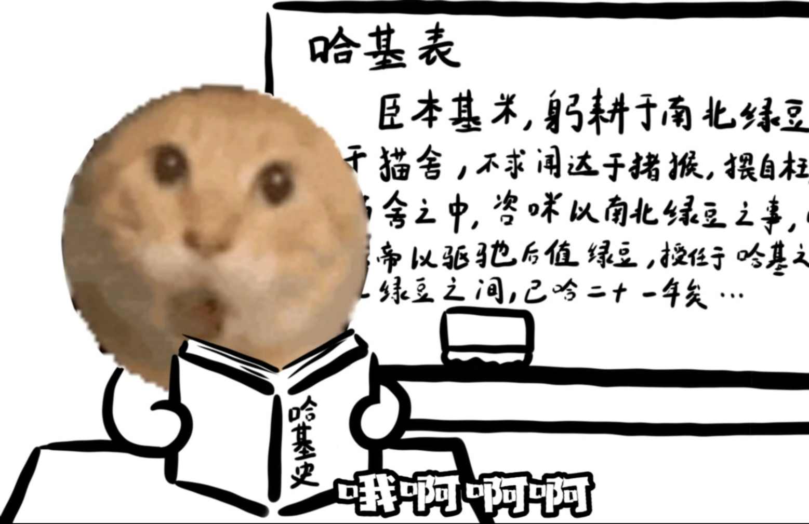 | 40.7万 | 2025-08-26 |
| [【循环歌单】《睡觉の小曲》BGM:おはなばたけ (哈基米) 面点海](https://www.bilibili.com/video/BV1zLeEz9E2Z) |  | 178.5万 | 2025-08-24 |
| [哈基米的一生劲敌](https://www.bilibili.com/video/BV1bMeezyEuz) | 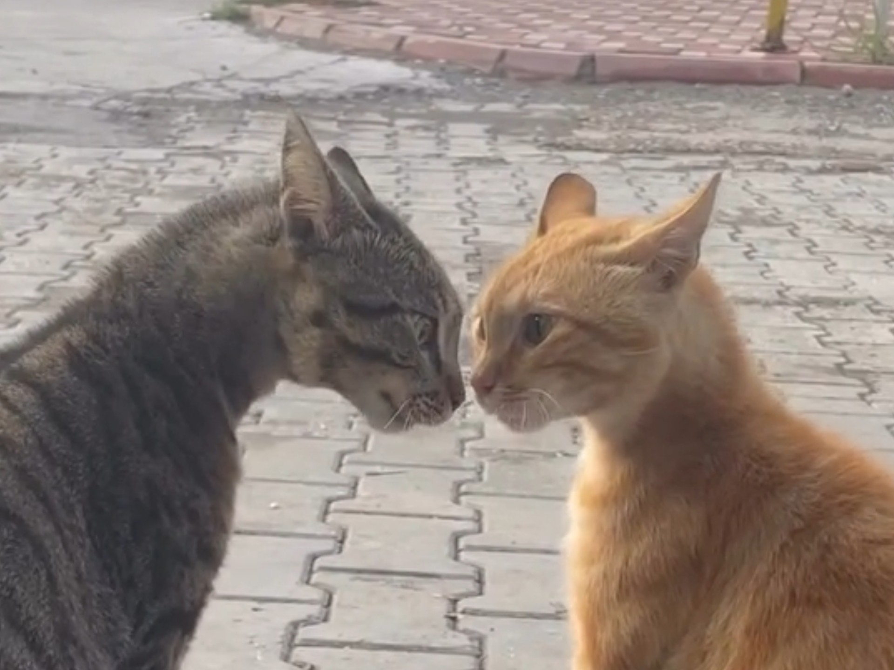 | 95.0万 | 2025-08-23 |
| [不再曼波](https://www.bilibili.com/video/BV1M6e8zTE9c) |  | 82.7万 | 2025-08-22 |
| [哈基米变爆丸小子力（悲）](https://www.bilibili.com/video/BV1qvYnzREa3) | 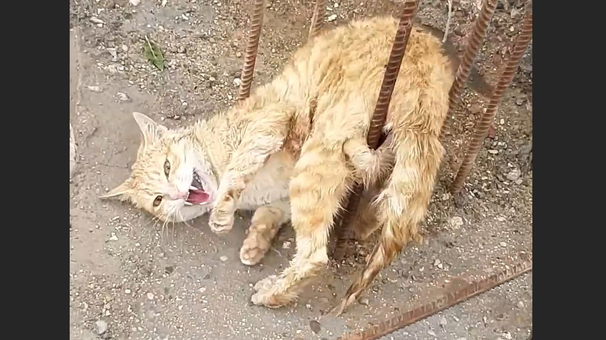 | 14.1万 | 2025-08-18 |
| [听完全家因果循环《哈基米Sleepwalking》⭐️⭐️⭐️⭐️](https://www.bilibili.com/video/BV1c5YvziEvD) |  | 39.0万 | 2025-08-16 |
| [「循环歌曲」/《曼波の小曲》/《跑刀の小曲》/《曼波 no more》](https://www.bilibili.com/video/BV1YHtrz4EiL) | 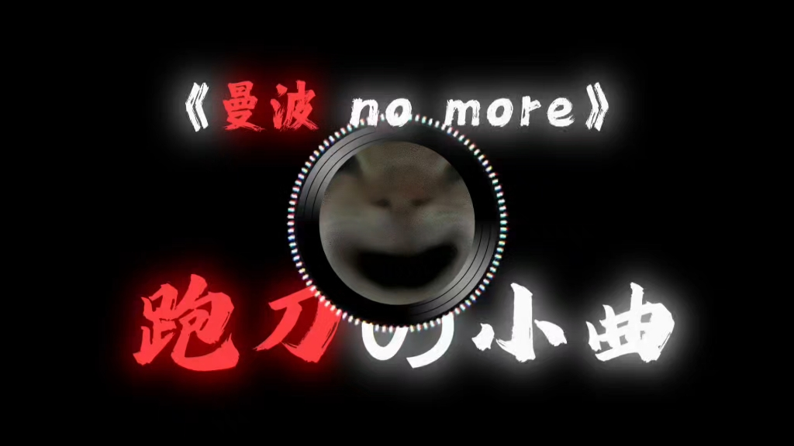 | 15.9万 | 2025-08-07 |
| [1H循环丨&quot;急，我家猫昨天听了这首歌，兜了点猫条就连夜出发去西藏了。&quot;《蓝莲哈》](https://www.bilibili.com/video/BV1wgtwzaEoq) | 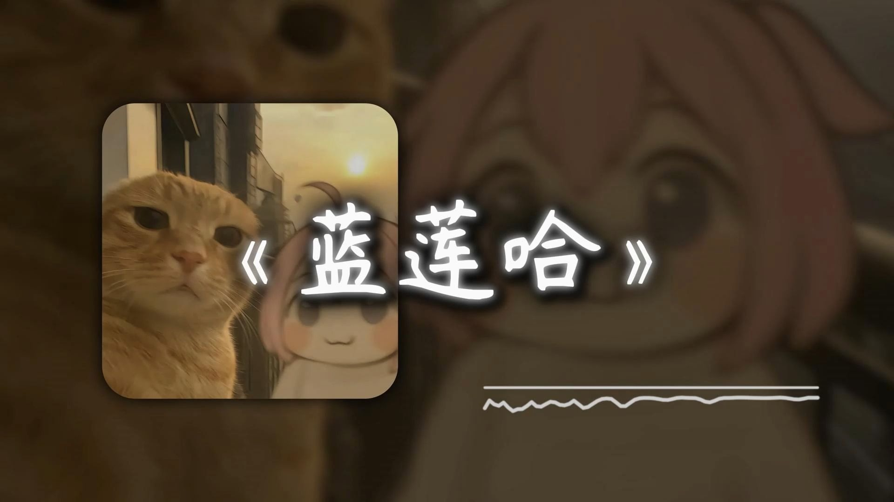 | 57.5万 | 2025-08-07 |
| [【睡觉の小曲】｜《哈基米:花田》（洗脑1小时）](https://www.bilibili.com/video/BV1C74RzCEQa) | 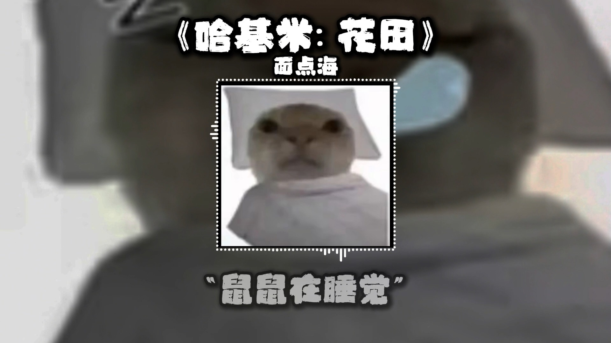 | 24.7万 | 2025-08-05 |
| [哈基米这个安稳](https://www.bilibili.com/video/BV1Vctgz6E1V) |  | 12.2万 | 2025-08-04 |
| [1小时循环抽象版《蜜雪冰城哈基米》你爱我~我爱你 哈基米 甜蜜蜜](https://www.bilibili.com/video/BV1P38UzNEj6) |  | 3.6万 | 2025-07-31 |
| [【哈基米FM】🐱叛变神曲 🐱要哈吗？在这里？](https://www.bilibili.com/video/BV1Da8yzNEJK) |  | 12.9万 | 2025-07-31 |
| [【哈基米FM】：年轮](https://www.bilibili.com/video/BV11588zJEhf) |  | 151.8万 | 2025-07-26 |
| [【完整版】🐱“我肯定，在几百年前就对你哈过气”🐱](https://www.bilibili.com/video/BV12ybQzLEBW) |  | 36.2万 | 2025-07-25 |
| [【录像首次公布】他是哈基米史上最高的山](https://www.bilibili.com/video/BV1sT8AzgEQk) |  | 719.8万 | 2025-07-23 |
| [哈基米自毁程序这一块](https://www.bilibili.com/video/BV1sXbdzxELD) | 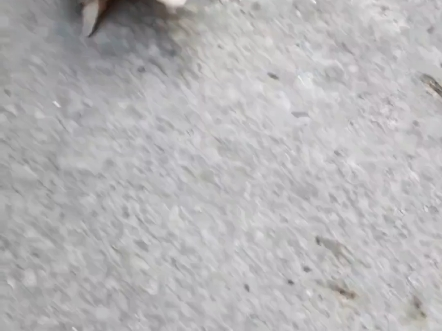 | 26.2万 | 2025-07-23 |
| [哈基米：不要相信哈基米的话（完整版）](https://www.bilibili.com/video/BV1XJu2ztEGx) |  | 27.0万 | 2025-07-18 |
| [【完整版】最后一哈](https://www.bilibili.com/video/BV1L6uszvE5u) |  | 297.8万 | 2025-07-16 |
| [⚡抄的最累的一集⚡](https://www.bilibili.com/video/BV1x83ozJEpC) |  | 132.4万 | 2025-07-05 |
| [死一样的哈过，死一样的抽过2000w播放纪念版](https://www.bilibili.com/video/BV13aKnzCEfU) | 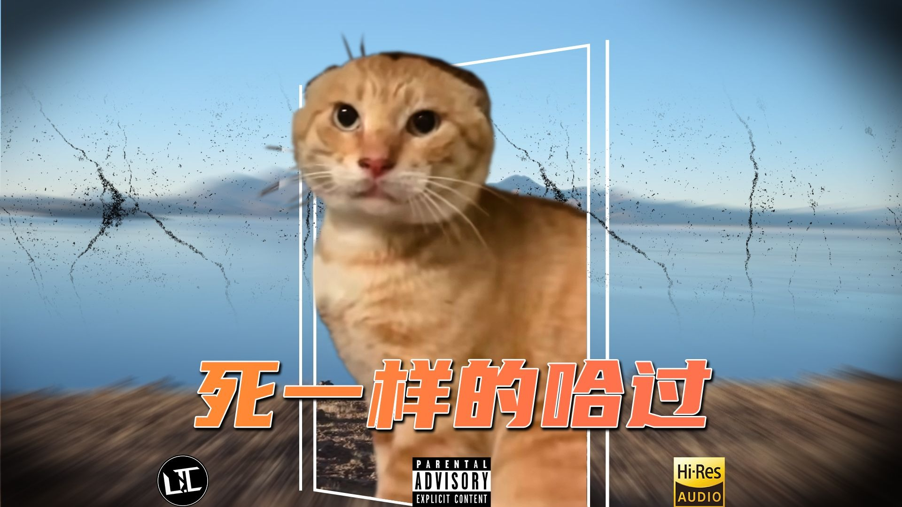 | 125.2万 | 2025-06-25 |
| [哈基米原版](https://www.bilibili.com/video/BV1CtKJz4Ec6) |  | 36.2万 | 2025-06-25 |
| [【基米FM】基蜜蜜（甜蜜蜜）](https://www.bilibili.com/video/BV16UNdzRE6z) |  | 62.6万 | 2025-06-19 |
| [🐱我被困在了哈基乡](https://www.bilibili.com/video/BV1RGNJzCEXq) | 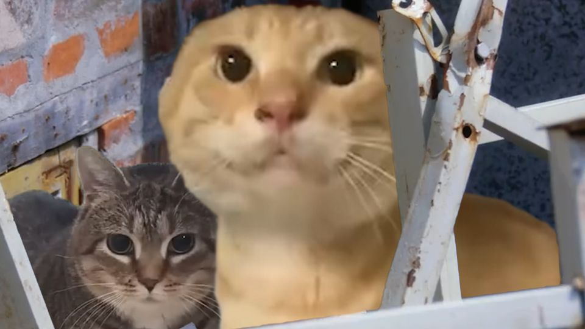 | 1842.3万 | 2025-06-18 |
| [神的没边了 曼波两下得了](https://www.bilibili.com/video/BV11NNqzGEJb) |  | 735.6万 | 2025-06-17 |
| [《舌尖上的哈基米》翻唱](https://www.bilibili.com/video/BV1PQTKztE23) |  | 86.9万 | 2025-06-06 |
| [来去曼波🎵加长版](https://www.bilibili.com/video/BV1VJEfzJEkx) |  | 359.8万 | 2025-05-20 |
| [【哈基米FM】舌尖上的基米](https://www.bilibili.com/video/BV1F8EDz6EFg) |  | 243.0万 | 2025-05-19 |
| [【补档】全网最细！《耄耋编年史》第二集](https://www.bilibili.com/video/BV15iJuzEE6H) |  | 176.2万 | 2025-05-18 |
| [【补档】全网最细！《耄耋编年史》第一集](https://www.bilibili.com/video/BV1fMJgzxEvN) | 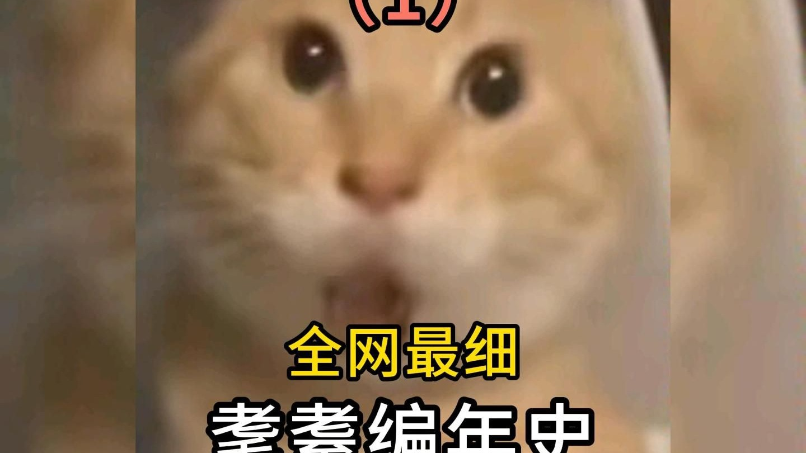 | 227.9万 | 2025-05-18 |
| [【哈基米逆风翻盘】underground](https://www.bilibili.com/video/BV1f2EwzeEtN) |  | 15.6万 | 2025-05-13 |
| [🐱星基穿越🐱](https://www.bilibili.com/video/BV1kydQYFELi) |  | 215.3万 | 2025-04-12 |
| [哈集美和哈基米的爱恨情仇！](https://www.bilibili.com/video/BV1twQHYkEZ3) |  | 8.1万 | 2025-03-12 |
| [跳楼基](https://www.bilibili.com/video/BV1N3PpezEpv) |  | 595.6万 | 2025-02-27 |
| [【基米核】Are You Lost（完整版）](https://www.bilibili.com/video/BV1MaPte8EGd) |  | 123.4万 | 2025-02-24 |
| [【哈基米FM】赤 佮](https://www.bilibili.com/video/BV1sXNbeZEt4) |  | 22.6万 | 2025-02-07 |
| [【补档】🎵曼波 𝑵𝒐 𝑴𝒐𝒓𝒆🎵不再曼波（完整版）](https://www.bilibili.com/video/BV1qzFmeQEap) |  | 546.5万 | 2025-01-31 |
| [哈基米：晴天](https://www.bilibili.com/video/BV1d4cVedE7f) |  | 7.0万 | 2025-01-12 |
| [霍 全 甲](https://www.bilibili.com/video/BV12mxeeFEMu) |  | 155.9万 | 2024-10-01 |
| [哈基米：Billie Jean](https://www.bilibili.com/video/BV1JPxxe4Ejn) |  | 573.8万 | 2024-09-30 |
| [听完全家五星通缉《哈基Midnight City》⭐⭐⭐⭐⭐](https://www.bilibili.com/video/BV1nTsWeXE51) |  | 412.0万 | 2024-08-27 |
| [爱猫FM之哈基米的澎湖湾](https://www.bilibili.com/video/BV17b421p7aC) |  | 57.8万 | 2024-06-28 |
| [哈基米是什么梗【梗指南】](https://www.bilibili.com/video/BV1LX4y1j78y) |  | 383.8万 | 2023-08-09 |

---
*最后更新: 2025-09-24 02:35:05 (自动生成)*
*数据来源: [Bilibili](https://www.bilibili.com)*

## 使用说明

运行以下命令更新视频列表:
```bash
python3 fetch_hajimi_videos.py
```
