# awesome-hajimi
collections of hajimi (哈基米 in Chinese) on the Internet.

## 视频列表 (Video List)

| 视频标题 (Title) | 封面 | 播放量 (Views) | 发布日期 (Date) |
|---|---|---|---|
| [再次拍到哈基米](https://www.bilibili.com/video/BV155xPzSEHs) | 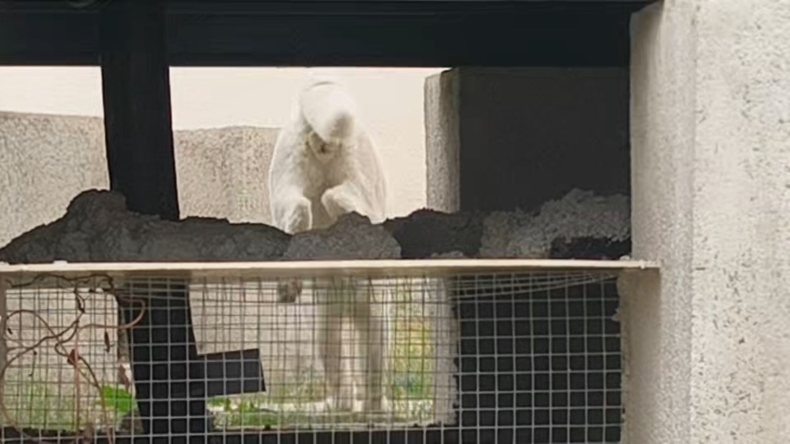 | 52 | 2025-10-26 |
| [【原曲不使用】翻唱-哈基米：sleepwalking](https://www.bilibili.com/video/BV15jxPzEEHv) |  | 24 | 2025-10-26 |
| [你知道你是哈基米吗？](https://www.bilibili.com/video/BV13JxPzjE1u) |  | 281 | 2025-10-26 |
| [哈基米莫南北绿豆——](https://www.bilibili.com/video/BV18qxczTEUJ) | 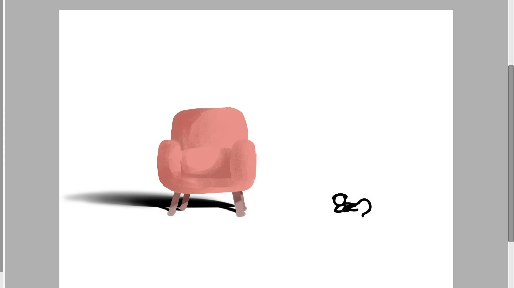 | 92 | 2025-10-26 |
| [哈基米：青哈瓷](https://www.bilibili.com/video/BV1eaxcz6Ejc) |  | 158 | 2025-10-26 |
| [你是说，哈基米哄睡了一队……？](https://www.bilibili.com/video/BV1nFxwzHEHe) |  | 90 | 2025-10-26 |
| [跑步就要边跑边唱哈基米南北绿豆阿西嘎阿西](https://www.bilibili.com/video/BV1LbxczCEop) |  | 12 | 2025-10-26 |
| [又是哈基米](https://www.bilibili.com/video/BV1EFxwzHEbB) | 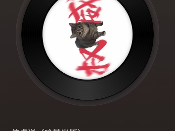 | 1 | 2025-10-26 |
| [哈基米版](https://www.bilibili.com/video/BV1noxczWEYu) | 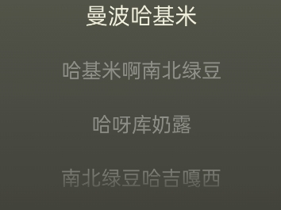 | 5 | 2025-10-26 |
| [哈基米南北绿豆](https://www.bilibili.com/video/BV1BKxwz7EVZ) | 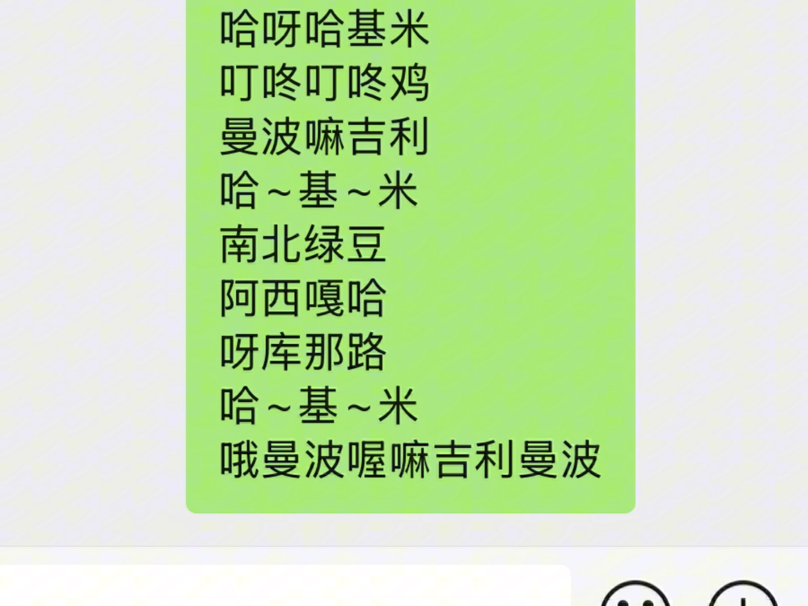 | 95 | 2025-10-26 |
| [打火机(哈基米)](https://www.bilibili.com/video/BV1HRxczREVL) | 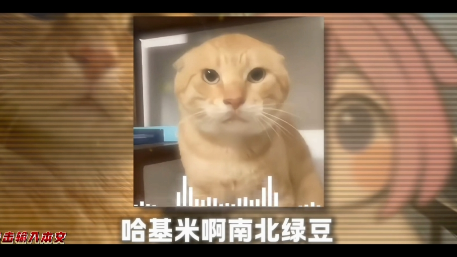 | 4 | 2025-10-25 |
| [哈基米怎么聪明](https://www.bilibili.com/video/BV13ExwzuEEY) | 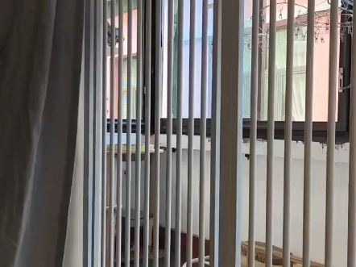 | 13 | 2025-10-25 |
| [哈基米南北路多猫咪](https://www.bilibili.com/video/BV1zYsZzVEDH) |  | 109 | 2025-10-25 |
| [虽迟但到，《伯虎说》但混哈其米](https://www.bilibili.com/video/BV1ZzsZzMEpA) |  | 112 | 2025-10-25 |
| [日本猫猫笑吐了！哈基米一出现中日主播全员哈化了！](https://www.bilibili.com/video/BV1c3sfz7EeP) |  | 3.5万 | 2025-10-25 |
| [基米小学:波林是一只邪恶的小猫](https://www.bilibili.com/video/BV1rGsfz1E5q) | 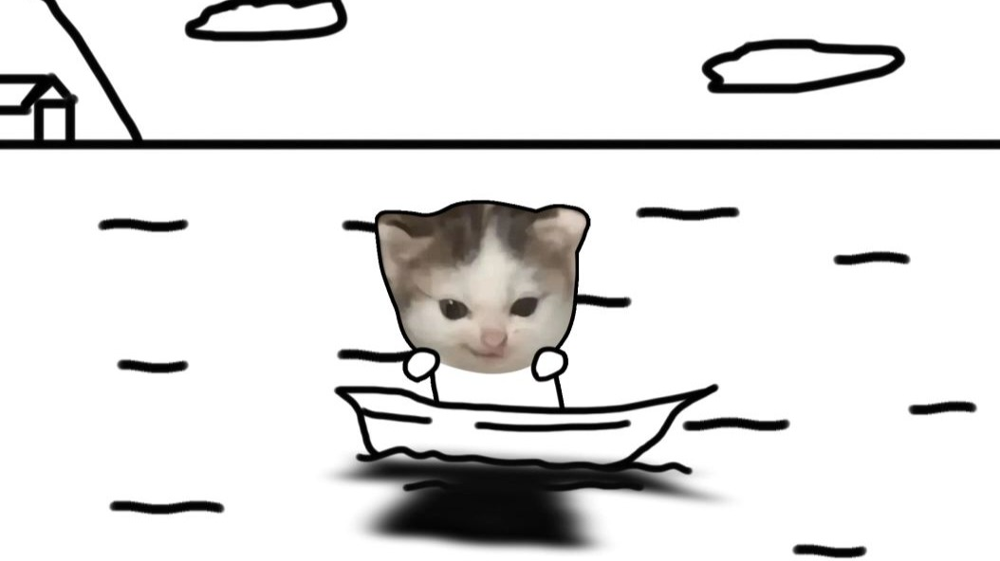 | 4.4万 | 2025-10-25 |
| [流萤哈基米南北绿豆](https://www.bilibili.com/video/BV18isfzFE8q) |  | 17 | 2025-10-25 |
| [哈基米版弥渡山歌](https://www.bilibili.com/video/BV1jHsfz6ExU) | 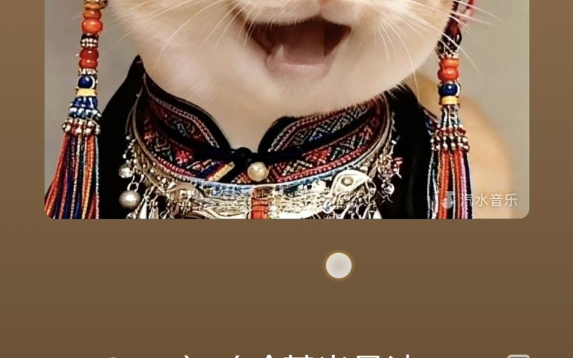 | 57 | 2025-10-25 |
| [【哈基米音乐】化作青基（踏雪Lazy Remix）](https://www.bilibili.com/video/BV1SSsdzXEoR) |  | 2171 | 2025-10-25 |
| [泰拉瑞亚：圆头&quot;渔&quot;耋【哈基米音乐-海洋的小曲】](https://www.bilibili.com/video/BV1rPsRzvEBs) |  | 1.3万 | 2025-10-25 |
| [【哈基米音乐】🐱基卫（精卫）🐱](https://www.bilibili.com/video/BV1assozfEzR) |  | 2011 | 2025-10-25 |
| [哈基米山歌，但是MC村民](https://www.bilibili.com/video/BV1EQsozgEv1) |  | 198 | 2025-10-25 |
| [《博古架是我的家乡》圆头耄耋单曲](https://www.bilibili.com/video/BV1iwsZzeEWF) |  | 4701 | 2025-10-25 |
| [哈基米南北绿豆～](https://www.bilibili.com/video/BV1k2sozyEAe) | 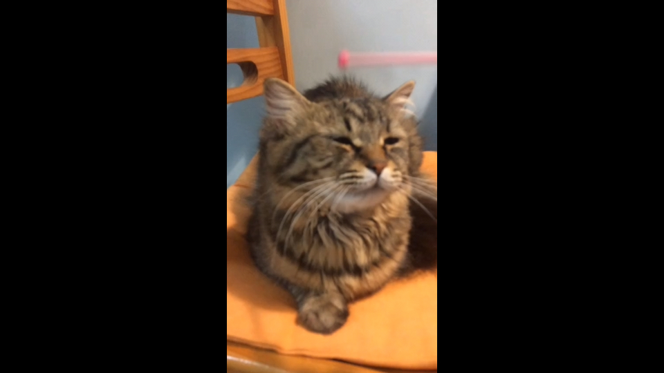 | 408 | 2025-10-25 |
| [哈基米音乐：差一步（DJ版）](https://www.bilibili.com/video/BV1Nos9z3EkD) |  | 747 | 2025-10-25 |
| [哈基米音乐：《冬眠》](https://www.bilibili.com/video/BV1gpsXz1EPU) | 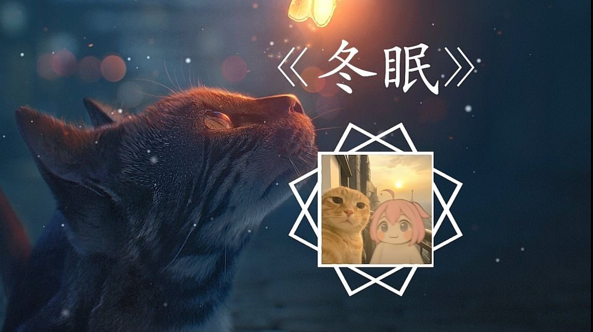 | 452 | 2025-10-25 |
| [【哈基米音乐】憧憬成为魔法基米](https://www.bilibili.com/video/BV1i5sRzZE1t) |  | 916 | 2025-10-25 |
| [循环歌单】跑图必听哈基米](https://www.bilibili.com/video/BV1bVsdzEEMh) |  | 4.5万 | 2025-10-25 |
| [哈基米山歌来咯](https://www.bilibili.com/video/BV1P7sdz1EQD) |  | 952 | 2025-10-25 |
| [⚡ 哈 基 冲 突 ⚡](https://www.bilibili.com/video/BV1TLsWzoEG1) |  | 2074 | 2025-10-25 |
| [纯净哈基米：哈人歌（凡人歌）](https://www.bilibili.com/video/BV1PnsdzCEzp) |  | 552 | 2025-10-25 |
| [谁不是哈基米？](https://www.bilibili.com/video/BV1xbsXz6EBv) | 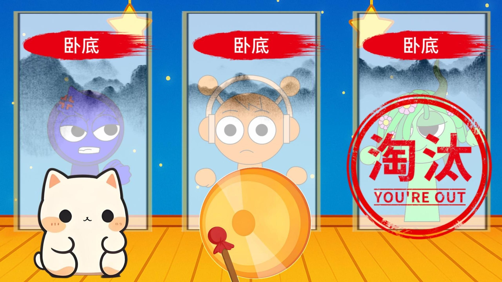 | 511 | 2025-10-25 |
| [【哈基米版】机器猫也是猫！！！](https://www.bilibili.com/video/BV1igsXzXEFA) |  | 29.7万 | 2025-10-25 |
| [哈基米未眠 Hachimi Never Sleep 【原创哈基米音乐】](https://www.bilibili.com/video/BV1MKs9zLEs8) |  | 1580 | 2025-10-24 |
| [【哈基米起床曲】](https://www.bilibili.com/video/BV1oas9z4EST) | 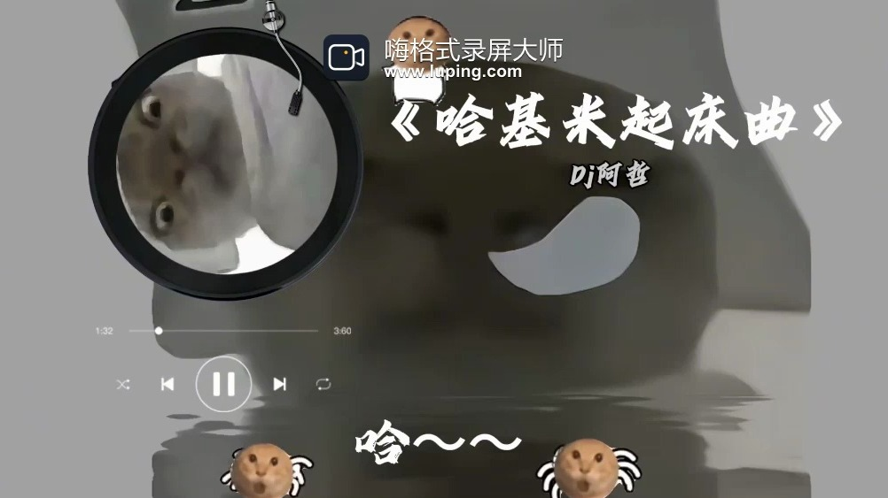 | 146 | 2025-10-24 |
| [【搬】（打火基）完整版，哈基米啊南北绿豆！](https://www.bilibili.com/video/BV1oas9z4ECD) |  | 145 | 2025-10-24 |
| [巅峰「蘸豆的哈基米ATM」](https://www.bilibili.com/video/BV1SxsnzpEE1) |  | 2426 | 2025-10-24 |
| [水调基头·但愿哈长久（活全家警告⚠️）](https://www.bilibili.com/video/BV1BTsnzvE9F) |  | 2.8万 | 2025-10-24 |
| [哈基米吃摇头丸了](https://www.bilibili.com/video/BV1HysnzgEz1) | 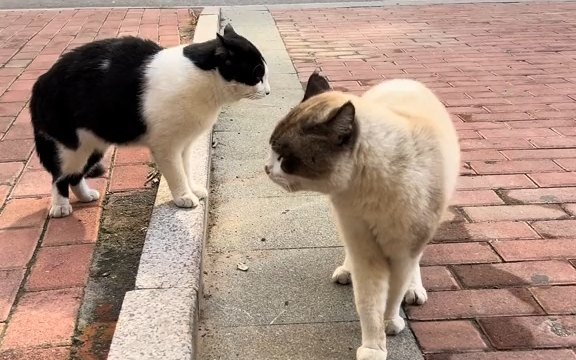 | 3731 | 2025-10-24 |
| [ASMR哈基米背部抓挠触发音](https://www.bilibili.com/video/BV1y9sJz5Eot) | 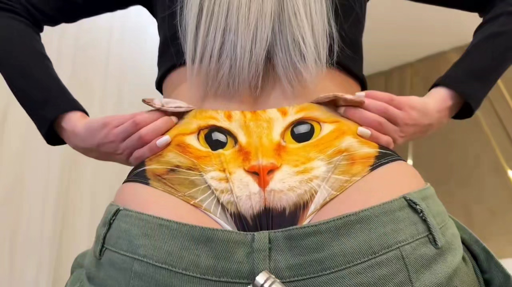 | 1.7万 | 2025-10-24 |
| [捡到一只耄耋，哈气一下](https://www.bilibili.com/video/BV1LmsjzQEE8) |  | 2061 | 2025-10-24 |
| [【哈基米】有何不哈](https://www.bilibili.com/video/BV1UVsGzbEwi) |  | 1731 | 2025-10-23 |
| [哈基米舒服了](https://www.bilibili.com/video/BV1jrsGzgEFJ) | 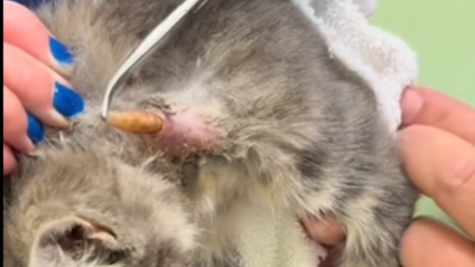 | 3.4万 | 2025-10-23 |
| [看哈基米吃饭😋](https://www.bilibili.com/video/BV1r4sGzSEUD) | 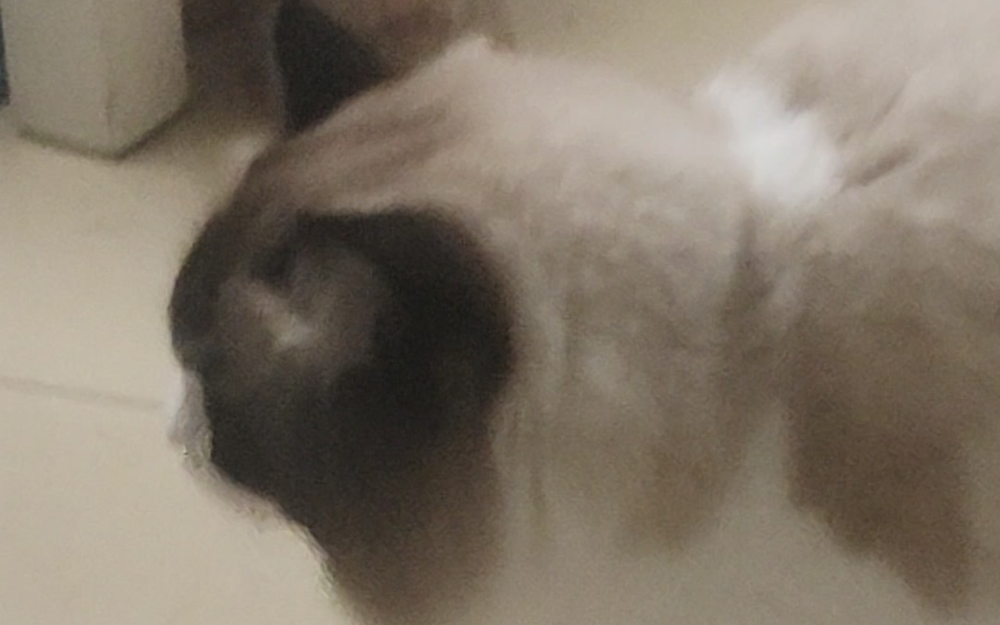 | 142 | 2025-10-23 |
| [《舌尖上的哈基米》](https://www.bilibili.com/video/BV189sGzwEKY) |  | 433 | 2025-10-23 |
| [【Mr. Broken Heart】“我会让你成为最幸福的耄”🐱完整版](https://www.bilibili.com/video/BV1mmWRzGE3C) |  | 11.3万 | 2025-10-23 |
| [一站到底，但主角是哈基米与恶俗企鹅……](https://www.bilibili.com/video/BV16YsqzQEzV) |  | 1208 | 2025-10-23 |
| [【哈基米】PRAGMATISM-RESURRECTION (私人主义）无歌词版](https://www.bilibili.com/video/BV1mFsizxEbZ) |  | 1739 | 2025-10-23 |
| [【𝐇𝐢-𝐑𝐞𝐬无损音质】《打火机 (哈基米南北绿豆)》VT.Shy「哈基米啊南北绿豆哈呀库奶露」动态歌词](https://www.bilibili.com/video/BV1LJsizkE9g) |  | 1498 | 2025-10-23 |
| [打火基供应商欠费百万阿伟](https://www.bilibili.com/video/BV1uasezdEuq) | 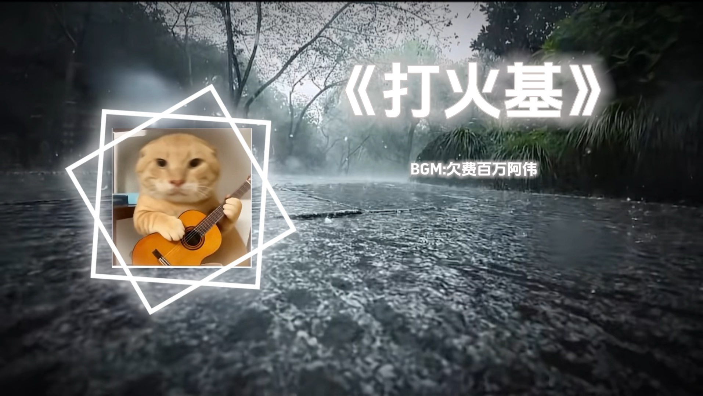 | 273 | 2025-10-23 |
| [猫猫/哈基米～](https://www.bilibili.com/video/BV1dLsazfEZ1) |  | 2.2万 | 2025-10-22 |
| [在基米的身边](https://www.bilibili.com/video/BV1xUsbzzE5d) |  | 2564 | 2025-10-22 |
| [《外星猫の小曲》《跳舞の小曲》“小猫占领地球”花田](https://www.bilibili.com/video/BV1e5s8zQEod) | 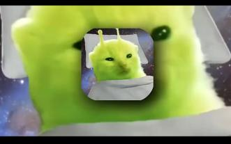 | 297 | 2025-10-22 |
| [《打火基》完整版](https://www.bilibili.com/video/BV1AestzcE91) | 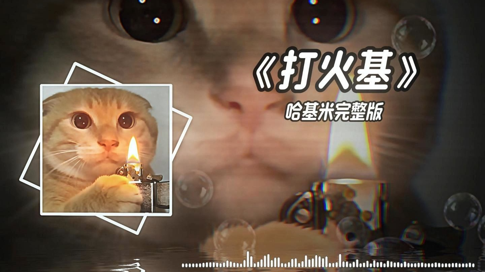 | 1085 | 2025-10-22 |
| [【哈基米音乐】Pop Chimi（星野源-《死亡搁浅》插曲 ）](https://www.bilibili.com/video/BV1SosxziEHT) |  | 1401 | 2025-10-21 |
| [我捡到了一只猫](https://www.bilibili.com/video/BV1p6WZzyEYH) |  | 44.0万 | 2025-10-21 |
| [【哈基米音乐】佛曼波·曼波咒 ｜ 索命波音](https://www.bilibili.com/video/BV1cEWRzAEqG) |  | 9646 | 2025-10-21 |
| [循环歌单｜【哈基山的基米】｜“哈基山的基米美如水啊”](https://www.bilibili.com/video/BV1ppsgzyEaj) |  | 40.4万 | 2025-10-21 |
| [泰罗哈基米#哈基米#音乐#热门#音乐分享](https://www.bilibili.com/video/BV1jJWXz9Eoi) | 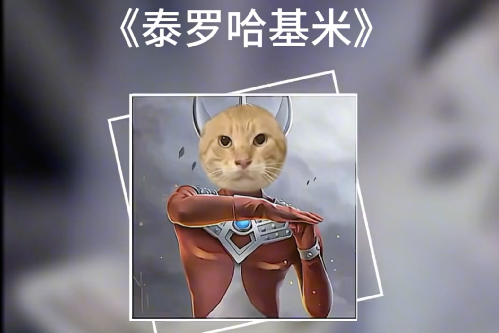 | 1396 | 2025-10-21 |
| [【基溺】悬溺一响，基米登场！我也来唱一唱](https://www.bilibili.com/video/BV1CZWmzHEvS) | 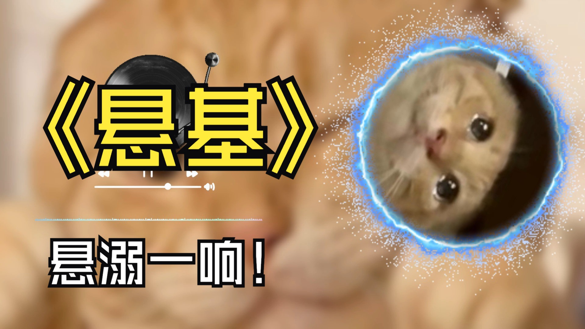 | 2658 | 2025-10-20 |
| [哈基米起床铃声](https://www.bilibili.com/video/BV1V9WyztEuw) |  | 314 | 2025-10-20 |
| [大型纪录片《哈基米洗脑神曲盘点》持续为您播出！](https://www.bilibili.com/video/BV1Etsgz3E9m) |  | 3425 | 2025-10-20 |
| [【环世界】哈基米背景音乐系列之  Fealty](https://www.bilibili.com/video/BV1LxsPzEE38) |  | 4126 | 2025-10-20 |
| [当我带日本人听哈基米音乐](https://www.bilibili.com/video/BV1pLsMzrETs) |  | 6501 | 2025-10-19 |
| [“哈基米喔南北绿豆”.‖蓝莲哈](https://www.bilibili.com/video/BV1jWsPzSEtJ) |  | 273 | 2025-10-19 |
| [【哈基米的小曲】《蓝莲哈》-哈基米  哈基米莫南北绿豆~~~](https://www.bilibili.com/video/BV1U7sNzkESM) |  | 1026 | 2025-10-19 |
| [我是一只甜耄～『哈基米音乐』甜心耄耄：快乐女孩](https://www.bilibili.com/video/BV1PrsFzQEER) |  | 1475 | 2025-10-19 |
| [哈基米无处不在](https://www.bilibili.com/video/BV1cUWtzoE3E) |  | 4515 | 2025-10-18 |
| [哈基米牌南北绿豆](https://www.bilibili.com/video/BV1ZiWbz9Eu6) |  | 14.8万 | 2025-10-18 |
| [【哈基米音乐】基儿飞](https://www.bilibili.com/video/BV1N5WszWEgn) |  | 949 | 2025-10-18 |
| [5D环绕《不再曼波》【“曼波，曼波”】](https://www.bilibili.com/video/BV1ciWHzrE3s) | 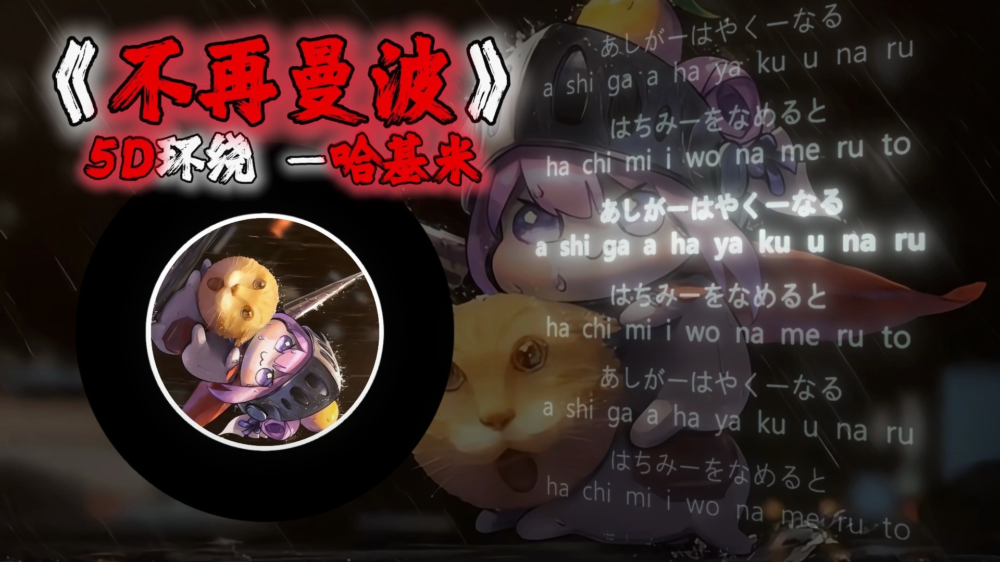 | 690 | 2025-10-18 |
| [哈错](https://www.bilibili.com/video/BV1BZ4tzhEY8) | 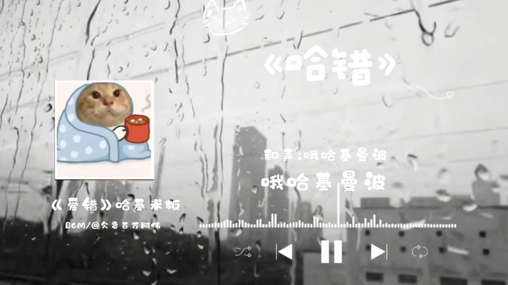 | 548 | 2025-10-14 |
| [【阿梓】看sora视频之《哈基米的春晚》难绷但是wtf](https://www.bilibili.com/video/BV1SD41zFET8) |  | 8332 | 2025-10-13 |
| [谁家会跳舞哈基米](https://www.bilibili.com/video/BV1fb4wzsEHj) |  | 1.3万 | 2025-10-11 |
| [Nobody哈基米](https://www.bilibili.com/video/BV1kaxCz6EaZ) | 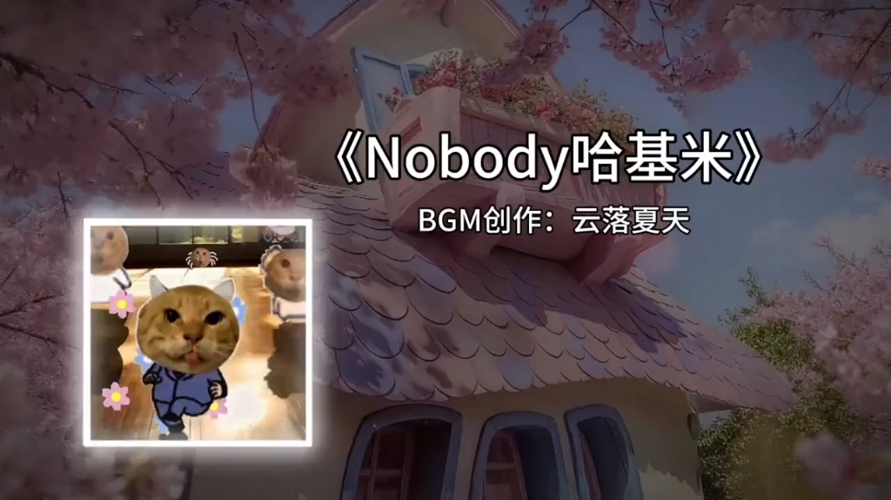 | 939 | 2025-10-09 |
| [盘点2025年爆火的《XX机》音乐](https://www.bilibili.com/video/BV1wDxgzJEzH) | 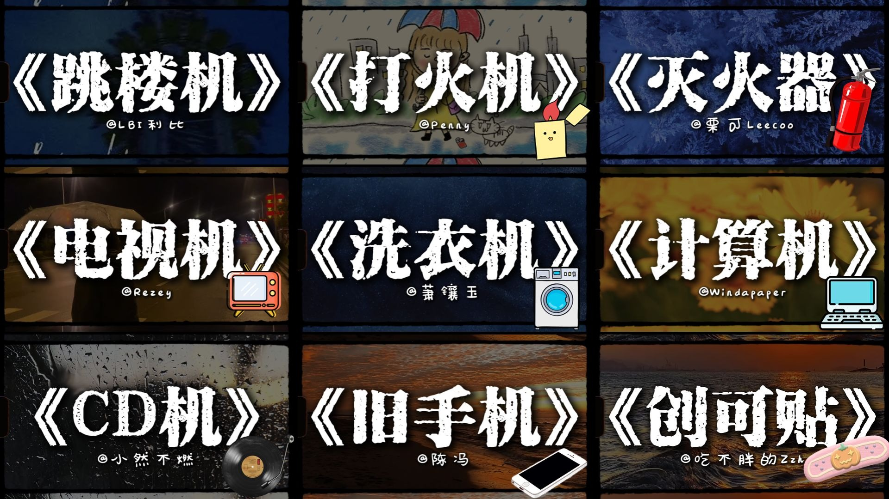 | 4.4万 | 2025-10-06 |
| [【Hi-Res无损】哈基米音乐《打火基》“这世界上就只有一首歌，不能被哈基化了”](https://www.bilibili.com/video/BV19XnvzxE7p) |  | 2.6万 | 2025-10-02 |
| [循环歌单丨【打火机（哈基咪）】&lt;吉隆坡的天气是翻云又覆雨，可我不习惯没有带着你的打火机&gt;](https://www.bilibili.com/video/BV1ccnUzzETh) |  | 17.2万 | 2025-09-30 |
| [【Marti伯伯】哈基米之歌《Nobody》](https://www.bilibili.com/video/BV13QndzmEQF) | 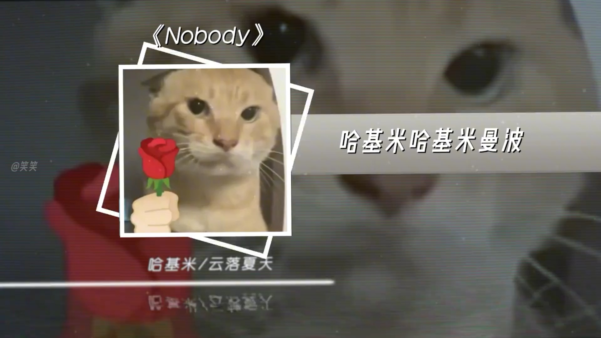 | 1066 | 2025-09-28 |
| [哈基米和布鲁斯的工作原理](https://www.bilibili.com/video/BV1gMpXzMEgc) |  | 39.4万 | 2025-09-20 |
| [哈基米帮小基米舔毛](https://www.bilibili.com/video/BV1utpkzyEsv) | 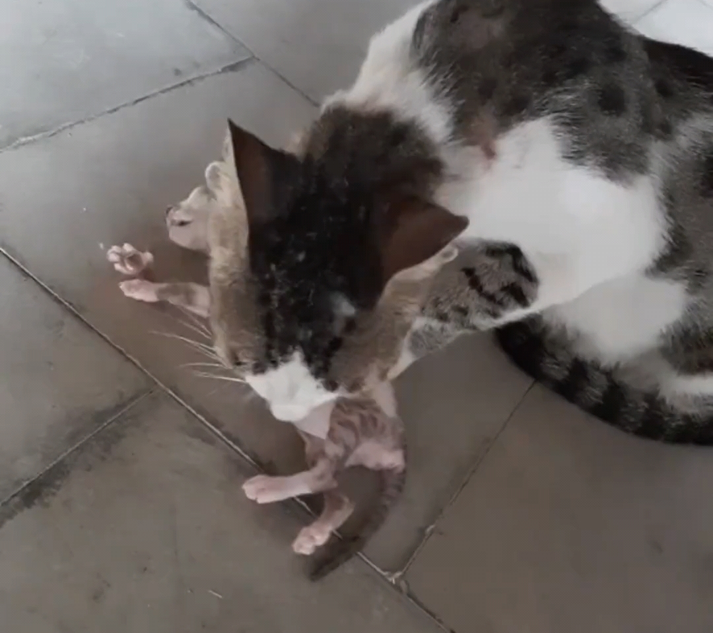 | 5414 | 2025-09-16 |
| [【蔚蓝档案】小梓基米](https://www.bilibili.com/video/BV1FmpJzaEDa) |  | 5.7万 | 2025-09-13 |
| [听说你们都让我唱哈基米？](https://www.bilibili.com/video/BV1ZqHqzMEKL) |  | 13.6万 | 2025-09-11 |
| [哈基米南北路多](https://www.bilibili.com/video/BV1mWhyzYEa2) |  | 2.4万 | 2025-08-31 |
| [哈基咪](https://www.bilibili.com/video/BV1AreZzgE2B) |  | 2.7万 | 2025-08-25 |
| [哈基米世界在创游爆火 及其作者凌风被骂[解析+澄清]](https://www.bilibili.com/video/BV1oye9zDE1z) |  | 10.8万 | 2025-08-25 |
| [千禧年哈基米 - 我们应该拥有的世界](https://www.bilibili.com/video/BV1F4e3zPEWi) |  | 4.7万 | 2025-08-20 |
| [再叫我一声哈基米就榨死你](https://www.bilibili.com/video/BV1qAhWz4ERR) |  | 23.7万 | 2025-08-01 |
| [睡觉哈基米](https://www.bilibili.com/video/BV1Bah7zVEkm) | 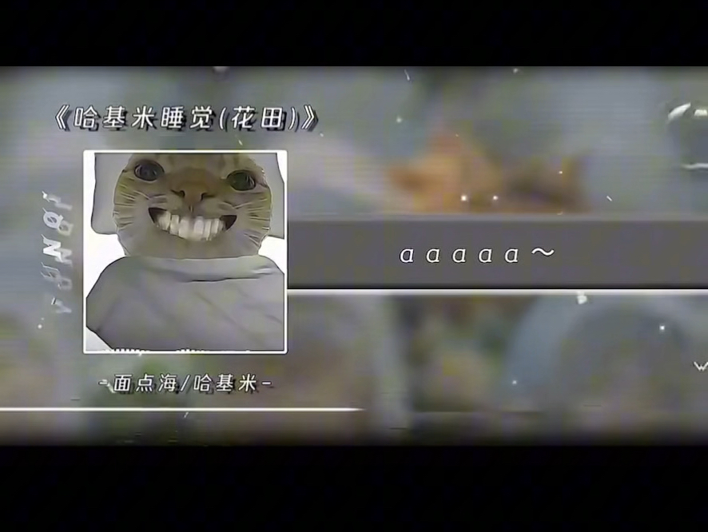 | 6.1万 | 2025-08-01 |
| [哈基米，占领饼图！[游戏王每日一卡171]](https://www.bilibili.com/video/BV173hAzhEgc) |  | 12.6万 | 2025-07-30 |
| [大狗嚼也是用上柔情猫娘了](https://www.bilibili.com/video/BV1gmKBz4EZV) |  | 58.0万 | 2025-06-27 |
| [哈基米: 神人地图](https://www.bilibili.com/video/BV19kM8zyEt3) | 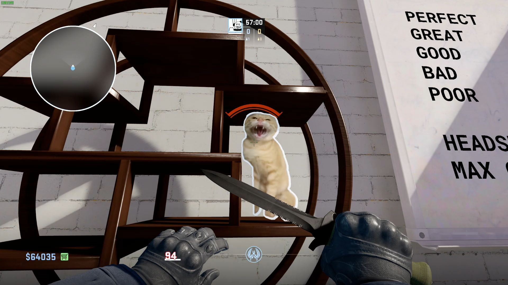 | 44.2万 | 2025-06-15 |
| [【哈基米】好](https://www.bilibili.com/video/BV1eE7rzAEak) |  | 14.2万 | 2025-06-02 |
| [哈基米大道](https://www.bilibili.com/video/BV1mqEJzeEJr) |  | 4.1万 | 2025-05-15 |
| [哈基米合集](https://www.bilibili.com/video/BV1RrG1zNEz8) |  | 19.5万 | 2025-04-29 |
| [[哈基米FM] 印度神曲, Aankhen Khuli（燃烧的爱火）](https://www.bilibili.com/video/BV1vULLzfEZX) |  | 11.3万 | 2025-04-25 |
| [埃 基 米](https://www.bilibili.com/video/BV1EGZRYiEuX) |  | 107.6万 | 2025-04-04 |
| [跳楼机1.1曼波完整版](https://www.bilibili.com/video/BV1q9AYedE12) |  | 393.7万 | 2025-02-19 |
| [老 北 京 哈 基 米！那叫一个地道！](https://www.bilibili.com/video/BV117PfegEAd) |  | 18.0万 | 2025-02-04 |
| [“哈基米の爱情买卖”](https://www.bilibili.com/video/BV1r1421t73k) |  | 378.9万 | 2024-08-01 |

---
*最后更新: 2025-10-26 02:40:17 (自动生成)*
*数据来源: [Bilibili](https://www.bilibili.com)*

## 使用说明

运行以下命令更新视频列表:
```bash
python3 fetch_hajimi_videos.py
```
