# awesome-hajimi
collections of hajimi (哈基米 in Chinese) on the Internet.

## 视频列表 (Video List)

| 视频标题 (Title) | 封面 | 播放量 (Views) | 发布日期 (Date) |
|---|---|---|---|
| [哈基米这个横冲直撞](https://www.bilibili.com/video/BV1X1FGzgEha) |  | 336 | 2026-02-03 |
| [“接下来登场的阿贾克斯の爱妻！”](https://www.bilibili.com/video/BV1jnFVzjEkU) |  | 1585 | 2026-02-03 |
| [《喂鱼笑传之吃吃臂》](https://www.bilibili.com/video/BV1sZFgzWESt) | 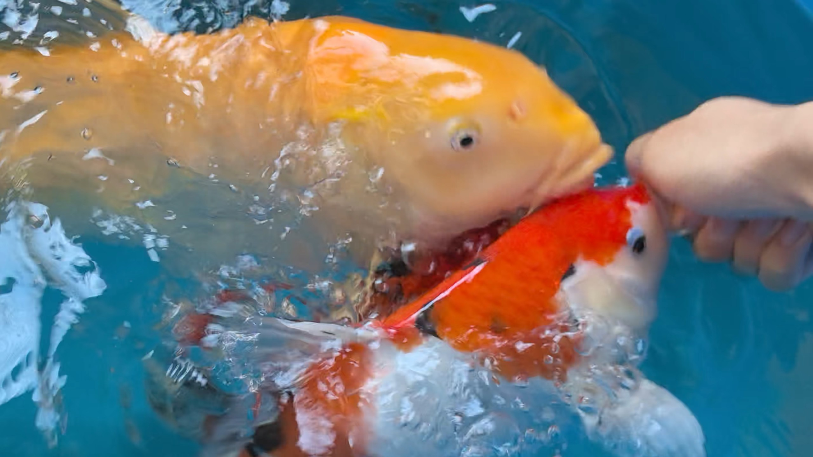 | 118 | 2026-02-03 |
| [拆家基米](https://www.bilibili.com/video/BV1RiFgzBE4D) | 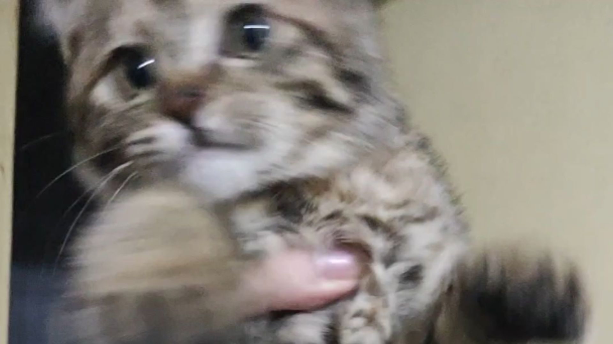 | 677 | 2026-02-02 |
| [哈基米，但是会飞](https://www.bilibili.com/video/BV1eaFMzYEaq) |  | 245 | 2026-02-02 |
| [【kigurumi神里绫华】投喂哈基米哦。。。南北路多](https://www.bilibili.com/video/BV1gxFuz4EvS) |  | 1401 | 2026-02-02 |
| [奶凶奶凶的哈基米，可爱捏](https://www.bilibili.com/video/BV1QcFgzaEWw) | 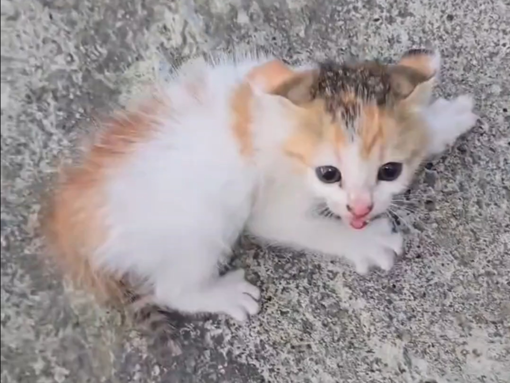 | 204 | 2026-02-02 |
| [其实手机上并没有伊朗这个国家，伊朗是伪史论这虚构出来的，伊朗其实就是哈基米](https://www.bilibili.com/video/BV1n1FuzCEnV) | 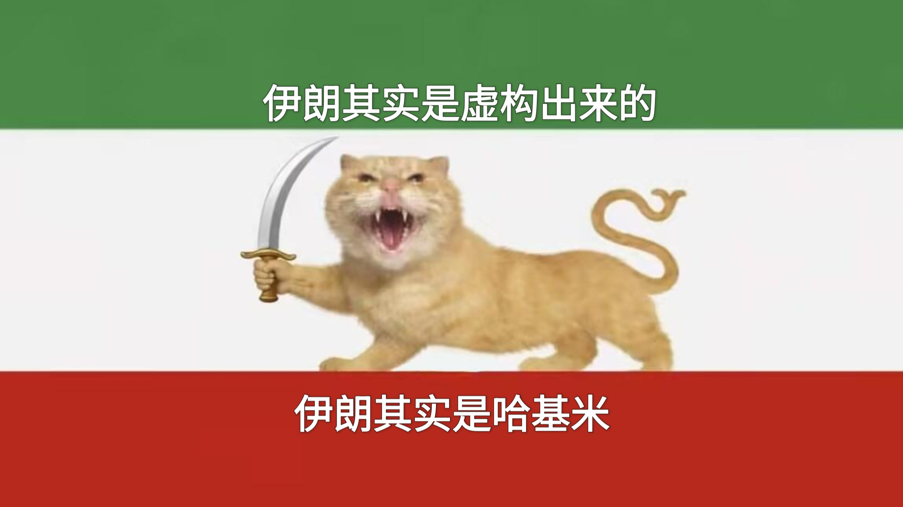 | 319 | 2026-02-02 |
| [给哈基米剪胡子会怎么样？【第九天】](https://www.bilibili.com/video/BV1wrFuzjEAU) | 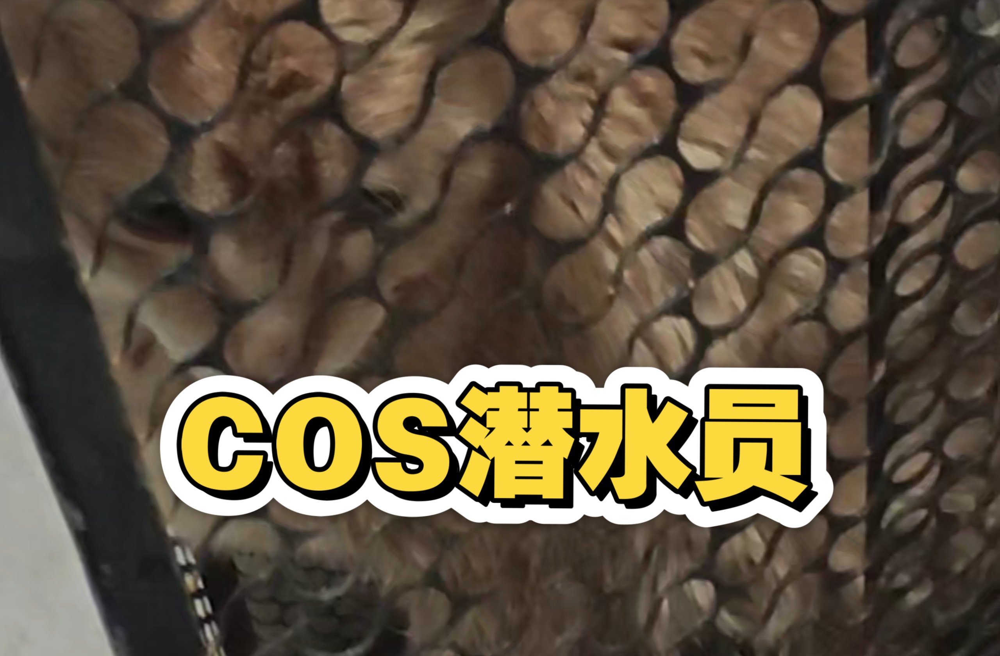 | 2486 | 2026-02-02 |
| [哈基米守护兵站大作战](https://www.bilibili.com/video/BV1jQFuzzEGr) | 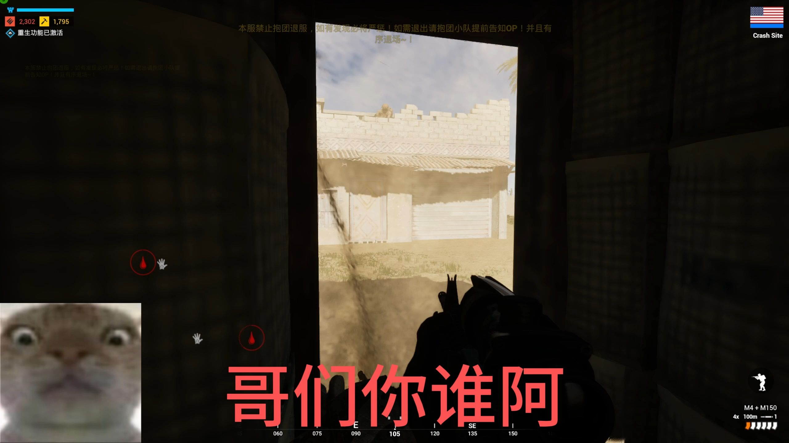 | 251 | 2026-02-02 |
| [『月L』哈基米](https://www.bilibili.com/video/BV1dgFTzfEaJ) |  | 190 | 2026-02-02 |
| [北部眼王吃哈基米](https://www.bilibili.com/video/BV1sDFKzkEDd) | 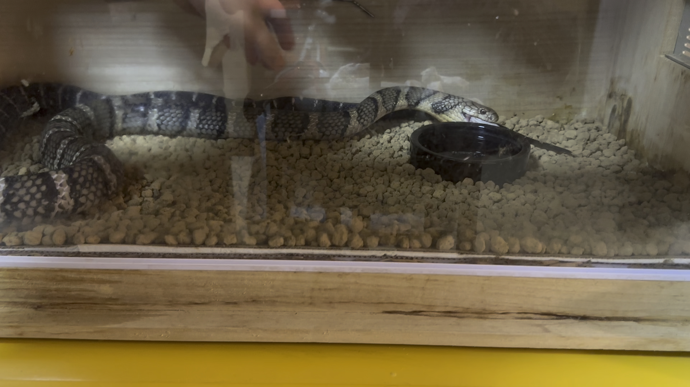 | 557 | 2026-02-02 |
| [逗猫棒不小心帮哈基米联通了喵星信号📶](https://www.bilibili.com/video/BV1xDFKzkEKj) | 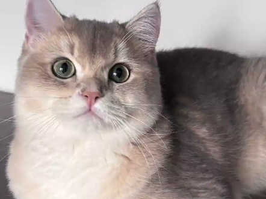 | 223 | 2026-02-02 |
| [哈基米的代码🤖未能通过图灵测试](https://www.bilibili.com/video/BV1sDFKzkEX9) | 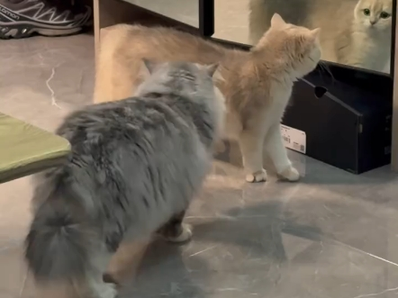 | 249 | 2026-02-02 |
| [丑基米的超级智商告诉它:这里可以上厕所](https://www.bilibili.com/video/BV1CdFKzuEN4) |  | 619 | 2026-02-02 |
| [怎么能让哈基米意识到护食的不对](https://www.bilibili.com/video/BV1HoFKzBEfy) | 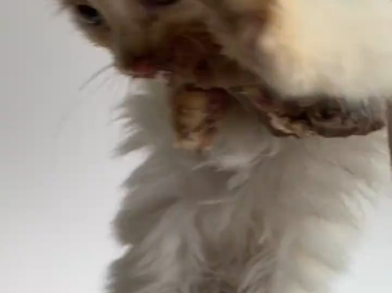 | 254 | 2026-02-02 |
| [这个哈基米好像不喜欢吃猫条，那他喜欢吃什么](https://www.bilibili.com/video/BV12bFTz2Em7) | 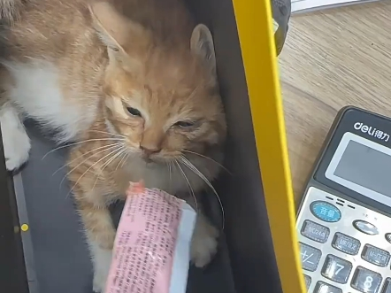 | 257 | 2026-02-02 |
| [一点点（哈基米版）](https://www.bilibili.com/video/BV1KhFTzLEVz) |  | 8.4万 | 2026-02-02 |
| [哈基米 哈基米](https://www.bilibili.com/video/BV1VLFTzxEzE) |  | 31 | 2026-02-02 |
| [哈基米～](https://www.bilibili.com/video/BV1rJFMzrEUM) |  | 12 | 2026-02-02 |
| [哈基米这个吵架](https://www.bilibili.com/video/BV1zpFMzzEWT) | 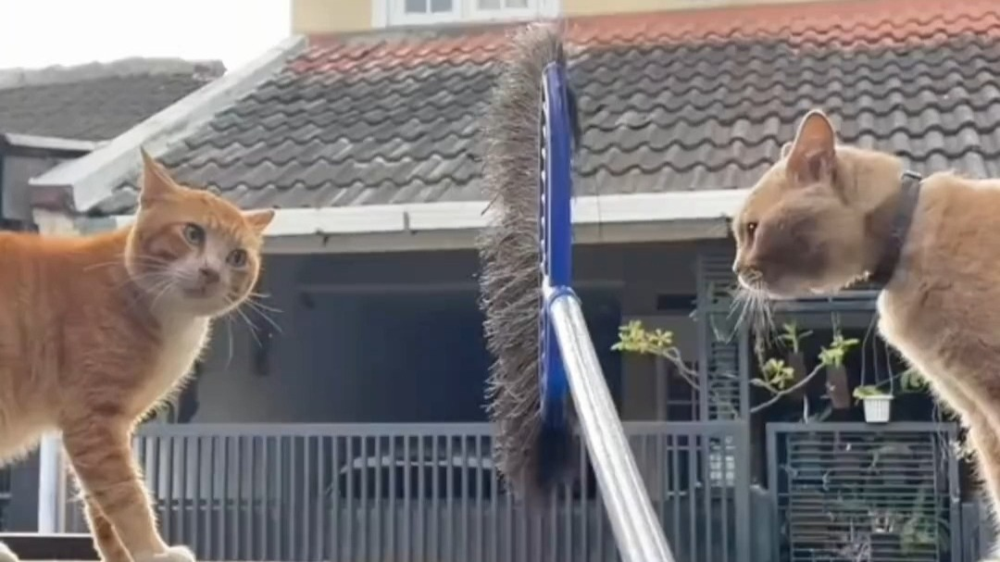 | 781 | 2026-02-02 |
| [这种哈吉米养得熟吗？😱](https://www.bilibili.com/video/BV1MTFMzDEJz) | 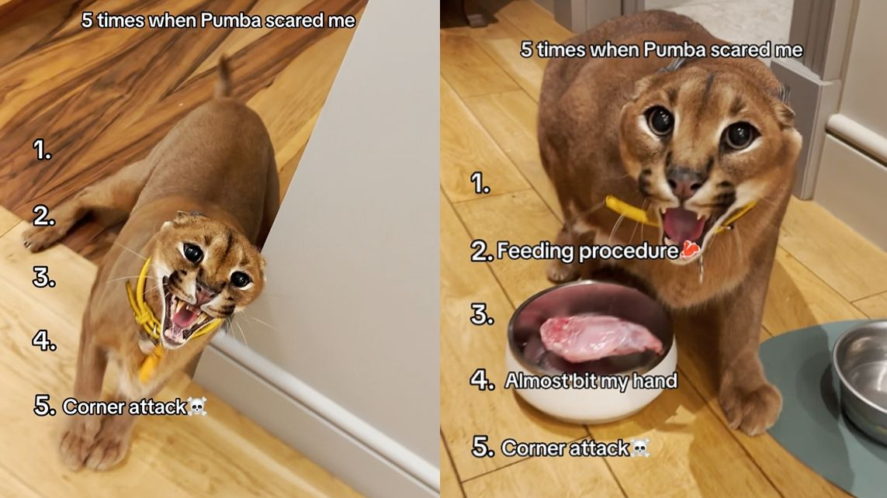 | 4763 | 2026-02-02 |
| [哈基米](https://www.bilibili.com/video/BV1UAFMzpEkS) |  | 546 | 2026-02-02 |
| [【我草，哈基米】全12集 超清中字（未删减版）](https://www.bilibili.com/video/BV1yVFMz1EUT) |  | 3.6万 | 2026-02-02 |
| [哈基米袁术大战开挂组合](https://www.bilibili.com/video/BV1PVFMz2EJD) |  | 2.6万 | 2026-02-02 |
| [过年我就这样看着家里的亲戚小孩](https://www.bilibili.com/video/BV11gFMzmEHX) | 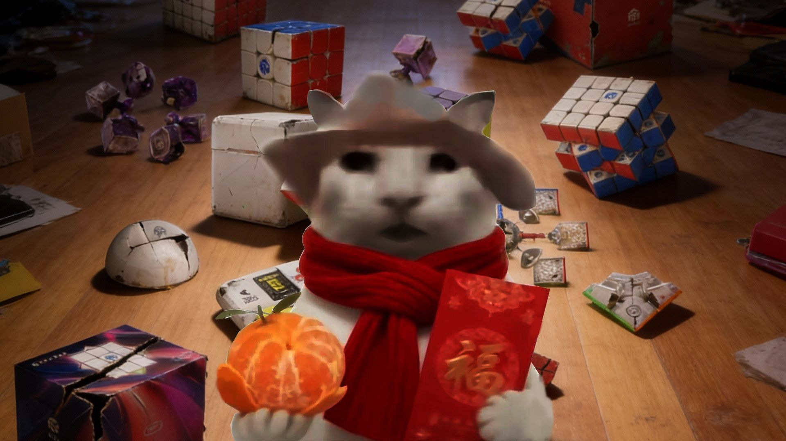 | 1146 | 2026-02-02 |
| [哈基米巡视领地意见多](https://www.bilibili.com/video/BV1xWFNzGEdc) | 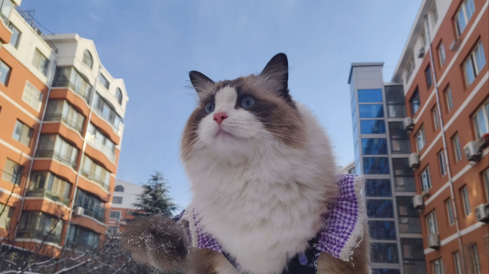 | 445 | 2026-02-02 |
| [终末地3.5倍速日常（？）足足能听六首哈基米音乐！（原45分钟 无猫头鹰 满采集+矿+武陵种地）](https://www.bilibili.com/video/BV1MnFNz5EwN) |  | 342 | 2026-02-02 |
| [狡猾的哈基米](https://www.bilibili.com/video/BV1G3FNznEHb) | 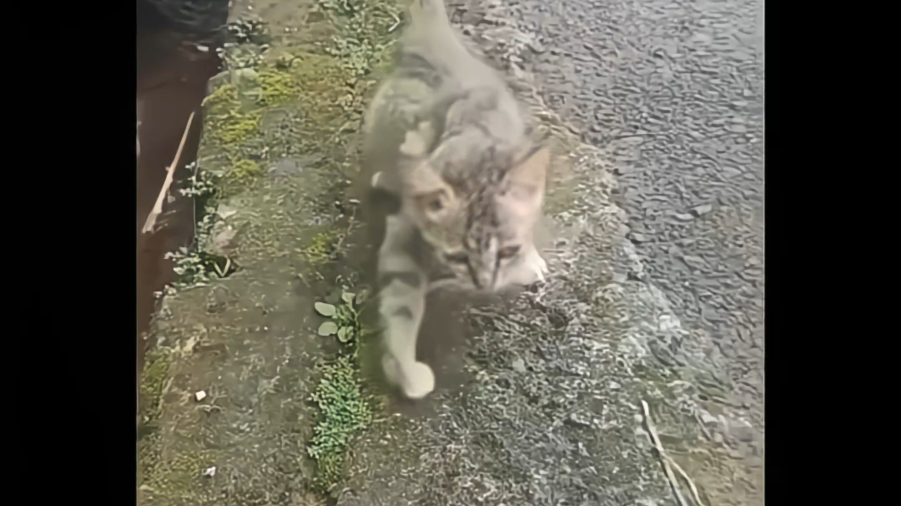 | 2027 | 2026-02-02 |
| [“水管掉落× 神器掉落√”](https://www.bilibili.com/video/BV1V3FNznE2V) | 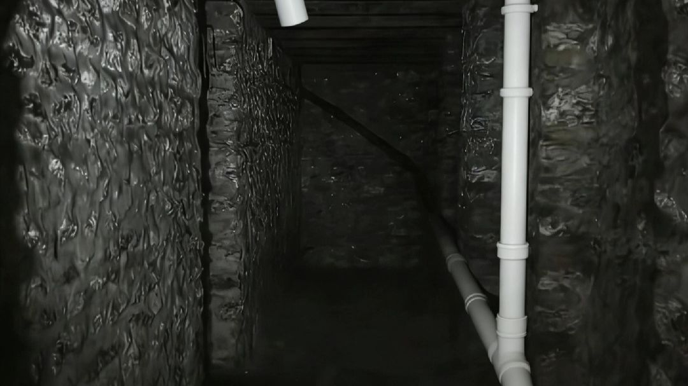 | 5888 | 2026-02-02 |
| [【哈基米】“lookoutside/看看外面”](https://www.bilibili.com/video/BV15mFNzdErY) |  | 1193 | 2026-02-02 |
| [基卫](https://www.bilibili.com/video/BV1BsFKz8EFZ) |  | 19.2万 | 2026-02-02 |
| [哈基米私闯民宅还打人](https://www.bilibili.com/video/BV1RkFAznEoZ) |  | 1218 | 2026-02-02 |
| [快看，一只哈基米——Civivi 作品Purr  设计Ostap Hel 型号C25054 手柄G10/钢材Nitro v 折刀 EDC 口袋刀](https://www.bilibili.com/video/BV1z7FPz4ErD) | 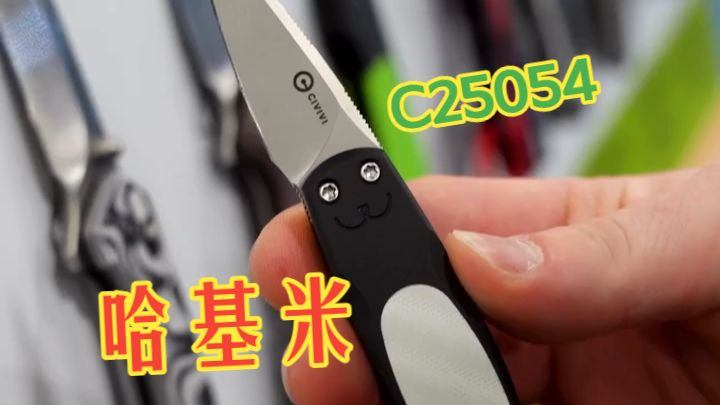 | 394 | 2026-02-02 |
| [咪内心：你是不是有猫饼？](https://www.bilibili.com/video/BV1yTFPzPEv3) | 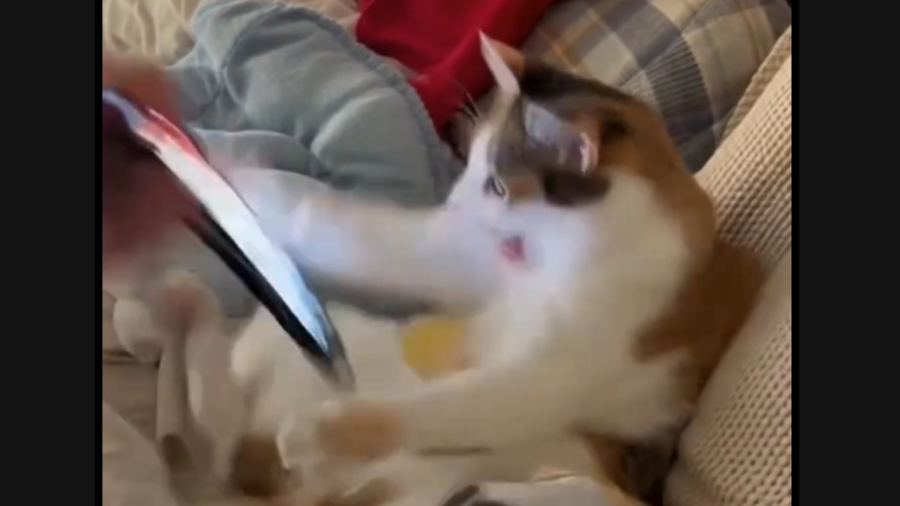 | 5176 | 2026-02-02 |
| [什么是抄底？](https://www.bilibili.com/video/BV12PFPzKEK2) |  | 1.3万 | 2026-02-02 |
| [真正的撸猫手法](https://www.bilibili.com/video/BV1u168BvEFS) | 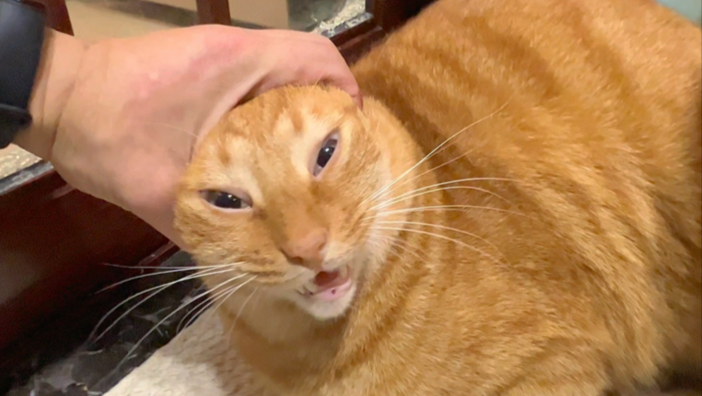 | 2.2万 | 2026-02-02 |
| [东海帝王的训练员试图辟谣哈基米是猫的意思，结果不敌某根华仔，最终曼波哈基米成为互联网烂梗【赛马娘公司育成实况】](https://www.bilibili.com/video/BV1sF6HBPEM1) |  | 196 | 2026-02-02 |
| [【新鸣潮演义外传篇】是哈基漂还是莫宁喵](https://www.bilibili.com/video/BV19c6aBVEqj) |  | 2279 | 2026-02-02 |
| [爱泼斯坦案文件，阿联酋总统用自己的小女儿和美国政客做交易](https://www.bilibili.com/video/BV1esFPzQETd) | 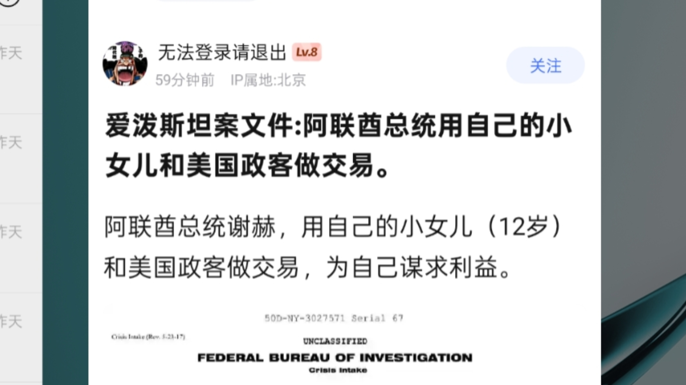 | 2.0万 | 2026-02-02 |
| [哈基米依旧天基兽进化](https://www.bilibili.com/video/BV1vuFNzQETu) | 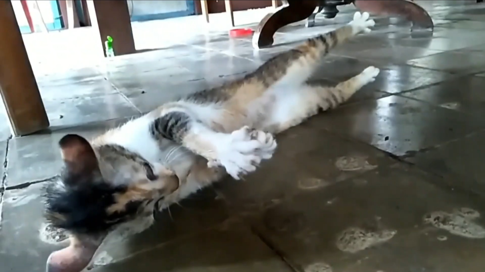 | 1.1万 | 2026-02-02 |
| [【哈基米/改编】飞出哈基山](https://www.bilibili.com/video/BV15KFNz9EC1) |  | 394 | 2026-02-02 |
| [有种不能伸进屏幕爱猫的无力感](https://www.bilibili.com/video/BV1JdFPzhEi7) |  | 1100 | 2026-02-02 |
| [哈基米还是太有建模了](https://www.bilibili.com/video/BV19Z6hBLEBu) | 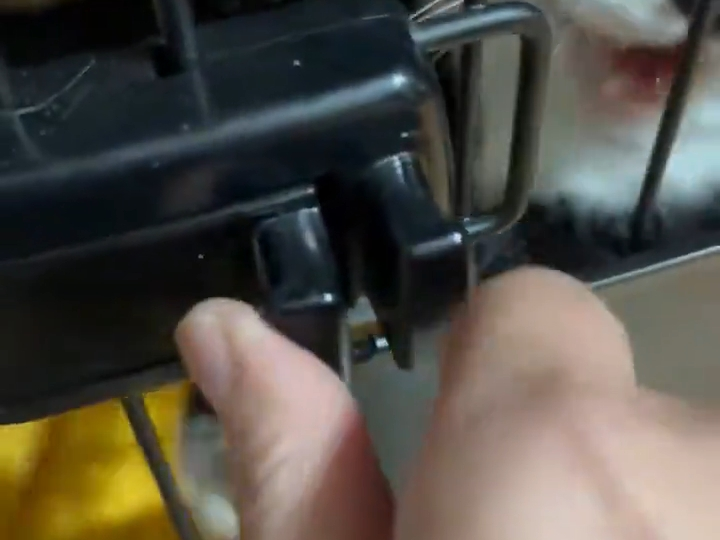 | 359 | 2026-02-02 |
| [爱泼斯坦文件里的难崩一幕](https://www.bilibili.com/video/BV1ns6aBoEAN) | 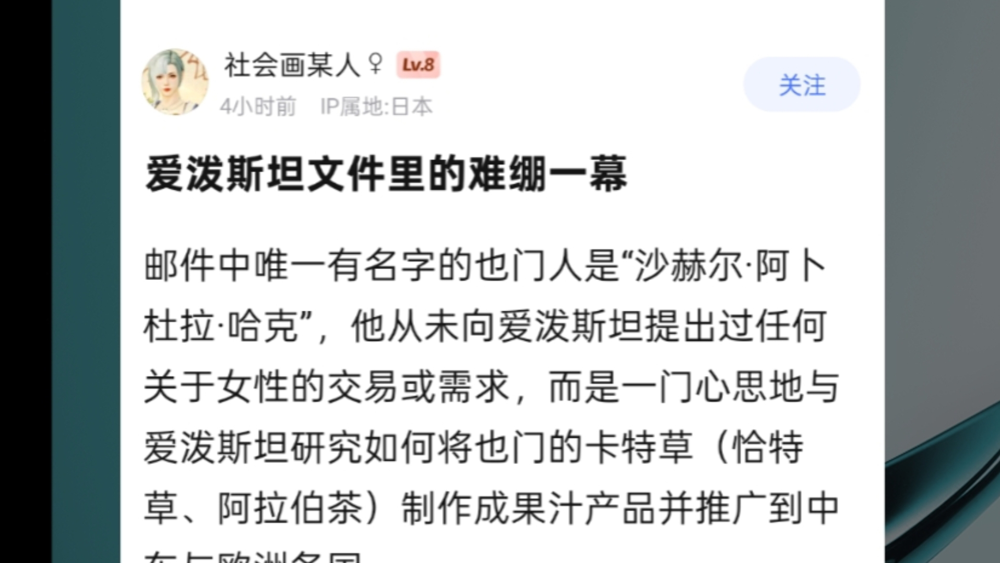 | 27.2万 | 2026-02-02 |
| [【哈基米TV】丑猫多哈气](https://www.bilibili.com/video/BV1o36hB2Esd) | 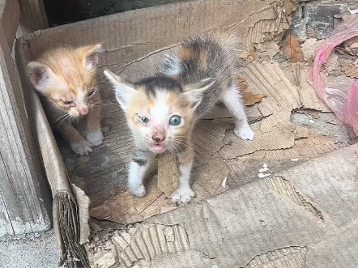 | 1737 | 2026-02-01 |
| [【新人投稿】连续加班一个多月的哈基米终于在熬完周末的加班后的晚上12点回到家，在凌晨的厕所里痛苦的唱了藤井風的死ぬのがいいわ (不如死去)](https://www.bilibili.com/video/BV1Hw6hB9EkP) |  | 357 | 2026-02-01 |
| [台灣益可膚廣告，但哈基米](https://www.bilibili.com/video/BV1Dx6hBTEM2) |  | 1137 | 2026-02-01 |
| [大卡难得哈基米](https://www.bilibili.com/video/BV1Ub6hBNEoi) |  | 306 | 2026-02-01 |
| [爱泼斯坦文件里的难崩一幕](https://www.bilibili.com/video/BV1Rg6bB6Eoc) |  | 27.1万 | 2026-02-01 |
| [【成果记忆0.2】⚡️  新  年  太  爱  哈  基  米  ⚡️](https://www.bilibili.com/video/BV1QE6bBPEye) |  | 465 | 2026-02-01 |
| [牢a梗图（续113）](https://www.bilibili.com/video/BV1oA64BiEMC) |  | 8600 | 2026-02-01 |
| [史上最诡异滚木图片，这是真吓人](https://www.bilibili.com/video/BV19u64BaEMp) | 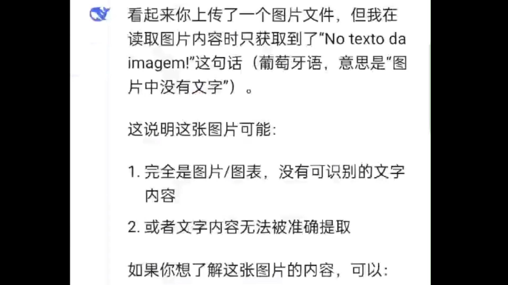 | 1625 | 2026-02-01 |
| [牢马对爱泼斯坦档案作出回应](https://www.bilibili.com/video/BV1Wh64BEEuJ) |  | 4.1万 | 2026-02-01 |
| [【纯净哈基米】sharaX-DUST，但由哈基米演唱](https://www.bilibili.com/video/BV1Dj64BoEh6) |  | 2347 | 2026-02-01 |
| [【哈基米】🐱恭喜哈财🐱](https://www.bilibili.com/video/BV1kG6tBJEf3) |  | 2613 | 2026-02-01 |
| [夜来哈 现场版](https://www.bilibili.com/video/BV1hZ64BfE6d) |  | 844 | 2026-02-01 |
| [🐱基 卫🐱](https://www.bilibili.com/video/BV18Z64BfER6) |  | 46.8万 | 2026-02-01 |
| [【FF14】擦基米](https://www.bilibili.com/video/BV1BH6tBVErF) | 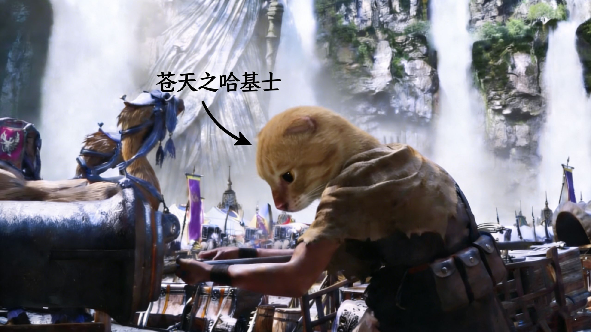 | 2639 | 2026-02-01 |
| [【哈基米音乐】“🐱是的我看见到处是曼波🐱”](https://www.bilibili.com/video/BV1xK6tBWEUY) |  | 1007 | 2026-02-01 |
| [人你可算是回来了](https://www.bilibili.com/video/BV11g6tBDEVo) | 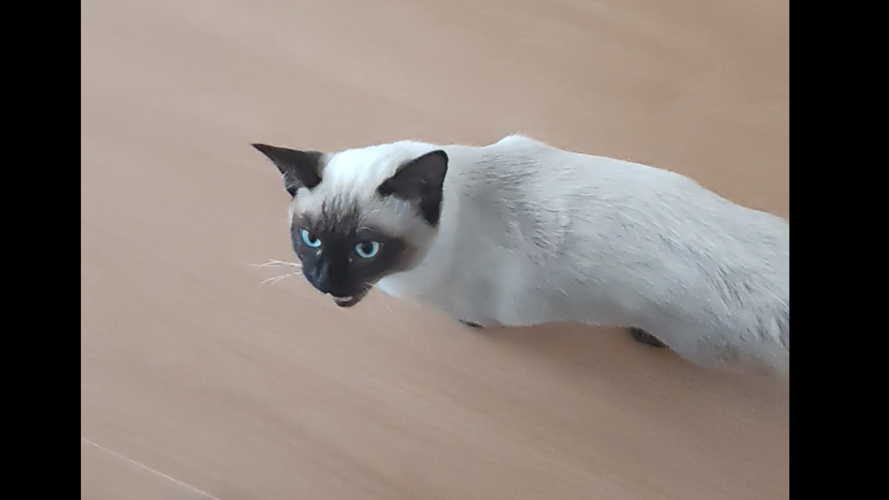 | 1954 | 2026-02-01 |
| [那白毛长发哈基米凭啥呀](https://www.bilibili.com/video/BV1yW6sB5Eqe) |  | 2817 | 2026-02-01 |
| [我靠，我真的头皮发麻](https://www.bilibili.com/video/BV1Kn6sB7Ekh) |  | 13.0万 | 2026-02-01 |
| [哈基米不舒自走，你来打扰不哈你哈谁？](https://www.bilibili.com/video/BV1dC6sBhEow) | 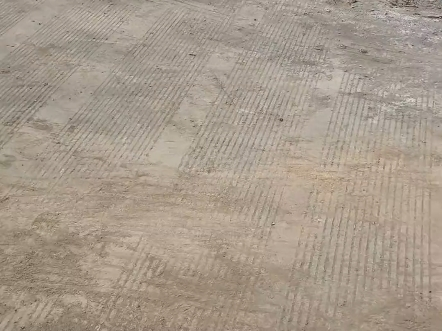 | 1.3万 | 2026-02-01 |
| [猫儿这个单臂引体](https://www.bilibili.com/video/BV1iC6sBhE3A) | 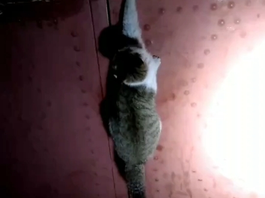 | 517 | 2026-02-01 |
| [秒开仙人模式](https://www.bilibili.com/video/BV1pu6xBCETS) |  | 1.5万 | 2026-02-01 |
| [基 出 没 🎵](https://www.bilibili.com/video/BV1m96nBMEUQ) |  | 4.8万 | 2026-02-01 |
| [&quot;Arknights&quot; ｜ 昨夜圆车：基米地 登陆界面主题曲](https://www.bilibili.com/video/BV1kJ6nBhEim) | 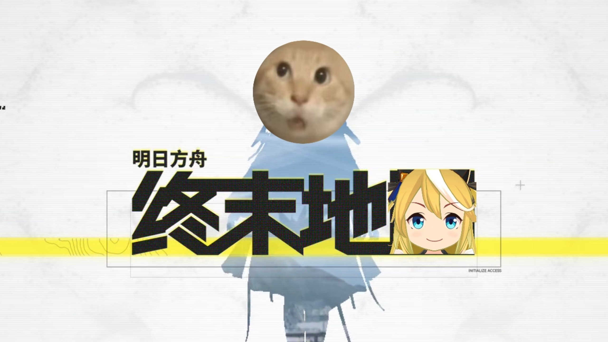 | 5499 | 2026-02-01 |
| [猫儿这个瘾大～](https://www.bilibili.com/video/BV1fS6HBfExg) | 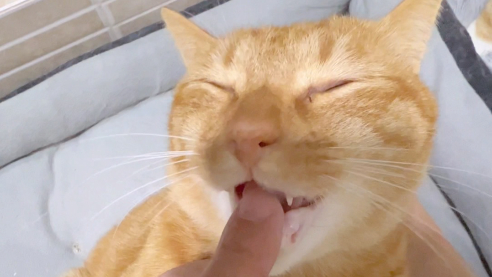 | 13.8万 | 2026-02-01 |
| [别忘了咱白染也是一只哈基米呀](https://www.bilibili.com/video/BV1uq6xBsE7P) |  | 1003 | 2026-02-01 |
| [胆小哈基米被吓出棘背龙形态](https://www.bilibili.com/video/BV1X26pBDEpP) | 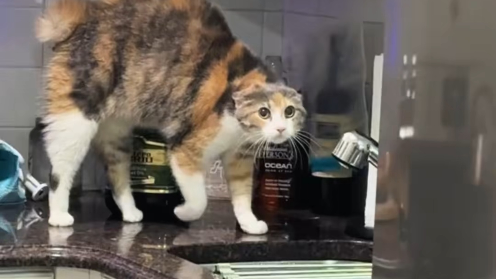 | 1127 | 2026-02-01 |
| [梦中的盒蒜](https://www.bilibili.com/video/BV1ut6JBTE4E) |  | 3.6万 | 2026-02-01 |
| [散步的哈基米#kigurumi.赛飞儿](https://www.bilibili.com/video/BV1xf6pBkEtP) |  | 1155 | 2026-02-01 |
| [你有点手欠了【星之翼MMD】](https://www.bilibili.com/video/BV1ub6HB5Ezb) |  | 7487 | 2026-01-31 |
| [［基米大冲基］没偷摸骂我两句吧！](https://www.bilibili.com/video/BV13M6pBmEiK) |  | 2248 | 2026-01-31 |
| [哈基米vs大狗嚼](https://www.bilibili.com/video/BV1Nv6JBaEhU) |  | 1356 | 2026-01-31 |
| [如何强化哈基米](https://www.bilibili.com/video/BV1Th6JBNEFE) | 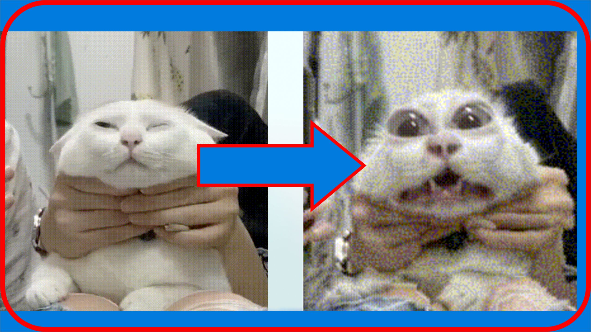 | 3577 | 2026-01-31 |
| [中国网友制作的伊郎哈吉米王朝旗帜流传至外网爆火！](https://www.bilibili.com/video/BV1vp62BsEJi) |  | 29.2万 | 2026-01-31 |
| [猫偷东西吃被狗逮到](https://www.bilibili.com/video/BV17h6CBpEDM) | 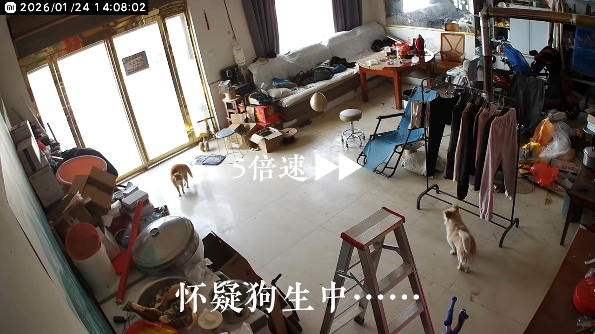 | 6220 | 2026-01-31 |
| [哈基米洒水车（真善美的小世界）](https://www.bilibili.com/video/BV1Kd6CBKEe8) |  | 4757 | 2026-01-31 |
| [哈基米：为美亩的基米献上哈气 第一季op【Fantastic dreamer】](https://www.bilibili.com/video/BV1um6CBrEQb) |  | 4355 | 2026-01-31 |
| [哈基米被冻在铁管上哈基人营救反而被哈气](https://www.bilibili.com/video/BV1y96rBZE6A) | 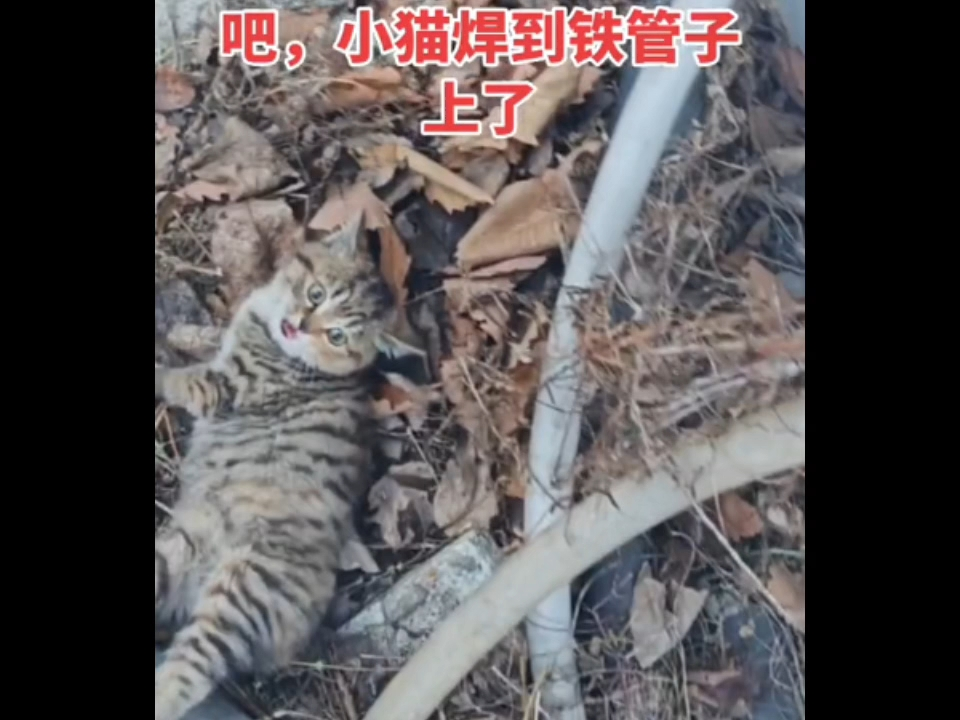 | 5.3万 | 2026-01-31 |
| [哈基米这个搞笑](https://www.bilibili.com/video/BV1Do6iBHEbh) | 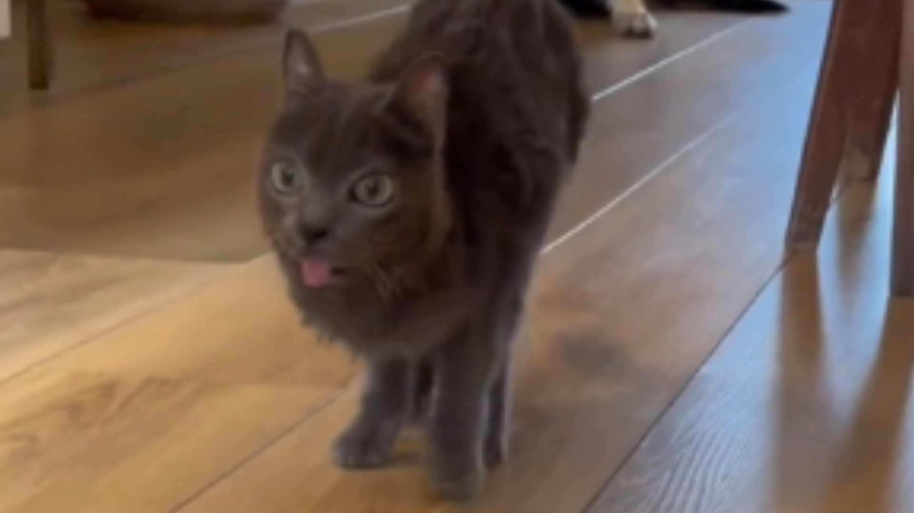 | 20.6万 | 2026-01-30 |
| [一直摸狞猫的屁股会怎样？😏](https://www.bilibili.com/video/BV1YD6iBxE9i) | 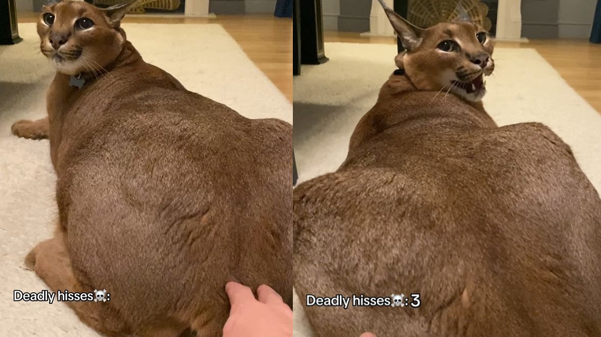 | 15.9万 | 2026-01-30 |
| [小猫还有救吗？](https://www.bilibili.com/video/BV1YV6BBbE7w) | 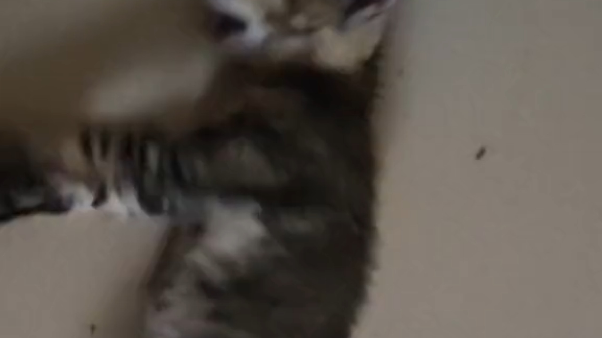 | 4.9万 | 2026-01-30 |
| [🐱耄耄可爱捏🐱](https://www.bilibili.com/video/BV1Gb6vBQEE8) |  | 12.3万 | 2026-01-30 |
| [哈基米圈传来噩耗](https://www.bilibili.com/video/BV1sw6vBgEGV) |  | 4.0万 | 2026-01-30 |
| [距离除夕还有17天～过年前你必买的年货是什么](https://www.bilibili.com/video/BV1x8zaB8EwE) |  | 2225 | 2026-01-30 |
| [【哈基米音乐】愤怒的哈基米](https://www.bilibili.com/video/BV1xAz9BtEU7) |  | 3668 | 2026-01-30 |
| [哈基米这个过生日](https://www.bilibili.com/video/BV1eF6eBQE27) | 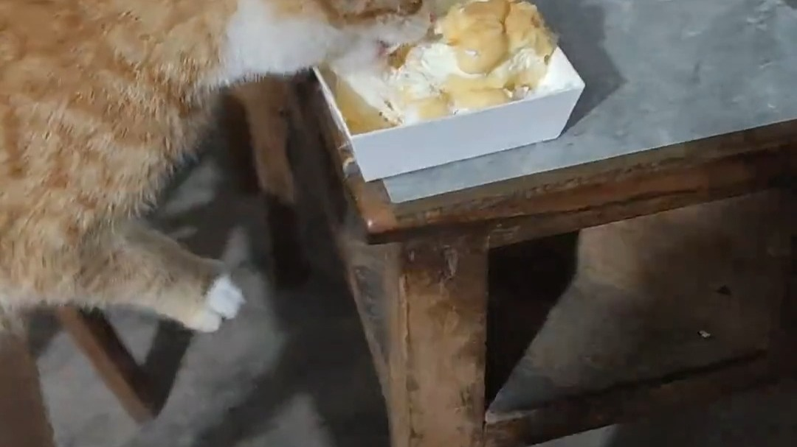 | 6.3万 | 2026-01-30 |
| [&quot;bro充实的一天&quot;](https://www.bilibili.com/video/BV1Gb6ABaEY1) |  | 177.1万 | 2026-01-30 |
| [循环歌曲/找基米(哈基米)-哈基米.](https://www.bilibili.com/video/BV1rh6wB3ER2) |  | 675 | 2026-01-29 |
| [⚡这 鬼 畜 有 力 气⚡](https://www.bilibili.com/video/BV1S36FBjEPK) | 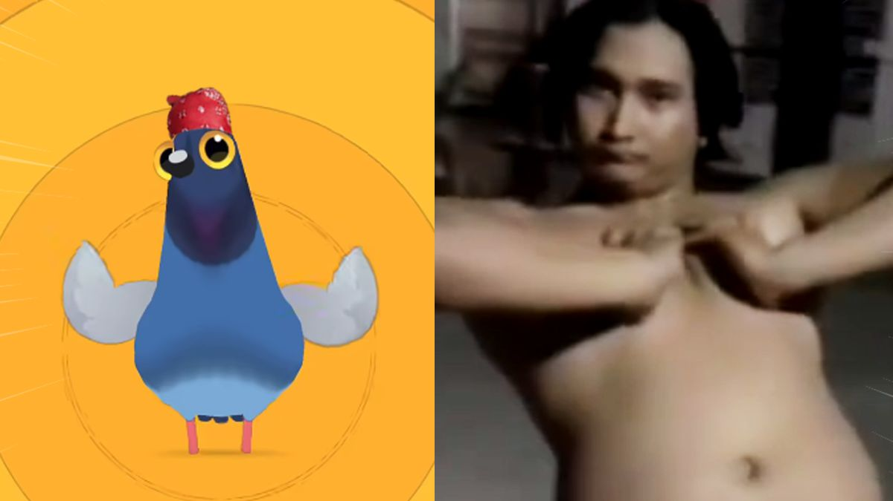 | 113.4万 | 2026-01-29 |
| [传统翻唱创新歌曲《哈基拜月》送给大家~](https://www.bilibili.com/video/BV1Gy6FB9Ecj) |  | 29.0万 | 2026-01-29 |
| [🐱我在人民广场哈基米🐱](https://www.bilibili.com/video/BV12yz9B8Eio) |  | 1.4万 | 2026-01-29 |
| [这是咪拼尽全力的一蹭！](https://www.bilibili.com/video/BV1EWzdBQE3n) | 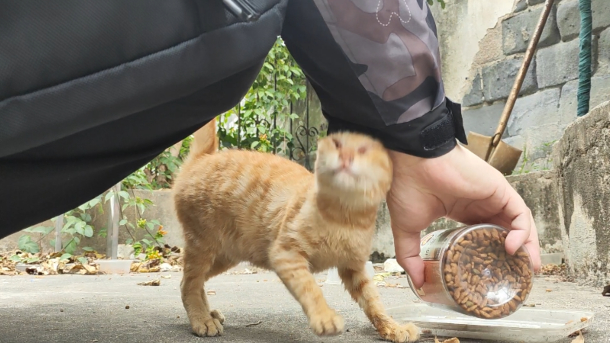 | 17.7万 | 2026-01-29 |
| [赛博神人志-圆头耄妈的哈气之路](https://www.bilibili.com/video/BV1Y76MB5Ed1) |  | 17.8万 | 2026-01-27 |
| [你们想看的雷霆战猫，最后有惊喜！](https://www.bilibili.com/video/BV1GFzvBmEqQ) | 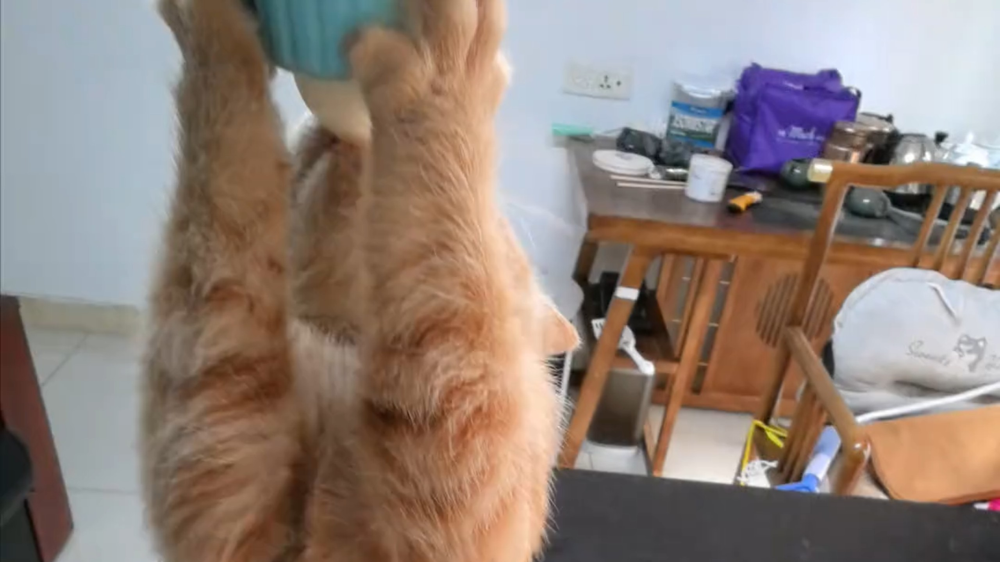 | 22.9万 | 2026-01-26 |
| [⚡️疯 狂 只 因 城⚡️](https://www.bilibili.com/video/BV1WpiTB7EtE) |  | 10.6万 | 2025-12-31 |
| [自毁程序启动！](https://www.bilibili.com/video/BV1SkVpzFEFN) | 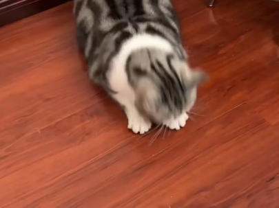 | 53.6万 | 2025-05-06 |

---
*最后更新: 2026-02-03 03:10:53 (自动生成)*
*数据来源: [Bilibili](https://www.bilibili.com)*

## 使用说明

运行以下命令更新视频列表:
```bash
python3 fetch_hajimi_videos.py
```
