# awesome-hajimi
collections of hajimi (哈基米 in Chinese) on the Internet.

## 视频列表 (Video List)

| 视频标题 (Title) | 封面 | 播放量 (Views) | 发布日期 (Date) |
|---|---|---|---|
| [当《昔涟》遇见哈基米……🩷](https://www.bilibili.com/video/BV13bSLBpELy) |  | 2 | 2025-11-28 |
| [WC！滇二娃光速道歉！玩哈基米梗结果两头挨八骂！想学九阳结果成了品客！](https://www.bilibili.com/video/BV1bSSGB3Er4) |  | 457 | 2025-11-28 |
| [哈基米音乐盒更新了又](https://www.bilibili.com/video/BV1GpSVBUExH) |  | 0 | 2025-11-28 |
| [哈基米音乐盒大更新](https://www.bilibili.com/video/BV1GsSVB7EqE) | 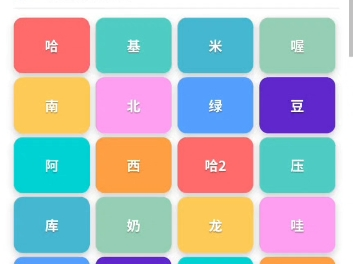 | 3 | 2025-11-28 |
| [哈基米南北绿豆](https://www.bilibili.com/video/BV1QFSGByEzB) | 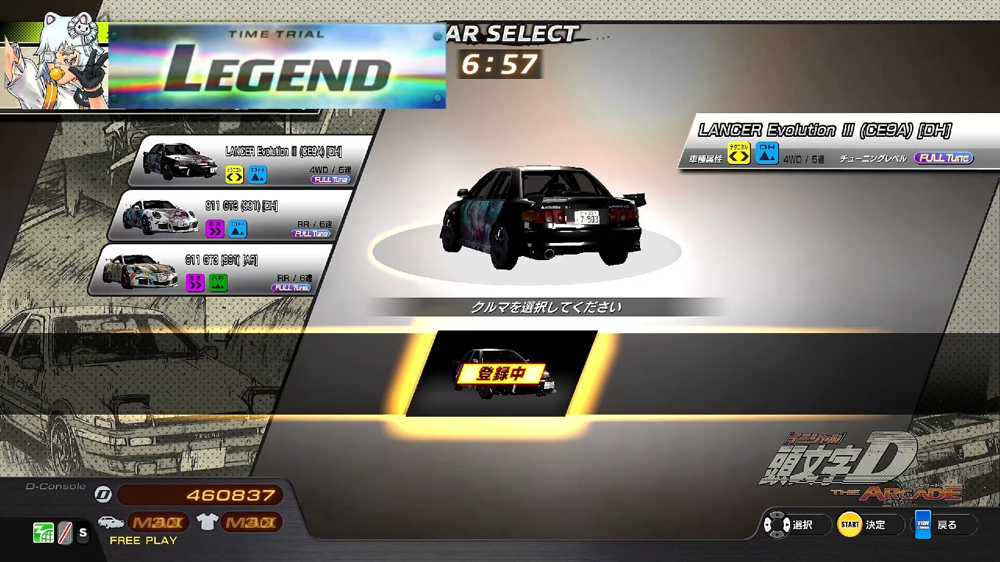 | 222 | 2025-11-27 |
| [卧槽！滇二娃光速道歉！玩哈基米梗结果两头挨骂！想学九阳结果成了品客！](https://www.bilibili.com/video/BV1ivSGBDEtm) |  | 6.7万 | 2025-11-27 |
| [哈基米，但是福音版《主的哈基米》【哈基米音乐】](https://www.bilibili.com/video/BV1ECSuBUE13) |  | 208 | 2025-11-27 |
| [【咪哈游】遐蝶但是哈基米](https://www.bilibili.com/video/BV1KMSgBaEyc) |  | 45 | 2025-11-27 |
| [哈基米音乐：fish in the pool・花屋敷](https://www.bilibili.com/video/BV19dSuBzEwH) |  | 374 | 2025-11-27 |
| [【四补】基米TV](https://www.bilibili.com/video/BV1fWSgBnEmU) |  | 4725 | 2025-11-27 |
| [基 米 M](https://www.bilibili.com/video/BV1BsSgBSE7q) |  | 3733 | 2025-11-27 |
| [【哈基米音乐】哈基米曼波喵喵（阿米嘎蒂朵喵喵歌）（Montagem Miau-Lenar）](https://www.bilibili.com/video/BV1FWSgBHEQb) |  | 144 | 2025-11-27 |
| [哈基米/许冠杰-学生哈](https://www.bilibili.com/video/BV1zWSgBnEqB) |  | 343 | 2025-11-27 |
| [【哈基米】【循环歌单】｜ “我们的爱情好像跳楼机” 《跳楼基》](https://www.bilibili.com/video/BV1eeSgBCERe) |  | 108 | 2025-11-27 |
| [中泰国际艺术工作坊学生作品：🐱哈基米求生寄🐱](https://www.bilibili.com/video/BV1DkSgBMENa) | 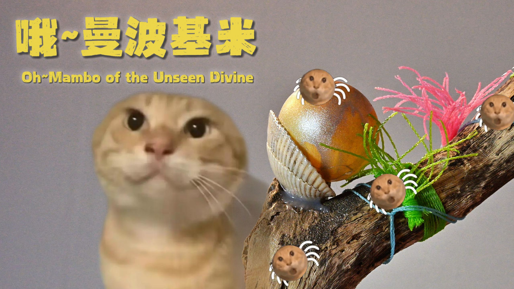 | 478 | 2025-11-27 |
| [哈基米！单手狂飙火车站](https://www.bilibili.com/video/BV1QRSTBaEKB) |  | 237 | 2025-11-27 |
| [哈基米边吃东西边哈气](https://www.bilibili.com/video/BV1VQSTBvEr4) |  | 2085 | 2025-11-27 |
| [【哈基米FM】snow hachimi](https://www.bilibili.com/video/BV1yMSMBXEUX) |  | 309 | 2025-11-27 |
| [【纯净哈基米】 🎶寄生兽の小曲🎶 《命》（完整版）—4分27演绎何为婉约派](https://www.bilibili.com/video/BV1H5SMBSEsM) |  | 85 | 2025-11-27 |
| [哈基米始祖：圆头耄耋的一生！新一代赛博永生的代表！哈基米一词终将替代猫？](https://www.bilibili.com/video/BV15VUNBfEoq) |  | 5267 | 2025-11-27 |
| [哈基米这一块/.](https://www.bilibili.com/video/BV1sQSMBWEyd) |  | 5.6万 | 2025-11-27 |
| [⚡太绝望了！⚡哈基米](https://www.bilibili.com/video/BV1hiSMBvEUU) |  | 441 | 2025-11-27 |
| [【哈基米音乐】穷哈基（原曲：穷开心）](https://www.bilibili.com/video/BV1ncSuB7ENm) |  | 480 | 2025-11-27 |
| [哈基米没整活我给你整个活](https://www.bilibili.com/video/BV17uUzB8Era) | 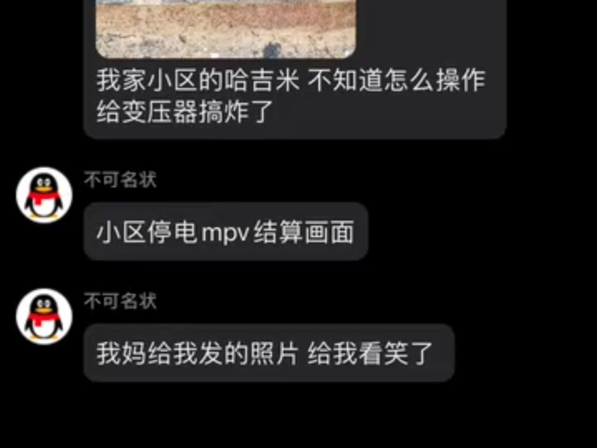 | 2150 | 2025-11-27 |
| [果然还是哈基米，阿米诺斯](https://www.bilibili.com/video/BV15LUzBxEmL) |  | 6514 | 2025-11-27 |
| [无所不能哈基米](https://www.bilibili.com/video/BV1svUzBkERf) | 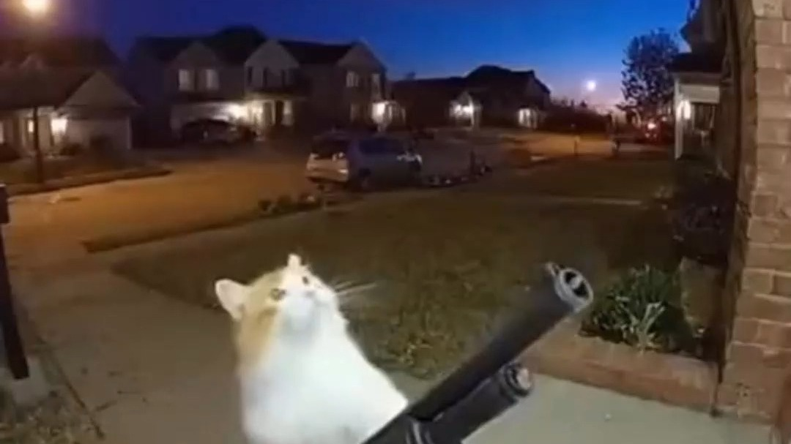 | 254 | 2025-11-27 |
| [烤翠花](https://www.bilibili.com/video/BV19EUzBWEHa) |  | 5275 | 2025-11-27 |
| [泰拉哈基米](https://www.bilibili.com/video/BV1htUzB7E4B) |  | 2129 | 2025-11-27 |
| [哈基米勇闯异世界——傻了吧唧兽王战役_第06集_大孝女吉安娜你怎么忍心看着老爹被群殴啊](https://www.bilibili.com/video/BV1GAU6BWEuT) |  | 1317 | 2025-11-27 |
| [“神人养龟”吐槽系列第二十二集，哈基米攻击哈吉龟，主人做出的选择是...？](https://www.bilibili.com/video/BV1WJU6BkEx2) | 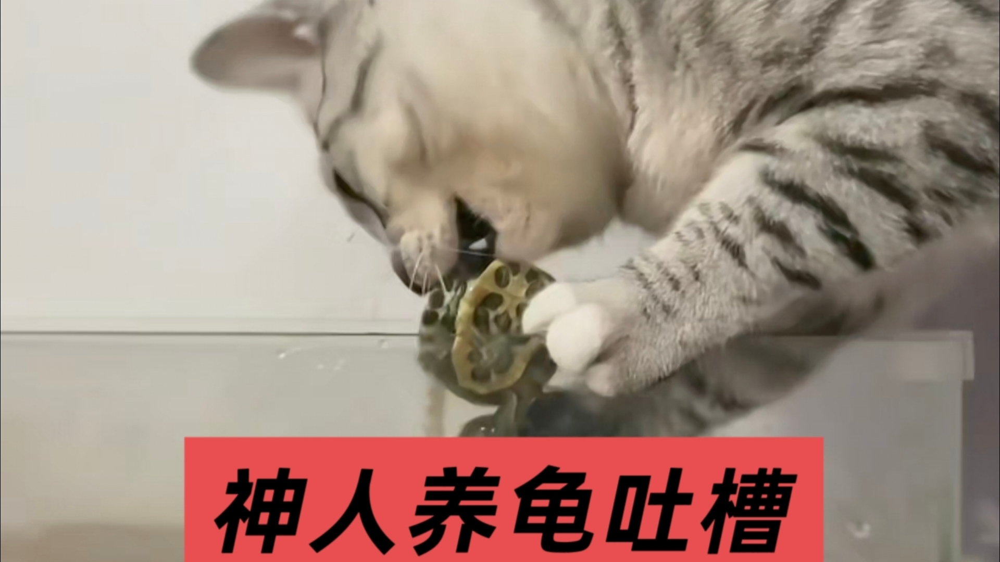 | 2565 | 2025-11-27 |
| [【哈基米音乐】Every 基米 Where 哈 Go](https://www.bilibili.com/video/BV1AxU6BBEuS) |  | 1.3万 | 2025-11-27 |
| [以防你不知道今天三国杀更新后可以发哈基米表情了](https://www.bilibili.com/video/BV1yeUqBvEVJ) | 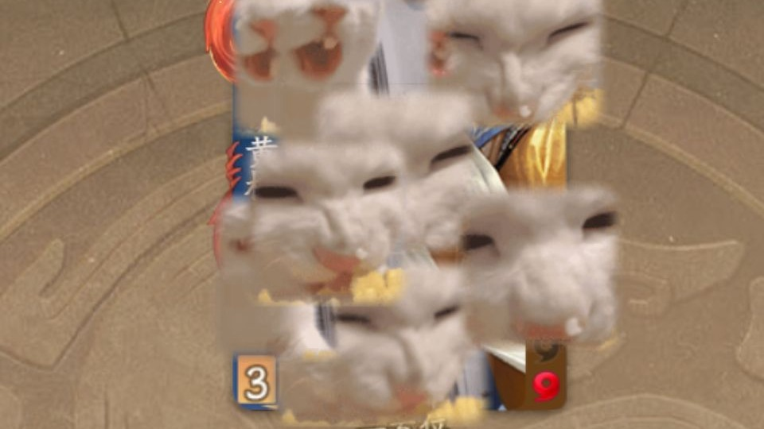 | 7692 | 2025-11-27 |
| [「渔の专栏」 三国杀一将成名之哈基米没活硬整](https://www.bilibili.com/video/BV1XoUqBUEd1) | 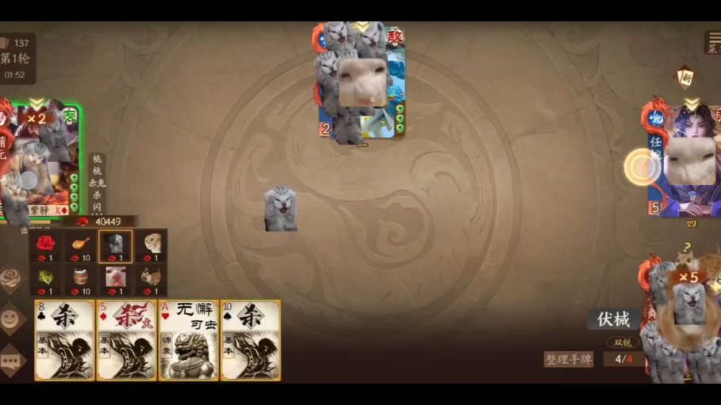 | 341 | 2025-11-27 |
| [⚡ 肾 上 基 素 ⚡（cod9多人大厅主题曲）](https://www.bilibili.com/video/BV1WaUWBbEkV) |  | 1401 | 2025-11-27 |
| [《哈基米闹钟》](https://www.bilibili.com/video/BV125UBBTE7b) | 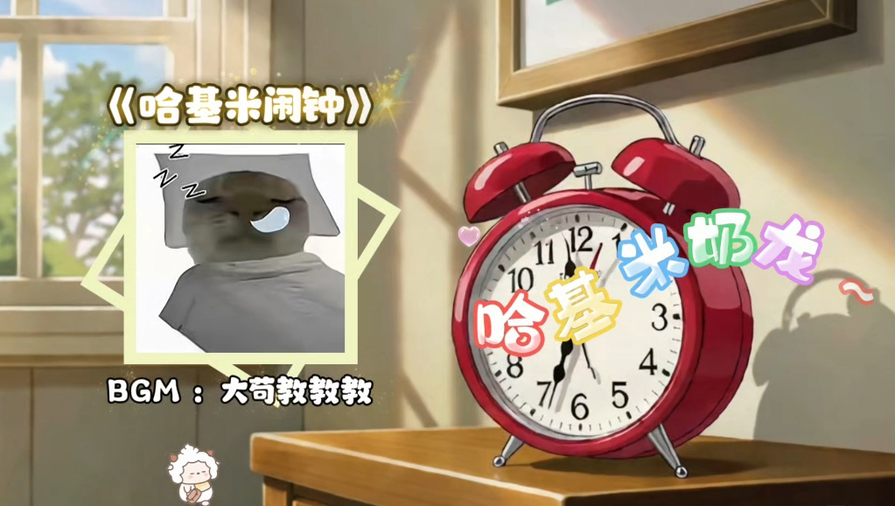 | 67 | 2025-11-26 |
| [《疯狂动物城》反派是耄耋？](https://www.bilibili.com/video/BV1v5UqBEEJn) |  | 30.6万 | 2025-11-26 |
| [咲基米](https://www.bilibili.com/video/BV1NTUeB4E8Z) |  | 2.3万 | 2025-11-26 |
| [可爱的钢板哈基米](https://www.bilibili.com/video/BV19aUeBuEAU) |  | 4300 | 2025-11-26 |
| [【哈基爻】哈for基米 cover NMIXX 《run for roses》](https://www.bilibili.com/video/BV1zcUvBJEUi) |  | 309 | 2025-11-26 |
| [经典哈基老番之基米的诱惑](https://www.bilibili.com/video/BV1egUvBVEtu) |  | 1279 | 2025-11-26 |
| [千咲真是一只爱发情的哈基米呢](https://www.bilibili.com/video/BV1tiUaBZEm1) |  | 1.0万 | 2025-11-26 |
| [哈基米之波斯语的小曲](https://www.bilibili.com/video/BV1RsUaBKEeJ) |  | 5471 | 2025-11-26 |
| [基米小学：耄耄是一只选择困难的小猫](https://www.bilibili.com/video/BV1QaUaBhEyi) |  | 10.8万 | 2025-11-26 |
| [哈基米受难记](https://www.bilibili.com/video/BV1YbUaBYEXt) |  | 2050 | 2025-11-26 |
| [《恐怖哈基米》](https://www.bilibili.com/video/BV1HDUaBEEbP) |  | 357 | 2025-11-26 |
| [魔法少女哈基米会瞬移也很正常吧       公式化1126期](https://www.bilibili.com/video/BV1KWUYBdET6) |  | 2018 | 2025-11-26 |
| [【哈基米曼波】【循环歌单】｜ “什么之魂啊?”｜ 《哈基米之魂》](https://www.bilibili.com/video/BV13VUYBYEhh) |  | 147 | 2025-11-26 |
| [【哈基米曼波】【日推歌单】｜ “什么之魂啊?”｜ 《哈基米之魂》](https://www.bilibili.com/video/BV1QVUYBYEb7) |  | 456 | 2025-11-26 |
| [哈基米南北绿豆](https://www.bilibili.com/video/BV18VUYBYEQp) |  | 5.9万 | 2025-11-26 |
| [哈基米南北绿豆……浆！](https://www.bilibili.com/video/BV1qzUYB1EXs) |  | 1438 | 2025-11-26 |
| [主人把猫咪骗出去剃毛，当主人再次见到猫咪那一刻，搞笑了](https://www.bilibili.com/video/BV1cvUYBEEJa) | 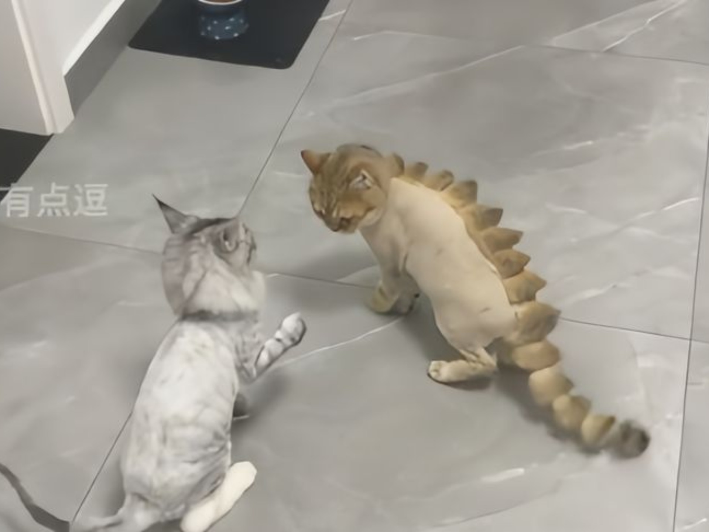 | 9.3万 | 2025-11-26 |
| [高雅人士](https://www.bilibili.com/video/BV1hcUSB1EJd) |  | 9.6万 | 2025-11-26 |
| [小财浴室之战](https://www.bilibili.com/video/BV1TLUhBWE4s) |  | 1.2万 | 2025-11-26 |
| [哈基米勇闯异世界——傻了吧唧兽王战役_第04集_哈基米挑战赤石魔](https://www.bilibili.com/video/BV1u9UhBtEGD) |  | 1585 | 2025-11-26 |
| [【哈基米】2077年的电台哈基米（原曲：pon pon shit)](https://www.bilibili.com/video/BV1zqUhBuEpB) |  | 804 | 2025-11-26 |
| [驯服圆头耄耋](https://www.bilibili.com/video/BV19CUhBPE9o) | 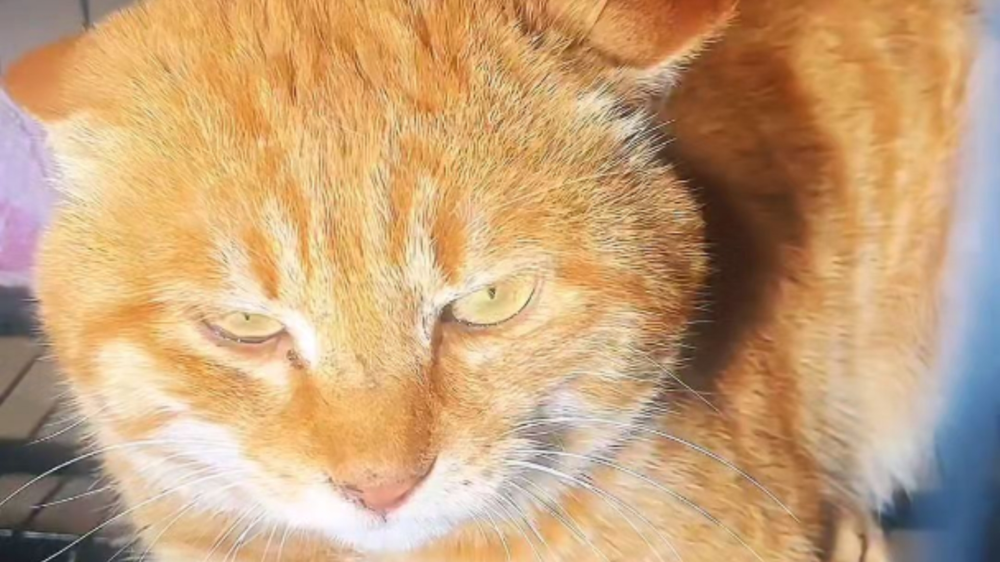 | 2620 | 2025-11-26 |
| [一个基米吃剩下的绿豆，你当做宝贝似的咪到家里](https://www.bilibili.com/video/BV1jBUhBBE7p) |  | 4721 | 2025-11-26 |
| [父慈子孝名场面](https://www.bilibili.com/video/BV1iJUaBzEsJ) |  | 9196 | 2025-11-26 |
| [中国驻日大使馆官推发故宫猫咪照片，评论区大多数日本网友都很喜欢。【推特X】](https://www.bilibili.com/video/BV1sAUaBHEas) | 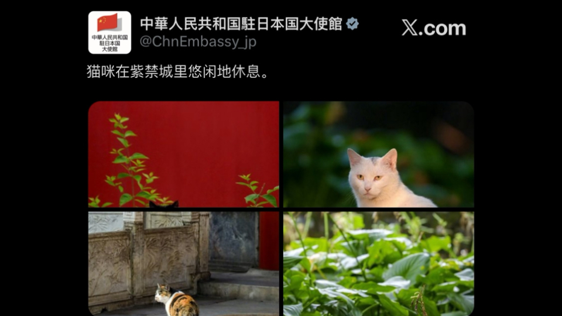 | 13.2万 | 2025-11-26 |
| [⚡️棕狸之歌⚡️但是群英荟萃版 ｜ 哈基米、哈米哈基——](https://www.bilibili.com/video/BV1aWUtBnETU) |  | 2.5万 | 2025-11-26 |
| [是魔法少女就应该关住邪恶的贝利亚，我是最阴的哈基米](https://www.bilibili.com/video/BV14LUbB1EyG) |  | 7678 | 2025-11-26 |
| [哈基米足球球原版](https://www.bilibili.com/video/BV1CUUXBgEct) | 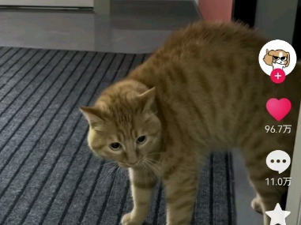 | 3142 | 2025-11-25 |
| [🐱🎵](https://www.bilibili.com/video/BV185U9BpE8w) |  | 1431 | 2025-11-25 |
| [哈基米这个宁死不屈](https://www.bilibili.com/video/BV1BQUDB8EAe) |  | 6964 | 2025-11-25 |
| [天气越来越冷了哈基米抵不住严寒了](https://www.bilibili.com/video/BV1AnUQBrEdM) | 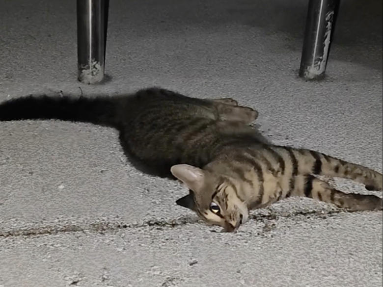 | 7332 | 2025-11-25 |
| [死基代码](https://www.bilibili.com/video/BV15zUQBtEbv) | 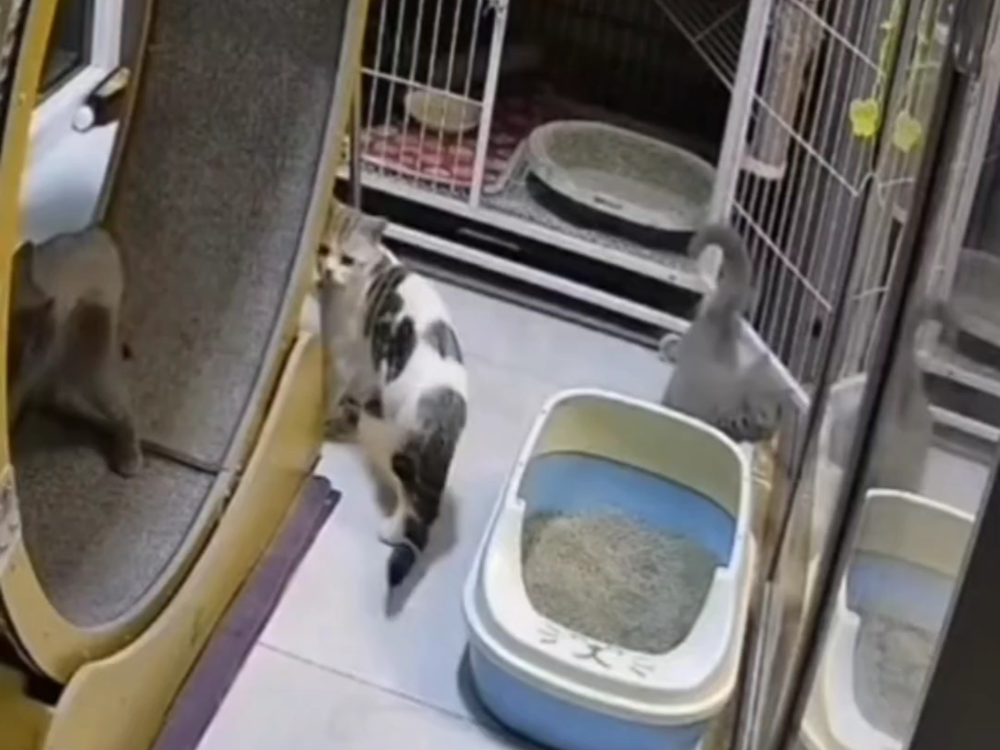 | 3.5万 | 2025-11-25 |
| [【哈基米】人类怎么这么坏呀](https://www.bilibili.com/video/BV1R9UUBnEyk) |  | 3079 | 2025-11-25 |
| [瘫基米](https://www.bilibili.com/video/BV1LjUDBsEFs) | 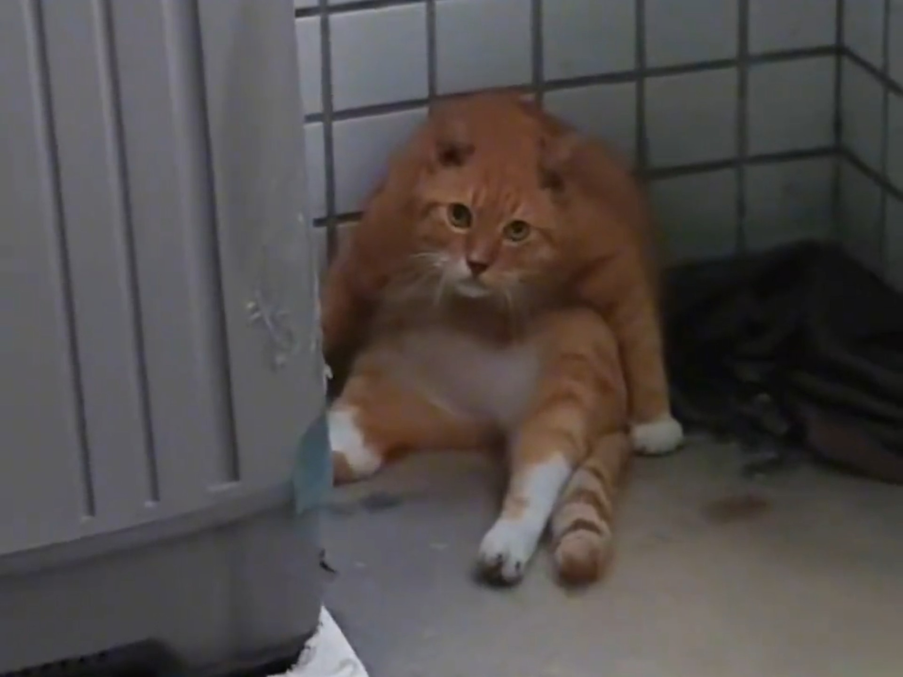 | 6.6万 | 2025-11-25 |
| [看看多少抽能出那个小猫](https://www.bilibili.com/video/BV1PZUSBqEyk) |  | 2.0万 | 2025-11-25 |
| [抽六命魔法少女哈基米要多少抽？](https://www.bilibili.com/video/BV1HJUmBREBj) |  | 1.2万 | 2025-11-25 |
| [你一定听过哈基米之歌《蓝莲哈》，但由现实版布偶猫演唱会怎样？](https://www.bilibili.com/video/BV1mNUmBNEkA) |  | 1421 | 2025-11-25 |
| [曼波之歌 ｜ 曼波波、曼波曼波——](https://www.bilibili.com/video/BV1MCU1BhEmb) |  | 14.6万 | 2025-11-25 |
| [哈基米曼波小狗脏脏版](https://www.bilibili.com/video/BV1C4UyBpEDc) | 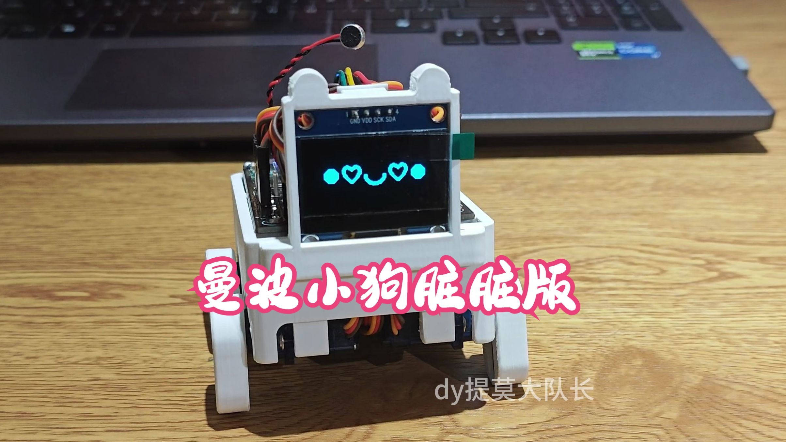 | 1.3万 | 2025-11-24 |
| [棘 背 龙 vs 科 莫 多](https://www.bilibili.com/video/BV1kxUkBLEm7) |  | 12.1万 | 2025-11-24 |
| [小财:求求你了，就给我吃一口嘛~ (´•ω•̥`)](https://www.bilibili.com/video/BV114UgBsEKr) | 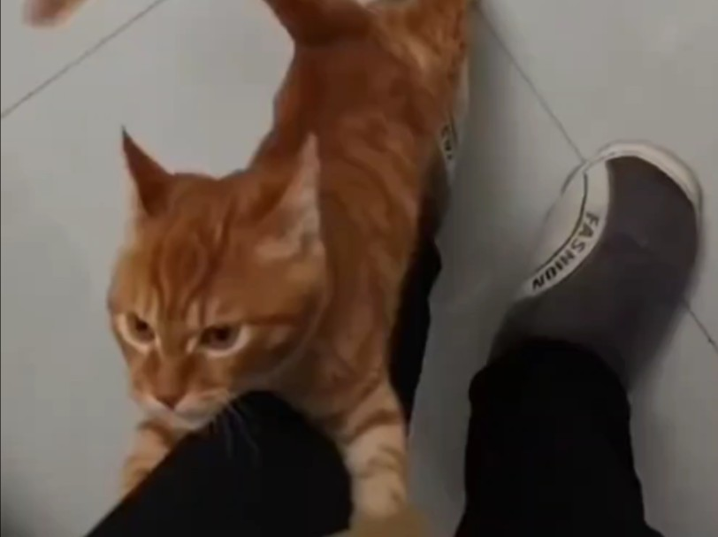 | 9557 | 2025-11-24 |
| [【二补】哈基米想被□了](https://www.bilibili.com/video/BV1LjUNBZE4e) | 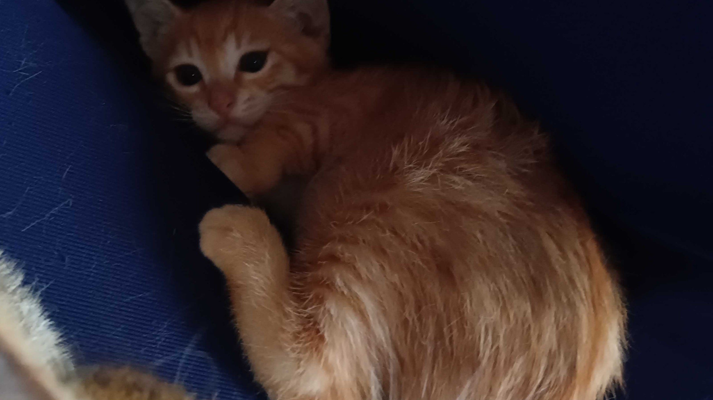 | 4.3万 | 2025-11-23 |
| [哈基米be like=](https://www.bilibili.com/video/BV1LjUNBoEA4) | 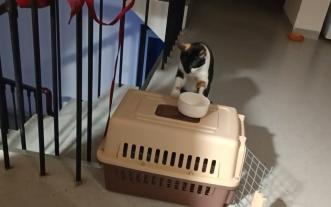 | 5 | 2025-11-23 |
| [“雕栏玉砌应犹在，只是朱颜改。”](https://www.bilibili.com/video/BV1XZUNBZE9e) | 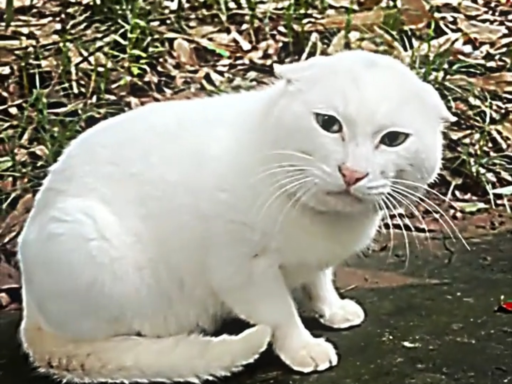 | 47.6万 | 2025-11-23 |
| [哈基米跳楼直接砸中路人脑袋倒地不起](https://www.bilibili.com/video/BV1GqUPBsEZb) |  | 5.9万 | 2025-11-23 |
| [干嘛…](https://www.bilibili.com/video/BV1PVUsBhEDR) |  | 22.0万 | 2025-11-22 |
| [哈基米南北绿豆🍟](https://www.bilibili.com/video/BV19vUVB2Ewk) |  | 83 | 2025-11-22 |
| [大狗：终于让我逮到哈基米辣！](https://www.bilibili.com/video/BV1HLUpBHE2x) |  | 10.1万 | 2025-11-22 |
| [赛尔赛尔！用热血写下我们的骄傲。赛尔赛尔！小人物永不老！ 《这里是神奇的赛尔号》俄语版](https://www.bilibili.com/video/BV1wjyuBzEnj) |  | 182.8万 | 2025-11-22 |
| [哈气与应激：耄耋警戒2 主题曲《地狱基行曲》](https://www.bilibili.com/video/BV1qAUWBEEpH) |  | 6.8万 | 2025-11-22 |
| [哈基米的底层代码都是一样的吗？](https://www.bilibili.com/video/BV11rUnBREyK) |  | 1.5万 | 2025-11-22 |
| [底层代码冲突了](https://www.bilibili.com/video/BV1SCUVB3Eow) | 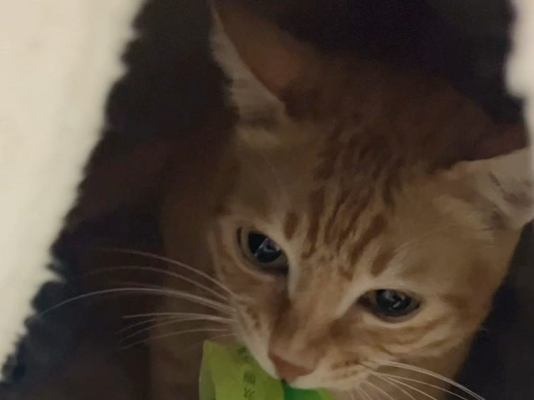 | 211.4万 | 2025-11-21 |
| [哈基米：无畏（概念版）](https://www.bilibili.com/video/BV1MfyKBVEuG) |  | 5869 | 2025-11-21 |
| [商场的一件狸花猫背心!!我破防了.小猫的衣服只能小猫穿，谁穿了都会倒霉。现实是不但你要吃肉，你还得多造成点杀生给你可爱的猫狗吃，你比其他人更残忍，还有资格哭？](https://www.bilibili.com/video/BV1hjyMBSE9r) |  | 14.7万 | 2025-11-21 |
| [&quot;你说的可是......宝藏？&quot;](https://www.bilibili.com/video/BV1f8yPBWEmU) |  | 143.2万 | 2025-11-21 |
| [你听过大号版的《哈基米起床》吗？](https://www.bilibili.com/video/BV1gTywBaEwm) |  | 267 | 2025-11-20 |
| [这板子质量可以  大号的都能粘住](https://www.bilibili.com/video/BV1SmywBPEX8) | 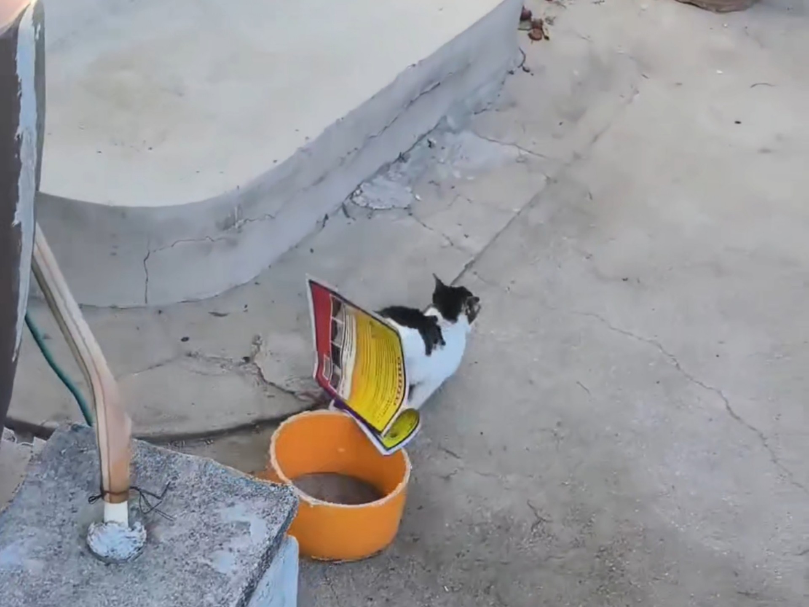 | 2.9万 | 2025-11-20 |
| [喵の女仆](https://www.bilibili.com/video/BV1dgyHBcEZr) | 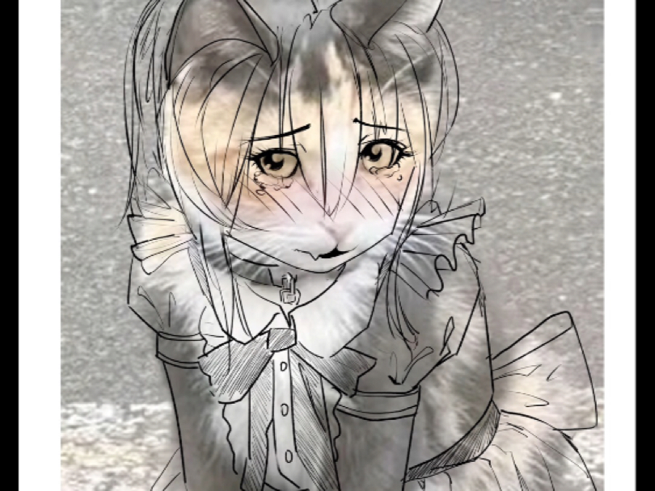 | 35.6万 | 2025-11-19 |
| [几十只猫瞎眼受伤，爱猫人士无能狂怒发现原来是自己弃养和散养流浪猫最终导致这悲剧，他们不反思自己反怪别人和环境。](https://www.bilibili.com/video/BV1WRynBGEge) |  | 8591 | 2025-11-19 |
| [嘎啦杠木里可不是这样的](https://www.bilibili.com/video/BV1HAy5BXEtK) | 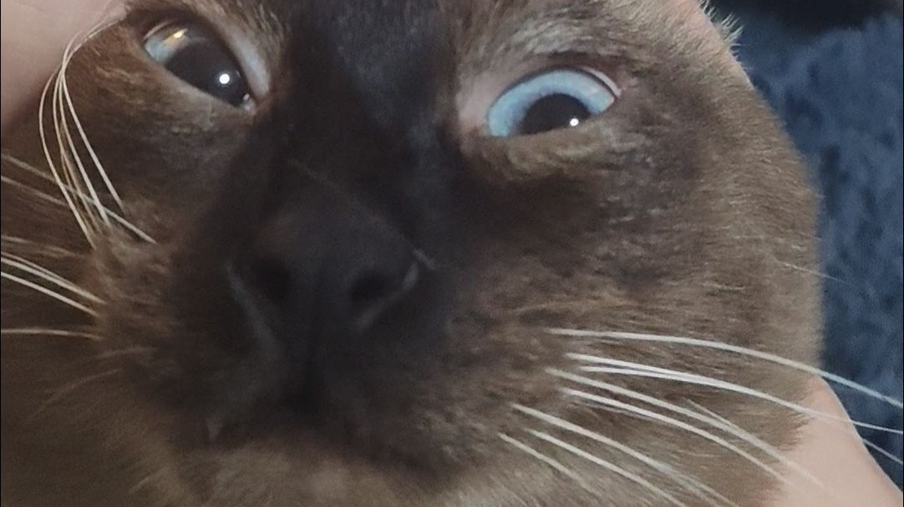 | 9.8万 | 2025-11-18 |
| [能看完的都是勇士](https://www.bilibili.com/video/BV1L7y5BVEj3) |  | 129.5万 | 2025-11-18 |
| [哈吉咪：别以为我不打小孩子，忍你很久了~](https://www.bilibili.com/video/BV11yCWBQE9Q) | 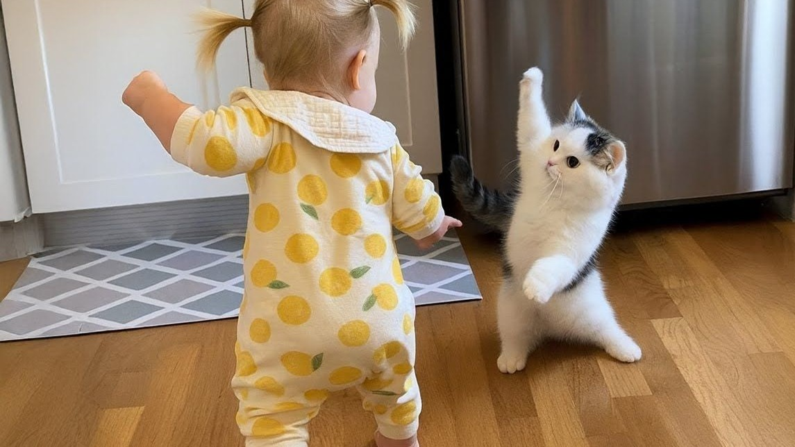 | 21.2万 | 2025-11-15 |
| [道理我都懂，但是这只哈基米为什么这么大](https://www.bilibili.com/video/BV1LKYVzYEar) |  | 2.7万 | 2025-09-07 |
| [大狗基米，我们合体，永不分离](https://www.bilibili.com/video/BV1GjarzvEJ8) |  | 11.1万 | 2025-09-03 |
| [哈基米街舞](https://www.bilibili.com/video/BV1Bht7zAEnD) |  | 11.8万 | 2025-08-04 |
| [哈基米保卫战吗](https://www.bilibili.com/video/BV1xgEczgEa8) |  | 162.2万 | 2025-05-13 |

---
*最后更新: 2025-11-28 02:42:00 (自动生成)*
*数据来源: [Bilibili](https://www.bilibili.com)*

## 使用说明

运行以下命令更新视频列表:
```bash
python3 fetch_hajimi_videos.py
```
