# awesome-hajimi
collections of hajimi (哈基米 in Chinese) on the Internet.

## 视频列表 (Video List)

| 视频标题 (Title) | 封面 | 播放量 (Views) | 发布日期 (Date) |
|---|---|---|---|
| [奇异隐身锁血老毛子，我看是纯纯的哈基米啊](https://www.bilibili.com/video/BV1k7HgzMEh8) |  | 1010 | 2025-10-05 |
| [哈基米？曼波？频频爆梗的赛马娘究竟是什么？【二次元简史21】](https://www.bilibili.com/video/BV1vZxbz4E9r) |  | 554 | 2025-10-05 |
| [哈 基 米 豌 豆](https://www.bilibili.com/video/BV1LdxbzZEyh) |  | 3.8万 | 2025-10-04 |
| [你听过最可爱的纯净哈基米之😺浪漫😺](https://www.bilibili.com/video/BV12ex4zNEQP) |  | 1505 | 2025-10-04 |
| [Hastify](https://www.bilibili.com/video/BV1aEx4zLE9J) |  | 947 | 2025-10-04 |
| [强迫哈基米吃饭](https://www.bilibili.com/video/BV1FsxtzcEYu) |  | 3705 | 2025-10-04 |
| [哈基米过于贪玩导致到嘴的食物飞了](https://www.bilibili.com/video/BV1WaxszZE4F) | 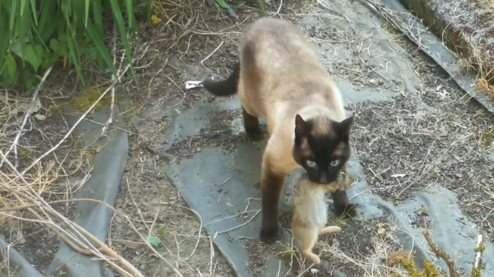 | 2251 | 2025-10-04 |
| [一口气带你了解哈基米文化的解构发展史，一杯蜂蜜水是怎么改变一个时代的？](https://www.bilibili.com/video/BV1fExWzmE2B) | 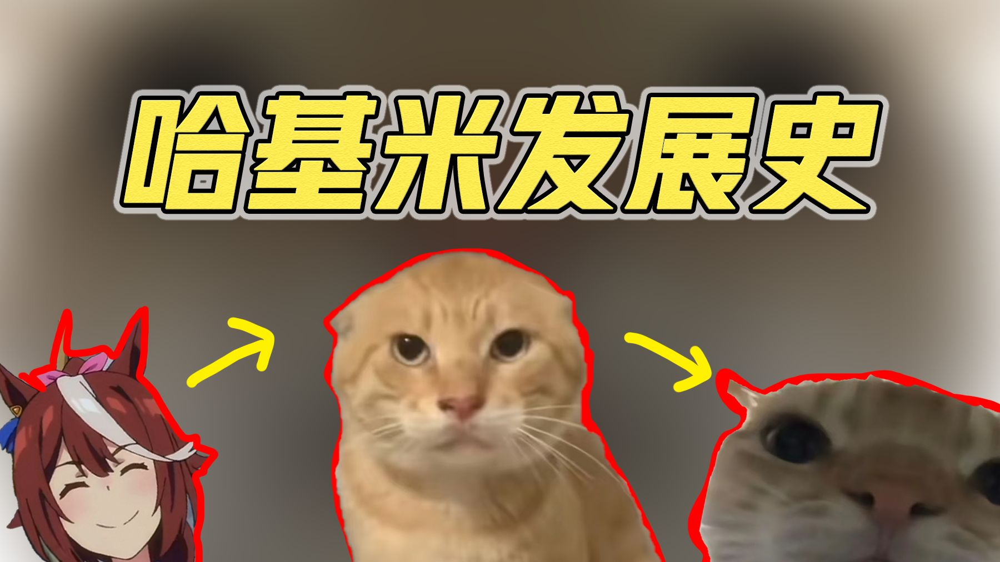 | 1.4万 | 2025-10-04 |
| [这是什么代码有没有懂的](https://www.bilibili.com/video/BV1cpxxz9Ewp) | 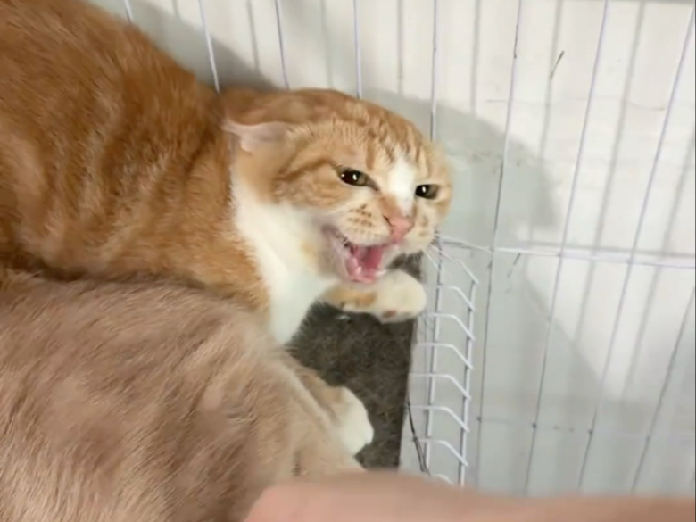 | 2.7万 | 2025-10-04 |
| [哈哈，奶牛猫会自己给自己驱魔](https://www.bilibili.com/video/BV1NkHLzxE9Y) | 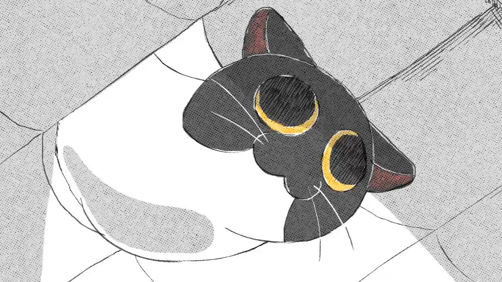 | 41.2万 | 2025-10-04 |
| [【哈基米之歌】全网热门版本一网打尽！](https://www.bilibili.com/video/BV1LaxxzmEZM) | 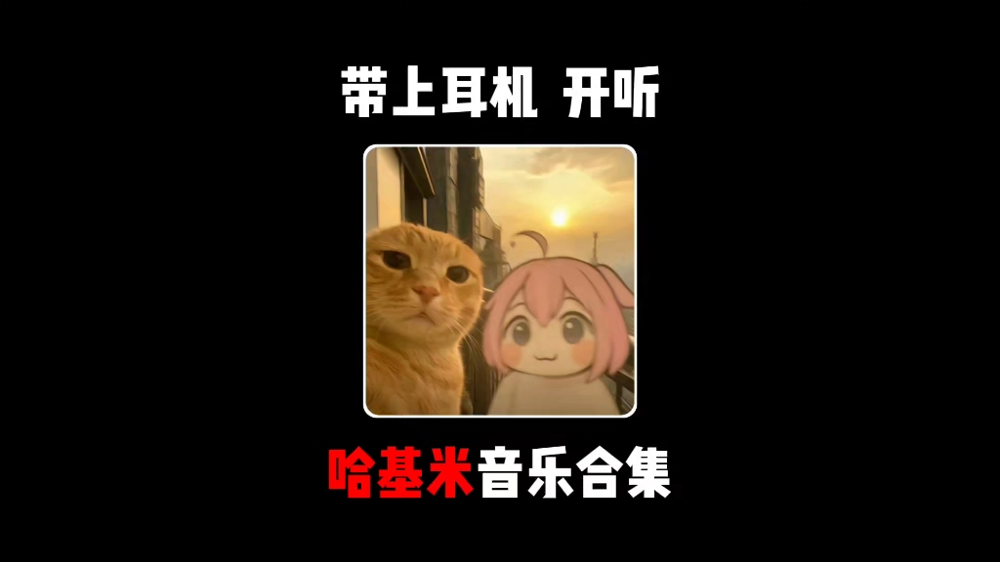 | 2534 | 2025-10-04 |
| [【哈基米阴乐】haad 4 u](https://www.bilibili.com/video/BV1Gqxxz5EfY) |  | 1840 | 2025-10-04 |
| [哈基剑专区](https://www.bilibili.com/video/BV1Vqxxz5EY2) | 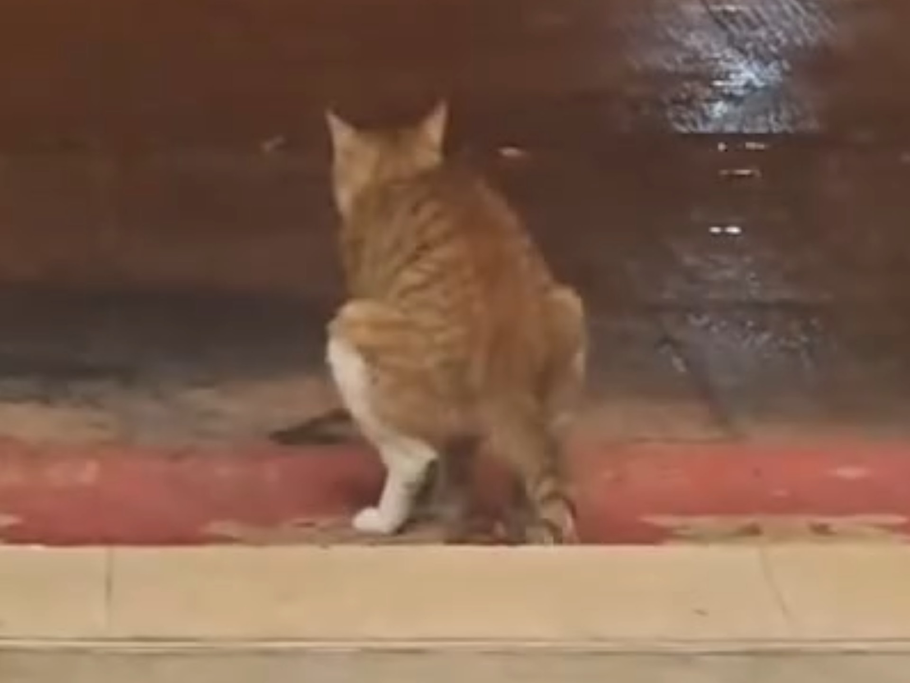 | 2.5万 | 2025-10-04 |
| [哈基米这个可爱 【纯净哈基米】愉快の小曲](https://www.bilibili.com/video/BV19exxzLE6k) |  | 1678 | 2025-10-04 |
| [20分钟哈基米音乐合集 哈基米～](https://www.bilibili.com/video/BV1q1xpz3Ehj) | 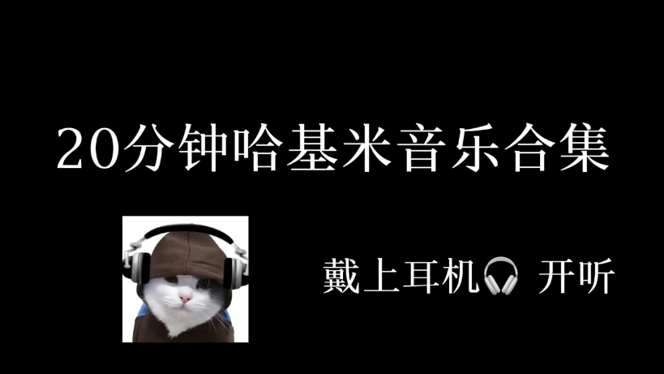 | 995 | 2025-10-04 |
| [猫儿这个猫儿](https://www.bilibili.com/video/BV16nxWz7EUK) |  | 6.3万 | 2025-10-04 |
| [【十秒夺走你的耳膜】Still 哈.基.米.](https://www.bilibili.com/video/BV1CpH5zJEBP) |  | 2158 | 2025-10-04 |
| [🎵🐱哈基米的夏天—summer🐱🎵（重置版）带你回到那个自由哈气的夏天](https://www.bilibili.com/video/BV1dHxJzFE5D) | 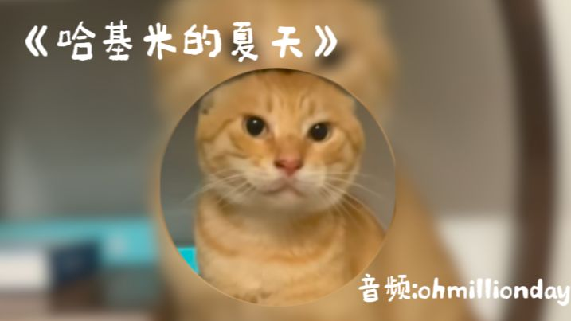 | 1.1万 | 2025-10-04 |
| [【b猫日记】怎么给哈基米选屎盆？ 一步到位直接买个大的](https://www.bilibili.com/video/BV1DRHTz5E4Q) | 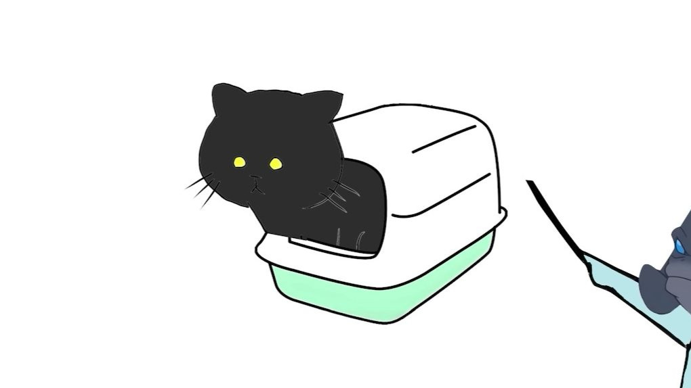 | 2.7万 | 2025-10-04 |
| [2025基米战斗力浅聊~很有基米精神！](https://www.bilibili.com/video/BV1ymxWzZEDR) |  | 32.1万 | 2025-10-04 |
| [哈基米：🐱火红的哈基郎🐱](https://www.bilibili.com/video/BV1F7xHzrEjg) |  | 3012 | 2025-10-04 |
| [高歌哈基米，夺取最后的胜利！](https://www.bilibili.com/video/BV11nH5zDEwE) |  | 2.0万 | 2025-10-03 |
| [哈基米的素材不要太好用──美国政府停摆后，两党没事干拿哈基米当素材做AI视频隔空把停摆的锅往对方身上甩！](https://www.bilibili.com/video/BV1QTH5z8ExH) |  | 1.3万 | 2025-10-03 |
| [谁家女仆哈基米？](https://www.bilibili.com/video/BV1vrH5zMEC4) |  | 3.5万 | 2025-10-03 |
| [难绷t v💀#地狱哈基米](https://www.bilibili.com/video/BV11fH5zREN7) | 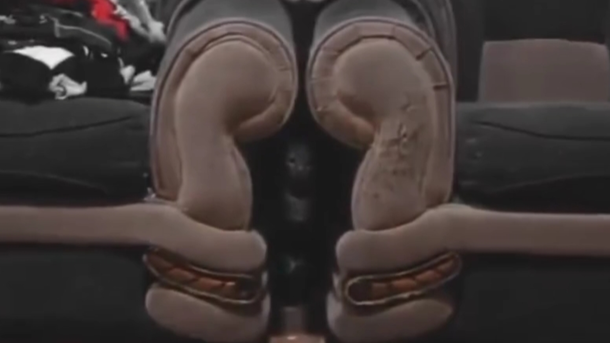 | 9190 | 2025-10-03 |
| [一个做助眠的哈基米up从0开始到现在的助眠精剪合集](https://www.bilibili.com/video/BV1bmHGzsEWq) | 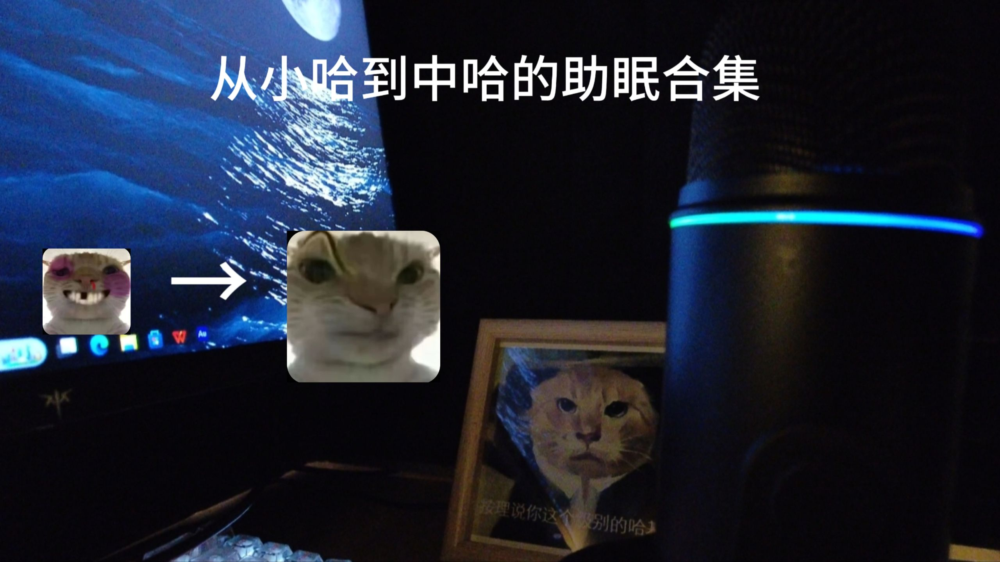 | 3599 | 2025-10-03 |
| [骨气这一块](https://www.bilibili.com/video/BV1pcHVz1EkW) | 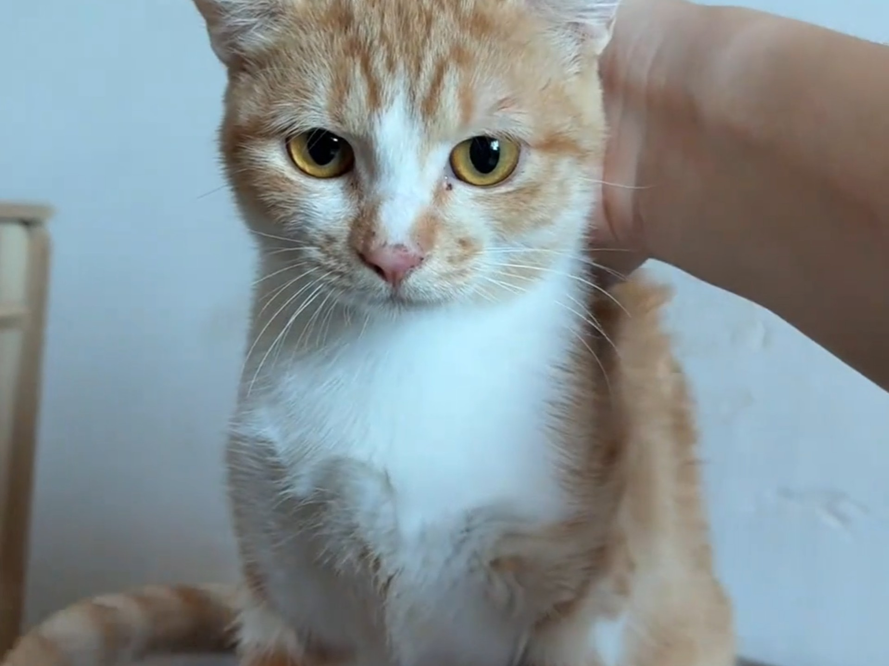 | 3.4万 | 2025-10-03 |
| [耄耋在向大狗嚼嚼嚼哈气的时候，会想到后果吗？](https://www.bilibili.com/video/BV1AzHVzSEkE) |  | 2.3万 | 2025-10-03 |
| [哈基米 哈基米 一定要哈基米](https://www.bilibili.com/video/BV1Efn1zAEfw) |  | 2085 | 2025-10-03 |
| [大和解！雷子学习中文终于明白了哈基米是什么意思【猫雷Nyaru】](https://www.bilibili.com/video/BV1sDHgzyEfg) |  | 1.3万 | 2025-10-03 |
| [哈基米之《夜曲》翻唱 周杰伦听了都落泪了！](https://www.bilibili.com/video/BV1GJH3zREwA) |  | 2.5万 | 2025-10-03 |
| [手慢无，给小猫吓成青蛙了](https://www.bilibili.com/video/BV1AJHGzyEYQ) |  | 41.1万 | 2025-10-03 |
| [🐱众神眷恋的哈基乡🐱](https://www.bilibili.com/video/BV12cHKzaEtq) |  | 41.2万 | 2025-10-03 |
| [【哈基米音乐】 Please Don&#x27;t Go](https://www.bilibili.com/video/BV1JmHpzKE9w) |  | 1.5万 | 2025-10-03 |
| [逃离哈基米莫南北绿豆~ 但是越追越快！](https://www.bilibili.com/video/BV1Byn2zhEY4) |  | 4.3万 | 2025-10-03 |
| [夜 曲（哈）-翻唱](https://www.bilibili.com/video/BV1V5HuznEqL) |  | 3.7万 | 2025-10-03 |
| [无基转生：spiral🐱](https://www.bilibili.com/video/BV1xrHKzNEeE) |  | 3.3万 | 2025-10-03 |
| [哈基朗私人笑声一小时循环](https://www.bilibili.com/video/BV1mFHKzAEDb) |  | 1.8万 | 2025-10-02 |
| [关爱哈基米（M18）](https://www.bilibili.com/video/BV1beHPzwEHN) |  | 3203 | 2025-10-02 |
| [被日v问什么是曼波和哈基米后努力解释的中国观众们](https://www.bilibili.com/video/BV14jHNzYEJe) |  | 2.2万 | 2025-10-02 |
| [爱音塔菲唐笑2000小时纯享版](https://www.bilibili.com/video/BV1uspQzqEri) |  | 6.7万 | 2025-10-02 |
| [优势在谁](https://www.bilibili.com/video/BV1JDHwzkEV2) | 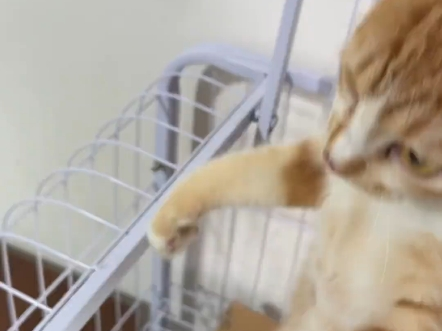 | 19.6万 | 2025-10-02 |
| [神人卡组推荐之哈基米工厂](https://www.bilibili.com/video/BV1ecHxzPEpC) | 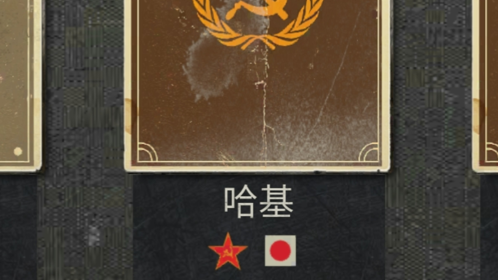 | 3.8万 | 2025-10-01 |
| [[人头耄耋]攀登哈基米世上最高的山](https://www.bilibili.com/video/BV1X9HnzpECi) |  | 10.3万 | 2025-10-01 |
| [【亿万级特效！】猫核老鼠：宿命对决！（全程高能！）](https://www.bilibili.com/video/BV1cBHnzeENZ) |  | 456.4万 | 2025-10-01 |
| [【哈基米音乐】 哈海](https://www.bilibili.com/video/BV1oZHLz5Ewp) |  | 1922 | 2025-09-30 |
| [为何和哈基米相比，狗子和马的关系非常好？](https://www.bilibili.com/video/BV1fsnmzPERL) | 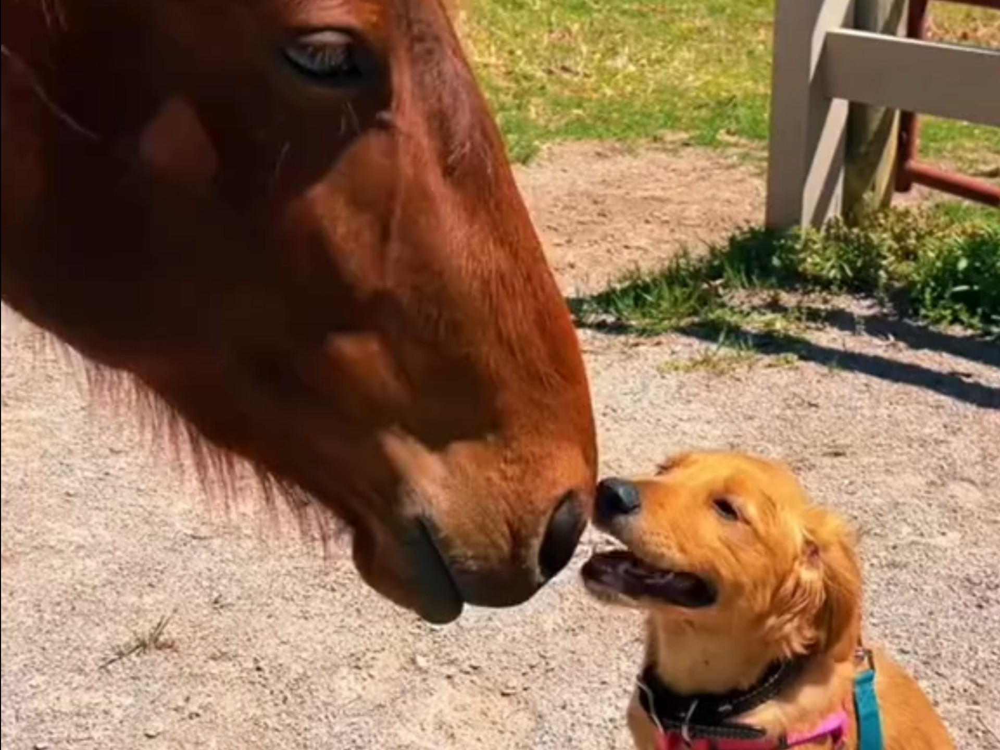 | 7.5万 | 2025-09-30 |
| [《猛毒注意》（哈基米版）](https://www.bilibili.com/video/BV1NQnmz1E7T) |  | 1006 | 2025-09-30 |
| [【哈基米 / omori】good 耄ning](https://www.bilibili.com/video/BV1sxndzvEBc) | 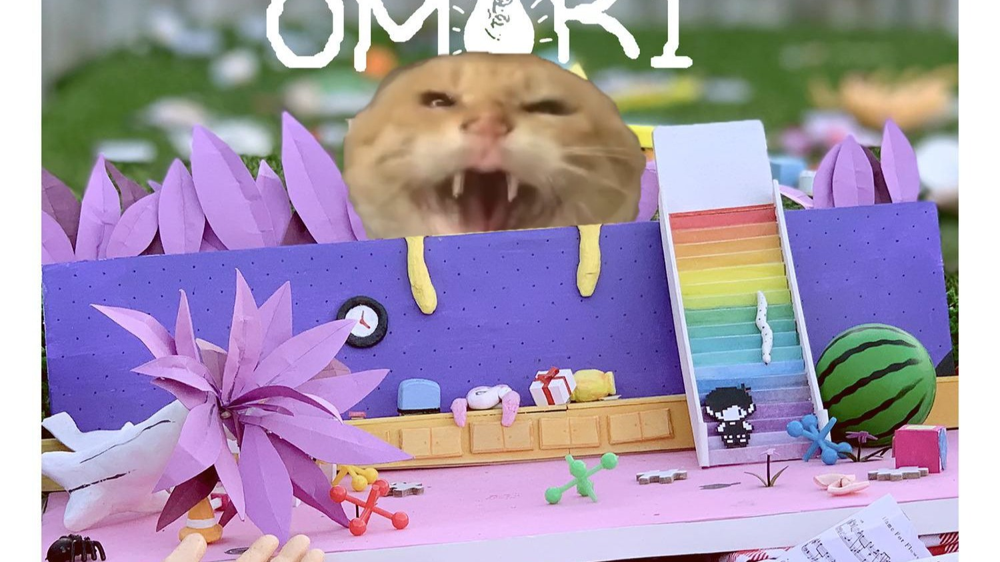 | 3886 | 2025-09-28 |
| [打 火 基](https://www.bilibili.com/video/BV1snnQzpEWV) |  | 12.1万 | 2025-09-28 |
| [讲实话了，眼红别人投稿哈基米音乐百万播放【阿梓】](https://www.bilibili.com/video/BV18onGzsE52) |  | 6.1万 | 2025-09-26 |
| [耄耋练习舞蹈](https://www.bilibili.com/video/BV15qn4zvEJt) |  | 61.1万 | 2025-09-25 |
| [你在欧美打法面前，只算是个萝莉](https://www.bilibili.com/video/BV1b1pDzPEwY) |  | 524.6万 | 2025-09-20 |
| [超燃草帽小曲](https://www.bilibili.com/video/BV14VWLzAEae) | 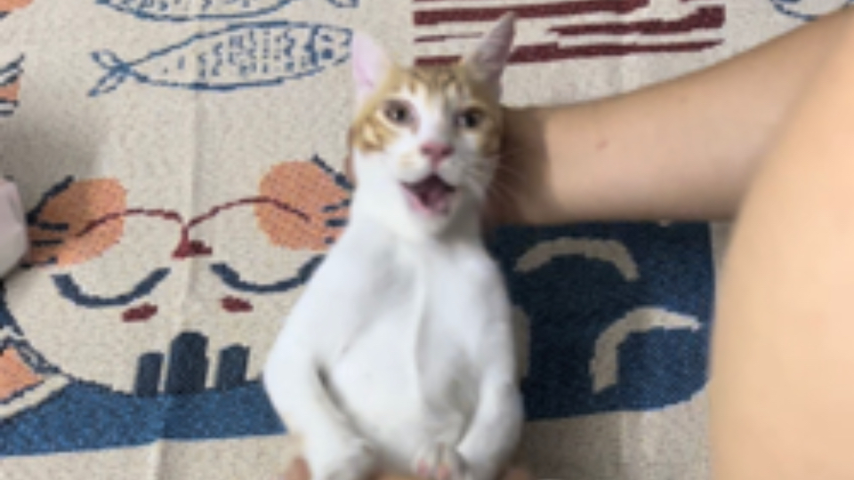 | 20.9万 | 2025-09-20 |
| [命悬一线也要哈气吗，哈基米你这家伙](https://www.bilibili.com/video/BV1hkp8z1EyM) |  | 2.6万 | 2025-09-17 |
| [🐱我的哈基是咪做的🐱](https://www.bilibili.com/video/BV1fnpzzDEo3) |  | 14.0万 | 2025-09-16 |
| [约翰的农场！挖掘机里腌萝卜，咿呀咿呀哟~](https://www.bilibili.com/video/BV1vdpMz4EtZ) |  | 110.0万 | 2025-09-15 |
| [哈基米我也想救你，但是哈基仙玩的好开心](https://www.bilibili.com/video/BV12VHZzLE7u) |  | 4.5万 | 2025-09-14 |
| [哈基米强制开机时刻](https://www.bilibili.com/video/BV1xUHkzKEG7) |  | 10.8万 | 2025-09-12 |
| [哈基米南北绿豆](https://www.bilibili.com/video/BV1dqHqzMEYd) |  | 57.5万 | 2025-09-11 |
| [【哈基米FM】基米沙洲冷](https://www.bilibili.com/video/BV1Z3HezbEHW) |  | 9.7万 | 2025-09-11 |
| [【劉俊朗】《蓝莲哈》听哭千万哈基米。](https://www.bilibili.com/video/BV1UHH8zKE2E) |  | 9.4万 | 2025-09-11 |
| [🍬基米说🍬](https://www.bilibili.com/video/BV1yyafzuEjo) |  | 38.8万 | 2025-09-09 |
| [神人杰洛唱《基米说》](https://www.bilibili.com/video/BV1APafzqE62) |  | 52.5万 | 2025-09-08 |
| [哈基咪 叮咚鸡](https://www.bilibili.com/video/BV1auY3zQEfJ) |  | 940 | 2025-09-07 |
| [哈基汪亲手埋葬哈基米，让人潸然泪下](https://www.bilibili.com/video/BV13MaqzsEeC) |  | 11.5万 | 2025-09-06 |
| [哈基米哦南北绿豆 🎵🎵🎵🎵🎵](https://www.bilibili.com/video/BV1ahamzJEEq) |  | 5.4万 | 2025-09-04 |
| [《哈基米南北绿豆》](https://www.bilibili.com/video/BV1QfhvzmE33) | 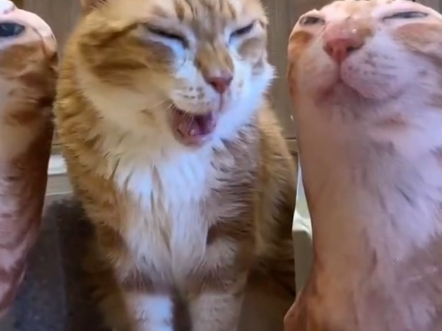 | 41.6万 | 2025-08-30 |
| [循环歌单｜【2:23 AM】｜&quot;写作业必听的宝藏歌曲&quot;](https://www.bilibili.com/video/BV1X1emzdEk8) | 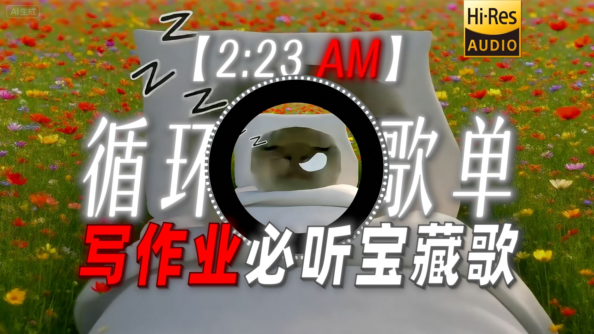 | 317.7万 | 2025-08-28 |
| [哈基米这个享受](https://www.bilibili.com/video/BV1SJvNzqEfW) | 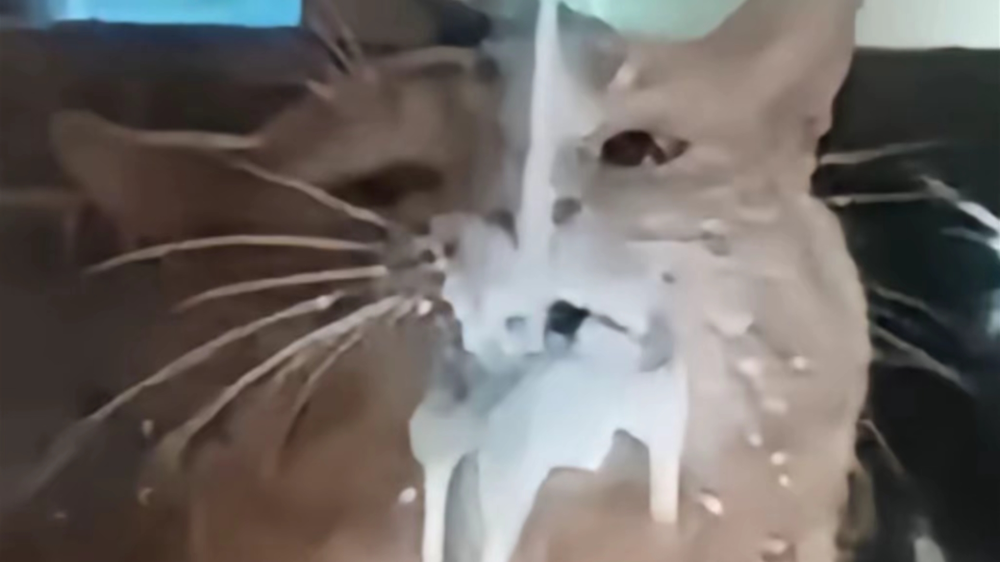 | 7.8万 | 2025-08-26 |
| [哈基米这个迫不及待](https://www.bilibili.com/video/BV1WXenzTEVK) | 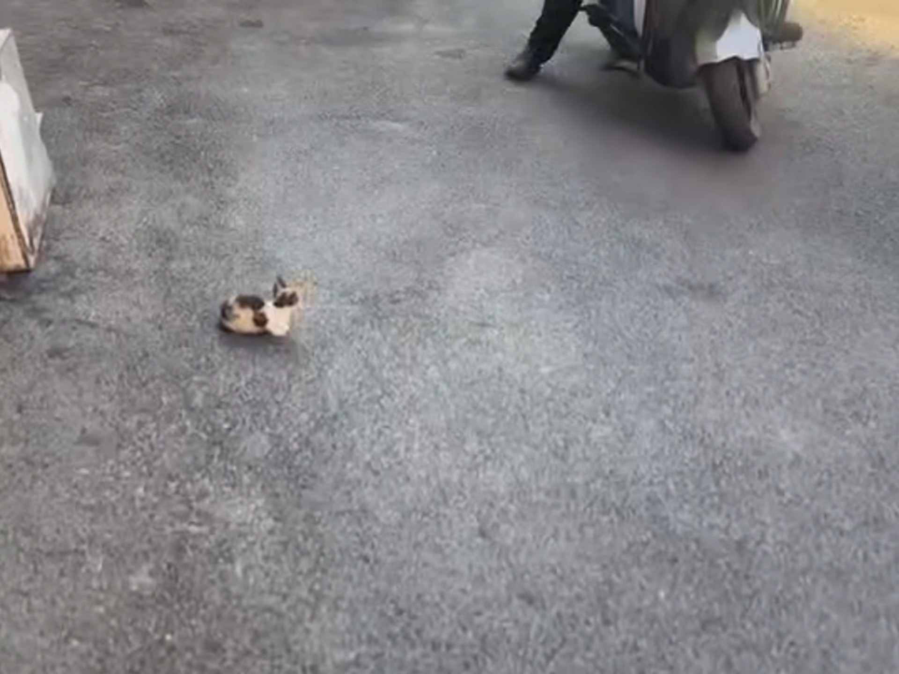 | 12.8万 | 2025-08-24 |
| [救落水狗和落水猫对比](https://www.bilibili.com/video/BV1RUe7zGEhH) |  | 94.8万 | 2025-08-24 |
| [【塞尔达】米基哈的假面](https://www.bilibili.com/video/BV1yde3zVE3e) |  | 3.1万 | 2025-08-20 |
| [哈基米喔南北绿豆](https://www.bilibili.com/video/BV1rHYtzmE8o) |  | 35.4万 | 2025-08-19 |
| [户晨风连麦耄耋](https://www.bilibili.com/video/BV1PuY2zzEJ1) |  | 78.3万 | 2025-08-17 |
| [史上最强爱猫区？以胶疗养哈基米！最终酿得苦果~](https://www.bilibili.com/video/BV1rhbrz5E94) | 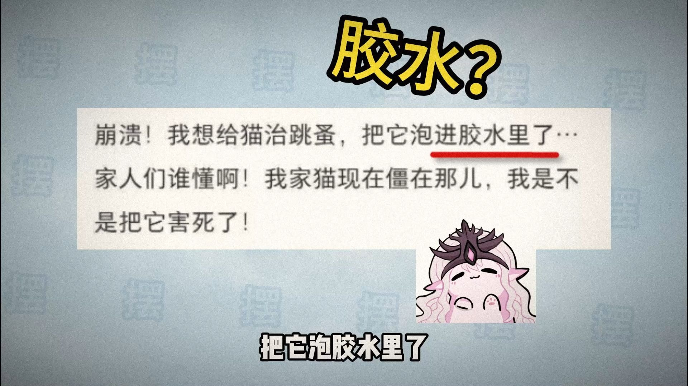 | 13.8万 | 2025-08-14 |
| [⚡哈基米哟南北绿豆⚡（GTI·哈夫克·阿萨拉）](https://www.bilibili.com/video/BV1L4tozuEhh) |  | 24.6万 | 2025-08-12 |
| [📭哈基米哦南北绿豆📭](https://www.bilibili.com/video/BV1Rstez3EWA) |  | 3.9万 | 2025-08-10 |
| [“哈基米，出去之后只可走南北，因为南北路多”](https://www.bilibili.com/video/BV1FUt8zgENa) |  | 65.1万 | 2025-08-09 |
| [《不再曼波》](https://www.bilibili.com/video/BV1qvtJzMEuP) | 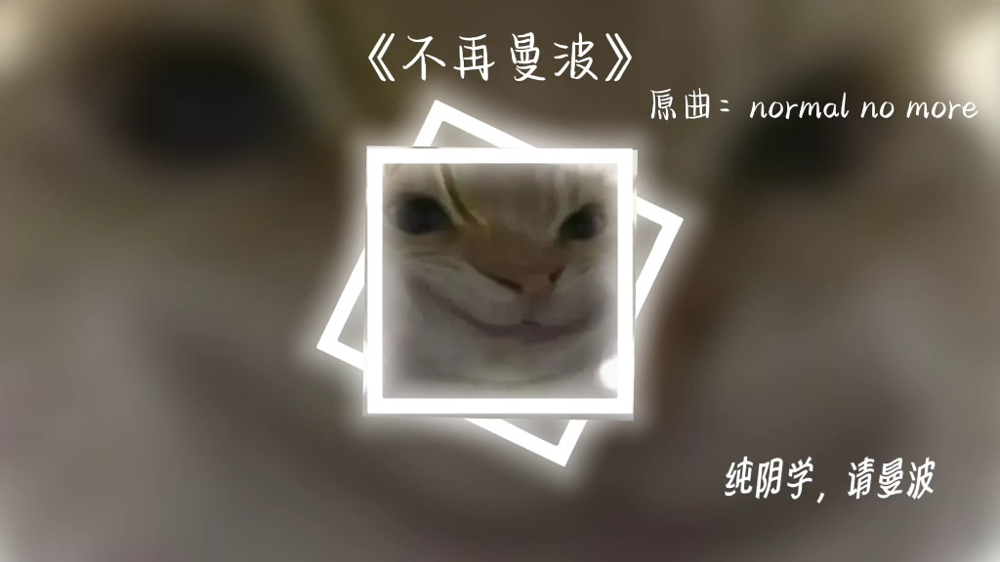 | 15.8万 | 2025-08-05 |
| [“哈↑哇→哈↑夏→哈↑ 曼→哈↑波→哈↑哦→哈↑ 耶→哈↑基米→wow”  ｜ 《猛攻の小曲》循环歌单](https://www.bilibili.com/video/BV1KztnzsEYS) |  | 44.8万 | 2025-08-05 |
| [哈基米登上顶点的梦该醒了 I Really Want to Stay at Your House](https://www.bilibili.com/video/BV1abt3zgEPr) |  | 90.9万 | 2025-08-04 |
| [其实你怕的只是音乐](https://www.bilibili.com/video/BV1m388zHEJt) |  | 73.4万 | 2025-07-26 |
| [废物哈基米被鱼刺单杀](https://www.bilibili.com/video/BV1CJ8FzeERh) | 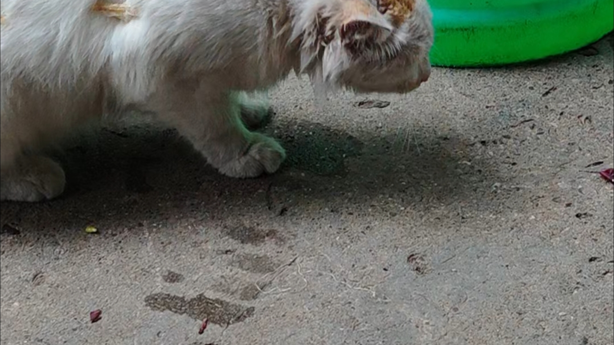 | 7.8万 | 2025-07-23 |
| [耄耋二世](https://www.bilibili.com/video/BV1dPg5zGEeP) | 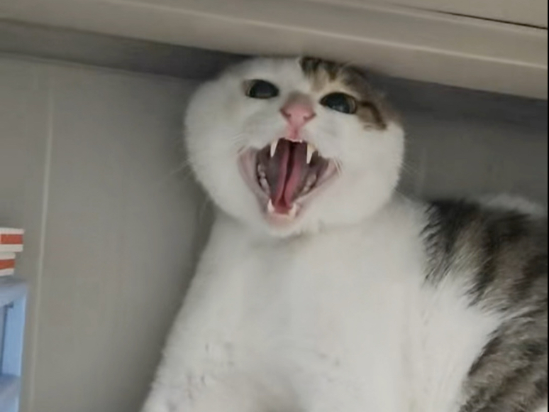 | 81.9万 | 2025-07-21 |
| [哈基米这个秒开](https://www.bilibili.com/video/BV1bqutzPEfE) | 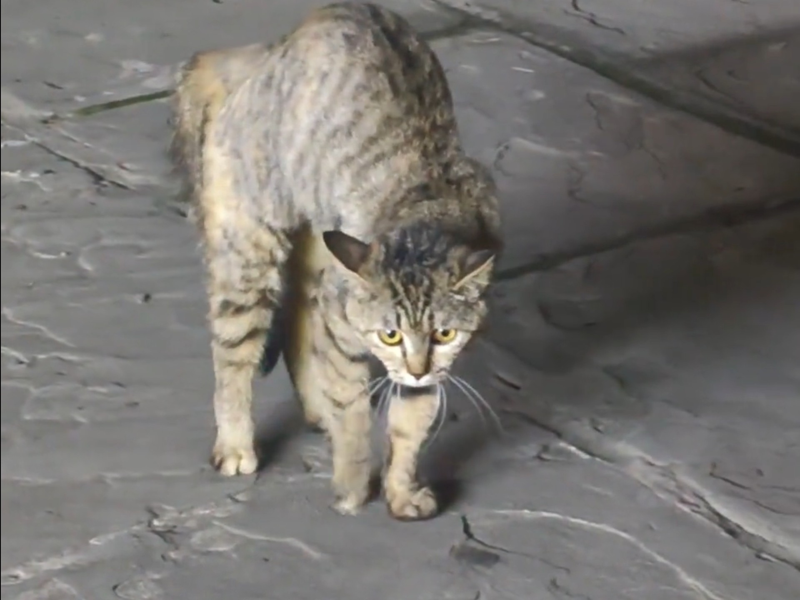 | 9.1万 | 2025-07-16 |
| [[哈基米古典乐]巴赫 BWV1067 《Badinerie》完整版](https://www.bilibili.com/video/BV1T3uszsEhG) |  | 22.4万 | 2025-07-15 |
| [MAGENTA POTION神人药水](https://www.bilibili.com/video/BV1y9JnzvEXs) |  | 92.1万 | 2025-05-22 |
| [『哈人恶兽』(耄耋)](https://www.bilibili.com/video/BV1SiEgzVEvc) |  | 123.6万 | 2025-05-11 |
| [【补档】天空属于哈基米](https://www.bilibili.com/video/BV1XiGXzQEWS) | 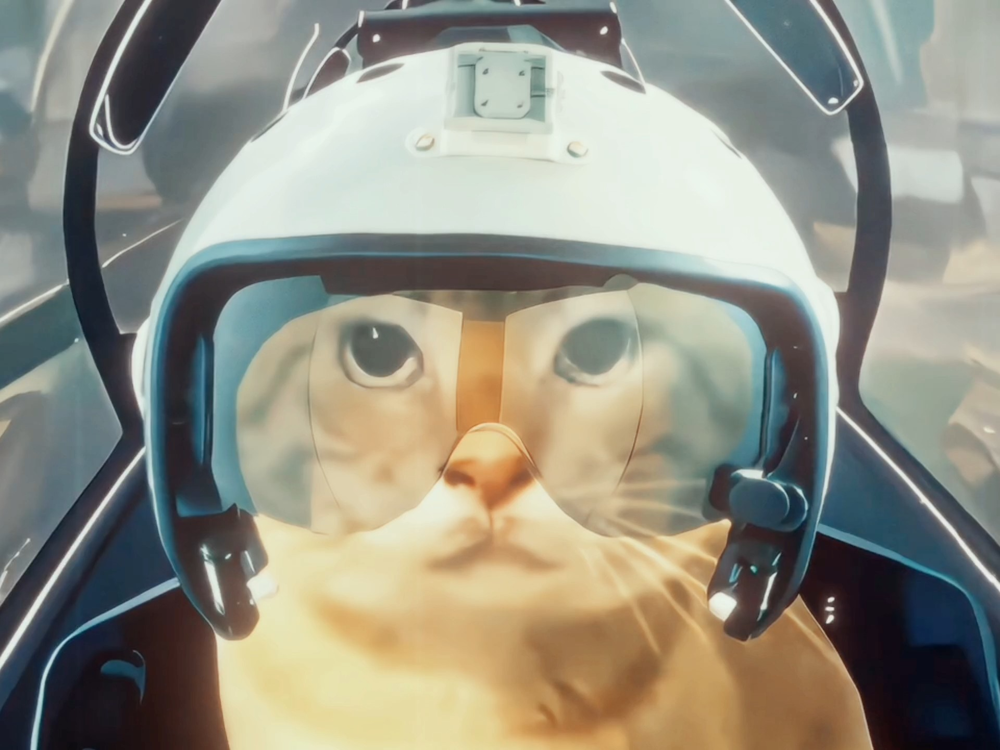 | 78.8万 | 2025-04-30 |
| [活全家哈基米儿歌之🐸哈基蛙😸](https://www.bilibili.com/video/BV1jhQWYhEHw) |  | 15.9万 | 2025-03-12 |
| [哈基米古神语合集](https://www.bilibili.com/video/BV1bARHYXELW) | 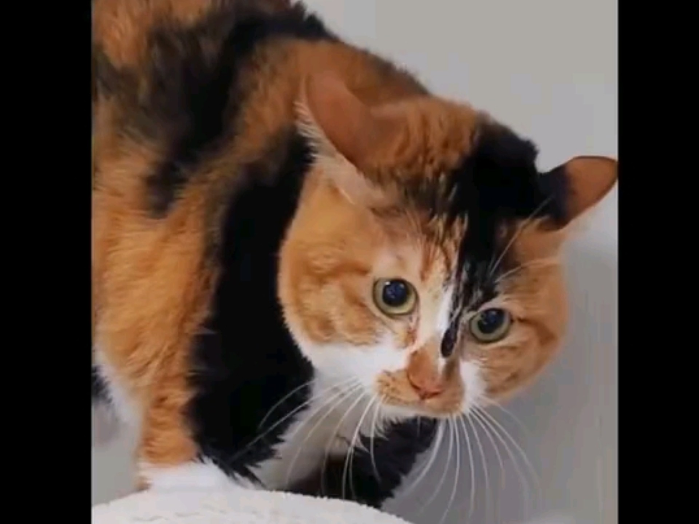 | 14.3万 | 2025-03-11 |
| [悲报~圆头耄耋疑似寄了](https://www.bilibili.com/video/BV1nr9UYmE9N) |  | 147.6万 | 2025-03-07 |
| [已连接到哈基米网络](https://www.bilibili.com/video/BV1d5AheyEQf) |  | 22.6万 | 2025-02-18 |
| [哈基米已经崛起，亿万坚韧必须......](https://www.bilibili.com/video/BV1rHK5e2EjZ) |  | 18.7万 | 2025-02-12 |
| [循环歌单｜草帽酱《青衣DJ》｜“我为你 唱一曲忘忧的战局 谁倾城美丽别过了虞姬”](https://www.bilibili.com/video/BV1eFwqexEPR) |  | 152.1万 | 2025-01-19 |
| [《剑 哈 基 米 TV》](https://www.bilibili.com/video/BV1xy411B7yU) |  | 118.1万 | 2024-07-10 |
| [“下辈子去做宠物猫，有人疼有人宠。”](https://www.bilibili.com/video/BV1k4421D7LA) | 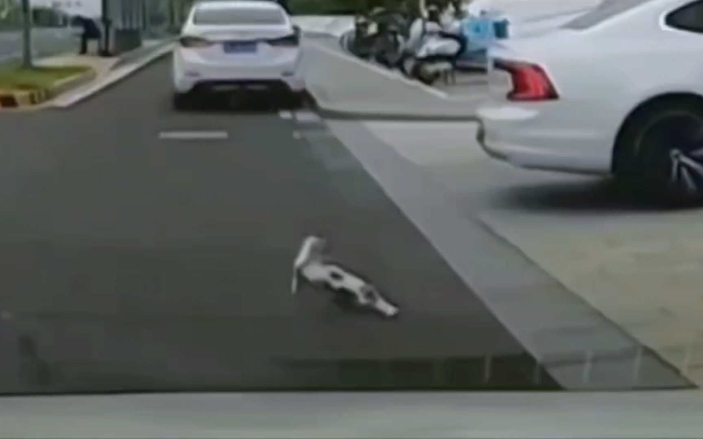 | 27.0万 | 2024-07-07 |
| [哈基米野战哈基汪](https://www.bilibili.com/video/BV1fu4m137xf) | 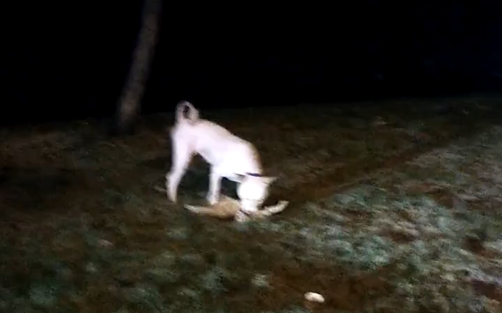 | 42.3万 | 2024-03-06 |
| [【洛天依原创】我的悲伤是水做的](https://www.bilibili.com/video/BV1Qc411h7Ys) |  | 702.3万 | 2020-04-10 |

---
*最后更新: 2025-10-05 02:39:14 (自动生成)*
*数据来源: [Bilibili](https://www.bilibili.com)*

## 使用说明

运行以下命令更新视频列表:
```bash
python3 fetch_hajimi_videos.py
```
