# awesome-hajimi
collections of hajimi (哈基米 in Chinese) on the Internet.

## 视频列表 (Video List)

| 视频标题 (Title) | 封面 | 播放量 (Views) | 发布日期 (Date) |
|---|---|---|---|
| [【2026哈基米拜年基单品】HaStep](https://www.bilibili.com/video/BV1sKZ5BZEvy) |  | 166 | 2026-02-17 |
| [【2026拜年基单品】哈基米-哇袄（李贞贤-哇）](https://www.bilibili.com/video/BV1oLZgBNEhb) |  | 533 | 2026-02-17 |
| [【哈基米】恭喜哈财](https://www.bilibili.com/video/BV1ymZ5BfEeL) |  | 174 | 2026-02-17 |
| [【2026哈基米拜年基单品】 迎春哈](https://www.bilibili.com/video/BV1RtZ5BkEay) |  | 394 | 2026-02-17 |
| [像哈基米一样呐【2026哈基米拜年基单品】](https://www.bilibili.com/video/BV1UWZKBVED4) |  | 2824 | 2026-02-17 |
| [echo feat. 哈基米（2026哈基米拜年基单品）](https://www.bilibili.com/video/BV1wyZJBMEcq) |  | 358 | 2026-02-17 |
| [恭喜发财 但哈基米版](https://www.bilibili.com/video/BV18KZuBpER4) |  | 4 | 2026-02-17 |
| [東基フラッシュ【哈基米】【東京フラッシュ（东京闪景）】【2026哈基米拜年基单品】](https://www.bilibili.com/video/BV1NrZgBEEVi) |  | 350 | 2026-02-16 |
| [归零【哈基米】大哈一场【2026哈基米拜年基单品】](https://www.bilibili.com/video/BV1qZZgBiEYA) |  | 222 | 2026-02-16 |
| [Biri-Biri-活全家哈基米版【2026-哈基米拜年基单品】](https://www.bilibili.com/video/BV1cnF6zwETR) |  | 103 | 2026-02-16 |
| [【FF14】耄王哈基米•哈基十二世](https://www.bilibili.com/video/BV1m5Z3BREw3) |  | 4492 | 2026-02-16 |
| [【2026哈基米拜年基】哈基米：奇点🐱🐱](https://www.bilibili.com/video/BV1b3Z3BoEEM) |  | 108 | 2026-02-16 |
| [孙笑川传说之辘轳首(哈基米版)](https://www.bilibili.com/video/BV1tjZ3BWEgh) |  | 241 | 2026-02-16 |
| [基米到](https://www.bilibili.com/video/BV127Z3BXEfH) |  | 69 | 2026-02-16 |
| [【新年第一哈!｜《基米说》翻唱】新年快乐！](https://www.bilibili.com/video/BV1t7Z3BXEN2) |  | 16 | 2026-02-16 |
| [祝大家：新春快乐～](https://www.bilibili.com/video/BV1PvZMByEog) |  | 4594 | 2026-02-16 |
| [新年哈基米，新年快乐](https://www.bilibili.com/video/BV1KeZMBLEDv) | 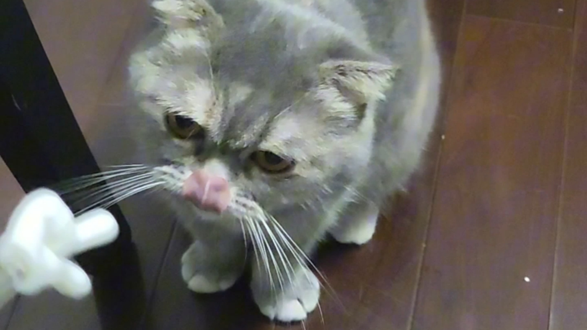 | 1323 | 2026-02-16 |
| [【完整版】哈基米电音：Strobe](https://www.bilibili.com/video/BV1hRZwBiEzk) |  | 1513 | 2026-02-16 |
| [恭喜发财！“和声为哈基米版”](https://www.bilibili.com/video/BV1u2ZTB7EBM) |  | 9035 | 2026-02-16 |
| [【拜年基】圆头耄耋的奇妙冒险：不灭哈气——great hays](https://www.bilibili.com/video/BV1w7cqz8E7S) |  | 1516 | 2026-02-16 |
| [【哈基米音乐】星基公民 新巴贝基](https://www.bilibili.com/video/BV1q9ZMBhENV) | 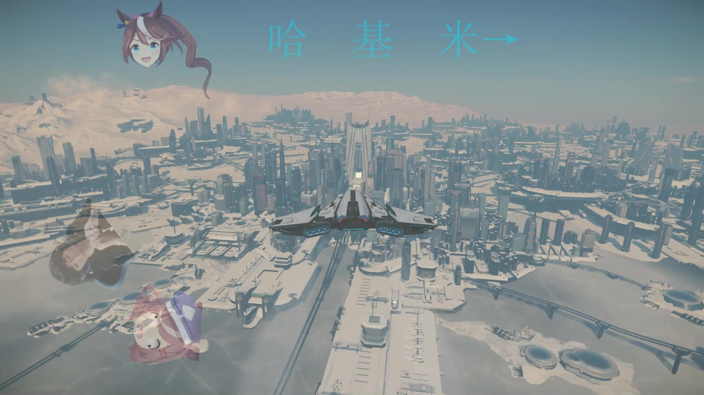 | 678 | 2026-02-16 |
| [哈气气气气主义【拜年基单品】](https://www.bilibili.com/video/BV1q9ZMBhEz6) |  | 1776 | 2026-02-16 |
| [让基米叮咚【2026哈基米拜年基单品】](https://www.bilibili.com/video/BV1C6ZMBgEc3) |  | 141 | 2026-02-16 |
| [【2026拜年基单品】哈基米：火化](https://www.bilibili.com/video/BV1CBZMBrEFJ) |  | 1896 | 2026-02-16 |
| [【哈基米拜年基单品】拜新年🐱](https://www.bilibili.com/video/BV15EZMBxESX) |  | 530 | 2026-02-16 |
| [【哈基米拜年祭单品】复梦天使（完整版）](https://www.bilibili.com/video/BV1hxZMBDEiW) |  | 882 | 2026-02-16 |
| [【哈基米拜年基单品】策🐎奔腾](https://www.bilibili.com/video/BV1eFZuB4Ezh) |  | 218 | 2026-02-16 |
| [【哈基funk】🐱SEM NADA🐱](https://www.bilibili.com/video/BV1YAZuBsEar) |  | 919 | 2026-02-16 |
| [【拜年基单品】哈基米超燃战斗音乐之Ascent](https://www.bilibili.com/video/BV1rCZMBMEY8) |  | 799 | 2026-02-16 |
| [【2026年哈基米拜年祭单品】哈基米燥起来（原曲：Make U Sweat-Knock2)](https://www.bilibili.com/video/BV1qXZMBwE1r) |  | 315 | 2026-02-16 |
| [哈基米马年电音节·HACHIMI EX 音MAD SET【2026哈基米拜年基单品】](https://www.bilibili.com/video/BV1qXZMBwEgF) |  | 5314 | 2026-02-16 |
| [【哈基米的小钱包】最新视频已上线，快来围观！](https://www.bilibili.com/video/BV1ZSZMBPEj5) | 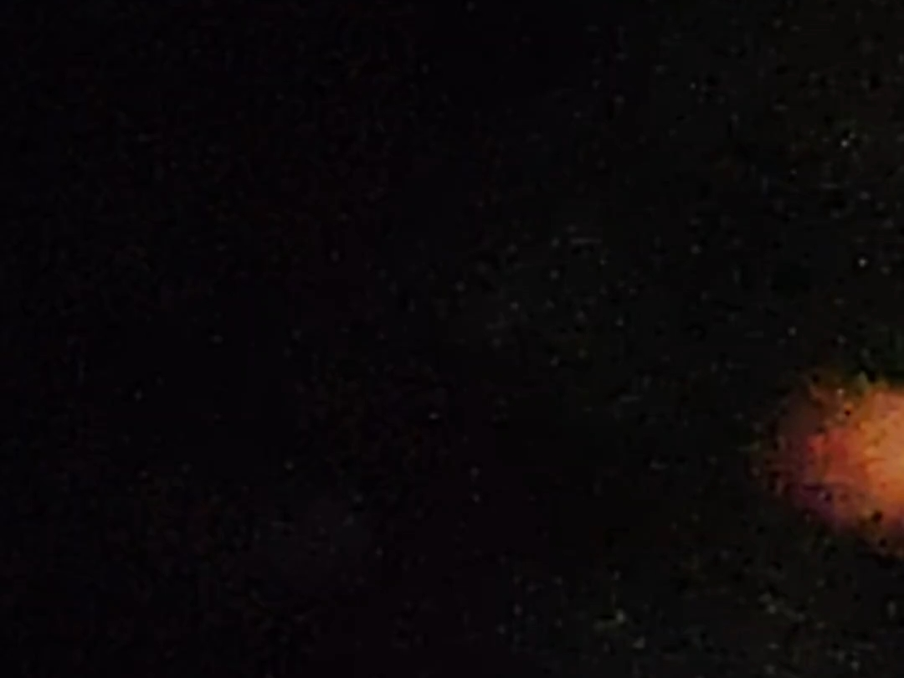 | 1 | 2026-02-16 |
| [【拜年祭单品】哈气的线：春节](https://www.bilibili.com/video/BV1JbZuBqEYx) |  | 946 | 2026-02-16 |
| [夜来哈（哈卡贝拉）【2026哈基米拜年基单品】](https://www.bilibili.com/video/BV1JxZuBzE8d) |  | 1540 | 2026-02-16 |
| [哈基米](https://www.bilibili.com/video/BV1ntZuBMEUn) |  | 13 | 2026-02-16 |
| [【哈基米拜年基II 0 II V】destr0yer哈基米](https://www.bilibili.com/video/BV1TVZuBUE3m) |  | 437 | 2026-02-16 |
| [猫](https://www.bilibili.com/video/BV1hmZuBsEFe) | 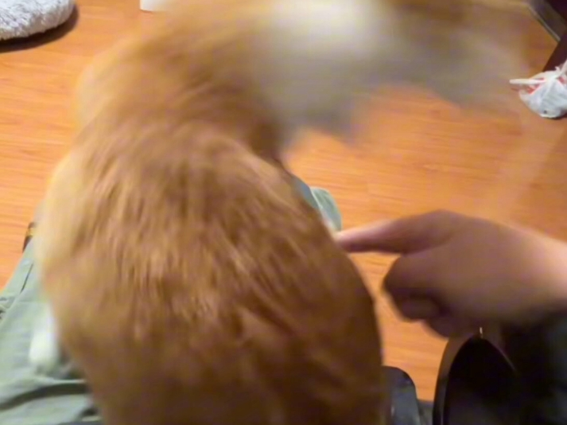 | 186 | 2026-02-16 |
| [【2026哈基米拜年基单品】繁华哈遍](https://www.bilibili.com/video/BV1GjZ4BzEEY) |  | 368 | 2026-02-16 |
| [【2026哈基米拜年祭单品】蓝色狂哈曲](https://www.bilibili.com/video/BV1K9ZuBnE91) |  | 539 | 2026-02-16 |
| [【哈基米拜年基单品】紫色基情 Purple Hassion](https://www.bilibili.com/video/BV1p7ZTBTETF) |  | 1062 | 2026-02-16 |
| [🐱打 上 哈 火🐱](https://www.bilibili.com/video/BV1vHcMzPE5A) |  | 2.0万 | 2026-02-16 |
| [【2026哈基米拜年基】叮咚每一天，健康过马年](https://www.bilibili.com/video/BV1MsZ4BPEUJ) |  | 7.4万 | 2026-02-16 |
| [【哈基米】长征-罗大佑](https://www.bilibili.com/video/BV1eoZKBDEGM) |  | 1232 | 2026-02-16 |
| [⚡拆 蛋 专 家⚡](https://www.bilibili.com/video/BV1zyZKBfEXZ) |  | 4.8万 | 2026-02-16 |
| [谁哈死了 基米.南北绿豆？](https://www.bilibili.com/video/BV1ZmZKBoELn) |  | 296 | 2026-02-16 |
| [【自用/哈基米助眠站】轻语口腔音五十分钟纯享](https://www.bilibili.com/video/BV1WEZTBiEnZ) |  | 853 | 2026-02-16 |
| [哈基米—春节哈曲](https://www.bilibili.com/video/BV1E4ZTBcEJf) |  | 193 | 2026-02-16 |
| [⚡️溜冰的小曲⚡️基米说⚡️](https://www.bilibili.com/video/BV1RLZMB4EBi) |  | 1.3万 | 2026-02-16 |
| [哈基米纯享 8D环绕沉浸式听歌](https://www.bilibili.com/video/BV1nsZTBaEbc) | 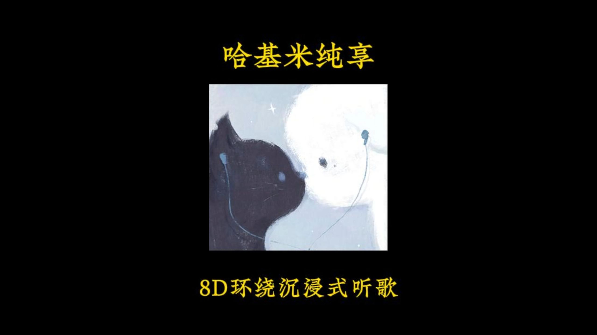 | 596 | 2026-02-16 |
| [【拜年基作品】拿去吧！数据线（《幸运基》主题曲）](https://www.bilibili.com/video/BV1uCZNBrEAo) |  | 2566 | 2026-02-16 |
| [⚡哈基米の花田，太豪听了！⚡](https://www.bilibili.com/video/BV1eBZTBXE8S) | 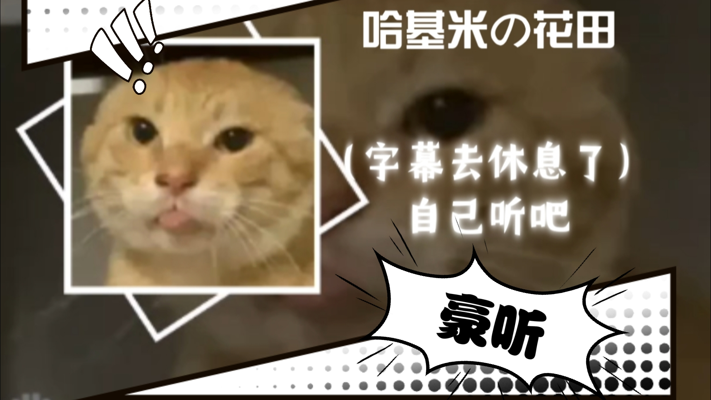 | 335 | 2026-02-16 |
| [哈基米：😺假面骑士圣刃OP ｜ “耄耋的结局 由我来哈气！”😺](https://www.bilibili.com/video/BV1wwZMBTEEC) |  | 1657 | 2026-02-16 |
| [【春节基米】谁敢在家放？！](https://www.bilibili.com/video/BV1MCZNBrEYF) |  | 6.9万 | 2026-02-16 |
| [基米到](https://www.bilibili.com/video/BV13zZNB5Egy) |  | 435 | 2026-02-16 |
| [空城/五分钟哈基米纯享版](https://www.bilibili.com/video/BV1TUZNBMEtH) |  | 371 | 2026-02-16 |
| [哈基米《打火基》](https://www.bilibili.com/video/BV1B4ZNBpEKB) | 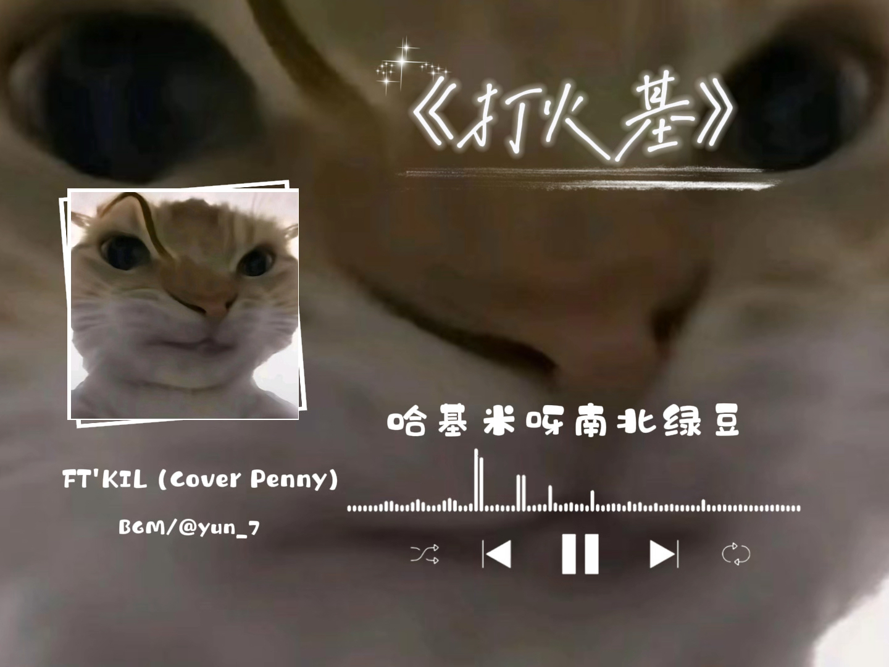 | 175 | 2026-02-16 |
| [⚡恭 喜 哈 气⚡哈基米春晚](https://www.bilibili.com/video/BV1VeZNBmEE2) |  | 1128 | 2026-02-16 |
| [巨型哈基米](https://www.bilibili.com/video/BV1G5ZKBnESJ) |  | 4 | 2026-02-16 |
| [【哈基米音乐】三重审判](https://www.bilibili.com/video/BV14bZ7BzEGA) |  | 1.3万 | 2026-02-16 |
| [【纯净哈基米】一生有你](https://www.bilibili.com/video/BV1kYZPBbEB9) |  | 148 | 2026-02-16 |
| [泪目了😭哈基鸡太棒了！【哈基动物园】](https://www.bilibili.com/video/BV1oNZPBmEqi) |  | 3471 | 2026-02-16 |
| [曼波VS哈基米！](https://www.bilibili.com/video/BV18RZwBiErG) |  | 586 | 2026-02-15 |
| [没见过这么逆天的视频了](https://www.bilibili.com/video/BV1xxZ4BYE17) |  | 7.0万 | 2026-02-15 |
| [哈基米《哈喜发财》永劫无间](https://www.bilibili.com/video/BV1RyZsBrEaY) | 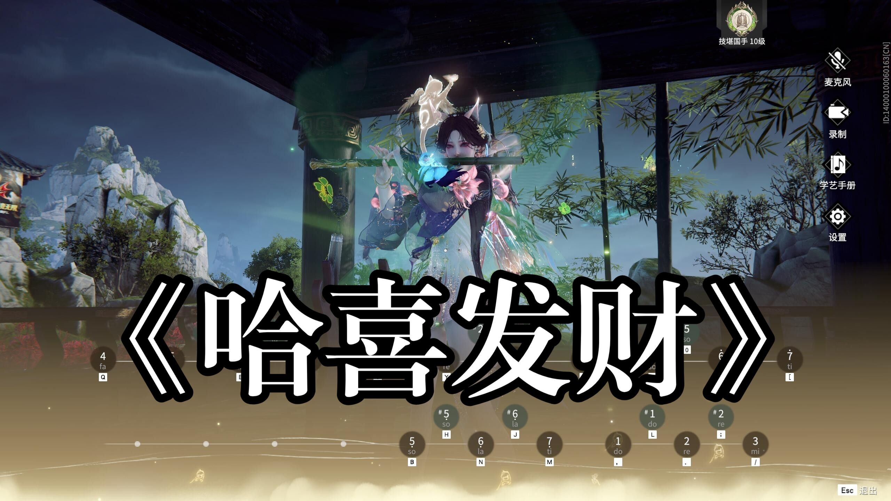 | 378 | 2026-02-15 |
| [本喵控制不住了喵!变成哈基米喵!](https://www.bilibili.com/video/BV1eSZsBuEqi) |  | 6398 | 2026-02-15 |
| [科比过年回家探亲](https://www.bilibili.com/video/BV1viZEB9EDo) |  | 4.4万 | 2026-02-15 |
| [One last kiss再见了所有的哈基米](https://www.bilibili.com/video/BV1YbZxBrEYL) |  | 1.9万 | 2026-02-15 |
| [🐎马 年 春 晚🐎](https://www.bilibili.com/video/BV1hqZxBKEgZ) |  | 7.9万 | 2026-02-15 |
| [【吉星派对】彩虹猫Nayha cat（哈基米音乐）](https://www.bilibili.com/video/BV1YVZ4BrEax) |  | 1347 | 2026-02-15 |
| [⚡⚡雷欧哈基米⚡⚡](https://www.bilibili.com/video/BV1inZWBuERU) |  | 775 | 2026-02-15 |
| [哈基米EX 音MAD SET@哈基米拜年基2026 预告](https://www.bilibili.com/video/BV1gYZWBwEZP) |  | 4784 | 2026-02-15 |
| [叮咚鸡的冬天Suanhe](https://www.bilibili.com/video/BV1tJZsBfEMM) |  | 588 | 2026-02-15 |
| [守望先锋电影《壮志凌喵-哈基米空域》预告片](https://www.bilibili.com/video/BV19pZHBFEsS) |  | 1.6万 | 2026-02-14 |
| [【哈基米】黑凤梨 - 洛天依](https://www.bilibili.com/video/BV11aZ7BqEux) |  | 1500 | 2026-02-14 |
| [喵师傅过去一年的“名场面”！](https://www.bilibili.com/video/BV1JyZ7BbE83) | 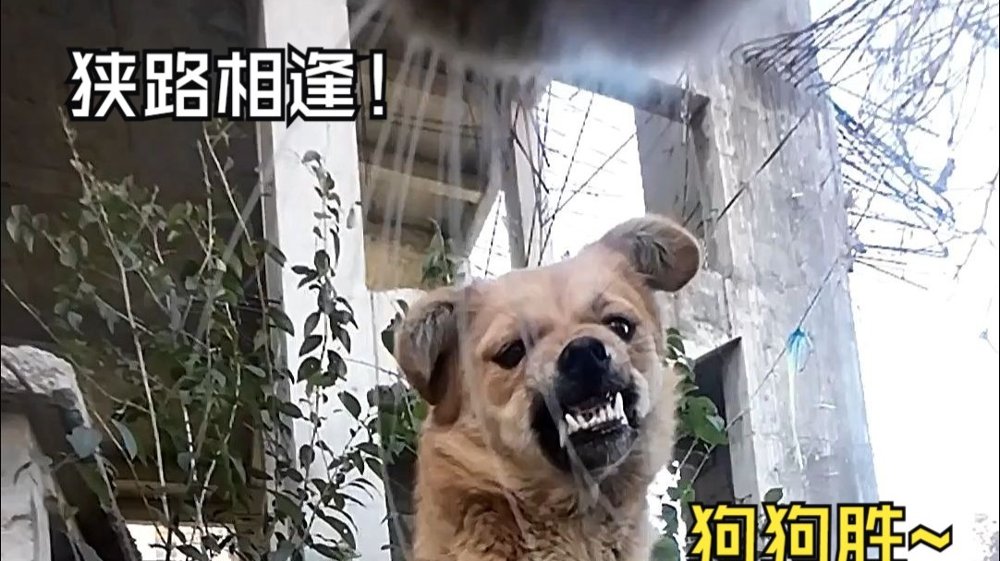 | 250.9万 | 2026-02-14 |
| [我失而宠之了！！！](https://www.bilibili.com/video/BV1Wcc7zzEYG) | 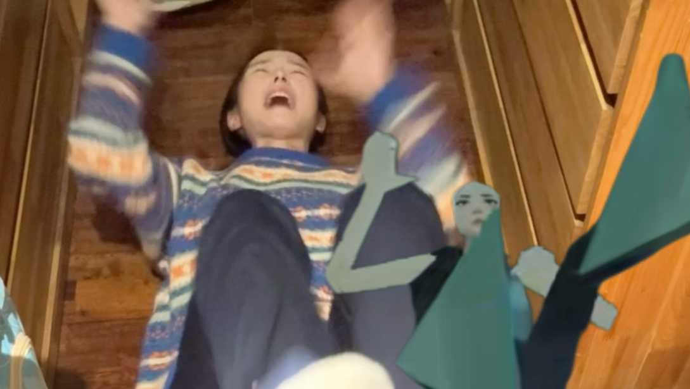 | 91.2万 | 2026-02-14 |
| [东方哈基米：背阴处，基米与曼波](https://www.bilibili.com/video/BV1KfcEzSEKG) |  | 2448 | 2026-02-14 |
| [哈基米南北绿豆](https://www.bilibili.com/video/BV1gLcpzvESa) | 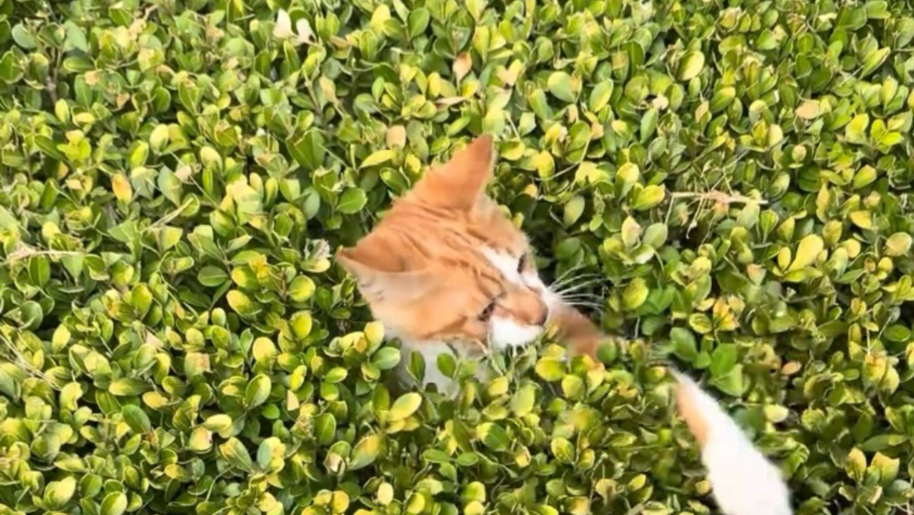 | 277 | 2026-02-13 |
| [《精卫》“《精卫》但曼波哈基米”（无损音质）](https://www.bilibili.com/video/BV1NTcvzbEEz) |  | 4100 | 2026-02-13 |
| [哈得太逼真](https://www.bilibili.com/video/BV1Ljc7zbEjw) | 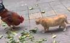 | 234 | 2026-02-13 |
| [路人：哪来的哈基米南北绿豆？](https://www.bilibili.com/video/BV1PDcczwEb6) |  | 3.7万 | 2026-02-08 |
| [神圣曼波波波——哈基米起床交响乐版本](https://www.bilibili.com/video/BV1NXFbz6E76) |  | 645 | 2026-02-08 |
| [【完整版】圆哈镇没有活着的传奇 I Really Want to Stay at Your House](https://www.bilibili.com/video/BV1xbFtzTEYN) |  | 14.1万 | 2026-02-08 |
| [深夜在交大停车场唱蓝莲哈](https://www.bilibili.com/video/BV1jxfRBcE3h) |  | 133 | 2026-02-04 |
| [循环歌单｜《人类联邦の小曲》青衣DJ](https://www.bilibili.com/video/BV1RNF5zLEzZ) |  | 134.2万 | 2026-02-03 |
| [太阳神Rap X JET SET！](https://www.bilibili.com/video/BV1LHzSBfEFi) |  | 60.4万 | 2026-01-25 |
| [【中俄字幕】低音炮丹尼尔原版MV ｜《Симпа (Simpa)》by RaiM, Artur &amp; Adil](https://www.bilibili.com/video/BV1axrEBkENG) |  | 300.5万 | 2026-01-13 |
| [【哈基米音乐】熊出没之我的基米（我的甜蜜）](https://www.bilibili.com/video/BV1KyCyBVEVh) | 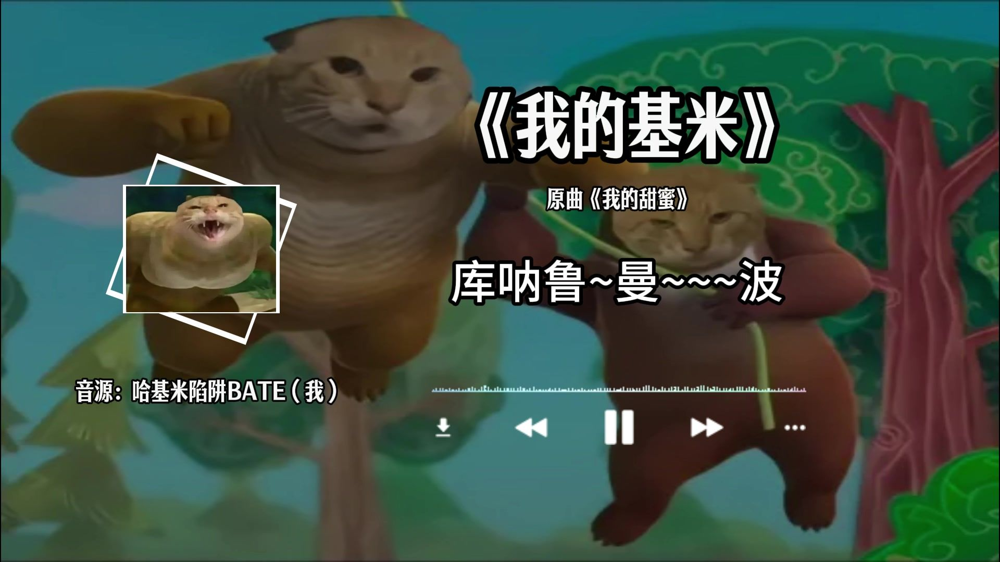 | 1.2万 | 2025-11-15 |
| [循环歌单｜【伯虎说】｜&quot;【保安の小曲】没有天赋 那就反复&quot;](https://www.bilibili.com/video/BV1gNe3zEEMn) |  | 1131.3万 | 2025-08-21 |
| [【补档】2025哈基米拜年基：哈哈气气过大年](https://www.bilibili.com/video/BV1sYtqzYEA7) |  | 15.3万 | 2025-08-07 |
| [哈基米山歌](https://www.bilibili.com/video/BV11wt3zZEri) |  | 23.4万 | 2025-08-04 |
| [【纯净哈基米】我撕裂我的基米](https://www.bilibili.com/video/BV14WgWznEPP) |  | 12.2万 | 2025-07-22 |
| [【欢乐斗地主】《欢乐哈基米》语音包上线啦~](https://www.bilibili.com/video/BV1Mfu4zcEHr) |  | 74.4万 | 2025-07-16 |
| [【哈基米】曼波吟游之地](https://www.bilibili.com/video/BV1qCukzxEo3) |  | 14.7万 | 2025-07-15 |
| [【甜美女声翻唱】⚡真正想哈的基米脸上是没有笑容的⚡](https://www.bilibili.com/video/BV1vXNQziEtk) |  | 34.9万 | 2025-06-22 |
| [孤独的哈基米](https://www.bilibili.com/video/BV1jDNbzzEbt) |  | 52.7万 | 2025-06-16 |
| [跳 楼 基（哈基米音乐）](https://www.bilibili.com/video/BV1CkLJzJEMR) |  | 31.9万 | 2025-04-25 |
| [蠢基米](https://www.bilibili.com/video/BV1KZz7YvEAZ) |  | 14.2万 | 2024-11-30 |
| [事已至此，先跳个舞吧](https://www.bilibili.com/video/BV12CC1YpE6x) |  | 129.0万 | 2024-10-18 |
| [燃烧我的哈基米之卡基米（卡路里）](https://www.bilibili.com/video/BV1DA4YePEeu) | 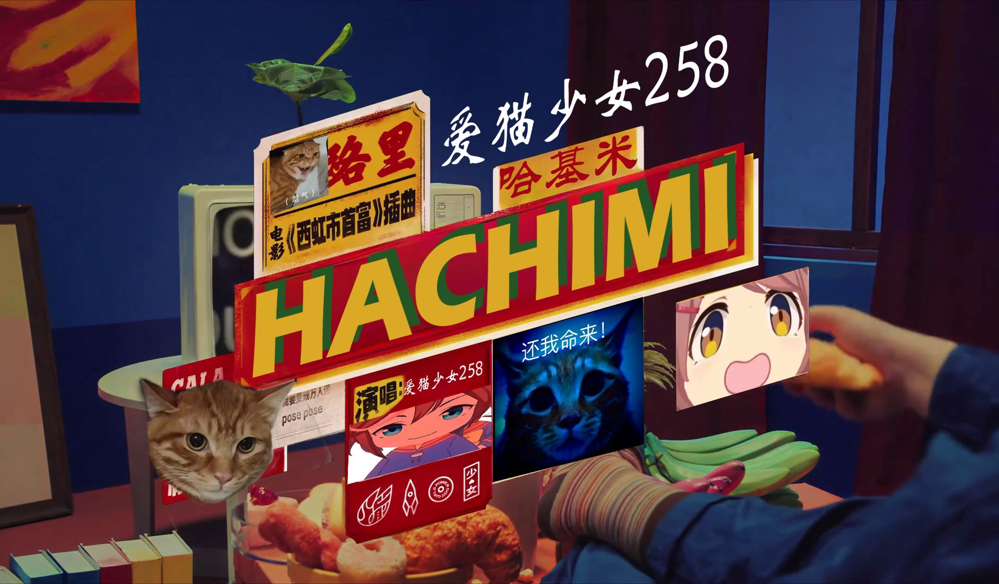 | 40.0万 | 2024-09-10 |

---
*最后更新: 2026-02-17 03:10:31 (自动生成)*
*数据来源: [Bilibili](https://www.bilibili.com)*

## 使用说明

运行以下命令更新视频列表:
```bash
python3 fetch_hajimi_videos.py
```
