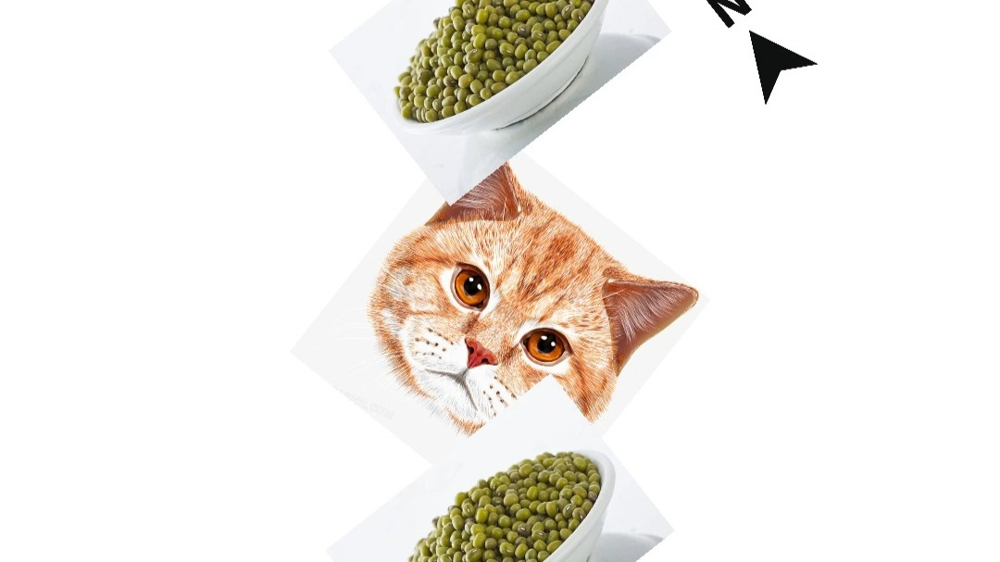
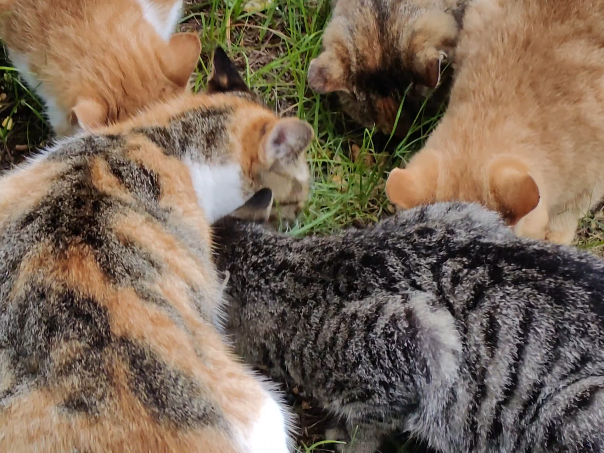
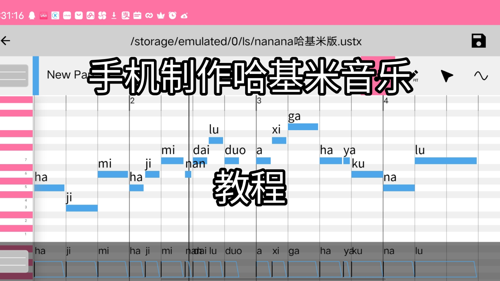
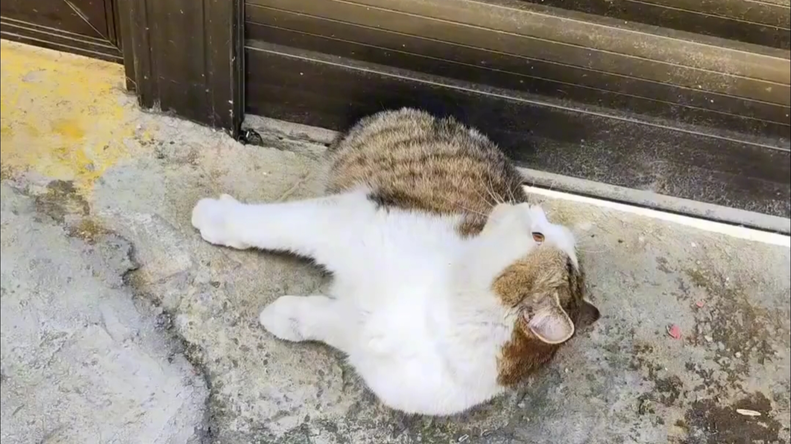
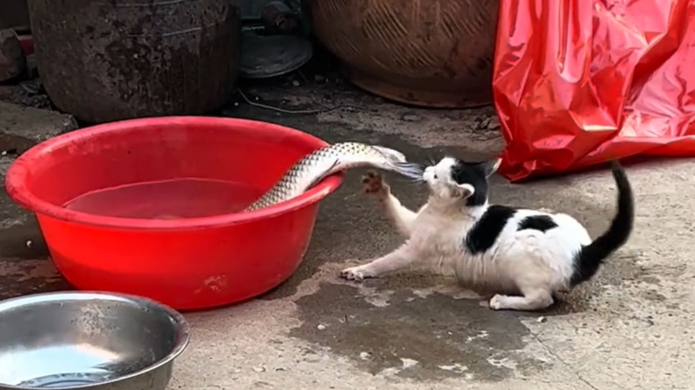
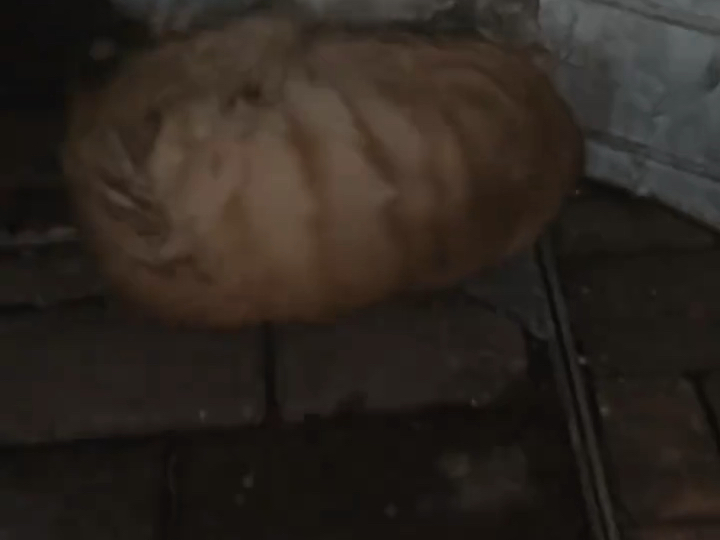

# awesome-hajimi
collections of hajimi (哈基米 in Chinese) on the Internet.

## 视频列表 (Video List)

| 视频标题 (Title) | 封面 | 播放量 (Views) | 发布日期 (Date) |
|---|---|---|---|
| [哈基米：哈你（重制版）](https://www.bilibili.com/video/BV1ZR1RBAEps) |  | 220 | 2025-11-09 |
| [哈基米哟~！南北绿豆~！](https://www.bilibili.com/video/BV1B71oBTEPW) |  | 10 | 2025-11-09 |
| [哈基米 哈基米](https://www.bilibili.com/video/BV1vW1oBAEmR) |  | 8 | 2025-11-09 |
| [「哈基米唱片」视奸モニタリング](https://www.bilibili.com/video/BV1yt1ZBEEWT) |  | 148 | 2025-11-08 |
| [【纯净哈基米】最后一咚](https://www.bilibili.com/video/BV1w11XBaETC) |  | 1975 | 2025-11-08 |
| [哈基米   提神醒脑之歌](https://www.bilibili.com/video/BV1m319BCEPw) |  | 19 | 2025-11-08 |
| [【哈基米音乐】哈的魔法](https://www.bilibili.com/video/BV1Xw19BSEtF) |  | 124 | 2025-11-08 |
| [【翻唱/打火机/哈基米版】你的打火机～](https://www.bilibili.com/video/BV1Y619B9ESA) |  | 155 | 2025-11-08 |
| [歌曲《不再曼波》“哈基米呀，南北绿豆”](https://www.bilibili.com/video/BV18y1QBVEuj) |  | 162 | 2025-11-08 |
| [【哈基米音乐】成为魔法基米吧！（Sis Puella Magica!）](https://www.bilibili.com/video/BV1HH1QBFEA8) |  | 1.2万 | 2025-11-08 |
| [【哈基米音乐/完整版】咚鸡不太热（东京不太热）](https://www.bilibili.com/video/BV1aq1SB3ENU) |  | 6725 | 2025-11-08 |
| [教你如何用OpenUtauMoble在手机上制作哈基米音乐](https://www.bilibili.com/video/BV1jD1DBnEaE) |  | 1111 | 2025-11-08 |
| [哈基米和叮咚鸡也是一对苦命鸳鸯](https://www.bilibili.com/video/BV1H91mBDEiN) |  | 1.5万 | 2025-11-08 |
| [哈 在 基 米 前【纯净哈基米】](https://www.bilibili.com/video/BV17711BBEtv) |  | 2512 | 2025-11-08 |
| [《神曼波》正式动画PV](https://www.bilibili.com/video/BV1tz1mBcEhz) |  | 6.4万 | 2025-11-07 |
| [天地不仁，以万物为刍狗，哈基米淹死了](https://www.bilibili.com/video/BV1Jd11BrEN6) |  | 2.1万 | 2025-11-07 |
| [基米小学：立冬小猫们一起吃饺子](https://www.bilibili.com/video/BV1wZ2gB7Egr) |  | 10.2万 | 2025-11-07 |
| [中国人：哈基米南北绿豆！日本人：整沉默了...](https://www.bilibili.com/video/BV1dJ2MBYENF) |  | 1799 | 2025-11-07 |
| [没有比这更逆天的鬼畜了](https://www.bilibili.com/video/BV1rm2KBqELR) |  | 39.7万 | 2025-11-07 |
| [妈妈酱唱纯净哈基米](https://www.bilibili.com/video/BV1sY2wBaEra) |  | 118 | 2025-11-06 |
| [哈基米精选搞笑视频（小基米请在大基米陪伴下观看）](https://www.bilibili.com/video/BV1Hn2ABbEFq) |  | 4249 | 2025-11-06 |
| [哈基米《云宫迅音》西游基](https://www.bilibili.com/video/BV12P2cBaEoL) |  | 2.3万 | 2025-11-06 |
| [《并不喜欢吃鱼》](https://www.bilibili.com/video/BV1wZ14BtEga) |  | 32.3万 | 2025-11-06 |
| [哈基米南北绿豆 阿西嘎牙库那路](https://www.bilibili.com/video/BV1he1sBKEUf) |  | 2639 | 2025-11-05 |
| [可爱的街舞哈基米完整版](https://www.bilibili.com/video/BV17D1EBcEPp) |  | 2.0万 | 2025-11-04 |
| [“2025年全网爆火的歌曲”](https://www.bilibili.com/video/BV1KryDBYEPx) |  | 24.3万 | 2025-11-02 |
| [海外正在发生一个有趣的现象，模仿中国人，变成了一件“酷”且”有趣”的事情！](https://www.bilibili.com/video/BV14A1LBiE6M) |  | 25.8万 | 2025-11-01 |

---
*最后更新: 2025-11-09 02:40:01 (自动生成)*
*数据来源: [Bilibili](https://www.bilibili.com)*

## 使用说明

运行以下命令更新视频列表:
```bash
python3 fetch_hajimi_videos.py
```
