# awesome-hajimi
collections of hajimi (哈基米 in Chinese) on the Internet.

## 视频列表 (Video List)

| 视频标题 (Title) | 封面 | 播放量 (Views) | 发布日期 (Date) |
|---|---|---|---|
| [⚡️ 哈  狙  米 ⚡️](https://www.bilibili.com/video/BV1FsScBfETP) | 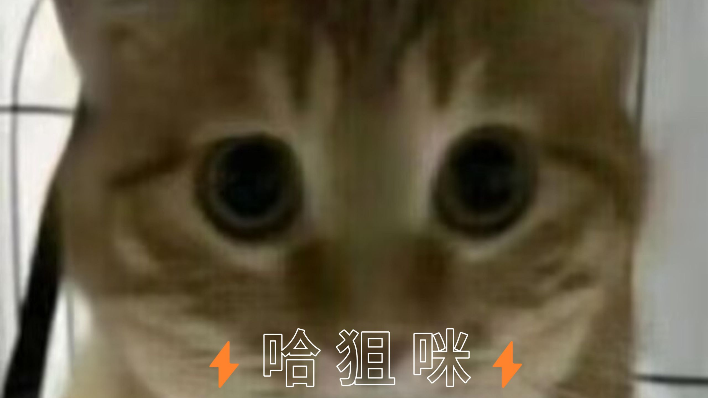 | 161 | 2025-11-29 |
| [【Hi-Res循环】循环音乐《又活了一天（哈基米版）》“哈基米儿那个萌”](https://www.bilibili.com/video/BV1QTUhBoEaH) |  | 806 | 2025-11-29 |
| [【哈基米】小猫舍不得去世的妈妈](https://www.bilibili.com/video/BV14bSFBTEYg) |  | 6831 | 2025-11-29 |
| [【哈基米神人音乐合集】“曼波的随波逐流，基米说！”](https://www.bilibili.com/video/BV1LQUZBCEys) |  | 658 | 2025-11-29 |
| [挑战只吃哈基米南北绿豆，全都是哈基米零食，这太搞笑了！](https://www.bilibili.com/video/BV1kVUoBUEEV) |  | 34.5万 | 2025-11-29 |
| [哈基米你是怎么了](https://www.bilibili.com/video/BV1PuUoBWEG5) | 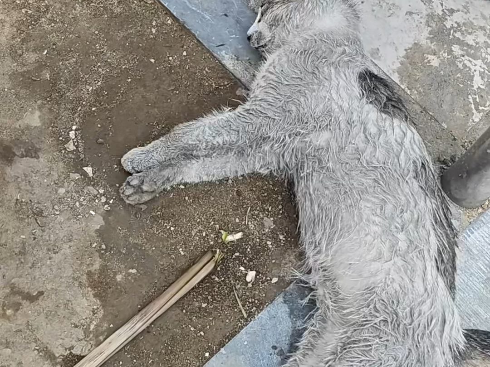 | 5747 | 2025-11-29 |
| [基米小镇：躲猫猫](https://www.bilibili.com/video/BV1KKUoBxECM) | 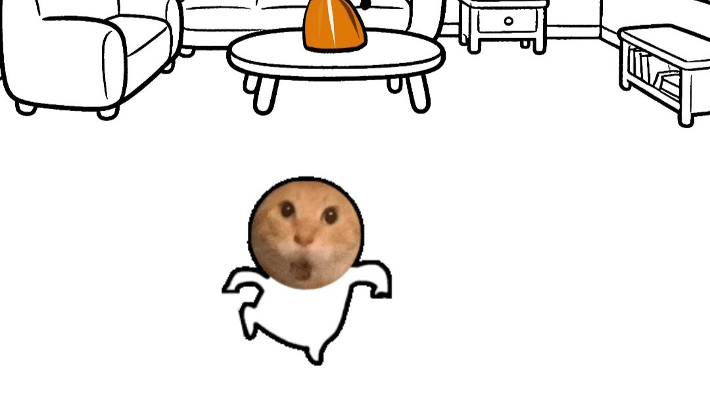 | 2649 | 2025-11-29 |
| [疑似耋耋复活](https://www.bilibili.com/video/BV1AMURBjEgk) | 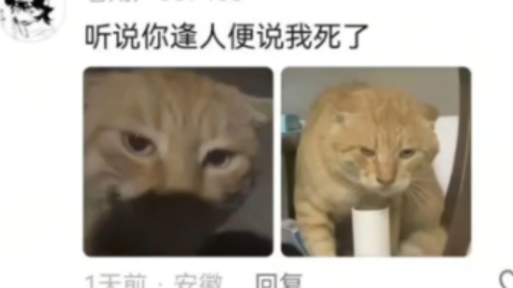 | 5.7万 | 2025-11-28 |
| [冰雪节限定耄耋惨遭削弱](https://www.bilibili.com/video/BV1coSJBSEze) | 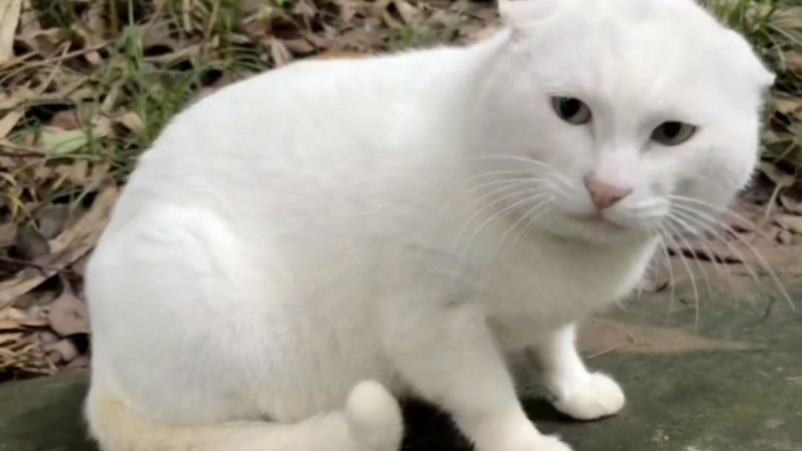 | 2.1万 | 2025-11-28 |
| [哈基米之歌](https://www.bilibili.com/video/BV1zzSEBGEfL) |  | 245 | 2025-11-28 |
| [老基米永远地睡着了](https://www.bilibili.com/video/BV12sSEBQENt) | 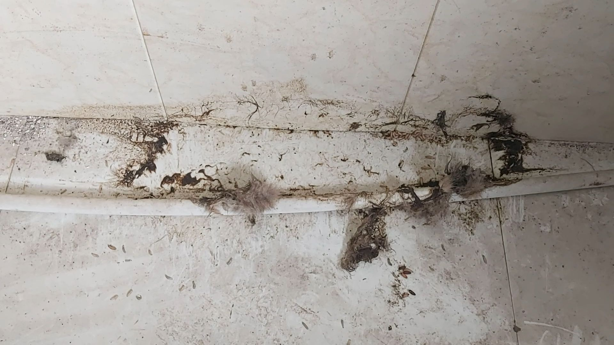 | 4928 | 2025-11-28 |
| [【哈基米神人音乐合集】“哈基米召唤曲，哈基米之魂，GBC的小曲”](https://www.bilibili.com/video/BV1DfSEBbEhs) |  | 1190 | 2025-11-28 |
| [天 气 之 哈](https://www.bilibili.com/video/BV1RUSTBiEh7) |  | 3147 | 2025-11-28 |
| [哈基米惨遭禁赛！第一届猫狗歌曲 争霸赛 ｜ 猫党 VS 狗党](https://www.bilibili.com/video/BV1mjSjBJEZZ) |  | 3193 | 2025-11-28 |
| [哈基米钻到车子里死活不出去，哈基人用力拽它，它也不出去](https://www.bilibili.com/video/BV1QVSjBpEtd) | 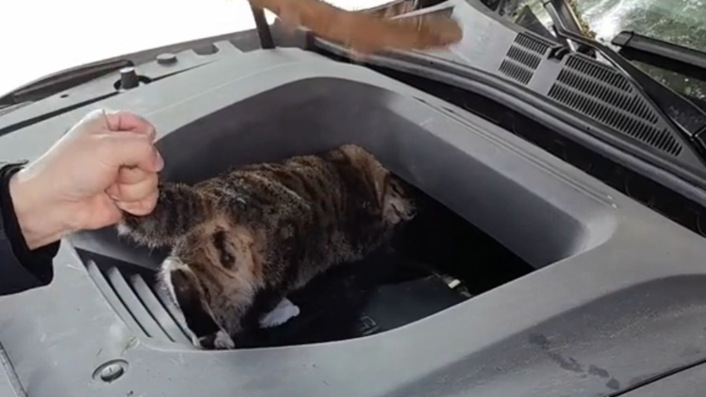 | 1.5万 | 2025-11-28 |
| [当乐手被歌手反杀](https://www.bilibili.com/video/BV1FiSjBqEdo) |  | 10.6万 | 2025-11-28 |
| [家里来了一位不速之客...](https://www.bilibili.com/video/BV1BvS5BbE8u) | 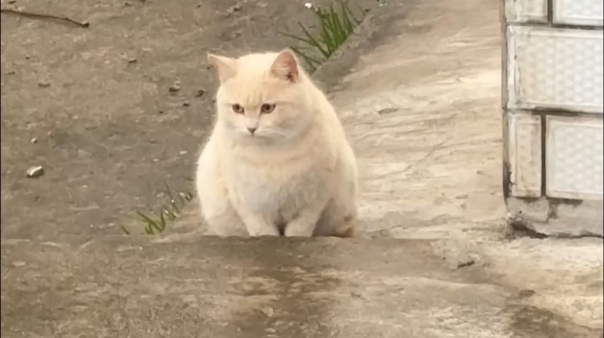 | 20.1万 | 2025-11-28 |
| [哈基米小曲 猛攻必听！](https://www.bilibili.com/video/BV16jS7BuELA) | 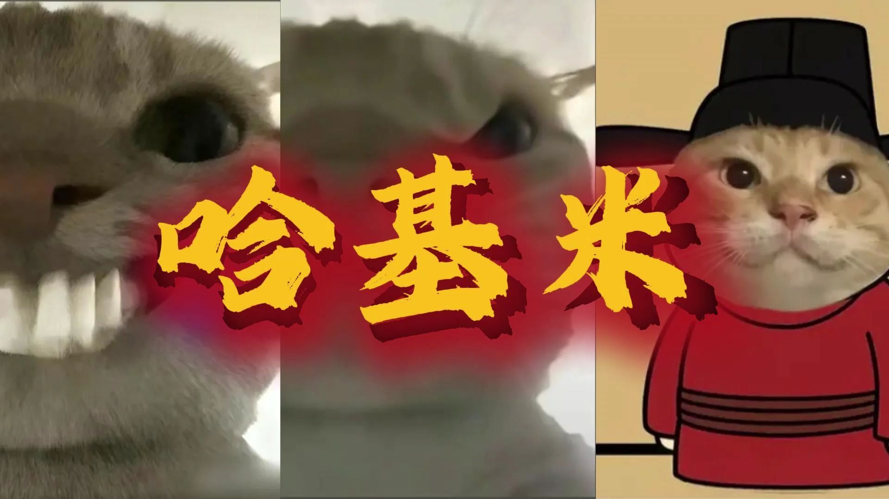 | 453 | 2025-11-28 |
| [哈基米被蛇咬了，后疯狂嚼口香糖幸好毒性不大没事](https://www.bilibili.com/video/BV1hQS5BmEFB) |  | 4338 | 2025-11-28 |
| [[基米文件]我是一个糗（完整版）](https://www.bilibili.com/video/BV1VfS3BjENd) | 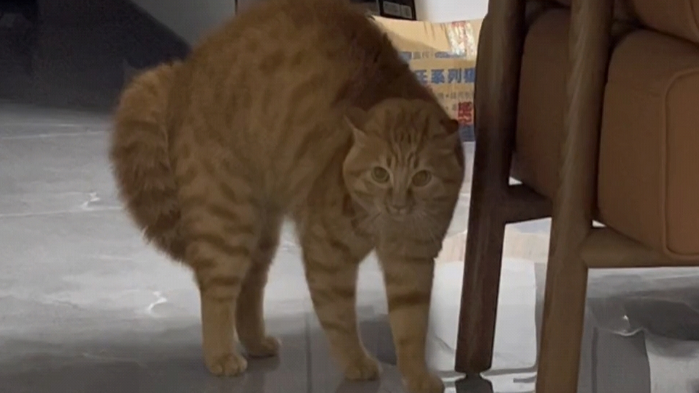 | 5111 | 2025-11-27 |
| [不会玩六尾哈基米？来来来，我教你。让你成为耄耋王，想哈谁就哈谁！](https://www.bilibili.com/video/BV1ALSgBoEGi) | 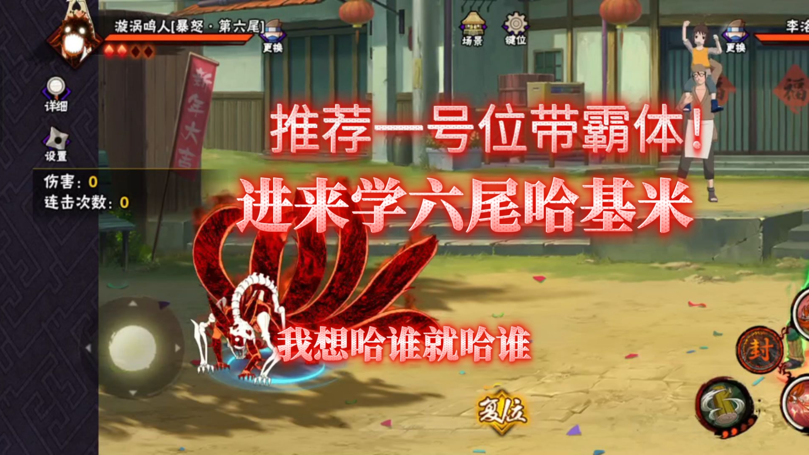 | 1509 | 2025-11-27 |
| [哈基米的凌晨叫床服务](https://www.bilibili.com/video/BV1TNSMBdEyo) | 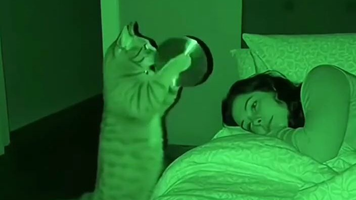 | 1.2万 | 2025-11-27 |
| [挡住小猫咪的阳光](https://www.bilibili.com/video/BV1HFUzBiEZT) | 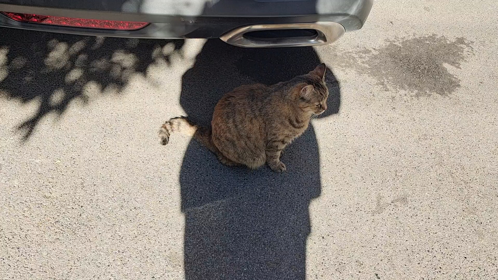 | 14.2万 | 2025-11-27 |
| [哈基米被眼镜蛇咬了](https://www.bilibili.com/video/BV1ctU6BTE2q) | 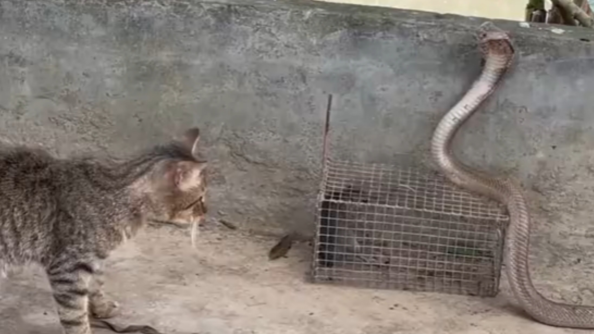 | 7572 | 2025-11-27 |
| [从没见过这么凶的小基米！](https://www.bilibili.com/video/BV1PYUvBtE5n) |  | 2026 | 2025-11-26 |
| [我说白了我最讨厌猫](https://www.bilibili.com/video/BV1GkUSBmEJc) | 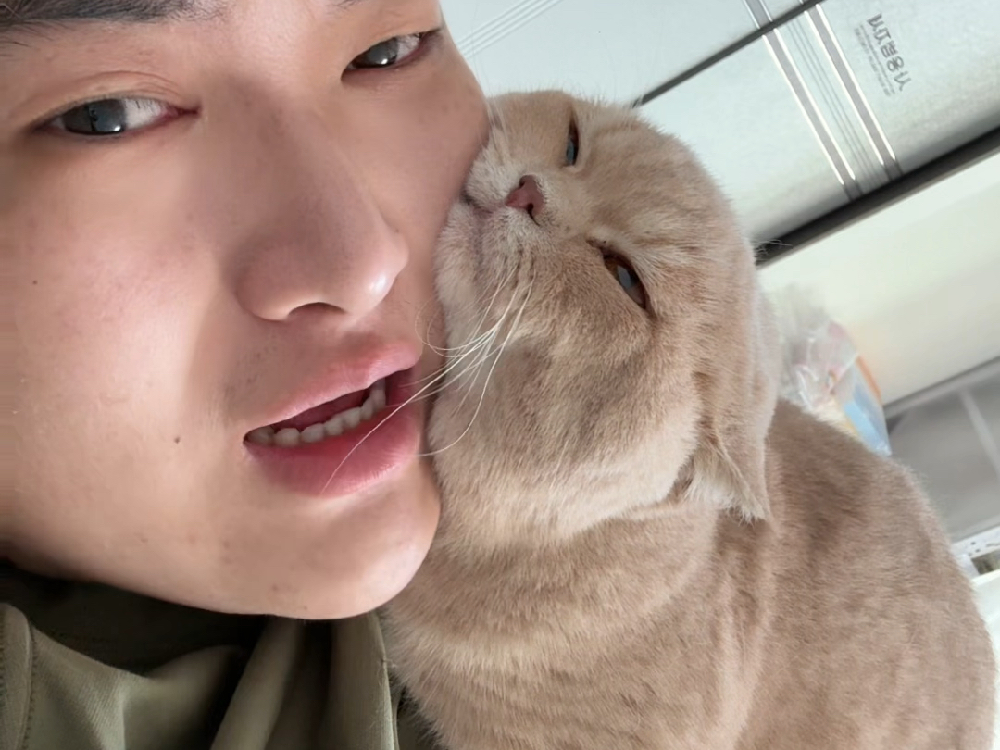 | 23.1万 | 2025-11-25 |
| [小猫只是太害怕了](https://www.bilibili.com/video/BV1oTUUBQEb6) | 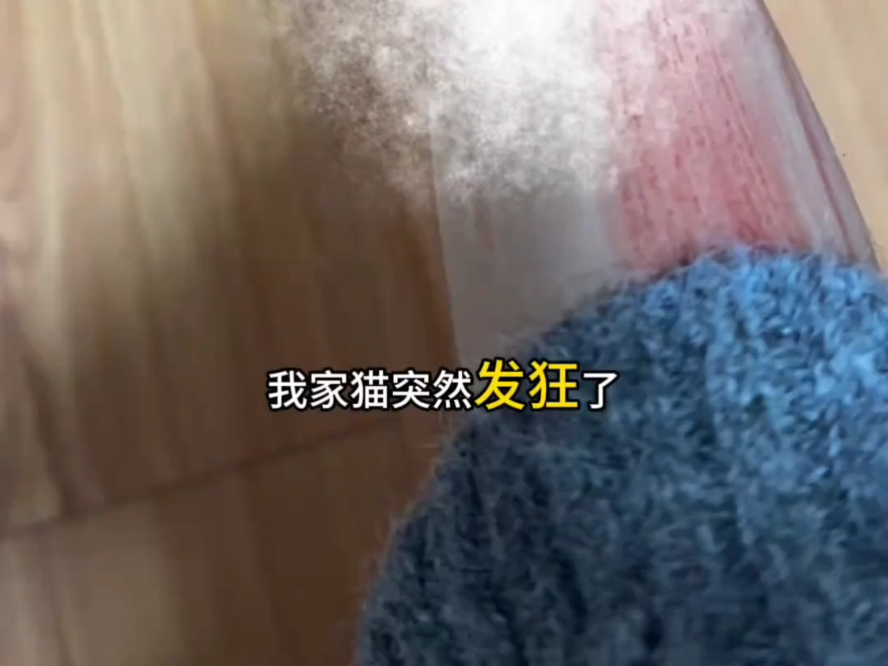 | 8.9万 | 2025-11-25 |
| [【猫猫歌单】周杰伦听了也哈气！精选十首“哈基伦”音乐，每一首都是不一样的感觉](https://www.bilibili.com/video/BV1qVUTBqEkG) | 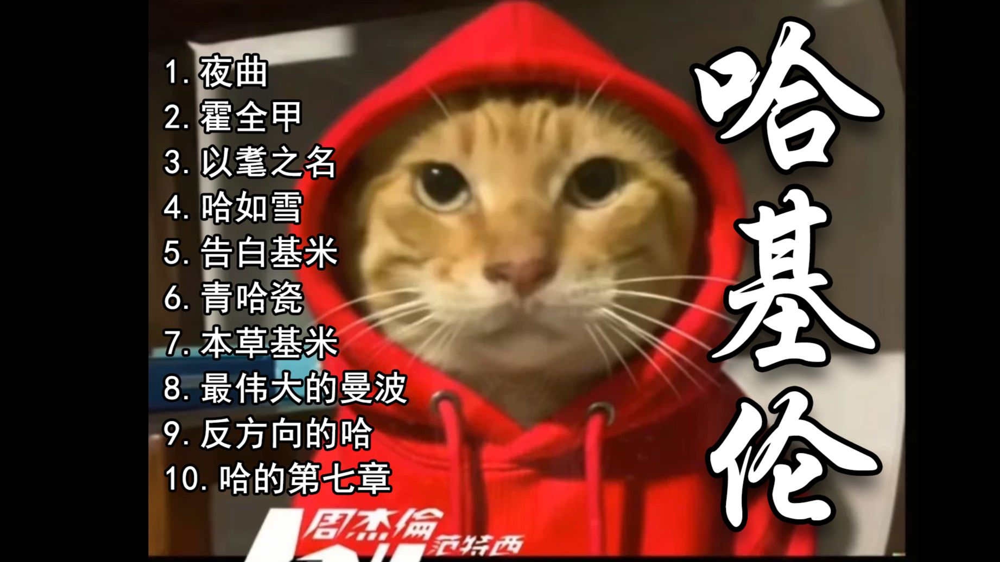 | 9721 | 2025-11-23 |
| [按理来说，你这个级别的哈基米还无权哈我](https://www.bilibili.com/video/BV1nVUpBXEZT) |  | 4708 | 2025-11-22 |

---
*最后更新: 2025-11-30 02:46:43 (自动生成)*
*数据来源: [Bilibili](https://www.bilibili.com)*

## 使用说明

运行以下命令更新视频列表:
```bash
python3 fetch_hajimi_videos.py
```
