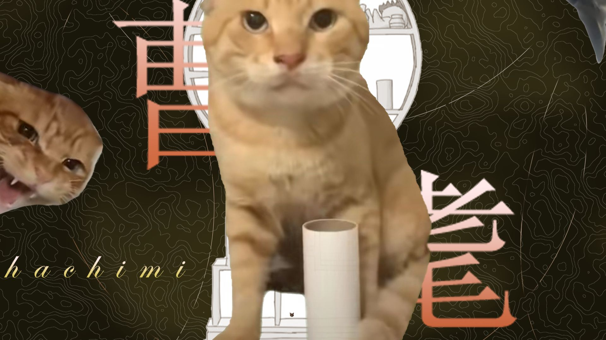
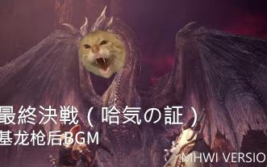
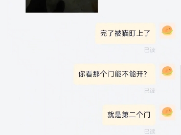
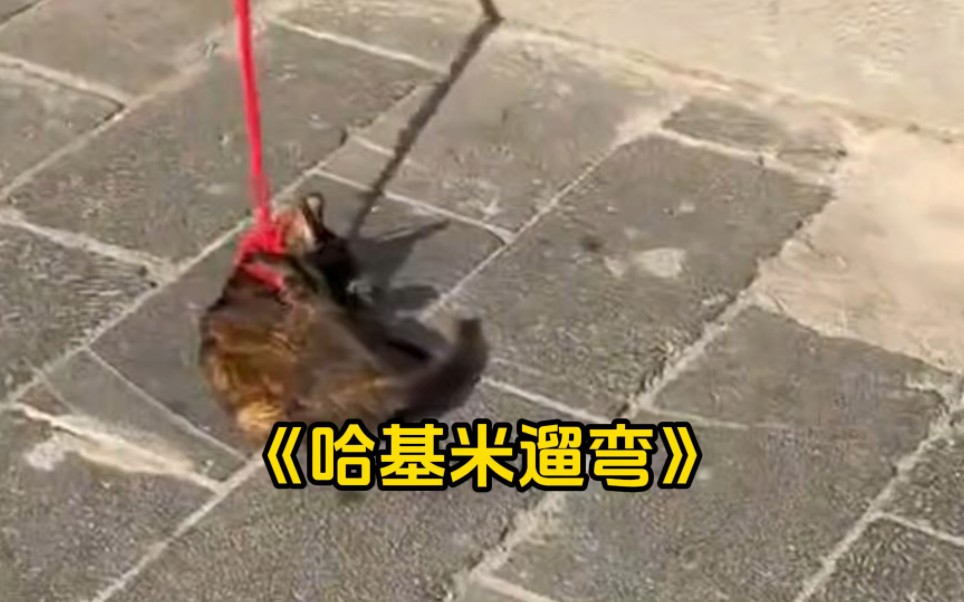

# awesome-hajimi
collections of hajimi (哈基米 in Chinese) on the Internet.

## 视频列表 (Video List)

| 视频标题 (Title) | 封面 | 播放量 (Views) | 发布日期 (Date) |
|---|---|---|---|
| [【投稿解说】震惊居然让主播大吃三斤！英军 一哈一基米 vs 西德 5 通车](https://www.bilibili.com/video/BV1kW2zBAERp) |  | 27 | 2025-12-08 |
| [离开我的基米——哈基米南北绿豆！](https://www.bilibili.com/video/BV1wu26BaE1U) |  | 101 | 2025-12-07 |
| [看看哈基米](https://www.bilibili.com/video/BV1HTmABwEDh) |  | 9 | 2025-12-07 |
| [哈基米哈基米哈基米](https://www.bilibili.com/video/BV1P1mABKEwi) |  | 166 | 2025-12-07 |
| [【电⚡曼】活基米 - pets](https://www.bilibili.com/video/BV14zmABgEaV) |  | 64 | 2025-12-07 |
| [“   基咪之神 登场！  ”](https://www.bilibili.com/video/BV1hemABCEJd) |  | 5.1万 | 2025-12-07 |
| [今日份哈基米](https://www.bilibili.com/video/BV1fSmcB9E2J) |  | 133 | 2025-12-07 |
| [【危】满级社恐哈基米的躁动](https://www.bilibili.com/video/BV19FmFBuEya) |  | 3972 | 2025-12-07 |
| [大师级哈基米作画至今秒杀一片](https://www.bilibili.com/video/BV1AB2fBsEYp) |  | 1519 | 2025-12-07 |
| [基米小学：耄耄感冒了](https://www.bilibili.com/video/BV1AB2fBxERX) |  | 513 | 2025-12-07 |
| [🐱《想哈你想哈你想哈你》🐱谨以此视频纪念哈基米最高的山！](https://www.bilibili.com/video/BV1pr2fBpEtY) |  | 883 | 2025-12-07 |
| [【纯净版】哈基米：离开我的哈气DJ版丨&quot;我来不及道声曼波&quot;](https://www.bilibili.com/video/BV1vo2fBGEJn) |  | 605 | 2025-12-07 |
| [朱门哈忌米，路有定冻祭#2](https://www.bilibili.com/video/BV16xmFBHEEj) |  | 7174 | 2025-12-07 |
| [【哈基米山歌】特雷森学院是个好地方MV流出（保密级画质，比片难找）](https://www.bilibili.com/video/BV1vBmFBVETT) |  | 540 | 2025-12-07 |
| [要论思念这方面，您还是太权威了。#哈基米 #猫咪 #离谱](https://www.bilibili.com/video/BV1h1mFBBEXQ) |  | 4.3万 | 2025-12-07 |
| [我把皇室战争的一些卡牌音效改成了哈基米！（第二期）](https://www.bilibili.com/video/BV1LT2RBFENq) |  | 6.8万 | 2025-12-07 |
| [舌尖上的哈基米](https://www.bilibili.com/video/BV1dS2oBME8E) |  | 1074 | 2025-12-07 |
| [我这个级别的基米有权哈死任何尤里](https://www.bilibili.com/video/BV1o22oBgEX3) |  | 2.0万 | 2025-12-07 |
| [【爵士哈基米】in the mood (kards美国背景音乐）](https://www.bilibili.com/video/BV1nw2oB3Eym) |  | 7178 | 2025-12-07 |
| [哈基米：叮府乐](https://www.bilibili.com/video/BV1KN2dBnEdY) |  | 8612 | 2025-12-06 |
| [万有基米【Gravity】](https://www.bilibili.com/video/BV1P42XBBEGq) |  | 3871 | 2025-12-06 |
| [青春猪头主播不会遇到迷路哈基米](https://www.bilibili.com/video/BV1jz2XB8EfS) |  | 1118 | 2025-12-06 |
| [【哈基米音乐】曹耄（完整版）](https://www.bilibili.com/video/BV1Bs2WB7EDs) |  | 914 | 2025-12-06 |
| [疯了！哈基米南北绿豆…浆？这真能好喝？？](https://www.bilibili.com/video/BV1yv2sBbEun) |  | 24.5万 | 2025-12-06 |
| [捣 蛋 鬼 哈 基 咪](https://www.bilibili.com/video/BV1sB2sB4EMB) |  | 4040 | 2025-12-06 |
| [【哈基米音乐】传说中的耄耋BGM 基龙枪后_最終決戦（哈気の証）](https://www.bilibili.com/video/BV1ib2WBCEwn) |  | 3596 | 2025-12-06 |
| [原创AI短片《哈基米星球》：登陆喵星，猫屎咖啡的秘密](https://www.bilibili.com/video/BV1AB2sB4EKY) |  | 3880 | 2025-12-06 |
| [哈基米蹲汉堡复活点呢](https://www.bilibili.com/video/BV1aH2sBMENU) |  | 9.1万 | 2025-12-06 |
| [【哈基米音乐】大喜（🎵哈基米曼波波波🎵）](https://www.bilibili.com/video/BV1xk2JBEEiX) |  | 3.7万 | 2025-12-06 |
| [25年最难听的洗脑神曲，全听过的手机没白玩！](https://www.bilibili.com/video/BV1Fs25BxEvX) |  | 184.4万 | 2025-12-05 |
| [波 兰 牛 马 禁 毒 曲](https://www.bilibili.com/video/BV1W72qBbEB5) |  | 13.9万 | 2025-12-05 |
| [我的耄耋不可能这么可爱](https://www.bilibili.com/video/BV1zk2eByEHG) |  | 7.6万 | 2025-12-04 |
| [【全网最全】25年最难听的神曲，全听过的网瘾很大，太讷了！](https://www.bilibili.com/video/BV1Fp2vBEEVj) |  | 654.5万 | 2025-12-04 |
| [要论遛猫这方面，您还是太权威了。#哈基米 #猫咪 #离谱](https://www.bilibili.com/video/BV1CfSYBREpg) |  | 1.8万 | 2025-12-03 |
| [循环歌曲《海市蜃楼》《面麻の小曲》｜&quot;你总习惯若即若离煽情者的戏码，躲在面具后装聋作哑&quot;｜](https://www.bilibili.com/video/BV1dMSnB3E5q) |  | 56.0万 | 2025-11-29 |
| [“阿米嘎蒂朵~喵喵~小猫Funk.”｜《Montagem Miau》｜“小馋猫的小曲.”](https://www.bilibili.com/video/BV1cdS7BkEdi) |  | 9.6万 | 2025-11-29 |
| [朋友说再做这种神人视频就找人弄我....](https://www.bilibili.com/video/BV1NGSgBfEm1) |  | 218.3万 | 2025-11-27 |
| [艾尔莎看&quot;【三补】全网最细！《耄耋编年史》第三集&quot;](https://www.bilibili.com/video/BV1Etu1zPEoX) |  | 12.5万 | 2025-07-18 |
| [哈基米一样的雨](https://www.bilibili.com/video/BV1ivJaz7E7a) |  | 77.4万 | 2025-05-20 |

---
*最后更新: 2025-12-08 02:43:22 (自动生成)*
*数据来源: [Bilibili](https://www.bilibili.com)*

## 使用说明

运行以下命令更新视频列表:
```bash
python3 fetch_hajimi_videos.py
```
