# awesome-hajimi
collections of hajimi (哈基米 in Chinese) on the Internet.

## 视频列表 (Video List)

| 视频标题 (Title) | 封面 | 播放量 (Views) | 发布日期 (Date) |
|---|---|---|---|
| [【哈基米】and I&#x27;m 基米](https://www.bilibili.com/video/BV1pPpYzuEWg) |  | 2 | 2025-09-18 |
| [【哈基米音乐】基米地（凄美地）](https://www.bilibili.com/video/BV1d5phzXEFs) |  | 1153 | 2025-09-18 |
| [小小马儿！不知道我是哈基米领域大神吗？看我怎么驯服你😡又神直接给小马唱哈基米音乐尝试驯服，结果被一脚踢死🤣](https://www.bilibili.com/video/BV1SbphzVEpC) | 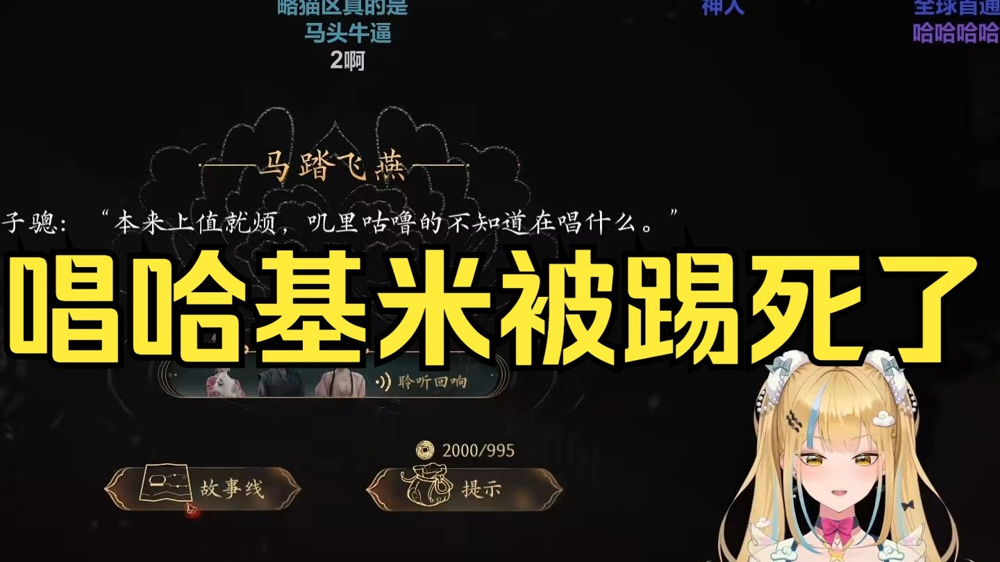 | 945 | 2025-09-18 |
| [【哈基米音乐】史低の小曲“看完默默打开steam”原曲：The magic key](https://www.bilibili.com/video/BV1snpazBE3c) |  | 653 | 2025-09-17 |
| [【哈基米音乐】铁匠铺神人亨利的打铁小曲](https://www.bilibili.com/video/BV1BUpbzQETf) | 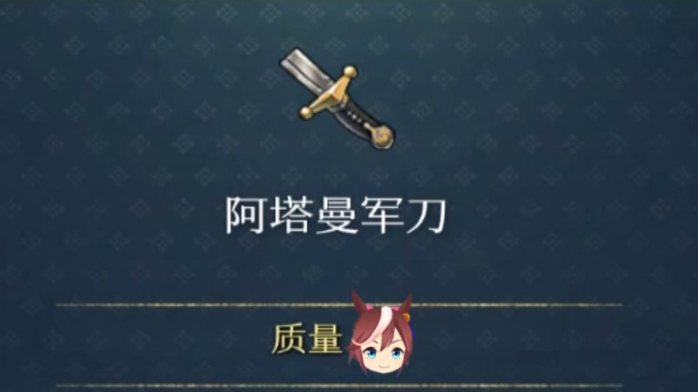 | 176 | 2025-09-17 |
| [《基米善哈》领养一只哈基米，让它给你飙音](https://www.bilibili.com/video/BV1crpbztEuo) |  | 175 | 2025-09-17 |
| [小马亲自表演哈基米舞蹈！！！](https://www.bilibili.com/video/BV18Pp8zrEs3) | 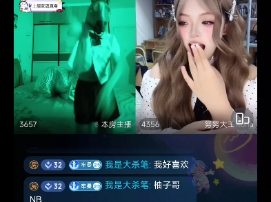 | 191 | 2025-09-17 |
| [最近怎么都在做哈基米之歌](https://www.bilibili.com/video/BV1hcp8zCEDJ) |  | 398 | 2025-09-17 |
| [柚恩哈基米音乐合集](https://www.bilibili.com/video/BV1Yzp8zmERw) |  | 399 | 2025-09-17 |
| [哈基米 这个强迫症](https://www.bilibili.com/video/BV1Chp4zxE1Y) | 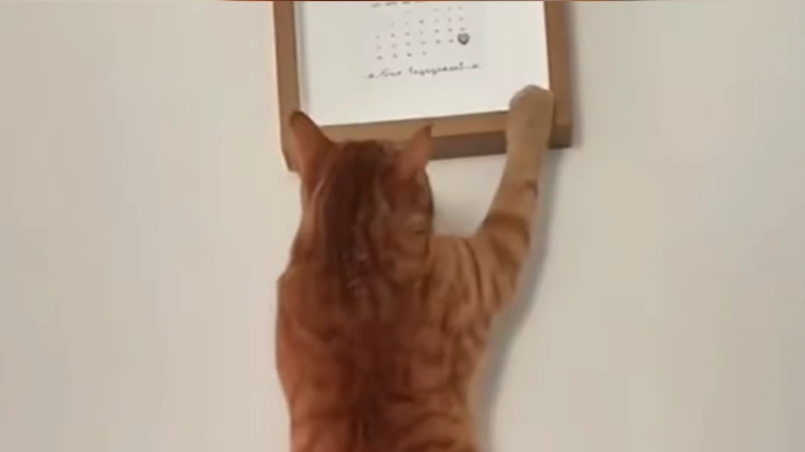 | 751 | 2025-09-17 |
| [【哈基米音乐】纯净流哈基米音乐——《䋛》](https://www.bilibili.com/video/BV1stp4zbEXq) |  | 55 | 2025-09-17 |
| [【哈基米音乐】犯哈](https://www.bilibili.com/video/BV1cqp4zpEJ3) |  | 785 | 2025-09-17 |
| [哈基米：冬之花](https://www.bilibili.com/video/BV1CVptzoEFx) |  | 380 | 2025-09-17 |
| [【哈基米音乐】《下等咪》](https://www.bilibili.com/video/BV1o8HYz4EUz) |  | 339 | 2025-09-17 |
| [哈 基 米 哦 南 北 绿 豆~](https://www.bilibili.com/video/BV1hFptziE6x) |  | 179 | 2025-09-17 |
| [哈基米的曼波（零距离的思念）](https://www.bilibili.com/video/BV1ARptzfEWe) |  | 62 | 2025-09-17 |
| [曼波曼波（ギラギラ 光辉炫目）【柚子哈基米】原告：Ado](https://www.bilibili.com/video/BV1pupxzQE8v) |  | 102 | 2025-09-17 |
| [哈基米：囊囊囊（Nom Nom Nom Nom Nom Nom Nom）](https://www.bilibili.com/video/BV1wXpxzpE2a) |  | 877 | 2025-09-17 |
| [【哈基米音乐】地平线4开场音乐 a  A Moment Apart](https://www.bilibili.com/video/BV1jWpxzGEmH) |  | 424 | 2025-09-17 |
| [好曲不挑词，25年爆火哈基米金曲](https://www.bilibili.com/video/BV1StpkzCENP) |  | 585 | 2025-09-17 |
| [【哈基米phonk】GHOST! 感受来自耄的压迫感](https://www.bilibili.com/video/BV1A8pmzmEqB) | 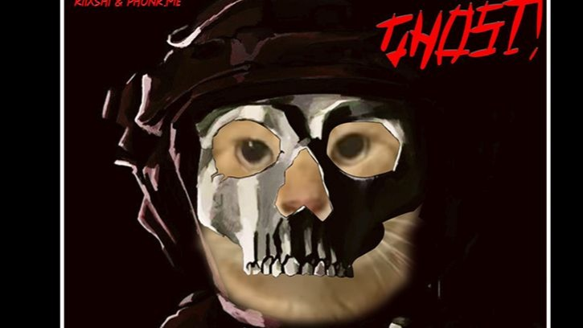 | 7192 | 2025-09-17 |
| [【真栗】甲方听到哈基米音乐眼前一黑？真有甲方来找我唱哈基米！](https://www.bilibili.com/video/BV1ampnznE5V) |  | 2604 | 2025-09-17 |
| [【真栗】唱哈基米音乐会让我有一种爽感！！不知道为什么！！](https://www.bilibili.com/video/BV1rKpyziEJn) |  | 445 | 2025-09-17 |
| [学唱基米说🎤哈基米音乐真神了吧😋洗脑节奏属于是.....🤓【鱿米】](https://www.bilibili.com/video/BV1Lrp1zaEJt) | 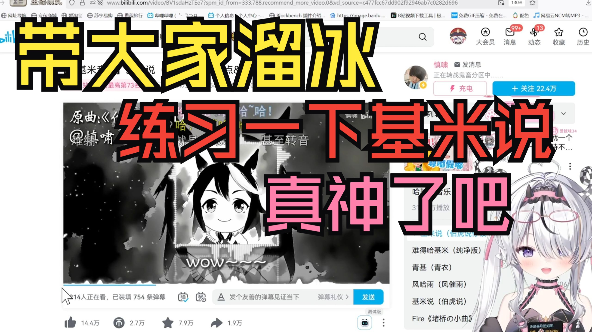 | 720 | 2025-09-16 |
| [哈基米音乐之【基米说】](https://www.bilibili.com/video/BV1D9p1zpEY3) |  | 474 | 2025-09-16 |
| [【纯净哈基米】【蔚蓝档案】哈狼白米的ClearMorning](https://www.bilibili.com/video/BV1Wmp2zjEVQ) |  | 154 | 2025-09-16 |
| [【曼波说】｜“【保安の小曲】哈基米MV版&quot;](https://www.bilibili.com/video/BV1sUp2z1ETP) |  | 272 | 2025-09-16 |
| [哈基米 这个麻嘴](https://www.bilibili.com/video/BV11opCzkE2x) | 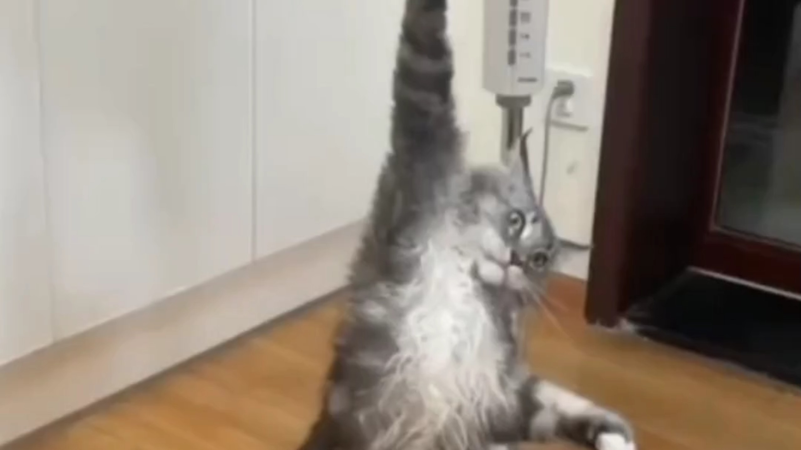 | 795 | 2025-09-16 |
| [🐱【老基米行动】🐱我的哈基是咪做的🐱纯净哈基米...... 来自78的情书❤️&lt;翻唱&gt;](https://www.bilibili.com/video/BV1WmpyzzEtC) |  | 317 | 2025-09-16 |
| [基米Phonk：全网最爽哈基米音乐歌单！燃爆你的肾上腺素！基米歌单#1](https://www.bilibili.com/video/BV1StpkzCEGp) |  | 786 | 2025-09-16 |
| [【哈基米音乐】青基](https://www.bilibili.com/video/BV1hjpBzvE2k) | 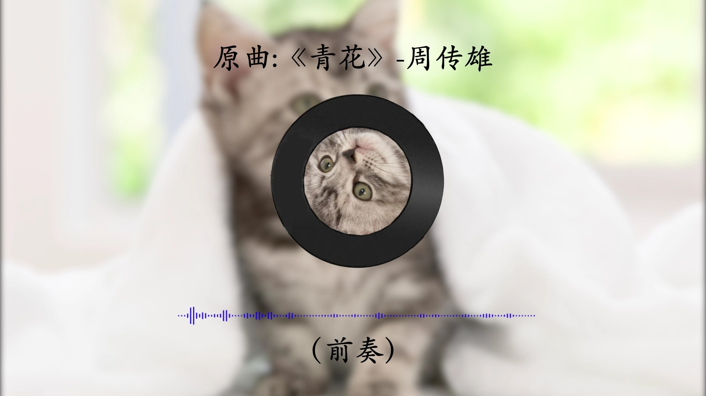 | 414 | 2025-09-15 |
| [甜菜小mua《哈基米音乐》太洗脑了！这就是中国的艺术嘛？](https://www.bilibili.com/video/BV16SpMzhEVD) |  | 6341 | 2025-09-15 |
| [【PEAK】哈基米山歌之舞](https://www.bilibili.com/video/BV1HYpPzdErG) |  | 2971 | 2025-09-15 |
| [【补档2】哈基米音乐：😺假面骑士剑OP2/ELEMENTS😺](https://www.bilibili.com/video/BV1VDpwziExq) |  | 803 | 2025-09-14 |
| [《哈基米起床歌》--竹笛](https://www.bilibili.com/video/BV1GCHZzRENP) | 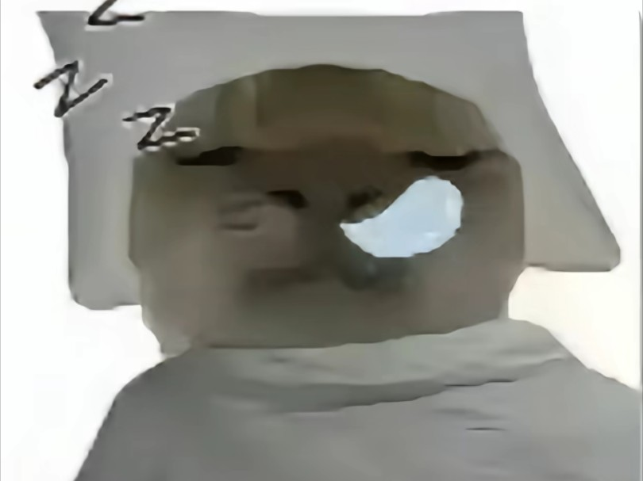 | 19 | 2025-09-14 |
| [《哈基米的澎湖湾》曼波~](https://www.bilibili.com/video/BV1j3p7zEE3Z) |  | 264 | 2025-09-13 |
| [【哈基米】京港地铁の小曲](https://www.bilibili.com/video/BV1DfHrzzEsa) | 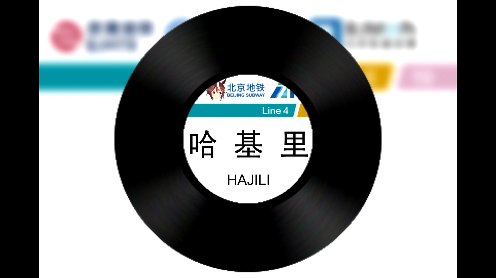 | 408 | 2025-09-12 |
| [墙洞酒馆，但是哈基米](https://www.bilibili.com/video/BV1SHh2zkE4i) |  | 3555 | 2025-09-10 |
| [你生来就是魔丸之哈基米但破鼎失败](https://www.bilibili.com/video/BV1NXa9zbE8s) | 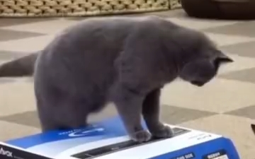 | 468 | 2025-09-08 |
| [【哈基米音乐】action！！【绝区零】](https://www.bilibili.com/video/BV1UtaRzeEXr) |  | 1257 | 2025-09-08 |
| [【哈基米音乐】《我们的哈气是对基米的严重浪费》 哈基米音乐合辑之寻基启示](https://www.bilibili.com/video/BV19iYjzBE7r) |  | 1222 | 2025-09-07 |
| [【真栗】哈基米音乐圣体参上！我还能比这更像呢！](https://www.bilibili.com/video/BV1ndYgzhEGE) |  | 2.2万 | 2025-09-07 |
| [【哈基米音乐】Luna Say Maybe(月说或许)](https://www.bilibili.com/video/BV13oa8zBE88) |  | 1.6万 | 2025-09-05 |
| [【哈基米音乐】博德基门（博德之门主题曲 Main Theme Part I）](https://www.bilibili.com/video/BV1Caa8zRE4R) |  | 9.5万 | 2025-09-05 |
| [【尾幼mayori】哈基米才是真正的音乐!!🎧🎶](https://www.bilibili.com/video/BV1F1aCzWEL9) |  | 1566 | 2025-09-04 |
| [【哈基米曼波语音盒2.0】让你随时随地都可以哈基米](https://www.bilibili.com/video/BV1praFzTEtx) |  | 1.1万 | 2025-09-02 |
| [山 歌 哈 基 米](https://www.bilibili.com/video/BV1BCaEzmEXQ) |  | 11.1万 | 2025-09-01 |
| [【纯净哈基米】HARPY HARE](https://www.bilibili.com/video/BV1Nza3zMEFx) |  | 2598 | 2025-08-31 |
| [【哈基米FM】猫儿这个壮志凌云（完整版）](https://www.bilibili.com/video/BV17XhqzhE8P) |  | 2.3万 | 2025-08-31 |
| [【七濑Unia】爽！这才是真正的音乐，U神唱哈基米音乐~](https://www.bilibili.com/video/BV1JzhYz9ES2) |  | 4109 | 2025-08-30 |
| [我听了一百首哈基米音乐！](https://www.bilibili.com/video/BV1Hhh9zSEos) |  | 4.3万 | 2025-08-29 |
| [哈基米音乐：事在马为](https://www.bilibili.com/video/BV13ShQzfEAZ) | 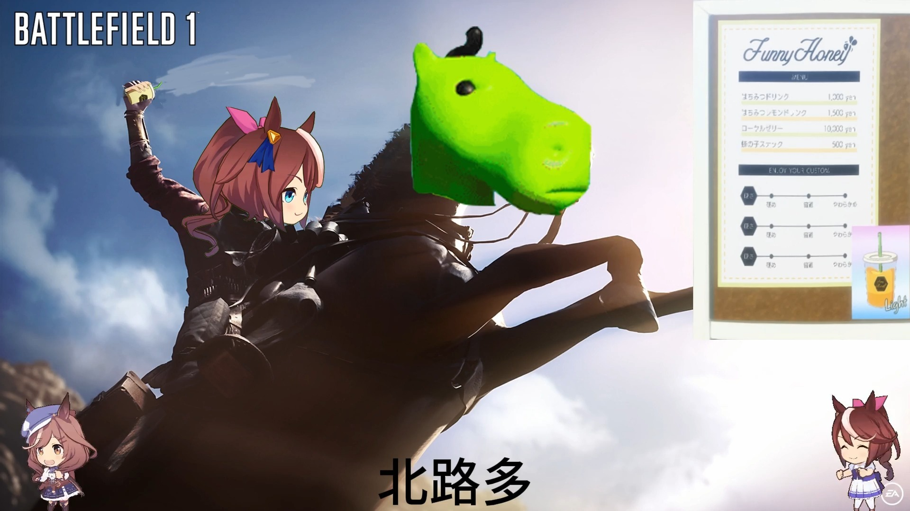 | 7838 | 2025-08-29 |
| [【哈基米音乐】遇见](https://www.bilibili.com/video/BV1Aih2zPEYT) |  | 7013 | 2025-08-28 |
| [UNJIMI🐱【哈基米:UNDEAD】](https://www.bilibili.com/video/BV1Lth1zSEpo) |  | 1.8万 | 2025-08-28 |
| [🐱哈基米音乐：坦坦荡荡见耄耋🐱](https://www.bilibili.com/video/BV15ivKz1EVg) |  | 7627 | 2025-08-26 |
| [【哈基米音乐】【鲁基基】完整版](https://www.bilibili.com/video/BV1QdeJzLEid) | 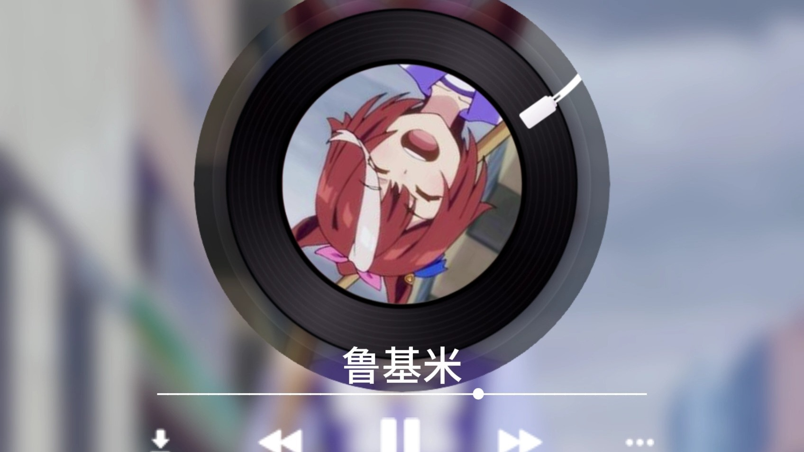 | 677 | 2025-08-25 |
| [【哈基米音乐】Mc我的哈基界 minecraft-c418](https://www.bilibili.com/video/BV1yLepzgErb) | 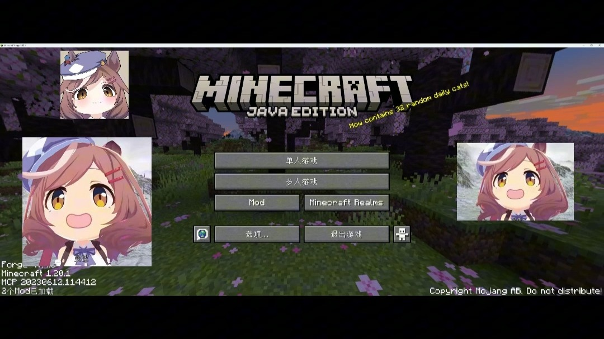 | 415 | 2025-08-24 |
| [【哈基米音乐】Tell 米👏Tell 米👏](https://www.bilibili.com/video/BV1NWe7z8E5t) |  | 46.7万 | 2025-08-24 |
| [【基米音乐】 homoの小曲 鱼韵乐队《light dance 》 (ライトダンス )](https://www.bilibili.com/video/BV18XeBzcE1m) |  | 2.3万 | 2025-08-23 |
| [【哈基米音乐】哈你（基米电台day3)](https://www.bilibili.com/video/BV125eizEEz5) |  | 5421 | 2025-08-23 |
| [⚡️热异常⚡️哈基米音乐](https://www.bilibili.com/video/BV1pAeqz1Ego) |  | 876 | 2025-08-23 |
| [《基米新世界》vivo新世界哈基米版](https://www.bilibili.com/video/BV1CeehzFEH9) |  | 851 | 2025-08-22 |
| [【哈基米音乐】MONTAGEM TOMADA](https://www.bilibili.com/video/BV1hoYozjEBF) |  | 4108 | 2025-08-21 |
| [哈基米你坏事做尽！！（哈基米音乐）可爱捏](https://www.bilibili.com/video/BV1uiY9zPEL9) |  | 7068 | 2025-08-21 |
| [手把手哈基米音乐制作教程-概论](https://www.bilibili.com/video/BV15ve3zZEAe) |  | 2367 | 2025-08-20 |
| [哈基米：基米拓荒🚀](https://www.bilibili.com/video/BV11beMzNEgK) |  | 7.4万 | 2025-08-20 |
| [日推歌单｜《最后一哈》“哈基米”](https://www.bilibili.com/video/BV14nb8zpEnY) |  | 2.7万 | 2025-08-13 |
| [【哈基米音乐】基哥新作品之Jasmine（基斯米）](https://www.bilibili.com/video/BV17qbNzeExJ) |  | 2.7万 | 2025-08-10 |
| [【哈基米FM】北京地道の小曲](https://www.bilibili.com/video/BV1dutxzJEWd) | 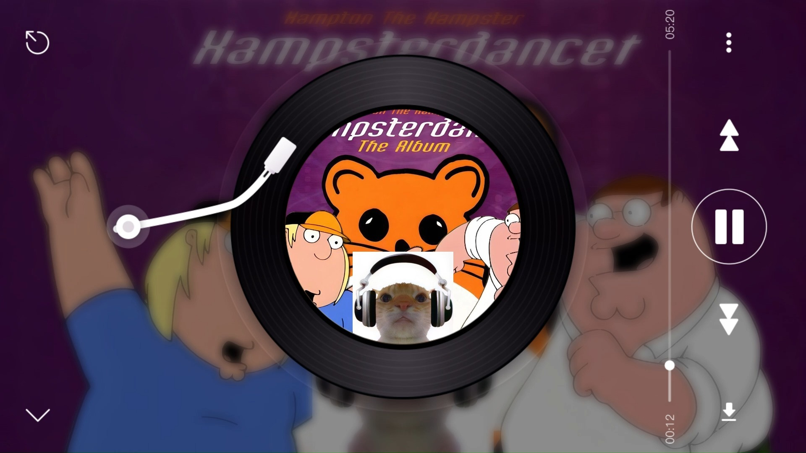 | 2649 | 2025-08-09 |
| [【哈基米音乐】🎵排山倒海🎵 高人我自己请来了](https://www.bilibili.com/video/BV1qTtqznEqb) | 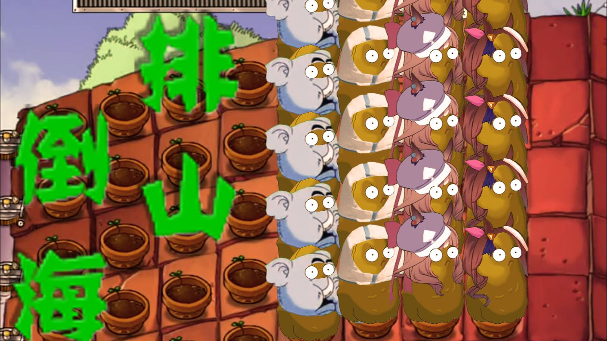 | 4314 | 2025-08-07 |
| [蛋仔派对：盘点哈基米音乐，几乎没有人能听完！](https://www.bilibili.com/video/BV1q94Zz1E7Q) |  | 113.3万 | 2025-08-06 |
| [【哈基米音乐】夏霞 （让哈基米去除你夏日的烦闷吧^_^）](https://www.bilibili.com/video/BV1RBtJzKEHx) | 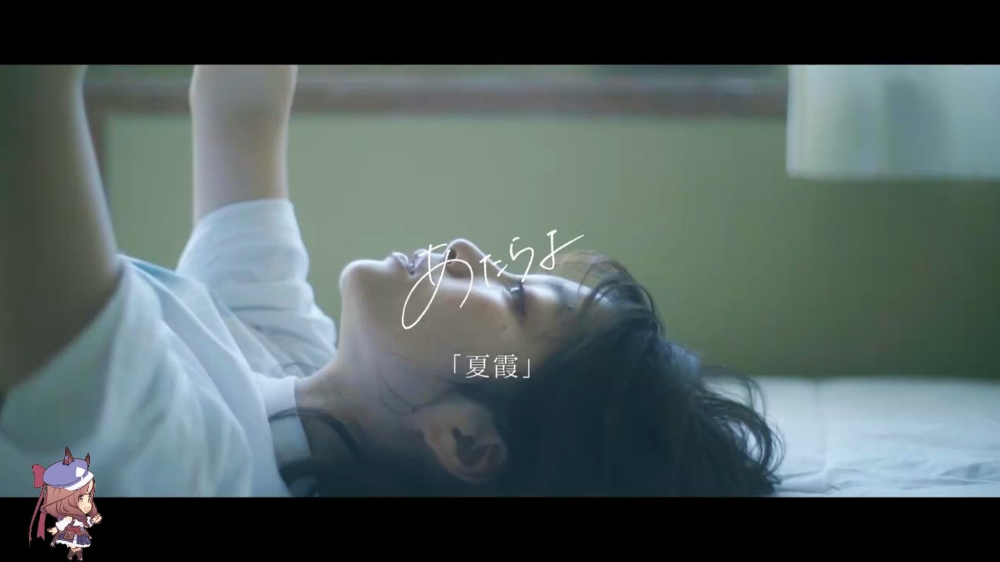 | 1.7万 | 2025-08-05 |
| [【基米音乐】：神人颂 （原曲酒神颂）](https://www.bilibili.com/video/BV1tXtJzdE51) |  | 2.9万 | 2025-08-05 |
| [【哈基米音乐】血红色的黑暗基米](https://www.bilibili.com/video/BV1sZhKzdEfG) |  | 2325 | 2025-08-02 |
| [纯净哈基米：万能基米旅店-早（原曲不使用）](https://www.bilibili.com/video/BV1mL8RzdEJx) |  | 9708 | 2025-07-30 |
| [【哈基米音乐】哈为起床闹铃](https://www.bilibili.com/video/BV1tX8RzhEHB) |  | 3.1万 | 2025-07-29 |
| [【哈基米FM】Neon Rain波～，但是重制版](https://www.bilibili.com/video/BV1CJ8Ez7EjQ) | 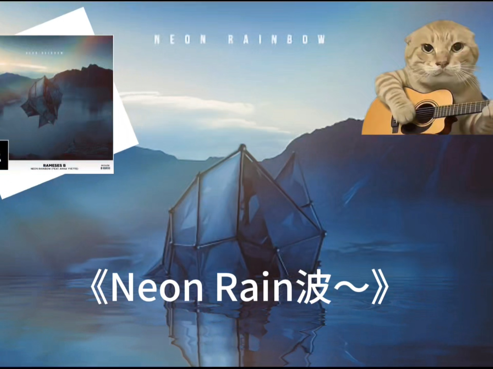 | 2.2万 | 2025-07-28 |
| [突然感觉法老的音乐好像哈基米...](https://www.bilibili.com/video/BV1gWbozNEHm) | 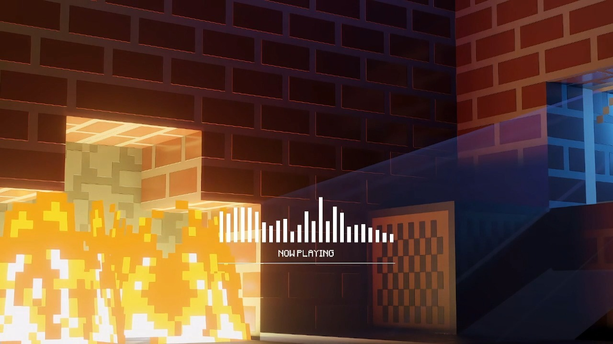 | 318 | 2025-07-23 |
| [哈基米：🐱不得不哈🐱](https://www.bilibili.com/video/BV1krgnz3ERB) | 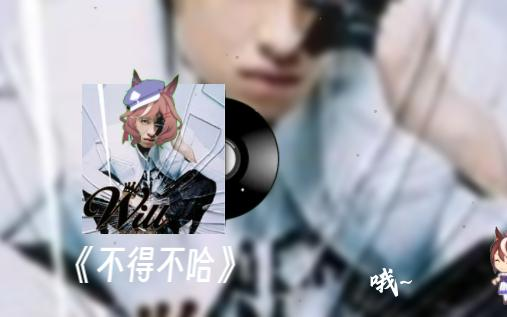 | 8.4万 | 2025-07-22 |
| [瓶子看《耄耋编年史》爆笑，从哈基米逐渐发展到如今的编年史，像在网路社区炸开了一个旱厕](https://www.bilibili.com/video/BV1wounzMEBC) |  | 6.0万 | 2025-07-15 |
| [哈基米音乐：燃尽了 Counting Stars](https://www.bilibili.com/video/BV1TauGzpEDQ) |  | 9984 | 2025-07-11 |
| [哈基米78音乐合集（2）](https://www.bilibili.com/video/BV1r8Gwz9En7) |  | 1.3万 | 2025-07-09 |
| [[哈基米音乐]哈基司 (チーズ)](https://www.bilibili.com/video/BV1TK3vzxE2d) |  | 1.1万 | 2025-07-06 |
| [【纯净哈基米】尴尬の小曲，慵懒猫儿](https://www.bilibili.com/video/BV1nt3xzJE5n) |  | 3.2万 | 2025-07-02 |
| [哈基米的澎湖湾，外婆的哈米湾BGM@鼻血黄豆 #哈基米#曼波 #音乐分享](https://www.bilibili.com/video/BV1JwK2zFEdt) | 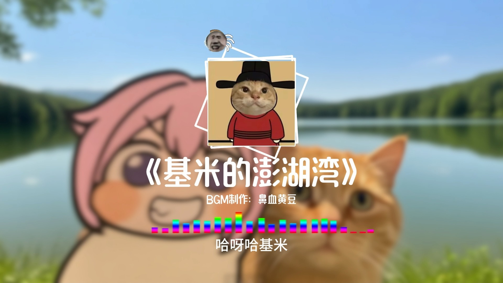 | 7781 | 2025-06-28 |
| [【哈基米音乐】危险的哈基米](https://www.bilibili.com/video/BV1tQKBz9EQr) |  | 8.0万 | 2025-06-27 |
| [印度哈基米 无踩背版](https://www.bilibili.com/video/BV1tRK7zcEW3) |  | 3.5万 | 2025-06-25 |
| [【哈基米音乐】一起曼波的约定，那样清晰⚡️⚡️⚡️](https://www.bilibili.com/video/BV111NxzLEFm) | 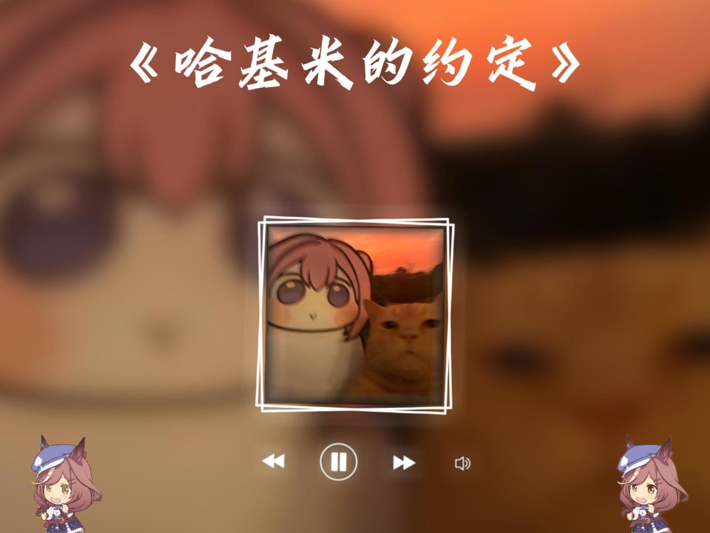 | 2519 | 2025-06-19 |
| [【哈基米音乐】飞基进行曲（原神飞鼠进行曲）](https://www.bilibili.com/video/BV1WQNzzUEUa) |  | 24.1万 | 2025-06-18 |
| [🎵哈基米🎵云顶之弈：强音争哈](https://www.bilibili.com/video/BV1VEMBzPEjw) |  | 1.7万 | 2025-06-13 |
| [【哈基米音乐制作】关于麦乐迪的补充说明](https://www.bilibili.com/video/BV1teMMzrESP) |  | 4.1万 | 2025-06-13 |
| [哈基米：TIANTIAN](https://www.bilibili.com/video/BV1cWTyzcEMf) |  | 30.7万 | 2025-06-07 |
| [【半小时哈基米】soul seeker（八哈一基）](https://www.bilibili.com/video/BV1r85qztEfn) | 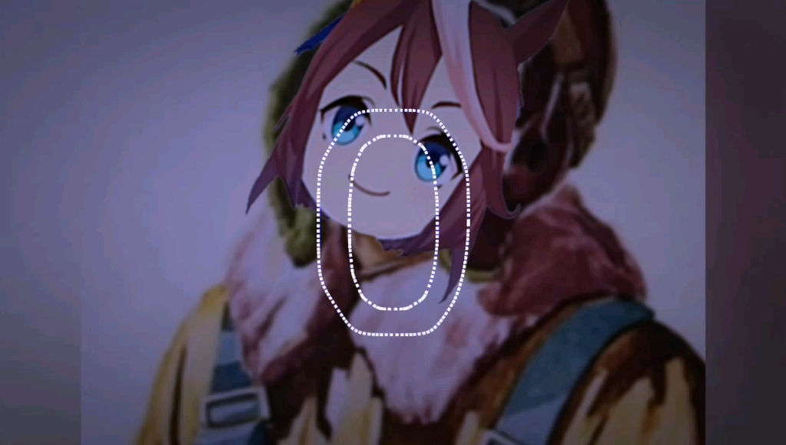 | 12.9万 | 2025-04-17 |
| [哈基米音乐合集😋](https://www.bilibili.com/video/BV1aedqY6EtN) |  | 369 | 2025-04-13 |
| [【基米洲行动】🎵🐱哈基米 特勤处の小曲《HachimiOperation》🐱🎵](https://www.bilibili.com/video/BV1EJdWYCEDN) |  | 22.1万 | 2025-04-08 |
| [【哈基米音乐重制】天空](https://www.bilibili.com/video/BV1TdZYYoEzx) | 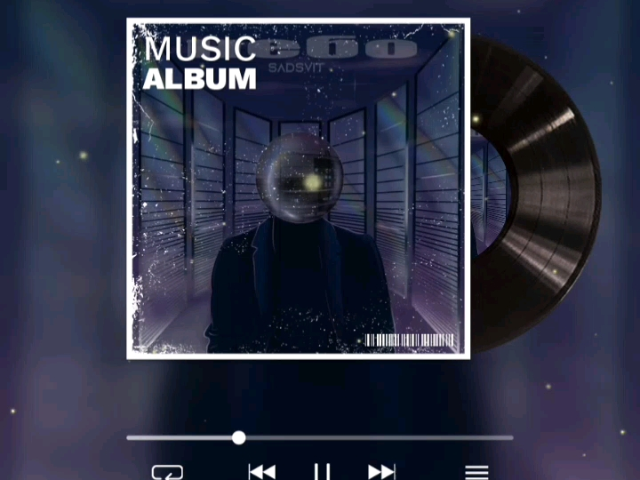 | 4.3万 | 2025-03-29 |
| [如何将哈基米音乐保存到本地（欣享工具箱小程序）](https://www.bilibili.com/video/BV1mSoeYdE3Z) |  | 291 | 2025-03-26 |
| [【补档】月光奏鸣曲【哈基米音乐】](https://www.bilibili.com/video/BV1xQFTeHEFR) | 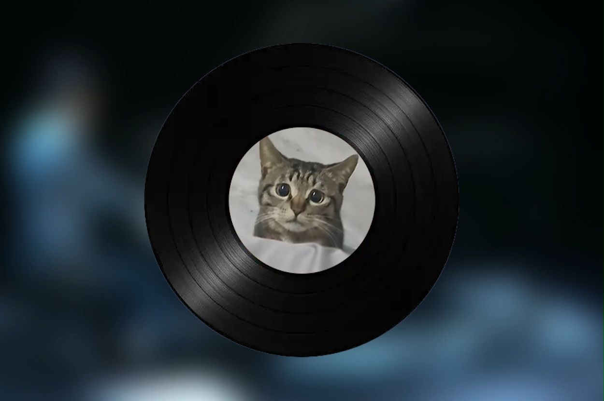 | 4.4万 | 2025-01-29 |
| [哈基米音乐排行榜#0（夏日特辑）](https://www.bilibili.com/video/BV12GzfY7EoL) |  | 67.4万 | 2024-12-01 |
| [哈基米音乐——欢乐颂](https://www.bilibili.com/video/BV1TspzezEmm) |  | 8.2万 | 2024-09-08 |

---
*最后更新: 2025-09-18 02:36:01 (自动生成)*
*数据来源: [Bilibili](https://www.bilibili.com)*

## 使用说明

运行以下命令更新视频列表:
```bash
python3 fetch_hajimi_videos.py
```
