# awesome-hajimi
collections of hajimi (哈基米 in Chinese) on the Internet.

## 视频列表 (Video List)

| 视频标题 (Title) | 封面 | 播放量 (Views) | 发布日期 (Date) |
|---|---|---|---|
| [再次醒来，你发现除了你所有人都忘记了哈基米](https://www.bilibili.com/video/BV12tfGBZESA) |  | 3 | 2026-02-21 |
| [我想养只哈基米……第十三天](https://www.bilibili.com/video/BV11Yf5BAEzn) | 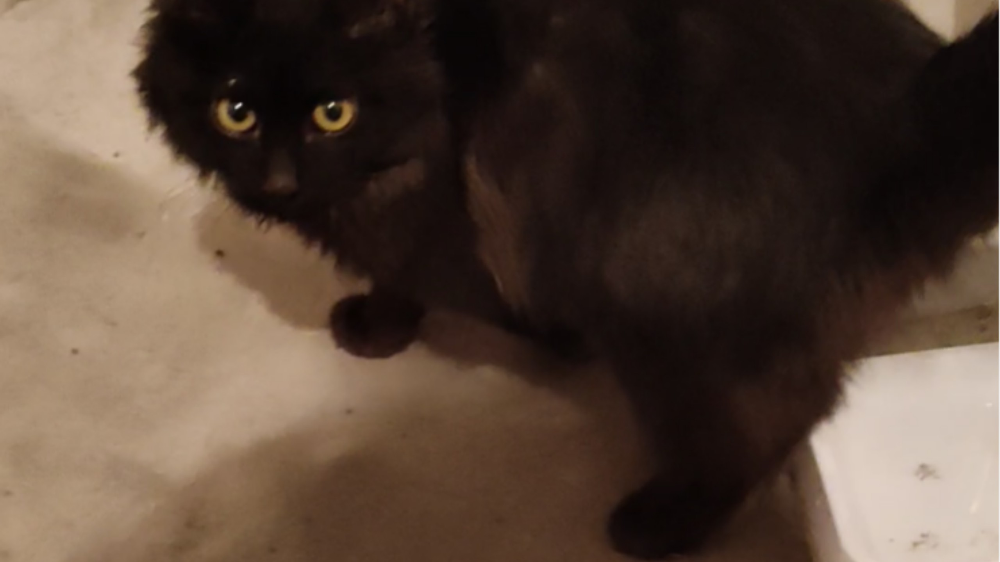 | 8 | 2026-02-21 |
| [2026 基米说](https://www.bilibili.com/video/BV1fQfjBZE5T) |  | 2 | 2026-02-21 |
| [哈基米笑传之三英战吕布](https://www.bilibili.com/video/BV11BfjBqE3n) | 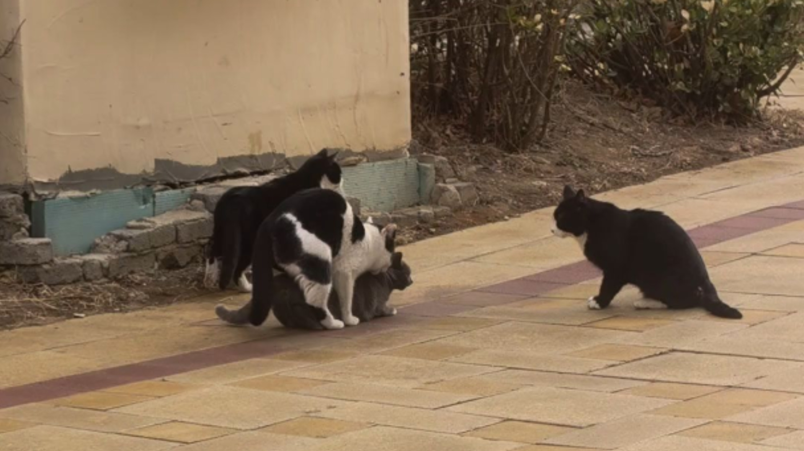 | 7 | 2026-02-21 |
| [哈基米摸金](https://www.bilibili.com/video/BV1bVf7BCEmS) |  | 6 | 2026-02-21 |
| [哈基米有个家](https://www.bilibili.com/video/BV1hgf7B1EWz) | 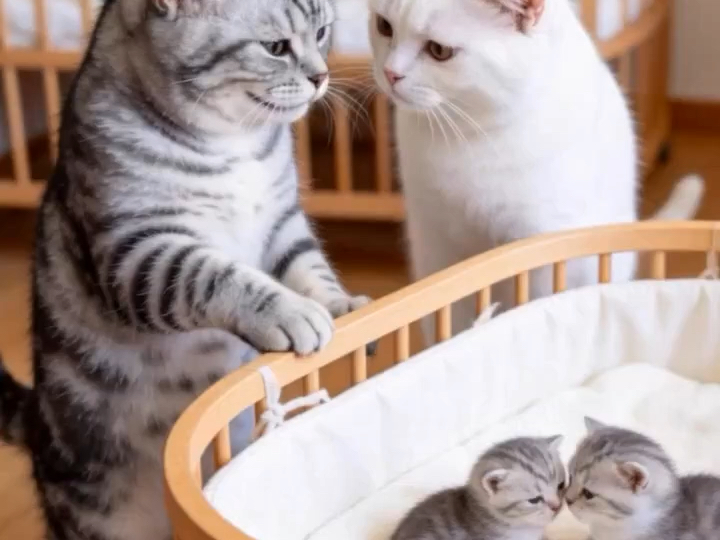 | 4 | 2026-02-21 |
| [基米到｜今日必听发财小曲儿](https://www.bilibili.com/video/BV136fVBzEY6) |  | 1343 | 2026-02-21 |
| [“理润新声”寒假千人红色精神宣讲活动--79哈基米南北绿豆队](https://www.bilibili.com/video/BV1Ycf7BQEXo) |  | 2 | 2026-02-21 |
| [【哈基米音乐】千本樱](https://www.bilibili.com/video/BV14LfLBeEss) |  | 15 | 2026-02-20 |
| [圣基米发，十秒哈基米](https://www.bilibili.com/video/BV1odf5B7ELi) |  | 0 | 2026-02-20 |
| [给哈基米发红包，十秒哈基米](https://www.bilibili.com/video/BV1vof5B2Emf) | 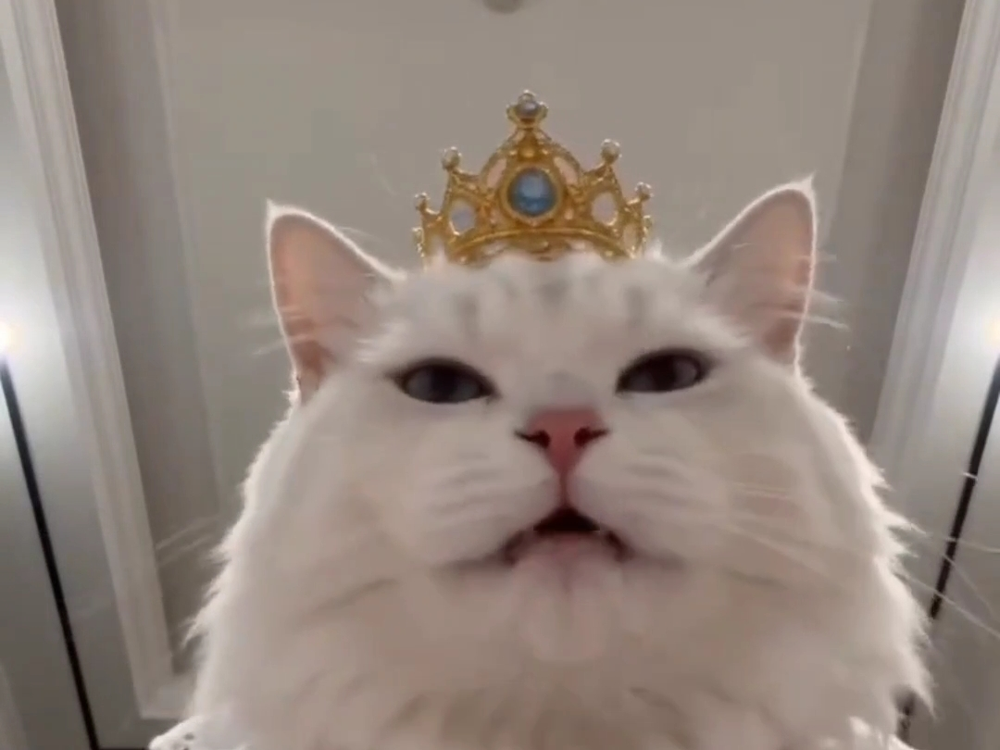 | 14 | 2026-02-20 |
| [哈基米！但是泰拉瑞亚](https://www.bilibili.com/video/BV1m8fGB4Ecr) |  | 116 | 2026-02-20 |
| [一分钟沉浸式体验哈基米舔毛](https://www.bilibili.com/video/BV1TQfVBwEUC) | 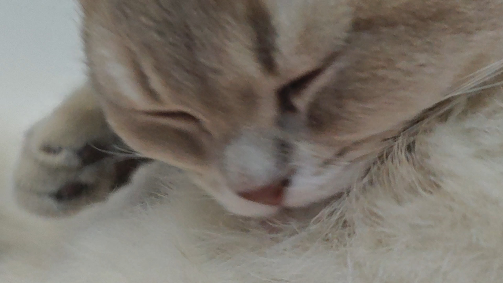 | 20 | 2026-02-20 |
| [哈基米曼波曼波(B友们新年快乐)！](https://www.bilibili.com/video/BV14QfVBwEMD) | 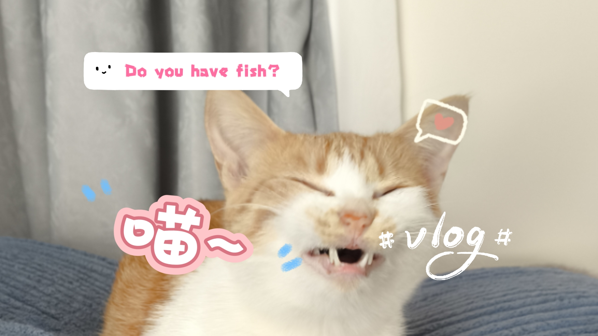 | 125 | 2026-02-20 |
| [给小猫唱个歌，哈基米！](https://www.bilibili.com/video/BV1tNf3BREGY) |  | 24 | 2026-02-20 |
| [【哈咪基米】视频加载中，速速查收惊喜！](https://www.bilibili.com/video/BV1p3f3BDExz) |  | 34 | 2026-02-20 |
| [哈基米amsr](https://www.bilibili.com/video/BV1xMf3BXERz) | 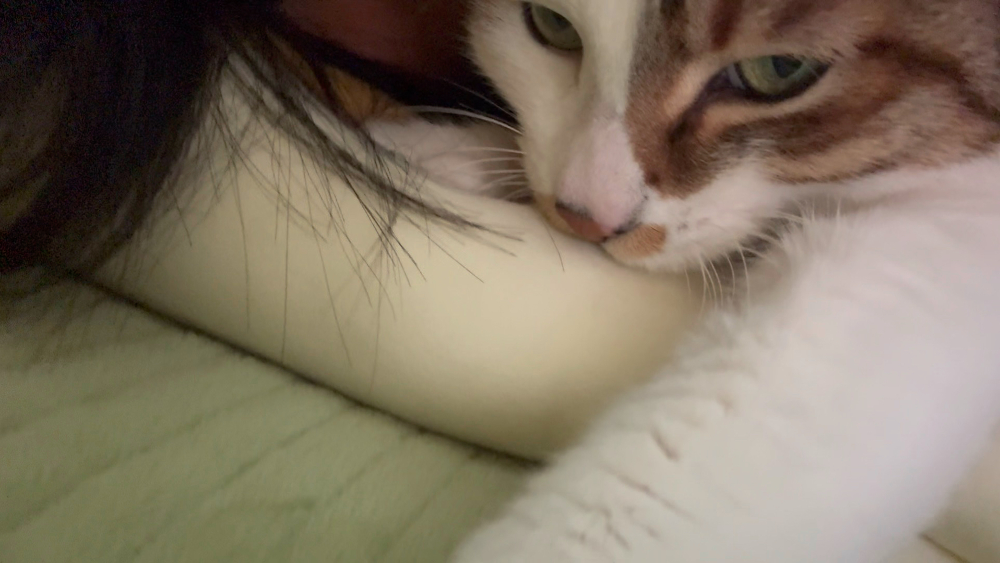 | 113 | 2026-02-20 |
| [哈！😡 哈！😡 哈！😡 哈！😡 哈！😡 哈！😡 哈！😡 哈！😡 哈！😡 哈！😡 哈！😡 哈！😡 哈！😡 哈！😡 哈！😡 哈！😡](https://www.bilibili.com/video/BV1Wgf3BHEf7) |  | 2021 | 2026-02-20 |
| [春节会叫“麻麻”的哈基米](https://www.bilibili.com/video/BV1YRfgBaExi) | 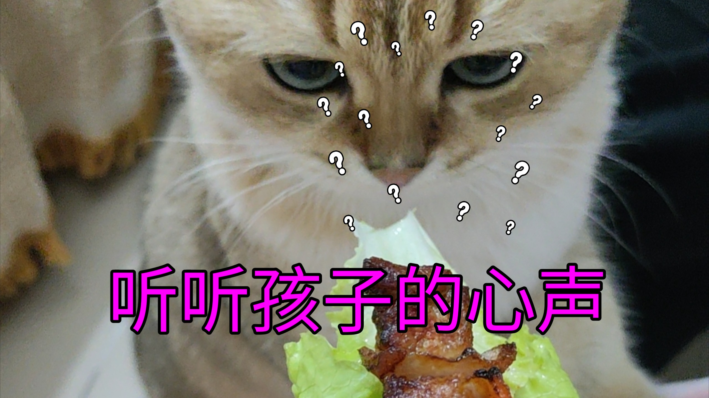 | 11 | 2026-02-20 |
| [被哈基米包围了૮₍°□°₎ა](https://www.bilibili.com/video/BV1hRfgBaEJu) | 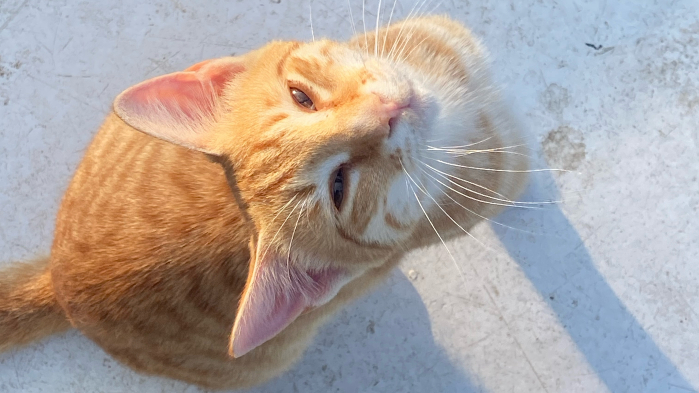 | 0 | 2026-02-20 |
| [废物哈基米，在美国养哈基米还要缴税](https://www.bilibili.com/video/BV1RDfgBNEpf) | 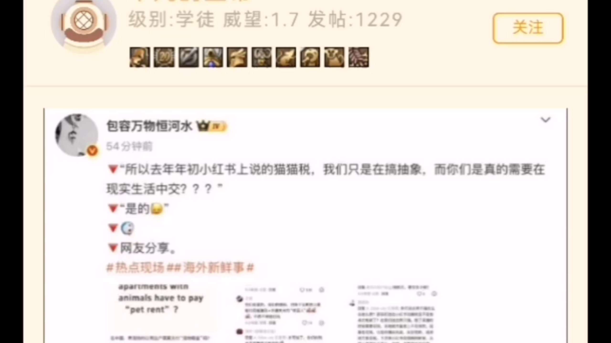 | 195 | 2026-02-20 |
| [哈基米](https://www.bilibili.com/video/BV1L8f3BBEDV) | 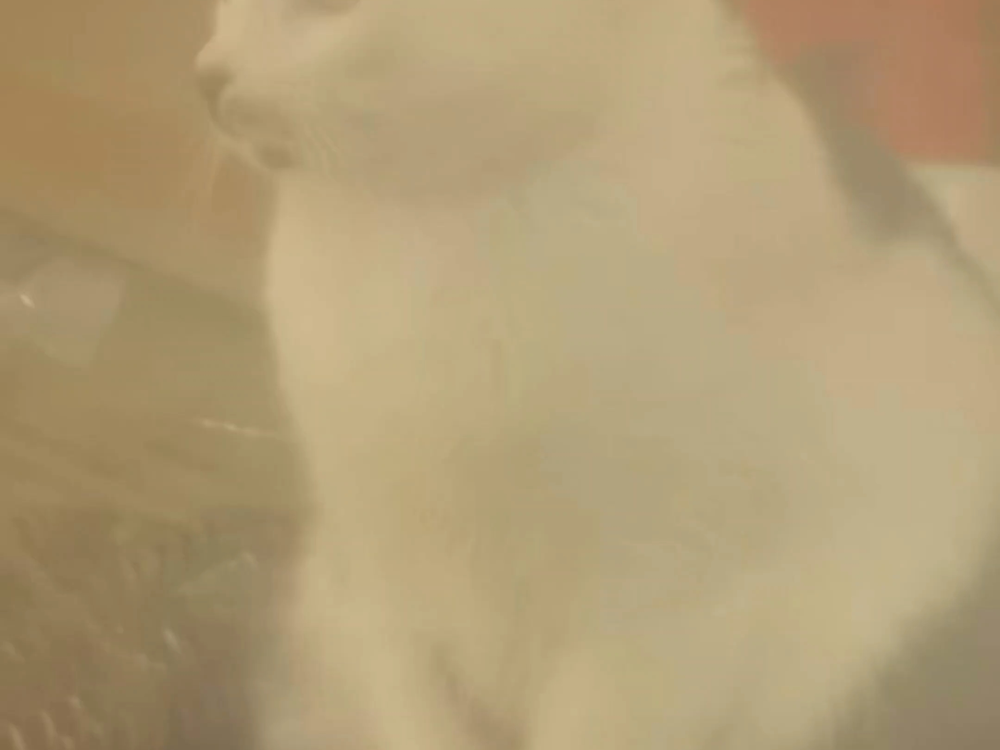 | 11 | 2026-02-20 |
| [哈基米过年](https://www.bilibili.com/video/BV13Bf3BAEt4) | 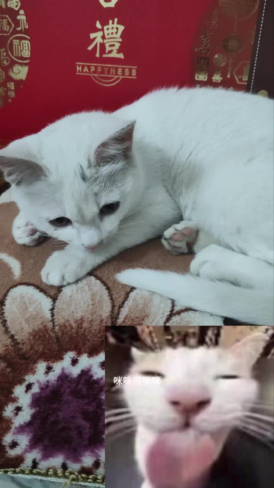 | 90 | 2026-02-20 |
| [哈基米不要叫了](https://www.bilibili.com/video/BV1Vvf3BNEio) | 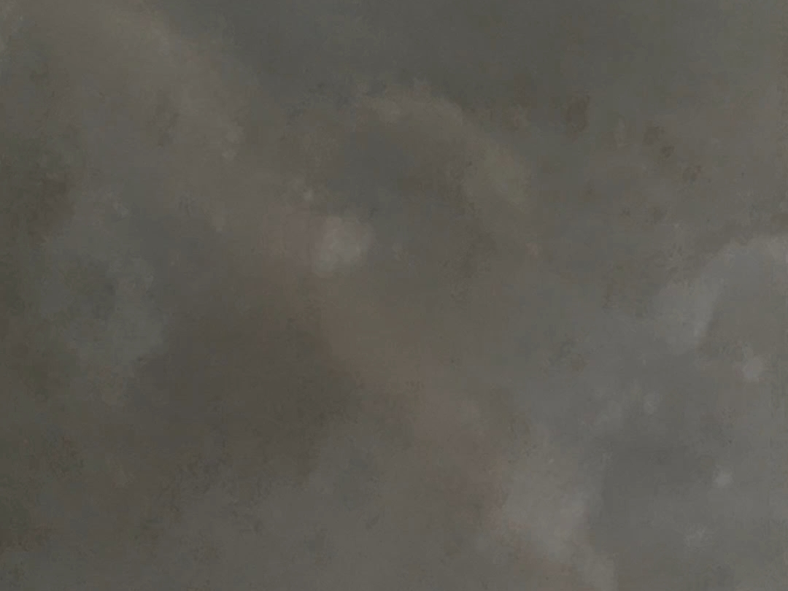 | 26 | 2026-02-20 |
| [哈基米！曼波！](https://www.bilibili.com/video/BV17Wf3BkEoU) | 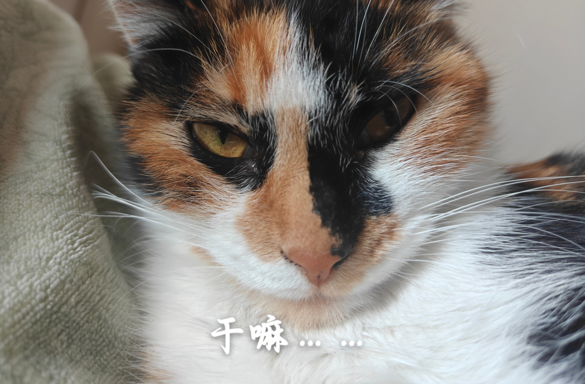 | 11 | 2026-02-20 |
| [哈基米啥时候变这么多了？](https://www.bilibili.com/video/BV1pdf3BDEPs) |  | 199 | 2026-02-20 |
| [【Mono】《翻唱 曼波 哈基米》（原唱 i-dle 아이들）YUQI  SHUHUA  MIYEON  MINNIE SOYEON（奶味蓝）娃【待兼唐怀瑟】](https://www.bilibili.com/video/BV1frfgB3EMu) |  | 178 | 2026-02-20 |
| [Seedance2.0测试大爷追哈基米](https://www.bilibili.com/video/BV1SpfGBwEK8) | 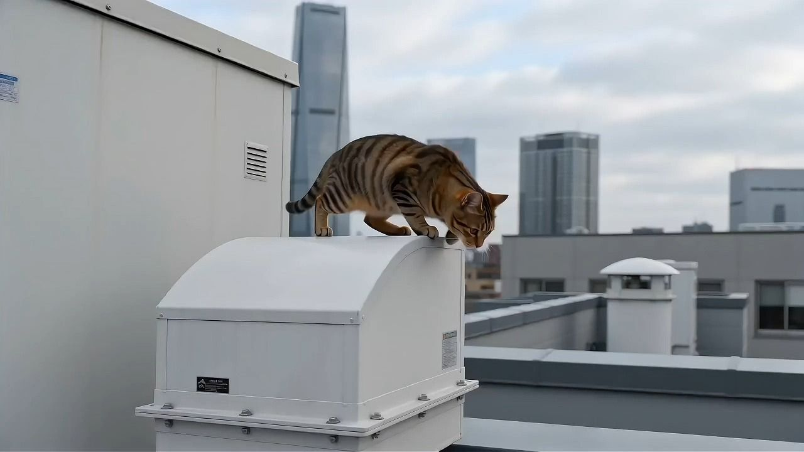 | 152 | 2026-02-20 |
| [哈基米](https://www.bilibili.com/video/BV1ebfuBhEP3) | 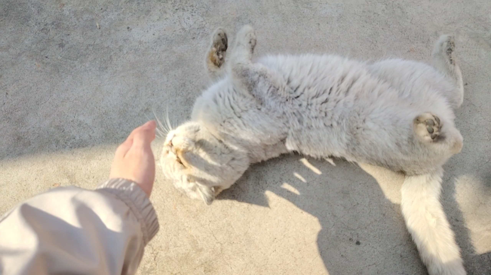 | 2.3万 | 2026-02-20 |
| [哈基米哈基米 💀](https://www.bilibili.com/video/BV1JLfuB3E2V) |  | 6 | 2026-02-20 |
| [路上遇到一只哈基米](https://www.bilibili.com/video/BV1EHfuBKEKu) | 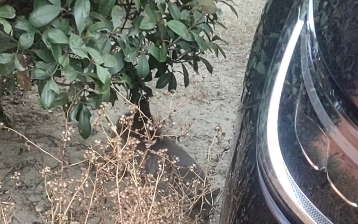 | 60 | 2026-02-20 |
| [Future Riddim哈基米：ENCHANTRESS【HACHIMI EX 音MAD SET单品】](https://www.bilibili.com/video/BV1nVfuBrEYn) |  | 2627 | 2026-02-20 |
| [干嘛猫的vlog（过年篇）](https://www.bilibili.com/video/BV1qHfuBKEeE) | 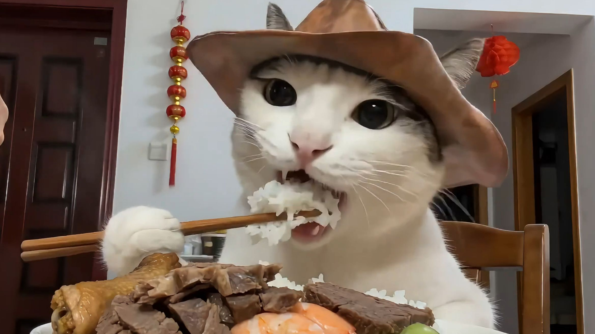 | 27.7万 | 2026-02-20 |
| [哈基米也有自己的釜山行啊](https://www.bilibili.com/video/BV1MKZEB5Efy) | 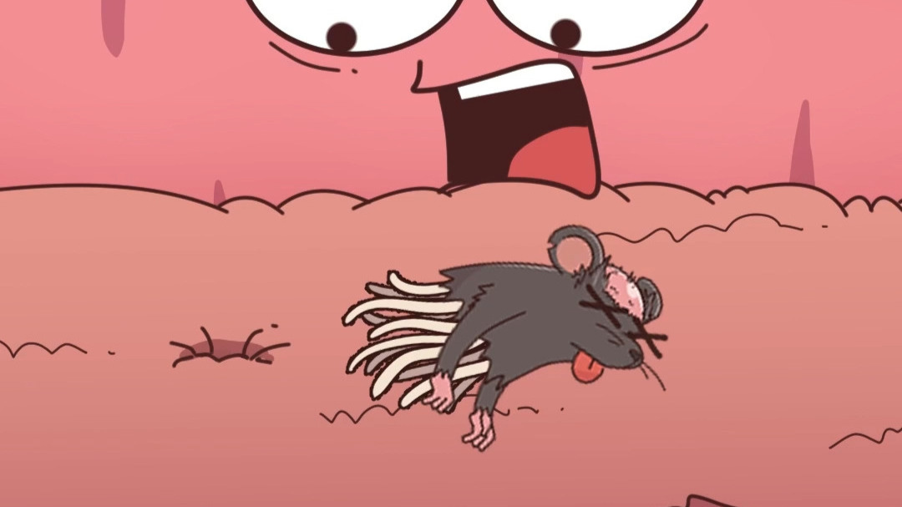 | 7.8万 | 2026-02-20 |
| [古典哈基米：命运交响曲【2026哈基米拜年基单品】](https://www.bilibili.com/video/BV1sCZYBLETU) |  | 9185 | 2026-02-20 |
| [【Ciyo翻唱】恭喜发财（哈基米版）「解冻100%」](https://www.bilibili.com/video/BV1QGfgBcECt) |  | 1181 | 2026-02-20 |
| [哈基米：琵琶语](https://www.bilibili.com/video/BV1RufgBAEZK) |  | 232 | 2026-02-20 |
| [音乐推荐 《HAJI FUNK（哈基米PHONK）》](https://www.bilibili.com/video/BV1rYfgB2EzY) |  | 92 | 2026-02-20 |
| [VRslashco之笑了就被哈基米肘飞](https://www.bilibili.com/video/BV1B2Z6BxEXr) | 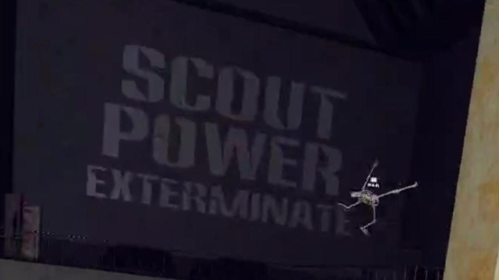 | 191 | 2026-02-20 |
| [【喵喵的结合】无伤防守战 最强哈基米](https://www.bilibili.com/video/BV1nxZrBfEee) |  | 3.2万 | 2026-02-20 |
| [【哈基米音乐】⚡️超 体 星⚡️](https://www.bilibili.com/video/BV1fBZiBLEXA) |  | 815 | 2026-02-20 |
| [🧧火花花-基米到🧧](https://www.bilibili.com/video/BV1K7ZRBkEwY) |  | 1.2万 | 2026-02-20 |
| [哈基米快乐刀片 太权威了](https://www.bilibili.com/video/BV1T9ZrB6EqK) |  | 3244 | 2026-02-20 |
| [《哈基米》](https://www.bilibili.com/video/BV1T9ZrB6Ebe) |  | 30 | 2026-02-20 |
| [【哈基米音乐】夜曲（完整&amp;重制版）](https://www.bilibili.com/video/BV1NkZvB9ELS) |  | 16.3万 | 2026-02-20 |
| [《雪地传来了哈基米》](https://www.bilibili.com/video/BV15aZqBuExp) |  | 4.3万 | 2026-02-20 |
| [那年哈基米究竟想捕获什么](https://www.bilibili.com/video/BV1sVZzBFEUs) | 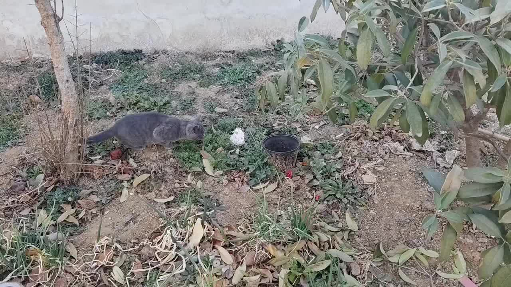 | 95 | 2026-02-20 |
| [[哈基米]我本将心向哈基米[大只切的哈基米小曲]](https://www.bilibili.com/video/BV135ZBB6EBb) |  | 1428 | 2026-02-19 |
| [落风传由木人实战，自带哈基米](https://www.bilibili.com/video/BV16kZBBnETe) |  | 19.0万 | 2026-02-19 |
| [哈基米.打火机](https://www.bilibili.com/video/BV166ZBBQEXj) | 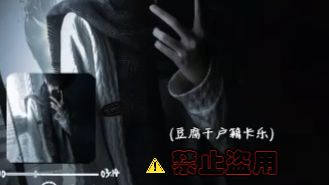 | 78 | 2026-02-19 |
| [你瞅瞅～我是一个球 我不是哈基米 足球球～ 老吴～哈！](https://www.bilibili.com/video/BV1tBZvB4Eyk) | 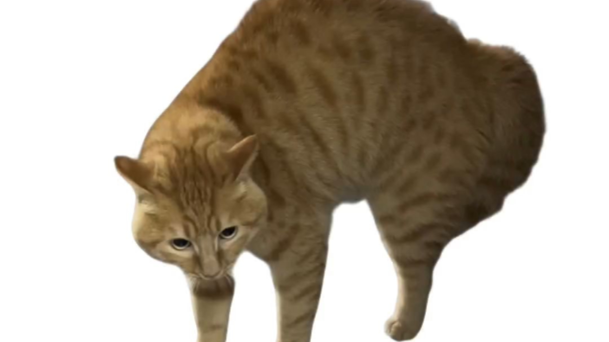 | 1.2万 | 2026-02-19 |
| [【补档】哈基米音乐：下哈（下山）](https://www.bilibili.com/video/BV1QLZiBcEK9) | 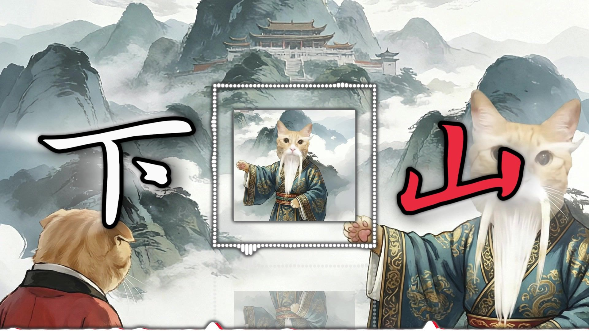 | 7800 | 2026-02-19 |
| [三角洲二指低帧菜B玩家 大战场日常#哈基米战斗曲](https://www.bilibili.com/video/BV1F9ZvBjEbj) | 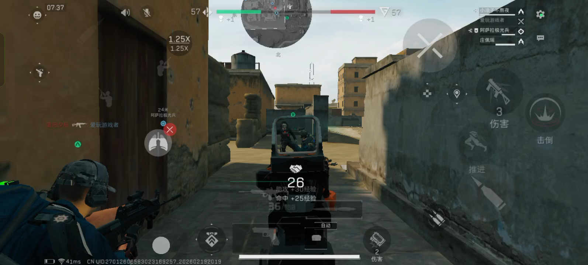 | 249 | 2026-02-19 |
| [哈基米：😺假面骑士Amazons第一季 OP ｜“所谓的生存，意味着要哈气他人的生命”😺](https://www.bilibili.com/video/BV1ZFZiB3Eq8) |  | 946 | 2026-02-19 |
| [如何把狞猫养得像家猫一样😏](https://www.bilibili.com/video/BV1CaZiBJEsD) | 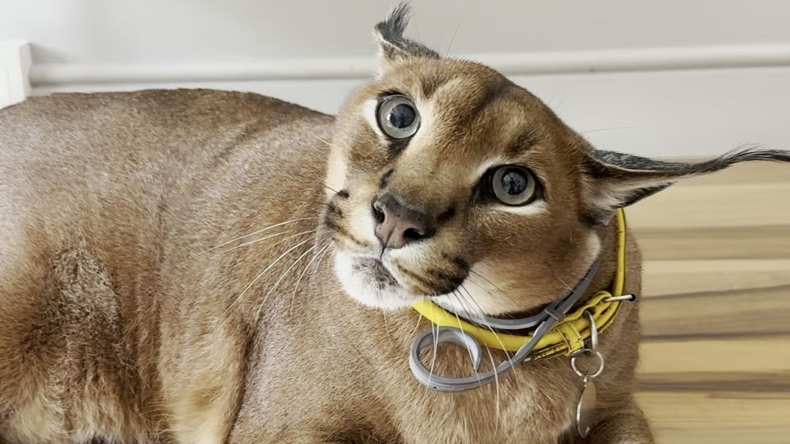 | 6771 | 2026-02-19 |
| [哈基米的万恶之源](https://www.bilibili.com/video/BV1ucZqBhE8i) | 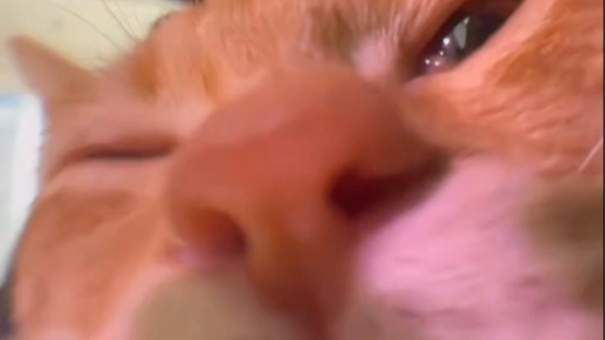 | 1236 | 2026-02-19 |
| [基米TV之报恩好猫15分钟剧场版，一次看个够！](https://www.bilibili.com/video/BV19NZeBFETu) | 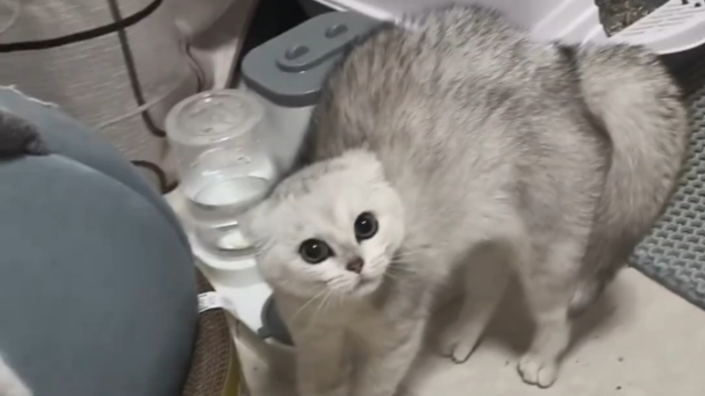 | 5.6万 | 2026-02-19 |
| [【2026哈基米拜年基单曲】《听我说谢谢咪》](https://www.bilibili.com/video/BV1FDZYBrEHS) |  | 8398 | 2026-02-19 |
| [哈基米开创老吴外交](https://www.bilibili.com/video/BV1zqZeBMEKf) | 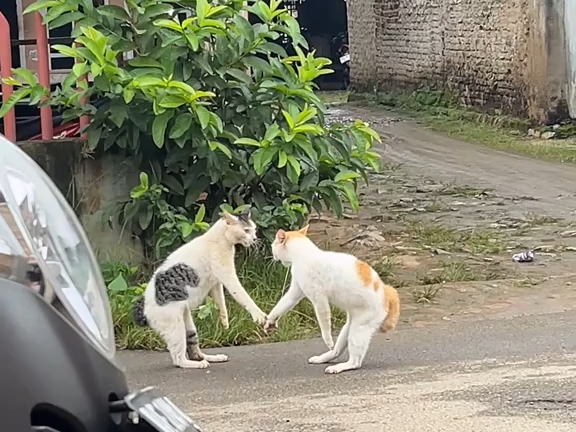 | 47.4万 | 2026-02-19 |
| [疯狂干饭的肥基悲](https://www.bilibili.com/video/BV1iBZeBqEkq) |  | 10.4万 | 2026-02-19 |
| [耄耋哈气14分钟纯享版](https://www.bilibili.com/video/BV1KJZeBDESV) | 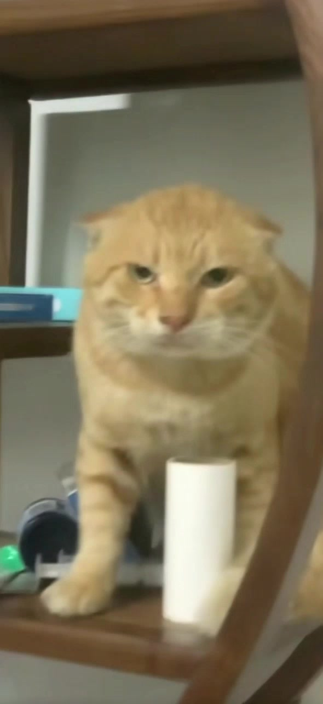 | 3311 | 2026-02-19 |
| [哈基米的一天](https://www.bilibili.com/video/BV1EJZvBzENY) |  | 2423 | 2026-02-19 |
| [【哈基米音乐】：Toxic](https://www.bilibili.com/video/BV1jHZvBME1Q) |  | 1755 | 2026-02-19 |
| [【春节哈基米】又到了新年的才艺展示环节](https://www.bilibili.com/video/BV15tZvBPEs3) |  | 2132 | 2026-02-19 |
| [🐱【哈基米FM】：压迫感の小曲🐱](https://www.bilibili.com/video/BV1zRZyBiENF) | 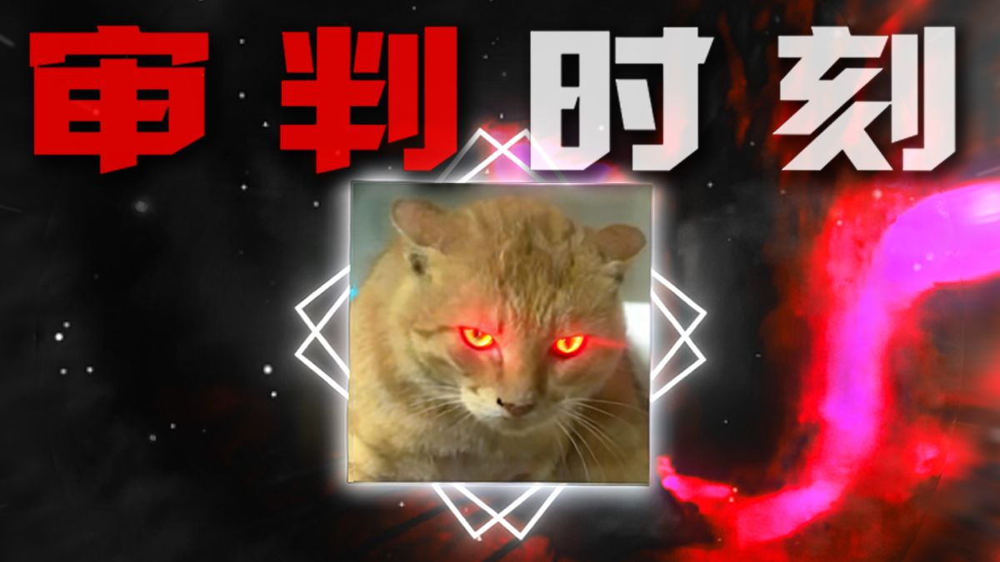 | 2.6万 | 2026-02-19 |
| [🐱shape of hjm🐱](https://www.bilibili.com/video/BV1ywZdBrEL2) |  | 1.2万 | 2026-02-19 |
| [🐱哈基米のLove Story🐱【完整版】](https://www.bilibili.com/video/BV1F1ZbBtE1H) |  | 5912 | 2026-02-19 |
| [哈基米祝你发财！！](https://www.bilibili.com/video/BV1UaZ9BVE4u) |  | 6.0万 | 2026-02-19 |
| [珍贵录像《优雅曼波》【2026哈基米拜年祭单品】](https://www.bilibili.com/video/BV18bZYBREVH) |  | 430 | 2026-02-19 |
| [[哈基米音乐]新！     冰！     力！](https://www.bilibili.com/video/BV1uhZYBWE5C) | 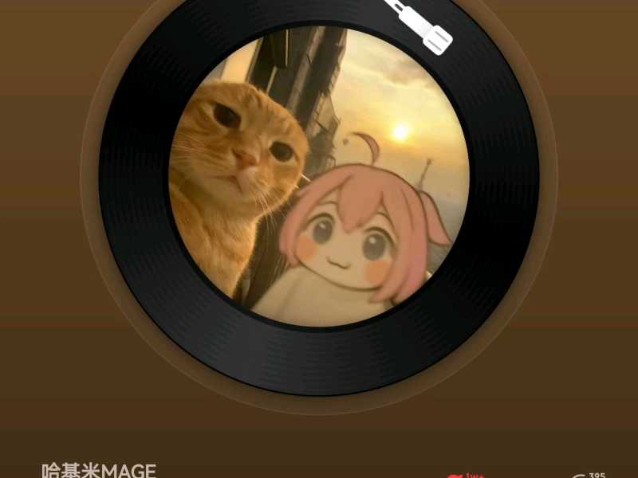 | 29 | 2026-02-19 |
| [【哈基米音乐】纵火之人/惴昏烅躯，但是哈基米](https://www.bilibili.com/video/BV1mQZ8BGEah) |  | 3871 | 2026-02-19 |
| [【Hitech基米】听完跟基米一块飞升基米星 Synthesis.【2026年哈基米拜年基单品】](https://www.bilibili.com/video/BV1LdZ9BoEZm) |  | 5411 | 2026-02-19 |
| [哈基米-哇袄【2026拜年基单品】](https://www.bilibili.com/video/BV1NeZhBCEUf) |  | 4285 | 2026-02-19 |
| [【补档】哈基米：😺假面骑士Drive OP ｜ “耄耋桑，再陪我哈最后一气吧”😺](https://www.bilibili.com/video/BV1CPZdBgES9) |  | 1736 | 2026-02-18 |
| [街舞哈基米一分钟纯享](https://www.bilibili.com/video/BV1GyZXBjEtj) | 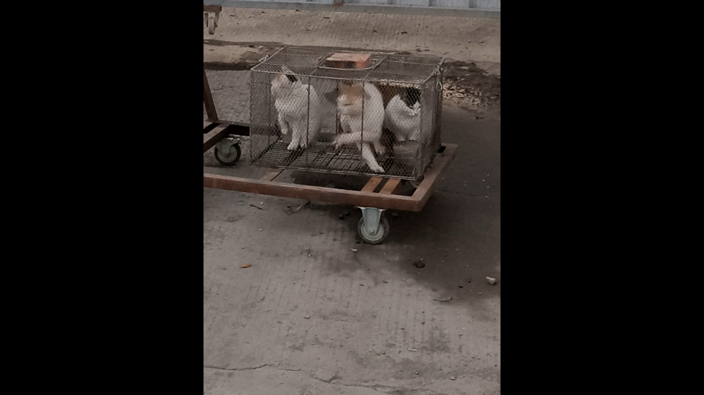 | 3.1万 | 2026-02-18 |
| [【Doro大电影】Doro大战小黑子](https://www.bilibili.com/video/BV1UyZDBqEdz) |  | 1.9万 | 2026-02-18 |
| [「哈基米音乐」耄耋到](https://www.bilibili.com/video/BV19vZDBCEeg) |  | 1036 | 2026-02-18 |
| [拿你点红包不容易啊](https://www.bilibili.com/video/BV1CXZUBWEnS) | 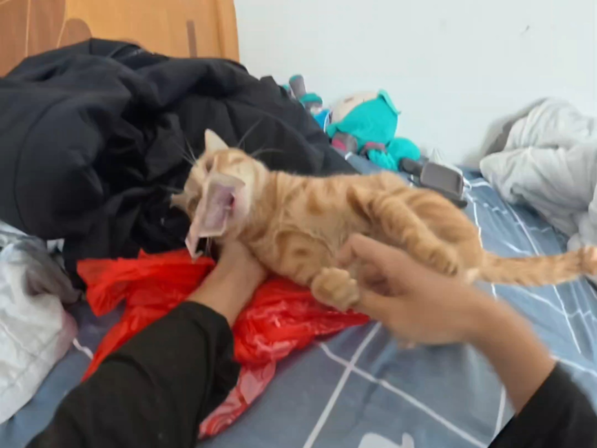 | 12.7万 | 2026-02-18 |
| [“久田泉奈-基米到”](https://www.bilibili.com/video/BV18uZCBEENo) |  | 8266 | 2026-02-18 |
| [ハ目鳗穴 【哈基米拜年基单品】【原曲不使用】](https://www.bilibili.com/video/BV1EBZ1BTEhA) |  | 2311 | 2026-02-18 |
| [【超时空叮咚姬】世界第一基米殿下【哈基米拜年祭单品】](https://www.bilibili.com/video/BV1CVZtB8Eaf) |  | 9784 | 2026-02-17 |
| [雪一样的基米](https://www.bilibili.com/video/BV1fnZ5B7Ehb) | 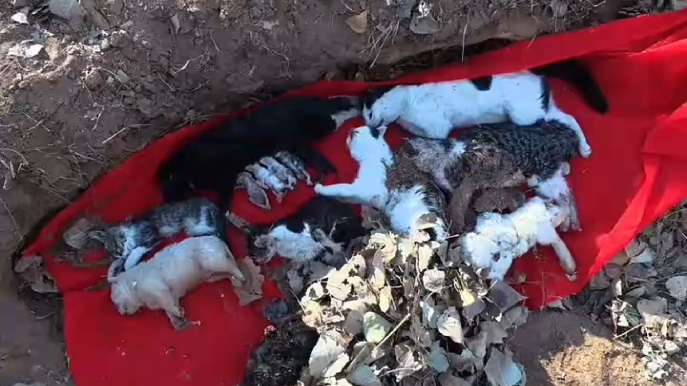 | 1.1万 | 2026-02-17 |
| [基米小学：小猫的新年祝福](https://www.bilibili.com/video/BV14vZMByEMk) | 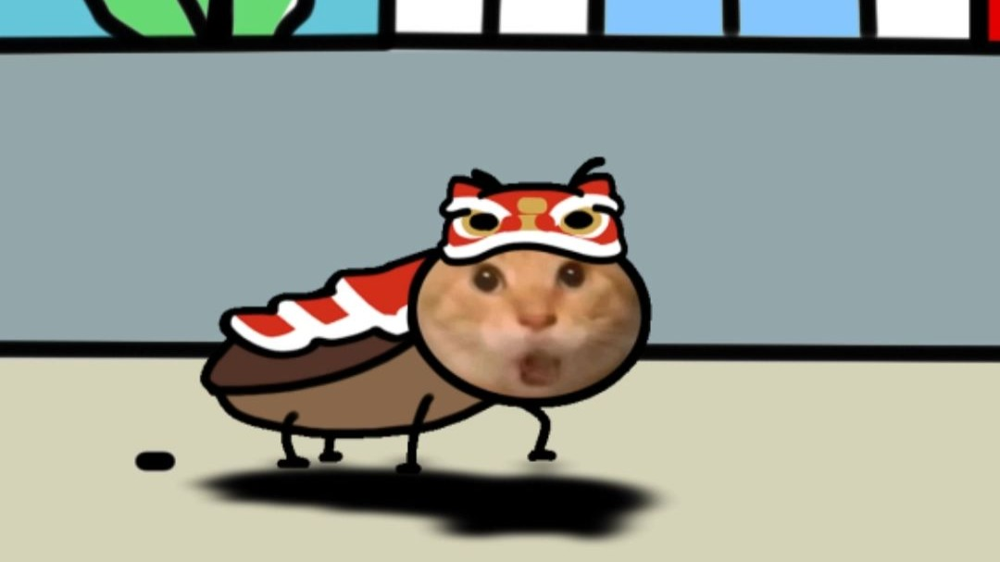 | 5.8万 | 2026-02-16 |
| [《不哈》凡喵修仙传主题曲](https://www.bilibili.com/video/BV1YkZuBZEVc) |  | 5.4万 | 2026-02-16 |
| [《雪地传来了辛巴巴pt.2》](https://www.bilibili.com/video/BV1WLZtBFEcV) |  | 123.8万 | 2026-02-15 |
| [在OPED鉴赏会突然放起哈基米的泛式：来听这个提提神  听完后：好了精神了！【泛式】](https://www.bilibili.com/video/BV1ejZJBxEHb) |  | 4.4万 | 2026-02-14 |
| [⚡ 恭 迎 猫 皇 ⚡ （oiia 猫完整版）](https://www.bilibili.com/video/BV1kecpzHEUr) | 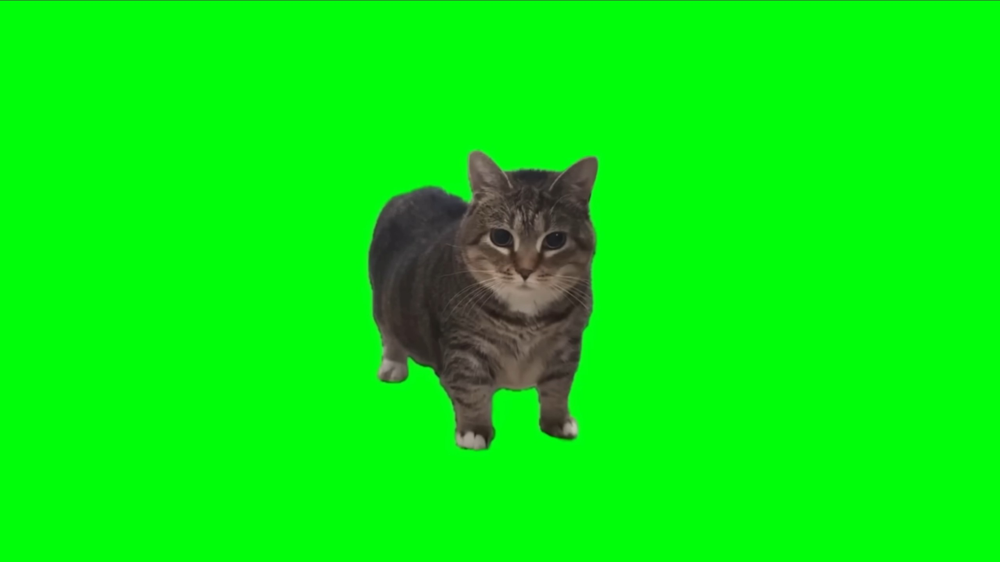 | 920 | 2026-02-14 |
| [循環歌單《伯虎說·哈基米版》](https://www.bilibili.com/video/BV1RCcnzqEKd) | 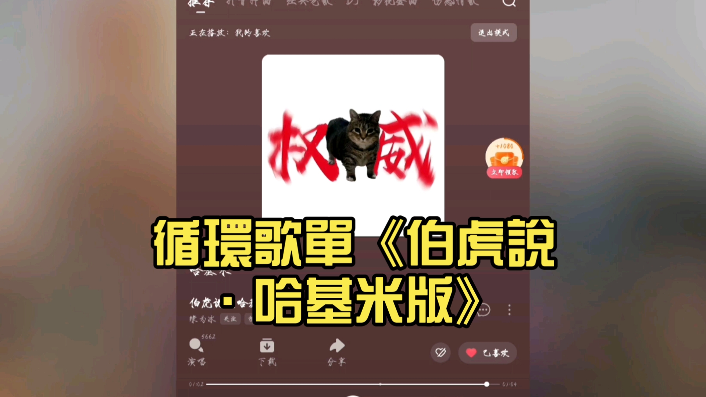 | 130 | 2026-02-13 |
| [死亡不是终点  遗忘才是](https://www.bilibili.com/video/BV1oMciz2E64) | 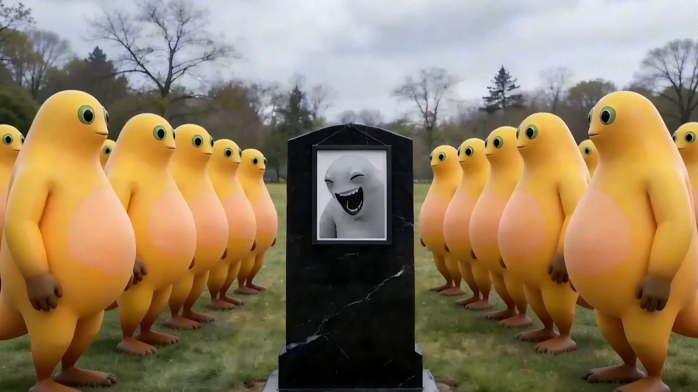 | 129.5万 | 2026-02-12 |
| [循环歌曲｜《基米不想走》“曼波遗憾一大堆，曼波还不想睡”（无损音质）](https://www.bilibili.com/video/BV1tvcMzxE3f) |  | 19.6万 | 2026-02-11 |
| [在我妹家里找到的神人玩具](https://www.bilibili.com/video/BV1DmcTz4EaF) | 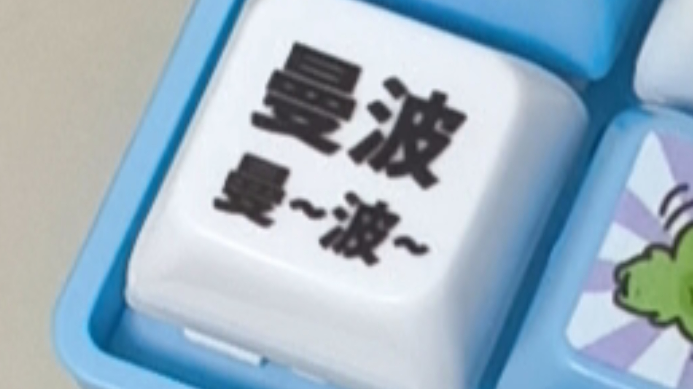 | 2.4万 | 2026-02-09 |
| [我的鸽子很曼妙](https://www.bilibili.com/video/BV1acFHzwE76) |  | 21.2万 | 2026-02-07 |
| [综合质量对比，哈基米一家人VS人牛组](https://www.bilibili.com/video/BV1pyFeznEgw) | 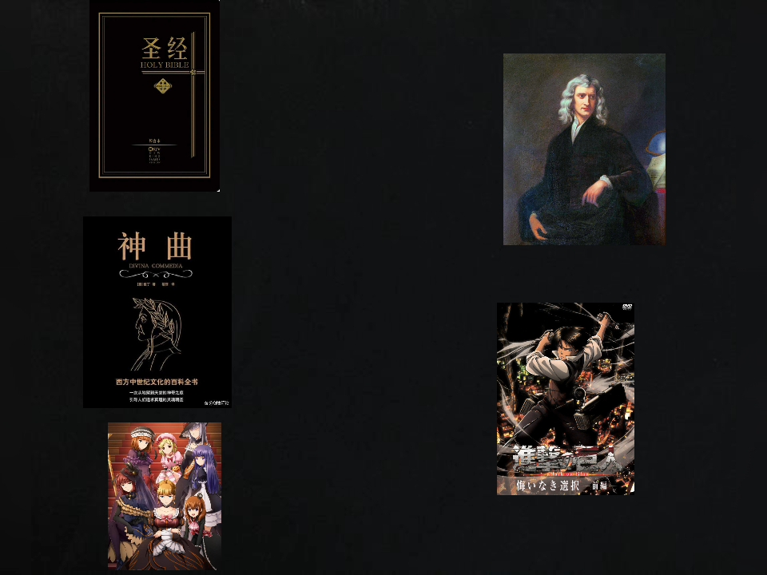 | 356 | 2026-02-05 |
| [⚡丧彪离开了哈基区 从此没人理哈基米⚡](https://www.bilibili.com/video/BV16S6gBcEEx) |  | 181 | 2026-01-27 |
| [凯文打奥托吗？哈基米你这家伙](https://www.bilibili.com/video/BV1nPnDzLEwE) |  | 31 | 2025-09-27 |
| [oiiaioooooiai猫10小时纯享](https://www.bilibili.com/video/BV18HwCevEGb) | 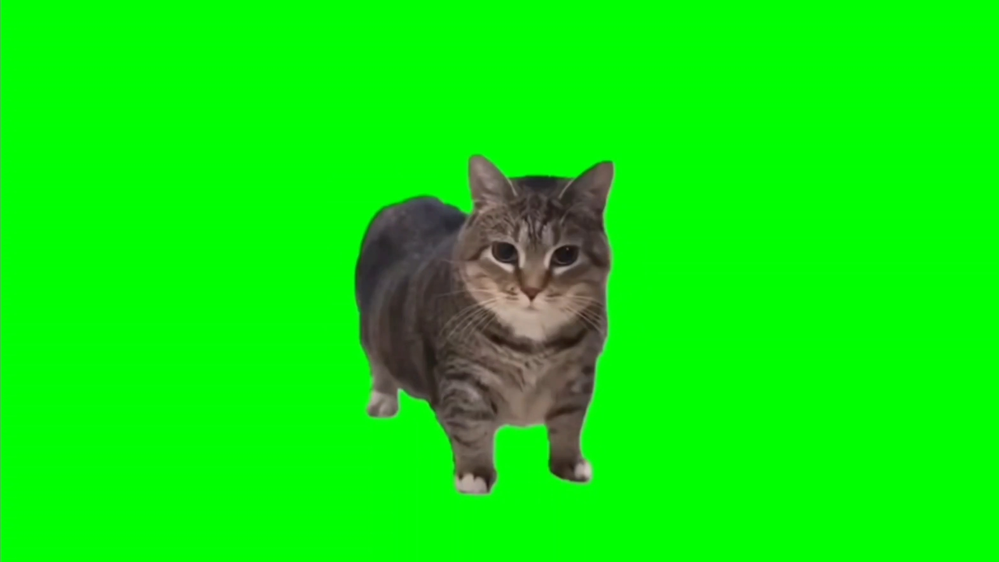 | 60.5万 | 2025-01-19 |
| [谁说这猫胖啊，这猫太棒了~](https://www.bilibili.com/video/BV1oYS1YQEeL) | 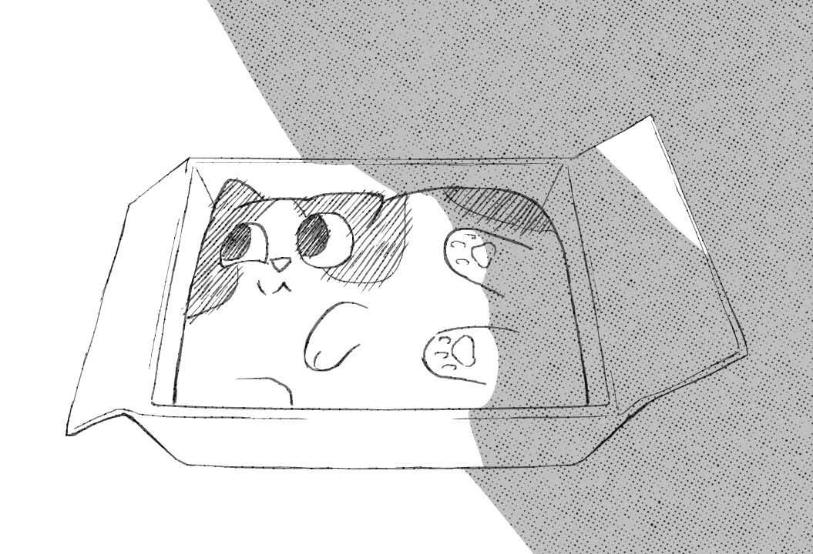 | 132.2万 | 2024-11-03 |
| [哈基米](https://www.bilibili.com/video/BV1MN4y147HN) | 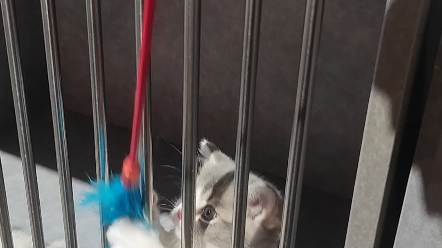 | 128 | 2023-12-20 |
| [哈姆哈基米哈比下欧内的手阿米诺斯](https://www.bilibili.com/video/BV1nN411t7jp) |  | 148 | 2023-10-18 |
| [哈基米](https://www.bilibili.com/video/BV1Wh4y1X7rJ) | 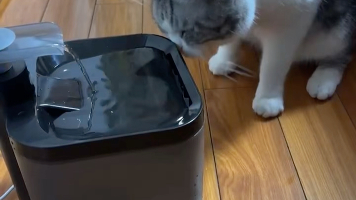 | 357 | 2023-06-14 |

---
*最后更新: 2026-02-21 03:06:29 (自动生成)*
*数据来源: [Bilibili](https://www.bilibili.com)*

## 使用说明

运行以下命令更新视频列表:
```bash
python3 fetch_hajimi_videos.py
```
