# awesome-hajimi
collections of hajimi (哈基米 in Chinese) on the Internet.

## 视频列表 (Video List)

| 视频标题 (Title) | 封面 | 播放量 (Views) | 发布日期 (Date) |
|---|---|---|---|
| [哈基米音乐 原曲《无敌》](https://www.bilibili.com/video/BV1bCquBvERg) |  | 0 | 2026-01-07 |
| [【哈基米音乐】R&amp;B哈气版《给未来的基米》](https://www.bilibili.com/video/BV1KQquBFEB7) |  | 60 | 2026-01-07 |
| [[哈基米音乐]一半白手套龙，一半曼波龙](https://www.bilibili.com/video/BV1wyqAB6Ejt) |  | 71 | 2026-01-07 |
| [哈基米，变身](https://www.bilibili.com/video/BV1dMqMBzEWR) |  | 2 | 2026-01-07 |
| [哈基米，无烟也要过二员。](https://www.bilibili.com/video/BV1XDqKBAEGz) |  | 2 | 2026-01-07 |
| [哈基米](https://www.bilibili.com/video/BV1FcqMBLEN4) |  | 55 | 2026-01-06 |
| [哈基米睡大觉](https://www.bilibili.com/video/BV1F9qNBGEPS) |  | 132 | 2026-01-06 |
| [【天結ひいろ】666这个哈基米我是真想爱了。变成哈基米貌似已经变成喜闻乐见的一环了[飼い猫がくっついてきてお耳をぱくぱくしてきちゃうASMR]互动｜人声｜高音质](https://www.bilibili.com/video/BV1QuqPBpEef) |  | 987 | 2026-01-06 |
| [荒野大基米](https://www.bilibili.com/video/BV1doqABhEDr) | 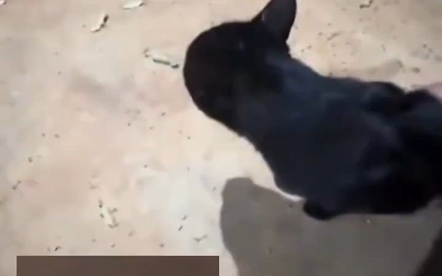 | 436 | 2026-01-06 |
| [哈基米～](https://www.bilibili.com/video/BV1XTqPB9EEw) |  | 22 | 2026-01-06 |
| [基米音乐](https://www.bilibili.com/video/BV1AxqPBkEeD) | 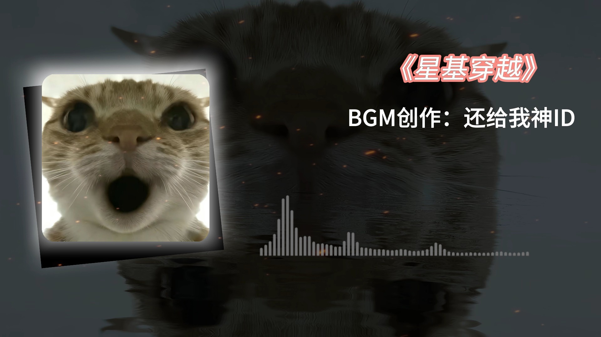 | 7 | 2026-01-06 |
| [基米音乐](https://www.bilibili.com/video/BV1AxqPBkECt) |  | 0 | 2026-01-06 |
| [基米音乐](https://www.bilibili.com/video/BV1CxqPBrE2p) |  | 3 | 2026-01-06 |
| [基米小学：丢手绢创意来源@超级无敌大开门](https://www.bilibili.com/video/BV1yHqPB5EDy) | 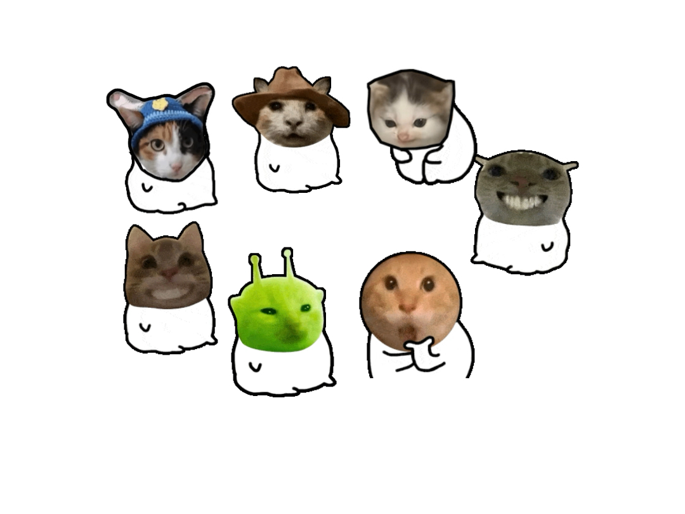 | 652 | 2026-01-06 |
| [发现一头脊背哈基米-27集](https://www.bilibili.com/video/BV1DyitBXE13) |  | 5947 | 2026-01-06 |
| [2025年三大全唐哈基米](https://www.bilibili.com/video/BV1pDiHBsEvB) |  | 123 | 2026-01-06 |
| [哈基米来啦！](https://www.bilibili.com/video/BV1HuqNBGEt5) | 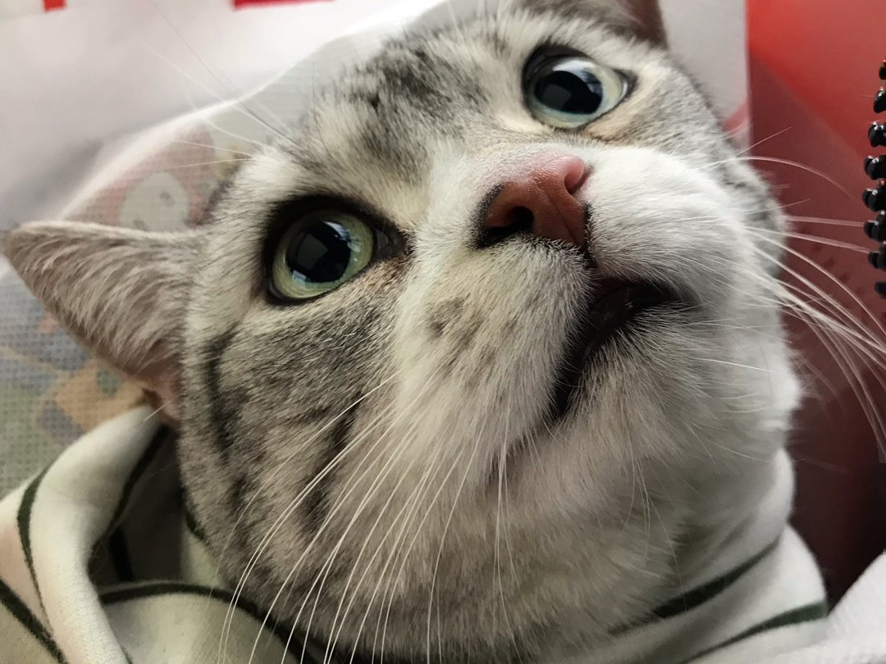 | 19 | 2026-01-06 |
| [哈基米睡觉觉](https://www.bilibili.com/video/BV11PqNB1Epw) |  | 171 | 2026-01-06 |
| [【哈基米音乐】给未来的自己 找一个基米，吸吸基米（给未来的基米）](https://www.bilibili.com/video/BV1yKqNB5E6L) | 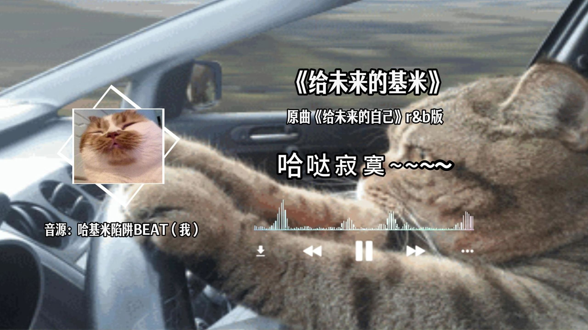 | 159 | 2026-01-06 |
| [视频第20秒，哈基米旋转的向你奔来](https://www.bilibili.com/video/BV19mqPB4ELt) |  | 29 | 2026-01-06 |
| [【2025哈气大赏】年度哈基米音乐盘点](https://www.bilibili.com/video/BV18RqPBQEA7) |  | 1166 | 2026-01-06 |
| [哈基米：🐱《大眠》- 没空再去对谁哈气🐱](https://www.bilibili.com/video/BV189qPBpEkD) |  | 646 | 2026-01-06 |
| [村里的哈基米](https://www.bilibili.com/video/BV189qPBpEQd) |  | 16 | 2026-01-06 |
| [基米TV剧场版18分钟合集，一次看个够](https://www.bilibili.com/video/BV1gKqwBmEjS) |  | 6823 | 2026-01-06 |
| [【哈基米】恐怖的基米特战队（恐怖的基纽特战队）](https://www.bilibili.com/video/BV1DKqwB2E2D) |  | 882 | 2026-01-06 |
| [当图推遇上“哈基米“图推每日五”秒“，同学们，刷起来！](https://www.bilibili.com/video/BV1UGqwBkEuN) |  | 61 | 2026-01-06 |
| [“ 哈 基 仙 怒 斥 众 基 米，哈 基 人 误 入 断 头 台 ”](https://www.bilibili.com/video/BV1doqcBXENB) |  | 4.5万 | 2026-01-06 |
| [（补档）哈基米代码论探讨](https://www.bilibili.com/video/BV1d9qcBREmm) | 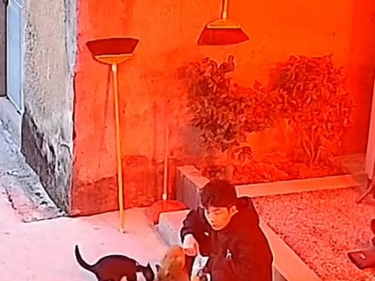 | 1565 | 2026-01-06 |
| [【槟榔TV】湖南本地哈基米](https://www.bilibili.com/video/BV1ztqwBYEo4) |  | 1617 | 2026-01-06 |
| [哈基米南北绿豆](https://www.bilibili.com/video/BV1F8qwBwE85) |  | 457 | 2026-01-06 |
| [黄金船看《哈基米猜猜猜》](https://www.bilibili.com/video/BV1o8qFBpEFe) |  | 10.3万 | 2026-01-06 |
| [哈基米只有三个字，居然能衍生出这么多神曲，全听过的可以把手机撇了](https://www.bilibili.com/video/BV1xoqwBkERR) |  | 323 | 2026-01-06 |
| [🐱仿生曼波会梦见电子哈基米吗？🐱](https://www.bilibili.com/video/BV1pKqABiEgq) |  | 1487 | 2026-01-06 |
| [哈基米+曼波+耄耋：顶流抽象表情包的发家史](https://www.bilibili.com/video/BV1hmqwBUEvf) |  | 1295 | 2026-01-06 |
| [年度热梗“哈基米”的背后，是男性文娱的挣扎与反抗？！！【眼选吃瓜#32】](https://www.bilibili.com/video/BV1LjqABfEGy) |  | 2.4万 | 2026-01-06 |
| [哈基宗日常](https://www.bilibili.com/video/BV1YCqwBHE5o) |  | 3963 | 2026-01-06 |
| [追加砍爆哈基米 新卡包追加DDD巨石补强登录《游戏王MD》](https://www.bilibili.com/video/BV17GqABaErY) |  | 1.6万 | 2026-01-06 |
| [小学生也要听《哈基米》](https://www.bilibili.com/video/BV1vhqFBQECo) |  | 46 | 2026-01-06 |
| [正在大口嚼的哈基米](https://www.bilibili.com/video/BV1mSqFBzEPW) |  | 150 | 2026-01-06 |
| [哈基米](https://www.bilibili.com/video/BV1VnqcBEEST) |  | 6063 | 2026-01-06 |
| [666哈基米直接飞升汪星](https://www.bilibili.com/video/BV1dXqcBxE2j) | 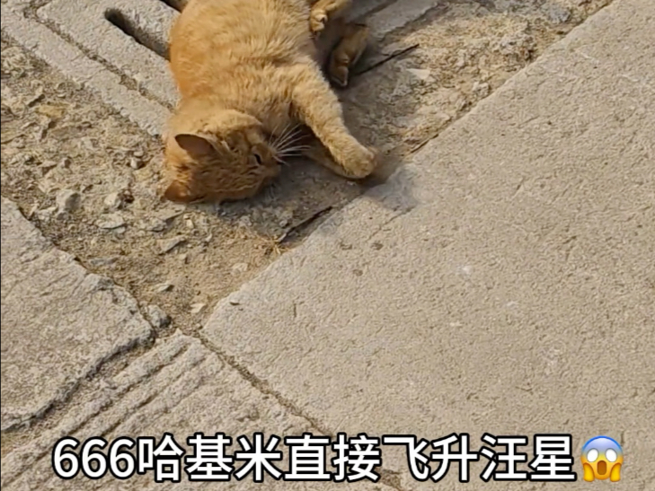 | 1.0万 | 2026-01-06 |
| [你把我猫吹亖了！](https://www.bilibili.com/video/BV1axibBRELv) |  | 81.8万 | 2026-01-06 |
| [窝里横的嘬](https://www.bilibili.com/video/BV1briZBTEDk) | 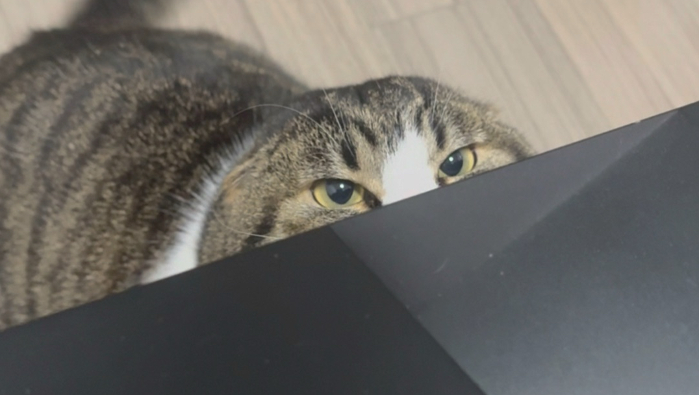 | 5.1万 | 2026-01-06 |
| [【哈基米】雷基-RAICHIMi](https://www.bilibili.com/video/BV1hziZBBEcg) |  | 725 | 2026-01-06 |
| [哈基米](https://www.bilibili.com/video/BV16wifBXE6e) |  | 65 | 2026-01-06 |
| [基米的生活苦啊！](https://www.bilibili.com/video/BV1jKioBGEfH) | 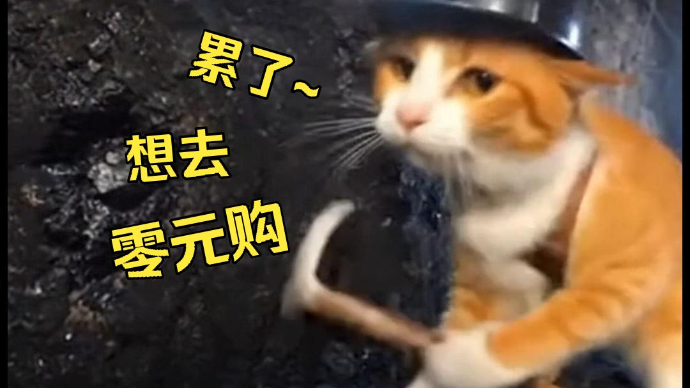 | 8 | 2026-01-06 |
| [循环歌单｜【#тамада】｜“当我和好兄弟见面时belike【智商下降の小曲】”](https://www.bilibili.com/video/BV1tUixBGEvG) |  | 74.3万 | 2026-01-06 |
| [哈基米一分钟](https://www.bilibili.com/video/BV1gjioBvEFw) |  | 123 | 2026-01-05 |
| [谁是最老的吴？](https://www.bilibili.com/video/BV1AViZB4Eqb) |  | 6999 | 2026-01-05 |
| [哈基米这个冲刺键改成空格键](https://www.bilibili.com/video/BV1BpiZBJEG5) |  | 1.6万 | 2026-01-05 |
| [哈基米汤秋千](https://www.bilibili.com/video/BV16WitBTEDc) |  | 563 | 2026-01-05 |
| [【重制版】基米这个跑酷大神](https://www.bilibili.com/video/BV1PnitBgE4N) |  | 3062 | 2026-01-05 |
| [一起呐喊哦吗吉利！（基米之歌）](https://www.bilibili.com/video/BV1LEibB8EPY) |  | 4230 | 2026-01-05 |
| [没见过这么逆天的视频了](https://www.bilibili.com/video/BV1HAibB6EgP) |  | 44.5万 | 2026-01-05 |
| [哈基米の小曲](https://www.bilibili.com/video/BV1b1ixB5EA2) | 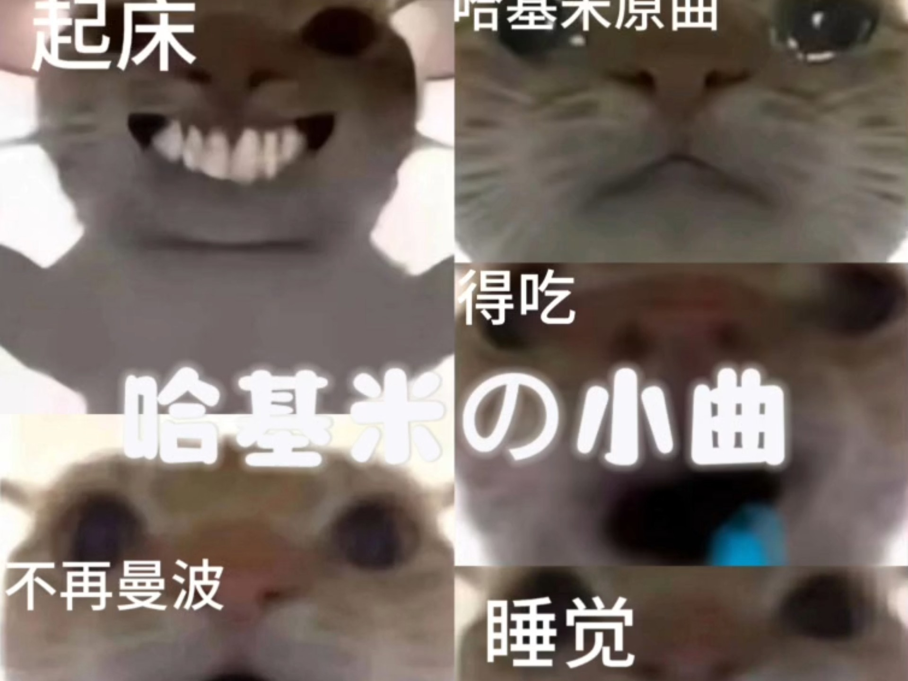 | 1081 | 2026-01-05 |
| [若没有哈基米，也许还在平凡 - 《只要基米》](https://www.bilibili.com/video/BV1bCixB1EnF) |  | 182 | 2026-01-05 |
| [哈基米吵架三分钟](https://www.bilibili.com/video/BV1YEi4BQEdi) |  | 1908 | 2026-01-05 |
| [dy博主真的啊在线训野老鼠片段](https://www.bilibili.com/video/BV1GEi4BQENr) | 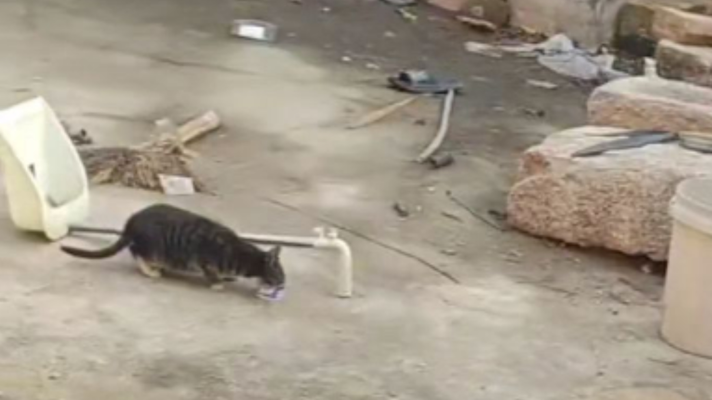 | 1.1万 | 2026-01-05 |
| [找基咪～](https://www.bilibili.com/video/BV1Tti4B1EyK) |  | 1453 | 2026-01-05 |
| [干嘛猫的吃播（美味的饺子让咪开心！）](https://www.bilibili.com/video/BV17Ui4BwEtQ) |  | 17.3万 | 2026-01-05 |
| [科比整治神人乘客](https://www.bilibili.com/video/BV1AoiWBFEGL) |  | 8.7万 | 2026-01-05 |
| [猫儿这个街舞](https://www.bilibili.com/video/BV1ncisBxEwz) | 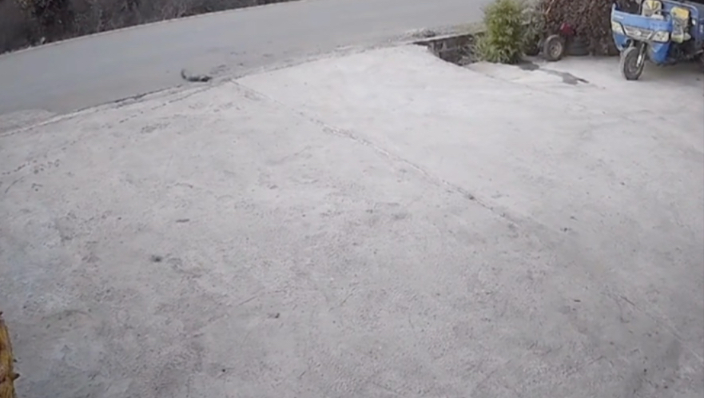 | 84 | 2026-01-05 |
| [基米这个冬泳](https://www.bilibili.com/video/BV1gnisBkEiE) | 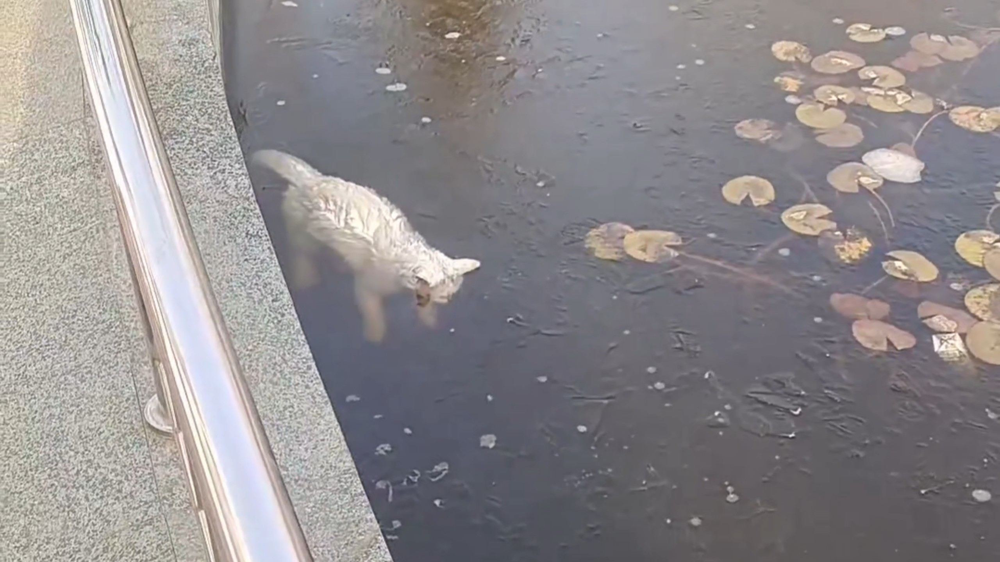 | 2.9万 | 2026-01-05 |
| [哈基米南北绿豆](https://www.bilibili.com/video/BV1T4isBBEJ1) | 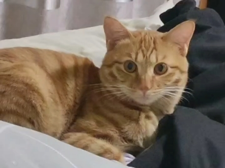 | 138 | 2026-01-05 |
| [【真栗】《蓝莲哈》哈基米南北绿豆！](https://www.bilibili.com/video/BV1atiJBaEsq) |  | 787 | 2026-01-05 |
| [25年全网爆火哈基米，南北绿豆四个字还是太狠了。](https://www.bilibili.com/video/BV1UciWBiE97) |  | 272 | 2026-01-05 |
| [《动物迷惑行为大赏290》](https://www.bilibili.com/video/BV1BRi7BKEnX) |  | 18.9万 | 2026-01-05 |
| [哈！基！米！](https://www.bilibili.com/video/BV18si7BdEv7) |  | 923 | 2026-01-04 |
| [为什么猫咪遇到危险时不直接逃跑而是哈气？](https://www.bilibili.com/video/BV1VwiEBhEo6) | 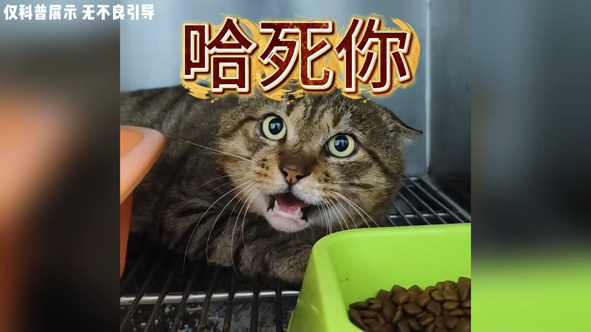 | 30.8万 | 2026-01-04 |
| [哈基米维修电线开启脊背龙形态](https://www.bilibili.com/video/BV1MuiEBdEUe) | 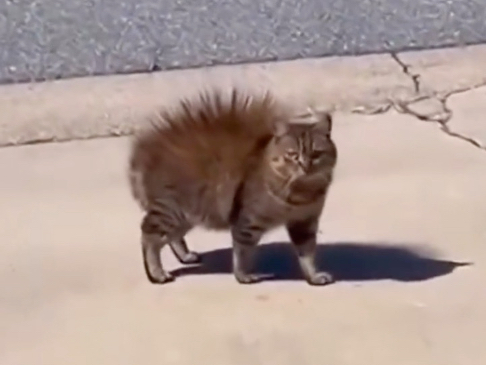 | 1.1万 | 2026-01-04 |
| [【2025年终盘点】中国在海外十大最火的相关内容（事件）&amp;ep.1](https://www.bilibili.com/video/BV1EUi7BgERC) |  | 22.0万 | 2026-01-04 |
| [哦，我可爱的哈基米](https://www.bilibili.com/video/BV1FhiEBrEYM) |  | 104 | 2026-01-04 |
| [【整活】给日本朋友讲解神曼波](https://www.bilibili.com/video/BV1TLiEBQERk) |  | 463 | 2026-01-04 |
| [猫妈妈：你都已经明目张胆抢劫了，还小心翼翼说话，装啥呢](https://www.bilibili.com/video/BV1WjijBVEyz) | 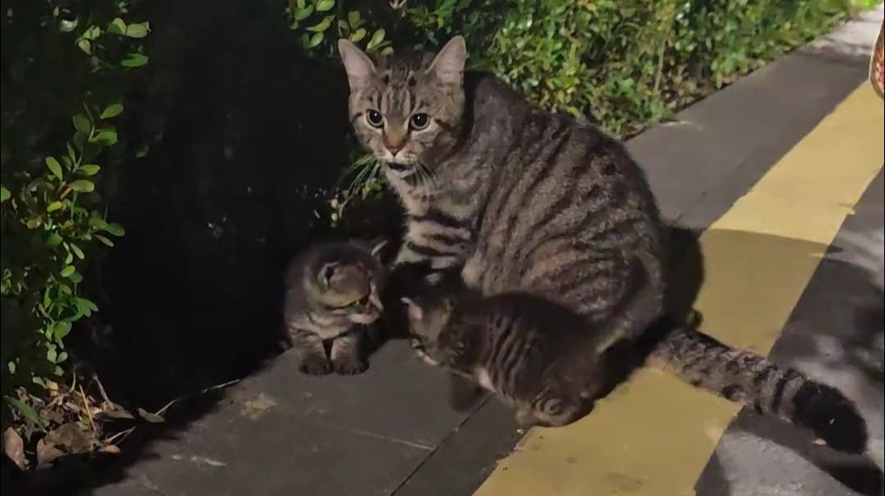 | 27.0万 | 2026-01-04 |
| [不小心把爸爸烤了](https://www.bilibili.com/video/BV12zikBpEg6) |  | 502.9万 | 2026-01-04 |
| [每日一笑—哈基米战斗模式。](https://www.bilibili.com/video/BV1K9iqBBEEE) |  | 226 | 2026-01-03 |
| [前驱哈基米](https://www.bilibili.com/video/BV1cdivBbEqP) |  | 2420 | 2026-01-03 |
| [鼠鼠：悠悠基米，何哈于我～](https://www.bilibili.com/video/BV1WTiYBWERY) |  | 1006 | 2026-01-03 |
| [谁来救救哈基米啊！](https://www.bilibili.com/video/BV1KBihBsELw) | 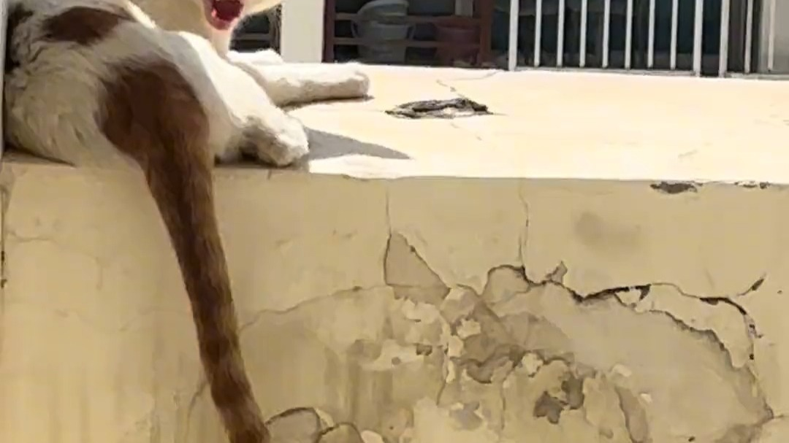 | 1388 | 2026-01-03 |
| [哈基孩幼儿园打闹 不慎掉入滚烫热粥](https://www.bilibili.com/video/BV1gqicBCEc3) |  | 10.1万 | 2026-01-02 |
| [哈基米南北绿豆浆到了](https://www.bilibili.com/video/BV1XgiFBGENY) | 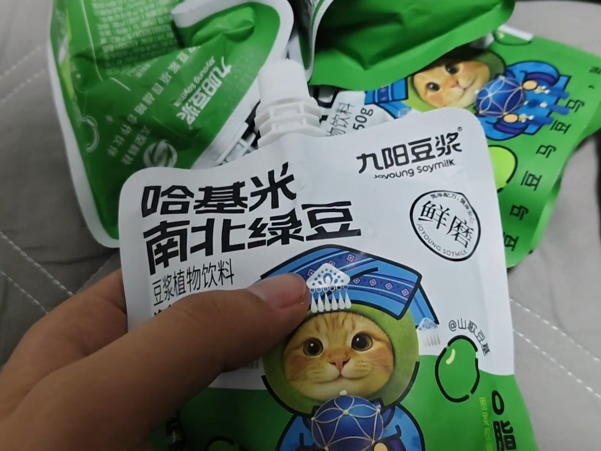 | 62 | 2026-01-02 |
| [哈基米](https://www.bilibili.com/video/BV1g5iFB6Esb) |  | 259 | 2026-01-02 |
| [江浙沪有自己的哈基米](https://www.bilibili.com/video/BV1X3iFBrEPR) | 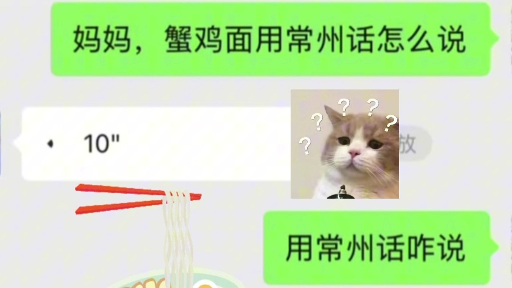 | 24.5万 | 2026-01-02 |
| [2:23AM🎵叮咚鸡之放松小曲🎵](https://www.bilibili.com/video/BV1fpi5B8Eg8) | 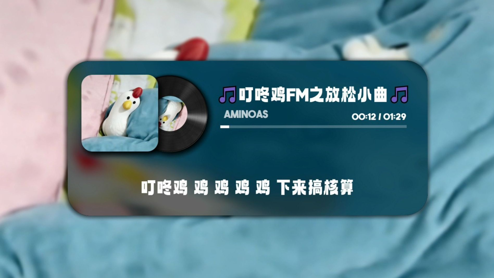 | 6019 | 2026-01-01 |
| [关于这只该死的臭猫，一直对着我家人哈气被我驱赶这件事。](https://www.bilibili.com/video/BV1Tui5BgE47) |  | 883 | 2026-01-01 |
| [我证明了《哈基米南北绿豆的平方等于阿西哈亚库奶龙的倒数》](https://www.bilibili.com/video/BV1TNiGBNE4P) |  | 607 | 2025-12-31 |
| [哈吉米南北绿豆阿西嘎哈雅库奶龙](https://www.bilibili.com/video/BV1JGigBQE6S) | 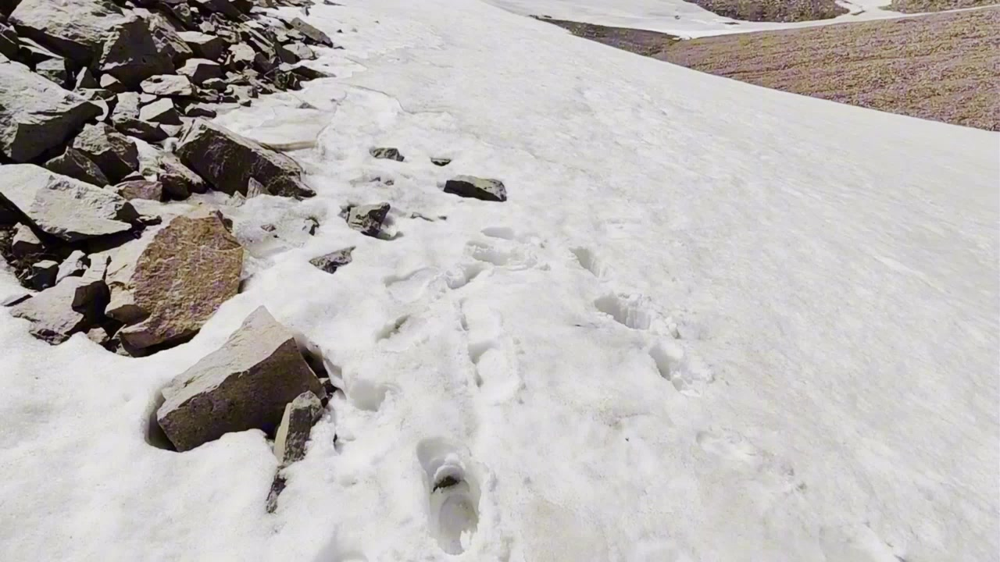 | 149 | 2025-12-31 |
| [我的悲伤是哈基米做的](https://www.bilibili.com/video/BV1RcvvBGEWJ) |  | 4385 | 2025-12-30 |
| [【哈基米音乐】哈基米背媳妇（猪八戒背媳妇）](https://www.bilibili.com/video/BV1VgvxBLEAg) |  | 392 | 2025-12-29 |
| [日本街头播放哈基米音乐的神人猫咖](https://www.bilibili.com/video/BV13Bv6BpE5t) |  | 999 | 2025-12-28 |
| [【梗百科】萝卜纸巾猫是啥梗？真棒！](https://www.bilibili.com/video/BV1Q7B5BDEKU) |  | 82.5万 | 2025-12-24 |
| [⚡️印度曼波哈基米⚡️](https://www.bilibili.com/video/BV13BBPBtEzJ) |  | 1102 | 2025-12-23 |
| [串烧哈基米：安静、蜗牛、世界末日](https://www.bilibili.com/video/BV1kyq5BuE1K) |  | 248 | 2025-12-17 |
| [青春哈气手册【基米电台 Day6】](https://www.bilibili.com/video/BV1o4YqzNEpT) |  | 11.7万 | 2025-08-17 |
| [哈基米这个睡的安详](https://www.bilibili.com/video/BV1D4bBzJEX7) |  | 56.5万 | 2025-08-14 |
| [R&amp;B哈基米：飞基场的10:30【哈基杯应援】](https://www.bilibili.com/video/BV1LWbhzuE95) |  | 3.0万 | 2025-08-13 |
| [⚡基米没茅台⚡全家没more time⚡用五秒夺走你的哈气](https://www.bilibili.com/video/BV1NHKJzaEVw) |  | 42.5万 | 2025-06-25 |
| [哈基米：差一步](https://www.bilibili.com/video/BV1J6ZqYWEFW) |  | 25.5万 | 2025-03-30 |
| [《得吃の小曲》《78の小曲》《舔包の小曲》《鼠鼠の小曲》寂寞的人伤心的歌](https://www.bilibili.com/video/BV1eRrfYvEKp) | 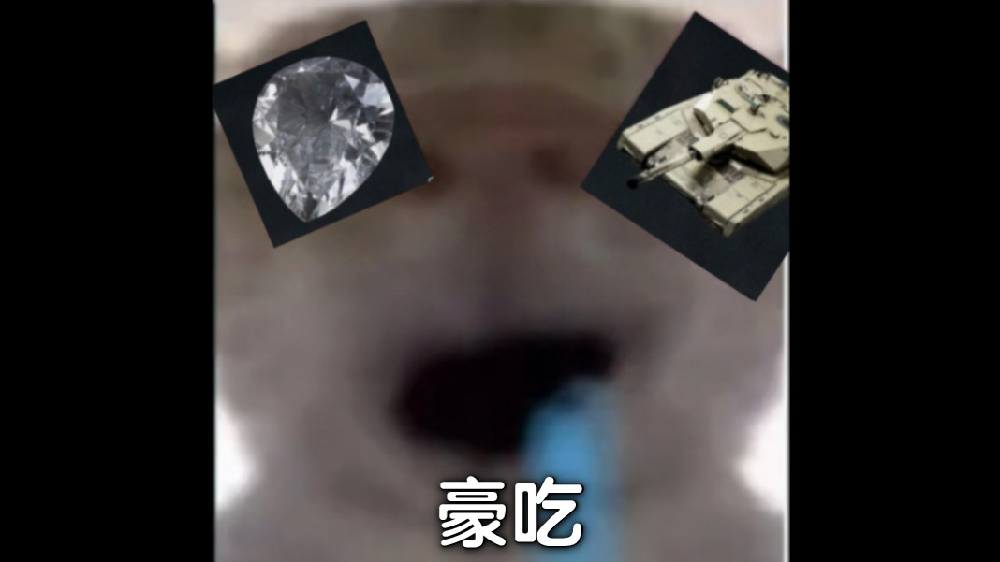 | 360.0万 | 2024-12-18 |
| [有一个哈基米前来买瓜](https://www.bilibili.com/video/BV1Bm421E7w2) |  | 41.8万 | 2024-04-05 |

---
*最后更新: 2026-01-07 02:50:19 (自动生成)*
*数据来源: [Bilibili](https://www.bilibili.com)*

## 使用说明

运行以下命令更新视频列表:
```bash
python3 fetch_hajimi_videos.py
```
