# awesome-hajimi
collections of hajimi (哈基米 in Chinese) on the Internet.

## 视频列表 (Video List)

| 视频标题 (Title) | 封面 | 播放量 (Views) | 发布日期 (Date) |
|---|---|---|---|
| [九阳推出哈基米南北绿豆浆又让一些群体破防哈气了！](https://www.bilibili.com/video/BV1gFCxBhESs) |  | 537 | 2025-11-13 |
| [哈基米多男的绿豆哈吉哈哈雅库奶浓](https://www.bilibili.com/video/BV187CpBHEVx) |  | 1 | 2025-11-13 |
| [哈基米牌叮咚鸡金黄酥脆，鲜嫩多汁！](https://www.bilibili.com/video/BV1qwCpBaE3n) |  | 3 | 2025-11-13 |
| [哈基米探索雨姐大福🤓](https://www.bilibili.com/video/BV1PNCHBrEYr) |  | 118 | 2025-11-13 |
| [哈基米小曲淘汰赛第三期（66个！老祖险些陨落）](https://www.bilibili.com/video/BV1eMCpBtEJw) | 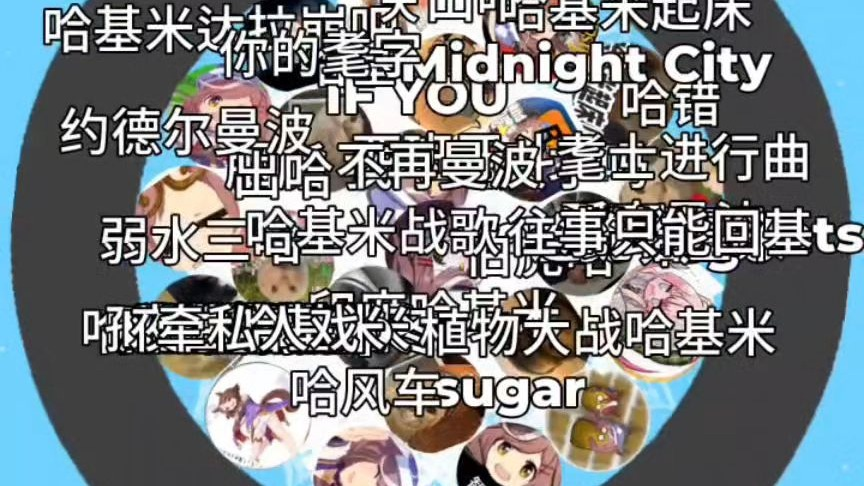 | 605 | 2025-11-13 |
| [哈基米哦那没路躲](https://www.bilibili.com/video/BV1QuCpBoE9r) |  | 99 | 2025-11-13 |
| [神人九阳哈基米南北绿豆主播带头唱](https://www.bilibili.com/video/BV1JzCpBTEg7) |  | 17 | 2025-11-13 |
| [哈基米](https://www.bilibili.com/video/BV1VTCpBFEBU) | 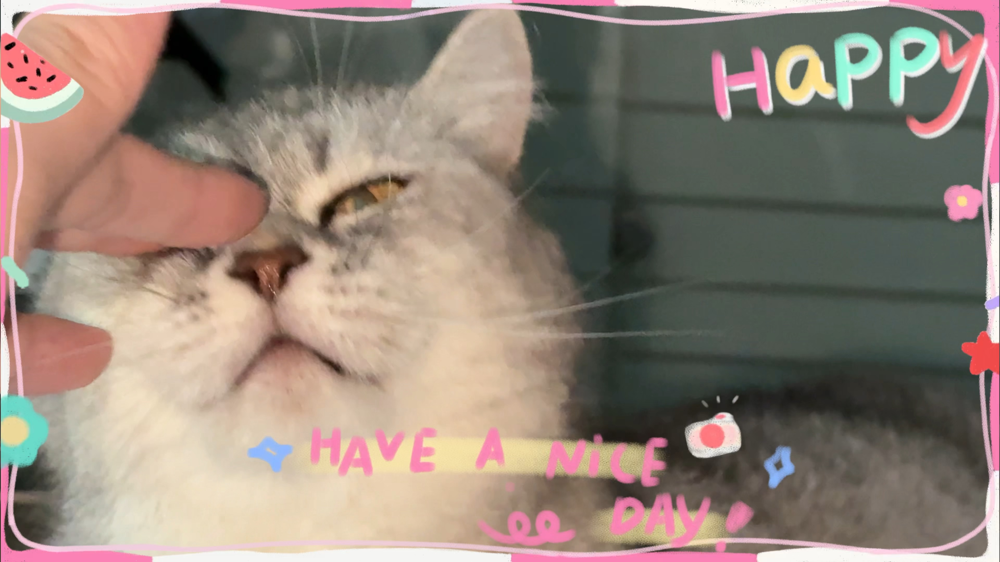 | 3 | 2025-11-13 |
| [碧蓝幻想千（哈基米）终突试用](https://www.bilibili.com/video/BV17kCpBNE4g) |  | 262 | 2025-11-13 |
| [哈基米又南北路堵😡](https://www.bilibili.com/video/BV1jkCpBNEc7) |  | 16 | 2025-11-13 |
| [哈基米又跌16%，原铁绝竟然没一款到去年流水的60%！](https://www.bilibili.com/video/BV1EvCnBwEg5) | 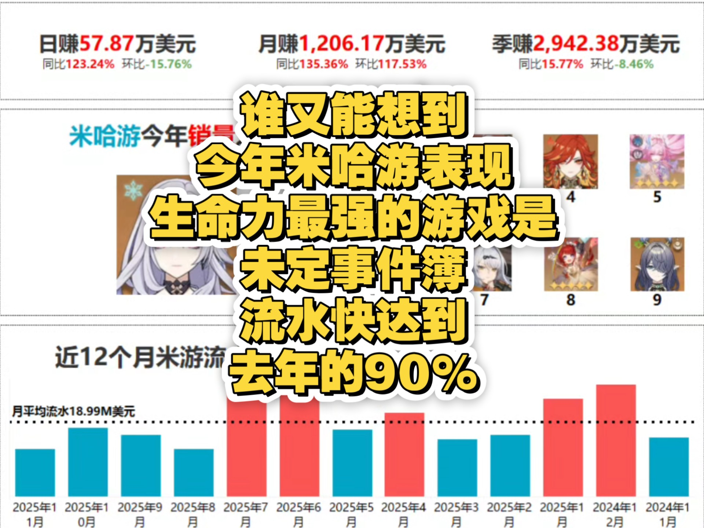 | 471 | 2025-11-12 |
| [不是AI！真的是哈基米南北绿豆！](https://www.bilibili.com/video/BV1uXCnBSEhF) |  | 414 | 2025-11-12 |
| [哈基米 Drop! (hakimi)](https://www.bilibili.com/video/BV1tRCEB6EV3) |  | 411 | 2025-11-12 |
| [《汽曼波》——哈基米音乐](https://www.bilibili.com/video/BV1WACJBNE6e) |  | 63 | 2025-11-12 |
| [【边狱巴士】超大闪避点数吓哭拇指小哈基米！](https://www.bilibili.com/video/BV1FKCJBAEQc) |  | 687 | 2025-11-12 |
| [神人九阳哈基米南北绿豆浆 已下单](https://www.bilibili.com/video/BV1HPCJBeE2m) |  | 907 | 2025-11-12 |
| [【哈基米音乐】丁香哈（丁香花）](https://www.bilibili.com/video/BV1QWCJBSEzP) |  | 1506 | 2025-11-12 |
| [基米这个舒适](https://www.bilibili.com/video/BV13bCJB7EKa) | 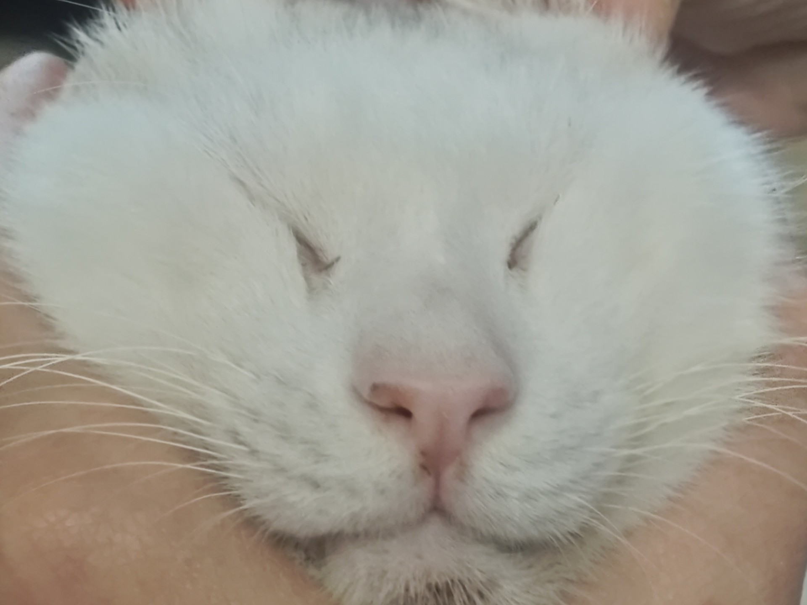 | 31 | 2025-11-12 |
| [《we don&#x27;t talk any 曼波》「不言曼波」- 哈基米](https://www.bilibili.com/video/BV1D4CJBmEjg) |  | 158 | 2025-11-12 |
| [【阿梓】老头发1000红色SC让看&quot;九阳哈基米南北绿豆浆&quot; D老头你是九阳的吗？](https://www.bilibili.com/video/BV1ZVCJB4EcM) |  | 4396 | 2025-11-12 |
| [最新上市哈基米南北绿豆](https://www.bilibili.com/video/BV1E5CJBoE3h) |  | 29 | 2025-11-12 |
| [【循环歌单】｜《起床小曲-哈基米版》纯享版-面点海 哈基米么南北绿豆](https://www.bilibili.com/video/BV16mCJBPERS) | 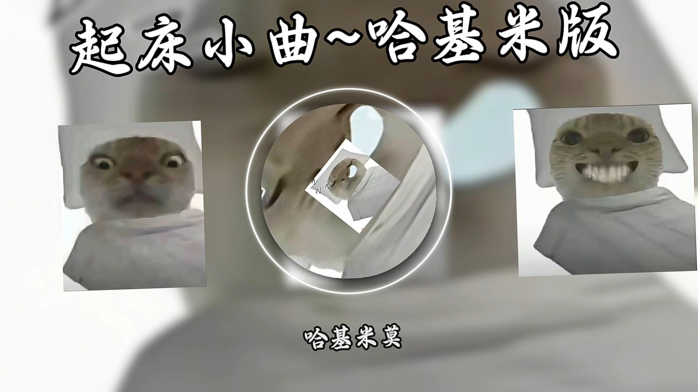 | 152 | 2025-11-12 |
| [今天捡了只哈基米，这是什么牌子的？](https://www.bilibili.com/video/BV1z9CJBFEsv) | 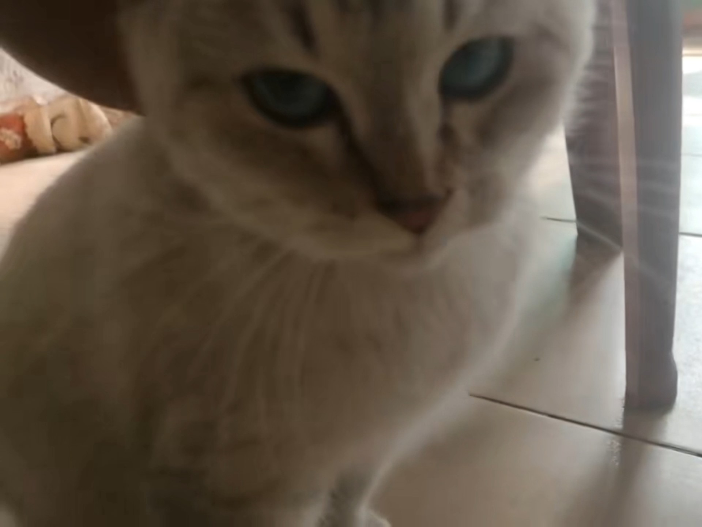 | 55 | 2025-11-12 |
| [哈基米难没路躲](https://www.bilibili.com/video/BV1Z9CJBFE4z) | 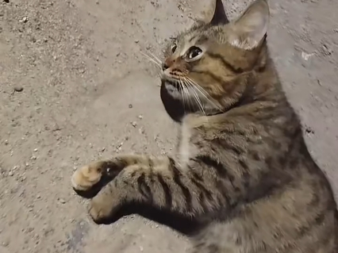 | 111 | 2025-11-12 |
| [100℃开水烫哈基米](https://www.bilibili.com/video/BV1BRCJBbECu) | 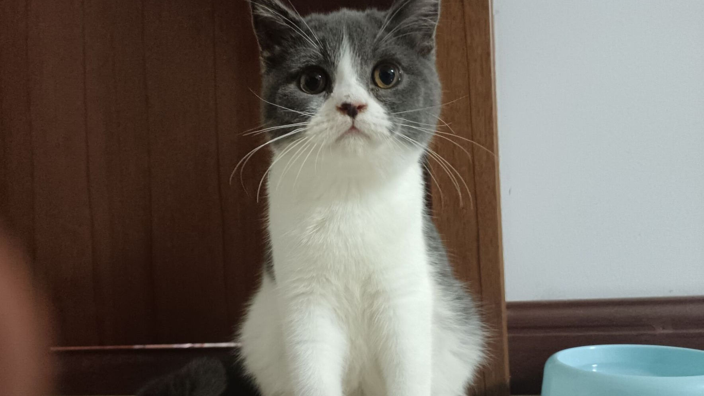 | 338 | 2025-11-12 |
| [外婆家的哈基米，时隔半年都成啥了](https://www.bilibili.com/video/BV1TiCJBkES5) | 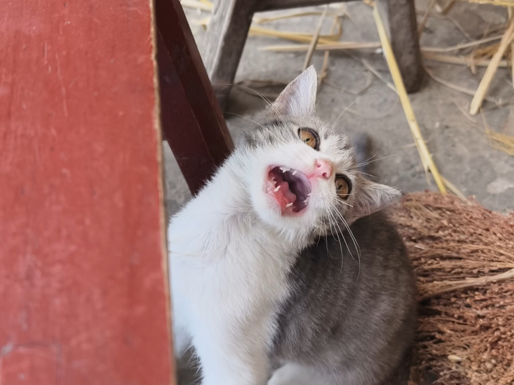 | 366 | 2025-11-12 |
| [如果你们觉得逼死一个1岁的近亲繁育+双向老吴障碍＋棘背龙形态＋炸毛+圆头飞机耳+应激哈气＋随地跳街舞的哈基米+猫言猫语很好玩的话，你们可以继续😢](https://www.bilibili.com/video/BV1yrCJBMEwU) |  | 31 | 2025-11-12 |
| [九阳豆浆直播间变成哈基米演唱会了](https://www.bilibili.com/video/BV1PkCJBBEYU) | 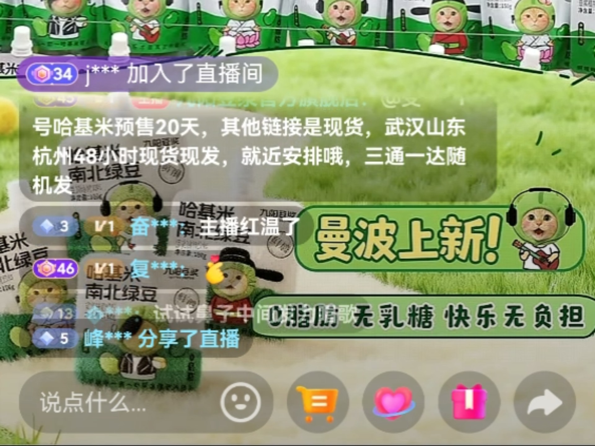 | 7887 | 2025-11-12 |
| [捡到猫131天 偷猫粮就爆炒哈基米](https://www.bilibili.com/video/BV1x7CnBCE8m) |  | 1.3万 | 2025-11-12 |
| [⚡哈 基 米 南 北 洋 大 学 校 歌⚡](https://www.bilibili.com/video/BV1dcCnBsEEP) | 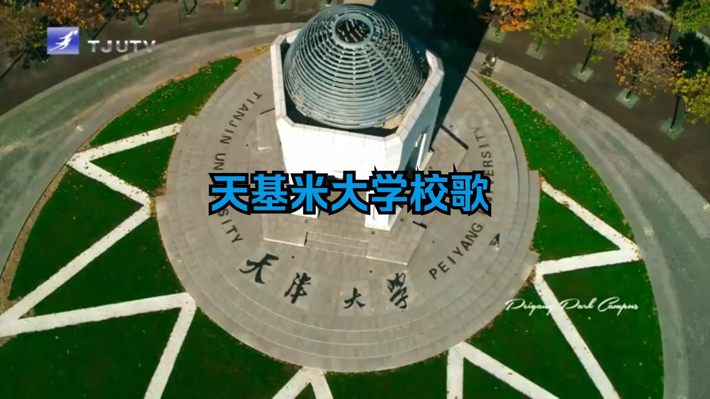 | 457 | 2025-11-12 |
| [【自用】在导师课上放期中作业-软件分享，不小心放了12分钟哈基米](https://www.bilibili.com/video/BV1aNCnBQEri) | 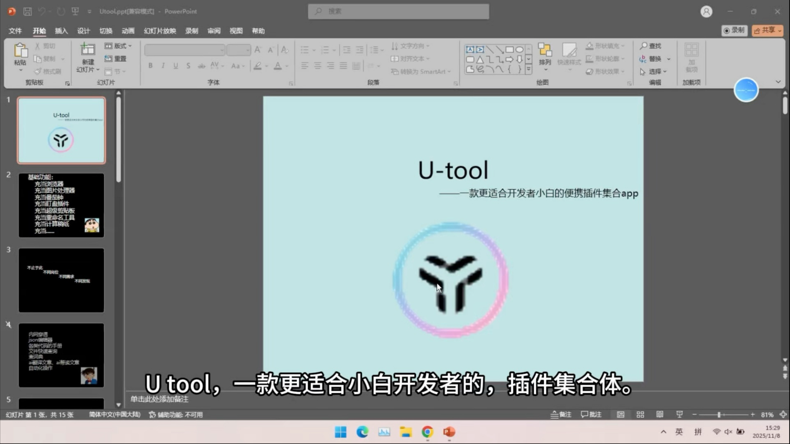 | 27 | 2025-11-12 |
| [一口气听完三十首哈基米合集，全听过的网瘾不小呀](https://www.bilibili.com/video/BV1iDCLB1Eek) | 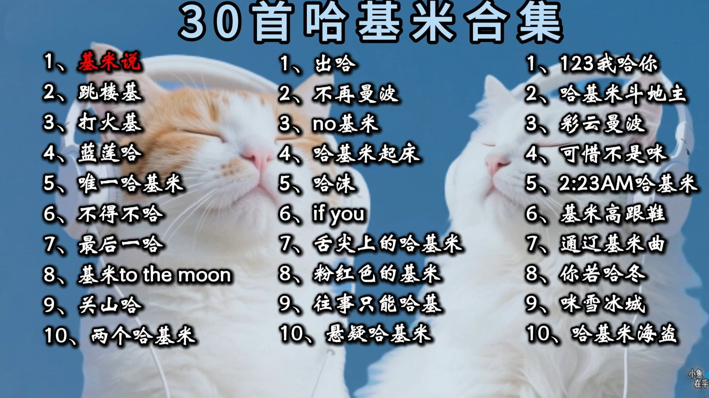 | 442 | 2025-11-12 |
| [本视频含有众多哈基米元素请慎重食用](https://www.bilibili.com/video/BV1gpC7BCEQG) |  | 421 | 2025-11-12 |
| [【各唱各】史诗级哈基米？！8个人各唱各的能否完成《神曼波》？](https://www.bilibili.com/video/BV1WLCjBbEte) |  | 2869 | 2025-11-12 |
| [哈基米：DESTRUCTION 3,2,1](https://www.bilibili.com/video/BV1fDC7BWE4P) |  | 1237 | 2025-11-12 |
| [大东彦看youngx用哈基米AK“卧槽玷污这个皮肤好恶心啊！”回应为什么这么恨youngx](https://www.bilibili.com/video/BV1UhC7BTEe3) |  | 4.1万 | 2025-11-12 |
| [办公室邪修大赛哈基米合集](https://www.bilibili.com/video/BV1RBCEBHE8A) |  | 9898 | 2025-11-12 |
| [《哈基宝贝》 完整版](https://www.bilibili.com/video/BV1xvC7BvE8y) |  | 4.6万 | 2025-11-12 |
| [不再曼波](https://www.bilibili.com/video/BV1yqC7BAEft) |  | 8.2万 | 2025-11-12 |
| [捕捉母流浪猫姐妹（后面有哈基汪彩蛋）](https://www.bilibili.com/video/BV1hTCEBkExB) | 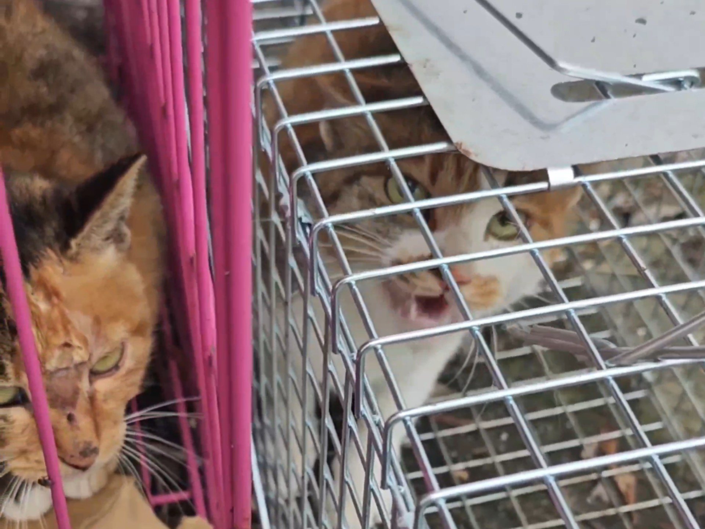 | 810 | 2025-11-12 |
| [哈基米占了全网97.5%的梗，但他永远占不了那2.5%](https://www.bilibili.com/video/BV1xVCEBBEm9) |  | 37 | 2025-11-12 |
| [神人带货！哈基米南北绿豆饮料，九阳豆浆主播：喝了变哈基米！](https://www.bilibili.com/video/BV1qRC7BDEc1) |  | 2.8万 | 2025-11-12 |
| [🐱哈基米神人广告配音🐱 南北绿豆好香啊～](https://www.bilibili.com/video/BV1EaCEBxEZT) |  | 1777 | 2025-11-12 |
| [恭迎虾基米](https://www.bilibili.com/video/BV1LiCEBXEmX) |  | 6162 | 2025-11-12 |
| [哈基米德等式成立:哈气抓人=有饭吃](https://www.bilibili.com/video/BV16CCLBnEZm) | 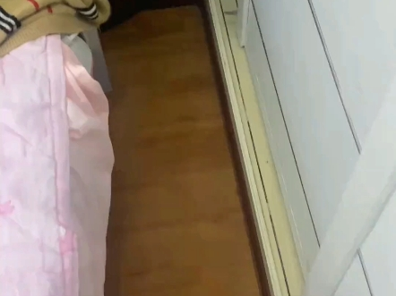 | 410 | 2025-11-12 |
| [哈基米这个inpart](https://www.bilibili.com/video/BV1e9CLBCE8u) | 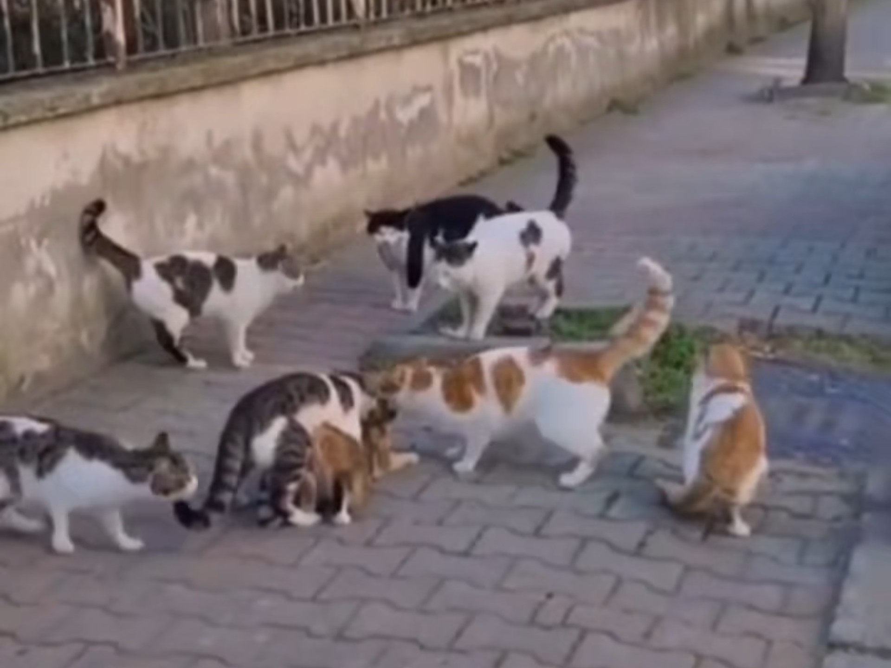 | 1307 | 2025-11-12 |
| [东京小馋耄](https://www.bilibili.com/video/BV1kvCLBdEyz) |  | 6204 | 2025-11-12 |
| [不是AI，是真的。九阳哈基米南北绿豆浆～](https://www.bilibili.com/video/BV1Mdk2BSEAX) |  | 21.3万 | 2025-11-12 |
| [《达斯那个哈基米，人》 基米还在哈气](https://www.bilibili.com/video/BV1VBCjBCEZ2) | 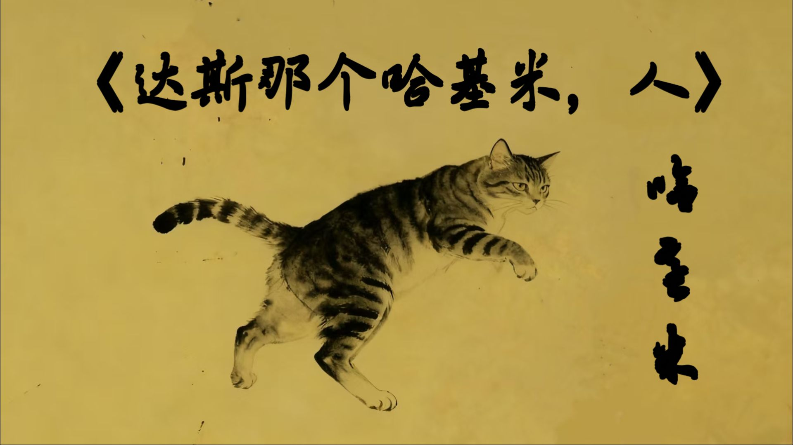 | 226 | 2025-11-12 |
| [【哈基米音乐】基人五子棋](https://www.bilibili.com/video/BV1nHCjBsE7c) |  | 692 | 2025-11-12 |
| [【哈基米音乐】给我一首哈基米的时间](https://www.bilibili.com/video/BV1rpkyBeEuu) |  | 2005 | 2025-11-12 |
| [【哈基米音乐】哈无歇](https://www.bilibili.com/video/BV1YNkUBaEb9) |  | 4.6万 | 2025-11-12 |
| [&quot;你做我的基米，我做你的曼波&quot;](https://www.bilibili.com/video/BV1tNkkBMEVo) |  | 841 | 2025-11-12 |
| [某阳家里请啥都没用了](https://www.bilibili.com/video/BV1Ypk1BWEDE) |  | 1966 | 2025-11-11 |
| [哈基米南北绿豆浆 我从小喝到大](https://www.bilibili.com/video/BV1oukCBWEn5) |  | 413 | 2025-11-11 |
| [硬猫~](https://www.bilibili.com/video/BV1BukCBsE2o) | 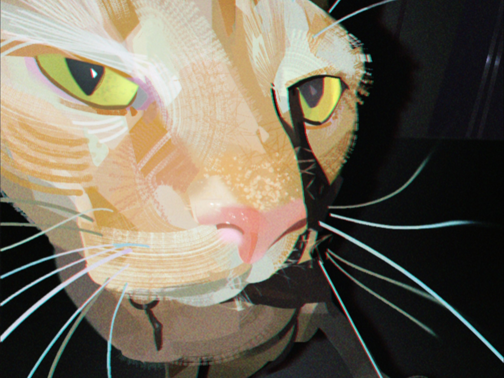 | 6.1万 | 2025-11-11 |
| [谁催的😾我要哈气了😾](https://www.bilibili.com/video/BV1cwkCBFErY) |  | 6496 | 2025-11-11 |
| [九阳疑似请到哈基仙了](https://www.bilibili.com/video/BV1BHk6BUErF) |  | 564 | 2025-11-11 |
| [美国键政一哥哈桑中国行，被称为哈公子得意洋洋，不料网友及时纠正“哈公子的哈是哈基米的哈”](https://www.bilibili.com/video/BV1vhk6BkEw6) |  | 3.0万 | 2025-11-11 |
| [关于主播和舍友发现神秘耄耋碎片的故事](https://www.bilibili.com/video/BV13LkrBkEC7) |  | 3378 | 2025-11-11 |
| [货架基米](https://www.bilibili.com/video/BV1CYkrBFE2E) | 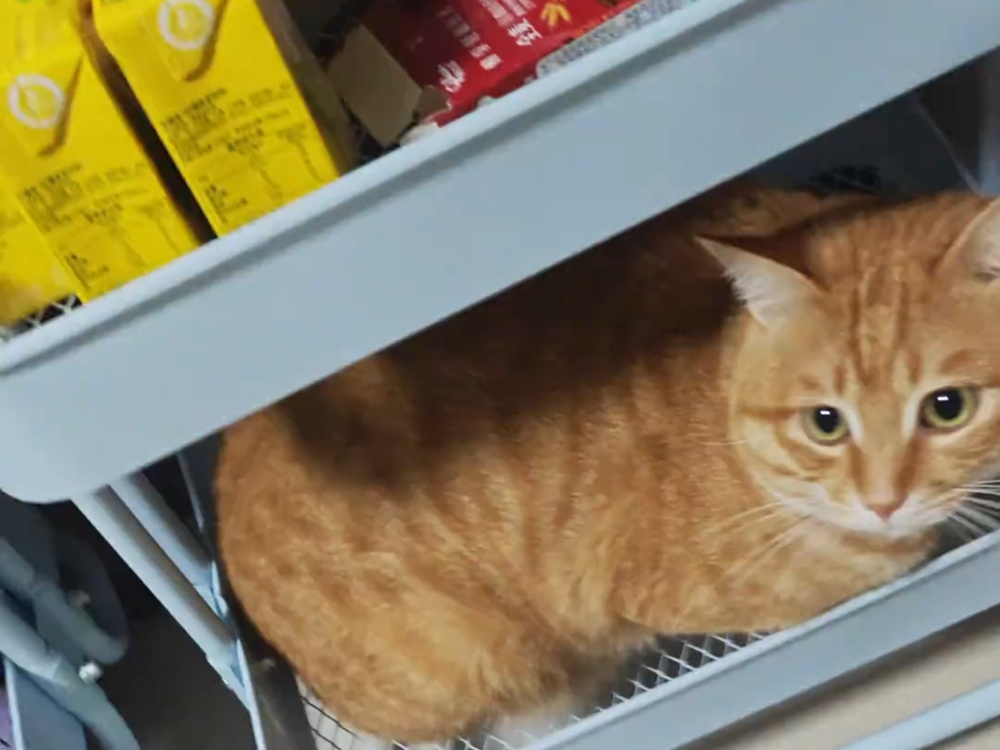 | 13.4万 | 2025-11-11 |
| [我可以哈你吗？](https://www.bilibili.com/video/BV1A2kBB9ERU) |  | 9512 | 2025-11-11 |
| [不是说小动物不能成精吗](https://www.bilibili.com/video/BV1TJkzBwE9y) | 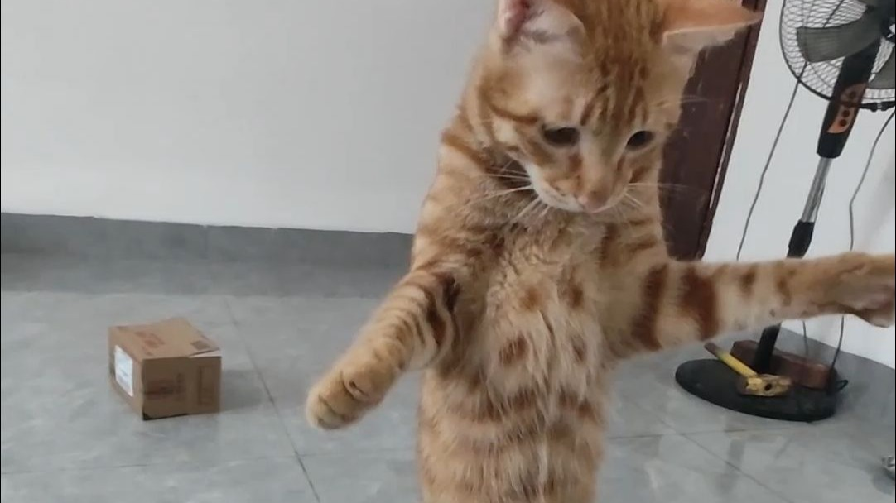 | 39.3万 | 2025-11-11 |
| [哈基宗日常](https://www.bilibili.com/video/BV1cdkBBmEGH) | 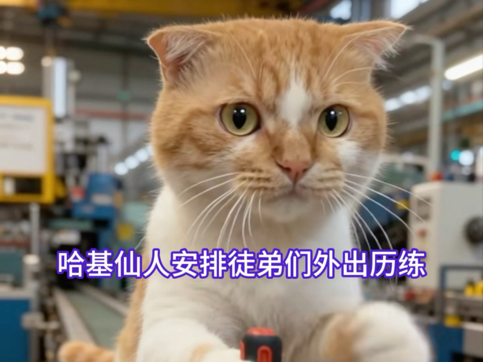 | 7783 | 2025-11-11 |
| [别给我小马唱亖了](https://www.bilibili.com/video/BV1X3kDBKE7e) | 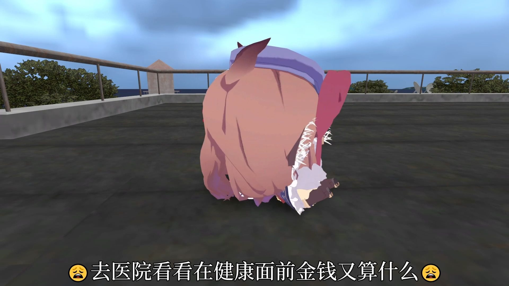 | 2528 | 2025-11-11 |
| [你们不是说米雪儿是好基米吗？我看是浮力基呀](https://www.bilibili.com/video/BV12HkzBfEkF) |  | 1291 | 2025-11-11 |
| [“艾特一个比小猫还能睡的人 ”](https://www.bilibili.com/video/BV1rLCcBVEAL) |  | 11.3万 | 2025-11-10 |
| [雨过之后，咪就会_](https://www.bilibili.com/video/BV1pDCcBJEe5) | 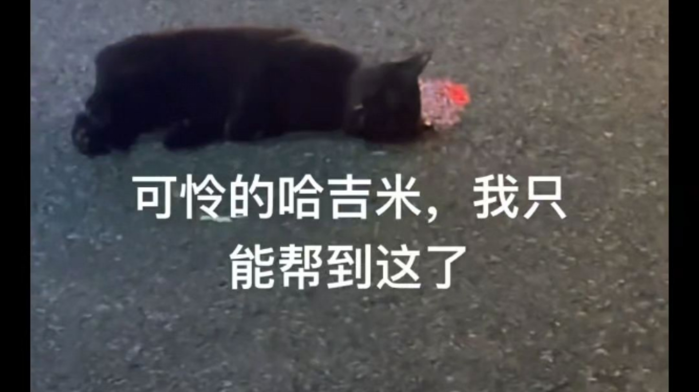 | 7723 | 2025-11-10 |
| [橘猫：家人们，我会死吗](https://www.bilibili.com/video/BV1kQCcBUEyd) |  | 1.9万 | 2025-11-10 |
| [MC：哈基米打开了光影](https://www.bilibili.com/video/BV1rFkXBHEG6) |  | 2992 | 2025-11-09 |
| [ASMR哈基米内裤摩擦抓绕音助眠](https://www.bilibili.com/video/BV1kokQBWEq8) |  | 100 | 2025-11-09 |
| [⚡路边的基米不要踩⚡](https://www.bilibili.com/video/BV1mxkXBeEZV) |  | 7725 | 2025-11-09 |
| [“东北最强音and哈基米最强音”太带派了！太燃了！太好听了！](https://www.bilibili.com/video/BV1zokSB1E4V) |  | 319 | 2025-11-09 |
| [死亡之环猫咪 死亡之环＋坦克引擎＋冰仗无限大哈基米疯狂哈气打出全队最高输出](https://www.bilibili.com/video/BV1NKkSBDEi5) |  | 8.1万 | 2025-11-09 |
| [路人：哪来的哈基米？](https://www.bilibili.com/video/BV1Xo1DBLEHw) |  | 1162 | 2025-11-08 |
| [喵狗:你吩咐，不理解但照做！这就叫执行力!](https://www.bilibili.com/video/BV11R1QBiEYM) | 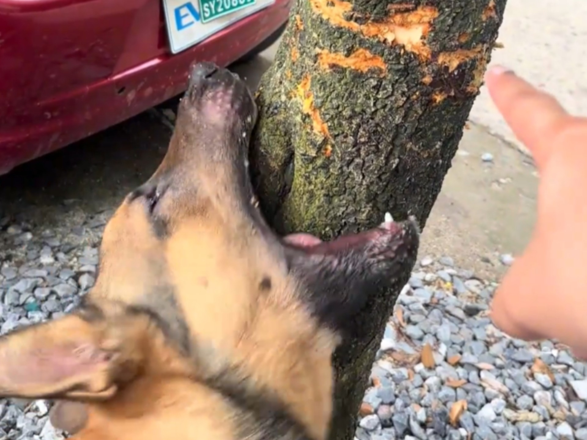 | 12.7万 | 2025-11-08 |
| [代码发力了](https://www.bilibili.com/video/BV1Hc1XBaEbX) | 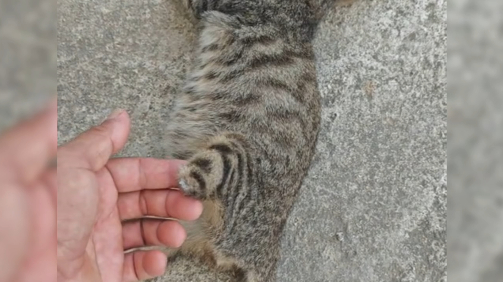 | 9.5万 | 2025-11-08 |
| [爱猫圈传来噩耗，哈基米放洗衣机里跑步](https://www.bilibili.com/video/BV16T1XBtEBJ) | 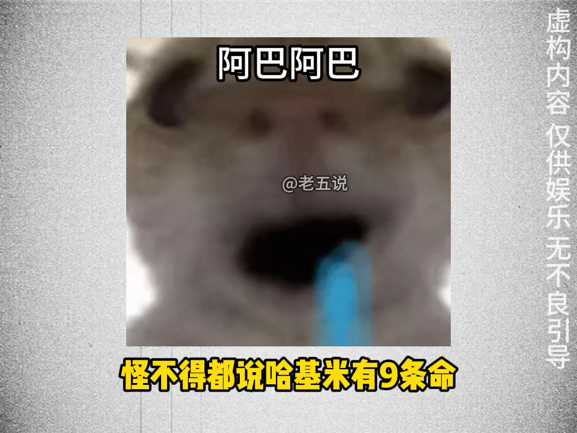 | 3843 | 2025-11-08 |
| [一二牌哈基米](https://www.bilibili.com/video/BV1xa1DBYEoZ) |  | 5991 | 2025-11-08 |
| [最喜欢这种有精神病的猫，哈哈哈哈哈！！](https://www.bilibili.com/video/BV1sV2ABPEdh) | 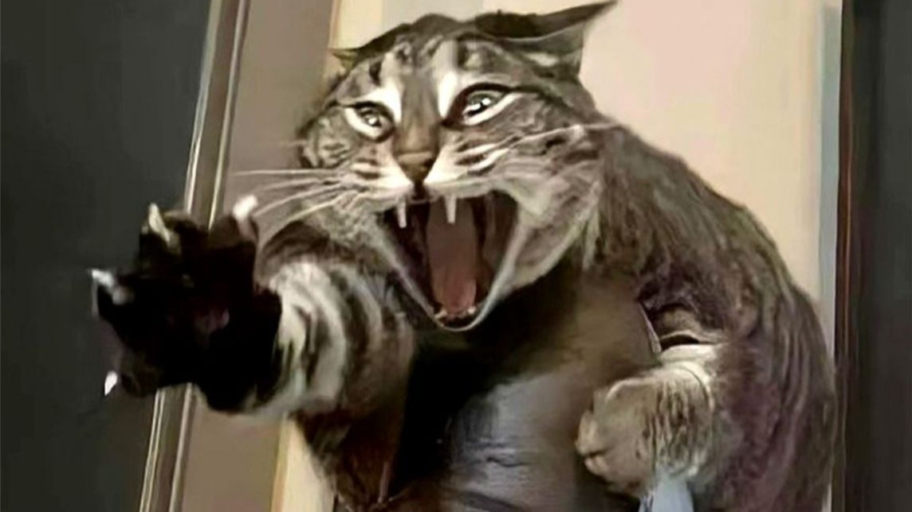 | 14.9万 | 2025-11-08 |
| [循环歌单｜《最没天赋の小曲》红色高跟鞋DJ](https://www.bilibili.com/video/BV1jA2uBKEm9) | 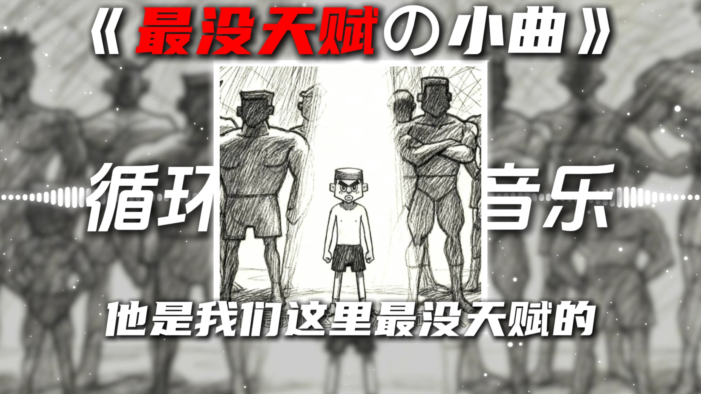 | 444.1万 | 2025-11-07 |
| [“悬溺一响，苦命鸳鸯登场”](https://www.bilibili.com/video/BV1i82cByEwz) |  | 253.8万 | 2025-11-06 |
| [哈基米~可爱的哈基米！](https://www.bilibili.com/video/BV1bF1fB4ENA) | 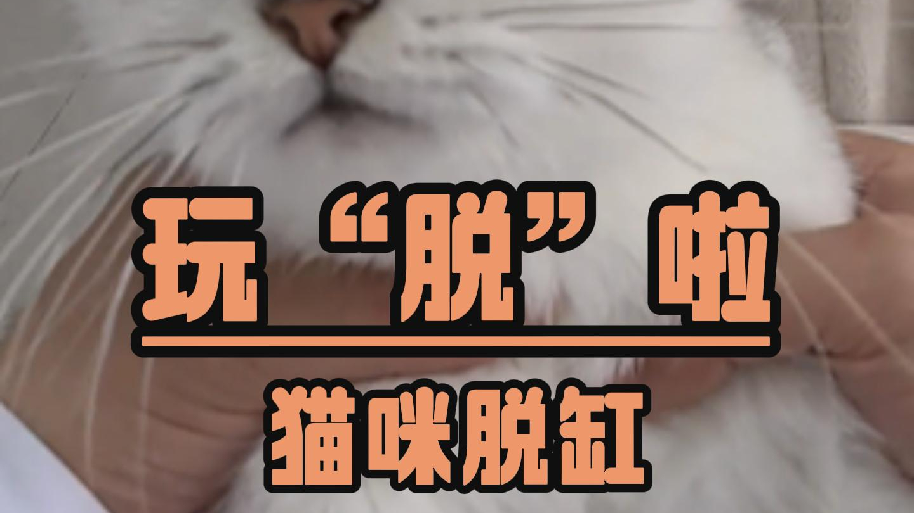 | 6.1万 | 2025-11-06 |
| [路人：哪来的曼波？](https://www.bilibili.com/video/BV1rv1xBWEFq) |  | 2.8万 | 2025-11-05 |
| [蓝莲哈](https://www.bilibili.com/video/BV1zn14BXEKx) | 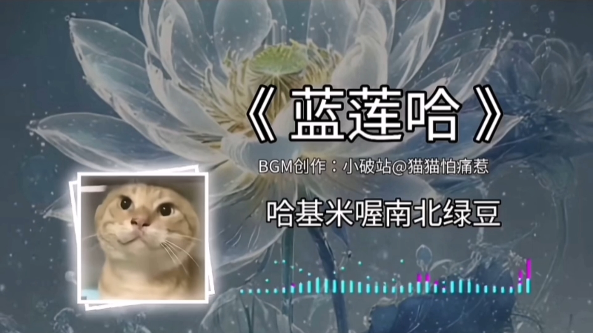 | 565 | 2025-11-05 |
| [基米小镇：冬眠前的懒觉](https://www.bilibili.com/video/BV1K71yBUEog) | 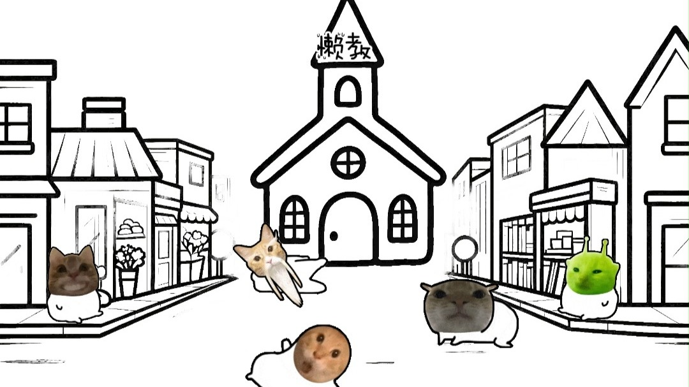 | 1.6万 | 2025-11-04 |
| [主人在猫面前切猫蛋糕](https://www.bilibili.com/video/BV1My16ByE9J) |  | 61.4万 | 2025-11-04 |
| [“很难想象这些歌都是上个世纪的产物”](https://www.bilibili.com/video/BV1zA1jBsEDG) |  | 305.3万 | 2025-11-01 |
| [🍬威 风 唐 唐🍬](https://www.bilibili.com/video/BV1nJ1LBRE7t) |  | 83.9万 | 2025-11-01 |
| [【6861 Radio】金融DJ电台第十八期](https://www.bilibili.com/video/BV1PW1gB2EFZ) |  | 128.7万 | 2025-10-31 |
| [苦命鸳鸯动画版](https://www.bilibili.com/video/BV1RLyWBvEJF) |  | 79.7万 | 2025-10-29 |
| [曼波](https://www.bilibili.com/video/BV16KWxzmEut) |  | 91.5万 | 2025-10-18 |
| [【补档】叮咚鸡：咱妈给咱搞核酸咱们无怨无悔](https://www.bilibili.com/video/BV14943zFEH1) | 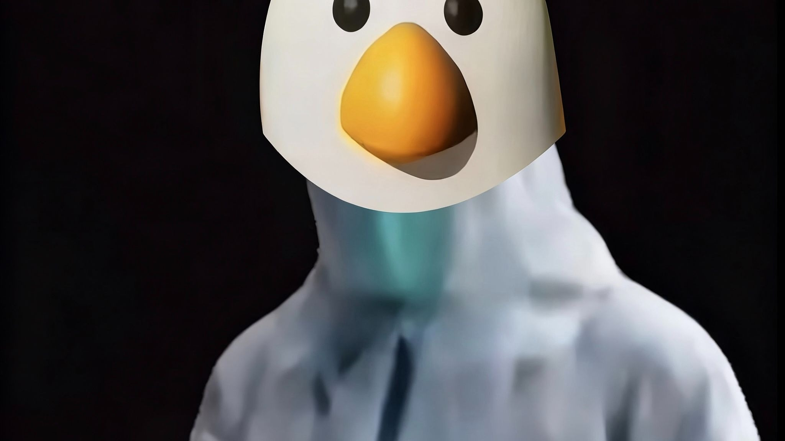 | 3.4万 | 2025-10-12 |
| [萌猫大集合 😻](https://www.bilibili.com/video/BV1gfxpzaE9V) | 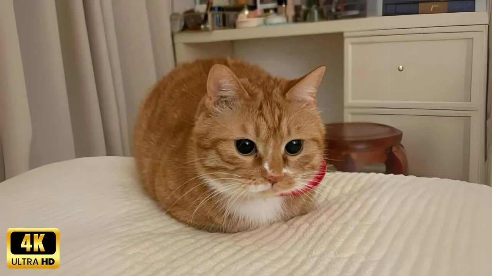 | 6.5万 | 2025-10-04 |
| [byd，看到这绷不住了！！](https://www.bilibili.com/video/BV1i2pfzvEzx) |  | 11.3万 | 2025-09-21 |
| [这个哈基米也有点死了](https://www.bilibili.com/video/BV1Fi8fzZEMw) | 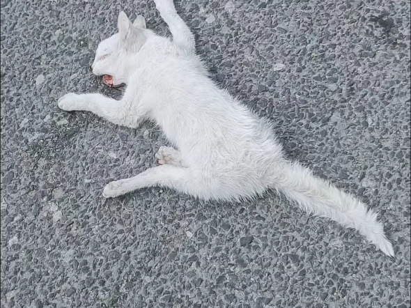 | 16.9万 | 2025-07-30 |
| [当哈基米的两只脚被纸粘住🤓](https://www.bilibili.com/video/BV1EUGgzCEr5) | 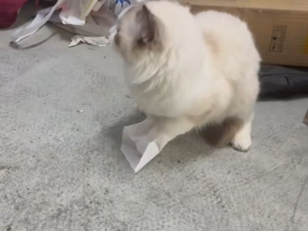 | 105.7万 | 2025-07-10 |
| [哪位罪人将叮咚鸡引入哈基米宇宙？【耄耋史诗02】](https://www.bilibili.com/video/BV11HMuzBEpj) |  | 118.6万 | 2025-06-13 |
| [豪人配键猫，全网第一个给哈基米磕头的主波出现了](https://www.bilibili.com/video/BV1wGEyzZEyt) | 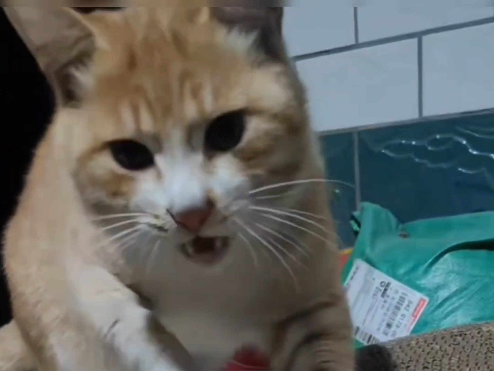 | 29.3万 | 2025-05-15 |
| [哈基米，不是这样哈气的](https://www.bilibili.com/video/BV1mREjzsEa2) |  | 8.6万 | 2025-05-12 |

---
*最后更新: 2025-11-13 02:42:53 (自动生成)*
*数据来源: [Bilibili](https://www.bilibili.com)*

## 使用说明

运行以下命令更新视频列表:
```bash
python3 fetch_hajimi_videos.py
```
