# awesome-hajimi
collections of hajimi (哈基米 in Chinese) on the Internet.

## 视频列表 (Video List)

| 视频标题 (Title) | 封面 | 播放量 (Views) | 发布日期 (Date) |
|---|---|---|---|
| [【L4D2】 求生之路2 萌新瞎搞系列 - 近期更新](https://www.bilibili.com/video/BV1pazCBZEWn) | 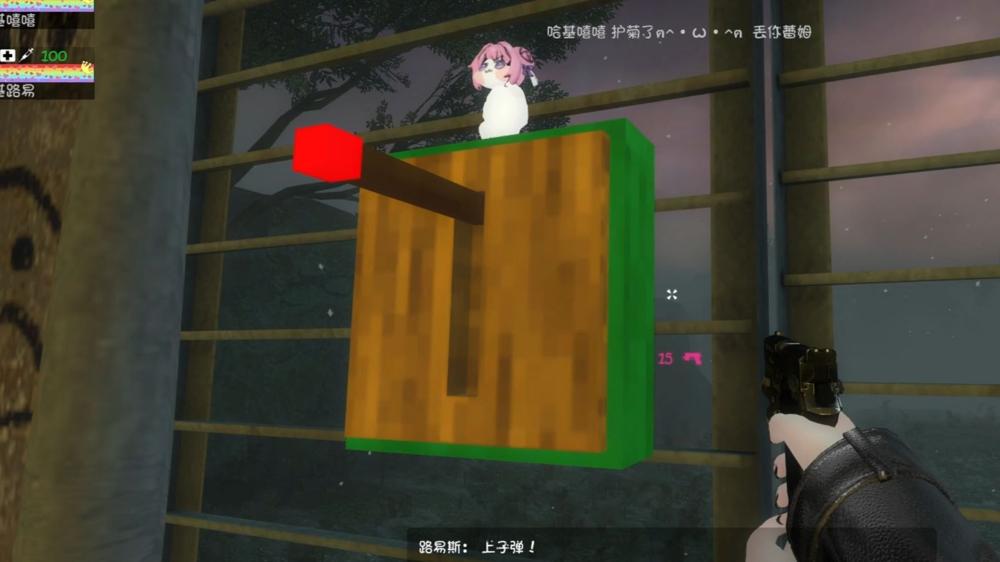 | 181 | 2026-02-02 |
| [孩子们，我家的哈基米好像挺喜欢我的](https://www.bilibili.com/video/BV1EZFPzFE9m) | 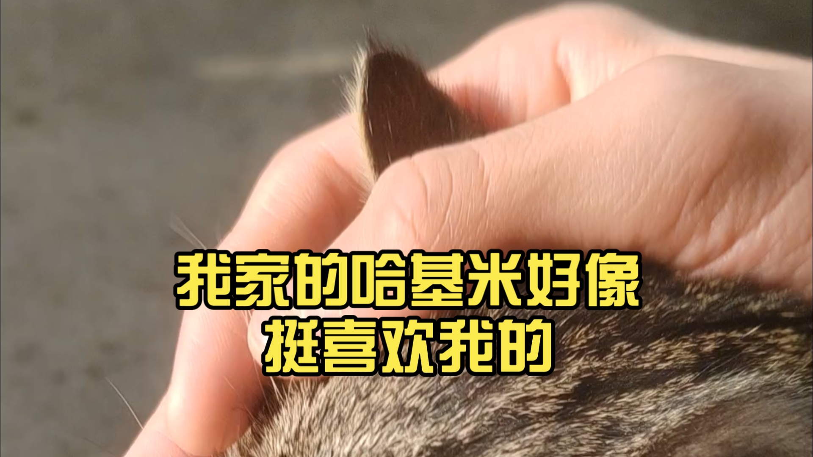 | 60 | 2026-02-02 |
| [《动物迷惑行为大赏294》](https://www.bilibili.com/video/BV1kz6bBSEcf) | 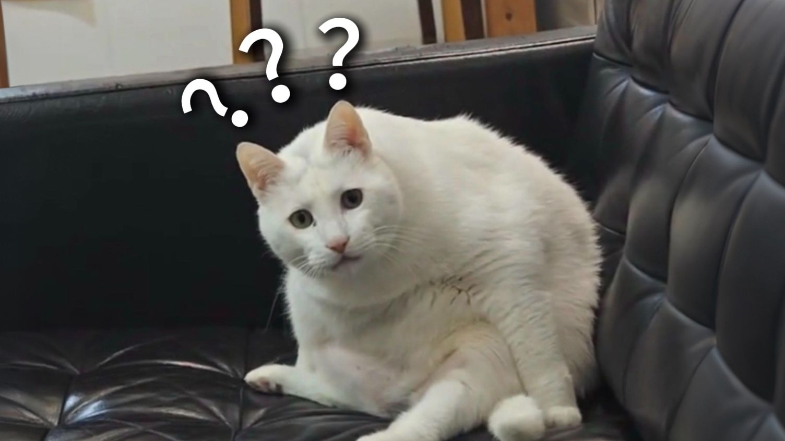 | 2.8万 | 2026-02-02 |
| [想你的哈基米](https://www.bilibili.com/video/BV1h16aBVEwQ) | 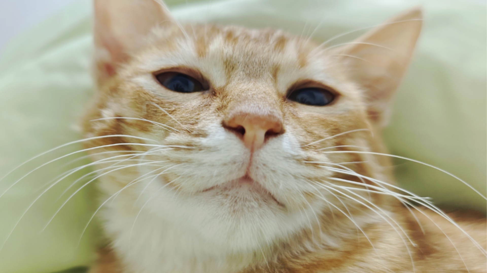 | 324 | 2026-02-01 |
| [曼波拜年之基米到！（财神到哈基米版）](https://www.bilibili.com/video/BV1Qn6hB6Epn) |  | 360 | 2026-02-01 |
| [【哈基米音乐】Time leaper](https://www.bilibili.com/video/BV1Mk6tBfE4b) |  | 42 | 2026-02-01 |
| [【哈基米音乐】心如止水](https://www.bilibili.com/video/BV1sD6tBWE7r) | 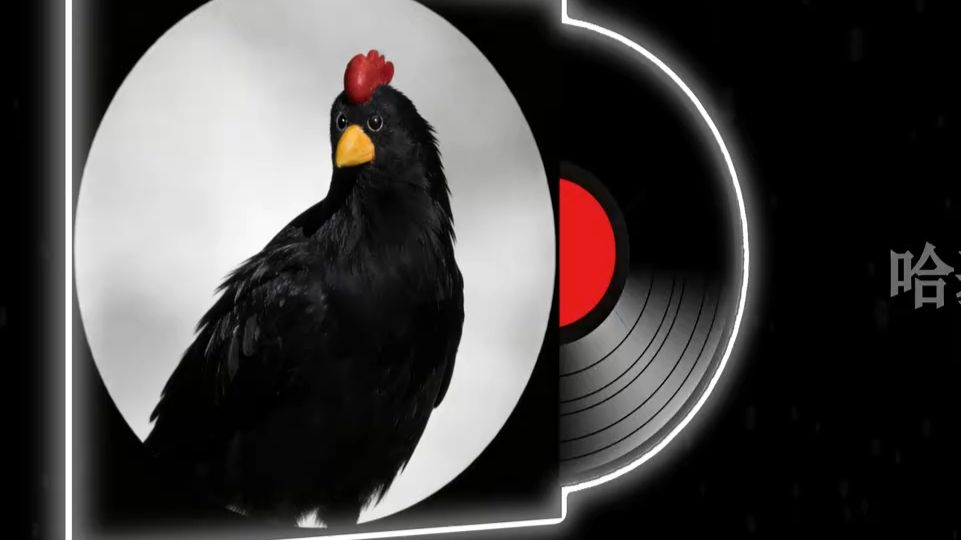 | 52 | 2026-02-01 |
| [用点头摇头来打音游！！《动次打次哈基米》—【2026 Global Game Jam 广州攻壳站作品】](https://www.bilibili.com/video/BV12m6tBxEMb) |  | 172 | 2026-02-01 |
| [【哈基米x国足】400咪](https://www.bilibili.com/video/BV1Km6tBxE4p) |  | 127 | 2026-02-01 |
| [自学制作手办，只为还原童年记忆？！！【双箭头】](https://www.bilibili.com/video/BV1oK6bBGESn) | 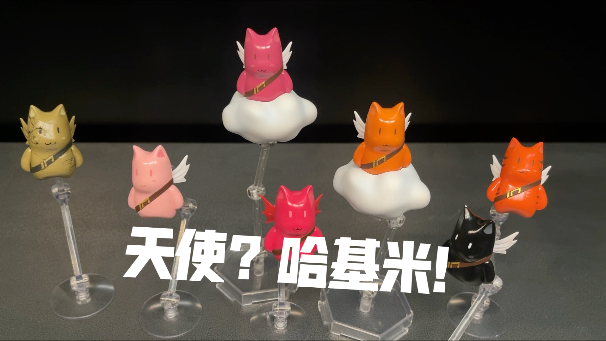 | 325 | 2026-02-01 |
| [哈～基～米～](https://www.bilibili.com/video/BV1Xj6bBvE7r) |  | 2 | 2026-02-01 |
| [AI哈基米的完败](https://www.bilibili.com/video/BV19L6bBKE8U) | 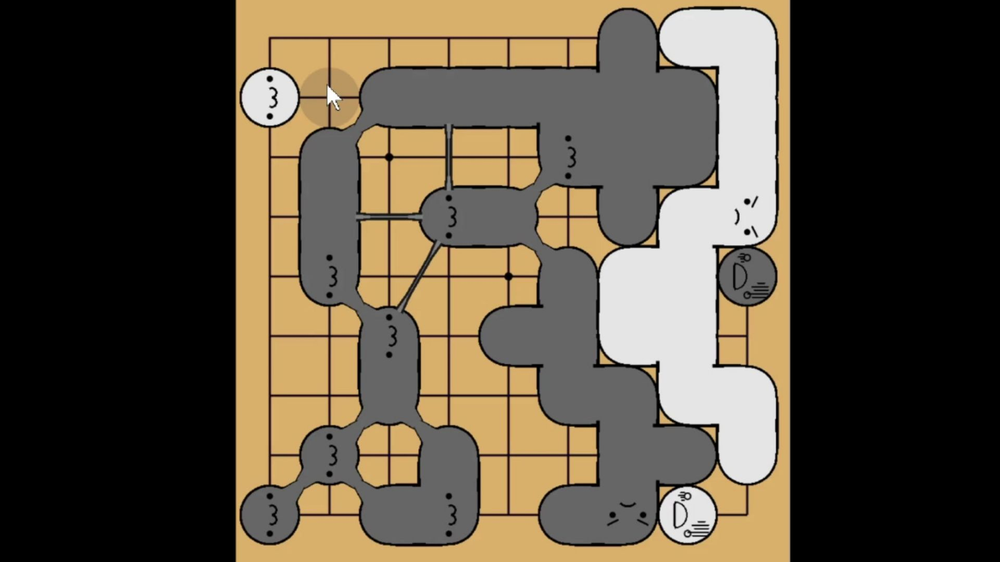 | 121 | 2026-02-01 |
| [哈基米1](https://www.bilibili.com/video/BV1s96tBHEPe) | 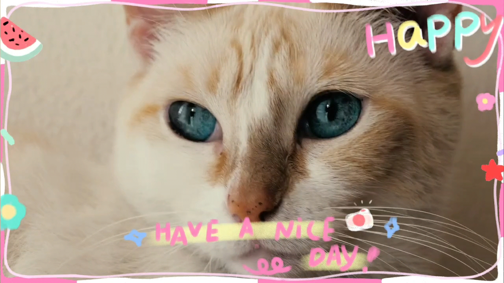 | 13 | 2026-02-01 |
| [紫色哈基米૮⑉･-･⑉ა](https://www.bilibili.com/video/BV1Ka6bBxEJ4) |  | 126 | 2026-02-01 |
| [敌进我退，敌驻我扰，敌疲我打，敌退我追](https://www.bilibili.com/video/BV1Ci6bBQEbP) | 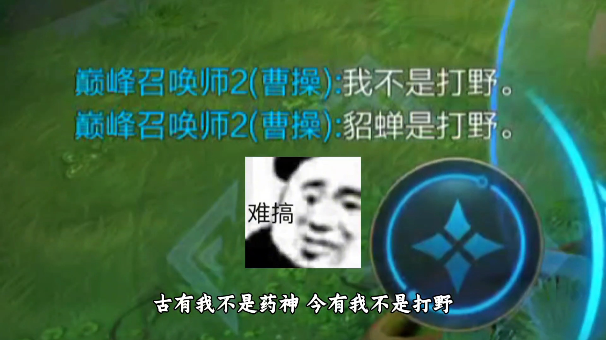 | 1228 | 2026-02-01 |
| [Bad Chimi!!（修复版）](https://www.bilibili.com/video/BV1kB6bBnEzT) |  | 5243 | 2026-02-01 |
| [哈基米音乐：哈人死（原曲：Heathens——twenty one pilots）](https://www.bilibili.com/video/BV1Ss6bBFE8c) |  | 105 | 2026-02-01 |
| [【补档】呐呐呐——因为鬼畜没有耄耋好恰米](https://www.bilibili.com/video/BV1zk6bBmEwQ) |  | 244 | 2026-02-01 |
| [【1月】哈基米音乐排行榜#16](https://www.bilibili.com/video/BV1dK64BeECX) |  | 5.4万 | 2026-02-01 |
| [东南亚不相信眼泪](https://www.bilibili.com/video/BV1Zf6xBuExo) |  | 530 | 2026-02-01 |
| [猫儿这个贪玩](https://www.bilibili.com/video/BV11x64BDEMQ) |  | 433 | 2026-02-01 |
| [哈基米](https://www.bilibili.com/video/BV1YX64BAEFS) |  | 73 | 2026-02-01 |
| [🐱基米...穿越了？🐱](https://www.bilibili.com/video/BV1hD6sBdEzP) |  | 1.6万 | 2026-02-01 |
| [哈基米版Golden Hour一次听够，太洗脑了](https://www.bilibili.com/video/BV1rJ6tByEw7) | 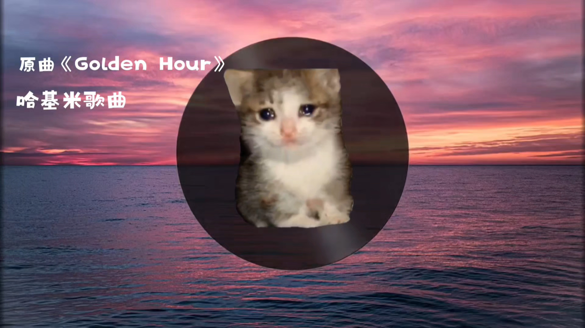 | 1.9万 | 2026-02-01 |
| [【基米TV】极限救援这一块](https://www.bilibili.com/video/BV11T6tBXEgZ) | 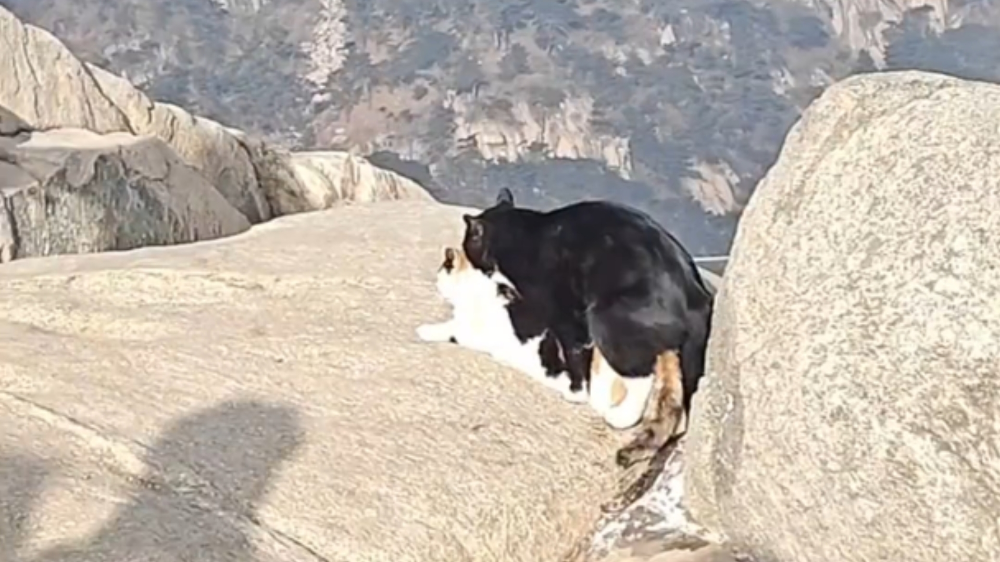 | 26.0万 | 2026-02-01 |
| [【智人TV】一拳锤掉女儿门牙的神人家长 &amp; 在711里舞狮](https://www.bilibili.com/video/BV1L96JBJEmR) | 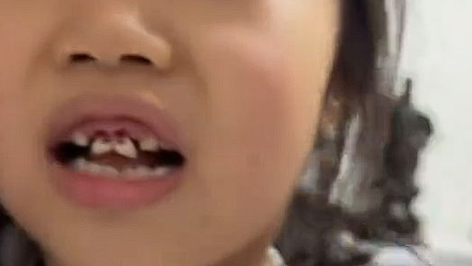 | 16.7万 | 2026-02-01 |
| [哈基米触发底层代码](https://www.bilibili.com/video/BV1TT6tB9EP2) | 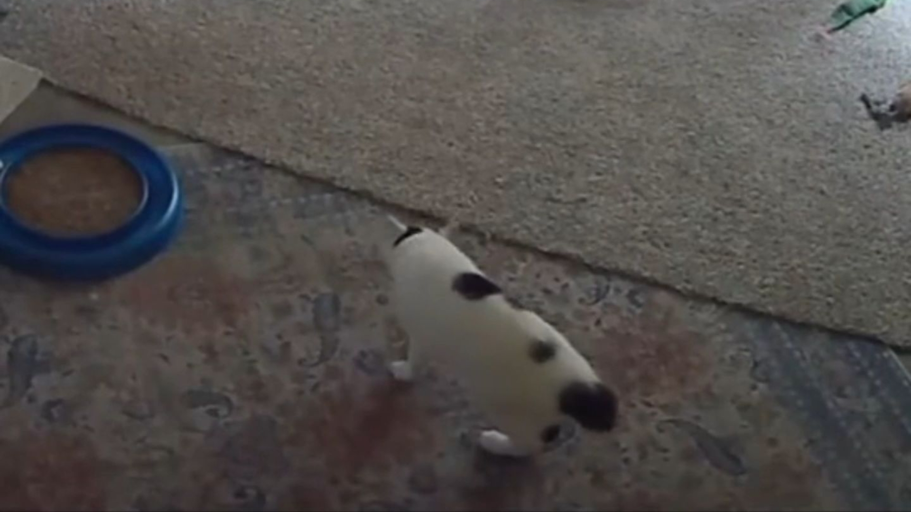 | 3088 | 2026-02-01 |
| [沉浸式撸哈基米](https://www.bilibili.com/video/BV1yG6tBJE1Y) | 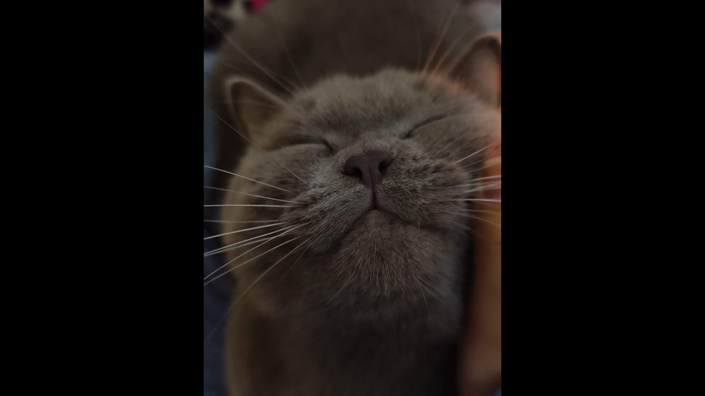 | 583 | 2026-02-01 |
| [【私壬唱片】“晚安， 基米斯滕”🐱 - Control&#x27;s Wishes](https://www.bilibili.com/video/BV1SG6sBQEi1) |  | 1037 | 2026-02-01 |
| [【Arc Raiders】哈基米感化老外？撤离时偶遇国人共鸣？](https://www.bilibili.com/video/BV1PW6sBLE4u) |  | 228 | 2026-02-01 |
| [谁家小猫这样睡觉的](https://www.bilibili.com/video/BV1hX6sBsEKy) | 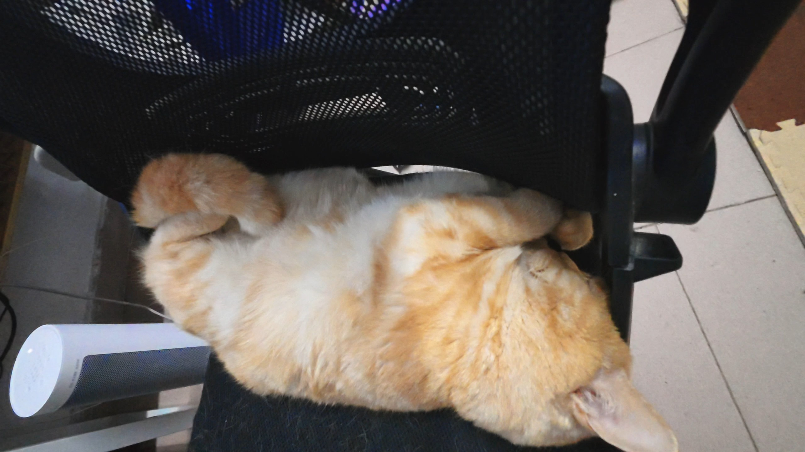 | 3917 | 2026-02-01 |
| [【哈基米音乐】哈基米 in 冰冻库](https://www.bilibili.com/video/BV1UF6xBSEF7) |  | 209 | 2026-02-01 |
| [充满活力的小哈基米](https://www.bilibili.com/video/BV1J76xBMEz9) | 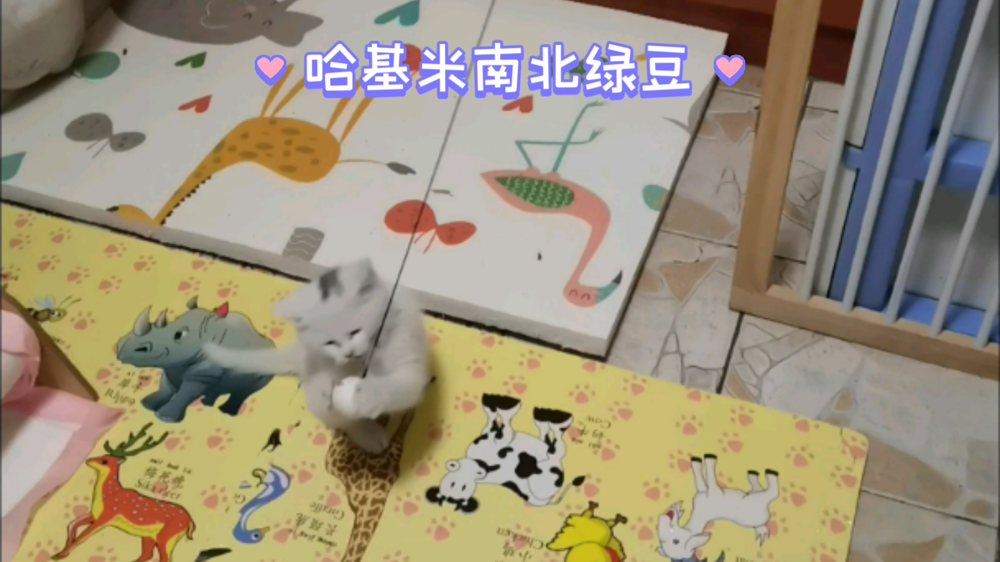 | 328 | 2026-02-01 |
| [哈基米当狙神。](https://www.bilibili.com/video/BV17E6xBqEk2) |  | 150 | 2026-02-01 |
| [⚡️哈基米隼人⚡️](https://www.bilibili.com/video/BV17E6xBqE9V) | 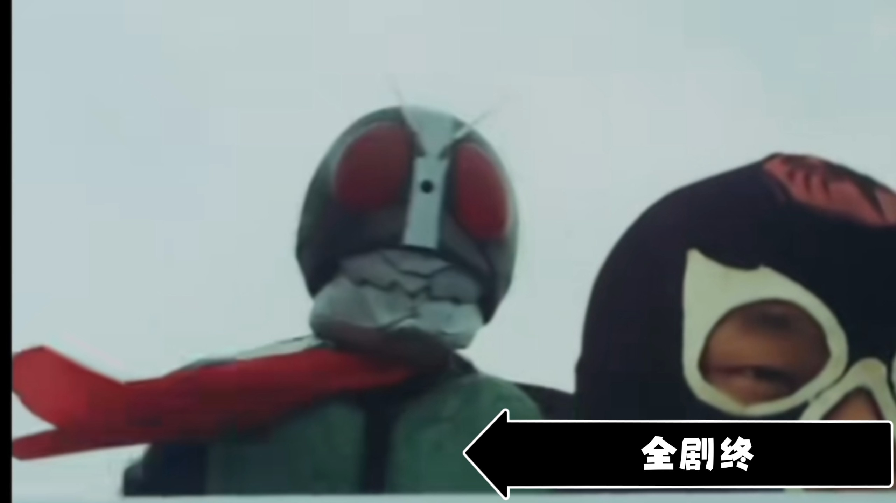 | 635 | 2026-02-01 |
| [哈基米～](https://www.bilibili.com/video/BV1J56xBgELQ) |  | 31 | 2026-02-01 |
| [新维加斯神人MOD之邮差也是听上哈基米音乐了](https://www.bilibili.com/video/BV1sK6xB1EHX) |  | 1509 | 2026-02-01 |
| [家里的哈基米解锁哈根了…](https://www.bilibili.com/video/BV1Cu6xBCEvU) | 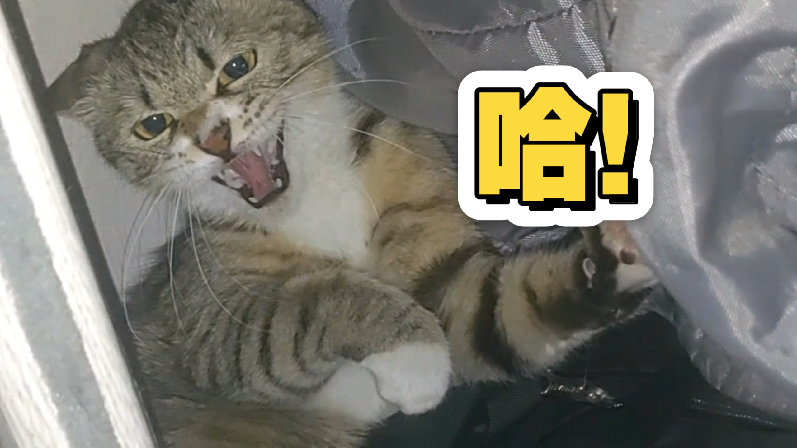 | 792 | 2026-02-01 |
| [bad apple ❌️ 哈基米曼波](https://www.bilibili.com/video/BV1Ky6xBSED8) |  | 483 | 2026-02-01 |
| [依托答辩，霸王咪有两条尾巴🤮](https://www.bilibili.com/video/BV1aU6pBJEtN) | 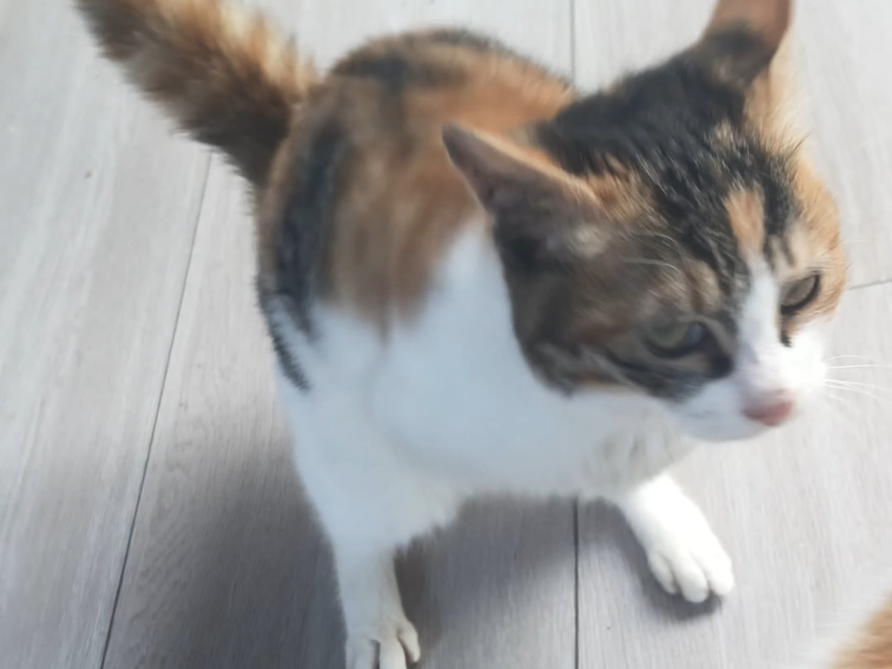 | 6544 | 2026-02-01 |
| [“9×39家族の耻辱”](https://www.bilibili.com/video/BV1td6pByEYE) |  | 1.2万 | 2026-02-01 |
| [睡基米](https://www.bilibili.com/video/BV15H6WBoEtM) | 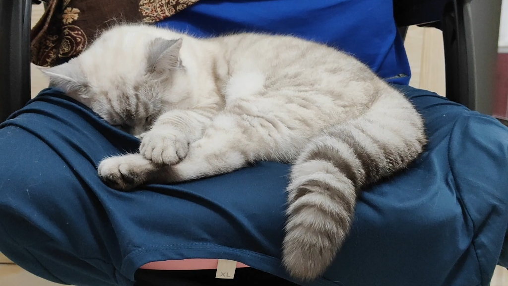 | 981 | 2026-02-01 |
| [神碑你老了，哈基米的力量不是谁都能来碰的。](https://www.bilibili.com/video/BV1Nq6JBcEMa) |  | 363 | 2026-02-01 |
| [哈基米这个怕](https://www.bilibili.com/video/BV1dA6sBZEhg) | 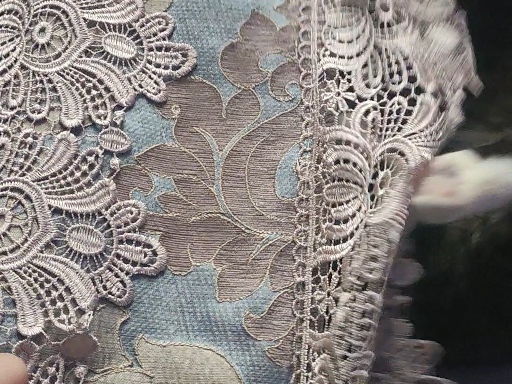 | 5 | 2026-01-31 |
| [【哈基米】基米先锋](https://www.bilibili.com/video/BV1276pB6EzK) |  | 199 | 2026-01-31 |
| [哈基米觉醒狼族血统了](https://www.bilibili.com/video/BV1gs6JBuEds) | 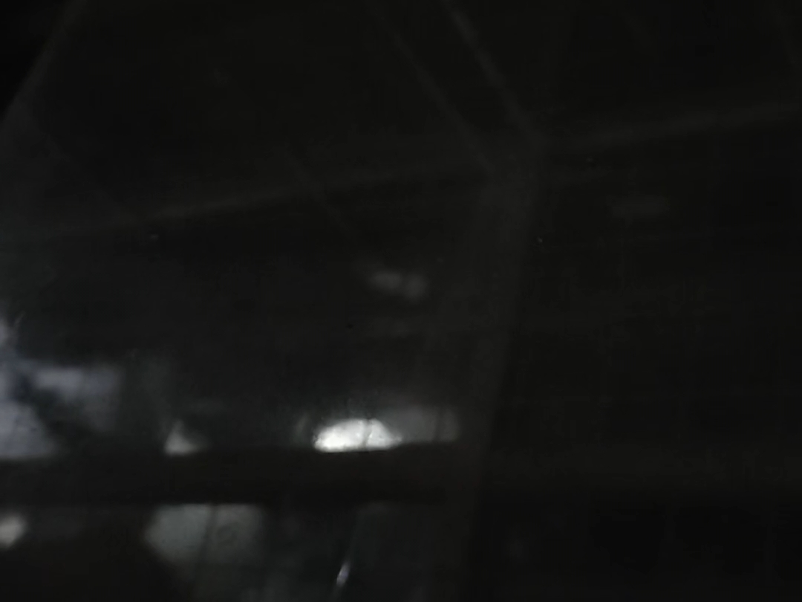 | 13 | 2026-01-31 |
| [（哈基米音乐）Necro❤manbo❤tic](https://www.bilibili.com/video/BV1Lo6JB7En9) |  | 206 | 2026-01-31 |
| [哈基米还不想走🐱](https://www.bilibili.com/video/BV1Dc6nBCEy4) | 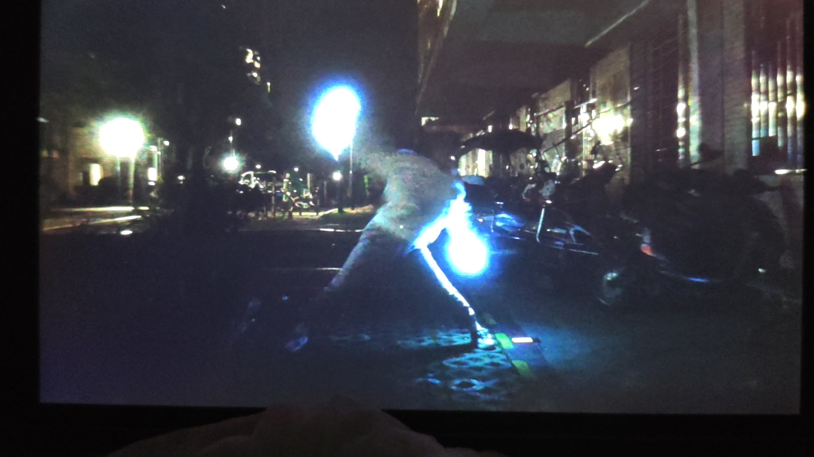 | 262 | 2026-01-31 |
| [【基米TV 】那些年我们一起爱的基米瞬间](https://www.bilibili.com/video/BV12G6nBKEyV) |  | 2076 | 2026-01-31 |
| [【哈基米】🎵I&#x27;ll Be Gone🎵](https://www.bilibili.com/video/BV1Fh61BcExm) |  | 404 | 2026-01-31 |
| [【个人向】【北美版】为什么DE是最难的无尽？](https://www.bilibili.com/video/BV11J61BBE3B) |  | 243 | 2026-01-31 |
| [哈吉米](https://www.bilibili.com/video/BV1TL61B3EmU) |  | 7 | 2026-01-31 |
| [一想到哈基米半天做的场被我几下全解完就想笑『御巫对战黯蜜』【游戏王Master Duel】](https://www.bilibili.com/video/BV1366rBBE8x) |  | 1052 | 2026-01-31 |
| [《妈妈酱，瓦达西好像有1.4了》](https://www.bilibili.com/video/BV1go6iBHEW6) | 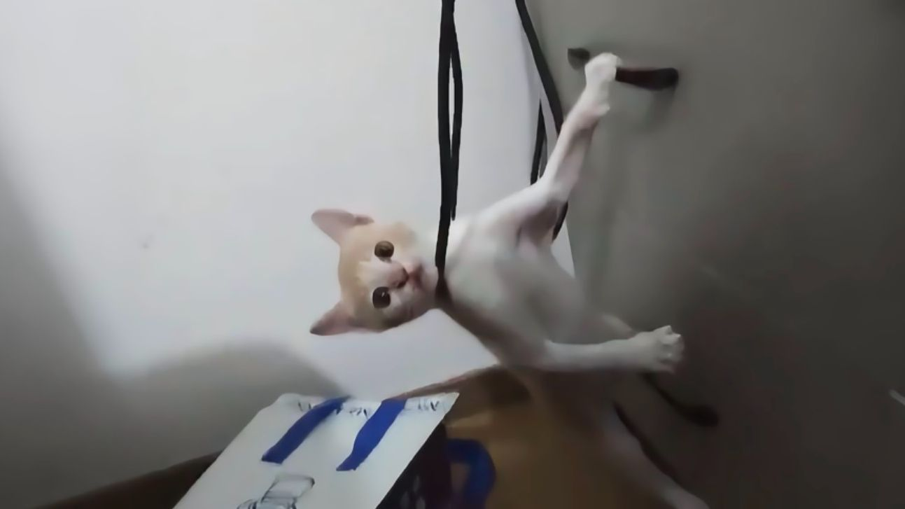 | 44.3万 | 2026-01-31 |
| [哈基米你这家伙,又在前瞻里偷偷藏新卫星角色！](https://www.bilibili.com/video/BV1VU6iBoEiK) |  | 2913 | 2026-01-30 |
| [我自己剪的时候都没绷住！](https://www.bilibili.com/video/BV1Ru6BBwEc1) |  | 3.5万 | 2026-01-30 |
| [为啥汕头的宾馆那么多消防栓，这么注意吗？](https://www.bilibili.com/video/BV1BS6YBbEdE) |  | 3.8万 | 2026-01-30 |
| [洛克王国载阳仙鹤回归，小糯糯、小笼糯米；哈基米纪念壁纸免费拿1月30日必过活动攻略](https://www.bilibili.com/video/BV1c56NBSE6G) |  | 3454 | 2026-01-29 |
| [哈基米，当直播出现事故](https://www.bilibili.com/video/BV1uc6NBbEj5) |  | 1673 | 2026-01-29 |
| [哈基米top的精彩分享https://b23.tv/BV1kvzCBdEmG/p6](https://www.bilibili.com/video/BV1Jh6wB3EkB) | 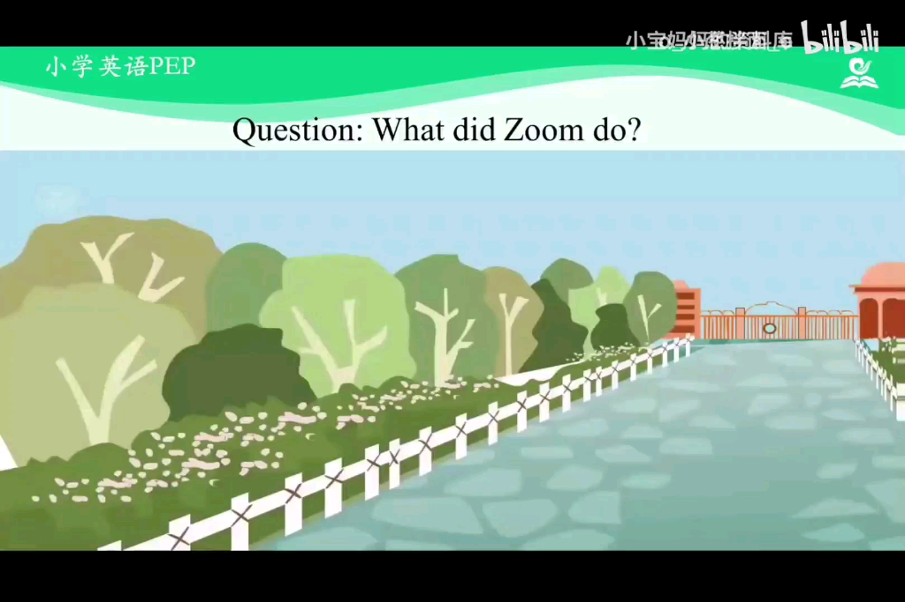 | 119 | 2026-01-29 |
| [这么喜欢捆绑自己](https://www.bilibili.com/video/BV1FNzfBaEXD) | 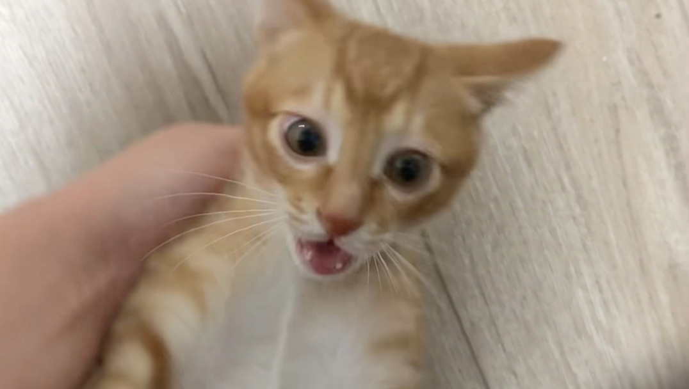 | 1.2万 | 2026-01-29 |
| [《蓝莲哈》哈基米来洗涤你浮躁的心](https://www.bilibili.com/video/BV1fHz9BLEtd) |  | 642 | 2026-01-28 |
| [假 如 后 室 变 成 了 旅 游 景 点](https://www.bilibili.com/video/BV1NX6TBaEnE) | 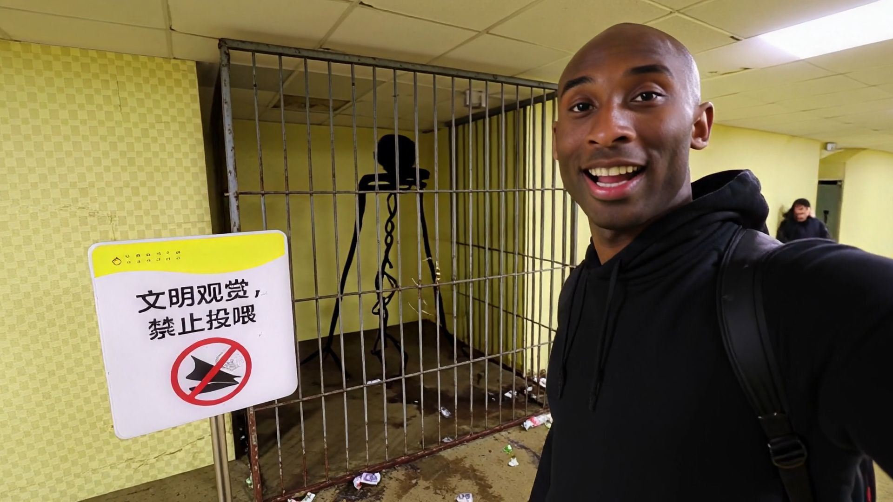 | 239.5万 | 2026-01-27 |
| [哈基米](https://www.bilibili.com/video/BV1cxzqBBEdi) | 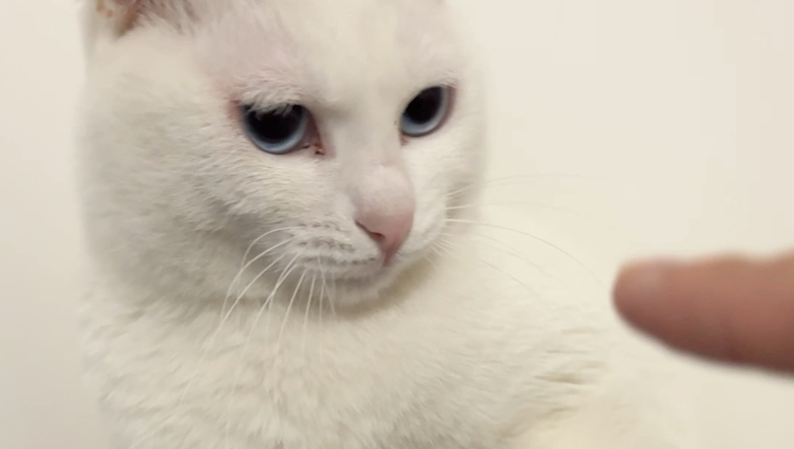 | 798 | 2026-01-26 |
| [基米可敢哈气？ 有何不敢！](https://www.bilibili.com/video/BV1xvziBkELT) | 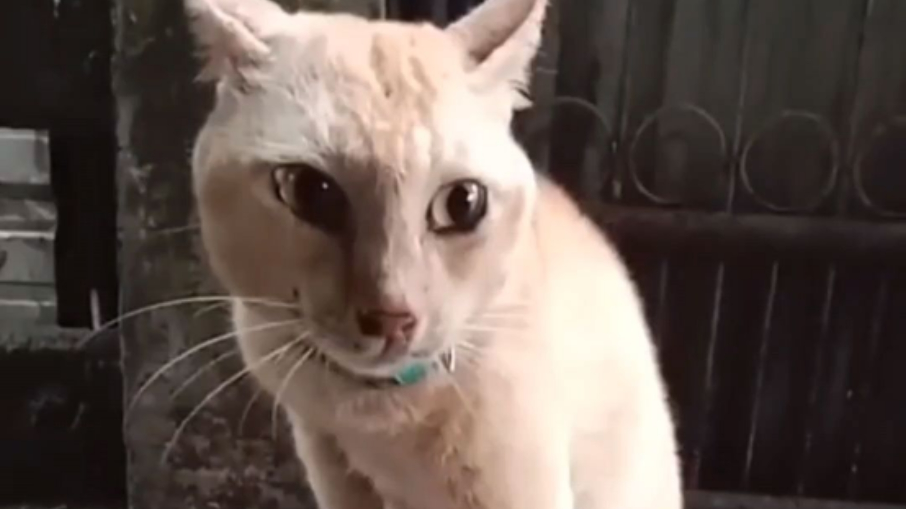 | 1.0万 | 2026-01-26 |
| [农村哈基米绝育（伍）](https://www.bilibili.com/video/BV1gizhBqEnR) | 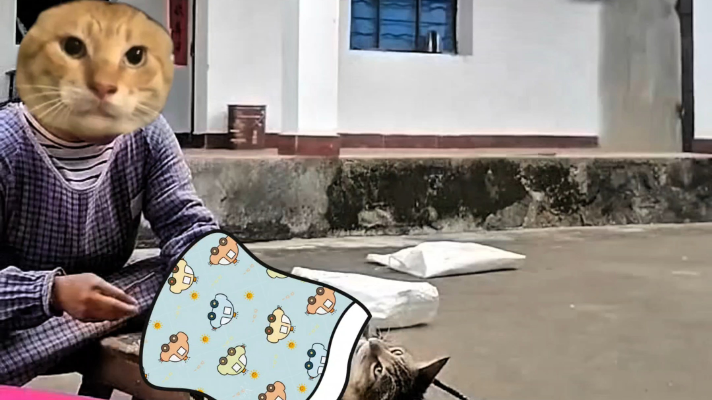 | 1117 | 2026-01-26 |
| [【yyf蓝色哈基米】MVP不会骗人，川神：一个人扛起了大梁！这花我躲不了啊](https://www.bilibili.com/video/BV1KdzxBEEVX) |  | 1.2万 | 2026-01-25 |
| [外教跟小白联动了](https://www.bilibili.com/video/BV1WAzQBSEUp) |  | 61.8万 | 2026-01-25 |
| [☝🤓管！⚡⚡⚡](https://www.bilibili.com/video/BV1nMzSBBEGd) |  | 37.1万 | 2026-01-25 |
| [迟来的哈基米之歌~三等分的蓝莲哈~被玩坏的蓝莲花~](https://www.bilibili.com/video/BV1Nhz3BuEDx) |  | 970 | 2026-01-24 |
| [白雪矮人与七个小公主🐱](https://www.bilibili.com/video/BV1R1zTBGE8g) |  | 58.7万 | 2026-01-23 |
| [哈基米～～](https://www.bilibili.com/video/BV11wzMBhE2F) | 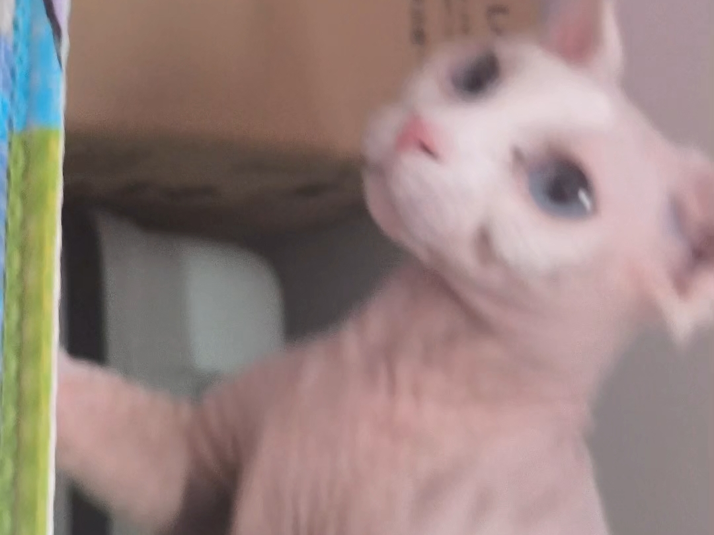 | 569 | 2026-01-23 |
| [【大鸣王潮1566】我一直在哭](https://www.bilibili.com/video/BV1W5kMBPECK) |  | 113.9万 | 2026-01-19 |
| [科比挑战鳌太线失败](https://www.bilibili.com/video/BV1e6kcBAEBG) |  | 61.2万 | 2026-01-16 |
| [哈基米套圈圈#哈基米 #套圈圈 #套娃 #哈基米套圈 #长毛猫](https://www.bilibili.com/video/BV1wHkcBjEq2) | 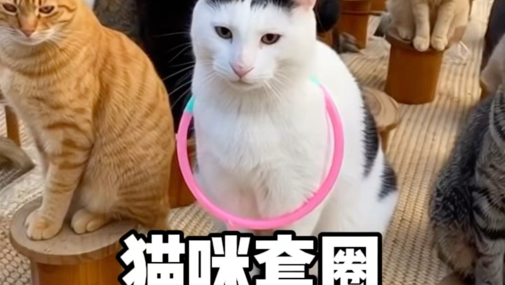 | 2.9万 | 2026-01-15 |
| [就你不让我进是吧](https://www.bilibili.com/video/BV1A3rpBzEq8) |  | 263.9万 | 2026-01-14 |
| [【邪饿哈基米】最新视频已上线，快来围观！](https://www.bilibili.com/video/BV1QnrqBZEU7) |  | 3.7万 | 2026-01-12 |
| [馆长1.12直播⑹，馆长展示他饲养的猫咪，对自己的哈基米都开始横向发展表示困惑](https://www.bilibili.com/video/BV1bxrvBmEGk) |  | 2.8万 | 2026-01-12 |
| [疯狂山脉的一角](https://www.bilibili.com/video/BV1dcqKBiE6C) |  | 356.5万 | 2026-01-06 |
| [Ugress《Witch Parade Assassin》百万豪装录音棚大声听](https://www.bilibili.com/video/BV1WovhBEEPx) |  | 20.7万 | 2025-12-30 |
| [【哈基米音乐】近月的隙间BGM - 晚祷的曼波 (原神 晚祷的铃歌) (原曲不使用)](https://www.bilibili.com/video/BV1waxFzQEsw) |  | 5.7万 | 2025-10-25 |
| [路遇爱猫人士 哈基米似乎有1.4了](https://www.bilibili.com/video/BV1fPHnzdETb) |  | 11.5万 | 2025-10-01 |
| [｜ 循环歌单 ｜【 唐伯虎说dj 】 ｜ 哈基米版 ｜ -78物业-](https://www.bilibili.com/video/BV18gpRzyEwJ) |  | 19.6万 | 2025-09-20 |
| [哈基米你这家伙，根本不管水母厨的死活😩](https://www.bilibili.com/video/BV1VvpzzGEK6) |  | 13.5万 | 2025-09-15 |
| [我听说有人打三角洲需要这个《基米说逐渐升调版》但是升到最高怎么感觉像小马了](https://www.bilibili.com/video/BV1m3pEzTEKd) |  | 73.2万 | 2025-09-13 |
| [哈基咪：？](https://www.bilibili.com/video/BV1ooHmzNETp) | 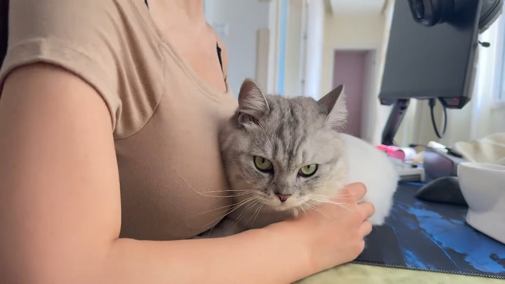 | 6459 | 2025-09-10 |
| [【重音テト/中译/搬运】Doomer【東京真中】](https://www.bilibili.com/video/BV1DFhmz2Ehn) |  | 316.5万 | 2025-08-28 |
| [超级无敌可爱的猫猫向日葵！！！](https://www.bilibili.com/video/BV1PBe2zCENm) |  | 147.1万 | 2025-08-28 |
| [哈吉米被兄弟制裁了](https://www.bilibili.com/video/BV1RF8azqE72) |  | 28.0万 | 2025-07-26 |
| [Minecraft纯净哈基米：White Hands(Wet Hands)](https://www.bilibili.com/video/BV1BiuBzyEVv) |  | 17.9万 | 2025-07-14 |
| [哈基米的反应速度是门的七倍，不舒服会自己走开的](https://www.bilibili.com/video/BV1QB3vzYEts) | 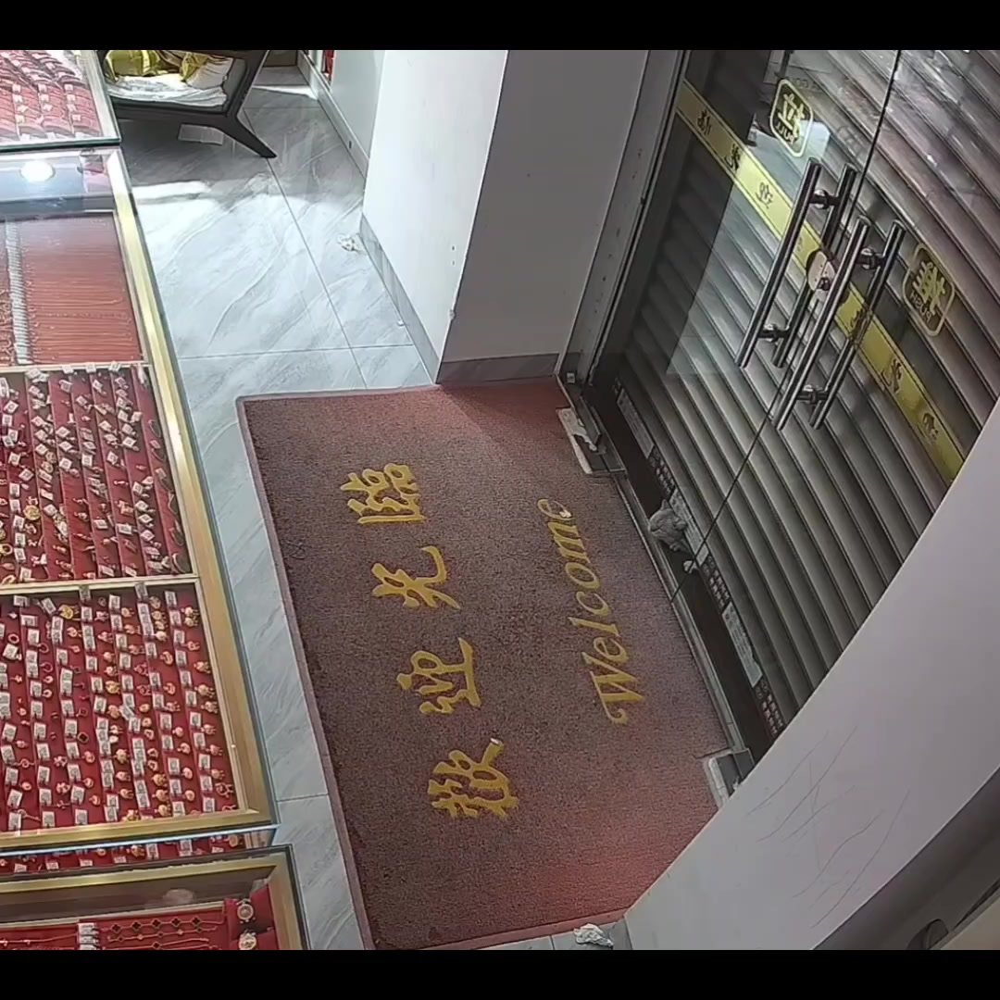 | 19.7万 | 2025-07-06 |
| [【私人海豚音翻唱】哈基米：歌剧2](https://www.bilibili.com/video/BV1M3gkzGEFU) |  | 27.1万 | 2025-06-30 |
| [逃离哈基米！世界最古老的猫村](https://www.bilibili.com/video/BV19KMCz2EVw) |  | 105.3万 | 2025-06-14 |
| [【哈基米FM】诗人歌剧：2](https://www.bilibili.com/video/BV1CN7VzMEXt) |  | 13.7万 | 2025-05-29 |
| [哈基米链式反应](https://www.bilibili.com/video/BV1hKJVzsEWR) | 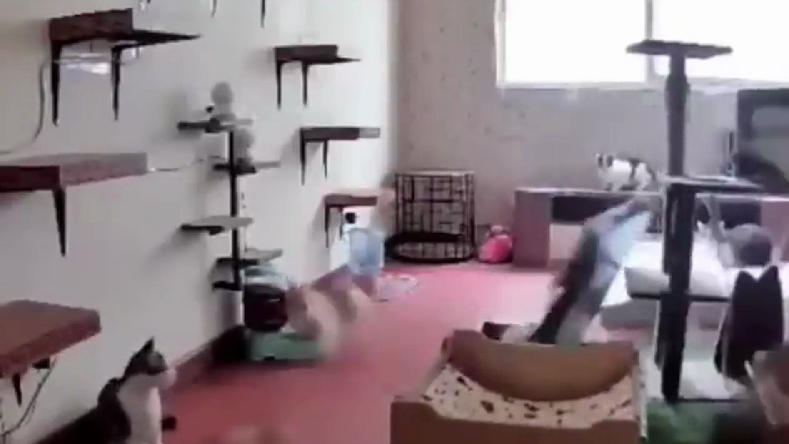 | 24.3万 | 2025-05-18 |
| [哈基米，究竟多么绝望才能跳出这样的舞步…](https://www.bilibili.com/video/BV1fsVmzmE7j) | 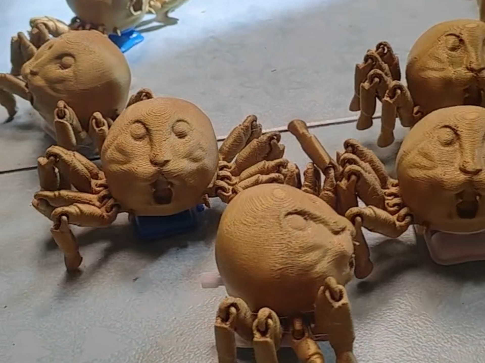 | 27.4万 | 2025-05-06 |
| [大大的哈基米，喜欢卖萌，但在野外却战斗力爆棚](https://www.bilibili.com/video/BV1tWV2z8ESa) | 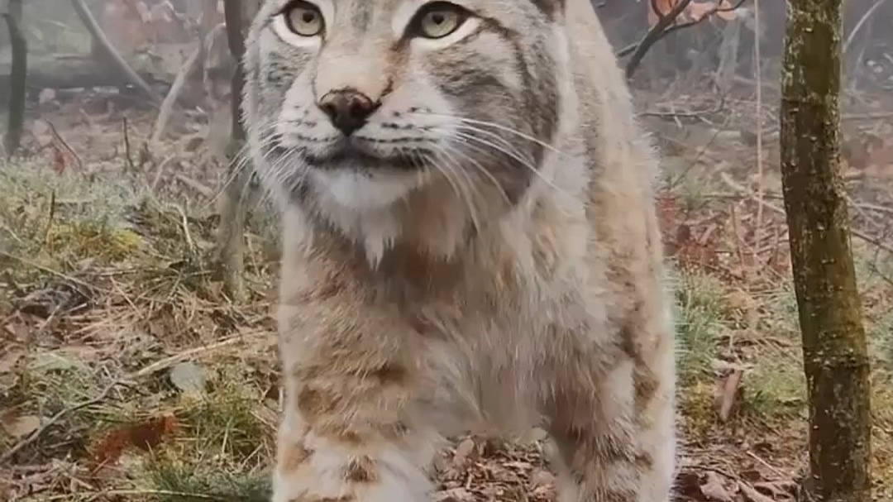 | 25.1万 | 2025-05-06 |
| [（补档）哈基米铃声](https://www.bilibili.com/video/BV16MoNYwEL1) |  | 29.6万 | 2025-04-16 |
| [可爱小哈基米和老爸生活](https://www.bilibili.com/video/BV1xnAeeME9Y) |  | 34.9万 | 2025-02-18 |
| [哈基米音乐里那些堪称天才的神人名句。](https://www.bilibili.com/video/BV1DWY8eyE8s) |  | 69.1万 | 2024-08-09 |

---
*最后更新: 2026-02-02 03:14:36 (自动生成)*
*数据来源: [Bilibili](https://www.bilibili.com)*

## 使用说明

运行以下命令更新视频列表:
```bash
python3 fetch_hajimi_videos.py
```
