# awesome-hajimi
collections of hajimi (哈基米 in Chinese) on the Internet.

## 视频列表 (Video List)

| 视频标题 (Title) | 封面 | 播放量 (Views) | 发布日期 (Date) |
|---|---|---|---|
| [哈基米助眠丨响声薯片和毛巾卷的声音](https://www.bilibili.com/video/BV1jwUcBDEEM) | 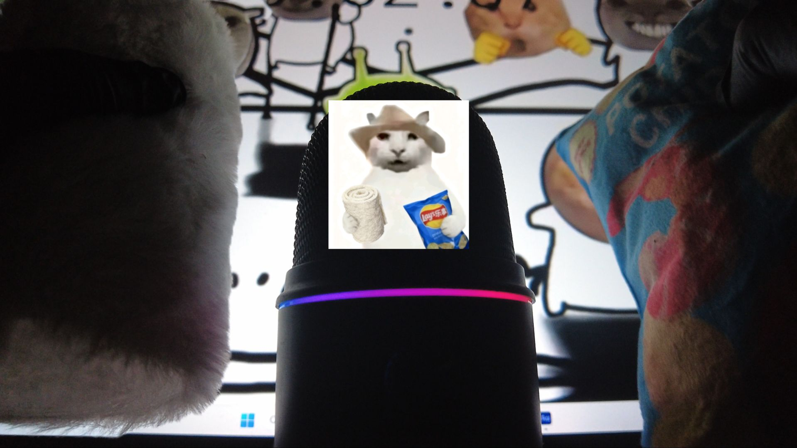 | 221 | 2025-11-23 |
| [哈基米一连吃了七个鸽子被抓](https://www.bilibili.com/video/BV1ncUABFEyc) | 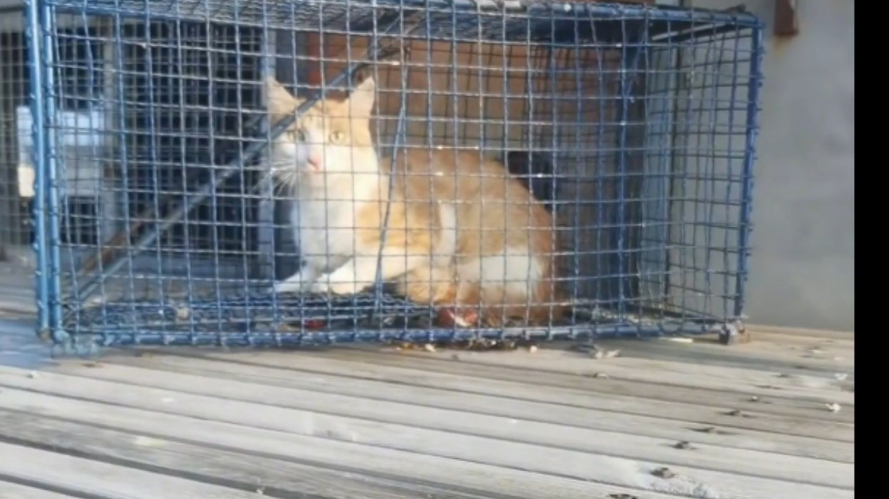 | 210 | 2025-11-23 |
| [“我都快忘了哈基米是蜂蜜的意思了”！チクッ](https://www.bilibili.com/video/BV1woUsBwEvR) | 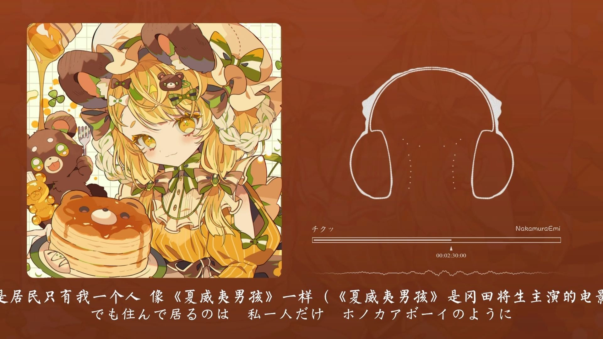 | 1758 | 2025-11-23 |
| [哈基米南北绿豆 绝航9杀疾风AS Val+AWM](https://www.bilibili.com/video/BV15gUcBLE4h) |  | 48 | 2025-11-22 |
| [情绪哈基桶（完整版/原曲不使用）](https://www.bilibili.com/video/BV1QjUxB7EZM) |  | 1554 | 2025-11-22 |
| [基米这个南北绿豆](https://www.bilibili.com/video/BV1qSUxBREg3) |  | 1196 | 2025-11-22 |
| [曼波史诗超燃曲-美杜莎(R姐)主题[哈基米音乐]](https://www.bilibili.com/video/BV1fxU4BFErU) |  | 42 | 2025-11-22 |
| [一小区的哈基米全让兔兔当斐基悲给用力(悲](https://www.bilibili.com/video/BV1PjU4BTEME) | 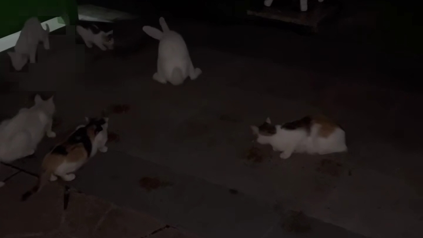 | 113 | 2025-11-22 |
| [【哈基米/PJSK】马真冬也是赛马娘——Empurple/浸染成紫](https://www.bilibili.com/video/BV16WU4BaEV5) |  | 660 | 2025-11-22 |
| [猫儿这个乖](https://www.bilibili.com/video/BV14gU4B3EhW) | 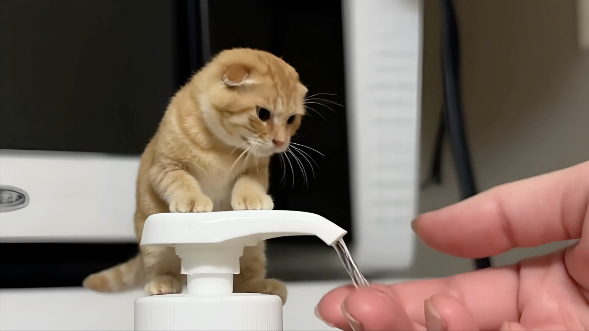 | 3153 | 2025-11-22 |
| [曼波王国保卫战，哈基米曼波～～～南北路多～～](https://www.bilibili.com/video/BV1pYUWBZEed) |  | 60 | 2025-11-22 |
| [好端庄好温柔的哈基米](https://www.bilibili.com/video/BV1LmUWBEEpT) | 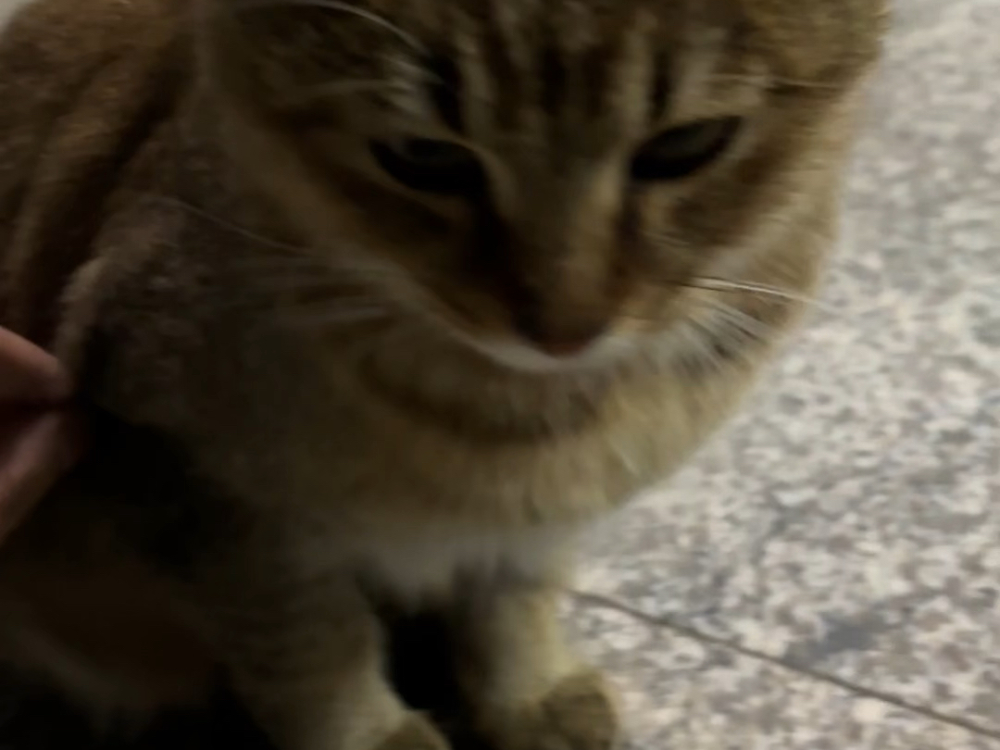 | 891 | 2025-11-22 |
| [小基米:妈妈酱，我好像要去喵星了](https://www.bilibili.com/video/BV1qyUWBnEVF) | 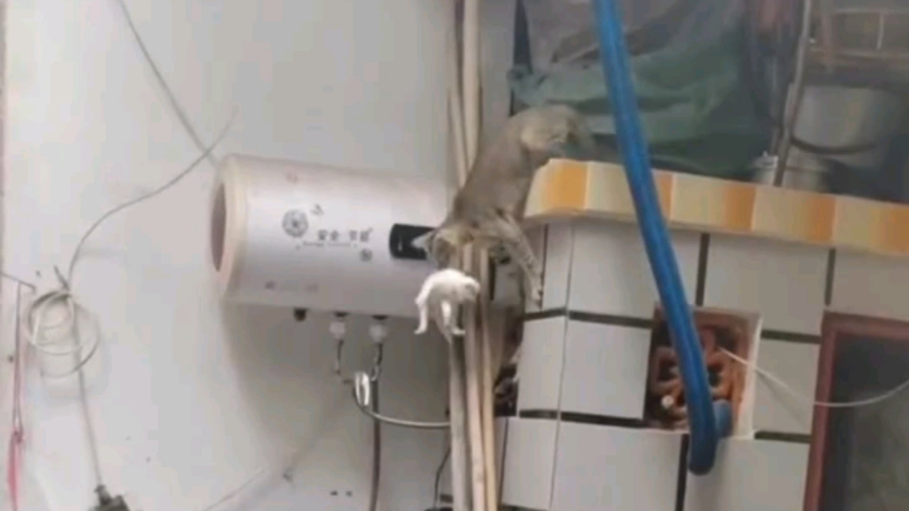 | 8043 | 2025-11-22 |
| [舌 尖 上 的 哈 基 米](https://www.bilibili.com/video/BV16rUWBpEMo) | 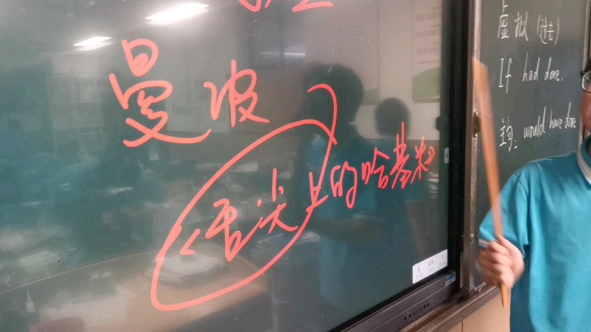 | 2044 | 2025-11-22 |
| [关于我用哈基米半小时做的旮旯game平台](https://www.bilibili.com/video/BV1KTUsBvEup) |  | 638 | 2025-11-22 |
| [【哈基米曼波】【循环歌单】｜ 【猫猫这个可爱】｜ 《草帽小子の小曲》](https://www.bilibili.com/video/BV1QzUsBkEsX) |  | 133 | 2025-11-22 |
| [太变态了！哈基米美羊羊版，吊打 即梦/sora2的免费无限制AI生图/视频软件，比付费还强！(附安装包）](https://www.bilibili.com/video/BV1U1UsBBEEZ) |  | 379 | 2025-11-22 |
| [【哈基米电音】Escape](https://www.bilibili.com/video/BV1UkUsB6E7x) |  | 656 | 2025-11-22 |
| [生活就像哈基米，只有会哈气的人才能到达彼岸](https://www.bilibili.com/video/BV1qxUsBpEaE) | 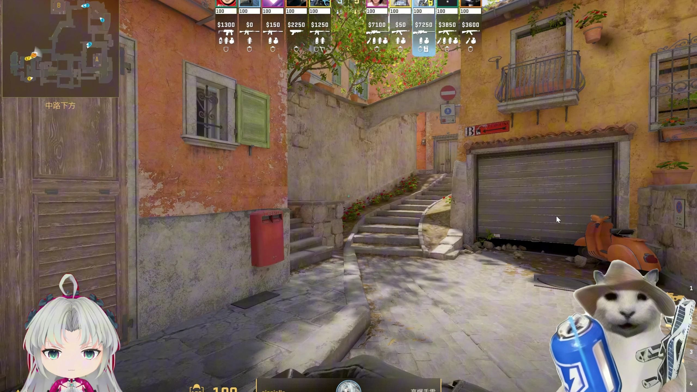 | 100 | 2025-11-22 |
| [报告人类，你有一只哈基米待领取](https://www.bilibili.com/video/BV1TCUpBAEFr) |  | 207 | 2025-11-22 |
| [哈基米/哈猛乐队-Last Christmas](https://www.bilibili.com/video/BV1UkUsB6EYi) |  | 457 | 2025-11-22 |
| [【哈基米音乐】如⚡果⚡爱⚡忘⚡哈](https://www.bilibili.com/video/BV1d4UsBDEiv) |  | 835 | 2025-11-22 |
| [像哈基米一样社恐的宝宝【恶鬼roro】](https://www.bilibili.com/video/BV1emUHB6E3s) |  | 2484 | 2025-11-22 |
| [哈基米](https://www.bilibili.com/video/BV1GSUHBuEmB) |  | 1315 | 2025-11-22 |
| [我们小区里的哈基米还是太多了](https://www.bilibili.com/video/BV1VSUHBuExd) | 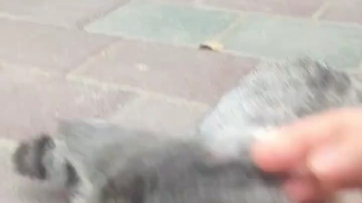 | 129 | 2025-11-22 |
| [【纯净流哈基米】基米不列](https://www.bilibili.com/video/BV13DUHBBE2a) | 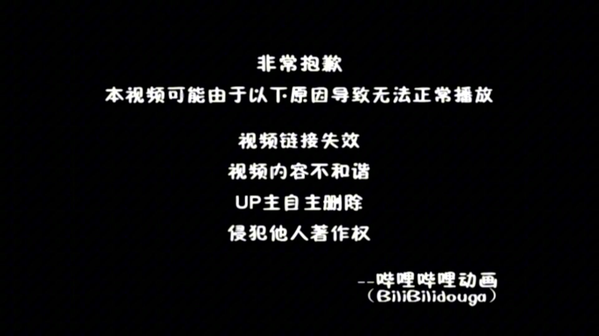 | 1048 | 2025-11-22 |
| [【WOTA艺/多校联合】第一届哈基米叮咚鸡胖宝宝踩踩杯录像](https://www.bilibili.com/video/BV1VDUHBBEzt) |  | 439 | 2025-11-22 |
| [不中了，听完后脑子里全是哈基米😂](https://www.bilibili.com/video/BV16vUHBUEsu) |  | 502 | 2025-11-22 |
| [今日投喂哈基米](https://www.bilibili.com/video/BV1EqUHB7EhK) | 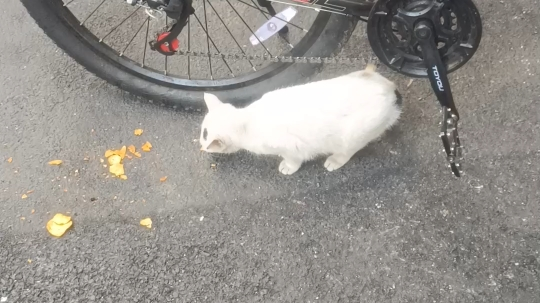 | 211 | 2025-11-22 |
| [国外的会哈气的哈基米](https://www.bilibili.com/video/BV1PgUpBRELM) | 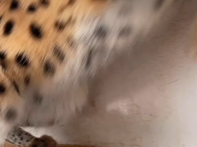 | 20 | 2025-11-22 |
| [哈基米](https://www.bilibili.com/video/BV1FLUpBHEdU) | 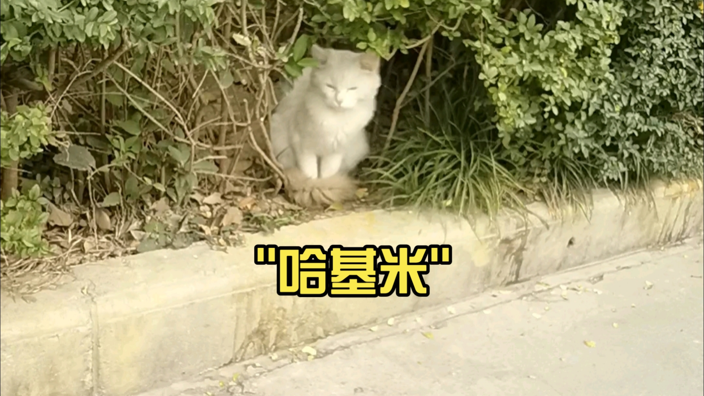 | 179 | 2025-11-22 |
| [⁣美女第一次捡哈基米，结果悲剧了](https://www.bilibili.com/video/BV1zJUpBUETx) |  | 824 | 2025-11-22 |
| [招财传世经典之作:提抖放哈  („ಡωಡ„)](https://www.bilibili.com/video/BV1fJUpBmEt4) |  | 3602 | 2025-11-22 |
| [🐱身骑见缸马🐱听哭百万哈气咪😿](https://www.bilibili.com/video/BV1nLUpBHEK2) |  | 1394 | 2025-11-22 |
| [【活侠传×哈基米音乐】余生可哈](https://www.bilibili.com/video/BV1NKUpBtEGN) |  | 1173 | 2025-11-22 |
| [夜半惊魂](https://www.bilibili.com/video/BV1PTUpBoEmf) |  | 13.8万 | 2025-11-22 |
| [[70%]哈基米-All Falls Down 进度已完成70%](https://www.bilibili.com/video/BV1xAUpB8EyT) |  | 595 | 2025-11-22 |
| [哈基米勇闯异世界——傻了吧唧兽王战役_第01集](https://www.bilibili.com/video/BV12CUpBwEXh) |  | 3547 | 2025-11-22 |
| [哈基米立正了！](https://www.bilibili.com/video/BV1TCUpBAEKp) | 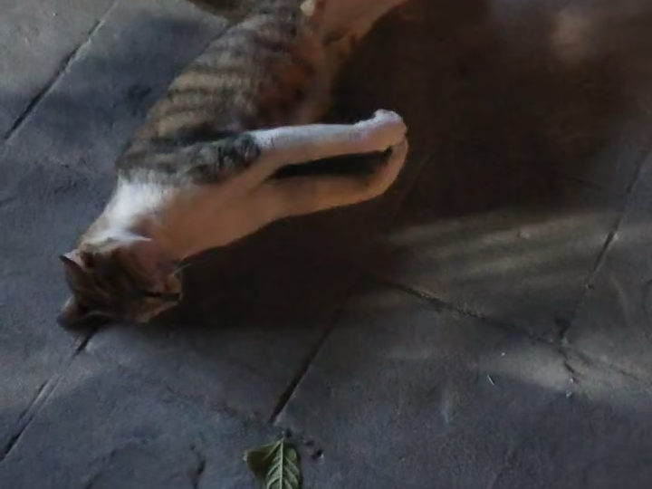 | 1.6万 | 2025-11-22 |
| [【哈基米音乐】曼波安特-冒险岛阿里安特](https://www.bilibili.com/video/BV1osUpB5EcM) |  | 667 | 2025-11-22 |
| [哈基米咬蛇反被中毒，后头吐白沫，幸好毒性不强后面好了](https://www.bilibili.com/video/BV1oxUpBCEAD) | 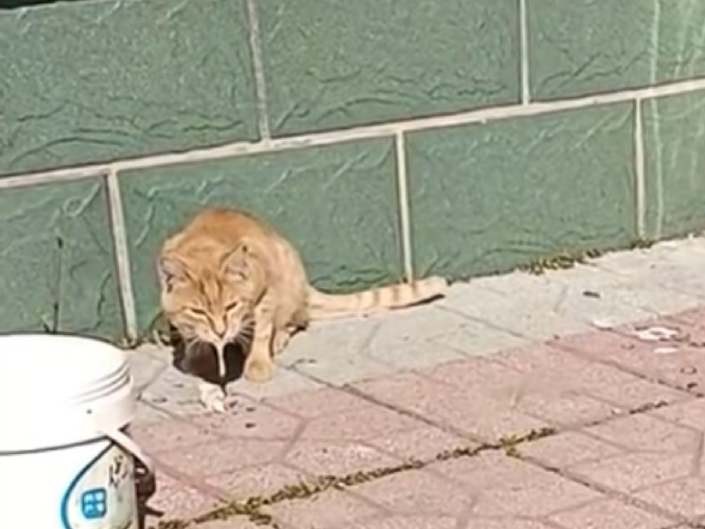 | 2.0万 | 2025-11-22 |
| [【哈基米神人音乐合集】“没有什么能够阻挡，我对自由的向往”](https://www.bilibili.com/video/BV1ixUpByEMa) |  | 1097 | 2025-11-22 |
| [机长补番必看！01年最后的一趟航班，2001年日本动画，片(下)](https://www.bilibili.com/video/BV1XhUpBgEGZ) | 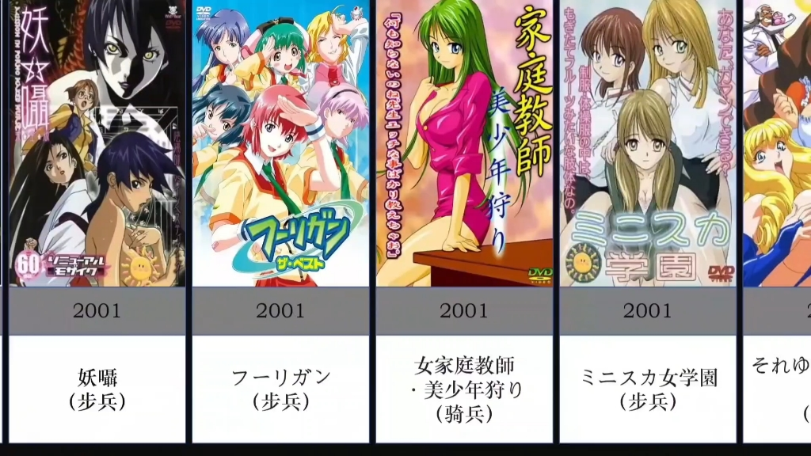 | 2.0万 | 2025-11-22 |
| [攻壳基动队 哈基米音乐_謡 I](https://www.bilibili.com/video/BV1HRUpBRER3) |  | 528 | 2025-11-22 |
| [哈基米](https://www.bilibili.com/video/BV1kQUpBdEMq) | 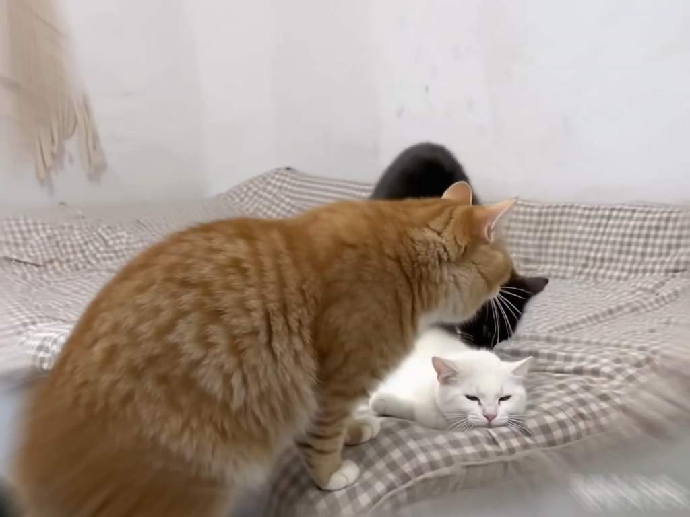 | 256 | 2025-11-22 |
| [世界就是一个巨大的哈基米](https://www.bilibili.com/video/BV1r9UpBsEWA) |  | 1260 | 2025-11-22 |
| [🐱基米清单🐱&#x27;&#x27;Checklist~哈 基 米&#x27;&#x27;](https://www.bilibili.com/video/BV16QUEBgEVi) |  | 8.3万 | 2025-11-22 |
| [哈基米音乐之——《最后一哈》](https://www.bilibili.com/video/BV1wMUnBEEKM) |  | 428 | 2025-11-22 |
| [【哈基米音乐】浮哈（浮夸-陈奕迅）](https://www.bilibili.com/video/BV1ZLUnBkEWQ) |  | 973 | 2025-11-22 |
| [【哈基米】夜耋（袁雨桢×刘增艳）](https://www.bilibili.com/video/BV1hTUJBFEza) |  | 2972 | 2025-11-22 |
| [sora2生成哈基米偶像剧](https://www.bilibili.com/video/BV1KDULB5ERo) |  | 4928 | 2025-11-22 |
| [盘点kards所有哈基米](https://www.bilibili.com/video/BV1vwUHB3EUB) |  | 2939 | 2025-11-22 |
| [东海帝皇：我喜欢把哈基米浸泡在滚烫的开水里](https://www.bilibili.com/video/BV12eCQBAEkL) |  | 8776 | 2025-11-22 |
| [【哈基米音乐】催眠术メズマライザー（完整版）](https://www.bilibili.com/video/BV1spUHBoECY) |  | 12.5万 | 2025-11-22 |
| [新武器：九阳哈基米南北绿豆](https://www.bilibili.com/video/BV1S8yABvE6b) |  | 1.3万 | 2025-11-22 |
| [哈基米有多高？](https://www.bilibili.com/video/BV1bJUHBfEMC) |  | 861 | 2025-11-22 |
| [哈基米被渔网缠住幸好有哈基人前来营救](https://www.bilibili.com/video/BV1KrUnBdEX8) | 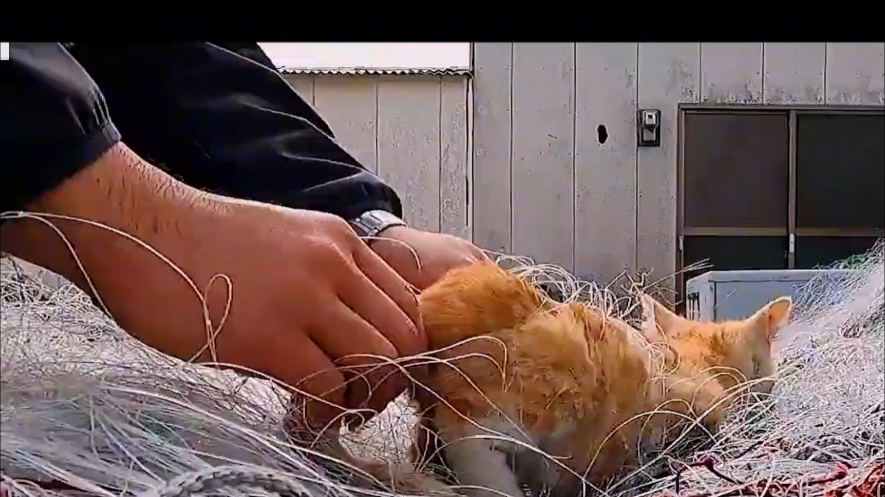 | 364 | 2025-11-22 |
| [【开箱】终于到了 哈基米南北绿豆浆...](https://www.bilibili.com/video/BV1Q8UnBAESo) |  | 7104 | 2025-11-22 |
| [哈基宗日常](https://www.bilibili.com/video/BV194UnBNEER) |  | 2.0万 | 2025-11-22 |
| [我妈的牌搭子，哈基米斗地主](https://www.bilibili.com/video/BV1CyUnBXErr) | 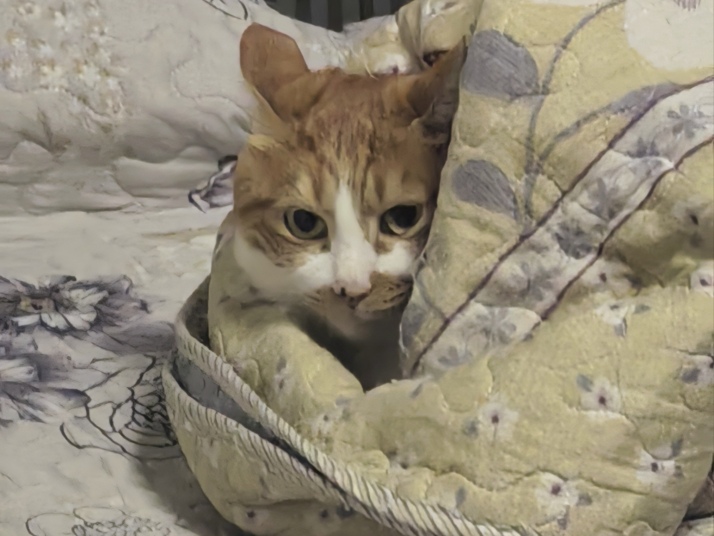 | 1831 | 2025-11-22 |
| [哈基米的约定](https://www.bilibili.com/video/BV1z9UnB2EoD) |  | 1110 | 2025-11-22 |
| [“  哈基人他.....哈尽了.....  ”](https://www.bilibili.com/video/BV1aGUHBeEP2) |  | 24.8万 | 2025-11-22 |
| [快乐的基米（巴啦啦小基米片尾曲）](https://www.bilibili.com/video/BV1sZU7B7E6f) |  | 1079 | 2025-11-21 |
| [哈基米表情包，你最喜欢哪个？](https://www.bilibili.com/video/BV1CjULBqESX) |  | 6.6万 | 2025-11-21 |
| [【哈基米】宣告耄耋（宣告春天）未和谐版](https://www.bilibili.com/video/BV1ogUjB8EgX) |  | 562 | 2025-11-21 |
| [哈基米之洋垃基](https://www.bilibili.com/video/BV1fTUjBaEvi) |  | 6245 | 2025-11-21 |
| [哈基米广告真人版2.0](https://www.bilibili.com/video/BV1TDypBXE5J) |  | 1426 | 2025-11-21 |
| [【哈基米】咱😺の小曲🏳️‍🌈](https://www.bilibili.com/video/BV1R5UjBoEHw) |  | 1581 | 2025-11-21 |
| [【哈基米电音】Ascension--咪tis（Mitis&amp;Dope Acrade）重制加长版](https://www.bilibili.com/video/BV1MyUVB6Ety) |  | 779 | 2025-11-21 |
| [哈基米哟南北绿豆~](https://www.bilibili.com/video/BV1G4y5BTEga) |  | 636 | 2025-11-21 |
| [【哈基米音乐】打上基火🐱（原曲不使用）](https://www.bilibili.com/video/BV1oTU5BREmJ) |  | 600 | 2025-11-21 |
| [哈基米版《前进吧，赛罗》](https://www.bilibili.com/video/BV1UsU5BGE3r) |  | 1634 | 2025-11-21 |
| [【哈基米音乐】曼波无限好（夕阳无限好-陈奕迅）](https://www.bilibili.com/video/BV1yhU5BMEXC) |  | 1073 | 2025-11-21 |
| [【鸣潮】快上号！找一个萝莉领取5星声成就！帮小萝莉变出一大堆哈基米！成就攻略《彩虹猫》《黑猫老师》](https://www.bilibili.com/video/BV1nCU5BcEeh) |  | 4367 | 2025-11-21 |
| [【卡丘快闪】哈基米喜提新魔法红皮喵～](https://www.bilibili.com/video/BV1RmyMBtEMt) |  | 1241 | 2025-11-21 |
| [哈基米无证驾驶，翻车了！](https://www.bilibili.com/video/BV139yMBsErN) |  | 710 | 2025-11-21 |
| [【元祖!哈基米chan】《Winning Post 10 2026》官方游戏宣传视频｜PS5 &amp; PS4](https://www.bilibili.com/video/BV1cqyMBKE8h) |  | 1.3万 | 2025-11-21 |
| [【基米档案No.83】哈基田园犬](https://www.bilibili.com/video/BV1pUyNBcEez) |  | 1.9万 | 2025-11-21 |
| [猫哥:再凶的哈基米也是坐骑！](https://www.bilibili.com/video/BV1CGyuB3EBD) |  | 8221 | 2025-11-21 |
| [闹钟响了 耄耋就这样](https://www.bilibili.com/video/BV1GvyuB4EuP) |  | 4.5万 | 2025-11-21 |
| [[补档]爱耄TV之哈基米水围城](https://www.bilibili.com/video/BV1qxyuBaEPx) |  | 2406 | 2025-11-21 |
| [布鲁斯埋葬了自己的好友哈基米](https://www.bilibili.com/video/BV1VSyKBJEL5) |  | 1.1万 | 2025-11-21 |
| [卧槽！太逆天了！外国情侣发现长城上有哈基米，TikTok评论区表示猫猫才是长城的守护者，砖上有猫脚印！！](https://www.bilibili.com/video/BV1UdyKB5EDs) |  | 22.5万 | 2025-11-20 |
| [哈基米果然是个大老鼠，粘鼠板合上都能被粘](https://www.bilibili.com/video/BV1VwyPBCErA) | 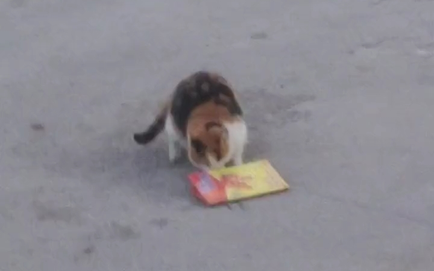 | 1883 | 2025-11-20 |
| [原则上我是不让哈基米上床的 可是天太冷了](https://www.bilibili.com/video/BV1w2yABREFy) | 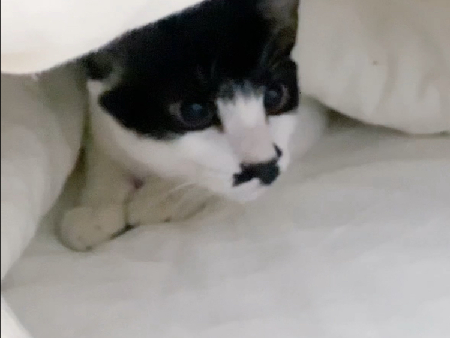 | 617 | 2025-11-20 |
| [《补档》圆头哈基米送去喵星](https://www.bilibili.com/video/BV147yPBYEbV) | 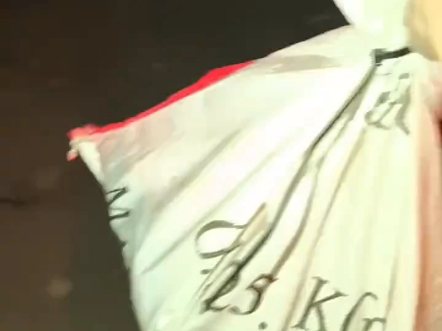 | 2186 | 2025-11-20 |
| [“震惊：哈基米南北绿豆豆浆跟九阳集团没有关系！”](https://www.bilibili.com/video/BV1jpyEBxE9X) | 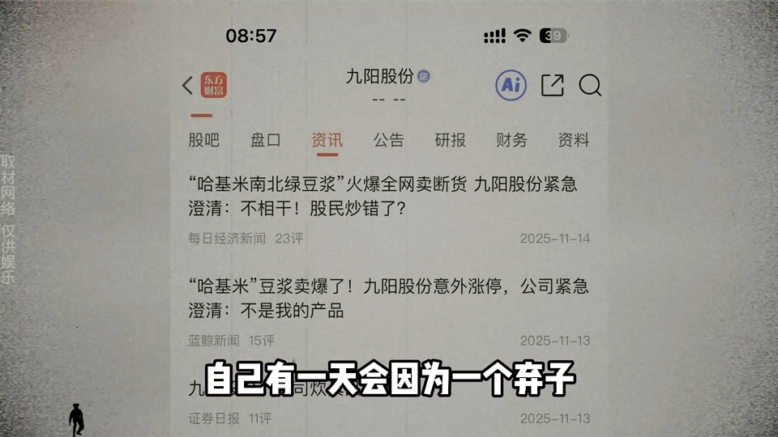 | 2716 | 2025-11-20 |
| [趣味相框3D打印！哈基米陪伴左右！](https://www.bilibili.com/video/BV1WBycBHEZn) |  | 4106 | 2025-11-20 |
| [边牧就喜欢欺负哈基米](https://www.bilibili.com/video/BV1fMyABSEEf) | 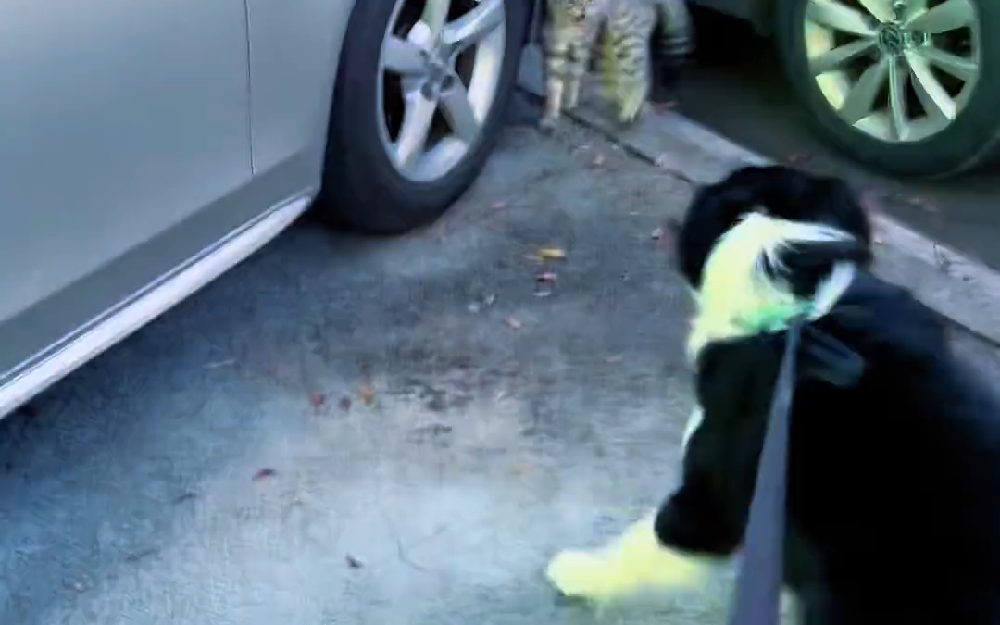 | 797 | 2025-11-20 |
| [基米小镇：下雪天网络怎么没了](https://www.bilibili.com/video/BV1XeCZB4EWY) |  | 3107 | 2025-11-20 |
| [哈基米勇闯异世界——天上下起了绿豆雨](https://www.bilibili.com/video/BV167ynBqExw) |  | 3717 | 2025-11-19 |
| [焚决合集9 落哈基米坡](https://www.bilibili.com/video/BV1Q3yJBQEy2) |  | 3550 | 2025-11-19 |
| [【恶鬼roro】哥斯拉宝宝看《神曼波》哈基米曼波是什么？好神圣的歌](https://www.bilibili.com/video/BV15EC6ByEtG) |  | 1.5万 | 2025-11-17 |
| [这只是朕的日常生活](https://www.bilibili.com/video/BV1aBCqBPEDe) | 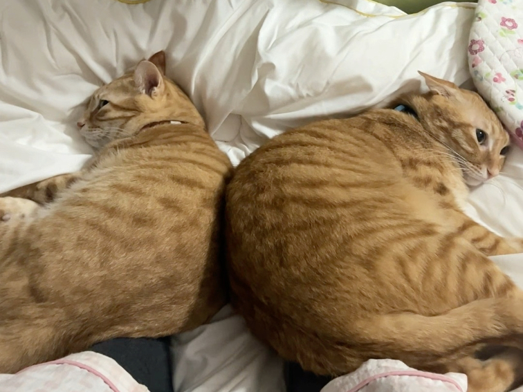 | 196.6万 | 2025-11-17 |
| [循环歌单｜《Normal No More(哈基米)》｜【哈基米喔南北路豆】](https://www.bilibili.com/video/BV1tmCDBvEQT) |  | 632 | 2025-11-16 |
| [基绊的力量](https://www.bilibili.com/video/BV14XCDBwEiR) |  | 8168 | 2025-11-16 |
| [“两碗烂肉面，外面吃去”](https://www.bilibili.com/video/BV1agC1BxEbD) | 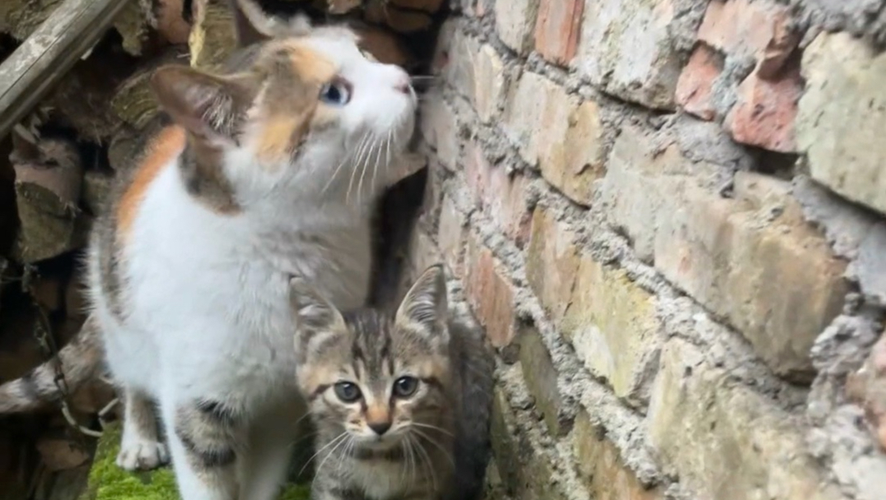 | 29.0万 | 2025-11-15 |
| [“哈基米南北绿豆浆”，营销界来了个天才😆😆😆](https://www.bilibili.com/video/BV1jtC5BkE3Q) |  | 10.7万 | 2025-11-15 |
| [解压小视频](https://www.bilibili.com/video/BV1ZRkiBzESd) |  | 24.6万 | 2025-11-10 |
| [哈基米助眠丨按摩你的头皮(附带部分模仿德叔开场白)](https://www.bilibili.com/video/BV1kjYUzrE4g) |  | 8.9万 | 2025-08-21 |

---
*最后更新: 2025-11-23 02:48:43 (自动生成)*
*数据来源: [Bilibili](https://www.bilibili.com)*

## 使用说明

运行以下命令更新视频列表:
```bash
python3 fetch_hajimi_videos.py
```
