# awesome-hajimi
collections of hajimi (哈基米 in Chinese) on the Internet.

## 视频列表 (Video List)

| 视频标题 (Title) | 封面 | 播放量 (Views) | 发布日期 (Date) |
|---|---|---|---|
| [tell咪](https://www.bilibili.com/video/BV1xY4GzYEdu) |  | 3496 | 2025-10-13 |
| [疑似哈基米成人广告流出](https://www.bilibili.com/video/BV1KY4gzREes) |  | 1358 | 2025-10-12 |
| [哈基米牌米基蛤](https://www.bilibili.com/video/BV1qa43zLEKF) | 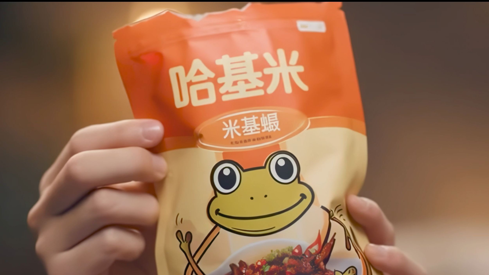 | 3113 | 2025-10-12 |
| [【哈基米】基米是他哈的，曼波也是他哈的“谁…是凶手？？″](https://www.bilibili.com/video/BV13f4MzFEFN) | 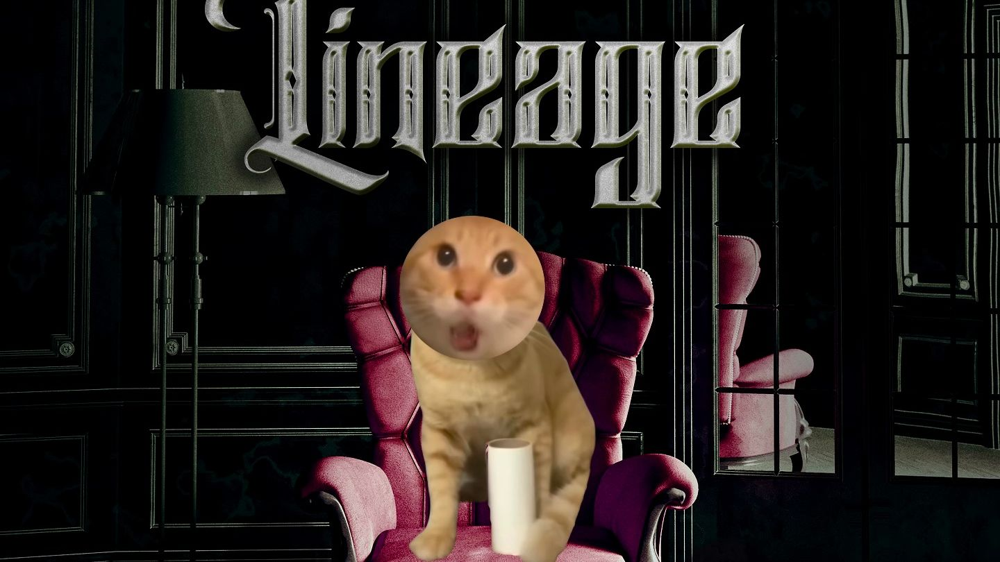 | 4396 | 2025-10-12 |
| [哈基米：遗失的基🐱基](https://www.bilibili.com/video/BV1Bx4uz6E1W) |  | 1571 | 2025-10-12 |
| [【哈基米83.0fm】Nothing new （drop重混版）](https://www.bilibili.com/video/BV1Fs4uzGEnb) |  | 372 | 2025-10-12 |
| [电视里放着基米爱看的节目........该走了！](https://www.bilibili.com/video/BV1da4uziEJH) |  | 1202 | 2025-10-12 |
| [“存了十六年才敢发出来”](https://www.bilibili.com/video/BV1ih4uzTEqQ) |  | 16.7万 | 2025-10-12 |
| [哈基米马路中间表演街舞](https://www.bilibili.com/video/BV1rj4uz2EGp) |  | 2.4万 | 2025-10-12 |
| [原版纯享基米说-明月照哈基](https://www.bilibili.com/video/BV1a64uzcEes) |  | 176 | 2025-10-12 |
| [日本萝莉连续听哈基米音乐，听到空耳笑麻了，现在哈基米音乐这么流行啊](https://www.bilibili.com/video/BV15j4gziEwB) |  | 2753 | 2025-10-12 |
| [中国稀土七伤拳暴打美利坚，川普破防变身哈基米疯狂哈气！](https://www.bilibili.com/video/BV1JK4gzVEPm) |  | 5967 | 2025-10-12 |
| [哈基米：人，我苗条吗？（5.5公斤）](https://www.bilibili.com/video/BV1fn4TzKErc) | 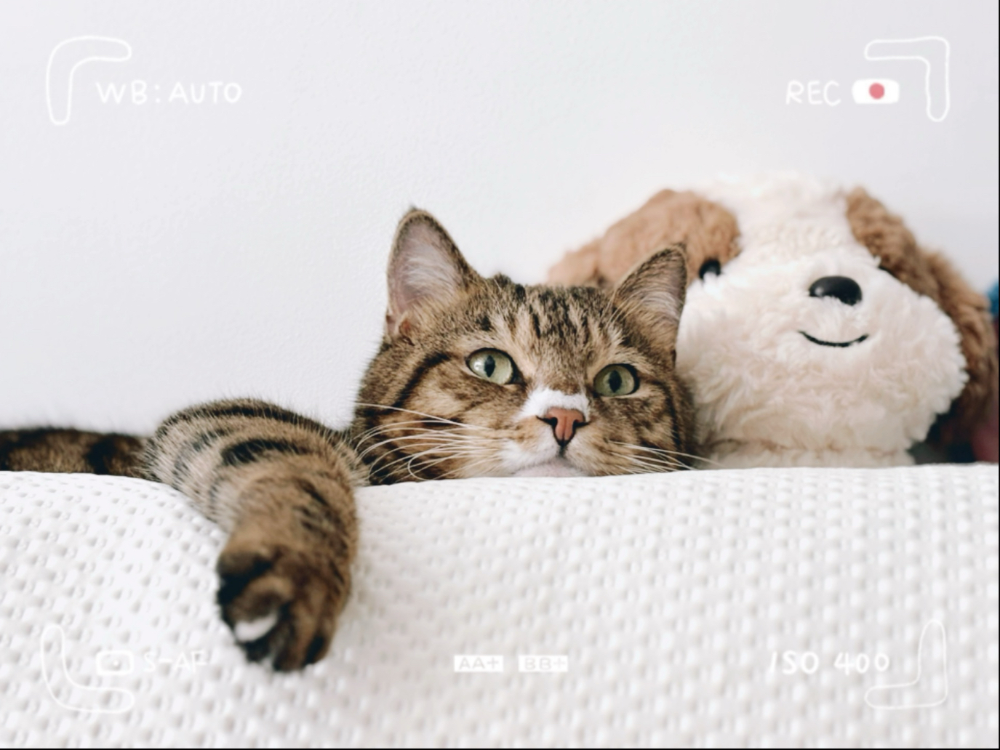 | 391 | 2025-10-12 |
| [顶流版哈基米金曲，三个字怎么能创作出几千首歌？](https://www.bilibili.com/video/BV1QX4KzsE7V) |  | 48.2万 | 2025-10-12 |
| [【AI Neuro&amp;Evil】《神魔基米》哈基米与曼波的史诗之战](https://www.bilibili.com/video/BV1UQ4wzzERo) |  | 2303 | 2025-10-12 |
| [纯净哈基米：百兽之王](https://www.bilibili.com/video/BV1GG4MzhEoT) |  | 531 | 2025-10-12 |
| [哈基米：Uptown Funk](https://www.bilibili.com/video/BV1Ax4PzKEQ9) |  | 10.0万 | 2025-10-12 |
| [新人女牌佬看水无月菌最新游戏王 玩的太帅了! K语言魅力时刻 哈基米南北绿豆大战超帅的异热同心希望皇霍普【尾巴Mezd】我想用决斗让大家绽放笑容](https://www.bilibili.com/video/BV14s4MzpEYt) |  | 1.4万 | 2025-10-12 |
| [齐 天 大 耋](https://www.bilibili.com/video/BV1LH4NzZECr) |  | 40.1万 | 2025-10-12 |
| [《 诸 子 百 哈 》](https://www.bilibili.com/video/BV1Kt4MznESM) |  | 4.8万 | 2025-10-12 |
| [【AI视频】好样的哈基米！](https://www.bilibili.com/video/BV1Rr4wzjEiW) |  | 6.0万 | 2025-10-11 |
| [【优势在我哈基米德】我的最新作品，快来一睹为快！](https://www.bilibili.com/video/BV1yA4AzwEVz) | 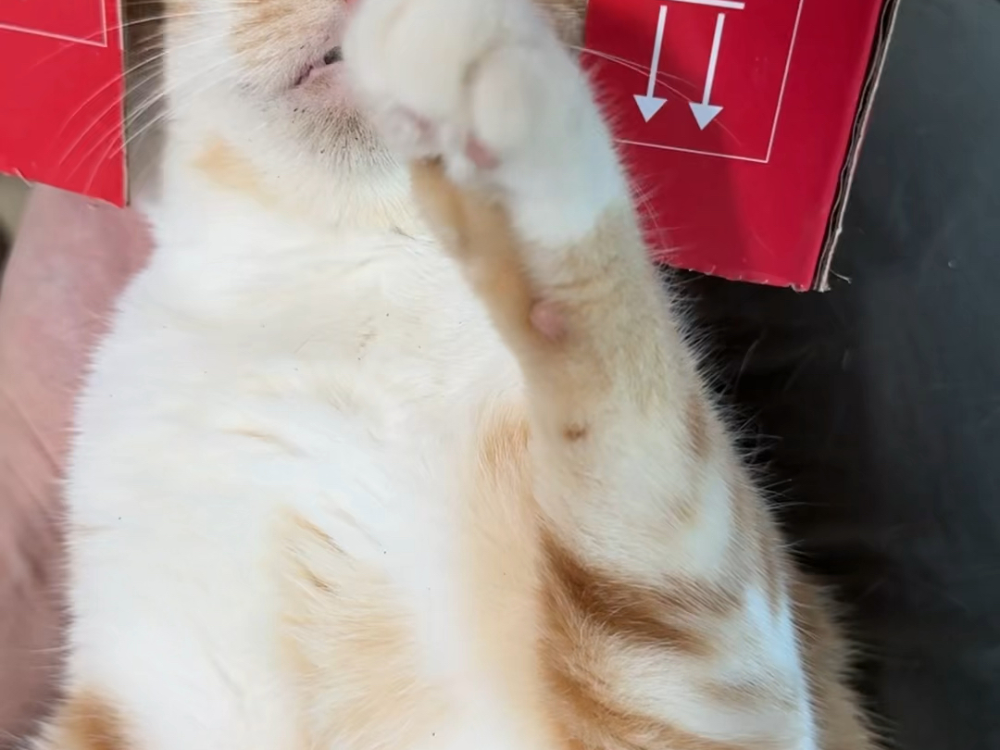 | 5.4万 | 2025-10-11 |
| [【哈基米FM】Nevada](https://www.bilibili.com/video/BV1Ny4AzNEjG) |  | 4.2万 | 2025-10-11 |
| [给老公唱一首《舌尖上的哈基米》，他有什么反应？](https://www.bilibili.com/video/BV1AZ4FzZEYu) | 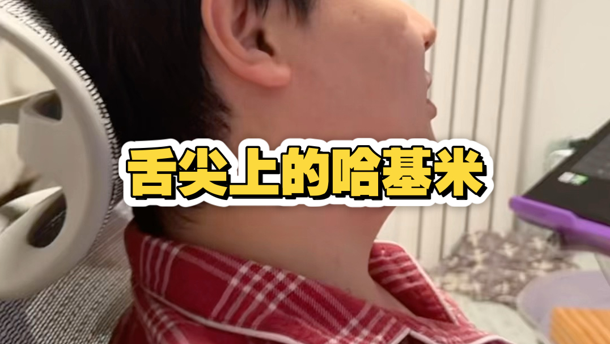 | 2853 | 2025-10-11 |
| [小猫:人类崇脆是个红蛋！！](https://www.bilibili.com/video/BV1mY4WzwEQR) | 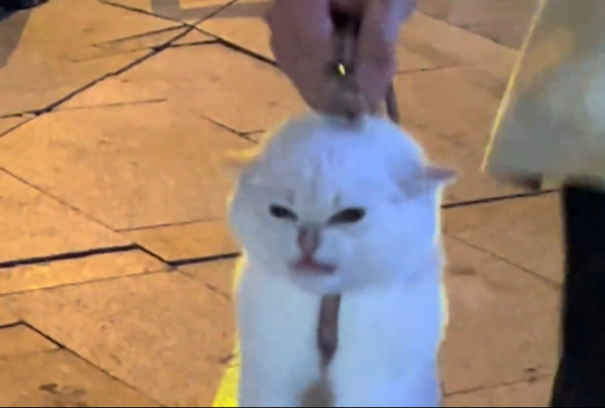 | 11.2万 | 2025-10-11 |
| [给个机会吧，我只想做只好猫！](https://www.bilibili.com/video/BV1FT4czQEzd) | 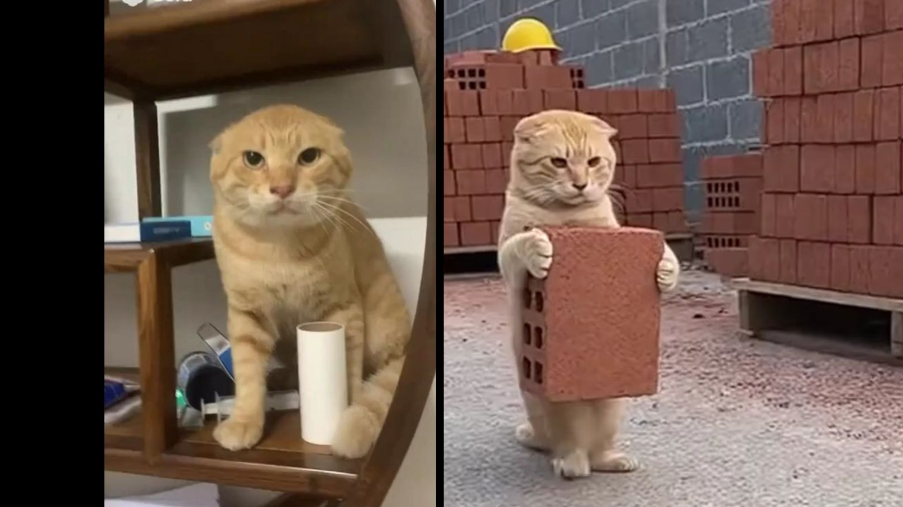 | 13.1万 | 2025-10-11 |
| [哈基米那没路躲~~](https://www.bilibili.com/video/BV1BT4czDEki) | 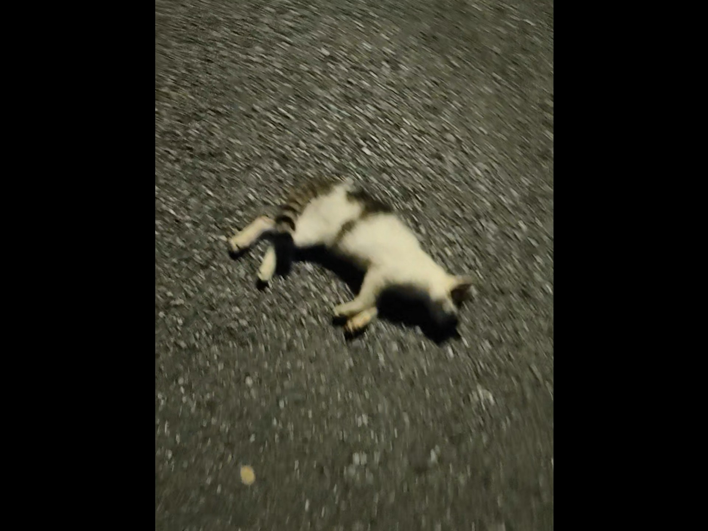 | 6979 | 2025-10-11 |
| [库当哈基米版](https://www.bilibili.com/video/BV1rQ4xzoE5D) |  | 1511 | 2025-10-11 |
| [大狗嚼俱乐部合围自由的哈基米](https://www.bilibili.com/video/BV1164xzNEAb) |  | 3457 | 2025-10-11 |
| [错啦错啦](https://www.bilibili.com/video/BV1vF44zHErd) | 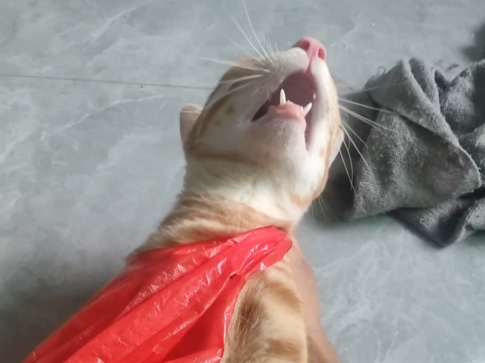 | 26.5万 | 2025-10-11 |
| [基米TV之无能的丈夫](https://www.bilibili.com/video/BV1vk44zXE5i) | 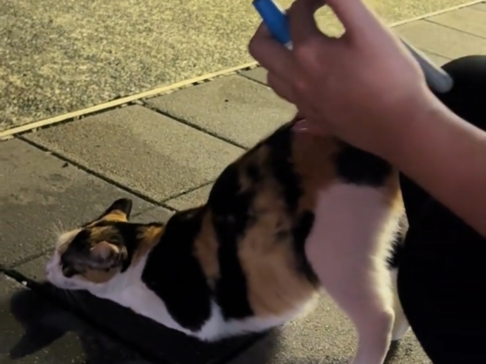 | 10.8万 | 2025-10-11 |
| [《智曼波》真相只有一个！【哈基米音乐】](https://www.bilibili.com/video/BV1sV4nzEEF5) |  | 2261 | 2025-10-10 |
| [🐱各省哈基米酒局口音，哪里的话最好听？](https://www.bilibili.com/video/BV1rP4Hz5Euk) |  | 4.3万 | 2025-10-10 |
| [基米的赞歌就是哈气的赞歌](https://www.bilibili.com/video/BV17g4HzgE4F) | 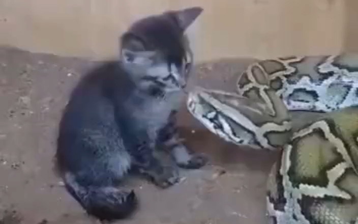 | 1.0万 | 2025-10-10 |
| [sora2生成的哈基米天气预报](https://www.bilibili.com/video/BV1zk4JzzEek) |  | 14.5万 | 2025-10-10 |
| [【おはなばたけ】｜“大脑怎么开始自动填词了【哈基米睡觉の小曲】【花田の小曲】”](https://www.bilibili.com/video/BV1yqxLzYEUw) | 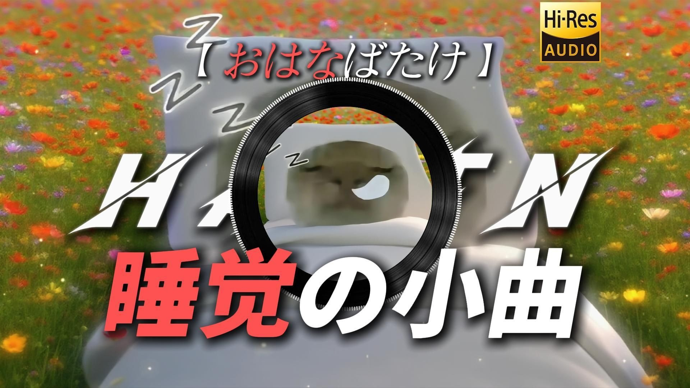 | 2.2万 | 2025-10-10 |
| [自动抚摸机](https://www.bilibili.com/video/BV15bxyzaE3D) | 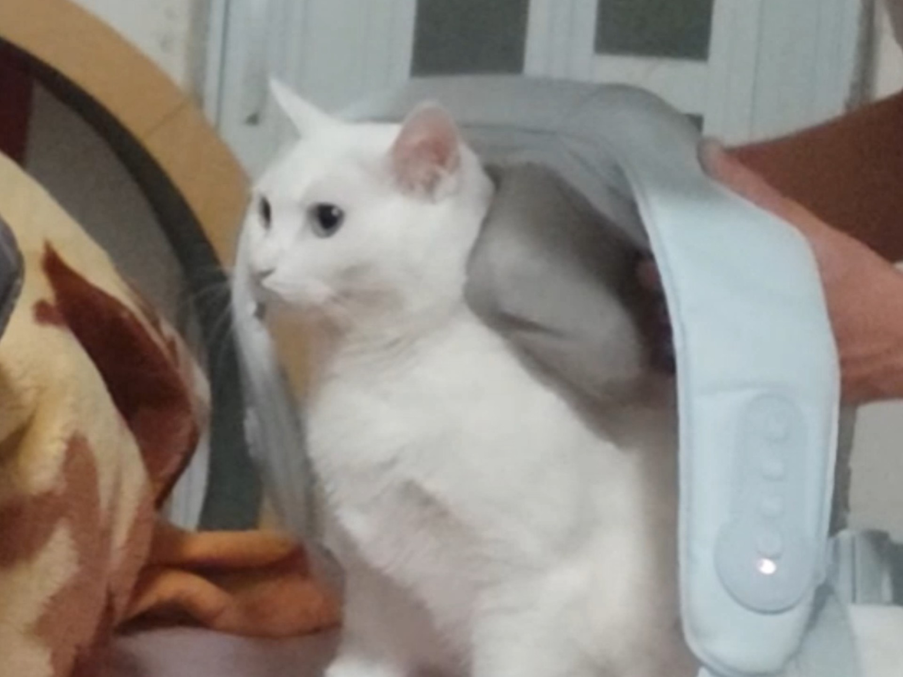 | 12.5万 | 2025-10-10 |
| [循环歌单｜【おはなばたけ】｜“大脑怎么开始自动填词了【哈基米睡觉の小曲】【花田の小曲】”](https://www.bilibili.com/video/BV12YxLzKEnY) | 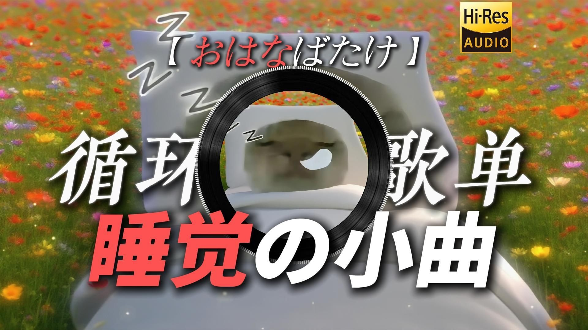 | 56.9万 | 2025-10-10 |
| [【椎名菜羽】日本小土豆看“古守血遊看哈基米后即兴创作”，自己也即兴创作《哈基米音乐》，以后就用这个唱了！](https://www.bilibili.com/video/BV1wQxyz2E8r) |  | 5862 | 2025-10-09 |
| [大狗嚼俱乐部排行榜锐评](https://www.bilibili.com/video/BV1kMxkzMEW2) | 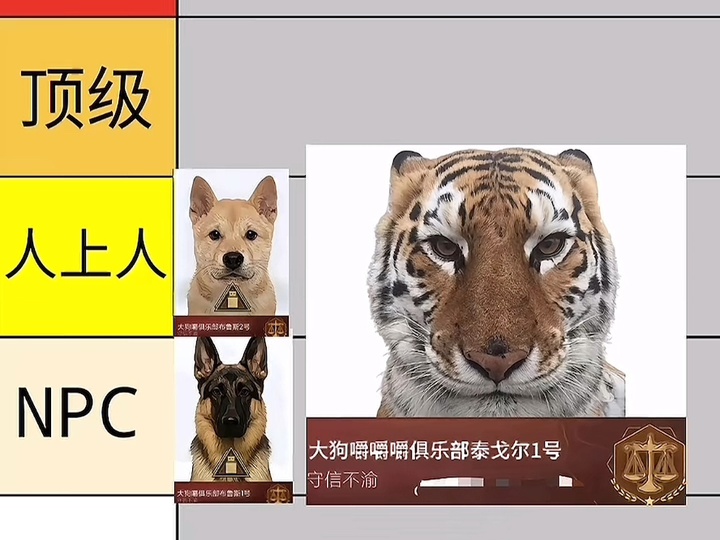 | 10.4万 | 2025-10-09 |
| [兰亭基](https://www.bilibili.com/video/BV14DxqzPEUJ) |  | 37.5万 | 2025-10-09 |
| [大狗嚼俱乐部往事](https://www.bilibili.com/video/BV1DMxrzEEED) |  | 10.8万 | 2025-10-09 |
| [【小马翻唱】🐱我的甜蜜🐱  熊出没片尾曲/蜂蜜🍯の小曲](https://www.bilibili.com/video/BV17MxBzQExK) |  | 28.8万 | 2025-10-08 |
| [哈基米音乐内战](https://www.bilibili.com/video/BV1iTxozNEpu) |  | 8017 | 2025-10-07 |
| [欢迎来到大狗狗嚼嚼嚼俱乐部（超长有码版）](https://www.bilibili.com/video/BV1ToxXzLEiw) |  | 17.3万 | 2025-10-07 |
| [蓝莲哈](https://www.bilibili.com/video/BV1tzxgzoEdC) |  | 1094 | 2025-10-05 |
| [《原创》](https://www.bilibili.com/video/BV1EoxMzqEy8) |  | 18.8万 | 2025-10-05 |
| [这一定是个不同以往的浪漫古士](https://www.bilibili.com/video/BV1hUH5zaECW) |  | 140.6万 | 2025-10-03 |
| [万恶之源，这不比片难找啊](https://www.bilibili.com/video/BV1scHLzWEdC) | 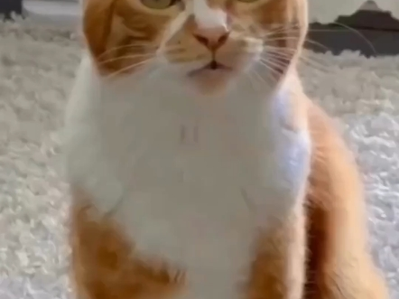 | 104.2万 | 2025-10-03 |
| [盘点九首2025年爆火的宝藏歌曲！你最爱哪一首？](https://www.bilibili.com/video/BV1AAHVzLEct) |  | 18.3万 | 2025-10-03 |
| [单曲循环｜巴西Funk｜“鸡蛋啊鸡蛋～”｜MONTAGEM XONADA](https://www.bilibili.com/video/BV1KPHKzhEMw) |  | 84.4万 | 2025-10-02 |
| [你一定听过的BGM︱Liberando melodias︱DIA AELICIA︱MENTE MA](https://www.bilibili.com/video/BV1bnHTzBE5y) |  | 97.6万 | 2025-10-02 |
| [德 国 超 人](https://www.bilibili.com/video/BV1CWHxzEE9q) |  | 144.8万 | 2025-10-02 |
| [全新处决！竟然拿哈基米打窝，哈基熊你这家伙【黎明杀机鬼武士】](https://www.bilibili.com/video/BV18XHjzqEF8) |  | 6.1万 | 2025-09-30 |
| [《打火机》和《打火基》 哪个更权威](https://www.bilibili.com/video/BV1ASnRzcEk7) | 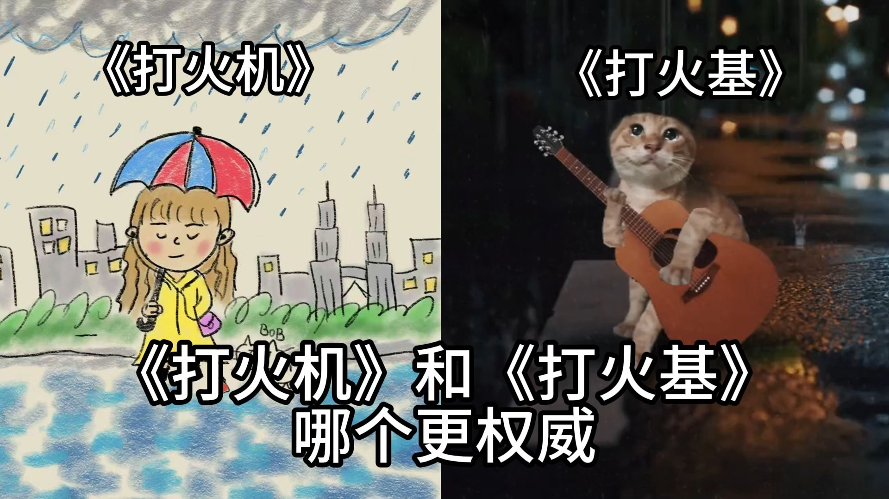 | 32.9万 | 2025-09-28 |
| [《怀疑の小曲》《赛文转场の小曲》poster boy](https://www.bilibili.com/video/BV1D8nEzTEum) |  | 56.3万 | 2025-09-27 |
| [循环歌单｜【Умри, если меня не любишь】｜【育苗の小曲】【育苗小学の小曲】](https://www.bilibili.com/video/BV1hDnHznEYF) |  | 161.7万 | 2025-09-25 |
| [琴团长不在我就是无敌的！](https://www.bilibili.com/video/BV1yzWAzdENr) |  | 153.9万 | 2025-09-23 |
| [爱猫tv是真有活](https://www.bilibili.com/video/BV1RhnwzaE23) | 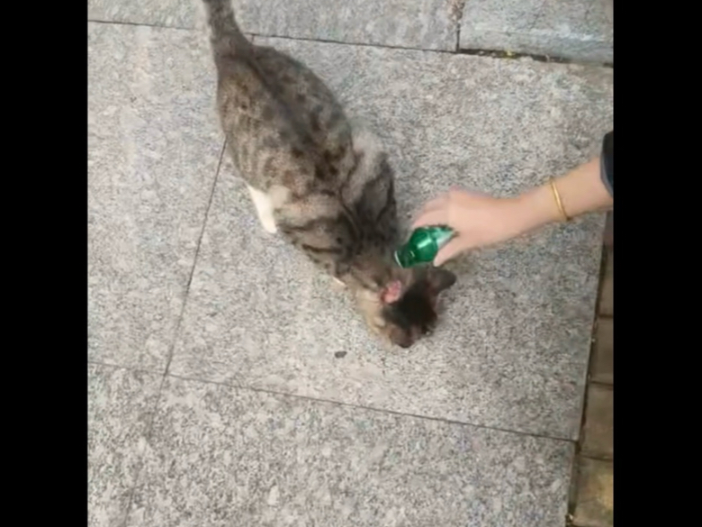 | 3.1万 | 2025-09-22 |
| [哈 基 米 哦 南 北 绿 豆～](https://www.bilibili.com/video/BV1X5nAzAEiy) |  | 3.3万 | 2025-09-22 |
| [经典永流传](https://www.bilibili.com/video/BV13HWAzuE8T) | 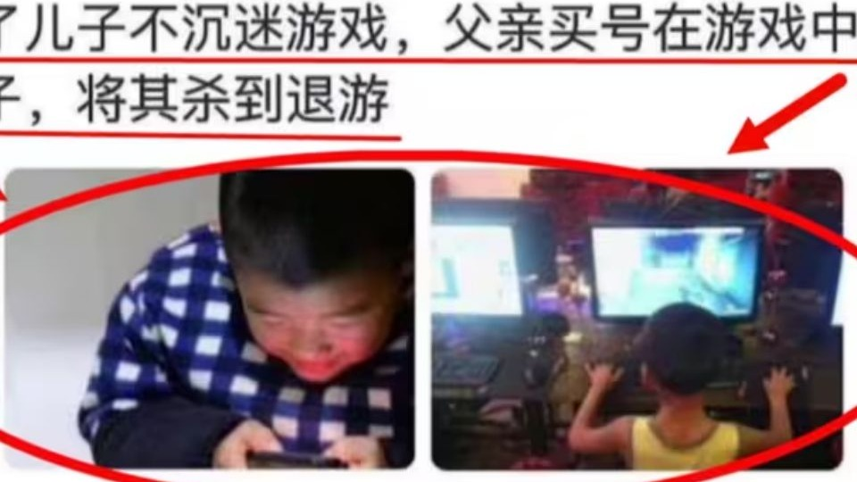 | 44.6万 | 2025-09-21 |
| [盘点互联网上的万恶之源们都是怎么来的](https://www.bilibili.com/video/BV1V7WczPEPV) |  | 81.8万 | 2025-09-21 |
| [【哈基米音乐】🐱Stay With 咪 ~~🐱(Phonk)](https://www.bilibili.com/video/BV16CWczLEtM) |  | 2.5万 | 2025-09-21 |
| [𝙋𝙡𝙖𝙮𝙡𝙞𝙨𝙩 ｜ 𝙁𝙪𝙣𝙠精选 猛攻必备歌单😡｜ 游戏𝙗𝙜𝙢 猛攻 高燃歌单](https://www.bilibili.com/video/BV11RWVzxESx) | 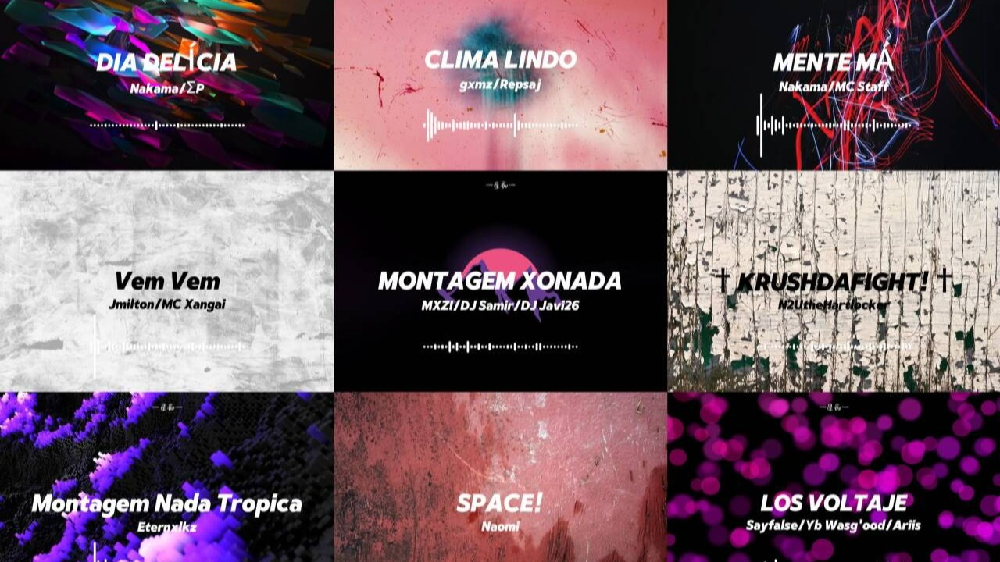 | 130.5万 | 2025-09-19 |
| [🍬五秒钟夺走你的走马灯🍬](https://www.bilibili.com/video/BV1KNWuz5EmX) |  | 187.1万 | 2025-09-19 |
| [囊囊囊囊囊囊囊囊囊囊囊囊囊囊囊囊囊囊囊囊囊囊囊囊囊囊囊囊囊囊囊囊囊囊囊囊囊囊囊囊囊囊囊囊囊囊囊囊囊囊囊囊囊囊囊囊囊囊囊囊囊囊囊囊囊囊囊囊囊囊囊囊囊囊囊囊囊囊囊囊](https://www.bilibili.com/video/BV1napiz2EZ7) |  | 25.3万 | 2025-09-18 |
| [哈基米已经火遍世界了吗？！一打开全是。笑](https://www.bilibili.com/video/BV18TpTz3ETJ) |  | 1.4万 | 2025-09-15 |
| [颗秒 原创@瓦瓦](https://www.bilibili.com/video/BV1hkpjzMEHY) |  | 275.0万 | 2025-09-13 |
| [哈基米南北路多](https://www.bilibili.com/video/BV1w5Hkz8EaU) | 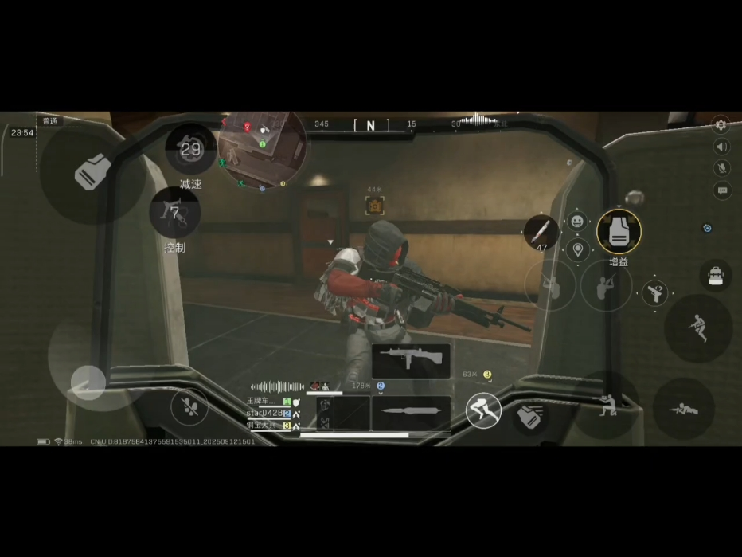 | 15.6万 | 2025-09-12 |
| [哈基米哟难卖绿豆~](https://www.bilibili.com/video/BV17xY5zBEN5) |  | 18.6万 | 2025-09-07 |
| [身为哈基米的创造者，我比它更理解 何为耄耋的死亡](https://www.bilibili.com/video/BV1Tne7zaEeU) |  | 9.4万 | 2025-08-24 |
| [🐱哈哈哈国哈基国🐱](https://www.bilibili.com/video/BV1CSY9zsEwR) |  | 40.3万 | 2025-08-22 |
| [《棍母の小曲》《       の小曲》](https://www.bilibili.com/video/BV1ocYoz9Enj) | 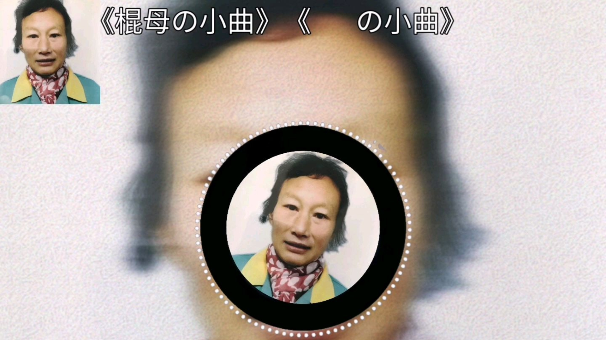 | 28.8万 | 2025-08-22 |
| [米米哈基米](https://www.bilibili.com/video/BV1bGYazgEau) | 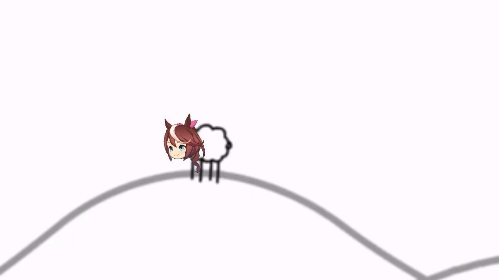 | 1.3万 | 2025-08-19 |
| [哈基米拷打爱猫人士🌚](https://www.bilibili.com/video/BV1jnbBzsEVe) | 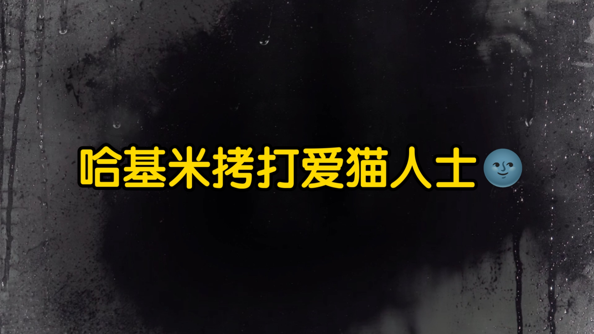 | 58.0万 | 2025-08-14 |
| [替身的主人——哈基米全方位进阶教学](https://www.bilibili.com/video/BV1A5bGzYEyc) |  | 28.5万 | 2025-08-11 |
| [⚡哈基米哦南北绿豆⚡](https://www.bilibili.com/video/BV1nebTz5Est) |  | 3.4万 | 2025-08-10 |
| [哈基米变成零部件了](https://www.bilibili.com/video/BV1vNbTzPEFk) | 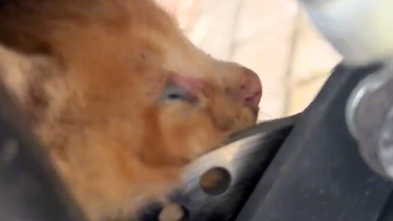 | 26.2万 | 2025-08-10 |
| [哈基米：🐱哈气专属权🐱](https://www.bilibili.com/video/BV1nFtxz4Ewk) |  | 40.8万 | 2025-08-09 |
| [【哈基米】⚡千本基⚡](https://www.bilibili.com/video/BV1Eotuz5E3E) |  | 5.9万 | 2025-08-07 |
| [哈基米山歌](https://www.bilibili.com/video/BV16ubfzpEth) |  | 44.7万 | 2025-07-23 |
| [（补）哈基米偷鸡被海底两万里了](https://www.bilibili.com/video/BV19Vuyz9Ekc) | 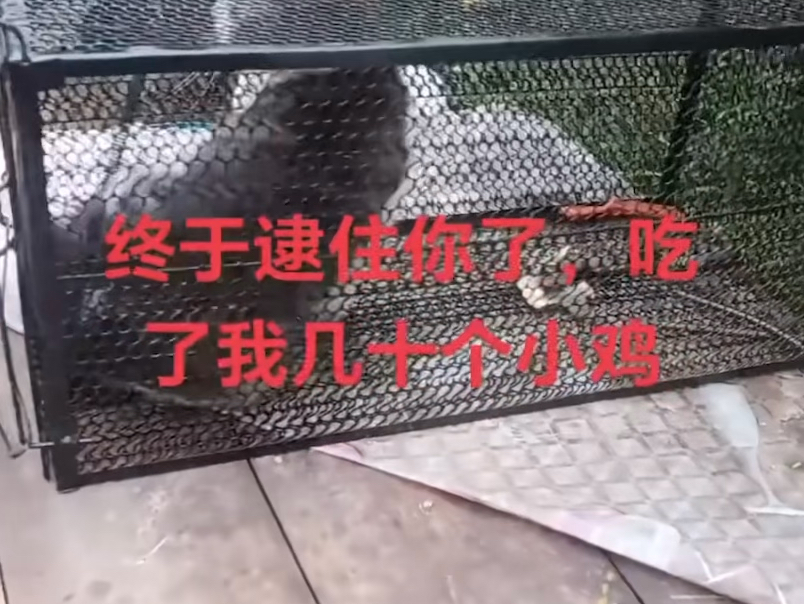 | 9.3万 | 2025-07-15 |
| [（补档4）猫儿这个应急](https://www.bilibili.com/video/BV1R23uzwEgm) | 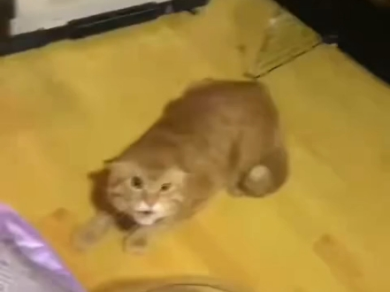 | 44.1万 | 2025-07-03 |
| [鱼把哈基米吃了](https://www.bilibili.com/video/BV1X73pzbE3F) | 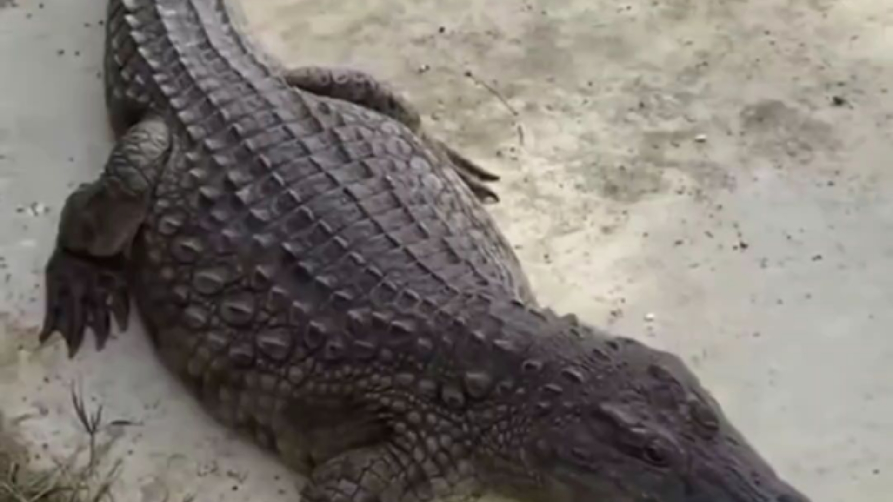 | 24.4万 | 2025-07-01 |
| [哈基米...已经燃尽了...](https://www.bilibili.com/video/BV1jrKhz7Ecx) |  | 13.7万 | 2025-06-24 |
| [哈基米：基白](https://www.bilibili.com/video/BV1YmMFzfEFq) |  | 66.1万 | 2025-06-12 |
| [【循环歌单】“一勺料汁の小曲”丨《天真的橡皮(DJ版)》](https://www.bilibili.com/video/BV1LKVZzrED9) |  | 545.8万 | 2025-05-10 |
| [按理说，你这个级别的基米是无权哈我的](https://www.bilibili.com/video/BV1E2VUzpE2Y) | 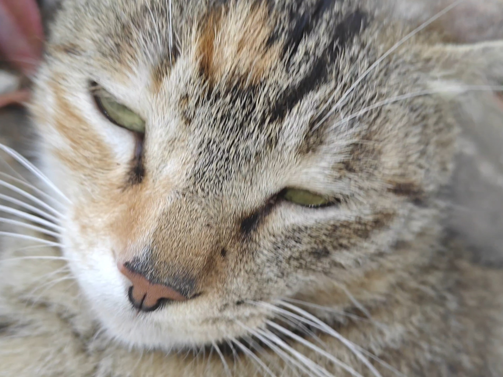 | 64.5万 | 2025-05-06 |
| [哈基米](https://www.bilibili.com/video/BV1osNSeqEzo) | 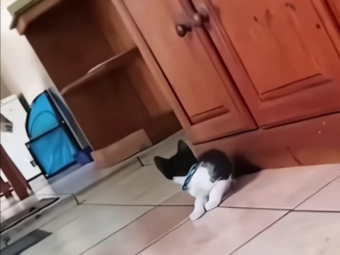 | 224 | 2025-02-09 |
| [哈基米](https://www.bilibili.com/video/BV1pfFaeXEV4) | 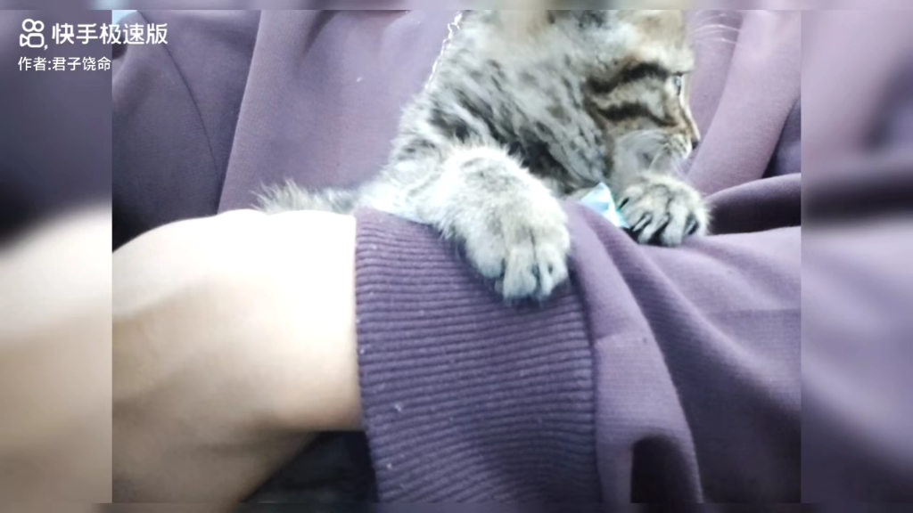 | 518 | 2025-01-29 |
| [最伟大的哈基米](https://www.bilibili.com/video/BV1jWwhe1EWJ) |  | 64.3万 | 2025-01-21 |
| [【哈基米塔】凑热闹 (帽子米塔の小曲)🐱♿️](https://www.bilibili.com/video/BV1pdcieNENA) |  | 46.8万 | 2025-01-15 |
| [哈气的哈基米到底有多可怕](https://www.bilibili.com/video/BV1dN1iYLE51) | 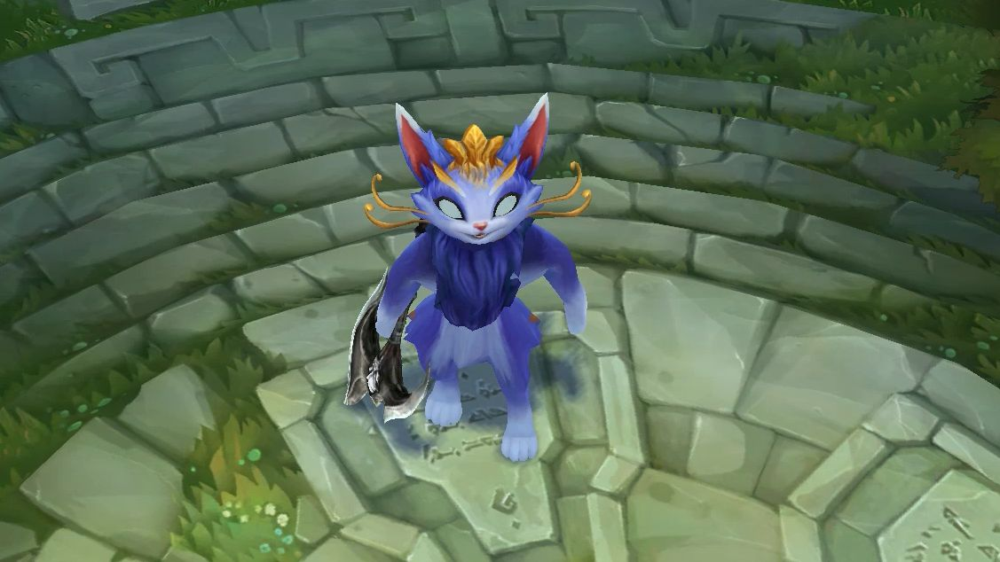 | 34.1万 | 2024-10-06 |
| [（二补）神人TV之八十平米的哈基米](https://www.bilibili.com/video/BV1DSvoebEUo) | 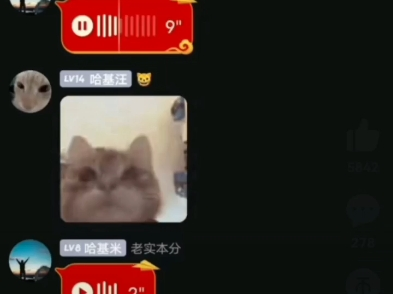 | 30.6万 | 2024-08-04 |
| [哈基米](https://www.bilibili.com/video/BV1SS411F7b6) | 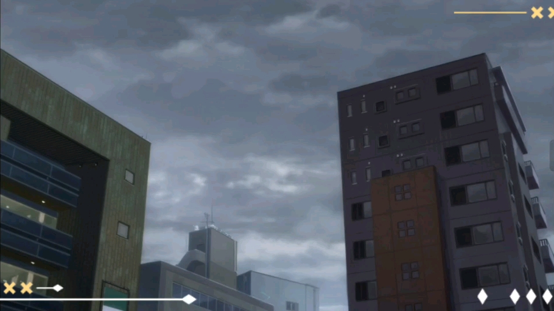 | 212 | 2024-05-12 |
| [哈基米](https://www.bilibili.com/video/BV1ap4y1571Q) | 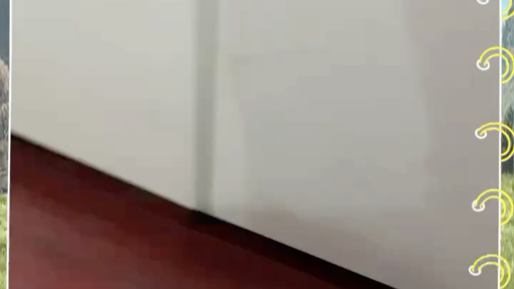 | 545 | 2023-07-27 |
| [哈基米](https://www.bilibili.com/video/BV1Lu4y1U7q7) | 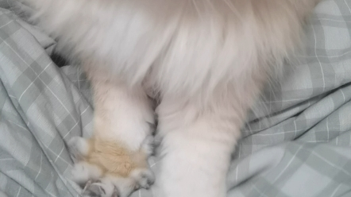 | 144 | 2023-07-23 |
| [哈基米](https://www.bilibili.com/video/BV1uz4y1t7xt) | 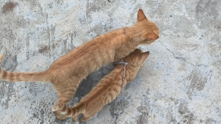 | 158 | 2023-07-20 |
| [哈基米](https://www.bilibili.com/video/BV1nh4y1M7Zj) | 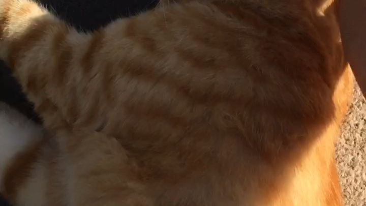 | 175 | 2023-06-28 |
| [哈基米](https://www.bilibili.com/video/BV1fj411U7R9) | 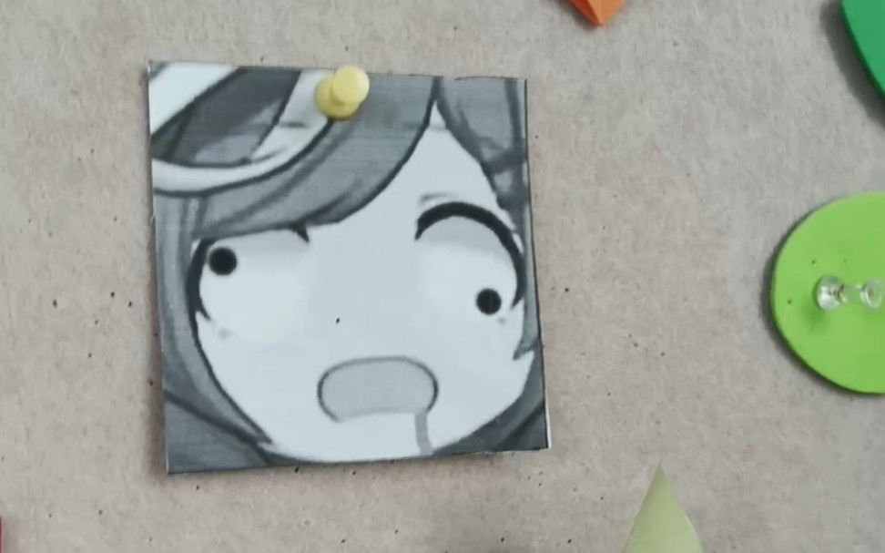 | 516 | 2023-06-24 |

---
*最后更新: 2025-10-13 02:40:04 (自动生成)*
*数据来源: [Bilibili](https://www.bilibili.com)*

## 使用说明

运行以下命令更新视频列表:
```bash
python3 fetch_hajimi_videos.py
```
