# awesome-hajimi
collections of hajimi (哈基米 in Chinese) on the Internet.

## 视频列表 (Video List)

| 视频标题 (Title) | 封面 | 播放量 (Views) | 发布日期 (Date) |
|---|---|---|---|
| [吃播主播哈基米](https://www.bilibili.com/video/BV1ZbzGBbE34) |  | 93 | 2026-01-21 |
| [蜂蜜？哈基米是猫！](https://www.bilibili.com/video/BV1rJzGBvE8n) |  | 1.5万 | 2026-01-21 |
| [今晚哈基米就不会吵了哦](https://www.bilibili.com/video/BV1CRkJBvEPc) |  | 275 | 2026-01-20 |
| [楼下的哈基米](https://www.bilibili.com/video/BV1E1knBhEp5) | 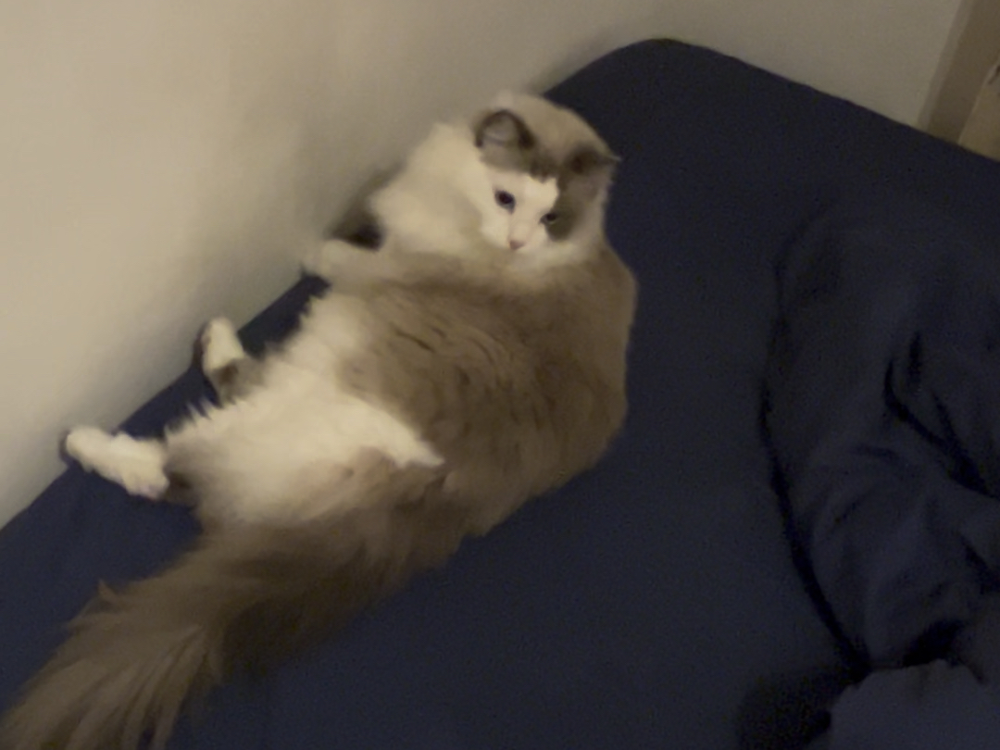 | 4 | 2026-01-20 |
| [基米：何意味](https://www.bilibili.com/video/BV1EmknBFEYS) | 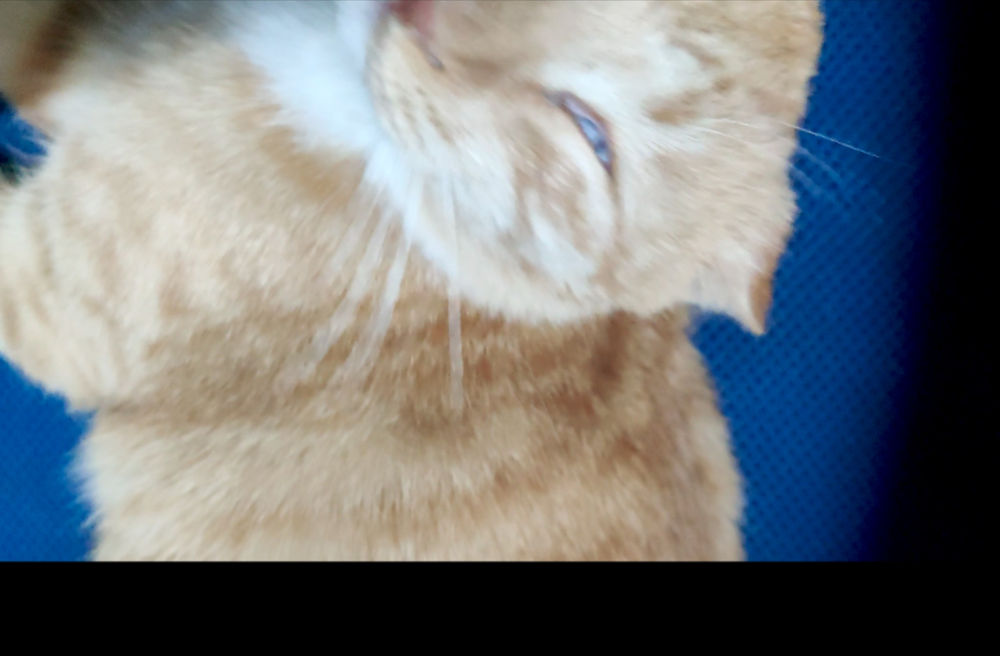 | 164 | 2026-01-20 |
| [哈基米：基大（faded）](https://www.bilibili.com/video/BV1WakEBaEon) |  | 77 | 2026-01-20 |
| [哈基米反杀人类](https://www.bilibili.com/video/BV1hEkEB3EWM) | 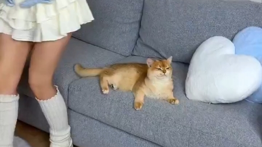 | 0 | 2026-01-20 |
| [哈基米](https://www.bilibili.com/video/BV1QLkEBVERS) | 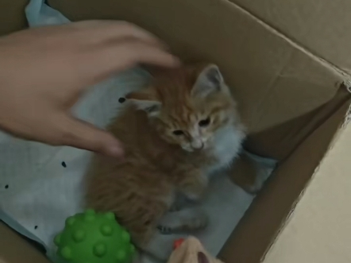 | 5 | 2026-01-20 |
| [哈基米～哈基米～](https://www.bilibili.com/video/BV1QLkEBVEZJ) |  | 1 | 2026-01-20 |
| [【哈基米音乐】🐱说哈你🐱叮咚鸡 我叮咚叮咚基](https://www.bilibili.com/video/BV1hJkEB6EMk) | 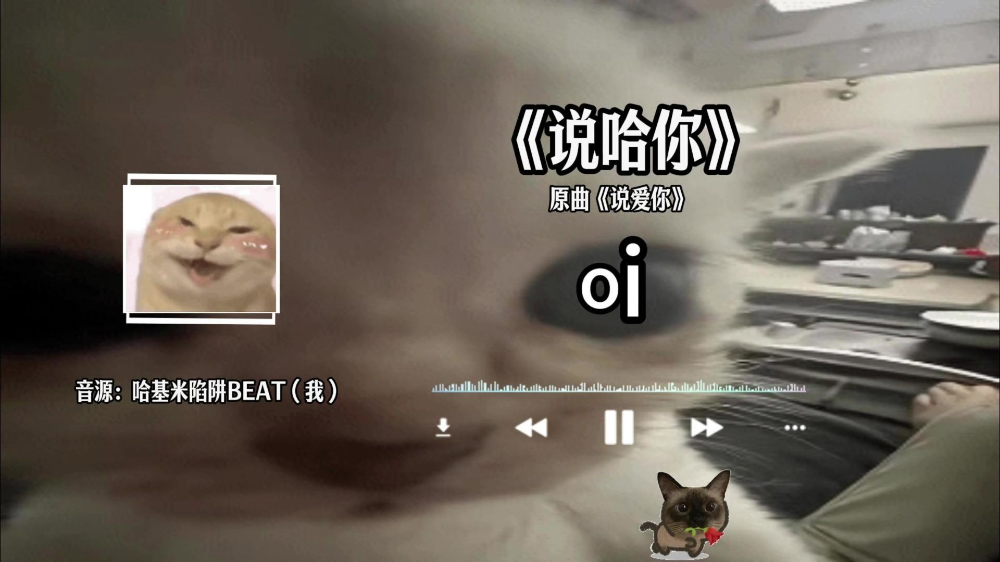 | 98 | 2026-01-20 |
| [哈基米怒吃大棒](https://www.bilibili.com/video/BV1wjkJBaE1f) | 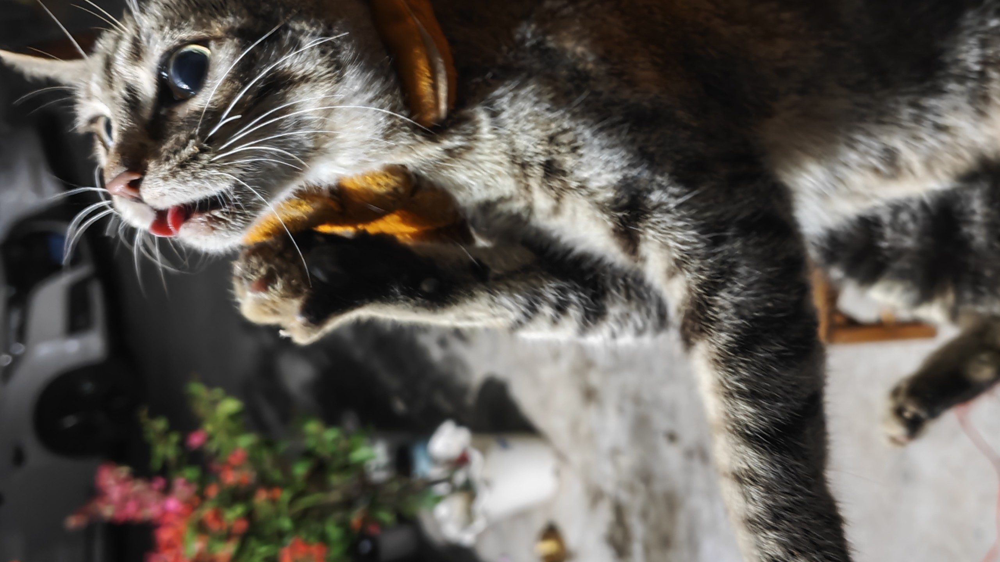 | 2519 | 2026-01-20 |
| [哈基米你的眼睛真好看](https://www.bilibili.com/video/BV1PLkJBAEHY) | 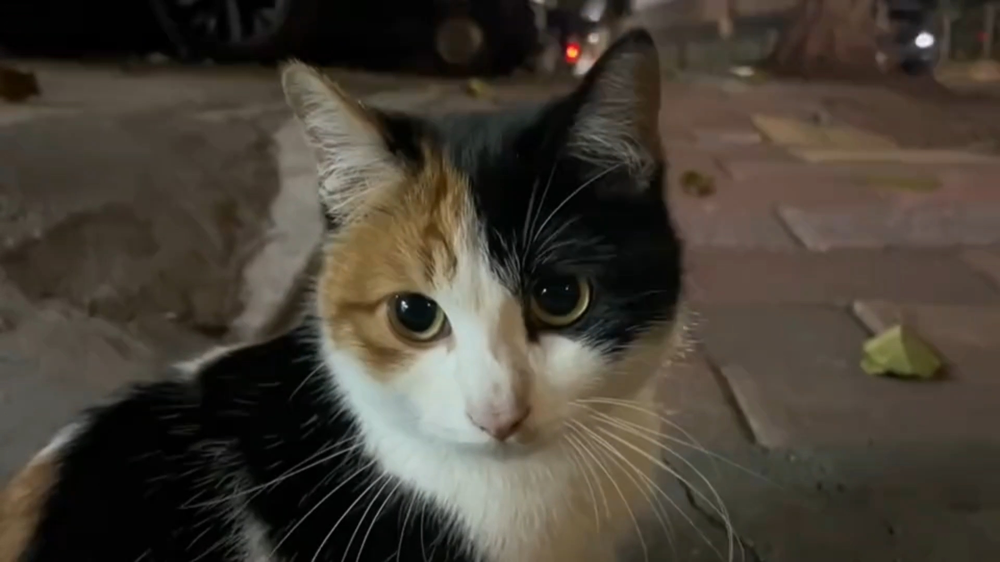 | 32 | 2026-01-20 |
| [哈基米哈气了](https://www.bilibili.com/video/BV1xTkJBBEBP) | 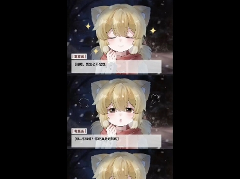 | 17 | 2026-01-20 |
| [关于哈基人想阻止哈基米捕猎哈鸡鹊但却铁窗泪这件事](https://www.bilibili.com/video/BV1TukJBTEGB) | 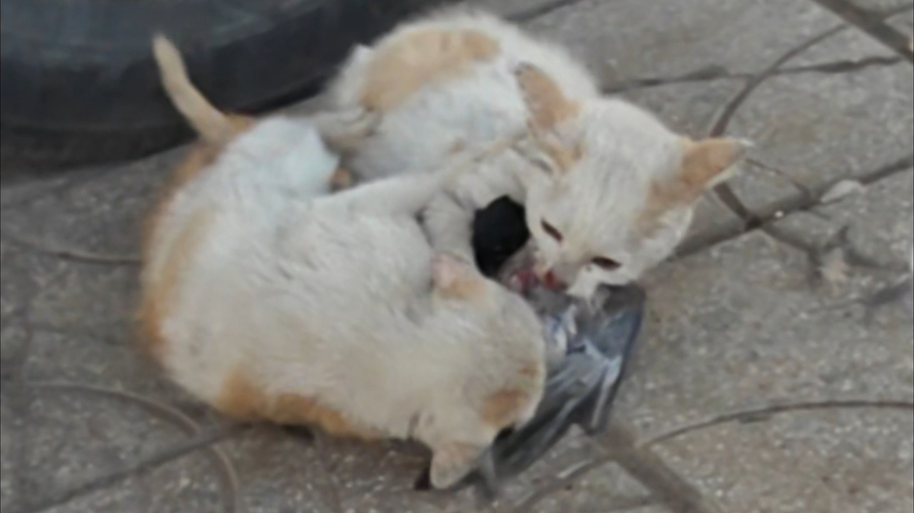 | 148 | 2026-01-20 |
| [哈基米音乐 Baba O&#x27;JIMI 原曲不使用 宣传视频](https://www.bilibili.com/video/BV14gkJBiEc3) | 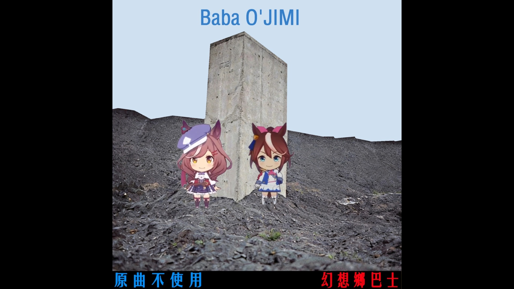 | 118 | 2026-01-20 |
| [哈基米南北绿豆（1）](https://www.bilibili.com/video/BV1stkjB4EFx) |  | 6 | 2026-01-20 |
| [天下都是哈基米](https://www.bilibili.com/video/BV1sxkjBZEso) |  | 10 | 2026-01-20 |
| [哈基米的退化](https://www.bilibili.com/video/BV1xskjBbEaL) |  | 41 | 2026-01-20 |
| [【哈基米音乐】爱出发（TF）](https://www.bilibili.com/video/BV1yskjBbE2x) |  | 382 | 2026-01-20 |
| [哈基米](https://www.bilibili.com/video/BV1sskjBbEh3) |  | 19 | 2026-01-20 |
| [今天用电子琴和小提琴来个小小合奏，哈哈哈哈，哈基米](https://www.bilibili.com/video/BV1gLkjBiEce) |  | 314 | 2026-01-20 |
| [尝试驯服蟒蛇的哈基米](https://www.bilibili.com/video/BV1UEkjBYE2N) | 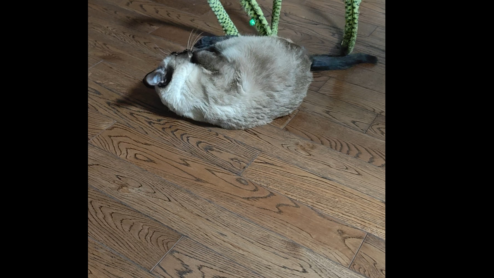 | 39 | 2026-01-20 |
| [哈基米喝鱼汤](https://www.bilibili.com/video/BV1tok5BfEgu) | 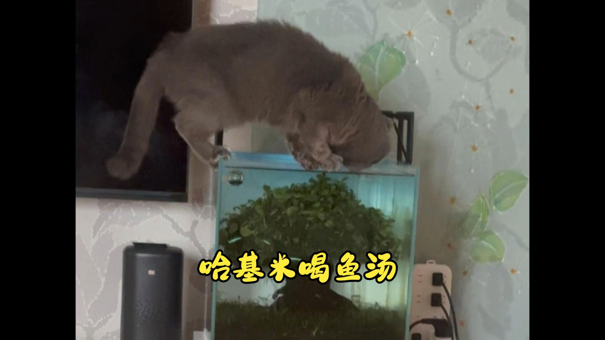 | 0 | 2026-01-20 |
| [冬日里的哈基米₍˄·͈༝·͈˄*₎੭](https://www.bilibili.com/video/BV1VSkjBGE1L) | 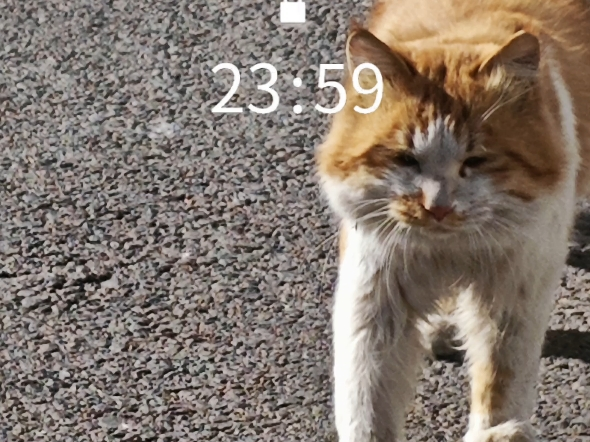 | 30 | 2026-01-20 |
| [哈基米TV:哈基米伦减这一块](https://www.bilibili.com/video/BV18okjBqEAP) | 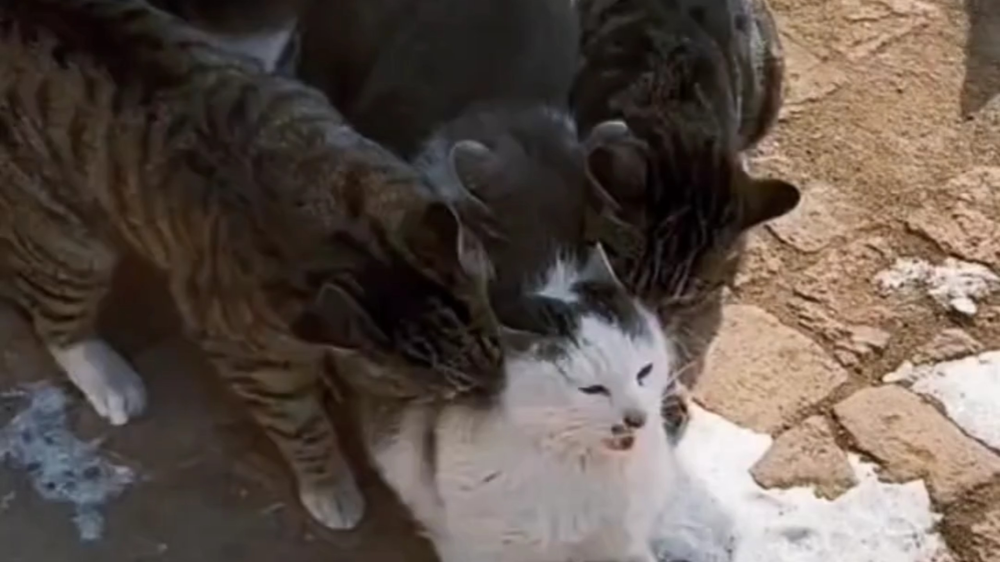 | 7085 | 2026-01-20 |
| [《哈基米》南北MCX发射器？博涵成人款Tec9！蟒蛇K1查克拉左轮！不知名黄油枪？DX2011电手配置升级？JMT XC第一批次售空！战鹰SG563公布！](https://www.bilibili.com/video/BV1gokjBqE87) |  | 1.1万 | 2026-01-20 |
| [哈基米的葬礼，愿猫猫一路走好](https://www.bilibili.com/video/BV1G9kjBzEtr) |  | 13 | 2026-01-20 |
| [全网最萌哈基米](https://www.bilibili.com/video/BV19hk7BVErX) | 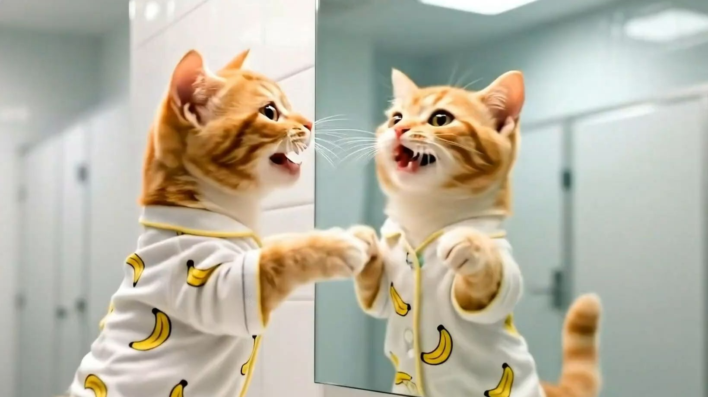 | 135 | 2026-01-20 |
| [杀哈基米了！萌喵周赛491分（简介）](https://www.bilibili.com/video/BV1zBkjBSE4h) |  | 147 | 2026-01-20 |
| [可爱哈基米](https://www.bilibili.com/video/BV1JBkjBSEqT) |  | 0 | 2026-01-20 |
| [【哈基米音乐】 夏天的哈](https://www.bilibili.com/video/BV1Fjk7B9EZF) |  | 23 | 2026-01-20 |
| [年轮蛋糕.但是是teto牌哈基米Alpha核弹](https://www.bilibili.com/video/BV1pVk7BdEv3) |  | 43 | 2026-01-20 |
| [你养的小猫突然开始对你邪恶哈气 最后不明失踪于是你开始寻找哈基米……](https://www.bilibili.com/video/BV1dpk7BUEDX) | 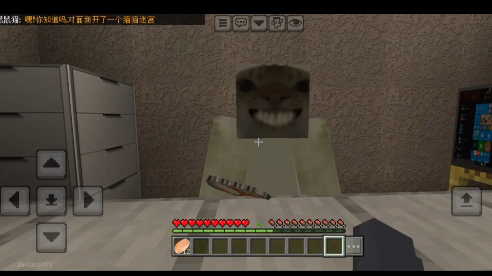 | 3 | 2026-01-20 |
| [楼上邻居在阳台晒被子劝说无果，果断抱出哈基米呲水枪放大招](https://www.bilibili.com/video/BV1BJk7BQEEs) | 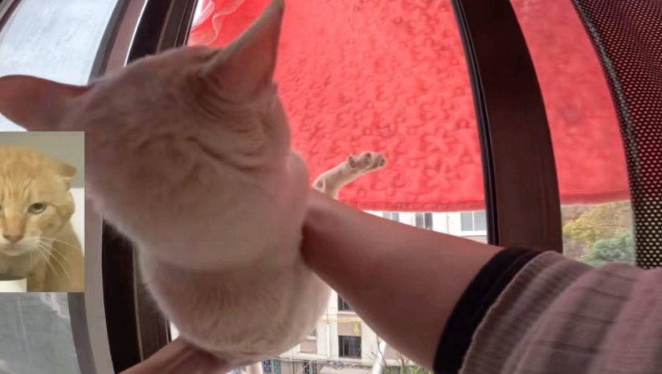 | 1.5万 | 2026-01-20 |
| [以防你没见过哈基米吃面包。](https://www.bilibili.com/video/BV1TAk7BYEHa) | 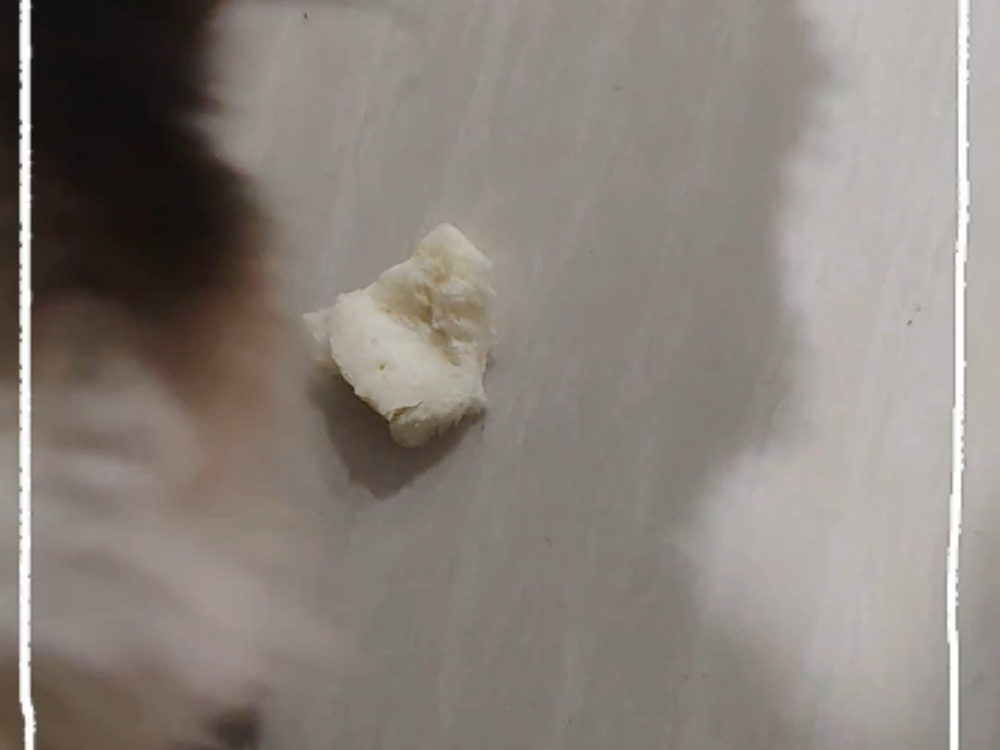 | 38 | 2026-01-20 |
| [哈基米依旧神兵天基](https://www.bilibili.com/video/BV1MAk7BYEu7) | 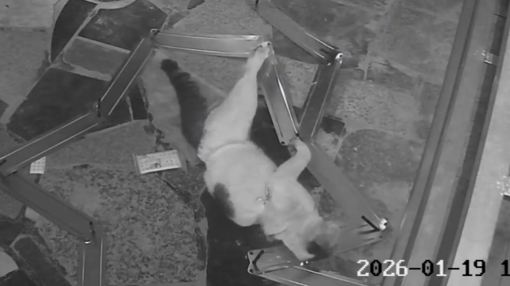 | 2.0万 | 2026-01-20 |
| [盘点哈基米的音乐](https://www.bilibili.com/video/BV1xNk7BwExn) | 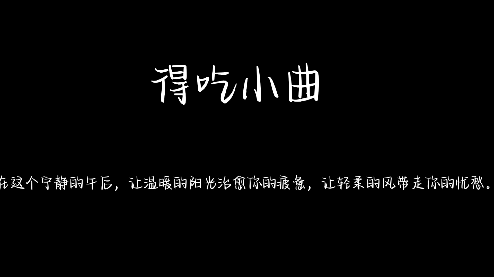 | 17 | 2026-01-20 |
| [&quot;另一个世界的我の小曲&quot;｜《最初的记忆dj》哈基米音乐](https://www.bilibili.com/video/BV1MFk7BvEmD) | 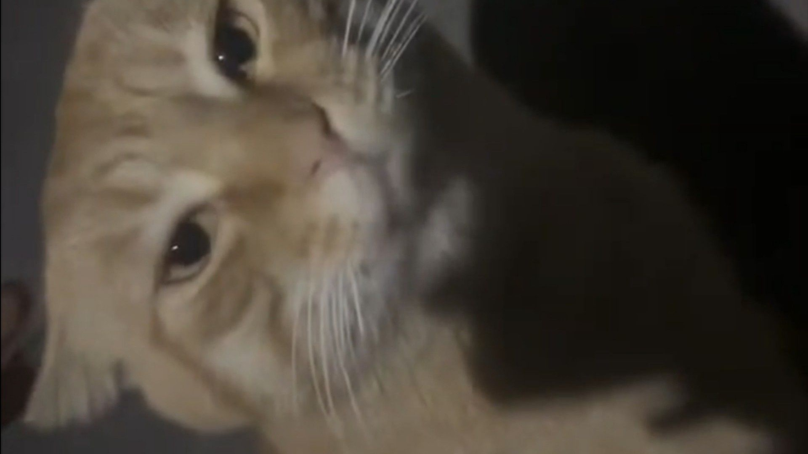 | 5233 | 2026-01-20 |
| [关于我家哈基米](https://www.bilibili.com/video/BV1Twk7BPEZo) | 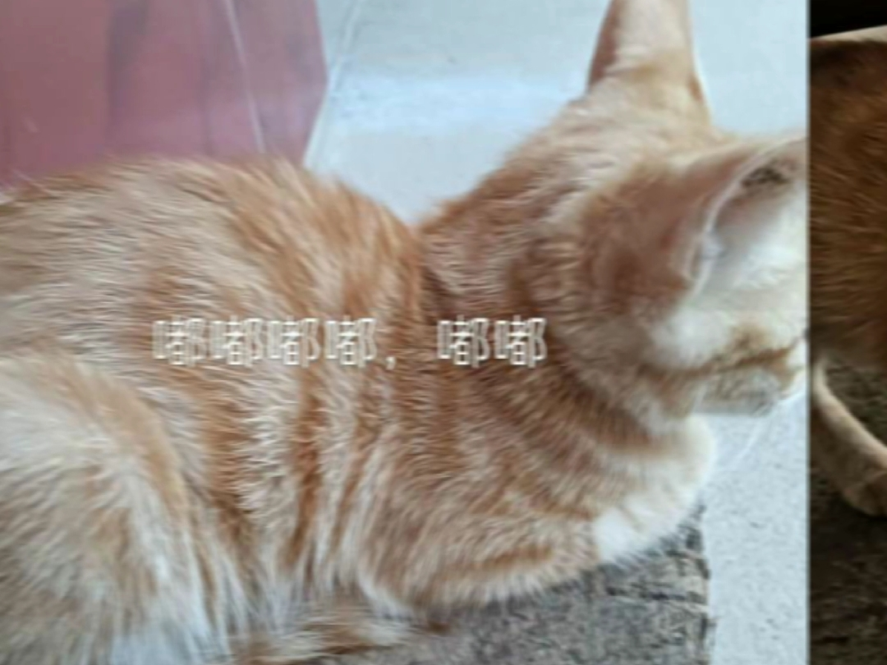 | 110 | 2026-01-20 |
| [咪也来挑战哈基米大合唱！](https://www.bilibili.com/video/BV1Twk7BPEf2) | 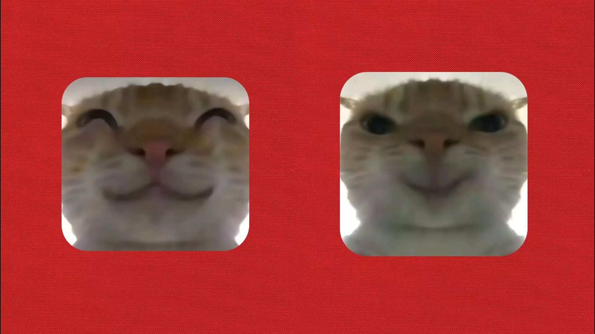 | 2347 | 2026-01-20 |
| [哈基米：MONTAGEM CORAÇÃO😿](https://www.bilibili.com/video/BV1Agk7BfEhq) |  | 3336 | 2026-01-20 |
| [训练哈基米失败](https://www.bilibili.com/video/BV122k7BAEG5) | 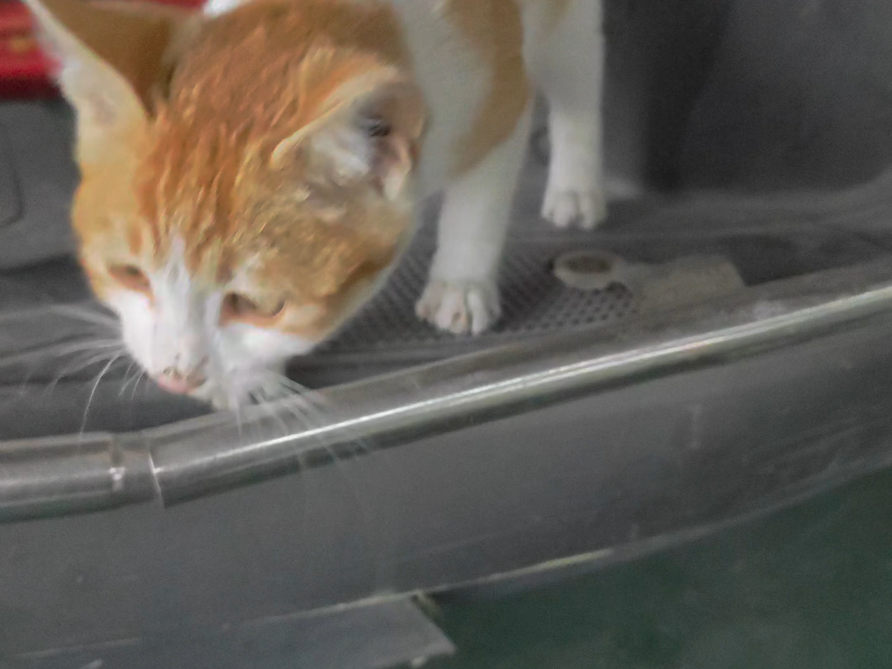 | 70 | 2026-01-20 |
| [哈基米生第一次雪天历险记❄️❄️❄️](https://www.bilibili.com/video/BV1Sqk7BuEaN) | 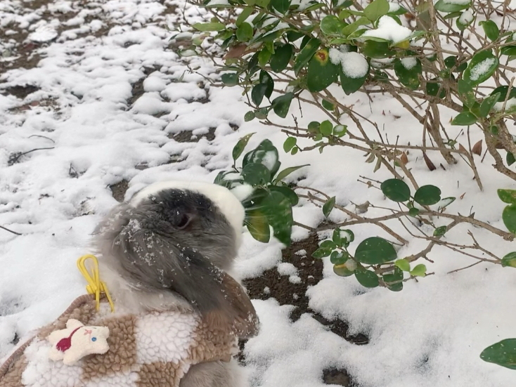 | 31 | 2026-01-20 |
| [基米的眼泪：全都是曼波~](https://www.bilibili.com/video/BV1DBk7BBEa3) | 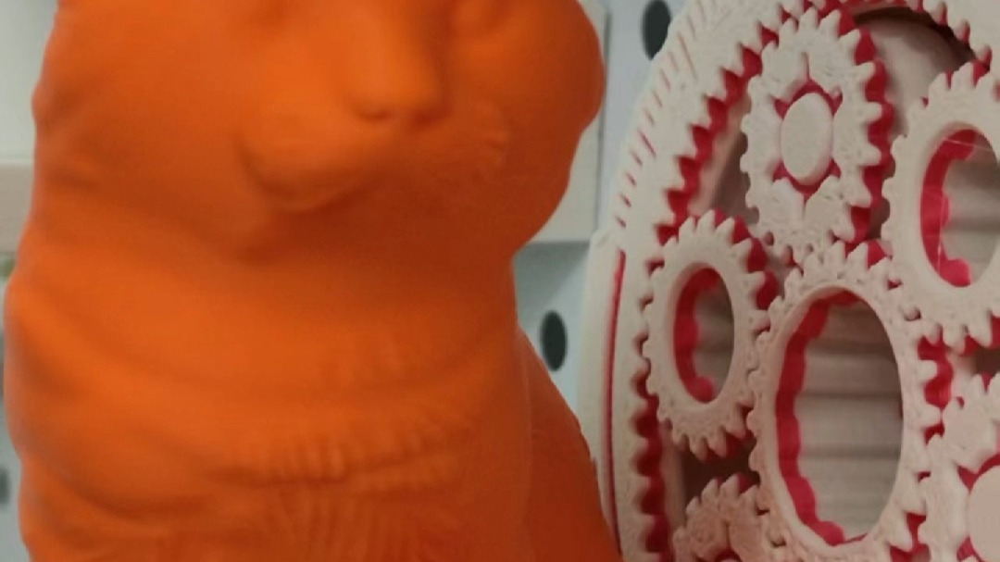 | 162 | 2026-01-20 |
| [大东北哈基米](https://www.bilibili.com/video/BV15tk7BjEMj) |  | 12 | 2026-01-20 |
| [哈基米~](https://www.bilibili.com/video/BV15tk7BjEYy) | 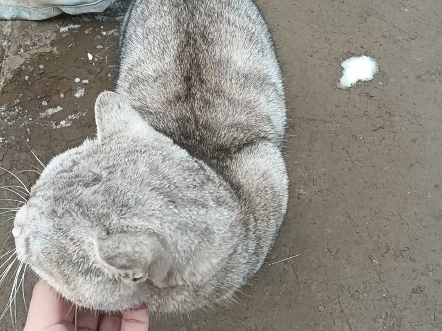 | 2 | 2026-01-20 |
| [哈基米会自己找到屋子里最暖和的地方(ง ˙o˙)ว](https://www.bilibili.com/video/BV1GUk5BNEmj) | 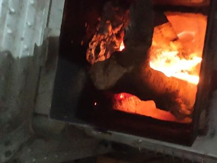 | 78 | 2026-01-20 |
| [悠星大陆：哈基米的悠闲生活](https://www.bilibili.com/video/BV1GUk5BNEsQ) |  | 0 | 2026-01-20 |
| [悠星大陆：哈基米的悠闲生活](https://www.bilibili.com/video/BV1Y2k5BiEkx) |  | 0 | 2026-01-20 |
| [【哈基米很好】第一支视频求三连！](https://www.bilibili.com/video/BV1udk5B8EGK) |  | 79 | 2026-01-20 |
| [居家祝福仅需30，快至半小时出货！#哈基米 #神马教 #黄金矿工](https://www.bilibili.com/video/BV1gQk5BAEj9) | 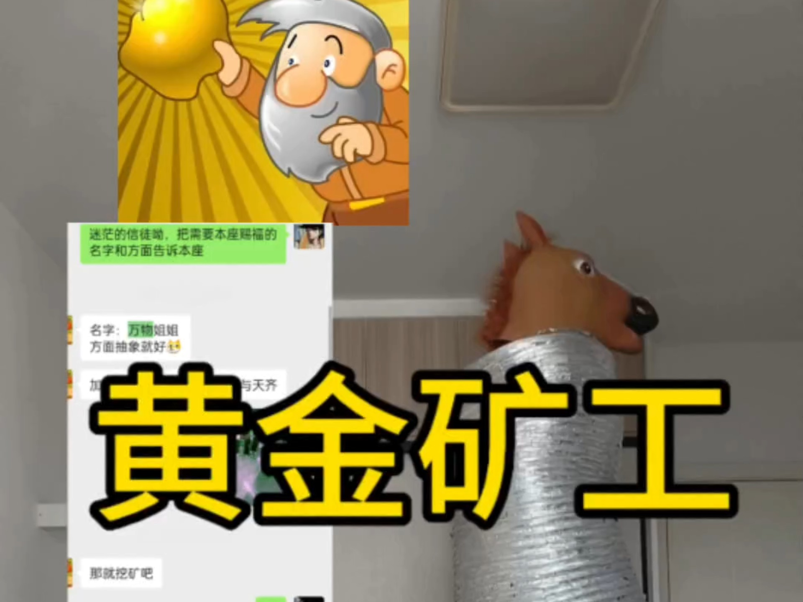 | 634 | 2026-01-20 |
| [猫猫祟祟的哈基米](https://www.bilibili.com/video/BV17ik5BVE1s) |  | 1362 | 2026-01-20 |
| [可爱的哈基米](https://www.bilibili.com/video/BV17ik5BVE9x) | 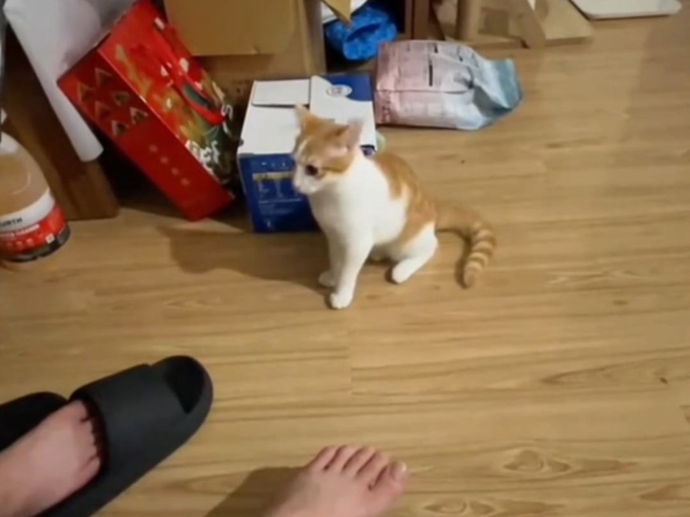 | 943 | 2026-01-20 |
| [分享17种猫咪，这种哈基米乖吗？](https://www.bilibili.com/video/BV1nYk5BLE8E) | 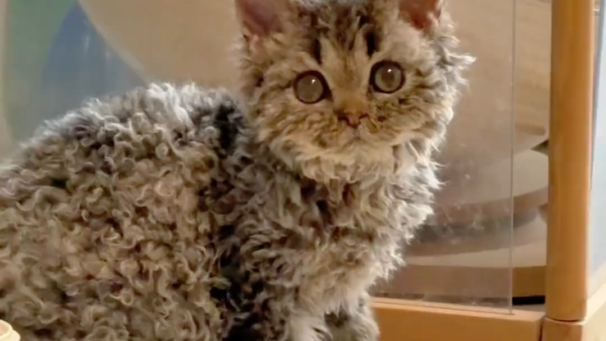 | 99 | 2026-01-20 |
| [【清南不是哈基米】第一支视频求三连！](https://www.bilibili.com/video/BV1Bek5ByErs) | 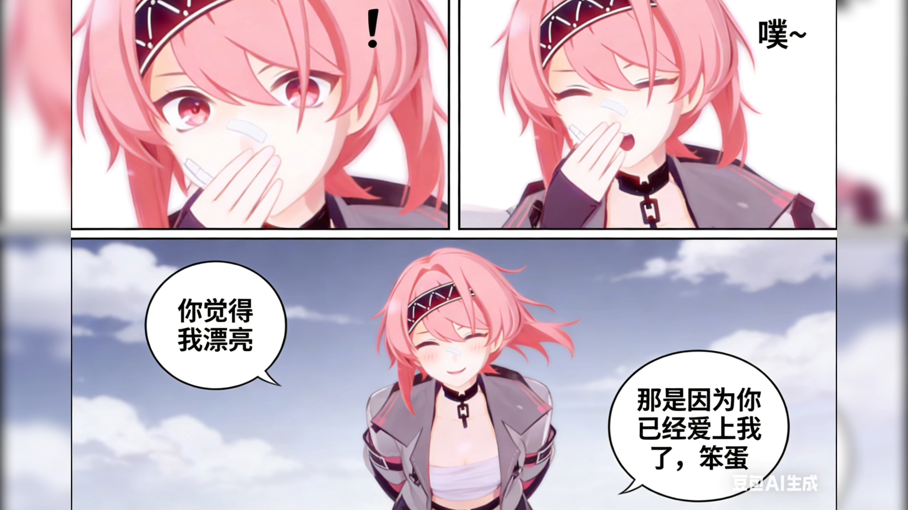 | 1 | 2026-01-20 |
| [哈基米跳入化粪池吃了好几口，泡的都入味了](https://www.bilibili.com/video/BV1Z7kLB5EXt) | 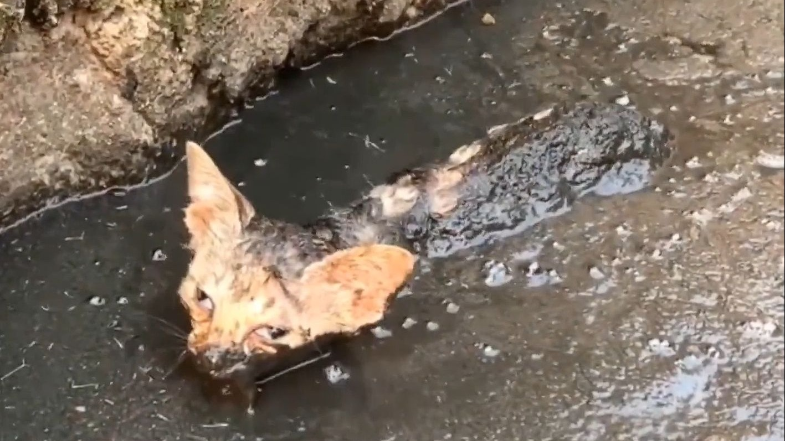 | 2012 | 2026-01-20 |
| [哈基米哈基米](https://www.bilibili.com/video/BV1KwkLBxEPB) | 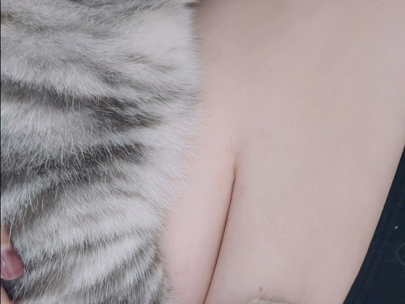 | 6 | 2026-01-20 |
| [我也要哈吗](https://www.bilibili.com/video/BV1MqkLBaEhm) |  | 7540 | 2026-01-20 |
| [哈基米：喂我花生](https://www.bilibili.com/video/BV16DkLBQEf1) | 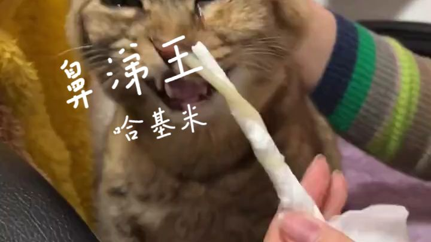 | 100 | 2026-01-20 |
| [【爱马铃薯的哈基米】视频已打包，欢迎围观！](https://www.bilibili.com/video/BV1PmkLBREwh) | 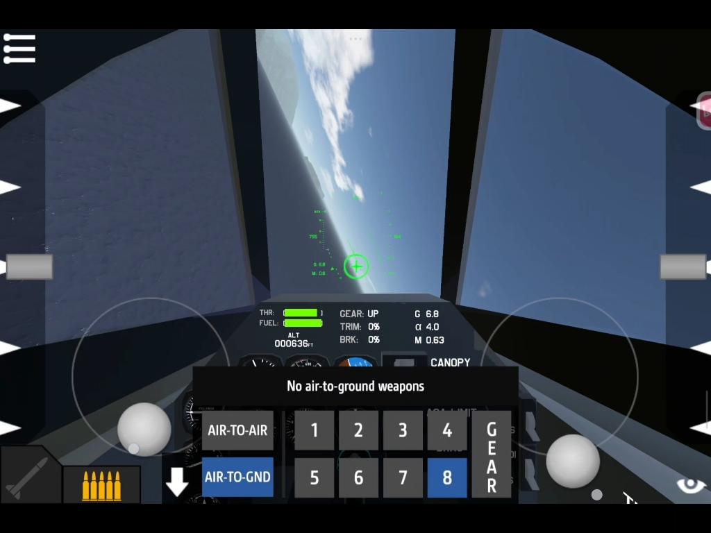 | 138 | 2026-01-20 |
| [【我家20只哈基米】视频加载中，速速查收惊喜！](https://www.bilibili.com/video/BV1EokLBUErC) |  | 0 | 2026-01-20 |
| [【我家20只哈基米】最新视频上线，求关注！](https://www.bilibili.com/video/BV1BokLBmEGJ) |  | 0 | 2026-01-20 |
| [【我家20只哈基米】最新视频来袭，快来看看吧！](https://www.bilibili.com/video/BV1BokLBmECs) |  | 0 | 2026-01-20 |
| [【我家20只哈基米】我的最新作品，快来一睹为快！](https://www.bilibili.com/video/BV1BokLBmEzM) | 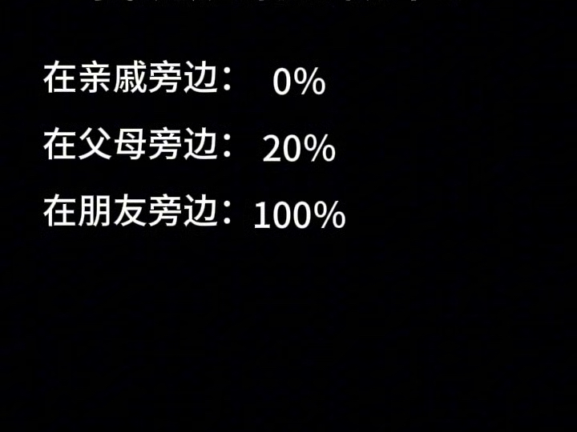 | 0 | 2026-01-20 |
| [【我家20只哈基米】更新了一条视频，快来围观！](https://www.bilibili.com/video/BV1BokLBmEyD) | 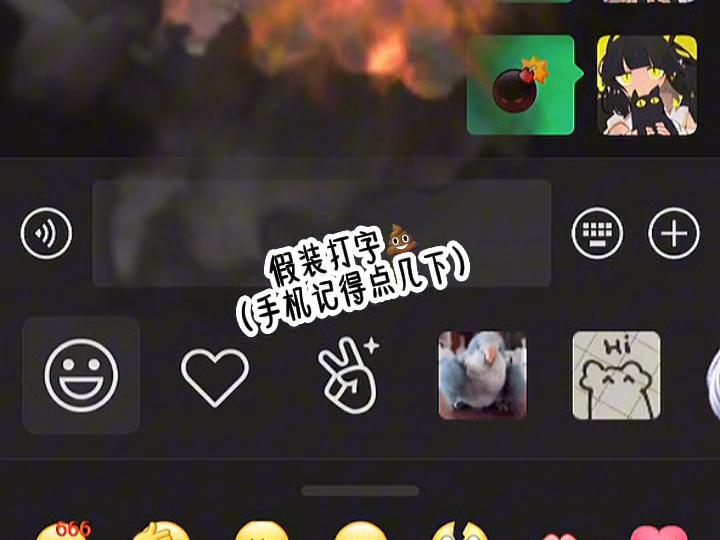 | 3 | 2026-01-20 |
| [【我家20只哈基米】Up主探索中，欢迎收看求三连！](https://www.bilibili.com/video/BV1BokLBmExy) |  | 0 | 2026-01-20 |
| [【我家20只哈基米】更新啦，赶紧来围观吧！](https://www.bilibili.com/video/BV16XkLBnEkC) |  | 0 | 2026-01-20 |
| [【我家20只哈基米】视频已打包，欢迎围观！](https://www.bilibili.com/video/BV16XkLBnESR) |  | 0 | 2026-01-20 |
| [基米不要走…](https://www.bilibili.com/video/BV1nKk3BTE77) |  | 7.6万 | 2026-01-20 |
| [改造成功的哈基米](https://www.bilibili.com/video/BV1ZVkVBuE41) | 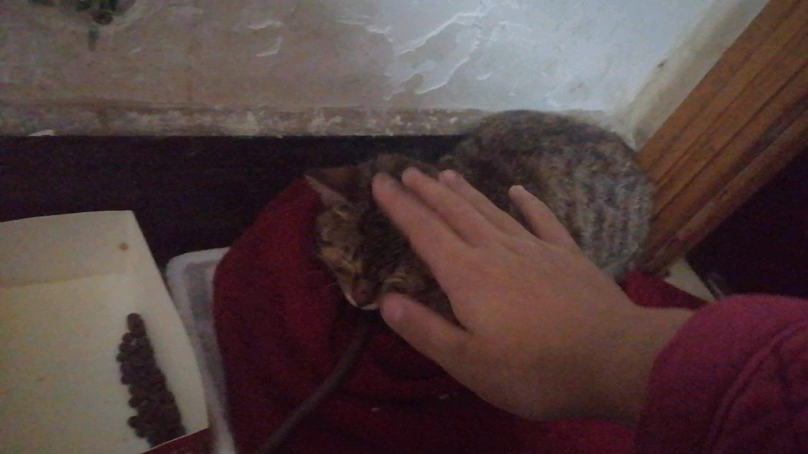 | 109 | 2026-01-20 |
| [^野生哈基米^～](https://www.bilibili.com/video/BV1UYkVBxECp) | 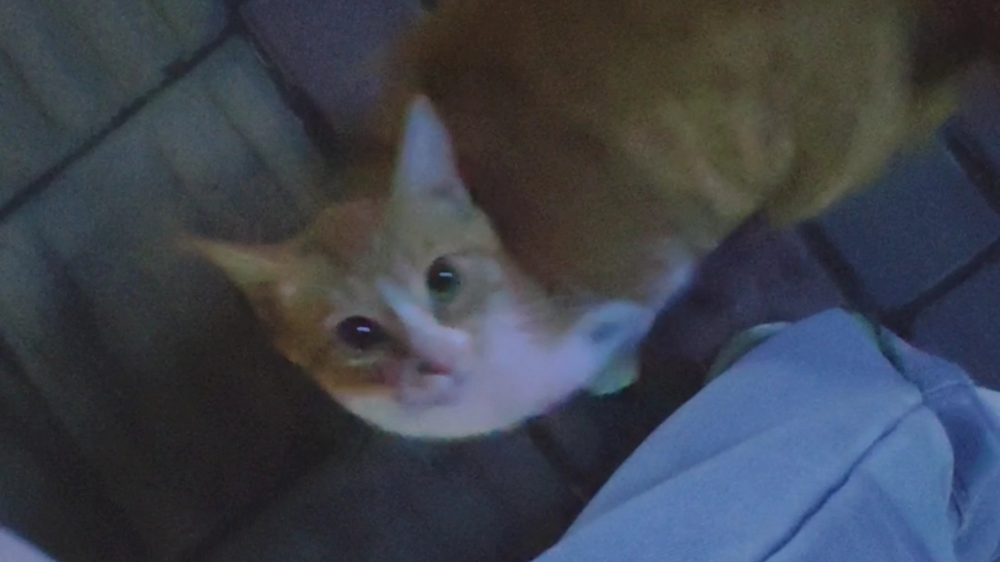 | 92 | 2026-01-20 |
| [南方哈基米哪见过大雪](https://www.bilibili.com/video/BV1VpkVBPESu) | 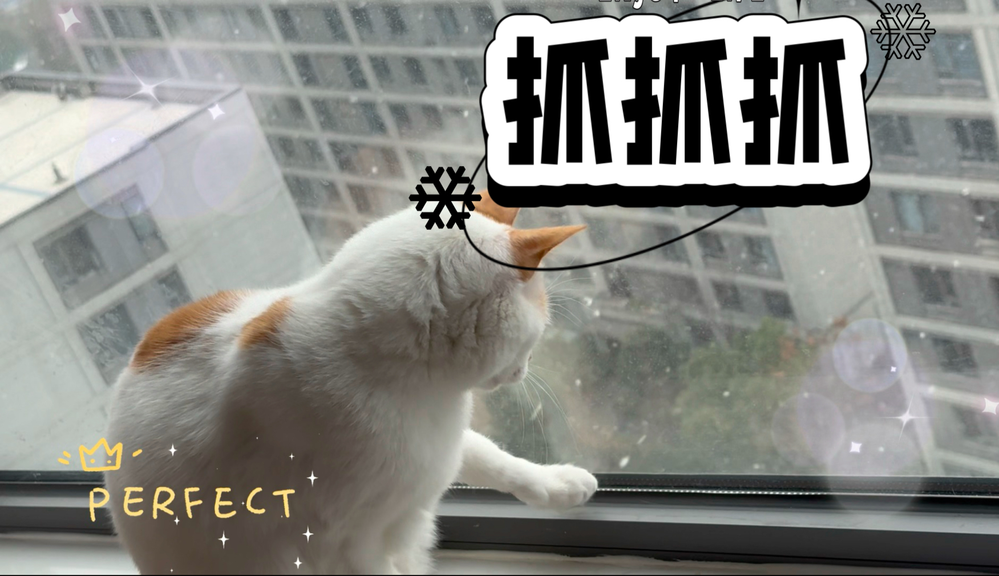 | 46 | 2026-01-20 |
| [【哈基米一包】第一支视频求三连！](https://www.bilibili.com/video/BV1WWk5BHExh) | 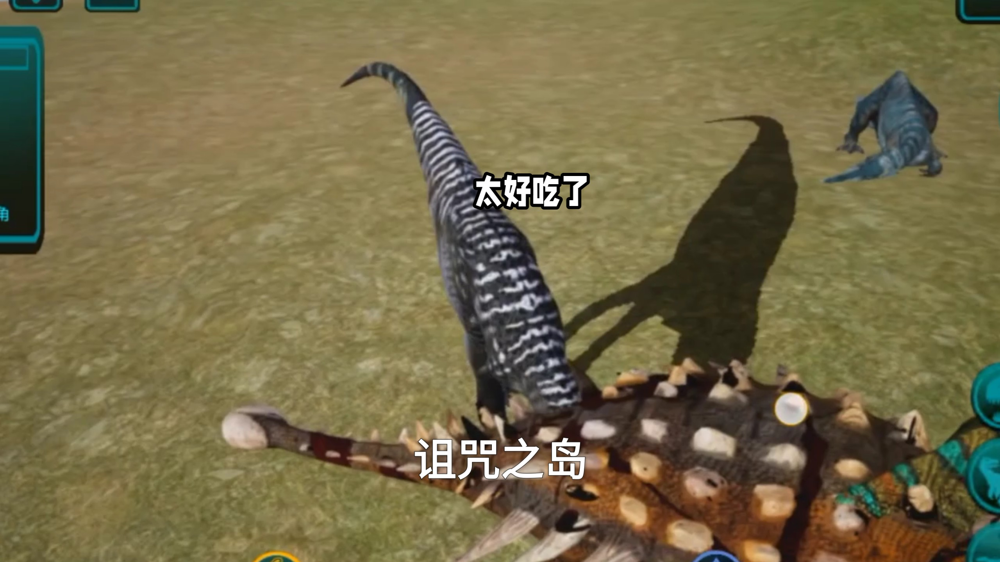 | 3 | 2026-01-20 |
| [CBA赛场惊现哈基米😂（四川VS广东）](https://www.bilibili.com/video/BV1K2kMBGERB) |  | 490 | 2026-01-19 |
| [CBA赛场惊现如此萌物？小猫咪企图持球快攻反击！](https://www.bilibili.com/video/BV13BkMBmEi8) | 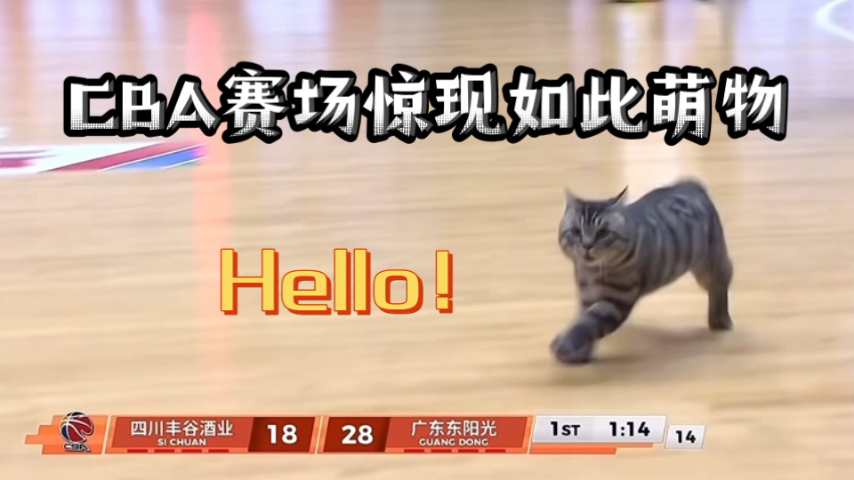 | 3.7万 | 2026-01-19 |
| [【疯狂的哈基米】我家猫看了，它说是真的](https://www.bilibili.com/video/BV1dGkuBWEvT) | 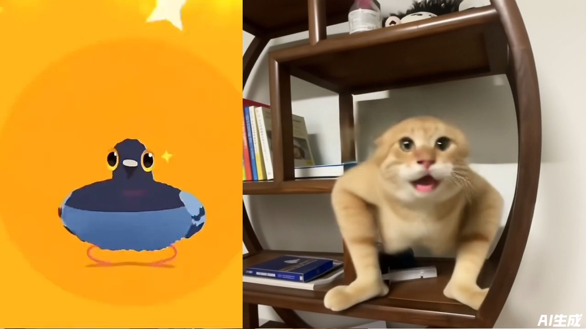 | 203 | 2026-01-19 |
| [电鸡鸠开 广西老表就系猛,鸠开出车祸仲可以逃逸.](https://www.bilibili.com/video/BV1ajkuBQEf6) |  | 34.4万 | 2026-01-19 |
| [【哈基米音乐】全是咪——《全是爱》](https://www.bilibili.com/video/BV1vqkYBsEA1) |  | 1120 | 2026-01-19 |
| [跟被AI夺舍了似的](https://www.bilibili.com/video/BV1VLkaBDEhs) | 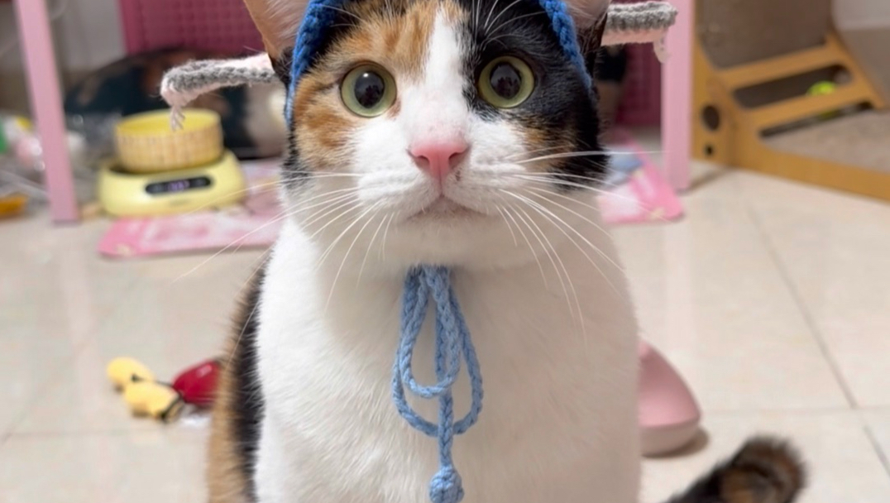 | 90.0万 | 2026-01-19 |
| [level fun+  和哈基米一起玩吧](https://www.bilibili.com/video/BV1gNkHBmEbo) | 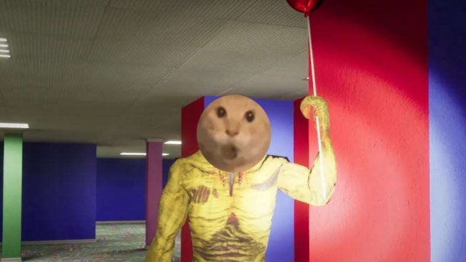 | 4733 | 2026-01-18 |
| [哈基米](https://www.bilibili.com/video/BV1NHr9BAEdB) | 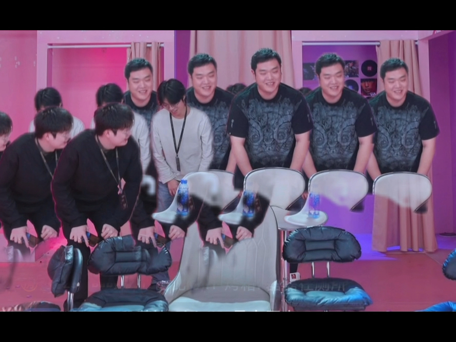 | 183 | 2026-01-17 |
| [基米不想走（和谐版）](https://www.bilibili.com/video/BV1NLrSBDEdp) |  | 315 | 2026-01-17 |
| [在古代，穷人会唱“急急如律令，妈咪贝贝哄”有多爽？](https://www.bilibili.com/video/BV1pWrSBLEuF) |  | 27.5万 | 2026-01-17 |
| [雷霆舞姿 ？疯狂的鸽子！](https://www.bilibili.com/video/BV1xqrDBsE22) |  | 382.6万 | 2026-01-17 |
| [钓鱼佬和放生老太](https://www.bilibili.com/video/BV1BMrUBiEuL) |  | 9.9万 | 2026-01-17 |
| [想赢的小猫是不会哼唧的](https://www.bilibili.com/video/BV1rZr1BvE5B) |  | 76.1万 | 2026-01-17 |
| [耄耋已经走了，那屋里的是什么？](https://www.bilibili.com/video/BV1rRrCBfEXs) | 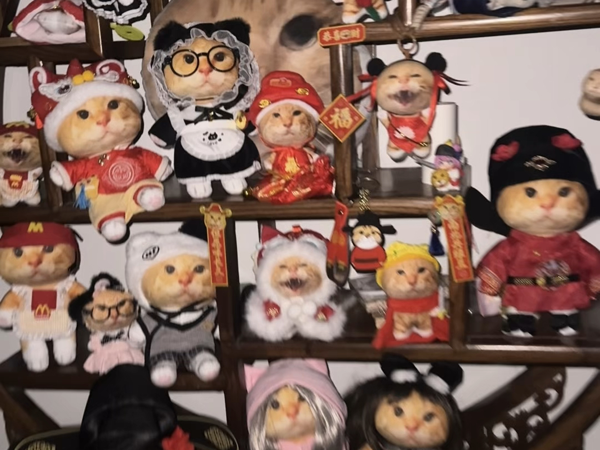 | 51.8万 | 2026-01-16 |
| [王力宏《火力全开》全新版本《恭喜发财》！](https://www.bilibili.com/video/BV1FFryB4E33) |  | 117.2万 | 2026-01-16 |
| [泰曼波（哈基米之歌）](https://www.bilibili.com/video/BV1dPkNBVEwb) |  | 435 | 2026-01-16 |
| [循环歌单｜《你已急哭の小曲》Geisha+聚财咒](https://www.bilibili.com/video/BV1k3kKBtEdC) |  | 168.9万 | 2026-01-16 |
| [我等不及了！！啊啊啊啊啊](https://www.bilibili.com/video/BV1jDrZBfEWv) |  | 209.1万 | 2026-01-15 |
| [科 比 带 我 鳌 太 线 求 生 【B站AI创作大赛-开放赛道】](https://www.bilibili.com/video/BV1mProB3ETQ) |  | 106.9万 | 2026-01-15 |
| [看 图 说 话](https://www.bilibili.com/video/BV1BArGBPEEz) |  | 512.2万 | 2026-01-10 |
| [法 式 皮 鞋](https://www.bilibili.com/video/BV13CBQBbED3) | 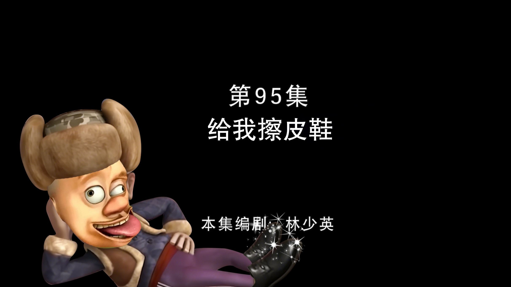 | 237.6万 | 2025-12-25 |
| [“我来不及道声不安.”｜《离开我的依赖dj》1.03x ｜ “艾克里里依赖摇”](https://www.bilibili.com/video/BV1BgsnzYEJi) |  | 158.4万 | 2025-10-25 |
| [钱真的是万恶之源吗？](https://www.bilibili.com/video/BV112WCzVEYm) |  | 538.7万 | 2025-10-17 |
| [【循环歌曲】· 关中王の小曲《精卫》（DJ版） ｜“年少莫嫌出身穷，潜水怎能困蛟龙”](https://www.bilibili.com/video/BV1JHt4zcEwa) |  | 242.3万 | 2025-08-09 |
| [猫meme万恶之源大集合，你最喜欢哪个](https://www.bilibili.com/video/BV1bEhhz8EFX) | 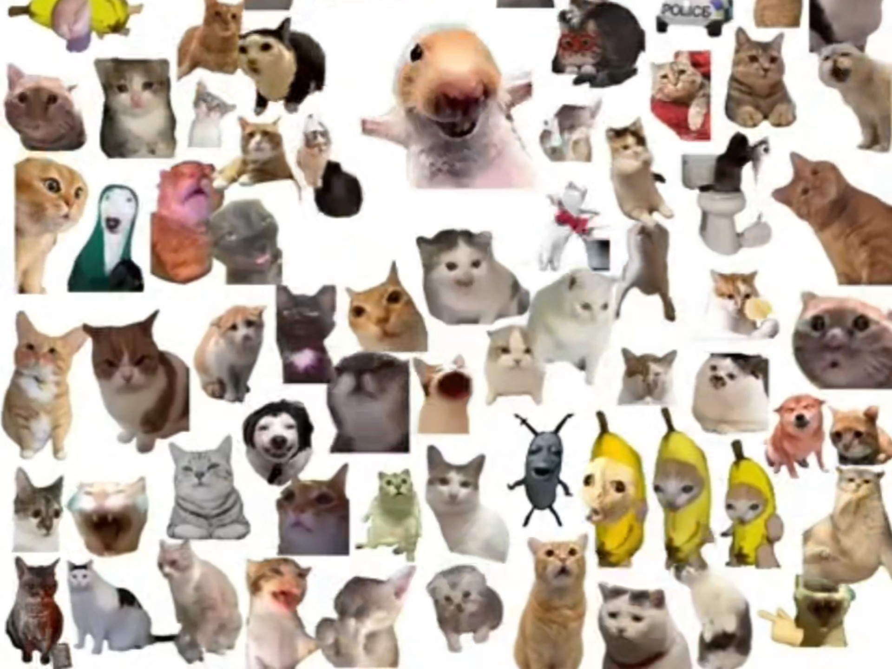 | 19.2万 | 2025-08-02 |
| [哈基米工作室 【爱莉希雅·春好桃夭】GK](https://www.bilibili.com/video/BV1tkA5eHEeu) |  | 5777 | 2025-02-16 |
| [曼波曼波是什么梗？【网络梗知识】](https://www.bilibili.com/video/BV1UA4m1w7k2) |  | 153.2万 | 2024-04-07 |

---
*最后更新: 2026-01-21 02:53:02 (自动生成)*
*数据来源: [Bilibili](https://www.bilibili.com)*

## 使用说明

运行以下命令更新视频列表:
```bash
python3 fetch_hajimi_videos.py
```
