# awesome-hajimi
collections of hajimi (哈基米 in Chinese) on the Internet.

## 视频列表 (Video List)

| 视频标题 (Title) | 封面 | 播放量 (Views) | 发布日期 (Date) |
|---|---|---|---|
| [尼禄和哈基米一起教曼波唱歌](https://www.bilibili.com/video/BV1AeBjBUEyG) |  | 4648 | 2025-12-25 |
| [《猫儿这个贪吃》](https://www.bilibili.com/video/BV1NYBjBJEds) |  | 2.8万 | 2025-12-25 |
| [萌萌的哈基米](https://www.bilibili.com/video/BV1YkqmBSEf1) |  | 592 | 2025-12-25 |
| [【维多利亚3】这个人叫哈基米-波斯帝国扩张史（完结）](https://www.bilibili.com/video/BV155BTB6EfQ) |  | 258 | 2025-12-24 |
| [【战锤：末世鼠疫2】颠覆认知！赏金猎人诠释何谓神的武器！国服顶尖tw团队平推官服最高难度tw20 300阿瑟尔·雅恩瑞](https://www.bilibili.com/video/BV1pTB1BfEWq) |  | 845 | 2025-12-24 |
| [哈基米圣诞快乐](https://www.bilibili.com/video/BV1UJB5BJECH) |  | 273 | 2025-12-24 |
| [【哈基米说唱】夜深了，你是否找到了属于你的哈基米？《夜晚哈基我找不到米》](https://www.bilibili.com/video/BV1VYBLB8Ee3) |  | 385 | 2025-12-24 |
| [圣诞节限定哈基米](https://www.bilibili.com/video/BV1MEB2B3Ex5) |  | 1371 | 2025-12-24 |
| [流放之路2降临 V0.4 12.24  曼波语音包【天枢过滤】哈基米化身恶龙，与四奶奶大战](https://www.bilibili.com/video/BV155BjBaEZd) |  | 3782 | 2025-12-24 |
| [哈基米圣诞启航](https://www.bilibili.com/video/BV1yiBjBjEns) |  | 0 | 2025-12-24 |
| [【哈基红】𝙈𝙤𝙫𝙚𝙨 𝙇𝙞𝙠𝙚 曼波 🐱](https://www.bilibili.com/video/BV1B1BjBgEdx) |  | 2509 | 2025-12-24 |
| [哈基米圣诞曲](https://www.bilibili.com/video/BV1f2BjBzEDp) |  | 4.0万 | 2025-12-24 |
| [哈基米起手明天能不能给我红一个](https://www.bilibili.com/video/BV1zCBjBrExk) |  | 3488 | 2025-12-24 |
| [【异常调查录】耄组织入侵南北绿豆基地！夺取耄魂企图复活耄耋？](https://www.bilibili.com/video/BV1PQBLB7EiT) | 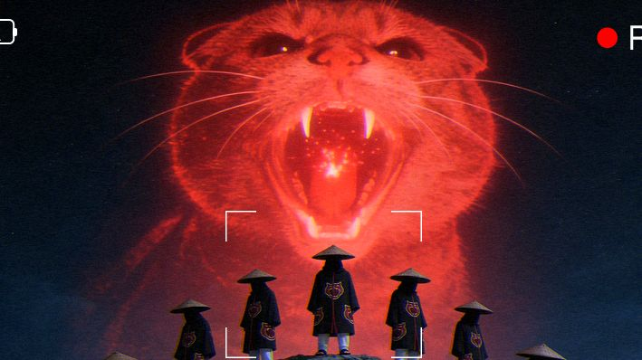 | 4.3万 | 2025-12-24 |
| [【哈基北阴乐】圣诞要你命](https://www.bilibili.com/video/BV1JWB7B5E98) |  | 817 | 2025-12-24 |
| [Padoru！但是哈基米！！！](https://www.bilibili.com/video/BV13fB5B9Egh) |  | 3061 | 2025-12-24 |
| [🔔圣诞快乐哈基米先生🔔](https://www.bilibili.com/video/BV1kiB5BBEbp) | 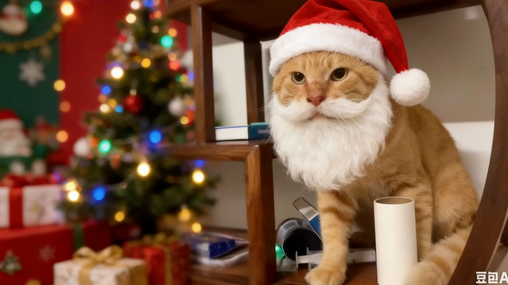 | 1156 | 2025-12-24 |
| [哈基米TV:铁齿铜牙哈基米](https://www.bilibili.com/video/BV1FBB5BMEEv) |  | 1.7万 | 2025-12-24 |
| [我都快哈死20个了，你为啥非要拦我核弹啊😭](https://www.bilibili.com/video/BV1q8BKB6EMt) |  | 1.3万 | 2025-12-24 |
| [《猫和晓艳》第十三集](https://www.bilibili.com/video/BV1kvB5BuEC7) |  | 1.7万 | 2025-12-24 |
| [雪山哈基米](https://www.bilibili.com/video/BV1KxB5BjE1m) |  | 228 | 2025-12-24 |
| [【坎公】韩服新开花 哈基米](https://www.bilibili.com/video/BV1vQB5BtEEF) |  | 905 | 2025-12-24 |
| [20分钟哈基米音乐合集 哈基米～#哈基米 #音乐推荐分享 #音乐合集](https://www.bilibili.com/video/BV1twBLBDEB4) | 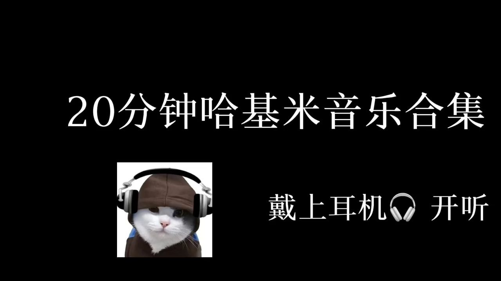 | 298 | 2025-12-24 |
| [“我感觉到，全都回来了！”](https://www.bilibili.com/video/BV1DZB5BWE72) |  | 13.4万 | 2025-12-24 |
| [【ASMR❥无损Hires】温热吐息 恶猫咆哮 哈基米 哈气](https://www.bilibili.com/video/BV1B1B5BaEgs) |  | 404 | 2025-12-24 |
| [大号老鼠偷吃老人食物，被制裁](https://www.bilibili.com/video/BV1WgBLBLErv) | 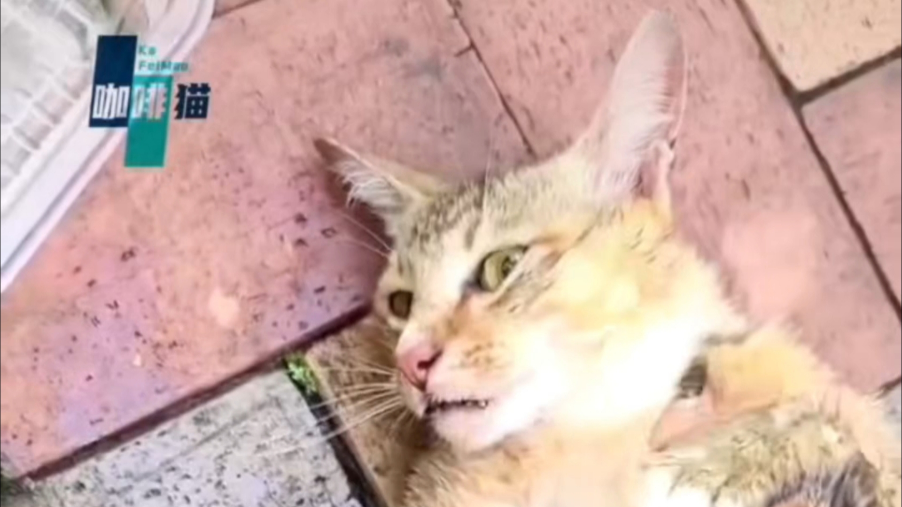 | 3154 | 2025-12-24 |
| [小红书TV：流浪哈基米是一只自由的小猫](https://www.bilibili.com/video/BV1W3BLByEnY) |  | 303 | 2025-12-24 |
| [【圣诞哈基米音乐】更适合曼波体质的基米响叮当](https://www.bilibili.com/video/BV1M3BMBaEL3) |  | 7452 | 2025-12-24 |
| [圣诞限定哈基米~](https://www.bilibili.com/video/BV1NmBVBGEBH) |  | 6154 | 2025-12-24 |
| [给哈基米换了整套红皮喵](https://www.bilibili.com/video/BV1AUBVBrE25) |  | 388 | 2025-12-24 |
| [珍蚌！](https://www.bilibili.com/video/BV1dTB5BtEKm) | 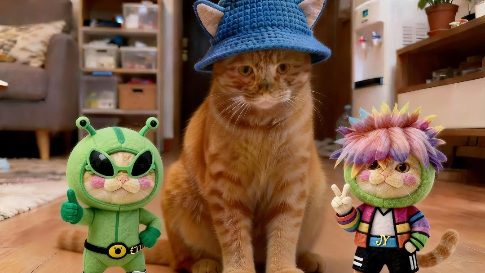 | 3414 | 2025-12-24 |
| [纸巾 萝卜 真棒](https://www.bilibili.com/video/BV1BAB5BwEx8) | 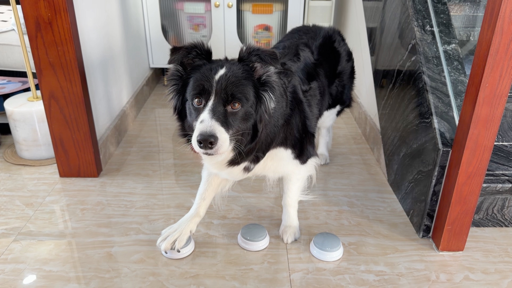 | 32.2万 | 2025-12-24 |
| [哈基米这个喝新鲜鱼汤（鱼藏起来了）](https://www.bilibili.com/video/BV1pKB3BaExf) | 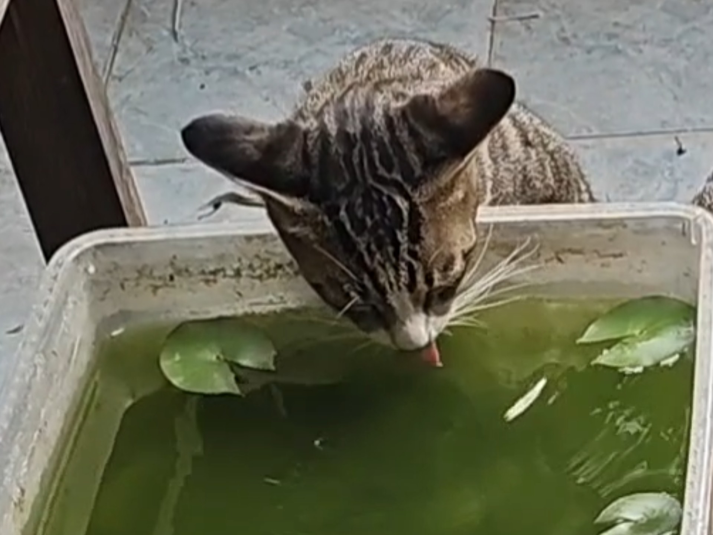 | 516 | 2025-12-24 |
| [基米TV之好猫合集21分钟剧场版](https://www.bilibili.com/video/BV1QKBgBkELS) | 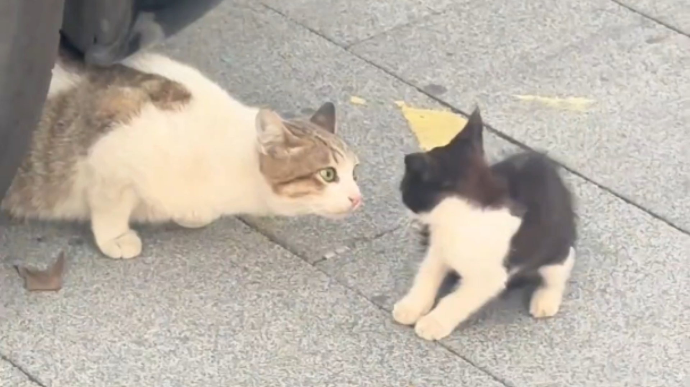 | 1752 | 2025-12-23 |
| [飞扑奶妈然后轻吻洞洞鞋的小荔枝，可爱又活泼的哈基米（bushi](https://www.bilibili.com/video/BV1mXBMBYEd1) |  | 946 | 2025-12-23 |
| [🚁迷迭香限定新皮肤🚁 全技能特效演示！动态效果演示 超大杯立绘🥰可爱猫猫](https://www.bilibili.com/video/BV1ZGBuBSEFx) |  | 11.2万 | 2025-12-23 |
| [猫儿这个哈气](https://www.bilibili.com/video/BV1A7BKBSEYk) |  | 9790 | 2025-12-23 |
| [这么撸猫对吗？](https://www.bilibili.com/video/BV1yVBKBHEBL) | 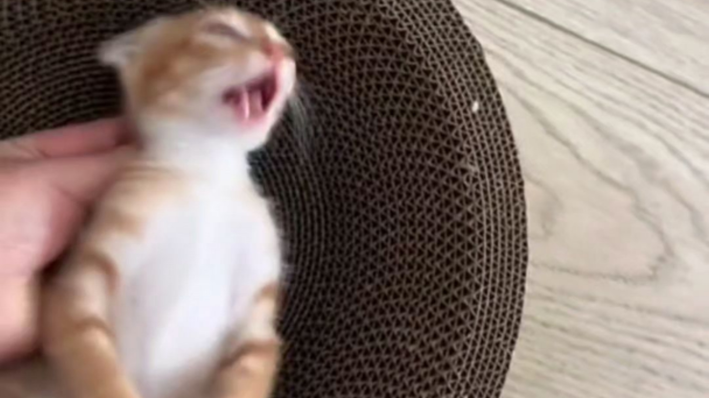 | 5.1万 | 2025-12-23 |
| [比英超官方更似全家的【哈基米之狮】](https://www.bilibili.com/video/BV1nwBTBUE2j) |  | 9523 | 2025-12-23 |
| [震惊哈基米一整天](https://www.bilibili.com/video/BV1tnBWB6EBJ) |  | 6.8万 | 2025-12-23 |
| [基米小学：平安夜](https://www.bilibili.com/video/BV1v5BTB6E8c) |  | 648 | 2025-12-23 |
| [萝卜纸巾挑战 耄耄可聪明了！](https://www.bilibili.com/video/BV1ejBTBuECH) |  | 8514 | 2025-12-23 |
| [【二重螺旋｜二创】 哈基米大旋风](https://www.bilibili.com/video/BV173BTBkEsv) |  | 9881 | 2025-12-23 |
| [那些失禁造成的名场面](https://www.bilibili.com/video/BV1tkBPB9Ed5) |  | 4254 | 2025-12-23 |
| [是哈基哈基米，允许哈气！](https://www.bilibili.com/video/BV1aHB8BPEh8) |  | 5891 | 2025-12-23 |
| [☠️☠️顶级爱猫人士](https://www.bilibili.com/video/BV19oBNBAEZC) |  | 9427 | 2025-12-23 |
| [上课阴乐](https://www.bilibili.com/video/BV1sSBsB6Eaw) |  | 18.2万 | 2025-12-22 |
| [圣诞基米来咯](https://www.bilibili.com/video/BV1h7BxBnEAV) |  | 2613 | 2025-12-22 |
| [正在帮你清理厨房的哈基米](https://www.bilibili.com/video/BV1naBWBAEdh) | 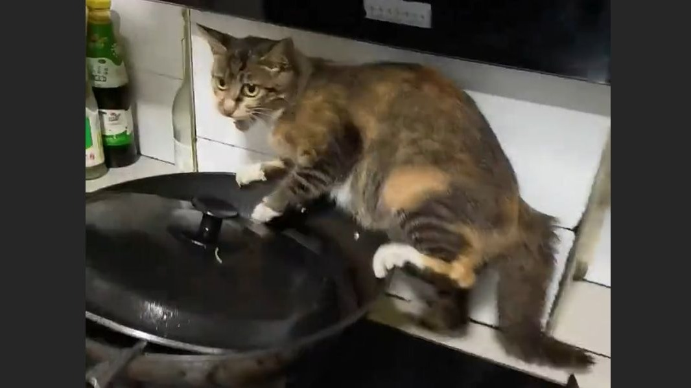 | 7.3万 | 2025-12-22 |
| [男人发现一件有趣的事，用保鲜膜把小猫咪包裹住](https://www.bilibili.com/video/BV14jBHBvEt7) | 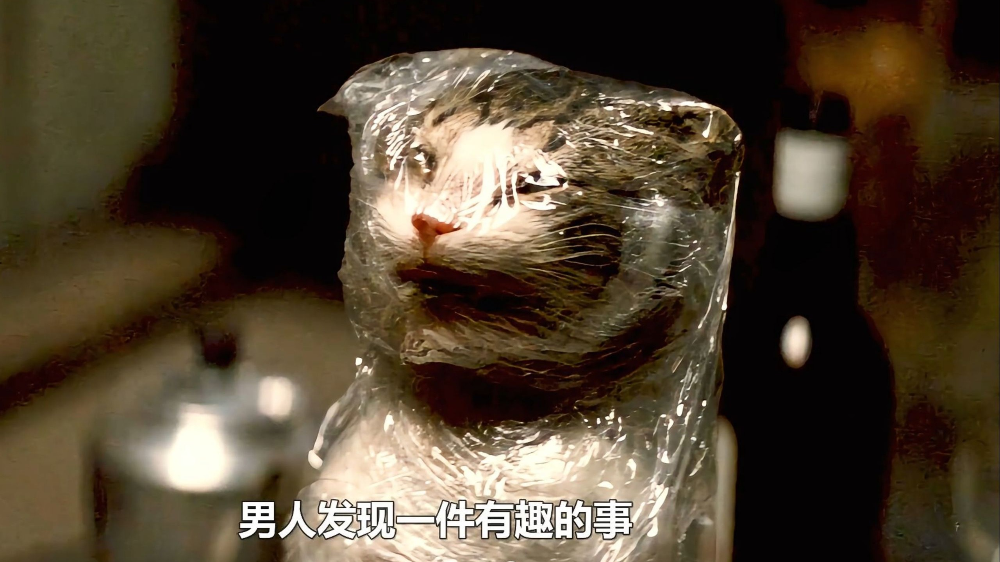 | 30.5万 | 2025-12-22 |
| [不同物种的幼崽互相认识](https://www.bilibili.com/video/BV1dTqkBMEqz) |  | 14.5万 | 2025-12-21 |
| [拼尽全力，无法绷住](https://www.bilibili.com/video/BV1HxqmBhEVU) | 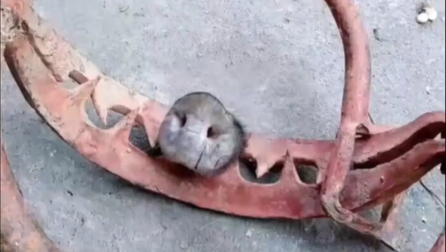 | 36.1万 | 2025-12-21 |
| [什么萝卜纸巾？](https://www.bilibili.com/video/BV1Kvq2BiEqT) | 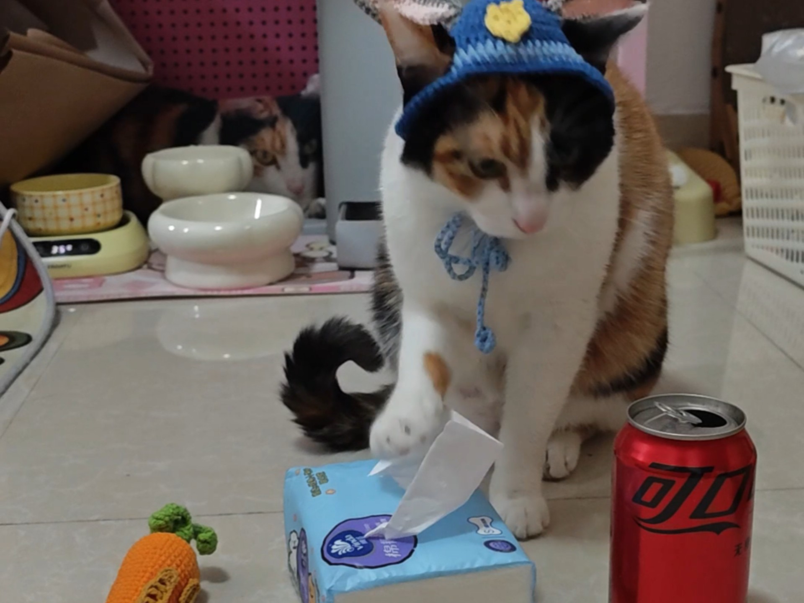 | 157.4万 | 2025-12-21 |
| [这还有救吗？](https://www.bilibili.com/video/BV1HGqzBMEZu) | 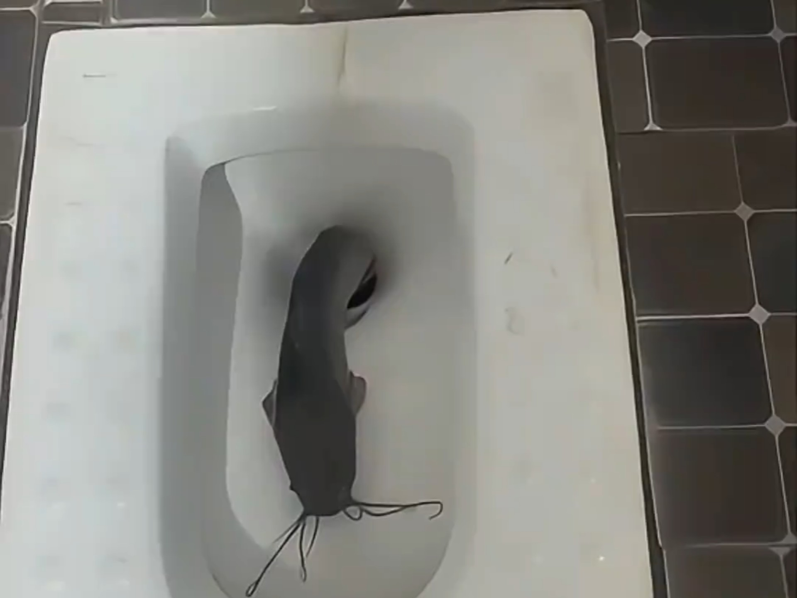 | 14.3万 | 2025-12-20 |
| [爱猫男老时候](https://www.bilibili.com/video/BV1LkqfBJExJ) |  | 11.7万 | 2025-12-19 |
| [【绝区零】绳匠，哈基米是什么意思？](https://www.bilibili.com/video/BV19QqhBBEtA) |  | 25.1万 | 2025-12-19 |
| [【哈基米不知道】第一支视频求三连！](https://www.bilibili.com/video/BV1qdqZBDE6Z) |  | 93 | 2025-12-19 |
| [“感谢你的出现”【2025年全网爆火的破亿热门歌曲合集part6】音乐推荐 ｜ 音乐可视化 ｜ 动态歌词](https://www.bilibili.com/video/BV18xqdBYEkB) |  | 11.7万 | 2025-12-19 |
| [训猫教程](https://www.bilibili.com/video/BV1XrqoB3EHd) | 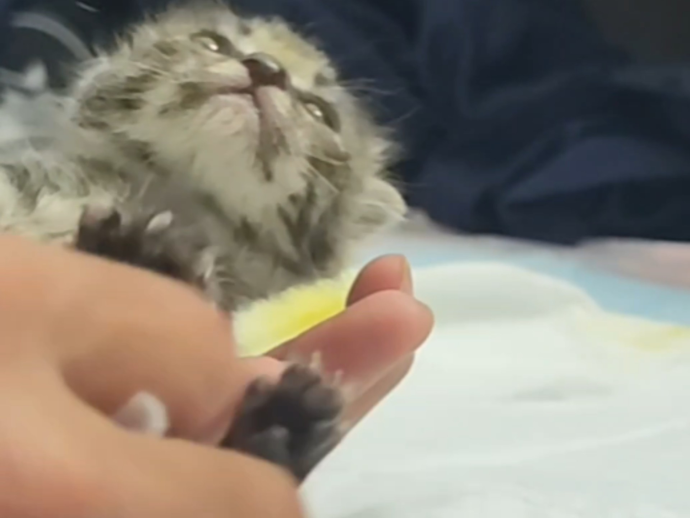 | 23.1万 | 2025-12-19 |
| [我养了一只哈基米！！！](https://www.bilibili.com/video/BV1XcqpBrEgd) | 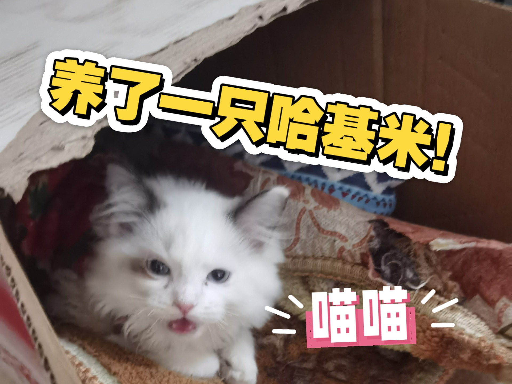 | 1498 | 2025-12-18 |
| [拼尽全力，无法绷住](https://www.bilibili.com/video/BV1V9qJBBEmH) |  | 18.3万 | 2025-12-18 |
| [牛马基米](https://www.bilibili.com/video/BV1XvqnBzE3N) |  | 6640 | 2025-12-18 |
| [丑橘这个哭泣（合订本）](https://www.bilibili.com/video/BV1QiqEBcEe5) |  | 1.8万 | 2025-12-18 |
| [冬天了，带你看看猫咪怎么取暖的~](https://www.bilibili.com/video/BV1LgqYBLEZP) |  | 8.7万 | 2025-12-18 |
| [人，进来。【圣诞特辑】](https://www.bilibili.com/video/BV1HaqLBTEET) |  | 3.9万 | 2025-12-17 |
| [纯纯大号老鼠！喂的不吃，不会抓老鼠，偷吃排骨…](https://www.bilibili.com/video/BV1a92aBbECF) | 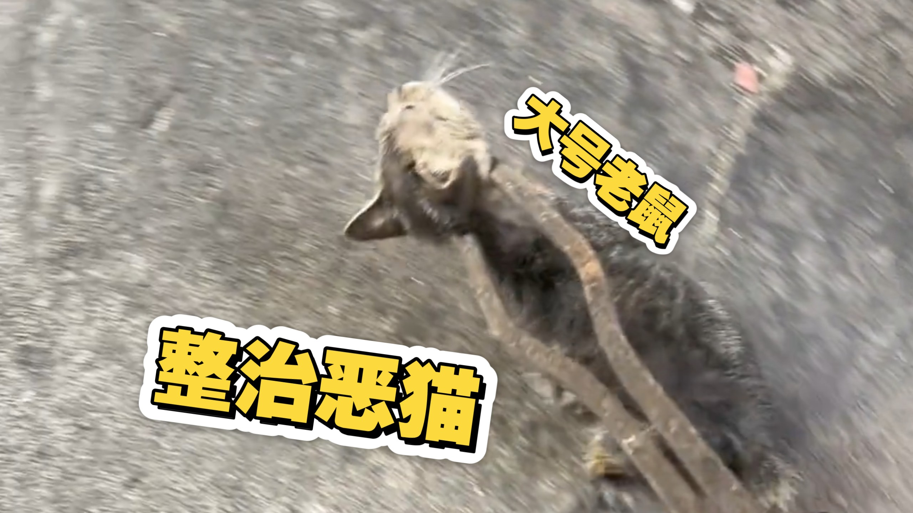 | 9.0万 | 2025-12-17 |
| [这是那个人才想出来的，太厉害了](https://www.bilibili.com/video/BV13Cq3BVEzv) |  | 20.3万 | 2025-12-17 |
| [尝试豆包生成人类](https://www.bilibili.com/video/BV13EqgBrEBb) | 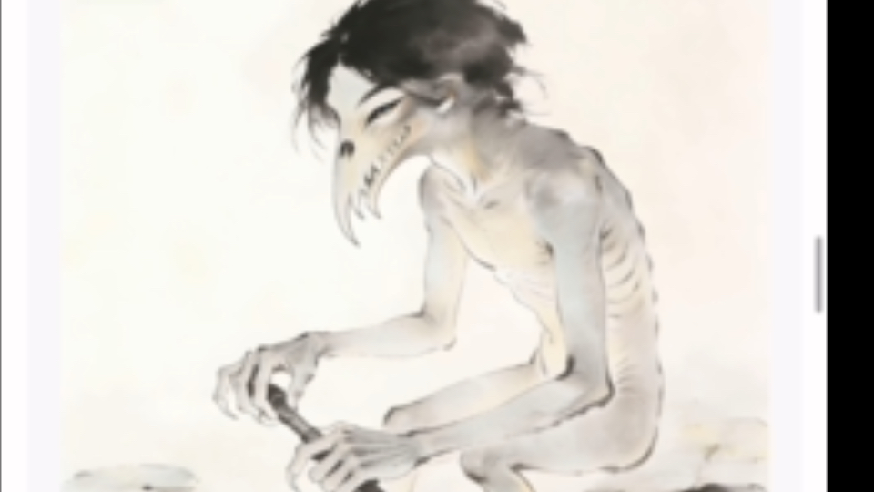 | 39.8万 | 2025-12-17 |
| [还是老片有感觉，看完天花板都黏黏的](https://www.bilibili.com/video/BV1iXqgB7Eop) | 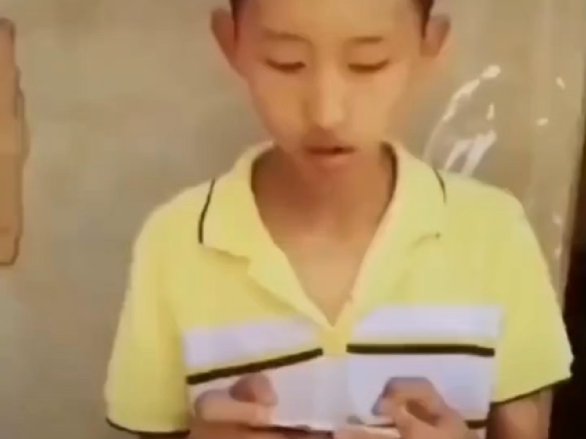 | 104.1万 | 2025-12-17 |
| [在哪里都能咪一会，所以叫猫咪？](https://www.bilibili.com/video/BV1WumzBiESH) |  | 10.0万 | 2025-12-17 |
| [人，进来](https://www.bilibili.com/video/BV11Pq8BQErn) |  | 4.8万 | 2025-12-16 |
| [高中时晚上翻墙去网吧（六）](https://www.bilibili.com/video/BV1iZmyBMEb4) | 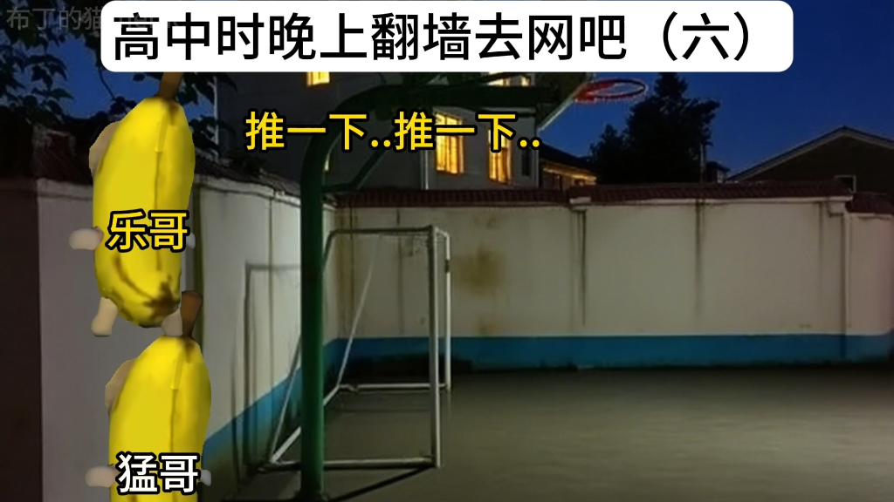 | 212.5万 | 2025-12-15 |
| [听破壁音乐时我满脑子都是这个](https://www.bilibili.com/video/BV1UFUFBAEQS) |  | 9.1万 | 2025-12-13 |
| [恭喜发财，原旋律且押韵的英文版！](https://www.bilibili.com/video/BV1AHmRBCEsq) |  | 362.9万 | 2025-12-13 |
| [当日本人整👽](https://www.bilibili.com/video/BV1pHmRBCEq9) |  | 86.0万 | 2025-12-13 |
| [请善待每一个生命](https://www.bilibili.com/video/BV1D2m3BqEYb) |  | 3.8万 | 2025-12-11 |
| [当你发现一窝的基米](https://www.bilibili.com/video/BV1dsmtBdExa) | 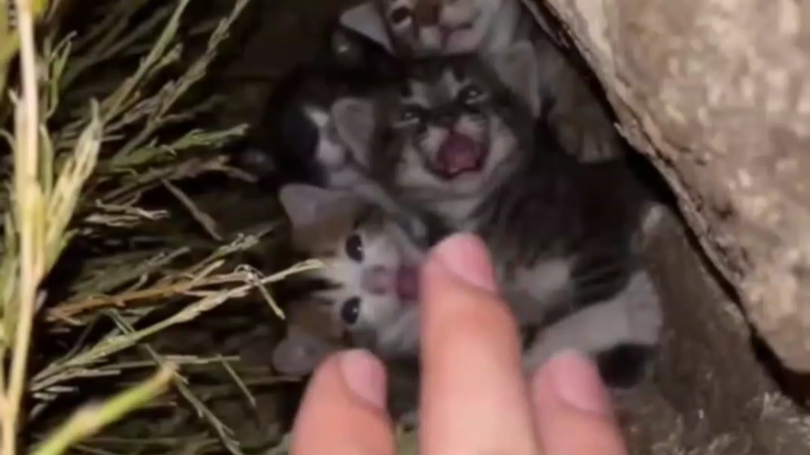 | 4.4万 | 2025-12-10 |
| [真的假的](https://www.bilibili.com/video/BV1MsmbB1EMn) | 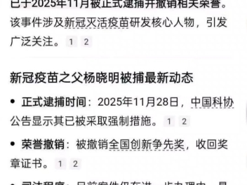 | 1.2万 | 2025-12-10 |
| [【VOCALOID AI】Bad Apple!!](https://www.bilibili.com/video/BV1vg21BKEcN) |  | 23.4万 | 2025-12-08 |
| [这才是疯狂动物城2主题曲《Zoo》原版MV](https://www.bilibili.com/video/BV1oR2LB9EXt) |  | 49.0万 | 2025-12-05 |
| [俄语版《我赚钱了》-后朋克风格](https://www.bilibili.com/video/BV1ZeSqBtE6N) |  | 197.5万 | 2025-11-30 |
| [炫压抑TV之逆天外网抽象meme](https://www.bilibili.com/video/BV1eESiBSEDo) |  | 56.0万 | 2025-11-30 |
| [盘点最难听的术曲，第一名实至名归！](https://www.bilibili.com/video/BV12ASKBEEXM) |  | 13.1万 | 2025-11-30 |
| [萌翻了！搞笑曼基康猫太可爱😹](https://www.bilibili.com/video/BV1JuU8BzEWR) |  | 3.3万 | 2025-11-26 |
| [哈基米和哈亚库果然是一对苦命鸳鸯](https://www.bilibili.com/video/BV1d9CKBQELi) |  | 240 | 2025-11-14 |
| [小猫咪的治愈瞬间，这也太可爱了吧！](https://www.bilibili.com/video/BV1uJ1xBvERx) |  | 31.3万 | 2025-11-07 |
| [【哈基米音乐】Gion2 （崩坏3主界面背景音乐）](https://www.bilibili.com/video/BV1zJyCBeEk6) |  | 9.4万 | 2025-10-28 |
| [活全家单曲《哈基杯》完整版](https://www.bilibili.com/video/BV17qWQzpEk3) |  | 1.9万 | 2025-10-21 |
| [【哈基咪】曾经我也想过一咪百咪](https://www.bilibili.com/video/BV1yv49zGEBn) |  | 1.0万 | 2025-10-14 |
| [“byd，开头就绷不住了！！！”](https://www.bilibili.com/video/BV1hsntzaEMd) |  | 14.1万 | 2025-09-25 |
| [耄耋10秒不心动挑战](https://www.bilibili.com/video/BV1vAuQzyEyP) |  | 1.0万 | 2025-07-19 |
| [基巨化道馆！全家活起来！](https://www.bilibili.com/video/BV11muEzvE1b) |  | 7.8万 | 2025-07-15 |
| [听取喵声一片！！！](https://www.bilibili.com/video/BV1uE3uzHE2K) | 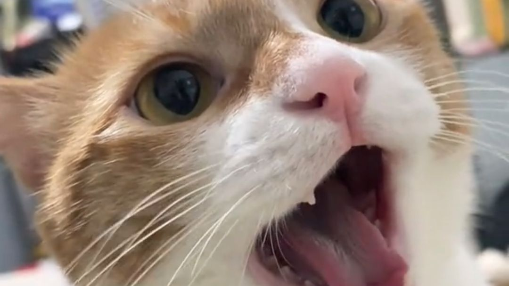 | 24.0万 | 2025-07-03 |
| [【哈基米圣诞歌】All I Want for Christmas Is You🎵](https://www.bilibili.com/video/BV1RvFReqEUC) |  | 1.3万 | 2025-02-01 |
| [猫meme素材整合分享](https://www.bilibili.com/video/BV1Qb421a7ce) |  | 41.2万 | 2024-04-27 |
| [第19届奥斯卡最佳动画短片【猫的协奏曲 The Cat Concerto】（1946）](https://www.bilibili.com/video/BV19M4m1X7SZ) |  | 96.8万 | 2024-04-02 |
| [暴揍咬人猫](https://www.bilibili.com/video/BV1Me4y1R7Kt) | 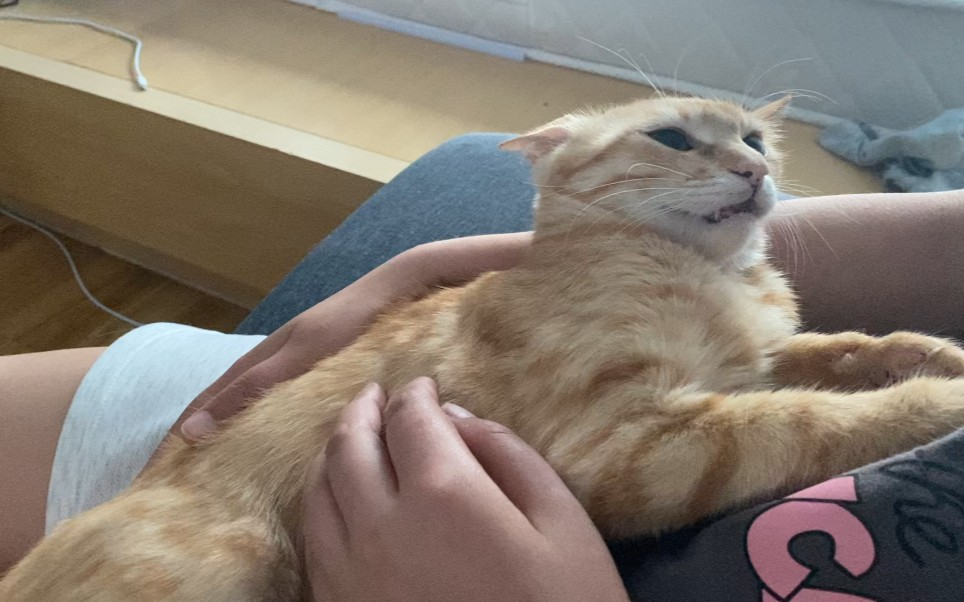 | 35.7万 | 2022-07-11 |
| [在宠物店遇到一只很来劲的小猫，直接把她带回家](https://www.bilibili.com/video/BV1F5411D7XW) |  | 771.3万 | 2022-04-03 |
| [喵喵喵喵喵喵喵喵喵喵喵喵喵喵喵喵喵喵喵喵喵喵](https://www.bilibili.com/video/BV1ob4y177uG) | 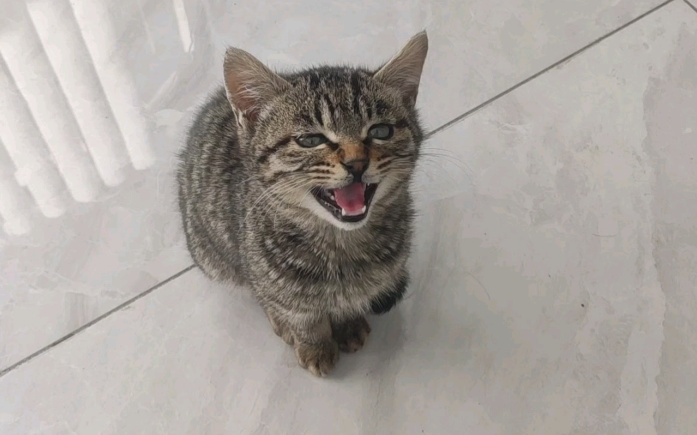 | 461.5万 | 2022-01-27 |
| [可怜的小猫从高处落下被栅栏刺穿了...](https://www.bilibili.com/video/BV1mW411p7Hy) | 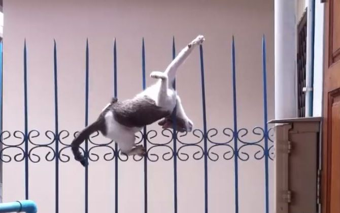 | 130.9万 | 2018-03-17 |

---
*最后更新: 2025-12-25 02:47:41 (自动生成)*
*数据来源: [Bilibili](https://www.bilibili.com)*

## 使用说明

运行以下命令更新视频列表:
```bash
python3 fetch_hajimi_videos.py
```
