# awesome-hajimi
collections of hajimi (哈基米 in Chinese) on the Internet.

## 视频列表 (Video List)

| 视频标题 (Title) | 封面 | 播放量 (Views) | 发布日期 (Date) |
|---|---|---|---|
| [哈基米可爱捏](https://www.bilibili.com/video/BV1rmnXzXEFf) | 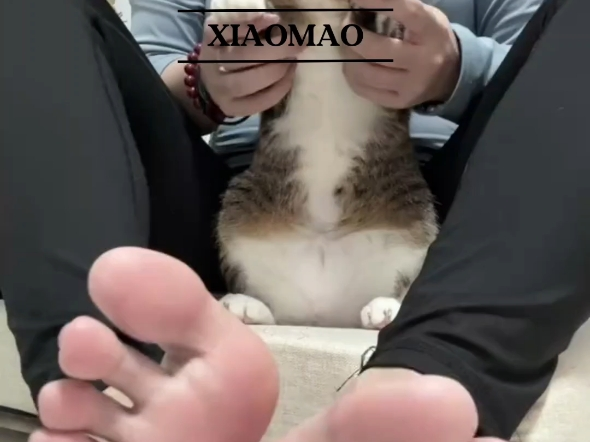 | 119 | 2025-09-28 |
| [循环歌单｜《外星小猫の小曲》《哈基米睡觉の小曲》おはなばたけ(花田)](https://www.bilibili.com/video/BV1XMn9zuE1X) | 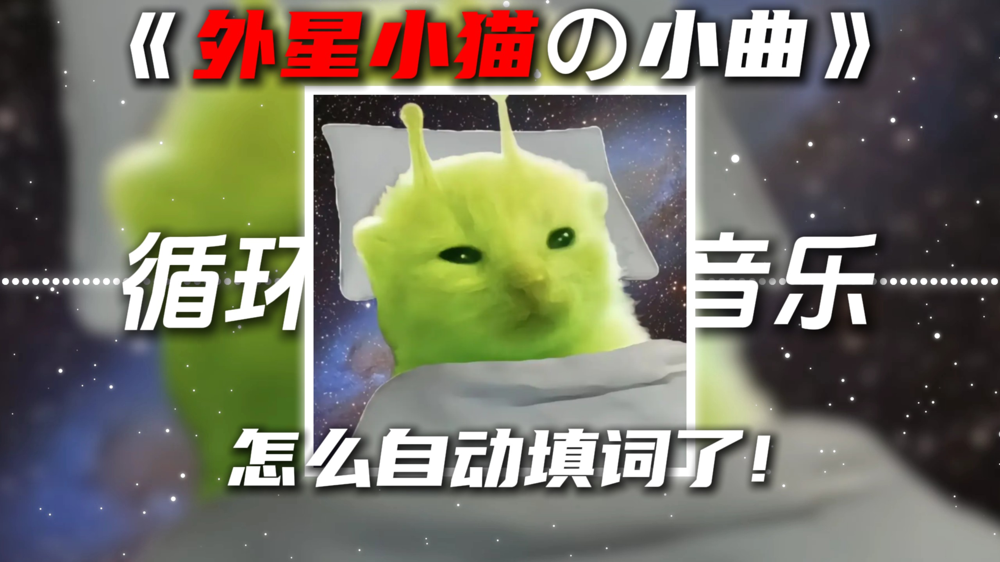 | 103 | 2025-09-28 |
| [【修复版】哈基米：小杂鱼曼波！](https://www.bilibili.com/video/BV1GsnnzJECm) |  | 2136 | 2025-09-27 |
| [哈基米这个前置驱动](https://www.bilibili.com/video/BV19HJdz5ExQ) |  | 4682 | 2025-09-27 |
| [哈基米音乐合集】(第三期) &quot; 全体肃静！欣赏音乐！ &quot;](https://www.bilibili.com/video/BV1yznEzcETE) |  | 1550 | 2025-09-27 |
| [ASMR 哈基米摩擦抓绕音助眠](https://www.bilibili.com/video/BV1oonEzUEUd) | 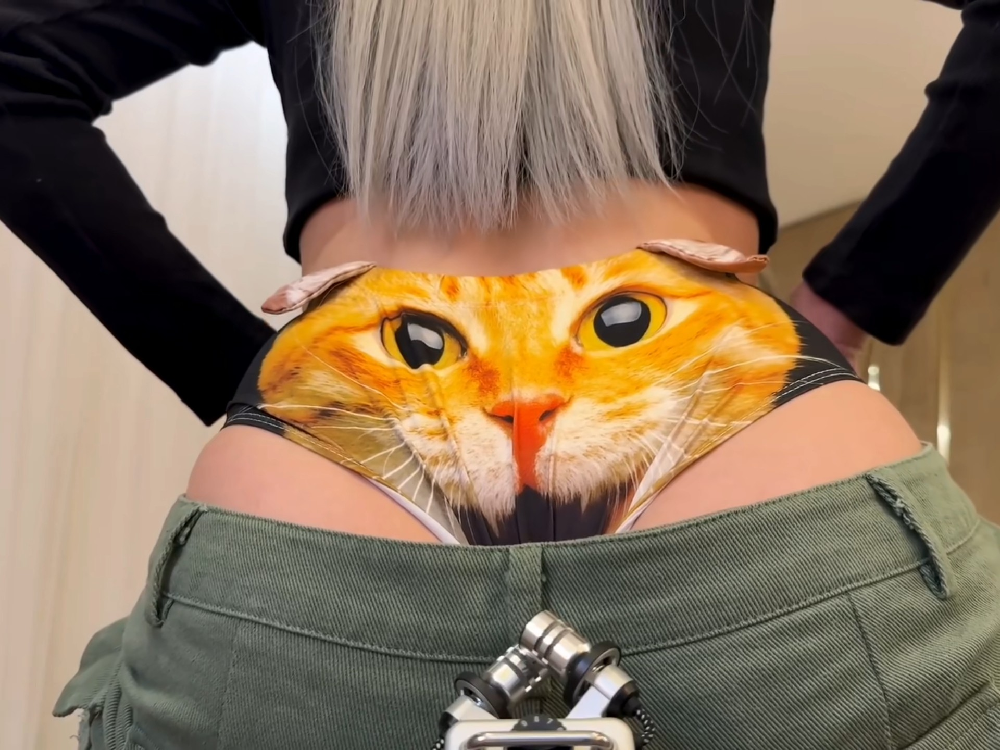 | 2.3万 | 2025-09-27 |
| [【哈基米音乐】⚡偏⚡哈⚡(偏爱)](https://www.bilibili.com/video/BV1aNnJzVEPD) |  | 6880 | 2025-09-27 |
| [唱完直接化成雪白的灰了之哈基米逆风翻盘](https://www.bilibili.com/video/BV1dBnJzDE6W) |  | 2.0万 | 2025-09-27 |
| [哈基米：狂浪（完整版）](https://www.bilibili.com/video/BV1kknjznEwY) |  | 1114 | 2025-09-27 |
| [【基米说】｜“就这个停顿爽 好词不挑曲”](https://www.bilibili.com/video/BV1tXn7zYEEK) |  | 9332 | 2025-09-27 |
| [超难蚌可爱翻唱《青基》⚡哈基米哈基米~南北路多基米~⚡](https://www.bilibili.com/video/BV1tGnbz8E1j) |  | 6839 | 2025-09-27 |
| [哈基米被碾压但是有行车记录仪，不看不白死了？](https://www.bilibili.com/video/BV1idnjzrEF4) | 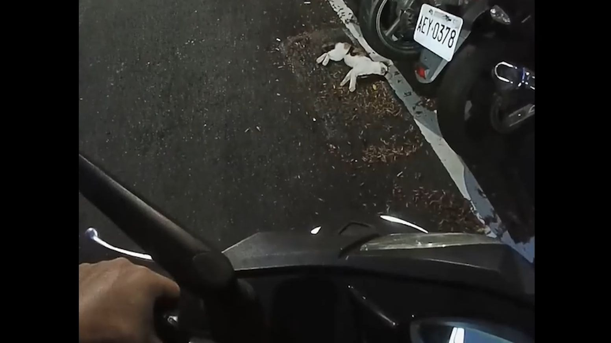 | 1512 | 2025-09-27 |
| [🐱哈基叶上学🐱](https://www.bilibili.com/video/BV1Vcn7zuEv4) |  | 1001 | 2025-09-27 |
| [开局一个碗，江山全靠砍！](https://www.bilibili.com/video/BV16ingzcEnn) |  | 48.1万 | 2025-09-27 |
| [循环歌单｜【基米说】｜“就这个停顿爽 好词不挑曲”](https://www.bilibili.com/video/BV1TRn7zwEhi) |  | 9.5万 | 2025-09-27 |
| [天上掉下个哈基米](https://www.bilibili.com/video/BV1Ain5zmEjU) |  | 13.9万 | 2025-09-27 |
| [【哈基米】🎵🐱𝑯𝒂𝒍𝒆𝒔𝒔𝒊𝒏𝒈🐱🎵](https://www.bilibili.com/video/BV1ginVzZEJq) |  | 803 | 2025-09-27 |
| [补档-哈基米这个自产自销](https://www.bilibili.com/video/BV1aon5zAEY4) | 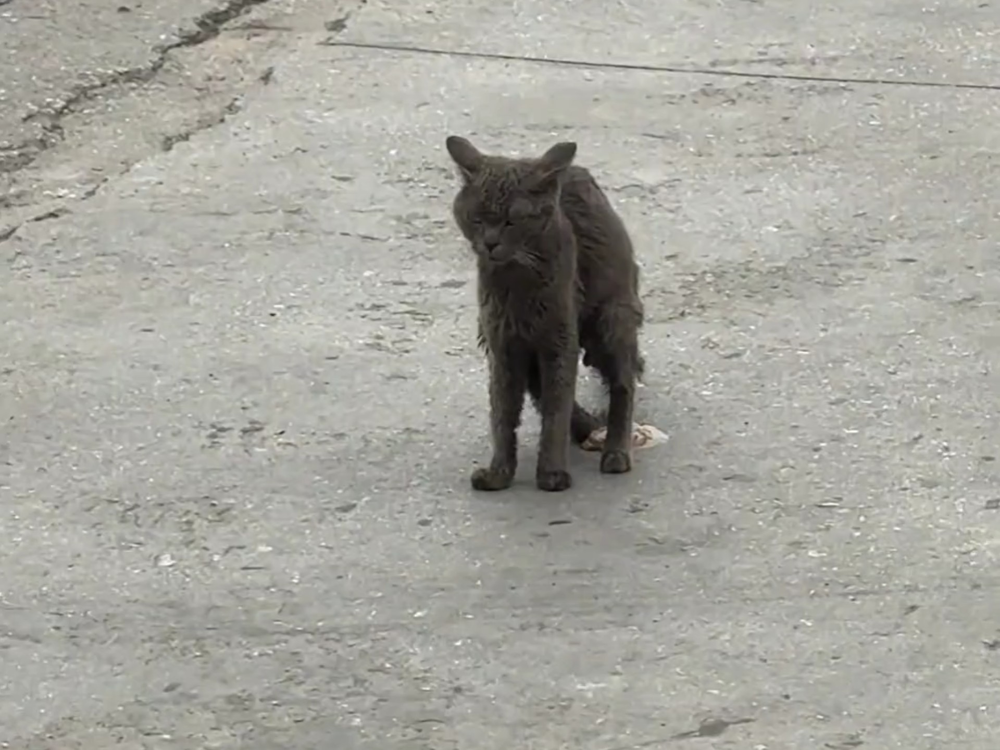 | 3453 | 2025-09-27 |
| [【治愈哈基phonk】🐱Isekai Phonk🐱](https://www.bilibili.com/video/BV1PDnVzEEhE) |  | 1.9万 | 2025-09-26 |
| [塑料袋污染环境这一块 【补档】](https://www.bilibili.com/video/BV1Mpn5z4E6W) | 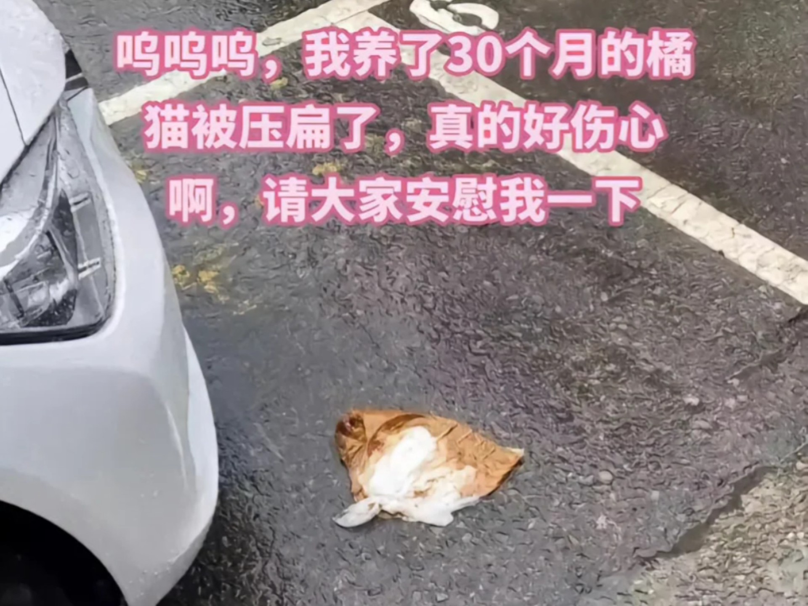 | 22.7万 | 2025-09-26 |
| [哈基米误食老鼠药即将飞升喵星](https://www.bilibili.com/video/BV1gvn3zDE4v) |  | 6195 | 2025-09-26 |
| [哈基米音乐：东京哈基故事](https://www.bilibili.com/video/BV12EngzkEn6) |  | 568 | 2025-09-26 |
| [哈基米 Still Alive](https://www.bilibili.com/video/BV1GKngzQEXs) | 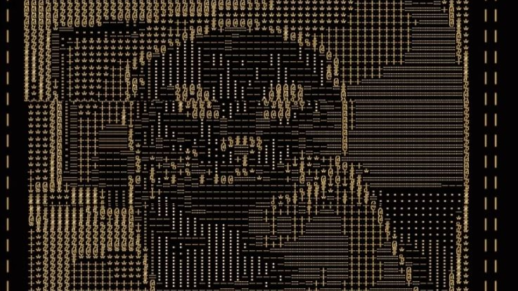 | 524 | 2025-09-26 |
| [哈基米助眠丨专为免疫的你制作的助眠](https://www.bilibili.com/video/BV134nuzEED1) | 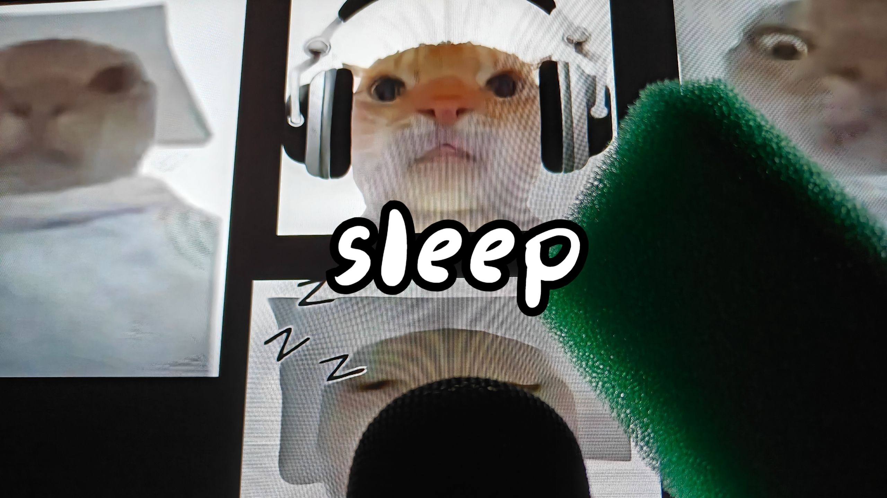 | 3153 | 2025-09-26 |
| [谁才是最强哈基米？](https://www.bilibili.com/video/BV1J7n3zAEtf) |  | 14.8万 | 2025-09-26 |
| [户子最搞笑的一集，和安卓猫杠上了！](https://www.bilibili.com/video/BV14Fn3zyETm) |  | 10.0万 | 2025-09-26 |
| [【哈基米FM】🐱基 基 飞 车🐱神曲「Insomnia 哈眠症」](https://www.bilibili.com/video/BV11nnMzYEAW) |  | 2.0万 | 2025-09-26 |
| [哈的太逼真](https://www.bilibili.com/video/BV1ypnMzwEGi) |  | 4313 | 2025-09-26 |
| [哈基米这个多才多艺](https://www.bilibili.com/video/BV1aDngzDEpe) | 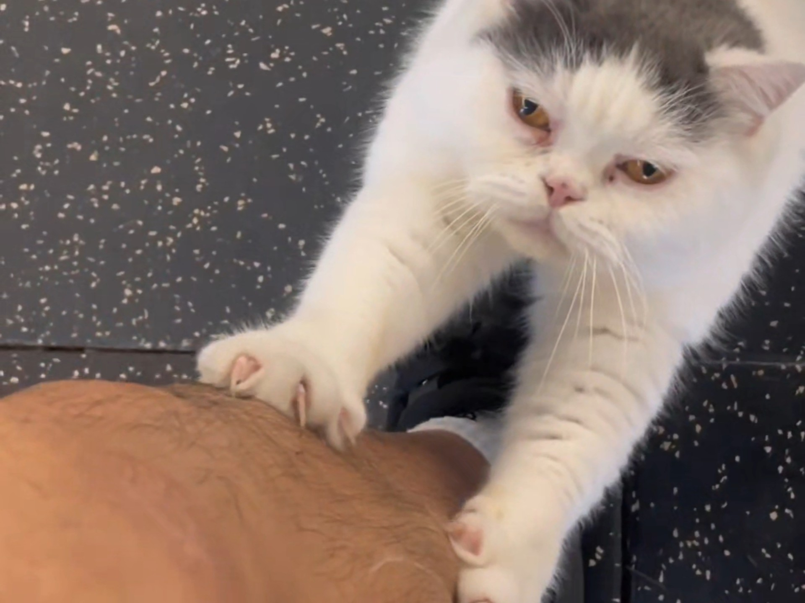 | 3196 | 2025-09-26 |
| [【哈基米音乐】奔跑の小曲](https://www.bilibili.com/video/BV1Qen3zHEDa) |  | 1.2万 | 2025-09-26 |
| [哈基米神曲](https://www.bilibili.com/video/BV1xZnMzMEi4) |  | 757 | 2025-09-26 |
| [《蓝莲哈》哈基米来洗涤你浮躁的心（完整版）](https://www.bilibili.com/video/BV1JDn8zpEFC) |  | 1.6万 | 2025-09-26 |
| [双英战吕布，竟为哈基米](https://www.bilibili.com/video/BV1Xqn4zeEJ4) |  | 2.3万 | 2025-09-26 |
| [哈…还好我也不是什么正常人《蓝莲哈》🐱超神翻唱](https://www.bilibili.com/video/BV1DYneznE9f) |  | 5.9万 | 2025-09-26 |
| [基米修仙传：不哈（结婴版）](https://www.bilibili.com/video/BV1ZinhzDE1V) |  | 5514 | 2025-09-26 |
| [哈基米 这个不惧台风](https://www.bilibili.com/video/BV1nRnezKESe) | 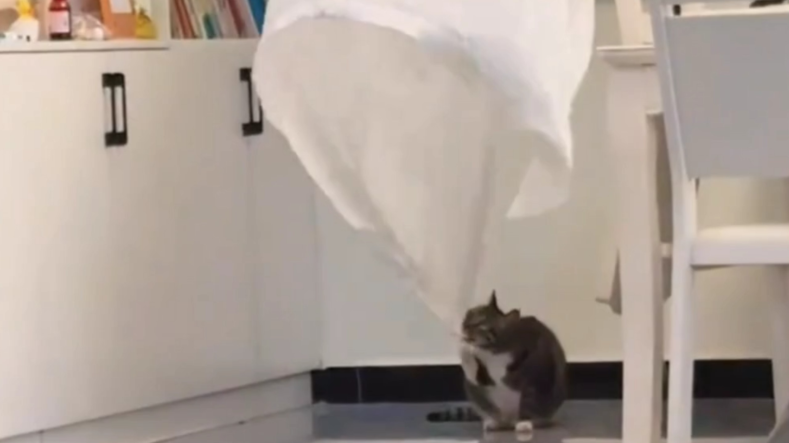 | 4531 | 2025-09-26 |
| [[哈基米音乐]樱哈草(樱花草)](https://www.bilibili.com/video/BV1u3nbzcE3C) |  | 983 | 2025-09-25 |
| [🐱起哈了🐱｜“以耄之名，你还愿意吗”](https://www.bilibili.com/video/BV1mFnazNENC) | 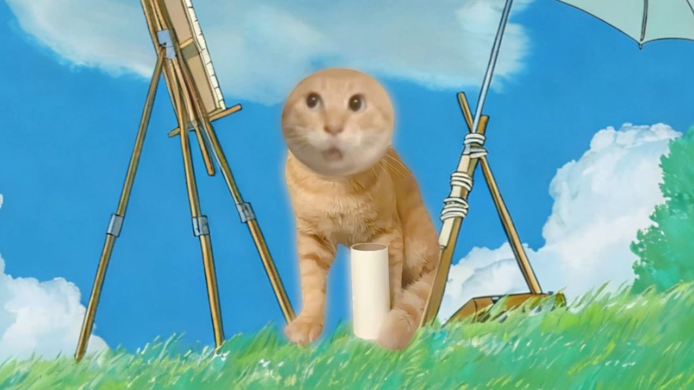 | 7.9万 | 2025-09-25 |
| [？？这个 ？？](https://www.bilibili.com/video/BV1DKnbzeEDm) | 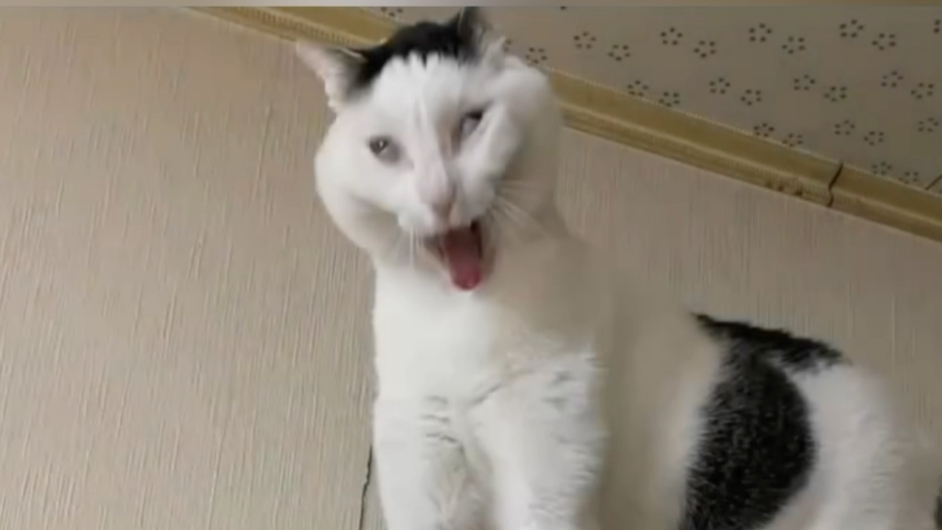 | 29.3万 | 2025-09-25 |
| [锐评全网爆火哈基米音乐，全都听过你可以提前放假了](https://www.bilibili.com/video/BV1b4ntzcE6X) |  | 32.2万 | 2025-09-25 |
| [难道？要变成甜耋啦！](https://www.bilibili.com/video/BV1wsnbzHE1n) |  | 17.9万 | 2025-09-25 |
| [[基米三百首]《天上掉下个哈基米》](https://www.bilibili.com/video/BV18DnbzeEhv) | 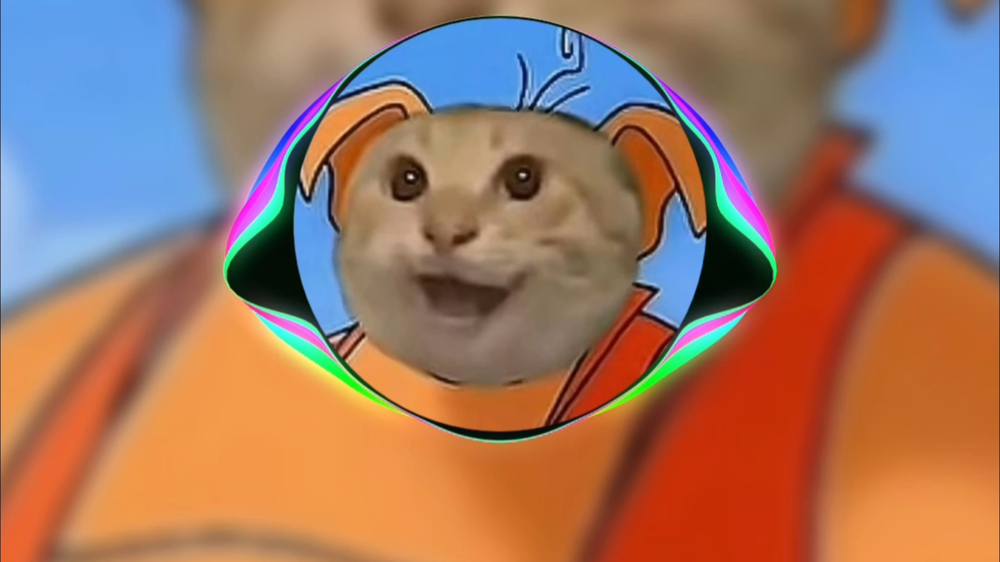 | 1329 | 2025-09-25 |
| [一分钟学会《基米说》（原曲：伯虎说）（钢琴教学）](https://www.bilibili.com/video/BV1eEn8z5Enh) |  | 2327 | 2025-09-25 |
| [⚡ 哈 基 皇 战 争 ⚡](https://www.bilibili.com/video/BV1JmJyzZEFC) |  | 1.3万 | 2025-09-25 |
| [🐱“终基一生 满是遗憾”🐱](https://www.bilibili.com/video/BV1Uznpz2Eb5) |  | 33.6万 | 2025-09-25 |
| [⚡⚡⚡哈基米手机铃声⚡⚡⚡](https://www.bilibili.com/video/BV13vnpznEn9) |  | 2647 | 2025-09-25 |
| [依旧哈基米喔南北绿豆~](https://www.bilibili.com/video/BV1tMn4zsEpg) | 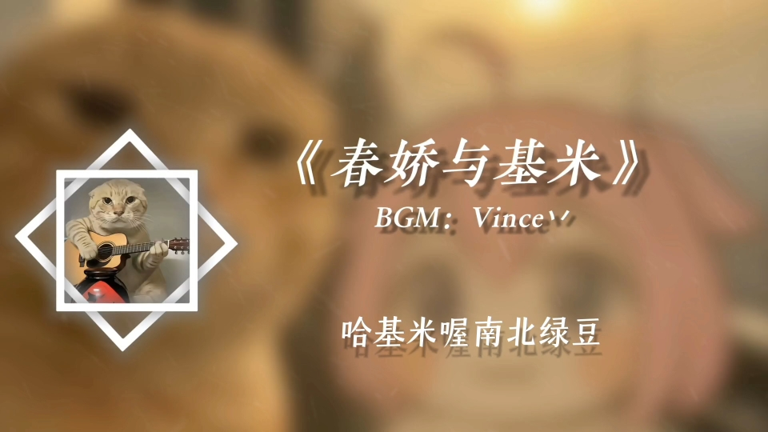 | 1505 | 2025-09-25 |
| [🐱哈基山的基米美如水啊](https://www.bilibili.com/video/BV1qPJSzaEwo) |  | 20.9万 | 2025-09-24 |
| [【爱情买卖】の“基米买卖”](https://www.bilibili.com/video/BV1iMJQzqEym) | 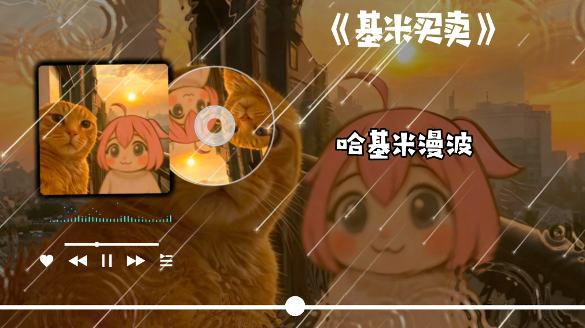 | 3284 | 2025-09-24 |
| [哈基米对抗赛博坦星人惨败](https://www.bilibili.com/video/BV14EJmz5EU7) | 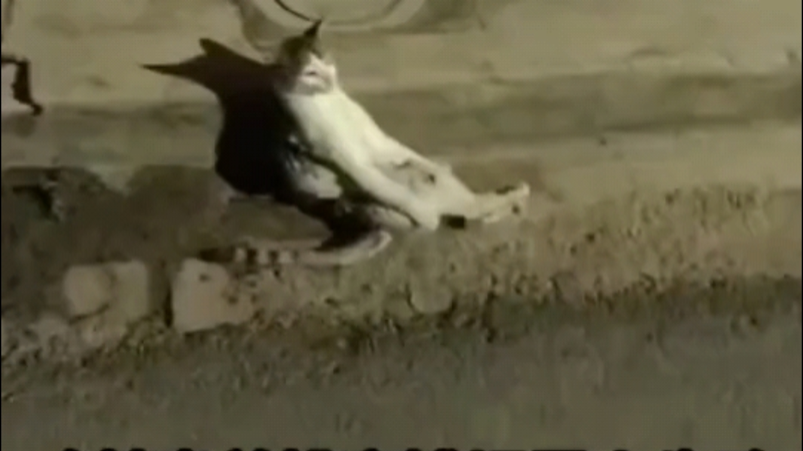 | 7324 | 2025-09-23 |
| [基米永远不嫌太多 对你哈.](https://www.bilibili.com/video/BV18uJ1zkE8C) | 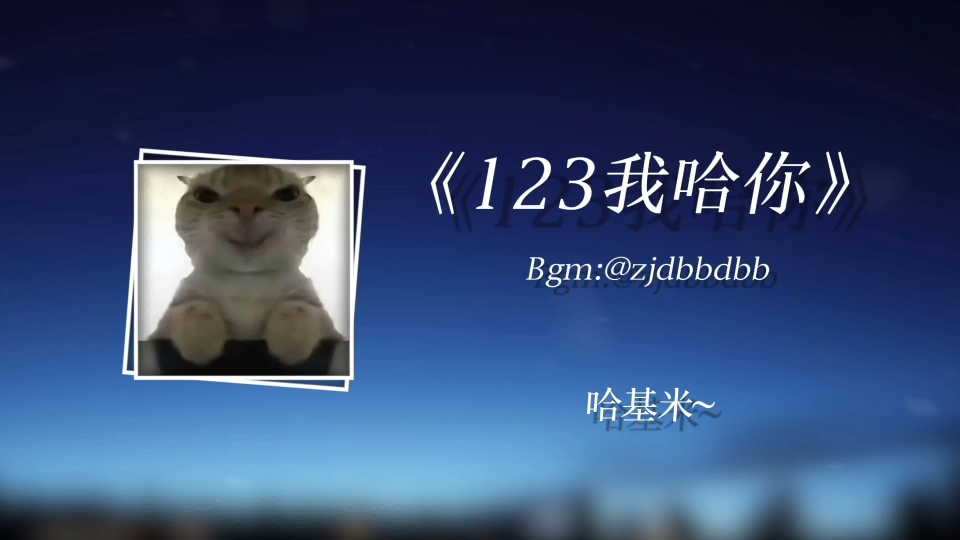 | 493 | 2025-09-23 |
| [天天天国地獄曼波~哈基米！](https://www.bilibili.com/video/BV128JkzaEYd) |  | 6546 | 2025-09-23 |
| [哈基米偷鸡，结果被当场被抓](https://www.bilibili.com/video/BV1z1JkznErX) | 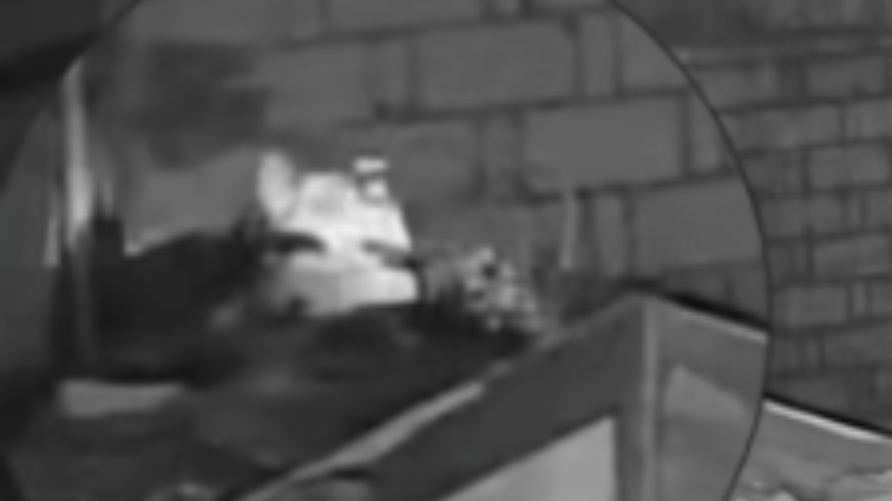 | 3235 | 2025-09-23 |
| [哈基汪：666，谁给我处决键改成普攻了](https://www.bilibili.com/video/BV1SynPzhEkj) | 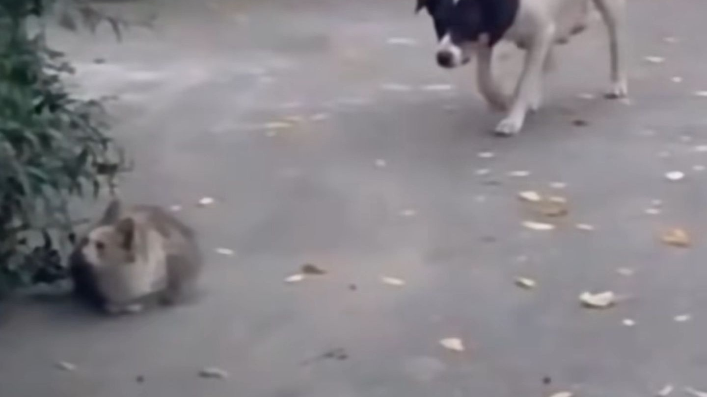 | 24.2万 | 2025-09-22 |
| [🎵彼女は旅に出る🎵纯净哈基米🎵](https://www.bilibili.com/video/BV1hsJdzGEJt) |  | 2943 | 2025-09-21 |
| [曼波波波](https://www.bilibili.com/video/BV1UDWwz8E3q) | 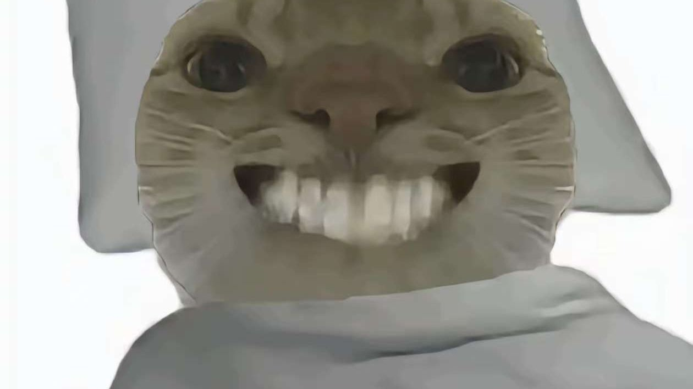 | 444 | 2025-09-21 |
| [自动填词 花田](https://www.bilibili.com/video/BV1SpWczfEJA) | 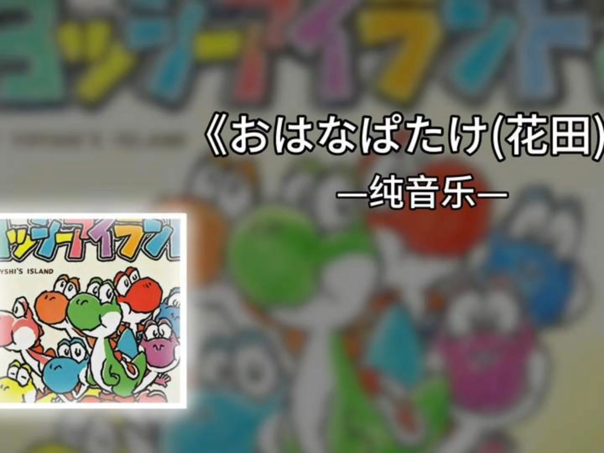 | 212 | 2025-09-21 |
| [如果你面前有五只被虐待的幼猫，你会怎么做？](https://www.bilibili.com/video/BV1myWuz2EK2) |  | 4.7万 | 2025-09-19 |
| [马桶盖打开的那一刻蚌埠住了](https://www.bilibili.com/video/BV1rZpqzmEGq) | 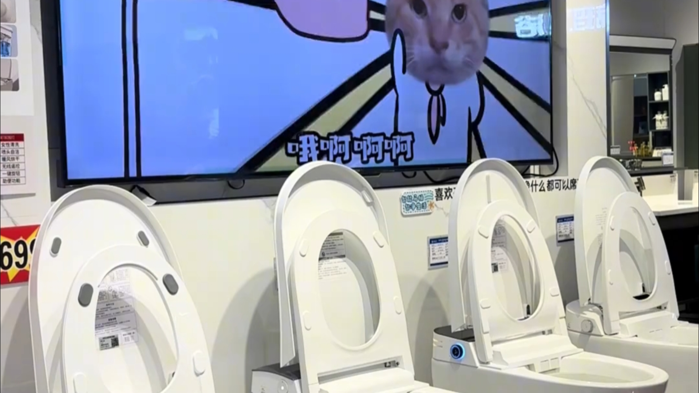 | 39.2万 | 2025-09-15 |
| [往事只能哈基](https://www.bilibili.com/video/BV1n2pMzYEJ3) |  | 161.7万 | 2025-09-15 |
| [哪怕恐惧到掉小零食也要主动哈气吗？哈基米，你这家伙......!!!](https://www.bilibili.com/video/BV17HpAzLEHy) | 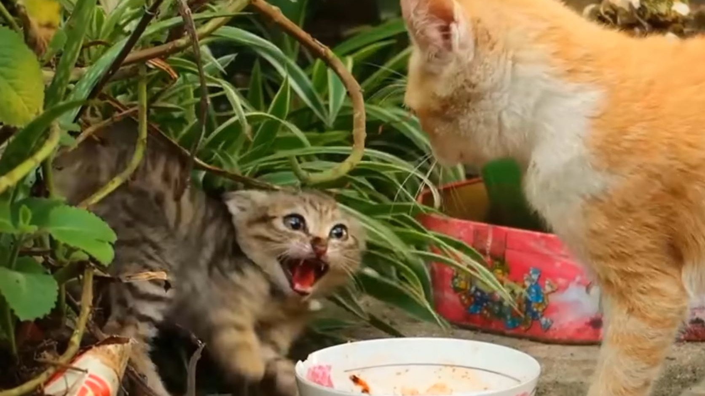 | 5.0万 | 2025-09-15 |
| [【基米说】报告长官！这里发现一只哈基米诗人！一口哈气走天下！！仙品！！这是仙品！！](https://www.bilibili.com/video/BV1fVHfzPEwh) |  | 1043 | 2025-09-14 |
| [青基](https://www.bilibili.com/video/BV1P7pEzPEmQ) |  | 117.6万 | 2025-09-14 |
| [哈基米这个emo，基米的眼泪【纯净流哈基米】](https://www.bilibili.com/video/BV1dDp7zDEEy) | 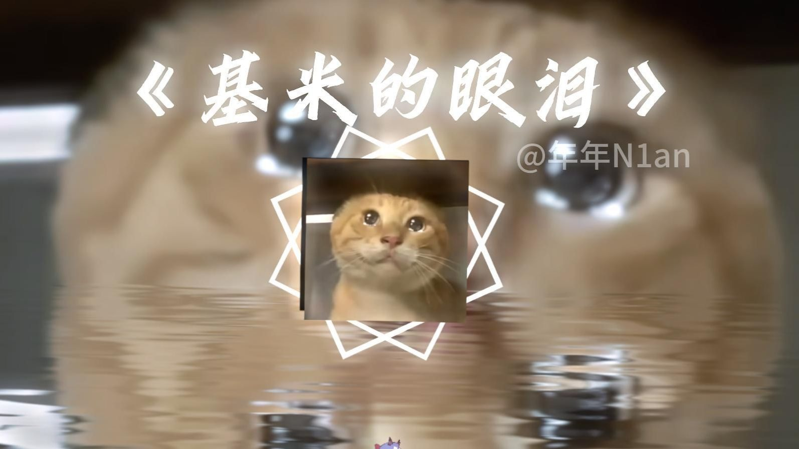 | 2.1万 | 2025-09-13 |
| [樱花妹看哈基山的基米美不美和哈基米鬼畜二创，很难想象人类做出来的视频](https://www.bilibili.com/video/BV1MWpLzaEJ3) |  | 4.2万 | 2025-09-13 |
| [哈基米之天上掉下个哈基米](https://www.bilibili.com/video/BV1CTH6zxE6u) | 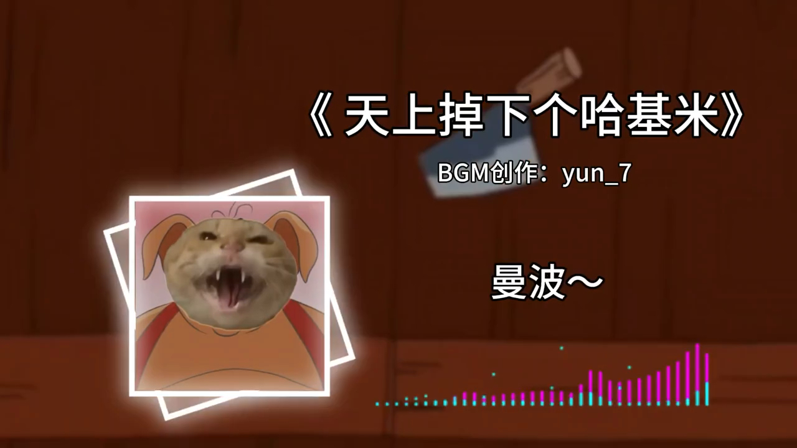 | 3085 | 2025-09-12 |
| [欧马几笠，我做了一个很长的梦](https://www.bilibili.com/video/BV1FnHYzeEa8) |  | 33.7万 | 2025-09-11 |
| [日本天使看《不再曼波完整版》逐渐洗脑](https://www.bilibili.com/video/BV1YjHaz7E4R) |  | 10.0万 | 2025-09-11 |
| [哈雪大冒险官方你是人啊，有曲你是真用啊](https://www.bilibili.com/video/BV1crYPzmEiC) | 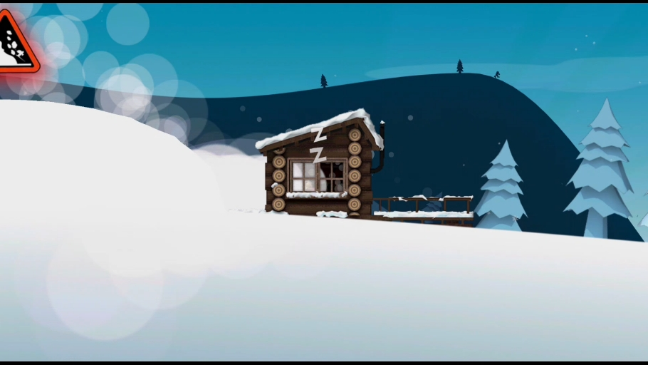 | 162.2万 | 2025-09-09 |
| [哈基米这次立大功了](https://www.bilibili.com/video/BV1UiaizjEUx) |  | 10.2万 | 2025-09-06 |
| [循环歌单｜《不再曼波》 ｜“(哈基米纯享”](https://www.bilibili.com/video/BV15baSzbEsB) | 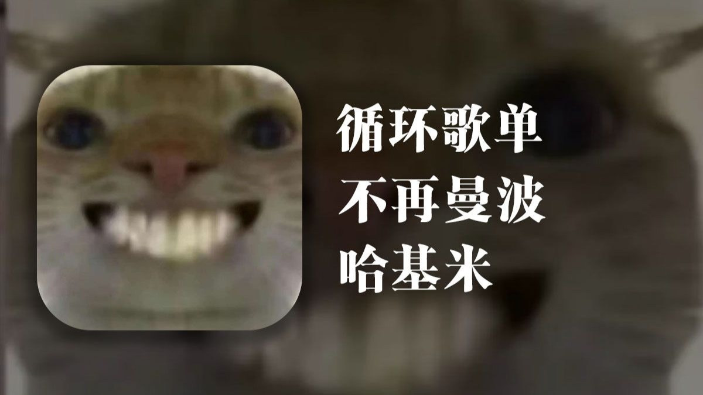 | 13.4万 | 2025-09-05 |
| [又是羡慕哈基米的一天](https://www.bilibili.com/video/BV1zeemzNEv8) | 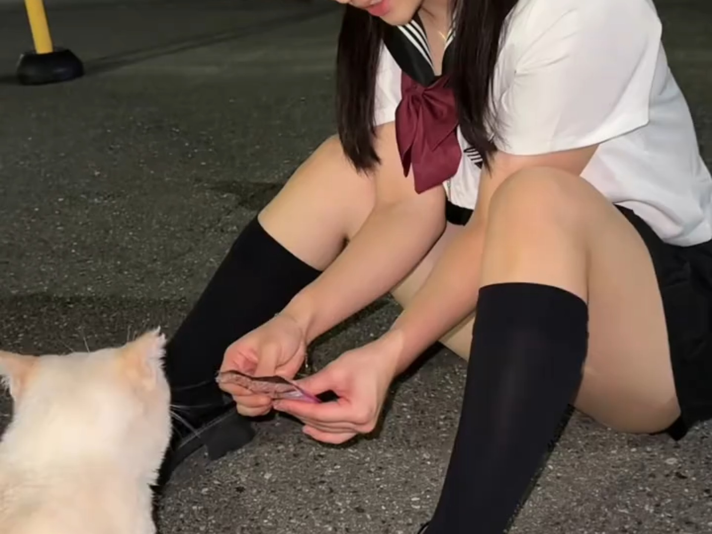 | 2.4万 | 2025-08-27 |
| [混沌哈基【基米电台Day4】](https://www.bilibili.com/video/BV1piegzMESP) |  | 18.1万 | 2025-08-20 |
| [键猫看多了来看看豪猫吧](https://www.bilibili.com/video/BV1iSb3zSE3m) | 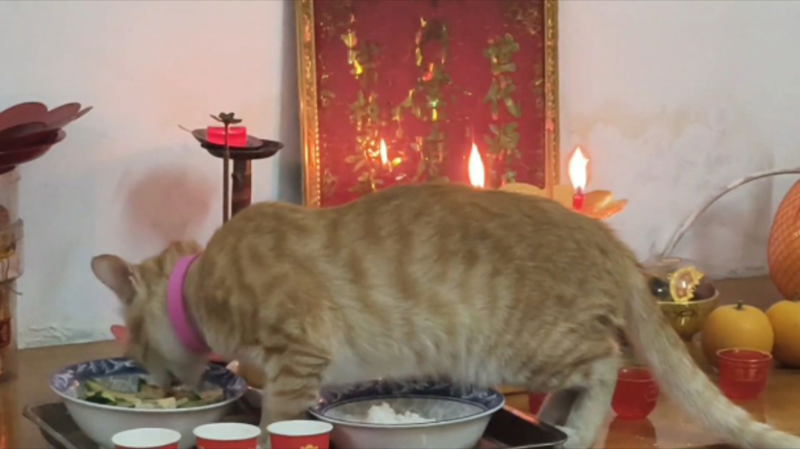 | 96.9万 | 2025-08-11 |
| [哈基米口香糖没了，回不了血了](https://www.bilibili.com/video/BV1xGt7zjEAF) | 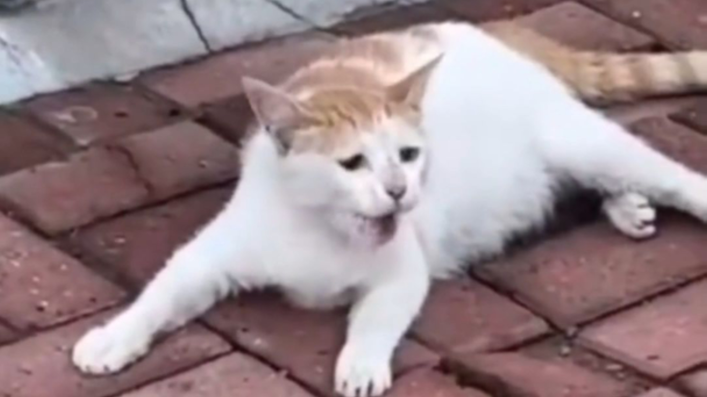 | 26.0万 | 2025-08-05 |
| [我被困在了哈基乡](https://www.bilibili.com/video/BV1ak32z8E4M) |  | 340.7万 | 2025-07-07 |
| [哈基米：I will always love you](https://www.bilibili.com/video/BV1Ww3SzsEpx) |  | 23.8万 | 2025-07-05 |
| [这还诗人吗](https://www.bilibili.com/video/BV18D3tzGEps) |  | 90.6万 | 2025-07-02 |
| [（1补）哈基米那没路躲，上天又处理了一个流浪鼠鼠](https://www.bilibili.com/video/BV1oEK8zVEva) | 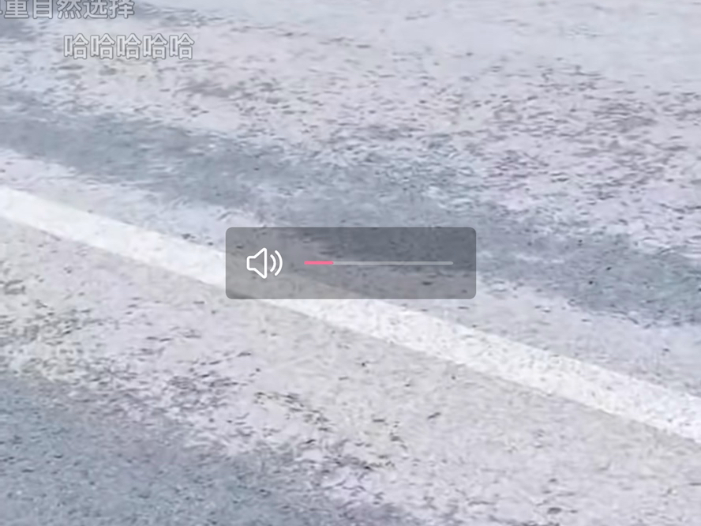 | 58.2万 | 2025-06-23 |
| [猫儿这个单向思维](https://www.bilibili.com/video/BV1GzNXzNEd5) | 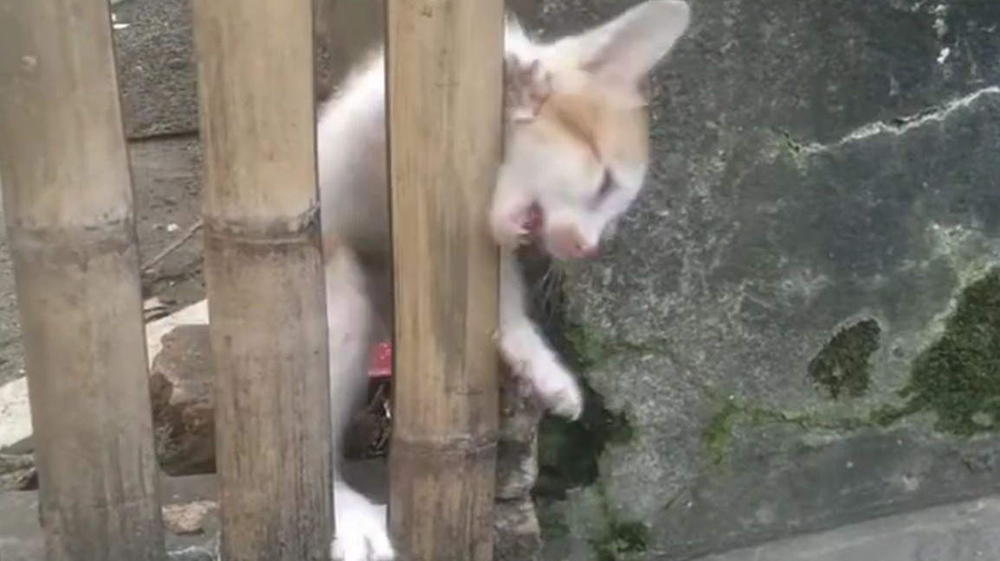 | 14.5万 | 2025-06-22 |
| [哈基谷物语：耄耋镇](https://www.bilibili.com/video/BV1oY7MzCEi1) |  | 78.4万 | 2025-06-01 |
| [哈基米之歌：哈梅戏《谁料基米中状元》｜安徽哈基人申请出战！](https://www.bilibili.com/video/BV16o7PzrE1E) |  | 11.8万 | 2025-05-31 |
| [西部快哈手](https://www.bilibili.com/video/BV1E2jGztEYh) |  | 697.4万 | 2025-05-25 |
| [曼波恩典](https://www.bilibili.com/video/BV1PWJszkEoi) |  | 97.1万 | 2025-05-22 |
| [你可能不认识我，但你可能听过我改编的曼波](https://www.bilibili.com/video/BV1MDVSzzEXn) | 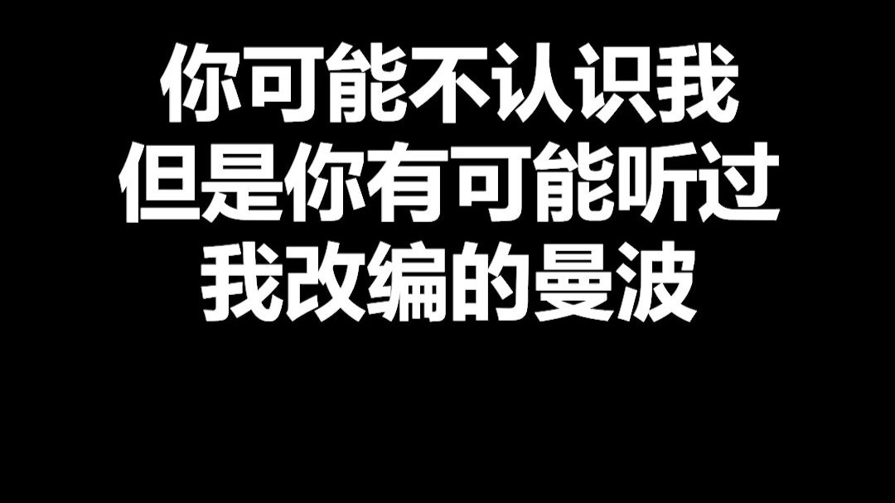 | 610.0万 | 2025-05-09 |
| [哈基米叮咚鸡胖宝宝踩踩背](https://www.bilibili.com/video/BV1aK55z1EJ2) |  | 112.2万 | 2025-05-09 |
| [哈基米合集（补）](https://www.bilibili.com/video/BV1a8Vnz8EPD) | 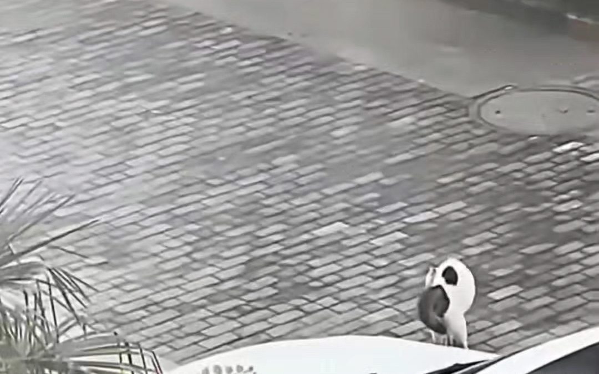 | 23.1万 | 2025-05-03 |
| [哈基米：I Got Smoke](https://www.bilibili.com/video/BV1po5QzTE7P) |  | 84.2万 | 2025-04-22 |
| [【哈基米音乐】把哈基米拼好给你](https://www.bilibili.com/video/BV1T9XeYJEeh) |  | 1.1万 | 2025-03-20 |
| [【哈基米Phonk】HajiMied by Wake up!](https://www.bilibili.com/video/BV1JTXdYcEvT) | 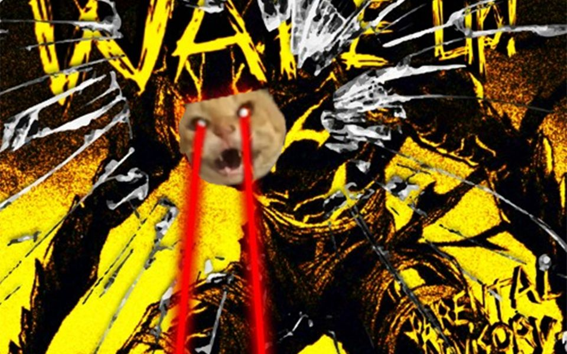 | 61.0万 | 2025-03-02 |
| [【猫meme】⚡史上最全万恶之源⚡](https://www.bilibili.com/video/BV1mxNueyEZ7) | 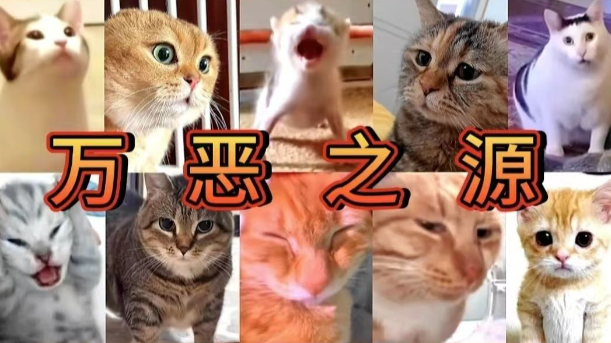 | 263.6万 | 2025-02-08 |
| [【哈基米】武器耄耋](https://www.bilibili.com/video/BV13mNWeoEkC) | 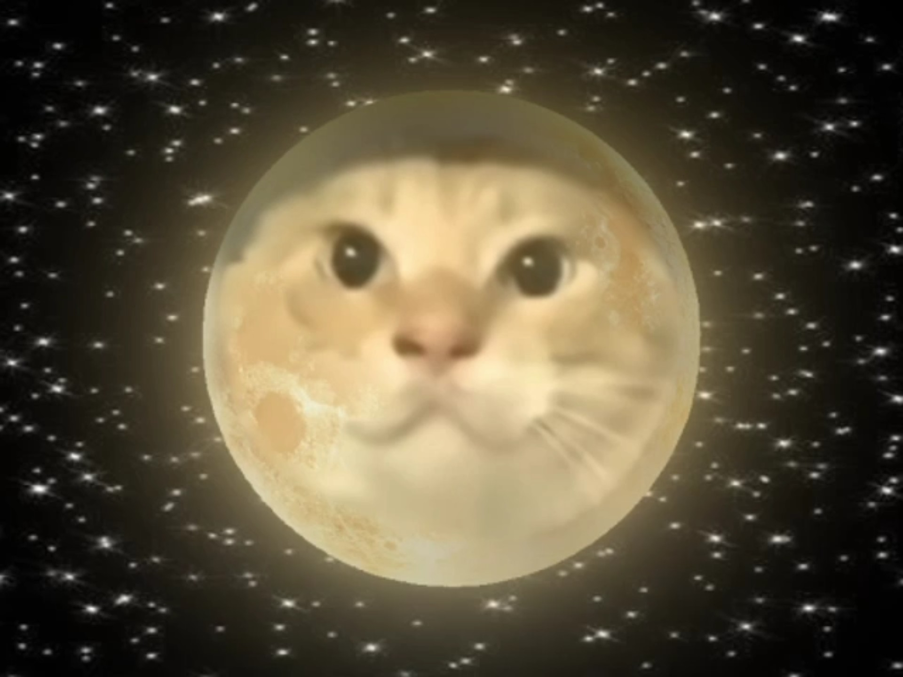 | 148.8万 | 2025-02-06 |
| [[补档]孤独的哈基米](https://www.bilibili.com/video/BV1tWFQeEEi4) | 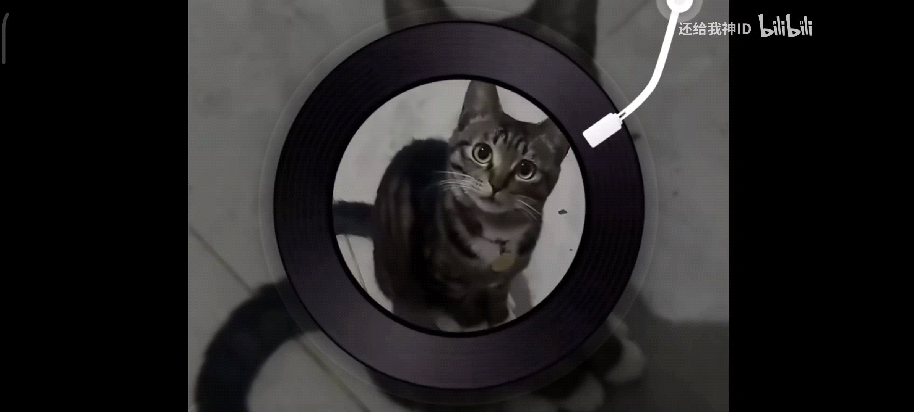 | 23.6万 | 2025-01-31 |
| [【补档】克罗基米狂哈曲（完整版）](https://www.bilibili.com/video/BV1sQFTeHE1e) |  | 29.2万 | 2025-01-29 |
| [⚡ 叮咚鸡：APT. ⚡](https://www.bilibili.com/video/BV1LAwzewEcX) |  | 62.3万 | 2025-01-19 |
| [哈基谷物语（Nature&#x27;s Crescendo）](https://www.bilibili.com/video/BV15ntge7E6a) |  | 55.6万 | 2024-09-14 |
| [⚡你说你不是哈基米？我也不是哈基米！⚡哈基米进军摇滚界《但》空降b站！](https://www.bilibili.com/video/BV1zRs5efEGq) | 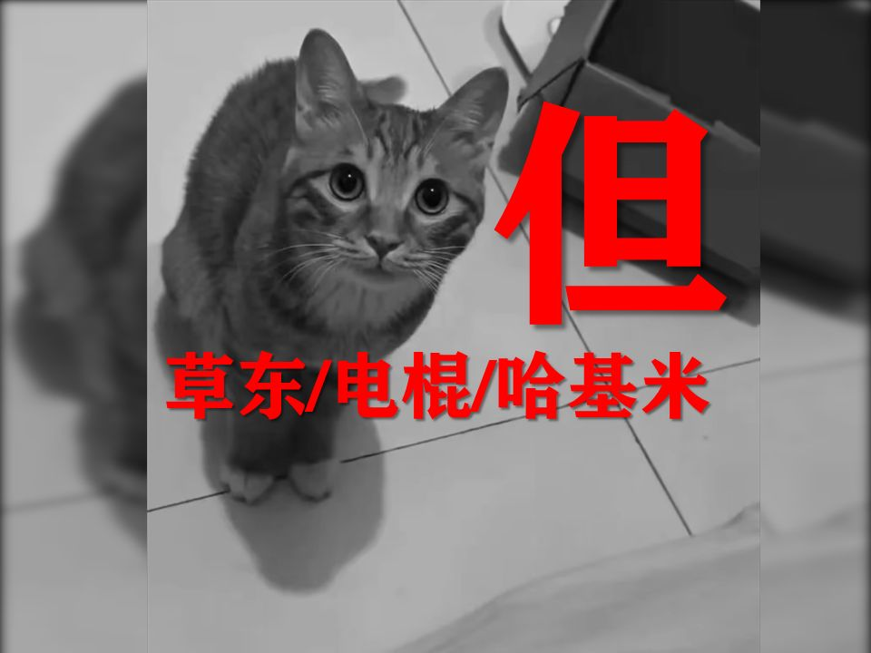 | 134.9万 | 2024-08-26 |
| [梦中的哈基米🎵](https://www.bilibili.com/video/BV18FY4eeERn) | 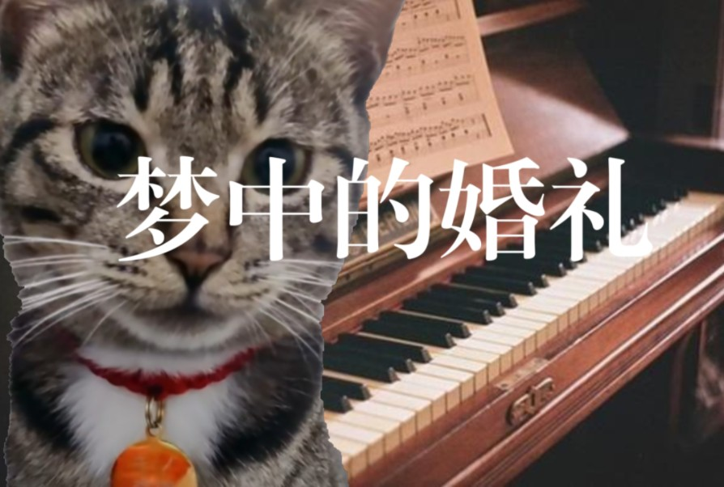 | 122.2万 | 2024-08-08 |
| [十面基米](https://www.bilibili.com/video/BV1iSakeHEbY) |  | 113.7万 | 2024-08-06 |
| [【梗知识】哈基米](https://www.bilibili.com/video/BV1Eu411p7mL) |  | 91.0万 | 2023-08-06 |

---
*最后更新: 2025-09-28 02:38:59 (自动生成)*
*数据来源: [Bilibili](https://www.bilibili.com)*

## 使用说明

运行以下命令更新视频列表:
```bash
python3 fetch_hajimi_videos.py
```
