# awesome-hajimi
collections of hajimi (哈基米 in Chinese) on the Internet.

## 视频列表 (Video List)

| 视频标题 (Title) | 封面 (Cover) | 播放量 (Views) | 发布日期 (Date) |
|---|---|---|---|
| [【哈基米】🐱《潮基》🐱](https://www.bilibili.com/video/BV1RPHDzMEa1) |  | 20 | 2025-09-10 |
| [基米ῳơῳ ᨰׁׅᨵׁׅᨰׁׅ~](https://www.bilibili.com/video/BV1zeHDzmEm8) |  | 393 | 2025-09-10 |
| [【哈基米fm】哈气Rainbow](https://www.bilibili.com/video/BV1tZHDzwExA) |  | 103 | 2025-09-10 |
| [【哈基米音乐】⚡曼波风云：优质基米⚡](https://www.bilibili.com/video/BV1TbH1z2Egy) |  | 846 | 2025-09-10 |
| [【哈基米】我们好像在哪见过—唯美基米情歌](https://www.bilibili.com/video/BV1DKH2znEgf) |  | 430 | 2025-09-10 |
| [哈基米音乐(舍得)](https://www.bilibili.com/video/BV1oiHUzBEuT) |  | 79 | 2025-09-10 |
| [天国基米开场曲](https://www.bilibili.com/video/BV1h4eUzZERs) |  | 825 | 2025-09-10 |
| [盘点点击率最高的哈基米音乐，没人能听完](https://www.bilibili.com/video/BV18QHUztENY) |  | 83 | 2025-09-10 |
| [奎恩听着哈基米音乐聊我的梦想](https://www.bilibili.com/video/BV1uYHmzQEcj) |  | 6173 | 2025-09-10 |
| [哈基米 这个阿三](https://www.bilibili.com/video/BV1R9H1zbEqo) |  | 778 | 2025-09-09 |
| [锐评哈基米六大金曲，全听过的不用去学校了！](https://www.bilibili.com/video/BV1fyYPzyEYq) | 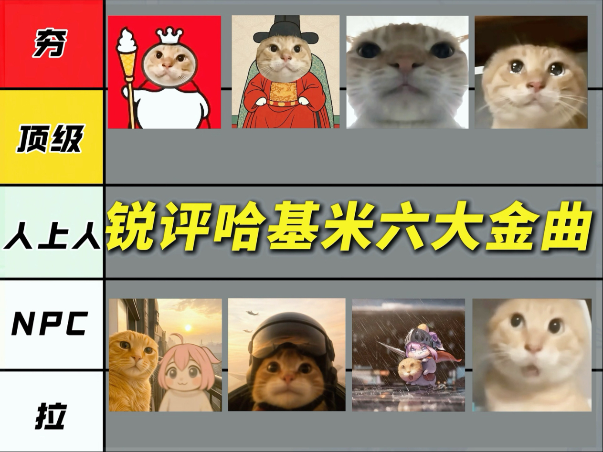 | 3.9万 | 2025-09-09 |
| [【哈基米音乐】青基](https://www.bilibili.com/video/BV1gFHyzmEh7) |  | 1.8万 | 2025-09-09 |
| [【哈基米】哈心超人（开心往前飞）](https://www.bilibili.com/video/BV13oHCzSEr3) |  | 509 | 2025-09-09 |
| [【哈基米音乐】清早起来去拾粪](https://www.bilibili.com/video/BV1vDHCz9E8U) |  | 434 | 2025-09-09 |
| [看《盘点三十首哈基米音乐》并做出评价【桃几OvO】](https://www.bilibili.com/video/BV16WHyzcELy) |  | 499 | 2025-09-09 |
| [从“0”开始的哈基米音乐制作](https://www.bilibili.com/video/BV1vaHyzREx5) |  | 418 | 2025-09-09 |
| [【跳舞的哈基米】秋天 the autumn](https://www.bilibili.com/video/BV16nHyzAEUM) | 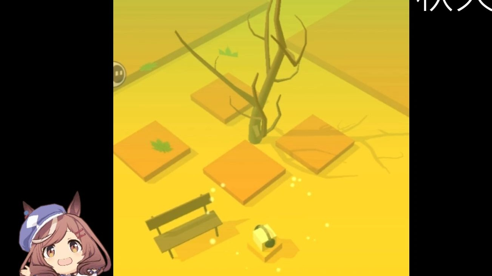 | 143 | 2025-09-09 |
| [【哈基米】寄弥山歌（弥渡山歌）](https://www.bilibili.com/video/BV1qjafzbEQf) |  | 2.1万 | 2025-09-08 |
| [【哈基米音乐】可爱の小曲(你一定没听过也没刷到过的音乐）](https://www.bilibili.com/video/BV125adzAERj) |  | 1.1万 | 2025-09-08 |
| [[补档]哈基米音乐：浪人基琶🐱  带你回到2018的夏天](https://www.bilibili.com/video/BV11YaRzcEp1) |  | 3158 | 2025-09-08 |
| [哈基米 这个找朋友](https://www.bilibili.com/video/BV1Z1YLzkEHW) | 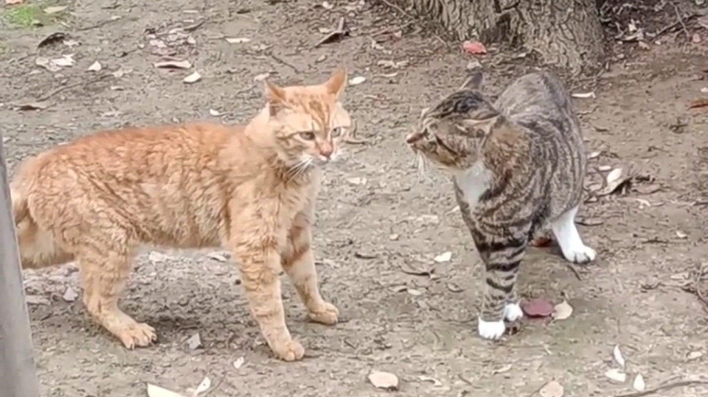 | 3.0万 | 2025-09-08 |
| [【哈基米音乐】⚡️难得哈基米⚡️（纯净版）](https://www.bilibili.com/video/BV1MAY5zWEPS) |  | 16.3万 | 2025-09-07 |
| [哈基米怀旧小卖部](https://www.bilibili.com/video/BV12TY5zSEeg) |  | 49.0万 | 2025-09-07 |
| [《蓝莲哈》出口转内销~中国网友教日本女儿《哈基米》音乐的结果！](https://www.bilibili.com/video/BV1brY5z4Exi) |  | 13.4万 | 2025-09-07 |
| [哈基米之歌版本合集](https://www.bilibili.com/video/BV1PaYVzyE31) | 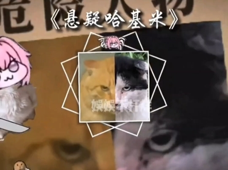 | 209 | 2025-09-07 |
| [哈基米 Ma direction](https://www.bilibili.com/video/BV14vYMzTE7Y) |  | 1690 | 2025-09-06 |
| [【枪声音乐】我用和平精英揍出了一首哈基米!](https://www.bilibili.com/video/BV1MuYTzKEEu) |  | 677 | 2025-09-06 |
| [哈基米：shiver(中元节特基）](https://www.bilibili.com/video/BV1chaqzzEqf) | 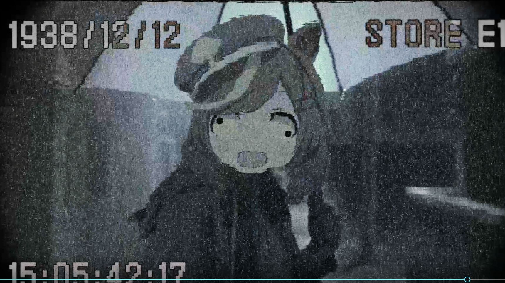 | 2024 | 2025-09-06 |
| [哈基米这个甜蜜【纯净哈基米】](https://www.bilibili.com/video/BV1cHaYzFEya) |  | 9.1万 | 2025-09-06 |
| [不能哈的基米（不能说的秘密）](https://www.bilibili.com/video/BV1TuaYzMEy2) |  | 511 | 2025-09-06 |
| [【哈基phonk】阿西噶的曼波哈基米（阿里山的姑娘）](https://www.bilibili.com/video/BV1Vqahz3Ec4) |  | 21.8万 | 2025-09-05 |
| [【循环歌曲】《2:23 AM》“哈基米的夜晚”（无损音质）](https://www.bilibili.com/video/BV1ktaUzgEhQ) | 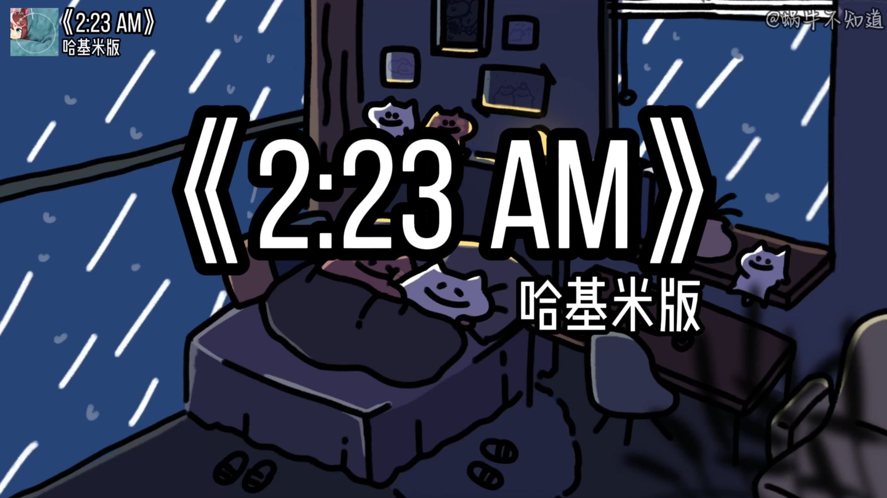 | 18.7万 | 2025-09-05 |
| [【哈基米音乐】FLY-ANU](https://www.bilibili.com/video/BV1bna8zAEik) |  | 915 | 2025-09-05 |
| [《哈基米音乐》Ferrari：“在快车道上哈着气，是有那么些孤独”](https://www.bilibili.com/video/BV1Y1aUzZEQD) |  | 1851 | 2025-09-05 |
| [【哈基米音乐官方专辑 第三弹】你一定听过我们做的哈基米，但你可能还没有点关注](https://www.bilibili.com/video/BV1Yaa6zvE22) | 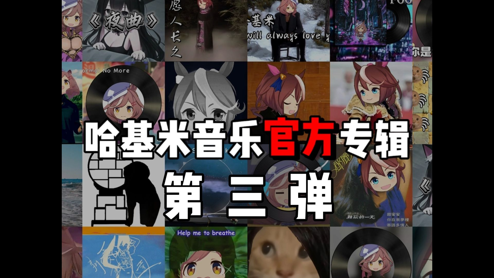 | 7017 | 2025-09-04 |
| [盘点爆火的6首哈基米音乐！虽然只有几句词，全民制作人却没有瓶颈期！](https://www.bilibili.com/video/BV1GNaAzbE95) |  | 61.4万 | 2025-09-02 |
| [【8月】哈基米音乐排行榜#11](https://www.bilibili.com/video/BV1gDaWzEEtL) |  | 27.2万 | 2025-09-02 |
| [【哈基米音乐】基米说（伯虎说停顿卡点&amp;完整版）](https://www.bilibili.com/video/BV1sdaHzTEe7) |  | 132.8万 | 2025-09-01 |
| [【哈基米】老人与海](https://www.bilibili.com/video/BV1mzhXzsEvx) | 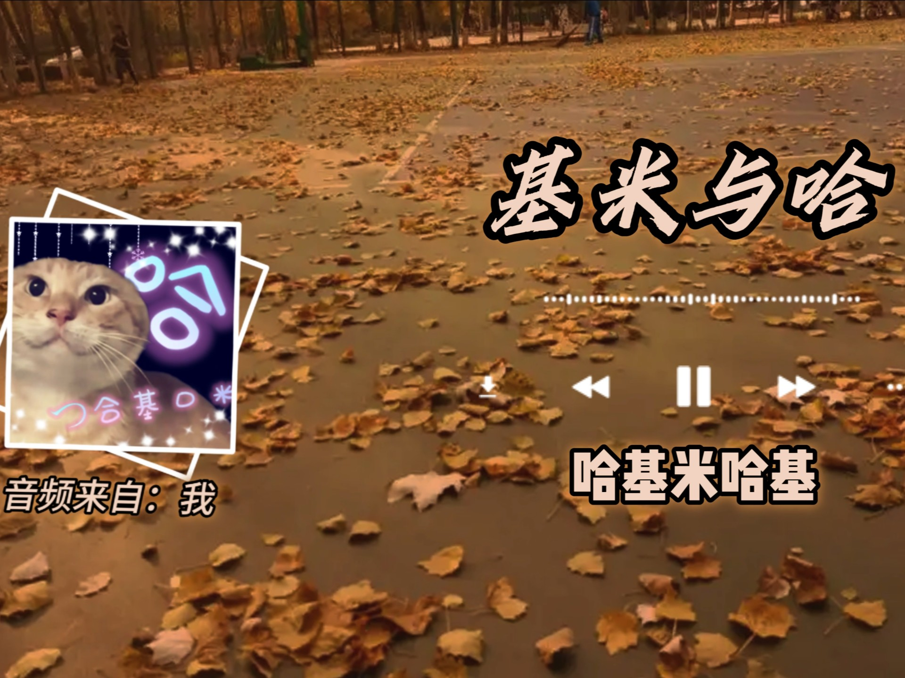 | 9.2万 | 2025-08-29 |
| [哈基米：雨爱（完整版）](https://www.bilibili.com/video/BV1r6h2z8Ebg) |  | 6.0万 | 2025-08-29 |
| [哈基米能不能追上小球？](https://www.bilibili.com/video/BV12he9zhELx) |  | 55.8万 | 2025-08-28 |
| [【Hi-Res无损】DJ音乐《哈基米音乐(合集)》“我家猫天天吵着让我放歌给它听”](https://www.bilibili.com/video/BV1QovAzeE7Y) |  | 6.2万 | 2025-08-26 |
| [《睡觉の小曲》BGM:《おはなばたけ (哈基米版)》面点海](https://www.bilibili.com/video/BV1fUevzKEXZ) |  | 10.0万 | 2025-08-23 |
| [哈基米音乐《蓝莲哈》](https://www.bilibili.com/video/BV142e8zAEXm) | 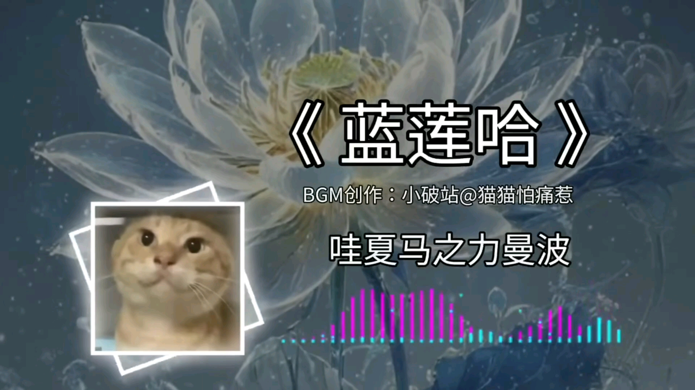 | 6211 | 2025-08-23 |
| [哈基米音乐《Nobody》](https://www.bilibili.com/video/BV1wRe8zoEVa) | 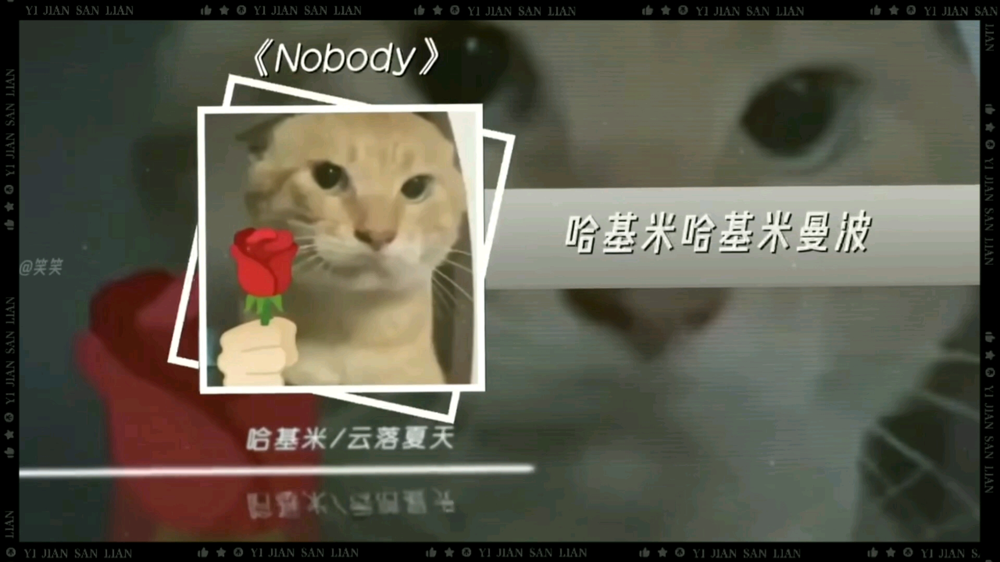 | 4117 | 2025-08-23 |
| [【文化】凭什么哈基米就能那么火？哈基米音乐为何疯狂的传播？哈基米传播背后的语言真相是什么？一条视频带你了解属于哈基米的狂欢。](https://www.bilibili.com/video/BV1TretzZEro) |  | 6.0万 | 2025-08-22 |
| [哈基米音乐︱一次性听个爽](https://www.bilibili.com/video/BV1t1YZzCE5S) |  | 5.7万 | 2025-08-22 |
| [【哈基米】哈得太逼真](https://www.bilibili.com/video/BV1ZRYQzGEzQ) | 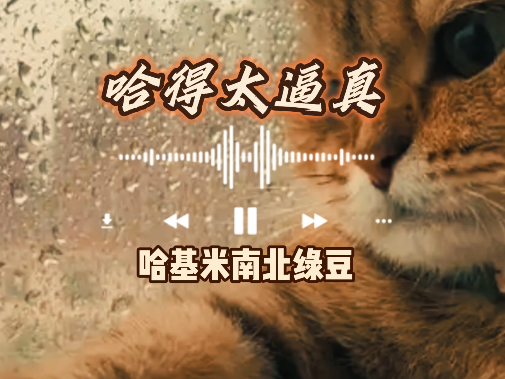 | 83.8万 | 2025-08-21 |
| [【哈基米音乐官方专辑 第二弹】你一定听过我们做的哈基米，但你可能还没有点关注](https://www.bilibili.com/video/BV1B3eGzAEzh) |  | 22.6万 | 2025-08-21 |
| [【哈基米音乐】基米说（伯虎说）](https://www.bilibili.com/video/BV1c2YbznE5B) |  | 99.1万 | 2025-08-18 |
| [哈基米 这个侏罗纪](https://www.bilibili.com/video/BV1iHYyzQEx1) |  | 1.8万 | 2025-08-17 |
| [哈基米 这个母爱](https://www.bilibili.com/video/BV119YzzsEEa) |  | 50.4万 | 2025-08-17 |
| [【哈基米funk】Montagem Nada Tropica（原曲不使用）](https://www.bilibili.com/video/BV1WhYizCEdR) |  | 56.1万 | 2025-08-17 |
| [古典哈基米：月光奏鸣曲第三乐章（完整版）](https://www.bilibili.com/video/BV1c5YvziEae) |  | 36.3万 | 2025-08-16 |
| [【哈气半小时】‵‵那些火爆全网の神人哈基米音乐′′](https://www.bilibili.com/video/BV1aCbqzSECP) |  | 7053 | 2025-08-14 |
| [循环歌单｜《最后一哈》｜“哈基米，哈基米”](https://www.bilibili.com/video/BV1NCbbzmEPw) |  | 12.8万 | 2025-08-13 |
| [【哈基米音乐官方专辑】你一定听过我们做的哈基米，但你可能还没有点关注](https://www.bilibili.com/video/BV1sNbKzLEWR) |  | 440.5万 | 2025-08-11 |
| [【哈基米1小时|第二弹】盘点火遍全网の神人哈基米音乐](https://www.bilibili.com/video/BV11YbVzuEvg) |  | 22.3万 | 2025-08-11 |
| [盘点三十首哈基米音乐](https://www.bilibili.com/video/BV1kUbMzXEoA) | 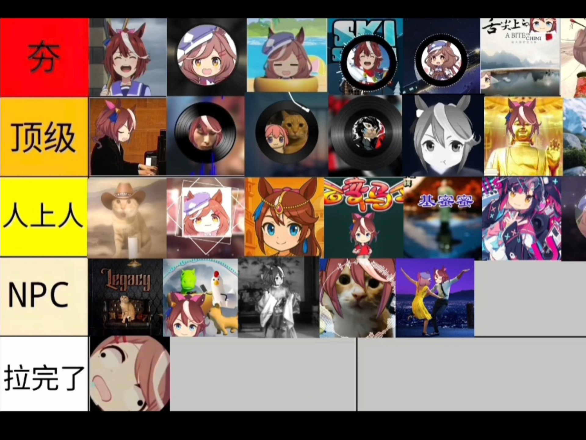 | 88.0万 | 2025-08-11 |
| [【哈基米】孤勇哈](https://www.bilibili.com/video/BV1oJtezyEjY) |  | 4384 | 2025-08-10 |
| [“盘点20首哈基米音乐”](https://www.bilibili.com/video/BV1hctbzpEZ7) | 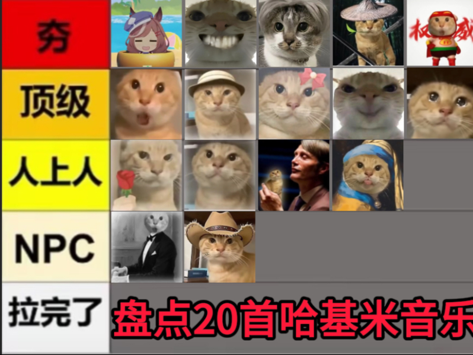 | 86.1万 | 2025-08-09 |
| [【FM83.0 无止境基米电台】Day6 流行哈基米](https://www.bilibili.com/video/BV1Rqt6z4EWR) |  | 12.8万 | 2025-08-08 |
| [哈基米：七里香](https://www.bilibili.com/video/BV1Y7tNzWEGs) |  | 4.8万 | 2025-08-07 |
| [【奇奇怪怪的歌】 《旋转猫》《鼠鼠日常》《老鼠舞》《Huh Cat》《哈基米召唤曲》《灵感菇》《跑刀神曲》《埃及摇》《曼波》](https://www.bilibili.com/video/BV1Wd4RzmEoD) |  | 21.8万 | 2025-08-06 |
| [《哈基米起床曲》🐱](https://www.bilibili.com/video/BV1LVtjzdEMa) | 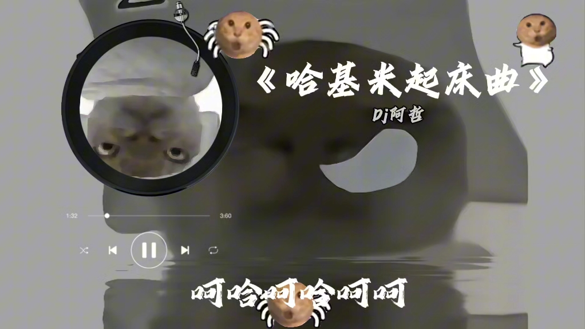 | 9.9万 | 2025-08-05 |
| [【FM83.0 无止境基米电台】Day1 古典哈基米](https://www.bilibili.com/video/BV1JuhNz6Eg6) |  | 37.7万 | 2025-08-03 |
| [近期杀疯的哈基米之歌](https://www.bilibili.com/video/BV1UuhPzDE7F) |  | 8.2万 | 2025-08-03 |
| [《蓝莲哈》哈基米来洗涤你浮躁的心](https://www.bilibili.com/video/BV18M83zrECY) |  | 270.0万 | 2025-07-27 |
| [准备好你的床缝，3.75小时、101首哈基米音乐精选串烧来袭！](https://www.bilibili.com/video/BV1jKbXzwExg) |  | 7.1万 | 2025-07-25 |
| [【哈基米4小时编年史】盘点火遍全网の神人哈基米音乐，时长14284秒却承载了我们太多的哈基米南北绿豆](https://www.bilibili.com/video/BV1fvbDzYEMd) |  | 19.3万 | 2025-07-25 |
| [哈基米十大名曲&amp;不要哈气挑战](https://www.bilibili.com/video/BV1QNgHzRE1m) |  | 27.3万 | 2025-07-22 |
| [【哈气1小时】“那些火遍全网的神人哈基米音乐”](https://www.bilibili.com/video/BV1peg5zXEvL) |  | 108.2万 | 2025-07-22 |
| [”高山流水“哈基米](https://www.bilibili.com/video/BV1gHgTzmEYv) |  | 85.7万 | 2025-07-17 |
| [盘点那些火爆全网的【哈基米】神人音乐，节奏一响，治愈感拉满！](https://www.bilibili.com/video/BV1mPGEz1E8d) | 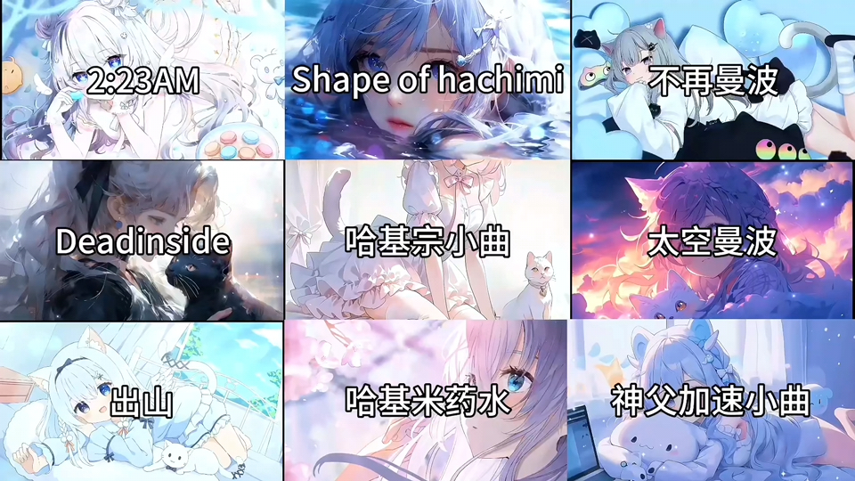 | 1.4万 | 2025-07-08 |
| [古典哈基米：西班牙斗耄士进行曲](https://www.bilibili.com/video/BV1Tk3Jz1ETa) |  | 272.2万 | 2025-07-04 |
| [古典哈基米音乐《四基 · 冬 第一乐章 》完整版](https://www.bilibili.com/video/BV1b738zkELi) |  | 101.8万 | 2025-07-03 |
| [哈基米音乐：🎵哈气之路🎵（完整版）](https://www.bilibili.com/video/BV1Go3FzeENg) |  | 29.1万 | 2025-06-29 |
| [【哈基米1小时纯享】盘点火遍全网の神人哈基米音乐](https://www.bilibili.com/video/BV1WjKfzMEwE) |  | 261.6万 | 2025-06-27 |
| [【哈基米】Conundrum  它哈气了，昨天哈的，但奇怪的是，它前天就死了](https://www.bilibili.com/video/BV1MdKMzzEFH) |  | 111.3万 | 2025-06-24 |
| [【哈基米音乐】印度基米完整版](https://www.bilibili.com/video/BV1HkKNzDEPJ) |  | 120.6万 | 2025-06-21 |
| [&quot;盘点火遍全网の神人哈基米音乐&quot;](https://www.bilibili.com/video/BV1VaNjzPExR) |  | 20.2万 | 2025-06-19 |
| [《哈基米(关山酒)》真正想哈的人脸上是没有笑容的！](https://www.bilibili.com/video/BV1vXNbzMEE8) |  | 31.5万 | 2025-06-16 |
| [一小时单曲循环～《出山》/ 哈基米版 の【纯享版】](https://www.bilibili.com/video/BV19GMizbE6B) |  | 101.6万 | 2025-06-16 |
| [《舌尖上的哈基米》完整版-面点海 呵呵哈嘿嘿（私人音乐）这才是音乐！！！](https://www.bilibili.com/video/BV1hDMuzUEYH) | 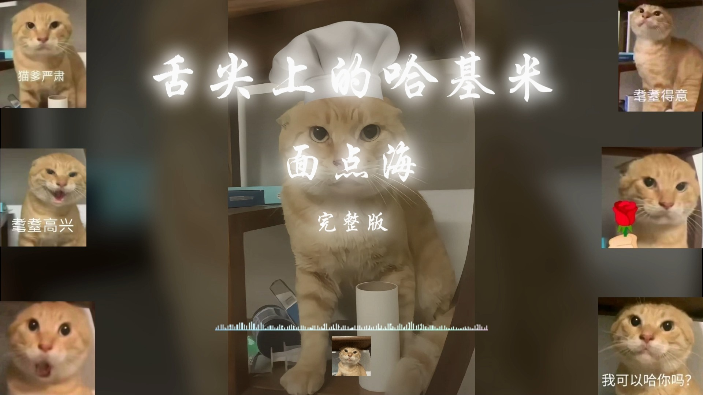 | 4.7万 | 2025-06-13 |
| [古典哈基米：威廉退尔序曲](https://www.bilibili.com/video/BV1ngToztEMC) |  | 104.9万 | 2025-06-09 |
| [【哈基米音乐】幸运哈](https://www.bilibili.com/video/BV1TzTszEE55) |  | 38.6万 | 2025-06-05 |
| [古典哈基米：野哈飞舞](https://www.bilibili.com/video/BV1LJ7ezJE59) |  | 514.5万 | 2025-06-03 |
| [“写出这种歌的家里请高人也没用了”‖《出山（哈基米）》一小时纯享版](https://www.bilibili.com/video/BV1sw7pzwERN) |  | 14.7万 | 2025-05-30 |
| [⚡MAGENTA POTION 哈基米药水⚡ 完整版](https://www.bilibili.com/video/BV1e5jGzJEKC) |  | 127.8万 | 2025-05-25 |
| [【哈基米FM】大哈咒](https://www.bilibili.com/video/BV1o8JazDEE2) |  | 320.2万 | 2025-05-20 |
| [哈基米音乐鉴赏：跳楼基米](https://www.bilibili.com/video/BV1SDJ3z2E3V) | 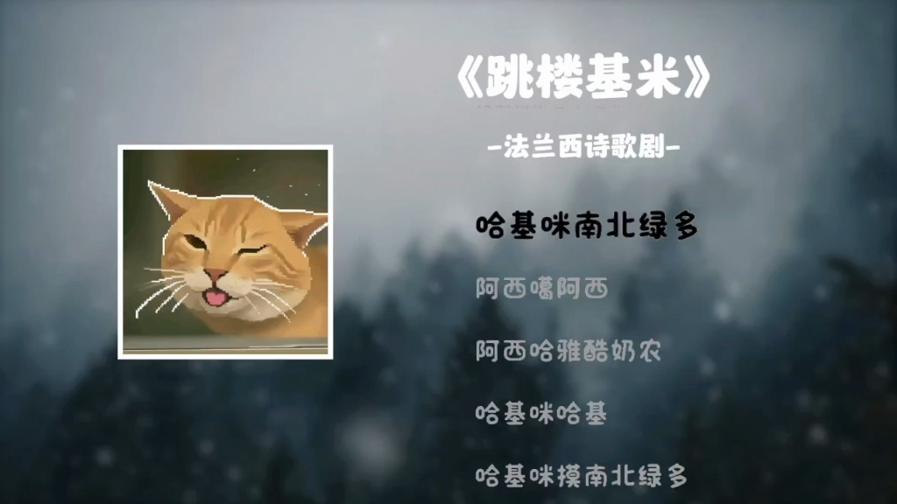 | 8.6万 | 2025-05-18 |
| [【循环音乐】《出山（耄耋）》-哈基米“我是孙笑耄这里没有敌人”](https://www.bilibili.com/video/BV1ZfJAzMEq9) |  | 10.0万 | 2025-05-17 |
| [基米music：《进步的小曲》鸳鸯戏](https://www.bilibili.com/video/BV1azKAevETT) | 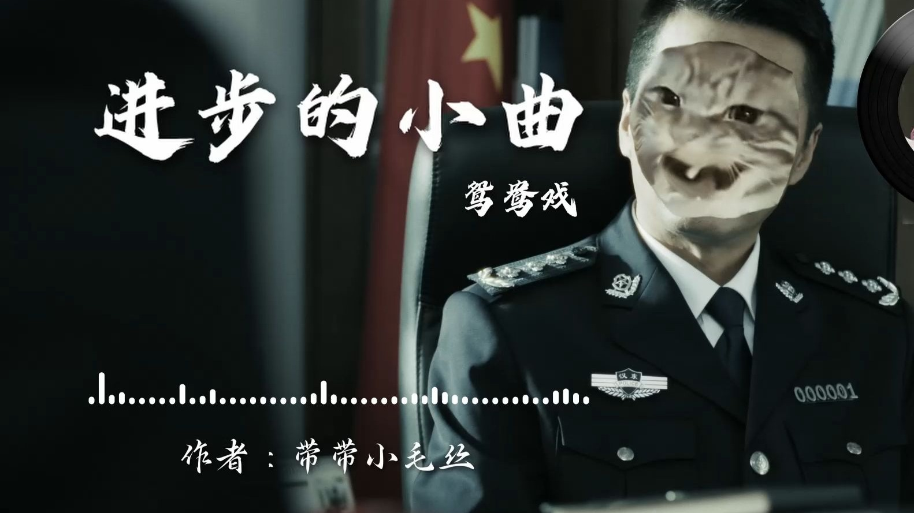 | 16.4万 | 2025-02-14 |
| [【哈基米FM】山歌好比哈基米](https://www.bilibili.com/video/BV1VVwnekE3c) |  | 65.1万 | 2025-01-17 |
| [【哈基米FM】牵私人戏](https://www.bilibili.com/video/BV1mvcEeRE5s) |  | 237.5万 | 2025-01-10 |
| [🎵太空曼波 𝑺𝒑𝒂𝒄𝒆 𝑾𝒂𝒍𝒌🎵哈基米纯音乐](https://www.bilibili.com/video/BV1rdBZYNEu3) | 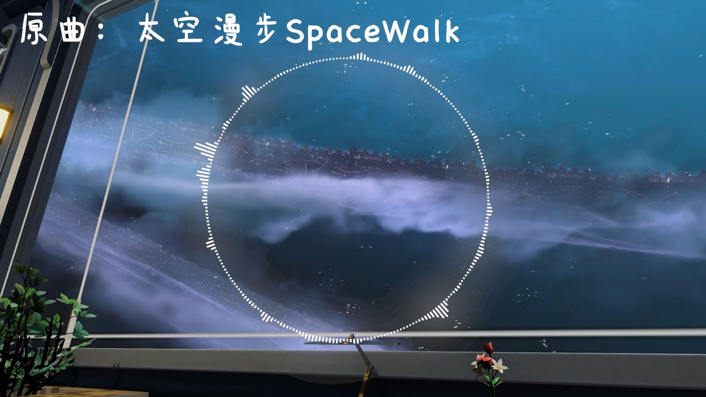 | 463.0万 | 2024-11-28 |
| [哈基米之歌的来源](https://www.bilibili.com/video/BV1DE4m1R7PM) |  | 55.8万 | 2024-07-29 |
| [35秒哈基米独享 想听直说](https://www.bilibili.com/video/BV1sFaqenEiU) |  | 12.1万 | 2024-07-10 |
| [火爆全网的哈基米原曲，你听过吗？一首曾经陪伴我们度过2018的夏天的纯音乐](https://www.bilibili.com/video/BV1yN411m7uw) |  | 1.3万 | 2023-07-09 |
| [一 起 唱 哈 基 米 吧！](https://www.bilibili.com/video/BV1S14y1d78t) |  | 30.3万 | 2023-07-02 |

---
*最后更新: 2025-09-10 16:09:52 (自动生成)*
*数据来源: [Bilibili](https://www.bilibili.com)*

## 使用说明

### 手动更新
运行以下命令更新视频列表:
```bash
# 安装依赖
pip install -r requirements.txt

# 运行脚本
python3 fetch_hajimi_videos.py
```

### 自动更新
本项目配置了GitHub Actions自动化工作流：
- ⏰ **每天凌晨2点UTC**（北京时间上午10点）自动运行
- 🔄 **自动获取**最新的100个热门哈基米视频
- 📸 **自动下载**新的视频封面
- 📊 **自动更新**播放量和排名
- 🚀 **自动提交**更改到仓库

您也可以在GitHub仓库的Actions页面手动触发更新。
