# awesome-hajimi
collections of hajimi (哈基米 in Chinese) on the Internet.

## 视频列表 (Video List)

| 视频标题 (Title) | 封面 | 播放量 (Views) | 发布日期 (Date) |
|---|---|---|---|
| [哈基米也长大啦](https://www.bilibili.com/video/BV1w41GBpERi) |  | 1 | 2025-11-01 |
| [【哈基米】旱地哈气进行曲](https://www.bilibili.com/video/BV1Us1TBEE91) | 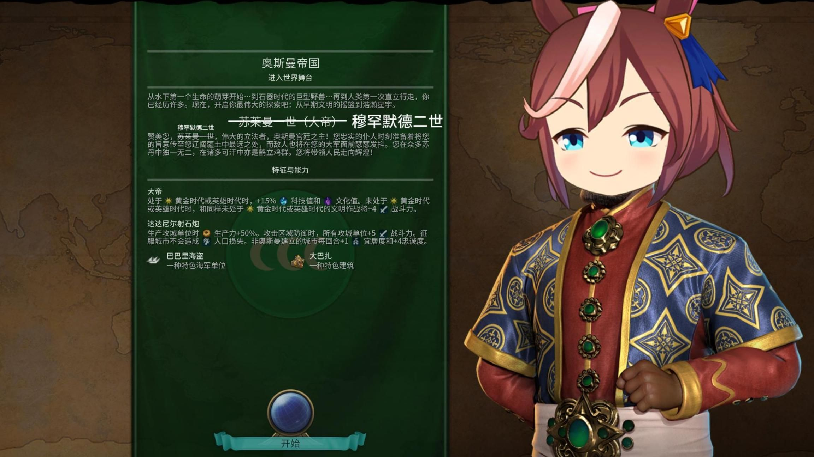 | 166 | 2025-11-01 |
| [[AI安东] 哈基米南北绿豆～](https://www.bilibili.com/video/BV1QU1GBTEx7) |  | 51 | 2025-11-01 |
| [【哈基米音乐】《育苗の小曲》Умри, если меня не любишь](https://www.bilibili.com/video/BV1UR1GBAEZc) |  | 4527 | 2025-11-01 |
| [（哈基米音乐）白曼波与朱基米](https://www.bilibili.com/video/BV1Rk1gBYEiF) |  | 478 | 2025-10-31 |
| [哈基米（毛利战舞版本）](https://www.bilibili.com/video/BV16M13B1EQ1) |  | 113 | 2025-10-31 |
| [【梗知识】哈基米广告](https://www.bilibili.com/video/BV1AT13B7EJp) |  | 817 | 2025-10-31 |
| [世界上最燃的哈基米🔥🔥🔥](https://www.bilibili.com/video/BV1uj1GBFEhe) |  | 16 | 2025-10-31 |
| [【哈基米】⚡忐忑⚡](https://www.bilibili.com/video/BV1VP1gB8EeA) |  | 565 | 2025-10-31 |
| [【哈基米音乐】🐱被基托的思恋🐱](https://www.bilibili.com/video/BV1x5skzgEkZ) | 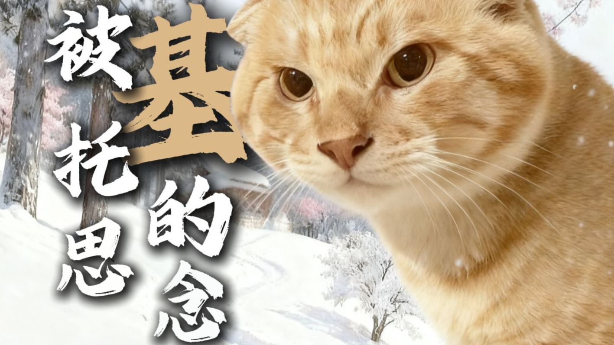 | 546 | 2025-10-31 |
| [可爱的霸王龙哈基米](https://www.bilibili.com/video/BV1LZ1uBvEmN) |  | 201 | 2025-10-31 |
| [【哈基米】Unravel 东京曼波主题曲](https://www.bilibili.com/video/BV1Za1gBgED8) |  | 41 | 2025-10-31 |
| [8D环绕《哈基米睡觉(花田)》【“睡觉，睡觉，睡觉。。。”】](https://www.bilibili.com/video/BV1BY1gB6EA7) | 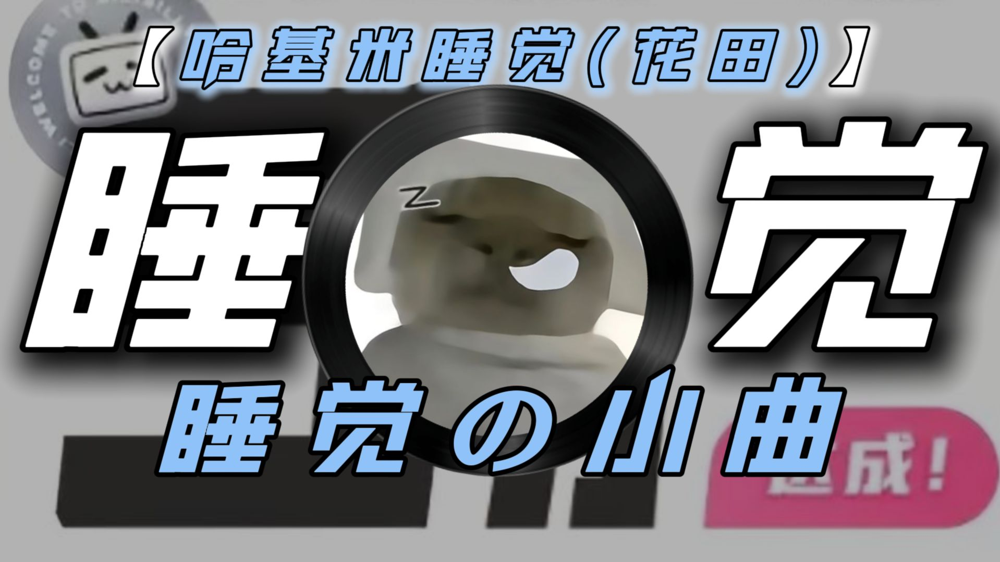 | 99 | 2025-10-31 |
| [基米小学：小猫花花的万圣节奇遇！](https://www.bilibili.com/video/BV1Hr1TBqEfP) | 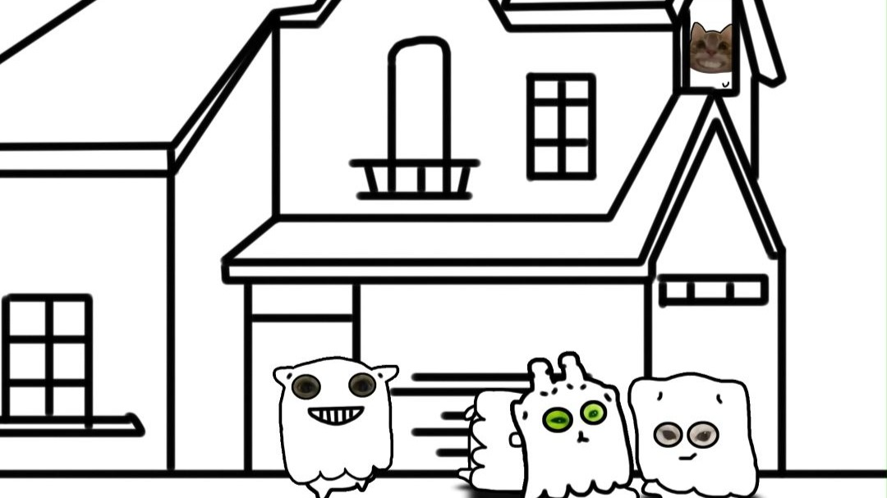 | 5.8万 | 2025-10-31 |
| [（修正版）哈基米养老](https://www.bilibili.com/video/BV1Jy1TBvEwe) | 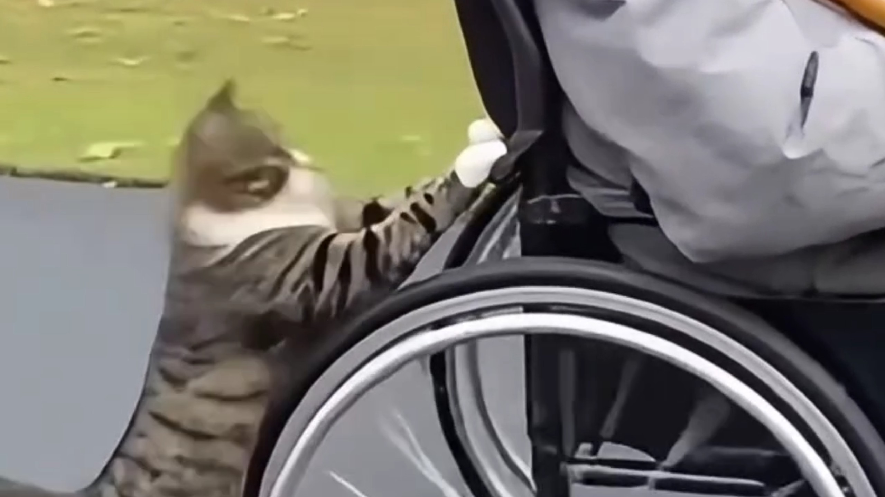 | 407 | 2025-10-31 |
| [【纯净哈基米】基米说](https://www.bilibili.com/video/BV1EW1KBcEBF) |  | 1292 | 2025-10-31 |
| [【哈基米音乐】基米，只是还不基米（基的魔法）](https://www.bilibili.com/video/BV1Su1MBEEGt) | 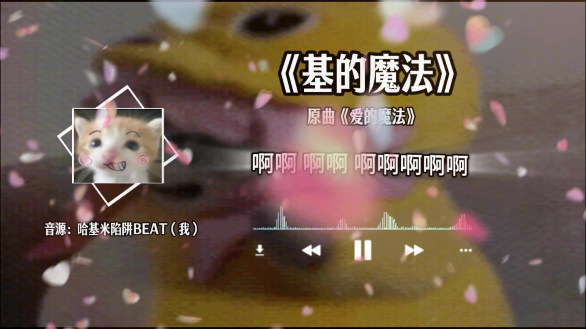 | 166 | 2025-10-31 |
| [有基米开我裤带！](https://www.bilibili.com/video/BV1fb1MBeE3s) | 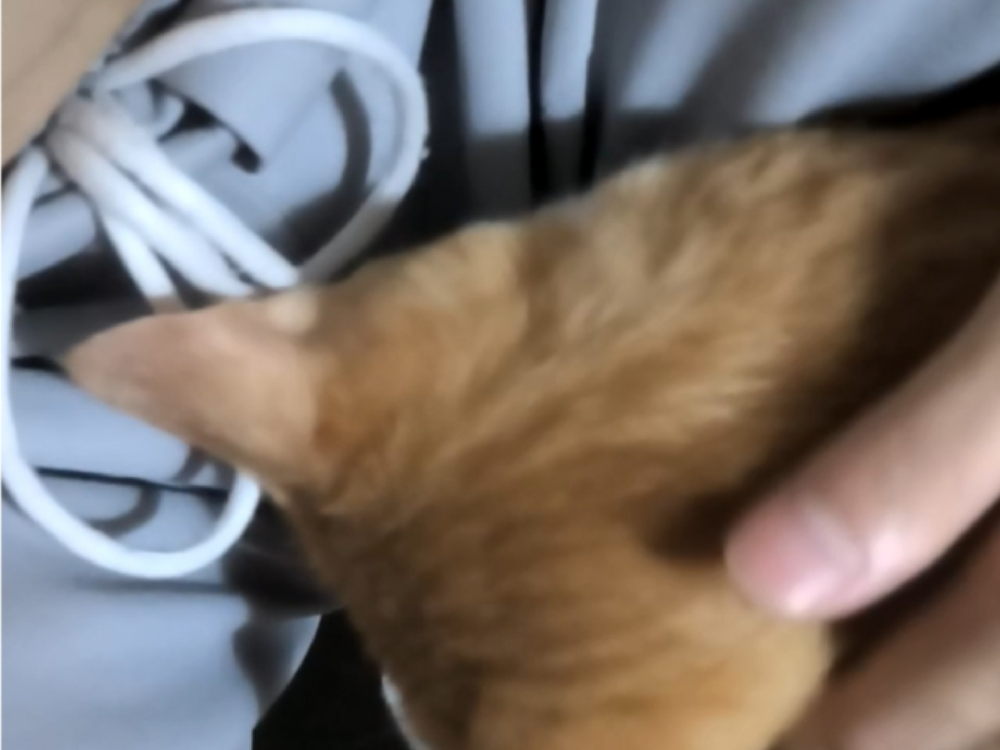 | 241 | 2025-10-31 |
| [【哈基米的小曲】《蓝莲哈》-哈基米  哈基米莫南北绿豆~~~](https://www.bilibili.com/video/BV1pE1MBGE25) | 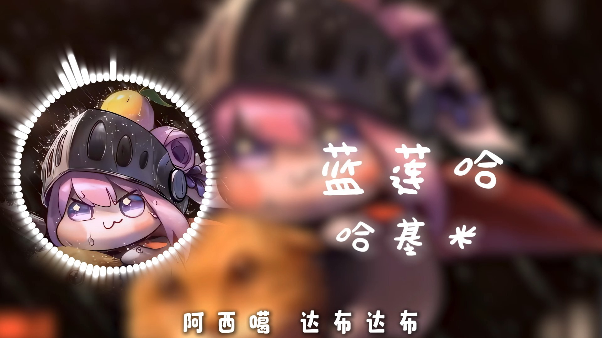 | 299 | 2025-10-31 |
| [满级大清 一统哈基米](https://www.bilibili.com/video/BV1PJ1MBrEgx) |  | 1942 | 2025-10-31 |
| [【哈基米高考】我测试你的猫！](https://www.bilibili.com/video/BV1Co1MBLEUf) |  | 1117 | 2025-10-31 |
| [🐱Some基米 just like this🐱](https://www.bilibili.com/video/BV19q1KBnEAn) |  | 28.2万 | 2025-10-31 |
| [答应我 听完补药哈气好不好](https://www.bilibili.com/video/BV1Xr1MBxEZg) |  | 1840 | 2025-10-31 |
| [傻福塔菲代言哈基米南北绿豆](https://www.bilibili.com/video/BV1UU1MBDE4h) |  | 552 | 2025-10-31 |
| [🐱苦 命 基 米](https://www.bilibili.com/video/BV1cE1KBeEU2) |  | 3.3万 | 2025-10-31 |
| [哈基米米哈基米，哈基嘎阿西](https://www.bilibili.com/video/BV18E1NByEtc) |  | 162 | 2025-10-31 |
| [纯净哈基米之回家の小曲](https://www.bilibili.com/video/BV1S11MBXE9y) |  | 854 | 2025-10-31 |
| [葱头是个哈基米](https://www.bilibili.com/video/BV1gw1KBLEKG) | 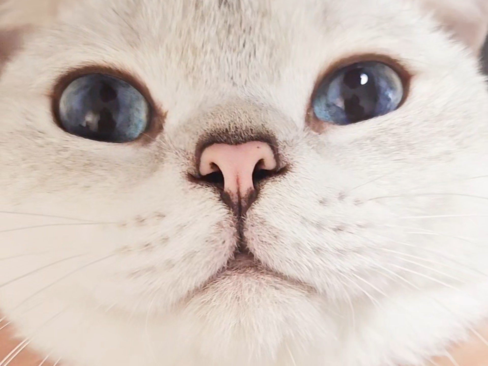 | 242 | 2025-10-31 |
| [【哈基米音乐】神人蔬菜汁（PoPiPo）](https://www.bilibili.com/video/BV1eLyvBNEqx) |  | 673 | 2025-10-31 |
| [假如课堂上教的都是哈基米](https://www.bilibili.com/video/BV1g61KBJELC) |  | 1.5万 | 2025-10-31 |
| [【哈基米音乐】🐱在月亮下哈气（Под луной）🐱](https://www.bilibili.com/video/BV16F1TBvErt) |  | 1871 | 2025-10-31 |
| [哈基米广告是什么梗？【梗学堂】](https://www.bilibili.com/video/BV1eD1NBXEdA) |  | 2289 | 2025-10-31 |
| [@捉鱼好难，哈基米音乐《爱情的骗子我哈你》。](https://www.bilibili.com/video/BV1UC1KBjEY3) | 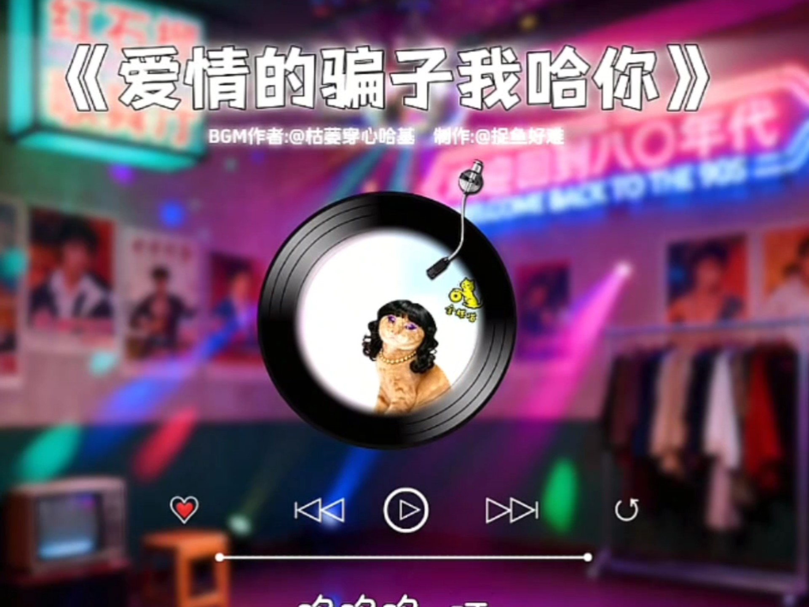 | 509 | 2025-10-31 |
| [没有主人的时候，兔子和猫](https://www.bilibili.com/video/BV1Fn1PBsE7B) |  | 2.3万 | 2025-10-31 |
| [爱你的猫和不爱你的猫](https://www.bilibili.com/video/BV1xU1PBKEZr) | 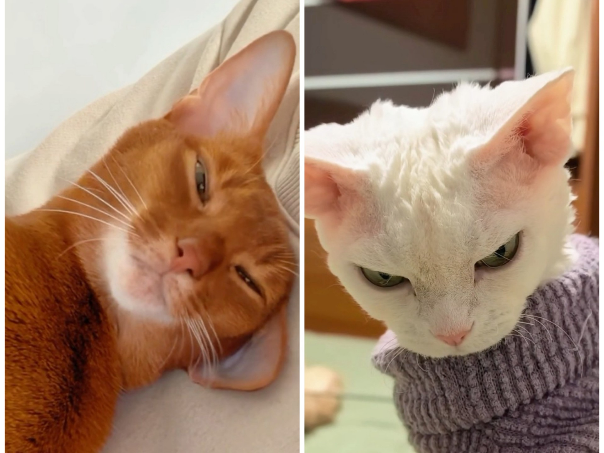 | 8.2万 | 2025-10-31 |
| [二哈老师：同样是柴犬，一个天才，一个智障！](https://www.bilibili.com/video/BV12dyiBdETL) |  | 16.3万 | 2025-10-31 |
| [人你不要走 耄耋知道错了](https://www.bilibili.com/video/BV1Y31NBJEqm) |  | 2.4万 | 2025-10-31 |
| [老大，不可以指窝喵](https://www.bilibili.com/video/BV1SUyiBhEBj) | 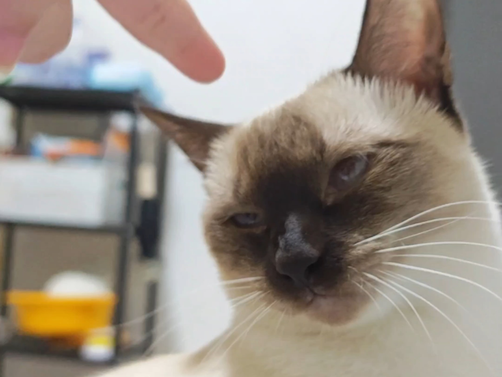 | 3.5万 | 2025-10-31 |
| [哈基米这个玩雪](https://www.bilibili.com/video/BV1hryeBbEQd) | 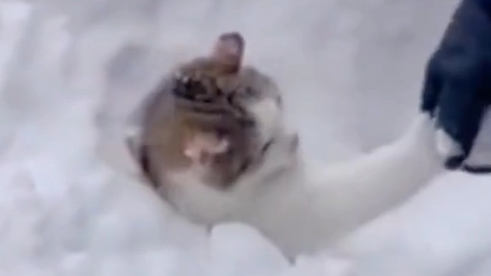 | 891 | 2025-10-30 |
| [【哈基米音乐】东汉末年分基米，哈气连天不休（基操）](https://www.bilibili.com/video/BV1cnyaBNEY7) |  | 185 | 2025-10-30 |
| [哈基米起床（琴房版）](https://www.bilibili.com/video/BV1ZWyaBwERD) | 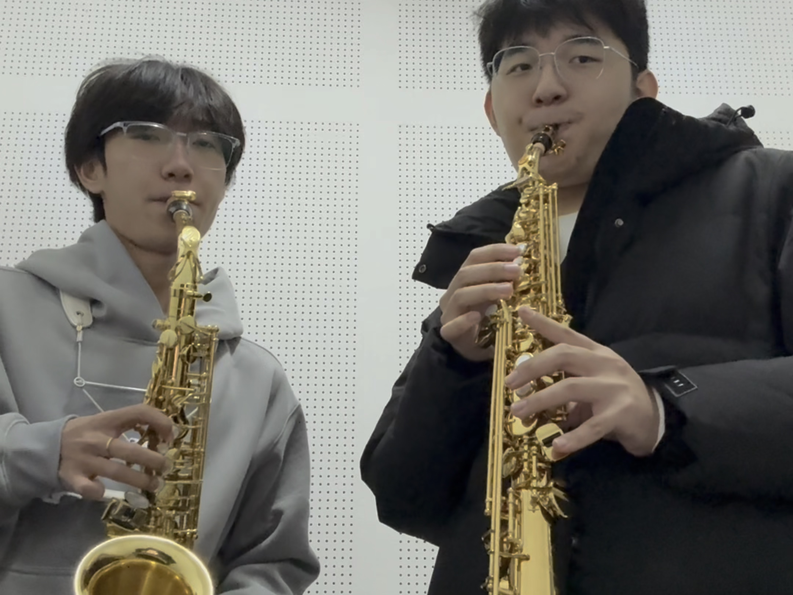 | 229 | 2025-10-30 |
| [哈基米](https://www.bilibili.com/video/BV1DqyaBpEsA) | 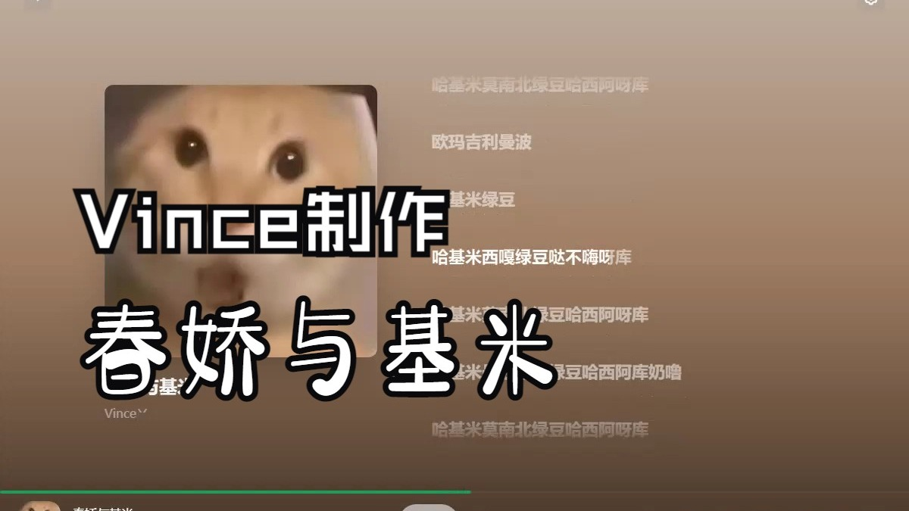 | 207 | 2025-10-30 |
| [哈？基米某](https://www.bilibili.com/video/BV1VvyaBREFm) |  | 1811 | 2025-10-30 |
| [【哈基米FM】“到底要哈多少遍才能释怀”🐱Episode 33](https://www.bilibili.com/video/BV19EyWBYEDg) |  | 6305 | 2025-10-30 |
| [原 汤 化 原 食](https://www.bilibili.com/video/BV1VDyhBREMo) |  | 2.8万 | 2025-10-30 |
| [一小时单曲循环~《伯虎说》哈基米版 の【纯享版】](https://www.bilibili.com/video/BV1vMyhBWEvj) |  | 2.0万 | 2025-10-30 |
| [会旋转的哈基米曼波（Oiiai）](https://www.bilibili.com/video/BV1n6yhBaEMn) | 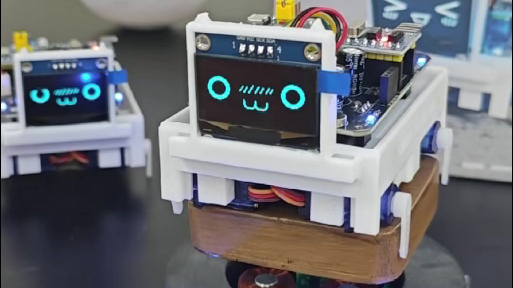 | 1534 | 2025-10-30 |
| [埃及基米](https://www.bilibili.com/video/BV1bjybBgExo) | 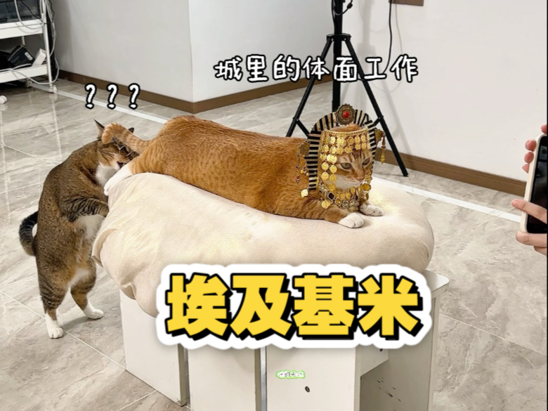 | 6150 | 2025-10-30 |
| [谁家神人举着鼠鼠唱找基米（找自己）](https://www.bilibili.com/video/BV1fDyxBJEGU) |  | 3123 | 2025-10-30 |
| [Sora2 Ai彻底失控！](https://www.bilibili.com/video/BV13my4B3EkQ) | 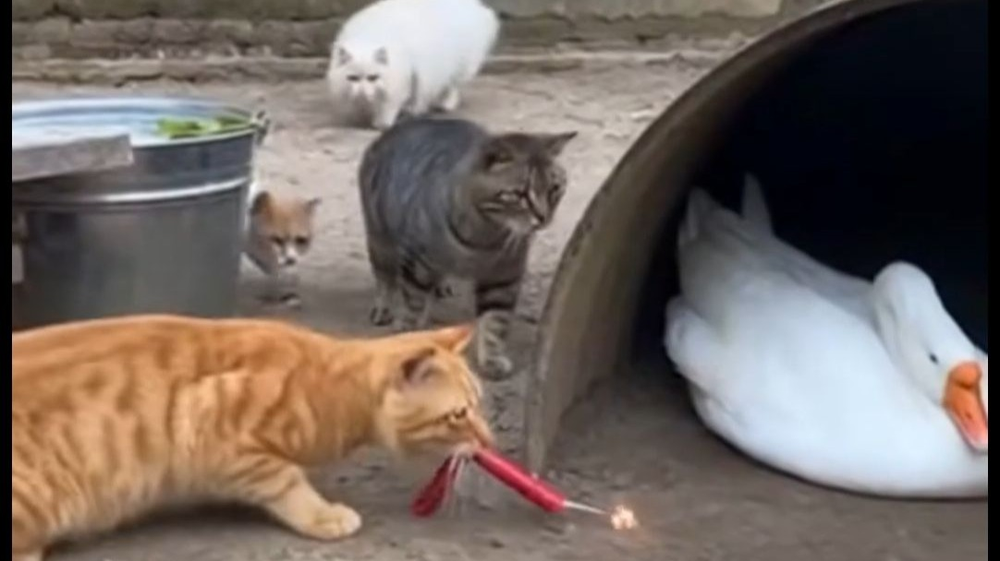 | 4.9万 | 2025-10-30 |
| [精选哈基米版邓紫棋歌曲改编，四首之中，总有你的最爱！](https://www.bilibili.com/video/BV1YwysBPEMV) |  | 326 | 2025-10-30 |
| [【星痕共鸣】达雅代言哈基米南北绿豆（sora）](https://www.bilibili.com/video/BV1huy4BTEBx) |  | 326 | 2025-10-30 |
| [【哈基米音乐】😿你就在对岸等我勇敢😿走马（原曲：陈粒）](https://www.bilibili.com/video/BV1hyysBvEAn) |  | 1227 | 2025-10-29 |
| [笑死，哈基米音乐太适合小菲了【3D】](https://www.bilibili.com/video/BV1zDyWBrEcy) |  | 1135 | 2025-10-29 |
| [【蕪楽chupa】日本妹妹看《让世界感受哈基米》，你们到底有多喜欢哈基米啊！](https://www.bilibili.com/video/BV1BSyWBGEb2) |  | 5920 | 2025-10-29 |
| [麻，他们都说我胖](https://www.bilibili.com/video/BV1tVysBdEAJ) | 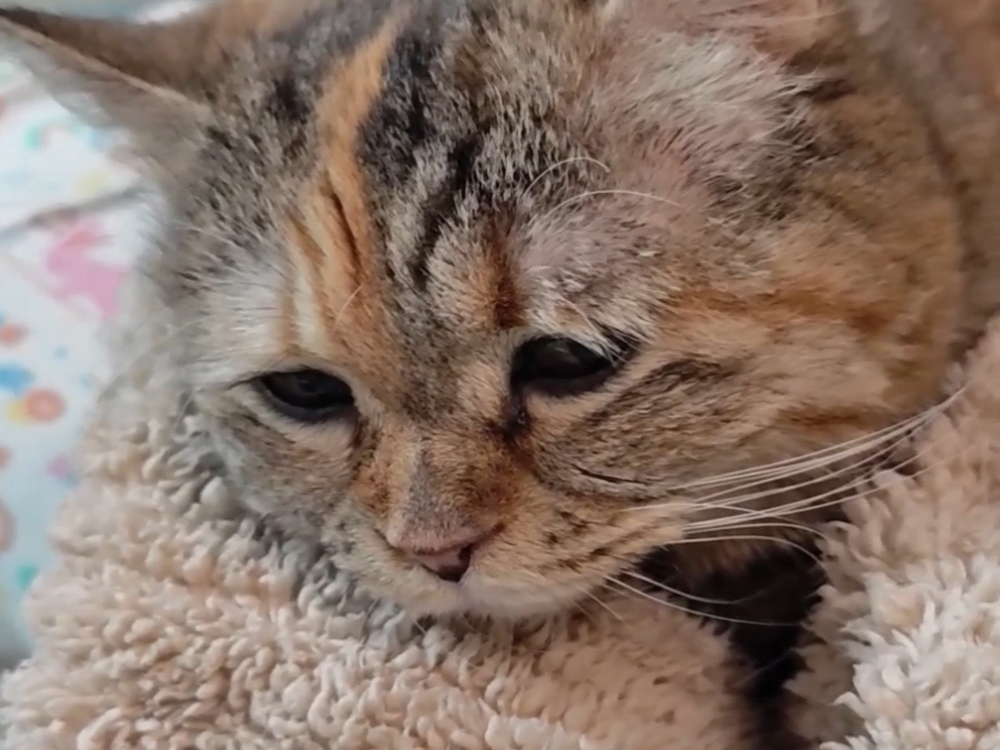 | 7.9万 | 2025-10-29 |
| [［哈基米音乐］哈王症](https://www.bilibili.com/video/BV1kxySB9Eca) |  | 359 | 2025-10-29 |
| [谁懂北舞考试抽到哈基咪之歌的救赎感！哈哈哈哈！](https://www.bilibili.com/video/BV17Qy2BgEic) |  | 38.7万 | 2025-10-29 |
| [⚡️ 姬 你 太 美 ⚡](https://www.bilibili.com/video/BV1NwyzBhEWC) |  | 280.4万 | 2025-10-28 |
| [盘点近期网络热梗？寿司爱吃哆啦a梦、万梗图](https://www.bilibili.com/video/BV1nDyzBoESi) |  | 2.1万 | 2025-10-28 |
| [盘点哈基米音乐十大最绝金曲！](https://www.bilibili.com/video/BV1LkyBB5Ebw) |  | 882 | 2025-10-28 |
| [希望与哈基的平原](https://www.bilibili.com/video/BV17fyzBHEzK) |  | 9874 | 2025-10-28 |
| [人！你可以摸咪的胸膛！](https://www.bilibili.com/video/BV1rUs1zCE9c) | 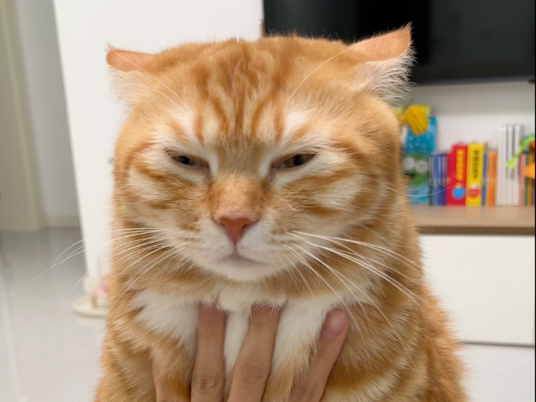 | 19.4万 | 2025-10-27 |
| [自己吓自己😂](https://www.bilibili.com/video/BV1Eos1zuEEt) | 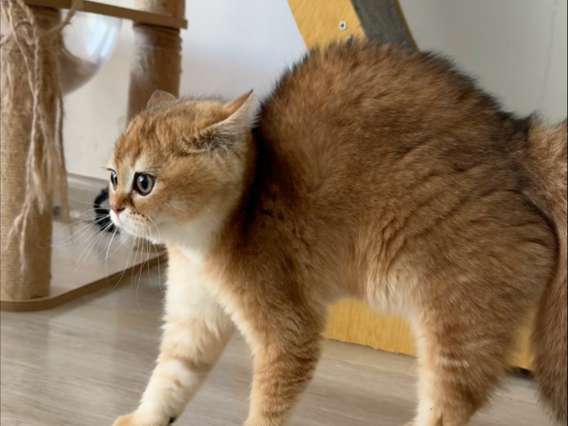 | 3.7万 | 2025-10-27 |
| [《找基米》](https://www.bilibili.com/video/BV19Ks2zwEbb) |  | 1354 | 2025-10-27 |
| [“盘点最近突然爆火的民歌改编曲”“中国人自己的PHONK（弥渡山歌 PHONK）”以及哈基米版本！](https://www.bilibili.com/video/BV1f6szzRE8P) |  | 3263 | 2025-10-26 |
| [【哈基米音乐】熙熙攘攘我们的哈基冰](https://www.bilibili.com/video/BV19Xszz2ESt) |  | 820 | 2025-10-26 |
| [《爱错》哈基米版](https://www.bilibili.com/video/BV1pRxAzYEqT) | 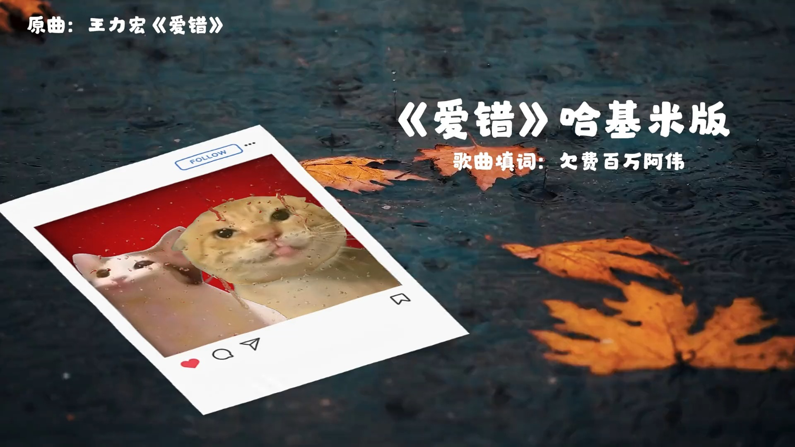 | 160 | 2025-10-26 |
| [《when 哈基米&#x27;s gone》2025.10.25](https://www.bilibili.com/video/BV1NNsfzHED8) |  | 944 | 2025-10-25 |
| [别让猫咪玩枪](https://www.bilibili.com/video/BV1Nwsoz1EsQ) | 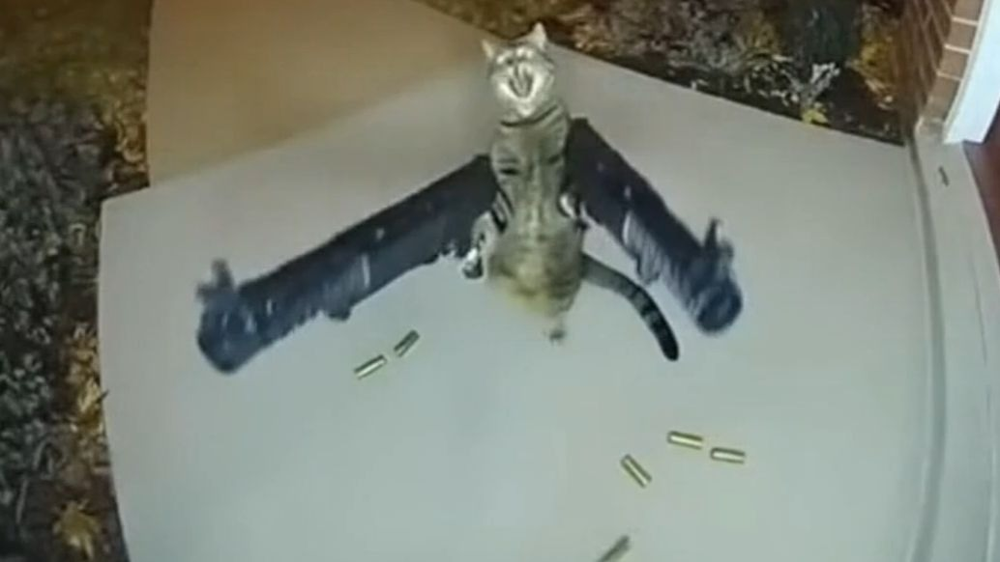 | 3.1万 | 2025-10-25 |
| [《当你穿越到女频》](https://www.bilibili.com/video/BV12RsdzJEvk) |  | 253.1万 | 2025-10-25 |
| [草帽小子来了](https://www.bilibili.com/video/BV1yzsnzCEn8) |  | 45.1万 | 2025-10-24 |
| [#猫咪洗澡乖乖的 #猫咪的迷惑行为 #橘猫 #记录猫咪日常 #被迫营业的猫猫](https://www.bilibili.com/video/BV1L9snzPEZ9) | 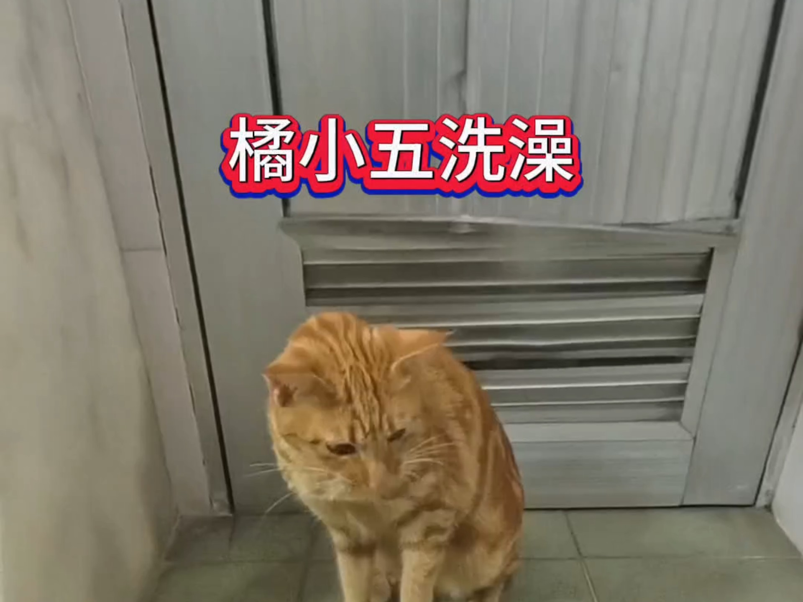 | 130.2万 | 2025-10-24 |
| [四川耗儿药歌好可爱!](https://www.bilibili.com/video/BV1dvsHzNE8r) |  | 111.7万 | 2025-10-24 |
| [🐔叮咚山的咚鸡美如水啊🐔](https://www.bilibili.com/video/BV1QrsJzpEvX) |  | 3.0万 | 2025-10-24 |
| [猫儿这个害怕](https://www.bilibili.com/video/BV1CMsVzQEg4) | 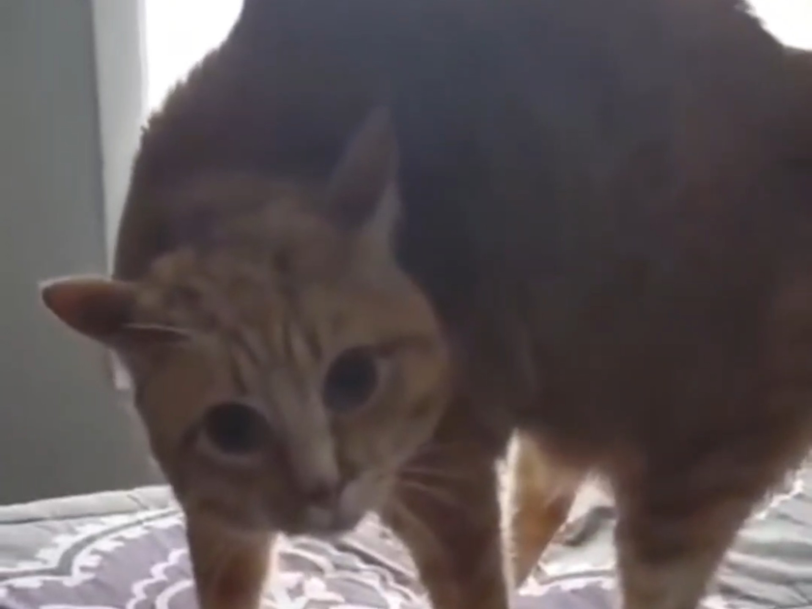 | 45.4万 | 2025-10-23 |
| [科比看自己的sora2整活AI视频!牢大受尽凌辱遭老罪Reaction](https://www.bilibili.com/video/BV1A8sqzRE6i) |  | 616.5万 | 2025-10-23 |
| [【哈基米音乐】《找基米》~哈基米曼波南北绿豆（找自己）](https://www.bilibili.com/video/BV1fyWdzAEXY) | 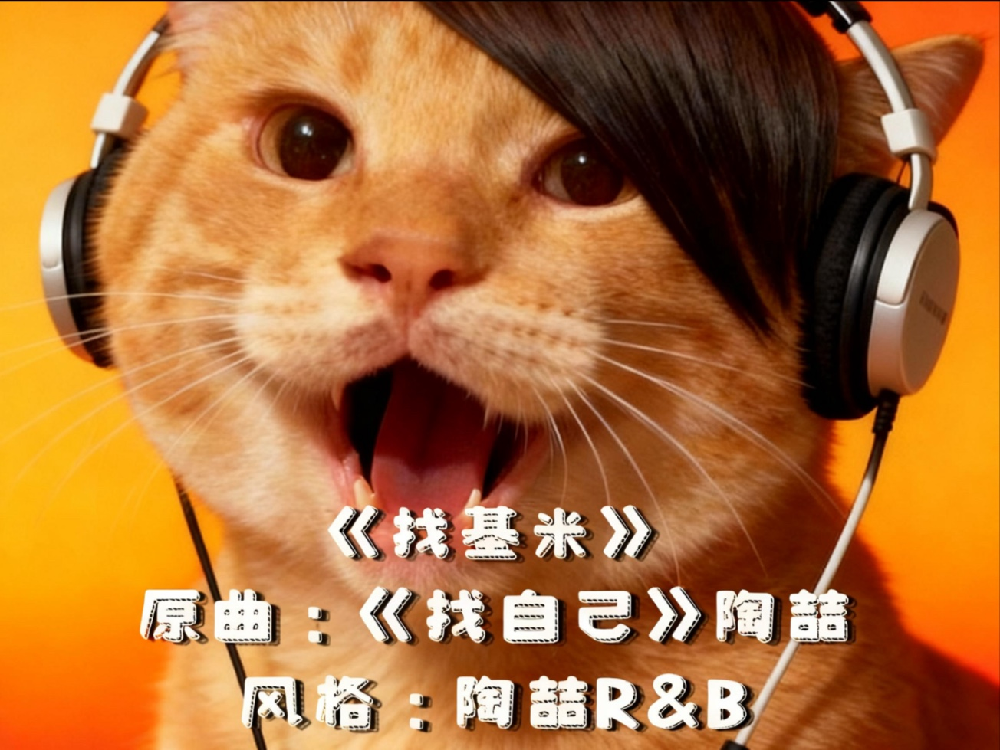 | 1553 | 2025-10-21 |
| [【真栗】直播中零帧起手《蓝莲哈》请谁来都没用了](https://www.bilibili.com/video/BV161W2zrEii) |  | 3.8万 | 2025-10-21 |
| [哈基米~哦~](https://www.bilibili.com/video/BV1sKsPzwE3A) |  | 1.1万 | 2025-10-19 |
| [1942年！保卫哈基米格勒！](https://www.bilibili.com/video/BV1WTsPzhEA1) |  | 531 | 2025-10-19 |
| [(;´༎ຶД༎ຶ)  没出息。](https://www.bilibili.com/video/BV1utsFzhEu4) |  | 61.4万 | 2025-10-19 |
| [【科比ASMR】享受着老大的声声man安心入睡吧~](https://www.bilibili.com/video/BV16iWhzaEwU) |  | 64.6万 | 2025-10-19 |
| [日推歌单｜【库里之歌】｜&quot;【投篮の小曲】【打瓦の小曲】【百战鼬の小曲】【逗逗迪迪小曲】&quot;](https://www.bilibili.com/video/BV138W8zmEdm) |  | 11.3万 | 2025-10-18 |
| [【叮咚鸡音乐】咚鸡说（伯虎说停顿卡点&amp;不完整版）](https://www.bilibili.com/video/BV1BjWtzUENg) |  | 3.5万 | 2025-10-18 |
| [《找自己》](https://www.bilibili.com/video/BV1ef4Wz5Erm) |  | 6.3万 | 2025-10-14 |
| [金牌打手已就位，永不炸单！](https://www.bilibili.com/video/BV1sf43zdEgX) | 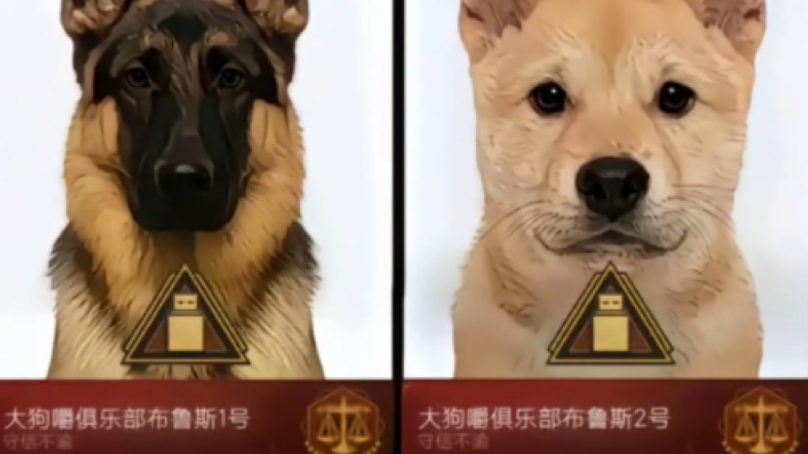 | 9.1万 | 2025-10-12 |
| [可爱小猫 谨慎观看](https://www.bilibili.com/video/BV1Tix6z3Ean) | 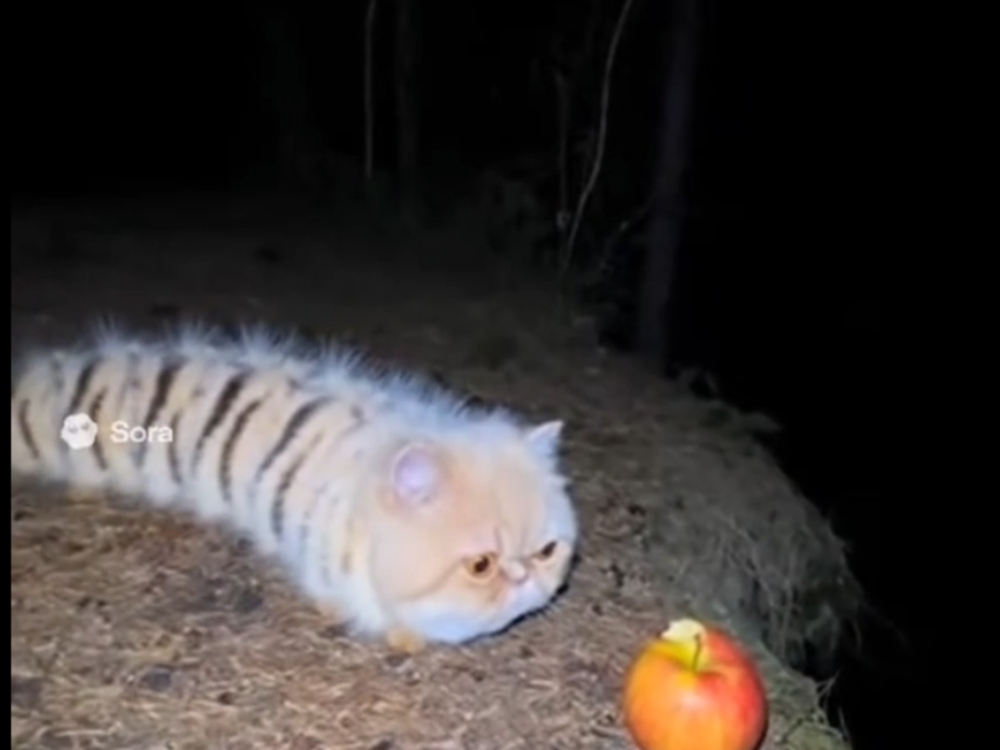 | 12.8万 | 2025-10-09 |
| [您似乎遇到了一些麻烦，正在为您安排金牌打手](https://www.bilibili.com/video/BV1HrxfzSE6J) | 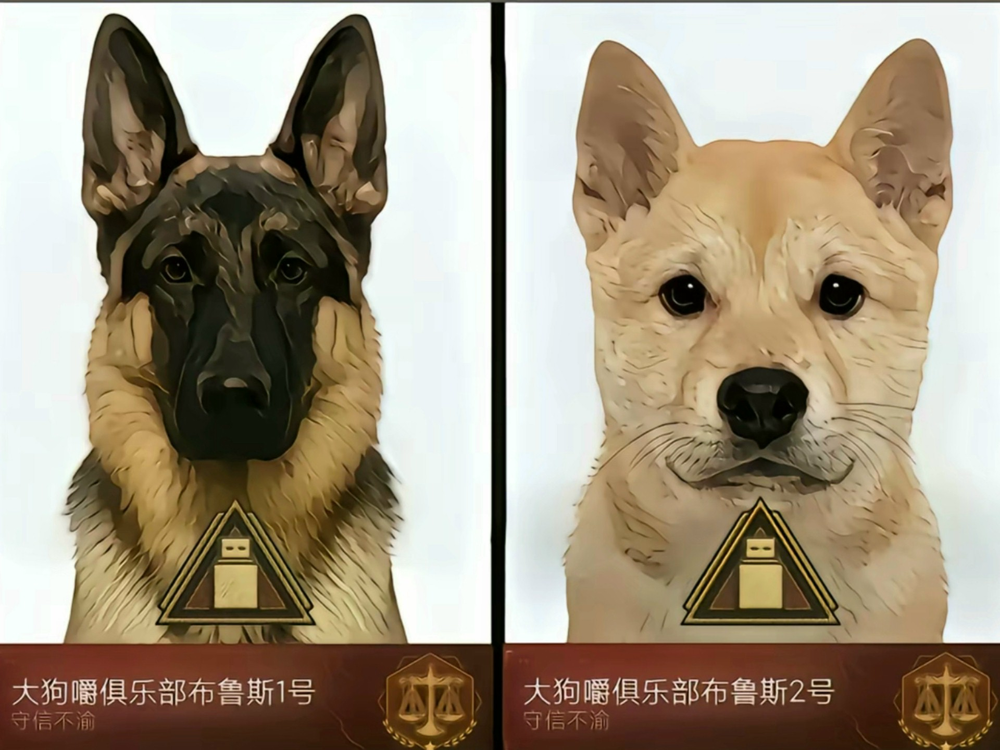 | 23.3万 | 2025-10-08 |
| [循环歌单｜“【智斗の小曲】【阳谋の小曲】乔治顶级阳谋这一块”【Whoopty2】](https://www.bilibili.com/video/BV1K3xxzwEY7) |  | 324.2万 | 2025-10-04 |
| [基米守国门，耄耋哈社稷！](https://www.bilibili.com/video/BV1RkHUzeE1r) |  | 5.5万 | 2025-09-10 |
| [铃：哈基米莫南北绿豆](https://www.bilibili.com/video/BV1xCeDzRE6K) |  | 108.9万 | 2025-08-28 |
| [猫儿这个忘恩负义——哈基米抽象集锦#1](https://www.bilibili.com/video/BV1jXuZzvE2h) |  | 4.3万 | 2025-07-20 |
| [🍯哈基米：Jody🍯](https://www.bilibili.com/video/BV1FiMozeE8d) |  | 6.1万 | 2025-07-13 |
| [王的凝视这一块](https://www.bilibili.com/video/BV1j1KHz9Ev2) | 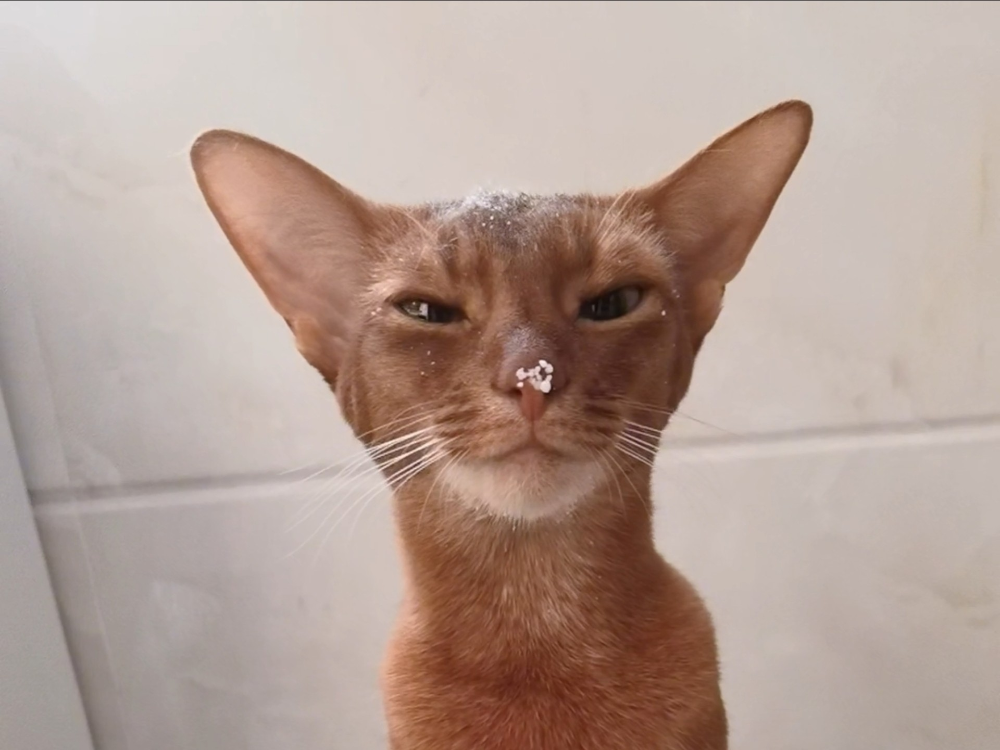 | 352.2万 | 2025-06-25 |
| [叮咚大道东上，为何无叮咚？——《叮咚大道东》](https://www.bilibili.com/video/BV1aVTDzwETo) | 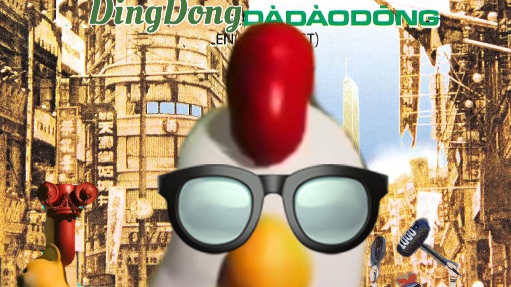 | 61.6万 | 2025-06-08 |
| [猫儿这个战斗爽](https://www.bilibili.com/video/BV1FwjHzJEzi) | 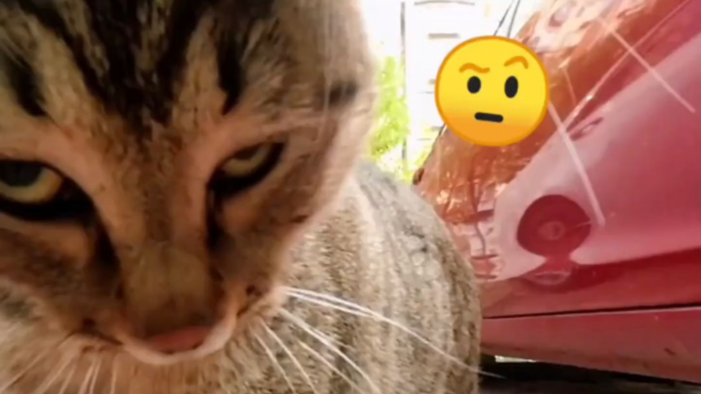 | 53.6万 | 2025-05-23 |
| [“太好了，是小猫咪”](https://www.bilibili.com/video/BV1vcJVzZEB9) | 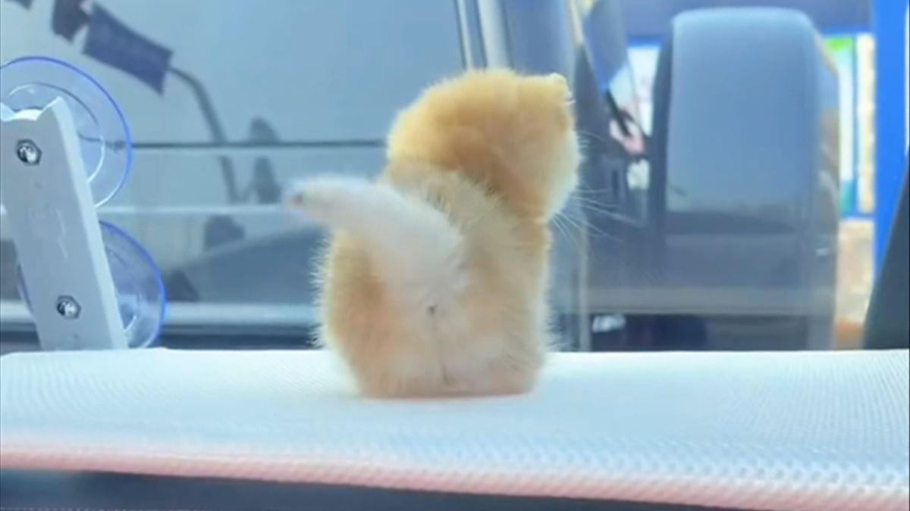 | 64.0万 | 2025-05-19 |
| [出山哈基米](https://www.bilibili.com/video/BV15TVHzNEpz) | 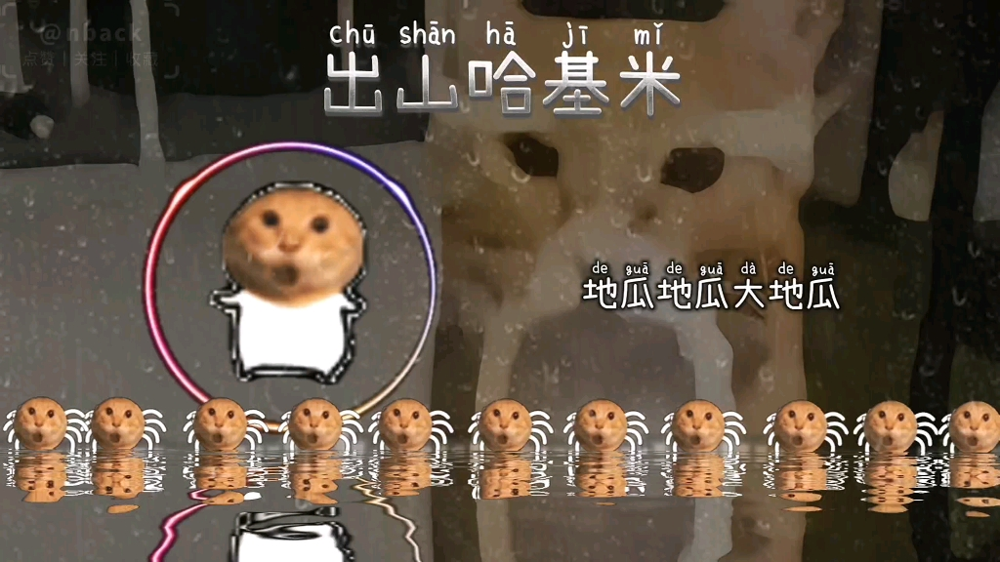 | 30.4万 | 2025-05-03 |
| [哈基米战歌，听哭十亿爱猫TV](https://www.bilibili.com/video/BV1GHhbegEfw) |  | 44.7万 | 2024-07-05 |

---
*最后更新: 2025-11-01 02:41:00 (自动生成)*
*数据来源: [Bilibili](https://www.bilibili.com)*

## 使用说明

运行以下命令更新视频列表:
```bash
python3 fetch_hajimi_videos.py
```
